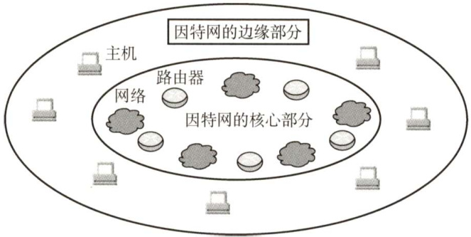
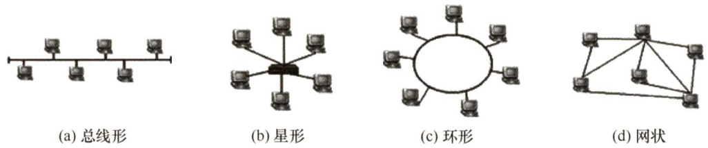
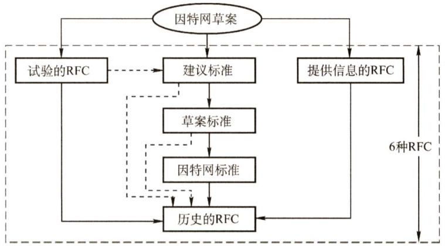
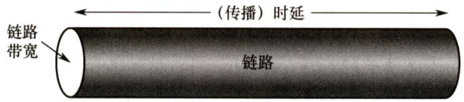

#### 1.1 计算机网络概述  

#### 1.1.1 计算机网络的概念  

一般认为，计算机网络是一个将分散的、具有独立功能的计算机系统，通过通信设备与线路连接起来，由功能完善的软件实现资源共享和信息传递的系统。简而言之，计算机网络就是一些互联的、自治的计算机系统的集合。  

在计算机网络发展的不同阶段，人们对计算机网络给出了不同的定义，这些定义反映了当时网络技术发展的水平。这些定义可分为以下三类。  

#### 1．广义观点  

这种观点认为，只要是能实现远程信息处理的系统或能进一步达到资源共享的系统，都是计算机网络。广义的观点定义了一个计算机通信网络，它在物理结构上具有计算机网络的雏形，但资源共享能力弱，是计算机网络发展的低级阶段。  

#### 2.资源共享观点  

这种观点认为，计算机网络是“以能够相互共享资源的方式互联起来的自治计算机系统的集合”。该定义包含三层含义： $\textcircled{1}$ 目的—资源共享； $\textcircled{2}$ 组成单元—分布在不同地理位置的多台独立的“自治计算机”； $\textcircled{3}$ 网络中的计算机必须遵循的统一规则—网络协议。该定义符合目前计算机网络的基本特征。  

#### 3.用户透明性观点  

这种观点认为，存在一个能为用户自动管理资源的网络操作系统，它能够调用用户所需要的资源，而整个网络就像一个大的计算机系统一样对用户是透明的。用户使用网络就像使用一台单一的超级计算机，无须了解网络的存在、资源的位置信息。用户透明性观点的定义描述了一个分布式系统，它是网络未来发展追求的目标。  

#### 1.1.2 计算机网络的组成  

从不同的角度，可以将计算机网络的组成分为如下几类。  

1）从组成部分上看，一个完整的计算机网络主要由硬件、软件、协议三大部分组成，缺一不可。硬件主要由主机（也称端系统）、通信链路（如双绞线、光纤）、交换设备（如路由器、交换机等）和通信处理机（如网卡）等组成。软件主要包括各种实现资源共享的软件和方便用户使用的各种工具软件（如网络操作系统、邮件收发程序、FTP程序、聊天程序等)。软件部分多属于应用层。协议是计算机网络的核心，如同交通规则制约汽车驾驶一样，协议规定了网络传输数据时所遵循的规范。  

2）从工作方式上看，计算机网络（这里主要指Intermet，即因特网）可分为边缘部分和核心部分。边缘部分由所有连接到因特网上、供用户直接使用的主机组成，用来进行通信（如传输数据、音频或视频）和资源共享；核心部分由大量的网络和连接这些网络的路由器组成，它为边缘部分提供连通性和交换服务。图1.1给出了这两部分的示意图。  

  
图1.1因特网的核心部分与边缘部分  

3）从功能组成上看，计算机网络由通信子网和资源子网组成。通信子网由各种传输介质、通信设备和相应的网络协议组成，它使网络具有数据传输、交换、控制和存储的能力，实现联网计算机之间的数据通信。资源子网是实现资源共享功能的设备及其软件的集合，向网络用户提供共享其他计算机上的硬件资源、软件资源和数据资源的服务。  

#### 1.1.3 计算机网络的功能  

计算机网络的功能很多，现今的很多应用都与网络有关。主要有以下五大功能  

#### 1．数据通信  

它是计算机网络最基本和最重要的功能，用来实现联网计算机之间各种信息的传输，并将分散在不同地理位置的计算机联系起来，进行统一的调配、控制和管理。例如，文件传输、电子邮件等应用，离开了计算机网络将无法实现。  

#### 2.资源共享  

资源共享可以是软件共享、数据共享，也可以是硬件共享。它使计算机网络中的资源互通有  

无、分工协作，从而极大地提高硬件资源、软件资源和数据资源的利用率。  

#### 3.分布式处理  

当计算机网络中的某个计算机系统负荷过重时，可以将其处理的某个复杂任务分配给网络中的其他计算机系统，从而利用空闲计算机资源以提高整个系统的利用率。  

#### 4.提高可靠性  

计算机网络中的各台计算机可以通过网络互为替代机。  

#### 5．负载均衡  

将工作任务均衡地分配给计算机网络中的各台计算机。  

除以上几大主要功能外，计算机网络还可以实现电子化办公与服务、远程教育、娱乐等功能，满足了社会的需求，方便了人们学习、工作和生活，具有巨大的经济效益。  

#### 1.1.4 计算机网络的分类  

#### 1．按分布范围分类  

1）广域网（WAN)。广域网的任务是提供长距离通信，运送主机所发送的数据，其覆盖范围通常是直径为几十千米到几千千米的区域，因而有时也称远程网。广域网是因特网的核心部分。连接广域网的各结点交换机的链路一般都是高速链路，具有较大的通信容量。  
2）城域网（MAN)。城域网的覆盖范围可以跨越几个街区甚至整个城市，覆盖区域的直径范围是 $5\sim50\mathrm{km}$ 。城域网大多采用以太网技术，因此有时也常并入局域网的范围讨论。  
3）局域网（LAN)。局域网一般用微机或工作站通过高速线路相连，覆盖范围较小，通常是直径为几十米到几千米的区域。局域网在计算机配置的数量上没有太多的限制，少的可以只有两台，多的可达几百台。传统上，局域网使用广播技术，而广域网使用交换技术。  
4）个人区域网（PAN)。个人区域网是指在个人工作的地方将消费电子设备（如平板电脑、智能手机等）用无线技术连接起来的网络，也常称为无线个人区域网（WPAN)，覆盖区域的直径约为 $10\mathrm{m}$ o  

注意：若中央处理器之间的距离非常近（如仅 $\mathrm{1m}$ 的数量级或甚至更小），则一般称为多处理器系统，而不称为计算机网络。  

#### 2.按传输技术分类  

1）广播式网络。所有联网计算机都共享一个公共通信信道。当一台计算机利用共享通信信道发送报文分组时，所有其他的计算机都会“收听”到这个分组。接收到该分组的计算机将通过检查目的地址来决定是否接收该分组。局域网基本上都采用广播式通信技术，广域网中的无线、卫星通信网络也采用广播式通信技术。2）点对点网络。每条物理线路连接一对计算机。若通信的两台主机之间没有直接连接的线路，则它们之间的分组传输就要通过中间结点进行接收、存储和转发，直至目的结点。是否采用分组存储转发与路由选择机制是点对点式网络与广播式网络的重要区别，广域网基本都属于点对点网络。  

#### 3.按拓扑结构分类  

网络拓扑结构是指由网中结点（路由器、主机等）与通信线路（网线）之间的几何关系（如总线形、环形）表示的网络结构，主要指通信子网的拓扑结构。  

按网络的拓扑结构，主要分为总线形、星形、环形和网状网络等，如图1.2所示。星形、总线形和环形网络多用于局域网，网状网络多用于广域网。  

  
图1.2几种不同的网络拓扑结构  

1）总线形网络。用单根传输线把计算机连接起来。总线形网络的优点是建网容易、增/减结点方便、节省线路。缺点是重负载时通信效率不高、总线任意一处对故障敏感。  
2）星形网络。每个终端或计算机都以单独的线路与中央设备相连。中央设备早期是计算机，现在一般是交换机或路由器。星形网络便于集中控制和管理，因为端用户之间的通信必须经过中央设备。缺点是成本高、中央设备对故障敏感。  
3）环形网络。所有计算机接口设备连接成一个环。环形网络最典型的例子是令牌环局域网。环可以是单环，也可以是双环，环中信号是单向传输的。  
4）网状网络。一般情况下，每个结点至少有两条路径与其他结点相连，多用在广域网中。其有规则型和非规则型两种。其优点是可靠性高，缺点是控制复杂、线路成本高。  
以上4种基本的网络拓扑结构可以互联为更复杂的网络。  

#### 4.按使用者分类  

1）公用网（PublicNetwork)。指电信公司出资建造的大型网络。“公用”的意思是指所有愿意按电信公司的规定交纳费用的人都可以使用这种网络，因此也称公众网。  
2）专用网（Private Network)。指某个部门为满足本单位特殊业务的需要而建造的网络。这种网络不向本单位以外的人提供服务。例如铁路、电力、军队等部门的专用网。  

#### 5.按交换技术分类  

交换技术是指各台主机之间、各通信设备之间或主机与通信设备之间为交换信息所采用的数据格式和交换装置的方式。按交换技术可将网络分为如下几种。  

1）电路交换网络。在源结点和目的结点之间建立一条专用的通路用于传送数据，包括建立连接、传输数据和断开连接三个阶段。最典型的电路交换网是传统电话网络。该类网络的主要特点是整个报文的比特流连续地从源点直达终点，好像是在一条管道中传送。优点是数据直接传送、时延小。缺点是线路利用率低、不能充分利用线路容量、不便于进行差错控制。  
2）报文交换网络。用户数据加上源地址、目的地址、校验码等辅助信息，然后封装成报文。整个报文传送到相邻结点，全部存储后，再转发给下一个结点，重复这一过程直到到达目的结点。每个报文可以单独选择到达目的结点的路径。报文交换网络也称存储-转发网络，主要特点是整个报文先传送到相邻结点，全部存储后查找转发表，转发到下一个结点。优点是可以较为充分地利用线路容量，可以实现不同链路之间不同数据传输速率的转换，可以实现格式转换，可以实现一对多、多对一的访问，可以实现差错控制。缺点是增大了资源开销（如辅助信息导致处理时间和存储资源的开销)，增加了缓冲时延，需要额外的控制机制来保证多个报文的顺序不乱序，缓冲区难以管理（因为报文的大小不确定，接收方在接收到报文之前不能预知报文的大小)。  

3）分组交换网络，也称包交换网络。其原理是，将数据分成较短的固定长度的数据块，在每个数据块中加上目的地址、源地址等辅助信息组成分组（包)，以存储-转发方式传输。其主要特点是单个分组（它只是整个报文的一部分）传送到相邻结点，存储后查找转发表，转发到下一个结点。除具备报文交换网络的优点外，分组交换网络还具有自身的优点：缓冲易于管理；包的平均时延更小，网络占用的平均缓冲区更少；更易于标准化；更适合应用。现在的主流网络基本上都可视为分组交换网络。  

#### 6．按传输介质分类  

传输介质可分为有线和无线两大类，因此网络可以分为有线网络和无线网络。有线网络又分为双绞线网络、同轴电缆网络等。无线网络又可分为蓝牙、微波、无线电等类型。  

#### ${^{*}1.1.5}$ 计算机网络的标准化工作  

计算机网络的标准化对计算机网络的发展和推广起到了极为重要的作用。  

因特网的所有标准都以RFC（RequestForComments）的形式在因特网上发布，但并非每个IFC 都是因特网标准，RFC要上升为因特网的正式标准需经过以下4个阶段。  

1）因特网草案（InternetDraft）。这个阶段还不是RFC文档。  
2）建议标准（ProposedStandard）。从这个阶段开始就成为RFC文档。  
3）草案标准（DraftStandard）。  
4）因特网标准（InternetStandard）。  

此外，还有试验的RFC和提供信息的RFC。各种RFC之间的关系如图1.3所示。  

  
图1.3各种RFC之间的关系  

在国际上，负责制定、实施相关网络标准的标准化组织众多，主要有如下几个：  

·国际标准化组织（ISO)。其制定的主要网络标准或规范有OSI参考模型、HDLC等。  
·国际电信联盟（ITU)。其前身为国际电话电报咨询委员会（CCITT)，其下属机构ITU-T制定了大量有关远程通信的标准。  
·国际电气电子工程师协会（IEEE)。世界上最大的专业技术团体，由计算机和工程学专业人士组成。IEEE在通信领域最著名的研究成果是802标准。  

#### 1.1.6 计算机网络的性能指标  

性能指标从不同方面度量计算机网络的性能。常用的性能指标如下。  

1）带宽（Bandwidth)。本来表示通信线路允许通过的信号频带范围，单位是赫兹（Hz）。而在计算机网络中，带宽表示网络的通信线路所能传送数据的能力，是数字信道所能传送的“最高数据传输速率”的同义语，单位是比特/秒（b/s）。  

2）时延（Delay)。指数据（一个报文或分组）从网络（或链路）的一端传送到另一端所需要的总时间，它由4部分构成：发送时延、传播时延、处理时延和排队时延。  

·发送时延。结点将分组的所有比特推向（传输）链路所需的时间，即从发送分组的第一个比特算起，到该分组的最后一个比特发送完毕所需的时间，因此也称传输时延。计算公式为  

发送时延 $\mathbf{\Sigma}=\mathbf{\Sigma}$ 分组长度/信道宽度  

·传播时延。电磁波在信道中传播一定的距离需要花费的时间，即一个比特从链路的一端传播到另一端所需的时间。计算公式为  

传播时延 $\mathbf{\Sigma}=\mathbf{\Sigma}$ 信道长度/电磁波在信道上的传播速率  

·处理时延。数据在交换结点为存储转发而进行的一些必要的处理所花费的时间。例如，分析分组的首部、从分组中提取数据部分、进行差错检验或查找适当的路由等。  
）排队时延。分组在进入路由器后要先在输入队列中排队等待处理。路由器确定转发端口后，还要在输出队列中排队等待转发，这就产生了排队时延。  

因此，数据在网络中经历的总时延就是以上4部分时延之和：  

总时延 $\mathbf{\Sigma}=\mathbf{\Sigma}$ 发送时延 $^+$ 传播时延 $^+$ 处理时延 $^+$ 排队时延  

注意：做题时，排队时延和处理时延一般可忽略不计（除非题目另有说明）。另外，对于高速链路，提高的仅是数据发送速率而非比特在链路上的传播速率。提高数据的发送速率只是为了减少数据的发送时延。  

3）时延带宽积。指发送端发送的第一个比特即将到达终点时，发送端已经发出了多少个比特，因此又称以比特为单位的链路长度，即时延带宽积 $\mathbf{\Sigma}=\mathbf{\Sigma}$ 传播时延 $\times$ 信道带宽。如图1.4所示，考虑一个代表链路的圆柱形管道，其长度表示链路的传播时延，横截面积表示链路带宽，则时延带宽积表示该管道可以容纳的比特数量。  

  
图1.4链路就像一条空心管道  

4）往返时延（Round-TripTime，RTT)。指从发送端发出一个短分组，到发送端收到来自接收端的确认（接收端收到数据后立即发送确认)，总共经历的时延。在互联网中，往返时延还包括各中间结点的处理时延、排队时延及转发数据时的发送时延。  
5）吞吐量（Throughput）。指单位时间内通过某个网络（或信道、接口）的数据量。吞吐量受网络带宽或网络额定速率的限制。  
6）速率（Speed)。网络中的速率是指连接到计算机网络上的主机在数字信道上传送数据的速率，也称数据传输速率、数据率或比特率，单位为 $\mathbf{b}/\mathbf{s}$ （比特/秒）（或bit/s，有时也写为bps)。数据率较高时，可用 $\mathbf{k}\mathbf{b}/\mathbf{s}$ （ $\mathbf{k}=10^{3}$ ）、 $\mathbf{M}\mathbf{b}/\mathbf{s}$ （ $\mathbf{M}=10^{6}$ ）或 $\mathrm{Gb/s}$ （ $G=10^{9}$ ）表示。在计算机网络中，通常把最高数据传输速率称为带宽。  
7）信道利用率。指出某一信道有百分之多少的时间是有数据通过的，即信道利用率 $\mathbf{\Sigma}=\mathbf{\Sigma}$ 有数据通过时间/（有 $^+$ 无)数据通过时间。  

#### 1.1.7 本节习题精选  

#### 一、单项选择题  

01．计算机网络可被理解为（）。  

A．执行计算机数据处理的软件模块B．由自治的计算机互联起来的集合体C．多个处理器通过共享内存实现的紧耦合系统D．用于共同完成一项任务的分布式系统  

02．计算机网络最基本的功能是（）。  

A．数据通信 B．资源共享C.分布式处理 D.信息综合处理  

03．下列不属于计算机网络功能的是（）。  

A.提高系统可靠性 B.提高工作效率C．分散数据的综合处理 D．使各计算机相对独立  

04.计算机网络系统的基本组成是（）。  

A.局域网和广域网 B．本地计算机网和通信网C.通信子网和资源子网 D.服务器和工作站  

05．在计算机网络中可以没有的是（）。  

A.客户机 B．服务器C.操作系统 D．数据库管理系统  

06.计算机网络的资源主要是指（）。  

A．服务器、路由器、通信线路与用户计算机B.计算机操作系统、数据库与应用软件C．计算机硬件、软件与数据D.Web服务器、数据库服务器与文件服务器  

07．计算机网络可分为通信子网和资源子网。下列属于通信子网的是（）。  

I．网桥ⅡI．交换机III．计算机软件IV．路由器  

A.I、Ⅱ、IV B.Ⅱ、I、IV C.I、IⅢ、IV D.I、Ⅱ、III  

08.下列设备属于资源子网的是（）。  

A．计算机软件 B．网桥 C．交换机 D.路由器  

09．计算机网络分为广域网、城域网和局域网，其划分的主要依据是（）。  

A.网络的作用范围 B.网络的拓扑结构C.网络的通信方式 D．网络的传输介质  

10．局域网和广域网的差异不仅在于它们所覆盖的范围不同，还主要在于它们（）  

A．所使用的介质不同 B．所使用的协议不同C.所能支持的通信量不同 D．所提供的服务不同  

11．下列说法中正确的是（）。  

A.在较小范围内布置的一定是局域网，而在较大范围内布置的一定是广域网  
B.城域网是连接广域网而覆盖园区的网络  
C.城域网是为淘汰局域网和广域网而提出的一种新技术  
D.局域网是基于广播技术发展起来的网络，广域网是基于交换技术发展起来的网络  

12.现在大量的计算机是通过诸如以太网这样的局域网连入广域网的，而局域网与广域网的互联是通过（）实现的。  

A．路由器 B．资源子网 C.桥接器 D.中继器  

13.计算机网络拓扑结构主要取决于它的（）。  

A．资源子网 B．路由器 C.通信子网 D．交换机  

14.广域网的拓扑结构通常采用（）。  

A.星形 B.总线形 C.网状 D.环形  

15.在 $n$ 个结点的星形拓扑结构中，有（）条物理链路。  

A.n-1 B.n C. $n(n-1)$ D. $n(n+1)/2$  

16．下列关于广播式网络的说法中，错误的是（）。  

A．共享广播信道 B．不存在路由选择问题C.可以不要网络层 D.不需要服务访问点  

17．下列（）是分组交换网络的缺点。  

A.信道利用率低 B.附加信息开销大C．传播时延大 D.不同规格的终端很难相互通信  

18．1968年6月，世界上出现的最早计算机网络是（）。  

A.Internet B. ARPAnet C.以太网 D.令牌环网  

#### 二、综合应用题  

01．假定有一个通信协议，每个分组都引入100字节的开销用于头和成帧。现在使用这个协议发送 ${10}^{6}$ 字节的数据，然而在传送的过程中有一个字节被破坏，因而包含该字节的那个分组被丢弃。试对于1000字节和20000字节的分组的有效数据大小分别计算“开销 $^+$ 丢失”字节的总数目。分组数据大小的最佳值是多少？  

02．考虑一个最大距离为 $2\mathrm{km}$ 的局域网，当带宽为多大时，传播延时（传播速率为 $2{\times}10^{8}\mathrm{m/s}$ ）等于100B分组的发送延时？对于512B分组结果又当如何？  

03．在两台计算机之间传输一个文件有两种可行的确认策略。第一种策略把文件截成分组，接收方逐个确认分组，但就整体而言，文件没有得到确认。第二种策略不确认单个分组，但当文件全部收到后，对整个文件予以确认。请讨论这两种方式的优缺点。  

04.试在下列条件下比较电路交换和分组交换。要传送的报文共 $x$ 比特。从源点到终点共经过 $k$ 段链路，每段链路的传播时延为 $d$ 秒，数据传输速率为 $b$ 比特/秒。在电路交换时电路的建立时间为 $s$ 秒。在分组交换时分组长度为 $p$ 比特，且各结点的排队等待时间可忽略不计。问在怎样的条件下，分组交换的时延比电路交换的时延要小？（提示：画草图观察 $k$ 段链路共有几个结点。）  

05．在上题的分组交换网中，设报文长度和分组长度分别为 $x$ 和 $p+h$ 比特，其中 $p$ 为分组的数据部分的长度，而 $h$ 为每个分组所带控制信息r固定长度，与 $p$ 的大小无关。通信的两端共经过 $k$ 段链路。链路的数据传输速率为 $b$ 比特/秒，传播时延、结点的排队时延和处理时延均可忽略不计。若欲使总的时延为最小，问分组的数据部分长度 $p$ 应取多大？  

06.在下列情况下，计算传送1000KB文件所需要的总时间，即从开始传送时起直到文件的最后一位到达目的地为止的时间。假定往返时间RTT为 $100\mathrm{{ms}}$ ，一个分组是1KB（即1024B）的数据，在开始传送整个文件数据之前进行的起始握手过程需要2RTT的时间。  

1）带宽是 $1.5\mathrm{Mb/s}$ ，数据分组可连续发送。  
2）带宽是 $1.5\mathrm{Mb/s}$ ，但在发送完每个数据分组后，必须等待一个RTT（等待来自接收方的确认）才能发送下一个数据分组。  
3）假设带宽是无限大的值，即我们取发送时间为0，并在等待每个RTT后可以发送多达20个分组。  

07．有两个网络，它们都提供可靠的面向连接的服务，一个提供可靠的字节流，另一个提供可靠的报文流。请问两者是否相同？为什么？  

#### 1.1.8 答案与解析  

#### 一、单项选择题  

01.B  

计算机网络是由自治计算机互联起来的集合体，其中包含着三个关键点：自治计算机、互联、集合体。自治计算机由软件和硬件两部分组成，能完整地实现计算机的各种功能；互联是指计算机之间能实现相互通信；集合体是指所有使用通信线路及互联设备连接起来的自治计算机的集合。选项C和D分别指多机系统和分布式系统。  

02.A  

计算机网络的功能包括：数据通信、资源共享、分布式处理、信息综合处理、负载均衡、提高可靠性等，但其中最基本的功能是数据通信功能，数据通信功能也是实现其他功能的基础。  

03.D  

计算机网络的三大主要功能是数据通信、资源共享及分布式处理。计算机网络使各计算机之间的联系更加紧密而非相对独立。  

04.C  

计算机网络从逻辑功能上可分为资源子网和通信子网两部分。  

05.D  

从物理组成上看，计算机网络由硬件、软件和协议组成，客户机是客户访问网络的出入口，服务器是提供服务、存储信息的设备，当然是必不可少的。只是，在P2P模式下，服务器不一定是固定的某台机器，但网络中一定存在充当服务器角色的计算机。操作系统是最基本的软件。数据库管理系统用于管理数据库，由于在一个网络上可以没有数据库系统，所以数据库管理系统可能没有。  

06.C  

选项A和D都属于硬件，选项B都属于软件，只有选项C最全面。网络资源包括硬件资源、软件资源和数据资源。  

07.A  

资源子网主要由计算机系统、终端、联网外部设备、各种软件资源和信息资源等组成。资源子网负责全网的数据处理业务，负责向网络用户提供各种网络资源与网络服务。通信子网由通信控制处理机、通信线路和其他通信设备组成，其任务是完成网络数据传输、转发等。  

由此可知，网桥、交换机和路由器都属于通信子网，只有计算机软件属于资源子网。  

08.A  

通信子网对应于OSI参考模型的下三层，包括物理层、数据链路层和网络层。通过通信子网互联在一起的计算机负责运行对信息进行处理的应用程序，它们是网络中信息流动的源和宿，向网络用户提供可共享的硬件、软件和信息资源，构成资源子网。网桥、交换机、路由器都属于通信子网中的硬件设备。  

09.A  

按分布范围分类：广域网、城域网、局域网、个人区域网。  
按拓扑结构分类：星形网络、总线形网络、环形网络、网状网络。  
按传输技术分类：广播式网络、点对点网络。  
按使用者分类：公用网、专用网。  
按数据交换技术分类：电路交换网、报文交换网、分组交换网。  
因此，根据网络的覆盖范围可将网络主要分为广域网、城域网和局域网。  

10.B  

广域网和局域网之间的差异不仅在于它们所覆盖范围的不同，还在于它们所采用的协议和网络技术的不同，广域网使用点对点等技术，局域网使用广播技术。  

11.D  

区别局域网与广域网的关键在于所采用的协议，而非覆盖范围，而且局域网技术的进步已使其覆盖的范围越来越大，达到几千米的范围。城域网可视为为了满足一定的区域需求，而将多个局域网互联的局域网，因此它仍属于以太网的范畴。最初的局域网采用广播技术，这种技术一直被沿用，而广域网最初使用的是交换技术，也一直被沿用。  

12.A  

中继器和桥接器通常是指用于局域网的物理层和数据链路层的联网设备。目前局域网接入广域网主要是通过称为路由器的互联设备来实现的。  

13.C  

解析请扫右侧二维码查阅。  

14.C广域网覆盖范围较广、结点较多，为了保证可靠性和可扩展性，通常需采用网状结构。  

15.A  

星形拓扑结构是用一个结点作为中心结点，其他n-1个结点直接与中心结点相连构成的网  

络。中心结点既可以是文件服务器，也可以是连接设备。常见的中心结点为集线器。  

16.D  

广播式网络共享广播信道（如总线)，通常是局域网的一种通信方式（局域网工作在数据链路层)，因此不需要网络层，因而也不存在路由选择问题。但数据链路层使用物理层的服务必须通过服务访问点实现。  

17.B  

分组交换要求把数据分成大小相当的小数据片，每片都要加上控制信息（如目的地址)，因而传送数据的总开销较多。相比其他交换方式，分组交换信道利用率高。传播时延取决于传播介质及收发双方的距离。对各种交换方式，不同规格的终端都很难相互通信，因此它不是分组交换的缺点。  

18.B  

ARPAnet是最早的计算机网络，它是因特网（Internet）的前身。  

#### 二、综合应用题  

01.【解答】  

设 $D$ 是分组数据的大小，需要的分组数目 $=10^{6}/\mathrm{D}$ ，开销 $=100{\times}N$ （被丢弃分组的头部也已计入开销)，因此“开销 $^+$ 丢失” $=100\times10^{6}/D+D$ 。当 $D=1000$ 时，“开销 $^+$ 丢失” $\mathbf{\tau}=100{\times}10^{6}/1000+1000=101000\mathbf{B}$ 。当 $D=20000$ 时，“开销 $^+$ 丢失” $\mathrm{\Omega}=100{\times}10^{6}/20000+20000=25000\mathrm{{B}},$ 。设“开销 $^+$ 丢失”字节总数目为 $y$ ， $y=10^{8}/D+D$ ，求全微分有 $\mathrm{d}y/\mathrm{d}D=1-10^{8}/D^{2}$ 。当 $D=10^{4}$ 时， $\mathrm{d}y/\mathrm{d}D=0$ ，所以分组数据大小的最佳值是10000B  

02.【解答】  

传播时延 $=2{\times}10^{3}\mathrm{m}/(2{\times}10^{8}\mathrm{m/s})=10^{-5}\mathrm{s}=10\upmu\mathrm{s}\mathrm{.}$  

1）分组大小为100B： 假设带宽大小为 $x$ ，要使得传播时延等于发送时延，带宽  

$$
x=100\mathrm{B}/10\upmu\mathrm{s}=10\mathrm{MB}/\mathrm{s}=80\mathrm{M}\mathrm{b}/\mathrm{s}
$$  

2）分组大小为512B：  

假设带宽大小为 $y$ ，要使得传播时延等于发送时延，带宽  

$$
y=512\mathrm{B}/10\upmu\mathrm{s}=51.2\mathrm{MB}/\mathrm{s}=409.6\mathrm{Mb}/\mathrm{s}
$$  

因此，带宽应分别等于 $80\mathbf{M}\mathbf{b}/\mathbf{s}$ 和 $409.6\mathrm{Mb}/\mathrm{s}$ 8  

03.【解答】  

如果网络容易丢失分组，那么对每个分组逐一进行确认较好，此时仅重传丢失的分组。另一方面，如果网络高度可靠，那么在不发生差错的情况下，仅在整个文件传送的结尾发送一次确认，从而减少了确认次数，节省了带宽。不过，即使只有单个分组丢失，也要重传整个文件。  

04.【解答】  

由于忽略排队时延，因此电路交换时延 $\mathbf{\Sigma}=\mathbf{\Sigma}$ 连接时延 $^+$ 发送时延 $^+$ 传播时延，分组交换时  

延 $\mathbf{\Sigma}=\mathbf{\Sigma}$ 发送时延 $^+$ 传播时延。  

显然，二者的传播时延都为 $k d$ 。对电路交换，由于不采用存储转发技术，虽然是 $k$ 段链路，连接后没有存储转发的时延，因此发送时延 $\mathbf{\Sigma}=\mathbf{\Sigma}$ 数据块长度/信道带宽 ${\bf\Pi}={\boldsymbol{x}}/b$ ，从而电路交换总时延为  

$$
s+x/b+k d
$$  

对于分组交换，设共有 $n$ 个分组，由于采用存储转发技术，一个站点的发送时延为 $\scriptstyle t=p/b$ o显然，数据在信道中经过 $k-1$ 个 $t$ 时间的流动后，从第 $k$ 个 $t$ 开始，每个 $t$ 时间段内将有一个分组到达目的站（把传播时延和发送时延分开讨论后，这里不再考虑传播时延)，从而 $n$ 个分组的发送时延为 $(k-1)t+n t=(k-1)p/b+n p/b$ ，分组交换的总时延为  

$$
k d+(k-1)p/b+n p/b
$$  

比较式（1）和式（2）可知，要使分组交换时延小于电路交换时延，要求  

$$
k d+(k-1)p/b+n p/b<s+x/b+k d
$$  

对于分组交换， $n p{\approx}x$ ， $(k-1)p/b<s$ 时，分组交换总时延小于电路交换总时延。  

05.【解答】  

应用上题的结论，分组交换时延为 $D=(x/p){\times}((p+h)/b)+(k-1){\times}(p+h)/b$ ， $D$ 对 $p$ 求导后，令其值等于0，求得 $p=\sqrt{\left(x h\right)/\left(k-1\right)}$ 。  

06.【解答】  

提示：前面提到过，如果题目没有说考虑排队时延，那么处理时延也无须考虑。  

1）由提示可知，总时延 $\mathbf{\Sigma}=\mathbf{\Sigma}$ 发送时延 $^+$ 传播时延 $^+$ 握手时延，其中握手时延是题目增加的。两个起始的RTT（握手）： $100{\times}2=200\mathrm{ms}$ ，传播时间： $\mathrm{RTT}/2=100/2=50\mathrm{ms}$ ，1KB =8bit×1024 =8192bit，发送时间：1000KB/(1.5Mb/s)=8192000bit/(1500000b/s)=5.46s，所以总时间等于 $0.2+5.46+0.05=5.71{\mathrm{s}}$ 0  

2）在上一小题答案的基础上再增加999 个RTT，总时间为 $5.71+999\times0.1=105.61\mathrm{s}$ 。  

注意：1）中的发送时间是所有分组的发送时间之和。  

3）由于发送时延为0，只需计算传播时延。由于每个分组为1KB，所以大小为1000KB的文件应分成 $1000\mathrm{KB}/1\mathrm{KB}=1000$ 个分组。由于每个RTT后可发送20个分组，所以共需 $1000/20=50\$ 次， $50-1=49$ 个RTT，最后一个分组到达目的地仅需0.5RTT（注意，在本次等待的RTT 中一定包含了上次传输的传输时延，所以不要认为还需要另外计算传输时延)，总时间为 $2{\times}\mathrm{RTT}$ （握手时间） $\mathrm{\Omega}+49\mathrm{RTT}+0.5\mathrm{RTT}=51.5\mathrm{RTT}=$ $0.1{\times}51.5=5.15\mathrm{s}$ 0  

07.【解答】  

不相同。在报文流中，网络保持对报文边界的跟踪；而在字节流中，网络不进行这样的跟踪。例如，一个进程向一条连接写了1024B，稍后又写了1024B，那么接收方共读了2048B。对于报文流，接收方将得到两个报文，每个报文1024B。而对于字节流，报文边界不被识别，接收方将全部2048B作为一个整体，在此已经体现不出原先有两个不同报文的事实。