### 1.2 计算机网络体系结构与参考模型  

#### 1.2.1 计算机网络分层结构  

两个系统中实体间的通信是一个很复杂的过程，为了降低协议设计和调试过程的复杂性，也为了便于对网络进行研究、实现和维护，促进标准化工作，通常对计算机网络的体系结构以分层的方式进行建模。  

我们把计算机网络的各层及其协议的集合称为网络的体系结构（Architecture）。换言之，计算机网络的体系结构就是这个计算机网络及其所应完成的功能的精确定义，它是计算机网络中的层次、各层的协议及层间接口的集合。需要强调的是，这些功能究竟是用何种硬件或软件完成的，则是一个遵循这种体系结构的实现（Implementation）问题。体系结构是抽象的，而实现是具体的，是真正在运行的计算机硬件和软件。  

计算机网络的体系结构通常都具有可分层的特性，它将复杂的大系统分成若干较容易实现的层次。分层的基本原则如下：  

1）每层都实现一种相对独立的功能，降低大系统的复杂度。  
2）各层之间界面自然清晰，易于理解，相互交流尽可能少。  
3）各层功能的精确定义独立于具体的实现方法，可以采用最合适的技术来实现。  
4）保持下层对上层的独立性，上层单向使用下层提供的服务。  
5）整个分层结构应能促进标准化工作。  

由于分层后各层之间相对独立，灵活性好，因而分层的体系结构易于更新（替换单个模块)，易于调试，易于交流，易于抽象，易于标准化。但层次越多，有些功能在不同层中难免重复出现，产生额外的开销，导致整体运行效率越低。层次越少，就会使每层的协议太复杂。因此，在分层时应考虑层次的清晰程度与运行效率间的折中、层次数量的折中。  

依据一定的规则，将分层后的网络从低层到高层依次称为第1层、第2层….第 $n$ 层，通常还为每层取一个特定的名称，如第1层的名称为物理层。  

在计算机网络的分层结构中，第 $n$ 层中的活动元素通常称为第 $n$ 层实体。具体来说，实体指任何可发送或接收信息的硬件或软件进程，通常是一个特定的软件模块。不同机器上的同一层称为对等层，同一层的实体称为对等实体。第 $n$ 层实体实现的服务为第 $n+1$ 层所利用。在这种情况下，第 $n$ 层称为服务提供者，第 $n+1$ 层则服务于用户。  

每一层还有自己传送的数据单位，其名称、大小、含义也各有不同。  

在计算机网络体系结构的各个层次中，每个报文都分为两部分：一是数据部分，即SDU；二是控制信息部分，即PCI，它们共同组成PDU。  

服务数据单元（SDU)：为完成用户所要求的功能而应传送的数据。第 $n$ 层的服务数据单元记为 $n$ -SDU。  

协议控制信息（PCI)：控制协议操作的信息。第 $n$ 层的协议控制信息记为 $n$ -PCI。  

协议数据单元（PDU)：对等层次之间传送的数据单位称为该层的PDU。第 $n$ 层的协议数据单元记为 $n$ -PDU。在实际的网络中，每层的协议数据单元都有一个通俗的名称，如物理层的PDU称为比特，数据链路层的PDU称为帧，网络层的PDU称为分组，传输层的PDU称为报文段。  

在各层间传输数据时，把从第 $n+1$ 层收到的PDU作为第 $n$ 层的SDU，加上第 $n$ 层的PCI，就变成了第 $n$ 层的PDU，交给第 $n-1$ 层后作为SDU发送，接收方接收时做相反的处理，因此可知三者的关系为 $n{\mathrm{-SDU}}+n{\mathrm{-PCI}}=n{\mathrm{-PDU}}=(n-1).$ -SDU，其变换过程如图1.5所示。  

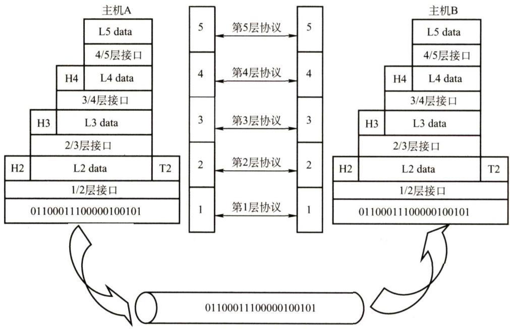  
图1.5网络各层数据单元的联系  

具体地，层次结构的含义包括以下几方面：  

1）第 $n$ 层的实体不仅要使用第 $n-1$ 层的服务来实现自身定义的功能，还要向第 $n+1$ 层提供本层的服务，该服务是第 $n$ 层及其下面各层提供的服务总和。  
2）最低层只提供服务，是整个层次结构的基础；中间各层既是下一层的服务使用者，又是上一层的服务提供者；最高层面向用户提供服务。  
3）上一层只能通过相邻层间的接口使用下一层的服务，而不能调用其他层的服务；下一层所提供服务的实现细节对上一层透明。  
4）两台主机通信时，对等层在逻辑上有一条直接信道，表现为不经过下层就把信息传送到对方。  

#### 1.2.2 计算机网络协议、接口、服务的概念  

#### 1.协议  

协议，就是规则的集合。在网络中要做到有条不紊地交换数据，就必须遵循一些事先约定好的规则。这些规则明确规定了所交换的数据的格式及有关的同步问题。这些为进行网络中的数据交换而建立的规则、标准或约定称为网络协议（NetworkProtocol)，它是控制两个（或多个）对等实体进行通信的规则的集合，是水平的。不对等实体之间是没有协议的，比如用 TCP/IP 协议栈通信的两个结点，结点A的传输层和结点B的传输层之间存在协议，但结点A的传输层和结点B的网络层之间不存在协议。网络协议也简称为协议。  

协议由语法、语义和同步三部分组成。语法规定了传输数据的格式；语义规定了所要完成的功能，即需要发出何种控制信息、完成何种动作及做出何种应答；同步规定了执行各种操作的条件、时序关系等，即事件实现顺序的详细说明。一个完整的协议通常应具有线路管理（建立、释放连接）、差错控制、数据转换等功能。  

#### 2.接口  

接口是同一结点内相邻两层间交换信息的连接点，是一个系统内部的规定。每层只能为紧邻的层次之间定义接口，不能跨层定义接口。在典型的接口上，同一结点相邻两层的实体通过服务访问点（ServiceAccessPoint，SAP）进行交互。服务是通过SAP提供给上层使用的，第 $n$ 层的SAP就是第 $n+1$ 层可以访问第 $n$ 层服务的地方。每个SAP都有一个能够标识它的地址。SAP是一个抽象的概念，它实际上是一个逻辑接口（类似于邮政信箱)，但和通常所说的两个设备之间的硬件接口是很不一样的。  

#### 3.服务  

服务是指下层为紧邻的上层提供的功能调用，它是垂直的。对等实体在协议的控制下，使得本层能为上一层提供服务，但要实现本层协议还需要使用下一层所提供的服务。  

上层使用下层所提供的服务时必须与下层交换一些命令，这些命令在OSI参考模型中称为服务原语。OSI参考模型将原语划分为4类：  

1）请求（Request)。由服务用户发往服务提供者，请求完成某项工作。  
2）指示（Indication）。由服务提供者发往服务用户，指示用户做某件事情。  
3）响应（Response)。由服务用户发往服务提供者，作为对指示的响应。  
4）证实（Confirmation）。由服务提供者发往服务用户，作为对请求的证实。  

这4类原语用于不同的功能，如建立连接、传输数据和断开连接等。有应答服务包括全部类原语，而无应答服务则只有请求和指示两类原语。  

4类原语的关系如图1.6所示。  

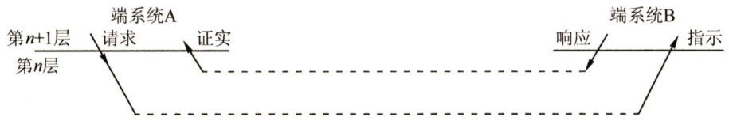  
图1.64类原语的关系  

一定要注意，协议和服务在概念上是不一样的。首先，只有本层协议的实现才能保证向上一层提供服务。本层的服务用户只能看见服务而无法看见下面的协议，即下面的协议对上层的服务用户是透明的。其次，协议是“水平的”，即协议是控制对等实体之间通信的规则。但服务是“垂直的”，即服务是由下层通过层间接口向上层提供的。另外，并非在一层内完成的全部功能都称为服务，只有那些能够被高一层实体“看得见”的功能才称为服务。  

协议、接口、服务三者之间的关系如图1.7所示。  

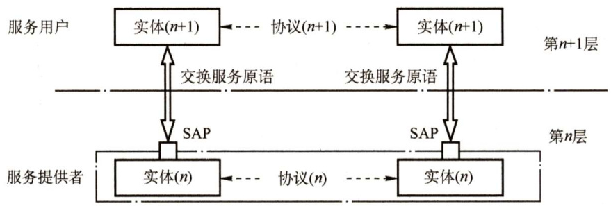  
图1.7协议、接口、服务三者之间的关系  

计算机网络提供的服务可按以下三种方式分类。  

（1）面向连接服务与无连接服务  

在面向连接服务中，通信前双方必须先建立连接，分配相应的资源（如缓冲区)，以保证通信能正常进行，传输结束后释放连接和所占用的资源。因此这种服务可以分为连接建立、数据传输和连接释放三个阶段。例如TCP就是一种面向连接服务的协议。  

在无连接服务中，通信前双方不需要先建立连接，需要发送数据时可直接发送，把每个带有目的地址的包（报文分组）传送到线路上，由系统选定路线进行传输。这是一种不可靠的服务。这种服务常被描述为“尽最大努力交付”（Best-Effort-Delivery)，它并不保证通信的可靠性。例如IP、UDP就是一种无连接服务的协议。  

#### （2）可靠服务和不可靠服务  

可靠服务是指网络具有纠错、检错、应答机制，能保证数据正确、可靠地传送到目的地。  

不可靠服务是指网络只是尽量正确、可靠地传送，而不能保证数据正确、可靠地传送到目的地，是一种尽力而为的服务。  

对于提供不可靠服务的网络，其网络的正确性、可靠性要由应用或用户来保障。例如，用户收到信息后要判断信息的正确性，如果不正确，那么用户要把出错信息报告给信息的发送者，以便发送者采取纠正措施。通过用户的这些措施，可以把不可靠的服务变成可靠的服务。  

注意：在一层内完成的全部功能并非都称为服务，只有那些能够被高一层实体“看得见”的功能才能称为服务。  

（3）有应答服务和无应答服务  

有应答服务是指接收方在收到数据后向发送方给出相应的应答，该应答由传输系统内部自动实现，而不由用户实现。所发送的应答既可以是肯定应答，也可以是否定应答，通常在接收到的数据有错误时发送否定应答。例如，文件传输服务就是一种有应答服务。  

无应答服务是指接收方收到数据后不自动给出应答。若需要应答，则由高层实现。例如，对于WWW服务，客户端收到服务器发送的页面文件后不给出应答。  

#### 1.2.3 ISO/OSI参考模型和TCP/IP模型  

#### 1.OSI参考模型  

国际标准化组织（ISO）提出的网络体系结构模型，称为开放系统互连参考模型（OSI/RM)，通常简称为OSI参考模型。OSI参考模型有7层，自下而上依次为物理层、数据链路层、网络层、传输层、会话层、表示层、应用层。低三层统称为通信子网，它是为了联网而附加的通信设备，完成数据的传输功能；高三层统称为资源子网，它相当于计算机系统，完成数据的处理等功能。传输层承上启下。OSI参考模型的层次结构如图1.8所示。  

下面详述OSI参考模型各层的功能。  

（1）物理层（Physical Layer）  

物理层的传输单位是比特，任务是透明的传输比特流，功能是在物理媒体上为数据端设备透明地传输原始比特流。  

物理层主要定义数据终端设备（DTE）和数据通信设备（DCE）的物理与逻辑连接方法，所以物理层协议也称物理层接口标准。由于在通信技术的早期阶段，通信规则称为规程（Procedure)，因此物理层协议也称物理层规程。  

物理层接口标准很多，如EIA-232C、EIA/TIARS-449、CCITT的X.21等。在计算机网络的复习过程中，不要忽略对各层传输协议的记忆，到了后期，读者对数据链路层、网络层、传输层和应用层的协议会比较熟悉，但往往容易忽视物理层的协议。  

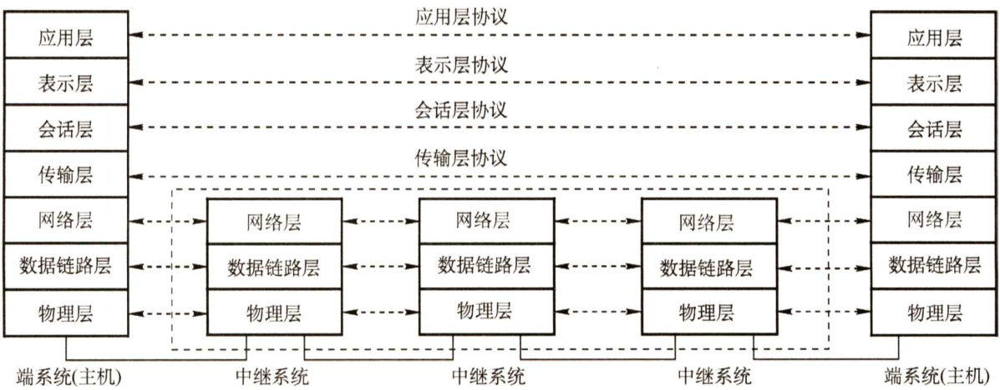  
图1.8OSI参考模型的层次结构  

图1.9表示的是两个通信结点及它们间的一段通信链路，物理层主要研究以下内容：  

$\textcircled{1}$ 通信链路与通信结点的连接需要一些电路接口，物理层规定了这些接口的一些参数，如机械形状和尺寸、交换电路的数量和排列等，例如，笔记本电脑上的网线接口，就是物理层规定的内容之一。  

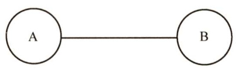  
图1.9两个通信结点及它们间的一段通信链路  

$\textcircled{2}$ 物理层也规定了通信链路上传输的信号的意义和电气特征。例如物理层规定信号A代表数字0，那么当结点要传输数字0时，就会发出信号A，当结点接收到信号A时，就知道自己接收到的实际上是数字0。  

注意，传输信息所利用的一些物理媒体，如双绞线、光缆、无线信道等，并不在物理层协议之内而在物理层协议下面。因此，有人把物理媒体当作第0层。  

（2）数据链路层（DataLinkLayer）  

数据链路层的传输单位是帧，任务是将网络层传来的IP数据报组装成帧。数据链路层的功能可以概括为成帧、差错控制、流量控制和传输管理等。  

由于外界噪声的干扰，原始的物理连接在传输比特流时可能发生错误。如图1.9所示，左边结点想向右边结点传输数字0，于是发出了信号A；但传输过程中受到干扰，信号A变成了信号B，而信号B又刚好代表1，右边结点接收到信号B时，就会误以为左边结点传送了数字1，从而发生差错。两个结点之间如果规定了数据链路层协议，那么可以检测出这些差错，然后把收到的错误信息丢弃，这就是差错控制功能。  

如图1.9所示，在两个相邻结点之间传送数据时，由于两个结点性能的不同，可能结点A发送数据的速率会比结点B接收数据的速率快，如果不加控制，那么结点B就会丢弃很多来不及接收的正确数据，造成传输线路效率的下降。流量控制可以协调两个结点的速率，使结点A发送数据的速率刚好是结点B可以接收的速率。  

广播式网络在数据链路层还要处理新的问题，即如何控制对共享信道的访问。数据链路层的一个特殊的子层—介质访问子层，就是专门处理这个问题的。  

典型的数据链路层协议有SDLC、HDLC、PPP、STP和帧中继等。  

（3）网络层（NetworkLayer）  

网络层的传输单位是数据报，它关心的是通信子网的运行控制，主要任务是把网络层的协议数据单元（分组）从源端传到目的端，为分组交换网上的不同主机提供通信服务。关键问题是对分组进行路由选择，并实现流量控制、拥塞控制、差错控制和网际互联等功能。  

如图1.10所示，结点A向结点B传输一个分组时，既可经过边a、c、g，也可经过边b、h，有很多条可以选择的路由，而网络层的作用就是根据网络的情况，利用相应的路由算法计算出一条合适的路径，使这个分组可以顺利到达结点B。  

流量控制与数据链路层的流量控制含义一样，都是协调A的发送速率和B的接收速率。  

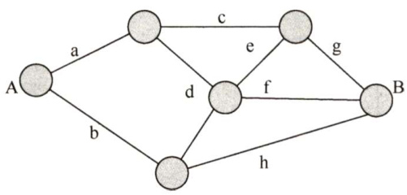  
图1.10某网络结构图  

差错控制是通信两结点之间约定的特定检错规则，如奇偶校验码，接收方根据这个规则检查接收到的分组是否出现差错，如果出现了差错，那么能纠错就纠错，不能纠错就丢弃，确保向上层提交的数据都是无误的。  

如果图1.10中的结点都处于来不及接收分组而要丢弃大量分组的情况，那么网络就处于拥塞状态，拥塞状态使得网络中的两个结点无法正常通信。网络层要采取一定的措施来缓解这种拥塞，这就是拥塞控制。  

因特网是一个很大的互联网，它由大量异构网络通过路由器（Router）相互连接起来。因特网的主要网络层协议是无连接的网际协议（IntermetProtocol，IP）和许多路由选择协议，因此因特网的网络层也称网际层或IP层。  

注意，网络层中的“网络”一词并不是我们通常谈及的具体网络，而是在计算机网络体系结构中使用的专有名词。  

网络层的协议有IP、IPX、ICMP、IGMP、ARP、RARP和OSPF等。  

（4）传输层（Transport Layer）  

传输层也称运输层，传输单位是报文段（TCP）或用户数据报（UDP)，传输层负责主机中两个进程之间的通信，功能是为端到端连接提供可靠的传输服务，为端到端连接提供流量控制、差错控制、服务质量、数据传输管理等服务。  

数据链路层提供的是点到点的通信，传输层提供的是端到端的通信，两者不同。通俗地说，点到点可以理解为主机到主机之间的通信，一个点是指一个硬件地址或IP地址，网络中参与通信的主机是通过硬件地址或IP地址标识的；端到端的通信是指运行在不同主机内的两个进程之间的通信，一个进程由一个端口来标识，所以称为端到端通信。  

使用传输层的服务，高层用户可以直接进行端到端的数据传输，从而忽略通信子网的存在。通过传输层的屏蔽，高层用户看不到子网的交替和变化。由于一台主机可同时运行多个进程，因此传输层具有复用和分用的功能。复用是指多个应用层进程可同时使用下面传输层的服务，分用是指传输层把收到的信息分别交付给上面应用层中相应的进程。  

传输层的协议有TCP、UDP。  

（5）会话层（SessionLayer）  

会话层允许不同主机上的各个进程之间进行会话。会话层利用传输层提供的端到端的服务，向表示层提供它的增值服务。这种服务主要为表示层实体或用户进程建立连接并在连接上有序地传输数据，这就是会话，也称建立同步（SYN)。  

会话层负责管理主机间的会话进程，包括建立、管理及终止进程间的会话。会话层可以使用校验点使通信会话在通信失效时从校验点继续恢复通信，实现数据同步。  

（6）表示层（PresentationLayer）  

表示层主要处理在两个通信系统中交换信息的表示方式。不同机器采用的编码和表示方法不同，使用的数据结构也不同。为了使不同表示方法的数据和信息之间能互相交换，表示层采用抽象的标准方法定义数据结构，并采用标准的编码形式。数据压缩、加密和解密也是表示层可提供的数据表示变换功能。  

（7）应用层（ApplicationLayer）  

应用层是OSI参考模型的最高层，是用户与网络的界面。应用层为特定类型的网络应用提供访问OSI参考模型环境的手段。因为用户的实际应用多种多样，这就要求应用层采用不同的应用协议来解决不同类型的应用要求，因此应用层是最复杂的一层，使用的协议也最多。典型的协议有用于文件传送的FTP、用于电子邮件的SMTP、用于万维网的HTTP等。  

#### 2.TCP/IP模型  

ARPA在研究ARPAnet时提出了TCP/IP模型，模型从低到高依次为网络接口层（对应OSI参考模型中的物理层和数据链路层）、网际层、传输层和应用层（对应OSI参考模型中的会话层、表示层和应用层)。TCP/IP由于得到广泛应用而成为事实上的国际标准。TCP/IP模型的层次结构及各层的主要协议如图1.11所示。  

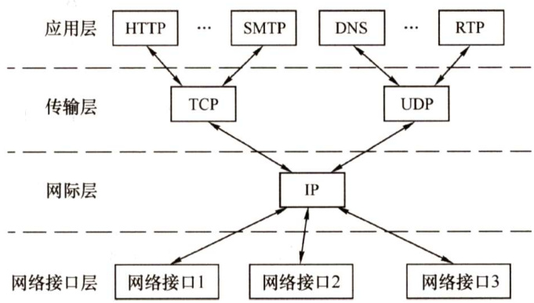  
图1.11TCP/IP模型的层次结构及各层的主要协议  

网络接口层的功能类似于OSI参考模型的物理层和数据链路层。它表示与物理网络的接口，但实际上TCP/IP本身并未真正描述这一部分，只是指出主机必须使用某种协议与网络连接，以便在其上传递IP分组。具体的物理网络既可以是各种类型的局域网，如以太网、令牌环网、令牌总线网等，也可以是诸如电话网、SDH、X.25、帧中继和ATM等公共数据网络。网络接口层的作用是从主机或结点接收IP分组，并把它们发送到指定的物理网络上。  

网际层（主机-主机）是TCP/IP体系结构的关键部分。它和OSI参考模型的网络层在功能上非常相似。网际层将分组发往任何网络，并为之独立地选择合适的路由，但它不保证各个分组有序地到达，各个分组的有序交付由高层负责。网际层定义了标准的分组格式和协议，即IP。当前采用的IP协议是第4版，即IPv4，它的下一版本是IPv6。  

传输层（应用-应用或进程-进程）的功能同样和OSI参考模型中的传输层类似，即使得发送端和目的端主机上的对等实体进行会话。传输层主要使用以下两种协议：  

1）传输控制协议（Transmission ControlProtocol，TCP）。它是面向连接的，数据传输的单位是报文段，能够提供可靠的交付。  
2）用户数据报协议（User DatagramProtocol，UDP)。它是无连接的，数据传输的单位是用户数据报，不保证提供可靠的交付，只能提供“尽最大努力交付”。  

应用层（用户-用户）包含所有的高层协议，如虚拟终端协议（Telnet）、文件传输协议（FTP）、域名解析服务（DNS）、电子邮件协议（SMTP）和超文本传输协议（HTTP)。  

由图1.11可以看出，IP协议是因特网中的核心协议；TCP/IP 可以为各式各样的应用提供服务（所谓的everythingoverIP），同时TCP/IP也允许IP协议在由各种网络构成的互联网上运行（所谓的IPover everything)。正因为如此，因特网才会发展到今天的规模。  

#### 3.TCP/IP模型与OSI参考模型的比较  

TCP/IP模型与OSI参考模型有许多相似之处。  

首先，二者都采取分层的体系结构，将庞大且复杂的问题划分为若干较容易处理的、范围较小的问题，而且分层的功能也大体相似。  

其次，二者都是基于独立的协议栈的概念。  

最后，二者都可以解决异构网络的互联，实现世界上不同厂家生产的计算机之间的通信。  
它们之间的比较如图1.12所示。  

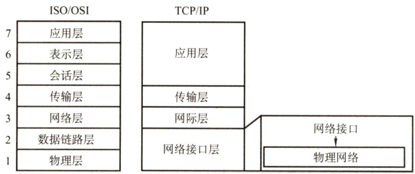  
图1.12TCP/IP模型与OSI参考模型的层次对应关系  

两个模型除具有这些基本的相似之处外，也有很多差别。  

第一，OSI参考模型的最大贡献就是精确地定义了三个主要概念：服务、协议和接口，这与现代的面向对象程序设计思想非常吻合。而 TCP/IP 模型在这三个概念上却没有明确区分，不符合软件工程的思想。  

第二，OSI参考模型产生在协议发明之前，没有偏向于任何特定的协议，通用性良好。但设计者在协议方面没有太多经验，不知道把哪些功能放到哪一层更好。TCP/IP 模型正好相反，首先出现的是协议，模型实际上是对已有协议的描述，因此不会出现协议不能匹配模型的情况，但该模型不适合于任何其他非TCP/IP的协议栈。  

第三，TCP/IP模型在设计之初就考虑到了多种异构网的互联问题，并将网际协议（IP）作为一个单独的重要层次。OSI参考模型最初只考虑到用一种标准的公用数据网将各种不同的系统互联。OSI参考模型认识到IP 的重要性后，只好在网络层中划分出一个子层来完成类似于 TCP/IP模型中的IP的功能。  

第四，OSI参考模型在网络层支持无连接和面向连接的通信，但在传输层仅有面向连接的通信。而TCP/IP 模型认为可靠性是端到端的问题，因此它在网际层仅有一种无连接的通信模式，但传输层支持无连接和面向连接两种模式。这个不同点常常作为考查点。  

无论是OSI 参考模型还是TCP/IP 模型，都不是完美的，对二者的讨论和批评都很多。OSI参考模型的设计者从工作的开始，就试图建立一个全世界的计算机网络都要遵循的统一标准。从技术角度来看，他们希望追求一种完美的理想状态，这也导致基于OSI参考模型的软件效率极低。OSI参考模型缺乏市场与商业动力，结构复杂，实现周期长，运行效率低，这是它未能达到预期  

目标的重要原因。  

学习计算机网络时，我们往往采取折中的办法，即综合OSI参考模型和TCP/IP模型的优点，采用一种如图1.13所示的只有5层协议的体系结构，即我们所熟知的物理层、数据链路层、网络层、传输层和应用层。本书也采用这种体系结构进行讨论。  

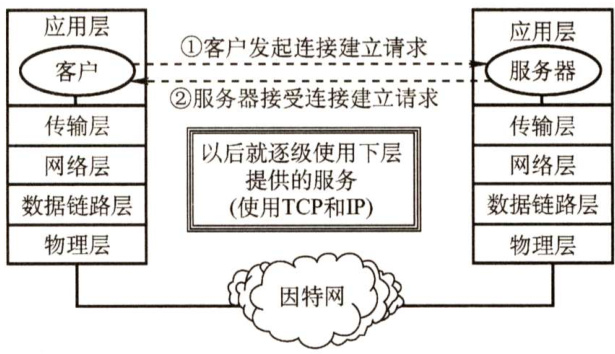  
图1.13网络的5层协议体系结构模型  

最后简单介绍使用通信协议栈进行通信的结点的数据传输过程。每个协议栈的最顶端都是一个面向用户的接口，下面各层是为通信服务的协议。用户传输一个数据报时，通常给出用户能够理解的自然语言，然后通过应用层，将自然语言会转化为用于通信的通信数据。通信数据到达传输层，作为传输层的数据部分（传输层SDU)，加上传输层的控制信息（传输层PCI)，组成传输层的PDU，然后交到网络层，传输层的PDU下放到网络层后，就成为网络层的SDU，然后加上网络层的PCI，又组成了网络层的PDU，下放到数据链路层，就这样层层下放，层层包裹，最后形成的数据报通过通信线路传输，到达接收方结点协议栈，接收方再逆向地逐层把“包裹”拆开，然后把收到的数据提交给用户，如图1.14所示。  

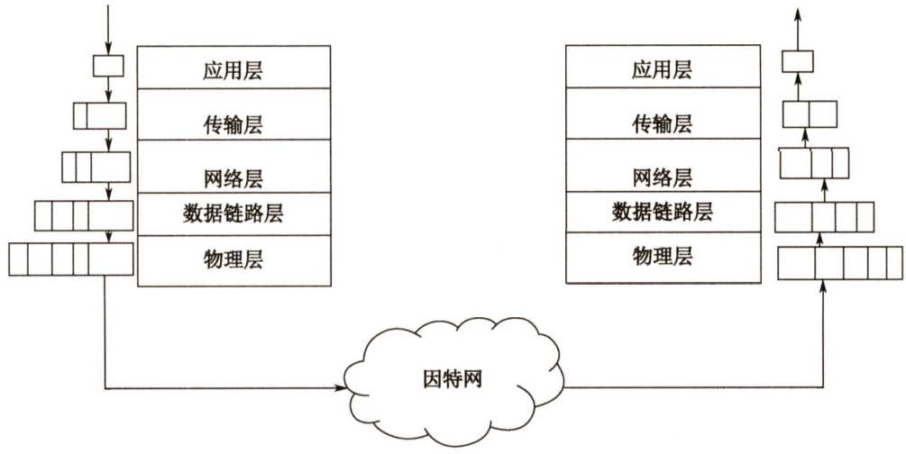  
图1.14通信协议栈的通信过程示例  

#### 1.2.4 本节习题精选  

#### 一、单项选择题  

01.（）不是对网络模型进行分层的目标。  

A．提供标准语言 B.定义功能执行的方法C．定义标准界面 D.增加功能之间的独立性  

02.将用户数据分成一个个数据块传输的优点不包括（）。  

A.减少延迟时间  
B.提高错误控制效率  
C.使多个应用更公平地使用共享通信介质  
D.有效数据在协议数据单元（PDU）中所占比例更大  

03．协议是指在（）之间进行通信的规则或约定。  

A.同一结点的上下层 B．不同结点C.相邻实体 D．不同结点对等实体  

04．在OSI参考模型中，第 $n$ 层与它之上的第 $n+1$ 层的关系是（）。  

A.第 $n$ 层为第 $n+1$ 层提供服务  
B.第 $n+1$ 层为从第 $n$ 层接收的报文添加一个报头  
C.第 $n$ 层使用第 $n+1$ 层提供的服务  
D.第 $n$ 层和第 $n+1$ 层相互没有影响  

05．关于计算机网络及其结构模型，下列几种说法中错误的是（）。  

A．世界上第一个计算机网络是ARPAnet  
B.Internet最早起源于ARPAnet  
C. 国际标准化组织（ISO）设计出了OSI/RM参考模型，即实际执行的标准  
D.TCP/IP参考模型分为4个层次  

06.（）是计算机网络中OSI参考模型的3个主要概念。  

A．服务、接口、协议 B．结构、模型、交换C．子网、层次、端口 D.广域网、城域网、局域网  

07．OSI参考模型中的数据链路层不具有（）功能。  

A．物理寻址 B．流量控制 C．差错校验 D.拥塞控制  

3.下列能够最好地描述OSI参考模型的数据链路层功能的是（）。  

A．提供用户和网络的接口 B.处理信号通过介质的传输C.控制报文通过网络的路由选择 D.保证数据正确的顺序和完整性  

09．当数据由端系统A传送至端系统B时，不参与数据封装工作的是（）。  

A．物理层 B．数据链路层 C.网络层 D.表示层  

10．在OSI参考模型中，实现端到端的应答、分组排序和流量控制功能的协议层是（）  

A．会话层 B．网络层 C．传输层 D．数据链路层在ISO/OSI参考模型中，可同时提供无连接服务和面向连接服务的是（）。  

A．物理层 B．数据链路层 C.网络层 D．传输层  

12．在OSI参考模型中，当两台计算机进行文件传输时，为防止中间出现网络故障而重传整个文件的情况，可通过在文件中插入同步点来解决，这个动作发生在（）。  

A．表示层 B．会话层 C.网络层 D.应用层  

13．数据的格式转换及压缩属于OSI参考模型中（）的功能。  

A.应用层 B．表示层 C.会话层 D.传输层  

4.下列说法中，正确描述了OSI参考模型中数据的封装过程的是（）。  

A．数据链路层在分组上仅增加了源物理地址和目的物理地址B．网络层将高层协议产生的数据封装成分组，并增加第三层的地址和控制信息  

C.传输层将数据流封装成数据帧，并增加可靠性和流控制信息D.表示层将高层协议产生的数据分割成数据段，并增加相应的源和目的端口信息  

15.在OSI参考模型中，提供流量控制功能的层是第（ $\textcircled{1}$ ）层；提供建立、维护和拆除端到端的连接的层是（ $\textcircled{2}$ )；为数据分组提供在网络中路由的功能的是（ $\textcircled{3}$ )；传输层提供（ $\textcircled{4}$ ）的数据传送；为网络层实体提供数据发送和接收功能及过程的是（ $\textcircled{5}$ )。  

$\textcircled{1}$ A. 1、2、3 B.2、3、4 C. 3、4、5 D.4、5、6$\textcircled{2}$ A. 物理层 B．数据链路层 C. 会话层 D. 传输层$\textcircled{3}$ A. 物理层 B．数据链路层 C. 网络层 D．传输层$\textcircled{4}$ A. 主机进程之间 B. 网络之间C. 数据链路之间 D. 物理线路之间$\textcircled{5}$ A. 物理层 B．数据链路层 C. 会话层 D.传输层  

16.在OSI参考模型中，（ $\textcircled{1}$ ）利用通信子网提供的服务实现两个用户进程之间端到端的通信。在这个层次模型中，如果用户A需要通过网络向用户B传送数据，那么首先将数据送入应用层，在该层给它附加控制信息后送入表示层；在表示层对数据进行必要的变换并加上头部后送入会话层；在会话层加头部后送入传输层；在传输层将数据分割为（ $\textcircled{2}$ ）后送至网络层；在网络层将数据封装成（ $\textcircled{3}$ ）后送至数据链路层；在数据链路层将数据加上头部和尾部封装成（ $\textcircled{4}$ ）后发送到物理层；在物理层数据以（ $\textcircled{5}$ ）形式发送到物理线路。用户B所在的系统收到数据后，层层剥去控制信息，最终将原数据传送给用户B。  

$\textcircled{1}$ A. 网络层 B. 传输层 C. 会话层 D. 表示层$\textcircled{2}$ A. 数据报 B. 数据流 C.报文 D. 分组$\textcircled{3}$ A. 数据流 B. 报文 C.路由信息 D. 分组$\textcircled{4}$ A. 数据段 B. 报文 C. 数据帧 D. 分组$\textcircled{5}$ A. 比特流 B. 数据帧 C.报文 D. 分组  

17．因特网采用的核心技术是（）。  

A.TCP/IP B.局域网技术 C.远程通信技术 D．光纤技术．在TCP/IP模型中，（）处理关于可靠性、流量控制和错误校正等问题。  

A．网络接口层 B.网际层 C.传输层 D.应用层  

9.上下邻层实体之间的接口称为服务访问点，应用层的服务访问点也称（）。  

A．用户界面 B.网卡接口 C.IP地址 D.MAC地址  

0.【2009统考真题】在OSI参考模型中，自下而上第一个提供端到端服务的层次是（）  

A．数据链路层 B．传输层 C.会话层 D.应用层  

21.【2010统考真题】下列选项中，不属于网络体系结构所描述的内容是（）。  

A.网络的层次 B．每层使用的协议C.协议的内部实现细节 D．每层必须完成的功能  

22.【2011统考真题】TCP/IP参考模型的网络层提供的是（）。  

A.无连接不可靠的数据报服务 B.无连接可靠的数据报服务C.有连接不可靠的虚电路服务 D.有连接可靠的虚电路服务  

23.【2013统考真题】在OSI参考模型中，功能需由应用层的相邻层实现的是（）。  

A．对话管理 B.数据格式转换 C.路由选择 D.可靠数据传输  

24.【2014统考真题】在OSI参考模型中，直接为会话层提供服务的是（）。  

A．应用层 B．表示层 C.传输层 D.网络层  

25.【2016统考真题】在OSI参考模型中，路由器、交换机（Switch）、集线器（Hub）实现的最高功能层分别是（）。  

A.2、2、1 B.2、2、2 C.3、2、1 D.3、2、2  

26.【2017统考真题】假设OSI参考模型的应用层欲发送400B的数据（无拆分），除物理层和应用层外，其他各层在封装PDU时均引入20B的额外开销，则应用层的数据传输效率约为（）。  

A. $80\%$ B. $83\%$ C. $87\%$ D. $91\%$  

7.【2019统考真题】OSI参考模型的第5层（自下而上）完成的主要功能是（）。  

A．差错控制 B．路由选择 C.会话管理 D．数据表示转换  

28.【2020统考真题】下图描述的协议要素是（）。  

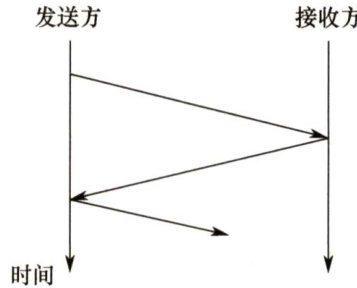  

I．语法 ⅡI.语义 IⅢI．时序A.仅I B.仅Ⅱ C.仅IⅢ D.I、和Ⅲ  

29.【2021统考真题】在TCP/IP参考模型中，由传输层相邻的下一层实现的主要功能是（）  

A．对话管理 B．路由选择C．端到端报文段传输 D.结点到结点流量控制  

#### 二、综合应用题  

01.协议与服务有何区别？有何联系？  

02.在OSI参考模型中，各层都有差错控制过程。指出以下每种差错发生在OSI参考模型的哪些层中？1）噪声使传输链路上的一个0变成1或一个1变成0。2）一个分组被传送到错误的目的站。3）收到一个序号错误的目的帧。4）一台打印机正在打印，突然收到一个错误指令要打印头回到本行的开始位置。5）一个半双工的会话中，正在发送数据的用户突然接收到对方用户发来的数据。  

#### 1.2.5 答案与解析  

#### 一、单项选择题  

01.B  

分层属于计算机网络的体系结构的范畴，选项A、C和D均是网络模型分层的目的，而分层的目的不包括定义功能执行的具体方法。  

02.D  

将用户数据分成一个个数据块传输，由于每块均需加入控制信息，因此实际上会使有效数据  

在PDU中所占的比例更小。其他各项均为其优点。  

03.D  

协议是为对等层实体之间进行逻辑通信而定义的规则的集合。  

04.A  

服务是指下层为紧邻的上层提供的功能调用，每层只能调用紧邻下层提供的服务（通过服务访问点)，而不能跨层调用。  

05.C  

国际标准化组织（ISO）设计了开放系统互连参考模型（OSI/RM)，即7层网络参考模型，但实际执行的国际标准是TCP/IP标准。  

06.A  

计算机网络要做到有条不紊地交换数据，就必须遵守一些事先约定的原则，这些原则就是协议。在协议的控制下，两个对等实体之间的通信使得本层能够向上一层提供服务。要实现本层协议，还需要使用下一层提供的服务，而提供服务就是交换信息，要交换信息就需要通过接口去交换信息，所以说服务、接口、协议是OSI参考模型的3个主要概念。  

07.D  

数据链路层在不可靠的物理介质上提供可靠的传输。其作用包括物理寻址、成帧、流量控制、差错校验、数据重发等。网络层和传输层才具有拥塞控制的功能。  

08.D  

数据链路层的功能包括：链路连接的建立、拆除、分离；帧界定和帧同步；差错检测等。A是应用层的功能，B是物理层的功能，C是网络层的功能，D才是数据链路层的功能。  

09.A  

物理层以0、1比特流的形式透明地传输数据链路层递交的帧。网络层、表示层和应用层都为上层提交的数据加上首部，数据链路层为上层提交的数据加上首部和尾部，然后提交给下一层。物理层不存在下一层，自然也就不用封装。  

10.C  

只有传输层及以上各层的通信才能称为端到端，选项B、D错。会话层管理不同主机间进程的对话，而传输层实现应答、分组排序和流量控制功能。  

11.C  

本题容易误选D。ISO/OSI参考模型在网络层支持无连接和面向连接的通信，但在传输层仅支持面向连接的通信；TCP/IP模型在网络层仅有无连接的通信，而在传输层支持无连接和面向连接的通信。两类协议栈的区别是统考的考点，而这个区别是常考点。  

12.B  

在OSI参考模型中，会话层的两个主要服务是会话管理和同步。会话层使用校验点可使通信  

会话在通信失效时从校验点继续恢复通信，实现数据同步。  

13.B  

OSI参考模型表示层的功能有数据解密与加密、压缩、格式转换等。  

14.B  

数据链路层在分组上除增加源和目的物理地址外，也增加控制信息；传输层的PDU不称为帧；表示层不负责把高层协议产生的数据分割成数据段，且负责增加相应源和目的端口信息的应是传输层。选项B正确描述了OSI参考模型中数据的封装过程，数据经过网络层后，只是增加了第三层PCI。  

15. $\textcircled{1}$ B、 $\textcircled{2}\textcircled{2}\textcircled{2}$ 、 $\textcircled{3}$ C、 $\textcircled{4}$ A、 $\textcircled{5}\mathbf{B}$  

在计算机网络中，流量控制指的是通过限制发送方发出的数据流量，从而使得其发送速率不超过接收方接收速率的一种技术。流量控制功能可以存在于数据链路层及其之上的各层中。目前提供流量控制功能的主要是数据链路层、网络层和传输层。不过，各层的流量控制对象不一样，各层的流量控制功能是在各层实体之间进行的。  

在OSI参考模型中，物理层实现比特流在传输介质上的透明传输；数据链路层将有差错的物理线路变成无差错的数据链路，实现相邻结点之间即点到点的数据传输。网络层的主要功能是路由选择、拥塞控制和网际互联等，实现主机到主机的通信；传输层实现主机的进程之间即端到端的数据传输。  

下一层为上一层提供服务，而网络层下一层是数据链路层，所以为网络层实体提供数据发送和接收功能及过程的是数据链路层。  

16. $\textcircled{1}$ B、 $\textcircled{2}$ C、 $\textcircled{3}\textcircled{2}$ 、 $\textcircled{4}\textcircled{4}$ ， $\textcircled{5}\mathbf{A}$  

在OSI参考模型中，在对等层之间传送的数据的单位都称为协议数据单元（PDU)；具体而言，在传输层称为报文段（TCP）或用户数据报（UDP)，在网络层称为分组或数据报，在数据链路层称为帧，在物理层称为比特。  

17.A  

协议是网络上计算机之间进行信息交换和资源共享时所共同遵守的约定，没有协议的存在，网络的作用也就无从谈起。在因特网中应用的网络协议是采用分组交换技术的 TCP/IP 协议，它是因特网的核心技术。  

18.C  

TCP/IP模型的传输层提供端到端的通信，并负责差错控制和流量控制，可以提供可靠的面向连接的服务或不可靠的无连接服务。  

19.A  

服务访问点（SAP）是在一个层次系统的上下层之间进行通信的接口， $N$ 层的SAP是 $N+1$ 层可以访问 $N$ 层服务的地方。一般而言，物理层的服务访问点是“网卡接口”，数据链路层的服  

务访问点是“MAC 地址（网卡地址)”，网络层的服务访问点是“IP地址（网络地址)”，传输层的服务访问点是“端口号”，应用层提供的服务访问点是“用户界面”。  

20.B  

传输层提供应用进程间的逻辑通信（通过端口号)，即端到端的通信。数据链路层负责相邻结点之间的通信，这个结点包括了交换机和路由器等数据通信设备，这些设备不能称为端系统。网络层负责主机到主机的逻辑通信。因此选B。  

21.C  

计算机网络的各层及其协议的集合称为体系结构，分层就涉及对各层功能的划分，因此A、B、D正确。体系结构是抽象的，它不包括各层协议的具体实现细节。计算机网络教材在讲解网络层次时，仅涉及各层的协议和功能，而内部的实现细节则完全未提及。内部的实现细节是由具体设备厂家来确定的。  

22.A  

TCP/IP的网络层向上只提供简单灵活的、无连接的、尽最大努力交付的数据报服务。考察IP首部，如果是面向连接的，那么应有用于建立连接的字段，但是没有；如果提供可靠的服务，那么至少应有序号和校验和两个字段，但是IP分组头中也没有（IP首部中只有首部校验和)。通常有连接、可靠的应用是由传输层的TCP实现的。  

23.B  

在OSI参考模型中，应用层的相邻层是表示层，它是OSI参考模型七层协议的第六层。表示层的功能是表示出用户看得懂的数据格式，实现与数据表示有关的功能。主要完成数据字符集的转换、数据格式化及文本压缩、数据加密和解密等工作。  

24.C  

直接为会话层提供服务的是会话层的下一层，即传输层，选C。  

25.C  

集线器是一个多端口的中继器，它工作在物理层。以太网交换机是一个多端口的网桥，它工作在数据链路层。路由器是网络层设备，它实现了OSI网络模型的下三层，即物理层、数据链路层和网络层。题中路由器、交换机和集线器实现的最高层功能分别是网络层（第3层）、数据链路层（第2层）和物理层（第1层)。  

26.A  

解析请扫右侧二维码查阅。  

27.C  

OSI参考模型自下而上分别为物理层、数据链路层、网络层、传输层、会话层、表示层和应用层。第5层为会话层，它的主要功能是管理和协调不同主机上各种进程之间的通信（对话)，  

即负责建立、管理和终止应用程序之间的会话，这也是会话层得名的原因。  

28.C  

协议由语法、语义和时序（又称同步）三部分组成。语法规定了通信双方彼此“如何讲”，即规定了传输数据的格式。语义规定了通信双方彼此“讲什么”，即规定了所要完成的功能，如通信双方要发出什么控制信息、执行的动作和返回的应答。时序规定了信息交流的次序。由图可知发送方与接收方依次交换信息，体现了协议三要素中的时序要素。  

29.B  

TCP/IP 参考模型中与传输层相邻的下一层是网际层。TCP/IP 的网际层使用一种尽力而为的服务，它将分组发往任何网络，并为之独立选择合适的路由，但不保证各个分组有序到达，B正确。TCP/IP认为可靠性是端到端的问题（传输层的功能)，因此它在网际层仅有无连接、不可靠的通信模式，无法完成结点到结点的流量控制（OSI参考模型的网络层具有该功能)。对话管理和端到端的报文段传输均为传输层的功能。A、C和D错误。  

#### 二、综合应用题  

01.【解答】  

协议是控制两个对等实体之间通信的规则的集合。在协议的控制下，两个对等实体间的通信使得本层能够向上一层提供服务，而要实现本层协议，还需要使用下一层提供的服务。  

协议和服务概念的区分：  

1）协议的实现保证了能够向上一层提供服务。本层的服务用户只能看见服务而无法看见下面的协议，即下面的协议对上面的服务用户是透明的。  
2）协议是“水平的”，即协议是控制两个对等实体之间的通信的规则。但服务是“垂直的”，即服务是由下层通过层间接口向上层提供的。  

02.【解答】  

1）物理层。物理层负责正确、透明地传输比特流（0、1)。  
2）网络层。网络层的PDU称为分组，分组转发是网络层的功能。  
3）数据链路层。数据链路层的PDU称为帧，帧的差错检测是数据链路层的功能。  
4）应用层。打印机是向用户提供服务的，运行的是应用层的程序。  
5）会话层。会话层允许不同主机上的进程进行会话。