#### 2.1 通信基础  

#### 2.1.1 基本概念  

#### 1.数据、信号与码元  

通信的目的是传送信息，如文字、图像和视频等。数据是指传送信息的实体。信号则是数据的电气或电磁表现，是数据在传输过程中的存在形式。数据和信号都可用“模拟的”或“数字的”来修饰： $\textcircled{1}$ 连续变化的数据（或信号）称为模拟数据（或模拟信号）； $\textcircled{2}$ 取值仅允许为有限的几个离散数值的数据（或信号）称为数字数据（或数字信号）。  

数据传输方式可分为串行传输和并行传输。串行传输是指1比特1比特地按照时间顺序传输（远距离通信通常采用串行传输)，并行传输是指若干比特通过多条通信信道同时传输。  

码元是指用一个固定时长的信号波形（数字脉冲）表示一位 $k$ 进制数字，代表不同离散数值的基本波形，是数字通信中数字信号的计量单位，这个时长内的信号称为 $k$ 进制码元，而该时长称为码元宽度。1码元可以携带若干比特的信息量。例如，在使用二进制编码时，只有两种不同的码元：一种代表0状态，另一种代表1状态。  

#### 2.信源、信道与信宿  

数据通信是指数字计算机或其他数字终端之间的通信。一个数据通信系统主要划分为信源、信道和信宿三部分。信源是产生和发送数据的源头。信宿是接收数据的终点，它们通常都是计算机或其他数字终端装置。发送端信源发出的信息需要通过变换器转换成适合于在信道上传输的信号，而通过信道传输到接收端的信号先由反变换器转换成原始信息，再发送给信宿。  

信道与电路并不等同，信道是信号的传输媒介。一个信道可视为一条线路的逻辑部件，一般用来表示向某个方向传送信息的介质，因此一条通信线路往往包含一条发送信道和一条接收信道。噪声源是信道上的噪声（即对信号的干扰）及分散在通信系统其他各处的噪声的集中表示。  

图 2.1所示为一个单向通信系统的模型。实际的通信系统大多为双向的，即往往包含一条发送信道和一条接收信道，信道可以进行双向通信。  

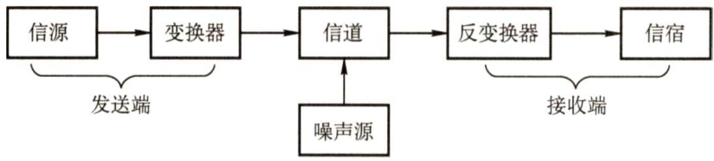  
图2.1 通信系统模型  

信道按传输信号形式的不同，可分为传送模拟信号的模拟信道和传送数字信号的数字信道两大类；信道按传输介质的不同可分为无线信道和有线信道。  

信道上传送的信号有基带信号和宽带信号之分。基带信号将数字信号1和0直接用两种不同的电压表示，然后送到数字信道上传输（称为基带传输)；宽带信号将基带信号进行调制后形成频分复用模拟信号，然后送到模拟信道上传输（称为宽带传输)。  

从通信双方信息的交互方式看，可分为三种基本方式：  

1）单向通信。只有一个方向的通信而没有反方向的交互，仅需要一条信道。例如，无线电广播、电视广播就属于这种类型。  
2）半双工通信。通信的双方都可以发送或接收信息，但任何一方都不能同时发送和接收信息，此时需要两条信道。  
3）全双工通信。通信双方可以同时发送和接收信息，也需要两条信道。  
信道的极限容量是指信道的最高码元传输速率或信道的极限信息传输速率。  

#### 3.速率、波特与带宽  

速率也称数据率，指的是数据传输速率，表示单位时间内传输的数据量。可以用码元传输速率和信息传输速率表示。  

1）码元传输速率。又称波特率，它表示单位时间内数字通信系统所传输的码元个数（也可称为脉冲个数或信号变化的次数)，单位是波特（Baud)。1波特表示数字通信系统每秒传输一个码元。码元可以是多进制的，也可以是二进制的，码元速率与进制数无关。  
2）信息传输速率。又称信息速率、比特率等，它表示单位时间内数字通信系统传输的二进制码元个数（即比特数)，单位是比特/秒（b/s）。  

注意：波特和比特是两个不同的概念，码元传输速率也称调制速率、波形速率或符号速率。但码元传输速率与信息传输速率在数量上却又有一定的关系。若一个码元携带 $n$ 比特的信息量，则 $M$ 波特率的码元传输速率所对应的信息传输速率为Mn比特/秒。  

带宽原指信号具有的频带宽度，单位是赫兹（ $\mathrm{\bf~H}\mathbf{z}$ )。在实际网络中，由于数据率是信道最重要的指标之一，而带宽与数据率存在数值上的互换关系，因此常用来表示网络的通信线路所能传输数据的能力。因此，带宽表示单位时间内从网络中的某一点到另一点所能通过的“最高数据率”。显然，此时带宽的单位不再是Hz，而是 $\mathbf{b}/\mathbf{s}$ 0  

#### 2.1.2 奈奎斯特定理与香农定理  

#### 1．奈奎斯特定理  

具体的信道所能通过的频率范围总是有限的。信号中的许多高频分量往往不能通过信道，否则在传输中会衰减，导致接收端收到的信号波形失去码元之间的清晰界限，这种现象称为码间串扰。奈奎斯特（Nyquist）定理又称奈氏准则，它规定：在理想低通（没有噪声、带宽有限）的信道中，为了避免码间串扰，极限码元传输速率为 $2W$ 波特，其中 $W$ 是理想低通信道的带宽。若用 $\boldsymbol{V}$ 表示每个码元离散电平的数目（码元的离散电平数目是指有多少种不同的码元，比如有16种不同的码元，则需要4个二进制位，因此数据传输速率是码元传输速率的4倍)，则极限数据率为  

理想低通信道下的极限数据传输速率 $=2W\log_{2}V$ （单位为 $\mathbf{\deltab}/\mathbf{s}$ ）  

对于奈氏准则，可以得出以下结论：  

1）在任何信道中，码元传输速率是有上限的。若传输速率超过此上限，就会出现严重的码间串扰问题，使得接收端不可能完全正确识别码元。2）信道的频带越宽（即通过的信号高频分量越多)，就可用更高的速率进行码元的有效传输。3）奈氏准则给出了码元传输速率的限制，但并未对信息传输速率给出限制，即未对一个码元可以对应多少个二进制位给出限制。由于码元传输速率受奈氏准则的制约，所以要提高数据传输速率，就必须设法使每个码元携带更多比特的信息量，此时就需要采用多元制的调制方法。  

#### 2．香农定理  

香农（Shannon）定理给出了带宽受限且有高斯白噪声干扰的信道的极限数据传输速率，当用此速率进行传输时，可以做到不产生误差。香农定理定义为  

式中， $W$ 为信道的带宽，S为信道所传输信号的平均功率， $N$ 为信道内部的高斯噪声功率。S/N为信噪比，即信号的平均功率与噪声的平均功率之比，信噪比 $\mathbf{\tau}=10\mathrm{log}_{10}(S/N)$ （单位为dB)，例如当 $S/N=10$ 时，信噪比为 $10\mathrm{dB}$ ，而当 $S/N=1000$ 时，信噪比为 $30\mathrm{dB}$ o  

对于香农定理，可以得出以下结论：  

1）信道的带宽或信道中的信噪比越大，信息的极限传输速率越高。2）对一定的传输带宽和一定的信噪比，信息传输速率的上限是确定的。3）只要信息传输速率低于信道的极限传输速率，就能找到某种方法来实现无差错的传输。4）香农定理得出的是极限信息传输速率，实际信道能达到的传输速率要比它低不少。奈氏准则只考虑了带宽与极限码元传输速率的关系，而香农定理不仅考虑到了带宽，也考虑到了信噪比。这从另一个侧面表明，一个码元对应的二进制位数是有限的。  

#### 2.1.3 编码与调制  

数据无论是数字的还是模拟的，为了传输的目的都必须转变成信号。把数据变换为模拟信号的过程称为调制，把数据变换为数字信号的过程称为编码。  

信号是数据的具体表示形式，它和数据有一定的关系，但又和数据不同。数字数据可以通过数字发送器转换为数字信号传输，也可以通过调制器转换成模拟信号传输；同样，模拟数据可以通过PCM编码器转换成数字信号传输，也可以通过放大器调制器转换成模拟信号传输。这样，就形成了下列4种编码方式。  

#### 1.数字数据编码为数字信号  

数字数据编码用于基带传输中，即在基本不改变数字数据信号频率的情况下，直接传输数字信号。具体用什么样的数字信号表示0及用什么样的数字信号表示1就是所谓的编码。编码的规则有多种，只要能有效地把1和0区分开即可，常用的数据数据编码有以下几种，如图2.2所示。  

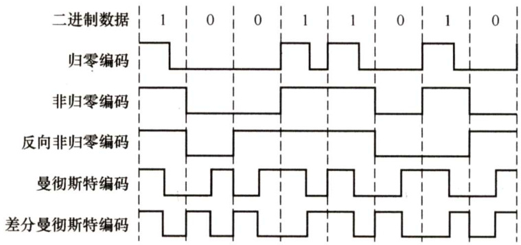  
图2.2常用的数字数据编码  

1）归零编码。在归零编码（RZ）中用高电平代表1、低电平代表0（或者相反)，每个时钟周期的中间均跳变到低电平（归零)，接收方根据该跳变调整本方的时钟基准，这就为传输双方提供了自同步机制。由于归零需要占用一部分带宽，因此传输效率受到了一定的影响。  
2）非归零编码。非归零编码（NRZ）与RZ编码的区别是不用归零，一个周期可以全部用来传输数据。但NRZ编码无法传递时钟信号，双方难以同步，因此若想传输高速同步数据，则需要都带有时钟线。  
3）反向非归零编码。反向非归零编码（NRZI）与NRZ编码的区别是用信号的翻转代表0、信号保持不变代表1。翻转的信号本身可以作为一种通知机制。这种编码方式集成了前两种编码的优点，既能传输时钟信号，又能尽量不损失系统带宽。USB2.0通信的编码方式就是NRZI编码。  
4）曼彻斯特编码。曼彻斯特编码（Manchester Encoding）将一个码元分成两个相等的间隔，前一个间隔为高电平而后一个间隔为低电平表示码元1；码元0的表示方法则正好相反。当然，也可采用相反的规定。该编码的特点是，在每个码元的中间出现电平跳变，位中间的跳变既作为时钟信号（可用于同步)，又作为数据信号，但它所占的频带宽度是原始基带宽度的两倍。注意：以太网使用的编码方式就是曼彻斯特编码。  
5）差分曼彻斯特编码。差分曼彻斯特编码常用于局域网传输，其规则是：若码元为1，则前  

半个码元的电平与上一码元的后半个码元的电平相同；若码元为0，则情形相反。该编码  

的特点是，在每个码元的中间都有一次电平的跳转，可以实现自同步，且抗干扰性较好。6）4B/5B编码。将欲发送数据流的每4位作为一组，然后按照4B/5B编码规则将其转换成相应的5位码。5位码共32种组合，但只采用其中的16种对应16种不同的4位码，其他16种作为控制码（帧的开始和结束、线路的状态信息等）或保留。  

#### 2.数字数据调制为模拟信号  

数字数据调制技术在发送端将数字信号转换为模拟信号，而在接收端将模拟信号还原为数字信号，分别对应于调制解调器的调制和解调过程。基本的数字调制方法有如下几种：  

1）幅移键控（ASK)。通过改变载波信号的振幅来表示数字信号1和0，而载波的频率和相位都不改变。比较容易实现，但抗干扰能力差。  
2）频移键控（FSK)。通过改变载波信号的频率来表示数字信号1和0，而载波的振幅和相位都不改变。容易实现，抗干扰能力强，目前应用较为广泛。  
3）相移键控（PSK)。通过改变载波信号的相位来表示数字信号1和0，而载波的振幅和频率都不改变。它又分为绝对调相和相对调相。  
4）正交振幅调制（QAM)。在频率相同的前提下，将ASK与PSK结合起来，形成叠加信号。设波特率为 $B$ ，采用 $m$ 个相位，每个相位有 $n$ 种振幅，则该QAM技术的数据传输速率 $R$ 为$R=B\log_{2}(m n)$ （单位为 $\mathbf{\deltab}/\mathbf{s}$ ）  

图2.3所示是二进制幅移键控、频移键控和相移键控的例子。2ASK中用载波有幅度和无幅度分别表示数字数据的1和0；2FSK中用两种不同的频率分别表示数字数据1和0；2PSK中用相位0和相位 $\pi$ 分别表示数字数据的1和0，是一种绝对调相方式。  

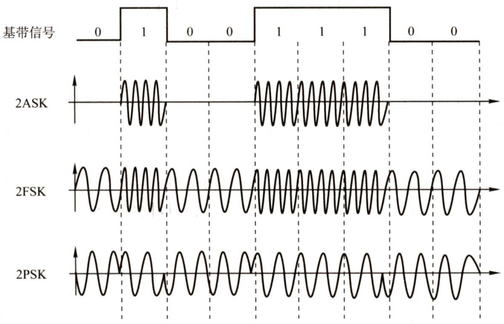  
图2.3数字调制的三种方式  

#### 3.模拟数据编码为数字信号  

这种编码方式最典型的例子是常用于对音频信号进行编码的脉码调制（PCM)。它主要包括三个步骤，即采样、量化和编码。  

先来介绍采样定理：在通信领域，带宽是指信号最高频率与最低频率之差，单位为 $\mathrm{Hz}$ 。因此，将模拟信号转换成数字信号时，假设原始信号中的最大频率为f，那么采样频率 $f_{{\mathcal R}\nVdash}$ 必须大于等于最大频率 $f$ 的两倍，才能保证采样后的数字信号完整保留原始模拟信号的信息（只需记住结论)。另外，采样定理又称奈奎斯特定理。  

1）采样是指对模拟信号进行周期性扫描，把时间上连续的信号变成时间上离散的信号。根据采样定理，当采样的频率大于等于模拟数据的频带带宽（最高变化频率）的两倍时，所得的离散信号可以无失真地代表被采样的模拟数据。  
2）量化是把采样取得的电平幅值按照一定的分级标度转化为对应的数字值并取整数，这样就把连续的电平幅值转换为了离散的数字量。采样和量化的实质就是分割和转换。  
3）编码是把量化的结果转换为与之对应的二进制编码。  

#### 4.模拟数据调制为模拟信号  

为了实现传输的有效性，可能需要较高的频率。这种调制方式还可以使用频分复用（FDM)技术，充分利用带宽资源。电话机和本地局交换机采用模拟信号传输模拟数据的编码方式，模拟的声音数据是加载到模拟的载波信号中传输的。  

#### 2.1.4 电路交换、报文交换与分组交换  

#### 1．电路交换  

在进行数据传输前，两个结点之间必须先建立一条专用（双方独占）的物理通信路径（由通信双方之间的交换设备和链路逐段连接而成)，该路径可能经过许多中间结点。这一路径在整个数据传输期间一直被独占，直到通信结束后才被释放。因此，电路交换技术分为三个阶段：连接建立、数据传输和连接释放。  

从通信资源的分配角度来看，“交换”就是按照某种方式动态地分配传输线路的资源。电路交换的关键点是，在数据传输的过程中，用户始终占用端到端的固定传输带宽。  

电路交换技术的优点如下：  

1）通信时延小。由于通信线路为通信双方用户专用，数据直达，因此传输数据的时延非常小。当传输的数据量较大时，这一优点非常明显。  
2）有序传输。双方通信时按发送顺序传送数据，不存在失序问题。  
3）没有冲突。不同的通信双方拥有不同的信道，不会出现争用物理信道的问题。  
4）适用范围广。电路交换既适用于传输模拟信号，又适用于传输数字信号。  
5）实时性强。通信双方之间的物理通路一旦建立，双方就可以随时通信。  
6）控制简单。电路交换的交换设备（交换机等）及控制均较简单。电路交换技术的缺点如下：  
1）建立连接时间长。电路交换的平均连接建立时间对计算机通信来说太长。  
2）线路独占，使用效率低。电路交换连接建立后，物理通路被通信双方独占，即使通信线路空闲，也不能供其他用户使用，因而信道利用率低。  
3）灵活性差。只要在通信双方建立的通路中的任何一点出了故障，就必须重新拨号建立新的连接，这对十分紧急和重要的通信是很不利的。  
4）难以规格化。电路交换时，数据直达，不同类型、不同规格、不同速率的终端很难相互进行通信，也难以在通信过程中进行差错控制。  

注意，电路建立后，除源结点和目的结点外，电路上的任何结点都采取“直通方式”接收数据和发送数据，即不会存在存储转发所耗费的时间。  

#### 2.报文交换  

数据交换的单位是报文，报文携带有目标地址、源地址等信息。报文交换在交换结点采用的是存储转发的传输方式。  

报文交换技术的优点如下：  

1）无须建立连接。报文交换不需要为通信双方预先建立一条专用的通信线路，不存在建立连接时延，用户可以随时发送报文。  
2）动态分配线路。当发送方把报文交给交换设备时，交换设备先存储整个报文，然后选择一条合适的空闲线路，将报文发送出去。  
3）提高线路可靠性。如果某条传输路径发生故障，那么可重新选择另一条路径传输数据，因此提高了传输的可靠性。  
4）提高线路利用率。通信双方不是固定占有一条通信线路，而是在不同的时间一段一段地部分占有这条物理通道，因而大大提高了通信线路的利用率。  
5）提供多目标服务。一个报文可以同时发送给多个目的地址，这在电路交换中是很难实现的。报文交换技术的缺点如下：  
1）由于数据进入交换结点后要经历存储、转发这一过程，因此会引起转发时延（包括接收报文、检验正确性、排队、发送时间等)。  
2）报文交换对报文的大小没有限制，这就要求网络结点需要有较大的缓存空间。  

注意：报文交换主要使用在早期的电报通信网中，现在较少使用，通常被较先进的分组交换方式所取代。  

#### 3．分组交换  

同报文交换一样，分组交换也采用存储转发方式，但解决了报文交换中大报文传输的问题。分组交换限制了每次传送的数据块大小的上限，把大的数据块划分为合理的小数据块，再加上一些必要的控制信息（如源地址、目的地址和编号信息等)，构成分组（Packet)。网络结点根据控制信息把分组送到下一个结点，下一个结点接收到分组后，暂时保存并排队等待传输，然后根据分组控制信息选择它的下一个结点，直到到达目的结点。  

分组交换的优点如下：  

1）无建立时延。不需要为通信双方预先建立一条专用的通信线路，不存在连接建立时延，用户可随时发送分组。  
2）线路利用率高。通信双方不是固定占有一条通信线路，而是在不同的时间一段一段地部分占有这条物理通路，因而大大提高了通信线路的利用率。  
3）简化了存储管理（相对于报文交换)。因为分组的长度固定，相应的缓冲区的大小也固定，在交换结点中存储器的管理通常被简化为对缓冲区的管理，相对比较容易。  
4）加速传输。分组是逐个传输的，可以使后一个分组的存储操作与前一个分组的转发操作并行，这种流水线方式减少了报文的传输时间。此外，传输一个分组所需的缓冲区比传输一次报文所需的缓冲区小得多，这样因缓冲区不足而等待发送的概率及时间也必然少得多。  
5）减少了出错概率和重发数据量。因为分组较短，其出错概率必然减小，所以每次重发的数据量也就大大减少，这样不仅提高了可靠性，也减少了传输时延。  

分组交换的缺点如下：  

1）存在传输时延。尽管分组交换比报文交换的传输时延少，但相对于电路交换仍存在存储转发时延，而且其结点交换机必须具有更强的处理能力。  

2）需要传输额外的信息量。每个小数据块都要加上源地址、目的地址和分组编号等信息，从而构成分组，因此使得传送的信息量增大了 $5\%\sim10\%$ ，一定程度上降低了通信效率，增加了处理的时间，使控制复杂，时延增加。  
3）当分组交换采用数据报服务时，可能会出现失序、丢失或重复分组，分组到达目的结点时，要对分组按编号进行排序等工作，因此很麻烦。若采用虚电路服务，虽无失序问题，但有呼叫建立、数据传输和虚电路释放三个过程。  

图2.4给出了三种数据交换方式的比较。要传送的数据量很大且其传送时间远大于呼叫时间时，采用电路交换较为合适。端到端的通路由多段链路组成时，采用分组交换传送数据较为合适。从提高整个网络的信道利用率上看，报文交换和分组交换优于电路交换，其中分组交换比报文交换的时延小，尤其适合于计算机之间的突发式数据通信。  

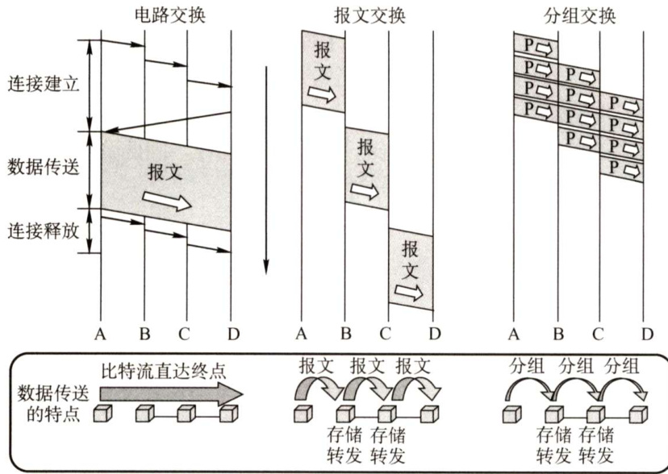  
图2.4三种数据交换方式的比较  

#### 2.1.5 数据报与虚电路  

分组交换根据其通信子网向端点系统提供的服务，还可进一步分为面向连接的虚电路方式和无连接的数据报方式。这两种服务方式都由网络层提供。要注意数据报方式和虚电路方式是分组交换的两种方式。  

#### 1．数据报  

作为通信子网用户的端系统发送一个报文时，在端系统中实现的高层协议先把报文拆成若干带有序号的数据单元，并在网络层加上地址等控制信息后形成数据报分组（即网络层的PDU)。中间结点存储分组很短一段时间，找到最佳的路由后，尽快转发每个分组。不同的分组可以走不同的路径，也可以按不同的顺序到达目的结点。  

我们用图2.5的例子来说明数据报服务的原理。假定主机A要向主机B发送分组。  

1）主机A先将分组逐个发往与它直接相连的交换结点A，交换结点A缓存收到的分组。2）然后查找自己的转发表。由于不同时刻的网络状态不同，因此转发表的内容可能不完全相同，所以有的分组转发给交换结点C，有的分组转发给交换结点D。3）网络中的其他结点收到分组后，类似地转发分组，直到分组最终到达主机B。  

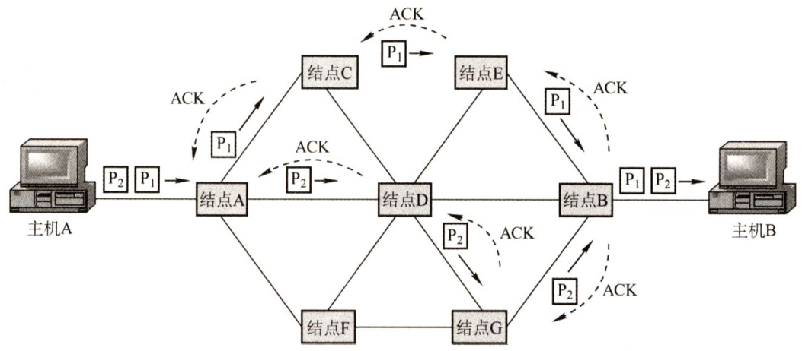  
图2.5数据报方式转发分组  

当分组正在某一链路上传送时，分组并不占用网络的其他部分资源。因为采用存储转发技术，资源是共享的，所以主机A在发送分组时，主机B也可同时向其他主机发送分组。  

通过上面的例子，我们可以总结出数据报服务具有如下特点：  

1）发送分组前不需要建立连接。发送方可随时发送分组，网络中的结点可随时接收分组。  
2）网络尽最大努力交付，传输不保证可靠性，所以可能丢失；为每个分组独立地选择路由，转发的路径可能不同，因而分组不一定按序到达目的结点。  
3）发送的分组中要包括发送端和接收端的完整地址，以便可以独立传输。  
4）分组在交换结点存储转发时，需要排队等候处理，这会带来一定的时延。通过交换结点的通信量较大或网络发生拥塞时，这种时延会大大增加，交换结点还可根据情况丢弃部分分组。  
5）网络具有冗余路径，当某个交换结点或一条链路出现故障时，可相应地更新转发表，寻找另一条路径转发分组，对故障的适应能力强。  
6）存储转发的延时一般较小，提高了网络的吞吐量。  
7）收发双方不独占某条链路，资源利用率较高。  

#### 2.虚电路  

虚电路方式试图将数据报方式与电路交换方式结合起来，充分发挥两种方法的优点，以达到最佳的数据交换效果。在分组发送之前，要求在发送方和接收方建立一条逻辑上相连的虚电路，并且连接一旦建立，就固定了虚电路所对应的物理路径。与电路交换类似，整个通信过程分为三个阶段：虚电路建立、数据传输与虚电路释放。  

在虚电路方式中，端系统每次建立虚电路时，选择一个未用过的虚电路号分配给该虚电路，以区别于本系统中的其他虚电路。在传送数据时，每个数据分组不仅要有分组号、校验和等控制信息，还要有它要通过的虚电路号，以区别于其他虚电路上的分组。在虚电路网络中的每个结点上都维持一张虚电路表，表中的每项记录了一个打开的虚电路的信息，包括在接收链路和发送链路上的虚电路号、前一结点和下一结点的标识。数据的传输是双向进行的，上述信息是在虚电路的建立过程中确定的。  

虚电路方式的工作原理如图2.6所示。  

1）为进行数据传输，主机A与主机B之间先建立一条逻辑通路，主机A发出一个特殊的“呼叫请求”分组，该分组通过中间结点送往主机B，若主机B同意连接，则发送“呼  

叫应答”分组于以确认。  
2）虚电路建立后，主机A就可向主机B发送数据分组。当然，主机B也可在该虚电路上向主机A发送数据。  
3）传送结束后主机A通过发送“释放请求”分组来拆除虚电路，逐段断开整个连接。  
通过上面的例子，可以总结出虚电路服务具有如下特点：  
1）虚电路通信链路的建立和拆除需要时间开销，对交互式应用和小量的短分组情况显得很浪费，但对长时间、频繁的数据交换效率较高。  
2）虚电路的路由选择体现在连接建立阶段，连接建立后，就确定了传输路径。  
3）虚电路提供了可靠的通信功能，能保证每个分组正确且有序到达。此外，还可以对两个数据端点的流量进行控制，当接收方来不及接收数据时，可以通知发送方暂缓发送。  
4）虚电路有一个致命的弱点，即当网络中的某个结点或某条链路出现故障而彻底失效时，所有经过该结点或该链路的虚电路将遭到破坏。  

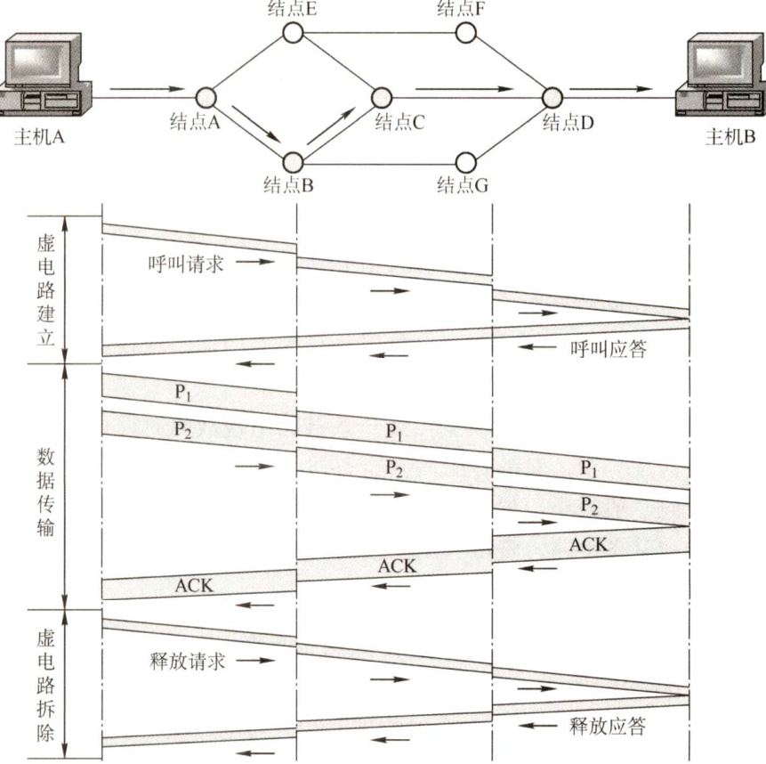  
图2.6虚电路方式的工作原理  

5）分组首部不包含目的地址，包含的是虚电路标识符，相对于数据报方式，其开销小。  

虚电路之所以是“虚”的，是因为这条电路不是专用的，每个结点到其他结点之间的链路可能同时有若干虚电路通过，也可能同时与多个结点之间建立虚电路。每条虚电路支持特定的两个端系统之间的数据传输，两个端系统之间也可以有多条虚电路为不同的进程服务，这些虚电路的实际路由可能相同也可能不同。  

注意，图2.6所示的数据传输过程是有确认的传输（由高层实现)，主机B收到分组后要发回相应分组的确认。网络中的传输是否有确认与网络层提供的两种服务没有任何关系。  

数据报服务和虚电路服务的比较见表2.1。  

表2.1数据报服务和虚电路服务的比较  

<html><body><table><tr><td></td><td>数据报服务</td><td>虚电路服务</td></tr><tr><td>连接的建立</td><td>不需要</td><td>必须有</td></tr><tr><td>目的地址</td><td>每个分组都有完整的目的地址</td><td>仅在建立连接阶段使用，之后每个分组使用长 度较短的虚电路号</td></tr><tr><td>路由选择</td><td>每个分组独立地进行路由选择和转发</td><td>属于同一条虚电路的分组按照同一路由转发</td></tr><tr><td>分组顺序</td><td>不保证分组的有序到达</td><td>保证分组的有序到达</td></tr><tr><td>可靠性</td><td>不保证可靠通信，可靠性由用户主机来保证</td><td>可靠性由网络保证</td></tr><tr><td>对网络故障的适应性</td><td>出故障的结点丢失分组，其他分组路径选择发生变化 时可以正常传输</td><td>所有经过故障结点的虚电路均不能正常工作</td></tr><tr><td>差错处理和流量控制</td><td>由用户主机进行流量控制，不保证数据报的可靠性</td><td>可由分组交换网负责，也可由用户主机负责</td></tr></table></body></html>  

#### 2.1.6 本节习题精选  

#### 一、单项选择题  

01．下列说法正确的是（）。  

A.信道与通信电路类似，一条可通信的电路往往包含一个信道B.调制是指把模拟数据转换为数字信号的过程C.信息传输速率是指通信信道上每秒传输的码元数D.在数值上，波特率等于比特率与每符号所含的比特数的比值  

02.影响信道最大传输速率的因素主要有（）。  

A.信道带宽和信噪比 B.码元传输速率和噪声功率C.频率特性和带宽 D.发送功率和噪声功率  

03.（）被用于计算机内部的数据传输。  

A．串行传输 B．并行传输 C.同步传输 D．异步传输  

04.下列有关曼彻斯特编码的叙述，正确的是（）。  

A.每个信号起始边界作为时钟信号有利于同步B.将时钟与数据取值都包含在信号中C.这种模拟信号的编码机制特别适合于传输声音D.每位的中间不跳变表示信号的取值为0  

05.不含同步信息的编码是（）。  

I．非归零编码ⅡI．曼彻斯特编码III．差分曼彻斯特编码  

A.仅I B.仅Ⅱ C.仅、IⅢI D.I、Ⅱ、III  

06．在网络中，要同时传输语音与计算机产生的数字、文字、图形与图像，必须先把语音信号数字化。下列可以把语音信号数字化的技术是（）。  

A．曼彻斯特编码 B.QAMC.差分曼彻斯特编码 D.脉冲编码调制  

07．利用模拟通信信道传输数字信号的方法称为（）。  

A．同步传输 B.异步传输 C.基带传输 D.频带传输  

08．波特率等于（）。  

A．每秒可能发生的信号变化次数 B.每秒传输的比特数  

C.每秒传输的周期数 D．每秒传输的字节数  

09．测得一个以太网的数据波特率是40MBaud，那么其数据率是（）。  

A. 10Mb/s B. 20Mb/s C. 40Mb/s D. 80Mb/s  

10．某信道的波特率为1000Baud，若令其数据传输速率达到 $4\mathbf{k}\mathbf{b}/\mathbf{s}$ ，则一个信号码元所取的有效离散值个数为（）。  

A.2 B.4 C.8 D.16  

11．已知某信道的信号传输速率为 $64\mathbf{kb}/\mathbf{s}$ ，一个载波信号码元有4个有效离散值，则该信道的波特率为（）。  

A.16kBaud B. 32kBaud C. 64kBaud D. 128kBaud  

12.有一条无噪声的8kHz信道，每个信号包含8级，每秒采样24k次，那么可以获得的最大传输速率是（）。  

A. $24\mathbf{kb}/\mathbf{s}$ B. $32\mathrm{kb/s}$ C. 48kb/s D. 72kb/s  

13．对于某带宽为 $4000\mathrm{{Hz}}$ 的低通信道，采用16种不同的物理状态来表示数据。按照奈奎斯特定理，信道的最大传输速率是（）。  

A.4kb/s B. 8kb/s C. 16kb/s D. 32kb/s  

14.二进制信号在信噪比为127：1的 $4\mathrm{kHz}$ 信道上传输，最大数据传输速率可以达到（）  

A. $28000\mathrm{b/s}$ B. $8000\mathrm{b/s}$ C. $4000\mathrm{b/s}$ D.无限大  

15．电话系统的典型参数是信道带宽为 $3000\mathrm{{Hz}}$ ，信噪比为 $30\mathrm{dB}$ ，则该系统的最大数据传输速率为（）。  

A.3kb/s B. 6kb/s C. $30\mathrm{{kb/s}}$ D. 64kb/s  

16．采用8种相位，每种相位各有两种幅度的QAM调制方法，在1200Baud的信号传输速率下能达到的数据传输速率为（）。  

A. $2400\mathrm{b/s}$ B. $3600\mathrm{b/s}$ C. $9600\mathrm{b/s}$ D. 4800b/s  

17．一个信道每1/8s 采样一次，传输信号共有16种变化状态，最大数据传输速率是（）  

A.16b/s B. $32\mathrm{b/s}$ C. $48\mathrm{b/s}$ D. 64b/s  

18．将1路模拟信号分别编码为数字信号后，与另外7路数字信号采用同步TDM方式复用到一条通信线路上。1路模拟信号的频率变化范围为 $0\sim\mathrm{{lkHz}}$ ，每个采样点采用PCM方式编码为4位的二进制数，另外7路数字信号的数据率均为 $7.2\mathrm{kb/s}$ 。复用线路需要的最小通信能力是（）。  

A. $7.2\mathbf{kb}/\mathbf{s}$ B. 8kb/s C. $64\mathrm{kb/s}$ D. 512kb/s  

19．用PCM对语音进行数字量化，如果将声音分为128个量化级，采样频率为8000次/秒，那么一路话音需要的数据传输速率为（）。  

A. 56kb/s B. 64kb/s C. $128\mathbf{kb}/\mathbf{s}$ D. 1024kb/s  

20．在下列数据交换方式中，数据经过网络的传输延迟长而且是不固定的，不能用于语音数据传输的是（）。  

A.电路交换 B.报文交换 C.数据报交换 D.虚电路交换  

21.就交换技术而言，以太网采用的是（）。  

A.分组交换技术 B．电路交换技术C.报文交换技术 D．混合交换技术  

22．为了使数据在网络中传输时延最小，首选的交换方式是（）。  

A．电路交换 B.报文交换 C.分组交换 D．信元交换  

23.分组交换对报文交换的主要改进是（）。  

A．差错控制更加完善  
B．路由算法更加简单  
C.传输单位更小且有固定的最大长度D.传输单位更大且有固定的最大长度  

24.下列关于三种数据交换方式的叙述，错误的是（）。  

A．电路交换不提供差错控制功能  
B．分组交换的分组有最大长度的限制  
C．虚电路是面向连接的，它提供的是一种可靠的服务  
D.在出错率很高的传输系统中，选择虚电路方式更合适  

25.不同的数据交换方式有不同的性能。为了使数据在网络中的传输时延最小，首选的交换方式是（ $\textcircled{1}$ )；为保证数据无差错地传送，不应选用的交换方式是（ $\textcircled{2}$ )；分组交换对报文交换的主要改进是（ $\textcircled{3}$ )，这种改进产生的直接结果是（ $\textcircled{4}$ )；在出错率很高的传输系统中，选用（ $\textcircled{5}$ ）更合适。  

$\textcircled{1}$ A．电路交换 B．报文交换 C.分组交换 D．信元交换$\textcircled{2}$ A．电路交换 B．报文交换 C.分组交换 D．信元交换$\textcircled{3}$ A．传输单位更小且有固定的最大长度B．传输单位更大且有固定的最大长度C．差错控制更完善D.路由算法更简单  

$\textcircled{4}$ A.降低了误码率 B.提高了数据传输速率C.减少传输时延 D. 增加传输时延  
$\textcircled{5}$ A．虚电路方式 B. 数据报方式C.报文交换 D. 电路交换  

26.有关虚电路服务和数据报服务的特性，正确的是（）。  

A．虚电路服务和数据报服务都是无连接的服务  
B．数据报服务中，分组在网络中沿同一条路径传输，并且按发出顺序到达  
C．虚电路在建立连接后，分组中需携带虚电路标识  
D.虚电路中的分组到达顺序可能与发出顺序不同  

17.同一报文中的分组可以由不同的传输路径通过通信子网的方法是（）。  

A．分组交换 B．电路交换 C.虚电路 D．数据报  

28．下列有关数据报和虚电路的叙述中，错误的是（）。  

A．数据报方式中，某个结点若因故障而丢失分组，其他分组仍可正常传输B．数据报方式中，每个分组独立地进行路由选择和转发，不同分组之间没有必然联系C.虚电路方式中，属于同一条虚电路的分组按照同一路由转发D.尽管虚电路方式是面向连接的，但它并不保证分组的有序到达  

29．下列叙述中，正确的是（）。  

A．电路交换是真正的物理线路交换，而虚电路交换是逻辑上的连接，且一条物理线路只可以进行一条逻辑连接  
B．虚电路的连接是临时性连接，当会话结束时就释放这种连接  
C.数据报服务不提供可靠传输，但可以保证分组的有序到达  

D.数据报服务中，每个分组在传输过程中都必须携带源地址和目的地址  

30.下列关于虚电路的说法中，（）是正确的。  

A.虚电路与电路交换没有实质性的不同B.在通信的两个站点之间只可以建立一条虚电路C．虚电路有连接建立、数据传输和连接拆除3个阶段D.在虚电路上传送的同一个会话的数据分组可以走不同的路径  

31．下列4种传输方式中，由网络负责差错控制和流量控制，分组按顺序被递交的是（）  

A．电路交换 B．报文交换C．虚电路分组交换 D．数据报分组交换  

32.【2009统考真题】在无噪声的情况下，若某通信链路的带宽为 $3\mathrm{kHz}$ ，采用4个相位，每个相位具有4种振幅的QAM调制技术，则该通信链路的最大数据传输速率是（）。  

A. $12\mathrm{kb/s}$ B. $24\mathrm{{kb/s}}$ C. $48\mathbf{kb}/\mathbf{s}$ D. 96kb/s  

33.【2010统考真题】在右图所示的采用“存储-转发”方式的分组交换网络中，所有链路的数据传输速率为$100\mathbf{Mb}/\mathbf{s}$ ，分组大小为1000B，其中分组头大小为20B。若主机H1向主机H2发送一个大小为980000B的文件，则在不考虑分组拆装时间和传播延迟的情况下，从 $\mathrm{H1}$ 发送开始到H2接收完为止，需要的时间至少是（）。  

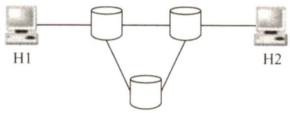  

A. 80ms B. $80.08\mathrm{{ms}}$ C. 80.16ms D. $80.24\mathrm{{ms}}$  

34.【2011统考真题】若某通信链路的数据传输速率为 $2400\mathrm{b/s}$ ，采用4相位调制，则该链路的波特率是（）。  

A.600Baud B.1200Baud C. 4800Baud D. 9600Baud  

35.【2013统考真题】下图为10BaseT网卡接收到的信号波形，则该网卡收到的比特串是(）。  

$$
\square\square\square\square\square\square\square\square
$$  

A．0011 0110 B．1010 1101   
C. 01010010 D. 1100 0101  

36.【2013统考真题】主机甲通过1个路由器（存储转发方式）与主机乙互联，两段链路的数据传输速率均为 $10\mathbf{Mb}/\mathbf{s}$ ，主机甲分别采用报文交换和分组大小为10kb的分组交换向主机乙发送一个大小为8Mb（ $1\mathrm{M}=10^{6}$ ）的报文。若忽略链路传播延迟、分组头开销和分组拆装时间，则两种交换方式完成该报文传输所需的总时间分别为（）。  

A. $800\mathrm{{ms}}$ 、 $1600\mathrm{{ms}}$ B. $801\mathrm{{ms}}$ ， $1600\mathrm{{ms}}$ C. $1600\mathrm{{ms}}$ ， $800\mathrm{{ms}}$ D. 1600ms、801ms  

37.【2014统考真题】下列因素中，不会影响信道数据传输速率的是（）。  

A．信噪比 B．频率宽带 C.调制速率 D.信号传播速度  

38.【2015统考真题】使用两种编码方案对比特流01100111进行编码的结果如下图所示，编码1和编码2分别是（）。  

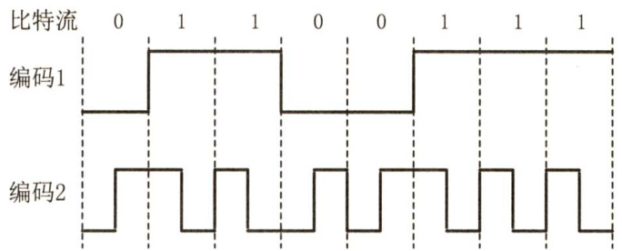  

A.NRZ和曼彻斯特编码 B.NRZ和差分曼彻斯特编码C.NRZI和曼彻斯特编码 D.NRZI和差分曼彻斯特编码  

39.【2016统考真题】如下图所示，如果连接R2和R3链路的频率带宽为 $8\mathrm{kHz}$ ，信噪比为$30\mathrm{dB}$ ，该链路实际数据传输速率约为理论最大数据传输速率的 $50\%$ ，那么该链路的实际数据传输速率约为（）。  

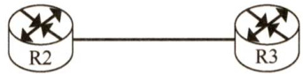  

A.8kb/s B.20kb/s C. $40\mathrm{kb/s}$ D. $80\mathrm{kb/s}$  

40.【2017统考真题】若信道在无噪声情况下的极限数据传输速率不小于信噪比为30dB条件下的极限数据传输速率，则信号状态数至少是（）。  

A.4 B.8 C.16 D.32  

41.【2020统考真题】下列关于虚电路网络的叙述中，错误的是（）。  

A.可以确保数据分组传输顺序  
B.需要为每条虚电路预分配带宽  
C．建立虚电路时需要进行路由选择  
D.依据虚电路号（VCID）进行数据分组转发  

42.【2021统考真题】下图为一段差分曼彻斯特编码信号波形，该编码的二进制串是（）。  

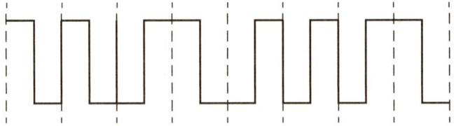  

A．10111001 B.11010001 C.0010 1110 D.1011 0110  

#### 二、综合应用题  

01.试比较分组交换与报文交换，并说明分组交换优越的原因。  

02.假定在地球和月球之间建立一条 $100\mathrm{Mb/s}$ 的链路。月球到地球的距离约为 $385000\mathrm{km}$ 数据在链路上以光速 $3{\times}10^{8}\mathrm{m/s}$ 传输。  

1）计算该链路的最小RTT。  
2）使用RTT作为延迟，计算该链路的“延迟 $.\times$ 带宽”值。  
3）在2）中计算的“延迟 $.{\times}$ 带宽”值的含义是什么？  
4）在月球上用照相机拍取地球的相片，并把它们以数字形式保存到磁盘上。假定要在地球上下载25MB的最新图像，那么从发出数据请求到传送结束最少要花多少时间？  

03.如下图所示，主机A和B都通过10Mb/s链路连接到交换机S。  

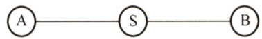  

在每条链路上的传播延迟都是 $20\upmu\mathrm{s}$ 。S是一个存储转发设备，在它接收完一个分组 $35\upmu\mathrm{s}$ 后开始转发收到的分组。试计算把10000bit从A发送到B所需要的总时间。  

1）作为单个分组。  
2）作为两个5000bit的分组一个紧接着另一个发送。  

04.一个简单的电话系统由两个端局和一个长途局连接而成，端局和长途局之间由1MHz的全双工主干连接。在8小时的工作日中，一部电话平均使用4次，每次的平均使用时间为6分钟。在所有通话中， $10\%$ 的通话是长途(即通过端局)假定每条通话线路的带宽是 $4\mathrm{kHz}$ 请分析一个端局能支持的最大电话数。  

05.T1系统共有24个话路进行时分复用，每个话路采用7比特编码，然后加上1比特信令码元，24个话路的一次采样编码构成一帧。另外，每帧数据有1比特帧同步码，每秒采样8000次。请问T1的数据率是多少？  

06.一个分组交换网采用虚电路方式转发分组，分组的首部和数据部分分别为 $h$ 位和 $p$ 位。现有 $L$ （ $L\gg p$ ）位的报文要通过该网络传送，源点和终点之间的线路数为 $k$ ，每条线路上的传播时延为 $d$ 秒，数据传输速率为 $b$ 位/秒，虚电路建立连接的时间为 $s$ 秒，每个中间结点有 $m$ 秒的平均处理时延。求源点开始发送数据直至终点收到全部数据所需要的时间。  

#### 2.1.7 答案与解析  

#### 一、单项选择题  

01.D  

信道不等于通信电路，一条可双向通信的电路往往包含两个信道：一条是发送信道，一条是接收信道。另外，多个通信用户共用通信电路时，每个用户在该通信电路都会有一个信道，因此A 错误。调制是把数据变换为模拟信号的过程，B错误。“比特率”在数值上和“波特率”的关系如下：波特率 $\mathbf{\Sigma}=\mathbf{\Sigma}$ 比特率/每符号含的比特数，C错误。  

02.A  

依香农定理，信道的极限数据传输速率 $=W\log_{2}(1+S/N)$ ，影响信道最大传输速率的因素主要有信道带宽和信噪比，而信噪比与信道内所传信号的平均功率和信道内部的高斯噪声功率有关，在数值上等于两者之比。  

03.B  

并行传输的特点：距离短、速度快。串行传输的特点：距离长、速度慢。所以在计算机内部（距离短）传输应选择并行传输。同步、异步传输是通信方式，不是传输方式。  

04.B  

曼彻斯特编码将每个码元分成两个相等的间隔。前面一个间隔为高电平而后一个间隔为低电平表示码元1，码元0正好相反；也可以采用相反的规定，因此选项D错。位中间的跳变作为时钟信号，每个码元的电平作为数据信号，因此选项B正确。曼彻斯特编码将时钟和数据包含在数据流中，在传输代码信息的同时，也将时钟同步信号一起传输到对方，因此选项A错。声音是模拟数据，而曼彻斯特编码最适合传输二进制数字信号，因此选项C错。  

05.A  

非归零编码是最简单的一种编码方式，它用低电平表示0，用高电平表示1；或者相反。由于每个码元之间并没有间隔标志，所以它不包含同步信息。  

曼彻斯特编码和差分曼彻斯特编码都将每个码元分成两个相等的时间间隔。将每个码元的中间跳变作为收发双方的同步信息，所以无须额外的同步信息，实际应用较多。但它们所占的频带宽度是原始基带宽度的2倍。  

06.D  

QAM 是一种用模拟信号传输数字数据的编码方式。曼彻斯特编码和差分曼彻斯特编码都是用数字信号传输数字数据的编码方式。使用数字信号编码模拟数据最常见的例子是用于音频信号的脉冲编码调制（PCM)。  

07.D  

将基带信号直接传送到通信线路（数字信道）上的传输方式称为基带传输，把基带信号经过调制后送到通信线路（模拟信道）上的方式称为频带传输。  

08.A  

波特率表示信号每秒变化的次数（注意和比特率的区别)。  

09.B  

因为以太网采用曼彻斯特编码，每位数据（一个比特，对应信息传输速率）都需要两个电平（两个脉冲信号，对应码元传输速率）来表示，因此波特率是数据率的两倍，得数据率为 $(40\mathbf{Mb}/\mathbf{s})/2\ =$ 20Mb/s。  

注意：对于曼彻斯特编码，每个比特需要两个信号周期，20MBaud的信号率可得 $10\mathbf{Mb}/\mathbf{s}$ 的数据率，编码效率是 $50\%$ ；对于4B/5B编码，每4比特组被编码成5比特，12.5MBaud的信号率可得 $10\mathbf{Mb}/\mathbf{s}$ ，编码效率是 $80\%$ 。  

10.D  

比特率 $\mathbf{\Sigma}=\mathbf{\Sigma}$ 波特率 $\mathbf{\nabla}\times\mathrm{log}_{2}n$ ，若一个码元含有 $k$ 比特的信息量，则表示该码元所需要的不同离散值为 $\scriptstyle n=2^{k}$ 个。数值上，波特率 $\mathbf{\Sigma}=\mathbf{\Sigma}$ 比特率/每码元所含比特数，因此每码元所含比特数 $=4000/1000=4$ 比特，有效离散值的个数为 $2^{4}=16$ o  

11.B  

一个码元若取 $2^{n}$ 个不同的离散值，则含有 $n$ 比特的信息量。本题中，一个码元含有的信息量为2比特，由于数值上波特率 $\mathbf{\Sigma}=\mathbf{\Sigma}$ 比特率/每符号所含比特数，因此波特率为 $(64/2)\mathbf{k}=$ 32kBaud。  

12.C  

无噪声的信号应该满足奈奎斯特定理，即最大数据传输速率 $=2W\log_{2}V$ 比特/秒。将题目中的数据代入，得到答案是 $48\mathbf{kHz}$ 。注意题目中给出的每秒采样 $24\mathrm{kHz}$ 是无意义的，因为超过了波  

特率的上限 $2W=16\mathrm{kBaud}$ ，所以D是错误答案。  

13.D  

根据奈奎斯特定理，本题中 $W=4000\mathrm{{Hz}}$ ，最大码元传输速率 $=2W=8000\mathrm{Ba}\mathrm{u}$ d，16种不同的物理状态可表示 $\log_{2}16=4$ 比特数据，所以信道的最大传输速率 $=8000{\times}4=32\mathbf k b/\mathbf s$ 0  

14.B  

依据香农定理，最大数据率 $=W\log_{2}(1+S/N)=4000{\times}\log_{2}(1+127)=28000{\mathrm{b/s}}$ ，本题容易误选A。但是，注意题中“二进制信号”的限制，依据奈奎斯特定理，最大数据传输速率 $=2H\ \log_{2}V=$ $2{\times}4000{\times}10\mathbf{g}_{2}2=8000\mathbf{b}/\mathbf{s}$ ，两个上限中取最小的，因此选B。  

注意：若给出了码元与比特数之间的关系，则需受两个公式的共同限制，关于香农定理和奈奎斯特定理的比较，请参考本章疑难点4。  

15.C  

信噪比S/N常用分贝（dB）表示，数值上等于 $10\mathrm{log}_{10}(S/N)\mathrm{dB}$ 。依题意有 $30=10\mathrm{log}_{10}(S/N)$ 可解出 $S/N=1000$ 。根据香农定理，最大数据传输速率 $=3000\mathrm{log}_{2}(1+{S}/{N}){\approx}30\mathrm{kb}/{\mathrm{s}}$ o  

16.D  

每个信号有 $8\times2=16$ 种变化，每个码元携带 $\log_{2}16=4$ 比特的信息，则信息传输速率为 $1200\times$ $4=4800\mathrm{b/s}$ 。  

17.B  

由题意知，采样频率为 $8\mathrm{Hz}$ 。有16种变化状态的信号可携带4比特数据，因此由最大数据传输速率为 $8{\times}4=32{\mathrm{b}}/{\mathrm{s}}$ 。  

18.C  

1路模拟信号的最大频率为 $1\mathrm{kHz}$ ，根据采样定理可知采样频率至少为 $2\mathrm{kHz}$ ，每个样值编码为4位二进制数，所以数据传输速率为 $8\mathbf{k}\mathbf{b}/\mathbf{s}$ 。复用的每条支路速率要相等，而另外7路数字信号的速率均低于 $8\mathbf{k}\mathbf{b}/\mathbf{s}$ ，所以它们均要采用脉冲填充方式，将数据率提高到 $8\mathrm{{kb/s}}$ ，然后将这8路信号复用，需要的通信能力为 $8\mathbf{k}\mathbf{b}/\mathbf{s}\times8=64\mathbf{k}\mathbf{b}/\mathbf{s}$ 。  

19.A  

声音信号需要128个量化级，那么每采样一次需要 $10\mathrm{g}_{2}128=7\mathrm{bit}$ 来表示，每秒采样8000次，那么一路话音需要的数据传输速率为 $8000{\times}7=56\mathrm{kb}/\mathrm{s}$ 0  

20.B  

在报文交换中，交换的数据单元是报文。由于报文大小不固定，在交换结点中需要较大的存储空间，另外报文经过中间结点的接收、存储和转发时间较长而且也不固定，因此不能用于实时通信应用环境（如语音、视频等)。  

21.A  

在以太网中，数据以帧的形式传输。源端用户的较长报文要被分为若干数据块，这些数据块在各层还要加上相应的控制信息，在网络层是分组，在数据链路层是以太网的帧。以太网的用户在会话期间只是断续地使用以太网链路。  

22.A  

电路交换虽然建立连接的时延较大，但在数据传输时是一直占据链路的，实时性更好，传输时延小。  

23.C  

相对于报文交换而言，分组交换中将报文划分为一个个具有固定最大长度的分组，以分组为单位进行传输。  

24.D  

电路交换不具备差错控制能力，A正确。分组交换对每个分组的最大长度有规定，超过此长度的分组都会被分割成几个长度较小的分组后再发送，B正确。由第25题的解析可知C正确、D错误。  

25.A、A、A、C、B  

本题综合考查几种数据交换方式及数据报和虚电路的特点。  

电路交换方式的优点是传输时延小、通信实时性强，适用于交互式会话类通信；但其缺点是对突发性通信不适应，系统效率低，不具备存储数据的能力，不能平滑网络通信量，不具备差错控制的能力，无法纠正传输过程中发生的数据差错。  

报文交换和分组交换都采用存储转发，传送的数据都要经过中间结点的若干存储、转发才能到达目的地，因此传输时延较大。报文交换传送数据长度不固定且较长，分组交换中，要将传送的长报文分割为多个固定有限长度的分组，因此传输时延较报文交换要小。  

分组交换在实际应用中又可分为数据报和虚电路两种方式。数据报是面向无连接的，它提供的是一种不可靠的服务，它不保证分组不被丢失，也不保证分组的顺序不变及在多长的时限到达目的主机。但由于每个分组能独立地选择传送路径，当某个结点发生故障时，后续的分组就可另选路径；另外通过高层协议如TCP的差错控制和流量控制技术可以保证其传输的可靠性、有序性。虚电路是面向连接的，它提供的是一种可靠的服务，能保证数据的可靠性和有序性。但是由于所有分组都按同一路由进行转发，一旦虚电路中的某个结点出现故障，它就必须重新建立一条虚电路。因此，对于出错率高的传输系统，易出现结点故障，这项任务就显得相当艰巨。所以，采用数据报方式更合适。  

注意：此题中的“出错率很高”意思是指出错率要比在早期的广域网中采用的电话网的出错率高很多。电话网的出错率虽然和数字光纤网的出错率相比很高，但实际上还是算较低的，所以早期的广域网大多采用虚电路交换的方案。  

26.C  

虚电路服务是有连接的，属于同一条虚电路的分组，根据该分组的相同虚电路标识，按照同  

一路由转发，保证分组的有序到达。数据报服务中，网络为每个分组独立地选择路由，传输不保证可靠性，也不保证分组的按序到达。  

27.D  

分组交换有两种方式：虚电路和数据报。在虚电路服务中，属于同一条虚电路的分组按照同一路由转发；在数据报服务中，网络为每个分组独立地选择路由，传输不保证可靠性，也不保证分组的按序到达。  

28.D  

关于虚电路和数据报的比较请参考表2.1。  

29.D  

电路交换是真正的物理线路交换，例如电话线路；虚电路交换是多路复用技术，每条物理线路可以进行多条逻辑上的连接，A 错误。虚电路不只是临时性的，它提供的服务包括永久性虚电路(PVC）和交换型虚电路（SVC)，其中前者是一种提前定义好的、基本上不需要任何建立时间的端点之间的连接，而后者是端点之间的一种临时性连接，这些连接只持续所需的时间，并且在会话结束时就取消这种连接，B错误。数据报服务是无连接的，不提供可靠性保障，也不保证分组的有序到达，C 错误。数据报服务中，每个分组在传输过程中都必须携带源地址和目的地址；而虚电路服务中，在建立连接后，分组只需携带虚电路标识，而不必带有源地址和目的地址，D正确。  

30.C  

虚电路属于分组交换的一种，它和电路交换有着本质的差别，A错误。虚电路之所以是“虚”的，是因为这条电路不是专用的，每个结点到其他结点之间可能同时有若干虚电路通过，它也可能同时与多个结点之间建立虚电路，B错误。一个特定会话的虚电路是事先建立好的，因此它的数据分组所走的路径也是固定的，D错误。  

31.C  

电路交换和报文交换不采用分组交换技术。数据报传输方式没有差错控制和流量控制机制，也不保证分组按序交付。虚电路方式提供面向连接的、可靠的、保证分组按序到达的网络服务。  

32.B  

采用4个相位，每个相位有4种幅度的QAM调制方法，每个信号可以有16种变化，传输4比特的数据。根据奈奎斯特定理，信息的最大传输速率为 $2W\log_{2}V=2\times3{\bf k}\times4=24{\bf k}{\bf b}/{\bf s}\mathrm{~,~}$  

注意本题与第17题的区别：第17题已知波特率，而本题仅给出了带宽，因此需要先用奈奎斯特定理计算出最大的波特率。  

33.C  

解析请扫右侧二维码查阅。  

34.B  

波特率 $B$ 与数据传输速率 $C$ 的关系为 $C=B\log_{2}N,$ $N$ 为一个码元所取的离散值个数。采用4  

种相位，也即可以表示4种变化，因此一个码元可携带 $\log_{2}4=2$ 比特信息，则该链路的波特率 $\mathbf{\Sigma}=\mathbf{\Sigma}$ 比特率/每码元所含比特数 $=2400/2=1200$ 波特。  

35.A  

10BaseT即 $10\mathbf{M}\mathbf{b}/\mathbf{s}$ 的以太网，采用曼彻斯特编码，将一个码元分成两个相等的间隔，前一个间隔为低电平而后一个间隔为高电平表示码元1；码元0正好相反。也可以采用相反的规定。因此，对应比特串可以是 $00110110$ 或11001001。  

36.D  

传输图为：甲—路由器- 乙。  

在题目没有明确说明的情况下，不考虑排队时延和处理时延，只考虑发送时延和传播时延，本题中忽略传播时延，因此只针对报文交换和分组交换计算发送时延即可。  

计算报文交换的发送时延。报文交换将信息直接传输，其发送时延是每个结点转发报文的时间。而对于每个结点，均有发送时延 $T=8\mathbf{M}\mathbf{b}/10\mathbf{M}\mathbf{b}/\mathbf{s}=0.8\mathbf{s}$ ，由于数据从甲发出，又被路由器转发1次，因此一共有2个发送时延，所以总发送时延为1.6s，即报文交换的总时延为1.6s，排除A、B选项。  

计算分组交换的发送时延。简单画出前3个分组的发送时间示意图如下。  

图中 $t$ 为第2个分组等待第1个分组从第1个结点发送完毕的时间。观察发现，在所有分组长度相同的情况下，总的发送时延应为第1个分组到达接收端的时间，加上其余所有分组等待第1个分组在第1个结点的时间 $t$ ，即总的发送时延 $T=t_{1}+(n-\ 1)t$ ，其中 $t_{1}$ 为第1个分组到达接收端的时间， $n$ 为分组数量， $t$ 为第2个分组等待第1个分组从第1个结点发送完毕的时间。首先计算 $t_{1}$ ，同样，分组1从甲发送，被路由器转发，一共有2个发送时延，即 $t_{1}=$ $(10\mathbf{k}\mathbf{b}/10\mathbf{M}\mathbf{b}/\mathbf{s}){\times}2=2\mathbf{m}\mathbf{s}$ 。其次计算分组数量 $n$ ，由于忽略分组头开销，因此 $n=8\mathbf{M}\mathbf{b}/10\mathbf{k}\mathbf{b}=800$ 。将结果代入 $T$ 的公式，求得发送时延 $T=801\mathrm{ms}$ 。  

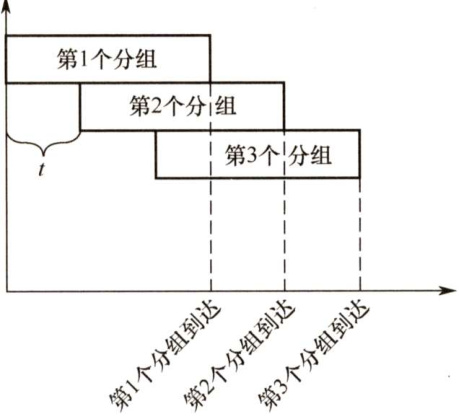  

37. D  

由香农定理可知，信噪比和频率带宽都可限制信道的极限传输速率，所以信噪比和频率带宽对信道的数据传输速率是有影响的，选项A、B错误；信道传输速率实际上就是信号的发送速率，而调制速率也会直接限制数据传输速率，选项C错误；信号的传播速率是信号在信道上传播的速率，与信道的发送速率无关，选D。  

38.A  

NRZ是最简单的串行编码技术，它用两个电压来代表两个二进制数，如高电平表示1，低电平表示0，题中编码1符合。NRZI是用电平的一次翻转来表示0，与前一个NRZI电平相同的电平表示1。曼彻斯特编码将一个码元分成两个相等的间隔，前一个间隔为高电平而后一个间隔为低电平表示1；0的表示方式正好相反，题中编码2符合。  

39.C  

香农定理给出了带宽受限且有高斯白噪声干扰的信道的极限数据传输速率，香农定理定义  

为：信道的极限数据传输速率 $=W\log_{2}(1+S/N)$ ，单位 $\mathsf{b}/\mathsf{s}$ 。其中， $S/N$ 为信噪比，即信号的平均功率和噪声的平均功率之比，信噪比 $\mathbf{\tau}=10\log_{10}(S/N)$ ，单位dB，当 $S/N=1000$ 时，信噪比为 $30\mathrm{dB}$ 。则该链路的实际数据传输速率约为 $50\%\times W\log_{2}(1+S/N)=50\%\times8\mathrm{{k}\times{l o g}_{2}(1+1000)=40\mathrm{{k}\mathrm{{b}/{s}}}}$ 。  

40.D  

可用奈奎斯特采样定理计算无噪声情况下的极限数据传输速率，用香农第二定理计算有噪信道极限数据传输速率。 $2W\log_{2}N\geq W\log_{2}(1+S/N)$ ， $W$ 是信道带宽， $N$ 是信号状态数， $S/N$ 是信噪比。将数据代入公式，可得 $N\geq32$ ，选 $\mathrm{~D~}$ 。分贝数 $\mathbf{\tau}=10\log_{10}(S/N)$ 。  

41.B  

虚电路服务需要有建立连接的过程，每个分组使用短的虚电路号，属于同一条虚电路的分组按照同一路由进行转发，分组到达终点的顺序与发送顺序相同，可以保证有序传输，不需要为每条虚电路预分配带宽。  

42.A  

解析请扫右侧二维码查阅。  

#### 二、综合应用题  

解析及视频讲解  

01.【解答】  

报文交换与分组交换的原理如下：用户数据加上源地址、目的地址、长度、校验码等辅助信息后，封装成PDU，发给下一个结点。下一个结点收到后先暂存报文，待输出线路空闲时再转发给下一个结点，重复该过程直到到达目的结点。每个PDU可单独选择到达目的结点的路径。  

不同之处在于：分组交换生成的PDU的长度较短且是固定的，而报文交换生成的PDU的长度不是固定的。正是这一差别使得分组交换具有独特的优点： $\textcircled{1}$ 缓冲区易于管理； $\textcircled{2}$ 分组的平均延迟更小，网络中占用的平均缓冲区更少； $\textcircled{3}$ 更易标准化； $\textcircled{4}$ 更适合应用。因此，现在的主流网络基本上都可视为分组交换网络。  

02.【解答】  

RTT表示往返传输时间（等于单向传输时间的2倍）。  

1）最小RTT等于 $2\times38500000000/(3\times10^{8}\mathrm{m/s})=2.57\mathrm{s}$ 。  
2）“延迟 $\times$ 带宽”值等于 $2.57{\mathrm{s}}\times100\mathbf{M}\mathbf{b}/{\mathrm{s}}=257\mathbf{M}\mathbf{b}\approx32\mathbf{M}\mathbf{B}$ 。  
3）它表示发送方在收到一个响应之前能够发送的数据量。  
4）在图像可以开始到达地面之前，至少需要一个RTT。假定仅有带宽延迟，那么发送需要的时间等于 $25\mathrm{MB}/(100\mathrm{Mb}/\mathrm{s})=(25\times1024\times1024\times8)\mathrm{bit}/(100\mathrm{Mb}/\mathrm{s})\approx2.1\mathrm{s}$ 。因此，直到最后一个图像位到达地球，总共花的时间等于 $2.1+2.57=4.67\mathrm{s}$ 。  

03.【解答】  

1）每条链路的发送延迟是 $10000/(10\mathrm{Mb/s})=1000\upmu\mathrm{s}$ O总传送时间等于 $2{\times}1000+2{\times}20+35=2075\upmu\mathrm{s}$ 。  

2）作为两个分组发送时，下面列出的是各种事件发生的时间表：  

$T=0$ 开始$T=500$ A完成分组1的发送，开始发送分组2  

$T=520$ 分组1完全到达S$T=555$ 分组1从S起程前往B$T=1000$ A结束了分组2的发送$T=1055$ 分组2从S起程前往B$T=1075$ 分组2的第1位开始到达B$T=1575$ 分组2的最后1位到达B  

事实上，从开始发送到A把第2个分组的最后1位发送完，经过的时间为 $2\times500\upmu\mathrm{s}$ ，第1个链路延迟 $20\upmu\mathrm{s}$ ，交换机延迟 $35\upmu\mathrm{s}$ （然后才能开始转发第2个分组)，发送延尺为 $500\upmu\mathrm{s}$ ，第2个链路延迟 $20\upmu\mathrm{s}$ 。所以，总时间等于 $2\times500\upmu\mathrm{s}+20\upmu\mathrm{s}+35\upmu\mathrm{s}+500\upmu\mathrm{s}+20\upmu\mathrm{s}=1575\upmu\mathrm{s}.$  

04.【解答】  

每部电话平均每小时通话次数 $=4/8=0.5$ 次，每次通话6分钟，因此一部电话每小时占用一条电路3分钟，即20部电话可共享一条线路。由于只有 $10\%$ 的呼叫是长途，因此200部电话占用一条完全时间的长途线路。局间干线复用了 $10^{6}/(4\times10^{3})=250$ 条线路，每条线路支持200部电话，因此一个端局能支持的最大电话数是 $200{\times}250=50000$ 部。  

05.【解答】  

由于每个话路采用7bit编码，然后再加上1bit信令码元，因此一个话路占用8bit。帧同步码是在24路的编码之后加上1bit，因此每帧有 $8{\mathrm{bit}}\times24+1{\mathrm{bit}}=193{\mathrm{bit}}.$  

因为每秒采样8000次，因此采样频率为 $8000\mathrm{{Hz}}$ ，即采样周期为 $1/8000\mathrm{s}=125\upmu\mathrm{s}$ 。所以T1的数据率为 $193\mathrm{bit}/(125{\times}10^{-6}\mathrm{s})=1.544\mathrm{Mb}/\mathrm{s},$ 。  

06.【解答】  

整个传输过程的总时延 $\mathbf{\Sigma}=\mathbf{\Sigma}$ 连接建立时延 $^+$ 源点发送时延 $^+$ 中间结点的发送时延 $^+$ 中间结点的处理时延 $^+$ 传播时延。  

虚电路的建立时延已给出，为 $s$ 秒。  

源点要将 $L$ 位的报文分割成分组，分组数 $=L/p$ ，每个分组的长度为 $(h+p)$ ，源点要发送的数据量 $=(h+p)L/p$ ，所以源点的发送时延 $=(h+p)L/(p b)$ 秒。  

每个中间结点的发送时延 $=(h+p)/b$ 秒，源点和终点之间的线路数为 $k$ ，所以有 $k-1$ 个中间结点，因此中间结点的发送时延 $=(h+p)(k-1)/b$ 秒。  

中间结点的处理时延 $=m(k-1)$ 秒，传播时延 $=k d$ 秒。所以源结点开始发送数据直至终点收到全部数据所需要的时间 $=s+(h+p)L/(p b)+(h+p)(k-1)/b+m(k-1)+k d$ 秒。