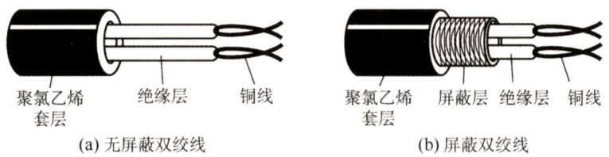
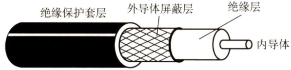
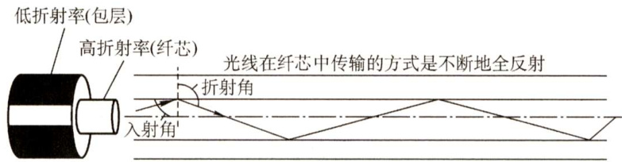
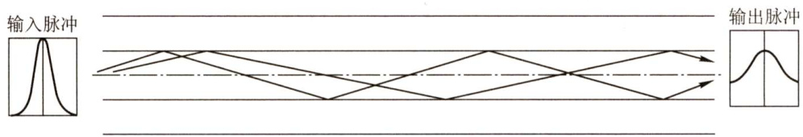
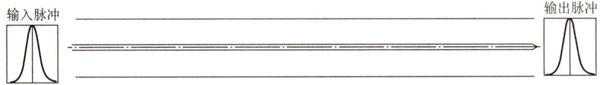

#### 2.2 传输介质  

#### 2.2.1 双绞线、同轴电缆、光纤与无线传输介质  

传输介质也称传输媒体，它是数据传输系统中发送设备和接收设备之间的物理通路。传输介  

质可分为导向传输介质和非导向传输介质。在导向传输介质中，电磁波被导向沿着固体媒介（铜线或光纤）传播，而非导向传输介质可以是空气、真空或海水等。  

#### 1．双绞线  

双绞线是最常用的古老传输介质，它由两根采用一定规则并排绞合的、相互绝缘的铜导线组成。绞合可以减少对相邻导线的电磁干扰。为了进一步提高抗电磁干扰的能力，可在双绞线的外面再加上一层，即用金属丝编织成的屏蔽层，这就是屏蔽双绞线（STP)。无屏蔽层的双绞线称为非屏蔽双绞线（UTP)。它们的结构如图2.7所示。  

  
图2.7 双绞线的结构  

双绞线的价格便宜，是最常用的传输介质之一，在局域网和传统电话网中普遍使用。双绞线的带宽取决于铜线的粗细和传输的距离。模拟传输和数字传输都可使用双绞线，其通信距离一般为几千米到数十千米。距离太远时，对于模拟传输，要用放大器放大衰减的信号；对于数字传输，要用中继器将失真的信号整形。  

#### 2.同轴电缆  

同轴电缆由内导体、绝缘层、网状编织屏蔽层和塑料外层构成，如图2.8所示。按特性阻抗数值的不同，通常将同轴电缆分为两类：50Ω同轴电缆和75Ω同轴电缆。其中，50Ω同轴电缆主要用于传送基带数字信号，又称基带同轴电缆，它在局域网中应用广泛；75Ω同轴电缆主要用于传送宽带信号，又称宽带同轴电缆，主要用于有线电视系统。  

  
图2.8 同轴电缆的结构  

由于外导体屏蔽层的作用，同轴电缆具有良好的抗干扰特性，被广泛用于传输较高速率的数据，其传输距离更远，但价格较双绞线贵。  

#### 3.光纤  

光纤通信就是利用光导纤维（简称光纤）传递光脉冲来进行通信。有光脉冲表示1，无光脉冲表示0。可见光的频率约为 $10^{8}\mathrm{MHz}$ ，因此光纤通信系统的带宽范围极大。  

光纤主要由纤芯和包层构成（见图2.9)，纤芯很细，其直径只有8至 $100\upmu\mathrm{m}$ ，光波通过纤芯进行传导，包层较纤芯有较低的折射率。当光线从高折射率的介质射向低折射率的介质时，其折射角将大于入射角。因此，只要入射角大于某个临界角度，就会出现全反射，即光线碰到包层时就会折射回纤芯，这个过程不断重复，光也就沿着光纤传输下去。  

  
图2.9光波在纤芯中的传播  

利用光的全反射特性，可以将从不同角度入射的多条光线在一根光纤中传输，这种光纤称为多模光纤（见图2.10)，多模光纤的光源为发光二极管。光脉冲在多模光纤中传输时会逐渐展宽，造成失真，因此多模光纤只适合于近距离传输。  

  
图2.10 多模光纤  

光纤的直径减小到只有一个光的波长时，光纤就像一根波导那样，可使光线一直向前传播，而不会产生多次反射，这样的光纤就是单模光纤（见图2.11)。单模光纤的纤芯很细，直径只有几微米，制造成本较高。同时，单模光纤的光源为定向性很好的半导体激光器，因此单模光纤的衰减较小，可传输数公里甚至数十千米而不必采用中继器，适合远距离传输。  

  
图2.11 单模光纤  

光纤不仅具有通信容量非常大的优点，还具有如下特点：  

1）传输损耗小，中继距离长，对远距离传输特别经济。  
2）抗雷电和电磁干扰性能好。这在有大电流脉冲干扰的环境下尤为重要。  
3）无串音干扰，保密性好，也不易被窃听或截取数据。  
4）体积小，重量轻。这在现有电缆管道已拥塞不堪的情况下特别有利。  

#### 4.无线传输介质  

无线通信已广泛应用于移动电话领域，构成蜂窝式无线电话网。随着便携式计算机的出现，以及在军事、野外等特殊场合下移动通信联网的需要，促进了数字化移动通信的发展，现在无线局域网产品的应用已非常普遍。  

#### （1）无线电波  

无线电波具有较强的穿透能力，可以传输很长的距离，所以它被广泛应用于通信领域，如无线手机通信、计算机网络中的无线局域网（WLAN）等。因为无线电波使信号向所有方向散播，因此有效距离范围内的接收设备无须对准某个方向，就可与无线电波发射者进行通信连接，大大简化了通信连接。这也是无线电传输的最重要优点之一。  

#### （2）微波、红外线和激光  

目前高带宽的无线通信主要使用三种技术：微波、红外线和激光。它们都需要发送方和接收  

方之间存在一条视线（Line-of-sight）通路，有很强的方向性，都沿直线传播，有时统称这三者为视线介质。不同的是，红外通信和激光通信把要传输的信号分别转换为各自的信号格式，即红外光信号和激光信号，再直接在空间中传播。  

微波通信的频率较高，频段范围也很宽，载波频率通常为 $2{\sim}40\mathrm{GHz}$ ，因而通信信道的容量大。例如，一个带宽为2MHz的频段可容纳500条语音线路，若用来传输数字信号，数据率可达数兆比特/秒。与通常的无线电波不同，微波通信的信号是沿直线传播的，因此在地面的传播距离有限，超过一定距离后就要用中继站来接力。  

卫星通信利用地球同步卫星作为中继来转发微波信号，可以克服地面微波通信距离的限制。三颗相隔 $120^{\circ}$ 的同步卫星几乎能覆盖整个地球表面，因而基本能实现全球通信。卫星通信的优点是通信容量大、距离远、覆盖广，缺点是保密性差、端到端传播时延长。  

#### 2.2.2 物理层接口的特性  

物理层考虑的是如何在连接到各种计算机的传输媒体上传输数据比特流，而不指具体的传输媒体。网络中的硬件设备和传输介质的种类繁多，通信方式也各不相同。物理层应尽可能屏蔽这些差异，让数据链路层感觉不到这些差异，使数据链路层只需考虑如何完成本层的协议和服务。  

物理层的主要任务可以描述为确定与传输媒体的接口有关的一些特性：  

1）机械特性。指明接口所用接线器的形状和尺寸、引脚数目和排列、固定和锁定装置等。  
2）电气特性。指明在接口电缆的各条线上出现的电压的范围。  
3）功能特性。指明某条线上出现的某一电平的电压表示何种意义。  
4）过程特性。或称规程特性。指明对于不同功能的各种可能事件的出现顺序。  
常用的物理层接口标准有EIARS-232-C、ADSL和SONET/SDH等。  

#### 2.2.3 本节习题精选  

#### 一、单项选择题  

01．双绞线是用两根绝缘导线绞合而成的，绞合的目的是（）。  

A.减少干扰 B．提高传输速度C.增大传输距离 D.增大抗拉强度  

02．在电缆中采用屏蔽技术带来的好处主要是（）。  

A.减少信号衰减 B.减少电磁干扰辐射C.减少物理损坏 D.减少电缆的阻抗  

03．利用一根同轴电缆互连主机构成以太网，则主机间的通信方式为（）。  

A.全双工 B．半双工C.单工 D.不确定  

04.同轴电缆比双绞线的传输速率更快，得益于（）。  

A.同轴电缆的铜心比双绞线粗，能通过更大的电流B．同轴电缆的阻抗比较标准，减少了信号的衰减C．同轴电缆具有更高的屏蔽性，同时有更好的抗噪声性D.以上都正确  

05．不受电磁干扰和噪声影响的传输介质是（）。  

A.屏蔽双绞线 B．非屏蔽双绞线 C．光纤 D.同轴电缆  

06．多模光纤传输光信号的原理是（）。  

A光的折射特性 B．光的发射特性C．光的全反射特性 D．光的绕射特性  

07．以下关于单模光纤的说法中，正确的是（）。  

A.光纤越粗，数据传输速率越高  
B．如果光纤的直径减小到只有光的一个波长大小，那么光沿直线传播  
C．光源是发光二极管或激光  
D．光纤是中空的  

08．下面关于卫星通信的说法，错误的是（）。  

A．卫星通信的距离长，覆盖的范围广B.使用卫星通信易于实现广播通信和多址通信C.卫星通信的好处在于不受气候的影响，误码率很低D．通信费用高、延时较大是卫星通信的不足之处  

09．某网络在物理层规定，信号的电平用 $+10\mathrm{{V}}\sim+15\mathrm{{V}}$ 表示二进制0，用-10V～-15V表示二进制1，电线长度限于 $15\mathrm{m}$ 以内，这体现了物理层接口的（）。  

A．机械特性 B．功能特性C.电气特性 D．规程特性  

10．当描述一个物理层接口引脚处于高电平时的含义时，该描述属于（）。  

A．机械特性 B.电气特性C.功能特性 D.规程特性  

11.【2012统考真题】在物理层接口特性中，用于描述完成每种功能的事件发生顺序的是（）。  

A.机械特性 B．功能特性 C．过程特性 D.电气特性  

12.【2018统考真题】下列选项中，不属于物理层接口规范定义范畴的是（）。  

A.接口形状 B.引脚功能C．物理地址 D.信号电平  

#### 2.2.4 答案与解析  

#### 一、单项选择题  

01.A绞合可以减少两根导线相互的电磁干扰。  

02.B屏蔽层的主要作用是提高电缆的抗干扰能力。  

03.B  

传统以太网采用广播的方式发送信息，同一时间只允许一台主机发送信息，否则各主机之间就会形成冲突，因此主机间的通信方式是半双工。全双工是指通信双方可以同时发送和接收信息  

单工是指只有一个方向的通信而没有反方向的交互。  

04.C  

同轴电缆以硬铜线为心，外面包一层绝缘材料，绝缘材料的外面再包围一层密织的网状导体，导体的外面又覆盖一层保护性的塑料外壳。这种结构使得它具有更高的屏蔽性，从而既有很高的带宽，又有很好的抗噪性。因此同轴电缆的带宽更高得益于它的高屏蔽性。  

05.C光纤抗雷电和电磁干扰性能好，无串音干扰，保密性好。  

06.C多模光纤传输光信号的原理是光的全反射特性。  

07.B  

光纤的直径减小到与光线的一个波长相同时，光纤就如同一个波导，光在其中没有反射，而沿直线传播，这就是单模光纤。  

08.C卫星通信有成本高、传播时延长、受气候影响大、保密性差、误码率较高的特点。  

09.C物理层的电气特性规定了信号的电压高低、传输距离等。  

10.C物理层的功能特性指明某条线上出现的某一电平的电压表示何种意义。  

11.C概念题，过程特性定义各条物理线路的工作过程和时序关系。  

12.C  

物理层的接口规范主要分为4种：机械特性、电气特性、功能特性、规程特性。机械特性规定连接所用设备的规格，即A所说的接口形状。电气特性规定信号的电压高低、阻抗匹配等，如D所说的信号电平。功能特性规定线路上出现的电平代表什么意义、接口部件的信号线（数据线、控制线、定时线等）的用途，如B所说的引脚功能。选项C中的物理地址是MAC地址，它属于数据链路层的范畴。