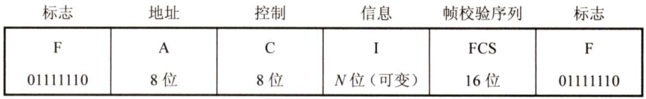
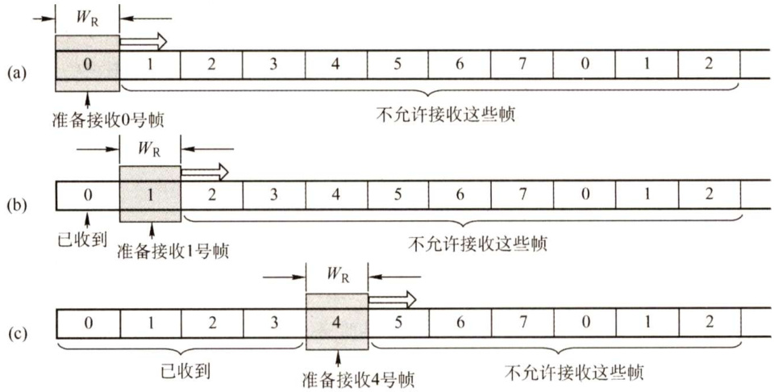

#### 3.1 数据链路层的功能  

数据链路层在物理层提供服务的基础上向网络层提供服务，其主要作用是加强物理层传输原始比特流的功能，将物理层提供的可能出错的物理连接改造为逻辑上无差错的数据链路，使之对  

网络层表现为一条无差错的链路。下面具体介绍数据链路层的功能。  

#### 3.1.1 为网络层提供服务  

对网络层而言，数据链路层的基本任务是将源机器中来自网络层的数据传输到目标机器的网络层。数据链路层通常可为网络层提供如下服务：  

1）无确认的无连接服务。源机器发送数据帧时不需先建立链路连接，目的机器收到数据帧时不需发回确认。对丢失的帧，数据链路层不负责重发而交给上层处理。适用于实时通信或误码率较低的通信信道，如以太网。  
2）有确认的无连接服务。源机器发送数据帧时不需先建立链路连接，但目的机器收到数据帧时必须发回确认。源机器在所规定的时间内未收到确定信号时，就重传丢失的帧，以提高传输的可靠性。该服务适用于误码率较高的通信信道，如无线通信。  
3）有确认的面向连接服务。帧传输过程分为三个阶段：建立数据链路、传输帧、释放数据链路。目的机器对收到的每一帧都要给出确认，源机器收到确认后才能发送下一帧，因而该服务的可靠性最高。该服务适用于通信要求（可靠性、实时性）较高的场合。  

注意：有连接就一定要有确认，即不存在无确认的面向连接的服务。  

#### 3.1.2 链路管理  

数据链路层连接的建立、维持和释放过程称为链路管理，它主要用于面向连接的服务。链路两端的结点要进行通信，必须首先确认对方已处于就绪状态，并交换一些必要的信息以对帧序号初始化，然后才能建立连接，在传输过程中则要能维持连接，而在传输完毕后要释放该连接。在多个站点共享同一物理信道的情况下（如在局域网中）如何在要求通信的站点间分配和管理信道也属于数据链路层管理的范畴。  

#### 3.1.3 帧定界、帧同步与透明传输  

两台主机之间传输信息时，必须将网络层的分组封装成帧，以帧的格式进行传送。将一段数据的前后分别添加首部和尾部，就构成了帧。因此，帧长等于数据部分的长度加上首部和尾部的长度。首部和尾部中含有很多控制信息，它们的一个重要作用是确定帧的界限，即帧定界。而帧同步指的是接收方应能从接收到的二进制比特流中区分出帧的起始与终止。如在HDLC协议中，用标识位F（01111110）来标识帧的开始和结束。通信过程中，检测到帧标识位F即认为是帧的开始，然后一旦检测到帧标识位F即表示帧的结束。HDLC 标准帧格式如图3.1所示。为了提高帧的传输效率，应当使帧的数据部分的长度尽可能地大于首部和尾部的长度，但每种数据链路层协议都规定了帧的数据部分的长度上限—最大传送单元（MTU)。  

  
图3.1HDLC标准帧格式  

如果在数据中恰好出现与帧定界符相同的比特组合（会误认为“传输结束”而丢弃后面的数据)，那么就要采取有效的措施解决这个问题，即透明传输。更确切地说，透明传输就是不管所传数据是什么样的比特组合，都应当能在链路上传送。  

#### 3.1.4 流量控制  

由于收发双方各自的工作速率和缓存空间的差异，可能出现发送方的发送能力大于接收方的接收能力的现象，如若此时不适当限制发送方的发送速率（即链路上的信息流量)，前面来不及接收的帧将会被后面不断发送来的帧“淹没”，造成帧的丢失而出错。因此，流量控制实际上就是限制发送方的数据流量，使其发送速率不超过接收方的接收能力。  

这个过程需要通过某种反馈机制使发送方能够知道接收方是否能跟上自己，即需要有一些规则使得发送方知道在什么情况下可以接着发送下一帧，而在什么情况下必须暂停发送，以等待收到某种反馈信息后继续发送。  

流量控制（见图3.2）并不是数据链路层特有的功能，许多高层协议中也提供此功能，只不过控制的对象不同而已。对于数据链路层来说，控制的是相邻两结点之间数据链路上的流量，而对于运输层来说，控制的则是从源端到目的端之间的流量。  

  
图3.2数据链路层的流量控制  

注意：在OSI体系结构中，数据链路层具有流量控制的功能。而在TCP/IP体系结构中，流量控制功能被移到了传输层。因此，有部分教材将流量控制放在传输层进行讲解。  

#### 3.1.5 差错控制  

由于信道噪声等各种原因，帧在传输过程中可能会出现错误。用以使发送方确定接收方是否正确收到由其发送的数据的方法称为差错控制。通常，这些错误可分为位错和帧错。  

位错指帧中某些位出现了差错。通常采用循环冗余校验（CRC）方式发现位错，通过自动重传请求（Automatic RepeatreQuest，ARQ）方式来重传出错的帧。具体做法是：让发送方将要发送的数据帧附加一定的CRC冗余检错码一并发送，接收方则根据检错码对数据帧进行错误检测，若发现错误则丢弃，发送方超时重传该数据帧。这种差错控制方法称为ARQ法。ARQ法只需返回很少的控制信息就可有效地确认所发数据帧是否被正确接收。  

帧错指帧的丢失、重复或失序等错误。在数据链路层引入定时器和编号机制，能保证每一帧最终都能有且仅有一次正确地交付给目的结点。  

#### 3.1.6 本节习题精选  

#### 单项选择题  

01．下列不属于数据链路层功能的是（）。  

A.帧定界功能 B．电路管理功能C．差错控制功能 D.流量控制功能  

02．数据链路层协议的功能不包括（）。  

A．定义数据格式 B.提供结点之间的可靠传输C.控制对物理传输介质的访问 D.为终端结点隐蔽物理传输的细节  

03．为了避免传输过程中帧的丢失，数据链路层采用的方法是（）。  

A．帧编号机制 B．循环冗余校验码 C.汉明码 D．计时器超时重发  

04．数据链路层为网络层提供的服务不包括（）。  

A.无确认的无连接服务 B．有确认的无连接服务C.无确认的面向连接服务 D.有确认的面向连接服务  

05.对于信道比较可靠且对实时性要求高的网络，数据链路层采用（）比较合适。  

A.无确认的无连接服务 B.有确认的无连接服务C.无确认的面向连接服务 D.有确认的面向连接服务  

06.流量控制实际上是对（）的控制。  

A．发送方的数据流量 B.接收方的数据流量C.发送、接收方的数据流量 D.链路上任意两结点间的数据流量  

07．下述协议中，（）不是数据链路层的标准。  

A.ICMP B.HDLC C.PPP D. SLIP  

08.假设物理信道的传输成功率是 $95\%$ ，而平均一个网络层分组需要10个数据链路层帧来发送。若数据链路层采用无确认的无连接服务，则发送网络层分组的成功率是（）。  

A. $40\%$ B. $60\%$ C. $80\%$ D. $95\%$  

#### 3.1.7 答案与解析  

#### 单项选择题  

01.B  

数据链路层的主要功能有：如何将二进制比特流组织成数据链路层的帧；如何控制帧在物理信道上的传输，包括如何处理传输差错；在两个网络实体之间提供数据链路的建立、维护和释放；控制链路上帧的传输速率，以使接收方有足够的缓存来接收每个帧。这些功能对应为帧定界、差错检测、链路管理和流量控制。电路管理功能由物理层提供，关于“电路”和“链路”的区别请参见本章疑难点1。  

02.D  

数据链路层的主要功能包括组帧，组帧即定义数据格式，A正确。数据链路层在物理层提供的不可靠的物理连接上实现结点到结点的可靠性传输，B正确。控制对物理传输介质的访问由数据链路层的介质访问控制（MAC）子层完成，C正确。数据链路层不必考虑物理层如何实现比特传输的细节，因此D错误。  

03.D  

为防止在传输过程中帧丢失，在可靠的数据链路层协议中，发送方对发送的每个数据帧设计  

一个定时器，当计时器到期而该帧的确认帧仍未到达时，发送方将重发该帧。为保证接收方不会接收到重复帧，需要对每个发送的帧进行编号；汉明码和循环冗余校验码都用于差错控制。  

04.C  

连接是建立在确认机制的基础上的，因此数据链路层没有无确认的面向连接服务。一般情况下，数据链路层会为网络层提供三种可能的服务：无确认的无连接服务、有确认的无连接服务、有确认的面向连接服务。  

05.A  

无确认的无连接服务是指源机器向目标机器发送独立的帧，目标机器并不对这些帧进行确认。事先并不建立逻辑连接，事后也不用释放逻辑连接。若由于线路上有噪声而造成某一帧丢失，则数据链路层并不会检测这样的丢帧现象，也不会回复。当错误率很低时，这一类服务非常合适，这时恢复任务可以留给上面的各层来完成。这类服务对于实时通信也是非常合适的，因为实时通信中数据的迟到比数据损坏更不好。  

06.A  

流量控制是通过限制发送方的数据流量而使发送方的发送速率不超过接收方接收速率的一种技术。流量控制功能并不是数据链路层独有的，其他层上也有相应的控制策略，只是各层的流量控制对象是在相应层的实体之间进行的。  

07.A  

网际控制报文协议（ICMP）是网络层协议，PPP是在SLIP基础上发展而来的，都是数据链路层协议。  

#### 08.B  

要成功发送一个网络层分组，需要成功发送10个数据链路层帧。成功发送10个数据链路层帧的概率是 $(0.95)^{10}{\approx}0.598$ ，即大约只有 $60\%$ 的成功率。这个结论说明了在不可靠的信道上无确认的服务效率很低。为了提高可靠性，应该引入有确认的服务。