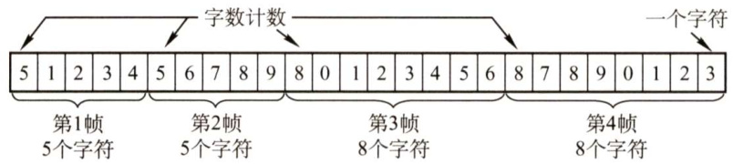
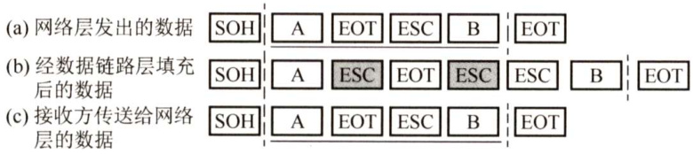
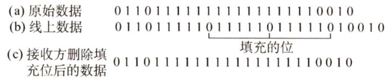

#### 3.2 组帧  

数据链路层之所以要把比特组合成帧为单位传输，是为了在出错时只重发出错的帧，而不必重发全部数据，从而提高效率。为了使接收方能正确地接收并检查所传输的帧，发送方必须依据一定的规则把网络层递交的分组封装成帧（称为组帧)。组帧主要解决帧定界、帧同步、透明传输等问题。通常有以下4种方法实现组帧。  

注意：组帧时既要加首部，又要加尾部。原因是，在网络中信息是以帧为最小单位进行传输的，所以接收端要正确地接收帧，必须要清楚该帧在一串比特流中从哪里开始到哪里结束（因为接收端收到的是一串比特流，没有首部和尾部是不能正确区分帧的）。而分组（即IP数据报）仅是包含在帧中的数据部分（后面将详细讲解），所以不需要加尾部来定界。  

#### 3.2.1 字符计数法  

如图3.3所示，字符计数法是指在帧头部使用一个计数字段来标明帧内字符数。目的结点的数据链路层收到字节计数值时，就知道后面跟随的字节数，从而可以确定帧结束的位置（计数字段提供的字节数包含自身所占用的一个字节)。  

这种方法最大的问题在于如果计数字段出错，即失去了帧边界划分的依据，那么接收方就无法判断所传输帧的结束位和下一帧的开始位，收发双方将失去同步，从而造成灾难性后果。  

  
图3.3字符计数法  

#### 3.2.2字符填充的首尾定界符法  

字符填充法使用特定字符来定界一帧的开始与结束，在图3.4的例子中，控制字符SOH放在帧的最前面，表示帧的首部开始，控制字符EOT表示帧的结束。为了使信息位中出现的特殊字符不被误判为帧的首尾定界符，可在特殊字符前面填充一个转义字符（ESC）来加以区分（注意，转义字符是ASCII码中的控制字符，是一个字符，而非“E”“S”“C”三个字符的组合)，以实现数据的透明传输。接收方收到转义字符后，就知道其后面紧跟的是数据信息，而不是控制信息。  

如图3.4(a)所示的字符帧，帧的数据段中出现EOT或SOH字符，发送方在每个EOT或 SOH字符前再插入一个ESC字符［见图3.4(b)]，接收方收到数据后会自已删除这个插入的ESC字符，结果仍得到原来的数据［见图3.4(c)]。这也正是字符填充法名称的由来。如果转义字符ESC 也出现在数据中，那么解决方法仍是在转义字符前插入一个转义字符。  

  
图3.4 字符填充法  

#### 3.2.3 零比特填充的首尾标志法  

如图3.5所示，零比特填充法允许数据帧包含任意个数的比特，也允许每个字符的编码包含任意个数的比特。它使用一个特定的比特模式，即0111110来标志一帧的开始和结束。为了不使信息位中出现的比特流0111110被误判为帧的首尾标志，发送方的数据链路层在信息位中遇到5个连续的“1”时，将自动在其后插入一个“0”；而接收方做该过程的逆操作，即每收到5个连续的“1”时，自动删除后面紧跟的“0”，以恢复原信息。  

  
图3.5 比特填充法  

零比特填充法很容易由硬件来实现，性能优于字符填充法。  

#### 3.2.4 违规编码法  

在物理层进行比特编码时，通常采用违规编码法。例如，曼彻斯特编码方法将数据比特“1"编码成“高-低”电平对，将数据比特“0”编码成“低-高”电平对，而“高-高”电平对和“低-低”电平对在数据比特中是违规的（即没有采用)。可以借用这些违规编码序列来定界帧的起始和终止。局域网IEEE802标准就采用了这种方法。  

违规编码法不需要采用任何填充技术，便能实现数据传输的透明性，但它只适用于采用余编码的特殊编码环境。  

由于字节计数法中计数字段的脆弱性和字符填充法实现上的复杂性与不兼容性，目前较常用的组帧方法是比特填充法和违规编码法。  

#### 3.2.5 本节习题精选  

#### 综合应用题  

01.在一个数据链路协议中使用下列字符编码：  

A01000111; B11100011; ESC11100000; FLAG01111110在使用下列成帧方法的情况下，说明为传送4个字符A、B、ESC、FLAG所组织的帧而实际发送的二进制位序列（使用FLAG作为首尾标志，ESC作为转义字符）。  

1）字符计数法。  
2）使用字符填充的首尾定界法。  
3）使用比特填充的首尾标志法。  

#### 3.2.6 答案与解析  

#### 综合应用题  

01．【解答】  

1）第一字节为所传输的字符计数5，转换为二进制为00000101，后面依次为A、B、ESC、FLAG的二进制编码：00000101 010001111110001111100000 01111110  

2）首尾标志位FLAG（01111110)，在所传输的数据中，若出现控制字符，则在该字符前插入转义字符ESC（11100000）：01111110 01000111 11100011 11100000 11100000 11100000 01111110 01111110  

3）首尾标志位FLAG（01111110)，在所传输的数据中，若连续出现5个“1”，则在其后插入“0”：01111110 01000111 110100011 111000000 011111010 01111110