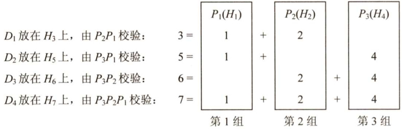

#### 3.3 差错控制  

实际通信链路都不是理想的，比特在传输过程中可能会产生差错，1可能会变成0，0也可能会变成1，这就是比特差错。比特差错是传输差错中的一种，本节仅讨论比特差错。  

通常利用编码技术进行差错控制，主要有两类：自动重传请求ARQ和前向纠错FEC。在ARQ方式中，接收端检测到差错时，就设法通知发送端重发，直到接收到正确的码字为止。在FEC方  

式中，接收端不但能发现差错，而且能确定比特串的错误位置，从而加以纠正。因此，差错控制又可分为检错编码和纠错编码。  

#### 3.3.1 检错编码  

检错编码都采用冗余编码技术，其核心思想是在有效数据（信息位）被发送前，先按某种关系附加一定的冗余位，构成一个符合某一规则的码字后再发送。当要发送的有效数据变化时，相应的冗余位也随之变化，使得码字遵从不变的规则。接收端根据收到的码字是否仍符合原规则来判断是否出错。常见的检错编码有奇偶校验码和循环冗余码。  

注意：建议结合《计算机组成原理考研复习指导》第2章有关校验码的内容对比复习。  

#### 1.奇偶校验码  

奇偶校验码是奇校验码和偶校验码的统称，是一种最基本的检错码。它由 $n-1$ 位信息元和1位校验元组成，如果是奇校验码，那么在附加一个校验元后，码长为 $n$ 的码字中“1”的个数为奇数；如果是偶校验码，那么在附加一个校验元以后，码长为 $n$ 的码字中“1”的个数为偶数。它只能检测奇数位的出错情况，但并不知道哪些位错了，也不能发现偶数位的出错情况。  

#### 2.循环余码  

循环冗余码（CyclicRedundancyCode，CRC）又称多项式码，任何一个由二进制数位串组成的代码都可以与一个只含有0和1两个系数的多项式建立一一对应关系。一个 $k$ 位帧可以视为从 $X^{k-1}$ 到 $\boldsymbol{{X}}^{0}$ 的 $k$ 次多项式的系数序列，这个多项式的阶数为 $k{-}1$ ，高位是$X^{k-1}$ 项的系数，下一位是 $X^{k-2}$ 的系数，以此类推。例如，1110011有7位，表示成多项式是 $X^{6}+X^{5}+X^{4}+$ $X+1$ ，而多项式 $X^{5}+X^{4}+X^{2}+X$ 对应的位串是110110，其运算过程如图3.6所示。  

给定一个 $m$ bit的帧或报文，发送器生成一个 $\boldsymbol{r}$ bit的序列，称为帧检验序列（FCS）。这样所形成的帧将由 $m+r$ 比特组成。发送方和接收方事先商定一个多项式 $G(x)$ （最高位和最低位必须为1)，使这个带检验码的帧刚好能被预先确定的多项式 $G(x)$ 整除。接收方用相同的多项式去除收到的帧，如果无余数，那么认为无差错。  

假设一个帧有 $m$ 位，其对应的多项式为 $M(x)$ ，则计算冗余码的步骤如下：  

1）加0。假设 $G(x)$ 的阶为 $\boldsymbol{r}$ ，在帧的低位端加上 $\boldsymbol{r}$ 个0。  

2）模2除。利用模2除法，用 $G(x)$ 对应的数据串去除1）中计算出的数据串，得到的余数即为冗余码（共 $\boldsymbol{r}$ 位，前面的0不可省略)。  

多项式以2为模运算。按照模2运算规则，加法不进位，减法不借位，它刚好是异或操作。乘除法类似于二进制的运算，只是在做加减法时按模2规则进行。  

冗余码的计算举例：设 $G(x)=1101$ （即 $r=3$ )，待传送数据 $M=101001$ （即 $m=6$ )，经模2除法运算后的结果是：商 $Q=110101$ （这个商没什么用)，余数 $R=001$ 。所以发送出去的数据为101001001（即 $2^{r}M+{\mathrm{FCS}}$ )，共有 $m+r$ 位。  

通过循环冗余码（CRC）的检错技术，数据链路层做到了对帧的无差错接收。也就是说，凡是接收端数据链路层接收的帧，我们都认为这些帧在传输过程中没有产生差错；而接收端丢弃的帧虽然也收到了，但最终因为有差错而被丢弃，即未被接受。  

注意：循环余码（CRC）是具有纠错功能的，只是数据链路层仅使用了它的检错功能，检测到帧出错则直接丢弃，是为了方便协议的实现，因此本节将CRC放在检错编码中介绍。  

#### 3.3.2 纠错编码  

在数据通信的过程中，解决差错问题的一种方法是在每个要发送的数据块上附加足够的余信息，使接收方能够推导出发送方实际送出的应该是什么样的比特串。最常见的纠错编码是海明码，其实现原理是在有效信息位中加入几个校验位形成海明码，并把海明码的每个二进制位分配到几个奇偶校验组中。当某一位出错后，就会引起有关的几个校验位的值发生变化，这不但可以发现错位，而且能指出错位的位置，为自动纠错提供依据。  

现以数据码1010为例讲述海明码的编码原理和过程。  

（1）确定海明码的位数  

没 $n$ 为有效信息的位数， $k$ 为校验位的位数，则信息位 $n$ 和校验位 $k$ 应满足$n+k\leq2^{k}-1$ （若要检测两位错，则需再增加1位校验位，即 $k+1$ 位）  

海明码位数为 $n+k=7\leq2^{3}-1$ 成立，则 $n$ $k$ 有效。设信息位为 $D_{4}D_{3}D_{2}D_{1}$ （1010)，共4位，校验位为 $P_{3}P_{2}P_{1}$ ，共3位，对应的海明码为 $H_{7}H_{6}H_{5}H_{4}H_{3}H_{2}H_{1}$ 。  

（2）确定校验位的分布  

规定校验位 $P_{i}$ 在海明位号为 $2^{i-1}$ 的位置上，其余各位为信息位，因此有：  

$P_{1}$ 的海明位号为 $2^{i-1}=2^{0}=1$ ，即 $H_{1}$ 为 $P_{1}$ o$P_{2}$ 的海明位号为 $2^{i-1}=2^{1}=2$ ，即 $H_{2}$ 为 $P_{2}$ 0$P_{3}$ 的海明位号为 $2^{i-1}=2^{2}=4$ ，即 $H_{4}$ 为 ${{\cal P}}_{3}$ 。  

将信息位按原来的顺序插入，则海明码各位的分布如下：  

$$
\begin{array}{r c r c r c r c r}{{H_{7}}}&{{H_{6}}}&{{H_{5}}}&{{H_{4}}}&{{H_{3}}}&{{H_{2}}}&{{H_{1}}}\\ {{D_{4}}}&{{D_{3}}}&{{D_{2}}}&{{P_{3}}}&{{D_{1}}}&{{P_{2}}}&{{P_{1}}}\end{array}
$$  

（3）分组以形成校验关系  

每个数据位用多个校验位进行校验，但要满足条件：被校验数据位的海明位号等于校验该数据位的各校验位海明位号之和。另外，校验位不需要再被校验。分组形成的校验关系如下。  

  

（4）校验位取值  

校验位 $P_{i}$ 的值为第 $i$ 组（由该校验位校验的数据位）所有位求异或。  

根据（3）中的分组有  

$$
P_{1}=D_{1}\oplus D_{2}\oplus D_{4}=0\oplus1\oplus1=0
$$  

$$
P_{2}=D_{1}\oplus D_{3}\oplus D_{4}=0\oplus0\oplus1=1
$$  

$$
P_{3}=D_{2}\oplus D_{3}\oplus D_{4}=1\oplus0\oplus1=0
$$  

所以，1010对应的海明码为1010010（下画线为校验位，其他为信息位）。  

（5）海明码的校验原理  

每个校验组分别利用校验位和参与形成该校验位的信息位进行奇偶校验检查，构成 $k$ 个校验方程：  

$$
\begin{array}{c}{{S_{1}=P_{1}\oplus D_{1}\oplus D_{2}\oplus D_{4}}}\\ {{{}}}\\ {{S_{2}=P_{2}\oplus D_{1}\oplus D_{3}\oplus D_{4}}}\\ {{{}}}\\ {{S_{3}=P_{3}\oplus D_{2}\oplus D_{3}\oplus D_{4}}}\end{array}
$$  

若 $S_{3}S_{2}S_{1}$ 的值为“000”，则说明无错；否则说明出错，且这个数就是错误位的位号，如 $S_{3}S_{2}S_{1}=001$ ，说明第1位出错，即 $H_{1}$ 出错，直接将该位取反就达到了纠错的目的。  

#### 3.3.3 本节习题精选  

#### 一、单项选择题  

01．通过提高信噪比可以减弱其影响的差错是（）。  

A．随机差错 B.突发差错 C．数据丢失差错D．干扰差错  

12．下列有关数据链路层差错控制的叙述中，错误的是（）。  

A．数据链路层只能提供差错检测，而不提供对差错的纠正  
B．奇偶校验码只能检测出错误而无法对其进行修正，也无法检测出双位错误  
C.CRC校验码可以检测出所有的单比特错误  
D.海明码可以纠正一位差错  

03．下列属于奇偶校验码特征的是（）。  

A．只能检查出奇数个比特错误 B．能查出长度任意一个比特的错误C.比CRC检验可靠 D.可以检查偶数个比特的错误  

04．字符S的ASCⅡI编码从低到高依次为1100101，采用奇校验，在下述收到的传输后字符中，错误（）不能检测。  

A．11000011 B.11001010 C. 11001100 D． 11010011  

05．为了纠正2比特的错误，编码的海明距应该为（）。  

A.2 B.3 C.4 D.5  

D6．对于10位要传输的数据，如果采用汉明校验码，那么需要增加的冗余信息位数是（；  

A.3 B.4 C.5 D.6  

07．下列关于循环冗余校验的说法中，（）是错误的。  

A.带 $\boldsymbol{r}$ 个校验位的多项式编码可以检测到所有长度小于等于 $\boldsymbol{r}$ 的突发性错误  
B.通信双方可以无须商定就直接使用多项式编码  
C.CRC校验可以使用硬件来完成  
D.有一些特殊的多项式，因为其有很好的特性，而成了国际标准  

08．要发送的数据是1101011011，采用CRC校验，生成多项式是10011，那么最终发送的数据应是（）。  

A．11010110 111010 B. 1101 0110 1101 10   
C.11010110111110 D. 1111 0011 011100  

#### 二、综合应用题  

01.在数据传输过程中，若接收方收到的二进制比特序列为10110011010，接收双方采用的  

生成多项式为 $G(x)=x^{4}+x^{3}+1;$ ，则该二进制比特序列在传输中是否出错？如果未出现差错，那么发送数据的比特序列和CRC检验码的比特序列分别是什么？  

#### 3.3.4 答案与解析  

#### 一、单项选择题  

01.A  

一般来说，数据的传输差错是由噪声引起的。通信信道的噪声可以分为两类：热噪声和冲击噪声。热噪声一般是信道固有的，引起的差错是随机差错，可以通过提高信噪比来降低它对数据传输的影响。冲击噪声一般是由外界电磁干扰引起的，引起的差错是突发差错，它是引起传输差错的主要原因，无法通过提高信噪比来避免。  

02.A  

链路层的差错控制有两种基本策略：检错编码和纠错编码。常见的纠错码有海明码，它可以纠正一位差错。  

03.A  

奇偶校验的原理是通过增加冗余位来使得码字中“1”的个数保持为奇数或偶数的编码方法，它只能发现奇数个比特的错误。  

04.D  

既然采用奇校验，那么传输的数据中1的个数若是偶数个则可检测出错误，若 $^1$ 的个数是奇数个，则检测不出错误，因此选D。  

05.D  

海明码“纠错” $d$ 位，需要码距为 $2d+1$ 的编码方案；“检错” $d$ 位，则只需码距为 $d+1$ 。  

06.B  

在 $k$ 比特信息位上附加 $\boldsymbol{r}$ 比特余信息，构成 $k+r$ 比特的码字，必须满足 $2^{r}\geq k+r+1$ 。如果 $k$ 的取值小于等于11且大于4，那么 $r=4$ o  

07.B  

在使用多项式编码时，发送端和接收端必须预先商定一个生成多项式。发送端按照模2除法，得到校验码，在发送数据时把该校验码加在数据后面。接收端收到数据后，也需要根据该生成多项式来验证数据的正确性。  

08.C  

假设一个帧有 $m$ 位，其对应的多项式为 $G(x)$ ，则计算冗余码的步骤如下：  

$\textcircled{1}$ 加0。假设 $G(x)$ 的阶为 $\boldsymbol{r}$ ，在帧的低位端加上 $\boldsymbol{r}$ 个0。  
$\textcircled{2}$ 模2除。利用模2除法，用 $G(x)$ 对应的数据串去除 $\textcircled{1}$ 中计算出的数据串，得到的余数即为冗余码（共 $\boldsymbol{r}$ 位，前面的0不可省略)。  

多项式以2为模运算。按照模2运算规则，加法不进位，减法不借位，它刚好是异或操作。乘除法类似于二进制运算，只是在做加减法时按模2规则进行。根据以上算法计算可得答案选C。  

#### 二、综合应用题  

01.【解答】  

根据题意，生成多项式 $G(x)$ 对应的二进制比特序列为11001。进行如下的二进制模2除法，被除数为10110011010，除数为11001：  

所得余数为0,因此该二进制比特序列在传输过程中未出现差错。发送数据的比特序列是1011001，CRC检验码的比特序列是1010。  

注意：CRC检验码的位数等于生成多项式 $G(x)$ 的最高次数。