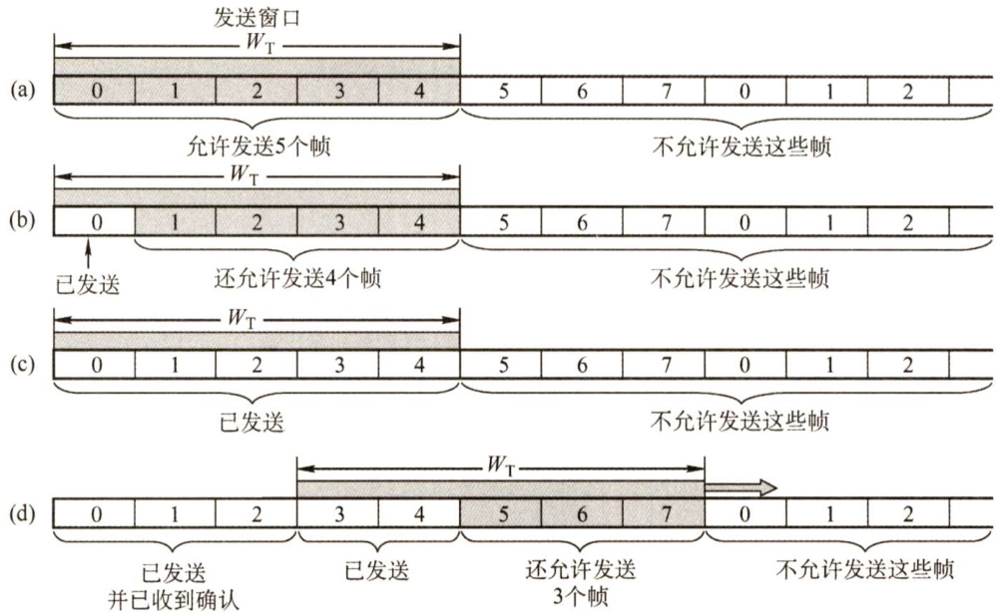
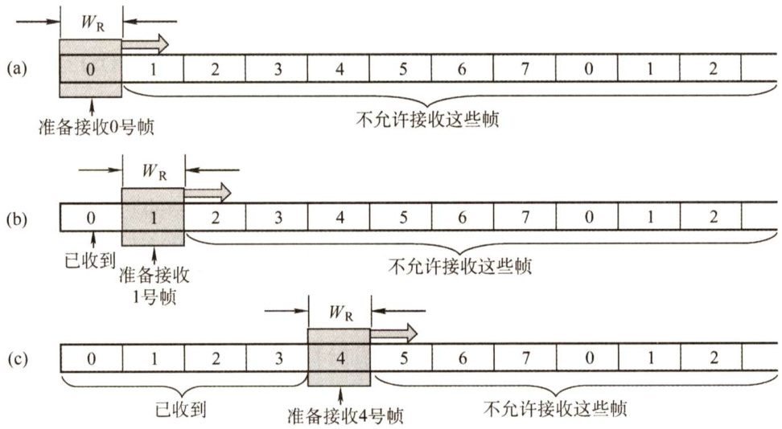
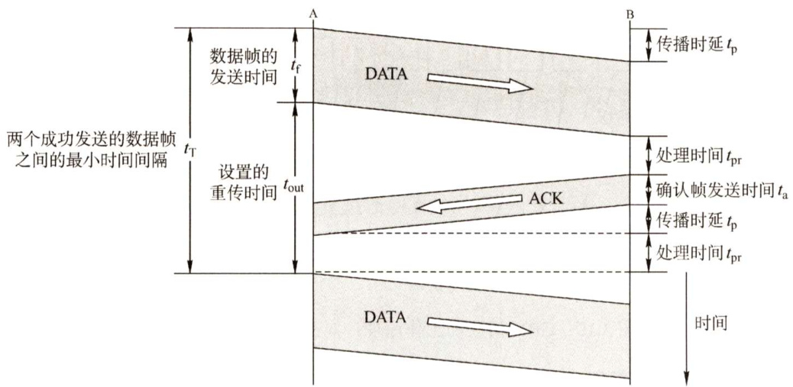
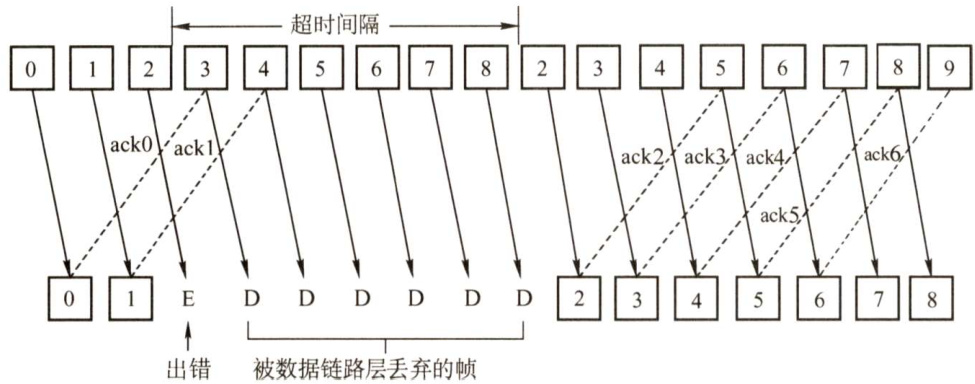
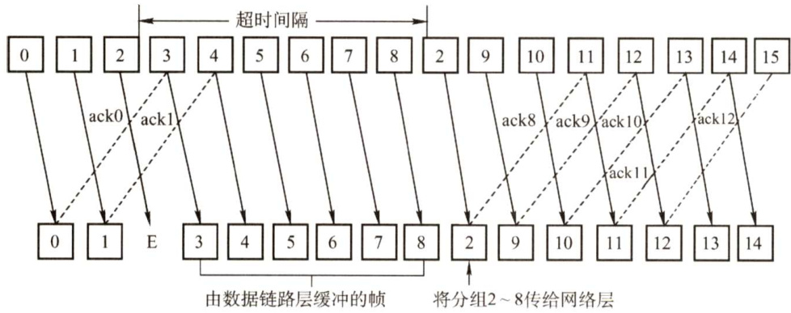
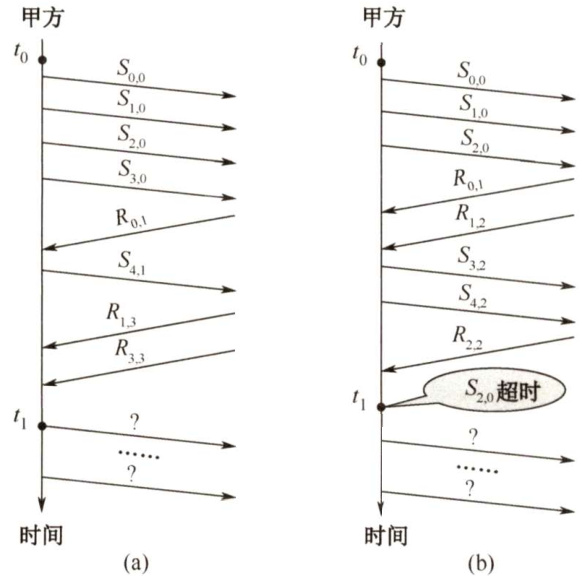

#### 3.4 流量控制与可靠传输机制  

#### 3.4.1 流量控制、可靠传输与滑动窗口机制  

流量控制涉及对链路上的帧的发送速率的控制，以使接收方有足够的缓冲空间来接收每个帧。例如，在面向帧的自动重传请求系统中，当待确认帧的数量增加时，有可能超出缓冲存储空间而造成过载。流量控制的基本方法是由接收方控制发送方发送数据的速率，常见的方式有两种：停止-等待协议和滑动窗口协议。  

#### 1.停止-等待流量控制基本原理  

发送方每发送一帧，都要等待接收方的应答信号，之后才能发送下一帧；接收方每接收一帧，都要反馈一个应答信号，表示可接收下一帧，如果接收方不反馈应答信号，那么发送方必须一直等待。每次只允许发送一帧，然后就陷入等待接收方确认信息的过程中，因而传输效率很低。  

#### 2.滑动窗口流量控制基本原理  

在任意时刻，发送方都维持一组连续的允许发送的帧的序号，称为发送窗口；同时接收方也维持一组连续的允许接收帧的序号，称为接收窗口。发送窗口用来对发送方进行流量控制，而发送窗口的大小 $W_{\mathrm{T}}$ 代表在还未收到对方确认信息的情况下发送方最多还可以发送多少个数据帧。同理，在接收端设置接收窗口是为了控制可以接收哪些数据帧和不可以接收哪些帧。在接收方，只有收到的数据帧的序号落入接收窗口内时，才允许将该数据帧收下。若接收到的数据帧落在接收窗口之外，则一律将其丢弃。  

图3.7给出了发送窗口的工作原理，图3.8给出了接收窗口的工作原理。  

  
图3.7发送窗口控制发送端的发送速率：(a)允许发送 $0{\sim}4$ 号共5个帧；(b)允许发送 $1{\sim}4$ 号共4个帧；(c)不允许发送任何帧；(d)允许发送 $5{\sim}7$ 号共3个帧  

  
图3.8 $W_{\mathrm{R}}=1$ 的接收窗口的意义：(a)准备接收0号帧；(b)准备接收1号帧；(c)准备接收4号帧  

发送端每收到一个确认帧，发送窗口就向前滑动一个帧的位置，当发送窗口内没有可以发送的帧（即窗口内的帧全部是已发送但未收到确认的帧）时，发送方就会停止发送，直到收到接收方发送的确认帧使窗口移动，窗口内有可以发送的帧后，才开始继续发送。  

接收端收到数据帧后，将窗口向前移一个位置，并发回确认帧，若收到的数据帧落在接收窗口之外，则一律丢弃。  

滑动窗口有以下重要特性：  

1）只有接收窗口向前滑动（同时接收方发送了确认帧）时，发送窗口才有可能（只有发送方收到确认帧后才一定）向前滑动。  
2）从滑动窗口的概念看，停止-等待协议、后退 $N$ 帧协议和选择重传协议只在发送窗口大小与接收窗口大小上有所差别：停止-等待协议：发送窗口大小 $^{\ast}=1$ ，接收窗口大小 $^{\circ}=1$ 0  

后退 $N$ 帧协议：发送窗口大小 $>1$ ，接收窗口大小 $^{\circ}=1$ 6选择重传协议：发送窗口大小 $>1$ ，接收窗口大小 $>1$ 。  

3）接收窗口的大小为1时，可保证帧的有序接收。  

4）数据链路层的滑动窗口协议中，窗口的大小在传输过程中是固定的（注意与第5章传输层的滑动窗口协议的区别)。  

#### 3.可靠传输机制  

数据链路层的可靠传输通常使用确认和超时重传两种机制来完成。确认是一种无数据的控制帧，这种控制帧使得接收方可以让发送方知道哪些内容被正确接收。有些情况下为了提高传输效率，将确认销带在一个回复帧中，称为销带确认。超时重传是指发送方在发送某个数据帧后就开启一个计时器，在一定时间内如果没有得到发送的数据帧的确认帧，那么就重新发送该数据帧，直到发送成功为止。  

自动重传请求（Automatic RepeatreQuest，ARQ）通过接收方请求发送方重传出错的数据帧来恢复出错的帧，是通信中用于处理信道所带来差错的方法之一。传统自动重传请求分为三种，即停止-等待（Stop-and-Wait）ARQ、后退 $N$ 帧（Go-Back-N）ARQ和选择性重传（SelectiveRepeat）ARQ。后两种协议是滑动窗口技术与请求重发技术的结合，由于窗口尺寸开到足够大时，帧在线路上可以连续地流动，因此又称其为连续 ARQ协议。注意，在数据链路层中流量控制机制和可靠传输机制是交织在一起的。  

注意：现有的实际有线网络的数据链路层很少采用可靠传输（不同于OSI参考模型的思路），因此大多数教材把这部分内容放在第5章运输层中讨论，本书按照408考纲，不做变动。  

#### 3.4.2 单帧滑动窗口与停止-等待协议  

在停止-等待协议中，源站发送单个帧后必须等待确认，在目的站的回答到达源站之前，源站不能发送其他的数据帧。从滑动窗口机制的角度看，停止-等待协议相当于发送窗口和接收窗口大小均为1的滑动窗口协议。  

在停止-等待协议中，除数据帧丢失外，还可能出现以下两种差错。  

到达目的站的帧可能已遭破坏，接收站利用前面讨论过的差错检测技术检出后，简单地将该帧丢弃。为了对付这种可能发生的情况，源站装备了计时器。在一个帧发送之后，源站等待确认，如果在计时器计满时仍未收到确认，那么再次发送相同的帧。如此重复，直到该数据帧无错误地到达为止。  

另一种可能的差错是数据帧正确而确认帧被破坏，此时接收方已收到正确的数据帧，但发送方收不到确认帧，因此发送方会重传已被接收的数据帧，接收方收到同样的数据帧时会丢弃该帧，并重传一个该帧对应的确认帧。发送的帧交替地用0和1来标识，确认帧分别用ACK0和ACK1来表示，收到的确认帧有误时，重传已发送的帧。对于停止-等待协议，由于每发送一个数据帧就停止并等待，因此用1bit来编号就已足够。在停止-等待协议中，若连续出现相同发送序号的数据帧，表明发送端进行了超时重传。连续出现相同序号的确认帧时，表明接收端收到了重复帧。  

此外，为了超时重发和判定重复帧的需要，发送方和接收方都须设置一个帧缓冲区。发送端在发送完数据帧时，必须在其发送缓存中保留此数据帧的副本，这样才能在出差错时进行重传。只有在收到对方发来的确认帧ACK时，方可清除此副本。  

由图3.9可知，停止-等待协议通信信道的利用率很低。为了克服这一缺点，就产生了另外两种协议，即后退 $N$ 帧协议和选择重传协议。  

  
图3.9停止-等待协议中数据帧和确认帧的发送时间关系  

#### 3.4.3 多帧滑动窗口与后退 $N$ 帧协议（GBN）  

在后退 $N$ 帧式ARQ中，发送方无须在收到上一个帧的ACK后才能开始发送下一帧，而是可以连续发送帧。当接收方检测出失序的信息帧后，要求发送方重发最后一个正确接收的信息帧之后的所有未被确认的帧；或者当发送方发送了 $N$ 个帧后，若发现该 $N$ 个帧的前一个帧在计时器超时后仍未返回其确认信息，则该帧被判为出错或丢失，此时发送方就不得不重传该出错帧及随后的 $N$ 个帧。换句话说，接收方只允许按顺序接收帧。  

如图3.10所示，源站向目的站发送数据帧。当源站发完0号帧后，可以继续发送后续的1号帧、2号帧等。源站每发送完一帧就要为该帧设置超时计时器。由于连续发送了许多帧，所以确认帧必须要指明是对哪一帧进行确认。为了减少开销，GBN协议还规定接收端不一定每收到一个正确的数据帧就必须立即发回一个确认帧，而可以在连续收到好几个正确的数据帧后，才对最后一个数据帧发确认信息，或者可在自己有数据要发送时才将对以前正确收到的帧加以销带确认。这就是说，对某一数据帧的确认就表明该数据帧和此前所有的数据帧均已正确无误地收到。在图3.10中， $\mathbf{ACK}\boldsymbol{n}$ 表示对第 $n$ 号帧的确认，表示接收方已正确收到第 $n$ 号帧及以前的所有帧，下一次期望收到第 $n+1$ 号帧（也可能是第0号帧)。接收端只按序接收数据帧。虽然在有差错的2号帧之后接着又收到了正确的6个数据帧，但接收端都必须将这些帧丢弃。接收端虽然丢弃了这些不按序的无差错帧，但应重复发送已发送的最后一个确认帧ACK1（这是为了防止已发送的确认帧ACK1丢失)。  

后退 $N$ 帧协议的接收窗口为1，可以保证按序接收数据帧。若采用 $n$ 比特对帧编号，则其发送窗口的尺寸 $W_{\mathrm{T}}$ 应满足 $1\leq W_{\mathrm{T}}\leq2^{n}-1$ 。若发送窗口的尺寸大于 $2^{n}-1$ ，则会造成接收方无法分辨新帧和旧帧（请参考本章疑难点3）。  

从图3.10不难看出，后退 $N$ 帧协议一方面因连续发送数据帧而提高了信道的利用率，另一方面在重传时又必须把原来已传送正确的数据帧进行重传（仅因这些数据帧的前面有一个数据帧出了错)，这种做法又使传送效率降低。由此可见，若信道的传输质量很差导致误码率较大时，后退 $N$ 帧协议不一定优于停止-等待协议。  

  

#### 3.4.4 多帧滑动窗口与选择重传协议（SR）  

为进一步提高信道的利用率，可设法只重传出现差错的数据帧或计时器超时的数据帧，但此时必须加大接收窗口，以便先收下发送序号不连续但仍处在接收窗口中的那些数据帧。等到所缺序号的数据帧收到后再一并送交主机。这就是选择重传ARQ协议。  

在选择重传协议中，每个发送缓冲区对应一个计时器，当计时器超时时，缓冲区的帧就会重传。另外，该协议使用了比上述其他协议更有效的差错处理策略，即一旦接收方怀疑帧出错，就会发一个否定帧NAK给发送方，要求发送方对NAK中指定的帧进行重传，如图3.11所示。  

选择重传协议的接收窗口尺寸 $W_{\mathrm{R}}$ 和发送窗口尺寸 $W_{\mathrm{T}}$ 都大于1，一次可以发送或接收多个帧。在选择重传协议中，接收窗口和发送窗口的大小是相同的（选择重传协议是对单帧进行确认，所以发送窗口大于接收窗口会导致溢出，发送窗口小于接收窗口没有意义)，且最大值都为序号范围的一半，若采用 $n$ 比特对帧编号，则需要满足： $W_{\mathrm{Tmax}}=W_{\mathrm{Rmax}}=2^{(n-1)}$ 。因为如果不满足该条件，即窗口大小大于序号范围一半，当一个或多个确认帧丢失时，发送方就会超时重传之前的数据帧，但接收方无法分辨是新的数据帧还是重传的数据帧。  

  
图3.10GBN协议的工作原理：对出错数据帧的处理  
图3.11 选择重传协议  

选择重传协议可以避免重复传送那些本已正确到达接收端的数据帧，但在接收端要设置具有相当容量的缓冲区来暂存那些未按序正确收到的帧。接收端不能接收窗口下界以下或窗口上界以上的序号的帧，因此所需缓冲区的数目等于窗口的大小，而不是序号数目。  

在往年统考真题中曾经出现过对“信道效率”“信道的吞吐率”等概念的考查，有些读者未接触过“通信原理”等相关的课程，可能对这些概念不太熟悉，在这里给读者补充一下。  

信道的效率，也称信道利用率。可从不同的角度来定义信道的效率，这里给出一种从时间角度的定义：信道效率是对发送方而言的，是指发送方在一个发送周期的时间内，有效地发送数据  

所需要的时间占整个发送周期的比率。  

例如，发送方从开始发送数据到收到第一个确认帧为止，称为一个发送周期，设为T，发送方在这个周期内共发送 $L$ 比特的数据，发送方的数据传输速率为 $c$ ，则发送方用于发送有效数据的时间为 $L/C$ ，在这种情况下，信道的利用率为 $(L/C)/T,$ 。  

从上面的讨论可以发现，求信道的利用率主要是求周期时间 $T$ 和有效数据发送时间 $L/C$ ，在题目中，这两个量一般不会直接给出，需要读者根据题意自行计算。  

信道吞吐率 $\mathbf{\tau}=\mathbf{\tau}$ 信道利用率 $.\times$ 发送方的发送速率。  

本节习题有不少是关于信道利用率和信道吞吐率的，以帮助读者理解和记忆这两个概念。流量控制的三种滑动窗口协议的信道利用率是一个关键知识点，希望读者能结合习题，自行推导。  

#### 3.4.5 本节习题精选  

#### 一、单项选择题  

01．从滑动窗口的观点看，当发送窗口为1、接收窗口也为1时，相当于ARQ的（）方式  

A.回退 $N$ 帧ARQ B.选择重传ARQC．停止-等待 D.连续ARQ  

02．在简单的停止等待协议中，当帧出现丢失时，发送端会永远等待下去，解决这种死锁现象的办法是（）。  

A．差错校验 B．帧序号 C.NAK机制 D.超时机制  

03.一个信道的数据传输速率为 $4\mathrm{kb/s}$ ，单向传播时延为 $30\mathrm{ms}$ ，如果使停止-等待协议的信道最大利用率达到 $80\%$ ，那么要求的数据帧长度至少为（）。  

A.160bit B. 320bit C. 560bit D. 960bit  

04.数据链路层采用后退 $N$ 帧协议方式，进行流量控制和差错控制，发送方已经发送了编号0～6的帧。计时器超时时，只收到了对1、3和5号帧的确认，发送方需要重传的帧的数目是（）。  

A.1 B.2 C.5 D.6  

05.数据链路层采用了后退 $N$ 帧的（GBN）协议，如果发送窗口的大小是32，那么至少需要（）位的序列号才能保证协议不出错。  

A.4 B.5 C.6 D.7  

06.若采用后退 $N$ 帧的ARQ协议进行流量控制，帧编号字段为7位，则发送窗口的最大长度为（）。  

A.7 B.8 C.127 D. 128  

07．一个使用选择重传协议的数据链路层协议，如果采用了5位的帧序列号，那么可以选用的最大接收窗口是（）。  

A.15 B.16 C.31 D.32  

08.对于窗口大小为 $n$ 的滑动窗口，最多可以有（）帧已发送但没有确认。  

A.0 B.n-1 C.n D. n/2)9．对无序接收的滑动窗口协议，若序号位数为 $n$ ，则发送窗口最大尺寸为（）  

A. $2^{n}-1$ B. $2n$ C. 2n-1 D. 2m-1  

10.采用滑动窗口机制对两个相邻结点A（发送方）和B（接收方）的通信过程进行流量控制。假定帧的序号长度为4，发送窗口和接收窗口的大小都是7，使用累积确认。当A发送编号为0、1、2、3这四个帧后，而B接收了这4个帧，但仅应答了0、3两个帧，此时发送窗口将要发送的帧序号为（ $\textcircled{1}$ )；若滑动窗口机制采用选择重传协议来进行流量控制，则允许发送方在收到应答之前连续发出多个帧；若帧的序号长度为 $k$ 比特，那么接收窗口的大小 $W\left(\left({2}\right)\right)2^{k-1}$ ；如果发送窗口的上边界对应的帧序号为 $U$ ，那么发送窗口的下边界对应的帧序号为（ $\textcircled{3}$ )。  

$\textcircled{1}$ A.2 B.3 C.4 D.5$\textcircled{2}$ A. $\angle\cdot\angle$ B. $>$ C. $\geq$ D.≤$\textcircled{3}$ A. $\geq(U-W+1)$ mod $2^{k}$ B. $\geq(U-W)$ mod $2^{k}$ C. $\geq(U-W)$ mod $2^{k-1}$ D. $\geq(U-W-1)$ mod $2^{k-1}$  

11.【2009统考真题】数据链路层采用了后退 $N$ 帧（GBN）协议，发送方已经发送了编号为0～7的帧。计时器超时时，若发送方只收到0、2、3号帧的确认，则发送方需要重发的帧数是（）。  

A.2 B.3 C.4 D.5  

12.【2011统考真题】数据链路层采用选择重传协议（SR）传输数据，发送方已发送0～3号数据帧，现已收到1号帧的确认，而0、2号帧依次超时，则此时需要重传的帧数是（）。  

A.1 B.2 C.3 D.4  

13.【2012统考真题】两台主机之间的数据链路层采用后退 $N$ 帧协议（GBN）传输数据，数据传输速率为 $16\mathrm{kb/s}$ ，单向传播时延为 $270\mathrm{{ms}}$ ，数据帧长度范围是128～512字节，接收方总是以与数据帧等长的帧进行确认。为使信道利用率达到最高，帧序号的比特数至少为（）。  

A.5 B.4 C.3 D.2  

14.【2014统考真题】主机甲与主机乙之间使用后退 $N$ 帧协议（GBN）传输数据，甲的发送窗口尺寸为1000，数据帧长为1000字节，信道带宽为 $100\mathrm{Mb/s}$ ，乙每收到一个数据帧立即利用一个短帧（忽略其传输延迟）进行确认，若甲、乙之间的单向传播时延是 $50\mathrm{ms}$ 则甲可以达到的最大平均数据传输速率约为（）。  

A. 10Mb/s B. 20Mb/s C. 80Mb/s D. 100Mb/s  

15.【2015统考真题】主机甲通过 $128\mathbf{kb}/\mathbf{s}$ 卫星链路，采用滑动窗口协议向主机乙发送数据，链路单向传播时延为 $250\mathrm{{ms}}$ ，帧长为1000字节。不考虑确认帧的开销，为使链路利用率不小于 $80\%$ ，帧序号的比特数至少是（）。  

A.3 B.4 C.7 D.8  

16.【2018统考真题】主机甲采用停止-等待协议向主机乙发送数据，数据传输速率是 $3\mathrm{{kb/s}}$ 单向传播时延是 $200\mathrm{{ms}}$ ，忽略确认帧的传输时延。当信道利用率等于 $40\%$ 时，数据帧的长度为（）。  

A.240比特 B．400比特 C.480比特 D.800比特  

17.【2019统考真题】对于滑动窗口协议，若分组序号采用3比特编号，发送窗口大小为5，则接收窗口最大是（）。  

A.2 B.3 C.4 D.5  

18.【2020统考真题】假设主机甲采用停-等协议向主机乙发送数据帧，数据帧长与确认帧长均为1000B，数据传输速率是 $10\mathrm{kb/s}$ ，单项传播延时是 $200\mathrm{{ms}}$ 。则甲的最大信道利用率为（）。  

A. $80\%$ B. $66.7\%$ C. $44.4\%$ D. $40\%$  

#### 二、综合应用题  

01．在选择ARQ协议中，设编号用3bit，发送窗口 $W_{\mathrm{T}}=6$ ，接收窗口 $W_{\mathrm{R}}=3$ 。试找出一种情况，使得在此情况下协议不能正确工作。  

02.假设一个信道的数据传输速率为 $5\mathrm{kb/s}$ ，单向传输时延为 $30\mathrm{ms}$ ，那么帧长在什么范围内，才能使用于差错控制的停止-等待协议的效率至少为 $50\%$ ？  

03.假定卫星信道的数据率为 $100\mathrm{kb/s}$ ，卫星信道的单程传播时延为 $250\mathrm{{ms}}$ ，每个数据帧的长度均为2000位，并且不考虑误码、确认帧长、头部和处理时间等开销，为达到传输的最大效率，试问帧的顺序号应为多少位？此时信道利用率是多少？  

04.在数据传输速率为 $50\mathrm{kb/s}$ 的卫星信道上传送长度为1kbit的帧，假设确认帧总由数据帧销带，帧头的序号长度为3bit，卫星信道端到端的单向传播延迟为 $270\mathrm{{ms}}$ 。对于下面三种协议，信道的最大利用率是多少？1）停止-等待协议。2）后退 $N$ 帧协议。3）选择重传协议（假设发送窗口和接收窗口相等）。  

05.对于下列给定的值，不考虑差错重传，非受限协议（无须等待应答）和停止-等待协议的有效数据率是多少？（即每秒传输了多少真正的数据，单位为 $\mathsf{b}/\mathsf{s}$ 。）$R=$ 传输速率（16Mb/s）$S=$ 信号传播速率（ $200\mathrm{m/\upmus}$ ）$D=$ 接收主机和发送主机之间传播距离（ $200\mathrm{m}$ ）$T=$ 创建帧的时间（ $2\upmu\mathrm{s}$ ）$F=$ 每帧的长度（500bit）$N=$ 每帧中的数据长度（450bit）$A=$ 确认帧ACK的帧长（80bit）  

06.在某个卫星信道上，发送端从一个方向发送长度为512B的帧，且发送端的数据发送速率为 $64\mathrm{kb/s}$ ，接收端在另一端返回一个很短的确认帧。设卫星信道端到端的单向传播延时为 $270\mathrm{{ms}}$ ，对于发送窗口尺寸分别为1、7、17和117的情况，信道的吞吐率分别为多少？  

07.【2017统考真题】甲乙双方均采用后退 $N$ 帧协议（GBN）进行持续的双向数据传输，且双方始终采用销带确认，帧长均为 $1000\mathrm{B}$ 。 $S_{x,y}$ 和 $R_{x,y}$ 分别表示甲方和乙方发送的数据帧，其中 $x$ 是发送序号， $y$ 是确认序号（表示希望接收对方的下一帧序号），数据帧的发送序号和确认序号字段均为3比特。信道传输速率为 $100\mathrm{Mb/s}$ ， $\mathrm{RTT}=0.96\mathrm{ms}$ 。下图给出了甲方发送数据帧和接收数据帧的两种场景，其中 $t_{0}$ 为初始时刻，此时甲方的发送和确认序号均为0， $t_{1}$ 时刻甲方有足够多的数据待发送。  

请回答下列问题。  

1）对于图(a)， $t_{0}$ 时刻到 $t_{1}$ 时刻期间，甲方可以断定乙方已正确接收的数据帧数是多少？正确接收的是哪几个帧（请用 $S_{x,y}$ 形式给出）？  
2）对于图(a)，从 $t_{1}$ 时刻起，甲方在不出现超时且未收到乙方新的数据帧之前，最多还可以发送多少个数据帧？其中第一个帧和最后一个帧分别是哪个（请用 $S_{x,y}$ 形式给出）？  

3）对于图(b)，从 $t_{1}$ 时刻起，甲方在不出现新的超时且未收到乙方新的数据帧之前，需要重发多少个数据帧？重发的第一个帧是哪个帧（请用 $S_{x,y}$ 形式给出）？  

4）甲方可以达到的最大信道利用率是多少？  

  

#### 3.4.6 答案与解析  

#### 一、单项选择题  

01.C  

停止-等待协议的工作原理是：发送方每发送一帧，都要等待接收方的应答信号，之后才能发送下一帧；接收方每接收一帧，都要反馈一个应答信号，表示可接收下一帧，如果接收方不反馈应答信号，那么发送方必须一直等待。  

02.D  

在停止-等待协议中，发送端设置了计时器，在一个帧发送之后，发送端等待确认，如果在计时器计满时仍未收到确认，那么再次发送相同的帧，以免陷入永久的等待。  

03.D  

设 $c$ 为数据传输速率， $L$ 为帧长， $R$ 为单程传播时延。停止-等待协议的信道最大利用率为(L/C)$(L/C+2R)=L/(L+2R C)=L/(L+2\times30\mathrm{ms}\times4\mathrm{kb/s})=80\%$ 得出 $L=960{\mathrm{bit}}$ 0  

04.A  

GBN一般采用累积确认，因此收到了对5号帧的确认意味着接收方已收到 $1{\sim}5$ 号帧，因此发送方仅需要重传6号帧。  

05.C  

在后退 $N$ 帧的协议中，序列号个数不小于 $\mathrm{\bfMAX\_SEQ}+1$ ，题中发送窗口的大小是32，那么序列号个数最少应该是33个。所以最少需要6位的序列号才能达到要求。  

06.C  

接收窗口整体向前移动时，新窗口中的序列号和旧窗口的序列号产生重叠，致使接收方无法  

区别发送方发送的帧是重发帧还是新帧，因此在后退 $N$ 帧的ARQ协议中，发送窗口 $W_{\mathrm{T}}{\leq}2^{n}-1$ 。  
本题中 $n=7$ ，因此发送窗口的最大长度是127。  

07.B  

在选择重传协议中，若采用 $n$ 比特对帧进行编号，为避免接收端向前移动窗口后，新的窗口与旧的窗口产生重叠，接收窗口的最大尺寸应该不超过序号范围的一半，即 $W_{\mathrm{R}}{\leq}2^{n-1}$ 。因此选B。  

08.B  

在连续ARQ协议中，发送窗口的大小 $\leq$ 窗口总数-1。例如，窗口总数为8，编号为 $0{\sim}7$ 假设这8个帧都已发出，下一轮又发出编号 $0{\sim}7$ 的8个帧，接收方将无法判断第二轮发的8个帧到底是重传帧还是新帧，因为它们的序号完全相同。另一方面，对于回退 $N$ 帧协议，发送窗口的大小可以等于窗口总数-1，因为它的接收窗口大小为1，所有的帧保证按序接收。因此对于窗口大小为 $n$ 的滑动窗口，其发送窗口大小最大为 $n-1$ ，即最多可以有 $n-1$ 帧已发送但没有确认。  

09.D  

本题并未直接告知使用的是选择重传协议，而是通过间接方式给出的。题目说无序接收的滑动窗口协议，说明接收窗口大于1，所以得出数据链路层使用的是选择重传协议，而选择重传协议的发送窗口最大尺寸为 $2^{n-1}$ 。  

10.C、D、A  

1）发送窗口大小为7意味着发送方在没有收到确认之前可以连续发送7个帧，由于发送方A已经发送编号为 $0\sim3$ 的四个帧，下一个帧将是编号为4的帧。  

2）当帧的序号长度为 $k$ 比特时，对于选择重传协议，为避免接收端向前移动窗口后，新的窗口与旧的窗口产生重叠，接收窗口的最大尺寸应该不超过序列号范围的一半，即 $W_{\mathrm{{R}}}{\leq}2^{k-1}$ 0  

3）设发送窗口为 $[L,U]$ ，发送窗口大小的初始值为 $W$ ，发送窗口的大小应该大于等于0，但小于等于 $W$ ，所以有 $0\leq U-L+1\leq W_{\ast}$ 。因此 $L\geq(U-W+1){\bmod{2}}^{k}$ 。  

11.C  

在后退 $N$ 帧协议中，当接收方检测到某个帧出错后，会简单地丢弃该帧及所有的后续帧，发送方超时后需重传该数据帧及所有的后续帧。这里应注意，在连续ARQ协议中，接收方一般采用累积确认的方式，即接收方对按序到达的最后一个分组发送确认，因此本题中收到3的确认帧就表示编号为0,1,2,3的帧已接收，而此时发送方未收到1号帧的确认只能代表确认帧在返回的过程中丢失，而不代表1号帧未到达接收方。因此需要重传的帧为编号是4,5,6,7的帧。  

12.B  

选择重传协议中，接收方逐个确认正确接收的分组，不管接收到的分组是否有序，只要正确接收就发送选择ACK分组进行确认，因此ACK分组不再具有累积确认的作用。对于这点，要特别注意与GBN协议的区别。此题中只收到1号帧的确认，0、2号帧超时，由于对1号帧的确认不具累积确认的作用，因此发送方认为接收方未收到0、2号帧，于是重传这两帧。  

13.B  

数据帧长度是不确定的，范围是 $128\sim512\mathrm{B}$ ，但在计算至少窗口大小时，为了保证无论数  

据帧长度如何变化，信道利用率都能达到最高，应以最短的帧长计算。如果以512B计算，那么求得的最小帧序号数在128B 的帧长下，达不到最高信道利用率。首先计算出发送一帧的时间$128\times8/(16\times10^{3})=64\mathrm{{ms}}$ ；发送一帧到收到确认为止的总时间为 $64+270{\times}2+64=668\mathrm{ms}$ ；这段时间总共可以发送 $668/64=10.4$ 帧，发送这么多帧至少需要用4位比特进行编号。  

14.C  

考虑制约甲的数据传输速率的因素。首先，信道带宽能直接制约数据的传输速率，传输速率一定是小于等于信道带宽的。其次，因为甲、乙主机之间采用后退 $N$ 帧协议传输数据，要考虑发送一个数据到接收到它的确认之前，最多能发送多少数据，甲的最大传输速率受这两个条件约束，所以甲的最大传输速率是这两个值中小的那一个。甲的发送窗口的尺寸为1000，即收到第一个数据的确认之前，最多能发送1000个数据帧，也就是发送 $1000{\times}1000\mathbf{B}=1\mathbf{M}\mathbf{B}$ 的内容，而从发送第一个帧到接收到它的确认的时间是一个帧的发送时延加上往返时延，即 $\mathrm{1000B/100Mb/s+50ms+50ms=}$ $0.10008\mathrm{s}$ ，此时的最大传输速率为1MB/0.10008s $\approx10\mathrm{MB/s}=80\mathrm{Mb/s}$ 。信道带宽为 $100\mathrm{Mb/s}$ ，因此答案为 $\operatorname*{min}\{{80\mathbf{M}\mathbf{b}}/{\mathrm{s}},100\mathbf{M}\mathbf{b}/{\mathrm{s}}\}=80\mathbf{M}\mathbf{b}/{\mathrm{s}}$ ，选C。  

15.B  

从发送周期思考，开始发送帧到收到第一个确认帧为止，用时为 $T=$ 第一个帧的传输时延 $^+$ 第一个帧的传播时延 $^+$ 确认帧的传输时延 $^+$ 确认帧的传播时延，这里忽略确认帧的传输时延。因此 $T=1000\mathrm{B}/128\mathrm{kb}/\mathrm{s}+\mathrm{RTT}=0.5625\mathrm{s}$ ，接着计算在 $T$ 内需要发送多少数据才能满足利用率不小于 $80\%$ 。设数据大小为 $L$ 字节，则 $(L/128\mathbf{k}\mathbf{b}/\mathbf{s})/T\geq0.8$ ，得 $L\ge7200\mathrm{B}$ ，即在一个发送周期内至少发7.2个帧才能满足要求，设需要编号的比特数为 $n$ ，则 $2^{n}-1\geq7.2$ ，因此 $n$ 至少为4。  

16.D  

解析请扫右侧二维码查阅。  

17.B  

从滑动窗口的概念来看，停止等待协议：发送窗口大小=1，接收窗口大小=1；解析及视频讲解后退 $N$ 协议：发送窗口大小 $>1$ ，接收窗口大小 $^{\circ}=1$ ；选择重传协议：发送窗口大小 $>1$ ，接收窗口大小 $>1$ 。在选择重传协议中，需要满足：发送窗口大小 $^{+}$ 接收窗口大小 $\leq2^{n}$ 接收窗口大小不应超过发送窗口大小，因此接收窗口大小不应超过序号范围的一半，即 $\leq2^{n-1}$ 。根据以上规则，采用3比特编号，发送窗口大小为5，接收窗口大小应 $\leq3$ o  

#### 18.D  

发送数据帧和确认帧的时间均为 $t=1000{\times}86/10\mathbf{k}\mathbf{b}/\mathbf{s}=800\mathrm{ms}.$ 发送周期为 $T=800\mathrm{ms}+200\mathrm{ms}+800\mathrm{ms}+200\mathrm{ms}=2000\mathrm{ms}$ 。信道利用率为 $t/T\times100\%=800/2000=40\%$ Q  

#### 二、综合应用题  

01.【解答】  

对于选择重传协议，接收窗口和发送窗口的尺寸需满足：接收窗口尺寸 $W_{\mathrm{R}}+$ 发送窗口尺寸$W_{\mathrm{T}}{\le}2^{n}$ ，而题目中给出的数据是 $W_{\mathrm{R}}+W_{\mathrm{T}}=9\geq2^{3}$ ，所以是无法正常工作的。举例如下：  

发送方： $0\ 1\ 2\ 3\ 4\ 5\ 6\ 7\ 0\ 1\ 2\ 3\ 4\ 5\ 6\ 7\ 0$ 接收方： $0\ 1\ 2\ 3\ 4\ 5\ 6\ 7\ 0\ 1\ 2\ 3\ 4\ 5\ 6\ 7\ 0$  

发送方发送 $0{\sim}5$ 号共6个数据帧时，因发送窗口已满，发送暂停。接收方收到所有数据帧，对每个帧都发送确认帧，并期待后面的6、7、0号帧。若所有的确认帧都未到达发送方，经过发送方计时器控制的超时时间后，发送方再次发送之前的6个数据帧，而接收方收到0号帧后，无法判断是新的数据帧还是旧的重传的数据帧。  

02.【解答】  

设帧长为 $L$ 。在停止-等待协议中，协议忙的时间为数据发送的时间 $L/B$ ，协议空闲的时间为数据发送后等待确认返回的时间 $2R$ 。要使协议的效率至少为 $50\%$ ，要求信道利用率 $u$ 至少为 $50\%$ ，而信道利用率 $\mathbf{\Sigma}=\mathbf{\Sigma}$ 数据发送时延/（传播时延 $^+$ 数据发送时延)，则  

$$
u=\frac{L/B}{(L/B+2R)}\ \geq50\%
$$  

可得 $L\geq2R B=2{\times}5000{\times}0.036{\mathrm{it}}=3006{\mathrm{it}}$ 。  

因此，当帧长大于等于300bit时，停止-等待协议的效率至少为 $50\%$ o  

03.【解答】  

$\mathrm{RTT}=250{\times}2=500\mathrm{ms}=0.5\mathrm{s}$ 。  

一个帧的发送时间等于 $2000\mathrm{bit}/(100\mathrm{kb/s})=20{\times}10^{-3}\mathrm{s}$ 9  

一个帧发送完后经过一个单程时延到达接收方，再经过一个单程时延发送方收到应答，从而可以继续发送，因此要达到传输效率最大，就是不用等确认也可继续发送帧。设窗口值等于 $x$ ，令  

$$
2000\mathrm{bit}\times x/(100\mathrm{kb}/\mathrm{s})=20\times10^{-3}\mathrm{s}+\mathrm{RTT}=20\times10^{-3}\mathrm{s}+0.5\mathrm{s}=0.52\mathrm{s}
$$  

得 $x=26$ 。要取得最大信道利用率，窗口值是26即可，因为在此条件下，可以不间断地发送帧，所以发送速率保持在 $100\mathrm{kb/s}$ 。  

由于 $16<26<32$ ，帧的顺序号应为5位。在使用后退 $N$ 帧ARQ的情况下，最大窗口值是31，大于26，可以不间断地发送帧，此时信道利用率是 $100\%$ o  

04.【解答】  

最大信道利用率即每个传输周期内每个协议可发送的最大帧数。由题意，数据帧的长度为1kbit，信道的数据传输速率为 $50\mathrm{kb/s}$ ，因此信道的发送时延为 $1/50\mathrm{s}=0.02\mathrm{s}$ ，另外信道端到端的传播时延 $=0.27\mathrm{s}$ 。本题中的确认帧是销带的（通过数据帧来传送)，因此每个数据帧的传输周期为 $(0.02+0.27+0.02+0.27)\mathrm{s}=0.58\mathrm{s}$  

1）在停止-等待协议中，发送方每发送一帧，都要等待接收方的应答信号，之后才能发送下一帧；接收方每接收一帧，都要反馈一个应答信号，表示可接收下一帧。其中用于发送数据帧的时间为0.02s。因此，信道的最大利用率为 $0.02/0.58=3.4\%$ 。  

2）在后退 $N$ 帧协议中，接收窗口尺寸为1，若采用 $n$ 比特对帧编号，则其发送窗口的尺寸$W$ 满足 $1<W\leq2^{n}-1$ 。发送方可以连续再发送若干数据帧，直到发送窗口内的数据帧都发送完毕。如果收到接收方的确认帧，那么可以继续发送。若某个帧出错，则接收方只是简单地丢弃该帧及所有的后续帧，发送方超时后需重传该数据帧及所有的后续数据帧。根据题目条件，在达到最大传输速率的情况下，发送窗口的大小应为 $2^{n}-1=7$ ，此时在第一帧的数据传输周期0.58s内，实际连续发送了7帧（考虑极限情况，0.58s后接收方  

只收到0号帧的确认，此时又可以发出一个新帧，这样依次下去，取极限即是每个传输周期0.58s内发送了7帧)，因此此时的最大信道利用率为 $7\times0.02/0.58=24.1\%$ 9  

3）选择重传协议的接收窗口尺寸和发送窗口尺寸都大于1，可以一次发送或接收多个帧。若采用 $n$ 比特对帧编号，则窗口尺寸应满足：接收窗口尺寸 $^+$ 发送窗口尺寸 $\leq2^{n}$ ，当发送窗口与接收窗口尺寸相等时，应有接收窗口尺寸 $\leq2^{n-1}$ 且发送窗口尺寸 $\leq2^{n-1}$ 。发送方可以连续发送若干数据帧，直到发送窗口内的数据帧都发送完毕。如果收到接收方的确认帧，那么可以继续发送。若某个帧出错，则接收方只是简单地丢弃该帧，发送方超时后需重传该数据帧。  

和2）问中的情况类似，唯一不同的是为达到最大信道利用率，发送窗口大小应为 $2^{n-1}=4$ ，因此，此时的最大信道利用率为 $4\times0.02/0.58=13.8\%$ 8  

05.【解答】  

1）非受限协议  

$$
{\frac{N}{T+{\frac{F}{R}}}}={\frac{450{\mathrm{bit}}}{2{\upmu}{\mathrm{s}}+{\frac{500{\mathrm{bit}}}{16{\mathrm{bit}}{\mathrm{s/{\upmu}}}{\mathrm{s}}}}}}\approx13.53{\mathrm{bit/{\upmu}}}{\mathrm{s}}=13.53{\mathrm{Mb/s}}
$$  

2）停止等待协议  

$$
\begin{array}{l l l}{\displaystyle}&{=\mathrm{~}\frac{N}{2\times(T+D/S)+\frac{F+A}{R}}}\\ {\displaystyle}&{=\frac{450\mathrm{{bit}}}{2\times(2\upmu\mathrm{{s}}+\displaystyle\frac{200\mathrm{{m}}}{200\mathrm{{m}}/\upmu\mathrm{{s}}})+\frac{500\mathrm{{bit}}+80\mathrm{{bit}}}{16\mathrm{{bit}}/\upmu\mathrm{{s}}}}}\end{array}
$$  

$$
{\approx}10.65\mathrm{bit/\upmus}=10.65\mathrm{Mb/s}
$$  

06.【解答】  

这里要注意题目中的单位。数据帧的长度为512B，即 $512\times8\mathrm{bit}=4.096\mathrm{kbit}$ ，一个数据帧的发送时延为 $4.096/64=0.064s$ 。因此一个发送周期时间为 $0.064+2{\times}0.27=0.604\mathrm{s}$ 。  

因此当窗口尺寸为1时，信道的吞吐率为 $1{\times}4.096/0.604=6.8\mathrm{kb/s}$ ；当窗口尺寸为7时，信道的吞吐率为 $7{\times}4.096/0.604=47.5\mathrm{kb/s}$ 。  

由于一个发送周期为0.604s，发送一个帧的发送延时是0.064s，因此当发送窗口尺寸大于$0.604/0.064$ ，即大于等于10时，发送窗口就能保证持续发送。因此当发送窗口大小为17和117时，信道的吞吐率达到完全速率，与发送端的数据发送速率相等，即 $64\mathbf{kb}/\mathbf{s}$ 0  

07.【解答】  

1) $t_{0}$ 时刻到 $t_{1}$ 时刻期间，甲方可以断定乙方已正确接收3个数据帧，分别是 $S_{0,0}$ $S_{1,0}$ ： $S_{2,0}$ 0$R_{3,3}$ 说明乙发送的数据帧确认号是3，即希望甲发送序号3的数据帧，说明乙已经接收序号为 $0{\sim}2$ 的数据帧。  

2）从 $t_{1}$ 时刻起，甲方最多还可以发送5个数据帧，其中第一个帧是 $S_{5,2}$ ，最后一个数据帧是$S_{1,2}$ 。发送序号3位，有8个序号。在GBN协议中，序号个数 $\geq$ 发送窗口 $^+1$ ，所以这里发送窗口最大为7。此时已发送 $S_{3,0}$ 和 $S_{4,1}$ ，所以最多还可以发送5个帧。  

3）甲方需要重发3个数据帧，重发的第一个帧是 $S_{2,3}$ 。在GBN协议中，发送方发送 $N$ 帧后，  

检测出错，则需要发送出错帧及其之后的帧。 $S_{2,0}$ 超时，所以重发的第一帧是 $S_{2}$ 。已收到乙的 $R_{2}$ 帧，所以确认号应为3。  

4）甲方可以达到的最大信道利用率是  

$$
\frac{7\times\frac{8\times1000}{100\times10^{6}}}{0.96\times10^{-3}+2\times\frac{8\times1000}{100\times10^{6}}}\times100\%=50\%
$$  

$U=$ 发送数据的时间/从开始发送第一帧到收到第一个确认帧的时间 $=N{\times}T_{\mathrm{d}}/(T_{\mathrm{d}}+\mathrm{RTT}+T_{\mathrm{a}})$ 8其中， $U$ 是信道利用率， $N$ 是发送窗口的最大值， $T_{\mathrm{d}}$ 是发送一数据帧的时间，RTT是往返时间，$T_{\mathrm{a}}$ 是发送一确认帧的时间。这里采用销带确认， $T_{\mathrm{d}}=T_{\mathrm{a}}$ o