#### 3.5 介质访问控制  

介质访问控制所要完成的主要任务是，为使用介质的每个结点隔离来自同一信道上其他结点所传送的信号，以协调活动结点的传输。用来决定广播信道中信道分配的协议属于数据链路层的一个子层，称为介质访问控制（MediumAccessControl，MAC）子层。  

图3.12是广播信道的通信方式，结点A、B、C、D、E共享广播信道，假设A要与C发生通信，B要与D发生通信，由于它们共用一条信道，如果不加控制，那么两对结点间的通信可能会因为互相干扰而失败。介质访问控制的内容是，采取一定的措施，使得两对结点之间的通信不会发生互相干扰的情况。  

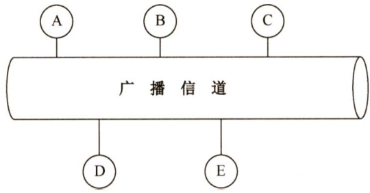  
图3.12广播信道的通信方式  

常见的介质访问控制方法有信道划分介质访问控制、随机访问介质访问控制和轮询访问介质访问控制。其中前者是静态划分信道的方法，而后两者是动态分配信道的方法。  

#### 3.5.1 信道划分介质访问控制  

信道划分介质访问控制将使用介质的每个设备与来自同一通信信道上的其他设备的通信隔离开来，把时域和频域资源合理地分配给网络上的设备。  

下面介绍多路复用技术的概念。当传输介质的带宽超过传输单个信号所需的带宽时，人们就通过在一条介质上同时携带多个传输信号的方法来提高传输系统的利用率，这就是所谓的多路复用，也是实现信道划分介质访问控制的途径。多路复用技术把多个信号组合在一条物理信道上进行传输，使多个计算机或终端设备共享信道资源，提高了信道的利用率。  

采用多路复用技术可把多个输入通道的信息整合到一个复用通道中，在接收端把收到的信息分离出来并传送到对应的输出通道，如图3.13所示。  

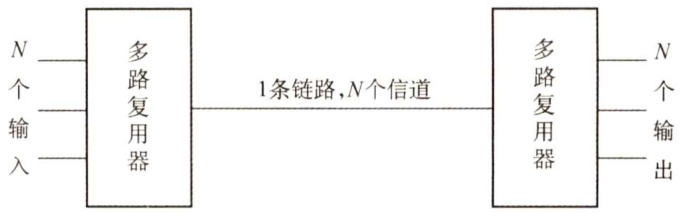  

信道划分的实质就是通过分时、分频、分码等方法把原来的一条广播信道，逻辑上分为几条用于两个结点之间通信的互不干扰的子信道，实际上就是把广播信道转变为点对点信道。  

信道划分介质访问控制分为以下4种。  

#### 1.频分多路复用（FDM）  

频分多路复用是一种将多路基带信号调制到不同频率载波上，再叠加形成一个复合信号的多路复用技术。在物理信道的可用带宽超过单个原始信号所需带宽的情况下，可将该物理信道的总带宽分割成若干与传输单个信号带宽相同（或略宽）的子信道，每个子信道传输一种信号，这就是频分多路复用，如图3.14所示。  

每个子信道分配的带宽可不相同，但它们的总和必须不超过信道的总带宽。在实际应用中，为了防止子信道之间的干扰，相邻信道之间需要加入“保护频带”。  

频分多路复用的优点在于充分利用了传输介质的带宽，系统效率较高；由于技术比较成熟，实现也较容易。  

#### 2.时分多路复用（TDM）  

时分多路复用是将一条物理信道按时间分成若干时间片，轮流地分配给多个信号使用。每个时间片由复用的一个信号占用，而不像FDM那样，同一时间同时发送多路信号。这样，利用每个信号在时间上的交叉，就可以在一条物理信道上传输多个信号，如图3.15所示。  

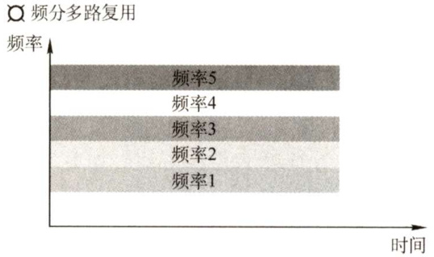  
图3.14频分多路复用原理示意图  

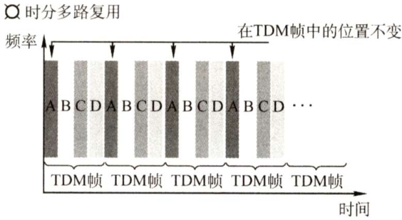  
图3.13 多路复用原理示意图  
图3.15时分多路复用原理示意图  

就某个时刻来看，时分多路复用信道上传送的仅是某一对设备之间的信号；就某段时间而言，传送的是按时间分割的多路复用信号。但由于计算机数据的突发性，一个用户对已经分配到的子信道的利用率一般不高。统计时分多路复用（STDM，又称异步时分多路复用）是TDM的一种改进，它采用STDM帧，STDM帧并不固定分配时隙，而按需动态地分配时隙，当终端有数据要传送时，才会分配到时间片，因此可以提高线路的利用率。例如，线路传输速率为 $8000\mathrm{b/s}$ ，4个用户的平均速率都为 $2000\mathrm{b/s}$ ，当采用TDM方式时，每个用户的最高速率为 $2000\mathrm{b/s}$ ，而在STDM方式下，每个用户的最高速率可达 $8000\mathrm{b/s}$ 0  

#### 3.波分多路复用（WDM）  

波分多路复用即光的频分多路复用，它在一根光纤中传输多种不同波长（频率）的光信号，由  

于波长（频率）不同，各路光信号互不干扰，最后再用波长分解复用器将各路波长分解出来。由于光波处于频谱的高频段，有很高的带宽，因而可以实现多路的波分复用，如图3.16所示。  

#### 4.码分多路复用（CDM）  

码分多路复用是采用不同的编码来区分各路原始信号的一种复用方式。与FDM和TDM不同，它既共享信道的频率，又共享时间。下面举一个直观的例子来理解码分复用。  

假设A站要向C站运输黄豆，B站要向C站运输绿豆，A与C、B与C之间有一条公共的道路，可以类比为广播信道，如图3.17所示。在频分复用方式下，公共道路被划分为两个车道，分别提供给A到C的车和B到C的车行走，两类车可以同时行走，但只分到了公共车道的一半，因此频分复用（波分复用也一样）共享时间而不共享空间。在时分复用方式下，先让A到C的车走一趟，再让B到C的车走一趟，两类车交替地占用公共车道。公共车道没有划分，因此两车共享了空间，但不共享时间。码分复用与另外两种信道划分方式大为不同，在码分复用情况下，黄豆与绿豆放在同一辆车上运送，到达C后，由C站负责把车上的黄豆和绿豆分开。因此，黄豆和绿豆的运送，在码分复用的情况下，既共享了空间，也共享了时间。  

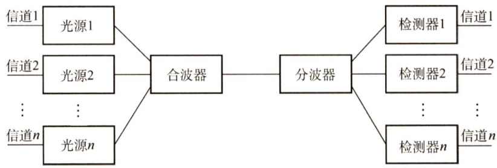  
图3.16波分多路复用原理示意图  

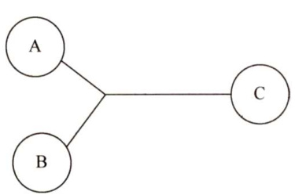  
图3.17共享信道的传输  

实际上，更常用的名词是码分多址（CodeDivision MultipleAccess，CDMA），其原理是每个比特时间再划分成 $m$ 个短的时间槽，称为码片（Chip)，通常 $m$ 的值是64或128，下例中为简单起见，设 $m$ 为8。每个站点被指派一个唯一的 $m$ 位码片序列。发送1时，站点发送它的码片序列；发送0时，站点发送该码片序列的反码。当两个或多个站点同时发送时，各路数据在信道中线性相加。为从信道中分离出各路信号，要求各个站点的码片序列相互正交。  

简单理解就是，A站向C站发出的信号用一个向量来表示，B站向C站发出的信号用另一个向量来表示，两个向量要求相互正交。向量中的分量，就是所谓的码片。  

下面举例说明CDMA的原理。  

假如站点A的码片序列被指派为00011011，则A站发送00011011就表示发送比特1，发送11100100就表示发送比特0。为了方便，按惯例将码片中的0写为-1，将1写为 $+1$ ，因此A站的码片序列是 ${-1-1-1+1+1-1+1+1}$ 。  

令向量 $s$ 表示A站的码片向量，令 $_{T}$ 表示B站的码片向量。两个不同站的码片序列正交，即向量 $s$ 和 $_{T}$ 的规格化内积（InnerProduct）为0：  

$$
S\bullet T\equiv{\frac{1}{m}}\sum_{i=1}^{m}S_{i}T_{i}=0
$$  

任何一个码片向量和该码片向量自身的规格化内积都是1，任何一个码片向量和该码片反码的向量的规格化内积是-1，如  

$$
S{\bullet}S=\frac{1}{m}\sum_{i=1}^{m}S_{i}S_{i}=\frac{1}{m}\sum_{i=1}^{m}S_{i}^{2}=\frac{1}{m}\sum_{i=1}^{m}(\pm1)^{2}=1
$$  

令向量 $_{T}$ 为 $(-1-1+1-1+1+1+1-1)$ o  

当A站向C站发送数据1时，就发送了向量 $(-1-1-1+1+1-1+1+1)$ 6当B站向C站发送数据0时，就发送了向量 $(+1+1-1+1-1-1+1)$ 。  

两个向量到了公共信道上就进行叠加，实际上就是线性相加，得到  

$$
S-{\pmb T}=\left(0\quad0\quad-2\quad2\quad0\quad-2\quad0\quad2\right)
$$  

到达C站后，进行数据分离，如果要得到来自A站的数据，C站就必须知道A站的码片序列，让 $s$ 与 $_{S-T}$ 进行规格化内积。根据叠加原理，其他站点的信号都在内积的结果中被过滤掉了，内积的相关项都是0，而只剩下A站发送的信号。得到  

$$
S\mathbf{\cdot}(S-T)=1
$$  

所以A站发出的数据是1。同理，如果要得到来自B站的数据，那么  

$$
T\bullet(S-T)=-1
$$  

因此从B站发送过来的信号向量是一个反码向量，代表0。  

规格化内积是线性代数中的内容，它是在得到两个向量的内积后再除以向量的分量的个数。  

码分多路复用技术具有频谱利用率高、抗干扰能力强、保密性强、语音质量好等优点，还可以减少投资和降低运行成本，主要用于无线通信系统，特别是移动通信系统。  

#### 3.5.2 随机访问介质访问控制  

在随机访问协议中，不采用集中控制方式解决发送信息的次序问题，所有用户能根据自己的意愿随机地发送信息，占用信道全部速率。在总线形网络中，当有两个或多个用户同时发送信息时，就会产生帧的冲突（碰撞，即前面所说的相互干扰)，导致所有冲突用户的发送均以失败告终。为了解决随机接入发生的碰撞，每个用户需要按照一定的规则反复地重传它的帧，直到该帧无碰撞地通过。这些规则就是随机访问介质访问控制协议，常用的协议有ALOHA 协议、CSMA协议、CSMA/CD协议和CSMA/CA 协议等，它们的核心思想都是：胜利者通过争用获得信道，从而获得信息的发送权。因此，随机访问介质访问控制协议又称争用型协议。  

读者会发现，如果介质访问控制采用信道划分机制，那么结点之间的通信要么共享空间，要么共享时间，要么两者都共享；而如果采用随机访问控制机制，那么各结点之间的通信就可既不共享时间，也不共享空间。所以随机介质访问控制实质上是一种将广播信道转化为点到点信道的行为，如图3.18所示。  

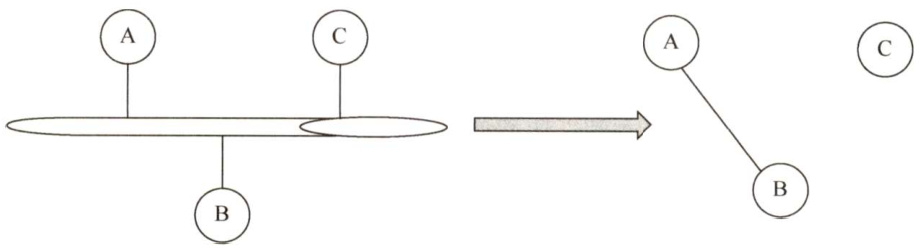  
图3.18共享信道举例  

#### 1．ALOHA协议  

夏威夷大学早期研制的随机接入系统称为ALOHA，它是 Additive Link On-lineHAwaii system的缩写。ALOHA协议分为纯ALOHA协议和时隙ALOHA协议两种。  

（1）纯ALOHA协议  

纯 ALOHA协议的基本思想是，当网络中的任何一个站点需要发送数据时，可以不进行任何检测就发送数据。如果在一段时间内未收到确认，那么该站点就认为传输过程中发生了冲突。发送站点需要等待一段时间后再发送数据，直至发送成功。图3.19所示的模型不仅可代表总线形网络的情况，而且可以代表无线信道的情况。  

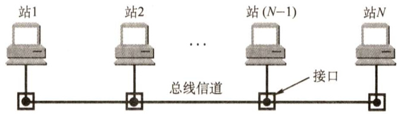  
图3.19ALOHA协议的一般模型  

图3.20表示一个纯ALOHA协议的工作原理。每个站均自由地发送数据帧。为简化问题，不考虑由信道不良而产生的误码，并假定所有站发送的帧都是定长的，帧的长度不用比特而用发送这个帧所需的时间来表示，在图3.20中用 $T_{0}$ 表示这段时间。  

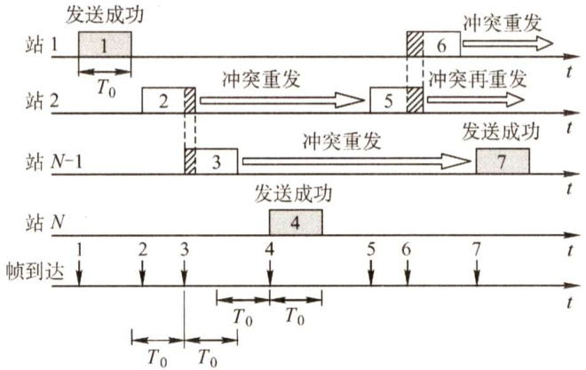  
图3.20纯ALOHA协议的工作原理  

在图3.20的例子中，当站1发送帧1时，其他站都未发送数据，所以站1的发送必定是成功的。但随后站2和站 $N-1$ 发送的帧2和帧3在时间上重叠了一些（即发生了碰撞)。碰撞的结果是，碰撞双方（有时也可能是多方）所发送的数据出现了差错，因而都须进行重传。但是发生碰撞的各站并不能马上进行重传，因为这样做必然会继续发生碰撞。纯ALOHA系统采用的重传策略是让各站等待一段随机的时间，然后再进行重传。若再次发生碰撞，则需要再等待一段随机的时间，直到重传成功为止。图中其余一些帧的发送情况是帧4发送成功，而帧5和帧6发生碰撞。  

假设网络负载（ $T_{0}$ 时间内所有站点发送成功的和未成功而重传的帧数）为 $G$ ，则纯ALOHA网络的吞吐量（ $T_{0}$ 时间内成功发送的平均帧数）为 $S=G\mathrm{e}^{-2G}$ 。当 $G=0.5$ 时， $S=0.5\mathrm{e}^{-1}{\approx}0.184$ 。这是吞吐量 $s$ 可能达到的极大值。可见，纯ALOHA网络的吞吐量很低。为了克服这一缺点，人们在原始的纯ALOHA协议的基础上进行改进，产生了时隙ALOHA协议。  

#### （2）时隙ALOHA协议  

时隙ALOHA协议把所有各站在时间上同步起来，并将时间划分为一段段等长的时隙（Slot)，规定只能在每个时隙开始时才能发送一个帧。从而避免了用户发送数据的随意性，减少了数据产生冲突的可能性，提高了信道的利用率。  

图3.21为两个站的时隙ALOHA协议的工作原理示意图。时隙的长度 $T_{0}$ 使得每个帧正好在一个时隙内发送完毕。每个帧在到达后，一般都要在缓存中等待一段小于 $T_{0}$ 的时间，然后才能发送出去。在一个时隙内有两个或两个以上的帧到达时，在下一个时隙将产生碰撞。碰撞后重传的  

策略与纯ALOHA的情况是相似的。  

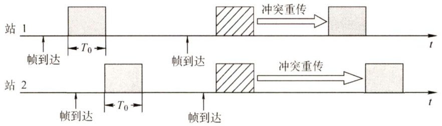  
图3.21时隙ALOHA协议的工作原理  

时隙ALOHA网络的吞吐量 $s$ 与网络负载 $G$ 的关系是 $S=G\mathrm{e}^{-G}$ 。当 $G=1$ 时， $S=\mathsf{e}^{-1}{\approx}0.368$ o这是吞吐量 $s$ 可能达到的极大值。可见，时隙ALOHA网络比纯ALOHA网络的吞吐量大了1倍。  

#### 2.CSMA协议  

时隙ALOHA系统的效率虽然是纯ALOHA系统的两倍，但每个站点都是随心所欲地发送数据的，即使其他站点正在发送也照发不误，因此发送碰撞的概率很大。  

若每个站点在发送前都先侦听一下共用信道，发现信道空闲后再发送，则就会大大降低冲突的可能，从而提高信道的利用率，载波侦听多路访问（Carrier Sense Multiple Access，CSMA）协议依据的正是这一思想。CSMA协议是在ALOHA 协议基础上提出的一种改进协议，它与ALOHA协议的主要区别是多了一个载波侦听装置。  

根据侦听方式和侦听到信道忙后的处理方式不同，CSMA协议分为三种。  

#### （1）1-坚持CSMA  

1-坚持CSMA（1-persistentCSMA）的基本思想是：一个结点要发送数据时，首先侦听信道；如果信道空闲，那么立即发送数据；如果信道忙，那么等待，同时继续侦听直至信道空闲；如果发生冲突，那么随机等待一段时间后，再重新开始侦听信道。  

“1-坚持”的含义是：侦听到信道忙后，继续坚持侦听信道；侦听到信道空闲后，发送帧的概率为1，即立刻发送数据。  

传播延迟对1-坚持CSMA协议的性能影响较大。结点A开始发送数据时，结点B也正好有数据要发送，但这时结点A发出数据的信号还未到达结点B，结点B侦听到信道空闲，于是立即发送数据，结果必然导致冲突。即使不考虑延迟，1-坚持CSMA 协议也可能产生冲突。例如，结点A正在发送数据时，结点B和C也准备发送数据，侦听到信道忙，于是坚持侦听，结果当结点A一发送完毕，结点B和C就会立即发送数据，同样导致冲突。  

#### （2）非坚持CSMA  

非坚持CSMA（Non-persistentCSMA）的基本思想是：一个结点要发送数据时，首先侦听信道；如果信道空闲，那么立即发送数据；如果信道忙，那么放弃侦听，等待一个随机的时间后再重复上述过程。  

非坚持CSMA协议在侦听到信道忙后就放弃侦听，因此降低了多个结点等待信道空闲后同时发送数据导致冲突的概率，但也会增加数据在网络中的平均延迟。可见，信道利用率的提高是以增加数据在网络中的延迟时间为代价的。  

#### (3) $p$ -坚持CSMA  

$p$ -坚持CSMA（P-persistentCSMA）用于时分信道，其基本思想是：一个结点要发送数据时，首先侦听信道；如果信道忙，就持续侦听，直至信道空闲；如果信道空闲，那么以概率 $p$ 发送数据，以概率 $1-p$ 推迟到下一个时隙；如果在下一个时隙信道仍然空闲，那么仍以概率 $p$ 发送数据，以概率 $1-p$ 推迟到下一个时隙；这个过程一直持续到数据发送成功或因其他结点发送数据而检测到信道忙为止，若是后者，则等待下一个时隙再重新开始侦听。  

$p$ -坚持CSMA在检测到信道空闲后，以概率 $p$ 发送数据，以概率 $1-p$ 推迟到下一个时隙，其目的是降低1-坚持CSMA协议中多个结点检测到信道空闲后同时发送数据的冲突概率；采用坚持“侦听”的目的是，试图克服非坚持CSMA协议中由于随机等待而造成的延迟时间较长的缺点。因此， $p$ -坚持CSMA协议是非坚持CSMA协议和1-坚持CSMA协议的折中方案。  

三种不同类型的CSMA协议比较如表3.1所示。  

表3.1三种不同类型的CSMA协议比较  

<html><body><table><tr><td>信道状态</td><td>1-坚持</td><td>非坚持</td><td>p-坚持</td></tr><tr><td>空闲</td><td>立即发送数据</td><td>立即发送数据</td><td>以概率p发送数据，以概率1-p推迟到下一个时隙</td></tr><tr><td>忙</td><td>继续坚持侦听</td><td>放弃侦听，等待一个随机的时间后再侦听</td><td>持续侦听，直至信道空闲</td></tr></table></body></html>  

#### 3.CSMA/CD协议  

载波侦听多路访问/碰撞检测（Carrier Sense Multiple Access with Collision Detection，CSMA/CD）协议是CSMA协议的改进方案，适用于总线形网络或半双工网络环境。“载波侦听”就是发送前先侦听，即每个站在发送数据之前先要检测一下总线上是否有其他站点正在发送数据，若有则暂时不发送数据，等待信道变为空闲时再发送。“碰撞检测”就是边发送边侦听，即适配器边发送数据边检测信道上信号电压的变化情况，以便判断自己在发送数据时其他站点是否也在发送数据。  

CSMA/CD的工作流程可简单概括为“先听后发，边听边发，冲突停发，随机重发”。  

1）适配器从网络层获得一个分组，封装成以太网帧，放入适配器的缓存，准备发送。  
2）如果适配器侦听到信道空闲，那么它开始发送该帧。如果适配器侦听到信道忙，那么它持续侦听直至信道上没有信号能量，然后开始发送该帧。  
3）在发送过程中，适配器持续检测信道。若一直未检测到碰撞，则顺利地把这个帧发送完毕。若检测到碰撞，则中止数据的发送，并发送一个拥塞信号，以让所有用户都知道。  
4）在中止发送后，适配器就执行指数退避算法，等待一段随机时间后返回到步骤2)。  

电磁波在总线上的传播速率总是有限的，因此，当某个时刻发送站检测到信道空闲时，此时信道并不一定是空闲的。如图3.22所示，设 $\tau$ 为单程传播时延。在 $t=0$ 时，A发送数据。在 $t=\tau-\delta$ 时，A发送的数据还未到达B，由于B检测到信道空闲而发送数据。经过时间 $\delta/2$ 后，即在 $t=\tau-\delta/2$ 时，A发送的数据和B发送的数据发生碰撞，但这时A和B都不知道。在 $t=\tau$ 时，B检测到碰撞，于是停止发送数据。在 $t=2\tau-\delta$ 时，A检测到碰撞，也停止发送数据。显然，CSMA/CD中的站不可能同时进行发送和接收，因此采用CSMA/CD协议的以太网只能进行半双工通信。  

由图3.22可知，站A在发送帧后至多经过时间 $2\tau$ （端到端传播时延的2倍）就能知道所发送的帧有没有发生碰撞（当 $\delta\to0$ 时)。因此把以太网端到端往返时间 $2\tau$ 称为争用期（又称冲突窗口或碰撞窗口)。每个站在自己发送数据之后的一小段时间内，存在发生碰撞的可能性，只有经过争用期这段时间还未检测到碰撞时，才能确定这次发送不会发生碰撞。  

为了确保发送站在发送数据的同时能检测到可能存在的碰撞，需要在发送完帧之前就能收到自己发送出去的数据，即帧的传输时延至少要两倍于信号在总线中的传播时延，所以CSMA/CD总线网中的所有数据帧都必须要大于一个最小帧长。任何站点收到帧长小于最小帧长的帧时，就把它当作无效帧立即丢弃。最小帧长的计算公式为  

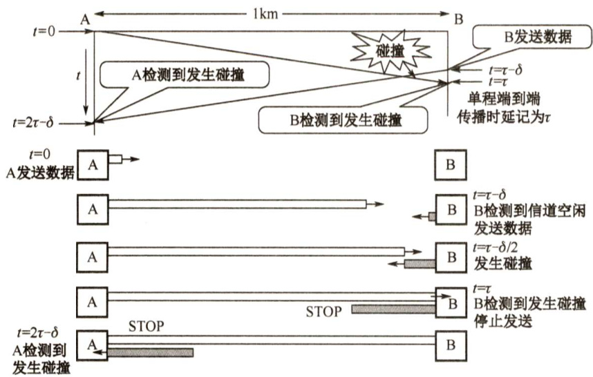  
图3.22传播时延对载波侦听的影响  

例如，以太网规定取 $51.2\upmu\mathrm{s}$ 为争用期的长度。对于 $10\mathbf{Mb}/\mathbf{s}$ 的以太网，在争用期内可发送512bit，即 64B。在以太网发送数据时，如果前64B未发生冲突，那么后续数据也就不会发生冲突（表示已成功抢占信道)。换句话说，如果发生冲突，那么就一定在前 64B。由于一旦检测到冲突就立即停止发送，因此这时发送出去的数据一定小于64B。因此，以太网规定最短帧长为64B，凡长度小于64B的帧都是由于冲突而异常中止的无效帧，收到这种无效帧时应立即丢弃。  

如果只发送小于64B的帧，如40B的帧，那么需要在MAC子层中于数据字段的后面加入一个整数字节的填充字段，以保证以太网的MAC帧的长度不小于64B。  

除检测冲突外，CSMA/CD还能从冲突中恢复。一旦发生了冲突，参与冲突的两个站点紧接着再次发送是没有意义的，如果它们这样做，那么将会导致无休止的冲突。CSMA/CD采用二进制指数退避算法来解决碰撞问题。算法精髓如下：  

1）确定基本退避时间，一般取两倍的总线端到端传播时延 $2\tau$ (即争用期)。  
2）定义参数 $k$ ，它等于重传次数，但 $k$ 不超过10，即 $k=\operatorname*{min}[$ 重传次数，10]。当重传次数不超过10时， $k$ 等于重传次数；当重传次数大于10时， $k$ 就不再增大而一直等于10（这个条件往往容易忽略，请读者注意)。  
3）从离散的整数集合 $[0,1,\cdots,2^{k}-1]$ 中随机取出一个数 $\boldsymbol{r}$ ，重传所需要退避的时间就是 $\boldsymbol{r}$ 倍的基本退避时间，即 $2r\tau_{\odot}$   
4）当重传达16次仍不能成功时，说明网络太拥挤，认为此帧永远无法正确发出，抛弃此帧并向高层报告出错(这个条件也容易忽略，请读者注意)。  

现在来看一个例子。假设一个适配器首次试图传输一帧，当传输时，它检测到碰撞。第1次重传时， $k=1$ ，随机数 $\boldsymbol{r}$ 从整数{0,1}中选择，因此适配器可选的重传推迟时间是0或 $2\tau$ 。若再次发送碰撞，则在第2次重传时，随机数 $\boldsymbol{r}$ 从整数{0,1,2,3}中选择，因此重传推迟时间是在 $0,2\tau,$ $4\tau,6\tau$ 这4个时间中随机地选取一个。以此类推。  

使用截断二进制指数退避算法可使重传需要推迟的平均时间随重传次数的增大而增大（这也称动态退避)，因而能降低发生碰撞的概率，有利于整个系统的稳定。  

#### 4.CSMA/CA协议  

CSMA/CD协议已成功应用于使用有线连接的局域网，但在无线局域网环境下，却不能简单地搬用CSMA/CD协议，特别是碰撞检测部分。主要有两个原因：  

1）接收信号的强度往往会远小于发送信号的强度，且在无线介质上信号强度的动态变化范围很大，因此若要实现碰撞检测，则硬件上的花费就会过大。  

2）在无线通信中，并非所有的站点都能够听见对方，即存在“隐蔽站”问题。  

为此，802.11标准定义了广泛应用于无线局域网的CSMA/CA协议，它对CSMA/CD协议进行了修改，把碰撞检测改为碰撞避免（Colision Avoidance，CA）。“碰撞避免”并不是指协议可以完全避免碰撞，而是指协议的设计要尽量降低碰撞发生的概率。由于802.11无线局域网不使用碰撞检测，一旦站点开始发送一个帧，就会完全地发送该帧，但碰撞存在时仍然发送整个数据帧（尤其是长数据帧）会严重降低网络的效率，因此要采用碰撞避免技术降低碰撞的可能性。  

由于无线信道的通信质量远不如有线信道，802.11使用链路层确认/重传（ARQ）方案，即站点每通过无线局域网发送完一帧，就要在收到对方的确认帧后才能继续发送下一帧。  

为了尽量避免碰撞，802.11规定，所有的站完成发送后，必须再等待一段很短的时间（继续监听）才能发送下一帧。这段时间称为帧间间隔（InterFrame Space，IFS）。帧间间隔的长短取决于该站要发送的帧的类型。802.11使用了3种IFS：  

1）SIFS（短IFS）：最短的IFS，用来分隔属于一次对话的各帧，使用SIFS的帧类型有ACK帧、CTS帧、分片后的数据帧，以及所有回答AP探询的帧等。  

2）PIFS（点协调IFS）：中等长度的IFS，在PCF操作中使用。  

3）DIFS（分布式协调IFS)：最长的IFS，用于异步帧竞争访问的时延。  

CSMA/CA的退避算法和CSMA/CD的稍有不同（见教材)。信道从忙态变为空闲态时，任何一个站要发送数据帧，不仅都要等待一个时间间隔，而且要进入争用窗口，计算随机退避时间以便再次试图接入信道，因此降低了碰撞发生的概率。当且仅当检测到信道空闲且这个数据帧是要发送的第一个数据帧时，才不使用退避算法。其他所有情况都必须使用退避算法，具体为： $\textcircled{1}$ 在发送第一个帧前检测到信道忙； $\textcircled{2}$ 每次重传； $\textcircled{3}$ 每次成功发送后要发送下一帧。  

CSMA/CA算法归纳如下：  

1）若站点最初有数据要发送（而不是发送不成功再进行重传)，且检测到信道空闲，在等待时间DIFS后，就发送整个数据帧。2）否则，站点执行CSMA/CA退避算法，选取一个随机回退值。一旦检测到信道忙，退避计时器就保持不变。只要信道空闲，退避计时器就进行倒计时。3）当退避计时器减到0时（这时信道只可能是空闲的)，站点就发送整个帧并等待确认。4）发送站若收到确认，就知道已发送的帧被目的站正确接收。这时如果要发送第二帧，就要从步骤2）开始。若发送站在规定时间内没有收到确认帧ACK（由重传计时器控制)，就必须重传该帧，再次使用CSMA/CA协议争用该信道，直到收到确认，或经过若干次重传失败后放弃发送。  

处理隐蔽站问题：RTS和CTS  

在图3.23中，站A和B都在AP的覆盖范围内，但A和B相距较远，彼此都听不见对方。当A和B检测到信道空闲时，都向AP发送数据，导致碰撞的发生，这就是隐蔽站问题。  

为了避免该问题，802.11允许发送站对信道进行预约。源站要发送数据帧之前先广播一个很短的请求发送RTS（RequestToSend）控制帧，它包括源地址、目的地址和这次通信（含相应的确认帧）所持续的时间，该帧能被其范围内包括AP在内的所有站点听到。若信道空闲，则AP广播一个允许发送CTS（ClearTo Send）控制帧，它包括这次通信所需的持续时间（从RTS 帧复制)，该帧也能被其范围内包括A和B在内的所有站点听到。B和其他站听到CTS 后，  

在CTS帧中指明的时间内将抑制发送，如图3.24所示。CTS帧有两个目的： $\textcircled{1}$ 给源站明确的发送许可； $\textcircled{2}$ 指示其他站点在预约期内不要发送。  

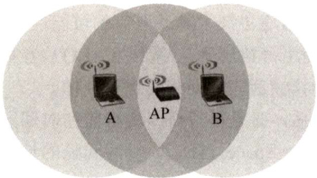  
图3.23A和B同时向AP发送信号，发生碰撞  

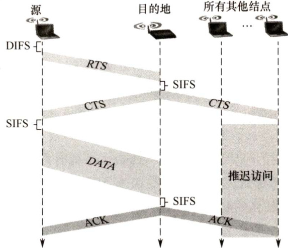  
图3.24使用RTS和CTS帧的碰撞避免  

使用RTS 和CTS帧会使网络的通信效率有所下降，但这两种帧都很短，与数据帧相比开销不算大。相反，若不使用这种控制帧，一旦发生碰撞而导致数据帧重发，则浪费的时间更多。信道预约不是强制性规定，各站可以自己决定使用或不使用信道预约。只有当数据帧长度超过某一数值时，使用RTS和CTS帧才比较有利。  

CSMA/CD与CSMA/CA主要有如下区别：  

1）CSMA/CD可以检测冲突，但无法避免；CSMA/CA发送数据的同时不能检测信道上有无冲突，本结点处没有冲突并不意味着在接收结点处就没有冲突，只能尽量避免。  
2）传输介质不同。CSMA/CD用于总线形以太网，CSMA/CA用于无线局域网 $802.11\mathrm{a}/\mathrm{b}/\mathrm{g}/\mathrm{n}$ 等。  
3）检测方式不同。CSMA/CD通过电缆中的电压变化来检测；而CSMA/CA采用能量检测、载波检测和能量载波混合检测三种检测信道空闲的方式。  

总结：CSMA/CA协议的基本思想是在发送数据时先广播告知其他结点，让其他结点在某段时间内不要发送数据，以免出现碰撞。CSMA/CD协议的基本思想是发送前侦听，边发送边侦听，一旦出现碰撞马上停止发送。  

#### 3.5.3 轮询访问：令牌传递协议  

在轮询访问中，用户不能随机地发送信息，而要通过一个集中控制的监控站，以循环方式轮询每个结点，再决定信道的分配。当某结点使用信道时，其他结点都不能使用信道。典型的轮询访问介质访问控制协议是令牌传递协议，它主要用在令牌环局域网中。  

在令牌传递协议中，一个令牌（Token）沿着环形总线在各结点计算机间依次传递。令牌是一个特殊的MAC 控制帧，它本身并不包含信息，仅控制信道的使用，确保同一时刻只有一个站点独占信道。当环上的一个站点希望传送帧时，必须等待令牌。一旦收到令牌，站点便可启动发送帧。帧中包括目的站点地址，以标识哪个站点应接收此帧。站点只有取得令牌后才能发送数据帧，因此令牌环网不会发生碰撞。站点在发送完一帧后，应释放令牌，以便让其他站使用。由于令牌在网环上是按顺序依次传递的，因此对所有入网计算机而言，访问权是公平的。  

当计算机都不需要发送数据时，令牌就在环形网上游荡，而需要发送数据的计算机只有在拿到该令牌后才能发送数据帧，因此不会发送冲突（因为令牌只有一个)。  

令牌环网中令牌和数据的传递过程如下：  

1）网络空闲时，环路中只有令牌帧在循环传递。  
2）令牌传递到有数据要发送的站点时，该站点就修改令牌中的一个标志位，并在令牌中附加自己需要传输的数据，将令牌变成一个数据帧，然后将这个数据帧发送出去。  
3）数据帧沿着环路传输，接收到的站点一边转发数据，一边查看帧的目的地址。如果目的地址和自己的地址相同，那么接收站就复制该数据帧以便进一步处理。  
4）数据帧沿着环路传输，直到到达该帧的源站点，源站点收到自己发出去的帧后便不再转发。同时，通过检验返回的帧来查看数据传输过程中是否出错，若有错则重传。  
5）源站点传送完数据后，重新产生一个令牌，并传递给下一站点，以交出信道控制权。  

在令牌传递网络中，传输介质的物理拓扑不必是一个环，但是为了把对介质访问的许可从一个设备传递到另一个设备，令牌在设备间的传递通路逻辑上必须是一个环。  

轮询介质访问控制非常适合负载很高的广播信道。所谓负载很高的信道，是指多个结点在同一时刻发送数据概率很大的信道。可以想象，如果这样的广播信道采用随机介质访问控制，那么发生冲突的概率将会很大，而采用轮询介质访问控制则可以很好地满足各结点间的通信需求。  

轮询介质访问控制既不共享时间，也不共享空间，它实际上是在随机介质访问控制的基础上，限定了有权力发送数据的结点只能有一个。  

即使是广播信道也可通过介质访问控制机制使广播信道逻辑上变为点对点的信道，所以说数据链路层研究的是“点到点”之间的通信。  

#### 3.5.4 本节习题精选  

#### 一、单项选择题  

01．将物理信道的总频带宽分割成若干子信道，每个子信道传输一路信号，这种信道复用技术是（）。  

A．码分复用 B．频分复用 C．时分复用 D.空分复用  

02.TDM所用传输介质的性质是（）。  

A．介质的带宽大于结合信号的位速率B．介质的带宽小于单个信号的带宽C．介质的位速率小于最小信号的带宽D.介质的位速率大于单个信号的位速率  

03.从表面上看，FDM比TDM能更好地利用信道的传输能力，但现在计算机网络更多地使用TDM而非FDM，其原因是（）。  

A.FDM实际能力更差  
B.TDM可用于数字传输而FDM不行  
C.FDM技术不成熟  
D.TDM能更充分地利用带宽  

04.在下列多路复用技术中，（）具有动态分配时隙的功能。  

A．同步时分多路复用 B．统计时分多路复用C．频分多路复用 D．码分多路复用  

05．在下列协议中，不会发生碰撞的是（）。  

A.TDM B.ALOHA C.CSMA D. CSMA/CD  

06.以下几种CSMA协议中，（）协议在监听到介质空闲时仍可能不发送。  

A.1-坚持CSMAB．非坚持CSMAC. $p$ -坚持CSMA D.以上都不是  

07.在CSMA的非坚持协议中，当媒体忙时，则（）直到媒体空闲。  

A.延迟一个固定的时间单位再侦听 B.继续侦听C.延迟一个随机的时间单位再侦听 D.放弃侦听  

08.在CSMA的非坚持协议中，当站点侦听到总线媒体空闲时，它（）。  

A.以概率 $p$ 传送 B.马上传送C.以概率 $1-p$ 传送 D.以概率 $p$ 延迟一个时间单位后传送  

09．在CSMA/CD协议的定义中，“争议期”指的是（）。  

A.信号在最远两个端点之间往返传输的时间B.信号从线路一端传输到另一端的时间C．从发送开始到收到应答的时间D.从发送完毕到收到应答的时间  

10.以太网中，当数据传输速率提高时，帧的发送时间会相应地缩短，这样可能会影响到冲突的检测。为了能有效地检测冲突，可以使用的解决方案有（）。  

A.减少电缆介质的长度或减少最短帧长B.减少电缆介质的长度或增加最短帧长C.增加电缆介质的长度或减少最短帧长D.增加电缆介质的长度或增加最短帧长  

11.长度为10km、数据传输速率为10Mb/s的CSMA/CD以太网，信号传播速率为200m/μs。那么该网络的最小帧长为（）。  

A.20bit B. 200bit C. 100bit D. 1000bit  

12.以太网中若发生介质访问冲突，则按照二进制指数回退算法决定下一次重发的时间。使用二进制回退算法的理由是（）。  

A.这种算法简单  
B．这种算法执行速度快  
C.这种算法考虑了网络负载对冲突的影响  
D．这种算法与网络的规模大小无关  

13.以太网中采用二进制指数回退算法处理冲突问题。下列数据帧重传时再次发生冲突的概率最低的是（）。  

A.首次重传的帧 B.发生两次冲突的帧C.发生三次重传的帧 D．发生四次重传的帧  

14.在以太网的二进制回退算法中，在11次碰撞之后，站点会在0～（）之间选择一个随机数。  

A.255 B.511 C. 1023 D.2047  

15.与CSMA/CD网络相比，令牌环网更适合的环境是（）。  

A．负载轻 B.负载重 C.距离远 D.距离近  

16.根据CSMA/CD协议的工作原理，需要提高最短帧长度的是（）。  

A.网络传输速率不变，冲突域的最大距离变短B.冲突域的最大距离不变，网络传输速率提高  

C.上层协议使用TCP的概率增加D.在冲突域不变的情况下减少线路中的中继器数量  

17．多路复用器的主要功能是（）。  

A.执行模/数转换 B.执行串行/并行转换 C.减少主机的通信处理负荷 D．结合来自两条或更多条线路的传输  

18．下列关于令牌环网络的描述中，错误的是（）。  

A.令牌环网络存在冲突  
B．同一时刻，环上只有一个数据在传输  
C．网上所有结点共享网络带宽  
D.数据从一个结点到另一结点的时间可以计算  

19．下列关于令牌环网的说法中，不正确的是（）。  

A．媒体的利用率比较公平  
B.重负载下信道利用率高  
C．结点可以一直持有令牌，直至所要发送的数据传输完毕  
D.令牌是指一种特殊的控制帧  

20．在令牌环网中，当所有站点都有数据帧要发送时，一个站点在最坏情况下等待获得令牌和发送数据帧的时间等于（）。  

A．所有站点传送令牌的时间总和B．所有站点传送令牌和发送帧的时间总和C．所有站点传送令牌的时间总和的一半D.所有站点传送令牌和发送帧的时间总和的一半  

21.一条广播信道上接有3个站点A、B、C，介质访问控制采用信道划分方法，信道的划分采用码分复用技术，A、B要向C发送数据，设A的码序列为 $+1,-1,-1,+1,+1,+1,+1,-1$ 。站B可以选用的码片序列为（）。  

$$
\begin{array}{c c}{{-1,-1,-1,+1,-1,+1,+1,+1}}&{{\qquad\mathrm{B.}}}&{{-1,+1,-1,-1,-1,+1,+1,+1}}\\ {{-1,+1,-1,+1,-1,+1,-1,+1}}&{{\qquad\mathrm{D.}}}&{{-1,+1,-1,+1,-1,+1,+1,+1}}\end{array}
$$  

22.【2009统考真题】在一个采用CSMA/CD协议的网络中，传输介质是一根完整的电缆，传输速率为 $1\mathrm{Gb/s}$ ，电缆中的信号传播速率是 $200000\mathrm{km/s},$ 。若最小数据帧长度减少800比特，则最远的两个站点之间的距离至少需要（）。  

A.增加 $160\mathrm{m}$ B.增加 $80\mathrm{m}$ C.减少 $160\mathrm{m}$ D.减少 $80\mathrm{m}$  

3.【2011统考真题】下列选项中，对正确接收到的数据帧进行确认的MAC协议是（  

A.CSMA B. CDMA C.CSMA/CD D. CSMA/CA  

24.【2013统考真题】下列介质访问控制方法中，可能发生冲突的是（）。  

A.CDMA B. CSMA C. TDMA D.FDMA  

25.【2014统考真题】站点A、B、C通过CDMA共享链路，A、B、C的码片序列分别是(1,1,1,1)、 $(1,-1,1,-1)\not\ast\circ(1,1,-1,-1).$ 。若C从链路上收到的序列是 $(2,0,2,0,0,-2,0,-2,0$ 。2,0,2)，则C收到A发送的数据是（）。  

A. 000 B.101 C.110 D.111  

26.【2015统考真题】下列关于CSMA/CD协议的叙述中，错误的是（）。  

A.边发送数据帧，边检测是否发生冲突B．适用于无线网络，以实现无线链路共享C.需要根据网络跨距和数据传输速率限定最小帧长D．当信号传播延迟趋近0时，信道利用率趋近 $100\%$  

27.【2016统考真题】如下图所示，在Hub再生比特流的过程中会产生 $1.535\upmu\mathrm{s}$ 延时（Switch和Hub均为100Base-T设备），信号传播速率为 $200\mathrm{m/\upmus}$ ，不考虑以太网帧的前导码，则H3和H4之间理论上可以相距的最远距离是（）。  

A. $200\mathrm{m}$ B. $205\mathrm{m}$ C. $359\mathrm{m}$ D.512m  

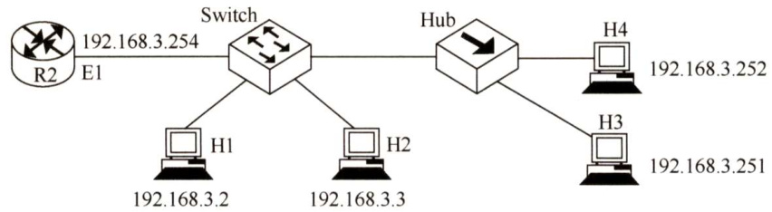  

28.【2018统考真题】IEEE802.11无线局域网的MAC协议CSMA/CA进行信道预约的方法是（）。  

A.发送确认帧 B.采用二进制指数退避C.使用多个MAC地址 D.交换RTS与CTS帧  

29.【2019统考真题】假设一个采用CSMA/CD协议的 $100\mathrm{Mb/s}$ 局域网，最小帧长是128B，则在一个冲突域内两个站点之间的单向传播延时最多是（）。  

A. $2.56\upmu\mathrm{s}$ B. $5.12\upmu\mathrm{s}$ C. $10.24\upmu\mathrm{s}$ D. $20.48\upmu\mathrm{s}$  

30.【2020统考真题】在某个IEEE802.11无线局域网中，主机H与AP之间发送或接收CSMA/CA帧的过程如下图所示。在H或AP发送帧前等待的帧间间隔时间（IFS）中，最长的是（）。  

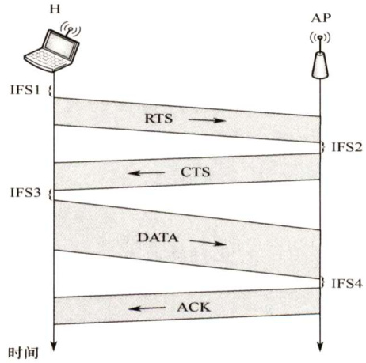  

A.IFS1 B. IFS2 C. IFS3 D. IFS4  

#### 二、综合应用题  

01.以太网使用的CSMA/CD协议是以争用方式接入共享信道的。与传统的时分复用（TDM）相比，其优缺点如何？  

02．长度为 $1\mathrm{km}$ 、数据传输速率为10Mb/s的CSMA/CD以太网，信号在电缆中的传播速率为 $200000\mathrm{km/s}$ 。试求能够使该网络正常运行的最小帧长。  

03．10000个航空订票站在竞争使用单个时隙ALOHA通道，各站平均每小时做18次请求，一个时隙是 $125\upmu\mathrm{s}$ 。总通信负载约为多少？  

04.一组 $N$ 个站点共享一个 $56\mathrm{kb/s}$ 的纯ALOHA信道，每个站点平均每100s输出一个 $1000\mathrm{bit}$ 的帧，即使前一个帧未发送完也依旧进行。问 $N$ 可取的最大值是多少？  

05.考虑建立一个CSMA/CD网，电缆长 $1\mathrm{km}$ ，不使用重发器，运行速率为1Gb/s，电缆中的信号速率是 $200000\mathrm{km/s}$ ，最小帧长度是多少？  

06.若构造一个CSMA/CD总线网，速率为 $100\mathbf{Mb}/\mathbf{s}$ ，信号在电缆中的传播速率为 $2{\times}10^{5}\mathrm{km/s}$ R数据帧的最小长度为125字节。试求总线电缆的最大长度（假设总线电缆中无中继器）。  

07．在一个采用CSMA/CD协议的网络中，传输介质是一根完整的电缆，传输速率为 $1\mathrm{Gb/s},$ 费电缆中信号的传播速率是 $200000\mathrm{km/s}$ 。若最小数据帧长度减少800bit，则最远的两个站点之间的距离应至少变化多少才能保证网络正常工作？  

08.【2010统考真题】某局域网采用CSMA/CD协议实现介质访问控制，数据传输速率为$10\mathbf{Mb}/\mathbf{s}$ ，主机甲和主机乙之间的距离是 $2\mathrm{km}$ ，信号传播速率是 $200000\mathrm{km/s}$ 。请回答下列问题，要求说明理由或写出计算过程。  

1）若主机甲和主机乙发送数据时发生冲突，则从开始发送数据的时刻起，到两台主机均检测到冲突为止，最短需要经过多长时间？最长需要经过多长时间（假设主机甲和主机乙在发送数据的过程中，其他主机不发送数据）？  

2）若网络不存在任何冲突与差错，主机甲总是以标准的最长以太网数据帧（1518字节）向主机乙发送数据，主机乙每成功收到一个数据帧后立即向主机甲发送一个64字节的确认帧，主机甲收到确认帧后方可发送下一个数据帧。此时主机甲的有效数据传输速率是多少（不考虑以太网的前导码）？  

#### 3.5.5 答案与解析  

#### 一、单项选择题  

01.B  

在物理信道的可用带宽超过单个原始信号所需带宽的情况下，可将该物理信道的总带宽分割成若干与传输单个信号带宽相同（或略宽）的子信道，每个子信道传输一种信号，这就是频分多路复用。  

02.D  

时分复用TDM共享带宽，但分时利用信道。将时间划分成一段段等长的时分复用帧（TDM帧)，参与带宽共享的每个时分复用的用户在每个TDM帧中占用固定序号的时隙。显然，在这种情况下，介质的位速率大于单个信号的位速率。  

03.B  

TDM与FDM相比，抗干扰能力强，可以逐级再生整形，避免干扰的积累，而且数字信号比较容易实现自动转换，所以根据FDM和TDM的工作原理，FDM适合于传输模拟信号，TDM适合于传输数字信号。  

04.B  

时分多路复用（TDM）可分为同步时分多路复用和异步时分多路复用（又称统计时分复用）。同步时分多路复用是一种静态时分复用技术，它预先分配时间片（即时隙)，而异步时分多路复  

用则是一种动态时分复用技术，它动态地分配时间片（时隙）。  

05.A  

TDM属于静态划分信道的方式，各结点分时使用信道，不会发生碰撞，而ALOHA、CSMA和CSMA/CD都属于动态的随机访问协议，都采用检测碰撞的策略来应对碰撞，因此都可能会发生碰撞。  

06.C  

$p$ -坚持CSMA协议是1-坚持CSMA协议和非坚持CSMA协议的折中。 $p{\cdot}$ -坚持CSMA在检测到信道空闲后，以概率 $p$ 发送数据，以概率 $1-p$ 推迟到下一个时隙，目的是降低1-坚持CSMA中多个结点检测到信道空闲后同时发送数据的冲突概率；采用坚持“侦听”的目的，是试图克服非坚持CSMA中由于随机等待造成延迟时间较长的缺点。  

07.C  

非坚持CSMA：站点在发送数据前先监听信道，若信道忙则放弃监听，则等待一个随机时间后再监听，若信道空闲则发送数据。  

08.B  

非坚持CSMA：站点在发送数据前先监听信道，若信道忙则放弃监听，等待一个随机时间后再监听，若信道空闲则发送数据。  

09.A  

CSMA/CD协议中定义的冲突检测时间（即争议期）是指，信号在最远两个端点之间往返传输的时间。  

10.B  

最短帧长等于争用期时间内发出的比特数。因此当传输速率提高时，可减少电缆介质的长度（使争用期时间减少，即以太网端到端的时延减小)，或增加最短帧长。  

11.D  

来回路程 $\mathbf{\tau}=10000{\times}2\mathbf{m}$ ，往返时间 $\mathrm{RTT}=10000{\times}2/(200{\times}10^{6})=10^{-4}$ ，最小帧长度 ${\bf\mu}=W\times{\bf R}{\bf T}{\bf T}={\bf\mu}$ 1000bit.。  

12.C  

以太网采用CSMA/CD技术，网络上的流量越多、负载越大时，发生冲突的概率也会越大。当工作站发送的数据帧因冲突而传输失败时，会采用二进制回退算法后退一段时间再重新发送数据帧。二进制回退算法可以动态地适应发送站点的数量，后退延时的取值范围与重发次数 $n$ 形成二进制指数关系。网络负载小时，后退延时的取值范围也小；负载大时，后退延时的取值范围也随着增大。二进制回退算法的优点是，把后退延时的平均取值与负载的大小联系了起来。所以二进制回退算法考虑了负载对冲突的影响。  

13.D  

根据IEEE 802.3标准的规定，以太网采用二进制指数后退算法处理冲突问题。在由于检测到冲突而停止发送后，一个站必须等待一个随机时间段，才能重新尝试发送。这一随机等待时间的目的是为了减少再次发生冲突的可能性。等待的时间长度按下列步骤计算：  

1）取均匀分布在0至 $2^{\mathrm{min}(k,10)}-1$ 之间的一个随机整数 $\boldsymbol{r}$ ， $k$ 是冲突发生的次数。  
2）发送站等待 $r\times2t$ 长度的时间后才能尝试重新发送，其中 $t$ 为以太网的端到端延迟。  
从这个计算步骤可以看出， $k$ 值越大，帧重传时再次发生冲突的概率越低。  

14.C  

一般来说，在第 $i$ （ $\cdot i<10$ ）次碰撞后，站点会在0到 $2^{i}-1$ 中之间随机选择一个数 $M$ ，然后等待 $M$ 倍的争用期再发送数据。在达到10次冲突后，随机数的区间固定在最大值1023上，以后不再增加。如果连续超过16次冲突，那么丢弃。  

15.B  

CSMA/CD网络各站随机发送数据，有冲突产生。负载很重时，冲突会加剧。而令牌环网各站轮流使用令牌发送数据，无论网络负载如何，都无冲突产生，这是它的突出优点。  

16.B  

对于A，网络传输速率不变，冲突域的最大距离变短，冲突信号可以更快地到达发送站点，此时可以减小最小帧的长度。对于B，冲突域的最大距离不变，网络传输速率提高，如果帧长度不增加，那么在帧发送完之前冲突信号可能回不到发送站点，因此必须提高最短帧长度。对于C，上层协议使用TCP的概率增加与是否提高最短帧长度无关。对于D，在冲突域不变的情况下减少线路中的中继器数量，此时冲突信号可以更快地到达发送站点，因此可以减少最短帧长度。  

17.D  

多路复用器的主要功能是结合来自两条或多条线路的传输，以充分利用信道。  

18.A  

令牌环网络的拓扑结构为环状，有一个令牌不停地在环中流动。只有获得了令牌的主机才能发送数据，因此不存在冲突，选项A错误。其他选项都是令牌环网络的特点。  

19. C  

令牌环网使用令牌在各个结点之间传递来分配信道的使用权，每个结点都可在一定的时间内（令牌持有时间）获得发送数据的权利，而并非无限制地持有令牌。  

20.B  

令牌环网在逻辑上采用环状控制结构。由于令牌总沿着逻辑环单向逐站传送，结点总可在确定的时间内获得令牌并发送数据。在最坏情况下，即所有结点都要发送数据，一个结点获得令牌的等待时间等于逻辑环上所有其他结点依次获得令牌，并在令牌持有时间内发送数据的时间总和。  

21.D B站点选用的码片序列一定要与A站点的码片序列正交，且规格化内积为0。分别计算A,B,  

C,D，可知只有D选项符合要求。  

22.D  

若最短帧长减少，而数据传输速率不变，则需要使冲突域的最大距离变短来实现碰撞窗口的减少。碰撞窗口是指网络中收发结点间的往返时延，因此假设需要减少的最小距离为 $s$ ，则可得到如下公式（注意单位的转换)：减少的往返时延 $\mathbf{\Sigma}=\mathbf{\Sigma}$ 减少的发送时延，即 $2\times(s/(2\times10^{8}))=$ $800/(1\times10^{9})$ 。即由于帧长减少而缩短的发送时延，应等于由于距离减少而缩短的传播时延的2倍。  

可得 $s=80$ ，即最远的两个站点之间的距离最少需要减少 $80\mathrm{m}$ 8注意：CSMA/CD的碰撞窗口 $=2$ 倍传播时延，报文发送时间 $>$ 碰撞窗口。  

23.D  

CSMA/CA是无线局域网标准802.11中的协议，它在CSMA的基础上增加了冲突避免的功能。ACK帧是CSMA/CA避免冲突的机制之一，也就是说，只有当发送方收到接收方发回的ACK帧后，才确认发出的数据帧已正确到达目的地。  

24.B  

选项A、C和D都是信道划分协议，信道划分协议是静态划分信道的方法，肯定不会发生冲突。CSMA的全称是载波侦听多路访问协议，其原理是站点在发送数据前先侦听信道，发现信道空闲后再发送，但在发送过程中有可能会发生冲突。  

25.B  

把收到的序列分成每4个数字一组，即 $(2,0,2,0),(0,-2,0,-2),(0,2,0,2)$ ，因为题目求的是A发送的数据，因此把这三组数据与A站的码片序列 $(1,1,1,1)$ 做内积运算，结果分别是 $(2,0,2,0)\bullet(1,1,1$ $1)/4=1,(0,-2,0,-2)~\bullet~(1,1,1,1)/4=-1,(0,2,0,2)~\bullet~(1,1,1,1)/4=1$ ，所以C接收到的A发送的数据是101，选 $\mathbf{B}$ 。  

26.B  

CSMA/CD适用于有线网络，CSMA/CA则广泛应用于无线局域网。其他选项关于CSMA/CD的描述都是正确的。  

27.B  

解析请扫右侧二维码查阅。  

28.D  

CSMA/CA协议进行信道预约时，主要使用的是请求发送帧（Request to Send，RTS）和清除发送帧（Clear to Send，CTS）。一台主机想要发送信息时，先向无线站点发送一个RTS 帧，说明要传输的数据及相应的时间。无线站点收到RTS 帧后，会广播一个CTS 帧作为对此的响应，既给发送端发送许可，又指示其他主机不要在这个时间内发送数据，从而预约信道，避免碰撞。发送确认帧的目的主要是保证信息的可靠传输；二进制指数退避法是CSMA/CD中的一种冲突处理方法；C选项则和预约信道无关。  

29.B  

为了确保发送站在发送数据的同时能检测到可能存在的冲突，需要在发送完帧之前就能收到自己发送出去的数据，帧的传输时延至少要两倍于信号在总线中的传播时延，所以CSMA/CD总线网中的所有数据帧都必须大于一个最小帧长，这个最小帧长 $:=$ 总线传播时延 $\times$ 数据传输速率 $\times2$ 。已知最小帧长为128B，数据传输速率为 $100\mathbf{M}\mathbf{b}/\mathbf{s}~=~12.5\mathbf{M}\mathbf{B}/\mathbf{s}$ ，计算得单向传播延时为128B$(12.5\mathrm{MB}/\mathrm{s}{\times}2)=5.12{\times}10^{-6}\mathrm{s}$ ，即 $5.12\upmu\mathrm{s}$ 。  

30.A  

为了尽量避免碰撞，IEEE802.11规定，所有的站在完成发送后，必须再等待一段很短的时间（继续监听）才能发送下一帧，这段时间称为帧间间隔（IFS），有3种IFS：DIFS、PIFS和 SIFS。帧间间隔的长短取决于该站要发送的帧的类型。网络中的控制帧以及对所接收数据的确认帧都采用SIFS作为发送之前的等待时延。当站点要发送数据帧时，若载波监听到信道空闲，需等待DIFS后发送RTS预约信道，图中IFS1对应DIFS，时间最长，图中IFS2、IFS3、IFS4对应SIFS。  

#### 二、综合应用题  

01.【解答】  

CSMA/CD是一种动态的介质随机接入共享信道方式，而TDM是一种静态的信道划分方式，所以从对信道的利用率来说，CSMA/CD用户共享信道，更灵活，信道利用率更高。  

TDM不同，它为用户按时隙固定分配信道，用户没有数据传送时，信道在用户时隙就浪费了；因为CSMA/CD让用户共享信道，因此同时有多个用户需要使用信道时会发生碰撞，从而降低信道的利用率；而在TDM中，用户在分配的时隙中不会与其他用户发生冲突。对局域网来说，连入信道的是相距较近的用户，因此通常信道带宽较大。使用TDM方式时，用户在自己的时隙中没有发送的情况更多，不利于信道的充分利用。  

对于计算机通信来讲，突发式的数据更不利于使用TDM方式。  

02.【解答】  

对于 $1\mathrm{km}$ 长的电缆，单程传播时间为 $1/200000=5\upmu\mathrm{s}$ ，来回路程传播时间为 $10\upmu\mathrm{s}=10^{-5}\mathrm{s}$ 。为了使该网络能按照CSMA/CD工作，最小的发送时间不能小于 $10\upmu\mathrm{s}$ 。以 $10\mathbf{Mb}/\mathbf{s}$ 速率工作时， $10^{-5}\mathrm{s}$ 内可以发送的比特数为 $(10{\times}10^{6}\mathrm{b}/\mathrm{s}){\times}10^{-5}\mathrm{s}=100$ 。因此最小帧长为100比特。  

03.【解答】  

每个终端每 $3600/18=200\mathrm{s}$ 做一次请求，共有10000个终端，因此总负载是200s做10000次请求，平均每秒50次请求。每秒8000个时隙，平均每个时隙的发送次数是 $50/8000=1/160$ ，即通信负载 $G=1/160=0.00625$ o  

04.【解答】  

对于纯ALOHA协议，其信道利用率为0.184，因此可用带宽是 $0.184\times56\mathbf{kb}/\mathbf{s}$ 。每个站需要的带宽是 $1000/100=10\mathrm{{b/s}}$ 。因此， $N$ 可取的最大值是 $10304/10{\approx}1030$ o  

05.【解答】  

对于 $1\mathrm{km}$ 的电缆，单程传播时延是 $1/200000=5{\times}10^{-6}\mathbf{s}$ ，即 $5\upmu\mathrm{s}$ ，往返传播时延是 $10\upmu\mathrm{s}$ 。要能按照CSMA/CD工作，最小帧的发送时间不能小于 $10\upmu\mathrm{s}$ 。以1Gb/s速率工作时， $10\upmu\mathrm{s}$ 内可以发送的比特数为 $(10{\times}10^{-6})/(1{\times}10^{-9})=10000$ ，因此最小帧应是10000bit。  

注意：争用期一定要保证大于来回往返时延。因为假设现在传了一个帧，还未到往返时延就发送完毕，而且在中途出现碰撞，这样就检测不出错误；如果中途发生碰撞，且这个帧还未发送完，那么就可以检测出错误。所以要保证CSMA/CD正常工作，就必须使得发送时间（即争用期）大于等于来回往返时延。  

06.【解答】  

设总线电缆的长度为 $L$ ，则  

$$
{\frac{125\times8}{100\times10^{6}}}=2\times{\frac{L}{2\times10^{8}}},L={\frac{125\times8\times10^{8}}{100\times10^{6}}}\mathrm{m}=1000\mathrm{m}
$$  

07.【解答】  

CSMA/CD方式要求帧的最短长度须满足条件：在发送帧的最后一位时，如果有冲突，那么发送方应能检测到冲突，即发送帧的时间至少是信号在最远两个端点之间往返传输的时间。现在的条件是帧的长度减少了 $800\mathrm{bit}$ ，即发送帧的时间减少了 $800\mathsf{b}/(1\mathsf{G}\mathsf{b}/\mathsf{s})$ ，所以信号在最远两个端点之间往返的时间必须减少 $800\mathsf{b}/(1\mathsf{G}\mathsf{b}/\mathsf{s})$ 。设减少的长度为 $x$ 米，要计算往返传输的距离，有  

$$
2x/(200000\times10^{3})\geq800/10^{9}
$$  

得到 $x\geq80\mathrm{m}$ ，即最远的两个端点之间的距离应至少减少 $80\mathrm{m}$ 。  

08.【解答】  

1）显然当甲和乙同时向对方发送数据时，信号在信道中发生冲突后，冲突信号继续向两个方向传播。这种情况下两台主机均检测到冲突的时间最短：  

设甲先发送数据，当数据即将到达乙时，乙也开始发送数据，此时乙将立刻检测到冲突，而甲要检测到冲突还需等待冲突信号从乙传播到甲。两台主机均检测到冲突的时间最长：  

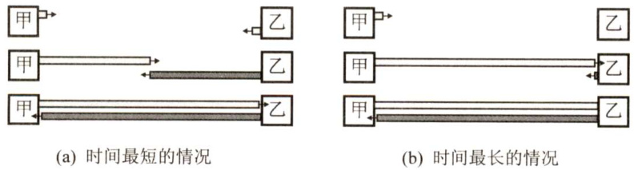  

2）甲发送一个数据帧的时间，即发送时延 $t_{1}=1518{\times}8\mathrm{bit}/(10\mathrm{Mb/s})=1.2144\mathrm{ms}$ ；乙每成功收到一个数据帧后，向甲发送一个确认帧，确认帧的发送时延t=64x8bit/10Mb/s =$0.0512\mathrm{ms}$ ；主机甲收到确认帧后，即发送下一数据帧，因此主机甲的发送周期 $T=$ 数据帧发送时延 $t_{1}+$ 确认帧发送时延 $t_{2}+$ 双程传播时延 $2t_{0}=t_{1}+t_{2}+2t_{0}=1.2856\mathrm{ms}$ ；于是主机甲的有效数据传输速率为 $1500{\times}8/T=12000\mathrm{bit}/1.2856\mathrm{ms}{\approx}9.33\mathrm{Mb}/\mathrm{s}($ 以太网帧的数据部分为1500B)。