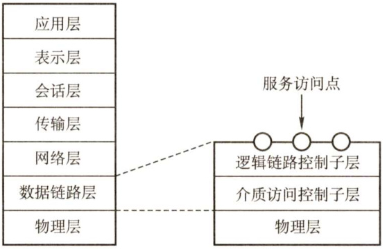
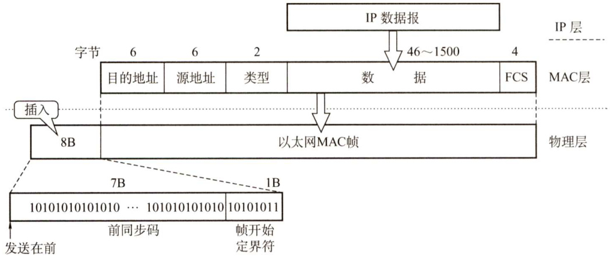
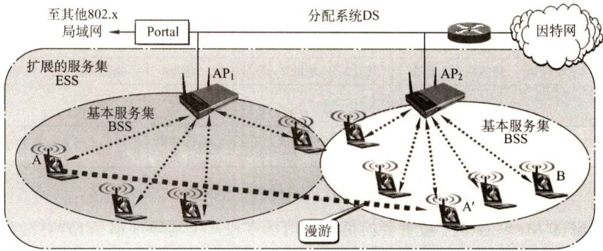
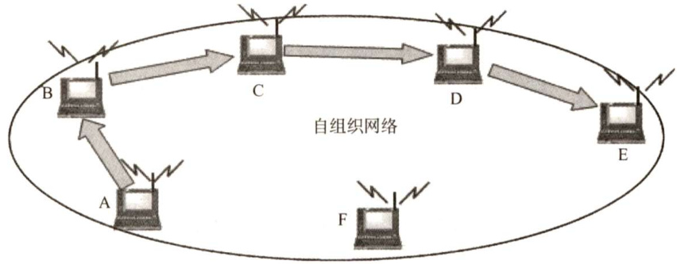
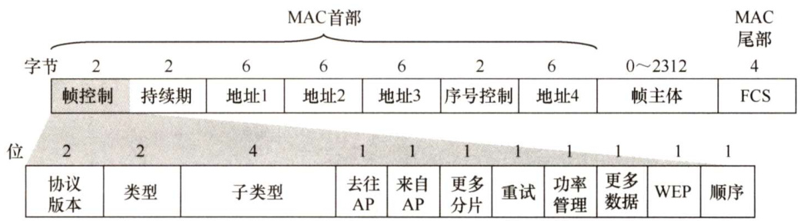
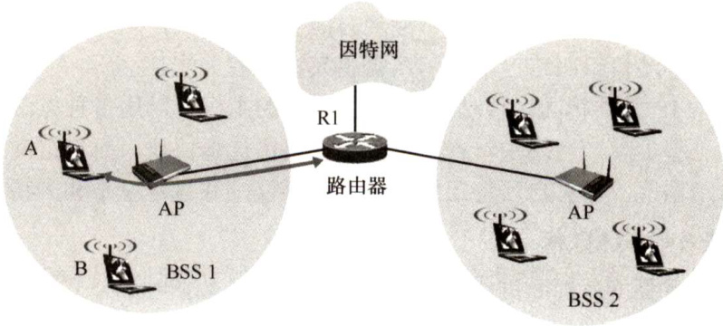
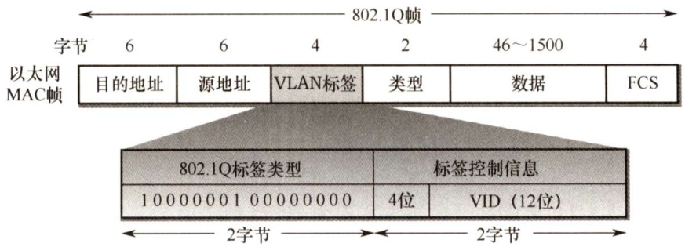
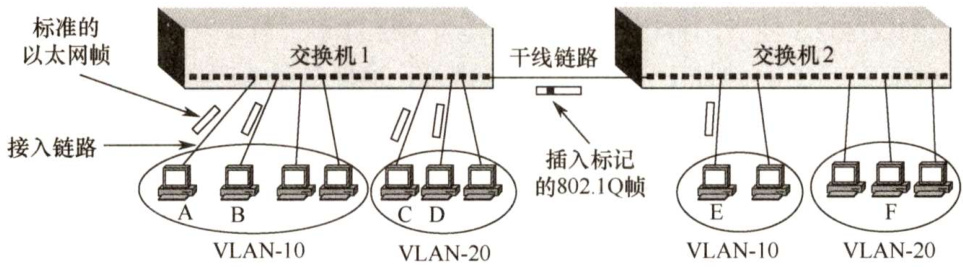
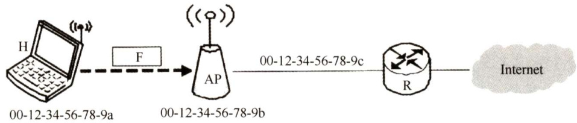

#### 3.6 局域网  

#### 3.6.1 局域网的基本概念和体系结构  

局域网（LocalAreaNetwork，LAN）是指在一个较小的地理范围（如一所学校）内，将各种计算机、外部设备和数据库系统等通过双绞线、同轴电缆等连接介质互相连接起来，组成资源和信息共享的计算机互联网络。主要特点如下：  

1）为一个单位所拥有，且地理范围和站点数目均有限。  
2）所有站点共享较高的总带宽（即较高的数据传输速率)。  
3）较低的时延和较低的误码率。  
4）各站为平等关系而非主从关系。  
5）能进行广播和组播。  

局域网的特性主要由三个要素决定：拓扑结构、传输介质、介质访问控制方式，其中最重要的是介质访问控制方式，它决定着局域网的技术特性。  

常见的局域网拓扑结构主要有以下4大类： $\textcircled{1}$ 星形结构； $\textcircled{2}$ 环形结构； $\textcircled{3}$ 总线形结构； $\textcircled{4}$ 星形和总线形结合的复合型结构。  

局域网可以使用双绞线、铜缆和光纤等多种传输介质，其中双绞线为主流传输介质。  

局域网的介质访问控制方法主要有CSMA/CD、令牌总线和令牌环，其中前两种方法主要用于总线形局域网，令牌环主要用于环形局域网。  

三种特殊的局域网拓扑实现如下：  

·以太网（目前使用范围最广的局域网)。逻辑拓扑是总线形结构，物理拓扑是星形或拓展星形结构。·令牌环（TokenRing，IEEE 802.5)。逻辑拓扑是环形结构，物理拓扑是星形结构。·FDDI（光纤分布数字接口，IEEE802.8)。逻辑拓扑是环形结构，物理拓扑是双环结构。  

IEEE 802标准定义的局域网参考模型只对应于OSI参考模型的数据链路层和物理层，并将数据链路层拆分为两个子层：逻辑链路控制（LLC）子层和媒体接入控制（MAC）子层。与接入传输媒体有关的内容都放在MAC子层，它向上层屏蔽对物理层访问的各种差异，提供对物理层的统一访问接口，主要功能包括：组帧和拆卸帧、比特传输差错检测、透明传输。LLC子层与传输媒体无关，它向网络层提供无确认无连接、面向连接、带确认无连接、高速传送4种不同的连接服务类型。  

由于以太网在局域网市场中取得垄断地位，几乎成为局域网的代名词，而802委员会制定的LLC 子层作用已经不大，因此现在许多网卡仅装有MAC 协议而没有LLC协议。IEEE 802协议层与OSI参考模型的比较如图3.25所示。  

  
图3.25IEEE802协议层与OSI模型的比较  

需要提醒读者的是，局域网的各类协议和广域网的各类协议也是统考的重点，容易出选择题，需要大家认真记忆。  

#### 3.6.2 以太网与IEEE802.3  

IEEE802.3标准是一种基带总线形的局域网标准，它描述物理层和数据链路层的MAC子层的实现方法。随着技术的发展，该标准又有了大量的补充与更新，以支持更多的传输介质和更高的传输速率。  

以太网逻辑上采用总线形拓扑结构，以太网中的所有计算机共享同一条总线，信息以广播方式发送。为了保证数据通信的方便性和可靠性，以太网简化了通信流程并使用了CSMA/CD方式对总线进行访问控制。  

严格来说，以太网应当是指符合DIXEthermetV2标准的局域网，但DIXEthermetV2标准与IEEE802.3标准只有很小的差别，因此通常将802.3局域网简称为以太网。  

以太网采用两项措施以简化通信： $\textcircled{1}$ 采用无连接的工作方式，不对发送的数据帧编号，也不要求接收方发送确认，即以太网尽最大努力交付数据，提供的是不可靠服务，对于差错的纠正则由高层完成； $\textcircled{2}$ 发送的数据都使用曼彻斯特编码的信号，每个码元的中间出现一次电压转换，接收端利用这种电压转换方便地把位同步信号提取出来。  

#### 1.以太网的传输介质与网卡  

以太网常用的传输介质有4种：粗缆、细缆、双绞线和光纤。各种传输介质的适用情况见表3.2。  

表3.2各种传输介质的适用情况  

<html><body><table><tr><td>参数</td><td>10BASE5</td><td>10BASE2</td><td>10BASE-T</td><td>10BASE-FL</td></tr><tr><td>传输媒体</td><td>基带同轴电缆 (粗缆)</td><td>基带同轴电缆 (细缆）</td><td>非屏蔽双绞线</td><td>光纤对（850nm）</td></tr><tr><td>编码</td><td>曼彻斯特编码</td><td>曼彻斯特编码</td><td>曼彻斯特编码</td><td>曼彻斯特编码</td></tr><tr><td>拓扑结构</td><td>总线形</td><td>总线形</td><td>星形</td><td>点对点</td></tr><tr><td>最大段长</td><td>500m</td><td>185m</td><td>100m</td><td>2000m</td></tr><tr><td>最多结点数目</td><td>100</td><td>30</td><td>2</td><td>2</td></tr></table></body></html>  

注意：10BASE-T非屏蔽双绞线以太网拓扑结构为星形网，星形网中心为集线器，但使用集线器的以太网在逻辑上仍然是一个总线形网，属于一个冲突域。上表的内容是常识，例如题目中出现10BASE5时，是不会显式地告诉你它的传输媒体、编码方式、拓扑结构等信息的。  

计算机与外界局域网的连接是通过主机箱内插入的一块网络接口板[又称网络适配器（Adapter)或网络接口卡（Network InterfaceCard，NIC）］实现的。网卡上装有处理器和存储器，是工作在数据链路层的网络组件。网卡和局域网的通信是通过电缆或双绞线以串行方式进行的，而网卡和计算机的通信则是通过计算机主板上的I/O总线以并行方式进行的。因此，网卡的重要功能就是进行数据的串并转换。网卡不仅能实现与局域网传输介质之间的物理连接和电信号匹配，还涉及帧的发送与接收、帧的封装与拆封、介质访问控制、数据的编码与解码及数据缓存功能等。  

全世界的每块网卡在出厂时都有一个唯一的代码，称为介质访问控制（MAC）地址，这个地址用于控制主机在网络上的数据通信。数据链路层设备（网桥、交换机等）都使用各个网卡的MAC地址。另外，网卡控制着主机对介质的访问，因此网卡也工作在物理层，因为它只关注比特，而不关注任何地址信息和高层协议信息。  

#### 2.以太网的MAC帧  

每块网卡中的MAC地址也称物理地址；MAC地址长6字节，一般用由连字符（或冒号）分隔的12个十六进制数表示，如02-60-8c-e4-b1-21。高24位为厂商代码，低24位为厂商自行分配的网卡序列号。严格来讲，局域网的“地址”应是每个站的“名字”或标识符。  

由于总线上使用的是广播通信，因此网卡从网络上每收到一个MAC帧，首先要用硬件检查MAC帧中的MAC地址。如果是发往本站的帧，那么就收下，否则丢弃。  

以太网MAC帧格式有两种标准：DIXEthermetV2标准（即以太网V2标准）和IEEE802.3标准。这里先介绍最常用的以太网V2的MAC帧格式，如图3.26所示。  

前导码：使接收端与发送端时钟同步。在帧前面插入的8字节可再分为两个字段：第一个字段共7字节，是前同步码，用来快速实现MAC帧的比特同步；第二个字段是帧开始定界符，表示后面的信息就是MAC帧。  

  
图3.26以太网V2标准的MAC帧格式  

注意：MAC帧并不需要帧结束符，因为以太网在传送帧时，各帧之间必须有一定的间隙。因此，接收端只要找到帧开始定界符，其后面连续到达的比特流就都属于同一个MAC帧，所以图3.26只有帧开始定界符。但不要误以为以太网MAC帧不需要尾部，在数据链路层上，帧既要加首部，也要加尾部。  

地址：通常使用6字节（48bit）地址（MAC地址）。  

类型：2字节，指出数据域中携带的数据应交给哪个协议实体处理。  

数据： $46\sim1500$ 字节，包含高层的协议消息。由于CSMA/CD算法的限制，以太网帧必须满足最小长度要求64字节，数据较少时必须加以填充（ $0{\sim}46$ 字节)。  

注意：46和1500是怎么来的？首先，由CSMA/CD算法可知以太网帧的最短帧长为64B，而MAC帧的首部和尾部的长度为18字节，所以数据字段最短为 $64-18=46$ 字节。其次，最大的1500字节是规定的，没有为什么。  

填充： $0{\sim}46$ 字节，当帧长太短时填充帧，使之达到64字节的最小长度。  

校验码（FCS)：4字节，校验范围从目的地址段到数据段的末尾，算法采用32位循环余码（CRC)，不但需要检验MAC帧的数据部分，还要检验目的地址、源地址和类型字段，但不校验前导码。  

802.3帧格式与DIX以太帧格式的不同之处在于用长度域替代了DIX帧中的类型域，指出数据域的长度。在实践中，前述长度/类型两种机制可以并存，由于IEEE802.3数据段的最大字节数  

是1500，所以长度段的最大值是1500，因此从1501到65535的值可用于类型段标识符。  

#### 3.高速以太网  

速率达到或超过 $100\mathrm{Mb/s}$ 的以太网称为高速以太网。  

（1）100BASE-T以太网  

100BASE-T以太网是在双绞线上传送 $100\mathrm{Mb/s}$ 基带信号的星形拓扑结构以太网，它使用CSMA/CD协议。这种以太网既支持全双工方式，又支持半双工方式，可在全双工方式下工作而无冲突发生。因此，在全双工方式下不使用CSMA/CD协议。  

MAC帧格式仍然是802.3标准规定的。保持最短帧长不变，但将一个网段的最大电缆长度减小到 $100\mathrm{m}$ 。帧间时间间隔从原来的 $9.6\upmu\mathrm{s}$ 改为现在的 $0.96\upmu\mathrm{s}$ o  

#### （2）吉比特以太网  

吉比特以太网又称千兆以太网，允许在1Gb/s速率下用全双工和半双工两种方式工作。使用802.3协议规定的帧格式。在半双工方式下使用CSMA/CD协议（全双工方式不需要使用CSMA/CD协议)。与10BASE-T和100BASE-T技术向后兼容。  

#### （3）10吉比特以太网  

10吉比特以太网与10Mb/s、 $100\mathrm{Mb/s}$ 和1Gb/s以太网的帧格式完全相同。10吉比特以太网还保留了802.3标准规定的以太网最小和最大帧长，便于升级。10吉比特以太网不再使用铜线而只使用光纤作为传输媒体。10吉比特以太网只工作在全双工方式，因此没有争用问题，也不使用CSMA/CD协议。  

以太网从 $10\mathbf{Mb}/\mathbf{s}$ 到10Gb/s的演进证明了以太网是可扩展的（从10Mb/s到10Gb/s）、灵活的（多种传输媒体、全/半双工、共享/交换)，易于安装，稳健性好。  

#### 3.6.3 IEEE802.11无线局域网  

#### 1.无线局域网的组成  

无线局域网可分为两大类：有固定基础设施的无线局域网和无固定基础设施的移动自组织网络。所谓“固定基础设施”，是指预先建立的、能覆盖一定地理范围的固定基站。  

#### （1）有固定基础设施无线局域网  

对于有固定基础设施的无线局域网，IEEE制定了无线局域网的802.11系列协议标准，包括$802.11\mathrm{a}/\mathrm{b}/\mathrm{g}/\mathrm{n}$ 等。802.11使用星形拓扑，其中心称为接入点（AccessPoint，AP)，在MAC层使用CSMA/CA协议。使用802.11系列协议的局域网又称Wi-Fi。  

802.11标准规定无线局域网的最小构件是基本服务集BSS（Basic Service Set，BSS)。一个基本服务集包括一个接入点和若干移动站。各站在本 BSS 内之间的通信，或与本 BSS 外部站的通信，都必须通过本BSS 的 AP。上面提到的AP 就是基本服务集中的基站（base station）。安装 AP时，必须为该AP分配一个不超过32字节的服务集标识符（Service SetIDentifier，SSID）和一个信道。SSID是指使用该AP的无线局域网的名字。一个基本服务集覆盖的地理范围称为一个基本服务区（Basic ServiceArea，BSA），无线局域网的基本服务区的范围直径一般不超过 $100\mathrm{m}$ 。  

一个基本服务集可以是孤立的，也可通过AP连接到一个分配系统（DistributionSystem，DS)，然后再连接到另一个基本服务集，就构成了一个扩展的服务集（Extended Service Set，ESS)。分配系统的作用就是使扩展的服务集对上层的表现就像一个基本服务集一样。ESS 还可以通过一种称为Portal（门户）的设备为无线用户提供到有线连接的以太网的接入。门户的作用相当于一个网桥。在图3.27中，移动站A如果要和另一个基本服务集中的移动站B通信，就必须经过两个接入点 $\ensuremath{\mathbf{A}}\ensuremath{\mathbf{P}}_{1}$ 和$\mathbf{AP}_{2}$ ，即 $\mathrm{A{\rightarrow}A P_{1}{\rightarrow}A P_{2}{\rightarrow}B}$ ，注意 $\mathbf{AP}_{1}$ 到 $\mathbf{AP}_{2}$ 的通信是使用有线传输的。  

  
图3.27基本服务集和扩展服务集  

移动站A从某个基本服务集漫游到另一个基本服务集时（图3.27中的 $\mathbf{A^{\prime}}$ )，仍然可保持与另一个移动站B的通信。但A在不同的基本服务集使用的AP改变了。  

（2）无固定基础设施移动自组织网络  

另一种无线局域网是无固定基础设施的无线局域网，又称自组网络（adhocnetwork)。自组网络没有上述基本服务集中的AP，而是由一些平等状态的移动站相互通信组成的临时网络（见图3.28)。各结点之间地位平等，中间结点都为转发结点，因此都具有路由器的功能。  

  
图3.28由一些处于平等状态的便携机构成的自组网络  

自组网络通常是这样构成的：一些可移动设备发现在它们附近还有其他的可移动设备，并且要求和其他移动设备进行通信。自组网络中的每个移动站都要参与网络中其他移动站的路由的发现和维护，同时由移动站构成的网络拓扑可能随时间变化得很快，因此在固定网络中行之有效的一些路由选择协议对移动自组网络已不适用，需引起特别的关注。  

自组网络和移动IP并不相同。移动IP技术使漫游的主机可以用多种方法连接到因特网，其核心网络功能仍然是基于固定网络中一直使用的各种路由选择协议。而自组网络是把移动性扩展到无线领域中的自治系统，具有自已特定的路由选择协议，并且可以不和因特网相连。  

#### 2.802.11局域网的MAC帧  

802.11帧共有三种类型，即数据帧、控制帧和管理帧。数据帧的格式如图3.29所示。  

802.11数据帧由以下三大部分组成：  

1）MAC首部，共30字节。帧的复杂性都在MAC首部。  

2）帧主体，即帧的数据部分，不超过2312字节。它比以太网的最大长度长很多。  

3）帧检验序列FCS是尾部，共4字节。  

  

802.11帧的MAC首部中最重要的是4个地址字段，上述地址都是MAC 硬件地址。这里仅讨论前三种地址（地址4用于自组网络)。这三个地址的内容取决于帧控制字段中的“去往 AP”和“来自AP”这两个字段的数值。表3.3中给出了802.11帧的地址字段最常用的两种情况。  

表3.3802.11帧的地址字段最常用的两种情况  

<html><body><table><tr><td>去往AP</td><td>来自AP</td><td>地址1</td><td>地址2</td><td>地址3</td><td>地址4</td></tr><tr><td>0</td><td>1</td><td>接收地址=目的地址</td><td>发送地址=AP地址</td><td>源地址</td><td></td></tr><tr><td>1</td><td>0</td><td>接收地址=AP地址</td><td>发送地址=源地址</td><td>目的地址</td><td></td></tr></table></body></html>  

地址1是直接接收数据帧的结点地址，地址2是实际发送数据帧的结点地址。  

1）现假定在一个基本服务集中的站A向站B发送数据帧。在站A发往接入点AP的数据帧的帧控制字段中，“去往 $\mathbf{AP}=1$ ”而“来自 $\mathbf{AP}=0$ ”；地址1是AP的MAC地址，地址2是A的MAC地址，地址3是B的MAC地址。注意，“接收地址”与“目的地址”并不等同。  

2）AP接收到数据帧后，转发给站B，此时在数据帧的帧控制字段中，“去往 $\mathbf{AP}=0$ ”而“来自 $\mathbf{AP}=1$ "；地址1是B的MAC地址，地址2是AP的MAC地址，地址3是A的MAC地址。请注意，“发送地址”与“源地址”也不等同。  

下面讨论一种更复杂的情况。在图3.30中，两个AP通过有线连接到路由器，现在路由器要向站A发送数据。路由器是网络层设备，它看不见链路层的接入点AP，只认识站A的IP 地址。而AP是链路层设备，它只认识MAC地址，并不认识IP地址。  

  
图3.29802.11局域网的数据帧  
图3.30 链路上的802.11帧和802.3帧  

1）路由器从IP数据报获知A的IP地址，并使用ARP获取站A的MAC地址。获取站A的MAC地址后，路由器接口R1将该IP数据报封装成802.3帧（802.3帧只有两个地址)，该帧的源地址字段是R1的MAC地址，目的地址字段是A的MAC地址。  

2）AP收到该802.3帧后，将该802.3帧转换为802.11帧，在帧控制字段中，“去往 $\mathrm{AP}=0$ ，而“来自 $\mathbf{AP}=1$ ”；地址1是A的MAC地址，地址2是AP的MAC地址，地址3是R1的 MAC 地址。这样，A可以确定（从地址3）将数据报发送到子网中的路由器接口的MAC地址。  

现在考虑从站A向路由器接口R1发送数据的情况。  

1）A生成一个802.11帧，在帧控制字段中，“去往 $\mathrm{AP}=1$ ”而“来自 $\mathbf{AP}=0$ ”；地址1是AP的MAC地址，地址2是A的MAC地址，地址3是R1的MAC地址。  

2）AP收到该802.11帧后，将其转换为802.3帧。该帧的源地址字段是A的MAC地址，目的地址字段是R1的MAC地址。  

由此可见，地址3在BSS和有线局域网互联中起着关键作用，它允许AP在构建以太网帧时能够确定目的MAC地址。  

802.11帧的MAC首部的其他字段不是考试重点，感兴趣的同学可以翻阅教材。  

#### 3.6.4VLAN基本概念与基本原理  

一个以太网是一个广播域，当一个以太网包含的计算机太多时，往往会导致：  

·以太网中出现大量的广播帧，特别是经常使用的ARP和DHCP协议（第4章)。  

·一个单位的不同部门共享一个局域网，对信息保密和安全不利。  

通过虚拟局域网（VirtualLAN)，可以把一个较大的局域网分割成一些较小的与地理位置无关的逻辑上的VLAN，而每个VLAN是一个较小的广播域。  

802.3ac标准定义了支持VLAN的以太网帧格式的扩展。它在以太网帧中插入一个4字节的标识符（插入在源地址字段和类型字段之间)，称为VLAN标签，用来指明发送该帧的计算机属于哪个虚拟局域网。插入VLAN标签的帧称为802.1Q帧，如图3.31所示。由于VLAN帧的首部增加了4字节，因此以太网的最大帧长从原来的1518字节变为1522字节。  

  
图3.31插入VLAN标签后变成了802.1Q帧  

VLAN标签的前两个字节置为 $0\mathrm{{x}}8100$ ，表示这是一个802.1Q帧。在VLAN标签的后两个字节中，前4位没有用，后12位是该VLAN的标识符VID，它唯一标识了该802.1Q帧属于哪个VLAN。12位的VID可识别4096个不同的VLAN。插入VID后，802.1Q帧的FCS必须重新计算。  

如图3.32所示，交换机1连接了7台计算机，该局域网划分为两个虚拟局域网VLAN-10和VLAN-20，这里的10和20就是802.1Q帧中的VID字段的值，由交换机管理员设定。各主机并不知道自己的VID值（但交换机必须知道)，主机与交换机之间交互的都是标准以太网帧。一个VLAN的范围可以跨越不同的交换机，前提是所用的交换机能够识别和处理VLAN。交换机2连接了5台计算机，并与交换机1相连。交换机2中的2台计算机加入VLAN-10，另外3台加入VLAN-20。这两个VLAN虽然都跨越了两个交换机，但各自都是一个广播域。  

  
图3.32利用以太网交换机构成虚拟局域网  

假定A向B发送帧，交换机1根据帧首部的目的MAC地址，识别B属于本交换机管理的VLAN-10，因此就像在普通以太网中那样直接转发帧。假定A向E发送帧，交换机1必须把帧转发到交换机2，但在转发前，要插入VLAN标签，否则交换机2不知道应把帧转发给哪个VLAN。因此在交换机端口之间的链路上传送的帧是802.1Q帧。交换机2在向E转发帧之前，要拿走已插入的VLAN标签，因此E收到的帧是A发送的标准以太网帧，而不是802.1Q帧。如果A向C发送帧，那么情况就复杂了，因为这是在不同网络之间的通信，虽然A和C都连接到同一个交换机，但是它们已经处在不同的网络中（VLAN-10和VLAN-20），需要通过上层的路由器来解决，也可以在交换机中嵌入专用芯片来进行转发，这样就在交换机中实现了第3层的转发功能。  

虚拟局域网只是局域网给用户提供的一种服务，并不是一种新型局域网。  

#### 3.6.5 本节习题精选  

#### 单项选择题  

01．以下关于以太网的说法中，正确的是（）。  

A.以太网的物理拓扑是总线形结构  
B.以太网提供有确认的无连接服务  
C．以太网参考模型一般只包括物理层和数据链路层  
D.以太网必须使用CSMA/CD协议  

02．下列以太网中，采用双绞线作为传输介质的是（）。  

A.10BASE-2 B.10BASE-5 C.10BASE-T D. 10BASE-F  

03．10BaseT以太网采用的传输介质是（）。  

A.双绞线 B.同轴电缆 C.光纤 D．微波  

04.如果使用5类UTP来设计一个覆盖范围为 $200\mathrm{m}$ 的10BASE-T以太网，那么需要采用的设备是（）。  

A．放大器 B.中继器 C.网桥 D．路由器  

05．网卡实现的主要功能在（）。  

A.物理层和数据链路层 B．数据链路层和网络层C.物理层和网络层 D．数据链路层和应用层  

06．每个以太网卡都有自己的时钟，每个网卡在互相通信时为了知道什么时候一位结束、下一位开始，即具有同样的频率，它们采用了（）。  

A．量化机制 B．曼彻斯特机制 C．奇偶校验机制D．定时令牌机制  

07.以下关于以太网地址的描述，错误的是（）。  

A.以太网地址就是通常所说的MAC地址 B.MAC地址又称局域网硬件地址  

C.MAC地址是通过域名解析查得的D.以太网地址通常存储在网卡中  

08．在以太网中，大量的广播信息会降低整个网络性能的原因是（）。  

A．网络中的每台计算机都必须为每个广播信息发送一个确认信息  
B．网络中的每台计算机都必须处理每个广播信息  
C.广播信息被路由器自动路由到每个网段  
D.广播信息不能直接自动传送到目的计算机  

09．同一局域网中的两个设备具有相同的静态MAC地址时，会发生（）。  

A．首次引导的设备排他地使用该地址，第二个设备不能通信  
B．最后引导的设备排他地使用该地址，另一个设备不能通信  
C.在网络上的这两个设备都不能正确通信  
D.两个设备都可以通信，因为它们可以读分组的整个内容，知道哪些分组是发给它们的，而不是发给其他站的  

10.IEEE802.3标准规定，若采用同轴电缆作为传输介质，在无中继的情况下，传输介质的最大长度不能超过（）。  

A. $500\mathrm{m}$ B. $200\mathrm{m}$ C. $100\mathrm{m}$ D.50m  

11．下面4种以太网中，只能工作在全双工模式下的是（）。  

A.10BASE-T以太网 B.100BASE-T以太网C．吉比特以太网 D.10吉比特以太网  

12.IEEE802局域网标准对应OSI参考模型的（）。  

A.数据链路层和网络层 B．物理层和数据链路层C.物理层 D．数据链路层  

13.802.3标准定义的以太网中，实现“给帧加序号”功能的层次是（）。  

A．物理层 B.介质访问控制子层（MAC）C.逻辑链路控制子层（LLC） D.网络层  

14.快速以太网仍然使用CSMA/CD协议，它采用（）而将最大电缆长度减少到 $100\mathrm{m}$ 的方法，使以太网的数据传输速率提高至 $100\mathbf{Mb}/\mathbf{s}$ 。  

A.改变最短帧长 B．改变最长帧长C.保持最短帧长不变 D.保持最长帧长不变  

15.无线局域网不使用CSMA/CD而使用CSMA/CA的原因是，无线局域网（）。  

A．不能同时收发，无法在发送时接收信号B.不需要在发送过程中进行冲突检测C．无线信号的广播特性，使得不会出现冲突D.覆盖范围很小，不进行冲突检测不影响正确性  

16.在一个以太网中，有A、B、C、D四台主机，若A向B发送数据，则（）。  

A.只有B可以接收到数据B．四台主机都能接收到数据C．只有B、C、D可以接收到数据D．四台主机都不能接收到数据  

17．下列关于吉比特以太网的说法中，错误的是（）。  

A.支持流量控制机制B.采用曼彻斯特编码，利用光纤进行数据传输C.数据的传输时间主要受线路传输延迟的制约D.同时支持全双工模式和半双工模式  

18.下列关于虚拟局域网（VLAN）的说法中，不正确的是（）。  

A.虚拟局域网建立在交换技术的基础上B.虚拟局域网通过硬件方式实现逻辑分组与管理C.虚拟网的划分与计算机的实际物理位置无关D.虚拟局域网中的计算机可以处于不同的局域网中  

19．划分虚拟局域网（VLAN）有多种方式，（）不是正确的划分方式。  

A．基于交换机端口划分 B.基于网卡地址划分C.基于用户名划分 D．基于网络层地址划分  

20.下列选项中，（）不是虚拟局域网（VLAN）的优点。  

A.有效共享网络资源 B．简化网络管理C.链路聚合 D.提高网络安全性  

21.【2012统考真题】以太网的MAC协议提供的是（）。  

A.无连接的不可靠服务 B.无连接的可靠服务C.有连接的可靠服务 D.有连接的不可靠服务  

22.【2017统考真题】在下图所示的网络中，若主机H发送一个封装访问Intermet的IP分组的IEEE802.11数据帧F，则帧F的地址1、地址2和地址3分别是（）。  

  

A.00-12-34-56-78-9a, 00-12-34-56-78-9b，00-12-34-56-78-9c B. 00-12-34-56-78-9b，00-12-34-56-78-9a，00-12-34-56-78-9c C. 00-12-34-56-78-9b，00-12-34-56-78-9c，00-12-34-56-78-9a D. 00-12-34-56-78-9a，00-12-34-56-78-9c， 00-12-34-56-78-9b  

23.【2019统考真题】100BaseT快速以太网使用的导向传输介质是（）。  

A．双绞线 B．单模光纤 C．多模光纤 D.同轴电缆  

#### 3.6.6 答案与解析  

#### 单项选择题  

01.C  

以太网的逻辑拓扑是总线形结构，物理拓扑是星形或拓展星形结构，因此A错误。以太网采用两项措施简化通信：采用无连接的工作方式；不对发送的数据帧编号，也不要求接收方发送确认，因此B错误。从相关层次看，局域网仅工作在OSI参考模型的物理层和数据链路层，而广域网工作在OSI参考模型的下三层，而以太网是局域网的一种实现形式，因此C正确。只有当以太网工作于半双工方式下时，才需要CSMA/CD协议来应对冲突问题，速率小于等于1Gb/s 的以太网可以工作于半双工或全双工方式，而速率大于等于 $10\mathrm{Gb/s}$ 的以太网只能工作于全双工方式下，因此没有争用问题，不使用CSMA/CD协议，因此D错误。  

02.C  

这里BASE前面的数字代表数据率，单位为 $\mathbf{M}\mathbf{b}/\mathbf{s}$ ；“BASE”指介质上的信号为基带信号（即基带传输，采用曼彻斯特编码)；后面的5或2表示每段电缆的最长长度为 $500\mathrm{m}$ 或 $200\mathrm{m}$ （实际为 $185\mathrm{m}$ )，T表示双绞线，F表示光纤。  

03.A  

局域网通常采用类似10BaseT这样的方式来表示，其中第1部分的数字表示数据传输速率，如10表示10Mb/s、100表示 $100\mathrm{Mb/s}$ ；第2部分的Base表示基带传输；第3部分如果是字母，那么表示传输介质，如T表示双绞线、F表示光纤，如果是数字，那么表示所支持的最大传输距离，如2表示 $200\mathrm{m}$ 、5表示 $500\mathrm{m}$ 0  

04.B  

5类无屏蔽双绞线（UTP）所能支持的最大长度是 $100\mathrm{m}$ ，因此若要覆盖范围为 $200\mathrm{m}$ 的以太网，则必须延长UTP所支持的长度。放大器是用来加强宽带信号（用于传输模拟信号）的设备（大多数以太网采用基带传输)；中继器是用来加强基带信号（用于传输数字信号）的设备。  

05.A  

通常情况下，网卡是用来实现以太网协议的。网卡不仅能实现与局域网传输介质之间的物理连接和电信号匹配，还涉及帧的发送与接收、帧的封装与拆封、介质访问控制、数据的编码与解码及数据缓存等功能，因而实现的功能主要在物理层和数据链路层。  

06.B  

10BASE-T以太网使用曼彻斯特编码。曼彻斯特编码提取每个比特中间的电平跳变作为收发双方的同步信号，无须额外的同步信号，因此是一种“自含时钟编码”的编码方式。  

07.C  

域名解析用于把主机名解析成对应的IP 地址，它不涉及MAC地址。实际上，MAC 地址通常是通过ARP协议查得的。  

08.B  

由于广播信息的目的地是该网络中的所有计算机，因此网络中的每台计算机都必须花费时间来处理此信息。若网络中存在大量的广播信息，则每台计算机都要花费大量的时间来处理这些信息，因此所有计算机的运行效率会受到影响，导致网络的性能降低。广播信息通常只在一个网络内部传输。  

另外，这些广播信息本身就占用整个网络的带宽，因此可能会形成“广播风暴”，严重影响网络性能。实际上，以太网的总带宽绝大部分都是由广播帧所消耗的。  

以太网提供无确认的无连接服务，每台计算机无须对广播信息确认，A错误。路由器可以隔离广播域，C错误。D选项的说法是正确的，但这并不是大量广播信息会降低网络性能的原因，因此也不选D。  

09.C  

在使用静态地址的系统中，如果有重复的硬件地址，那么这两个设备都不能正常通信，原因是：第一，目的MAC 地址等于本机MAC 地址的帧是不会被发送到网络上去的；第二，其他设备的用户发送给一个设备的帧也会被另一个设备接收，其中必有一个设备必须处理不属于本设备的帧，浪费了资源；第三，正确实现的ARP软件都会禁止把同一个MAC地址绑定到两个不同的IP地址，这就使得具有相同MAC地址的设备上的用户在会话时都发生时断时续的现象。  

10.A  

以太网常用的传输介质有4种：粗缆、细缆、双绞线和光纤。同轴电缆分50Ω基带电缆和75Ω宽带电缆两类。基带电缆又分细同轴电缆和粗同轴电缆。  

10Base5：粗缆以太网，数据率为 $10\mathbf{M}\mathbf{b}/\mathbf{s}$ ，每段电缆最大长度为 $500\mathrm{m}$ ；使用特殊的收发器连接到电缆上，收发器完成载波监听和冲突检测的功能。  

10Base2：细缆以太网，数据率为 $10\mathbf{Mb}/\mathbf{s}$ ，每段电缆最大长度为 $185\mathrm{m}$ ；使用BNC连接器形成T形连接，无源部件。  

11.D  

10BASE-T以太网、100BASE-T以太网、吉比特以太网都使用了CSMA/CD协议，因此可以工作在半双工模式下。10 吉比特以太网只工作在全双工方式下，因此没有争用问题，也不使用CSMA/CD协议，且它只使用光纤作为传输介质。  

12.B  

IEEE 802为局域网制定的标准相当于OSI参考模型的数据链路层和物理层，其中的数据链路层又被进一步分为逻辑链路控制（LLC）和介质访问控制（MAC）两个子层。  

13.C  

以太网没有网络层。物理层的主要功能是：信号的编码和译码、比特的接收和传输；MAC子层的主要功能是：组帧和拆帧、比特差错检测、寻址、竞争处理；LLC子层的主要功能是：建立和释放数据链路层的逻辑连接、提供与高层的接口、差错控制、给帧加序号。  

14.C  

快速以太网使用的方法是保持最短帧长不变，将一个网段的最大长度减少到 $100\mathrm{m}$ ，以提高以太网的数据传输速率。  

15.B  

无线局域网不能简单地使用CSMA/CD协议，特别是碰撞检测部分，原因如下：第一，在无线局域网的适配器上，接收信号的强度往往远小于发送信号的强度，因此若要实现碰撞检测，那么硬件上的花费就会过大；第二，在无线局域网中，并非所有站点都能听见对方，由此引发了隐蔽站和暴露站问题，而“所有站点都能够听见对方”正是实现CSMA/CD协议必备的基础。  

16.B  

在以太网中，如果一个结点要发送数据，那么它将以“广播”方式把数据通过作为公共传输介质的总线发送出去，连在总线上的所有结点（包括发送结点）都能“收听”到发送结点发送的  

数据信号。  

17.B  

吉比特以太网的物理层有两个标准：IEEE802.3z和IEEE802.3ab，前者采用光纤通道，后者采用4对UTP5类线。  

18.B  

解析请扫右侧二维码查阅。  

19.C  

一般有三种划分VLAN的方法。 $\textcircled{1}$ 基于端口，将交换机的若干端口划为一个逻辑组，这种方法最简单、最有效，如果主机离开了原来的端口，那么就可能进入一个新的子网。 $\textcircled{2}$ 基于MAC地址，按MAC地址将一些主机划分为一个逻辑子网，当主机的物理位置从一个交换机移动到另一个交换机时，它仍然属于原来的子网。 $\textcircled{3}$ 基于IP地址，根据网络层地址或协议划分VLAN，这样VLAN就可以跨越路由器进行扩展，将多个局域网的主机连接在一起。  

20.C  

选项A、B和D都是VLAN的优点。链路聚合是解决交换机之间的宽带瓶颈问题的技术。  

21.A  

考虑到局域网信道质量好，以太网采取了两项重要的措施来使通信更简单： $\textcircled{1}$ 采用无连接的工作方式； $\textcircled{2}$ 不对发送的数据帧进行编号，也不要求对方发回确认。因此，以太网提供的服务是不可靠的服务，即尽最大努力的交付。差错的纠正由高层完成。  

22.B  

IEEE 802.11数据帧有4种子类型，分别是IBSS、FromAP、To AP和WDS。这里的数据帧F从笔记本电脑发送到接入点（AP)，属于ToAP子类型。帧地址1是RA（BSSID），地址2是SA，地址3是DA。RA 是 Receiver Address 的缩写，BSSID是 Basic Service Set IDentifier 的缩写，SA 是Source Address 的缩写，DA是Destination Address的缩写。因此地址1是AP的MAC，地址2是H的MAC，地址3是R的MAC，选B。  

23.A  

100Base-T是一种以速率100Mbps工作的局域网（LAN）标准，它通常被称为快速以太网标准，并使用两对UTP（非屏蔽双绞线）铜质电缆。100Base-T：100标识传输速率为100Mbps；base标识采用基带传输；T表示传输介质为双绞线（包括5类UTP或1类STP)，为F时表示光纤。