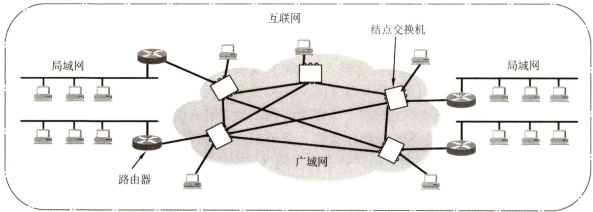
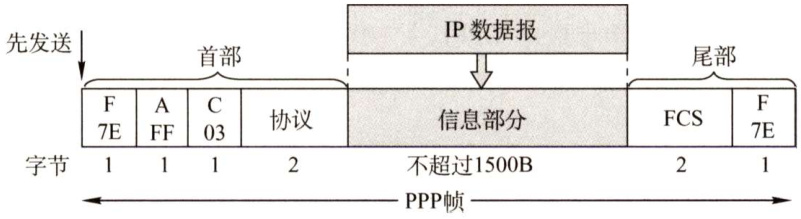
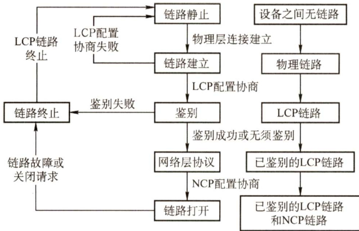
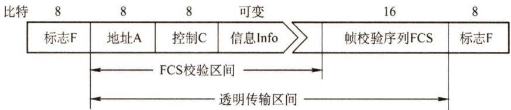

#### 3.7 广域网  

#### 3.7.1 广域网的基本概念  

广域网通常是指覆盖范围很广（远超一个城市的范围）的长距离网络。广域网是因特网的核  

心部分，其任务是长距离运送主机所发送的数据。连接广域网各结点交换机的链路都是高速链路，它可以是长达几千千米的光缆线路，也可以是长达几万千米的点对点卫星链路。因此广域网首要考虑的问题是通信容量必须足够大，以便支持日益增长的通信量。  

广域网不等于互联网，互联网可以连接不同类型的网络（既可以连接局域网，又可以连接广域网)，通常使用路由器来连接。图3.33显示了由相距较远的局域网通过路由器与广域网相连而成的一个覆盖范围很广的互联网。因此，局域网可以通过广域网与另一个相隔很远的局域网通信。  

  
图3.33 由局域网和广域网组成的互联网  

广域网由一些结点交换机（注意不是路由器，结点交换机和路由器都用来转发分组，它们的工作原理也类似。结点交换机在单个网络中转发分组，而路由器在多个网络构成的互联网中转发分组）及连接这些交换机的链路组成。结点交换机的功能是将分组存储并转发。结点之间都是点到点连接，但为了提高网络的可靠性，通常一个结点交换机往往与多个结点交换机相连。  

从层次上考虑，广域网和局域网的区别很大，因为局域网使用的协议主要在数据链路层（还有少量在物理层)，而广域网使用的协议主要在网络层。怎么理解“局域网使用的协议主要在数据链路层，而广域网使用的协议主要在网络层”这句话呢？如果网络中的两个结点要进行数据交换，那么结点除要给出数据外，还要给数据“包装”上一层控制信息，用于实现检错纠错等功能。如果这层控制信息是数据链路层协议的控制信息，那么就称使用了数据链路层协议，如果这层控制信息是网络层的控制信息，那么就称使用了网络层协议。  

它们的区别与联系见表3.4。  

表3.4广域网和局域网的区别与联系  

<html><body><table><tr><td></td><td>广域网</td><td>局域网</td></tr><tr><td>覆盖范围</td><td>很广，通常跨区域</td><td>较小，通常在一个区域内</td></tr><tr><td>连接方式</td><td></td><td>普遍采用多点接入技术</td></tr><tr><td>层次</td><td>三层：物理层，数据链路层，网络层</td><td>两层：物理层，数据链路层</td></tr><tr><td>联系与相似点</td><td colspan="2">1．广域网和局域网都是互联网的重要组成构件，从互联网的角度上看，二者平等（不是包含关系) 2．连接到一个广域网或一个局域网上的主机在该网内进行通信时，只需要使用其网络的物理地址</td></tr><tr><td>着重点</td><td></td><td>强调数据传输</td></tr></table></body></html>  

广域网中的一个重要问题是路由选择和分组转发。路由选择协议负责搜索分组从某个结点到目的结点的最佳传输路由，以便构造路由表，然后从路由表再构造出转发分组的转发表。分组是通过转发表进行转发的。  

常见的两种广域网数据链路层协议是PPP协议和HDLC协议。PPP目前使用得最广泛，而HDLC已很少使用，最新大纲已将其删除，但历年真题考查过HDLC，故本书仍保留。  

#### 3.7.2 PPP协议  

PPP（Point-to-PointProtocol）是使用串行线路通信的面向字节的协议，该协议应用在直接连接两个结点的链路上。设计的目的主要是用来通过拨号或专线方式建立点对点连接发送数据，使其成为各种主机、网桥和路由器之间简单连接的一种共同的解决方案。  

PPP协议是在SLIP协议的基础上发展而来的，它既可以在异步线路上传输，又可在同步线路上使用；不仅用于Modem链路，也用于租用的路由器到路由器的线路。  

背景：SLIP主要完成数据报的传送，但没有寻址、数据检验、分组类型识别和数据压缩等功能，只能传送IP 分组。如果上层不是IP协议，那么无法传输，并且此协议对一些高层应用也不支持，但实现比较简单。为了改进SLIP的缺点，于是制定了点对点协议（PPP)。  

PPP协议有三个组成部分：  

1）链路控制协议（LCP)。一种扩展链路控制协议，用于建立、配置、测试和管理数据链路。  
2）网络控制协议（NCP)。PPP协议允许同时采用多种网络层协议，每个不同的网络层协议要用一个相应的NCP来配置，为网络层协议建立和配置逻辑连接。  
3）一个将IP数据报封装到串行链路的方法。IP数据报在PPP帧中就是其信息部分，这个信息部分的长度受最大传送单元（MTU）的限制。  

PPP帧的格式如图3.34所示。PPP帧的前3个字段和最后2个字段与HDLC帧是一样的，标志字段（F）仍为7E（0111110)，前后各占1字节，若它出现在信息字段中，就必须做字节填充，使用的控制转义字节是7D（01111101）。但在PPP中，地址字段（A）占1字节，规定为0xFF，控制字段（C）占1字节，规定为 $0\mathrm{x}03$ ，两者的内容始终是固定不变的。PPP是面向字节的，因而所有PPP帧的长度都是整数个字节。  

  
图3.34PPP帧的格式  

第4个字段是协议段，占2字节，在HDLC中没有该字段，它是说明信息段中运载的是什么种类的分组。以比特0开始的是诸如IP、IPX和AppleTalk这样的网络层协议；以比特1开始的被用来协商其他协议，包括LCP及每个支持的网络层协议的一个不同的NCP。  

第5段信息段的长度是可变的，大于等于0且小于等于 $1500\mathrm{B}$ 。为了实现透明传输，当信息段中出现和标志字段一样的比特组合时，必须采用一些措施来改进。  

注意：因为PPP是点对点的，并不是总线形，所以无须采用CSMA/CD协议，自然就没有最短帧，所以信息段占 $0\sim1500$ 字节，而不是 $46\sim1500$ 字节。另外，当数据部分出现和标志位一样的比特组合时，就需要采用一些措施来实现透明传输。  

第6个字段是帧检验序列（FCS)，占2字节，即循环冗余码检验中的冗余码。检验区包括地址字段、控制字段、协议字段和信息字段。  

图3.35给出了PPP链路建立、使用、撤销所经历的状态图。当线路处于静止状态时，不存在物理层连接。当线路检测到载波信号时，建立物理连接，线路变为建立状态。此时，LCP开始选项商定，商定成功后就进入身份验证状态。双发身份验证通过后，进入网络层协议状态。这时，采用NCP配置网络层，配置成功后，进入打开状态，然后就可进行数据传输。当数据传输完成后，线路转为终止状态。载波停止后则回到静止状态。  

  
图3.35PPP协议的状态图  

注意：  

1）PPP提供差错检测但不提供纠错功能，只保证无差错接收（通过硬件进行CRC校验）。它是不可靠的传输协议，因此也不使用序号和确认机制。  
2）它仅支持点对点的链路通信，不支持多点线路。  
3）PPP只支持全双工链路。  
4）PPP的两端可以运行不同的网络层协议，但仍然可使用同一个PPP进行通信。  
5）PPP是面向字节的，当信息字段出现和标志字段一致的比特组合时，PPP有两种不同的处理方法：若PPP用在异步线路（默认），则采用字节填充法；若PPP用在SONET/SDH等同步线路，则协议规定采用硬件来完成比特填充（和HDLC的做法一样）。  

#### $^{*}3.7.3$ HDLC协议②  

高级数据链路控制（HDLC）协议是面向比特的数据链路层协议。该协议不依赖于任何一种字符编码集；数据报文可透明传输，用于实现透明传输的“0比特插入法”易于硬件实现；全双工通信，有较高的数据链路传输效率；所有帧采用CRC 检验，对信息帧进行顺序编号，可防止漏收或重发，传输可靠性高；传输控制功能与处理功能分离，具有较大的灵活性。  

图3.36所示为HDLC的帧格式，它由标志、地址、控制、信息和FCS等字段构成。  

标志字段F，为0111110。在接收端只要找到标志字段就可确定一个帧的位置。HDLC协议采用比特填充的首尾标志法实现透明传输。在发送端，当一串比特流数据中有5个连续的1时，就立即在其后填入一个0。接收帧时，先找到F字段以确定帧的边界，接着对比特流进行扫描。  

每当发现5个连续的1时，就将其后的一个0删除，以还原成原来的比特流。  

  
图3.36HDLC的帧格式  

地址字段A，共8位，根据不同的传送方式，表示从站或应答站的地址。  
控制字段C，共8位，HDLC的许多重要功能都靠控制字段来实现。  
由图3.33和图3.35可知，PPP帧和HDLC帧的格式很相似。但两者有以下几点不同：  
1）PPP协议是面向字节的，HDLC协议是面向比特的。  
2）PPP帧比HDLC帧多一个2字节的协议字段。当协议字段值为 $0\mathbf{x}0021$ 时，表示信息字段是IP数据报。  
3）PPP协议不使用序号和确认机制，只保证无差错接收（CRC检验)，而端到端差错检测由高层协议负责。HDLC协议的信息帧使用了编号和确认机制，能够提供可靠传输。  

#### 3.7.4 本节习题精选  

#### 单项选择题  

01.下列关于广域网和局域网的叙述中，正确的是（）。  

A.广域网和互联网类似，可以连接不同类型的网络  
B.在OSI参考模型层次结构中，广域网和局域网均涉及物理层、数据链路层和网络层  
C．从互联网的角度看，广域网和局域网是平等的  
D.局域网即以太网，其逻辑拓扑是总线形结构  

2.广域网覆盖的地理范围从几十千米到几千千米，它的通信子网主要使用（）。  

A．报文交换技术B．分组交换技术C．文件交换技术D．电路交换技术  

03.广域网所使用的传输方式是（）。  

A.广播式 B．存储转发式 C．集中控制式 D.分布控制式  

04.下列协议中不属于TCP/IP协议族的是（）。  

A.ICMP B.TCP C. FTP D.HDLC  

05．为实现透明传输（注：默认为异步线路），PPP使用的填充方法是（）。  

A．位填充  
B．字符填充  
C．对字符数据使用字符填充，对非字符数据使用位填充D．对字符数据使用位填充，对非字符数据使用字符填充  

06．以下对PPP的说法中，错误的是（）。  

A.具有差错控制能力 B.仅支持IP协议C.支持动态分配IP地址 D．支持身份验证  

07.PPP协议提供的功能有（）。  

A.一种成帧方法 B.链路控制协议（LCP）C.网络控制协议（NCP） D.A、B和C都是  

08.PPP协议中的LCP帧的作用是（）。  

A.在建立状态阶段协商数据链路协议的选项B.配置网络层协议C．检查数据链路层的错误，并通知错误信息D．安全控制，保护通信双方的数据安全  

09．下列关于PPP协议和HDLC协议的叙述中，正确的是（）。  

A．PPP协议是网络层协议，而HDLC协议是数据链路层协议B.PPP协议支持半双工或全双工通信C.PPP协议两端的网络层必须运行相同的网络层协议D.PPP协议是面向字节的协议，而HDLC协议是面向比特的协议  

10.HDLC常用的操作方式中，传输过程只能由主站启动的是（）。  

A．异步平衡模式 B.异步响应模式C．正常响应模式 D.A、B、C都可以  

11.HDLC协议为实现透明传输，采用的填充方法是（）。  

A．比特填充的首尾标志法 B．字符填充的首尾定界符法C．字符计数法 D.物理层违规编码法  

12.根据HDLC帧中控制字段前两位的取值，可将HDLC帧划分为三类，这三类不包括（）。  

A.信息帧 B.监督帧 C.确认帧 D.无编号帧  

3.【2013统考真题】HDLC协议对011110001111110组帧后，对应的比特串为（）  

A．01111100 0011111010 B. 01111100 01111101 01111110   
C. 01111100 011111010 D. 011111000111111001111101  

#### 3.7.5 答案与解析  

#### 单项选择题  

01.C  

广域网不等于互联网。互联网可以连接不同类型的网络（既可以连接局域网，又可以连接广域网)，通常使用路由器来连接。广域网是单一的网络，通常使用结点交换机连接各台主机（或路由器)，而不使用路由器连接网络。其中结点交换机在单个网络中转发分组，而路由器在多个网络构成的互联网中转发分组。因此选项A错误。根据广域网和局域网的区别可知选项B错误。  

尽管广域网的覆盖范围较大，但从互联网的角度看，广域网和局域网之间并非包含关系，而是平等的关系。不管是在广域网中还是在局域网中，主机间在网内进行通信时，都只需使用其物理地址。因此选项C正确。  

以太网是局域网的一种实现形式，其他实现形式还有令牌环网、FDDI（光纤分布数字接口，IEEE 802.8）等。其中以太网的逻辑拓扑是总线形结构，物理拓扑是星形或拓展星形结构。令牌环网的逻辑拓扑是环形结构，物理拓扑是星形结构。FDDI逻辑拓扑是环形结构，物理拓扑是双环结构。因此选项D错误。  

02.B  

广域网的通信子网主要使用分组交换技术，将分布在不同地区的局域网或计算机系统互联起来，达到资源共享的目的。  

03.B  

广域网通常指覆盖范围很广的长距离网络，它由一些结点交换机及连接这些交换机的链路组成，其中结点交换机执行分组存储、转发功能。  

04.D  

TCP/IP协议族主要包括 TCP、IP、ICMP、IGMP、ARP、RARP、UDP、DNS、FTP、HTTP等。HDLC 是ISO提出的一个面向比特型的数据链路层协议，它不属于TCP/IP协议族。  

05.B  

PPP是一种面向字节的协议，所有的帧长度都是整数个字节，使用一种特殊的字符填充法完成数据的填充。  

06.B  

PPP两端的网络层可以运行不同的网络层协议，但仍然能使用同一个PPP进行通信。因此选项B错误。PPP提供差错检测但不提供纠错功能，它是不可靠的传输协议，选项A正确。PPP支持两种认证：一种是PAP，一种是CHAP。相对来说，PAP的认证方式的安全性没有CHAP的高。PAP 在传输密码时是明文，而CHAP在传输过程中不传输密码，取代密码的是hash（哈希）值。PAP认证通过两次握手实现，而CHAP认证则通过3次握手实现。PAP认证由被叫方提出连接请求，主叫方响应；而CHAP认证则由主叫方发出请求，被叫方回复一个数据报，这个数据报中有主叫方发送的随机哈希值，主叫方在确认无误后发送一个连接成功的数据报连接，因此选项D正确。PPP可用于拨号连接，因此支持动态分配IP地址，选项C正确。  

07.D  

PPP协议主要由3部分组成。  

1）链路控制协议（LCP)。一种扩展链路控制协议，用于建立、配置、测试和管理数据链路。  
2）网络控制协议（NCP)。PPP允许同时采用多种网络层协议，每个不同的网络层协议要用一个相应的NCP来配置，为网络层协议建立和配置逻辑连接。  
3）一个将IP数据报封装到串行链路的方法。IP数据报在PPP帧中就是其信息部分，这个信息部分的长度受最大传送单元（MTU）的限制。  

08.A  

PPP协议帧在默认配置下，地址和控制域总是常量，所以LCP提供了必要的机制，允许双方协商一个选项。在建立状态阶段，LCP协商数据链路协议中的选项，它并不关心这些选项本身，只提供一个协商选择的机制。  

09.D  

PPP 和HDLC协议均为数据链路层协议，选项A 错误。其中HDLC 协议是面向比特的数据链路层协议。根据PPP的特点可知选项B、C错误，选项D正确。  

10. C在 HDLC 的三种数据操作方式中，正常响应模式和异步响应模式属于非平衡配置方式。在正  

常响应模式中，主站向从站传输数据，从站响应传输，但是从站只能在收到主站的许可后才能进行响应。  

11.A  

HDLC采用零比特填充法来实现数据链路层的透明传输（PPP协议采用字节填充法来成帧)，即在两个标志字段之间不出现6个连续的“1”。具体做法是：在发送端，当一串比特流尚未加上标志字段时，先用硬件扫描整个帧，只要发现5个连续的“1”，就在其后插入1个“0”。而在接收端先找到F字段以确定帧边界，接着对其中的比特流进行扫描，每当发现5个连续的“1”，就将这5个连续的“1”后的一个“0”删除，进而还原成原来的比特流。  

12.C  

根据控制字段最前面两位的取值，可将HDLC帧划分为三类：信息帧（I帧）、监督帧（S帧）和无编号帧(U帧)。因此选C。  

13.A  

HDLC协议对比特串进行组帧时，HDLC数据帧以位模式01111110标识每个帧的开始和结束，因此在帧数据中只要出现5个连续的位“1”，就会在输出的位流中填充一个“0”。因此组帧后的比特串为011111000011111Q10（下画线部分为新增的0）。