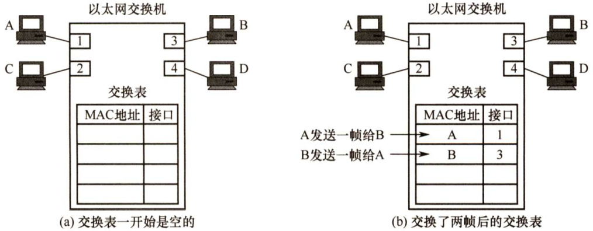
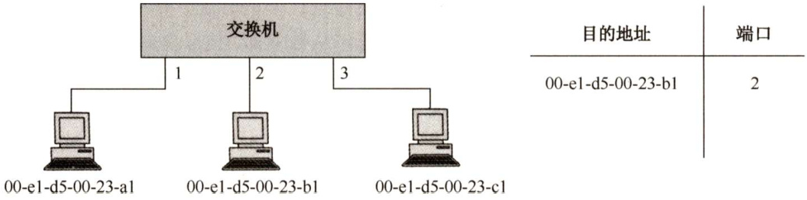
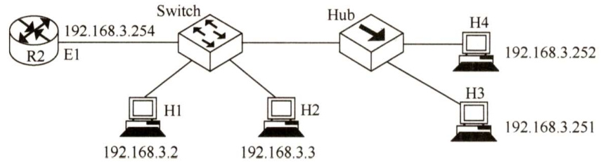

#### 3.8 数据链路层设备  

#### ${\bf\$3.8.1}$ 网桥的基本概念?  

两个或多个以太网通过网桥连接后，就成为一个覆盖范围更大的以太网，而原来的每个以太网就称为一个网段。网桥工作在链路层的MAC子层，可以使以太网各网段成为隔离开的碰撞域（又称冲突域)。如果把网桥换成工作在物理层的转发器，那么就没有这种过滤通信量的功能。由于各网段相对独立，因此一个网段的故障不会影响到另一个网段的运行。网桥必须具有路径选择的功能，接收到帧后，要决定正确的路径，将该帧转送到相应的目的局域网站点。  

网络1和网络2通过网桥连接后，网桥接收网络1发送的数据帧，检查数据帧中的地址，如果是网络2的地址，那么就转发给网络2；如果是网络1的地址，那么就将其丢弃，因为源站和目的站处在同一个网段，目的站能够直接收到这个帧而不需要借助网桥转发。  

#### 3.8.2 局域网交换机  

#### 1.交换机的原理和特点  

局域网交换机，又称以太网交换机，从本质上说，以太网交换机是一个多端口的网桥，它工作在数据链路层。交换机能经济地将网络分成小的冲突域，为每个工作站提供更高的带宽。以太网交换机的原理是，它检测从以太端口来的数据帧的源和目的地的MAC（介质访问层）地址，然后与系统内部的动态查找表进行比较，若数据帧的源MAC地址不在查找表中，则将该地址加入查找表，并将数据帧发送给相应的目的端口。以太网交换机对工作站是透明的，因此管理开销低廉，简化了网络结点的增加、移动和网络变化的操作。利用以太网交换机还可以方便地实现虚拟局域网VLAN，VLAN不仅可以隔离冲突域，而且可以隔离广播域。  

对于传统 $10\mathbf{M}\mathbf{b}/\mathbf{s}$ 的共享式以太网，若共有 $N$ 个用户，则每个用户占有的平均带宽只有总带宽（10Mb/s）的1/N。在使用以太网交换机时，虽然在每个端口到主机的带宽还是 $10\mathbf{Mb}/\mathbf{s}$ ，但由于一个用户在通信时是独占而不是和其他网络用户共享传输媒体的带宽，因此拥有 $N$ 个端口的交换机的总容量为 $N{\times}10\mathrm{Mb}/\mathrm{s}$ 。这正是交换机的最大优点。  

以太网交换机的特点： $\textcircled{1}$ 以太网交换机的每个端口都直接与单台主机相连（网桥的端口往往连接到一个网段)，并且一般都工作在全双工方式。 $\textcircled{2}$ 以太网交换机能同时连通多对端口，使每对相互通信的主机都能像独占通信媒体那样，无碰撞地传输数据。 $\textcircled{3}$ 以太网交换机是一种即插即用设备，其内部的帧的转发表是通过自学习算法自动地逐渐建立起来的。 $\textcircled{4}$ 以太网交换机由于使用专用的交换结构芯片，交换速率较高。 $\textcircled{5}$ 以太网交换机独占传输媒体的带宽。  

以太网交换机主要采用两种交换模式： $\textcircled{1}$ 直通式交换机，只检查帧的目的地址，这使得帧在接收后几乎能马上被传出去。这种方式速度快，但缺乏智能性和安全性，也无法支持具有不同速率的端口的交换。 $\textcircled{2}$ 存储转发式交换机，先将接收到的帧缓存到高速缓存器中，并检查数据是否正确，确认无误后通过查找表转换成输出端口将该帧发送出去。如果发现帧有错，那么就将其丢弃。优点是可靠性高，并能支持不同速率端口间的转换，缺点是延迟较大。  

以太网交换机一般都具有多种速率的端口，例如可以具有10Mb/s、100Mb/s和1Gb/s的端口的各种组合，因此大大方便了各种不同情况的用户。  

#### 2.交换机的自学习功能  

决定一个帧是应该转发到某个接口还是应该将其丢弃称为过滤。决定一个帧应该被移动到哪个接口称为转发。交换机的过滤和转发借助于交换表（switch table）完成。交换表中的一个表项至少包含： $\textcircled{1}$ 一个MAC地址； $\textcircled{2}$ 连通该MAC地址的交换机接口。例如，在图3.37中，以太网交换机有4个接口，各连接一台计算机，MAC地址分别为A、B、C和D，交换机的交换表初始是空的。  

  
图3.37以太网交换机中的交换表  

A先向B发送一帧，从接口1进入交换机。交换机收到帧后，查找交换表，找不到MAC地址为B的表项。然后，交换机将该帧的源地址A和接口1写入交换表，并向除接口1外的所有接口广播这个帧（该帧就是从接口1进入的，因此不应该将它再从接口1转发出去)。C和D丢弃该帧，因为目的地址不对。只有B才收下这个目的地址正确的帧。交换表中写入（A,1）后，以后从任何接口收到目的地址为A的帧，都应该从接口1转发出去。这是因为，既然A发出的帧从接口1进入交换机，那么从接口1转发出去的帧也应能到达A。  

接下来，假定B通过接口3向A发送一帧，交换机查找交换表后，发现有表项（A，1)，将该帧从接口1转发给A。显然，此时已经没有必要再广播收到的帧。将该帧的源地址B和接口3写入交换表，表明以后如有发送给B的帧，应该从接口3转发出去。  

经过一段时间，只要主机C和D也向其他主机发送帧，交换机就会把C和D及对应的接口号写入交换表。这样，转发给任何主机的帧，都能很快地在交换表中找到相应的转发接口。  

考虑到交换机所连的主机会随时变化，这就需要更新交换表中的表项。为此，交换表中的每个表项都设有一定的有效时间，过期的表项会自动删除。这就保证了交换表中的数据符合当前网络的实际状况。这种自学习方法使得交换机能够即插即用，而不必人工进行配置，因此非常方便。  

#### 3.8.3 本节习题精选  

#### 一、单项选择题  

01．下列网络连接设备都工作在数据链路层的是（）。  

A．中继器和集线器 B．集线器和网桥C.网桥和局域网交换机 D.集线器和局域网交换机  

02．下列关于数据链路层设备的叙述中，错误的是（）。  

A．网桥将网络划分成多个网段，一个网段的故障不会影响到另一个网段的运行B.网桥可互联不同的物理层、不同的MAC子层及不同速率的以太网C．交换机的每个端口结点所占用的带宽不会因为端口结点数目的增加而减少，且整个交换机的总带宽会随着端口结点的增加而增加D.利用交换机可以实现虚拟局域网（VLAN），VLAN可以隔离冲突域，但不能隔离广播域  

03.下列（）不是使用网桥分割网络所带来的好处。  

A.减少冲突域的范围 B．在一定条件下增加了网络的带宽C．过滤网段之间的数据 D.缩小了广播域的范围  

04.不同网络设备传输数据的延迟时间是不同的。下面设备中，传输时延最大的是（）。  

A．局域网交换机B．网桥 C.路由器 D．集线器  

05．下列不能分割碰撞域的设备是（）。  

A．集线器 B．交换机 C.路由器 D.网桥  

06．局域网交换机实现的主要功能在（）。  

A.物理层和数据链路层 B．数据链路层和网络层C.物理层和网络层 D．数据链路层和应用层  

07．交换机比集线器提供更好的网络性能的原因是（）。  

A．交换机支持多对用户同时通信B．交换机使用差错控制减少出错率C.交换机使网络的覆盖范围更大D．交换机无须设置，使用更方便  

08.通过交换机连接的一组工作站（）。  

A．组成一个冲突域，但不是一个广播域B.组成一个广播域，但不是一个冲突域C．既是一个冲突域，又是一个广播域  

D.既不是冲突域，也不是广播域  

09．一个16端口的集线器的冲突域和广播域的个数分别是（）。  

A.16,1 B.16,16 C.1,1 D.1,16．一个16个端口的以太网交换机，冲突域和广播域的个数分别是（）。  

A.1,1 B.16,16 C.1,16 D.16,1  

11.对于由交换机连接的 $10\mathbf{Mb}/\mathbf{s}$ 的共享式以太网，若共有10个用户，则每个用户能够占有的带宽为（）。  

A. 1Mb/s B. 2Mb/s C. 10Mb/s D. 100Mb/s  

12.若一个网络采用一个具有24个 $10\mathbf{Mb}/\mathbf{s}$ 端口的半双工交换机作为连接设备，则每个连接点平均获得的带宽为（ $\textcircled{1}$ )，该交换机的总容量为（ $\textcircled{2}$ ）。  

$\textcircled{1}$ A.0.417Mb/s B. 0.0417Mb/s C. 4.17Mb/s D. 10Mb/s $\textcircled{2}$ A. $120\mathrm{Mb/s}$ B. $240\mathrm{Mb/s}$ C. $10\mathbf{Mb}/\mathbf{s}$ D. $24\mathrm{Mb/s}$  

13.假设以太网A中 $80\%$ 的通信量在本局域网内进行，其余 $20\%$ 在本局域网与因特网之间进行，而局域网B正好相反。这两个局域网中，一个使用集线器，另一个使用交换机，则交换机应放置的局域网是（）。  

A.以太网A B.以太网B C.任一以太网 D.都不合适  

14.在使用以太网交换机的局域网中，以下（）是正确的。  

A．局域网中只包含一个冲突域 B．交换机的多个端口可以并行传输C.交换机可以隔离广播域 D．交换机根据LLC目的地址转发  

15.【2009统考真题】以太网交换机进行转发决策时使用的PDU地址是（）。  

A．目的物理地址B．目的IP地址 C．源物理地址 D.源IP地址  

16.【2013统考真题】对于 $100\mathrm{Mb/s}$ 的以太网交换机，当输出端口无排队，以直通交换（cut-throughswitching）方式转发一个以太网帧（不包括前导码）时，引入的转发时延至少是（）。  

A. $0\upmu\mathrm{s}$ B. $0.48\upmu\mathrm{s}$ C. $5.12\upmu\mathrm{s}$ D. 121.44μs  

17.【2014统考真题】某以太网拓扑及交换机当前转发表如下图所示，主机00-el-d5-00-23-al向主机00-el-d5-00-23-c1发送一个数据帧，主机00-el-d5-00-23-cl收到该帧后，向主机00-el-d5-00-23-a1发送一个确认帧，交换机对这两个帧的转发端口分别是（）。  

  

A.{3}和{1} B.{2,3}和{1} C.{2,3}和{1,2} D.{1,2,3}和{1}  

18.【2015统考真题】下列关于交换机的叙述中，正确的是（）。  

A.以太网交换机本质上是一种多端口网桥B.通过交换机互连的一组工作站构成一个冲突域  

C.交换机每个端口所连网络构成一个独立的广播域D.以太网交换机可实现采用不同网络层协议的网络互联  

19.【2016统考真题】若主机H2向主机H4发送一个数据帧，主机H4向主机H2立即发送一个确认帧，则除H4外，从物理层上能够收到该确认帧的主机还有（）。  

  

A.仅H2 B.仅H3 C.仅H1、H2 D.仅H2、H3  

#### 3.8.4 答案与解析  

#### 一、单项选择题  

01.C  

中继器和集线器都属于物理层设备，网桥和局域网交换机属于数据链路层设备。  

02.D  

交换机的优点是每个端口结点所占用的带宽不会因为端口结点数目的增加而减少，且整个交换机的总带宽会随着端口结点的增加而增加。另外，利用交换机可以实现虚拟局域网（VLAN)，VLAN不仅可以隔离冲突域，而且可以隔离广播域。因此选项C正确，选项D错误。  

03.D  

网桥可以隔离信息，将网络划分成多个网段，隔离出安全网段，防止其他网段内的用户非法访问。由于网络的分段，各网段相对独立，一个网段的故障不会影响到另一个网段的运行。因此选项B、C正确。根据网桥的特点可知选项A正确，选项D错误。  

04.C  

路由器具有较大的传输时延，因为它需要根据所接收的每个分组报头中的IP地址决定是否转发分组。这种处理分组报头的任务一般由软件完成，将带来较长的处理时间，也会增加每个分组的传输时延。由于局域网交换机和网桥通常都由硬件进行帧的转发，而且不关心数据链路层以上的数据，因此都具有比路由器要小得多的传输时延。从数量级上看，如果局域网交换机的传输时延为几十微秒，那么网桥的传输时延为几百微秒，而路由器的传输时延为几千微秒。集线器的每个端口都具有收发功能，当某个端口收到信号时，立即向所有其他端口转发，因此其传输时延最小。  

05.A  

碰撞域是指共享同一信道的各个站点可能发生冲突的范围，又称冲突域。物理层设备集线器不能分割碰撞域，数据链路层设备交换机和网桥可以分割碰撞域，但不能分割广播域，而网络层设备路由器既可以分割碰撞域，又可以分割广播域。  

06.A  

局域网交换机是数据链路层设备，能实现数据链路层和物理层的功能。  

07.A  

交换机能隔离冲突域，工作在全双工状态，使网络中多对结点同时通信，提高了网络的利用率，这是交换机的优点。  

08.B  

交换机是数据链路层的设备，数据链路层的设备可以隔离冲突域，但不能隔离广播域，因此本题选B。另外，物理层设备（集线器等）既不能隔离冲突域，也不能隔离广播域；网络层设备（路由器）既可以隔离冲突域，又可以隔离广播域。  

09.C  

物理层设备（中继器和集线器）既不能分割冲突域又不能分割广播域，因此选C。  

10.D  

以太网交换机的各端口之间都是冲突域的终止点，但LAN交换机不隔离广播，所以冲突域的个数是16，广播域的个数是1。  

11.C  

对于普通的 $10\mathbf{M}\mathbf{b}/\mathbf{s}$ 共享式以太网，若共有 $N$ 个用户，则每个用户占有的平均带宽只有总带宽的1/N。使用以太网交换机时，虽然在每个端口到主机的带宽还是 $10\mathbf{Mb}/\mathbf{s}$ ，但由于一个用户在通信时是独占而不是和其他用户共享传输媒体的带宽，因此每个用户仍然可以得到 $10\mathbf{Mb}/\mathbf{s}$ 的带宽，这正是交换机的最大优点。  

12.D、A  

1）在采用交换机作为连接设备的局域网中，交换机能同时连通许多对端口，使每对相互通信的计算机都能像独占该通信媒体一样，进行无冲突的数据传输。对于 $10\mathbf{Mb}/\mathbf{s}$ 的半双工端口，端口带宽为 $10\mathbf{Mb}/\mathbf{s}$ ；若端口速率保持不变，则全双工端口带宽为 $20\mathrm{Mb/s}$ o  

2）拥有 $N$ 对 $10\mathbf{Mb}/\mathbf{s}$ 端口的交换机可同时支持 $N$ 对结点同时进行半双工通信，所以它的总容量为 $N{\times}10\mathbf{M}\mathbf{b}/\mathbf{s}$ ，本题中 $N=24/2=12$ ，因此交换机总容量为120Mb/s。  

13.A  

交换机能隔离冲突域，而集线器连接的各网段属于一个冲突域。以太网A内的通信量很大，若使用集线器，则冲突域变大，使整个网络效率降低，必须要用交换机把不同网段的通信隔离开。  

14.B  

交换机的每个端口都有其自己的冲突域，所以交换机永远不会因为冲突而丢失帧，A错误。交换机不能隔离广播域，C 错误。LLC是逻辑链路控制，它在MAC层上，用于向网络提供一个接口以隐藏各种802网络之间的差异，交换机应是按MAC地址转发的，D错误。  

15.A  

交换机实质上是一个多端口网桥，工作在数据链路层，数据链路层使用物理地址进行转发，而转发到目的地需要使用目的地址。因此PDU地址是目的物理地址。  

16.B。  

解析请扫右侧二维码查阅。  

17.B  

主机00-el-d5-00-23-al 向 00-el-d5-00-23-cl 发送数据帧时，交换机转发表中没有 00-el-d5-00-23-cl这一项，所以向除1接口外的所有接口广播这一帧，即2、3端口会转发这一帧，同时因为转发表中并没有00-el-d5-00-23-al这一项，所以转发表会把（目的地址00-el-d5-00-23-al，端口1）这一项加入转发表。而当00-el-d5-00-23-c1向 00-el-d5-00-23-al发送确认帧时，由于转发表已经有00-el-d5-00-23-al这一项，所以交换机只向1端口转发，选B。  

18.A  

从本质上说，交换机就是一个多端口的网桥（A正确)，工作在数据链路层（因此不能实现不同网络层协议的网络互联，D错误)，交换机能经济地将网络分成小的冲突域（B错误)。广播域属于网络层概念，只有网络层设备（如路由器）才能分割广播域（C错误)。  

19.D  

交换机（Switch）可以隔离冲突域。若H2向H4发送数据帧，H2及其对应接口就写入交换表。当H4向H2发送确认帧，交换机查找交换表后，将该确认帧从H2对应的接口转发出去。集线器（Hub）无法隔离冲突域，因此Hub会向所有接口（除输入接口外）广播该确认帧的数据信号。因此从物理层上能够收到该确认帧的主机有H2和H3，选D。