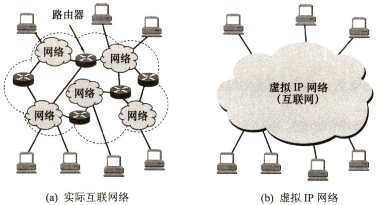
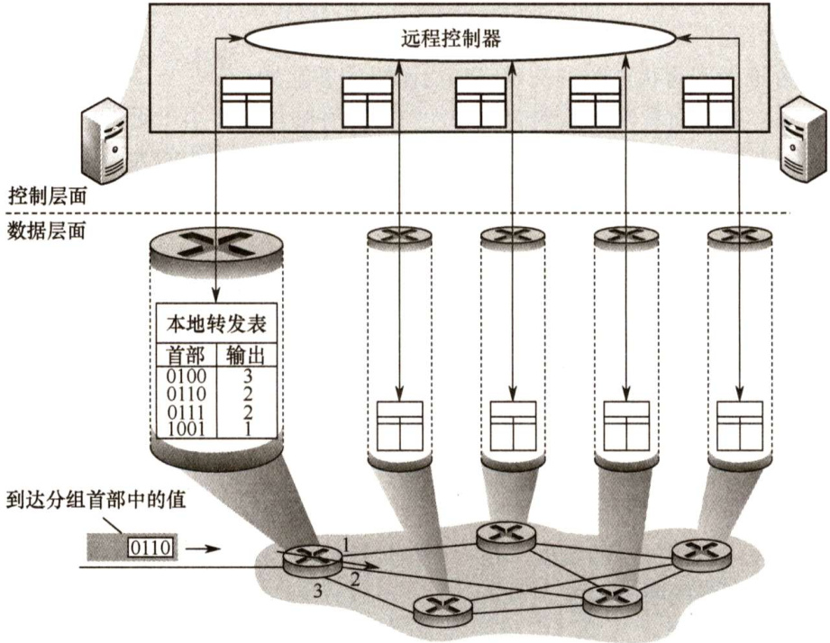
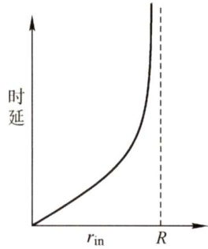

#### 4.1 网络层的功能  

互联网在网络层的设计思路是，向上只提供简单灵活的、无连接的、尽最大努力交付的数据报服务。也就是说，所传送的分组可能出错、丢失、重复、失序或超时，这就使得网络中的路由器比较简单，而且价格低廉。如果主机中的进程之间的通信需要是可靠的，那么可以由更高层的传输层来负责。采用这种设计思路的好处是：网络的造价大大降低，运行方式灵活，能够适应多种应用。互联网能够发展到今日的规模，充分证明了当初采用这种设计思想的正确性。  

#### 4.1.1 异构网络互联  

要在全球范围内把数以百万计的网络互联起来，并且能够互相通信，是一项非常复杂的任务，此时需要解决许多问题，比如不同的寻址方案、不同的网络接入机制、不同的差错处理方法、不同的路由选择机制等等。用户的需求是多样的，没有一种单一的网络能够适应所有用户的需求。网络层所要完成的任务之一就是使这些异构的网络实现互联。  

网络互联是指将两个以上的计算机网络，通过一定的方法，用一些中间设备（又称中继系统）相互连接起来，以构成更大的网络系统。根据所在的层次，中继系统分为以下4种：  

1）物理层中继系统：转发器，集线器。  
2）数据链路层中继系统：网桥或交换机。  
3）网络层中继系统：路由器。  
4）网络层以上的中继系统：网关。  

使用物理层或数据链路层的中继系统时，只是把一个网络扩大了，而从网络层的角度看，它仍然是同一个网络，一般并不称为网络互联。因此网络互联通常是指用路由器进行网络互联和路由选择。路由器是一台专用计算机，用于在互联网中进行路由选择。  

注意：由于历史原因，许多有关TCP/IP的文献也把网络层的路由器称为网关。  

TCP/IP体系在网络互联上采用的做法是在网络层采用标准化协议，但相互连接的网络可以是异构的。图 4.1(a)表示用许多计算机网络通过一些路由器进行互联。由于参加互联的计算机网络都使用相同的IP协议，因此可以把互联后的网络视为如图4.1(b)所示的一个虚拟IP 网络。  

  
图4.1IP网的概念  

虚拟互联网络也就是逻辑互联网络，其意思是互联起来的各种物理网络的异构性本来是客观存在的，但是通过IP 协议就可以使这些性能各异的网络在网络层上看起来好像是一个统一的网络。这种使用IP协议的虚拟互联网络可简称为IP 网络。  

使用IP网络的好处是：当互联网上的主机进行通信时，就好像在一个单个网络上通信一样，而看不见互联的各网络的具体异构细节(如具体的编址方案、路由选择协议等)。  

#### 4.1.2 路由与转发  

路由器主要完成两个功能：一是路由选择（确定哪一条路径)，二是分组转发（当一个分组到达时所采取的动作)。前者是根据特定的路由选择协议构造出路由表，同时经常或定期地和相邻路由器交换路由信息而不断地更新和维护路由表。后者处理通过路由器的数据流，关键操作是转发表查询、转发及相关的队列管理和任务调度等。  

1）路由选择。指按照复杂的分布式算法，根据从各相邻路由器所得到的关于整个网络拓扑的变化情况，动态地改变所选择的路由。2）分组转发。指路由器根据转发表将用户的IP数据报从合适的端口转发出去。  

路由表是根据路由选择算法得出的，而转发表是从路由表得出的。转发表的结构应当使查找过程最优化，路由表则需要对网络拓扑变化的计算最优化。在讨论路由选择的原理时，往往不去区分转发表和路由表，而是笼统地使用路由表一词。  

#### 4.1.3 SDN的基本概念  

网络层的主要任务是转发和路由选择。可以将网络层抽象地划分为数据层面(也称转发层面)和控制层面，转发是数据层面实现的功能，而路由选择是控制层面实现的功能。  

软件定义网络（SDN）是近年流行的一种创新网络架构，它采用集中式的控制层面和分布式的数据层面，两个层面相互分离，控制层面利用控制-数据接口对数据层面上的路由器进行集中式控制，方便软件来控制网络。在传统互联网中，每个路由器既有转发表又有路由选择软件，也就是说，既有数据层面又有控制层面。但是在图4.2所示的SDN结构中，路由器都变得简单了，它的路由选择软件都不需要了，因此路由器之间不再相互交换路由信息。在网络的控制层面有一个逻辑上的远程控制器（可以由多个服务器组成)。远程控制器掌握各主机和整个网络的状态，为每个分组计算出最佳路由，通过Openflow 协议（也可以通过其他途径）将转发表（在SDN中称为流表）下发给路由器。路由器的工作很单纯，即收到分组、查找转发表、转发分组。  

  
图4.2远程控制器确定并分发转发表中的值  

这样，网络又变成集中控制的，本来互联网是分布式的。SDN并非要把整个互联网都改造成如图4.2所示的集中控制模式，这是不现实的。然而，在某些具体条件下，特别是像一些大型的数据中心之间的广域网，使用SDN模式来建造，就可以使网络的运行效率更高。  

SDN的可编程性通过为开发者们提供强大的编程接口，使得网络具有很好的编程性。对上层应用的开发者，SDN提供的编程接口称为北向接口，北向接口提供了一系列丰富的API，开发者可以在此基础上设计自己的应用，而不必关心底层的硬件细节。SDN控制器和转发设备建立双向会话的接口称为南向接口，通过不同的南向接口协议（如Openflow)，SDN控制器就可兼容不同的硬件设备，同时可以在设备中实现上层应用的逻辑。SDN控制器集群内部控制器之间的通信接口称为东西向接口，用于增强整个控制层面的可靠性和可拓展性。  

SDN的优点： $\textcircled{1}$ 全局集中式控制和分布式高速转发，既利于控制层面的全局优化，又利于高性能的网络转发。 $\textcircled{2}$ 灵活可编程与性能的平衡，控制和转发功能分离后，使得网络可以由专有的自动化工具以编程方式配置。 $\textcircled{3}$ 降低成本，控制和数据层面分离后，尤其是在使用开放的接口协议后，就实现了网络设备的制造与功能软件的开发相分离，从而有效降低了成本。  

SDN的问题： $\textcircled{1}$ 安全风险，集中管理容易受攻击，如果崩溃，整个网络会受到影响。 $\textcircled{2}$ 瓶颈问题，原本分布式的控制层面集中化后，随着网络规模扩大，控制器可能成为网络性能的瓶颈。  

#### 4.1.4 拥塞控制  

在通信子网中，因出现过量的分组而引起网络性能下降的现象称为拥塞。例如，某个路由器所在链路的带宽为 $R{\mathrm{~B/s~}}$ ，如果IP分组只从它的某个端口进入，那么其速率为 $r_{\mathrm{in}}\mathrm{B}/\mathrm{s}$ 。当$r_{\mathrm{in}}=R$ 时，可能看起来是件“好事”，因为链路带宽被充分利用。但是，如图4.3所示，当分组到达路由器的速率接近 $R$ 时，平均时延急剧增加，并且会有大量的分组被丢弃（路由器端口的缓冲区是有限的)，整个网络的吞吐量会骤降，源与目的地之间的平均时延也会变得近乎无穷大。  

判断网络是否进入拥塞状态的方法是，观察网络的吞吐量与网络负载的关系：如果随着网络负载的增加，网络的吞吐量明显小于正常的吞吐量，那么网络就可能已进入“轻度拥塞”状态；如果网络的吞吐量随着网络负载的增大而下降，那么网络就可能已进入拥塞状态；如果网络的负载继续增大，而网络的吞吐量下降到零，那么网络就可能已进入死锁状态。  

  
图4.3分组发送速率与时延的关系  

为避免拥塞现象的出现，要采用能防止拥塞的一系列方法对子网进行拥塞控制。拥塞控制主要解决的问题是如何获取网络中发生拥塞的信息，从而利用这些信息进行控制，以避免由于拥塞而出现分组的丢失，以及严重拥塞而产生网络死锁的现象。  

拥塞控制的作用是确保子网能够承载所达到的流量，这是一个全局性的过程，涉及各方面的行为：主机、路由器及路由器内部的转发处理过程等。单一地增加资源并不能解决拥塞。  

流量控制和拥塞控制的区别：流量控制往往是指在发送端和接收端之间的点对点通信量的控制。流量控制所要做的是抑制发送端发送数据的速率，以便使接收端来得及接收。而拥塞控制必须确保通信子网能够传送待传送的数据，是一个全局性的问题，涉及网络中所有的主机、路由器及导致网络传输能力下降的所有因素。  

拥塞控制的方法有两种：  

1）开环控制。在设计网络时事先将有关发生拥塞的因素考虑周到，力求网络在工作时不产生拥塞。这是一种静态的预防方法。一旦整个系统启动并运行，中途就不再需要修改。开环控制手段包括确定何时可接收新流量、何时可丢弃分组及丢弃哪些分组，确定何种调度策略等。所有这些手段的共性是，在做决定时不考虑当前网络的状态。  
2）闭环控制。事先不考虑有关发生拥塞的各种因素，采用监测网络系统去监视，及时检测哪里发生了拥塞，然后将拥塞信息传到合适的地方，以便调整网络系统的运行，并解决出现的问题。闭环控制是基于反馈环路的概念，是一种动态的方法。  

#### 4.1.5 本节习题精选  

#### 单项选择题  

01．网络层的主要目的是（）。  

A.在邻接结点间进行数据报传输 B.在邻接结点间进行数据报可靠传输C.在任意结点间进行数据报传输 D.在任意结点间进行数据报可靠传输  

02．路由器连接的异构网络是指（）。  

A.网络的拓扑结构不同  
B.网络中计算机操作系统不同  
C.数据链路层和物理层均不同  
D．数据链路层协议相同，物理层协议不同  

03．网络中发生了拥塞，根据是（）。  

A.随着通信子网负载的增加，吞吐量也增加B.网络结点接收和发出的分组越来越少C.网络结点接收和发出的分组越来越多D.随着通信子网负载的增加，吞吐量反而降低  

04.在路由器互联的多个局域网的结构中，要求每个局域网（）。  

A．物理层协议可以不同，而数据链路层及其以上的高层协议必须相同B．物理层、数据链路层协议可以不同，而数据链路层以上的高层协议必须相同C．物理层、数据链路层、网络层协议可以不同，而网络层以上的高层协议必须相同D．物理层、数据链路层、网络层及高层协议都可以不同  

05．下列设备中，能够分隔广播域的是（）。  

A．集线器 B．交换机 C.路由器 D.中继器  

06．在因特网中，一个路由器的路由表通常包含（）。  

A.目的网络和到达目的网络的完整路径  
B.所有目的主机和到达该目的主机的完整路径  
C．目的网络和到达该目的网络路径上的下一个路由器的IP地址  
D．目的网络和到达该目的网络路径上的下一个路由器的MAC地址  

07．路由器转发分组的根据是报文的（）。  

A.端口号 B.MAC地址 C.IP地址 D.域名  

08.路由器在能够开始向输出链路传输分组的第一位之前，必须先接收到整个分组，这种机制称为（）。  

A.存储转发机制 B．直通交换机制 C．分组交换机制 D．分组检测机制  

09．在因特网中，IP分组的传输需要经过源主机和中间路由器到达目的主机，通常（）  

A.源主机和中间路由器都知道IP分组到达目的主机需要经过的完整路径B．源主机和中间路由器都不知道IP分组到达目的主机需要经过的完整路径C．源主机知道IP分组到达目的主机需要经过的完整路径，而中间路由器不知道D．源主机不知道IP分组到达目的主机需要经过的完整路径，而中间路由器知道  

10．下列协议中属于网络层协议的是（）。  

I.IP II. TCP III.FTP IV.ICMPA.I和Ⅱ B.Ⅱ和Ⅲ C.IⅢ和IV D.I和IV  

11．下列描述中，（）不是软件定义网络（SDN）的特点。  

A.控制与转发功能分离 B.控制层面集中化C.接口开放可编程 D.Openflow取代了路由协议  

#### 4.1.6 答案与解析  

#### 单项选择题  

01.C  

选项A、B不是网络层的目的，IP提供的是不可靠的服务，因此选项D错误。  

02.C  

网络的异构性是指传输介质、数据编码方式、链路控制协议及不同的数据单元格式和转发机制，这些特点分别在物理层和数据链路层协议中定义。  

03.D  

拥塞现象是指到达通信子网中某一部分的分组数量过多，使得该部分网络来不及处理，以致引起这部分乃至整个网络性能下降的现象，严重时甚至会导致网络通信业务陷入停顿，即出现死锁现象。A选项的网络性能显然是提高的，B、C 两项中网络结点接收和发出的分组多少与网络的吞吐量并不呈正比关系，不能确定网络是否拥塞。  

04.C  

路由器是第三层设备，向传输层及以上层次隐藏下层的具体实现，所以物理层、数据链路层、网络层协议可以不同。而网络层之上的协议数据是路由器所不能处理的，因此网络层以上的高层协议必须相同。本题容易误选B，主要原因是在目前的互联网中广泛使用的是TCP/IP协议族，在网络层用的多是IPv4，所以误认为网络层协议必须相同。而实际上，使用特定的路由器连接IPv4与IPv6网络，就是典型的网络层协议不同而实现互联的例子。  

05.C  

路由器工作在网络层，不转发广播包（目的地址为255.255.255.255的IP包)，因此能够分隔广播域，抑制网络风暴。交换机工作在数据链路层，能够分隔冲突域，但不能分隔广播域。集线器和中继器是物理层设备，既不能分隔广播域又不能分隔冲突域。  

06.C  

路由器是网络层设备，其任务是转发分组。每个路由器都维护一个路由表以决定分组的转发。为了提高路由器的查询效率并减少路由表维护的内容，路由表只保留到达目的地址的下一个路由器的地址，而不保留整个传输路径的信息。另外，采用目的网络可使每个路由表项包含很多目的主机IP地址，这样可减少路由表中的项目。因此，路由表通常包含目的网络和到达该目的网络路径上的下一个路由器的IP地址。  

07.C  

路由器是网络层设备，网络层通过IP地址标识主机，所以路由器根据IP地址转发分组。  

08.A  

路由器转发一个分组的过程如下：先接收整个分组，然后对分组进行错误检查，如果出错，那么丢弃错误的分组；否则存储该正确的分组。最后根据路由选择协议，将正确的分组转发到合适的端口，这种机制称为存储转发机制。  

09.B  

每个路由器都根据路由表选择IP分组的下一跳地址，只有到了下一跳路由器，才能知道再下一跳应当怎样走。主机仅知道到达本地网络的路径，到达其他网络的IP分组均转发到路由器。而源主机也只把IP分组发给网关，所以路由器和源主机都不知道IP分组要经过的完整路径。  

10.D  

TCP属于传输层协议，FTP属于应用层协议，只有IP和ICMP属于网络层协议。  

11.D  

选项A、B和C都是SDN的特点。Openflow协议是控制层面和数据层面之间的接口。在 SDN中，路由器之间不再相互交换路由信息，由远程控制器计算出最佳路由。