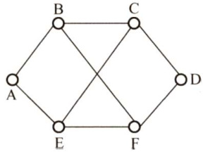

#### 4.2 路由算法  

#### 4.2.1 静态路由与动态路由  

路由器转发分组是通过路由表转发的，而路由表是通过各种算法得到的。从能否随网络的通信量或拓扑自适应地进行调整变化来划分，路由算法可以分为如下两大类。  

静态路由算法（又称非自适应路由算法)。指由网络管理员手工配置的路由信息。当网络的拓扑结构或链路的状态发生变化时，网络管理员需要手工去修改路由表中相关的静态路由信息。它不能及时适应网络状态的变化，对于简单的小型网络，可以采用静态路由。  

动态路由算法（又称自适应路由算法)。指路由器上的路由表项是通过相互连接的路由器之间彼此交换信息，然后按照一定的算法优化出来的，而这些路由信息会在一定时间间隙里不断更新，以适应不断变化的网络，随时获得最优的寻路效果。  

静态路由算法的特点是简便和开销较小，在拓扑变化不大的小网络中运行效果很好。动态路由算法能改善网络的性能并有助于流量控制；但算法复杂，会增加网络的负担，有时因对动态变化的反应太快而引起振荡，或反应太慢而影响网络路由的一致性，因此要仔细设计动态路由算法，以发挥其优势。常用的动态路由算法可分为两类：距离-向量路由算法和链路状态路由算法。  

#### 4.2.2 距离-向量路由算法  

在距离-向量路由算法中，所有结点都定期地将它们的整个路由选择表传送给所有与之直接相邻的结点。这种路由选择表包含：  

每条路径的目的地（另一结点)。$\cdot$ 路径的代价（也称距离）。  

注意：这里的距离是一个抽象的概念，如RIP就将距离定义为“跳数”。跳数指从源端口到达目的端口所经过的路由器个数，每经过一个路由器，跳数加1。  

在这种算法中，所有结点都必须参与距离向量交换，以保证路由的有效性和一致性，也就是说，所有的结点都监听从其他结点传来的路由选择更新信息，并在下列情况下更新它们的路由选择表：  

1）被通告一条新的路由，该路由在本结点的路由表中不存在，此时本地系统加入这条新的路由。  
2）发来的路由信息中有一条到达某个目的地的路由，该路由与当前使用的路由相比，有较短的距离（较小的代价)。此种情况下，就用经过发送路由信息的结点的新路由替换路由表中到达那个目的地的现有路由。  

距离-向量路由算法的实质是，选代计算一条路由中的站段数或延迟时间，从而得到到达一个目标的最短（最小代价）通路。它要求每个结点在每次更新时都将它的全部路由表发送给所有相邻的结点。显然，更新报文的大小与通信子网的结点个数成正比，大的通信子网将导致很大的更新报文。由于更新报文发给直接邻接的结点，所以所有结点都将参加路由选择信息交换。基于这些原因，在通信子网上传送的路由选择信息的数量很容易变得非常大。  

最常见的距离-向量路由算法是RIP算法，它采用“跳数”作为距离的度量。  

#### 4.2.3 链路状态路由算法  

链路状态路由算法要求每个参与该算法的结点都具有完全的网络拓扑信息，它们执行下述两项任务。第一，主动测试所有邻接结点的状态。两个共享一条链接的结点是相邻结点，它们连接到同一条链路，或者连接到同一广播型物理网络。第二，定期地将链路状态传播给所有其他结点（或称路由结点)。典型的链路状态算法是OSPF算法。  

在一个链路状态路由选择中，一个结点检查所有直接链路的状态，并将所得的状态信息发送给网上的所有其他结点，而不是仅送给那些直接相连的结点。每个结点都用这种方式从网上所有其他的结点接收包含直接链路状态的路由选择信息。  

每当链路状态报文到达时，路由结点便使用这些状态信息去更新自己的网络拓扑和状态“视野图”，一旦链路状态发生变化，结点就对更新的网络图利用Dijkstra 最短路径算法重新计算路由，从单一的源出发计算到达所有目的结点的最短路径。  

链路状态路由算法主要有三个特征：  

1）向本自治系统中所有路由器发送信息，这里使用的方法是洪泛法，即路由器通过所有端口向所有相邻的路由器发送信息。而每个相邻路由器又将此信息发往其所有相邻路由器（但不再发送给刚刚发来信息的那个路由器）。  
2）发送的信息是与路由器相邻的所有路由器的链路状态，但这只是路由器所知道的部分信息。所谓“链路状态”，是指说明本路由器与哪些路由器相邻及该链路的“度量”。对于OSPF 算法，链路状态的“度量”主要用来表示费用、距离、时延、带宽等。  

3）只有当链路状态发生变化时，路由器才向所有路由器发送此信息。  

由于一个路由器的链路状态只涉及相邻路由器的连通状态，而与整个互联网的规模并无直接关系，因此链路状态路由算法可以用于大型的或路由信息变化聚敛的互联网环境。  

链路状态路由算法的主要优点是，每个路由结点都使用同样的原始状态数据独立地计算路径，而不依赖中间结点的计算；链路状态报文不加改变地传播，因此采用该算法易于查找故障。当一个结点从所有其他结点接收到报文时，它可以在本地立即计算正确的通路，保证一步汇聚。最后，由于链路状态报文仅运载来自单个结点关于直接链路的信息，其大小与网络中的路由结点数目无关，因此链路状态算法比距离-向量算法有更好的规模可伸展性。  

距离-向量路由算法与链路状态路由算法的比较：在距离-向量路由算法中，每个结点仅与它的直接邻居交谈，它为它的邻居提供从自己到网络中所有其他结点的最低费用估计。在链路状态路由算法中，每个结点通过广播的方式与所有其他结点交谈，但它仅告诉它们与它直接相连的链路的费用。相较之下，距离-向量路由算法有可能遇到路由环路等问题。  

#### 4.2.4 层次路由  

当网络规模扩大时，路由器的路由表成比例地增大。这不仅会消耗越来越多的路由器缓冲区空间，而且需要用更多CPU时间来扫描路由表，用更多的带宽来交换路由状态信息。因此路由选择必须按照层次的方式进行。  

因特网将整个互联网划分为许多较小的自治系统（注意一个自治系统中包含很多局域网)，每个自治系统有权自主地决定本系统内应采用何种路由选择协议。如果两个自治系统需要通信，那么就需要一种在两个自治系统之间的协议来屏蔽这些差异。据此，因特网把路由选择协议划分为两大类：  

1）一个自治系统内部所使用的路由选择协议称为内部网关协议（IGP)，也称域内路由选择，具体的协议有RIP和OSPF等。  
2）自治系统之间所使用的路由选择协议称为外部网关协议（EGP)，也称域间路由选择，用在不同自治系统的路由器之间交换路由信息，并负责为分组在不同自治系统之间选择最优的路径。具体的协议有BGP。  

使用层次路由时，OSPF将一个自治系统再划分为若干区域（Area)，每个路由器都知道在本区域内如何把分组路由到目的地的细节，但不用知道其他区域的内部结构。  

采用分层次划分区域的方法虽然会使交换信息的种类增多，也会使OSPF协议更加复杂。但这样做却能使每个区域内部交换路由信息的通信量大大减小，因而使OSPF协议能够用于规模很大的自治系统中。  

#### 4.2.5 本节习题精选  

#### 单项选择题  

01.动态路由选择和静态路由选择的主要区别是（）。  

A．动态路由选择需要维护整个网络的拓扑结构信息，而静态路由选择只需要维护部分拓扑结构信息  
B.动态路由选择可随网络的通信量或拓扑变化而自适应地调整，而静态路由选择则需要手工去调整相关的路由信息  
C．动态路由选择简单且开销小，静态路由选择复杂且开销大  
D．动态路由选择使用路由表，静态路由选择不使用路由表  

02．下列关于路由算法的描述中，（）是错误的。  

A．静态路由有时也被称为非自适应的算法  
B．静态路由所使用的路由选择一旦启动就不能修改  
C．动态路由也称自适应算法，会根据网络的拓扑变化和流量变化改变路由决策  
D．动态路由算法需要实时获得网络的状态  

03.考虑如右图所示的子网，该子网使用了距离向量算法，下面的向量刚刚到达路由器C：来自B的向量为(5,0,8,12,6,2)；来自D的向量为(16,12,6,0,9,10)；来自E的向量为(7,6,3,9,0,4)。经过测量，C到B、D和E的延迟分别为6、3和5，那么C到达  

  

所有结点的最短路径是（）。  

A. (5,6,0,9, 6, 2) B. (11,6,0,3,5,8) C. (5,11,0, 12, 8,9) D. (11,8,0, 7,4,9)  

04.关于链路状态协议的描述，（）是错误的。  

A.仅相邻路由器需要交换各自的路由表B.全网路由器的拓扑数据库是一致的C.采用洪泛技术更新链路变化信息D.具有快速收敛的优点  

05．在链路状态路由算法中，每个路由器都得到网络的完整拓扑结构后，使用（）算法来找出它到其他路由器的路径长度。  

A.Prim最小生成树算法 B.Dijkstra最短路径算法 C.Kruskal最小生成树算法 D．拓扑排序  

06.在距离-向量路由协议中，（）最可能导致路由回路的问题。  

A．由于网络带宽的限制，某些路由更新数据报被丢弃  
B．由于路由器不知道整个网络的拓扑结构信息，当收到一个路由更新信息时，又将该更新信息发回自己发送该路由信息的路由器  
C.当一个路由器发现自己的一条直接相邻链路断开时，未能将这个变化报告给其他路由器  
D.慢收敛导致路由器接收了无效的路由信息  

07．下列关于路由器交付的说法中，错误的是（）。  

I．路由选择分直接交付和间接交付  
ⅡI．直接交付时，两台机器可以不在同一物理网段内  
III．间接交付时，不涉及直接交付  
IV．直接交付时，不涉及路由器  

A.I和Ⅱ B.Ⅱ和III C.IⅢ和IV D.I和IV)8.（未使用CIDR）当一个IP分组进行直接交付时，要求发送方和目的站具有相同的（  

A．IP地址 B．主机号 C.端口号 D．子网地址  

09．下列关于分层路由的描述中，（）是错误的。  

A．采用分层路由后，路由器被划分成区域  
B．每个路由器不仅知道如何将分组路由到自己区域的目标地址，而且知道如何路由到其他区域  
C.采用分层路由后，可以将不同的网络连接起来  
D.对于大型网络，可能需要多级的分层路由来管理  

10.【2021统考真题】某网络中的所有路由器均采用距离向量路由算法计算路由。若路由器E与邻居路由器A、B、C和D之间的直接链路距离分别是8，10，12和6，且E收到邻居路由器的距离向量如下表所示，则路由器E更新后的到达目的网络Netl～Net4 的距离分别是（）。  

目的网络A的距离向量B的距离向量C的距离向量 D的距离向量  

<html><body><table><tr><td>1</td><td>23</td><td>20</td><td>22</td></tr><tr><td>12</td><td>35</td><td>30</td><td>28</td></tr><tr><td>24</td><td>18</td><td>16</td><td>36</td></tr><tr><td>36</td><td>30</td><td>8</td><td>24</td></tr></table></body></html>  

A.9,10,12,6 B. 9,10,28,20 C. 9,20,12,20 D.9,20,28,20  

#### 4.2.6 答案与解析  

#### 单项选择题  

01.B  

静态路由选择使用手动配置的路由信息，实现简单且开销小，需要维护整个网络的拓扑结构信息，但不能及时适应网络状态的变化。动态路由选择通过路由选择协议，自动发现并维护路由信息，能及时适应网络状态的变化，实现复杂且开销大。动态路由选择和静态路由选择都使用路由表。  

02.B  

静态路由又称非自适应算法，它不会估计流量和结构来调整其路由决策。但这并不说明路由选择是不能改变的，事实上用户可以随时配置路由表。而动态路由也称自适应算法，需要实时获取网络的状态，并根据网络的状态适时地改变路由决策。  

03.B  

解析请扫右侧二维码查阅。  

04.A  

在链路状态路由算法中，每个路由器在自己的链路状态变化时，将链路状态信息用洪泛法传送给网络中的其他路由器。发送的链路状态信息包括该路由器的相邻路由器及所有相邻链路的状态，选项A错误。链路状态协议具有快速收敛的优点，它能够在网络拓扑发生变化时，立即进行路由的重新计算，并及时向其他路由器发送最新的链路状态信息，使得各路由器的链路状态表能够尽量保持一致，选项B、C、D正确。  

05.B  

在链路状态路由算法中，路由器通过交换每个结点到邻居结点的延迟或开销来构建一个完整的网络拓扑结构。得到完整的拓扑结构后，路由器就使用Dijkstra 最短路径算法来计算到所有结点的最短路径。  

06.D  

在距离-向量路由协议中，“好消息传得快，而坏消息传得慢”，这就导致了当路由信息发生变化时，该变化未能及时地被所有路由器知道，而仍然可能在路由器之间进行传递，这就是“慢收敛”现象。慢收敛是导致发生路由回路的根本原因。  

07.B  

路由选择分为直接交付和间接交付，当发送站与目的站在同一网段内时，就使用直接交付，反之使用间接交付，因此I正确、Ⅱ错误。间接交付的最后一个路由器肯定直接交付，III错误。直接交付在同一网段内，因此不涉及路由器，IV正确。  

08.D  

判断一个IP分组的交付方式是直接交付还是间接交付，路由器需要根据分组的目的IP地址  

和该路由器接收端口的IP地址是否属于同一个子网来进行判断。具体来说，将该分组的源IP地址和目的IP地址分别与子网掩码进行“与”操作，如果得到的子网地址相同，那么该分组就采用直接交付方式，否则采用间接交付方式。  

09.B  

采用分层路由后，路由器被划分为区域，每个路由器知道如何将分组路由到自己所在区域内的目标地址，但对于其他区域内的结构毫不知情。当不同的网络相互连接时，可将每个网络当作一个独立的区域，这样做的好处是一个网络中的路由器不必知道其他网络的拓扑结构。  

10.D  

根据距离向量路由算法，E收到相邻路由器的距离向量后，更新它的路由表：  

$\textcircled{1}$ 当原路由表中没有目的网络时，把该项目添加到路由表中。  

$\textcircled{2}$ 发来的路由信息中有一条到达某个目的网络的路由，该路由与当前使用的路由相比，有较短的距离，就用经过发送路由信息的结点的新路由替换。  

分析题意可知，E与邻居路由器A、B、C和D之间的直接链路距离分别是8，10，12和6。到达 $\mathrm{Net1}\sim\mathrm{Net4}$ 没有直接链路，需要通过邻居路由器。从上述算法可知，E到达目的网络一定是经过A、B、C和D中距离最小的。根据题中所给的距离信息，计算E经邻居路由器到达目的网络 ${\mathrm{Net1}}\sim{\mathrm{Net4}}$ 的距离，如下表所示，选择到达每个目的网络距离的最短值。  

<html><body><table><tr><td>目的网络</td><td>经过A需要的距离</td><td>经过B需要的距离</td><td>经过C需要的距离</td><td>经过D需要的距离</td></tr><tr><td>Net1</td><td>91</td><td>33</td><td>32</td><td>28</td></tr><tr><td>Net2</td><td>20</td><td>45</td><td>42</td><td>34</td></tr><tr><td>Net3</td><td>32</td><td>28</td><td>28</td><td>42</td></tr><tr><td>Net4</td><td>44</td><td>40</td><td>20</td><td>30</td></tr></table></body></html>  

所以距离分别是9,20，28,20。