#### 4.3 IPv4  

#### 4.3.1 IPv4分组  

IPv4 即现在普遍使用的IP协议（版本4)。IP协议定义数据传送的基本单元—IP分组及其确切的数据格式。IP 协议也包括一套规则，指明分组如何处理、错误怎样控制。特别是IP 协议还包含非可靠投递的思想，以及与此关联的分组路由选择的思想。  

#### 1．IPv4分组的格式  

一个IP 分组由首部和数据部分组成。首部前一部分的长度固定，共20B，是所有IP 分组必须具有的。在首部固定部分的后面是一些可选字段，其长度可变，用来提供错误检测及安全等机制。IP数据报的格式如图4.4所示。  

IP首部的部分重要字段含义如下：  

1）版本。指IP协议的版本，目前广泛使用的版本号为4。  

2）首部长度。占4位，可以表示的最大十进制数是15。以32位为单位，最大值为60B（ $15{\times}4\mathrm{B}$ )。最常用的首部长度是20B，此时不使用任何选项（即可选字段)。  

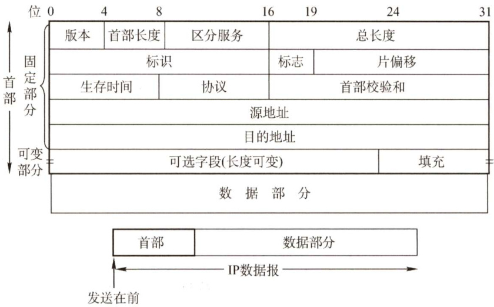  
图4.4IP数据报的格式  

3）总长度。占16位。指首部和数据之和的长度，单位为字节，因此数据报的最大长度为$2^{16}-1\ =\ 65535\mathrm{B}$ 。以太网帧的最大传送单元（MTU）为1500B，因此当一个IP数据报封装成帧时，数据报的总长度（首部加数据）一定不能超过下面的数据链路层的MTU值。  

4）标识。占16位。它是一个计数器，每产生一个数据报就加1，并赋值给标识字段。但它并不是“序号”（因为IP是无连接服务)。当一个数据报的长度超过网络的MTU时，必须分片，此时每个数据报片都复制一次标识号，以便能正确重装成原来的数据报。  
5）标志。占3位。标志字段的最低位为MF， $\mathbf{MF}=1$ 表示后面还有分片， $\mathbf{MF}=0$ 表示最后一个分片。标志字段中间的一位是DF，只有当 ${\mathrm{DF}}=0$ 时才允许分片。  
6）片偏移。占13位。它指出较长的分组在分片后，某片在原分组中的相对位置。片偏移以  
8个字节为偏移单位。除最后一个分片外，每个分片的长度一定是8B的整数倍。  
7）生存时间（TTL)。占8位。数据报在网络中可通过的路由器数的最大值，标识分组在网络中的寿命，以确保分组不会永远在网络中循环。路由器在转发分组前，先把TTL减1。若TTL被减为0，则该分组必须丢弃。  
8）协议。占8位。指出此分组携带的数据使用何种协议，即分组的数据部分应上交给哪个协议进行处理，如TCP、UDP等。其中值为6表示TCP，值为17表示UDP。  
9）首部校验和。占16位。首部校验和只校验分组的首部，而不校验数据部分。  
10）源地址字段。占4B，标识发送方的IP地址。  
11）目的地址字段。占4B，标识接收方的IP地址。  

注意：在IP数据报首部中有三个关于长度的标记，首部长度、总长度、片偏移，基本单位分别为4B、1B、8B（需要记住）。题目中经常会出现这几个长度之间的加减运算。另外，读者要熟悉IP数据报首部的各个字段的意义和功能，但不需要记忆IP数据报的首部，正常情况下如果需要参考首部，题目都会直接给出。第5章学到的TCP、UDP的首部也是一样的。  

#### 2.IP数据报分片  

一个链路层数据报能承载的最大数据量称为最大传送单元（MTU)。因为IP数据报被封装在链路层数据报中，因此链路层的MTU严格地限制着IP数据报的长度，而且在IP数据报的源与目的地路径上的各段链路可能使用不同的链路层协议，有不同的MTU。例如，以太网的MTU为1500B，而许多广域网的MTU不超过576B。当IP数据报的总长度大于链路MTU时，就需要将IP数据报中的数据分装在多个较小的IP数据报中，这些较小的数据报称为片。  

片在目的地的网络层被重新组装。目的主机使用IP首部中的标识、标志和片偏移字段来完成对片的重组。创建一个IP数据报时，源主机为该数据报加上一个标识号。当一个路由器需要将一个数据报分片时，形成的每个数据报（即片）都具有原始数据报的标识号。当目的主机收到来自同一发送主机的一批数据报时，它可以通过检查数据报的标识号来确定哪些数据报属于同一个原始数据报的片。IP首部中的标志位有3比特，但只有后2比特有意义，分别是MF 位（MoreFragment）和DF位（Don'tFragment）。只有当 ${\mathrm{DF}}=0$ 时，该IP数据报才可以被分片。MF则用来告知目的主机该IP数据报是否为原始数据报的最后一个片。当 $\mathbf{MF}=1$ 时，表示相应的原始数据报还有后续的片；当 $\mathbf{MF}=0$ 时，表示该数据报是相应原始数据报的最后一个片。目的主机在对片进行重组时，使用片偏移字段来确定片应放在原始IP数据报的哪个位置。  

IP分片涉及一定的计算。例如，一个长4000B的IP数据报（首部 20B，数据部分3980B）到达一个路由器，需要转发到一条MTU为1500B的链路上。这意味着原始数据报中的3980B数据必须被分配到3个独立的片中（每片也是一个IP数据报)。假定原始数据报的标识号为777，那么分成的3片如图4.5所示。可以看出，由于偏移值的单位是8B，所以除最后一个片外，其他所有片中的有效数据载荷都是8的倍数。  

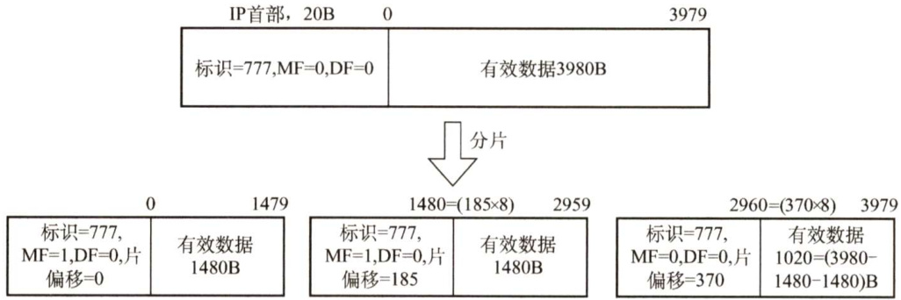  
图4.5IP分片的例子  

#### 4.3.2 IPv4地址与NAT  

#### 1.IPv4地址  

连接到因特网上的每台主机（或路由器）都分配一个32比特的全球唯一标识符，即IP地址。IP地址由互联网名字和数字地址分配机构ICANN进行分配。  

互联网早期采用的是分类的IP地址，如图4.6所示。  

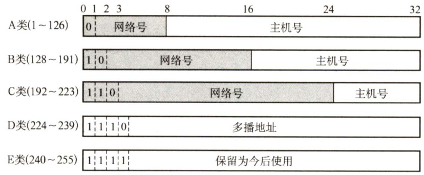  
图4.6分类的IP地址  

无论哪类IP地址，都由网络号和主机号两部分组成。即IP地址:: $=\{<$ 网络号 $>$ ，<主机号 $>3$ 。其中网络号标志主机（或路由器）所连接到的网络。一个网络号在整个因特网范围内必须是唯一的。主机号标志该主机（或路由器)。一台主机号在它前面的网络号所指明的网络范围内必须是唯一的。由此可见，一个IP地址在整个因特网范围内是唯一的。  

在各类IP地址中，有些IP地址具有特殊用途，不用做主机的IP地址：  

·主机号全为0表示本网络本身，如202.98.174.0。  
·主机号全为1表示本网络的广播地址，又称直接广播地址，如202.98.174.255。  
· $127.{\times.\times.\times}$ 保留为环回自检（LoopbackTest）地址，此地址表示任意主机本身，目的地址为环回地址的IP数据报永远不会出现在任何网络上。  
·32位全为0，即0.0.0.0表示本网络上的本主机。  
·32位全为1，即255.255.255.255表示整个TCP/IP网络的广播地址，又称受限广播地址。实际使用时，由于路由器对广播域的隔离，255.255.255.255等效为本网络的广播地址。  
常用的三种类别IP地址的使用范围见表4.1。  

表4.1常用的三种类别IP地址的使用范围  

<html><body><table><tr><td>网络类别</td><td>最大可用网络数</td><td>第一个可用的网络号</td><td>最后一个可用的网络号</td><td>每个网络中的最大主机数</td></tr><tr><td>A</td><td>2-2</td><td>1</td><td>126</td><td>224-2</td></tr><tr><td>B</td><td>214</td><td>128.0</td><td>191.255</td><td>216-2</td></tr><tr><td>C</td><td>221</td><td>192.0.0</td><td>223.255.255</td><td>2-2</td></tr></table></body></html>  

在表4.1中，A类地址可用的网络数为 $2^{7}-2$ ，减2的原因是：第一，网络号字段全为0的IP地址是保留地址，意思是“本网络”；第二，网络号为127的IP地址是环回自检地址。  

IP地址有以下重要特点：  

1）每个IP地址都由网络号和主机号两部分组成，因此IP地址是一种分等级的地址结构。分等级的好处是： $\textcircled{1}\mathrm{IP}$ 地址管理机构在分配IP地址时只分配网络号，而主机号则由得到该网络的单位自行分配，方便了IP地址的管理； $\textcircled{2}$ 路由器仅根据目的主机所连接的网络号来转发分组（而不考虑目标主机号)，从而减小了路由表所占的存储空间。  
2）IP地址是标志一台主机（或路由器）和一条链路的接口。当一台主机同时连接到两个网络时，该主机就必须同时具有两个相应的IP地址，每个IP地址的网络号必须与所在网络的网络号相同，且这两个IP地址的网络号是不同的。因此IP网络上的一个路由器必然至少应具有两个IP地址（路由器每个端口必须至少分配一个IP地址）。  
3）用转发器或桥接器（网桥等）连接的若干LAN仍然是同一个网络（同一个广播域)，因此该LAN中所有主机的IP地址的网络号必须相同，但主机号必须不同。  
4）在IP地址中，所有分配到网络号的网络（无论是LAN还是WAN）都是平等的。  
5）在同一个局域网上的主机或路由器的IP地址中的网络号必须是一样的。路由器总是具有两个或两个以上的IP地址，路由器的每个端口都有一个不同网络号的IP地址。  
近年来，由于广泛使用无分类IP地址进行路由选择，这种传统分类的IP地址已成为历史。  

#### 2.网络地址转换（NAT)  

网络地址转换（NAT）是指通过将专用网络地址（如Intranet）转换为公用地址（如Internet），从而对外隐藏内部管理的IP地址。它使得整个专用网只需要一个全球IP地址就可以与因特网连通，由于专用网本地IP地址是可重用的，所以NAT大大节省了IP地址的消耗。同时，它隐藏了内部网络结构，从而降低了内部网络受到攻击的风险。  

此外，为了网络安全，划出了部分IP 地址为私有IP地址。私有IP地址只用于LAN，不用于WAN连接（因此私有IP地址不能直接用于Internet，必须通过网关利用NAT把私有IP地址转换为Internet中合法的全球IP地址后才能用于Intermet)，并且允许私有IP地址被LAN重复使用。这有效地解决了IP地址不足的问题。私有IP地址网段如下：  

A类：1个A类网段，即 $\mathbf{10.0.0.0{\widetilde{\sim}}10.255.255.255}.$ 。B类：16个B类网段，即 $172.16.0.0{\sim}172.31.255.255$ 0C类：256个C类网段，即192.168.0.0～192.168.255.255。  

在因特网中的所有路由器，对目的地址是私有地址的数据报一律不进行转发。这种采用私有IP地址的互联网络称为专用互联网或本地互联网。私有IP地址也称可重用地址。  

使用NAT时需要在专用网连接到因特网的路由器上安装NAT软件，NAT路由器至少有一个有效的外部全球IP地址。使用本地地址的主机和外界通信时，NAT路由器使用NAT转换表进行本地IP地址和全球IP地址的转换。NAT转换表中存放着{本地IP地址：端口)到{全球IP地址：端口)的映射。通过这种映射方式，可让多个私有IP地址映射到一个全球IP地址。  

以宿舍共享上网为例，假设某个宿舍办理了2Mb/s的电信宽带，那么这个宿舍就获得了一个全球IP地址（如138.76.29.7），而宿舍内4台主机使用私有地址（如192.168.0.0网段)。宿舍的网关路由器应开启NAT功能，并且某时刻路由器上的NAT转换表见表4.2。那么，当路由器从LAN端口收到源IP及源端口号为192.168.0.2，2233的数据报时，就将其映射成138.76.29.7，5001，然后从WAN端口发送到因特网上。当路由器从WAN端口收到目的IP及目的端口号为138.76.29.7,5060的数据报时，就将其映射成192.168.0.3,1234，然后从LAN端口发送给相应的本地主机。这样，只需要一个全球地址，就可以让多台主机同时访问因特网。  

表4.2一个典型的NAT转换表  

<html><body><table><tr><td colspan="2">NAT转换表</td></tr><tr><td>WAN端</td><td>LAN端</td></tr><tr><td>138.76.29.7，5001</td><td>192.168.0.2，2233</td></tr><tr><td>138.76.29.7，5060</td><td>192.168.0.3，1234</td></tr><tr><td></td><td></td></tr></table></body></html>  

下面以图4.7为例来说明NAT路由器的工作原理： $\textcircled{1}$ 假设用户主机10.0.0.1（随机端口3345）向Web服务器128.119.40.186（端口80）发送请求。 $\textcircled{2}$ NAT路由器收到IP分组后，为该IP分组生成一个新端口号5001，将IP分组的源地址更改为138.76.29.7（即NAT路由器的全球IP地址)，将源端口号更改为5001。NAT路由器在NAT转换表中增加一个表项。 $\textcircled{3}$ Web服务器并不知道刚抵达的IP分组已被NAT路由器进行了改装，更不知道用户的专用地址，它响应的IP分组的目的地址是NAT路由器的全球IP地址，目的端口号是5001。 $\textcircled{4}$ 响应分组到达NAT路由器后，通过NAT转换表将IP分组的目的IP地址更改为10.0.0.1，将目的端口号更改为3345。  

<html><body><table><tr><td colspan="2">NAT转换表</td></tr><tr><td>WAN端</td><td>LAN端</td></tr><tr><td>138.76.29.7,5001</td><td>10.0.0.1,3345</td></tr></table></body></html>  

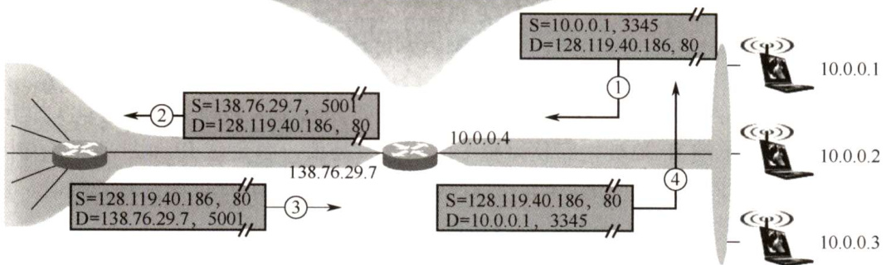  
图4.7NAT路由器的工作原理  

注意：普通路由器在转发IP数据报时，不改变其源IP地址和目的IP地址。而NAT路由器在转发IP数据报时，一定要更换其IP地址（转换源IP地址或目的IP地址）。普通路由器仅工作在网络层，而NAT路由器转发数据报时需要查看和转换传输层的端口号。  

#### 4.3.3 子网划分与子网掩码、CIDR  

#### 1．子网划分  

两级IP地址的缺点：IP地址空间的利用率有时很低；给每个物理网络分配一个网络号会使路由表变得太大而使网络性能变坏；两级的IP地址不够灵活。  

从1985年起，在IP地址中又增加了一个“子网号字段”，使两级IP地址变成了三级IP地址。这种做法称为子网划分。子网划分已成为因特网的正式标准协议。  

子网划分的基本思路如下：  

·子网划分纯属一个单位内部的事情。单位对外仍然表现为没有划分子网的网络。  
·从主机号借用若干比特作为子网号，当然主机号也就相应减少了相同的比特。三级IP地址的结构如下：IP地址 $=\{<$ 网络号 $>$ ，<子网号>，<主机号>}。  
·凡是从其他网络发送给本单位某台主机的IP数据报，仍然是根据IP数据报的目的网络号，先找到连接到本单位网络上的路由器。然后该路由器在收到IP数据报后，按目的网络号和子网号找到目的子网。最后把IP数据报直接交付给目的主机。  

注意：  

1）划分子网只是把IP地址的主机号这部分进行再划分，而不改变IP地址原来的网络号。因此，从一个IP地址本身或IP数据报的首部，无法判断源主机或目的主机所连接的网络是否进行了子网划分。  
2）RFC950规定，对分类的IPv4地址进行子网划分时，子网号不能为全1或全0。但随着CIDR的广泛使用，现在全1和全0的子网号也可使用，但一定要谨慎使用，要弄清你的路由器所用的路由选择软件是否支持全0或全1的子网号。  
3）不论是分类的IPv4地址还是CIDR，其子网中的主机号为全0或全1的地址都不能被指派。子网中主机号全0的地址为子网的网络号，主机号全1的地址为子网的广播地址。  

#### 2.子网掩码  

为了告诉主机或路由器对一个A类、B类、C类网络进行了子网划分，使用子网掩码来表达对原网络中主机号的借位。  

子网掩码是一个与IP地址相对应的、长32bit的二进制串，它由一串1和跟随的一串0组成。其中，1对应于IP地址中的网络号及子网号，而0对应于主机号。计算机只需将IP地址和其对应的子网掩码逐位“与”（逻辑AND运算)，就可得出相应子网的网络地址。  

现在的因特网标准规定：所有的网络都必须使用子网掩码。如果一个网络未划分子网，那么就采用默认子网掩码。A、B、C类地址的默认子网掩码分别为255.0.0.0、255.255.0.0、255.255.255.0。例如，某主机的IP地址192.168.5.56，子网掩码为255.255.255.0，进行逐位“与”运算后，得出该主机所在子网的网络号为192.168.5.0。  

由于子网掩码是一个网络或一个子网的重要属性，所以路由器在相互之间交换路由信息时，必须把自己所在网络（或子网）的子网掩码告诉对方。路由表中的每个条目，除要给出目的网络地址和下一跳地址外，还要同时给出该目的网络的子网掩码。  

在使用子网掩码的情况下：  

1）一台主机在设置IP地址信息的同时，必须设置子网掩码。  
2）同属于一个子网的所有主机及路由器的相应端口，必须设置相同的子网掩码。  
3）路由器的路由表中，所包含信息的主要内容有目的网络地址、子网掩码、下一跳地址。  

#### 3.无分类编址CIDR  

无分类域间路由选择CIDR是在变长子网掩码的基础上提出的一种消除传统A、B、C 类网络划分，并且可以在软件的支持下实现超网构造的一种IP地址的划分方法。  

例如，如果一个单位需要2000个地址，那么就给它分配一个2048地址的块（8个连续的C类网络)，而不是一个完全的B类地址。这样可以大幅度提高IP地址空间的利用率，减小路由器的路由表大小，提高路由转发能力。  

CIDR 消除了传统A、B、C 类地址及划分子网的概念，因而可以更有效地分配IPv4的地址空间。CIDR使用“网络前缀”的概念代替子网络的概念，与传统分类IP地址最大的区别就是，网络前缀的位数不是固定的，可以任意选取。CIDR的记法是：  

CIDR还使用“斜线记法”（或称CIDR记法)，即IP地址/网络前缀所占比特数。其中，网络前缀所占比特数对应于网络号的部分，等效于子网掩码中连续1的部分。例如，对于128.14.32.5/20这个地址，它的掩码是20个连续的1和后续12个连续的0，通过逐位相“与”的方法可以得到该地址的网络前缀（或直接截取前20位)：  

$\left\{\begin{array}{l l}{\mathrm{IP}=1000000000,00001110.00100000.00000101}\end{array}\right.$ 逐位与 掩码 $\mathbf{\Sigma}=\mathbf{\Sigma}$ 1111111 11110000.00000000 网络前缀 $=1000000000.00001110.0010000.00000000(128.14.32.0)$  

CIDR 虽然不使用子网，但仍然使用“掩码”一词。“CIDR不使用子网”是指CIDR并没有在32位地址中指明若干位作为子网字段。但分配到一个CIDR地址块的组织，仍可以在本组织内根据需要划分出一些子网。例如，某组织分配到地址块/20，就可以再继续划分为8个子网（从主机号中借用3位来划分子网)，这时每个子网的网络前缀就变成了23位。全0和全1的主机号地址一般不使用。  

将网络前缀都相同的连续IP 地址组成“CIDR地址块”。一个CIDR地址块可以表示很多地址，这种地址的聚合称为路由聚合，或称构成超网。路由聚合使得路由表中的一个项目可以表示多个原来传统分类地址的路由，有利于减少路由器之间的信息的交换，从而提高网络性能。  

例如，在如图4.8所示的网络中，如果不使用路由聚合，那么R1的路由表中需要分别有到网络1和网络2的路由表项。不难发现，网络1和网络2的网络前缀在二进制表示的情况下，前16 位都是相同的，第17位分别是0和1，并且从R1到网络1和网络2的路由的下一跳皆为R2。若使用路由聚合，在R1看来，网络1和网络2可以构成一个更大的地址块206.1.0.0/16，到网络1和网络2的两条路由就可以聚合成一条到206.1.0.0/16的路由。  

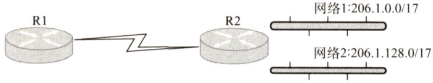  
图4.8路由聚合的例子  

CIDR地址块中的地址数一定是2的整数次幂，实际可指派的地址数通常为 $2^{N}-2$ ， $N$ 表示主机号的位数，主机号全0代表网络号，主机号全1为广播地址。网络前缀越短，其地址块所包含的地址数就越多。而在三级结构的IP地址中，划分子网使网络前缀变长。  

CIDR 的优点在于网络前缀长度的灵活性。由于上层网络的前缀长度较短，因此相应的路由表的项目较少。而内部又可采用延长网络前缀的方法来灵活地划分子网。  

最长前缀匹配（最佳匹配)：使用CIDR时，路由表中的每个项目由“网络前缀”和“下一跳地址”组成。在查找路由表时可能会得到不止一个匹配结果。此时，应当从匹配结果中选择具有最长网络前缀的路由，因为网络前缀越长，其地址块就越小，因而路由就越具体。  

CIDR查找路由表的方法：为了更加有效地查找最长前缀匹配，通常将无分类编址的路由表存放在一种层次式数据结构中，然后自上而下地按层次进行查找。这里最常用的数据结构就是二叉线索。  

#### 4.网络层转发分组的过程  

分组转发都是基于目的主机所在网络的，这是因为互联网上的网络数远小于主机数，可以极大地压缩转发表的大小。当分组到达路由器后，路由器根据目的IP地址的网络前缀来查找转发表，确定下一跳应当到哪个路由器。因此，在转发表中，每条路由必须有下面两条信息：  

（目的网络，下一跳地址）  

这样，IP数据报最终一定可以找到目的主机所在目的网络上的路由器（可能要通过多次间接交付)，当到达最后一个路由器时，才试图向目的主机进行直接交付。  

采用CIDR编址时，如果一个分组在转发表中可以找到多个匹配的前缀，那么应当选择前缀最长的一个作为匹配的前缀，称为最长前缀匹配。网络前缀越长，其地址块就越小，因而路由就越精准。为了更快地查找转发表，可以按照前缀的长短，将前缀最长的排在第1行，按前缀长度的降序排列。这样，从第1行最长的开始查找，只要检索到匹配的，就不必再继续查找。  

此外，转发表中还可以增加两种特殊的路由：  

1）主机路由：对特定目的主机的IP地址专门指明一个路由，以方便网络管理员控制和测试网络。若特定主机的IP地址是a.b.c.d，则转发表中对应项的目的网络是 a.b.c.d/32。/32表示的子网掩码没有意义，但这个特殊的前缀可以用在转发表中。  

2）默认路由：用特殊前缀0.0.0.0/0表示默认路由，全0掩码和任何目的地址进行按位与运算，结果必然为全0，即必然和转发表中的0.0.0.0/0相匹配。只要目的网络是其他网络（不在转发表中)，就一律选择默认路由。  

综上所述，归纳出路由器执行的分组转发算法如下：  

1）从收到的IP分组的首部提取目的主机的IP地址 $D$ （即目的地址）。  

2）若查找到特定主机路由（目的地址为 $D$ )，就按照这条路由的下一跳转发分组；否则从转发表中的下一条（即按前缀长度的顺序）开始检查，执行步骤3)。  

3）将这一行的子网掩码与目的地址 $D$ 进行按位与运算。若运算结果与本行的前缀匹配，则查找结束，按照“下一跳”指出的进行处理（或者直接交付本网络上的目的主机，或通过指定接口发送到下一跳路由器)。否则，若转发表还有下一行，则对下一行进行检查，重新执行步骤3)。否则，执行步骤4)。  

4）若转发表中有一个默认路由，则把分组传送给默认路由；否则，报告转发分组出错。  

值得注意的是，转发表（或路由表）并未给分组指明到某个网络的完整路径（即先经过哪个路由器，然再经过哪个路由器等)。转发表指出，到某个网络应当先到某个路由器（即下一跳路由器)，在到达下一跳路由器后，再继续查找其转发表，知道下一步应当到哪个路由器。这样一步一步地查找下去，直到最后到达目的网络。  

注意：得到下一跳路由器的IP地址后，并不是直接将该地址填入待发送的数据报，而是将  

该IP地址转换成MAC地址（通过ARP），将此MAC地址放到MAC帧首部中，然后根据这个MAC地址找到下一跳路由器。在不同网络中传送时，MAC帧中的源地址和目的地址要发生变化，但是网桥在转发帧时，不改变帧的源地址，请注意区分。  

#### 4.3.4 ARP、DHCP与ICMP  

#### 1.IP地址与硬件地址  

IP地址是网络层使用的地址，它是分层次等级的。硬件地址是数据链路层使用的地址（MAC地址)，它是平面式的。在网络层及网络层之上使用IP 地址，IP 地址放在IP 数据报的首部，而MAC 地址放在MAC帧的首部。通过数据封装，把IP数据报分组封装为MAC帧后，数据链路层看不见数据报分组中的IP地址。  

由于路由器的隔离，IP网络中无法通过广播MAC地址来完成跨网络的寻址，因此在网络层只使用IP地址来完成寻址。寻址时，每个路由器依据其路由表（依靠路由协议生成）选择到目标网络（即主机号全为0的网络地址）需要转发到的下一跳（路由器的物理端口号或下一网络地址)，而IP 分组通过多次路由转发到达目标网络后，改为在目标LAN中通过数据链路层的MAC地址以广播方式寻址。这样可以提高路由选择的效率。  

1）在IP层抽象的互联网上只能看到IP数据报。  
2）虽然在IP数据报首部中有源IP地址，但路由器只根据目的IP地址进行转发。  
3）在局域网的链路层，只能看见MAC帧。IP数据报被封装在MAC帧中，通过路由器转发IP 分组时，IP分组在每个网络中都被路由器解封装和重新封装，其MAC帧首部中的源地址和目的地址会不断改变。这也决定了无法使用MAC地址跨网络通信。  
4）尽管互联在一起的网络的硬件地址体系各不相同，但IP层抽象的互联网却屏蔽了下层这些复杂的细节。只要我们在网络层上讨论问题，就能够使用统一的、抽象的IP地址研究主机与主机或路由器之间的通信。  

注意：路由器由于互联多个网络，因此它不仅有多个 $\mathrm{IP}$ 地址，也有多个硬件地址。  

#### 2.地址解析协议(ARP)  

无论网络层使用什么协议，在实际网络的链路上传送数据帧时，最终必须使用硬件地址。所以需要一种方法来完成IP 地址到MAC 地址的映射，这就是地址解析协议（Address ResolutionProtocol，ARP)。每台主机都设有一个ARP高速缓存，用来存放本局域网上各主机和路由器的IP地址到MAC地址的映射表，称ARP表。使用ARP来动态维护此ARP表。  

ARP工作在网络层，其工作原理如下：主机A欲向本局域网上的某台主机B发送IP数据报时，先在其ARP 高速缓存中查看有无主机B的IP地址。如果有，就可查出其对应的硬件地址，再将此硬件地址写入MAC 帧，然后通过局域网将该MAC 帧发往此硬件地址。如果没有，那么就通过使用目的MAC地址为FF-FF-FF-FF-FF-FF 的帧来封装并广播ARP请求分组（广播发送)，使同一个局域网里的所有主机都收到此 ARP 请求。主机B收到该ARP请求后，向主机A发出ARP 响应分组（单播发送)，分组中包含主机B的IP与MAC地址的映射关系，主机A收到ARP响应分组后就将此映射写入ARP缓存，然后按查询到的硬件地址发送MAC帧。ARP由于“看到了”IP地址，所以它工作在网络层，而NAT路由器由于“看到了”端口，所以它工作在传输层。对于某个协议工作在哪个层次，读者应该能通过协议的工作原理进行猜测。  

注意：ARP用于解决同一个局域网上的主机或路由器的IP地址和硬件地址的映射问题。如果所要找的主机和源主机不在同一个局域网上，那么就要通过ARP找到一个位于本局域网上的某个路由器的硬件地址，然后把分组发送给这个路由器，让这个路由器把分组转发给下一个网络。  

剩下的工作就由下一个网络来做，尽管ARP请求分组是广播发送的，但ARP响应分组是普通的单播，即从一个源地址发送到一个目的地址。  

使用ARP的4种典型情况总结如下（见图4.9）：  

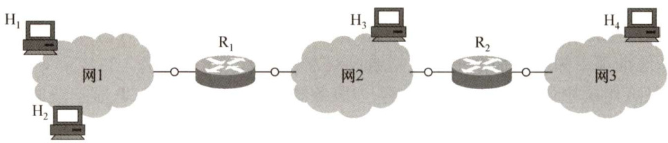  
图4.9使用ARP的4种典型情况  

1）发送方是主机（如 $\mathrm{H}_{1}$ )，要把IP数据报发送到本网络上的另一台主机（如 $\mathrm{H}_{2}$ )。这时 $\mathrm{H}_{1}$ 在网1用ARP找到目的主机 $\mathrm{H}_{2}$ 的硬件地址。2）发送方是主机（如 $\mathrm{H}_{1}$ )，要把IP数据报发送到另一个网络上的一台主机（如 $\mathrm{H}_{3}$ )。这时$\mathrm{H}_{\mathrm{l}}$ 用ARP找到与网1连接的路由器 $\vert{\sf R}_{1}$ 的硬件地址，剩下的工作由 $\mathrm{R}_{1}$ 来完成。3）发送方是路由器（如 $\mathbf{R}_{1}$ )，要把IP数据报转发到与 $\mathrm{R}_{1}$ 连接的网络（网2）上的一台主机（如 $\mathrm{H}_{3}$ )。这时 $\mathrm{R}_{\mathrm{l}}$ 在网2用ARP找到目的主机 $\mathrm{H}_{3}$ 的硬件地址。4）发送方是路由器（如 $\mathrm{R}_{\mathrm{l}}$ )，要把IP数据报转发到网3上的一台主机（如 $\mathrm{H}_{4}$ )。这时 $\mathrm{R}_{1}$ 在网2用ARP找到与网2连接的路由器 ${\bf R}_{2}$ 的硬件地址，剩下的工作由 ${\bf R}_{2}$ 来完成。从 IP 地址到硬件地址的解析是自动进行的，主机的用户并不知道这种地址解析过程。只要主机或路由器和本网络上的另一个已知IP地址的主机或路由器进行通信，ARP就会自动地将这个IP地址解析为数据链路层所需要的硬件地址。  

#### 3.动态主机配置协议（DHCP）  

动态主机配置协议（Dynamic HostConfiguration Protocol，DHCP）常用于给主机动态地分配IP 地址，它提供了即插即用的联网机制，这种机制允许一台计算机加入新的网络和获取IP 地址而不用手工参与。DHCP是应用层协议，它是基于UDP的。  

DHCP的工作原理如下：使用客户/服务器模式。需要IP地址的主机在启动时就向DHCP 服务器广播发送发现报文，这时该主机就成为DHCP客户。本地网络上所有主机都能收到此广播报文，但只有DHCP服务器才回答此广播报文。DHCP服务器先在其数据库中查找该计算机的配置信息。若找到，则返回找到的信息。若找不到，则从服务器的IP地址池中取一个地址分配给该计算机。DHCP服务器的回答报文称为提供报文。  

DHCP服务器和DHCP客户端的交换过程如下：  

1）DHCP客户机广播“DHCP发现”消息，试图找到网络中的DHCP服务器，以便从DHCP服务器获得一个IP地址。源地址为0.0.0.0，目的地址为255.255.255.255。  
2）DHCP服务器收到“DHCP发现”消息后，广播“DHCP提供”消息，其中包括提供给DHCP客户机的IP地址。源地址为DHCP服务器地址，目的地址为255.255.255.255。  
3）DHCP客户机收到“DHCP提供”消息，如果接受该IP地址，那么就广播“DHCP请求”消息向DHCP服务器请求提供IP地址。源地址为0.0.0.0，目的地址为255.255.255.255。  
4）DHCP服务器广播“DHCP确认”消息，将IP地址分配给DHCP客户机。源地址为DHCP服务器地址，目的地址为255.255.255.255。  

DHCP允许网络上配置多台DHCP服务器，当DHCP客户机发出“DHCP发现”消息时，有可能收到多个应答消息。这时，DHCP客户机只会挑选其中的一个，通常挑选最先到达的。  

DHCP 服务器分配给DHCP客户的IP地址是临时的，因此DHCP客户只能在一段有限的时间内使用这个分配到的IP地址。DHCP称这段时间为租用期。租用期的数值应由DHCP服务器自己决定，DHCP客户也可在自己发送的报文中提出对租用期的要求。  

DHCP的客户端和服务器端需要通过广播方式来进行交互，原因是在DHCP执行初期，客户端不知道服务器端的IP地址，而在执行中间，客户端并未被分配IP地址，从而导致两者之间的通信必须采用广播的方式。采用UDP而不采用TCP的原因也很明显：TCP需要建立连接，如果连对方的IP地址都不知道，那么更不可能通过双方的套接字建立连接。  

DHCP是应用层协议，因为它是通过客户/服务器模式工作的，DHCP客户端向DHCP服务器请求服务，而其他层次的协议是没有这两种工作方式的。  

#### 4.网际控制报文协议（ICMP）  

为了提高IP数据报交付成功的机会，在网络层使用了网际控制报文协议（IntermetControlMessageProtocol，ICMP）来让主机或路由器报告差错和异常情况。ICMP报文作为IP层数据报的数据，加上数据报的首部，组成IP数据报发送出去。ICMP是IP层协议。  

ICMP报文的种类有两种，即ICMP差错报告报文和ICMP询问报文。  

ICMP差错报告报文用于目标主机或到目标主机路径上的路由器向源主机报告差错和异常情况。共有以下5种类型：  

1）终点不可达。当路由器或主机不能交付数据报时，就向源点发送终点不可达报文。  
2）源点抑制。当路由器或主机由于拥塞而丢弃数据报时，就向源点发送源点抑制报文，使源点知道应当把数据报的发送速率放慢。  
3）时间超过。当路由器收到生存时间（TTL）为零的数据报时，除丢弃该数据报外，还要向源点发送时间超过报文。当终点在预先规定的时间内不能收到一个数据报的全部数据报片时，就把已收到的数据报片都丢弃，并向源点发送时间超过报文。  
4）参数问题。当路由器或目的主机收到的数据报的首部中有的字段的值不正确时，就丢弃该数据报，并向源点发送参数问题报文。  
5）改变路由（重定向)。路由器把改变路由报文发送给主机，让主机知道下次应将数据报发送给另外的路由器(可通过更好的路由)。  

不应发送ICMP差错报告报文的几种情况如下：  

1）对ICMP差错报告报文不再发送ICMP差错报告报文。  
2）对第一个分片的数据报片的所有后续数据报片都不发送ICMP差错报告报文。  
3）对具有组播地址的数据报都不发送ICMP差错报告报文。  
4）对具有特殊地址（如127.0.0.0或0.0.0.0）的数据报不发送ICMP差错报告报文。  

ICMP询问报文有4种类型：回送请求和回答报文、时间戳请求和回答报文、地址掩码请求和回答报文、路由器询问和通告报文，最常用的是前两类。  

ICMP 的两个常见应用是分组网间探测PING(用来测试两台主机之间的连通性)和Traceroute（UNIX中的名字，在Windows 中是Tracert，可以用来跟踪分组经过的路由)。其中PING 使用了ICMP 回送请求和回答报文，Traceroute（Tracert）使用了ICMP时间超过报文。  

注意：PING工作在应用层，它直接使用网络层的ICMP，而未使用传输层的TCP或UDP。Traceroute/Tracert工作在网络层。  

#### 4.3.5 本节习题精选  

#### 一、单项选择题  

01．Internet的网络层含有4个重要的协议，分别为（）。  

A.IP，ICMP，ARP，UDP B.TCP，ICMP，UDP，ARP C.IP，ICMP，ARP，RARP D.UDP，IP，ICMP，RARP  

02．以下关于IP分组结构的描述中，错误的是（）。  

A.IPv4分组头的长度是可变的B.协议字段表示IP的版本，值为4表示IPv4C．分组头长度字段以4B为单位，总长度字段以字节为单位D.生存时间字段值表示一个分组可以经过的最多的跳数  

03.IPv4分组首部中有两个有关长度的字段：首部长度和总长度，其中（）。  

A.首部长度字段和总长度字段都以8bit为计数单位 B．首部长度字段以8bit为计数单位，总长度字段以32bit为计数单位 C．首部长度字段以32bit为计数单位，总长度字段以8bit为计数单位 D.首部长度字段和总长度字段都以32bit为计数单位  

04.IP分组中的检验字段检查范围是（）。  

A．整个IP分组 B.仅检查分组首部C.仅检查数据部分 D．以上皆检查  

D5.当数据报到达目的网络后，要传送到目的主机，需要知道IP地址对应的（）  

A．逻辑地址 B．动态地址 C.域名 D.物理地址  

06．如果IPv4的分组太大，会在传输中被分片，那么在（）将对分片后的数据报重组  

A．中间路由器 B．下一跳路由器 C.核心路由器 D．目的主机  

07.在IP首部的字段中，与分片和重组无关的字段是（）。  

A．总长度 B．标识 C.标志 D.片偏移  

8．以下关于IP分组的分片与组装的描述中，错误的是（）。  

A.IP分组头中与分片和组装相关的字段是：标识、标志与片偏移   
B.IP分组规定的最大长度为65535B   
C.以太网的MTU为1500B   
D.片偏移的单位是4B  

09.以下关于IP分组分片基本方法的描述中，错误的是（）。  

A.IP分组长度大于MTU时，就必须对其进行分片  
B. $\mathrm{DF}=1$ ，分组的长度又超过MTU时，则丢弃该分组，不需要向源主机报告  
C.分片的MF值为1表示接收到的分片不是最后一个分片  
D．属于同一原始IP分组的分片具有相同的标识  

10.路由器R0的路由表见右表。若进入路由器R0的分组的目的地址为132.19.237.5，该分组应该被转发到（）下一跳路由器。  

A.R1 B. R2   
C.R3 D. R4  

<html><body><table><tr><td>目的网络</td><td>下一跳</td></tr><tr><td>132.0.0.0/8</td><td>R1</td></tr><tr><td>132.19.0.0/11</td><td>R2</td></tr><tr><td>132.19.232.0/22</td><td>R3</td></tr><tr><td>0.0.0.0/0</td><td>R4</td></tr></table></body></html>  

11.IP规定每个C类网络最多可以有（）台主机或路由器。  

A.254 B. 256 C.32 D. 1024  

12．下列地址中，属于子网86.32.0.0/12的地址是（）。  

A.86.33.224.123 B. 86.79.65.126   
C. 86.79.65.216 D. 86.68.206.154  

13．下列地址中，属于单播地址的是（）。  

A.172.31.128.255/18 B. 10.255.255.255   
C.192.168.24.59/30 D. 224.105.5.211  

14．下列地址中，属于本地回路地址的是（）。  

A.10.10.10.1 B.255.255.255.0 C.192.0.0.1 D. 127.0.0.1  

15.访问因特网的每台主机都需要分配IP地址（假定采用默认子网掩码），下列可以分配给主机的IP地址是（）。  

A.192.46.10.0 B.110.47.10.0 C.127.10.10.17 D. 211.60.256.21  

16.为了提供更多的子网，为一个B类地址指定了子网掩码255.255.240.0，则每个子网最多可以有的主机数是（）。  

A.16 B.256 C. 4094 D. 4096  

17.不考虑NAT，在Intermet中，IP数据报从源结点到目的结点可能需要经过多个网络和路由器。在整个传输过程中，IP数据报头部中的（）。  

A．源地址和目的地址都不会发生变化B.源地址有可能发生变化而目的地址不会发生变化C．源地址不会发生变化而目的地址有可能发生变化D.源地址和目的地址都有可能发生变化  

18．把IP网络划分成子网，这样做的好处是（）。  

A.增加冲突域的大小 B．增加主机的数量C.减少广播域的大小 D.增加网络的数量  

19.一个网段的网络号为198.90.10.0/27，最多可以分成（）个子网，每个子网最多具有（）个有效的IP地址。  

A.8，30 B.4，62 C.16，14 D.32，6  

0．一台主机有两个IP地址，一个地址是192.168.11.25，另一个地址可能是（）。  

A.192.168.11.0 B. 192.168.11.26   
C.192.168.13.25 D. 192.168.11.24  

21.CIDR技术的作用是（）。  

A.把小的网络汇聚成大的超网B．把大的网络划分成小的子网C.解决地址资源不足的问题D.由多台主机共享同一个网络地址  

22.CIDR地址块 $192.168.10.0/20$ 所包含的IP地址范围是（ $\textcircled{1}$ )。与地址192.16.0.19/28同属于一个子网的主机地址是（ $\textcircled{2}$ ）。  

$\textcircled{1}$ A.192.168.0.0\~192.168.12.255 B. 192.168.10.0\~ 192.168.13.255 C. 192.168.10.0\~192.168.14.255 D. 192.168.0.0\~192.168.15.255 $\textcircled{2}$ A. 192.16.0.17 B. 192.16.0.31 C. 192.16.0.15 D.192.16.0.14  

23．路由表错误和软件故障都可能使得网络中的数据形成传输环路而无限转发环路的分组IPv4协议解决该问题的方法是（）。  

A．报文分片 B．设定生命期C．增加校验和 D.增加选项字段  

24.为了解决IP地址耗尽的问题，可以采用以下一些措施，其中治本的是（）。  

A．划分子网 B．采用无类比编址CIDRC．采用网络地址转换NAT D．采用IPv6  

25．下列对IP分组的分片和重组的描述中，正确的是（）。  

A.IP分组可以被源主机分片，并在中间路由器进行重组B.IP分组可以被路径中的路由器分片，并在目的主机进行重组C.IP分组可以被路径中的路由器分片，并在中间路由器上进行重组D.IP分组可以被路径中的路由器分片，并在最后一跳的路由器上进行重组  

26.一个网络中有几个子网，其中一个已分配了子网号74.178.247.96/29，则下列网络前缀中不能再分配给其他子网的是（）。  

A.74.178.247.120/29 B.74.178.247.64/29   
C. 74.178.247.96/28 D.74.178.247.104/29  

27.主机A和主机B的IP地址分别为216.12.31.20和216.13.32.21，要想让A和B工作在同一个IP子网内，应该给它们分配的子网掩码是（）。  

A.255.255.255.0 B. 255.255.0.0   
C. 255.255.255.255 D. 255.0.0.0  

28.某单位分配了1个B类地址，计划将内部网络划分成35个子网，将来可能增加16个子网，每个子网的主机数目接近800台，则可行的掩码方案是（）。  

A.255.255.248.0 B.255.255.252.0 C. 255.255.254.0 D. 255.255.255.  

29.设有4条路由172.18.129.0/24、172.18.130.0/24、172.18.132.0/24和172.18.133.0/24，如果进行路由聚合，那么能覆盖这4条路由的地址是（）。  

A.172.18.128.0/21 B. 172.18.128.0/22   
C.172.18.130.0/22 D. 172.18.132.0/23  

30．某子网的子网掩码为255.255.255.224，一共给4台主机分配了IP地址，其中一台因IP地址分配不当而存在通信故障。这一台主机的IP地址是（）。  

A.202.3.1.33 B.202.3.1.65 C. 202.3.1.44 D.202.3.1.55  

31.位于不同子网中的主机之间相互通信时，下列说法中正确的是（）。  

A．路由器在转发IP数据报时，重新封装源硬件地址和目的硬件地址B．路由器在转发IP数据报时，重新封装源IP地址和目的IP地址C．路由器在转发IP数据报时，重新封装目的硬件地址和目的IP地址D.源站点可以直接进行ARP广播得到目的站点的硬件地址  

32.根据NAT协议，下列IP地址中（）不允许出现在因特网上。  

A.192.172.56.23 B.172.15.34.128   
C.192.168.32.17 D. 172.128.45.34  

33.假定一个NAT路由器的公网地址为205.56.79.35，并且有如下表项：  

<html><body><table><tr><td>转换端口</td><td>源IP地址</td><td>源端 口</td></tr><tr><td>2056</td><td>192.168.32.56</td><td>21</td></tr><tr><td>2057</td><td>192.168.32.56</td><td>20</td></tr><tr><td>1892</td><td>192.168.48.26</td><td>80</td></tr><tr><td>2256</td><td>192.168.55.106</td><td>80</td></tr></table></body></html>  

它收到一个源IP地址为192.168.32.56、源端口为80的分组，其动作是（）。  

A．转换地址，将源IP变为205.56.79.35，端口变为2056，然后发送到公网  
B．添加一个新的条目，转换IP地址及端口然后发送到公网  
C.不转发，丢弃该分组  
D.直接将分组转发到公网  

34.下列情况需要启动ARP请求的是（）。  

A．主机需要接收信息，但ARP表中没有源IP地址与MAC地址的映射关系B．主机需要接收信息，但ARP表中已有源IP地址与MAC地址的映射关系C．主机需要发送信息，但ARP表中没有目的IP地址与MAC地址的映射关系D．主要需要发送信息，但ARP表中已有目的IP地址与MAC地址的映射关系  

5.ARP的工作过程中，ARP请求是（）发送，ARP响应是（）发送。  

A.单播 B.组播 C.广播  

36.主机发送IP数据报给主机B，途中经过了5个路由器。请问在此过程中总共使用了（）次ARP。  

A.5 B.6 C.10 D.11  

37．可以动态为主机配置IP地址的协议是（）。  

A. ARP B.RARP C.DHCP D.NAT  

38.下列关于ICMP报文的说法中，错误的是（）。  

A.ICMP报文封装在数据链路层帧中发送B.ICMP报文用于报告IP数据报发送错误C.ICMP报文封装在IP数据报中发送D.ICMP报文本身出错将不再处理  

39.以下关于ICMP的描述中，错误的是（）。  

A.IP缺乏差错控制机制  
B.IP缺乏主机和网络管理查询机制  
C.ICMP报文分为差错报告和查询两类  
D.作为IP的补充，ICMP报文将直接封装在以太帧中  

40.以下关于ICMP差错报文的描述中，错误的是（）。  

A．对于已经携带ICMP差错报文的分组，不再产生ICMP差错报文  
B．对于已经分片的分组，只对第一个分片产生ICMP差错报文  
C.PING使用了ICMP差错报文  
D.对于组播的分组，不产生ICMP差错报文  

41.【2010统考真题】某网络的IP地址空间为192.168.5.0/24，采用定长子网划分，子网掩码为255.255.255.248，则该网络中的最大子网个数、每个子网内的最大可分配地址个数分别是（）。  

A.32，8 B.32，6 C.8,32 D.8，30  

42.【2010统考真题】若路由器R因为拥塞丢弃IP分组，则此时R可向发出该IP分组的源主机发送的ICMP报文类型是（）。  

A.路由重定向 B．目的不可达 C.源点抑制 D．超时  

43.【2011统考真题】在子网192.168.4.0/30中，能接收目的地址为192.168.4.3的IP分组的最大主机数是（）。  

A.0 B.1 C.2 D.4  

44.【2012统考真题】某主机的IP地址为180.80.77.55，子网掩码为255.255.252.0。若该主机向其所在子网发送广播分组，则目的地址可以是（）。  

A.180.80.76.0 B.180.80.76.255   
C.180.80.77.255 D. 180.80.79.255  

45.【2012统考真题】ARP的功能是（）。  

A.根据IP地址查询MAC地址 B.根据MAC地址查询IP地址 C.根据域名查询IP地址 D.根据IP地址查询域名  

46.【2012统考真题】在TCP/IP体系结构中，直接为ICMP提供服务的协议是（）。  

A.PPP B.IP C. UDP D. TCP  

47.【2015统考真题】某路由器的路由表如下所示：  

<html><body><table><tr><td>目的网络</td><td>下一跳</td><td>接 口</td></tr><tr><td>169.96.40.0/23</td><td>176.1.1.1</td><td>S1</td></tr><tr><td>169.96.40.0/25</td><td>176.2.2.2</td><td>S2</td></tr><tr><td>169.96.40.0/27</td><td>176.3.3.3</td><td>S3</td></tr><tr><td>0.0.0.0/0</td><td>176.4.4.4</td><td>S4</td></tr></table></body></html>  

若路由器收到一个目的地址为169.96.40.5的IP分组，则转发该IP分组的接口是（）。  

A.S1 B. S2 C. S3 D. S4  

48.【2016统考真题】如下图所示，假设H1与H2的默认网关和子网掩码均分别配置为192.168.3.1和255.255.255.128，H3和H4的默认网关和子网掩码均分别配置为192.168.3.254和255.255.255.128，则下列现象中可能发生的是（）。  

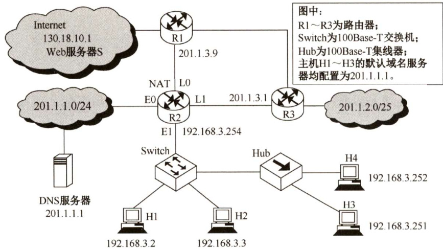  

A.H1不能与H2进行正常IP通信 B.H2与H4均不能访问InternetC.H1不能与H3进行正常IP通信 D.H3不能与H4进行正常IP通信  

49.【2016统考真题】在题35图中，假设连接R1、R2和R3之间的点对点链路使用地址$201.1.3.\mathrm{x}/30$ ，当H3访问Web服务器S时，R2转发出去的封装HTTP请求报文的IP分组是源IP地址和目的IP地址，它们分别是（）。  

A.192.168.3.251，130.18.10.1 B.192.168.3.251，201.1.3.9  
C.201.1.3.8，130.18.10.1 D. 201.1.3.10，130.18.10.1  

50.【2017统考真题】若将网络21.3.0.0/16划分为128个规模相同的子网，则每个子网可分配的最大IP地址个数是（）。  

A.254 B.256 C. 510 D. 512  

51.【2017统考真题】下列IP地址中，只能作为IP分组的源IP地址但不能作为目的 $\mathrm{IP}$ 地址的是（）。  

A.0.0.0.0 B. 127.0.0.1   
C. 200.10.10.3 D. 255.255.255.255  

52.【2018统考真题】某路由表中有转发接口相同的4条路由表项，其目的网络地址分别为35.230.32.0/21、35.230.40.0/21、35.230.48.0/21和35.230.56.0/21，将该4条路由聚合后的目的网络地址为（）。  

A.35.230.0.0/19 B. 35.230.0.0/20   
C.35.230.32.0/19 D. 35.230.32.0/20  

53.【2018统考真题】路由器R通过以太网交换机S1和S2连接两个网络，R的接口、主机H1和H2的IP地址与MAC地址如下图所示。若H1向H2发送一个IP分组P，则H1发出的封装P的以太网帧的目的MAC地址、H2收到的封装P的以太网帧的源MAC地址分别是（）。  

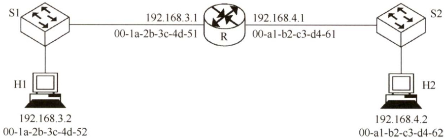  

A.00-a1-b2-c3-d4-62，00-1a-2b-3c-4d-52   
B.00-a1-b2-c3-d4-62，00-a1-b2-c3-d4-61   
C.00-1a-2b-3c-4d-51，00-1a-2b-3c-4d-52   
D.00-1a-2b-3c-4d-51，00-a1-b2-c3-d4-61  

54.【2019统考真题】若将101.200.16.0/20划分为5个子网，则可能的最小子网的可分配IP地址数是（）。  

A.126 B.254 C.510 D. 1022  

55.【2021统考真题】现将一个IP网络划分为3个子网，若其中一个子网是192.168.9.128/26，则下列网络中，不可能是另外两个子网之一的是（）。  

A.192.168.9.0/25 B.192.168.9.0/26  
C.192.168.9.192/26 D. 192.168.9.192/27  

56.【2021统考真题】若路由器向 $\mathrm{MTU}=800\mathrm{B}$ 的链路转发一个总长度为1580B的IP数据报（首部长度为20B）时，进行了分片，且每个分片尽可能大，则第2个分片的总长度字段和MF标志位的值分别是（）。  

A.796,0 B.796,1 C. 800,0 D. 800,1  

#### 二、综合应用题  

01．一个IP分组报头中的首部长度字段值为101（二进制），而总长度字段值为101000（二进制)。请问该分组携带了多少字节的数据？  

02．一个数据报长度为4000B（固定头部长度）。现在经过一个网络传送，但此网络能够传送的最大数据长度为1500B。试问应当划分为几个短一些的数据报片？各数据片段的数据字段长度、片段偏移字段和MF标志应为何值？  

03．某网络的一台主机产生了一个IP数据报，头部长度为20B，数据部分长度为2000B。该数据报需要经过两个网络到达目的主机，这两个网络所允许的最大传输单位（MTU）分别为1500B和576B。问原IP数据报到达目的主机时分成了几个IP小报文？每个报文的数据部分长度分别是多少？  
04.如果到达的分组的片偏移值为100，分组首部中的首部长度字段值为5，总长度字段值为100，那么数据部分第一个字节的编号是多少？能够确定数据部分最后一个字节的编号吗？  
05.设目的地址为201.230.34.56，子网掩码为255.255.240.0，试求子网地址。  
06.在4个“/24”地址块中进行最大可能的聚合：212.56.132.0/24、212.56.133.0/24、212.56.134.0/24、212.56.135.0/24。  
07．现有一公司需要创建内部网络，该公司包括工程技术部、市场部、财务部和办公室4个部门，每个部门有 $20\sim30$ 台计算机。试问：1）若要将几个部门从网络上分开，如果分配给该公司使用的地址为一个C类地址，网络地址为192.168.161.0，那么如何划分网络？可以将几个部门分开？2）确定各部门的网络地址和子网掩码，并写出分配给每个部门网络中的主机IP地址范围。  

08．某路由器具有右表所示的路由表项。  

1）假设路由器收到两个分组：分组A的目的地址为131.128.55.33，分组B的目的地址为131.128.55.38。确定路由器为这两个分组选择的下一跳，并加以说明。  

2）在路由表中增加一个路由表项，它使以131.128.55.33为目的地址的IP分组选择“A”作为下一跳，而不影响其他目的地址的IP分组的转发。  
3）在路由表中增加一个路由表项，使所有目的地址与该路由表中任何路由表项都不匹配的IP分组被转发到下一跳“E”。  
4）将131.128.56.0/24划分为4个规模尽可能大的等长子网，给出子网掩码及每个子网的可分配地址范围。  

<html><body><table><tr><td>网络前缀</td><td>下一跳</td></tr><tr><td>131.128.56.0/24</td><td>A</td></tr><tr><td>131.128.55.32/28</td><td>B</td></tr><tr><td>131.128.55.32/30</td><td>C</td></tr><tr><td>131.128.0.0/16</td><td>D</td></tr></table></body></html>  

09.下表是使用无类别域间路由选择（CIDR）的路由选择表，地址字段是用十六进制表示的，试指出具有下列目标地址的IP分组将被投递到哪个下一站？  

<html><body><table><tr><td>网络/掩码长度</td><td>下一站地</td><td>C4.68.0.0/14</td><td>D</td></tr><tr><td>C4.50.0.0/12</td><td>A</td><td>80.0.0.0/1</td><td>E</td></tr><tr><td>C4.5E.10.0/20</td><td>B</td><td>40.0.0.0/2</td><td>F</td></tr><tr><td>C4.60.0.0/12</td><td>C</td><td>00.0.0.0/2</td><td>G</td></tr></table></body></html>  

1）C4.5E.13.87 2)C4.5E.22.09 3)C3.41.80.02 4）5E.43.91.12  

10.一个自治系统有5个局域网，如下图所示，LAN2至LAN5上的主机数分别为91、150、3和15，该自治系统分配到的IP地址块为30.138.118/23，试给出每个局域网的地址块（包括前缀）。  

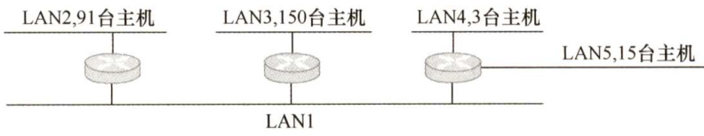  

11.某个网络地址块192.168.75.0中有5台主机A、B、C、D和E，主机A的IP地址为192.168.75.18，主机B的IP地址为192.168.75.146，主机C的IP地址为192.168.75.158，主机D的IP地址为192.168.75.161，主机E的IP地址为192.168.75.173，共同的子网掩码是255.255.255.240。请回答：  

1）5台主机A、B、C、D、E分属几个网段？哪些主机位于同一网段？主机D的网络地址为多少？  
2）若要加入第6台主机F，使它能与主机A属于同一网段，其IP地址范围是多少？  
3）若在网络中另加入一台主机，其IP地址为192.168.75.164，它的广播地址是多少？哪些主机能够收到？  

12.【2009统考真题】某网络拓扑图如下图所示，路由器R1通过接口E1、E2分别连接局域网1、局域网2，通过接口L0连接路由器R2，并通过路由器R2连接域名服务器与互联网。R1的L0接口的IP地址是202.118.2.1；R2的L0接口的IP地址是202.118.2.2，L1接口的IP地址是130.11.120.1，E0接口的IP地址是202.118.3.1；域名服务器的IP地址是202.118.3.2。  

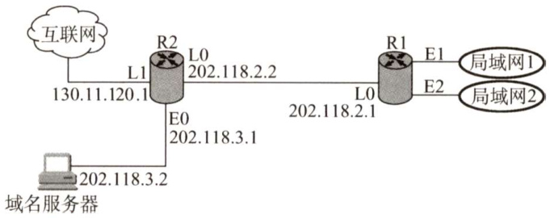  

R1和R2的路由表结构如下：  

<html><body><table><tr><td>目的网络IP地址</td><td>子网掩码</td><td>下一跳IP地址</td><td>接口</td></tr></table></body></html>  

1）将IP地址空间202.118.1.0/24划分为两个子网，分别分配给局域网1和局域网2，每个局域网需分配的IP地址数不少于120个。请给出子网划分结果，说明理由或给出必要的计算过程。  

2）请给出R1的路由表，使其明确包括到局域网1的路由、局域网2的路由、域名服务器的主机路由和互联网的路由。  

3）请采用路由聚合技术，给出R2到局域网1和局域网2的路由。  

13．一个IPv4分组到达一个结点时，其首部信息（以十六进制表示）为： $0\times450000540003$ $58~50~20~06~\mathrm{FF~F0~7C~4E~03~02~B4~0E~0F~02}$ 。请回答：  

1）分组的源IP地址和目的IP地址各是什么（点分十进制表示法）？  
2）该分组数据部分的长度是多少？  
3）该分组是否已经分片？如果有分片，那么偏移量是多少？  

14.主机A的IP地址为218.207.61.211，MAC地址为00:1d:72:98:1d:fc。A收到一个帧，该帧的前64个字节的十六进制形式和ASCII形式如下图所示。  

<html><body><table><tr><td>0000</td><td>001d</td><td></td><td>72</td><td>98</td><td>1d</td><td>fc</td><td>00</td><td>00</td><td>5e</td><td>00</td><td>01</td><td>01</td><td>88</td><td>64</td><td>11</td><td>00</td><td></td><td></td></tr><tr><td>0010</td><td>75</td><td>89</td><td>01</td><td>92</td><td>00</td><td>21</td><td>45</td><td>00</td><td>01</td><td>90</td><td>f9</td><td>bf</td><td>40</td><td>00</td><td>33</td><td>06</td><td>u. !E.</td><td>d @.3.</td></tr><tr><td>0020</td><td>f3</td><td>15</td><td>da</td><td>c7</td><td>66</td><td>28</td><td></td><td>da cf</td><td>3d</td><td>d3</td><td>00</td><td>50</td><td>c4</td><td>8f</td><td>dc</td><td>a6</td><td></td><td></td></tr><tr><td>0030</td><td>a2</td><td>96</td><td>23</td><td>4c</td><td>44</td><td>69</td><td>50</td><td>18</td><td>00</td><td>of</td><td>76</td><td>3d</td><td>00</td><td>00</td><td>90</td><td>b5</td><td>#LDiP</td><td></td></tr></table></body></html>  

IP分组首部如右图所示。以太网帧的结构参见第3章。问：  

1）主机A所在网络的网关路由器的相应端口的MAC地址是多少？  
2)该IP分组所携带的数据量为多少字节？  
3）若该分组需要被路由器转发到一条MTU为380B的链路上，则路由器将做何种操作？  

<html><body><table><tr><td></td><td></td><td></td><td colspan="2"></td></tr><tr><td>版本</td><td>首部 长度</td><td>服务类型</td><td colspan="2">总长度</td></tr><tr><td colspan="3">标识</td><td>标志</td><td>片偏移</td></tr><tr><td colspan="2">生存时间(TTL)</td><td>协议</td><td colspan="2">首部校验和</td></tr><tr><td colspan="2"></td><td colspan="3">源IP地址</td></tr><tr><td colspan="2">目的IP地址</td><td colspan="2"></td></tr></table></body></html>  

15.【2015统考真题】某网络拓扑如下图所示，其中路由器内网接口、DHCP服务器、WWW服务器与主机1均采用静态IP地址配置，相关地址信息见图中标注；主机2～主机 $N$ 通过DHCP服务器动态获取IP地址等配置信息。  

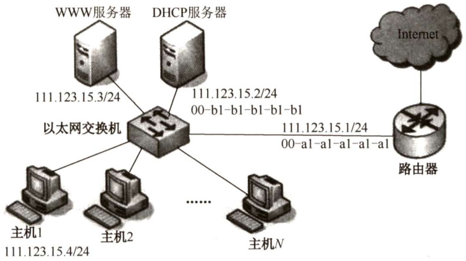  

回答下列问题：  

1）DHCP服务器可为主机 $2\sim N$ 动态分配IP地址的最大范围是什么？主机2使用DHCP获取IP地址的过程中，发送的封装DHCPDiscover报文的IP分组的源IP地址和目的IP地址分别是多少？  
2）若主机2的ARP表为空，则该主机访问Internet时，发出的第一个以太网帧的目的MAC地址是什么？封装主机2发往Internet的IP分组的以太网帧的目的MAC地址是什么？  
3）若主机1的子网掩码和默认网关分别配置为255.255.255.0和111.123.15.2，则该主机是否能访问WWW服务器？是否能访问Internet？请说明理由。  

16.【2018统考真题】某公司的网络如下图所示。IP地址空间192.168.1.0/24均分给销售部和技术部两个子网，并已分别为部分主机和路由器接口分配了IP地址，销售部子网的$\mathbf{MTU}=1500\mathrm{B}$ ，技术部子网的 $\mathbf{MTU}=800\mathbf{B}$ 6  

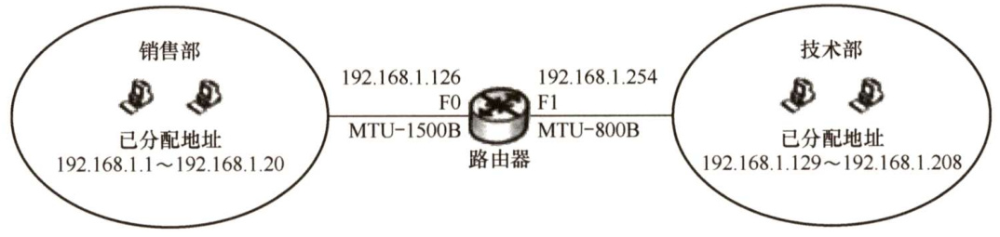  

回答下列问题：  

1)销售部子网的广播地址是什么？技术部子网的子网地址是什么？若每台主机仅分配一个IP地址，则技术部子网还可以连接多少台主机？  
2）假设主机192.168.1.1向主机192.168.1.208发送一个总长度为1500B的IP分组，IP分组的头部长度为20B，路由器在通过接口F1转发该IP分组时进行了分片。若分片时尽可能分为最大片，则一个最大IP分片封装数据的字节数是多少？至少需要分为几个分片？每个分片的片偏移量是多少？  

17.【2020统考真题】某校园网有两个局域网，通过路由器R1、R2和R3互联后接入Intermet，S1和S2为以太网交换机。局域网采用静态IP地址配置，路由器部分接口以及各主机的IP地址如下图所示。  

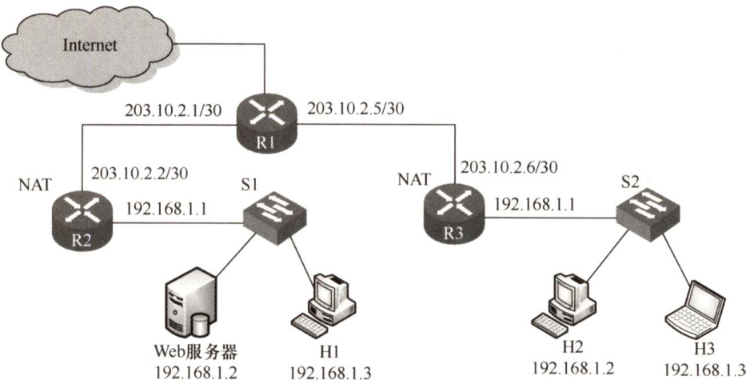  

假设NAT转换表结构为  

<html><body><table><tr><td colspan="2">外网</td><td colspan="2">内网</td></tr><tr><td>IP地址</td><td>端口号</td><td>IP地址</td><td>端口号</td></tr><tr><td></td><td></td><td></td><td></td></tr></table></body></html>  

请回答下列问题：  

1）为使H2和H3能够访问Web服务器（使用默认端口号），需要进行什么配置？  
2）若H2主动访问Web服务器时，将HTTP请求报文封装到IP数据报P中发送，则H2发送的P的源IP地址和目的IP地址分别是什么？经过R3转发后，P的源IP地址和目的IP地址分别是什么？经过R2转发后，P的源IP地址和目的IP地址分别是什么？  

#### 4.3.6 答案与解析  

#### 一、单项选择题  

01.CTCP 和UDP是传输层协议，IP、ICMP、ARP、RARP（逆地址解析协议）是网络层协议。  

02.B  

协议字段表示使用IP 的上层协议，如值为6表示TCP，值为17表示UDP。版本字段表示IP的版本，值为4表示IPv4，值为6表示IPv6。  

03.C  

在首部中有三个关于长度的标记：首部长度、总长度和片偏移，基本单位分别为4B、1B和  

8B。IP分组的首部长度必须是4B的整数倍，取值范围是 $5\sim15$ （默认值是5)。由于IP分组的首部长度是可变的，因此首部长度字段必不可少。总长度字段给出IP分组的总长度，单位是字节，包括分组首部和数据部分的长度。数据部分的长度可以从总长度减去分组首部长度计算。  

04.B  

IP分组的校验字段仅检查分组的首部信息，不包括数据部分。  

05.D  

在数据链路层，MAC地址用来标识主机或路由器，数据报到达具体的目的网络后，需要知道目的主机的MAC地址才能成功送达，因此需要将IP地址转换成对应的MAC地址，即物理地址。  

06.D  

数据报被分片后，每个分片都将独立地传输到目的地，其间有可能会经过不同的路径，而最后在目的端主机分组才能被重组。  

07.A  

在IP首部中，标识字段的用途是让目标机器确认一个新到达的分片是否属于同一个数据报，用于重组分片后的IP数据报。标志字段中的DF表示是否允许分片，MF表示后面是否还有分片。片偏移则指出分组在分片后某片在原分组中的相对位置。  

08.D  

片偏移标识该分片所携带数据在原始分组所携带数据中的相对位置，以8B为单位。  

09.B  

如果分组长度超过MTU，那么当 $\mathrm{DF}=1$ 时，丢弃该分组，并且要用ICMP差错报文向源主机报告；当 ${\mathrm{DF}}=0$ 时，进行分片， $\mathbf{MF}=1$ 表示后面还有分片。  

10.B  

对于A选项，132.19.237.5的前8位与132.0.0.0/8匹配。而B选项中，132.19.237.5的前11位与 $132.0.0.0/11$ 匹配。C选项中，132.19.237.5的前22位与132.19.232.0/22不匹配。根据“最长前缀匹配原则”，该分组应该被转发到R2。D选项为默认路由，只有当前面的所有目的网络都不能和分组的目的IP地址匹配时才使用。  

11.A  

在分类的IP网络中，C类地址的前24位为网络位，后8位为主机位，主机位全“0”表示网络号，主机位全“1”表示广播地址，因此最多可以有 $2^{8}-2=254$ 台主机或路由器。  

12.A  

CIDR地址块86.32.0.0/12的网络前缀为12位，说明第2个字节的前4位在前缀中，第2个字节32的二进制形式为00100000。给出的4个地址的前8位均相同，而第2个字节的前4位分别是0010,0100,0100,0100，所以本题答案为A。  

13.A  

10.255.255.255为A类地址，主机号全1，代表网络广播，为广播地址。192.168.24.59/30为CIDR地址，只有后面2位为主机号，而59用二进制表示为00111011，可知主机号全1，代表网络广播，为广播地址。224.105.5.211为D类组播地址。  

14.D  

所有形如127.xx.yy.zz的IP地址，都作为保留地址，用于回路测试。  

15.B  

A是C类地址，掩码为255.255.255.0，由此得知A地址的主机号为全0（未使用CIDR），因此不能作为主机地址。C是为回环测试保留的地址。D是语法错误的地址，不允许有256。B为A类地址，其网络号是110，主机号是47.10.0。  

16.C  

由于 $240_{10}=11110000_{2}$ ，所以共有12比特位用于主机地址，且主机位全0和全1不能使用，所以最多可以有的主机数为 $2^{12}-2=4094$ 。  

17.A  

在Intemet中，IP数据报从源结点到目的结点可能需要经过多个网络和路由器。当一个路由器接收到一个IP数据报时，路由器根据IP 数据报首部的目的IP 地址进行路由选择，并不改变源IP地址的取值。即使IP数据报被分片时，原IP数据报的源IP 地址和目的IP地址也将复制到每个分片的首部，因此在整个传输过程中，IP数据报首部的源IP地址和目的IP地址都不发生变化。  

18.C  

划分子网可以增加子网的数量，子网之间的数据传输需要通过路由器进行，因此自然就减少了广播域的大小。另外，划分子网，由于子网号占据了主机号位，所以会减少主机的数量；划分子网仅提高IP地址的利用率，并不增加网络的数量。  

19.A  

由题可知，主机号有5位，若主机号只占1位，则没有有效的IP地址可供分配（排除0和1就没有了），最少2位表示主机号，因此还剩3位可以表示子网号，所以最多可以分成8个子网。而当5位都表示主机数，即只有1个子网时，每个子网最多具有30个有效的IP地址（除去了全0和全1)。  

20.C  

如果一台主机有两个或两个以上的IP 地址，那么说明这台主机属于两个或两个以上的逻辑网络。值得注意的是，在同一时刻一个合法的IP 地址只能分配给一台主机，否则就会引起IP 地址冲突。IP地址192.168.11.25属于C类IP地址，所以A、B、D同属于一个逻辑网络，只有C的网络号不同，表明它在不同的逻辑网络。  

21.A  

CIDR是一种归并网络的技术，CIDR技术的作用是把小的网络汇聚成大的超网。  

22.D、A  

CIDR 地址由网络前缀和主机号两部分组成，CIDR 将网络前缀都相同的连续IP地址组成“CIDR地址块”。网络前缀的长度为20位，主机号为12位，因此 $192.168.0.0/20$ 地址块中的地址数为 $2^{12}$ 个。其中，当主机号为全0时，取最小地址192.168.0.0。当主机号全为1时，取最大地址192.168.15.255。注意，这里并不是指可分配的主机地址。  

对于192.16.0.19/28，表示子网掩码为255.255.255.240。IP地址192.16.0.19与IP 地址192.16.0.17所对应的前28位数相同，都是1100000000010000000000000001，所以IP 地址192.16.0.17是子网192.16.0.19/28的一台主机地址。注意，主机号全0和全1的地址不使用。  

23.B  

为每个IP分组设定生存时间（TTL)，每经过一个路由器，TTL减1，TTL为O时，路由器就不再转发该分组。因此可以避免分组在网络中无限循环下去。  

24.D  

最初设计的分类IP地址，由于每类地址所能连接的主机数大大超过一般单位的需求量，从而造成了IP地址的浪费。划分子网通过从网络的主机号借用若干比特作为子网号，从而使原来较大规模的网络细分为几个规模较小的网络，提高了IP地址的利用率。  

CIDR 是比划分子网更为灵活的一种手段，它消除了A、B、C类地址及划分子网的概念。使用各种长度的网络前缀来代替分类地址中的网络号和子网号，将网络前缀都相同的IP地址组成“CIDR 地址块”。网络前缀越短，地址块越大。因特网服务提供者再根据客户的具体情况，分配合适大小的CIDR地址块，从而更加有效地利用IPv4的地址空间。  

采用网络地址转换（NAT)，可以使一些使用本地地址的专用网连接到因特网上，进而使得一些机构的内部主机可以使用专用地址，只需给此机构分配一个IP地址即可，并且这些专用地址是可重用的—其他机构也可使用，所以大大节省了IP地址的消耗。  

尽管以上三种方法可以在一定阶段内有效缓解IP地址耗尽的危机，但无论是从计算机本身发展来看还是从因特网的规模和传输速率来看，现在的IPv4地址已很不适用，所以治本的方法还是使用128bit编址的IPv6地址。  

25.B  

当路由器准备将IP分组发送到网络上，而该网络又无法将整个分组一次发送时，路由器必须将该分组分片，使其长度能满足这一网络对分组长度的限制。IP分片可以独立地通过各个路径发送，而且在传输过程中仍然存在分片的可能（不同网络的MTU可能不同)，因此不能由中间路由器进行重组。分片后的IP分组直至到达目的主机后才能汇集在一起，并且甚至不一定以原先的次序到达。这样，进行接收的主机都要求支持重组能力。  

26.C  

解析请扫右侧二维码查阅。  

27.D  

本题实际上就是要求找一个子网掩码，使得A和B的IP地址与该子网掩码逐位相“与”之后得到相同的结果。D选项与A、B相“与”的结果均为216.0.0.0。  

28.B  

未进行子网划分时，B类地址有16位作为主机位。由于共需要划分51个子网， $2^{5}<51<2^{6}$ 那么需要从主机位划出6位作为子网号，剩下的10位主机位可容纳的主机数为1022（即 $2^{10}-2$ ）台主机，满足题目要求。因此子网掩码为255.255.252.0。  

29.A  

4条路由的前24位（3个字节）为网络前缀，前2个字节都一样，因此只需要比较第3个字节即可， $129=10000001$ ， $130=10000010$ ， $132=10000100$ ， $133=10000101$ 。前5位是完全相同的，因此聚合后的网络的掩码中，1的数量应该是 $8+8+5=21$ ，聚合后的网络的第3个字节应该是 $100000000=128\$ ，因此答案为172.18.128.0/21。  

30.B  

在本题的条件下，某主机不能正常通信意味着它的IP地址与其他三台主机不在同一个子网。子网掩码255.255.255.224（表明前27位是网络号）可以划分为 $2^{3}=8$ 个子网，其中前3个子网的地址范围为202.3.1.1 ${\sim}30$ 。 $33{\sim}62$ 。 $65{\sim}94$ （全0或全1的不能作为主机地址)。可以看出B选项属于子网202.3.1.64，而其余3项属于子网202.3.1.32。  

31.A  

IP数据报的首部既有源IP地址，又有目的IP地址，但在通信中路由器只会根据目的IP地址进行路由选择。IP数据报在通信过程中，首部的源IP地址和目的IP地址在经过路由器时不会发生改变。ARP广播只在子网中传播，由于相互通信的主机不在同一个子网内，因此不可以直接通过 ARP广播得到目的站的硬件地址。硬件地址只具有本地意义，因此每当路由器将IP数据报转发到一个具体的网络中时，都需要重新封装源硬件地址和目的硬件地址。  

注意：路由器在接收到分组后，剥离该分组的数据链路层协议头，然后在分组被转发之前，给分组加上一个新的链路层协议头。  

32.C  

NAT协议保留了3段IP地址供内部使用，这3段地址如下：  

A类：1个A类网段，即 $\mathbf{10.0.0.0{\widetilde{\sim}}10.255.255.255}$ ，主机数16777216。  
B类：16个B类网段，即 $\mathbf{172.16.0.0{\sim}172.31.255.}255$ ，主机数1048576。  
C类：256个C类网段，即 $192.168.0.0{\sim}192.168.255.255$ ，主机数65536。  
所以只有C选项是内部地址，不允许出现在因特网上。  

33.C  

NAT 的表项需要管理员添加，这样才能控制一个内网到外网的网络连接。题目中主机发送的分组在NAT表项中找不到（端口80从源端口而非转换端口找)，所以服务器不转发该分组。  

34.C  

当源主机要向本地局域网上的某主机发送IP数据报时，先在其ARP高速缓存中查看有无目的 IP地址与MAC 地址的映射。若有，就把这个硬件地址写入MAC 帧，然后通过局域网把该MAC帧发往此硬件地址；若没有，则先通过广播ARP请求分组，在获得目的主机的ARP响应分  

组后，将目的主机的IP地址与硬件地址的映射写入ARP高速缓存。如果目的主机不在本局域网上，那么将IP 分组发送给本局域网上的路由器，当然要先通过同样的方法获得路由器的IP地址和硬件地址的映射关系。  

35.C、A  

由于不知道目标设备在哪里，所以ARP请求必须使用广播方式。但是ARP请求包中包含有发送方的MAC地址，因此应答时应该使用单播方式。  

36.B  

主机先使用ARP来查询本网络路由器的地址，然后每个路由器使用ARP来寻找下一跳路由的地址，总共使用了4次ARP从主机A网络的路由器到达主机B网络的路由器。然后，主机B网络的路由器使用ARP找到主机B，所以总共使用了 $1+4+1=6$ 次ARP。  

37.CDHCP提供了一种机制，使得使用DHCP可自动获得IP的配置信息而无须手工干预。  

38.A  

ICMP属于IP层协议，ICMP报文作为 $\mathrm{IP}$ 层数据报的数据，加上IP数据报的首部，组成 $\mathrm{IP}$ 数据报发送出去。  

39.DICMP是一个网络层协议，但是其文仍然要封装在IP分组中发送。  

40.CPING使用了ICMP的询问报文中的回送请求和回答报文。  

41.B  

由于该网络的IP地址为 $192.168.5.0/24$ ，网络号为前24位，后8位为子网号 $^+$ 主机号。子网掩码为255.255.255.248，第4个字节248转换成二进制为11111000，因此后8位中，前5位用于子网号，在CIDR中可以表示 $2^{5}=32$ 个子网；后3位用于主机号，除去全0和全1的情况，可以表示 $2^{3}-2=6$ 台主机地址。  

42.C  

ICMP差错报告报文有5种：终点不可达、源点抑制、时间超过、参数问题、改变路由（重定向)，其中源点抑制是指在路由器或主机由于拥塞而丢弃数据报时，向源点发送源点抑制报文，使源点知道应当把数据报的发送速率放慢。  

43.C  

解析请扫右侧二维码查阅。  

44.D子网掩码的第3个字节为11111100，可知前22位为子网号、后10位为主机号。IP地址的第  

3个字节为01001101（下画线为子网号的一部分)，将主机号（即后10位）全置为1，可以得到广播地址为180.80.79.255。  

45.A  

在实际网络的数据链路层上传送数据时，最终必须使用硬件地址，ARP将网络层的IP地址解析为数据链路层的MAC地址。  

46.B  

ICMP报文作为数据字段封装在IP分组中，因此IP直接为ICMP提供服务。UDP和TCP都是传输层协议，为应用层提供服务。PPP是数据链路层协议，为网络层提供服务。  

47.C  

根据“最长前缀匹配原则”，169.96.40.5与169.96.40.0的前27位匹配最长，因此选C。选项D 为默认路由，只有当前面的所有目的网络都不能和分组的目的IP地址匹配时才使用。  

48.C  

从子网掩码可知H1和H2处于同一网段，H3和H4处于同一网段，分别可以进行正常的IP通信，A和D错误。因为R2的E1接口的IP地址为192.168.3.254，而H2的默认网关为192.168.3.1，所以H2不能访问Internet，而H4 的默认网关为192.168.3.254，所以H4可以正常访问Internet，B错误。由H1、H2、H3和H4的子网掩码可知H1、H2和H3、H4处于不同的网段，需通过路由器才能进行正常的IP通信，而这时H1和H2的默认网关为192.168.3.1，但R2的E1接口的IP地址为192.168.3.254，无法进行通信，从而H1不能与H3进行正常的IP通信。C正确。  

49.D  

由题意知连接 R1、R2 和R3之间的点对点链路使用 $201.1.3.\mathrm{x}/30$ 地址，其子网掩码为255.255.255.252，R1的一个接口的IP地址为201.1.3.9,转换为对应的二进制的后8位为0000 1001（由 $201.1.3.\mathrm{x}/30$ 知，IP地址对应的二进制的后两位为主机号，而主机号全为0表示本网络本身，主机号全为1表示本网络的广播地址，不用于源IP地址或目的IP地址)，那么除201.1.3.9外，只有IP地址为201.1.3.10可以作为源IP地址使用（本题为201.1.3.10)。Web服务器的IP地址为130.18.10.1，作为IP分组的目的IP地址。综上可知，D正确。  

50.C  

这个网络有16位的主机号，平均分成128个规模相同的子网，每个子网有7位的子网号，9位的主机号。除去一个网络地址和广播地址，可分配的最大IP地址个数是 $2^{9}-2=512-2=510$ 。  

51.A  

0.0.0.0/32可以作为本主机在本网络上的源地址。127.0.0.1是回送地址，以它为目的IP地址的数据将被立即返回本机。200.10.10.3是C类IP地址。255.255.255.255是广播地址。  

52.C  

对于此类题目，先分析需要聚合的IP地址。观察发现，题中的四个路由地址，前16位完全  

相同，不同之处在于第3段的8位中，将这8位展开写成二进制，分别如下：  

<html><body><table><tr><td></td><td>7</td><td>6</td><td>5</td><td>4</td><td>3</td><td>2</td><td>1</td><td>0</td></tr><tr><td>32</td><td>0</td><td>0</td><td>1</td><td>0</td><td>0</td><td>0</td><td>0</td><td>0</td></tr><tr><td>40</td><td>0</td><td>0</td><td>1</td><td>0</td><td>1</td><td>0</td><td>0</td><td>0</td></tr><tr><td>48</td><td>0</td><td>0</td><td>1</td><td>1</td><td>0</td><td>0</td><td>0</td><td>0</td></tr><tr><td>56</td><td>0</td><td>0</td><td></td><td>1</td><td>1</td><td>0</td><td>0</td><td>0</td></tr></table></body></html>  

观察发现，四个地址的第3段中，从前向后最多有3位相同，因此这3位是能聚合的最大位数。将这些相同的位都保留，将第3段第3位之后的所有位都置0，就得到了聚合后的IP地址：35.230.32.0，其网络前缀为 $16+3$ ，也即前19位，因此聚合后的网络地址为35.230.32.0/19。  

53.D  

在网络的信息传递中，会经常用到两个地址：MAC 地址和IP地址。其中，MAC地址会随着信息被发往不同的网络而改变，但IP地址当且仅当信息在私人网络中传递时才会改变。分组P在如题图所示的网络中传递时，首先由主机H1将分组发往路由器R，此时源MAC地址为H1主机本身的MAC 地址，即 00-1a-2b-3c-4d-52，目的MAC 地址为路由器R 的MAC 地址，即00-1a-2b-3c-4d-51。路由器R收到分组P后，根据分组P的目的IP地址，得知应将分组从另一个端口转发出去，于是会给分组P更换新的MAC地址，此时由于从另外的端口转发出去，因此P的新源MAC地址变为负责转发的端口MAC地址，即00-al-b2-c3-d4-61，目的MAC地址应为主机H2的MAC地址，即00-al-b2-c3-d4-62。根据分析过程，题目所问的MAC地址应为路由器R两个端口的MAC地址，因此选D。  

54.B  

网络前缀为20位，将101.200.16.0/20划分为5个子网，为了保证有子网的可分配IP地址数尽可能小，即要让其他子网的可分配IP地址数尽可能大，不能采用平均划分的方法，而要采用变长的子网划分方法，也就是最大子网用1位子网号，第二大子网用2位子网号，以此类推。  

子网1：101.200.00010000.00000001～101.200.00010111.11111110；地址范围为 $101.200.16.1/21\sim$   
101.200.23.254/21；可分配的IP地址数为2046个。子网 2：101.200.00011000.00000001～101.200.00011011.1111110；地址范围为101.200.24.1/22～  
101.200.27.254/22；可分配的IP地址数为1022个。子网3：101.200.00011100.00000001 $\sim$ 101.200.00011101.11111110；地址范围为101.200.28.1/23～  
101.200.29.254/23；可分配的IP地址数为510个。子网4:101.200.00011110.00000001 $\sim$ 101.200.00011110.11111110；地址范围为101.200.30.1/24～  
101.200.30.254/24；可分配的IP地址数为254个。子网5：101.200.00011111.00000001 $\sim$ 101.200.00011111.11111110；地址范围为101.200.31.1/24～  
101.200.31.254/24；可分配的IP地址数为254个。综上所述，可能的最小子网的可分配IP地址数是254个。  

55.B  

解析请扫右侧二维码查阅。  

56.B  

链路层 $\mathrm{\DeltaMTU=800B}$ 。IP分组首部长 $20\mathrm{B}$ 。片偏移以8个字节为偏移单位，因此除了最后一个分片，其他每个分片的数据部分长度都是8B的整数倍。所以，最大IP分片的数据部分长度为776B。在总长度为1580B的IP数据报中，数据部分占1560B， $1560\mathrm{B}/776\mathrm{B}=2.01\cdots$ ，需要分成3片。故第2个分片的总长度字段为796，MF为1（表示还有后续的分片）。  

#### 二、综合应用题  

01.【解答】  

要求出分组所携带数据的长度，就需要分别知道首部的长度和分组的总长度。解题的关键在于弄清首部长度的字段和总长度字段的单位。由于首部长度字段的单位是4B，101的十进制为5，所以首部长度 $=5{\times}4=20\mathrm{B}$ 。而总长度字段的单位是字节，101000的十进制为40，所以总长度为40B，因此分组携带的数据长度为 $40-20=20\mathrm{B}$ 。  

02.【解答】  

数据报长度为4000B，有效载荷为 $4000-20=3980\mathrm{B}$ 。网络能传送的最大有效载荷为 $1500-20=$ 1480B，因此应分为3个短些的片，各片的数据字段长度分别为1480、1480和1020B。片段偏移字段的单位为8B， $1480/8=185$ ， $(1480\times2)/8=370$ ，因此片段偏移字段的值分别为0、185、370。 ${\mathrm{MF}}=1$ 时，代表后面还有分片； ${\mathrm{MF}}=0$ 时，代表后面没有分片，因此MF字段的值分别为1、1和0（注意，${\mathrm{MF}}=0$ 不能确定是独立的数据报，还是分片得来的，只有当 ${\mathrm{MF}}=0$ 且片段偏移字段 $>0$ 时，才能确定是分片的最后一个分片)。  

03.【解答】  

在 IP 层下面的每种数据链路层都有自己的帧格式，其中包括帧格式中的数据字段的最大长度，这称为最大传输单位（MTU）。 $1500-20=1480$ ， $2000-1480=520$ ，所以原IP数据报经过第一个网络后分成了两个IP小报文，第一个报文的数据部分长度是 $1480\mathrm{B}$ ，第二个报文的数据部分长度是520B。  

（除最后一个报片外的）所有报片的有效载荷都是8B的倍数。 $576-20=556$ ，但556不能被8整除，所以分片时的数据部分最大只能取552。第一个报文经过第2个网络后， $1480-552\times2=376<$ 576，变成数据长度分别为552B、552B、376B的3个IP小报文；第2个报文 $520<552$ ，因此不用分片。因此到达目的主机时，原2000B的数据被分成数据长度分别为552B、552B、376B、520B的4个小报文。  

04.【解答】  

分片的片偏移值表示其数据部分首字节在原始分组的数据部分中的相对位置，单位为 8B。首部长度字段以4B为单位，总长度字段以字节为单位。题目中，分组的片偏移值为100，因此其数据部分第一个字节的编号是800。因为分组的总长度为100B，首部长度为 $4\times5=20\mathrm{B}$ ，所以数据部分长度为80B。因此该分组的数据部分的最后一个字节的编号是879。  

05.【解答】  

通过将目的地址和子网掩码换算成二进制，并进行逐位“与”就可得到子网地址。但是通常在目的地址中，子网掩码为255所对应的部分在子网地址中不变，子网掩码为0所对应的部分在子网地址中为0，其他部分按二进制逐位“与”求得（也可直接截取)。本题中，子网掩码的前两部分为255.255，因此子网地址的前两部分为201.230；子网掩码最后一部分为0，因此子网地址的最后一部分为0；子网地址的第三部分为240，进行换算有 $240=(11110000)_{2}$ ， $34=(00100010)_{2}$ 逐位相“与”得 $(00100000)_{2}=32\$ 。因此子网地址为201.230.32.0。  

06.【解答】  

由于一个CIDR地址块中可以包含很多地址，所以路由表中就利用CIDR地址块来查找目的网络，这种地址的聚合常称为路由聚合。  

本题已知有212.56.132.0/24、212.56.133.0/24、212.56.134.0/24、212.56.135.0/24地址块，可知第3字节前6位相同，因此共同前缀为 $8+8+6=22$ 位，由于这4个地址块的第1、2个字节相同，考虑它们的第3个字节： $132=(10000100)_{2}$ ， $133=(10000101)_{2}$ ， $134=(10000110)_{2}$ ， $135=(10000111)_{2}$ ·所以共同的前缀有22位，即1101010000111000100001，聚合的CIDR地址块是 $212.56.132.0/22$ 8  

07.【解答】  

1）可以采用划分子网的方法对该公司的网络进行划分。由于该公司包括4个部门，共需要划分为4个子网。  

2）已知网络地址192.168.161.0是一个C类地址，所需的子网数为4，每个子网的主机数为 $20\sim$ 30。由于子网号和主机号不允许为全0或全1，因此子网号的比特数为3，即最多有 $2^{3}-2=6$ 个可分配的子网，主机号的比特数为5，即每个子网最多有 $2^{5}-2=30$ 个可分配的IP地址。4个部门子网的子网掩码均为255.255.255.224，各部门的网络地址与部门主机的IP地址范围可分配如下：  

<html><body><table><tr><td>部门</td><td>部门网络地址</td><td>主机IP地址范围</td></tr><tr><td>工程技术部</td><td>192.168.161.32</td><td>192.168.161.33~192.168.161.62</td></tr><tr><td>市场部</td><td>192.168.161.64</td><td>192.168.161.65~192.168.161.94</td></tr><tr><td>财务部</td><td>192.168.161.96</td><td>192.168.161.97~192.168.161.126</td></tr><tr><td>办公室</td><td>192.168.161.128</td><td>192.168.161.129~192.168.161.158</td></tr></table></body></html>  

08.【解答】  

1）使用CIDR时，可能会导致有多个匹配结果，应当从当前匹配结果中选择具有最长网络前缀的路由。下面来一一分析分组A与表中这四项的匹配性：$\textcircled{1}$ 131.128.56.0/24与31.128.55.33不匹配，因为前24位不同。$\textcircled{2}$ 131.128.55.32/28与131.128.55.33的前24位匹配，只需看后面4位是否匹配，32转换为二进制为00100000，33转换为二进制为00100001，匹配，且匹配了28位。$\textcircled{3}$ 131.128.55.32/30与131.128.55.33的前24位匹配，只需要看后面6位是否匹配，32转换为二进制为00100000，33转换为二进制为00100001，匹配，且匹配了30位。$\textcircled{4}$ 131.128.0.0/16与131.128.55.33匹配，且匹配了16位。综上，对于分组A，第2、3、4项都能与之匹配，但根据最长网络前缀匹配原则，应该选择网络前缀为131.128.55.32/30的表项进行转发，下一跳路由器为C。同理，对于分组B，路由表中第2和4项都能与之匹配，但是根据最长网络前缀匹配原则，应该选择第2个路由表项转发，下一跳路由器为B。  

2）要想该路由表项使得以131.128.55.33为目的地址的IP分组选择“A”作为下一跳，而不影响其他目的地址的IP分组转发，只需构造1条网络前缀和该地址匹配32位的项即可。增加的表项为：网络前缀131.128.55.33/32；下一跳A。  

3）增加1条默认路由：网络前缀 $\phantom{-}0.0.0.0/0$ ；下一跳E。  

4）要划分成4个规模尽可能大的子网，需要从主机位中划出2位作为子网位（ $2^{2}=4$ ，CIDR广泛使用之后允许子网位可以全0和全1)。子网掩码均为11111111111111111111111111000000，即255.255.255.192。而地址范围中不能包含主机位全0或全1的地址。  

<html><body><table><tr><td>子 网</td><td>子网掩码</td><td>地址范围</td></tr><tr><td>131.128.56.0/26</td><td>255.255.255.192</td><td>131.128.56.1~131.128.56.62</td></tr><tr><td>131.128.56.64/26</td><td>255.255.255.192</td><td>131.128.56.65~131.128.56.126</td></tr><tr><td>131.128.56.128/26</td><td>255.255.255.192</td><td>131.128.56.129~131.128.56.190</td></tr><tr><td>131.128.56.192/26</td><td>255.255.255.192</td><td>131.128.56.193~131.128.56.254</td></tr></table></body></html>  

09.【解答】  

1）网络号 $\mathrm{C}4.5\mathrm{E}.10.0/20$ （下一站地是B）的第3字节可以用二进制表示成 $00010000$ 。目标地址C4.5E.13.87的第3字节可以用二进制表示成 $00010011$ ，显然取20位掩码与网络号C4.5E.10.0/20相匹配，所以具有该目标地址的IP分组将被投递到下一站地B。  

2）网络号 ${\mathrm{C}}4.50.0.0/12{\$ （下一站地是A）的第2字节可以用二进制表示成01010000。目标地址C4.5E.22.09的第2字节可以用二进制表示成01011110，显然取12位掩码与网络号C4.50.0.0/12相匹配，所以具有该目的地址的IP分组将被投递到下一站地A。  

3）网络号 $80.0.0.0/1$ （下一站地是E）的第1字节可以用二进制表示成10000000。目标地址C3.41.80.02的第1字节可以用二进制表示成11000011，显然取1位掩码与网络号80.0.0.0/1相匹配，所以具有该目标地址的IP分组将被投递到下一站地E。  

4）网络号40.0.0.0/2（下一站地是F）的第1字节可以用二进制表示成01000000。目标地址5E.43.91.12的第1字节可以用二进制表示成01011110，显然取2位掩码与网络号40.0.0.0/2相匹配，所以具有该目标地址的IP分组将被投递到下一站地F。  

10.【解答】  

分配网络前缀应先分配地址数较多的前缀。已知该自治系统分配到的IP地址块为30.138.[18/23（注意： $\textcircled{1}$ 一个路由器端口也需要占用一个IP地址； $\textcircled{2}$ 子网划分的答案不唯一)。  

LAN3：主机数150，由于 $(2^{7}-2)<150+1<(2^{8}-2)$ ，所以主机号为8bit，网络前缀为24。取第24位为0，分配地址块 $30.138.118.0/24.$ 。  

LAN2：主机数91，由于 $(2^{6}-2)<91+1<(2^{7}-2)$ ，所以主机号为7bit，网络前缀为25。取第24、25位为10，分配地址块 $30.138.119.0/25$ 。  

LAN：土机数为I)，田于 $(2^{4}-2)<15+1<(2^{5}-2)$ ，所以王机亏为5bit，网络肌缀27。取弟24、25、26、27位为1110，分配地址块 $30.138.119.192/27.$ 。  

LAN1：共有3个路由器，再加上一个网关地址，至少需要4个IP地址。由于 $(2^{2}-2)<3+1<$ $(2^{3}-2)$ ，所以主机号为3bit，网络前缀为29。取第24、25、26、27、28、29位为111101，分配地址块30.138.119.232/29。  

LAN4：主机数为3，由于 $(2^{2}-2)<3+1<(2^{3}-2)$ ，所以主机号为3bit，网络前缀29。取第24、25、26、27、28、29位为111110，分配地址块30.138.119.240/29。  

11.【解答】  

1）共同的子网掩码为255.255.255.240，表示前28位为网络号，同一网段内的IP地址具有相同的网络号。主机A的网络号为192.168.75.16；主机B的网络号为192.168.75.144;  

主机C的网络号为192.168.75.144；主机D的网络号为192.168.75.160；主机E的网络号为192.168.75.160。因此5台主机A、B、C、D、E分属3个网段，主机B和C在一个网段，主机D和E在一个网段，A主机在一个网段。主机D的网络号为192.168.75.160。  

2）主机F与主机A同在一个网段，所以主机F所在的网段为192.168.75.16，第4个字节16的二进制表示为 $00010000$ ，最后边的4位为主机位，去掉全0和全1。则其IP地址范围为 $192.168.75.17\sim192.168.75.30$ ，并且不能为192.168.75.18。  

3）由于164的二进制为10100100，将最右边的4位全置为1，即10101111，则广播地址为192.168.75.175。主机D和主机E可以收到。  

12.【解答】  

1）CIDR中的子网号可以全0或全1，但主机号不能全0或全1。  

因此若将IP地址空间202.118.1.0/24划分为2个子网，且每个局域网需分配的IP地址个数不少于120个，则子网号至少要占用一位。  
由 $2^{6}-2<120<2^{7}-2$ 可知，主机号至少要占用7位。  
由于源IP地址空间的网络前缀为24位，因此主机号位数 $^+$ 子网号位数 $=8$ o  
综上可得主机号位数为7，子网号位数为1。  
因此子网的划分结果为子网1：202.118.1.0/25，子网2：202.118.1.128/25。  
地址分配方案：子网1分配给局域网1，子网2分配给局域网2；或子网1分配给局域网2，子网2分配给局域网1。  

2）由于局域网1和局域网2分别与路由器R1的E1、E2接口直接相连，因此在R1的路由表中，目的网络为局域网1的转发路径是直接通过接口E1转发的，目的网络为局域网2的转发路径是直接通过接口E2转发的。由于局域网1、2的网络前缀均为25位，因此它们的子网掩码均为255.255.255.128。  

R1专门为域名服务器设定了一个特定的路由表项，因此该路由表项中的子网掩码应为255.255.255.255（只有和全1的子网掩码相与时，才能完全保证和目的IP地址一样，从而选择该特定路由)。对应的下一跳转发地址是202.118.2.2，转发接口是L0。  

R1到互联网的路由实质上相当于一个默认路由（即当某一目的网络IP地址与路由表中其他任何一项都不匹配时，匹配该默认路表项)，默认路由一般写为0/0，即目的地址为0.0.0.0，子网掩码为0.0.0.0。对应的下一跳转发地址是202.118.2.2，转发接口是L0。  

综上可得到路由器R1的路由表如下：  

（若子网1分配给局域网1，子网2分配给局域网2）  

<html><body><table><tr><td>目的网络IP地址</td><td>子网掩码</td><td>下一跳IP地址</td><td>接口</td></tr><tr><td>202.118.1.0</td><td>255.255.255.128</td><td>一</td><td>E1</td></tr><tr><td>202.118.1.128</td><td>255.255.255.128</td><td>一</td><td>E2</td></tr><tr><td>202.118.3.2</td><td>255.255.255.255</td><td>202.118.2.2</td><td>L0</td></tr><tr><td>0.0.0.0</td><td>0.0.0.0</td><td>202.118.2.2</td><td>L0</td></tr></table></body></html>  

（若子网1分配给局域网2，子网2分配给局域网1）  

<html><body><table><tr><td>目的网络IP地址</td><td>子网掩码</td><td>下一跳IP地址</td><td>接口</td></tr><tr><td>202.118.1.128</td><td>255.255.255.128</td><td>一</td><td>E1</td></tr><tr><td>202.118.1.0</td><td>255.255.255.128</td><td>一</td><td>E2</td></tr><tr><td>202.118.3.2</td><td>255.255.255.255</td><td>202.118.2.2</td><td>L0</td></tr><tr><td>0.0.0.0</td><td>0.0.0.0</td><td>202.118.2.2</td><td>L0</td></tr></table></body></html>  

3）局域网1和局域网2的地址可以聚合为202.118.1.0/24，而对于路由器R2来说，通往局域网1和局域网2的转发路径都是从L0接口转发的，因此采用路由聚合技术后，路由器R2到局域网1和局域网2的路由如下：  

<html><body><table><tr><td>目的网络IP地址</td><td>子网掩码</td><td>下一跳IP地址</td><td>接口</td></tr><tr><td>202.118.1.0</td><td>255.255.255.0</td><td>202.118.2.1</td><td>L0</td></tr></table></body></html>  

13.【解答】  

IPv4的首部格式如下，然后根据首部格式来解析首部各个字段的含义。  

<html><body><table><tr><td rowspan="7">位 0 固 首 定部 部 分</td><td>4 版本</td><td>8 首部长度</td><td>16 区分服务</td><td colspan="3">19 24 31</td></tr><tr><td colspan="3"></td><td colspan="3">总长度</td></tr><tr><td colspan="3">标识 协议</td><td>标志</td><td colspan="2">片偏移</td></tr><tr><td colspan="2">生存时间</td><td colspan="3">首部校验和 源地址</td></tr><tr><td colspan="5"></td></tr><tr><td colspan="4">目的地址 可变 部分 可选字段 (长度可变) 填充</td></tr></table></body></html>  

1）由上图可知，源IP地址为IP首部的第13、14、15、16字节，即 $7\mathrm{C}4\mathrm{E}0302$ ，转换为点分十进制表示可得源IP地址为124.78.3.2。目的IP 地址为IP 首部的第17、18、19、20字节，即 $\mathrm{B}4~0\mathrm{E}~0\mathrm{F}~02$ ，转换为点分十进制表示可得目的IP地址为180.14.15.2。  

2）分组总长度是IP首部的第3、4字节，即00 54，转换为十进制得该分组总长度为84，单位为字节。而首部长度是IP 首部的第 $5{\sim}8$ 位，值为5，单位为4B,因此首部长度为 $4\mathrm{B}\times5=20\mathrm{B}$ 。数据部分长度 $\mathbf{\Sigma}=\mathbf{\Sigma}$ 总长度－首部长度 $=84-20=64\mathrm{B}$ 。  

3）该分组首部的片偏移字段为第7、8字节（除去第7字节的前3位)，不等于0，而是二进制值 $1~1000~0101~0000$ ，即十进制数6224，单位是8B。  

另外，分组的标志字段为第7字节的前3位，即010，中间位 $\mathrm{DF}=1$ 表示不可分片，最后位${\mathrm{MF}}=0$ 表示后面没有分片。IP规范规定，所有主机和网关至少能支持576B的分组长度。在576B的数据报中，512B用于存放数据，64B用作分组头。由于本报片的数据部分的长度只有64B，所以不会再次被分割。  

14.【解答】  

1）MAC地址只具有本地意义（ARP也只能工作在同一局域网中)。该帧为A收到的帧，因此目的MAC地址为A的MAC地址，源MAC地址为网关路由器端口的MAC地址（若为A发出的帧，则目的MAC 地址为默认网关的MAC 地址)。首先找到目的MAC 地址00:1d:72:98:1d:fc的位置（在下图中的位置1标出），根据以太网帧的结构，目的MAC 地址后面紧邻的是源MAC地址，因此源MAC地址为00:00:5e:00:01:01。  

<html><body><table><tr><td>00001001d72981dfc0000</td><td></td><td></td><td></td><td></td><td></td><td></td><td></td><td></td><td></td><td></td><td>5e00</td><td></td><td>01</td><td>01</td><td>88</td><td>64</td><td></td><td>1100</td><td></td><td></td><td></td></tr><tr><td>0010</td><td>7589019200214500</td><td></td><td></td><td></td><td></td><td></td><td></td><td></td><td></td><td></td><td>0190</td><td></td><td>f9</td><td>bf</td><td>40</td><td>00</td><td>33</td><td>06</td><td>u.</td><td>!E.</td><td>.@.3.</td></tr><tr><td>0020</td><td>f315dac7</td><td></td><td></td><td></td><td></td><td></td><td></td><td>6628dacf</td><td></td><td></td><td>3d d3</td><td></td><td>00</td><td>50</td><td>c4</td><td>8f</td><td>dc</td><td></td><td>a6</td><td>f</td><td>=..P</td></tr><tr><td>0030</td><td>a2</td><td></td><td></td><td></td><td></td><td></td><td></td><td>96234c446925018</td><td></td><td></td><td>o0of</td><td>76</td><td></td><td>3d</td><td>00</td><td>00</td><td>90</td><td>b5</td><td></td><td>#LDiP</td><td></td></tr></table></body></html>  

2）要求得IP分组所携带的数据量，需要知道首部长度和总长度。218.207.61.211表示成十六进制是da.cf.3d.d3，并且作为分组中的目的IP地址。在图中确定目的IP地址的位置（位置2)，再根据IP 首部的结构，分别从目的IP 的位置向前数14和16个字节，即可找到总长度和首部长度字段的位置。但首部长度字段所在的字节值为 $0\mathrm{x}45$ ，首部长度字段只有4位，前4位是版本号。因此首部字段的值为5，单位为4B，所以首部长度为20B。总长度字段值为 $0\mathrm{{x}}0190$ ，十进制为 $400\mathrm{B}$ 。因此分组携带的数据长度为 $380\mathrm{B}$ o  

3）由于整个IP分组的长度是 $400\mathrm{B}$ ，大于输出链路MTU（380B)。这时需要考虑分片，但是否能够分片还得看IP首部中的标志位。IP首部中的标志字段占3位，从前到后依次为保留位、DF 位、MF 位。根据IP首部结构找到标志字段所在的字节，其值为 $0\mathrm{x}40$ ，二进制表示为01000000，那么 $\mathrm{DF}=1$ ，不能对该IP分组进行分片。此时，路由器应进行的操作是丢弃该分组，并用ICMP差错报文向源主机报告。  

15.【解答】  

1）DHCP服务器可为主机 $2{\sim}N$ 动态分配IP地址的最大范围是111.123.15.5～111.123.15.254;主机2发送的封装DHCPDiscover报文的IP分组的源IP地址和目的IP地址分别是0.0.0.0和255.255.255.255。  

2）主机2发出的第一个以太网帧的目的MAC地址是ffff-ff-ff-ff；封装主机2发往 Intermet的IP分组的以太网帧的目的MAC地址是00-al-al-al-al-al。  

3）主机1能访问WWW服务器，但不能访问Intermet。由于主机1的子网掩码配置正确而默认网关IP地址被错误地配置为111.123.15.2（正确IP地址是111.123.15.1)，所以主机1可以访问在同一个子网内的WWW服务器，但当主机1访问Intermet时，主机1发出的IP 分组会被路由到错误的默认网关（111.123.15.2)，从而无法到达目的主机。  

16.【解答】  

1）广播地址是网络地址中主机号全1的地址（主机号全0的地址代表网络本身)。销售部和技术部均分配了192.168.1.0/24的IP地址空间，IP地址的前24位为子网的网络号。于是在后8位中划分部门的子网，选择前1位作为部门子网的网络号。令销售部子网的网络号为0，技术部子网的网络号为1，则技术部子网的完整地址为192.168.1.128；令销售部子网的主机号全1，可以得到该部门的广播地址为192.168.1.127。每台主机仅分配一个IP地址，计算目前还可以分配的主机数，用技术部可以分配的主机数减去已分配的主机数，技术部总共可以分配的计算机主机数为 $2^{7}-2\ =\ 126$ （减去全0和全1的主机号)。已经分配了 $208-129+1=80$ 台，此外还有1个IP地址（192.168.1.254）分配给了路由器的端口，因此还可以分配 $126-80-1=45$ 台。  
2）判断分片的大小，需要考虑各个网段的MTU，而且注意分片的数据长度必须是8B的整数倍。由题可知，在技术部子网内， $\mathbf{MTU}=800\mathbf{B}$ ，IP分组头部长20B，最大IP分片封装数据的字节数为 $(800-20)/8{\scriptstyle\left\rfloor}\times8=776$ 。至少需要的分片数为 $\bar{(1500-20)/776}\rceil=2$ 。第1个分片的偏移量为0；第2个分片的偏移量为 $776/8=97$ 0  

17.【解答】  

1）两个子网使用了相同的网段，且路由器开启了NAT功能，加上题干给出了NAT表结构，因此需要配置NAT表。路由器R2开启NAT服务，当路由器R2从WAN口收到来自H2或H3发来的数据时，根据NAT表发送给Web服务器的对应端口。外网IP地址应该为路由器的外端IP地址，内网IP地址应该为Web 服务器的地址，Web 服务器默认端口为80，因此内网端口号固定为80，当其他网络的主机访问Web服务器时，默认访问的端口应该也是80，但是访问的目的IP是路由器的IP地址，因此NAT表中的外部端口最好也统一为80。题中并未要求对H1进行访问，因此H1的NAT 表项可以不写。R2 的 NAT表配置如下：  

<html><body><table><tr><td colspan="2">外网</td><td colspan="2">内网</td></tr><tr><td>IP地址</td><td>端口号</td><td>IP地址</td><td>端口号</td></tr><tr><td>203.10.2.2</td><td>80</td><td>192.168.1.2</td><td>80</td></tr></table></body></html>  

2）由于启用了NAT服务，H2发送的P的源IP地址应该是H2的内网地址，目的地址应该是R2的外网IP地址，源IP地址是192.168.1.2，目的IP地址是203.10.2.2。R3转发后，将P的源IP地址改为R3 的外网IP地址，目的IP地址仍然不变，源IP地址是203.10.2.6，目的IP地址是203.10.2.2。R2转发后，将P的目的IP地址改为Web服务器的内网地址，源地址仍然不变，源IP地址是203.10.2.6，目的IP地址是192.168.1.2。