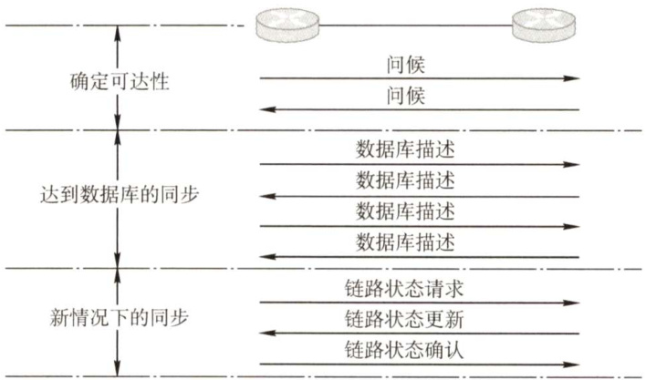
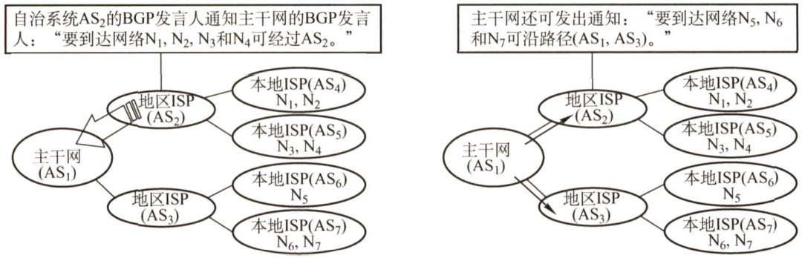
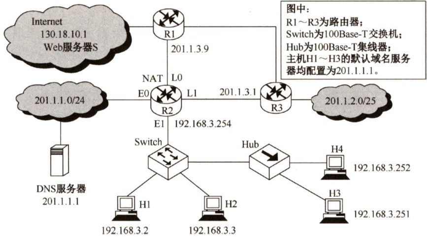
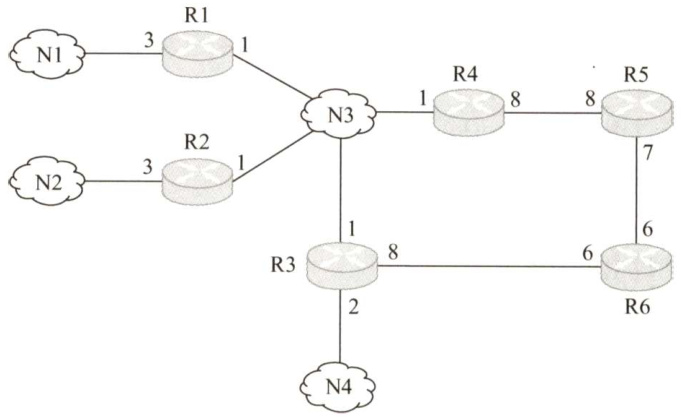
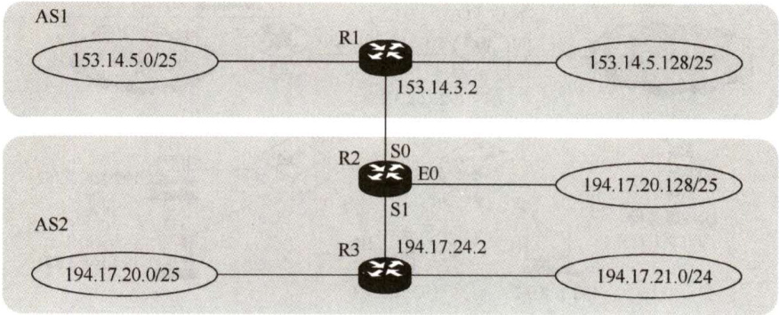
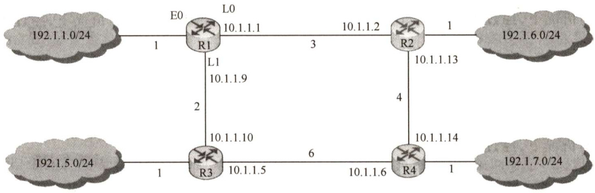

#### 4.5 路由协议  

#### 4.5.1 自治系统  

自治系统（Autonomous System，AS)：单一技术管理下的一组路由器，这些路由器使用一种AS 内部的路由选择协议和共同的度量来确定分组在该AS 内的路由，同时还使用一种AS之间的路由选择协议来确定分组在AS之间的路由。  

一个自治系统内的所有网络都由一个行政单位（如一家公司、一所大学、一个政府部门等)管辖，一个自治系统的所有路由器在本自治系统内都必须是连通的。  

#### 4.5.2 域内路由与域间路由  

自治系统内部的路由选择称为域内路由选择，自治系统之间的路由选择称为域间路由选择。因特网有两大类路由选择协议。  

#### 1．内部网关协议（InteriorGatewayProtocol，IGP）  

内部网关协议即在一个自治系统内部使用的路由选择协议，它与互联网中其他自治系统选用什么路由选择协议无关。目前这类路由选择协议使用得最多，如RIP和OSPF。  

#### 2．外部网关协议（ExternalGatewayProtocol，EGP）  

若源站和目的站处在不同的自治系统中，当数据报传到一个自治系统的边界时（两个自治系统可能使用不同的IGP)，就需要使用一种协议将路由选择信息传递到另一个自治系统中。这样的协议就是外部网关协议（EGP)。目前使用最多的外部网关协议是BGP-4。  

图4.10是两个自治系统互联的示意图。每个自治系统自己决定在本自治系统内部运行哪个内部路由选择协议（例如，可以是RIP，也可以是OSPF)，但每个自治系统都有一个或多个路由器（图中的路由器R1和R2)。除运行本系统的内部路由选择协议外，还要运行自治系统间的路由选择协议（如BGP-4)。  

  
图4.10 自治系统和内部网关协议、外部网关协议  

#### 4.5.3 路由信息协议（RIP）  

路由信息协议（RoutingInformationProtocol，RIP）是内部网关协议（IGP）中最先得到广泛应用的协议。RIP是一种分布式的基于距离向量的路由选择协议，其最大优点就是简单。  

#### 1.RIP规定  

1）网络中的每个路由器都要维护从它自身到其他每个目的网络的距离记录（因此这是一组距离，称为距离向量)。  
2）距离也称跳数（HopCount），规定从一个路由器到直接连接网络的距离（跳数）为1。而每经过一个路由器，距离（跳数）加1。  
3）RIP认为好的路由就是它通过的路由器的数目少，即优先选择跳数少的路径。  
4）RIP允许一条路径最多只能包含15个路由器（即最多允许15跳)。因此距离等于16时，它表示网络不可达。可见RIP只适用于小型互联网。距离向量路由可能会出现环路的情况，规定路径上的最高跳数的目的是为了防止数据报不断循环在环路上，减少网络拥塞的可能性。  
5）RIP默认在任意两个使用RIP的路由器之间每30秒广播一次RIP路由更新信息，以便自动建立并维护路由表（动态维护)。  
6）在RIP中不支持子网掩码的RIP广播，所以RIP中每个网络的子网掩码必须相同。但在  

新的RIP2中，支持变长子网掩码和CIDR。  

#### 2.RIP的特点（注意与OSPF的特点比较）  

1）仅和相邻路由器交换信息。  

2）路由器交换的信息是当前路由器所知道的全部信息，即自己的路由表。  

3）按固定的时间间隔交换路由信息，如每隔30秒。  

RIP通过距离向量算法来完成路由表的更新。最初，每个路由器只知道与自己直接相连的网络。通过每30 秒的RIP广播，相邻两个路由器相互将自己的路由表发给对方。于是经过第一次RIP广播，每个路由器就知道了与自己相邻的路由器的路由表（即知道了距离自己跳数为1的网络的路由)。同理，经过第二次RIP广播,每个路由器就知道了距离自己跳数为2的网络的路由·..因此，经过若干RIP广播后，所有路由器都最终知道了整个IP网络的路由表，称为RIP最终是收敛的。通过RIP收敛后，每个路由器到每个目标网络的路由都是距离最短的（即跳数最少，最短路由)，哪怕还存在另一条高速（低时延）但路由器较多的路由。  

#### 3.距离向量算法  

每个路由表项目都有三个关键数据： $<$ 目的网络 $N$ ，距离 $d$ ，下一跳路由器地址 $X>$ 。对于每个相邻路由器发送过来的RIP报文，执行如下步骤：  

1）对地址为 $X$ 的相邻路由器发来的RIP报文，先修改此报文中的所有项目：把“下一跳”字段中的地址都改为 $X$ ，并把所有“距离”字段的值加1。  

2）对修改后的RIP报文中的每个项目，执行如下步骤：  

$\textcircled{1}$ 当原来的路由表中没有目的网络 $N$ 时，把该项目添加到路由表中。  
$\textcircled{2}$ 当原来的路由表中有目的网络 $N$ ，且下一跳路由器的地址是 $X$ 时，用收到的项目替换原路由表中的项目。  
$\textcircled{3}$ 当原来的路由表中有目的网络 $N$ ，且下一跳路由器的地址不是 $X$ 时，如果收到的项目中的距离 $d$ 小于路由表中的距离，那么就用收到的项目替换原路由表中的项目；否则什么也不做。  

3）如果180秒（RIP默认超时时间为180秒）还没有收到相邻路由器的更新路由表，那么把此相邻路由器记为不可达路由器，即把距离设置为16（距离为16表示不可达)。  

4）返回。RIP最大的优点是实现简单、开销小、收敛过程较快。RIP的缺点如下：  

1）RIP限制了网络的规模，它能使用的最大距离为15（16表示不可达)。  

2）路由器之间交换的是路由器中的完整路由表，因此网络规模越大，开销也越大。  

3）网络出现故障时，会出现慢收敛现象（即需要较长时间才能将此信息传送到所有路由器)，俗称“坏消息传得慢”，使更新过程的收敛时间长。  

RIP 是应用层协议，它使用UDP传送数据（端口520)。RIP选择的路径不一定是时间最短的，但一定是具有最少路由器的路径。因为它是根据最少跳数进行路径选择的。  

#### 4.5.4 开放最短路径优先（OSPF）协议  

#### 1.OSPF协议的基本特点  

开放最短路径优先（OSPF）协议是使用分布式链路状态路由算法的典型代表，也是内部网关协议（IGP）的一种。OSPF与RIP相比有以下4点主要区别：  

1）OSPF向本自治系统中的所有路由器发送信息，这里使用的方法是洪泛法。而RIP仅向自  

已相邻的几个路由器发送信息。  

2）发送的信息是与本路由器相邻的所有路由器的链路状态，但这只是路由器所知道的部分信息。“链路状态”说明本路由器和哪些路由器相邻及该链路的“度量”（或代价)。而在RIP中，发送的信息是本路由器所知道的全部信息，即整个路由表。  
3）只有当链路状态发生变化时，路由器才用洪泛法向所有路由器发送此信息，并且更新过程收敛得快，不会出现RIP“坏消息传得慢”的问题。而在RIP中，不管网络拓扑是否发生变化，路由器之间都会定期交换路由表的信息。  
4）OSPF是网络层协议，它不使用UDP或TCP，而直接用IP数据报传送（其IP数据报首部的协议字段为89)。而RIP是应用层协议，它在传输层使用UDP。  
除以上区别外，OSPF还有以下特点：  
1）OSPF对不同的链路可根据IP分组的不同服务类型（TOS）而设置成不同的代价。因此，OSPF对于不同类型的业务可计算出不同的路由，十分灵活。  
2）如果到同一个目的网络有多条相同代价的路径，那么可以将通信量分配给这几条路径。这称为多路径间的负载平衡。  
3）所有在OSPF路由器之间交换的分组都具有鉴别功能，因而保证了仅在可信赖的路由器之间交换链路状态信息。  
4）支持可变长度的子网划分和无分类编址CIDR。  
5）每个链路状态都带上一个32位的序号，序号越大，状态就越新。  

#### 2.OSPF的基本工作原理  

由于各路由器之间频繁地交换链路状态信息，因此所有路由器最终都能建立一个链路状态数据库。这个数据库实际上就是全网的拓扑结构图，它在全网范围内是一致的（称为链路状态数据库的同步)。然后，每个路由器根据这个全网拓扑结构图，使用Dijkstra最短路径算法计算从自己到各目的网络的最优路径，以此构造自己的路由表。此后，当链路状态发生变化时，每个路由器重新计算到各目的网络的最优路径，构造新的路由表。  

注意：虽然使用Dijkstra算法能计算出完整的最优路径，但路由表中不会存储完整路径，而只存储“下一跳”（只有到了下一跳路由器，才能知道再下一跳应当怎样走）。  

为使OSPF能够用于规模很大的网络，OSPF将一个自治系统再划分为若干更小的范围，称为区域。划分区域的好处是，将利用洪泛法交换链路状态信息的范围局限于每个区域而非整个自治系统，减少了整个网络上的通信量。在一个区域内部的路由器只知道本区域的完整网络拓扑，而不知道其他区域的网络拓扑情况。这些区域也有层次之分。处在上层的域称为主干区域，负责连通其他下层的区域，并且还连接其他自治域。  

#### 3.OSPF的五种分组类型  

OSPF共有以下五种分组类型：  

1）问候分组，用来发现和维持邻站的可达性。  
2）数据库描述分组，向邻站给出自己的链路状态数据库中的所有链路状态项目的摘要信息。  
3）链路状态请求分组，向对方请求发送某些链路状态项目的详细信息。  
4）链路状态更新分组，用洪泛法对全网更新链路状态。  
5）链路状态确认分组，对链路更新分组的确认。  

通常每隔10秒，每两个相邻路由器要交换一次问候分组，以便知道哪些站可达。在路由器刚开始工作时，OSPF 让每个路由器使用数据库描述分组和相邻路由器交换本数据库中已有的链  

路状态摘要信息。然后，路由器使用链路状态请求分组，向对方请求发送自己所缺少的某些链路状态项目的详细信息。经过一系列的这种分组交换，就建立了全网同步的链路数据库。图4.11给出了OSPF的基本操作，说明了两个路由器需要交换的各种类型的分组。  

  
图4.11 OSPF的基本操作  

在网络运行的过程中，只要一个路由器的链路状态发生变化，该路由器就要使用链路状态更新分组，用洪泛法向全网更新链路状态。其他路由器在更新后，发送链路状态确认分组对更新分组进行确认。  

为了确保链路状态数据库与全网的状态保持一致，OSPF还规定每隔一段时间（如30分钟）就刷新一次数据库中的链路状态。由于一个路由器的链路状态只涉及与相邻路由器的连通状态，因而与整个互联网的规模并无直接关系。因此，当互联网规模很大时，OSPF 要比RIP 好得多，而且OSPF协议没有“坏消息传播得慢”的问题。  

注意：教材上说OSPF协议不使用UDP数据报传送，而是直接使用IP数据报传送，在此解释一下什么称为用UDP传送，什么称为用IP数据报传送。用UDP传送是指将该信息作为UDP报文的数据部分，而直接使用IP 数据报传送是指将该信息直接作为IP数据报的数据部分。RIP报文是作为UDP数据报的数据部分。  

#### 4.5.5 边界网关协议（BGP)  

边界网关协议（Border GatewayProtocol，BGP）是不同自治系统的路由器之间交换路由信息的协议，是一种外部网关协议。边界网关协议常用于互联网的网关之间。  

内部网关协议主要设法使数据报在一个AS中尽可能有效地从源站传送到目的站。在一个AS内部不需要考虑其他方面的策略。然而BGP使用的环境却不同，主要原因如下：  

1）因特网的规模太大，使得自治系统之间路由选择非常困难。  

2）对于自治系统之间的路由选择，要寻找最佳路由是很不现实的。  

3）自治系统之间的路由选择必须考虑有关策略。  

边界网关协议（BGP）只能力求寻找一条能够到达目的网络且比较好的路由（不能兜圈子)，而并非寻找一条最佳路由。BGP采用的是路径向量路由选择协议，它与距离向量协议和链路状态协议有很大的区别。BGP是应用层协议，它是基于TCP的。  

BGP的工作原理如下：每个自治系统的管理员要选择至少一个路由器（可以有多个）作为该自治系统的“BGP发言人”。一个BGP发言人与其他自治系统中的BGP发言人要交换路由信息，就要先建立TCP连接（可见BGP报文是通过TCP传送的，也就是说BGP报文是TCP报文的数据部分)，然后在此连接上交换BGP报文以建立BGP会话，再利用BGP会话交换路由信息。当所有BGP发言人都相互交换网络可达性的信息后，各BGP发言人就可找出到达各个自治系统的较好路由。  

每个BGP发言人除必须运行BGP外，还必须运行该AS所用的内部网关协议，如OSPF 或  
RIP。BGP所交换的网络可达性信息就是要到达某个网络（用网络前缀表示）所要经过的一系列  
AS。图4.12给出了一个BGP发言人交换路径向量的例子。BGP的特点如下：1）BGP交换路由信息的结点数量级是自治系统的数量级，要比这些自治系统中的网络数少很多。2）每个自治系统中BGP发言人（或边界路由器）的数目是很少的。这样就使得自治系统之间的路由选择不致过分复杂。  
3）BGP支持CIDR，因此BGP的路由表也就应当包括目的网络前缀、下一跳路由器，以及到达该目的网络所要经过的各个自治系统序列。  
4）在BGP刚运行时，BGP的邻站交换整个BGP路由表，但以后只需在发生变化时更新有变化的部分。这样做对节省网络带宽和减少路由器的处理开销都有好处。  

  
图4.12主干网与自治系统间路径向量的交换  

BGP-4共使用4种报文：  

1）打开（Open）报文。用来与相邻的另一个BGP发言人建立关系。  
2）更新（Update）报文。用来发送某一路由的信息，以及列出要撤销的多条路由。  
3）保活（Keepalive）报文。用来确认打开报文并周期性地证实邻站关系。  
4）通知（Notification）报文。用来发送检测到的差错。  
RIP、OSPF与BGP的比较如表4.3所示。  

表4.3 三种路由协议的比较  

<html><body><table><tr><td>协议</td><td>RIP</td><td>OSPF</td><td colspan="2">BGP</td></tr><tr><td>类型</td><td>内部</td><td>内部</td><td colspan="2">外部</td></tr><tr><td>路由算法</td><td>距离-向量</td><td>链路状态</td><td colspan="2">路径-向量</td></tr><tr><td>传递协议</td><td>UDP</td><td>IP</td><td colspan="2">TCP</td></tr><tr><td>路径选择</td><td>跳数最少</td><td>代价最低</td><td colspan="2">较好，非最佳</td></tr><tr><td>交换结点</td><td>和本结点相邻的路由器</td><td>网络中的所有路由器</td><td colspan="2">和本结点相邻的路由器</td></tr><tr><td></td><td>交换内容当前本路由器知道的全部信息，即自己的路由表</td><td>与本路由器相邻的所有路由器的链路状态</td><td>首次 非首次</td><td>整个路由表 有变化的部分</td></tr></table></body></html>  

#### 4.5.6 本节习题精选  

#### 一、单项选择题  

01．以下关于自治系统的描述中，不正确的是（）。  

A.自治系统划分区域的好处是，将利用洪泛法交换链路状态信息的范围局限在每个区域内，而不是整个自治系统B．采用分层划分区域的方法使交换信息的种类增多，同时也使OSPF协议更加简单C.OSPF协议将一个自治系统再划分为若干更小的范围，称为区域D.在一个区域内部的路由器只知道本区域的网络拓扑，而不知道其他区域的网络拓扑的情况  

02.在计算机网络中，路由选择协议的功能不包括（）。  

A.交换网络状态或通路信息 B．选择到达目的地的最佳路径C．更新路由表 D.发现下一跳的物理地址  

03．用于域间路由的协议是（）。  

A. RIP B.BGP C. OSPF D. ARP  

04.在RIP中，到某个网络的距离值为16，其意义是（）。  

A.该网络不可达 B．存在循环路由C.该网络为直接连接网络 D.到达该网络要经过15次转发  

05.在RIP中，假设路由器X和路由器K是两个相邻的路由器，X向K说：“我到目的网络Y的距离为 $N^{\mathfrak{n}}$ ，则收到此信息的K就知道：“若将到网络Y的下一个路由器选为X，则我到网络Y的距离为（）。”（假设 $N$ 小于15)  

A. $N$ B.N-1 C.1 D.N+1  

06．以下关于RIP的描述中，错误的是（）。  

A.RIP是基于距离-向量路由选择算法的B.RIP要求内部路由器将它关于整个AS的路由信息发布出去C.RIP要求内部路由器向整个AS的路由器发布路由信息D.RIP要求内部路由器按照一定的时间间隔发布路由信息  

07．对路由选择协议的一个要求是必须能够快速收敛，所谓“路由收敛”是指（）。  

A．路由器能把分组发送到预定的目标  
B．路由器处理分组的速度足够快  
C.网络设备的路由表与网络拓扑结构保持一致  
D.能把多个子网聚合成一个超网  

08．下列关于RIP和OSPF协议的叙述中，错误的是（）。  

A.RIP和OSPF协议都是网络层协议  
B．在进行路由信息交换时，RIP中的路由器仅向自己相邻的路由器发送信息，OSPF协议中的路由器向本自治系统中的所有路由器发送信息  
C．在进行路由信息交换时，RIP中的路由器发送的信息是整个路由表，OSPF协议中的路由器发送的信息只是路由表的一部分  
D.RIP的路由器不知道全网的拓扑结构，OSPF协议的任何一个路由器都知道自己所在区域的拓扑结构  

09.OSPF协议使用（）分组来保持与其邻居的连接。  

A.Hello B.Keepalive  

C.SPF（最短路径优先） D.LSU（链路状态更新）  

10．以下关于OSPF协议的描述中，最准确的是（）。  

A．OSPF协议根据链路状态法计算最佳路由B.OSPF协议是用于自治系统之间的外部网关协议C.OSPF协议不能根据网络通信情况动态地改变路由D.OSPF协议只适用于小型网络  

11．以下关于OSPF协议特征的描述中，错误的是（）。  

A.OSPF协议将一个自治域划分成若干域，有一种特殊的域称为主干区域  
B.域之间通过区域边界路由器互联  
C．在自治系统中有4类路由器：区域内部路由器、主干路由器、区域边界路由器和自治域边界路由器  
D.主干路由器不能兼作区域边界路由器  

12.BGP交换的网络可达性信息是（）。  

A.到达某个网络所经过的路径 B．到达某个网络的下一跳路由器C.到达某个网络的链路状态摘要信息 D.到达某个网络的最短距离及下-  

13.RIP、OSPF协议、BGP的路由选择过程分别使用（）。  

A．路径向量协议、链路状态协议、距离向量协议B．距离向量协议、路径向量协议、链路状态协议C.路径向量协议、距离向量协议、链路状态协议D.距离向量协议、链路状态协议、路径向量协议  

14.【2010统考真题】某自治系统内采用RIP，若该自治系统内的路由器R1收到其邻居路由器R2的距离向量，距离向量中包含信息<netl， $16>$ ，则能得出的结论是（）。  

A.R2可以经过R1到达netl，跳数为17B.R2可以到达netl，跳数为16C.R1可以经过R2到达netl，跳数为17D.R1不能经过R2到达netl  

15.【2016统考真题】假设下图中的R1、R2、R3采用RIP交换路由信息，且均已收敛。若R3检测到网络201.1.2.0/25不可达，并向R2通告一次新的距离向量，则R2更新后，其到达该网络的距离是（）。  

A.2 B.3 C.16 D.17  

  

16.【2017统考真题】直接封装RIP、OSPF、BGP报文的协议分别是（）。  

A.TCP、UDP、IP B.TCP、IP、UDP C.UDP、TCP、IP D.UDP、IP、TCP  

#### 二、综合应用题  

01.RIP使用UDP，OSPF使用IP，而BGP使用TCP。这样做有何优点？为什么RIP 周期性地和邻站交换路由信息而BGP却不这样做？  

02．在某个使用RIP的网络中，B和C互为相邻路由器，其中表1为B的原路由表，表2为C广播的距离向量报文 $\angle$ 目的网络，距离>。  

表1  

<html><body><table><tr><td>目的网络</td><td>距离</td><td>下一跳</td></tr><tr><td>N1</td><td>7</td><td>A</td></tr><tr><td>N2</td><td>2</td><td>C</td></tr><tr><td>N6</td><td>8</td><td>F</td></tr><tr><td>N8</td><td>4</td><td>E</td></tr><tr><td>N9</td><td>4</td><td>D</td></tr></table></body></html>  

表2  

<html><body><table><tr><td>目的网络</td><td>距离</td></tr><tr><td>N2</td><td>15</td></tr><tr><td>N3</td><td>2</td></tr><tr><td>N4</td><td>8</td></tr><tr><td>N8</td><td>2</td></tr><tr><td>N7</td><td>4</td></tr></table></body></html>  

1）试求路由器B更新后的路由表并说明主要步骤。  
2）当路由器B收到发往网络N2的IP分组时，应该做何处理？  

03．因特网中的一个自治系统的内部结构如下图所示。路由选择协议采用OSPF协议时，计算R6的关于网络N1、N2、N3、N4的路由表。  

  

注：端口处的数字指该路由器向该链路转发分组的代价。  

04.【2013统考真题】假设Intermet的两个自治系统构成的网络如下图所示，自治系统AS1由路由器R1连接两个子网构成；自治系统AS2由路由器R2、R3互联并连接3个子网构成。各子网地址、R2的接口名、R1与R3的部分接口IP地址如下图所示。  

  

请回答下列问题：  

1）假设路由表结构如下表所示。利用路由聚合技术，给出R2的路由表，要求包括到达图中所有子网的路由，且路由表中的路由项尽可能少。  

<html><body><table><tr><td>目的网络</td><td>下一跳</td><td>接口</td></tr></table></body></html>  

2）若R2收到一个目的IP地址为194.17.20.200的IP分组，R2会通过哪个接口转发该IP分组？  

3）R1与R2之间利用哪个路由协议交换路由信息？该路由协议的报文被封装到哪个协议的分组中进行传输？  

05.【2014统考真题】某网络中的路由器运行OSPF路由协议，下表是路由器R1维护的主要链路状态信息（LSI)，下图是根据该表及R1的接口名构造的网络拓扑。  

<html><body><table><tr><td colspan="2"></td><td>R1的LSI</td><td>R2的LSI</td><td>R3的LSI</td><td>R4的LSI</td><td>备注</td></tr><tr><td colspan="2">RouterID</td><td>10.1.1.1</td><td>10.1.1.2</td><td>10.1.1.5</td><td>10.1.1.6</td><td>标识路由器的IP地址</td></tr><tr><td rowspan="3">Link1</td><td>ID</td><td>10.1.1.2</td><td>10.1.1.1</td><td>10.1.1.6</td><td>10.1.1.5</td><td>所连路由器的RouterID</td></tr><tr><td>IP</td><td>10.1.1.1</td><td>10.1.1.2</td><td>10.1.1.5</td><td>10.1.1.6</td><td>Link1的本地IP地址</td></tr><tr><td>Metric</td><td>3</td><td>3</td><td>6</td><td>6</td><td>Link1的费用</td></tr><tr><td rowspan="3">Link2</td><td>ID</td><td>10.1.1.5</td><td>10.1.1.6</td><td>10.1.1.1</td><td>10.1.1.2</td><td>所连路由器的RouterID</td></tr><tr><td>IP</td><td>10.1.1.9</td><td>10.1.1.13</td><td>10.1.1.10</td><td>10.1.1.14</td><td>Link2的本地IP地址</td></tr><tr><td>Metric</td><td>2</td><td>4</td><td>2</td><td>4</td><td>Link2的费用</td></tr><tr><td rowspan="2">Net1</td><td>Prefix</td><td>192.1.1.0/24</td><td>192.1.6.0/24</td><td>192.1.5.0/24</td><td>192.1.7.0/24</td><td>直连网络Netl的网络前缀</td></tr><tr><td>Metric</td><td>1</td><td>1</td><td>1</td><td>1</td><td>到达直连网络Net1的费用</td></tr></table></body></html>  

  

请回答下列问题：  

1）设路由表结构如下表所示，给出图中R1的路由表，要求包括到达图中子网192.1.x.x的路由，且路由表中的路由项尽可能少。  

<html><body><table><tr><td>目的网络</td><td>下一跳</td><td>接口</td></tr></table></body></html>  

2）当主机192.1.1.130向主机192.1.7.211发送一个 $\mathrm{TTL}=64\$ 的IP分组时，R1通过哪个接口转发该IP分组？主机192.1.7.211收到的IP分组的TTL是多少？  

3）若R1增加一条Metric为10的链路连接Internet，则表中R1的LSI需要增加哪些信息？  

#### 4.5.7 答案与解析  

#### 一、单项选择题  

01.B  

划分区域的好处是，将利用洪泛法交换链路状态信息的范围局限在每个区域内，而不是整个自治系统。因此，在一个区域内部的路由器只知道本区域的网络拓扑，而不知道其他区域的网络拓扑情况。采用分层次划分区域的方法虽然使交换信息的种类增多了，同时也使OSPF协议更加复杂了，但这样做却能使每个区域内部交换路由信息的通信量大大减少，进而使OSPF协议能够用于规模很大的自治系统中。  

02.D  

路由选择协议的功能通常包括：获取网络拓扑信息、构建路由表、在网络中更新路由信息、选择到达每个目的网络的最优路径、识别一个网络的无环通路等。发现下一跳的物理地址一般是通过其他方式（如ARP）来实现的，不属于路由选择协议的功能。  

03.B  

BGP（边界网关协议）是一个域间路由协议。RIP 和OSPF是域内路由协议，ARP不是路由协议。  

04.ARIP规定的最大跳数为15，16表示网络不可达。  

05.DRIP规定，每经过一个路由器，距离（跳数）加 $^1$ 。  

06.CRIP 规定一个路由器只向相邻路由器发布路由信息，而不像OSPF那样向整个域洪泛。  

07.C  

所谓收敛，是指当路由环境发生变化后，各路由器调整自己的路由表以适应网络拓扑结构的变化，最终达到稳定状态（路由表与网络拓扑状态保持一致)。收敛越快，路由器就能越快适应网络拓扑结构的变化。  

08.A  

RIP是应用层协议，它使用UDP传送数据，OSPF才是网络层协议。A错误。  

09.A  

此题属于记忆性题目，OSPF协议使用Hello分组来保持与其邻居的连接。  

10.A  

OSPF 协议是一种用于自治系统内的路由协议，B错误。它是一种基于链路状态路由选择算法的协议，能适用大型全局IP 网络的扩展，支持可变长子网掩码，所以OSPF协议可用于管理一个受限地址域的中大型网络，D 错误。OSPF 协议维护一张它所连接的所有链路状态信息的邻居表和拓扑数据库，使用组播链路状态更新（Link StateUpdate，LSU）报文实现路由更新，并且只有当网络已经发生变化时才传送LSU报文，C错误。OSPF协议不传送整个路由表，而传送受影响的路由更新报文。  

11.D  

主干区域中，用于连接主干区域和其他下层区域的路由器称为区域边界路由器。只要是在主干区域中的路由器，就都称为主千路由器，因此主干路由器可以兼作区域边界路由器。  

12.A  

由于BGP仅力求寻找一条能够到达目的网络且较好的路由（不能兜圈子)，而并非寻找一条最佳路由，因此D选项错误。BGP交换的路由信息是到达某个目的网络所要经过的各个自治系统序列而不仅仅是下一跳，因此A正确。  

13.D  

RIP 是一种分布式的基于距离向量的路由选择协议，它使用跳数来度量距离。RIP选择的路径不一定是时间最短的，但一定是具有最小距离（最少跳数）的路径。  

OSPF协议使用分布式的链路状态协议，通过与相邻路由器频繁交流链路状态信息，来建立全网的拓扑结构图，然后使用Dijkstra算法计算从自己到各目的网络的最优路径。  

由于BGP仅力求寻找一条能够到达目的网络且较好的路由（不能兜圈子)，而并非寻找一条最佳路由，因此它采用的是路径向量路由选择协议。在BGP中，每个自治系统选出一个BGP发言人，这些发言人通过相互交换自己的路径向量（即网络可达性信息）后，就可找出到达各自治系统的较好路由。  

14.D  

R1在收到信息并更新路由表后，若需要经过R2到达net1，则其跳数为17，由于距离为16表示不可达，因此R1不能经过R2到达netl，R2也不可能到达netl。B、C错误，D正确。而题目中并未给出R1向R2发送的信息，因此A也不正确。  

15.B  

解析请扫右侧二维码查阅。  

16.D  

RIP 是一种分布式的基于距离向量的路由选择协议，它通过广播UDP报文来交换路由信息。OSPF 是一个内部网关协议，要交换的信息量较大，应使报文的长度尽量短，所以不使用传输层协议（如UDP或TCP)，而直接采用IP。BGP是一个外部网关协议，在不同的自治系统之间交换路由信息，由于网络环境复杂，需要保证可靠传输，所以采用TCP。因此，选D。  

#### 二、综合应用题  

01.【解答】  

RIP 处于UDP的上层，RIP所接收的路由信息都封装在UDP的数据报中；OSPF的位置位于网络层，由于要交换的信息量较大，因此应使报文的长度尽量短，因此采用IP；BGP要在不同的自治系统之间交换路由信息，由于网络环境复杂，需要保证可靠的传输，所以选择TCP。  

内部网关协议主要设法使数据报在一个自治系统中尽可能有效地从源站传送到目的站，在一个自治系统内部并不需要考虑其他方面的策略，然而BGP使用的环境却不同。主要有以下三个原因：第一，因特网规模太大，使得自治系统之间的路由选择非常困难；第二，对于自治系统之间的路由选择，要寻找最佳路由是不现实的；第三，自治系统之间的路由选择必须考虑有关策略。由于上述情况，BGP只能力求寻找一条能够到达目的网络且较好的路由，而并非寻找一条最佳路由，所以BGP不需要像RIP那样周期性地和邻站交换路由信息。  

02.【解答】  

1）根据RIP算法，首先将从C收到的路由信息的下一跳改为C，并且将每个距离都加1，得右表。将题中表2与原路由表项进行比较，根据更新路由表项的规则： $\textcircled{1}$ 如果目的网络相同，且下一跳路由器相同，直接更新； $\textcircled{2}$ 如果是新的目的网络地址，那么增加表项；$\textcircled{3}$ 若目的网络相同，且下一跳路由器不同，而距离更短，则更新； $\textcircled{4}$ 否则，无操作。更新后的路由表见下表。  

<html><body><table><tr><td>目的网络</td><td>距离</td><td>下一跳</td></tr><tr><td>N2</td><td>16</td><td>C</td></tr><tr><td>N3</td><td>3</td><td>C</td></tr><tr><td>N4</td><td>9</td><td>C</td></tr><tr><td>N8</td><td>3</td><td>C</td></tr><tr><td>N7</td><td>5</td><td>C</td></tr></table></body></html>  

<html><body><table><tr><td>目的网络</td><td>距离</td><td>下一跳路由器</td><td>目的网络</td><td>距离</td><td>下一跳路由器</td></tr><tr><td>N1</td><td>7</td><td>A</td><td>N6</td><td>8</td><td>F</td></tr><tr><td>N2</td><td>16</td><td>C</td><td>N7</td><td>5</td><td>C</td></tr><tr><td>N3</td><td>3</td><td>C</td><td>N8</td><td>3</td><td>C</td></tr><tr><td>N4</td><td>9</td><td>C</td><td>N9</td><td>4</td><td>D</td></tr></table></body></html>  

2）在更新后的路由表中，路由器B到N2 的距离为16（网络拓扑结构变化导致)，这意味着N2网络不可达，这时路由器B应该丢弃该IP分组并向源主机报告目的不可达。  

03.【解答】  

根据Dijkstra 的最短路径算法，加入结点的次序之一为（R6,R5,R3,N3,R4,R1,R2,N4,N1,N2)，可以得到R6的路由表如下表所示。  

<html><body><table><tr><td>目的网络</td><td>距离</td><td>下一跳路由器</td><td>目的网络</td><td>距离</td><td>下一跳路由器</td></tr><tr><td>N1</td><td>10</td><td>R3</td><td>N3</td><td>7</td><td>R3</td></tr><tr><td>N2</td><td>10</td><td>R3</td><td>N4</td><td>8</td><td>R3</td></tr></table></body></html>  

04.【解答】  

1）要求R2 的路由表能到达图中的所有子网，且路由项尽可能少，则应对每个路由接口的子网进行聚合。在AS1中，子网153.14.5.0/25和子网153.14.5.128/25可聚合为子网153.14.5.0/24;在 AS2中，子网194.17.20.0/25和子网194.17.21.0/24可聚合为子网194.17.20.0/23；子网194.17.20.128/25单独连接到R2的接口E0。  

于是可以得到R2的路由表如下：  

<html><body><table><tr><td>目的网络</td><td>下一跳</td><td>接 口</td></tr><tr><td>153.14.5.0/24</td><td>153.14.3.2</td><td>S0</td></tr><tr><td>194.17.20.0/23</td><td>194.17.24.2</td><td>S1</td></tr><tr><td>194.17.20.128/25</td><td>一</td><td>E0</td></tr></table></body></html>  

2）该IP分组的目的IP地址194.17.20.200与路由表中194.17.20.0/23和194.17.20.128/25两个路由表项均匹配，根据最长匹配原则，R2将通过E0接口转发该IP分组。  

3）R1和R2属于不同的自治系统，因此应使用边界网关协议（BGP或BGP4）交换路由信息；BGP是应用层协议，它的报文被封装到TCP段中进行传输。  

05.【解答】  

1）因为题目要求路由表中的路由项尽可能少，所以这里可以把子网192.1.6.0/24和192.1.7.0/24聚合为子网192.1.6.0/23，其他网络照常，可得到路由表如下：  

<html><body><table><tr><td>目的网络</td><td>下一跳</td><td>接 口</td></tr><tr><td>192.1.1.0/24</td><td>一</td><td>E0</td></tr><tr><td>192.1.6.0/23</td><td>10.1.1.2</td><td>L0</td></tr><tr><td>192.1.5.0/24</td><td>10.1.1.10</td><td>L1</td></tr></table></body></html>  

2）通过查路由表可知：R1通过L0接口转发该IP分组。因为该分组要经过3个路由器（R1、R2、R4)，所以主机192.1.7.211收到的IP分组的TTL是 $64-3=61$ 。  

3）R1的LSI需要增加一条特殊的直连网络，网络前缀Prefix为“ $0.0.0.0/0^{,9}$ ，Metric为10。