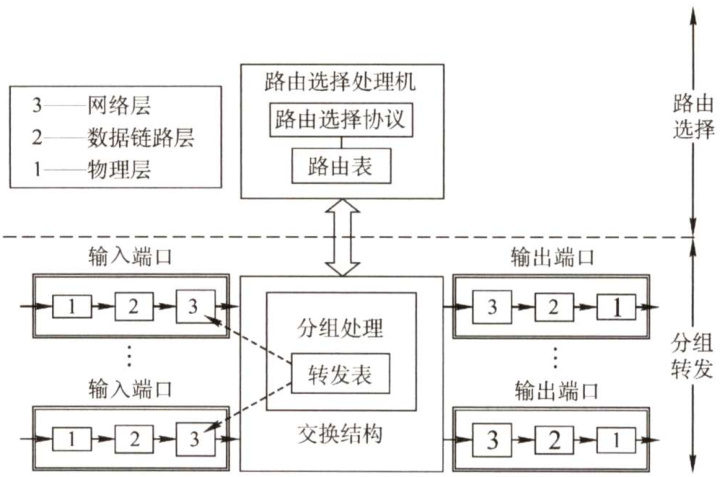
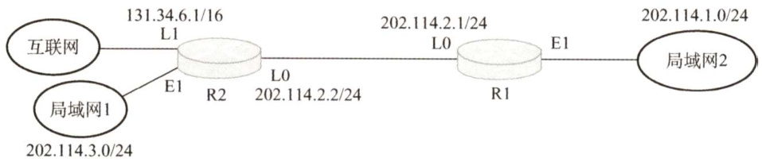
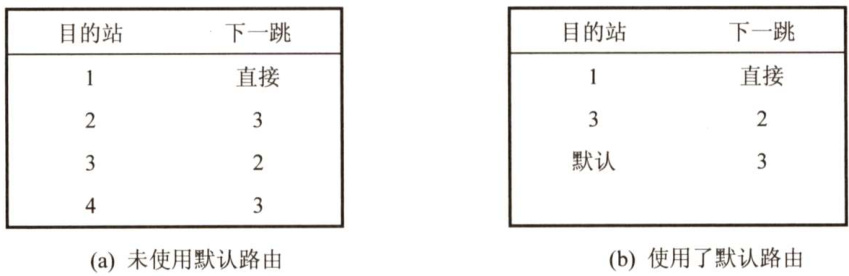
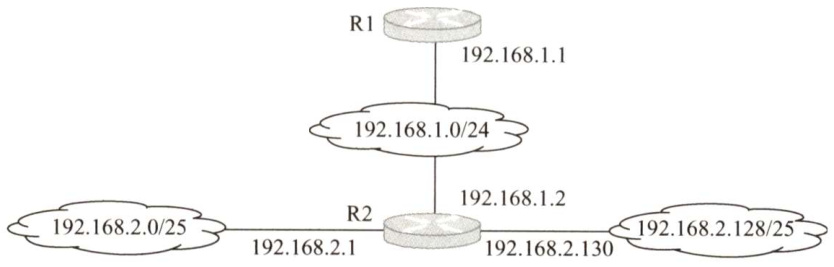
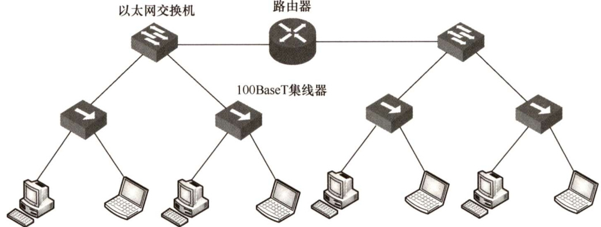
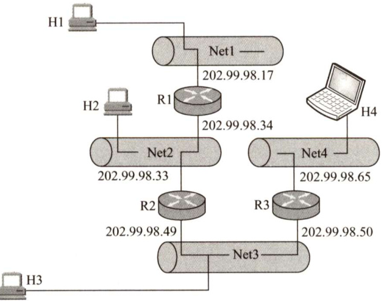
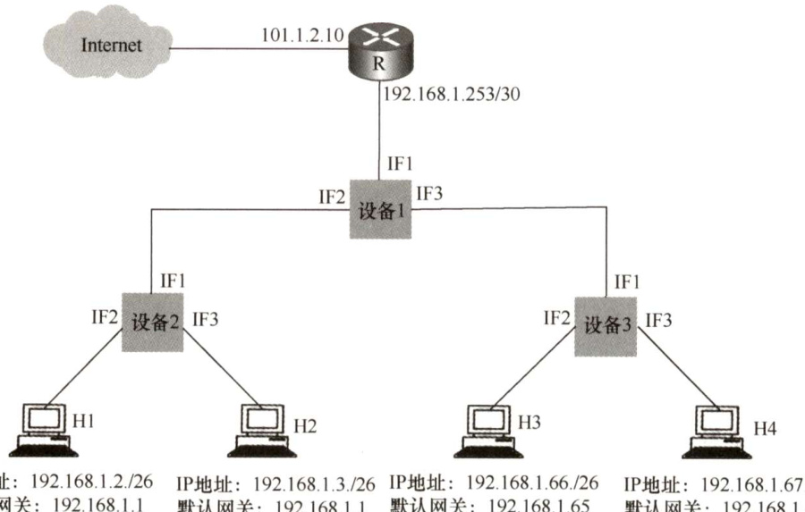
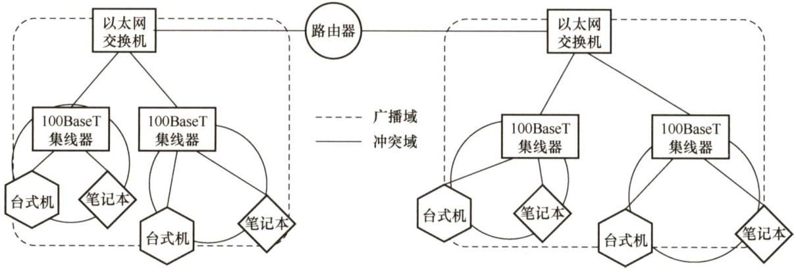

#### 4.8 网络层设备  

#### 4.8.1 冲突域和广播域  

这里的“域”表示冲突或广播在其中发生并传播的区域。  

#### 1．冲突域  

冲突域是指连接到同一物理介质上的所有结点的集合，这些结点之间存在介质争用的现象。在OSI参考模型中，冲突域被视为第1层概念，像集线器、中继器等简单无脑复制转发信号的第1层设备所连接的结点都属于同一个冲突域，也就是说它们不能划分冲突域。而第2层（网桥、交换机）、第3层（路由器）设备都可以划分冲突域。  

#### 2.广播域  

广播域是指接收同样广播消息的结点集合。也就是说，在该集合中的任何一个结点发送一个广播帧，其他能收到这个帧的结点都被认为是该广播域的一部分。在OSI参考模型中，广播域被视为第2层概念，像第1层（集线器等）、第2层（交换机等）设备所连接的结点都属于同一个广播域。而路由器，作为第3层设备，则可以划分广播域，即可以连接不同的广播域。  

通常所说的局域网（LAN）特指使用路由器分割的网络，也就是广播域。  

#### 4.8.2 路由器的组成和功能  

路由器是一种具有多个输入/输出端口的专用计算机，其任务是连接不同的网络（连接异构网络）并完成路由转发。在多个逻辑网络（即多个广播域）互联时必须使用路由器。  

当源主机要向目标主机发送数据报时，路由器先检查源主机与目标主机是否连接在同一个网络上。如果源主机和目标主机在同一个网络上，那么直接交付而无须通过路由器。如果源主机和目标主机不在同一个网络上，那么路由器按照转发表（路由表）指出的路由将数据报转发给下一个路由器，这称为间接交付。可见，在同一个网络中传递数据无须路由器的参与，而跨网络通信必须通过路由器进行转发。例如，路由器可以连接不同的LAN，连接不同的VLAN，连接不同的WAN，或者把LAN和WAN互联起来。路由器隔离了广播域。  

从结构上看，路由器由路由选择和分组转发两部分构成，如图4.15所示。而从模型的角度看，路由器是网络层设备，它实现了网络模型的下三层，即物理层、数据链路层和网络层。  

  

注意：如果一个存储转发设备实现了某个层次的功能，那么它就可以互联两个在该层次上使用不同协议的网段（网络）。如网桥实现了物理层和数据链路层，那么网桥可以互联两个物理层和数据链路层不同的网段；但中继器实现了物理层后，却不能互联两个物理层不同的网段，这是因为中继器不是存储转发设备，它属于直通式设备。  

路由选择部分也称控制部分，其核心构件是路由选择处理机。路由选择处理机的任务是根据所选定的路由选择协议构造出路由表，同时经常或定期地和相邻路由器交换路由信息而不断更新和维护路由表。  

分组转发部分由三部分组成：交换结构、一组输入端口和一组输出端口。输入端口在从物理层接收到的比特流中提取出数据链路层帧，进而从帧中提取出网络层数据报，输出端口则执行恰好相反的操作。交换结构是路由器的关键部件，它根据转发表对分组进行处理，将某个输入端口进入的分组从一个合适的输出端口转发出去。有三种常用的交换方法：通过存储器进行交换、通过总线进行交换和通过互联网络进行交换。交换结构本身就是一个网络。  

路由器主要完成两个功能：一是分组转发，二是路由计算。前者处理通过路由器的数据流，关键操作是转发表查询、转发及相关的队列管理和任务调度等；后者通过和其他路由器进行基于路由协议的交互，完成路由表的计算。  

路由器和网桥的重要区别是：网桥与高层协议无关，而路由器是面向协议的，它依据网络地址进行操作，并进行路径选择、分段、帧格式转换、对数据报的生存时间和流量进行控制等。现今的路由器一般都提供多种协议的支持，包括OSI、TCP/IP、IPX等。  

#### 4.8.3 路由表与路由转发  

路由表是根据路由选择算法得出的，主要用途是路由选择。从历年统考真题可以看出，标准的路由表有4个项目：目的网络IP地址、子网掩码、下一跳IP地址、接口。在如图4.16所示的网络拓扑中，R1的路由表见表4.4，该路由表包含到互联网的默认路由。  

  
图4.15路由器体系结构  
图4.16一个简单的网络拓扑  

表4.4R1的路由表  

<html><body><table><tr><td>目的网络IP地址</td><td>子网掩码</td><td>下一跳IP地址</td><td>接 口</td></tr><tr><td>202.114.1.0</td><td>255.255.255.0</td><td>Direct</td><td>E1</td></tr><tr><td>202.114.2.0</td><td>255.255.255.0</td><td>Direct</td><td>L0</td></tr><tr><td>202.114.3.0</td><td>255.255.255.0</td><td>202.114.2.2</td><td>L0</td></tr><tr><td>0.0.0.0</td><td>0.0.0.0</td><td>202.114.2.2</td><td>L0</td></tr></table></body></html>  

转发表是从路由表得出的，其表项和路由表项有直接的对应关系。但转发表的格式和路由表的格式不同，其结构应使查找过程最优化（而路由表则需对网络拓扑变化的计算最优化)。转发表中含有一个分组将要发往的目的地址，以及分组的下一跳（即下一步接收者的目的地址，实际为MAC地址)。为了减少转发表的重复项目，可以使用一个默认路由代替所有具有相同“下一跳”的项目，并将默认路由设置得比其他项目的优先级低，如图4.17所示。路由表总是用软件来实现的；转发表可以用软件来实现，甚至也可以用特殊的硬件来实现。  

  
图4.17未使用默认路由的转发表和使用了默认路由的转发表的对比  

注意转发和路由选择的区别：“转发”是路由器根据转发表把收到的IP数据报从合适的端口转发出去，它仅涉及一个路由器。而“路由选择”则涉及很多路由器，路由表是许多路由器协同工作的结果。这些路由器按照复杂的路由算法，根据从各相邻路由器得到的关于网络拓扑的变化情况，动态地改变所选择的路由，并由此构造出整个路由表。  

注意，在讨论路由选择的原理时，往往不去区分转发表和路由表的区别，但要注意路由表不等于转发表。分组的实际转发是靠直接查找转发表，而不是直接查找路由表。  

#### 4.8.4 本节习题精选  

#### 一、单项选择题  

01.要控制网络上的广播风暴，可以采用的方法是（）。  

A．用网桥将网络分段  
B.用路由器将网络分段  
C.将网络转接成10Base-T  
D.用网络分析仪跟踪正在发送广播信息的计算机  

02．一个局域网与在远处的另一个局域网互联，则需要用到（）。  

A.物理通信介质和集线器 B.网间连接器和集线器C.路由器和广域网技术 D.广域网技术  

03．路由器主要实现（）的功能。  

A．数据链路层、网络层与应用层 B.网络层与传输层  

C.物理层、数据链路层与网络层 D.物理层与网络层  

04.关于路由器的下列说法中，正确的是（）。  

A．路由器处理的信息量比交换机少，因而转发速度比交换机快B．对于同一目标，路由器只提供延迟最小的最佳路由C．通常的路由器可以支持多种网络层协议，并提供不同协议之间的分组转发D.路由器不但能够根据IP地址进行转发，而且可以根据物理地址进行转发  

05．一个路由器的路由表通常包含（）。  

A.需要包含到达所有主机的完整路径信息B.需要包含所有到达目的网络的完整路径信息C.需要包含到达目的网络的下一跳路径信息D．需要包含到达所有主机的下一跳路径信息  

06．决定路由器转发表中的值的算法是（）。  

A．指数回退算法B．分组调度算法 C．路由算法 D．拥塞控制算法  

07．路由器中计算路由信息的是（）。  

A.输入队列 B.输出队列 C．交换结构 D．路由选择处理机  

08．路由表的分组转发部分由（）组成。  

A．交换结构 B.输入端口 C.输出端口 D.以上都是  

09．路由器的路由选择部分包括（）。  

A.路由选择处理机 B．路由选择协议C．路由表 D.以上都是  

10．在下列网络设备中，传输延迟时间最大的是（）。  

A.局域网交换机 B.网桥C.路由器 D．集线器  

11．在路由表中设置一条默认路由，则其目的地址和子网掩码应分别置为（）。  

A.192.168.1.1、255.255.255.0 B.127.0.0.0、255.0.0.0  
C.0.0.0.0、0.0.0.0 D. 0.0.0.0、255.255.255.255  

12.【2010统考真题】下列网络设备中，能够抑制广播风暴的是（）。I中继器ⅡI集线器I网桥IV路由器  

A.仅I和ⅡI B.仅IⅢI C.仅IⅢI和IV D.仅IV  

13.【2011统考真题】某网络拓扑如下图所示，路由器R1只有到达子网192.168.1.0/24的路由。为使R1可以将IP分组正确地路由到图中的所有子网，则在R1中需要增加的一条路由（目的网络，子网掩码，下一跳）是（）。  

  

A. 192.168.2.0 255.255.255.128 192.168.1.1   
B. 192.168.2.0 255.255.255.0 192.168.1.1   
C. 192.168.2.0 255.255.255.128 192.168.1.2   
D. 192.168.2.0 255.255.255.0 192.168.1.2  

14.【2012统考真题】下列关于IP路由器功能的描述中，正确的是（）。  

I．运行路由协议，设备路由表  
ⅡI．监测到拥塞时，合理丢弃IP分组  
III．对收到的IP分组头进行差错校验，确保传输的IP分组不丢失  
IV．根据收到的IP分组的目的IP地址，将其转发到合适的输出线路上  

A.仅ⅢI、IV B.仅I、Ⅱ、III C.仅I、Ⅱ、IV D.I、Ⅱ、Ⅲ、IV【2020统考真题】下图所示的网络中，冲突域和广播域的个数分别是（）。  

  

A.2，2 B.2，4 C.4,2 D.4，4  

#### 二、综合应用题  

01．某个单位的网点由4个子网组成，结构如下图所示，其中主机H1、H2、H3和H4的IP地址和子网掩码见下表。  

  

<html><body><table><tr><td>主机</td><td>IP地址</td><td>子网掩码</td></tr><tr><td>H1</td><td>202.99.98.18</td><td>255.255.255.240</td></tr><tr><td>H2</td><td>202.99.98.35</td><td>255.255.255.240</td></tr><tr><td>H3</td><td>202.99.98.51</td><td>255.255.255.240</td></tr><tr><td>H4</td><td>202.99.98.66</td><td>255.255.255.240</td></tr></table></body></html>  

1）请写出路由器R1到4个子网的路由表。  
2）试描述主机H1发送一个IP数据报到主机H2的过程（包括物理地址解析过程）。  

02.试简述路由器的路由功能和转发功能。  

03.【2019统考真题】某网络拓扑如下图所示，其中R为路由器，主机 $\mathrm{H}1\sim\mathrm{H}4$ 的IP地址配置以及R的各接口IP地址配置如图中所示。现有若干以太网交换机（无VLAN功能）和路由器两类网络互联设备可供选择。  

请回答下列问题：  

1）设备1、设备2和设备3分别应选择什么类型的网络设备？  
2）设备1、设备2和设备3中，哪几个设备的接口需要配置IP地址？为对应的接口配置正确的IP地址。  
3）为确保主机 $\mathrm{H}1\sim\mathrm{H}4$ 能够访问Internet，R需要提供什么服务？  
4）若主机H3发送一个目的地址为192.168.1.127的IP数据报，网络中哪几个主机会接收该数据报？  

  

#### 4.8.5 答案与解析  

#### 一、单项选择题  

01.B  

网桥和交换机是第二层设备，能够分割冲突域，但不能分割广播域。路由器是第三层设备，不转发全网广播（目的地255.255.255.255)，因此可以分割广播域。  

02.C  

局域网的互联需要路由器作为连接设备，同时是远程的局域网，因此要用到广域网技术。  

03.C  

路由器是网络层设备，所以它也必须要处理网络层以下的功能，即物理层和数据链路层。而传输层和应用层是网络层之上的，它们使用网络层的接口，路由器不实现它们的功能。  

04.C  

路由器是第三层设备，要处理的内容比第二层设备交换机更多，因而转发速度比交换机慢，A错误。虽然一些路由协议也将延迟等作为参数进行路由选择，但路由协议使用得最多的参数是传输距离，此外还有一些其他参数，B错误。路由器只能根据IP地址进行转发，D错误。  

05.C  

路由表中包含到目的网络的下一跳路径信息。由路由表表项的组成也不难得出正确答案为选项C。路由表也不可能包含到达所有主机的下一跳信息，否则路由转发将是不可想象的。  

06.C  

由于转发表是根据路由表生成的，而路由表又是由路由算法得到的，因此路由算法决定了转发表中的值。  

07.D  

路由选择处理机的任务是根据所选定的路由选择协议构造路由表，同时经常或定期地与相邻路由器交换路由信息而不断地更新和维护路由表。  

08.D  

分组转发部分包括3部分： $\textcircled{1}$ 交换结构，根据转发表对分组进行处理，将某个输入端口进入的分组从一个合适的输出端口转发出去。 $\textcircled{2}$ 输入端口，包括物理层、数据链路层和网络层的处理模块。 $\textcircled{3}$ 输出端口，负责从交换结构接收分组，再将其发送到路由器外面的线路上。  

09.D  

路由器的路由选择部分包括3部分： $\textcircled{1}$ 路由选择处理机，它根据所选定的路由选择协议构造路由表，同时和相邻路由器交换路由信息。 $\textcircled{2}$ 路由选择协议，用来更新路由表的算法。 $\textcircled{3}$ 路由表，它是根据路由算法得出的，一般包括从目的网络到下一跳的映射。  

10.C  

由于路由器是网络层设备，在路由器上实现了物理层、数据链路层和网络层的功能，因此路由器的传输延迟时间最长。  

11.C  

路由表中默认路由的目的地址和子网掩码都是0.0.0.0。  

12.D  

中继器和集线器工作在物理层，既不隔离冲突域也不隔离广播域。为了解决冲突域的问题，人们利用网桥和交换机来分隔互联网的各个网段中的通信量，建立多个分离的冲突域，但当网桥和交换机接收到一个未知转发信息的数据帧时，为了保证该帧能被目的结点正确接收，将该帧从所有的端口广播出去，可以看出网桥和交换机的冲突域等于端口个数，广播域为1。路由器可以隔离广播域和冲突域，要屏蔽数据链路层的广播帧，当然应该是网络层设备路由器。在此题的选项中，路由器是其中最高层的网络设备，其他设备能隔离的，路由器一定能隔离。  

13.D  

要使R1能够正确地将分组路由到所有子网，R1中需要有到192.168.2.0/25和192.168.2.128/25的路由，分别转换成二进制如下：192.168.2.0:11000000 10101000 00000010 00000000192.168.2.128:11000000101010000000001010000000前24位都是相同的，于是可以聚合成超网192.168.2.0/24，子网掩码为前24位，即255.255.255.0。下一跳是与R1直接相连的R2的地址，因此是192.168.1.2。  

14.C解析请扫右侧二维码查阅。  

15.C  

网络层设备路由器可以隔离广播域和冲突域；数据链路层设备普通交换机只能隔离冲突域;物理层设备集线器、中继器既不能隔离冲突域，又不能隔离广播域。因此，题中共有2个广播域，4个冲突域。  

  

#### 二、综合应用题  

01.【解答】  

1）将H1、H2、H3、H4的IP地址分别与它们的子网掩码进行“与”操作，可得到4个子网的网络地址，分别为202.99.98.16、202.99.98.32、202.99.98.48、202.99.98.64，因此路由器R1到4个子网的路由表见下表。  

<html><body><table><tr><td>目的网络</td><td>子网掩码</td><td>下一跳</td></tr><tr><td>202.99.98.16</td><td>255.255.255.240</td><td>直接</td></tr><tr><td>202.99.98.32</td><td>255.255.255.240</td><td>直接</td></tr><tr><td>202.99.98.48</td><td>255.255.255.240</td><td>202.99.98.33</td></tr><tr><td>202.99.98.64</td><td>255.255.255.240</td><td>202.99.98.33</td></tr></table></body></html>  

2）主机H1向主机H2发送一个IP数据报的过程如下：  

$\textcircled{1}$ 主机H1首先构造一个源IP地址为202.99.98.18、目的IP地址为202.99.98.35的IP数据报，主机H1先把本子网的子网掩码与H2的IP地址逐位相与，所得结果不等于H1的网络地址，因此H1与H2不在同一子网，无法直接交付，然后将该数据报传送给数据链路层。  

$\textcircled{2}$ 主机H1通过ARP获得路由器R1（202.99.98.17）对应的MAC地址，并将其作为目的 MAC地址，将H1的MAC地址作为源MAC 地址填入封装有IP 数据报的帧，然  

后将该帧发送出去。  

$\textcircled{3}$ 路由器R1收到该帧后，去除帧头与帧尾，得到IP数据报，然后根据IP数据报中的目的IP地址（202.99.98.35）去查找路由表，得到下一跳地址为直接相连。$\textcircled{4}$ 路由器R1通过ARP得到主机H2的MAC地址，并将其作为目的MAC地址，将R1的MAC地址作为源MAC地址填入封装有IP数据报的帧，然后将该帧发送到子网Net2上。$\textcircled{5}$ 主机H2将收到的帧，去除帧头与帧尾，并最终得到从主机H1发来的IP数据报。注意：在 $\textcircled{2}$ 中（发出的帧），帧的目的地MAC地址为默认网关的MAC地址；在 $\textcircled{4}$ 中（接收的帧），帧的源MAC地址为默认网关的MAC地址。  

02.【解答】  

转发即当一个分组到达时所采取的动作。在路由器中，每个分组到达时对它进行处理，它在路由表中查找分组所对应的输出线路。通过查得的结果，将分组发送到正确的线路上。  

路由算法是网络层软件的一部分，它负责确定一个进来的分组应该被传送到哪条输出线路上。路由算法负责填充和更新路由表，转发功能则根据路由表的内容来确定当每个分组到来时应该采取什么动作（如从哪个端口转发出去)。  

03.【解答】  

1）以太网交换机（无VLAN功能）连接的若干LAN仍然是一个网络（同一个广播域)，路由器可以连接不同的LAN、不同的WAN或把WAN和LAN互联起来，隔离了广播域。IP 地址192.168.1.2/26与192.168.1.3/26的网络前缀均为192.168.1.0，视为LAN1。IP 地址192.168.1.66/26与192.168.1.67/26的网络前缀均为192.168.1.64，视为LAN2。所以设备1为路由器，设备2、3为以太网交换机。  
2）设备1为路由器，其接口应配置IP地址。IF1接口与路由器R相连，其相连接口的IP地址为192.168.1.253/30，253的二进制表示形式为11111101，因此IF1接口的网络前缀也应为192.168.1.111111，已分配192.168.1.253，去除全0全1，IF1接口的IP地址应为  
192.168.1.254。LAN1的默认网关为192.168.1.1，LAN2的默认网关为192.168.1.65，网关的IP地址是具有路由功能的设备的IP地址，通常默认网关地址就是路由器中的LAN端口地址，设备1的IF2、IF3接口的IP地址分别设置为192.168.1.1和192.168.1.65。  
3）私有地址段：C类 $192.168.0.0{\sim}192.168.255.255,$ ，即 ${\mathrm{H}}1{\sim}{\mathrm{H}}4 $ 均为私有IP地址，若要能够访问Internet，R需要提供NAT服务，即网络地址转换服务。  
4）主机H3发送一个目的地址为192.168.1.127的IP数据报，主机号全为1，为本网络的广播地址，由于路由器可以隔离广播域，只有主机H4会接收到数据报。