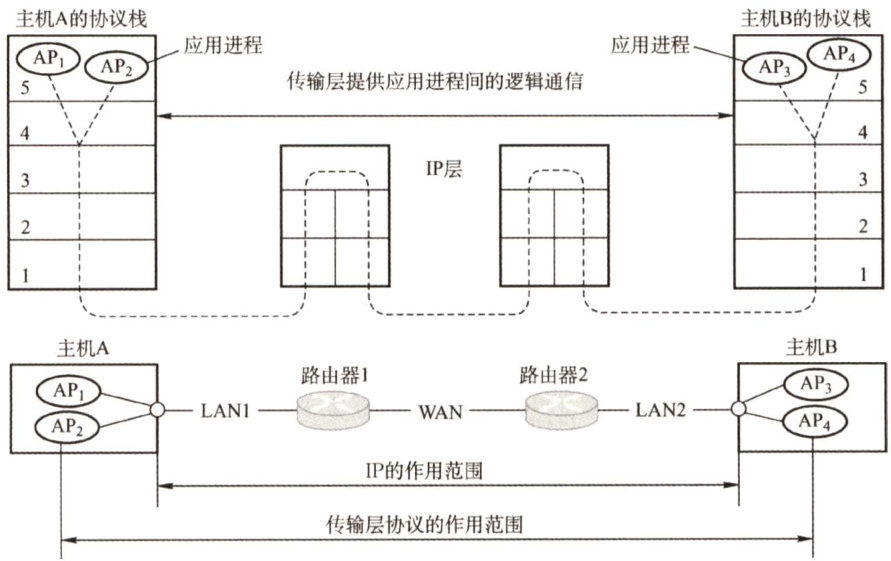

#### 5.1 传输层提供的服务  

#### 5.1.1 传输层的功能  

从通信和信息处理的角度看，传输层向它上面的应用层提供通信服务，它属于面向通信部分的最高层，同时也是用户功能中的最低层。  

传输层位于网络层之上，它为运行在不同主机上的进程之间提供了逻辑通信，而网络层提供主机之间的逻辑通信。显然，即使网络层协议不可靠（网络层协议使分组丢失、混乱或重复)，传输层同样能为应用程序提供可靠的服务。  

从图5.1可以看出，网络的边缘部分的两台主机使用网络核心部分的功能进行端到端的通信时，只有主机的协议栈才有传输层和应用层，而路由器在转发分组时都只用到下三层的功能（即在通信子网中没有传输层，传输层只存在于通信子网以外的主机中)。  

传输层的功能如下：  

1）传输层提供应用进程之间的逻辑通信（即端到端的通信)。与网络层的区别是，网络层提供的是主机之间的逻辑通信。从网络层来说，通信的双方是两台主机，IP数据报的首部给出了这两台主机的IP地址。但“两台主机之间的通信”实际上是两台主机中的应用进程之间的通信，应用进程之间的通信又称端到端的逻辑通信。这里“逻辑通信”的意思是：传输层之间的通信好像是沿水平方向传送数据，但事实上这两个传输层之间并没有一条水平方向的物理连接。  

2）复用和分用。复用是指发送方不同的应用进程都可使用同一个传输层协议传送数据；分用是指接收方的传输层在剥去报文的首部后能够把这些数据正确交付到目的应用进程。  

注意：网络层也有复用分用的功能，但网络层的复用是指发送方不同协议的数据都可以封装成IP数据报发送出去，分用是指接收方的网络层在剥去首部后把数据交付给相应的协议。  

  
图5.1传输层为相互通信的进程提供逻辑通信  

3）传输层还要对收到的报文进行差错检测（首部和数据部分)。而网络层只检查IP数据报的首部，不检验数据部分是否出错。  
4）提供两种不同的传输协议，即面向连接的TCP和无连接的UDP。而网络层无法同时实现两种协议（即在网络层要么只提供面向连接的服务，如虚电路；要么只提供无连接服务，如数据报，而不可能在网络层同时存在这两种方式）。  

传输层向高层用户屏蔽了低层网络核心的细节（如网络拓扑、路由协议等)，它使应用进程看见的是在两个传输层实体之间好像有一条端到端的逻辑通信信道，这条逻辑通信信道对上层的表现却因传输层协议不同而有很大的差别。当传输层采用面向连接的TCP时，尽管下面的网络是不可靠的（只提供尽最大努力的服务)，但这种逻辑通信信道就相当于一条全双工的可靠信道。但当传输层采用无连接的UDP时，这种逻辑通信信道仍然是一条不可靠信道。  

#### 5.1.2 传输层的寻址与端口  

#### 1.端口的作用  

端口能够让应用层的各种应用进程将其数据通过端口向下交付给传输层，以及让传输层知道应当将其报文段中的数据向上通过端口交付给应用层相应的进程。端口是传输层服务访问点(TSAP)，它在传输层的作用类似于IP地址在网络层的作用或MAC地址在数据链路层的作用，只不过IP地址和MAC地址标识的是主机，而端口标识的是主机中的应用进程。  

数据链路层的SAP是MAC地址，网络层的SAP是IP地址，传输层的SAP是端口。  

在协议栈层间的抽象的协议端口是软件端口，它与路由器或交换机上的硬件端口是完全不同的概念。硬件端口是不同硬件设备进行交互的接口，而软件端口是应用层的各种协议进程与传输实体进行层间交互的一种地址。传输层使用的是软件端口。  

#### 2.端口号  

应用进程通过端口号进行标识，端口号长度为16bit，能够表示65536（ $2^{16}$ ）个不同的端口号。  

端口号只具有本地意义，即端口号只标识本计算机应用层中的各进程，在因特网中不同计算机的相同端口号是没有联系的。根据端口号范围可将端口分为两类：  

1）服务器端使用的端口号。它又分为两类，最重要的一类是熟知端口号，数值为 $0\sim1023$ IANA（互联网地址指派机构）把这些端口号指派给了TCP/IP最重要的一些应用程序，让所有的用户都知道。另一类称为登记端口号，数值为 $1024{\sim}49151$ 。它是供没有熟知端口号的应用程序使用的，使用这类端口号必须在IANA登记，以防止重复。  

一些常用的熟知端口号如下：  

<html><body><table><tr><td>应用程序</td><td>FTP</td><td>TELNET</td><td>SMTP</td><td>DNS</td><td>TFTP</td><td>HTTP</td><td>SNMP</td></tr><tr><td>熟知端口号</td><td>21</td><td>23</td><td>25</td><td>53</td><td>69</td><td>80</td><td>161</td></tr></table></body></html>  

2）客户端使用的端口号，数值为 $49152{\sim}65535$ 。由于这类端口号仅在客户进程运行时才动态地选择，因此又称短暂端口号（也称临时端口)。通信结束后，刚用过的客户端口号就不复存在，从而这个端口号就可供其他客户进程以后使用。  

#### 3.套接字  

在网络中通过IP地址来标识和区别不同的主机，通过端口号来标识和区分一台主机中的不同应用进程，端口号拼接到IP地址即构成套接字Socket。在网络中采用发送方和接收方的套接字来识别端点。套接字，实际上是一个通信端点，即  

它唯一地标识网络中的一台主机和其上的一个应用(进程)。  

在网络通信中，主机A发给主机B的报文段包含目的端口号和源端口号，源端口号是“返回地址”的一部分，即当B需要发回一个报文段给A时，B到A的报文段中的目的端口号便是A到B的报文段中的源端口号（完全的返回地址是A的IP地址和源端口号)。  

#### 5.1.3 无连接服务与面向连接服务  

面向连接服务就是在通信双方进行通信之前，必须先建立连接，在通信过程中，整个连接的情况一直被实时地监控和管理。通信结束后，应该释放这个连接。  

无连接服务是指两个实体之间的通信不需要先建立好连接，需要通信时，直接将信息发送到“网络”中，让该信息的传递在网上尽力而为地往目的地传送。  

TCP/IP协议族在IP层之上使用了两个传输协议：一个是面向连接的传输控制协议（TCP)，采用TCP时，传输层向上提供的是一条全双工的可靠逻辑信道；另一个是无连接的用户数据报协议（UDP)，采用UDP时，传输层向上提供的是一条不可靠的逻辑信道。  

TCP提供面向连接的服务，在传送数据之前必须先建立连接，数据传送结束后要释放连接。TCP不提供广播或组播服务。由于TCP提供面向连接的可靠传输服务，因此不可避免地增加了许多开销，如确认、流量控制、计时器及连接管理等。这不仅使协议数据单元的头部增大很多，还要占用许多的处理机资源。因此TCP主要适用于可靠性更重要的场合，如文件传输协议（FTP）、超文本传输协议（HTTP）、远程登录（TELNET）等。  

UDP是一个无连接的非可靠传输层协议。它在IP之上仅提供两个附加服务：多路复用和对数据的错误检查。IP知道怎样把分组投递给一台主机，但不知道怎样把它们投递给主机上的具体应用。UDP在传送数据之前不需要先建立连接，远程主机的传输层收到UDP报文后，不需要给出任何确认。由于UDP比较简单，因此执行速度比较快、实时性好。使用UDP的应用主要包括小文件传送协议（TFTP）、DNS、SNMP和实时传输协议（RTP)。  

注意：  

1）IP数据报和UDP数据报的区别：IP数据报在网络层要经过路由的存储转发；而UDP数据报在传输层的端到端的逻辑信道中传输，封装成IP数据报在网络层传输时，UDP数据报的信息对路由是不可见的。  
2）TCP和网络层虚电路的区别：TCP报文段在传输层抽象的逻辑信道中传输，对路由器不可见；虚电路所经过的交换结点都必须保存虚电路状态信息。在网络层若采用虚电路方式，则无法提供无连接服务；而传输层采用TCP不影响网络层提供无连接服务。  

#### 5.1.4 本节习题精选  

#### 单项选择题  

01．下列不属于通信子网的是（）。  

A.物理层 B.数据链路层 C.网络层 D.传输层  

02.OSI参考模型中，提供端到端的透明数据传输服务、差错控制和流量控制的层是（  

A．物理层 B．网络层 C.传输层 D.会话层  

03.传输层为（）之间提供逻辑通信。  

A.主机 B.进程 C．路由器 D.操作系统  

04．关于传输层的面向连接服务的特性是（）。  

A.不保证可靠和顺序交付 B.不保证可靠但保证顺序交付 C．保证可靠但不保证顺序交付 D.保证可靠和顺序交付  

05．在TCP/IP参考模型中，传输层的主要作用是在互联网的源主机和目的主机对等实体之间建立用于会话的（）。  

A.操作连接 B.点到点连接 C.控制连接 D.端到端连接  

06.可靠传输协议中的“可靠”指的是（）。  

A.使用面向连接的会话 B.使用尽力而为的传输C.使用滑动窗口来维持可靠性 D.使用确认机制来确保传输的数据不丢失  

07.以下（）能够唯一确定一个在互联网上通信的进程。  

A．主机名 B.IP地址及MAC地址C.MAC地址及端口号 D.IP地址及端口号  

08．在（）范围内的端口号被称为“熟知端口号”并限制使用。这就意味着这些端口号是为常用的应用层协议如FTP、HTTP等保留的。  

A. $0\sim127$ B. $0{\sim}255$ C. $0\sim511$ D.0\~1023  

09.以下哪个TCP熟知端口号是错误的？（）  

A.TELNET:23 B. SMTP:25 C.HTTP:80 D.FTP:24  

10．关于TCP和UDP端口的下列说法中，正确的是（）。  

A.TCP和UDP分别拥有自己的端口号，它们互不干扰，可以共存于同一台主机B.TCP和UDP分别拥有自己的端口号，但它们不能共存于同一台主机C.TCP和UDP的端口没有本质区别，但它们不能共存于同一台主机D.当一个TCP连接建立时，它们互不干扰，不能共存于同一台主机  

11．以下说法错误的是（）。  

A.传输层是OSI参考模型的第四层B.传输层提供的是主机间的点到点数据传输C.TCP是面向连接的，UDP是无连接的  

D.TCP进行流量控制和拥塞控制，而UDP既不进行流量控制，又不进行拥塞控制  

12.假设某应用程序每秒产生一个60B的数据块，每个数据块被封装在一个TCP报文中，然后再封装在一个IP数据报中。那么最后每个数据报所包含的应用数据所占的百分比是（）。（注意：TCP报文和IP数据报文的首部没有附加字段。）  

A. $20\%$ B. $40\%$ C. $60\%$ D. $80\%$  

I3．若用户程序使用UDP进行数据传输，则（）层协议必须承担可靠性方面的全部工作  

A．数据链路层 B．网际层 C.传输层 D.应用层  

#### 5.1.5 答案与解析  

#### 单项选择题  

01.D  

通信子网包括物理层、数据链路层和网络层，主要负责数据通信。资源子网是OSI参考模型的上三层，传输层的主要任务是向高层用户屏蔽下面通信子网的细节(如网络拓扑、路由协议等)。  

02.C  

端到端即是进程到进程，物理层只提供在两个结点之间透明地传输比特流，网络层提供主机到主机的通信服务，主要功能是路由选择。此题的条件若换成“TCP/IP 参考模型”，答案依然是C。  

03.B  

传输层提供是端到端服务，为进程之间提供逻辑通信。  

04.D  

面向连接服务是指通信双方在进行通信之前，要先建立一个完整的连接，在通信过程中，整个连接一直可以被实时地监控和管理。通信完毕后释放连接。面向连接的服务可以保证数据的可靠和顺序交付。  

05.D  

TCP/IP模型中，网络层及其以下各层所构成的通信子网负责主机到主机或点到点的通信，而传输层的主要作用是在源主机进程和目的主机进程之间提供端到端的数据传输。一般来说，端到端通信是由一段段的点到点信道构成的，端到端协议建立在点到点协议之上（正如TCP建立在IP之上)，提供应用进程之间的通信手段。所以选D。  

06.D  

如果一个协议使用确认机制对传输的数据进行确认，那么可以认为它是一个可靠的协议；如果一个协议采用“尽力而为”的传输方式，那么是不可靠的。例如，TCP对传输的报文段提供确认，因此是可靠的传输协议；而UDP不提供确认，因此是不可靠的传输协议。  

07.D  

要在互联网上唯一地确定一个进程，就要使用IP 地址和端口号的组合，通常称为套接字（Socket)，IP地址确定某主机，端口号确定该主机上的某进程。  

08.D  

熟知端口号的数值为 $0\sim1023$ ，登记端口号的数值是 $1024{\sim}49151$ ，客户端使用的端口号的数值是 $49152{\sim}65535$ 。  

09.D  

FTP控制连接的端口是21，数据连接的端口是20。  

10.A  

端口号只具有本地意义，即端口号只标识本计算机应用层中的各个进程，且同一台计算机中TCP和UDP分别拥有自己的端口号，它们互不干扰。  

11.B  

传输层是OSI参考模型中的第4层，TCP是面向连接的，它提供流量控制和拥塞控制，保证服务可靠；UDP是无连接的，不提供流量控制和拥塞控制，只能做出尽最大努力的交付。传输层提供的是进程到进程间的传输服务，也称端到端服务。  

12.C  

此题中，一个TCP报文的首部长度是20B，一个IP数据报的首部长度也是20B，再加上60B的数据，一个IP数据报的总长度为100B，可知数据占 $60\%$ 。  

13.D  

传输层协议需要具有的主要功能包括：创建进程到进程的通信；提供流量控制机制。UDP在一个低的水平上完成以上功能，使用端口号完成进程到进程的通信，但在传送数据时没有流量控制机制，也没有确认，而且只提供有限的差错控制。因此UDP是一个无连接、不可靠的传输层协议。如果用户应用程序使用UDP进行数据传输，那么必须在传输层的上层即应用层提供可靠性方面的全部工作。