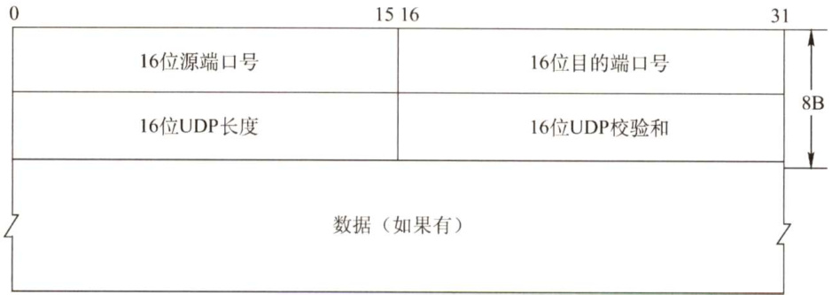
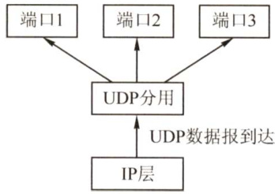
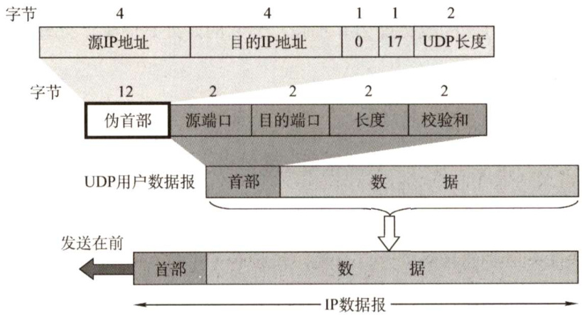
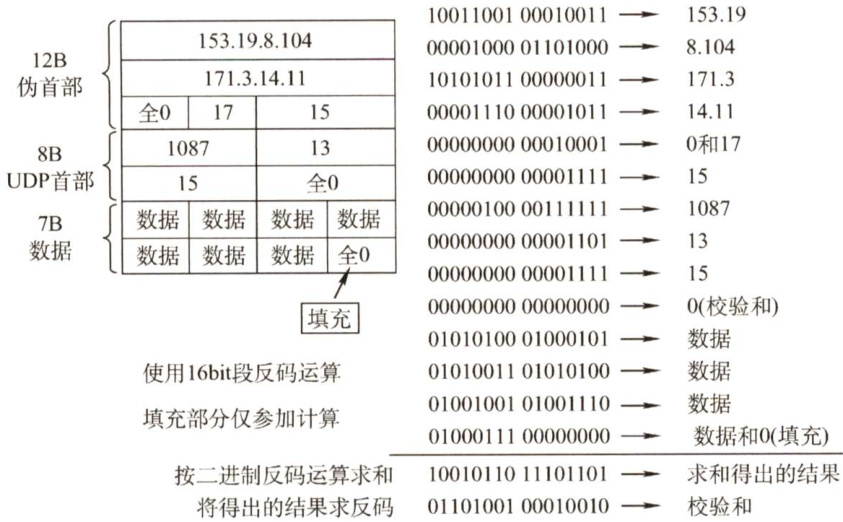

#### 5.2 UDP协议  

#### 5.2.1 UDP数据报  

#### 1.UDP概述  

UDP仅在IP的数据报服务之上增加了两个最基本的服务：复用和分用以及差错检测。如果应用开发者选择UDP而非TCP，那么应用程序几乎直接与IP打交道。为什么应用开发者宁愿在UDP 之上构建应用，也不选择TCP？既然TCP提供可靠的服务，而UDP不提供，那么TCP总是首选吗？答案是否定的，因为有很多应用更适合用UDP，主要因为UDP具有如下优点：  

1）UDP无须建立连接。因此UDP不会引入建立连接的时延。试想如果DNS运行在TCP而非UDP上，那么DNS的速度会慢很多。HTTP使用TCP而非UDP，是因为对于基于文本数据的Web网页来说，可靠性是至关重要的。  
2）无连接状态。TCP需要在端系统中维护连接状态。此连接状态包括接收和发送缓存、拥塞控制参数和序号与确认号的参数。而UDP不维护连接状态，也不跟踪这些参数。因此，某些专用应用服务器使用UDP时，一般都能支持更多的活动客户机。  

3）分组首部开销小。TCP有20B的首部开销，而UDP仅有8B的开销。  

4）应用层能更好地控制要发送的数据和发送时间。UDP没有拥塞控制，因此网络中的拥塞不会影响主机的发送效率。某些实时应用要求以稳定的速度发送，能容忍一些数据的丢失，但不允许有较大的时延，而UDP正好满足这些应用的需求。  

5）UDP支持一对一、一对多、多对一和多对多的交互通信。  

UDP 常用于一次性传输较少数据的网络应用，如DNS、SNMP 等，因为对于这些应用，若采用 TCP，则将为连接创建、维护和拆除带来不小的开销。UDP也常用于多媒体应用（如IP 电话、实时视频会议、流媒体等)，显然，可靠数据传输对这些应用来说并不是最重要的，但TCP的拥塞控制会导致数据出现较大的延迟，这是它们不可容忍的。  

UDP不保证可靠交付，但这并不意味着应用对数据的要求是不可靠的，所有维护可靠性的工作可由用户在应用层来完成。应用开发者可根据应用的需求来灵活设计自己的可靠性机制。  

UDP是面向报文的。发送方UDP对应用层交下来的报文，在添加首部后就向下交付给IP 层，一次发送一个报文，既不合并，也不拆分，而是保留这些报文的边界；接收方UDP对IP 层交上来UDP 数据报，在去除首部后就原封不动地交付给上层应用进程，一次交付一个完整的报文。因此报文不可分割，是UDP数据报处理的最小单位。因此，应用程序必须选择合适大小的报文，若报文太长，UDP把它交给IP层后，可能会导致分片；若报文太短，UDP把它交给IP层后，会使IP数据报的首部的相对长度太大，两者都会降低IP层的效率。  

#### 2.UDP的首部格式  

UDP数据报包含两部分：UDP首部和用户数据。UDP首部有8B，由4个字段组成，每个字段的长度都是2B，如图5.2所示。各字段意义如下：  

1）源端口。源端口号。在需要对方回信时选用，不需要时可用全0。  
2）目的端口。目的端口号。这在终点交付报文时必须使用到。  
3）长度。UDP数据报的长度（包括首部和数据)，其最小值是8（仅有首部)。  
4）校验和。检测UDP数据报在传输中是否有错。有错就丢弃。该字段是可选的，当源主机  
不想计算校验和时，则直接令该字段为全0。  

  
图5.2 UDP数据报格式  

当传输层从IP层收到UDP数据报时，就根据首部中的目的端口，把UDP数据报通过相应的端口上交给应用进程，如图5.3所示。  

如果接收方UDP发现收到的报文中的目的端口号不正确（即不存在对应于端口号的应用进程)，那么就丢弃该报文，并由ICMP发送“端口不可达”差错报文给发送方。  

  
图5.3UDP基于端口的分用  

#### 5.2.2 UDP校验  

在计算校验和时，要在UDP数据报之前增加12B的伪首部，伪首部并不是UDP的真正首部。只是在计算校验和时，临时添加在UDP数据报的前面，得到一个临时的UDP数据报。校验和就是按照这个临时的UDP数据报来计算的。伪首部既不向下传送又不向上递交，而只是为了计算校验和。图5.4给出了UDP数据报的伪首部各字段的内容。  

  
图5.4UDP数据报的首部和伪首部  

UDP校验和的计算方法和IP数据报首部校验和的计算方法相似。但不同的是，IP数据报的校验和只检验IP数据报的首部，但UDP的校验和则检查首部和数据部分。  

发送方首先把全零放入校验和字段并添加伪首部，然后把UDP数据报视为许多16位的字串接起来。若UDP数据报的数据部分不是偶数个字节，则要在数据部分末尾填入一个全零字节（但此字节不发送)。然后按二进制反码计算出这些16位字的和，将此和的二进制反码写入校验和字段，并发送。接收方把收到的UDP数据报加上伪首部（如果不为偶数个字节，那么还需要补上全零字节）后，按二进制反码求这些16位字的和。当无差错时其结果应为全1，否则就表明有差错出现，接收方就应该丢弃这个UDP数据报。  

图5.5给出了一个计算UDP校验和的例子。本例中，UDP数据报的长度是15B（不含伪首部)，因此需要添加一个全0字节。  

  
图5.5计算UDP校验和的例子  

注意：  

1）校验时，若UDP数据报部分的长度不是偶数个字节，则需填入一个全0字节，如图5.5所示。但是此字节和伪首部一样，是不发送的。  
2）如果UDP校验和校验出UDP数据报是错误的，那么可以丢弃，也可以交付给上层，但是需要附上错误报告，即告诉上层这是错误的数据报。  
3）通过伪首部，不仅可以检查源端口号、目的端口号和UDP用户数据报的数据部分，还可以检查IP数据报的源IP地址和目的地址。  

这种简单的差错校验方法的校错能力并不强，但它的好处是简单、处理速度快。  

#### 5.2.3 本节习题精选  

#### 一、单项选择题  

01.使用UDP的网络应用，其数据传输的可靠性由（）负责。  

A．传输层 B.应用层 C.数据链路层 D.网络层  

02．以下关于UDP协议的主要特点的描述中，错误的是（）。  

A.UDP报头主要包括端口号、长度、校验和等字段B.UDP长度字段是UDP数据报的长度，包括伪首部的长度C.UDP校验和对伪首部、UDP报文头及应用层数据进行校验D.伪首部包括IP分组报头的一部分  

03.UDP数据报首部不包含（）。  

A.UDP源端口号 B.UDP校验和C.UDP目的端口号 D.UDP数据报首部长度  

04.UDP数据报中的长度字段（）。  

A．不记录数据的长度 B．只记录首部的长度C.只记录数据部分的长度 D．包括首部和数据部分的长度  

05.UDP数据报比IP数据报多提供了（）服务。  

A．流量控制 B．拥塞控制 C.端口功能 D．路由转发  

06．下列关于UDP的描述，正确的是（）。  

A.给出数据的按序投递 B.不允许多路复用C.拥有流量控制机制 D．是无连接的  

07．接收端收到有差错的UDP用户数据时的处理方式是（）。  

A.丢弃 B．请求重传 C．差错校正 D．忽略差错  

08．以下关于UDP校验和的说法中，错误的是（）。  

A.UDP的校验和功能不是必需的，可以不使用B．如果UDP校验和计算结果为0，那么在校验和字段填充0C.UDP校验和字段的计算包括一个伪首部、UDP首部和携带的用户数据D.UDP校验和的计算方法是二进制反码运算求和再取反  

09．下列关于UDP校验的描述中，（）是错误的。  

A.UDP校验和段的使用是可选的，若源主机不想计算校验和，则该校验和段应为全0B.在计算校验和的过程中，需要生成一个伪首部，源主机需要把该伪首部发送给目的主机C．如果数据报在传输过程中被破坏，那么就把它丢弃  
D.UDP数据报的伪首部包含了IP地址信息  

10.下列网络应用中，（）不适合使用UDP协议。  

A．客户机/服务器领域 B．远程调用C．实时多媒体应用 D.远程登录  

11．【2014统考真题】下列关于UDP协议的叙述中，正确的是（）。  

I．提供无连接服务  
II．提供复用/分用服务  
IⅢI.通过差错校验，保障可靠数据传输  

A.仅I B.仅I、Ⅱ C.仅Ⅱ、IⅢI D.I、、III  

12.【2018统考真题】UDP协议实现分用时所依据的头部字段是（）。  

A.源端口号 B.目的端口号 C.长度 D.校验和  

#### 二、综合应用题  

01.为什么要使用UDP？让用户进程直接发送原始的IP分组不就足够了吗？  

02.使用TCP对实时语音数据的传输是否有问题？使用UDP传送数据文件时有什么问题？  

03．一个应用程序用UDP，到了IP层将数据报再划分为4个数据报片发送出去。结果前两个数据报片丢失，后两个到达目的站。过了一段时间应用程序重传UDP，而IP层仍然划分为4个数据报片来传送。结果这次前两个到达目的站而后两个丢失。试问：在目的站能否将这两次传输的4个数据报片组装成为完整的数据报？假定目的站第一次收到的后两个数据片仍然保存在目的站的缓存中。  

04.一个UDP首部的信息（十六进制表示）为0xF7210045002CE827。UDP数据报的格式如下图所示。试问：  

<html><body><table><tr><td colspan="3">0 1516 31</td></tr><tr><td>16位源端口号</td><td>16位目的端口号</td><td rowspan="3">8B</td></tr><tr><td>16位UDP长度</td><td>16位UDP校验和</td></tr><tr><td colspan="2">数据(如果有)</td></tr></table></body></html>  

1）源端口、目的端口、数据报总长度、数据部分长度分别是什么？  

2）该UDP数据报是从客户发送给服务器还是从服务器发送给客户？使用该UDP服务的程序使用的是哪个应用层协议？  

05.一个UDP用户数据报的数据字段为8192B，要使用以太网来传送。假定IP数据报无选项。试问应当划分为几个IP数据报片？说明每个IP数据报片的数据字段长度和片段偏移字段的值。  

#### 5.2.4 答案与解析  

#### 一、单项选择题  

01.B  

UDP本身是无法保证传输的可靠性的，并且UDP是基于网络层的IP的，IP的特点是尽最大努力交付，因此无法在网络层及数据链路层提供可靠传输。因此，只能通过应用层协议来实现可靠传输。  

02.B  

伪首部只是在计算校验和时临时添加的，不计入UDP的长度。对于D选项，伪首部包括源IP和目的IP，这是IP分组报头的一部分。  

03.D  

UDP数据报的格式包括UDP源端口号、UDP目的端口号、UDP报文长度和校验和，但不包括UDP数据报首部长度。因为UDP数据报首部长度是固定的8B，所以没有必要再设置首部长度字段。  

04.D  

长度字段记录UDP数据报的长度（包括首部和数据部分)，以字节为单位。  

05.C  

虽然UDP协议和IP协议都是数据报协议，但是它们之间还是存在差别。其中，最大的差别是 IP数据报只能找到目的主机而无法找到目的进程，UDP提供端口功能及复用和分用功能，可以将数据报投递给对应的进程。  

06.D  

UDP 是不可靠的，所以没有数据的按序投递，排除A；UDP只在IP的数据报服务上增加了很少的一点功能，即复用和分用功能及差错检测功能，排除B；显然UDP没有流量控制，排除C;UDP是传输层的无连接协议，答案为D。  

07.A  

接收端通过校验发现数据有差错，就直接丢弃该数据报，仅此而已。  

08.B  

UDP 的校验和不是必需的，如果不使用校验和，那么将校验和字段设置为0，而如果校验和的计算结果恰好为0，那么将校验和字段置为全1。  

09.B  

UDP数据报的伪首部包含了IP地址信息，目的是通过数据校验保证UDP数据报正确地到达目的主机。该伪首部由源和目的主机仅在校验和计算期间建立，并不发送。  

10.D  

UDP 的特点是开销小，时间性能好且易于实现。在客户/服务器模式中，它们之间的请求都很短，使用UDP不仅编码简单，而且只需要很少的消息；远程调用使用UDP的理由和客户/服务器模式的一样；对于实时多媒体应用，需要保证数据及时传送，而比例不大的错误是可以容忍的，所以使用UDP也是合适的，而且使用UDP协议可以实现多播，给多个客户端服务；而远程登录需要依靠一个客户端到服务器的可靠连接，使用UDP是不合适的。  

11.B  

解析请扫右侧二维码查阅。  

12.B  

传输层分用的定义是，接收方的传输层剥去报文首部后，能把这些数据正确交付到目的进程。C 和D选项显然不符。端口号是传输层服务访问点（TSAP)，用来标识主机中的应用进程。对于A和B选项，源端口号在需要对方回信时选用，不需要时可用全0。目的端口号在终点交付报文时使用，符合题意，因此选B。  

#### 二、综合应用题  

01.【解答】  

仅仅使用IP分组还不够。IP分组包含IP地址，该地址指定一个目的机器。一旦这样的分组到达目的机器，网络控制程序如何知道把它交给哪个进程呢？UDP分组包含一个目的端口，这一信息是必需的，因为有了它，分组才能被投递给正确的进程。此外，UDP可以对数据报做包括数据段在内的差错检测，而IP只对其首部做差错检测。  

02.【解答】  

如果语音数据不实时播放，那么可以使用TCP，因为TCP有重传机制，传输可靠。接收端用TCP将语音数据接收完毕后，可以在以后的任何时间进行播放。若假定是实时传输，不宜重传，则必须使用UDP。UDP不保证可靠递交，没有重传机制，因此在传输数据时可能会丢失数据，但UDP比TCP的开销要小很多，实时性好。  

03.【解答】  

不行。重传时，IP 数据报的标识字段会有另一个标识符。仅当标识符相同的IP 数据报片才能组装成一个IP数据报。前两个IP数据报片的标识符与后两个IP数据报片的标识符不同，因此不能组装成一个IP数据报。  

04.【解答】  

1）第1、2个字节为源端口，即F721，转换成十进制数为63265。第3、4个字节为目的端口，即0045，转换成十进制数为69。第5、6个字节为UDP长度（包含首部和数据部分)，即002C，转换成十进制数为44，数据报总长度为44B，数据部分长度为 $44-8=36\mathrm{B}$ 。  

2）由1）可知，该UDP数据报的源端口号为63265，目的端口号为69，前一个为客户端使用的端口号，后一个为熟知的TFTP协议的端口，可知该数据报是客户发给服务器的。  

05.【解答】  

以太网帧的数据段的最大长度是1500B，UDP用户数据报的首部是8B。假定IP数据报无选项，首部长度都是 $20\mathrm{B}$ 。IP数据报的片段偏移指出一个片段在原IP分组中的相对位置，偏移的单位是8B。UDP用户数据报的数据字段为8192B，加上8B的首部，总长度是 $8200\mathrm{B}$ 。应当划分为6个IP报片。各IP报片总长度、数据长度和片偏移如下表所示。  

<html><body><table><tr><td></td><td>1</td><td>2</td><td>3</td><td>4</td><td>5</td><td>6</td></tr><tr><td>IP报片总长度</td><td>1500B</td><td>1500B</td><td>1500B</td><td>1500B</td><td>1500B</td><td>820B</td></tr><tr><td>数据长度</td><td>1480B</td><td>1480B</td><td>1480B</td><td>1480B</td><td>1480B</td><td>800B</td></tr><tr><td>片偏移</td><td>0</td><td>185</td><td>370</td><td>555</td><td>740</td><td>925</td></tr></table></body></html>