#### 5.3 TCP协议  

#### 5.3.1 TCP协议的特点  

TCP 是在不可靠的IP层之上实现的可靠的数据传输协议，它主要解决传输的可靠、有序、无丢失和不重复问题。TCP是TCP/IP体系中非常复杂的一个协议，主要特点如下：  

1）TCP是面向连接的传输层协议，TCP连接是一条逻辑连接。  
2）每条TCP连接只能有两个端点，每条TCP连接只能是端到端的（进程对进程)。  
3）TCP提供可靠交付的服务，保证传送的数据无差错、不丢失、不重复且有序。  
4）TCP提供全双工通信，允许通信双方的应用进程在任何时候都能发送数据，为此TCP连接的两端都设有发送缓存和接收缓存，用来临时存放双向通信的数据。发送缓存用来暂时存放以下数据： $\textcircled{1}$ 发送应用程序传送给发送方TCP准备发送的数据；$\textcircled{2}$ TCP已发送但尚未收到确认的数据。接收缓存用来暂时存放以下数据： $\textcircled{1}$ 按序到达但尚未被接收应用程序读取的数据； $\textcircled{2}$ 不按序到达的数据。  

5）TCP 是面向字节流的，虽然应用程序和TCP的交互是一次一个数据块（大小不等)，但TCP把应用程序交下来的数据仅视为一连串的无结构的字节流。  

TCP 和UDP在发送报文时所采用的方式完全不同。UDP报文的长度由发送应用进程决定，而 TCP报文的长度则根据接收方给出的窗口值和当前网络拥塞程度来决定。如果应用进程传送到TCP 缓存的数据块太长，TCP就把它划分得短一些再传送；如果太短，TCP也可以等到积累足够多的字节后再构成报文段发送出去。关于TCP报文的长度问题，后面会详细讨论。  

#### 5.3.2 TCP报文段  

TCP 传送的数据单元称为报文段。TCP报文段既可以用来运载数据，又可以用来建立连接、释放连接和应答。一个TCP 报文段分为首部和数据两部分，整个TCP报文段作为IP数据报的数据部分封装在IP数据报中，如图5.6所示。其首部的前20B是固定的。TCP首部最短为 20B，后面有4N字节是根据需要而增加的选项，长度为4B的整数倍。  

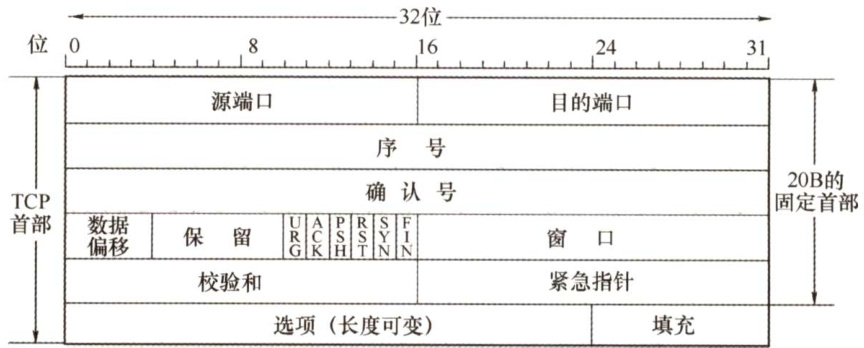  

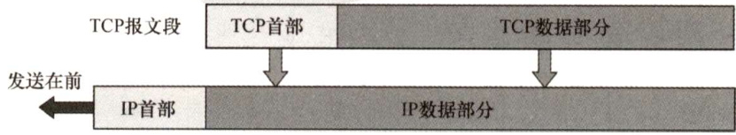  
图5.6TCP报文段  

TCP的全部功能体现在其首部的各个字段中，各字段意义如下：  

1）源端口和目的端口。各占2B。端口是运输层与应用层的服务接口，运输层的复用和分用功能都要通过端口实现。  
2）序号。占4B，范围为 $0^{\sim2^{32}-1}$ ，共 $2^{32}$ 个序号。TCP是面向字节流的（即TCP传送时是逐个字节传送的)，所以TCP连接传送的字节流中的每个字节都按顺序编号。序号字段的值指的是本报文段所发送的数据的第一个字节的序号。例如，一报文段的序号字段值是301，而携带的数据共有100B，表明本报文段的数据的最后一个字节的序号是400，因此下一个报文段的数据序号应从401开始。  
3）确认号。占4B，是期望收到对方下一个报文段的第一个数据字节的序号。若确认号为 $N$ 则表明到序号 $N-1$ 为止的所有数据都已正确收到。例如，B正确收到了A发送过来的一个报文段，其序号字段是501，而数据长度是200B（序号 $501\sim700\$ )，这表明B正确收到了A发送的到序号700为止的数据。因此B期望收到A的下一个数据序号是701，于是B在发送给A的确认报文段中把确认号置为701。  
4）数据偏移（即首部长度)。占4位，这里不是IP数据报分片的那个数据偏移，而是表示首部长度（首部中还有长度不确定的选项字段)，它指出TCP报文段的数据起始处距离TCP报文段的起始处有多远。“数据偏移”的单位是32位（以4B为计算单位)。由于4位二进制数能表示的最大值为15，因此TCP首部的最大长度为 $60\mathrm{B}$ 。  
5）保留。占6位，保留为今后使用，但目前应置为0。  
6）紧急位URG。当 $\mathbf{U}\mathbf{R}\mathbf{G}=1$ 时，表明紧急指针字段有效。它告诉系统此报文段中有紧急数据，应尽快传送（相当于高优先级的数据)。但URG 需要和首部中紧急指针字段配合使用，即数据从第一个字节到紧急指针所指字节就是紧急数据。  
7）确认位ACK。仅当 $\mathbf{ACK}=1$ 时确认号字段才有效。当 $\mathbf{ACK}=0$ 时，确认号无效。TCP规定，在连接建立后所有传送的报文段都必须把ACK置1。  
8）推送位PSH（Push）。接收方TCP收到 $\mathrm{PSH}=1$ 的报文段，就尽快地交付给接收应用进程，而不再等到整个缓存都填满了后再向上交付。  
9）复位位RST（Reset）。当 $\mathbf{RST}=1$ 时，表明TCP连接中出现严重差错（如主机崩溃或其他原因)，必须释放连接，然后再重新建立运输连接。  
10）同步位SYN。当 $\mathrm{SYN}=1$ 时表示这是一个连接请求或连接接受报文。当 $\mathrm{SYN}=1$ ， $\mathbf{ACK}=0$ 时，表明这是一个连接请求报文，对方若同意建立连接，则应在响应报文中使用 $\mathrm{SYN}=1$ ， $\mathbf{ACK}=1$ o  
11）终止位FIN（Finish)。用来释放一个连接。当 $\mathrm{{FIN}=1}$ 时，表明此报文段的发送方的数据已发送完毕，并要求释放运输连接。  
12）窗口。占2B，范围为 $0{\sim}2^{16}-1$ 。它指出现在允许对方发送的数据量，接收方的数据缓存空间是有限的，因此用窗口值作为接收方让发送方设置其发送窗口的依据。例如，设确认号是701，窗口字段是1000。这表明，从701号算起，发送此报文段的一方还有接收1000字节数据（字节序号为 $701\sim1700$ ）的接收缓存空间。  
13）校验和。占2B。校验和字段检验的范围包括首部和数据两部分。在计算校验和时，和UDP一样，要在TCP报文段的前面加上12B的伪首部（只需将UDP伪首部的第4个字段，即协议字段的17改成6，其他的和UDP一样)。  

14）紧急指针。占2B。紧急指针仅在 $\mathrm{URG}=1$ 时才有意义，它指出在本报文段中紧急数据共有多少字节（紧急数据在报文段数据的最前面)。  
15）选项。长度可变。TCP最初只规定了一种选项，即最大报文段长度（Maximum Segment Size，MSS)。MSS是TCP报文段中的数据字段的最大长度（注意仅仅是数据字段)。  
16）填充。这是为了使整个首部长度是4B的整数倍。  

#### 5.3.3 TCP连接管理  

TCP 是面向连接的协议，因此每个TCP连接都有三个阶段：连接建立、数据传送和连接释放。TCP连接的管理就是使运输连接的建立和释放都能正常进行。  

在TCP连接建立的过程中，要解决以下三个问题：  

1）要使每一方能够确知对方的存在。2）要允许双方协商一些参数（如最大窗口值、是否使用窗口扩大选项、时间戳选项及服务质量等)。3）能够对运输实体资源（如缓存大小、连接表中的项目等）进行分配。TCP 把连接作为最基本的抽象，每条TCP连接有两个端点，TCP连接的端点不是主机，不是主机的IP地址，不是应用进程，也不是传输层的协议端口。TCP连接的端口即为套接字（Socket)或插口，每条TCP连接唯一地被通信的两个端点（即两个套接字）确定。  

TCP连接的建立采用客户/服务器模式。主动发起连接建立的应用进程称为客户（Client)），而被动等待连接建立的应用进程称为服务器（Server)。  

#### 1.TCP连接的建立  

连接的建立经历以下3个步骤，通常称为三次握手，如图5.7所示。  

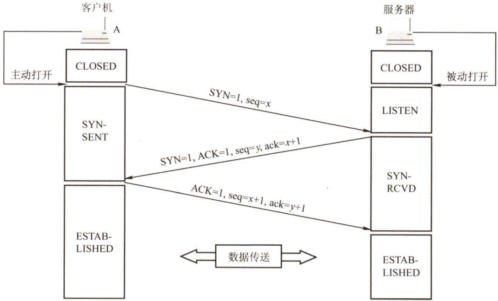  
图5.7用“三次握手”建立TCP连接  

连接建立前，服务器进程处于LISTEN（收听）状态，等待客户的连接请求。  

第一步：客户机的TCP首先向服务器的TCP发送连接请求报文段。这个特殊报文段的首部中的同步位SYN置1，同时选择一个初始序号 $\mathbf{\boldsymbol{seq}}=\boldsymbol{x}$ 。TCP规定，SYN报文段不能携带数据，但要消耗掉一个序号。这时，TCP客户进程进入SYN-SENT（同步已发送）状态。  

第二步：服务器的TCP收到连接请求报文段后，如同意建立连接，则向客户机发回确认，并为该TCP连接分配缓存和变量。在确认报文段中，把SYN位和ACK位都置1，确认号是 $\mathbf{ack}=x$ $^+1$ ，同时也为自己选择一个初始序号 $\mathbf{\boldsymbol{seq}}=\boldsymbol{y}$ 。注意，确认报文段不能携带数据，但也要消耗掉一个序号。这时，TCP服务器进程进入SYN-RCVD（同步收到）状态。  

第三步：当客户机收到确认报文段后，还要向服务器给出确认，并为该TCP连接分配缓存和变量。确认报文段的ACK位置1，确认号 $\mathbf{ack}=y+1$ ，序号 $\operatorname{seq}=x+1$ 。该报文段可以携带数据，若不携带数据则不消耗序号。这时，TCP客户进程进入ESTABLISHED（已建立连接）状态。  

成功进行以上三步后，就建立了TCP连接，接下来就可以传送应用层数据。TCP提供的是全双工通信，因此通信双方的应用进程在任何时候都能发送数据。  

另外，值得注意的是，服务器端的资源是在完成第二次握手时分配的，而客户端的资源是在完成第三次握手时分配的，这就使得服务器易于受到SYN洪泛攻击。  

#### 2.TCP连接的释放  

天下没有不散的筵席，TCP同样如此。参与TCP连接的两个进程中的任何一个都能终止该连接。TCP连接释放的过程通常称为四次握手，如图5.8所示。  

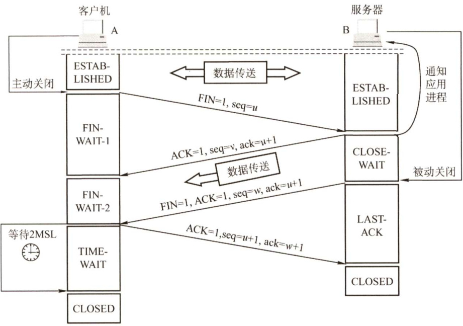  
图5.8用“四次握手”释放TCP连接  

第一步：客户机打算关闭连接时，向其TCP发送连接释放报文段，并停止发送数据，主动关闭TCP连接，该报文段的终止位FIN置1，序号 $\operatorname{seq}=u$ ，它等于前面已传送过的数据的最后一个字节的序号加1，FIN报文段即使不携带数据，也消耗掉一个序号。这时，TCP 客户进程进入FIN-WAIT-1（终止等待1）状态。TCP是全双工的，即可以想象为一条TCP连接上有两条数据通路，发送FIN的一端不能再发送数据，即关闭了其中一条数据通路，但对方还可以发送数据。  

第二步：服务器收到连接释放报文段后即发出确认，确认号 $\mathbf{ack}=u+1$ ，序号 $\mathbf{\boldsymbol{seq}}=\nu$ ，等于它前面已传送过的数据的最后一个字节的序号加1。然后服务器进入CLOSE-WAIT（关闭等待）状态。此时，从客户机到服务器这个方向的连接就释放了，TCP连接处于半关闭状态。但服务器若发送数据，客户机仍要接收，即从服务器到客户机这个方向的连接并未关闭。  

第三步：若服务器已经没有要向客户机发送的数据，就通知TCP释放连接，此时，其发出 $\mathrm{FIN}=1\$ 的连接释放报文段。设该报文段的序号为 $w$ （在半关闭状态服务器可能又发送了一些数据)，还须重复上次已发送的确认号 $\operatorname{ack}=u+1$ 。这时服务器进入LAST-ACK（最后确认）状态。  

第四步：客户机收到连接释放报文段后，必须发出确认。把确认报文段中的确认位ACK 置1，确认号 $\operatorname{ack}=w+1$ ，序号 $\operatorname{seq}{}=u+1$ 。此时TCP连接还未释放，必须经过时间等待计时器设置的时间2MSL（最长报文段寿命）后，客户机才进入CLOSED（连接关闭）状态。  

对上述TCP连接建立和释放的总结如下：  

1）连接建立。分为3步：  

$\mathrm{(1)}\mathrm{SYN}=1,\mathrm{seq}=x_{\mathrm{(}}$ $\textcircled{2}\mathrm{SYN}=1,\mathrm{ACK}=1,\mathrm{seq}=y,\mathrm{ack}=x+1\mathrm{_{d}}$ $\textcircled{3}\mathbf{ACK}=1,\mathbf{seq}=x+1,\mathbf{ack}=y+1,$ 。  

2）释放连接。分为4步：  

$\textcircled{1}\mathrm{FIN}=1,\mathrm{seq}=u_{\circ}$ $\textcircled{2}\mathrm{\bfACK}=1,\mathrm{\bfseq}=\nu,\mathrm{\bfack}=u+1,$ $\begin{array}{r}{\bigodot\mathrm{FIN}=1,\mathrm{ACK}=1,\mathrm{seq}=w,\mathrm{ack}=u+1,}\end{array}$ 。$\textcircled{4}\mathbf{ACK}=1,\mathbf{seq}=u+1,\mathbf{ack}=w+1{\mathrm{~e~}}$  

选择题喜欢考查（关于连接和释放的题目，ACK、SYN、FIN一定等于1)，请牢记。  

#### 5.3.4 TCP可靠传输  

TCP 的任务是在IP层不可靠的、尽力而为服务的基础上建立一种可靠数据传输服务。TCP提供的可靠数据传输服务保证接收方进程从缓存区读出的字节流与发送方发出的字节流完全一样。TCP使用了校验、序号、确认和重传等机制来达到这一目的。其中，TCP 的校验机制与UDP校验一样，这里不再赘述。  

#### 1.序号  

TCP首部的序号字段用来保证数据能有序提交给应用层，TCP把数据视为一个无结构但有序的字节流，序号建立在传送的字节流之上，而不建立在报文段之上。  

TCP连接传送的数据流中的每个字节都编上一个序号。序号字段的值是指本报文段所发送的  

数据的第一个字节的序号。如图5.9所示，假设A和B之间建立了一条TCP连接，A的发送缓存区中共有10B，序号从0开始标号，第一个报文包含第$0{\sim}2$ 个字节，则该TCP报文段的序号是0，第二个报文段的序号是3。  

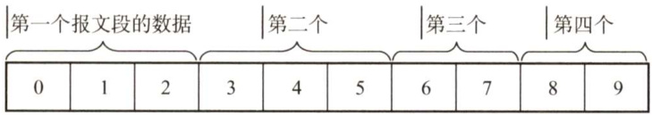  
图5.9A的发送缓存区中的数据划分成TCP段  

#### 2.确认  

TCP 首部的确认号是期望收到对方的下一个报文段的数据的第一个字节的序号。在图5.9中，如果接收方B已收到第一个报文段，此时B希望收到的下一个报文段的数据是从第3个字节开始的，那么B发送给A的报文中的确认号字段应为3。发送方缓存区会继续存储那些已发送但未收到确认的报文段，以便在需要时重传。  

TCP 默认使用累积确认，即 TCP 只确认数据流中至第一个丢失字节为止的字节。例如，在图5.9中，接收方B收到了A发送的包含字节 $0{\sim}2$ 及字节 $6{\sim}7$ 的报文段。由于某种原因，B还未收到字节 $3{\sim}5$ 的报文段，此时B仍在等待字节3（和其后面的字节)，因此B到A的下一个报文段将确认号字段置为3。  

#### 3.重传  

有两种事件会导致TCP对报文段进行重传：超时和冗余ACK。  

（1）超时  

TCP每发送一个报文段，就对这个报文段设置一次计时器。计时器设置的重传时间到期但还未收到确认时，就要重传这一报文段。  

由于TCP的下层是一个互联网环境，IP数据报所选择的路由变化很大，因而传输层的往返时延的方差也很大。为了计算超时计时器的重传时间，TCP采用一种自适应算法，它记录一个报文段发出的时间，以及收到相应确认的时间，这两个时间之差称为报文段的往返时间（Round-TripTime，RTT)。TCP保留了RTT的一个加权平均往返时间 $\mathsf{R T T}_{\mathrm{S}}$ ，它会随新测量RTT样本值的变化而变化。显然，超时计时器设置的超时重传时间（RetransmissionTime-Out，RTO）应略大于$\mathsf{R T T}_{\mathrm{S}}$ ，但也不能大太多，否则当报文段丢失时，TCP不能很快重传，导致数据传输时延大。  

#### （2）余ACK（冗余确认）  

超时触发重传存在的一个问题是超时周期往往太长。所幸的是，发送方通常可在超时事件发生之前通过注意所谓的冗余ACK来较好地检测丢包情况。冗余ACK 就是再次确认某个报文段的ACK，而发送方先前已经收到过该报文段的确认。例如，发送方A发送了序号为1、2、3、4、5的TCP报文段，其中2号报文段在链路中丢失，它无法到达接收方B。因此3、4、5号报文段对于B来说就成了失序报文段。TCP规定每当比期望序号大的失序报文段到达时，就发送一个冗余ACK，指明下一个期待字节的序号。在本例中，3、4、5号报文到达B，但它们不是B所期望收到的下一个报文，于是B就发送3个对1号报文段的冗余ACK，表示自己期望接收2号报文段。TCP规定当发送方收到对同一个报文段的3个冗余ACK时，就可以认为跟在这个被确认报文段之后的报文段已经丢失。就前面的例子而言，当A收到对于1号报文段的3个余ACK时，它可以认为2号报文段已经丢失，这时发送方A可以立即对2号报文执行重传，这种技术通常称为快速重传。当然，冗余ACK还被用在拥塞控制中，这将在后面的内容中讨论。  

#### 5.3.5 TCP流量控制  

TCP提供流量控制服务来消除发送方（发送速率太快）使接收方缓存区溢出的可能性，因此可以说流量控制是一个速度匹配服务（匹配发送方的发送速率与接收方的读取速率)。  

TCP提供一种基于滑动窗口协议的流量控制机制，滑动窗口的基本原理已在第3章的数据链路层介绍过，这里要介绍的是TCP如何使用窗口机制来实现流量控制。  

在通信过程中，接收方根据自己接收缓存的大小，动态地调整发送方的发送窗口大小，这称为接收窗口rwnd，即调整TCP报文段首部中的“窗口”字段值，来限制发送方向网络注入报文的速率。同时，发送方根据其对当前网络拥塞程度的估计而确定的窗口值，这称为拥塞窗口cwnd（后面会讲到)，其大小与网络的带宽和时延密切相关。  

例如，在通信中，有效数据只从A发往B，而B仅向A发送确认报文，这时B可以通过设置确认报文段首部的窗口字段来将rwnd通知给A。rwnd即接收方允许连续接收的最大能力，单位是字节。发送方A总是根据最新收到的rwnd值来限制自己发送窗口的大小，从而将未确认的数据量控制在rwnd大小之内，保证A不会使B的接收缓存溢出。当然，A的发送窗口的实际大小取rwnd和cwnd中的最小值。图5.10中的例子说明了如何利用滑动窗口机制进行流量控制。设A向B发送数据，在连接建立时，B告诉A：“我的接收窗口rwnd $\mathbf{\tau}=40^{\prime}$ ’。接收方主机B进行了三次流量控制，这三个报文段都设置了 $\mathbf{ACK}=1$ ，只有在 $\mathbf{ACK}=1$ 时确认号字段才有意义。第一次把窗口减小到rwnd $1=300$ ，第二次又减到rwnd $1=100$ ，最后减到 $\mathrm{rwnd}=0$ ，即不允许发送方再发送数据。这使得发送方暂停发送的状态将持续到B重新发出一个新的窗口值为止。  

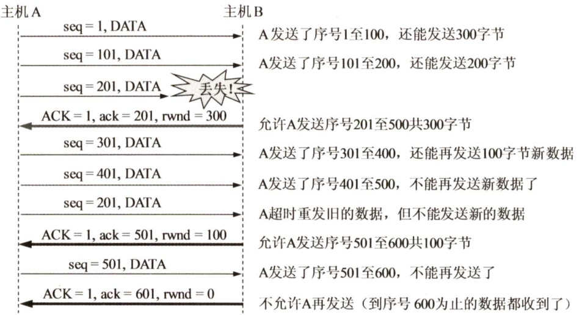  
图5.10利用可变窗口进行流量控制举例  

传输层和数据链路层的流量控制的区别是：传输层定义端到端用户之间的流量控制，数据链路层定义两个中间的相邻结点的流量控制。另外，数据链路层的滑动窗口协议的窗口大小不能动态变化，传输层的则可以动态变化。  

#### 5.3.6 TCP拥塞控制  

拥塞控制是指防止过多的数据注入网络，保证网络中的路由器或链路不致过载。出现拥塞时，端点并不了解拥塞发生的细节，对通信连接的端点来说，拥塞往往表现为通信时延的增加。  

拥塞控制与流量控制的区别：拥塞控制是让网络能够承受现有的网络负荷，是一个全局性的过程，涉及所有的主机、所有的路由器，以及与降低网络传输性能有关的所有因素。相反，流量控制往往是指点对点的通信量的控制，是个端到端的问题（接收端控制发送端)，它所要做的是抑制发送端发送数据的速率，以便使接收端来得及接收。当然，拥塞控制和流量控制也有相似的地方，即它们都通过控制发送方发送数据的速率来达到控制效果。  

例如，某个链路的传输速率为 $10\mathrm{Gb/s}$ ，某大型机向一台PC以1Gb/s的速率传送文件，显然网络的带宽是足够大的，因而不存在拥塞问题，但如此高的发送速率将导致PC 可能来不及接收，因此必须进行流量控制。但若有100万台PC 在此链路上以1Mb/s 的速率传送文件，则现在的问题就变为网络的负载是否超过了现有网络所能承受的范围。  

因特网建议标准定义了进行拥塞控制的4种算法：慢开始、拥塞避免、快重传和快恢复。  

发送方在确定发送报文段的速率时，既要根据接收方的接收能力，又要从全局考虑不要使网络发生拥塞。因此，TCP协议要求发送方维护以下两个窗口：  

1）接收窗口rwnd，接收方根据目前接收缓存大小所许诺的最新窗口值，反映接收方的容量。由接收方根据其放在TCP报文的首部的窗口字段通知发送方。  

）拥塞窗口cwnd，发送方根据自己估算的网络拥塞程度而设置的窗口值，反映网络的当前容量。只要网络未出现拥塞，拥塞窗口就再增大一些，以便把更多的分组发送出去。但  

只要网络出现拥塞，拥塞窗口就减小一些，以减少注入网络的分组数。发送窗口的上限值应取接收窗口rwnd和拥塞窗口cwnd中较小的一个，即  

发送窗口的上限值 $\mathbf{\Sigma}=\mathbf{\Sigma}$ min[rwnd, cwnd]  

接收窗口的大小可根据 TCP 报文首部的窗口字段通知发送方，而发送方如何维护拥塞窗口呢？这就是下面讲解的慢开始和拥塞避免算法。  

注意：这里假设接收方总是有足够大的缓存空间，因而发送窗口大小由网络的拥塞程度决定，也就是说，可以将发送窗口等同为拥塞窗口。  

#### 1.慢开始和拥塞避免  

#### （1）慢开始算法  

在TCP刚刚连接好并开始发送TCP报文段时，先令拥塞窗口cwnd $\mathbf{\Psi}=1$ ，即一个最大报文段长度MSS。每收到一个对新报文段的确认后，将cwnd加1，即增大一个MSS。用这样的方法逐步增大发送方的cwnd，可使分组注入网络的速率更加合理。  

例如，A向B发送数据，发送方先置拥塞窗口cwnd $=1$ ，A发送第一个报文段，A收到B对第一个报文段的确认后，把cwnd从1增大到2；于是A接着发送两个报文段，A收到B对这两个报文段的确认后，把cwnd从2增大到4，下次就可一次发送4个报文段。  

慢开始的“慢”并不是指拥塞窗口cwnd的增长速率慢，而是指在TCP开始发送报文段时先设置cwnd $\mathbf{\Psi}=\mathbf{\Psi}1$ ，使得发送方在开始时只发送一个报文段（目的是试探一下网络的拥塞情况)，然后再逐渐增大cwnd，这对防止网络出现拥塞是一个非常有力的措施。使用慢开始算法后，每经过一个传输轮次（即往返时延 RTT)，cwnd 就会加倍，即cwnd 的值随传输轮次线性增长。这样，慢开始一直把cwnd增大到一个规定的慢开始门限ssthresh（闻值)，然后改用拥塞避免算法。  

#### （2）拥塞避免算法  

拥塞避免算法的思路是让拥塞窗口cwnd缓慢增大，具体做法是：每经过一个往返时延RTT就把发送方的拥塞窗口cwnd加1，而不是加倍，使拥塞窗口cwnd按线性规律缓慢增长(即加法增大)，这比慢开始算法的拥塞窗口增长速率要缓慢得多。  

根据cwnd的大小执行不同的算法，可归纳如下：  

当cwnd $<$ ssthresh时，使用慢开始算法。当cwnd $>$ ssthresh时，停止使用慢开始算法而改用拥塞避免算法。·当cwnd $\mathbf{\Sigma}=\mathbf{\Sigma}$ ssthresh时，既可使用慢开始算法，又可使用拥塞避免算法（通常做法)。  

（3）网络拥塞的处理  

无论在慢开始阶段还是在拥塞避免阶段，只要发送方判断网络出现拥塞（未按时收到确认)，就要把慢开始门限 ssthresh设置为出现拥塞时的发送方的cwnd值的一半（但不能小于2）。然后把拥塞窗口cwnd重新设置为1，执行慢开始算法。这样做的目的是迅速减少主机发送到网络中的分组数，使得发生拥塞的路由器有足够时间把队列中积压的分组处理完。  

慢开始和拥塞避免算法的实现过程如图5.11所示。  

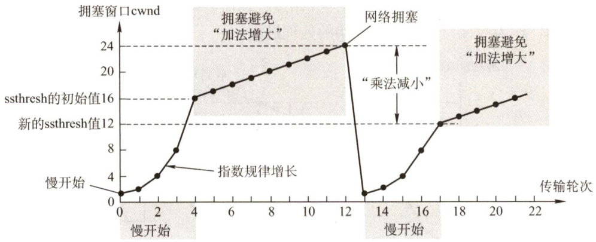  
图5.11慢开始和拥塞避免算法的实现过程  

·初始时，拥塞窗口置为1，即cwnd $=1$ ，慢开始门限置为16，即ssthresh $=16$ o  

·慢开始阶段，cwnd的初值为1，以后发送方每收到一个确认ACK，cwnd值加1，也即经过每个传输轮次（RTT)，cwnd 呈指数规律增长。当拥塞窗口cwnd增长到慢开始门限ssthresh时（即当cwnd $=16$ 时)，就改用拥塞避免算法，cwnd按线性规律增长。  
·假定cwnd $=24$ 时网络出现超时，更新ssthresh值为12（即变为超时时cwnd值的一半），cwnd重置为1，并执行慢开始算法，当cwnd $=12$ 时，改为执行拥塞避免算法。  

注意：在慢开始（指数级增长）阶段，若2cwnd $>$ ssthresh，则下一个RTT后的cwnd等于ssthresh，而不等于2cwnd，即cwnd不能跃过ssthresh值。如图5.11所示，在第16个轮次时cwnd $\mathbf{\Sigma}=\mathbf{\Sigma}$ 8、ssthresh $=12$ ，在第17个轮次时cwnd $=12$ ，而不等于16。  

在慢开始和拥塞避免算法中使用了“乘法减小”和“加法增大”方法。“乘法减小”是指不论是在慢开始阶段还是在拥塞避免阶段，只要出现超时（即很可能出现了网络拥塞)，就把慢开始门限值 ssthresh 设置为当前拥塞窗口的一半（并执行慢开始算法)。当网络频繁出现拥塞时，ssthresh 值就下降得很快，以大大减少注入网络的分组数。而“加法增大”是指执行拥塞避免算法后，在收到对所有报文段的确认后（即经过一个RTT)，就把拥塞窗口cwnd增加一个MSS大小，使拥塞窗口缓慢增大，以防止网络过早出现拥塞。  

拥塞避免并不能完全避免拥塞。利用以上措施要完全避免网络拥塞是不可能的。拥塞避免是指在拥塞避免阶段把拥塞窗口控制为按线性规律增长，使网络比较不容易出现拥塞。  

#### 2.快重传和快恢复  

快重传和快恢复算法是对慢开始和拥塞避免算法的改进。  

#### （1）快重传  

在上一节介绍的TCP可靠传输机制中，快重传技术使用了冗余ACK来检测丢包的发生。同样，冗余ACK也用于网络拥塞的检测（丢了包当然意味着网络可能出现了拥塞)。快重传并非取消重传计时器，而是在某些情况下可更早地重传丢失的报文段。  

当发送方连续收到三个重复的ACK报文时，直接重传对方尚未收到的报文段，而不必等待那个报文段设置的重传计时器超时。  

#### （2）快恢复  

快恢复算法的原理如下：当发送方连续收到三个冗余ACK（即重复确认）时，执行“乘法减小”算法，把慢开始门限 ssthresh设置为此时发送方 cwnd 的一半。这是为了预防网络发生拥塞。但发送方现在认为网络很可能没有发生（严重）拥塞，否则就不会有几个报文段连续到达接收方，也不会连续收到重复确认。因此与慢开始不同之处是它把cwnd 值设置为慢开始门限 ssthresh改变后的数值，然后开始执行拥塞避免算法（"加法增大")，使拥塞窗口缓慢地线性增大。  

由于跳过了拥塞窗口cwnd从1起始的慢开始过程，所以被称为快恢复。快恢复算法的实现过程如图5.12所示，作为对比，虚线为慢开始的处理过程。  

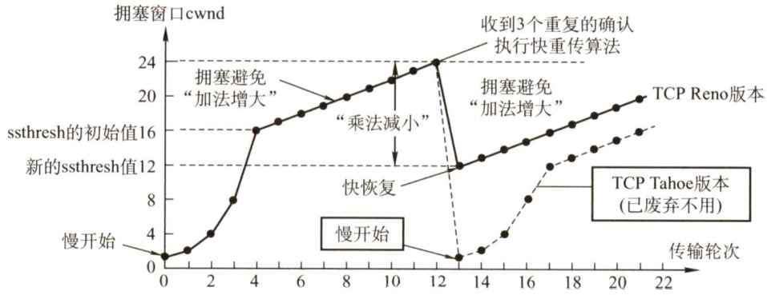  
图5.12快恢复算法的实现过程  

在流量控制中，发送方发送数据的量由接收方决定，而在拥塞控制中，则由发送方自己通过检测网络状况来决定。实际上，慢开始、拥塞避免、快重传和快恢复几种算法是同时应用在拥塞控制机制中。四种算法使用的总结：在TCP连接建立和网络出现超时时，采用慢开始和拥塞避免算法；当发送方接收到余ACK时，采用快重传和快恢复算法。  

在本节的最后，再次提醒读者：接收方的缓存空间总是有限的。因此，发送方发送窗口的实际大小由流量控制和拥塞控制共同决定。当题目中同时出现接收窗口（rwnd）和拥塞窗口（cwnd）时，发送方实际的发送窗口大小是由rwnd和cwnd中较小的那一个确定的。  

#### 5.3.7 本节习题精选  

#### 一、单项选择题  

01．下列关于传输层协议中面向连接的描述，（）是错误的。  

A．面向连接的服务需要经历3个阶段：连接建立、数据传输及连接释放  
B．当链路不发生错误时，面向连接的服务可以保证数据到达的顺序是正确的  
C．面向连接的服务有很高的效率和时间性能  
D.面向连接的服务提供了一个可靠的数据流  

02.TCP协议规定HTTP（）进程的端口号为80。  

A．客户机 B．解析 C.服务器 D.主机  

03.下列（）不是TCP服务的特点。  

A．字节流 B.全双工 C.可靠 D．支持广播  

14.（）字段包含在TCP首部中，而不包含在UDP首部中。  

A．目的端口号 B．序列号 C.校验和 D．目的IP地址  

05．以下关于TCP报头格式的描述中，错误的是（）。  

A．报头长度为 $20\sim60\mathrm{B}$ ，其中固定部分为20BB.端口号字段依次表示源端口号与目的端口号C.报头长度总是4的倍数个字节D.TCP校验和伪首部中IP分组头的协议字段为17  

06．在采用TCP连接的数据传输阶段，如果发送端的发送窗口值由1000变为2000，那么发送端在收到一个确认之前可以发送（）。  

A.2000个TCP报文段 B.2000BC.1000B D.1000个TCP报文段  

07.A和B建立了TCP连接，当A收到确认号为100的确认报文段时，表示（）  

A.报文段99已收到  
B.报文段100已收到  
C.末字节序号为99的报文段已收到D.末字节序号为100的报文段已收到  

08.为保证数据传输的可靠性，TCP采用了对（）确认的机制。  

A．报文段 B.分组 C.字节 D．比特  

09.在TCP协议中，发送方的窗口大小取决于（）。  

A.仅接收方允许的窗口 B.接收方允许的窗口和发送方允许的窗口  

C.接收方允许的窗口和拥塞窗口D.发送方允许的窗口和拥塞窗口  

10.滑动窗口的作用是（）。  

A．流量控制 B．拥塞控制 C．路由控制 D.差错控制  

11．以下关于TCP工作原理与过程的描述中，错误的是（）。  

A.TCP连接建立过程需要经过“三次握手”的过程  
B.TCP传输连接建立后，客户端与服务器端的应用进程进行全双工的字节流传输  
C.TCP传输连接的释放过程很复杂，只有客户端可以主动提出释放连接的请求  
D.TCP连接的释放需要经过“四次挥手”的过程  

12．TCP的滑动窗口协议中，规定重传分组的数量最多可以（）。  

A．是任意的 B.1个C．大于滑动窗口的大小 D．等于滑动窗口的大小  

13.TCP中滑动窗口的值设置太大，对主机的影响是（）。  

A．由于传送的数据过多而使路由器变得拥挤，主机可能丢失分组B.产生过多的ACKC．由于接收的数据多，而使主机的工作速度加快D.由于接收的数据多，而使主机的工作速度变慢  

14.以下关于TCP窗口与拥塞控制概念的描述中，错误的是（）。  

A．接收端窗口（rwnd）通过TCP首部中的窗口字段通知数据的发送方B．发送窗口确定的依据是：发送窗口 $\mathbf{\Sigma}=\mathbf{\Sigma}$ min[接收端窗口，拥塞窗口]C．拥塞窗口是接收端根据网络拥塞情况确定的窗口值D．拥塞窗口大小在开始时可以按指数规律增长  

15.TCP使用三次握手协议来建立连接，设A、B双方发送报文的初始序列号分别为 $X$ 和 $Y$ A发送（ $\textcircled{1}$ ）的报文给B，B接收到报文后发送（ $\textcircled{2}$ ）的报文给A，然后A发送一个确认报文给B便建立了连接（注意，ACK的下标为销带的序号）。  

$\textcircled{1}$ A. $\mathrm{SYN}=1$ ，序号 $\scriptstyle=X$ B. $\mathrm{SYN}=1$ ，序号 $\stackrel{}{=}X+1$ ， $\operatorname{ACK}_{X}=1$ C. $\mathrm{SYN}=1$ ，序号 $\mathbf{\Psi}=\boldsymbol{Y}$ D. $\mathrm{SYN}=1$ ，序号 $\mathbf{\Psi}=Y,\mathbf{ACK}_{Y+1}=1$ $\textcircled{2}$ A. $\mathrm{SYN}=1$ ，序号 $\O=X+1$ B. $\mathrm{SYN}=1$ ，序号 $\O=X+1$ ， $\mathbf{ACK}_{X}=1$ C. $\mathrm{SYN}=1$ ，序号 $=Y$ $\mathrm{ACK}_{X+1}=1$ D. $\mathrm{SYN}=1$ ，序号 $=Y,$ $\mathrm{ACK}_{Y+1}=1$  

16．TCP“三次握手”过程中，第二次“握手”时，发送的报文段中（）标志位被置为 $^1$  

A.SYN B.ACK C. ACK和RST D.SYN和ACK  

17．A和B之间建立了TCP连接，A向B发送了一个报文段，其中序号字段 $\mathbf{\boldsymbol{seq}}=200$ ，确认号字段 $\mathbf{ack}=201$ ，数据部分有2个字节，那么在B对该报文的确认报文段中（）。  

A. $\mathbf{\boldsymbol{seq}}=202$ ， $\mathbf{ack}=200$ B. $\mathrm{seq}=201,\mathrm{ack}=201$   
C. $\mathrm{seq}=201,\mathrm{ack}=202$ D. $\mathrm{seq}=202,\mathrm{ack}=201$  

18.TCP的通信双方，有一方发送了带有FIN标志的数据段后，表示（）。  

A.将断开通信双方的TCP连接  
B．单方面释放连接，表示本方已经无数据发送，但可以接收对方的数据  
C．中止数据发送，双方都不能发送数据  
D.连接被重新建立  

19.一个TCP连接的数据传输阶段，如果发送端的发送窗口值由2000变为3000，那么意味着发送端可以（）。  

A.在收到一个确认之前可以发送3000个TCP报文段B.在收到一个确认之前可以发送1000BC.在收到一个确认之前可以发送3000BD.在收到一个确认之前可以发送2000个TCP报文段  

20.在一个TCP连接中，MSS为1KB，当拥塞窗口为34KB时发生了超时事件。如果在接下来的4个RTT内报文段传输都是成功的，那么当这些报文段均得到确认后，拥塞窗口的大小是（）。  

A. 8KB B. 9KB C. 16KB D.17KB  

21.设TCP的拥塞窗口的慢开始门限值初始为8（单位为报文段），当拥塞窗口上升到12时发生超时，TCP开始慢启动和拥塞避免，那么第13次传输时拥塞窗口的大小为（）。  

A.4 B.6 C.7 D.8  

22.在一个TCP连接中，MSS为1KB，当拥塞窗口为34KB时收到了3个余ACK报文。如果在接下来的4个RTT内报文段传输都是成功的，那么当这些报文段均得到确认后，拥塞窗口的大小是（）。  

A.8KB B. 16KB C. 20KB D.21KB  

23．A和B建立TCP连接，MSS为1KB。某时，慢开始门限值为2KB，A的拥塞窗口为4KB，在接下来的一个RTT内，A向B发送了4KB的数据（TCP的数据部分），并且得到了B的确认，确认报文中的窗口字段的值为2KB。在下一个RTT中，A最多能向B发送（）数据。  

A.2KB B. 8KB C.5KB D. 4KB  

24.假设在没有发生拥塞的情况下，在一条往返时延RTT为 $10\mathrm{ms}$ 的线路上采用慢开始控制策略。如果接收窗口的大小为24KB，最大报文段MSS为2KB。那么发送方能发送出第一个完全窗口（也就是发送窗口达到24KB）需要的时间是（）。  

A. $30\mathrm{ms}$ B. $40\mathrm{ms}$ C.50ms D.60ms  

25.如果主机1的进程以端口 $x$ 和主机2的端口 $y$ 建立了一条TCP连接，这时如果希望再在这两个端口间建立一个TCP连接，那么会（）。  

A．建立失败，不影响先建立连接的传输B．建立成功，且两个连接都可以正常传输C．建立成功，先建立的连接被断开D．建立失败，两个连接都被断开  

26.【2009统考真题】主机甲与主机乙之间已建立一个TCP连接，主机甲向主机乙发送了两个连续的TCP段，分别包含300B和500B的有效载荷，第一个段的序列号为200，主机乙正确接收到这两个数据段后，发送给主机甲的确认序列号是（）。  

A. 500 B. 700 C. 800 D. 1000  

27.【2009统考真题】一个TCP连接总以1KB的最大段长发送TCP段，发送方有足够多的数据要发送，当拥塞窗口为16KB时发生了超时，如果接下来的4个RTT时间内的TCP段的传输都是成功的，那么当第4个RTT时间内发送的所有TCP段都得到肯定应答时，拥塞窗口大小是（）。  

A.7KB B. 8KB C. 9KB D. 16KB  

28.【2010统考真题】主机甲和主机乙之间已建立一个TCP连接，TCP最大段长为 $1000\mathrm{B}$ 。若主机甲的当前拥塞窗口为4000B，在主机甲向主机乙连续发送两个最大段后，成功收到主机乙发送的第一个段的确认段，确认段中通告的接收窗口大小为 $2000\mathrm{B}$ ，则此时主机甲还可以向主机乙发送的最大字节数是（）。  

A. 1000 B.2000 C.3000 D. 4000  

29.【2011统考真题】主机甲向主机乙发送一个（ $\mathrm{SYN}=1$ ， $\mathbf{seq}=11220$ ）的TCP段，期望与主机乙建立TCP连接，若主机乙接受该连接请求，则主机乙向主机甲发送的正确的TCP段可能是（）。  

A. $\mathrm{SYN}=0,\mathrm{ACK}=0,\mathrm{seq}=11221,\mathrm{ack}=11221\ )$ B. $(\mathrm{\bf~SYN}=1,\mathrm{\bf~ACK}=1,\mathrm{\bf~seq}=11220,\mathrm{\bf~ack}=11220)$ C. $(\mathrm{\bf~SYN}=1,\mathrm{\bf~ACK}=1,\mathrm{\bf~seq}=11221,\mathrm{\bf~ack}=11221)$ D.( $\mathrm{SYN}=0,\mathrm{ACK}=0,\mathrm{seq}=11220,\mathrm{ack}=11220\ )$  

30.【2011统考真题】主机甲与主机乙之间已建立一个TCP连接，主机甲向主机乙发送了3个连续的TCP段，分别包含300B、400B和500B的有效载荷，第3个段的序号为900。若主机乙仅正确接收到第1个段和第3个段，则主机乙发送给主机甲的确认序号是（）。  

A.300 B.500 C. 1200 D. 1400  

31.【2013统考真题】主机甲与主机乙之间已建立一个TCP连接，双方持续有数据传输，且数据无差错与丢失。若甲收到一个来自乙的TCP段，该段的序号为1913、确认序号为2046、有效载荷为100B，则甲立即发送给乙的TCP段的序号和确认序号分别是（）。  

A.2046、2012 B.2046、2013  
C.2047、2012 D.2047、2013  

32.【2014统考真题】主机甲和乙建立了TCP连接，甲始终以 $\mathrm{MSS}=1\mathrm{KB}$ 大小的段发送数据，并一直有数据发送；乙每收到一个数据段都会发出一个接收窗口为10KB的确认段。若甲在t时刻发生超时的时候拥塞窗口为8KB，则从 $t$ 时刻起，不再发生超时的情况下，经过10个RTT后，甲的发送窗口是（）。  

A. 10KB B.12KB C.14KB D.15KB  

33.【2015统考真题】主机甲和主机乙新建一个TCP连接，甲的拥塞控制初始阈值为32KB，甲向乙始终以 $\mathrm{MSS}=\mathrm{1KB}$ 大小的段发送数据，并一直有数据发送；乙为该连接分配16KB接收缓存，并对每个数据段进行确认，忽略段传输延迟。若乙收到的数据全部存入缓存，不被取走，则甲从连接建立成功时刻起，未出现发送超时的情况下，经过4个RTT后，甲的发送窗口是（）。  

A. 1KB B.8KB C. 16KB D. 32KB  

34.【2017统考真题】若甲向乙发起一个TCP连接，最大段长 $\mathrm{MSS}=\mathrm{1KB}$ ， $\mathrm{RTT}=5\mathrm{ms}$ ，乙开辟的接收缓存为 $64~\mathrm{KB}$ ，则甲从连接建立成功至发送窗口达到32KB，需经过的时间至少是（）。  

A. $25\mathrm{ms}$ B. 30ms C. $160\mathrm{ms}$ D.165ms  

35.【2019统考真题】某客户通过一个TCP连接向服务器发送数据的部分过程如题35图所示。客户在 $t_{0}$ 时刻第一次收到确认序列号ack_seq $=100$ 的段，并发送序列号 $\mathbf{\boldsymbol{seq}}=100\$ 的段，但发生丢失。若TCP支持快速重传，则客户重新发送 $\mathbf{\boldsymbol{seq}}=100$ 段的时刻是（）。  

A. $t_{1}$ B. $t_{2}$ C. $t_{3}$ D. $t_{4}$  

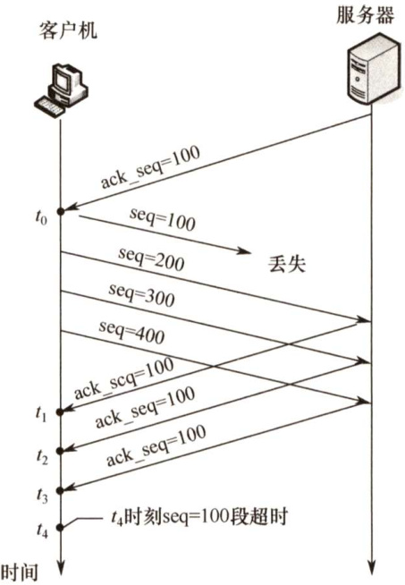  
题35图  

36.【2019统考真题】若主机甲主动发起一个与主机乙的TCP连接，甲、乙选择的初始序列号分别为2018和2046，则第三次握手TCP段的确认序列号是（）。  

A.2018 B.2019 C. 2046 D. 2047  

37.【2020统考真题】若主机甲与主机乙已建立一条TCP连接，最大段长（MSS）为1KB，往返时间（RTT）为2ms，则在不出现拥塞的前提下，拥塞窗口从8KB增长到32KB所需的最长时间是（）。  

A.4ms B. 8ms C. 24ms D. 48ms  

38.【2020统考真题】若主机甲与主机乙建立TCP连接时，发送的SYN段中的序号为1000，在断开连接时，甲发送给乙的FIN段中的序号为5001，则在无任何重传的情况下，甲向乙已经发送的应用层数据的字节数为（）。  

A.4002 B. 4001 C. 4000 D. 3999  

39.【2021统考真题】若客户首先向服务器发送FIN段请求断开TCP连接，则当客户收到服务器发送的FIN段并向服务器发送ACK段后，客户的TCP状态转换为（）。  

A.CLOSE_WAIT B.TIME_WAIT C.FIN_WAIT_1 D.FIN_WAIT_2  

40.【2021统考真题】若大小为12B的应用层数据分别通过1个UDP数据报和1个TCP段传输，则该UDP数据报和TCP段实现的有效载荷（应用层数据）最大传输效率分别是（）。  

A. $37.5\%$ 。 $16.7\%$ B. $37.5\%$ 。 $37.5\%$ C. $60.0\%$ 。 $16.7\%$ D. $60.0\%$ $37.5\%$  

41.【2021统考真题】设主机甲通过TCP向主机乙发送数据，部分过程如下图所示。甲在 $t_{0}$ 时刻发送一个序号 $\mathbf{\seq}=501$ 、封装200B数据的段，在 $t_{1}$ 时刻收到乙发送的序号 $\mathbf{\boldsymbol{seq}}=601$ 、确认序号ack_seq $=501$ 、接收窗口rcvwnd $=500\mathrm{B}$ 的段，则甲在未收到新的确认段之前，可以继续向乙发送的数据序号范围是（）。  

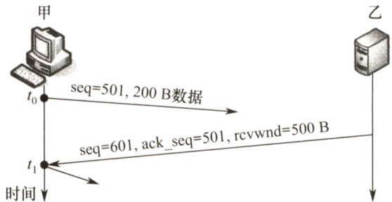  

A.501\~1000 B．601～1100 C.701\~1000 D. 801\~1100  

#### 二、综合应用题  

01．在使用TCP传输数据时，如果有一个确认报文段丢失，那么也不一定会引起与该确认报文段对应的数据的重传。试说明理由。  

02.如果收到的报文段无差错，只是报文段失序，那么TCP对此未做明确规定，而是让TCP的实现者自行确定。试讨论两种可能的方法的优劣：1）将失序报文段丢弃。2）先将失序报文段暂存于接收缓存内，待所缺序号的报文段收齐后再一起上交应用层。  

03．一个TCP连接要发送3200B的数据。第一个字节的编号为10010。如果前两个报文各携带1000B的数据，最后一个携带剩下的数据，请写出每个报文段的序号。  

04.设TCP使用的最大窗口尺寸为64KB，TCP报文在网络上的平均往返时间为 $20\mathrm{ms}$ 问 TCP协议所能得到的最大吞吐量是多少？（假设传输信道的带宽是不受限的。）  

05.已知当前TCP连接的RTT值为 $35\mathrm{{ms}}$ ，连续收到3个确认报文段，它们比相应的数据报文段的发送时间滞后了 $27\mathrm{ms}$ ， $30\mathrm{ms}$ 与 $21\mathrm{ms}$ 。设 $\alpha=0.2$ 。计算第三个确认报文段到达后的新的RTT估计值。  

06.网络允许的最大报文段的长度为128B，序号用8位表示，报文段在网络中的寿命为30s。求每条TCP连接所能达到的最高数据率。  

07．在一个TCP连接中，信道带宽为 $1\mathrm{Gb/s}$ ，发送窗口固定为65535B，端到端时延为 $20\mathrm{ms}$ 。可以取得的最大吞吐率是多少？线路效率是多少？（发送时延忽略不计，TCP及其下层协议首部长度忽略不计，最大吞吐率 $\mathbf{\Sigma}=\mathbf{\Sigma}$ 一个RTT传输的有效数据/一个RTT的时间。）  

08．主机A基于TCP向主机B连续发送3个TCP报文段。第1个报文段的序号为90，第2个报文段的序号为120，第3个报文段的序号为150。  

1）第1、2个报文段中有多少数据？  
2）假设第2个报文段丢失而其他两个报文段到达主机B，在主机B发往主机A的确认报文中，确认号应是多少？  

09.考虑在一条具有10ms来回路程时间的线路上采用慢启动拥塞控制而不发生网络拥塞情况下的效应，接收窗口为24KB，且最大段长为2KB。那么需要多长时间才能发送第一个完全窗口？  

10.设TCP的拥塞窗口的慢开始门限值初始为12（单位为报文段），当拥塞窗口达到16时出现超时，再次进入慢启动过程。从此时起若恢复到超时时刻的拥塞窗口大小，需要的往返次数是多少？  

11.假定TCP报文段载荷是1500B，最大分组存活时间是120s，那么要使得TCP报文段的序列号不会循环回来而重叠，线路允许的最快速度是多大？（不考虑帧长限制。）  

12．一个TCP连接使用 $256\mathrm{kb/s}$ 的链路，其端到端时延为 $128\mathrm{ms}$ 。经测试发现吞吐率只有  

$128\mathbf{kb}/\mathbf{s}.$ 。问窗口是多少？忽略PDU封装的协议开销及接收方应答分组的发送时间（假定应答分组长度很小）。  

13.假定TCP最大报文段的长度是1KB，拥塞窗口被置为18KB，并且发生了超时事件。如果接着的4次进发量传输都是成功的，那么该窗口将是多大？  

14.一个TCP首部的数据信息（十六进制表示）为 $0\mathrm{x}0\mathrm{D}280015505\mathrm{FA}906000000070$ $024000{\mathrm{C}}0290000$ 。TCP首部的格式如下图所示。请回答：  

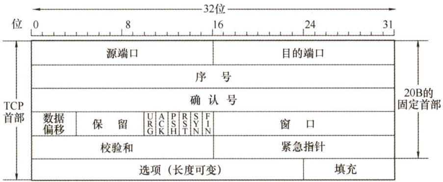  

1）源端口号和目的端口号各是多少？  
2）发送的序列号是多少？确认号是多少？  
3）TCP首部的长度是多少？  
4）这是一个使用什么协议的TCP连接？该TCP连接的状态是什么？  

15.【2012统考真题】主机H通过快速以太网连接Internet，IP地址为192.168.0.8，服务器S的IP地址为211.68.71.80。H与S使用TCP通信时，在H上捕获的其中5个IP分组如表1所示。  

表1  

<html><body><table><tr><td>编 号</td><td colspan="5">IP分组的前40B内容（十六进制）</td></tr><tr><td>1</td><td>45000030</td><td>019b4000</td><td>80061de8</td><td>cO a80008</td><td>d3444750</td></tr><tr><td></td><td>Obd91388 43000030</td><td>846b41c5 00004000</td><td>00000000 31066e83</td><td>70024380 d3444750</td><td>5db00000 cOa80008</td></tr><tr><td>2</td><td>13880b d9</td><td>e0599fef</td><td>846b41c6</td><td>701216d0</td><td>37e10000</td></tr><tr><td>3</td><td>45000028 Obd91388</td><td>019c4000 846b41c6</td><td>80061def e0599ffo</td><td>c0a80008 50f04380</td><td>d3444750 2b320000</td></tr><tr><td>4</td><td>45000038 Obd91388</td><td>019d4000</td><td>80061dde e0 599f fo</td><td>cO a80008</td><td>d3444750</td></tr><tr><td></td><td>45000028</td><td>846b41c6 68114000</td><td>3106067a</td><td>50184380 d3444750</td><td>e6550000 cOa80008</td></tr><tr><td>5</td><td>13880b d9</td><td>e0599f f0</td><td>846b41d6</td><td>501016d0</td><td>57d20000</td></tr></table></body></html>  

回答下列问题：  

1）表1中的IP分组中，哪几个是由H发送的？哪几个完成了TCP连接建立过程？哪几个在通过快速以太网传输时进行了填充？  
2）根据表1中的IP分组，分析S已经收到的应用层数据字节数是多少。  
3）若表1中的某个IP分组在S发出时的前40B如表2所示，则该IP分组到达 $\mathrm{~H~}$ 时经过了多少个路由器？  

表2  

<html><body><table><tr><td>来自S的分组</td><td>45000028</td><td>68114000</td><td>4006ec ad</td><td>d3444750</td><td>ca760106</td></tr><tr><td></td><td>1388a108</td><td>e0599ff0</td><td>846b41d6</td><td>501016d0</td><td>b7 d6 00 00</td></tr></table></body></html>  

IP分组头和TCP段头结构分别如图1和图2所示。  

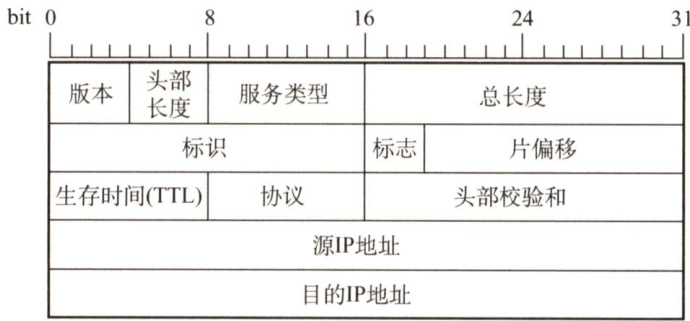  
图1IP分组头结构  

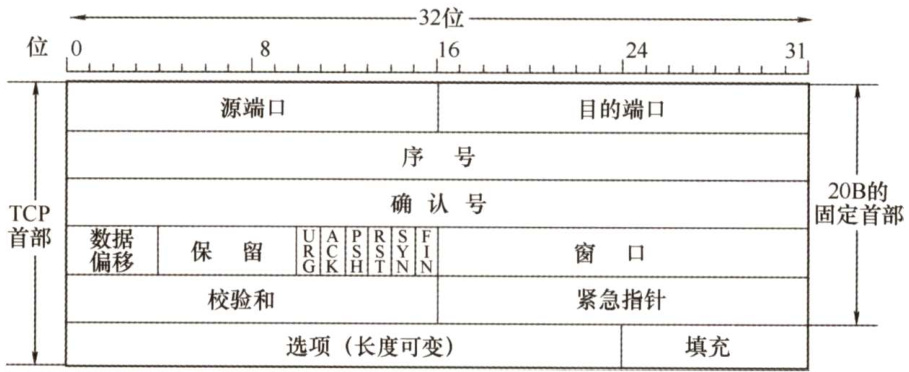  
图2TCP段头结构  

16.【2016统考真题】假设下图中的H3访问Web服务器S时，S为新建的TCP连接分配了20KB( $\mathrm{K}=1024$ ）的接收缓存，最大段长 $\mathrm{MSS}=1\mathrm{KB}$ ，平均往返时间 $\mathrm{RTT}=200\mathrm{ms}$ 。H3建立连接时的初始序号为100，且持续以MSS大小的段向S发送数据，拥塞窗口初始阈值为32KB；S对收到的每个段进行确认，并通告新的接收窗口。假定TCP连接建立完成后，S端的TCP接收缓存仅有数据存入而无数据取出。请回答下列问题：  

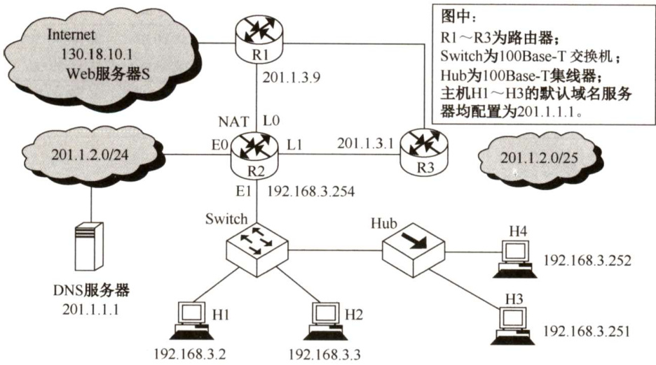  

1）在TCP连接建立过程中，H3收到的S发送过来的第二次握手TCP段的SYN和ACK标志位的值分别是多少？确认序号是多少？  
2）H3收到的第8个确认段所通告的接收窗口是多少？此时H3的拥塞窗口变为多少？H3的发送窗口变为多少？  
3）H3的发送窗口等于0时，下一个待发送的数据段序号是多少？H3从发送第1个数据段到发送窗口等于0时刻为止，平均数据传输速率是多少？（忽略段的传输延时。）  
4）若H3与S之间通信已经结束，在t时刻H3请求断开该连接，则从 $t$ 时刻起，S释放该连接的最短时间是多少？  

#### 5.3.8 答案与解析  

一、单项选择题  

01.C  

由于面向连接的服务需要建立连接，且需要保证数据的有序性和正确性，因此它比无连接的服务开销大，而速度和效率方面也要比无连接的服务差一些。  

02.C  

TCP中端口号80标识Web服务器端的HTTP进程，客户端访问Web服务器的 $\mathrm{HTTP}$ 进程的端口号由客户端的操作系统动态分配。因此选C。  

03.D  

TCP提供的是一对一全双工可靠的字节流服务，所以TCP并不支持广播。  

04.B  

TCP报文段和UDP数据报都包含源端口、目的端口、校验号。由于UDP提供不可靠的传输服务，不需要对报文编号，因此不会有序列号字段，而TCP提供可靠的传输服务，因此需要设置序列号字段。目的IP地址属于IP数据报中的内容。  

05.D  

TCP 伪首部与UDP伪首部一样，包括IP分组首部的一部分。IP首部中有一个协议字段，用于指明上层协议是TCP还是UDP。17代表UDP，6代表TCP，所以D错误。对于A选项，由于数据偏移字段的单位是4B，也就是说当偏移取最大时TCP首部长度为 $15{\times}4=60\mathrm{B}$ 。由于使用填充，所以长度总是4B的倍数，C正确。  

06.B  

TCP 使用滑动窗口机制来进行流量控制。在ACK应答信息中，TCP在接收端用ACK加上接收方允许接收数据范围的最大值回送给发送方，发送方把这个最大值当作发送窗口值，表明发送端在未收到确认之前可以发送的最大字节数，即2000B。  

07.C  

TCP的确认号是指明接收方下一次希望收到的报文段的数据部分第一个字节的编号，可以看出，前一个已收到的报文段的最后一个字节的编号为99，所以C选项正确。报文段的序号是其数据部分第一个字节的编号。选项A、B不正确，因为有可能已收到的这个报文的数据部分不止一  

个字节，那么报文段的编号就不为99，但可以说编号为99的字节已收到。  

08.A  

TCP是面向字节的。对每个字节进行编号，但并不是接收到每个字节都要发回确认，而是在发送一个报文段的字节后才发回一个确认，所以TCP采用的是对报文段的确认机制。  

09.C  

TCP让每个发送方仅发送正确数量的数据，保持网络资源被利用但又不会过载。为了避免网络拥塞和接收方缓冲区溢出，TCP发送方在任一时刻可以发送的最大数据流是接收方允许的窗口和拥塞窗口中的最小值。  

10.A  

TCP采用大小可变的滑动窗口进行流量控制。  

11.C  

参与TCP连接的两个进程中的任何一个都能提出释放连接的请求。  

12.D  

TCP滑动窗口协议中发送方滑动窗口的大小规定了发送方最多能够传送的分组数目，只有窗口滑动了，才能往后继续发送。分组重传的最大值也是发送方能发送数据的最大值，因而重传分组的数量最多也不能超过滑动窗口的大小。  

13.A  

TCP 使用滑动窗口机制来进行流量控制，其窗口尺寸的设置很重要，如果滑动窗口值设置得太小，那么会产生过多的ACK（因为窗口大可以累积确认，因此会有更少的ACK)；如果设置得太大，那么又会由于传送的数据过多而使路由器变得拥挤，导致主机可能丢失分组。  

14.C  

拥塞窗口是发送端根据网络拥塞情况确定的窗口值。  

15.A、C  

TCP使用三次握手来建立连接，第一次握手A发给B的TCP报文中应置其首部SYN位为1，并选择序号 $\operatorname{seq}=X.$ ，表明传送数据时的第一个数据字节的序号是 $X_{i}$ ：在第二次握手中，即B接收到报文后，发给A的确认报文段中应使 SYN=1，使ACK=1，且确认号ACK=X+1，即ACKx+1=1（ACK的下标为销带的序号)，同时告诉自己选择的序号 $\mathrm{seq}=Y_{\circ}$  

16.D  

在TCP的“三次握手”中，第二次握手时，SYN和ACK均被置为1。  

17.C  

在A发向B的报文中，seq表示发送的报文段中数据部分的第一个字节在A的发送缓存区中的编号，ack表示A期望收到的下一个报文段的数据部分的第一个字节在B的发送缓存区中的编  

号。因此，同一个TCP报文中的seq和ack的值是没有联系的。在B发给A的报文（销带确认）中，seq值应和A发向B的报文中的ack 值相同，即 201；ack 值表示B期望下次收到A发出的报文段的第一个字节的编号，应是 $200+2=202$ 。  

18.B  

FIN位用来释放一个连接，它表示本方已没有数据要传输。然而，在关闭一个连接后，对方还可以继续发送数据，所以还有可能接收到数据。  

19.C  

TCP提供的是可靠的字节流传输服务，使用窗口机制进行流量控制与拥塞控制。TCP的滑动窗口机制是面向字节的，因此窗口大小的单位为字节。假设发送窗口的大小为 $N$ ，这意味着发送端可以在没有收到确认的情况下连续发送 $N$ 个字节。  

20.C  

在拥塞窗口为34KB时发生了超时，那么慢开始门限值（ssthresh）就被设定为17KB，并且在第一个RTT中拥塞窗口（cwnd）置为1KB。按照慢开始算法，第二个RTT中cwnd ${}=2\mathrm{KB}$ ，第三个RTT中cwn $\mathrm{d}=4\mathrm{KB}$ ，第四个RTT中cwnd $=8\mathrm{KB}$ 。当第四个RTT中发出去的8个报文段的确认报文收到后，cwnd $=16\mathrm{KB}$ （此时还未超过慢开始门限值)。所以选C。本题中“这些报文段均得到确认后”这句话很重要。  

21.C  

在慢开始和拥塞避免算法中，拥塞窗口初始为1，窗口大小开始按指数增长。当拥塞窗口大于慢开始门限后停止使用慢开始算法，改用拥塞避免算法。此处慢开始的门限值初始为8，当拥塞窗口增大到8时改用拥塞避免算法，窗口大小按线性增长，每次增加1个报文段，当增加到12时，出现超时，重新设门限值为6（12的一半)，拥塞窗口再重新设为1，执行慢开始算法，到门限值6时执行拥塞避免算法。  

这样，拥塞窗口的变化就为1,2,4,8,9,10,11,12,1,2,4,6,7,8,9,…，其中第13次传输时拥塞窗口的大小为7。  

22.D  

条件"收到了3个余ACK报文"说明此时应执行快恢复算法，因此慢开始门限值设为17KB，并在接下来的第一个RTT中cwnd也被设为17KB，第二个RTT中cwnd $=18$ ，第三个RTT中cwnd $\mathbf{\Sigma}=\mathbf{\Sigma}$ 19KB，第四个RTT中cwnd $\mathbf{\mu}=20\mathbf{\mathrm{KB}}$ ，第四个RTT中发出的报文全部得到确认后，cwnd再增加1KB，变为21KB。注意cwnd的增加都发生在收到确认报文后。  

23.A  

解析请扫右侧二维码查阅。  

24.B  

按照慢开始算法，发送窗口的初始值为拥塞窗口的初始值，即MSS的大小2KB，然后依次增大为4KB、8KB、16KB，然后是接收窗口的大小24KB，即达到第一个完全窗口。因此达到第一个完全窗口所需要的时间为 $4\mathrm{RTT}=40\mathrm{ms}$ 。  

25.A  

一条连接使用它们的套接字来表示，因此 $(1,x)$ $\cdot(2,y)$ 是在两个端口之间唯一可能的连接。而后建立的连接会被阻止。  

26.D  

返回的确认序列号是接收方期待收到对方下一个报文段数据部分的第一个字节的序号，因此乙在正确接收到两个段后，返回给甲的确认序列号是 $200+300+500=1000$ 。  

27.C  

发生超时后，慢开始门限ssthresh变为 $16\mathrm{KB}/2=8\mathrm{KB}$ ，拥塞窗口变为1KB。在接下来的3个 RTT内，执行慢开始算法，拥塞窗口大小依次为2KB、4KB、8KB，由于慢开始门限 ssthresh为8KB，因此之后转而执行拥塞避免算法，即拥塞窗口开始“加法增大”。因此第4个RTT 结束后，拥塞窗口的大小为9KB。  

28.A  

发送方的发送窗口的上限值取接收方窗口和拥塞窗口这两个值中的较小一个，于是此时发送方的发送窗口为 $\operatorname*{min}\{4000,2000\}=2000\mathrm{B}$ ，由于发送方还未收到第二个最大段的确认，所以此时主机甲还可以向主机乙发送的最大字节数为 $2000-1000=1000\mathrm{B}$ 0  

29.C  

在确认报文段中，同步位SYN和确认位ACK必须都是1；返回的确认号ack是甲发送的初始序号 $\mathbf{seq}=11220$ 加1，即 $\mathbf{ack}=11221$ ；同时乙也要选择并消耗一个初始序号seq，seq值由乙的TCP进程任意给出，它与确认号、请求报文段的序号没有任何关系。  

30.B  

TCP 首部的序号字段是指本报文段数据部分的第一个字节的序号，而确认号是期待收到对方下一个报文段的第一个字节的序号。第三个段的序号为900，则第二个段的序号为 $900-400=500$ 现在主机乙期待收到第二个段，因此发给甲的确认号是500。  

31.B  

确认序号ack是期望收到对方下一个报文段的数据的第一个字节的序号，序号 seq是指本报文段所发送的数据的第一个字节的序号。甲收到一个来自乙的TCP段，该段的序号 $\mathbf{\seq}=1913$ 、确认序号 $\mathbf{ack}=2046$ 、有效载荷为 $100\mathrm{B}$ ，表明到序号 $1913+100-1=2012$ 为止的所有数据甲均已收到，而乙期望收到下一个报文段的序号从2046开始。因此甲发给乙的TCP段的序号 $\mathbf{seq}_{1}=\mathbf{ack}=2046$ 和确认序号 $\mathrm{ack}_{1}=\mathrm{seq}+100=2013$ 。  

32.A  

当 $t$ 时刻发生超时时，把ssthresh 设为8的一半，即4，把拥塞窗口设为1KB。然后经历10个 RTT后，拥塞窗口的大小依次为2,4,5,6,7,8,9,10,11,12，而发送窗口取当时的拥塞窗口和接收窗口的最小值，接收窗口始终为10KB，所以此时的发送窗口为10KB，选A。  

实际上该题接收窗口一直为10KB，可知不管何时，发送窗口一定小于等于10KB，选项中只有A选项满足条件，可直接得出选A。  

33.A  

发送窗口的上限值 $=\operatorname*{min}{\frac{\d}{\d t}}$ 接收窗口，拥塞窗口}。4个RTT后，乙收到的数据全部存入缓存，不被取走，接收窗口只剩下1KB（ $\:16-1-2-4-8=1\:$ ）缓存，使得甲的发送窗口为1KB。  

34.A  

按照慢开始算法，发送窗口 $\mathbf{\tau}=\mathbf{min}.$ 【拥塞窗口，接收窗口}，初始的拥塞窗口为最大报文段长度1KB。每经过一个RTT，拥塞窗口翻倍，因此需至少经过5个RTT，发送窗口才能达到32KB，所以选A。这里假定乙能及时处理接收到的数据，空闲的接收缓存 $\geq32\mathrm{KB}$ 。  

35.C  

TCP规定当发送方收到对同一个报文段的3个重复确认时，就可以认为跟在这个被确认报文段之后的报文已丢失，立即执行快速重传算法。 $t_{3}$ 时刻连续收到来自服务器的三个确认序列号ack_seq $\mathbf{\Sigma}=$ 100的段，发送方认为 $\mathsf{s e q}=100$ 的段已经丢失，执行快速重传算法，重新发送 $\mathsf{s e q}=100$ 的段。  

36.D  

根据TCP连接建立的“三次握手”原理，第三次握手时甲发出的确认序列号应为第二次握手时乙发出的序列号 $+1$ ，即2047。  

37.D  

由于慢开始门限ssthresh可以根据需求设置，为了求拥塞窗口从8KB增长到32KB所需的最长时间，可以假定慢开始门限小于等于8KB，只要不出现拥塞，拥塞窗口就都是加法增大，每经历一个传输轮次（RTT)，拥塞窗口逐次加1，因此所需的最长时间为 $(32-8){\times}2\mathrm{ms}=48\mathrm{ms}$ 0  

38.C  

解析请扫右侧二维码查阅。  

39.B  

TCP 连接释放的过程在5.3.3节中介绍。当客尸机收到服务器友达的FIN段开向服务器发送ACK段时，客户机的TCP状态变为TIMEWAIT，此时TCP连接还未释放，必须经过时间等待计时器设置的时间2MSL（最长报文段寿命）后，客户机才进入CLOSED（连接关闭）状态。  

40.D  

当应用层数据交给传输层时，放在报文段的数据部分。UDP首部有8B，TCP首部最短有 $20\mathrm{B}$ 0为了达到最大传输效率，通过UDP传输时，总长度为20B，最大传输效率是 $12\mathrm{B}/20\mathrm{B}=60\%$ 。通过TCP传输时，总长度为32B，最大传输效率是 $12\mathrm{B}/32\mathrm{B}=37.5\%$ 。  

41.C  

依题意，甲发送200B报文后，继续发送的报文段中序号字段 $\mathbf{\seq}=701$ 。由于乙被告知接收窗口为500，且甲未收到乙对 $\mathbf{\seq}=501$ 报文段的确认，甲还能发送的报文段字节数为 $500-200=300\mathrm{B}$ ，因此甲在未收到新的确认段之前，还能发送的数据序号范围是 $701\sim1000$ 。  

#### 二、综合应用题  

01.【解答】  

这是因为发送方可能还未重传时，就收到了对更高序号的确认。例如主机A连续发送两个报文段（ $\mathbf{SEQ}=92\$ ，DATA共8B）和（ $\mathrm{SEQ}=100\$ ，DATA共20B)，均正确到达主机B。B连续发送两个确认（ $\mathrm{\bf~ACK}=100$ 和 $\mathbf{ACK}=120\$ ，但前一个确认帧在传送时丢失。例如A在第一个报文段（ $\mathrm{SEQ}=92\$ ，DATA共8B）超时之前收到了对第二个报文段的确认（ $\mathrm{ACK}=120$ )，此时A知道，119号和在119号之前的所有字节（包括第一个报文段中的所有字节）均已被B正确接收，因此A不会再重传第一个报文段。  

02.【解答】  

第一种方法将失序报文段丢弃，会引起被丢弃报文段的重复传送，增加对网络带宽的消耗，但由于用不着将该报文段暂存，可避免对接收方缓冲区的占用。  

第二种方法先将失序报文段暂存于接收缓存内，待所缺序号的报文段收齐后再一起上交应用层；这样有可能避免发送方对已被接收方收到的失序报文段的重传，减少对网络带宽的消耗，但增加了接收方缓冲区的开销。  

03.【解答】  

TCP 为传送的数据流中的每个字节都编上一个序号。报文段的序号指的是本报文段所发送的数据的第一个字节的序号。因此第一个报文段的序号为10010，第二个报文段的序号为 $10010\ +$ $1000=11010$ ，第三个报文段的序号为 $11010+1000=12010$ 。  

04.【解答】  

最大吞吐量表明在一个RTT内将窗口中的字节全部发送完毕。在平均往返时间 $20\mathrm{ms}$ 内，发送的最大数据量为最大窗口值，即 $64\times1024\mathrm{B}$ ，  

$$
64\times1024\times8/(20\times10^{-3}){\approx}26.2\mathbf{Mb/s}
$$  

因此，所能得到的最大吞吐量是 $26.2\mathrm{Mb}/\mathrm{s}$ O  

05.【解答】  

新估计 $\mathrm{RTT}=(1{-}\alpha)\times(\mathrm{|\mathrm{H}\ R T T})+\alpha\times($ (新RTT样本)，因此有  

$$
\mathrm{RTT_{1}}=(1{-}0.2){\times}35+0.2{\times}27=33.4\mathrm{ms}
$$  

$$
\mathrm{RTT}_{2}=(1-0.2){\times}33.4+0.2{\times}30{\approx}32.7\mathrm{ms}
$$  

$$
\mathrm{RTT_{3}}=(1{-}0.2){\times}32.7+0.2{\times}21{\approx}30.4\mathrm{ms}
$$  

所以当第三个确认报文到达后，新的RTT估计值是 $30.4\mathrm{{ms}}$ 。  

06.【解答】  

具有相同编号的报文段不应同时在网络中传输，必须保证当序列号循环回来重复使用时，具有相同序列号的报文段已从网络中消失，类似于GBN原理 $(2^{n}-1)$ 。现在序号用8位表示，报文段的寿命为30s，那么在30s的时间内发送方发送的报文段的数目不能多于255个，  

$$
255{\times}128{\times}8/30=8704\mathrm{b/s}
$$  

所以，每条TCP连接所能达到的最高数据率为 $8704\mathrm{b/s}$ 0  

07.【解答】  

由于收到接收方的确认至少需要一个RTT，因此在一个RTT内，发送的数据量不能超过发送窗口大小，所以吞吐率 $\mathbf{\Sigma}=\mathbf{\Sigma}$ 发送窗口大小/RTT。题目中告诉的是端到端时延， $\operatorname{RTT}=2\times$ 端到端时延，因此 $\mathrm{RTT}=2{\times}20=40\mathrm{ms}$ ，所以吞吐率 $=65535\times(8/0.04)=13.107\mathbf{M}\mathbf{b}/\mathbf{s},$ 。  

线路效率 $\mathbf{\Sigma}=\mathbf{\Sigma}$ 吞吐率/信道带宽。本题中，线路效率 $(13.107\mathbf{M}\mathbf{b}/\mathrm{s})/(1000\mathbf{M}\mathbf{b}/\mathrm{s})=1.31\%$ 。本题在计算时要特别注意单位（是b还是B)，要区分 $\mathrm{Gb/s}$ 和 $\mathrm{GB/s}$ 。  

08.【解答】  

1）注意，TCP传送的数据流中的每个字节都有一个编号，而TCP报文段的序号为其数据部分第一个字节的编号。因此第1个报文中的数据有 $120-90=30\mathrm{B}$ ，第2个报文中的数据有 $150-120=308$ 。  

2）由于TCP使用累积确认策略，因此当第2个报文段丢失后，第3个报文段就成了失序报文，B期望收到的下一个报文段是序号为120的报文段，所以确认号为120。  

09.【解答】  

慢启动拥塞控制考虑了两个潜在的问题，即网络容量和接收方容量，并且分别处理每个问题。为此，每个发送方都维持两个窗口，即接收方准许的窗口和拥塞窗口。发送方可以发送的字节数是这两个窗口中的最小值。  

建立一条连接时，发送方把拥塞窗口初始化为在该连接上使用的1个最大报文段尺寸。然后它发送一个最大报文段。如果这个报文段在超时之前得到确认，那么发送方就把拥塞窗口增加到2个最大报文段长，并发送两个报文段。发出去的每个报文段被确认后，拥塞窗口都要增加1个最大报文段。因此，当拥塞窗口是 $n$ 个报文段时，如果所有 $n$ 个报文段都及时得到确认，那么拥塞窗口将增加 $n$ 个最大报文段，变成 $2n$ 个最大报文段。事实上，每一次突发性连续报文段都会使拥塞窗口加倍。  

拥塞窗口继续按指数型增长，直到超时发生，或者到了接收方窗口的边界。其思想是如果突发量1024B、2048B和4096B工作得很好，但8192B的突发量引起超时，那么拥塞窗口应该设置成4096B以避免拥塞。只要拥塞窗口保持在4096B，不管接收方准许什么样的窗口空间，都不会发送大于4096B的突发量。这种算法称为慢启动。现在所有的TCP实现都需要支持这个算法。  

现在，最大的段长是2KB，开始的突发量分别是2KB,4KB,8KB和16KB，下面是24KB，即第一个完全窗口。 $10\mathrm{ms}\times4=40\mathrm{ms}$ ，因此需要 $40\mathrm{ms}$ 才能发送第一个完全窗口。  

10.【解答】  

在慢启动和拥塞避免算法中，拥塞窗口初始为1，窗口大小开始按指数增长。当拥塞窗口大于慢开始门限后停止使用慢启动算法，改用拥塞避免算法。此处慢开始的门限值初始为12，当拥塞窗口增大到12时改用拥塞避免算法，窗口大小按线性增长，每次增加1个报文段，当增加到16时，出现超时，重新设门限值为8（16的一半)，拥塞窗口再重新设为1，执行慢启动算法，到门限值8时执行拥塞避免算法。  

这样，拥塞窗口的变化就为1,2,4,8,12,13,14,15,16,1,2,4,8,9,10,11,12,13,14,15,16,。可见从出现超时时拥塞窗口为16到恢复拥塞窗口大小为16，需要的往返时间次数是11。注意，发现超时时，拥塞窗口从16变为1是立即进行的，不会间隔一个RTT。  

11.【解答】  

目标在120s内最多发送 $2^{32}\mathrm{B}$ （序列号为32位)，即35791394B/s的载荷。TCP报文段载荷  

是1500B，因此可以发送23861个报文段。TCP开销是20B，IP开销是20B，以太网开销是26B（18B的首部和尾部，7B的前同步码，1B的帧开始定界符)。这就意味着对于1500B的载荷，必须发送1566B。 $1566{\times}8{\times}23861~=~299\mathrm{Mb/s}$ ，因此允许的最快线路速率是299Mb/s。比这一速度更快时，就会冒在同一时间内不同的TCP报文段具有相同序号的风险。  

12.【解答】  

来回路程的时延 $128\mathrm{ms}{\times}2=256\mathrm{ms}$ 。设窗口值为 $X$ （注意：单位为字节)。  

假定一次最大发送量等于窗口值，且发送时间等于 $256\mathrm{{ms}}$ ，那么每发送一次都得停下来期待再次得到下一个窗口的确认，以得到新的发送许可。这样，发送时间等于停止等待应答的时间，结果测到的平均吞吐率就等于发送速率的一半，即 $128\mathrm{{kb}/\mathrm{{s}}}$ ，  

$$
8X/(128\times2\times1000)=256\times0.001
$$  

$$
X=256{\times}1000{\times}256{\times}0.001/8=256{\times}32=8192
$$  

所以，窗口值为8192。  

13.【解答】  

在 TCP 的拥塞控制算法中，除使用慢启动的接收窗口和拥塞窗口外，还使用第3个参数，即门槛值。发生超时的时候，该门槛值被设置成当前拥塞窗口值的一半即9KB，而拥塞窗口则重置成一个最大报文段长。然后再使用慢启动的算法决定网络可以接受的进发量，一直增长到门槛值为止。从这一点开始，成功的传输线性地增加拥塞窗口，即每次进发传输后只增加一个最大报文段，而不是每个报文段传输后都增加一个最大报文段的窗口值。现在由于发生了超时，下一次传输将是1个最大报文段，然后是2个、4个和8个最大报文段，第四次发送成功，且门限为9KB，所以在4次进发量传输后，拥塞窗口将增加为9KB。  

14.【解答】  

1）源端口号为第1、2个字节，即0D28，转换为十进制数为3368。目的端口号为第3、4个字节，即0015，转换为十进制数为21。  
2）第5～8个字节为序列号，即505FA906。第 $9\sim12$ 个字节为确认号，即00000000，也即十进制数0。  
3）第13个字节的前4位为TCP首部的长度，这里的值是7（以4B为单位)，因此乘以4后得到TCP首部的长度为28B，说明该TCP首部还有8B的选项数据。  
4）根据目的端口是21可知这是一条FTP连接，而TCP的状态则需要分析第14个字节。第14个字节的值为02，即SYN置为1，而且 $\mathbf{ACK}=0$ 表示该数据段没有销带的确认，这说明是第一次握手时发出的TCP连接。  

15.【解答】  

1）由图1看出，源IP地址为IP分组头的第 $13\sim16$ 个字节。在表1中，1、3、4号分组的源IP地址均为192.168.0.8（c0a80008H)，所以1、3、4号分组是由 $\mathrm{~H~}$ 发送的。在表1中，1号分组封装的TCP段的 $\mathrm{SYN}=1$ ， $\mathbf{ACK}=0$ ， $\mathrm{seq}=846\mathrm{b}41\mathrm{c}5\mathrm{H}$ ；2号分组封装的TCP段的 $\mathrm{SYN}=1$ ， $\mathbf{ACK}=1$ ， $\mathbf{seq}=\mathbf{e}059$ 9fefH, $\mathrm{ack}=846\mathbf{b}41\mathrm{c}6\mathbf{H}$ ；3号分组封装的TCP段的 $\mathbf{ACK}=1$ ， $\mathbf{seq}=846\mathbf{b}41\mathbf{c}6\mathbf{H}$ ， $\operatorname{\1ck}=\operatorname{e059}$ 9ff0H，所以1、2、3号分组完成了TCP连接的建立过程。  

由于快速以太网数据帧有效载荷的最小长度为46B，表1中3、5号分组的总长度为40（28H）字节，小于46B，其余分组总长度均大于46B。所以3、5号分组通过快速以太网传输时需要填充。  

2）由3号分组封装的TCP段可知，发送应用层数据初始序号为 $\mathrm{seq}=846\mathrm{b}~41\mathrm{c}6\mathrm{H}$ ，由5号分组封装的TCP段可知，ack为 $\mathrm{seq}=846\mathbf{b}41\mathbf{d}6\mathrm{H}$ ，所以S已经收到的应用层数据的字节数为 $846{\textrm{b}}41\mathrm{d}6\mathrm{H}-846{\textrm{b}}41{\textrm c}6\mathrm{H}=10\mathrm{H}=16\mathrm{B}$ 。  
3）由于S发出的IP分组的标识 $=6811\mathrm{{H}}$ ，所以该分组所对应的是表1中的5号分组。S发出的IP分组的 $\mathrm{TTL}=40\mathrm{H}=64$ ，5号分组的 $\mathrm{TTL}=31\mathrm{H}=49$ ， $64-49=15$ ，所以可以推断该IP分组到达H时经过了15个路由器。  

16.【解答】  

1）第二次握手TCP段的 $\mathrm{SYN}=1$ ， $\mathbf{ACK}=1$ ；确认序号是101。  
2）H3收到的第8个确认段所通告的接收窗口是12KB；此时H3的拥塞窗口变为9KB；H3的发送窗口变为9KB。  
3）H3的发送窗口等于0时，下一个待发送段的序号是 $20\mathrm{K}+101=20{\times}1024+101=20581$ H3从发送第1个段到发送窗口等于0时刻为止，平均数据传输速率是 $20\mathrm{KB}/(5{\times}200\mathrm{ms})=$ $20\mathrm{KB/s}=20.48\mathrm{k}{\times}8\mathrm{b/s}=163.84\mathrm{kb/s}$  

注意：K表示文件大小或描述存储空间时等于1024，这里通常用大写的K；k表示传输速率或描述网络通信时等于1000，这里通常用小写的 $\mathbf{k}$ 。注意区分和转换。  

4）从 $t$ 时刻起，S释放该连接的最短时间是 $1.5{\times}200\mathrm{ms}=300\mathrm{ms}$ 。