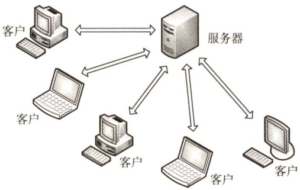
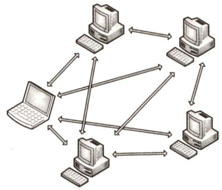

#### 6.1 网络应用模型  

#### 6.1.1 客户/服务器模型  

在客户/服务器（Client/Server，C/S）模型中，有一个总是打开的主机称为服务器，它服务于许多来自其他称为客户机的主机请求。其工作流程如下：  

1）服务器处于接收请求的状态。  
2）客户机发出服务请求，并等待接收结果。  
3）服务器收到请求后，分析请求，进行必要的处理，得到结果并发送给客户机。  

客户程序必须知道服务器程序的地址，客户机上一般不需要特殊的硬件和复杂的操作系统。而服务器上运行的软件则是专门用来提供某种服务的程序，可同时处理多个远程或本地客户的要求。系统启动后即自动调用并一直不断地运行着，被动地等待并接收来自各地客户的请求。因此，服务器程序不需要知道客户程序的地址。  

客户/服务器模型最主要的特征是：客户是服务请求方，服务器是服务提供方。如Web应用程序，其中总是打开的Web 服务器服务于运行在客户机上的浏览器的请求。当Web 服务器接收到来自客户机对某对象的请求时，它向该客户机发送所请求的对象以做出响应。常见的使用客户/服务器模型的应用包括Web、文件传输协议（FTP）、远程登录和电子邮件等。  

客户/服务器模型的主要特点还有：  

1）网络中各计算机的地位不平等，服务器可以通过对用户权限的限制来达到管理客户机的目的，使它们不能随意存储/删除数据，或进行其他受限的网络活动。整个网络的管理工作由少数服务器担当，因此网络的管理非常集中和方便。  
2）客户机相互之间不直接通信。例如，在Web应用中两个浏览器并不直接通信。  
3）可扩展性不佳。受服务器硬件和网络带宽的限制，服务器支持的客户机数有限。  

#### 6.1.2 P2P模型  

不难看出，在C/S模型中（见图6.1)，服务器性能的好坏决定了整个系统的性能，当大量用户请求服务时，服务器就必然成为系统的瓶颈。P2P模型（见图6.2）的思想是整个网络中的传输内容不再被保存在中心服务器上，每个结点都同时具有下载、上传的功能，其权利和义务都是大体对等的。  

  
图6.1 C/S模型  

  
图6.2P2P模型  

在P2P模型中，各计算机没有固定的客户和服务器划分。相反，任意一对计算机——称为对等方（Peer），直接相互通信。实际上，P2P模型从本质上来看仍然使用客户/服务器模式，每个结点既作为客户访问其他结点的资源，也作为服务器提供资源给其他结点访问。当前比较流行的P2P应用有PPlive、Bittorrent和电驴等。  

与C/S模型相比，P2P模型的优点主要体现如下：  

1）减轻了服务器的计算压力，消除了对某个服务器的完全依赖，可以将任务分配到各个结点上，因此大大提高了系统效率和资源利用率（例如，播放流媒体时对服务器的压力过大，而通过P2P模型，可以利用大量的客户机来提供服务)。  

2）多个客户机之间可以直接共享文档。  

3）可扩展性好，传统服务器有响应和带宽的限制，因此只能接受一定数量的请求。  

4）网络健壮性强，单个结点的失效不会影响其他部分的结点。  

P2P 模型也有缺点。在获取服务的同时，还要给其他结点提供服务，因此会占用较多的内存，影响整机速度。例如，经常进行P2P下载还会对硬盘造成较大的损伤。据某互联网调研机构统计，当前P2P程序已占互联网 $50\%\sim90\%$ 的流量，使网络变得非常拥塞，因此各大ISP（互联网服务提供商，如电信、网通等）通常都对P2P应用持反对态度。  

#### 6.1.3 本节习题精选  

#### 单项选择题  

01.服务程序在Windows环境下工作，并且允许该服务器程序的计算机也作为客户访问其他计算机上提供的服务。那么，这种网络应用模型属于（）。  

A．主从式 B．对等式C.客户/服务器模型 D.集中式  

02．在客户/服务器模型中，客户指的是（）。  

A．请求方 B.响应方 C.硬件 D.软件  

03.用户提出服务请求，网络将用户请求传送到服务器；服务器执行用户请求，完成所要求的操作并将结果送回用户，这种工作模式称为（）。  

A.C/S模型 B．P2P模型C.CSMA/CD模式 D．令牌环模式  

04.下面关于客户/服务器模型的描述，（）存在错误。  

I．客户端必须提前知道服务器的地址，而服务器则不需要提前知道客户端的地址ⅡI．客户端主要实现如何显示信息与收集用户的输入，而服务器主要实现数据的处理III．浏览器显示的内容来自服务器IV．客户端是请求方，即使连接建立后，服务器也不能主动发送数据  

A.I、IV B．III、IV C.只有IV D.只有IⅢI)5．下列关于客户/服务器模型的说法中，不正确的是（）。  

A．服务器专用于完成某些服务，而客户机则作为这些服务的使用者  
B．客户机通常位于前端，服务器通常位于后端  
C.客户机和服务器通过网络实现协同计算任务  
D.客户机是面向任务的，服务器是面向用户的  

06．以下关于P2P概念的描述中，错误的是（）。  

A.P2P是网络结点之间采取对等方式直接交换信息的工作模式B.P2P通信模式是指P2P网络中对等结点之间的直接通信能力C.P2P网络是指与互联网并行建设的、由对等结点组成的物理网络D.P2P实现技术是指为实现对等结点之间直接通信的功能所需要设计  

07.【2019统考真题】下列关于网络应用模型的叙述中，错误的是（）。  

A.在P2P模型中，结点之间具有对等关系B.在客户/服务器（C/S）模型中，客户与客户之间可以直接通信C.在C/S模型中，主动发起通信的是客户，被动通信的是服务器D.在向多用户分发一个文件时，P2P模型通常比C/S模型所需的时间短  

#### 6.1.4 答案与解析  

单项选择题  

01.B  

在P2P模型中，各用户计算机共享资源，从而提供比单个用户所能提供的多得多的资源。这里，各个计算机没有固定的客户和服务器划分，任意一对计算机称为对等方。  

02.A  

客户机既不是硬件又不是软件，只是服务的请求方，服务器才是响应方。  

03.A  

用户提出服务请求，网络将用户请求传送到服务器；服务器执行用户请求，完成所要求的操作并将结果送回用户，这种工作模型称为客户/服务器模型。  

04.C  

在连接未建立前，服务器在某一个端口上监听。客户端是连接的请求方，客户端必须事先知道服务器的地址才能发出连接请求，而服务器则从客户端发来的数据包中获取客户端的地址。一旦连接建立，服务器就能响应客户端请求的内容，服务器也能主动发送数据给客户端，用于一些消息的通知，如一些错误的通知。所以只有IV错误。  

05.D  

客户机的作用是根据用户需求向服务器发出服务请求，并将服务器返回的结果呈现给用户，因此客户机是面向用户的，服务器是面向任务的。  

06.C  

选项C中“P2P网络是一种物理网络”的描述是错误的。P2P网络是指在互联网中由对等结点组成的一种覆盖网络（OverlayNetwork)，是一种动态的逻辑网络。另外，对等结点之间具有直接通信的能力是P2P的显著特点。  

07.B  

在P2P模型中，每个结点的权利和义务是对等的。在C/S模型中，客户是服务发起方，服务器被动接受各地客户的请求，但客户之间不能直接通信，例如Web应用中两个浏览器之间并不直接通信。P2P 模型减轻了对某个服务器的计算压力，可以将任务分配到各个结点上，极大提高了系统效率和资源利用率。