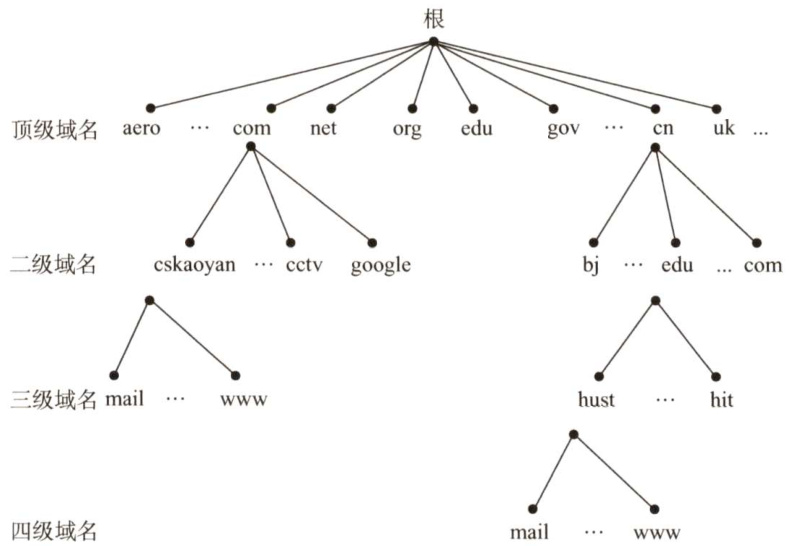
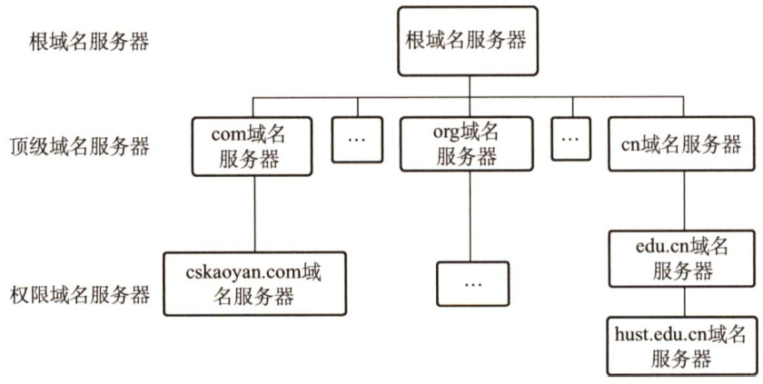
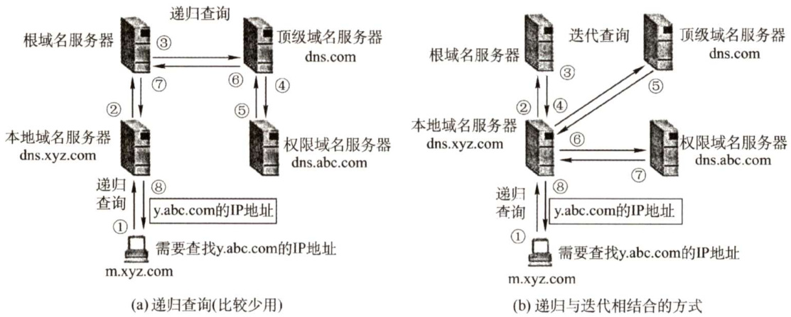
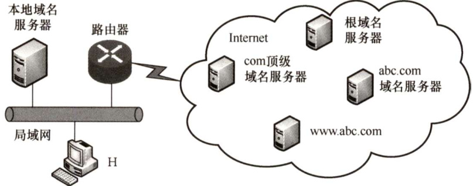

#### 6.2 域名系统（DNS）  

域名系统（DomainNameSystem，DNS）是因特网使用的命名系统，用来把便于人们记忆的具有特定含义的主机名（如www.cskaoyan.com）转换为便于机器处理的IP地址。相对于IP地址，人们更喜欢使用具有特定含义的字符串来标识因特网上的计算机。值得注意的是，DNS 系统采用客户/服务器模型，其协议运行在UDP之上，使用53号端口。  

从概念上可将DNS分为3部分：层次域名空间、域名服务器和解析器。  

#### 6.2.1 层次域名空间  

因特网采用层次树状结构的命名方法。采用这种命名方法，任何一个连接到因特网的主机或路由器，都有一个唯一的层次结构名称，即域名（DomainName）。域（Domain）是名字空间中一个可被管理的划分。域还可以划分为子域，而子域还可以继续划分为子域的子域，这样就形成了顶级域、二级域、三级域等。每个域名都由标号序列组成，而各标号之间用点（“."）隔开。一个典型的例子如图6.3所示，它是王道论坛用于提供WWW服务的计算机（Web服务器）的域名，它由三个标号组成，其中标号com是顶级域名，标号cskaoyan是二级域名，标号www是三级域名。  

  
图6.3一个域名的例子  

关于域名中的标号有以下几点需要注意：  

1）标号中的英文不区分大小写。  
2）标号中除连字符（-）外不能使用其他的标点符号。  

3）每个标号不超过63个字符，多标号组成的完整域名最长不超过255个字符。  

4）级别最低的域名写在最左边，级别最高的顶级域名写在最右边。  

顶级域名（TopLevelDomain，TLD）分为如下三大类：  

1）国家（地区）顶级域名（nTLD)。国家和某些地区的域名，如“.cn”表示中国，“.us”表示美国，“.uk”表示英国。  
2）通用顶级域名（gTLD）。常见的有“.com”（公司）、“.net”（网络服务机构）“.org”（非营利性组织）和“.goV”（国家或政府部门）等。  
3）基础结构域名。这种顶级域名只有一个，即 arpa，用于反向域名解析，因此又称反向域名。  

国家（地区）顶级域名下注册的二级域名均由该国家（地区）自行确定。图6.4展示了域名空间的树状结构。  

  
图6.4域名空间的树状结构  

在域名系统中，每个域分别由不同的组织进行管理。每个组织都可以将它的域再分成一定数目的子域，并将这些子域委托给其他组织去管理。例如，管理cn 域的中国将 edu.cn 子域授权给中国教育和科研计算机网（CERNET）来管理。  

#### 6.2.2 域名服务器  

因特网的域名系统被设计成一个联机分布式的数据库系统，并采用客户/服务器模型。域名到IP 地址的解析是由运行在域名服务器上的程序完成的，一个服务器所负责管辖的（或有权限的)范围称为区（不以“域”为单位)，各单位根据具体情况来划分自己管辖范围的区，但在一个区中的所有结点必须是能够连通的，每个区设置相应的权限域名服务器，用来保存该区中的所有主机的域名到IP地址的映射。每个域名服务器不但能够进行一些域名到IP地址的解析，而且还必须具有连向其他域名服务器的信息。当自己不能进行域名到IP地址的转换时，能够知道到什么地方去找其他域名服务器。  

DNS 使用了大量的域名服务器，它们以层次方式组织。没有一台域名服务器具有因特网上所有主机的映射，相反，该映射分布在所有的DNS上。采用分布式设计的DNS，是一个在因特网上实现分布式数据库的精彩范例。主要有4种类型的域名服务器。  

#### 1．根域名服务器  

根域名服务器是最高层次的域名服务器，所有的根域名服务器都知道所有的顶级域名服务器的IP地址。根域名服务器也是最重要的域名服务器，不管是哪个本地域名服务器，若要对因特网上任何一个域名进行解析，只要自己无法解析，就首先要求助于根域名服务器。因特网上有13个根域名服务器，尽管我们将这13个根域名服务器中的每个都视为单个服务器，但每个“服务器”实际上是余服务器的集群，以提供安全性和可靠性。需要注意的是，根域名服务器用来管辖顶级域（如.com)，通常它并不直接把待查询的域名直接转换成IP地址，而是告诉本地域名服务器下一步应当找哪个顶级域名服务器进行查询。  

#### 2.顶级域名服务器  

这些域名服务器负责管理在该顶级域名服务器注册的所有二级域名。收到DNS查询请求时，就给出相应的回答（可能是最后的结果，也可能是下一步应当查找的域名服务器的IP地址)。  

#### 3．授权域名服务器（权限域名服务器）  

每台主机都必须在授权域名服务器处登记。为了更加可靠地工作，一台主机最好至少有两个授权域名服务器。实际上，许多域名服务器都同时充当本地域名服务器和授权域名服务器。授权域名服务器总能将其管辖的主机名转换为该主机的IP地址。  

#### 4．本地域名服务器  

本地域名服务器对域名系统非常重要。每个因特网服务提供者（ISP)，或一所大学，甚至一所大学中的各个系，都可以拥有一个本地域名服务器。当一台主机发出DNS 查询请求时，这个查询请求报文就发送给该主机的本地域名服务器。事实上，我们在Windows系统中配置“本地连接”时，就需要填写DNS地址，这个地址就是本地DNS（域名服务器）的地址。  

DNS的层次结构如图6.5所示。  

  
图6.5DNS的层次结构  

#### 6.2.3 域名解析过程  

域名解析是指把域名映射成为IP地址或把IP地址映射成域名的过程。前者称为正向解析，后者称为反向解析。当客户端需要域名解析时，通过本机的DNS客户端构造一个DNS请求报文，以UDP数据报方式发往本地域名服务器。  

域名解析有两种方式：递归查询和递归与选代相结合的查询。  

递归查询的过程如图6.6(a)所示，本地域名服务器只需向根域名服务器查询一次，后面的几次查询都是递归地在其他几个域名服务器之间进行的［步骤 $\textcircled{3}\sim\textcircled{6}$ ]。在步骤 $\textcircled{7}$ 中，本地域名服务器从根域名服务器得到了所需的IP地址，最后在步骤 $\textcircled{8}$ 中，本地域名服务器把查询结果告诉发起查询的主机。由于该方法给根域名服务造成的负载过大，所以在实际中几乎不使用。  

常用递归与迭代相结合的查询方式如图6.6(b)所示，该方式分为两个部分。  

  
图6.6两种域名解析方式工作原理  

（1）主机向本地域名服务器的查询采用的是递归查询  

也就是说，如果本地主机所询问的本地域名服务器不知道被查询域名的 IP 地址，那么本地域名服务器就以DNS 客户的身份，向根域名服务器继续发出查询请求报文（即替该主机继续查询)，而不是让该主机自己进行下一步的查询。两种查询方式的这一步是相同的。  

（2）本地域名服务器向根域名服务器的查询采用迭代查询  

当根域名服务器收到本地域名服务器发出的迭代查询请求报文时，要么给出所要查询的 IP地址，要么告诉本地域名服务器：“你下一步应当向哪个顶级域名服务器进行查询”。然后让本地域名服务器向这个顶级域名服务器进行后续的查询，如图 6.6(b)所示。同样，顶级域名服务器收到查询报文后，要么给出所要查询的IP地址，要么告诉本地域名服务器下一步应向哪个权限域名服务器查询。最后，知道所要解析的域名的IP地址后，把这个结果返回给发起查询的主机。  

下面举例说明域名解析的过程。假定某客户机想获知域名为y.abc.com主机的IP地址，域名解析的过程（共使用了8个UDP报文）如下：  

$\textcircled{1}$ 客户机向其本地域名服务器发出DNS请求报文（递归查询)。  
$\textcircled{2}$ 本地域名服务器收到请求后，查询本地缓存，若没有该记录，则以DNS 客户的身份向根域名服务器发出解析请求报文(选代查询)。  
$\textcircled{3}$ 根域名服务器收到请求后，判断该域名属于.com域，将对应的顶级域名服务器dns.com的IP地址返回给本地域名服务器。  
$\textcircled{4}$ 本地域名服务器向顶级域名服务器dns.com发出解析请求报文（迭代查询)。  
$\textcircled{5}$ 顶级域名服务器dns.com收到请求后，判断该域名属于abc.com域，因此将对应的授权域名服务器dns.abc.com的IP地址返回给本地域名服务器。  
$\textcircled{6}$ 本地域名服务器向授权域名服务器dns.abc.com发起解析请求报文（选代查询)。  
$\textcircled{7}$ 授权域名服务器dns.abc.com收到请求后，将查询结果返回给本地域名服务器。  
$\textcircled{8}$ 本地域名服务器将查询结果保存到本地缓存，同时返回给客户机。  

为了提高DNS 的查询效率，并减少因特网上的DNS 查询报文数量，在域名服务器中广泛地使用了高速缓存。当一个DNS 服务器接收到DNS 查询结果时，它能将该DNS 信息缓存在高速缓存中。这样，当另一个相同的域名查询到达该 DNS 服务器时，该服务器就能够直接提供所要求的IP地址，而不需要再去向其他DNS 服务器询问。因为主机名和IP地址之间的映射不是永久的，所以DNS服务器将在一段时间后丢弃高速缓存中的信息。  

#### 6.2.4 本节习题精选  

#### 一、单项选择题  

01．域名与（）具有一一对应的关系。  

A．IP地址 B.MAC地址 C.主机 D.以上都不是  

02．下列说法错误的是（）。  

A.Internet上提供客户访问的主机一定要有域名B.同一域名在不同时间可能解析出不同的IP地址C.多个域名可以指向同一台主机IP地址D.IP子网中的主机可以由不同的域名服务器来维护其映射  

03.DNS是基于（）模型的分布式系统。  

A.C/S B.B/S C.P2P D.以上均不正确  

04.域名系统（DNS）的组成不包括（）。  

A．域名空间 B．分布式数据库C．域名服务器 D．从内部IP地址到外部IP地址的翻译程序  

05．互联网中域名解析依赖于由域名服务器组成的逻辑树。在域名解析过程中，主机上请求域名解析的软件不需要知道（）信息。  

I．本地域名服务器的IPⅡI．本地域名服务器父结点的IPIⅢI.域名服务器树根结点的IP  

A.I和Ⅱ B.I和III C.Ⅱ和I D.I、Ⅱ和Ⅲ  

06．在DNS的递归查询中，由（）给客户端返回地址。  

A．最开始连接的服务器 B．最后连接的服务器C．目的地址所在服务器 D．不确定  

07．一台主机要解析www.cskaoyan.com的IP地址，如果这台主机配置的域名服务器为202.120.66.68，因特网顶级域名服务器为11.2.8.6，而存储www.cskaoyan.com的IP地址对应关系的域名服务器为202.113.16.10，那么这台主机解析该域名通常首先查询（）。  

A.202.120.66.68域名服务器  
B.11.2.8.6域名服务器  
C.202.113.16.10域名服务器  
D.可以从这3个域名服务器中任选一个  

08.（）可以将其管辖的主机名转换为主机的IP地址。  

A．本地域名服务器 B．根域名服务器C.授权域名服务器 D．代理域名服务器  

09.【2010统考真题】若本地域名服务器无缓存，则在采用递归方法解析另一网络某主机域名时，用户主机和本地域名服务器发送的域名请求条数分别为（）。  

A.1条，1条 B.1条，多条 C.多条，1条 D．多条，多条  

10.【2016统考真题】假设所有域名服务器均采用迭代查询方式进行域名解析。当主机访问规范域名为www.abc.xyz.com的网站时，本地域名服务器在完成该域名解析的过程中，可能发出DNS查询的最少和最多次数分别是（）。  

A.0,3 B.1，3 C.0,4 D.1，4  

11.【2018统考真题】下列TCP/IP应用层协议中，可以使用传输层无连接服务的是（  

A. FTP B.DNS C. SMTP D.HTTP  

12.【2020统考真题】假设下图所示网络中的本地域名服务器只提供递归查询服务，其他域名服务器均只提供选代查询服务；局域网内主机访问Internet上各服务器的往返时间（RTT）均为 $10\mathrm{ms}$ ，忽略其他各种时延。若主机H通过超链接http://www.abc.com/index.html请求浏览纯文本Web页index.html，则从单击超链接开始到浏览器接收到index.html页面为止，所需的最短时间与最长时间分别是（）。  

  

A. $10\mathrm{ms}$ ，40ms B. 10ms，50ms C. $20\mathrm{ms}$ ，40ms D.20ms，50ms  

#### 二、综合应用题  

01．一台具有单个DNS名称的机器可以有多个IP地址吗？为什么？  

02．一台计算机可以有两个属于不同顶级域的DNS名字吗？如果可以，试举例说明。  

03．DNS使用UDP而非TCP，如果一个DNS分组丢失，没有自动恢复，那么这会引起问题吗？如果会，应该如何解决？  

04.为什么要引入域名的概念？举例说明域名转换过程。域名服务器中的高速缓存的作用是什么？  

#### 6.2.5 答案与解析  

#### 一、单项选择题  

01.D  

如果一台主机通过两块网卡连接到两个网络（如服务器双线接入)，那么就具有两个IP地址，每个网卡对应一个MAC地址，显然这两个IP地址可以映射到同一个域名上。此外，多台主机也可以映射到同一个域名上（如负载均衡)，一台主机也可以映射到多个域名上（如虚拟主机)。因此，选项A、B、C和域名均不具有一一对应的关系。  

02.A  

Intemet上提供访问的主机一定要有IP地址，而不一定要有域名，A错。域名在不同的时间可以解析出不同的IP地址，因此可以用多台服务器来分担负载，B对。也可以把多个域名指向同一台主机IP地址，C 对。IP子网中主机也可以由不同的域名服务器来维护其映射，D对。  

03.A  

域名系统（DNS）是一个基于客户/服务器模型的分布式数据库系统，主要作用是进行域名和IP地址之间的相互映射。  

04.D  

DNS 提供从域名到IP地址或从IP地址到域名的映射服务。它被设计成为一个联机分布式数据库系统，并采用客户/服务器方式。域名的解析是由若干域名服务器程序完成的。从内部 IP 地址到外部IP地址的映射是由NAT实现的，用于缓解IPv4地址紧缺的问题，与域名系统无关。  

05.C  

正常情况下，客户机只需把域名解析请求发往本地域名服务器，其他事情都由本地域名服务器完成，并把最后结果返回给客户机。所以主机只需要知道本地域名服务器的IP。  

06.A  

在递归查询中，每台不包含被请求信息的服务器都转到其他地方去查找，然后它再往回发送结果，所以客户端最开始连接的服务器最终将返回正确的信息。  

07.A  

当这台主机发出对www.cskaoyan.com的DNS查询报文时，这个查询报文首先被送往该主机的本地域名服务器202.120.66.68。本地域名服务器不能立即回答该查询时，就以DNS 客户的身份向某一根域名服务器查询。但不管采用何种查询方式，首先都要查询本地域名服务器。  

08.C  

每台主机都必须在授权域名服务器处注册登记，授权域名服务器一定能够将其管辖的主机名转换为该主机的IP地址。  

09.A  

采用递归查询时，如果主机所询问的本地域名服务器不知道被查询域名的IP地址，那么本地域名服务器就以DNS 客户的身份，向根域名服务器继续发出查询请求报文，而不是让该主机自己进行下一步的查询。因此，采用这种方法时，用户主机和本地域名服务器发送的域名请求条数均为1。因此选A。  

10.C  

解析请扫右侧二维码查阅。  

11.B  

FTP用来传输文件，SMTP用来发送电子邮件，HTTP用来传输网页文件，都对可靠性的要求较高，因此都用传输层有连接的TCP服务。无连接的UDP服务效率更高、开销小，DNS在传输层采用无连接的UDP服务。  

12.D  

题中RTT均为局域网内主机（主机H、本地域名服务器）访问Intermet上各服务器的往返时间，且忽略其他时延，因此主机H向本地域名服务器的查询时延忽略不计。最短时间：本地主机中有该域名到IP地址对应的记录，因此不需要DNS查询时延，直接和www.abc.com服务器建立TCP连接再进行资源访问，TCP连接建立需要1个RTT，接着发送访问请求并收到服务器资源响应需要1个RTT，共计2个RTT，即 $20\mathrm{ms}$ ；最长时间：本地主机递归查询本地域名服务器（延时忽略)，本地服务器依次迭代查询根域名服务器、com顶级域名服务器、abc.com域名服务器，共3个RTT，查询到IP地址后，将该映射返回给主机H，主机H和www.abc.com服务器建立TCP连接再进行资源访问，共2个RTT，因此最长时间需要 $3+2=5$ 个RTT，即 $50\mathrm{ms}$ 。  

#### 二、综合应用题  

01.【解答】  

可以，IP地址由网络号和主机号两部分构成。如果一台机器有两个以太网卡，那么它可以同时连到两个不同的网络上（网络号不能相同，否则会发生冲突)；如果是这样的话，那么它需要两个IP地址。  

02.【解答】  

可以，例如www.cskaoyan.com 和www.cskaoyan.cn 属于不同的顶级域（.com和.cn），但它们可以有同样的IP地址。用户输入这两个不同的DNS 名字，访问的都是同一台服务器。  

03.【解答】  

DNS 使用传输层的UDP而非TCP，因为它不需要使用TCP在发生传输错误时执行的自动重传功能。实际上，对于DNS 服务器的访问，多次DNS 请求都返回相同的结果，即做多次和做一次的效果一样。因此DNS 操作可以重复执行。当一个进程做一次DNS 请求时，它启动一个定时器。如果定时器计满而未收到回复，那么它就再请求一次，这样做不会有害处。  

04.【解答】  

IP地址很难记忆，引入域名是为了便于人们记忆和识别。  

域名解析可以把域名转换成IP地址。域名转换过程是向本地域名服务器申请解析，如果本地域名服务器查不到，那么向根域名服务器进行查询。如果根域名服务器中也查不到，那么向根域名服务器中保存的顶级域名服务器和相应授权域名服务器进行查询，一定可以查找到。  

域名服务器中高速缓存的作用：将近期访问过的域名信息保存在高速缓存，再次访问时会从缓存中读取，不需要重新解析，这样就可以加快域名解析的响应速度。