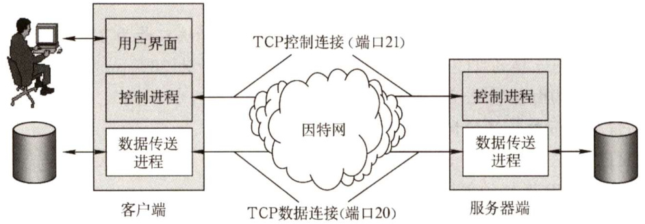

#### 6.3 文件传输协议（FTP)  

#### 6.3.1 FTP的工作原理  

文件传输协议（FileTransfer Protocol，FTP）是因特网上使用得最广泛的文件传输协议。FTP提供交互式的访问，允许客户指明文件的类型与格式，并允许文件具有存取权限。它屏蔽了各计算机系统的细节，因而适合于在异构网络中的任意计算机之间传送文件。  

FTP提供以下功能：  

$\textcircled{1}$ 提供不同种类主机系统（硬、软件体系等都可以不同）之间的文件传输能力。  
$\textcircled{2}$ 以用户权限管理的方式提供用户对远程FTP服务器上的文件管理能力。  
$\textcircled{3}$ 以匿名FTP的方式提供公用文件共享的能力。  

FTP采用客户/服务器的工作方式，它使用TCP可靠的传输服务。一个FTP 服务器进程可同时为多个客户进程提供服务。FTP的服务器进程由两大部分组成：一个主进程，负责接收新的请求；另外有若干从属进程，负责处理单个请求。其工作步骤如下：  

$\textcircled{1}$ 打开熟知端口21（控制端口)，使客户进程能够连接上。  
$\textcircled{2}$ 等待客户进程发连接请求。  
$\textcircled{3}$ 启动从属进程来处理客户进程发来的请求。主进程与从属进程并发执行，从属进程对客户进程的请求处理完毕后即终止。  
$\textcircled{4}$ 回到等待状态，继续接收其他客户进程的请求。  

FTP服务器必须在整个会话期间保留用户的状态信息。特别是服务器必须把指定的用户账户与控制连接联系起来，服务器必须追踪用户在远程目录树上的当前位置。  

#### 6.3.2 控制连接与数据连接  

FTP在工作时使用两个并行的TCP连接（见图6.7)：一个是控制连接（端口号21)，一个是数据连接（端口号20)。使用两个不同的端口号可使协议更加简单和更容易实现。  

  
图6.7控制连接和数据连接  

#### 1．控制连接  

服务器监听21号端口，等待客户连接，建立在这个端口上的连接称为控制连接，控制连接用来传输控制信息（如连接请求、传送请求等)，并且控制信息都以7位ASCII格式传送。FTP客户发出的传送请求，通过控制连接发送给服务器端的控制进程，但控制连接并不用来传送文件。在传输文件时还可以使用控制连接（如客户在传输中途发一个中止传输的命令)，因此控制连接在整个会话期间一直保持打开状态。  

#### 2.数据连接  

服务器端的控制进程在接收到FTP客户发来的文件传输请求后，就创建“数据传送进程”和“数据连接”。数据连接用来连接客户端和服务器端的数据传送进程，数据传送进程实际完成文件的传送，在传送完毕后关闭“数据传送连接”并结束运行。  

数据连接有两种传输模式：主动模式PORT和被动模式PASV。PORT模式的工作原理：客户端连接到服务器的21端口，登录成功后要读取数据时，客户端随机开放一个端口，并发送命令告知服务器，服务器收到PORT命令和端口号后，通过20端口和客户端开放的端口连接，发送数据。PASV模式的不同点是，客户端要读取数据时，发送PASV命令到服务器，服务器在本地随机开放一个端口，并告知客户端，客户端再连接到服务器开放的端口进行数据传输。可见，是用PORT模式还是PASV模式，选择权在客户端。简单概括为，主动模式传送数据是“服务器”连接到“客户端”的端口；被动模式传送数据是“客户端”连接到“服务器”的端口。  

因为FTP使用了一个分离的控制连接，所以也称FTP 的控制信息是带外（Out-of-band）传送的。使用FTP时，若要修改服务器上的文件，则需要先将此文件传送到本地主机，然后再将修改后的文件副本传送到原服务器，来回传送耗费很多时间。网络文件系统（NFS）采用另一种思路，它允许进程打开一个远程文件，并能在该文件的某个特定位置开始读写数据。这样，NFS可使用户复制一个大文件中的一个很小的片段，而不需要复制整个大文件。  

#### 6.3.3 本节习题精选  

#### 一、单项选择题  

01．文件传输协议（FTP）的一个主要特征是（）。  

A．允许客户指明文件的类型但不允许指明文件的格式B．不允许客户指明文件的类型但允许指明文件的格式C．允许客户指明文件的类型与格式  
D.不允许客户指明文件的类型与格式  

02．以下关于FTP工作模型的描述中，错误的是（）。  

A.FTP使用控制连接、数据连接来完成文件的传输B．用于控制连接的TCP连接在服务器端使用的熟知端口号为21C.用与控制连接的TCP连接在客户端使用的端口号为20D．服务器端由控制进程、数据进程两部分组成  

03．控制信息是带外传送的协议是（）。  

A.HTTP B. SMTP C. FTP D. POP  

04．下列关于FTP连接的叙述中，正确的是（）。  

A．控制连接先于数据连接被建立，并先于数据连接被释放B．数据连接先于控制连接被建立，并先于控制连接被释放C．控制连接先于数据连接被建立，并晚于数据连接被释放D．数据连接先于控制连接被建立，并晚于控制连接被释放  

05.FTP客户发起对FTP服务器连接的第一阶段是建立（）。  

A.传输连接 B．数据连接 C.会话连接 D.控制连接  

06．一个FTP用户发送了一个LIST命令来获取服务器的文件列表，这时服务器应通过（）端口来传输该列表。  

A.21 B.20 C. 22 D. 19  

07．下列关于FTP的叙述中，错误的是（）。  

A.FTP可以在不同类型的操作系统之间传送文件B.FTP并不适合用在两个计算机之间共享读写文件C．控制连接在整个FTP会话期间一直保持D.客户端默认使用端口20与服务器建立数据传输连接  

08．当一台计算机从FTP 服务器下载文件时，在该FTP服务器上对数据进行封装的5个转换步骤是（）。  

A．比特，数据帧，数据报，数据段，数据B．数据，数据段，数据报，数据帧，比特C．数据报，数据段，数据，比特，数据帧D．数据段，数据报，数据帧，比特，数据  

09.匿名FTP访问通常使用（）作为用户名。  

A. guest B.E-mail地址 C. anonymous D.主机id  

10.【2009统考真题】FTP客户和服务器间传递FTP命令时，使用的连接是（）  

A.建立在TCP之上的控制连接 B.建立在TCP之上的数据连接C.建立在UDP之上的控制连接 D.建立在UDP之上的数据连接  

11.【2017统考真题】下列关于FTP的叙述中，错误的是（）。  

A．数据连接在每次数据传输完毕后就关闭B．控制连接在整个会话期间保持打开状态C.服务器与客户端的TCP20端口建立数据连接D.客户端与服务器的TCP21端口建立控制连接  

#### 二、综合应用题  

01．又件传输协议的王要工作过柱是怎样的？王进程和从属进程各起什么作用？  

02.为什么FTP要使用两个独立的连接，即控制连接和数据连接？  
03．主机A想下载文件ftp:/ftp.abc.edu.cn/file，大致描述下载过程中主机和服务器的交互过程。  

#### 6.3.4 答案与解析  

#### 一、单项选择题  

01.C  

FTP提供交互式访问，允许客户指明文件的类型与格式，并允许文件具有存取权限。所以选项C为正确答案。  

02.C  

在服务器端，控制连接使用TCP的21号端口，数据连接使用TCP的20号端口；而在客户端，控制连接和数据连接的TCP端口号都是由客户端系统自动分配的。需要注意的是，当我们说FTP使用20、21号端口，HTTP使用80号端口，SMTP使用25号端口时，都是指相应协议的服务器端所使用的端口号，而客户端使用系统自动分配的端口号向这些服务的熟知端口发起连接。  

03.C  

由于FTP传输控制信息使用的是数据连接外的控制连接，因此FTP的控制信息是带外传送的。  

04.C  

FTP 客户首先连接服务器的21号端口，建立控制连接（控制连接在整个会话期间一直保持打开)，然后建立数据连接，在数据传送完毕后，数据连接最先释放，控制连接最后释放。  

05.D  

FTP工作时使用两个连接：控制连接和数据连接。FTP客户对FTP服务器发起连接时，首先建立控制连接，即向服务器的21号TCP端口发起连接；然后再建立数据连接（20号TCP端口)。FTP并没有传输连接和会话连接的说法。  

06.B  

FTP中数据连接的端口是20，而文件的列表是通过数据连接来传输的。  

07.D  

控制连接建立后，服务器进程用自己传送数据的熟知端口20与客户进程所提供的端口号建立数据传输连接，即客户进程的端口号是客户进程自己提供的。  

08.B  

FTP服务器的数据要经过应用层、传输层、网络层、数据链路层及物理层。因此，对应的封装是数据、数据段、数据报、数据帧，最后是比特。  

09.C  

针对文件传输FTP，系统管理员建立了一个特殊的用户ID，名为 anonymous，即匿名用户。Intermet上的任何人在任何地方都可以使用该用户ID，只是在要求提供用户ID 时必须输入anonymous，该用户ID的密码可以是任何字符串。  

10.A  

对于FTP文件传输，为了保证可靠性，选择TCP，排除C、D。FTP 的控制信息是带外传送的，即FTP使用了一个分离的控制连接来传送命令，因此选A。  

11.C  

FTP 使用控制连接和数据连接，控制连接存在于整个FTP会话过程中，数据连接在每次文件传输时才建立，传输结束就关闭，A和B正确。默认情况下FTP服务器使用TCP20端口进行数据连接，使用TCP21端口进行控制连接，这里的端口号是指FTP服务器的端口号，C 错误，D正确。此外还需要注意的是，FTP服务器是否使用TCP20端口建立数据连接与传输模式有关，主动方式使用TCP20端口，被动方式由服务器和客户端自行协商决定。  

#### 二、综合应用题  

01.【解答】  

FTP 的主要工作过程如下：在进行文件传输时，FTP客户所发出的传送请求通过控制连接发送给服务器端的控制进程，并在整个会话期间一直保持打开，但控制连接不用来传送文件。服务器端的控制进程在接收到FTP客户发送来的文件传输请求后，就创建数据传送进程和数据连接，数据连接用来连接客户端和服务器端的数据传输进程，数据传送进程实际完成对文件的传送，在传送完毕后关闭“数据传送连接”，并结束运行。  

FTP 的服务器进程由两大部分组成：一个主进程，负责接收新的请求；若干从属进程，负责处理单个请求。  

02.【解答】  

在FTP的实现中，客户与服务器之间采用了两条传输连接，其中控制连接用于传输各种FTP命令，而数据连接用于文件的传送。之所以这样设计，是因为使用两条独立的连接可使FTP变得更加简单、更容易实现、更有效率。同时在文件传输过程中，还可以利用控制连接控制传输过程，如客户可以请求终止、暂停传输等。  

03.【解答】大致过程如下：  

$\textcircled{1}$ 建立一个TCP连接到服务器ftp.abc.edu.cn的21号端口，然后发送登录账号和密码。  
$\textcircled{2}$ 服务器返回登录成功信息后，主机A打开一个随机端口，并将该端口号发送给服务器。  
$\textcircled{3}$ 主机A发送读取文件命令，内容为getfile，服务器使用20号端口建立一个TCP连接到主机A的随机打开的端口。  
$\textcircled{4}$ 服务器把文件内容通过第二个连接发送给主机A，传输完毕后连接关闭。