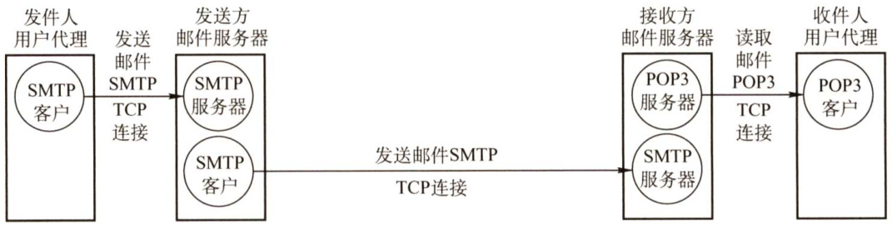
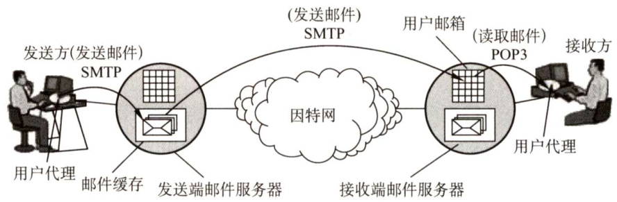
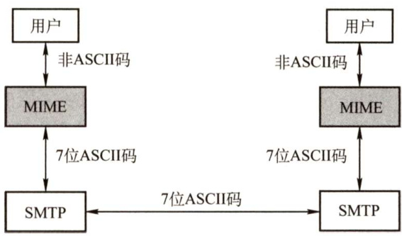
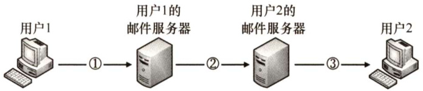

#### 6.4 电子邮件  

#### 6.4.1 电子邮件系统的组成结构  

自从有了因特网，电子邮件就在因特网上流行起来。电子邮件是一种异步通信方式，通信时不需要双方同时在场。电子邮件把邮件发送到收件人使用的邮件服务器，并放在其中的收件人邮箱中，收件人可以随时上网到自己使用的邮件服务器进行读取。  

一个电子邮件系统应具有图6.8所示的三个最主要的组成构件，即用户代理（User Agent）、邮件服务器和电子邮件使用的协议，如SMTP、POP3（或IMAP）等。  

  
图6.8电子邮件系统最主要的组成构件  

用户代理（UA)：用户与电子邮件系统的接口。用户代理向用户提供一个很友好的接口来发送和接收邮件，用户代理至少应当具有撰写、显示和邮件处理的功能。通常情况下，用户代理就是一个运行在PC上的程序（电子邮件客户端软件)，常见的有Outlook和Foxmail等。  

邮件服务器：它的功能是发送和接收邮件，同时还要向发信人报告邮件传送的情况（已交付、被拒绝、丢失等)。邮件服务器采用客户/服务器方式工作，但它必须能够同时充当客户和服务器。例如，当邮件服务器A向邮件服务器B发送邮件时，A就作为SMTP客户，而B是SMTP 服务器；反之，当B向A发送邮件时，B就是SMTP客户，而A就是SMTP服务器。  

邮件发送协议和读取协议：邮件发送协议用于用户代理向邮件服务器发送邮件或在邮件服务器之间发送邮件，如 SMTP;邮件读取协议用于用户代理从邮件服务器读取邮件，如POP3。注意，SMTP用的是“推”（Push）的通信方式，即用户代理向邮件服务器发送邮件及在邮件服务器之间发送邮件时，SMTP客户将邮件“推”送到SMTP服务器。而POP3用的是“拉”（Pull）的通信方式，即用户读取邮件时，用户代理向邮件服务器发出请求，“拉”取用户邮箱中的邮件。  

电子邮件的发送、接收过程可简化为如图6.9所示。  

  
图6.9电子邮件的发送、接收过程  

下面简单介绍电子邮件的收发过程。  

$\textcircled{1}$ 发信人调用用户代理来撰写和编辑要发送的邮件。用户代理用SMTP把邮件传送给发送端邮件服务器。  
$\textcircled{2}$ 发送端邮件服务器将邮件放入邮件缓存队列中，等待发送。  
$\textcircled{3}$ 运行在发送端邮件服务器的SMTP客户进程，发现邮件缓存中有待发送的邮件，就向运行在接收端邮件服务器的SMTP服务器进程发起建立TCP连接。  
$\textcircled{4}$ TCP连接建立后，SMTP客户进程开始向远程SMTP服务器进程发送邮件。当所有待发送邮件发完后，SMTP就关闭所建立的TCP连接。  
$\textcircled{5}$ 运行在接收端邮件服务器中的SMTP服务器进程收到邮件后，将邮件放入收信人的用户邮箱，等待收信人在方便时进行读取。  
$\textcircled{6}$ 收信人打算收信时，调用用户代理，使用POP3（或IMAP）协议将自己的邮件从接收端邮件服务器的用户邮箱中取回（如果邮箱中有来信的话)。  

#### 6.4.2 电子邮件格式与MIME  

#### 1．电子邮件格式  

一个电子邮件分为信封和内容两大部分，邮件内容又分为首部和主体两部分。RFC 822规定了邮件的首部格式，而邮件的主体部分则让用户自由撰写。用户写好首部后，邮件系统自动地将信封所需的信息提取出来并写在信封上，用户不需要亲自填写信封上的信息。  

邮件内容的首部包含一些首部行，每个首部行由一个关键字后跟冒号再后跟值组成。有些关键字是必需的，有些则是可选的。最重要的关键字是To和 Subject。  

To 是必需的关键字，后面填入一个或多个收件人的电子邮件地址。电子邮件地址的规定格式为：收件人邮箱名 $@$ 邮箱所在主机的域名，如abc@cskaoyan.com，其中收信人邮箱名即用户名，abc 在cskaoyan.com这个邮件服务器上必须是唯一的。这也就保证了abc@cskaoyan.com这个邮件地址在整个因特网上是唯一的。  

Subject是可选关键字，是邮件的主题，反映了邮件的主要内容。  

当然，还有一个必填的关键字是From，但它通常由邮件系统自动填入。首部与主体之间用一个空行进行分割。典型的邮件内容如下：  

From:hoopdog@hust.edu.cn  
To:abc@cskaoyan.com 首部  
Subject:Say hello to Internet  
blahblah...主体  

#### 2.多用途网际邮件扩充（MIME）  

由于SMTP只能传送一定长度的ASCII码邮件，许多其他非英语国家的文字（如中文、俄文，甚至带重音符号的法文或德文）就无法传送，且无法传送可执行文件及其他二进制对象，因此提出了多用途网络邮件扩充（MultipurposeInternetMailExtensions，MIME）。  

MIME并未改动SMTP或取代它。MIME的意图是继续使用目前的格式，但增加了邮件主体的结构，并定义了传送非ASCII码的编码规则。也就是说，MIME邮件可在现有的电子邮件程序和协议下传送。MIME与SMTP的关系如图6.10所示。  

MIME主要包括以下三部分内容：  

  
图6.10SMTP与MIME的关系  

$\textcircled{1}$ 5个新的邮件首部字段，包括MIME 版本、内容描述、内容标识、传送编码和内容类型。  
$\textcircled{2}$ 定义了许多邮件内容的格式，对多媒体电子邮件的表示方法进行了标准化。  
$\textcircled{3}$ 定义了传送编码，可对任何内容格式进行转换，而不会被邮件系统改变。  

#### 6.4.3 SMTP和POP3  

#### 1. SMTP  

简单邮件传输协议（SimpleMailTransfer Protocol，SMTP）是一种提供可靠且有效的电子邮件传输的协议，它控制两个相互通信的SMTP进程交换信息。由于SMTP使用客户/服务器方式，因此负责发送邮件的SMTP进程就是SMTP客户，而负责接收邮件的SMTP进程就是SMTP服务器。SMTP用的是TCP连接，端口号为25。SMTP通信有以下三个阶段。  

#### （1）连接建立  

发件人的邮件发送到发送方邮件服务器的邮件缓存中后，SMTP客户就每隔一定时间对邮件缓存扫描一次。如发现有邮件，就使用SMTP的熟知端口号（25）与接收方邮件服务器的SMTP服务器建立TCP连接。连接建立后，接收方SMTP服务器发出220Service ready（服务就绪）。然后SMTP客户向SMTP服务器发送HELO命令，附上发送方的主机名。  

SMTP不使用中间的邮件服务器。TCP连接总是在发送方和接收方这两个邮件服务器之间直接建立，而不管它们相隔多远，不管在传送过程中要经过多少个路由器。当接收方邮件服务器因故障暂时不能建立连接时，发送方的邮件服务器只能等待一段时间后再次尝试连接。  

#### （2）邮件传送  

连接建立后，就可开始传送邮件。邮件的传送从MAIL命令开始，MAIL命令后面有发件人的地址。如MAIL FROM:<hoopdog@hust.edu.cn>。若 SMTP 服务器已准备好接收邮件，则回答$250\mathrm{OK}$ 。接着SMTP客户端发送一个或多个RCPT（收件人recipient的缩写）命令，格式为RCPTTO:<收件人地址 $>$ 。每发送一个RCPT命令，都应有相应的信息从SMTP服务器返回，如250OK或 $550\mathrm{No}$ such userhere（无此用户）。  

RCPT命令的作用是，先弄清接收方系统是否已做好接收邮件的准备，然后才发送邮件，以便不至于发送了很长的邮件后才知道地址错误，进而避免浪费通信资源。  

获得OK的回答后，客户端就使用DATA命令，表示要开始传输邮件的内容。正常情况下，SMTP 服务器回复的信息是354 Start mail input; end with<CRLF>.<CRLF>。<CRLF>表示回车换行。此时SMTP客户端就可开始传送邮件内容，并用<CRLF>.<CRLF>表示邮件内容的结束。  

（3）连接释放  

邮件发送完毕后，SMTP客户应发送QUIT命令。SMTP服务器返回的信息是221（服务关闭)，表示SMTP同意释放TCP连接。邮件传送的全部过程就此结束。  

#### 2.POP3和IMAP  

邮局协议（PostOfficeProtocol，POP）是一个非常简单但功能有限的邮件读取协议，现在使用的是它的第3个版本POP3。POP3采用的是“拉”（Pull）的通信方式，当用户读取邮件时，用户代理向邮件服务器发出请求，“拉”取用户邮箱中的邮件。  

POP也使用客户/服务器的工作方式，在传输层使用TCP，端口号为110。接收方的用户代理上必须运行POP客户程序，而接收方的邮件服务器上则运行POP 服务器程序。POP有两种工作方式：“下载并保留”和“下载并删除”。在“下载并保留”方式下，用户从邮件服务器上读取邮件后，邮件依然会保存在邮件服务器上，用户可再次从服务器上读取该邮件；而使用“下载并删除”方式时，邮件一旦被读取，就被从邮件服务器上删除，用户不能再次从服务器上读取。  

另一个邮件读取协议是因特网报文存取协议（IMAP)，它比POP复杂得多，IMAP为用户提供了创建文件夹、在不同文件夹之间移动邮件及在远程文件夹中查询邮件等联机命令，为此IMAP服务器维护了会话用户的状态信息。IMAP的另一特性是允许用户代理只获取报文的某些部分，例如可以只读取一个报文的首部，或多部分MIME报文的一部分。这非常适用于低带宽的情况，用户可能并不想取回邮箱中的所有邮件，尤其是包含很多音频或视频的大邮件。  

此外，随着万维网的流行，目前出现了很多基于万维网的电子邮件，如Hotmail、Gmail等。这种电子邮件的特点是，用户浏览器与Hotmail或Gmail的邮件服务器之间的邮件发送或接收使用的是HTTP，而仅在不同邮件服务器之间传送邮件时才使用SMTP。  

#### 6.4.4 本节习题精选  

#### 一、单项选择题  

01．因特网用户的电子邮件地址格式必须是（）。  

A.用户名 $@$ 单位网络名 B．单位网络名 $@$ 用户名C．邮箱所在主机的域名 $@$ 用户名 D.用户名 $@$ 邮箱所在主机的域名  

02．SMTP基于传输层的（）协议，POP3基于传输层的（）协议。  

A.TCP，TCP B.TCP，UDP C. UDP，UDP D. UDP，UDP用Firefox在Gmail中向邮件服务器发送邮件时，使用的是（）协议。  

A.HTTP B.POP3 C.P2P D. SMTF  

14．用户代理只能发送而不能接收电子邮件时，可能是（）地址错误。  

A.POP3 B. SMTP C. HTTP D.Mail  

05．不能用于用户从邮件服务器接收电子邮件的协议是（）。  

A.HTTP B. POP3 C. SMTP D. IMAP  

06．下列关于电子邮件格式的说法中，错误的是（）。  

A．电子邮件内容包括邮件头与邮件体两部分  
B．邮件头中发信人地址（From:）、发送时间、收信人地址（To:）及邮件主题（Subject:）是由系统自动生成的  
C．邮件体是实际要传送的信函内容  
D.MIME允许电子邮件系统传输文字、图像、语音与视频等多种信息  

07．下列关于POP3协议的说法，（）是错误的。  

A．由客户端而非服务器选择接收后是否将邮件保存在服务器上B.登录到服务器后，发送的密码是加密的C.协议是基于ASCII码的，不能发送二进制数据D.一个账号在服务器上只能有一个邮件接收目录  

08.【2012统考真题】若用户1与用户2之间发送和接收电子邮件的过程如下图所示，则图中 $\textcircled{1}$ ， $\textcircled{2}$ ， $\textcircled{3}$ 阶段分别使用的应用层协议可以是（）。  

  

A.SMTP、SMTP、SMTP B.POP3、SMTP、POP3  
C.POP3、SMTP、SMTP D.SMTP、SMTP、POP3  

09.【2013统考真题】下列关于SMTP的叙述中，正确的是（）。  

I.只支持传输7比特ASCII码内容II．支持在邮件服务器之间发送邮件III．支持从用户代理向邮件服务器发送邮件IV．支持从邮件服务器向用户代理发送邮件  

A.仅I、Ⅱ和II B.仅I、Ⅱ和IVC.仅I、Ⅲ和IV D.仅Ⅱ、Ⅲ和IV  

10.【2015统考真题】通过POP3协议接收邮件时，使用的传输层服务类型是（）。  

A.无连接不可靠的数据传输服务B．无连接可靠的数据传输服务C．有连接不可靠的数据传输服务D.有连接可靠的数据传输服务  

11.【2018统考真题】无须转换即可由SMTP直接传输的内容是（）。  

A．JPEG图像 B.MPEG视频 C.EXE文件 D.ASCII文本  

#### 二、综合应用题  

01．电子邮件系统使用TCP传送邮件，为什么有时会遇到邮件发送失败的情况？为什么有时对方会收不到发送的邮件？  

02.MIME与SMTP的关系是怎样的？  

03．下面列出的是使用TCP/IP通信的两台主机A和B传送邮件的对话过程，请根据这个对话回答问题。A: 220 beta.gov simple mail transfer service readyB: HELO alpha.eduA: 250 beta.govB: MAIL FROM:<smith@alpha.edu>A: 250mail acceptedB: RCPT TO:<jones@beta.gov>A: 250 recipient acceptedB: RCPT TO:<green@beta.gov>A: 550no such user here  

B: RCPT TO:brown@beta.gov  

A:250 recipient accepted   
B:DATA   
A:354 start mail input; end with<CR><LF>.<CR><LF> B:Date:Fri 27May2011 14:16:21BJ   
B: From:smith@alpha.edu   
B:..   
B:...   
B:   
A:250OK   
B: QUIT   
A: 221 beta.gov service closing transmission channel.  

问题：  

1）邮件接收方和发送方机器的全名是什么？发邮件的用户名是什么？  
2）发送方想把邮件发给几个用户？它们的名字各是什么？  
3）哪些用户能收到该邮件？  
4）传送邮件所使用的传输层协议的名称是什么？  
5）为了接收邮件，接收方机器上等待连接的端口号是多少？  

#### 6.4.5 答案与解析  

#### 一、单项选择题  

01.D  

电子邮件是因特网最基本、最常用的服务功能。要使用电子邮件服务，首先要拥有自己的电子邮件地址，其格式为：用户名 $@$ 邮箱所在主机的域名。  

02.A  

SMTP和POP3都是基于TCP的协议，提供可靠的邮件通信。  

03.A  

在基于万维网的电子邮件中，用户浏览器与Hotmail或Gmail的邮件服务器之间的邮件发送或接收使用的是HTTP，而仅在不同邮件服务器之间传送邮件时才使用SMTP。  

04.A  

用户代理使用POP3协议接收邮件。通常用户在配置电子邮件用户代理时需要设置邮件服务器的POP3地址（如pop3.gmail.com），若这个地址设置错误，则会导致用户无法接收邮件。用户代理中的SMTP地址错误时会导致无法发送邮件。收件人E-mail地址错误时，可能会发错人，也可能会导致投递失败（不存在的地址)。  

05.C  

SMTP是一种“推”协议，用于发送方用户代理与发送方服务器之间及发送方服务器与接收方服务器之间，不能用于接收方用户从服务器上读取邮件。常用的邮件读取协议有POP3、HTTP  

和 IMAP。大家平时通过浏览器登录163 邮箱、Gmail邮箱时，使用的邮件读取协议就是HTTP。  
IMAP是另一个专用于读取邮件的协议，它要比POP3复杂得多，功能也更为强大。  

06.B  

邮件头是由多项内容构成的，其中一部分是由系统自动生成的，如发信人地址（From:）、发送时间；另一部分是由发件人输入的，如收信人地址（To:）、邮件主题（Subject:）等。  

07.B  

POP3协议在传输层是使用明文来传输密码的，并不对密码进行加密。所以B选项错误。POP3协议基于ASCII码，如果要传输非ACSII码的数据，那么要使用MIME将数据转换成ASCII码形式。  

08.D  

SMTP采用"推"的通信方式，即用户代理向邮件服务器及邮件服务器之间发送邮件时，SMTP客户主动将邮件“推”送到SMTP服务器。而POP3采用“拉”的通信方式，即用户读取邮件时，用户代理向邮件服务器发出请求，“拉”取用户邮箱中的邮件。  

09.A  

解析请扫右侧二维码查阅。  

10.D  

POP3建立在TCP连接上，使用的是有连接可靠的数据传输服务。  

11.D  

电子邮件出现得较早，当时的数据传输能力较弱，使用者往往也不需要传输较大的图片、视频等，因此SMTP具有一些目前来看较为老旧的性质，如限制所有邮件报文的体部分只能采用7位ASCII码来表示。在如今的传输过程中，如果传输了非文本文件，那么往往需要将这些多媒体文件重新编码为ASCII码再传输。因此无须转换即可传输的是ASCII文本，答案选D。  

#### 二、综合应用题  

01.【解答】  

有时对方的邮件服务器不工作，邮件就发送不出去。对方的邮件服务器出故障也会使邮件丢失。有时网络非常拥塞，路由器丢弃大量的IP数据报，导致通信中断。  

02.【解答】  

由于SMTP存在着一些缺点和不足，通过MIME并非改变或取代SMTP。MIME 继续使用RFC822格式，但增加了邮件主体的结构，并定义了传送非ASCII码的编码规则。也就是说，MIME邮件可在已有的电子邮件和协议下传送。  

03.【解答】  

1）邮件接收方机器的全名是beta.gov，邮件发送方机器的全名是alpha.edu，发邮件的用户名是smith。  

2）发送方想把该邮件发给三个用户，它们的名字分别是jones、green和brown。  

3）用户jones和brown能收到邮件，beta.gov上不存在用户green。  
4）传送邮件所用的传输层协议称为TCP（传输控制协议）。  
5）为了接收邮件，接收方服务器上等待连接的端口号是25。