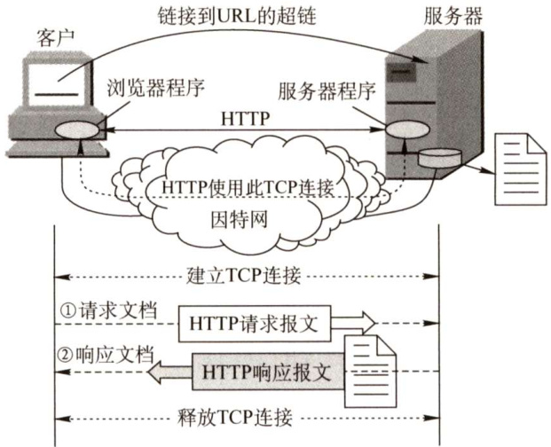
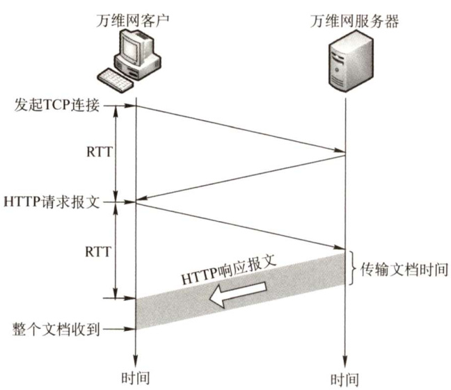
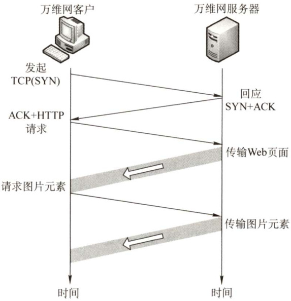
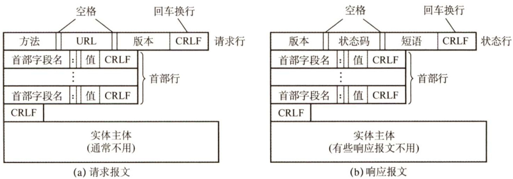
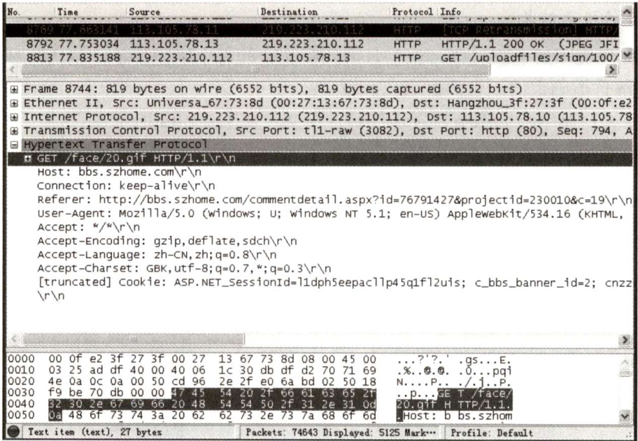
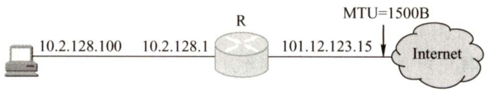
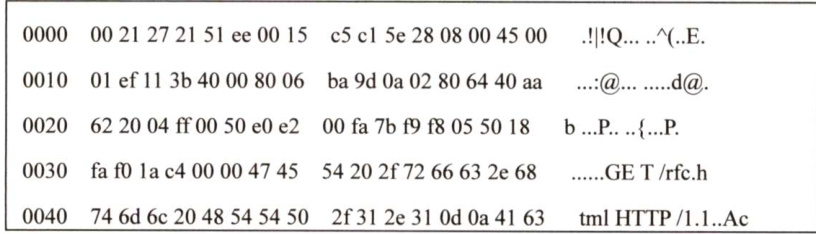
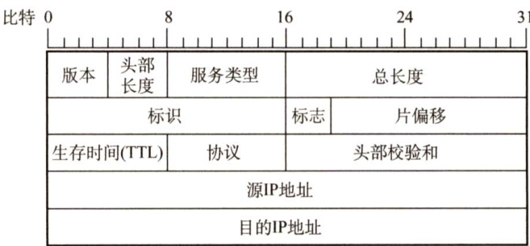
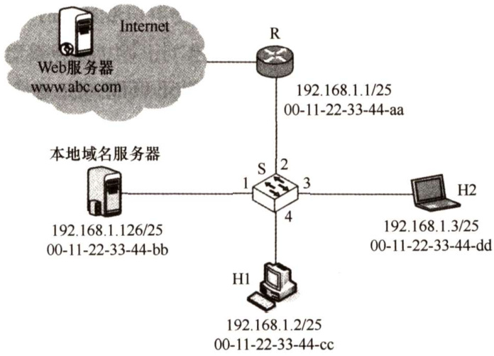

#### 6.5 万维网（WWW）  

#### 6.5.1 WWW的概念与组成结构  

万维网（WorldWideWeb，WWW）是一个分布式、联机式的信息存储空间，在这个空间中：一样有用的事物称为一样“资源”，并由一个全域“统一资源定位符”（URL）标识。这些资源通过超文本传输协议（HTTP）传送给使用者，而后者通过单击链接来获取资源。  

万维网使用链接的方法能非常方便地从因特网上的一个站点访问另一个站点（即“链接到另一个站点")，从而主动地按需获取丰富的信息。超文本标记语言（HyperTextMarkup Language，HTML）使得万维网页面的设计者可以很方便地用一个超链接从本页面的某处链接到因特网上的任何一个万维网页面，并能够在自己的计算机屏幕上显示这些页面。  

万维网的内核部分是由三个标准构成的：  

1）统一资源定位符（URL)。负责标识万维网上的各种文档，并使每个文档在整个万维网的范围内具有唯一的标识符URL。  
2）超文本传输协议（HTTP)。一个应用层协议，它使用TCP 连接进行可靠的传输，HTTP是万维网客户程序和服务器程序之间交互所必须严格遵守的协议。  
3）超文本标记语言（HTML)。一种文档结构的标记语言，它使用一些约定的标记对页面上的各种信息（包括文字、声音、图像、视频等)、格式进行描述。  

URL 是对可以从因特网上得到的资源的位置和访问方法的一种简洁表示。URL相当于一个文件名在网络范围的扩展。URL的一般形式是：  

<协议 $>:11<$ 主机 $>$ <端口 $>1<$ 路径>。  

<协议 $>$ 指用什么协议来获取万维网文档，常见的协议有http、ftp等；<主机 $>$ 是存放资源的主机在因特网中的域名或IP地址；<端口 $>$ 和 $<$ 路径 $>$ 有时可省略。在URL中不区分大小写。  

万维网以客户/服务器方式工作。浏览器是在用户主机上的万维网客户程序，而万维网文档所驻留的主机则运行服务器程序，这台主机称为万维网服务器。客户程序向服务器程序发出请求，服务器程序向客户程序送回客户所要的万维网文档。工作流程如下：  

1）Web用户使用浏览器（指定URL）与Web服务器建立连接，并发送浏览请求。  
2）Web服务器把URL转换为文件路径，并返回信息给Web浏览器。  

3）通信完成，关闭连接。  

万维网是无数个网络站点和网页的集合，它们在一起构成了因特网最主要的部分（因特网也包括电子邮件、Usenet和新闻组）。  

#### 6.5.2 超文本传输协议（HTTP）  

HTTP定义了浏览器（万维网客户进程）怎样向万维网服务器请求万维网文档，以及服务器怎样把文档传送给浏览器。从层次的角度看，HTTP是面向事务的（Transaction-oriented）应用层协议，它规定了在浏览器和服务器之间的请求和响应的格式与规则，是万维网上能够可靠地交换文件（包括文本、声音、图像等各种多媒体文件）的重要基础。  

#### 1.HTTP的操作过程  

从协议执行过程来说，浏览器要访问WWW服务器时，首先要完成对WWW服务器的域名解析。一旦获得了服务器的IP地址，浏览器就通过TCP向服务器发送连接建立请求。  

万维网的大致工作过程如图6.11所示。每个万维网站点都有一个服务器进程，它不断地监听TCP 的端口80（默认)，当监听到连接请求后便与浏览器建立TCP连接。然后，浏览器就向服务器发送请求获取某个Web页面的HTTP请求。服务器收到请求后，将构建所请求Web页的必需信息，并通过HTTP响应返回给浏览器。浏览器再将信息进行解释，然后将Web页显示给用户。最后，TCP连接释放。  

  
图6.11万维网的工作过程  

在浏览器和服务器之间的请求与响应的交互，必须遵循规定的格式和规则，这些格式和规则就是HTTP。因此HTTP有两类报文：请求报文（从Web客户端向Web服务器发送服务请求）和响应报文（从Web服务器对Web客户端请求的回答）。  

用户单击鼠标后所发生的事件按顺序如下（以访问清华大学的网站为例)：  

1）浏览器分析链接指向页面的URL（http://www.tsinghua.edu.cn/chn/index.htm）。  
2）浏览器向DNS请求解析www.tsinghua.edu.cn的IP地址。  
3）域名系统DNS解析出清华大学服务器的IP地址。  
4）浏览器与该服务器建立TCP连接（默认端口号为80）。  
5）浏览器发出HTTP请求：GET/chn/index.htm。  
6）服务器通过HTTP响应把文件index.htm发送给浏览器。  
7）释放TCP连接。  
8）浏览器解释文件index.htm，并将Web页显示给用户。  

#### 2.HTTP的特点  

HTTP使用TCP作为运输层协议，保证了数据的可靠传输。HTTP不必考虑数据在传输过程中被丢弃后又怎样被重传。但是，HTTP本身是无连接的（务必注意)。也就是说，虽然HTTP使用了TCP连接，但通信的双方在交换HTTP报文之前不需要先建立HTTP连接。  

HTTP 是无状态的。也就是说，同一个客户第二次访问同一个服务器上的页面时，服务器的响应与第一次被访问时的相同。因为服务器并不记得曾经访问过的这个客户，也不记得为该客户曾经服务过多少次。  

HTTP 的无状态特性简化了服务器的设计，使服务器更容易支持大量并发的HTTP请求。在实际应用中，通常使用Cookie加数据库的方式来跟踪用户的活动（如记录用户最近浏览的商品等)。Cookie的工作原理：当用户浏览某个使用Cookie的网站时，该网站服务器就为用户产生一个唯一的识别码，如“123456"，接着在给用户的响应报文中添加一个Set-c00kie的首部行“Setcookie:123456"。用户收到响应后，就在它管理的特定Cookie文件中添加这个服务器的主机名和Cookie识别码，当用户继续浏览这个网站时，会取出这个网站的识别码，并放入请求报文的Cookie首部行“Cookie:123456”。服务器根据请求报文中的Cookie识别码就能从数据库中查询到该用户的活动记录，进而执行一些个性化的工作，如根据用户的历史浏览记录向其推荐新产品等。  

HTTP既可以使用非持久连接，也可以使用持久连接（HTTP/1.1支持）。  

对于非持久连接，每个网页元素对象（如JPEG图形、Flash等）的传输都需要单独建立一个TCP连接，如图6.12所示（第三次握手的报文段中捐带了客户对万维网文档的请求)。请求一个万维网文档所需的时间是该文档的传输时间（与文档大小成正比）加上两倍往返时间RTT（一个RTT用于TCP连接，另一个RTT用于请求和接收文档)。每个对象引用都导致 $2{\times}\mathrm{RTT}$ 的开销，此外每次建立新的TCP连接都要分配缓存和变量，使万维网服务器的负担很重。  

所谓持久连接，是指万维网服务器在发送响应后仍然保持这条连接，使同一个客户（汶和该服务器可以继续在这条连接上传送后续的HTTP请求和响应报文，如图6.13所示。  

  
图6.12请求一个万维网文档所需的时间  

  
图6.13使用持久连接(非流水线）  

持久连接又分为非流水线和流水线两种方式。对于非流水线方式，客户在收到前一个响应后才能发出下一个请求，服务器发送完一个对象后，其TCP 连接就处于空闲状态，浪费了服务器资源。HTTP/1.1的默认方式是使用流水线的持久连接，这种情况下，客户每遇到一个对象引用就立即发出一个请求，因而客户可以逐个地连续发出对各个引用对象的请求。如果所有的请求和响应都是连续发送的，那么所有引用的对象共计经历1个RTT 延迟，而不是像非流水线方式那样，每个引用都必须有1个RTT延迟。这种方式减少了TCP连接中的空闲时间，提高了效率。  

#### 3.HTTP的报文结构  

HTTP是面向文本的（Text-Oriented)，因此报文中的每个字段都是一些ASCII码串，并且每个字段的长度都是不确定的。有两类HTTP报文：  

请求报文：从客户向服务器发送的请求报文，如图6.14(a)所示。  
响应报文：从服务器到客户的回答，如图6.14(b)所示。  

  
图6.14HTTP的报文结构  

HTTP请求报文和响应报文都由三个部分组成。从图6.14可以看出，这两种报文格式的区别就是开始行不同。  

开始行：用于区分是请求报文还是响应报文。在请求报文中的开始行称为请求行，而在响应报文中的开始行称为状态行。开始行的三个字段之间都以空格分隔，最后的“CR”和“LF”分别代表“回车”和“换行”。请求报文的“请求行”有三个内容：方法、请求资源的URL及HTTP的版本。其中，“方法”是对所请求对象进行的操作，这些方法实际上也就是一些命令。表6.1给出了HTTP请求报文中常用的几个方法。  

首部行：用来说明浏览器、服务器或报文主体的一些信息。首部可以有几行，但也可以不使用。  

表6.1HTTP请求报文中常用的几个方法  

<html><body><table><tr><td>方法 (操作）</td><td>意义</td></tr><tr><td>GET</td><td>请求读取由URL标识的信息</td></tr><tr><td>HEAD</td><td>请求读取由URL标识的信息的首部</td></tr><tr><td>POST</td><td>给服务器添加信息（如注释）</td></tr><tr><td>CONNECT</td><td>用于代理服务器</td></tr></table></body></html>  

在每个首部行中都有首部字段名和它的值，每一行在结束的地方都要有“回车”和“换行”。整个首部行结束时，还有一空行将首部行和后面的实体主体分开。  

实体主体：在请求报文中一般不用这个字段，而在响应报文中也可能没有这个字段。  

图6.15所示为使用Wireshark捕获的HTTP请求报文的示例，下面结合前几章的内容对请求报文（图中下部分）进行分析。  

根据帧的结构定义，在图6.15所示的以太网数据帧中，第 $1{\sim}6$ 个字节为目的MAC地址（默认网关地址)，即00-0f-e2-3f-27-3f；第 $_{7\sim12}$ 个字节为本机MAC地址，即00-27-13-67-73-8d;第 $13\sim14$ 个字节 $08\mathrm{\sim}00$ 为类型字段，表示上层使用的是IP数据报协议。第 $15\sim34$ 个字节（共20B）为IP数据报的首部，其中第 $27\sim30$ 个字节为源IP地址，即db-df-d2-70，转换成十进制为219.223.210.112；第 $31\sim34$ 个字节为目的IP地址，即71-69-4e-0a，转换成十进制为113.105.78.10。第 $35\sim54$ 个字节（共20B）为TCP报文段的首部。  

从第55个字节开始才是TCP数据部分（阴影部分)，即从应用层传递下来的数据（本例中即请求报文)，GET对应请求行的方法，/face/20.gif对应请求行的URL，HTTP/1.1对应请求行的版本，左边数字是对应字符的ASCⅡI码，如 $'\mathrm{{G}^{\prime}=0x47}$ 、 $\mathrm{{'E^{\prime}}}=0{\bf{x}}45$ 、 $\mathrm{{^{\prime}T^{\prime}}}=0\mathrm{{x}}54$ 等。图6.15的请求报文中首部行字段内容的含义，建议读者自行了解，也可以自己动手抓包分析。  

  
图6.15使用Wireshark捕获的HTTP请求报文的示例  

右下角开始的“··?"?.gs.…·E..%..@ $@$ ..0…pgi”等是上面介绍过的第 $1{\sim}54$ 个字节中对应的ASCⅡI码字符，而这些字符在这里不代表任何意义。  

常见应用层协议小结如表6.2所示。  

表6.2常见应用层协议小结  

<html><body><table><tr><td>应用程序</td><td>FTP数据连接</td><td>FTP控制连接</td><td>TELNET</td><td>SMTP</td><td>DNS</td><td>TFTP</td><td>HTTP</td><td>POP3</td><td>SNMP</td></tr><tr><td>使用协议</td><td>TCP</td><td>TCP</td><td>TCP</td><td>TCP</td><td>UDP</td><td>UDP</td><td>TCP</td><td>TCP</td><td>UDP</td></tr><tr><td>熟知端口号</td><td>20</td><td>21</td><td>23</td><td>25</td><td>53</td><td>69</td><td>80</td><td>110</td><td>161</td></tr></table></body></html>  

#### 6.5.3 本节习题精选  

#### 一、单项选择题  

01．下面的（）协议中，客户机与服务器之间采用面向无连接的协议进行通信。  

A.FTP B. SMTP C.DNS D.HTTP  

02．从协议分析的角度，WWW服务的第一步操作是浏览器对服务器的（）。  

A．请求地址解析 B.传输连接建立C．请求域名解析 D.会话连接建立  

03．TCP和UDP的一些端口保留给一些特定的应用使用。为HTTP保留的端口号为（）  

A.TCP的80端口 B.UDP的80端口C.TCP的25端口 D.UDP的25端口  

04．从某个已知的URL获得一个万维网文档时，若该万维网服务器的IP地址开始时并不知道，则需要用到的应用层协议有（）。  

A.FTP和HTTP B.DNS和FTP C.DNS和HTTP D.TELNET和HTTP  

05．万维网上的每个页面都有一个唯一的地址，这些地址统称为（）。  

A.IP地址 B．域名地址  

C.统一资源定位符 D.WWW地址  

06．使用鼠标单击一个万维网文档时，若该文档除有文本外，还有三幅gif图像，则在HTTP/1.0中需要建立（）次UDP连接和（）次TCP连接。  

A.0,4 B.1，3 C.0,2 D.1，2  

07.仅需Web服务器对HTTP报文进行响应，但不需要返回请求对象时，HTTP请求报文应该使用的方法是（）。  

A.GET B. PUT C. POST D.HEAD  

08.HTTP是一个无状态协议，然而Web站点经常希望能够识别用户，这时需要用到（）  

A.Web缓存 B. Cookie C．条件GET D.持久连接  

09．下列关于Cookie的说法中，错误的是（）。  

A.Cookie存储在服务器端 B.Cookie是服务器产生的C.Cookie会威胁客户的隐私 D.Cookie的作用是跟踪用户的访问和状态  

10．以下关于非持续连接HTTP特点的描述中，错误的是（）。  

A.HTTP支持非持续连接与持续连接  
B.HTTP/1.0使用非持续连接，而HTTP/1.1的默认方式为持续连接  
C.非持续连接中对每次请求/响应都要建立一次TCP连接  
D.非持续连接中读取一个包含100个图片对象的Web页面，需要打开和关闭100次TCP连接  

11.【2014统考真题】使用浏览器访问某大学的Web网站主页时，不可能使用到的协议是（）。  

A.PPP B.ARP C. UDP D. SMTP  

2.【2015统考真题】某浏览器发出的HTTP请求报文如下：  

GET/index.htmlHTTP/1.1 Host:www.test.edu.cn Connection: Close Cookie:123456  

下列叙述中，错误的是（）。  

A.该浏览器请求浏览index.htmlB.index.html存放在www.test.edu.cn上C.该浏览器请求使用持续连接D.该浏览器曾经浏览过www.test.edu.cn  

#### 二、综合应用题  

01.在浏览器中输入http://cskaoyan.com并按回车，直到王道论坛的首页显示在其浏览器中，请问在此过程中，按照TCP/IP参考模型，从应用层到网络层都用到了哪些协议？  

02.在如下条件下，计算使用非持续方式和持续方式请求一个Web页面所需的时间：1）测试的RTT的平均值为 $150\mathrm{{ms}}$ ，一个gif对象的平均发送时延为 $35\mathrm{ms}$ 。2）一个Web页面中有10幅gif图片，Web页面的基本HTML文件、HTTP请求报文、TCP握手报文大小忽略不计。3）TCP三次握手的第三步中消带一个HTTP请求。4）使用非流水线方式。  

03．用户主机上的电子邮件用户代理与邮件服务器建立了连接，现截获一个TCP报文段，如下图所示。图中显示了该报文段的前126个字节的十六进制及ASCⅡ码内容。TCP首部长度为20B。请回答：  

0020 1 19 11111 18 0. .P  
0030 f9 98 44 43 4d 44 Q ..Me ssage-ID  
0040 3a 20 45 30 ：<4DCE9 2BA.2010  
0050 39 30 36 33 2e 61 902@163. com>..Da  
0060 74 65 61 74 2C 20 te:Sat, 14May  
0070 32 30 32 32 3a 3 33 3a 3 30 20 2b 30 201122:33:30+0  
0080 38 30 30 od 46 72 6f 6d 3a 20 63 73 6b 61 6f 800..Fro m: cskao  
0090 79 61 6e 32 30 31 32 40 31 36 33 2e 63 6f 6d od yan2012@163.com.  
1）用户代理和服务器之间使用的应用层协议是什么？  
2）用户代理使用的端口号是多少？  
3）该邮件的发件人邮箱是什么？  

04.【2011统考真题】某主机的MAC地址为00-15-C5-C1-5E-28，IP地址为10.2.128.100（私有地址）。图1是网络拓扑，图2是该主机进行Web请求的一个以太网数据帧前80B的十六进制及ASCII码内容。  

  
图1 网络拓扑  

  
图2 以太网数据帧（前80B）  
图3以太网帧结构  

请参考图中的数据回答以下问题。  

1）Web服务器的IP地址是什么？该主机的默认网关的MAC地址是什么？  
2）该主机在构造图2的数据帧时，使用什么协议确定目的MAC地址？封装该协议请求报文的以太网帧的目的MAC地址是什么？  
3）假设HTTP/1.1协议以持续的非流水线方式工作，一次请求-响应时间为RTT，rfc.html页面引用了5幅JPEG小图像。问从发出图2中的Web请求开始到浏览器收到全部内容为止，需要多少个RTT?  
4）该帧封装的IP分组经过路由器R转发时，需修改IP分组头中的哪些字段？  
注：以太网数据帧结构和IP分组头结构分别如图3和图4所示。  

<html><body><table><tr><td>6B</td><td>6B</td><td>2B</td><td>46~1500B</td><td>4B</td></tr><tr><td>目的MAC地址</td><td>源MAC地址</td><td>类型</td><td>数据</td><td>CRC</td></tr></table></body></html>  

  
图4IP分组头结构  

05.【2021统考真题】某网络拓扑如题47图所示，以太网交换机S通过路由器R与Intermet互联。路由器部分接口、本地域名服务器、H1、H2的IP地址和MAC地址如图中所示。在 $t_{0}$ 时刻H1的 ARP表和S 的交换表均为空，H1在此刻利用浏览器通过域名www.abc.com请求访问Web服务器，在 $t_{1}$ 时刻（ $(t_{1}>t_{0}$ ）S第一次收到了封装HTTP请求报文的以太网帧，假设从 $t_{0}$ 到 $t_{1}$ 期间网络未发生任何与此次Web访问无关的网络通信。请回答下列问题。  

1）从 $t_{0}$ 到 $t_{1}$ 期间，H1除了HTTP，还运行了哪个应用层协议？从应用层到数据链路层，该应用层协议报文是通过哪些协议进行逐层封装的？  

2）若S的交换表结构为<MAC地址，端口>，则 $t_{1}$ 时刻S交换表的内容是什么？  

3)从 $t_{0}$ 到 $t_{1}$ 期间，H2至少接收到几个与此次Web访问相关的帧？接收的是什么帧？帧的目的MAC地址是什么？  

  
题47图  

#### 6.5.4 答案与解析  

#### 一、单项选择题  

01.C  

DNS采用UDP来传送数据，UDP是一种面向无连接的协议。  

02.C  

建立浏览器与服务器之间的连接需要知道服务器的IP地址和端口号（80端口是熟知端口)，而访问站点时浏览器从用户那里得到的是WWW站点的域名，所以浏览器必须首先向DNS请求  

域名解析，获得服务器的IP地址后，才能请求建立TCP连接。  

03.A  

HTTP在传输层使用TCP，端口号为80。TCP的25号端口是为SMTP保留的。  

04.C  

由于不知道服务器的IP地址，因此先要用DNS进行域名解析，然后使用HTTP进行用户和服务器之间的交互。  

05.C  

统一资源定位符负责标识万维网上的各种文档，并使每个文档在整个万维网的范围内具有唯一的标识符URL。  

06.A  

HTTP 在传输层用的是TCP，所以无须建立UDP连接；HTTP1.O只支持非持久连接，所以每请求一个对象需要建立一次TCP连接，在本题的情景中，共需要传输1个基本HTML对象和3个gif对象，所以共需建立4次TCP连接。  

07.D  

使用HEAD方法时服务器可对HTTP报文进行响应，但不会返回请求对象，其作用主要是调试。另外三个选项中的方法的作用请查看本章中的表6.1。  

08.B  

可以在HTTP中使用Cookie保存HTTP服务器和客户之间传递的状态信息。  

09.A  

Cookie 是一个存储在用户主机中的文本文件。它由服务器产生，作为识别用户的手段。由于服务器的后端数据库记录了用户在Web站点上的活动，这些信息（如用户的个人信息及购物的偏好等）有可能被出卖给第三方，从而威胁到了用户的隐私。  

10.D  

非持续连接对每次请求/响应都建立一次TCP连接。在浏览器请求一个包含100个图片对象的 Web 页面时，服务器需要传输1个基本HTML文件和100个图片对象，因此一共是101个对象，需要打开和关闭TCP连接101次。  

11.D  

解析请扫右侧二维码查阅。  

12.C  

Connection:连接方式，Close 表明为非持续连接方式，keep-alive 表示持续连接方式。Cookie 值由服务器产生，HTTP请求报文中有Cookie 报头表示曾经访问过www.test.edu.cn服务器。  

#### 二、综合应用题  

01.【解答】  

1）应用层。HTTP：WWW访问协议；DNS：域名解析服务。  

2）传输层。TCP：HTTP提供可靠的数据传输；UDP：DNS使用UDP传输。  

3）网络层。IP：IP包传输和路由选择；ICMP：提供网络传输中的差错检测；ARP：将本机的默认网关IP地址映射成物理MAC地址。  

02.【解答】  

每次进行TCP三次握手时，前两次握手消耗一个 $\mathrm{RTT}=150\mathrm{ms}$ ，第3次握手的报文段销带客户对HTML文件的请求，因此请求和接收基本HTML文件耗时一个 $\mathrm{RTT}=150\mathrm{ms}$ （其大小忽略不计时，发送时延为 $0\mathrm{ms}$ )。  

在非持久连接方式下：  

第一次建立TCP连接并传送html文件所需的时间为 $t_{\mathrm{html}}=(150+150)\mathrm{ms}=300\mathrm{ms}$ .  
每次建立TCP连接并传送一个gif文件所需的时间为 $t_{\mathrm{{gif}}}=(150+150+35)\mathrm{{ms}=335\mathrm{{ms}}}$ .  
所以总时间 $t_{\mathrm{\tiny~\textB}}=t_{\mathrm{html}}+t_{\mathrm{gif}}\times10=(300+335\times10)\mathrm{ms}=3650\mathrm{ms}$ 。  

在持久连接方式下：  

只需要建立一次TCP连接，然后传送html文件和10个gif文件。总时间 $t_{\mathrm{\tiny~B}}=t_{\mathrm{\tiny~id\cdotTCP}}+t_{\mathrm{html}}+t_{\mathrm{\tiny~gif}}\times10=150+150+(150+35)\times10=2150\mathrm{ms}.$  

03.【解答】  

1）本题中并未明确告诉这个报文段是从用户代理发往服务器还是从服务器发往用户代理。分析TCP首部格式可知，源端口为49382（0xc0e6)，目的端口为25（0x0019），因此该应用层协议为SMTP。  
2）由于使用的是SMTP，且服务器端口25作为目的端口，因此源端口49382为用户代理所使用的端口。  
3）由于SMTP的协议字段都是用ASCII码表示的，发件人的关键字是FROM，从截图右侧的ASCII形式中直接找到答案FROM:cskaoyan2012@163.com。  

04.【解答】  

1）以太网帧的数据部分是IP数据报，只要数出相应字段所在的字节即可。由图4可知以太网帧头部有 $6+6+2=14\mathrm{B}$ ，由图3可知IP数据报首部的目的IP地址字段前有 $4\times4=16\mathrm{B}$ ，从图2的帧第1字节开始数 $14+16=30\mathrm{B}$ ，得到目的IP地址为40.aa.62.20（十六进制)，转换成十进制为 $64.170.98.32\$ 。由图2可知以太网帧的前6字节00-21-27-21-51-ee是目的MAC地址，即为主机的默认网关10.2.128.1端口的MAC地址。  

2）ARP用于解决IP地址到MAC地址的映射问题。主机的ARP进程在本以太网以广播形式发送ARP请求分组，在以太网上广播时，以太网帧的目的地址为全1，即FF-FF-FF-FF-FF-FF。  

3）HTTP/1.1协议以持续的非流水线方式工作时，服务器发送响应后仍在一段时间内保持这段连接，客户机在收到前一个请求的响应后才能发出下一个请求。第一个RTT用于请求Web页面，客户机收到第一个请求的响应后（还有五个请求未发送)，每访问一次对象就用去一个RTT。因此共需 $1+5=6$ 个RTT后浏览器收到全部内容。  

4）私有地址和Intermet上的主机通信时，须由NAT路由器进行网络地址转换，把IP数据报的源IP地址（本题为私有地址10.2.128.100）转换为NAT路由器的一个全球IP地址（本题为101.12.123.15)。因此，源IP地址字段 $0\mathrm{a}\ 02\ 80\ 64$ 变为 $65~0\mathrm{c}~7\mathrm{b}~0\mathrm{f}~\$ 。IP数据报每经过一个路由器，TTL值就减1，并重新计算首部校验和。若IP分组的长度超过输出链路的MTU，则总长度字段、标志字段、片偏移字段也会发生变化。  

05.【解答】  

1）从 $t_{0}$ 到 $t_{1}$ 期间，除了HTTP，H1还运行了DNS应用层协议，以将域名转换为IP 地址。DNS运行在UDP之上，UDP将应用层交付的DNS报文添加首部后，向下交付给IP层，IP层使用IP数据报进行封装，封装好后，向下交付给数据链路层，数据链路层使用CSMA/CD帧进行封装。因此，逐层封装关系如下：DNS报文 $\rightarrow$ UDP数据报 ${\bf\Lambda}\to{\bf I P}$ 数据报 $\rightrightarrows$ CSMA/CD帧。  

2) $t_{0}$ 时刻，H1 的ARP表和S 的交换表为空。H1利用浏览器通过域名请求访问Web 服务器。由于要先解析域名，会发送DNS报文到本地域名服务器，查询该域名对应的IP地址，所以要先向本地域名服务器发送请求。ARP表为空，所以需要先发送ARP请求分组，查询本地域名服务器对应的MAC 地址。这些帧的目的MAC 地址均是FF-FF-FF-FF-FF-FF。S 接收到这个帧，在交换表中记录MAC地址为00-11-22-33-44-cc，位于端口4，然后广播该帧。当本地域名服务器接收到ARP请求后，向H1发送响应ARP分组。S接收到这个帧，在交换表中记录MAC地址为00-11-22-33-44-bb，位于端口1，然后将该帧从端口4发送出去。  

得到了域名对应的IP地址，发现不在本局域网中，需要通过路由表转发。  

H1 的ARP表中并没有路由器对应的MAC 地址，因此需要先发送ARP请求分组，查询路由器对应的MAC 地址。这些帧的目的MAC 地址均是FF-FF-FF-FF-FF-FF。S接收到这个帧，广播该帧。当路由器收到ARP请求后，向H1发送响应ARP分组。S接收到这个帧，在交换表中记录MAC 地址为00-11-22-33-44-aa，位于端口2，然后将该帧从端口4发送出去。现在，H1 就能将数据发送给路由器了。在整个过程中，并没有涉及H2，H2没有主动发送数据。所以S不会记录H2的MAC地址和端口，所以S在 $t_{1}$ 时刻的交换表如下表所示。  

<html><body><table><tr><td>MAC地址</td><td>端口</td></tr><tr><td>00-11-22-33-44-cc</td><td>4</td></tr><tr><td>00-11-22-33-44-bb</td><td>1</td></tr><tr><td>00-11-22-33-44-aa</td><td>2</td></tr></table></body></html>  

3）由步骤2）的分析可知，H2至少会接收到2个和此次Web访问相关的帧。接收到的均是封装ARP查询报文的以太网帧；这些帧的目的MAC 地址均是FF-FF-FF-FF-FF-FF。