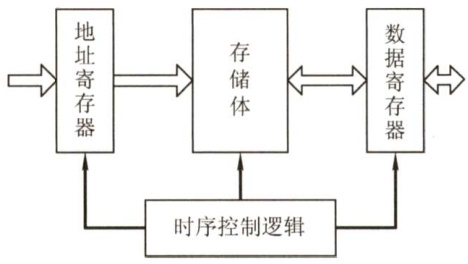
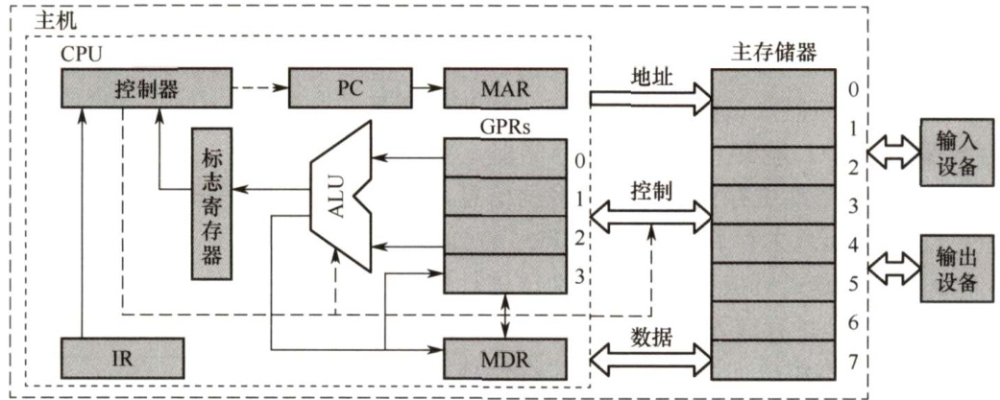
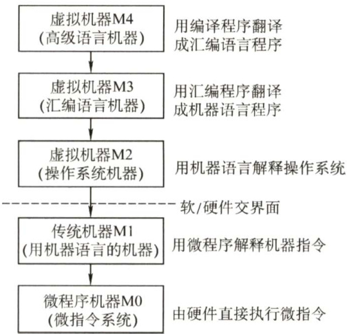
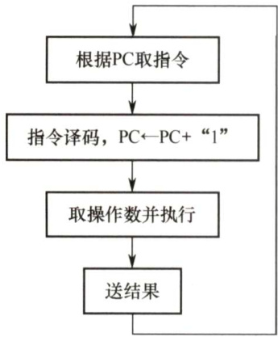
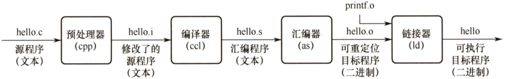
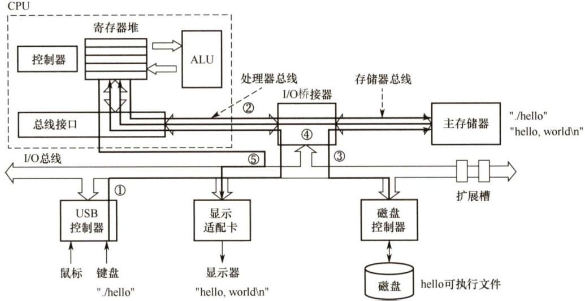

#### 1.2 计算机系统层次结构  

#### 1.2.1 计算机系统的组成  

硬件系统和软件系统共同构成了一个完整的计算机系统。硬件是指有形的物理设备，是计算机系统中实际物理装置的总称。软件是指在硬件上运行的程序和相关的数据及文档。  

计算机系统性能的好坏，很大程度上是由软件的效率和作用来表征的，而软件性能的发挥又离不开硬件的支持。对某一功能来说，其既可以用软件实现，又可以用硬件实现，则称为软硬件在逻辑上是等效的。在设计计算机系统时，要进行软/硬件的功能分配。通常来说，一个功能若使用较为频繁且用硬件实现的成本较为理想，使用硬件解决可以提高效率。  

#### 1.2.2 计算机硬件  

#### 1.冯·诺依曼机基本思想  

冯·诺依曼在研究EDVAC机时提出了“存储程序”的概念，“存储程序”的思想奠定了现代计算机的基本结构，以此概念为基础的各类计算机通称为冯·诺依曼机，其特点如下：  

1）采用“存储程序”的工作方式。  
2）计算机硬件系统由运算器、存储器、控制器、输入设备和输出设备5大部件组成。  
3）指令和数据以同等地位存储在存储器中，形式上没有区别，但计算机应能区分它们。  
4）指令和数据均用二进制代码表示。指令由操作码和地址码组成，操作码指出操作的类  
型，地址码指出操作数的地址。  

“存储程序”的基本思想是：将事先编制好的程序和原始数据送入主存后才能执行，一旦程序被启动执行，就无须操作人员的干预，计算机会自动逐条执行指令，直至程序执行结束。  

#### 2.计算机的功能部件  

#### （1）输入设备  

输入设备的主要功能是将程序和数据以机器所能识别和接受的信息形式输入计算机。最常用也最基本的输入设备是键盘，此外还有鼠标、扫描仪、摄像机等。  

#### （2）输出设备  

输出设备的任务是将计算机处理的结果以人们所能接受的形式或其他系统所要求的信息形式输出。最常用、最基本的输出设备是显示器、打印机。输入/输出设备（简称I/O设备）是计算机与外界联系的桥梁，是计算机中不可缺少的重要组成部分。  

#### （3）存储器  

存储器分为主存储器（又称内存储器）和辅助存储器（又称外存储器）。CPU能够直接访问的存储器是主存储器。辅助存储器用于帮助主存储器记忆更多的信息，辅助存储器中的信息必须调入主存后，才能为CPU所访问。  

主存储器的工作方式是按存储单元的地址进行存取，这种存取方式称为按地址存取方式。  

主存储器的最基本组成如图1.1所示。存储体存放二进制信息，地址寄存器（MAR）存放访存地址，经过地址  

  
图1.1主存储器逻辑图  

译码后找到所选的存储单元。数据寄存器（MDR）用于暂存要从存储器中读或写的信息，时序控制逻辑用于产生存储器操作所需的各种时序信号。  

存储体由许多存储单元组成，每个存储单元包含若干存储元件，每个存储元件存储一位二进制代码“0”或“1”。因此存储单元可存储一串二进制代码，称这串代码为存储字，称这串代码的位数为存储字长，存储字长可以是1B（8bit）或是字节的偶数倍。  

MAR用于寻址，其位数对应着存储单元的个数，如MAR为10位，则有 $2^{10}=1024$ 个存储单元，记为1K。MAR的长度与PC的长度相等。  

MDR的位数和存储字长相等，一般为字节的二次幂的整数倍。  

注意：MAR与MDR虽然是存储器的一部分，但在现代计算机中却是存在于CPU中的；另外，后文提到的高速缓存（Cache）也存在于CPU中。  

#### （4）运算器  

运算器是计算机的执行部件，用于进行算术运算和逻辑运算。算术运算是按算术运算规则进行的运算，如加、减、乘、除；逻辑运算包括与、或、非、异或、比较、移位等运算。  

运算器的核心是算术逻辑单元（Arithmetic and LogicalUnit，ALU)。运算器包含若干通用寄存器，用于暂存操作数和中间结果，如累加器（ACC）、乘商寄存器（MQ）、操作数寄存器（X)、变址寄存器（IX)、基址寄存器（BR）等，其中前3个寄存器是必须具备的。  

运算器内还有程序状态寄存器（PSW)，也称标志寄存器，用于存放ALU运算得到的一些标志信息或处理机的状态信息，如结果是否溢出、有无产生进位或借位、结果是否为负等。  

#### （5）控制器  

控制器是计算机的指挥中心，由其“指挥”各部件自动协调地进行工作。控制器由程序计数器（PC）、指令寄存器（IR）和控制单元（CU）组成。  

PC 用来存放当前欲执行指令的地址，可以自动加1以形成下一条指令的地址，它与主存的MAR之间有一条直接通路。  

IR 用来存放当前的指令，其内容来自主存的MDR。指令中的操作码OP(IR)送至CU，用以分析指令并发出各种微操作命令序列；而地址码Ad(IR)送往MAR，用以取操作数。  

一般将运算器和控制器集成到同一个芯片上，称为中央处理器（CPU)。CPU 和主存储器共同构成主机，而除主机外的其他硬件装置（外存、I/O设备等）统称为外部设备，简称外设。  

图1.2所示为冯·诺依曼结构的模型机。CPU包含ALU、通用寄存器组GPRs、标志寄存器、控制器、指令寄存器 IR、程序计数器 PC、存储器地址寄存器MAR 和存储器数据寄存器MDR。图中从控制器送出的虚线就是控制信号，可以控制如何修改 PC 以得到下一条指令的地址，可以控制ALU执行什么运算，可以控制主存是进行读操作还是写操作（读/写控制信号)。  

  
图1.2冯·诺依曼结构的模型机  

CPU和主存之间通过一组总线相连，总线中有地址、控制和数据3组信号线。MAR中的地址信息会直接送到地址线上，用于指向读/写操作的主存存储单元；控制线中有读/写信号线，指出数据是从CPU写入主存还是从主存读出到CPU，根据是读操作还是写操作来控制将MDR中的数据是直接送到数据线上还是将数据线上的数据接收到MDR中。  

#### 1.2.3 计算机软件  

#### 1．系统软件和应用软件  

软件按其功能分类，可分为系统软件和应用软件。  

系统软件是一组保证计算机系统高效、正确运行的基础软件，通常作为系统资源提供给用户使用。系统软件主要有操作系统（OS）、数据库管理系统（DBMS）、语言处理程序、分布式软件系统、网络软件系统、标准库程序、服务性程序等。  

应用软件是指用户为解决某个应用领域中的各类问题而编制的程序，如各种科学计算类程序、工程设计类程序、数据统计与处理程序等。  

#### 2.三个级别的语言  

1）机器语言。又称二进制代码语言，需要编程人员记忆每条指令的二进制编码。机器语言是计算机唯一可以直接识别和执行的语言。2）汇编语言。汇编语言用英文单词或其缩写代替二进制的指令代码，更容易为人们记忆和理解。使用汇编语言编辑的程序，必须经过一个称为汇编程序的系统软件的翻译，将其转换为机器语言程序后，才能在计算机的硬件系统上执行。3）高级语言。高级语言（如C、 $\scriptstyle\mathbf{C}++$ 、Java等）是为方便程序设计人员写出解决问题的处理方案和解题过程的程序。通常高级语言需要经过编译程序编译成汇编语言程序，然后经过汇编操作得到机器语言程序，或直接由高级语言程序翻译成机器语言程序。由于计算机无法直接理解和执行高级语言程序，需要将高级语言程序转换为机器语言程序，通常把进行这种转换的软件系统称为翻译程序。翻译程序有以下三类：1）汇编程序（汇编器)。将汇编语言程序翻译成机器语言程序。  

2）解释程序（解释器)。将源程序中的语句按执行顺序逐条翻译成机器指令并立即执行。  
3）编译程序（编译器)。将高级语言程序翻译成汇编语言或机器语言程序。  

#### 3.软件和硬件的逻辑功能等价性  

硬件实现的往往是最基本的算术和逻辑运算功能，而其他功能大多通过软件的扩充得以实现。对某一功能来说，既可以由硬件实现，又可以由软件实现，从用户的角度来看，它们在功能上是等价的。这一等价性被称为软、硬件逻辑功能的等价性。例如，浮点数运算既可以用专门的浮点运算器硬件实现，又可以通过一段子程序实现，这两种方法在功能上完全等效，不同的只是执行时间的长短而已，显然硬件实现的性能要优于软件实现的性能。  

软件和硬件逻辑功能的等价性是计算机系统设计的重要依据，软件和硬件的功能分配及其界面的确定是计算机系统结构研究的重要内容。当研制一台计算机时，设计者必须明确分配每一级的任务，确定哪些功能使用硬件实现，哪些功能使用软件实现。软件和硬件功能界面的划分是由设计目标、性能价格比、技术水平等综合因素决定的。  

#### 1.2.4 计算机系统的层次结构  

计算机是一个硬软件组成的综合体。由于面对的应用范围越来越广，必须有复杂的系统软件和硬件的支持。由于软/硬件的设计者和使用者从不同的角度、用不同的语言来对待同一个计算机系统，因此他们看到的计算机系统的属性对计算机系统提出的要求也就各不相同。  

计算机系统的多级层次结构的作用，就是针对上述情况，根据从各种角度所看到的机器之间的有机联系，来分清彼此之间的界面，明确各自的功能，以便构成合理、高效的计算机系统。  

  
图1.3计算机系统的多级层次结构  

关于计算机系统层次结构的分层方式，目前尚无统一的标准，这里采用如图1.3所示的层次结构。  

第1级是微程序机器层，这是一个实在的硬件层，它由机器硬件直接执行微指令。  

第2级是传统机器语言层，它也是一个实际的机器层，由微程序解释机器指令系统。  

第3级是操作系统层，它由操作系统程序实现。操作系统程序是由机器指令和广义指令组成的，这些广义指令是为了扩展机器功能而设置的，是由操作系统定义和解释的软件指令，所以这一层也称混合层。  

第4级是汇编语言层，它为用户提供一种符号化的语言，借此可编写汇编语言源程序。这一层由汇编程序支持和执行。  

第5级是高级语言层，它是面向用户的，是为方便用户编写应用程序而设置的。该层由各种高级语言编译程序支持和执行。  

在高级语言层之上，还可以有应用程序层，它由解决实际问题和应用问题的处理程序组成，如文字处理软件、数据库软件、多媒体处理软件和办公自动化软件等。  

没有配备软件的纯硬件系统称为裸机。第3层～第5层称为虚拟机，简单来说就是软件实现的机器。虚拟机器只对该层的观察者存在，这里的分层和计算机网络的分层类似，对于某层的观察者来说，只能通过该层的语言来了解和使用计算机，而不必关心下层是如何工作的。  

层次之间的关系紧密，下层是上层的基础，上层是下层的扩展。随着超大规模集成电路技术的不断发展，部分软件功能将由硬件来实现，因而软/硬件交界面的划分也不是绝对的。  

本门课程主要讨论传统机器M1和微程序机器M0的组成原理及设计思想。  

#### 1.2.5 计算机系统的工作原理  

#### 1。“存储程序”工作方式  

“存储程序”工作方式规定，程序执行前，需要将程序所含的指令和数据送入主存，一旦程序被启动执行，就无须操作人员的干预，自动逐条完成指令的取出和执行任务。如图1.4所示，一个程序的执行就是周而复始地执行一条一条指令的过程。每条指令的执行过程包括：从主存取指令、对指令进行译码、计算下条指令地址、取操作数并执行、将结果送回存储器。  

  
图1.4程序执行过程  

程序执行前，先将程序第一条指令的地址存放到PC中，取指令时，将PC的内容作为地址访问主存。在每条指令执行过程中，都需要计算下条将执行指令的地址，并送至PC。若当前指令为顺序型指令，则下条指令地址为PC 的内容加上当前指令的长度；若当前指令为转跳型指令，则下条指令地址为指令中指定的目标地址。当前指令执行完后，根据PC 的值到主存中取出的是下条将要执行的指令，因而计算机能周而复始地自动取出并执行一条一条的指令。  

#### 2.从源程序到可执行文件  

在计算机中编写的C语言程序，都必须被转换为一系列的低级机器指令，这些指令按照一种称为可执行目标文件的格式打好包，并以二进制磁盘文件的形式存放起来。  

以UNIX系统中的GCC编译器程序为例，读取源程序文件hello.c，并把它翻译成一个可执行目标文件hello，整个翻译过程可分为4个阶段完成，如图1.5所示。  

  
图1.5源程序转换为可执行文件的过程  

1）预处理阶段：预处理器（cpp）对源程序中以字符#开头的命令进行处理，例如将#include命令后面的.h文件内容插入程序文件。输出结果是一个以.i为扩展名的源文件hello.i。  
2）编译阶段：编译器（ccl）对预处理后的源程序进行编译，生成一个汇编语言源程序hello.s。汇编语言源程序中的每条语句都以一种文本格式描述了一条低级机器语言指令。  
3）汇编阶段：汇编器（as）将hello.s翻译成机器语言指令，把这些指令打包成一个称为可重定位目标文件的hello.o，它是一种二进制文件，因此用文本编辑器打开会显示乱码。  
4）链接阶段：链接器（ld）将多个可重定位目标文件和标准库函数合并为一个可执行目标文件，或简称可执行文件。本例中，链接器将hello.o和标准库函数printf所在的可重定位目标模块printf.o合并，生成可执行文件hello。最终生成的可执行文件被保存在磁盘上。  

#### 3.程序执行过程的描述  

在图形化界面的操作系统中，可以采用双击图标的方式来执行程序。在UNIX系统中，可以通过shell命令行解释器来执行程序。通过shell命令行解释器执行程序的过程如下：  

unix>./hello hello,world! unix>  

其中，“unix>”是命令提示符，“/”表示当前目录，“/hello”是可执行文件的路径名。输入命令后需按下Enter键才会执行，第2行是执行结果。图1.6所示为执行hello程序的过程。  

  
图1.6执行hello程序的过程  

在图1.6中，shell程序将用户从键盘输入的每个字符逐一读入CPU寄存器（对应 $\textcircled{1}$ )，然后保存到主存储器中，在主存的缓冲区形成字符串“.hello”（对应 $\textcircled{2}$ )。接收到Enter 键时，shell调出操作系统的内核程序，由内核来加载磁盘上的可执行文件hello到主存中（对应 $\textcircled{3}$ )。内核加载完可执行文件中的代码和数据（这里是字符串“hello，world！ $\mathsf{i n}^{\prime\prime}$ ）后，将hello的第一条指令的地址送至PC，CPU随后开始执行hello 程序，它将已加载到主存的字符串“hello，world! $\mathfrak{m}$ ”中的每个字符从主存取到CPU的寄存器中（对应 $\textcircled{4}$ )，然后将CPU 寄存器中的字符送到显示器（对应 $\textcircled{5}$ )。由此可见，程序的执行过程就是数据在CPU、主存储器和IO 设备之间流动的过程，所有数据的流动都是通过总线、IO接口等进行的。  

在程序的执行过程中，必须依靠操作系统的支持。特别是在涉及对键盘、磁盘等外部设备的操作时，用户程序不能直接访问这些底层硬件，需要依靠操作系统内核来完成。例如，用户程序需要调用内核的read系统调用来读取磁盘上的文件。  

#### 4.指令执行过程的描述  

可执行文件代码段是由一条一条机器指令构成的，指令是用0和1表示的一串0/1序列，用来指示CPU完成一个特定的原子操作。例如，取数指令从存储单元中取出一个数据送到CPU 的寄存器中，存数指令将CPU 寄存器的内容写入一个存储单元，ALU指令将两个寄存器的内容进行某种算术或逻辑运算后送到一个CPU 寄存器中，等等。指令的执行过程在第5章中详细描述。下面以取数指令（送至运算器的ACC中）为例来说明，其信息流程如下：  

1）取指令： $\mathrm{PC}\to\mathrm{MAR}\to\mathrm{M}\to\mathrm{MDR}\to\mathrm{IR}$  

根据PC取指令到IR。将PC 的内容送MAR，MAR中的内容直接送地址线，同时控制器将读信号送读/写信号线，主存根据地址线上的地址和读信号，从指定存储单元读出指令，送到数据线上，MDR从数据线接收指令信息，并传送到IR中。  

2）分析指令： $\mathrm{OP}(\mathrm{IR}){\rightarrow}\mathrm{CI}$ J  

指令译码并送出控制信号。控制器根据IR 中指令的操作码，生成相应的控制信号，送到不同的执行部件。在本例中，IR中是取数指令，因此读控制信号被送到总线的控制线上。  

3）执行指令： $\mathrm{Ad(IR){\rightarrow}M A R{\rightarrow}M{\rightarrow}M D R{\rightarrow}A C C}$  

取数操作。将IR中指令的地址码送MAR，MAR中的内容送地址线，同时控制器将读信号送读/写信号线，从主存中读出操作数，并通过数据线送至MDR，再传送到ACC中。  

每取完一条指令，还须为取下条指令做准备，计算下条指令的地址，即 $(\mathrm{PC})\substack{+1\rightarrow\mathrm{PC}}$ 。  

注意：(PC)指程序计数器PC中存放的内容。 $\mathrm{PC}\to$ MAR应理解为(PC) $\rightarrow$ MAR，即程序计数器中的值经过数据通路送到MAR，也即表示数据通路时括号可省略（因为只是表示数据流经的途径，而不强调数据本身的流动)。但运算时括号不能省略，即 $(\mathrm{PC})\substack{+1\rightarrow\mathrm{PC}}$ 不能写为$\operatorname{PC}+1\rightarrow\operatorname{PC}$ 。当题目中(PC)→MAR的括号未省略时，考生最好也不要省略。  

#### 1.2.6 本节习题精选  

#### 一、单项选择题  

01．完整的计算机系统应包括（）。  

A.运算器、存储器、控制器 
B．外部设备和主机
C.主机和应用程序 
D.配套的硬件设备和软件系统  

02．冯·诺依曼机的基本工作方式是（）。  

A.控制流驱动方式 
B．多指令多数据流方式  
C.微程序控制方式
D.数据流驱动方式  

03.下列（）是冯·诺依曼机工作方式的基本特点。  

A.多指令流单数据流 B．按地址访问并顺序执行指令C.堆栈操作 D.存储器按内容选择地址  

04.以下说法错误的是（）。  

A．硬盘是外部设备  
B.软件的功能与硬件的功能在逻辑上是等效的  
C．硬件实现的功能一般比软件实现具有更高的执行速度  
D.软件的功能不能用硬件取代  

05．存放欲执行指令的寄存器是（）。  

A.MAR B.PC C. MDR D.IR．

06. 在CPU中，跟踪下一条要执行的指令的地址的寄存器是（）。  

A.PC B.MAR C. MDR D.IR  

07.CPU不包括（）。  

A．地址寄存器 B．指令寄存器（IR）C．地址译码器 D.通用寄存器  

08.MAR和MDR的位数分别为（）。  

A．地址码长度、存储字长 B．存储字长、存储字长C．地址码长度、地址码长度 D．存储字长、地址码长度  

09.在运算器中，不包含（）。  

A．状态寄存器 B．数据总线 C.ALU D.地址寄存器  

10.下列关于CPU存取速度的比较中，正确的是（）。  

A.Cache $>$ 内存 $>$ 寄存器 B. Cache $>$ 寄存器 $>$ 内存 C.寄存器 $>$ Cache $>$ 内存 D.寄存器 $>$ 内存 $>$ Cache  

11.若一个8位的计算机系统以16位来表示地址，则该计算机系统有（）个地址空间。  

A.256 B.65535 C. 65536 D. 131072  

12.（）是程序运行时的存储位置，包括所需的数据。  

A．数据通路 B.主存 C.硬盘 D.操作系统  

13.下列（）属于应用软件。  

A.操作系统 B.编译程序 C．连接程序 D.文本处理  

14.关于编译程序和解释程序，下列说法中错误的是（）。  

A.编译程序和解释程序的作用都是将高级语言程序转换成机器语言程序  
B.编译程序编译时间较长，运行速度较快  
C.解释程序方法较简单，运行速度也较快  
D.解释程序将源程序翻译成机器语言，并且翻译一条以后，立即执行这条语  

15.可以在计算机中直接执行的语言和用助记符编写的语言分别是（）。  

I．机器语言II．汇编语言III．高级语言IV．操作系统原语V．正则语言  

A.II、III B.III、IV C.I、Ⅱ D.I、V  

16．只有当程序执行时才将源程序翻译成机器语言，并且一次只能翻译一行语句，边翻译边执行的是（）程序，把汇编语言源程序转变为机器语言程序的过程是（）。  

I．编译ⅡI．目标III．汇编IV．解释  

A.I、Ⅱ B.IV、III C.IV、I D.IV、III  

17．下列叙述中，正确的是（）。  

I．实际应用程序的测试结果能够全面代表计算机的性能II．系列机的基本特性是指令系统向后兼容III．软件和硬件在逻辑功能上是等价的  

A.Ⅱ B.II、III C. Ⅱ和II D.I、Ⅱ和 III 

18.在CPU的组成中，不包括（）。  

A．运算器 B．存储器 C.控制器 D.寄存器  

19.下列（）不属于系统软件。  

A.数据库系统 B.操作系统C.编译程序 D.以上3种都属于系统程序  

20．关于相联存储器，下列说法中正确的是（）。  

A．只可以按地址寻址 B．只可以按内容寻址C．既可按地址寻址又可按内容寻址 D.以上说法均不完善  

21.计算机系统的层次结构可以分为6层，其层次之间的依存关系是（）。  

A.上下层之间相互无关B.上层实现对下层的功能扩展，而下层是实现上层的基础C．上层实现对下层的扩展作用，而下层对上层有限制作用D.上层和下层的关系是相互依存、不可分割的  

22.【2009统考真题】冯·诺依曼计算机中指令和数据均以二进制形式存放在存储器中：CPU区分它们的依据是（）。  

A.指令操作码的译码结果 B．指令和数据的寻址方式C.指令周期的不同阶段 D.指令和数据所在的存储单元  

23.【2016统考真题】将高级语言源程序转换为机器级目标代码文件的程序是（）  

A．汇编程序 B．链接程序 C．编译程序 D．解释程序  

24.【2015统考真题】计算机硬件能够直接执行的是（）。  

I．机器语言程序II．汇编语言程序III．硬件描述语言程序  

A.仅I B.仅I、Ⅱ C.仅I、IⅢI D.I、Ⅱ、III  

25.【2019统考真题】下列关于冯·诺依曼计算机基本思想的叙述中，错误的是（）  

A.程序的功能都通过中央处理器执行指令实现B．指令和数据都用二进制数表示，形式上无差别C．指令按地址访问，数据都在指令中直接给出D．程序执行前，指令和数据需预先存放在存储器中  

#### 二、综合应用题  

01．什么是存储程序原理？按此原理，计算机应具有哪几大功能？  

#### 1.2.7 答案与解析  

#### 一、单项选择题  

01.D  

因为A是计算机主机的组成部分，而B、C只涉及计算机系统的部分内容，都不完整。  

02.A  

早期的冯·诺依曼机以运算器为中心，且是单处理机，B是多处理机。冯·诺依曼机最根本的特征是采用“存储程序”原理，基本工作方式是控制流驱动方式。  

03.B  

A 是不存在的机器，B是对“存储程序”的阐述，因此正确。C是与题干无关的选项。D是相联存储器的特点。  

04.D  

软件和硬件具有逻辑上的等效性，硬件实现具有更高的执行速度，软件实现具有更好的灵活性。执行频繁、硬件实现代价不是很高的功能通常由硬件实现。因此选D。  

05.D  

IR 存放当前欲执行的指令，PC 存放下一条指令的地址，不要将它们混淆。此外，MAR 用来存放欲访问的存储单元地址，MDR存放从存储单元取来的数据。  

06.A  

在CPU中，PC用来跟踪下一条要执行的指令在主存储器中的地址。  

07.C  

地址译码器是主存的构成部分，不属于CPU。地址寄存器虽然一般属于主存，但现代计算机中绝大多数CPU内集成了地址寄存器。  

08.A  

地址寄存器（MAR）存放访存地址，因此位数与地址码长度相同。数据寄存器（MDR）用于暂存要从存储器中读或写的信息，因此位数与存储字长相同。  

09.D  

运算器的核心部分是算术逻辑运算单元（ALU)。地址寄存器位于CPU内，但并未集成到运算器与控制器中。地址寄存器用来保存当前CPU所访问的内存单元的地址。由于内存和CPU之间存在着操作速度上的差别，所以必须使用地址寄存器来保持地址信息，直到内存的读/写操作完成为止。  

10. C  

寄存器在CPU内部，速度最快。Cache 采用高速的 SRAM制作，而内存常用DRAM 制作，其速度较Cache慢。本题也可根据存储器层次结构的速度关系得出答案。  

11.C  

八位计算机表明计算机字长为8位，即一次可以处理8位的数据；而16位表示地址码的长度，因此该机器有 $2^{16}=65536$ 个地址空间。  

12.B 

计算机只能从主存中取指令与操作数，不能直接与外存交换数据。  

13.D  

操作系统属于大型系统软件；编译程序属于语言处理程序；连接程序属于服务性程序，因此选D。  

14.C  

编译程序是先完整编译后运行的程序，如C、 $\scriptstyle\mathbf{C}++$ 等；解释程序是一句一句翻译且边翻译边执行的程序，如JavaScript、Python 等。由于解释程序要边翻译成机器语言边执行，因此一般速度较编译程序慢。为增加对该过程的理解，附C语言编译链接的过程：  

源程序(.c)- C编译器 $\rightarrow$ 汇编源程序 汇编程序 $\rightarrow$ 目标程序 链接程序 →可执行程序  

15.C  

机器语言是计算机唯一可以直接执行的语言，汇编语言用助记符编写，以便记忆。而正则语言是编译原理中符合正则文法的语言。  

16.D  

解释程序的特点是翻译一句执行一句，边翻译边执行；由高级语言转化为汇编语言的过程称为编译，把汇编语言源程序翻译成机器语言程序的过程称为汇编。  

17.C  

全面代表计算机性能的是实际软件的运行情况。向后兼容指的是时间上向后兼容，即新机器兼容使用以前机器的指令系统。软件和硬件在逻辑功能上是等价的，如浮点运算即可以用专门的浮点运算器实现，也可以通过编写一段子程序实现。  

18.B  

CPU 由运算器和控制器两个部件组成，而运算器和控制器中都含有寄存器。存储器是一个独立的部件。  

19.A  

数据库系统是指在计算机系统中引入数据库后的系统，一般由数据库、数据库管理系统、应用系统、数据库管理员构成，其中数据库管理系统是系统程序。  

20.C  

相联存储器既可以按地址寻址又可以按内容（通常是某些字段）寻址，为与传统存储器区别，又称按内容寻址的存储器。  

21.B  

在计算机多层次结构中，上下层是可以分割的，且上层是下层的功能实现。此外，上层在下层的基础上实现了更加丰富的功能，仅有下层而没有上层也是可以的。  

22.C  

解析请扫右侧二维码查阅。  

23.C  

翻译程序是指把高级语言源程序转换成机器语言程序（目标代码）的软件。解析及视频讲解翻译程序有两种：一种是编译程序，它将高级语言源程序一次全部翻译成目标程序。另一种是解释程序，它将源程序的一条语句翻译成对应的机器目标代码，并立即执行，翻译一句执行一句，并且不会生成目标程序。汇编程序也是一种翻译程序，它把汇编语言源程序翻译为机器语言程序。  

24.A  

硬件能直接执行的只能是机器语言（二进制编码)，汇编语言是增强机器语言的可读性和记忆性的语言，经过汇编后才能被执行。  

25.C  

冯·诺依曼结构计算机的功能部件包括输入设备、输出设备、存储器、运算器和控制器，程序的功能都通过中央处理器（运算器和控制器）执行指令，A选项正确。指令和数据以同等地位存放于存储器内，形式上无差别，只在程序执行时具有不同的含义，B选项正确。指令按地址访问，数据由指令的地址码指出，除立即寻址外，数据均存放在存储器内，C选项错误。在程序执行前，指令和数据需预先存放在存储器中，中央处理器可以从存储器存取代码，D选项正确。  

#### 二、综合应用题  

01.【解答】  

存储程序是指将指令以代码的形式事先输入计算机主存储器，然后按其在存储器中的首地址执行程序的第一条指令，以后就按该程序的规定顺序执行其他指令，直至程序执行结束。  

计算机按照此原理应该具有5大功能：数据传送功能、数据存储功能、数据处理功能、操作控制功能、操作判断功能。