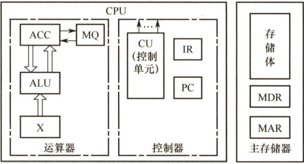

#### 1.3 计算机的性能指标  

#### 1.3.1 计算机的主要性能指标  

#### 1．字长  

字长是指计算机进行一次整数运算（即定点整数运算）所能处理的二进制数据的位数，通常与CPU 的寄存器位数、加法器有关。因此，字长一般等于内部寄存器的大小，字长越长，数的表示范围越大，计算精度越高。计算机字长通常选定为字节（8位）的整数倍。  

注意：机器字长、指令字长和存储字长的关系（见本章常见问题和易混淆知识点4）。  

#### 2．数据通路带宽  

数据通路带宽是指数据总线一次所能并行传送信息的位数。这里所说的数据通路宽度是指外部数据总线的宽度，它与CPU内部的数据总线宽度（内部寄存器的大小）有可能不同。  

注意：各个子系统通过数据总线连接形成的数据传送路径称为数据通路。  

#### 3．主存容量  

主存容量是指主存储器所能存储信息的最大容量，通常以字节来衡量，也可用字数×字长（如 $512\mathrm{K}\times16$ 位）来表示存储容量。其中，MAR的位数反映存储单元的个数，MAR的位数反映可寻址范围的最大值（而不一定是实际存储器的存储容量)。  

例如，MAR为16位，表示 $2^{16}=65536$ ，即此存储体内有65536个存储单元（可称为64K内存， $1\mathsf{K}=1024\$ ，若MDR为32位，表示存储容量为 $64\mathrm{K}\times32$ 位。  

#### 4.运算速度  

（1）吞吐量和响应时间。  

·吞吐量。指系统在单位时间内处理请求的数量。它取决于信息能多快地输入内存，CPU能多快地取指令，数据能多快地从内存取出或存入，以及所得结果能多快地从内存送给一台外部设备。几乎每步都关系到主存，因此系统吞吐量主要取决于主存的存取周期。  
·响应时间。指从用户向计算机发送一个请求，到系统对该请求做出响应并获得所需结果的等待时间。通常包括CPU时间（运行一个程序所花费的时间）与等待时间（用于磁盘访问、存储器访问、I/O操作、操作系统开销等的时间)。  

（2）主频和CPU时钟周期。  

·CPU时钟周期。通常为节拍脉冲或 $T$ 周期，即主频的倒数，它是CPU中最小的时间单位，执行指令的每个动作至少需要1个时钟周期。  
·主频（CPU时钟频率)。机器内部主时钟的频率，是衡量机器速度的重要参数。对于同一个型号的计算机，其主频越高，完成指令的一个执行步骤所用的时间越短，执行指令的速度越快。例如，常用CPU的主频有1.8GHz、2.4GHz、2.8GHz等。  

注意：CPU时钟周期 $=1/.$ 主频，主频通常以 $\mathrm{Hz}$ （赫兹）为单位，1Hz表示每秒1次。  

（3）CPI（ClockcyclePerInstruction），即执行一条指令所需的时钟周期数。不同指令的时钟周期数可能不同，因此对于一个程序或一台机器来说，其CPI指该程序或该机器指令集中的所有指令执行所需的平均时钟周期数，此时CPI是一个平均值。  

（4）CPU执行时间，指运行一个程序所花费的时间。CPU执行时间 $\mathbf{\Sigma}=\mathbf{CPU}$ 时钟周期数/主频 $\mathbf{\Sigma}=\mathbf{\Sigma}$ （指令条数 $\mathbf{\nabla}\times\mathbf{CPI})$ /主频  

上式表明，CPU的性能（CPU 执行时间）取决于三个要素： $\textcircled{1}$ 主频 (时钟频率); $\textcircled{2}$   
每条指令执行所用的时钟周期数（CPI)； $\textcircled{3}$ 指令条数。  

主频、CPI和指令条数是相互制约的。例如，更改指令集可以减少程序所含指令的条数，但同时可能引起CPU 结构的调整，从而可能会增加时钟周期的宽度（降低主频)。有关主频、CPI和指令条数的相互制约关系，相信读者在学完指令系统、数据通路设计后会有更深刻的认识。  

（5）MIPS（Million InstructionsPer Second），即每秒执行多少百万条指令。  

$\mathbf{MIPS}=$ 指令条数/(执行时间 $\times10^{6})=$ 主频 $\mathrm{(CPI\times10^{6})}$ 。  

MIPS 对不同机器进行性能比较是有缺陷的，因为不同机器的指令集不同，指令的功能也就不同，比如在机器 M1上某条指令的功能也许在机器 M2上要用多条指令来完成；不同机器的CPI和时钟周期也不同，因而同一条指令在不同机器上所用的时间也不同。  

（6）MFLOPS、GFLOPS、TFLOPS、PFLOPS、EFLOPS 和 ZFLOPS。·MFLOPS（Mega Floating-pointOperations Per Second），即每秒执行多少百万次浮点运算。MFLOPS $\mathbf{\Psi}=\mathbf{\Psi}$ 浮点操作次数/(执行时间 $\times10^{6}$ 。  

·GFLOPS（Giga Floating-point Operations Per Second），即每秒执行多少十亿次浮点运算。GFLOPS $\mathbf{\Psi}=\mathbf{\Psi}$ 浮点操作次数/(执行时间 $\times10^{9}$ 。  
·TFLOPS（Tera Floating-point OperationsPer Second），即每秒执行多少万亿次浮点运算。TFLOPS $\mathbf{\Sigma}=\mathbf{\Sigma}$ 浮点操作次数/(执行时间 $\times10^{12}$ 。  
·此外，还有PFLOPS $\mathbf{\Sigma}=\mathbf{\Sigma}$ 浮点操作次数/(执行时间 $\times10^{15}$ )；EFLOPS $\dot{}={}$ 浮点操作次数/(执行时间 $\times10^{18}$ ；ZFLOPS $\mathbf{\Sigma}=\mathbf{\Sigma}$ 浮点操作次数/(执行时间 $\times10^{21}$  

注意：在描述存储容量、文件大小等时，K、M、G、T通常用2的幂次表示，如 $1\mathrm{Kb}=2^{\mathrm{10}}\mathrm{b}$ .在描述速率、频率等时，k、M、G、T通常用10的幂次表示，如 $1\mathbf{kb}/\mathbf{s}~=~10^{3}\mathbf{b}/\mathbf{s}$ 。通常前者用大写的K，后者用小写的 $\mathbf{k}$ ，但其他前缀均为大写，表示的含义取决于所用的场景。  

#### 5.基准程序  

基准程序（Benchmarks）是专门用来进行性能评价的一组程序，能够很好地反映机器在运行实际负载时的性能，可以通过在不同机器上运行相同的基准程序来比较在不同机器上的运行时间，从而评测其性能。对于不同的应用场合，应该选择不同的基准程序。  

使用基准程序进行计算机性能评测也存在一些缺陷，因为基准程序的性能可能与某一小段的短代码密切相关，而硬件系统设计人员或编译器开发者可能会针对这些代码片段进行特殊的优化，使得执行这段代码的速度非常快，以至于得不到准确的性能评测结果。  

#### 1.3.2 几个专业术语  

1）系列机。具有基本相同的体系结构，使用相同基本指令系统的多个不同型号的计算机组成的一个产品系列。  
2）兼容。指软件或硬件的通用性，即运行在某个型号的计算机系统中的硬件/软件也能应用于另一个型号的计算机系统时，称这两台计算机在硬件或软件上存在兼容性。  
3）软件可移植性。指把使用在某个系列计算机中的软件直接或进行很少的修改就能运行在另一个系列计算机中的可能性。  
4）固件。将程序固化在ROM中组成的部件称为固件。固件是一种具有软件特性的硬件，吸收了软/硬件各自的优点，其执行速度快于软件，灵活性优于硬件，是软/硬件结合的产物。例如，目前操作系统已实现了部分固化（把软件永恒地存储于ROM中)。  

#### 1.3.3 本节习题精选  

#### 一、单项选择题  

01.关于CPU主频、CPI、MIPS、MFLOPS，说法正确的是（）。  

A.CPU主频是指CPU系统执行指令的频率，CPI是执行一条指令平均使用的频率B.CPI是执行一条指令平均使用CPU时钟的个数，MIPS描述一条CPU指令平均使用的CPU时钟数C.MIPS是描述CPU执行指令的频率，MFLOPS是计算机系统的浮点数指令D.CPU主频指CPU使用的时钟脉冲频率，CPI是执行一条指令平均使用的CPU时钟数  

02.存储字长是指（）。  

A.存放在一个存储单元中的二进制代码组合
B.存放在一个存储单元中的二进制代码位数
C．存储单元的个数  
D.机器指令的位数  

03．以下说法中，错误的是（）。  

A.计算机的机器字长是指数据运算的基本单位长度  
B．寄存器由触发器构成  
C.计算机中一个字的长度都是32位  
D.磁盘可以永久性存放数据和程序  

04.下列关于机器字长、指令字长和存储字长的说法中，正确的是（）。  

I．三者在数值上总是相等的ⅡI．三者在数值上可能不等III．存储字长是存放在一个存储单元中的二进制代码位数IV.数据字长就是MDR的位数  

A.I、III B.I、IV C.Ⅱ、II D.Ⅱ、IV  

05.32位微机是指该计算机所用CPU（）。  

A.具有32位寄存器 B．能同时处理32位的二进制数C.具有32个寄存器 D．能处理32个字符  

06．用于科学计算的计算机中，标志系统性能的最有用的参数是（）。  

A.主时钟频率 B．主存容量 C.MFLOPS D.MIPS  

07．若一台计算机的机器字长为4字节，则表明该机器（）。  

A.能处理的数值最大为4位十进制数  
B．能处理的数值最多为4位二进制数  
C.在CPU中能够作为一个整体处理32位的二进制代码  
D.在CPU中运算的结果最大为 $2^{32}$  

08.在CPU的寄存器中，（）对用户是完全透明的。  

A．程序计数器 B．指令寄存器 C．状态寄存器 D.通用寄存器  

09．计算机操作的最小单位时间是（）。  

A．时钟周期 B．指令周期 C.CPU周期 D.中断周期  

10．计算机中，CPU的CPI与下列（）因素无关。  

A．时钟频率 B.系统结构 C.指令集 D．计算机组织  

11．从用户观点看，评价计算机系统性能的综合参数是（）。  

A.指令系统 B.吞吐率 C．主存容量 D.主频率  

12．当前设计高性能计算机的重要技术途径是（）。  

A.提高CPU主频 B．扩大主存容量C.采用非冯·诺依曼体系结构 D．采用并行处理技术  

13．下列关于“兼容”的叙述，正确的是（）。  

A．指计算机软件与硬件之间的通用性，通常在同一系列不同型号的计算机间存在B．指计算机软件或硬件的通用性，即它们在任何计算机间可以通用C.指计算机软件或硬件的通用性，通常在同一系列不同型号的计算机间通用D．指软件在不同系列计算机中可以通用，而硬件不能通用  

14.下列说法中，正确的是（）。  

I．在微型计算机的广泛应用中，会计电算化属于科学计算方面的应用  
ⅡI．决定计算机计算精度的主要技术是计算机的字长  
III计算机“运算速度”指标的含义是每秒能执行多少条操作系统的命令  
IV．利用大规模集成电路技术把计算机的运算部件和控制部件做在一块集成电路芯片上，这样的一块芯片称为单片机  

A.I、IⅢI B.ⅡI、IV C.I D.I、ⅢII、IV  

15.【2010统考真题】下列选项中，能缩短程序执行时间的措施是（）。  

I．提高CPU时钟频率II．优化数据通路结构III．对程序进行编译优化  

A.仅I和ⅡI B.仅I和III C.仅和IⅢI D.I、Ⅱ、II  

16.【2011统考真题】下列选项中，描述浮点数操作速度指标的是（）。  

A.MIPS B. CPI C. IPC D. MFLO

17.【2012统考真题】假定基准程序A在某计算机上的运行时间为100s，其中90s为CPU时间，其余为I/O时间。若CPU速度提高 $50\%$ ，I/O速度不变，则运行基准程序A所耗费的时间是（）。  

A.55s B.60s C. 65s D.70s  

18.【2013统考真题】某计算机的主频为 $1.2\mathrm{GHz}$ ，其指令分为4类，它们在基准程序中所占比例及CPI如下表所示。  

<html><body><table><tr><td>指令类型</td><td>所占比例</td><td>CPI</td><td>指令类型</td><td>所占比例</td><td>CPI</td></tr><tr><td>A</td><td>50%</td><td>2</td><td>C</td><td>10%</td><td>4</td></tr><tr><td>B</td><td>20%</td><td>3</td><td>D</td><td>20%</td><td>5</td></tr></table></body></html>  

该机的MIPS数是（）。  

A. 100 B.200 C. 400 D. 600  

19.【2014统考真题】程序P在机器M上的执行时间是20s，编译优化后，P执行的指令数减少到原来的 $70\%$ ，而CPI增加到原来的1.2倍，则P在M上的执行时间是（）。  

A.8.4s B.11.7s C.14s D.16.8s  

20.【2017统考真题】假定计算机M1和M2具有相同的指令集体系结构（ISA），主频分别为1.5GHz和 $1.2\mathrm{GHz}$ 。在M1和M2上运行某基准程序P，平均CPI分别为2和1，则程序P在M1和M2上运行时间的比值是（）。  

A.0.4 B. 0.625 C.1.6 D. 2.5  

21.【2020统考真题】下列给出的部件中，其位数（宽度）一定与机器字长相同的是（）。  

I．ALU ⅡI．指令寄存器 IⅢI.通用寄存器 IV．浮点寄存器A.仅I、Ⅱ B.仅I、IⅢI C.仅Ⅱ、IⅢI D.仅Ⅱ、IⅢI、IV  

22.【2021统考真题】2017年公布的全球超级计算机TOP500排名中，我国“神威·太湖之光”超级计算机蝉联第一，其浮点运算速度为93.0146PFLOPS，说明该计算机每秒钟内完成的浮点操作次数约为（）。  

A. $9.3\times10^{13}$ 次 B. $9.3\times10^{15}$ 次 C.9.3千万亿次 D.9.3亿亿次  

#### 二、综合应用题  

01．设主存储器容量为 $64\mathrm{K}\times32$ 位，且指令字长、存储字长、机器字长三者相等。写出如下图所示各寄存器的位数，并指出哪些寄存器之间有信息通路。  

  

02.用一台40MHz的处理器执行标准测试程序，它所包含的混合指令数和响应所需的时钟周期见下表。求有效的CPI、MIPS速率和程序的执行时间（I为程序的指令条数）。  

<html><body><table><tr><td>指令类型</td><td>CPI</td><td>指令混合比</td><td>指令类型</td><td>CPI</td><td>指令混合比</td></tr><tr><td>算术和逻辑</td><td>1</td><td>60%</td><td>转移</td><td>4</td><td>12%</td></tr><tr><td>高速缓存命中的访存</td><td>2</td><td>18%</td><td>高速缓存失效的访存</td><td>8</td><td>10%</td></tr></table></body></html>  

03.微机A和B是采用不同主频的CPU芯片，片内逻辑电路完全相同。  

1）若A机的CPU主频为8MHz，B机为 $12\mathrm{MHz}$ ，则A机的CPU时钟周期为多少？  
2）若A机的平均指令执行速度为0.4MIPS，则A机的平均指令周期为多少？  
3）B机的平均指令执行速度为多少？  

04.某台计算机只有Load/Store 指令能对存储器进行读/写操作，其他指令只对寄存器进行操作。根据程序跟踪试验结果，已知每条指令所占的比例及CPI数如下表所示。  

<html><body><table><tr><td>指令类型</td><td>指令所占比例</td><td>CPI</td><td>指令类型</td><td>指令所占比例</td><td>CPI</td></tr><tr><td>算术逻辑指令</td><td>43%</td><td>1</td><td>Store指令</td><td>12%</td><td>2</td></tr><tr><td>Load指令</td><td>21%</td><td>2</td><td>转移指令</td><td>24%</td><td>2</td></tr></table></body></html>  

求上述情况的平均CPI。  

假设程序由 $M$ 条指令组成。算术逻辑运算中 $25\%$ 的指令的两个操作数中的一个已在寄存器中，另一个必须在算术逻辑指令执行前用Load指令从存储器中取到寄存器中。因此有人建议增加另一种算术逻辑指令，其特点是一个操作数取自寄存器，另一个操作数取自存储器，即寄存器-存储器类型，假设这种指令的CPI等于2。同时，转移指令的CPI变为3。求新指令系统的平均CPI。  

#### 1.3.4 答案与解析  

#### 一、单项选择题  

#### 01.D  

CPU主频指CPU的时钟脉冲频率，CPI是执行一条指令平均使用的CPU时钟数。  

02.B  

存储体由许多存储单元组成，每个存储单元又包含若干存储元件，每个存储元件能寄存一位二进制代码“0”或“1”。可见，一个存储单元可存储一串二进制代码，称这串二进制代码为一个存储字，称这串二进制代码的位数为存储字长。  

#### 03.C  

计算机中一个字的长度可以是16、32、64位等，一般是8的整数倍，不一定都是32位。  

04.C  

机器字长、指令字长和存储字长，三者在数值上可以相等也可以不等，视不同机器而定。一个存储单元中的二进制代码的位数称为存储字长。存储字长等于MDR 的位数，而数据字长是数据总线一次能并行传送信息的位数，它可以不等于MDR的位数。  

05.B  

计算机的位数，即机器字长，也就是计算机一次能处理的二进制数的长度。要注意的是，操作系统的位数是操作系统可寻址的位数，它与机器字长不同。一般情况下可通过寄存器的位数来判断机器字长。  

06.C  

MFLOPS是指每秒执行多少百万次浮点运算，该参数用来描述计算机的浮点运算性能，而用于科学计算的计算机主要评估浮点运算的性能。  

07.C  

机器字长是计算机内部一次可以处理的二进制数的位数，因此该计算机一次可处理 $4{\times}8=$ 32位的二进制代码。  

08.B  

汇编程序员可以通过指定待执行指令的地址来设置PC 的值，状态寄存器、通用寄存器只有为汇编程序员可见，才能实现编程，而IR、MAR、MDR是CPU的内部工作寄存器，对程序员均不可见。  

09.A  

时钟周期即CPU 频率的倒数，是最基本的时间单位，其余选项均大于时钟周期。另外，CPU周期又称机器周期，它由多个时钟周期组成。  

10.A  

CPI 是执行一条指令所需的时钟周期数，系统结构、指令集、计算机组织都会影响CPI，而时钟频率并不会影响CPI，但可加快指令的执行速度。例如，执行一条指令需要10 个时钟周期，则一台主频为1GHz的CPU，执行这条指令要比一台主频为 ${100}\mathrm{MHz}$ 的CPU快。  

11.B  

主频、主存容量和指令系统（间接影响CPI）并不是综合性能的体现。吞吐率指系统在单位时间内处理请求的数量，是评价计算机系统性能的综合参数。  

12.D  

提高CPU主频、扩大主存容量对性能的提升是有限度的。采用并行技术是实现高性能计算的重要途径，现今超级计算机均采用多处理器来增强并行处理能力。  

13.C  

兼容指计算机软件或硬件的通用性，因此选项A、D 错。选项B中，它们在任何计算机间可以通用，错误。选项C中，兼容通常在同一系列的不同型号计算机间，正确。  

14.C  

会计电算化属于计算机数据处理方面的应用，I错误。Ⅱ显然正确。计算机“运算速度”指  

标的含义是每秒能执行多少条指令，III错误。这样集成的芯片称为CPU，IV错误。  

15.D  

CPU时钟频率（主频）越高，完成指令的一个执行步骤所用的时间就越短，执行指令的速度就越快，I正确。数据通路的功能是实现CPU内部的运算器和寄存器及寄存器之间的数据交换，优化数据通路结构，可以有效提高计算机系统的吞吐量，从而加快程序的执行，Ⅱ正确。计算机程序需要先转化成机器指令序列才能最终得到执行，通过对程序进行编译优化可以得到更优的指令序列，从而使得程序的执行时间也越短，III正确。  

16.D  

MIPS 是每秒执行多少百万条指令，适用于衡量标量机的性能。CPI是平均每条指令的时钟周期数。IPC 是CPI 的倒数，即每个时钟周期执行的指令数。MFLOPS 是每秒执行多少百万条浮点数运算，用来描述浮点数运算速度，适用于衡量向量机的性能。  

17.D  

解析请扫右侧二维码查阅。  

18.C  

基准程序的 $\mathrm{CPI}=2{\times}0.5+3{\times}0.2+4{\times}0.1+5{\times}0.2=3$ 。计算机的主频为 $1.2\mathrm{GHz}$ ，即 $1200\mathrm{MHz}$ ，因此该机器的 $\mathrm{MIPS}=1200/3=400$ 。  

19.D  

假设原来的指令条数为 $x$ ，则原CPI为 $20f/x$ $(f$ 为CPU的时钟频率)，经过编译优化后，指令条数减少到原来的 $70\%$ ，即指令条数为 $0.7x$ ，而CPI增加到原来的1.2 倍，即 $24f/x$ ，则现在P在 $\mathbf{M}$ 上的执行时间就为：(指令条娄 $\dot{\langle}\times\mathrm{CPI})/f{}=(0.7x\times24\times f/x)/f{}=24\times0.7=16.8\mathrm{s}$ ，选D。  

20.C  

运行时间 $\mathbf{\Sigma}=\mathbf{\Sigma}$ 指令数 $\boldsymbol{\times}\mathbf{CPI}/\protect$ 主频。M1 的时间 $\mathbf{\Sigma}=\mathbf{\Sigma}$ 指令数 $\times2/1.5$ ，M2的时间 $\mathbf{\Sigma}=\mathbf{\Sigma}$ 指令数 $\cdot\times1/1.2$ .两者之比为(2/1.5): $(1/1.2)=1.6$ 。因此选C。  

21.B  

机器字长是指CPU内部用于整数运算的数据通路的宽度。CPU 内部数据通路是指 CPU 内部的数据流经的路径及路径上的部件，主要是CPU内部进行数据运算、存储和传送的部件，这些部件的宽度基本上要一致才能相互匹配。因此，机器字长等于CPU 内部用于整数运算的运算器位数和通用寄存器宽度。  

22.D  

PFLOPS $\mathbf{\Psi}=\mathbf{\Psi}$ 每秒一千万亿（ $10^{15}$ ）次浮点运算。故93.0146PFLOPS $\approx$ 每秒 $9.3\times10^{16}$ 次浮点运算，即每秒9.3亿亿次浮点运算。  

#### 二、综合应用题  

01.【解答】  

由于主存容量为 $64\mathrm{K}\times32$ 位，因 $2^{16}=64\mathrm{K}$ ，则地址总线宽度为16位，32位表示数据总线宽度，因此MAR为16位，PC为16位，MDR为32位。  

因指令字长 $\mathbf{\Sigma}=\mathbf{\Sigma}$ 存储字长 $\mathbf{\Sigma}=\mathbf{\Sigma}$ 机器字长，则IR、ACC、MQ、X均为32位。  

寄存器之间的信息通路有：  

PC→MAR  
$\mathbf{Ad(IR){\rightarrow}M A R}$   
MDR→IR  
取数：MDR→ACC，存数：ACC→MDR  
MDR $\scriptstyle\to\mathbf{X}$  

02.【解答】  

CPI即执行一条指令所需的时钟周期数。本标准测试程序共包含4种指令，则CPI就是这4种指令的数学期望，即  

$$
\mathrm{CPI}=1{\times}60\%+2{\times}18\%+4{\times}12\%+8{\times}10\%=2.24
$$  

MIPS即每秒执行的百万条指令数。已知处理器时钟频率为 $40\mathrm{{MHz}}$ ，即每秒包含40M个时钟周期，因此  

$$
\mathrm{MIPS}=40/\mathrm{CPI}=40/2.24=17.9
$$  

程序的执行时间 $T={\mathrm{CPI}}{\times}{\mathrm{T}}\_{{\mathrm{IC}}\times I},$ ，其中 $\mathrm{T\_IC}$ 是一个CPU时钟的时间长度，是CPU时钟频率 $f$ 的倒数，因此有  

$$
T=\mathrm{CPI}{\times}\mathrm{T}_{-}\mathrm{IC}{\times}I=\mathrm{CPI}{\times}(1/f){\times}I=5.6{\times}10^{-8}{\times}I
$$  

本题中的 $I$ 对于解题应无作用，程序的执行时间应是指令的期望即CPI乘以时钟的时间长度，即 $T={\mathrm{CPI}}{\times}{\mathrm{T}}\_{\mathrm{IC}}$ 。  

03.【解答】  

1）A机的CPU主频为 $8\mathrm{MHz}$ ，所以A机的CPU时钟周期 $\mathbf{\mu}=1/8\mathbf{MHz}=0.125\upmu\mathrm{s}$ 。2）A机的平均指令周期 $=1/0.4\mathrm{MIPS}=2.5\upmu\mathrm{s}$ 0  
3）A机平均每条指令的时钟周期数 $=2.5\upmu\mathrm{s}/0.125\upmu\mathrm{s}=20$ 0  
因微机A和B的片内逻辑电路完全相同，所以B机平均每条指令的时钟周期数也为20。由于B机的CPU主频为 $12\mathrm{{MHz}}$ ，所以B机的CPU时钟周期 $\it\Omega=1/12M H z=1/12\upmu s$ 。B机的平均指令周期 $=20\times(1/12)=5/3\upmu\mathrm{s}$ 。  
B机的平均指令执行速度 $=1/(5/3)\mathrm{{\textmus}=0.6M I P S}$ 9  

【另解】B机的平均指令执行速度 $\mathbf{\tau}=\mathbf{A}$ 机的平均指令执行速度 $\times(12/8)=0.4\mathrm{MIPS}\times(12/8)=$ 0.6MIPS。  

04.【解答】  

$\textcircled{1}$ 本处理机共包含4种指令，则CPI就是这4种指令的数学期望，即  

$$
\mathrm{CPI}=1{\times}43\%+2{\times}21\%+2{\times}12\%+2{\times}24\%=1.57
$$  

$\textcircled{2}$ 设原指令总数为 $M$ ，由于新增的算术操作有取操作数的功能，替代了Load的功能，所  

以新指令总数为  

增加另一种算术逻辑指令后，每种指令所占的比例及CPI数如下表所示：  

<html><body><table><tr><td>指令类型</td><td>指令所占比例</td><td>CPI</td></tr><tr><td>算术逻辑指令</td><td>(0.43M-0.43MX0.25)/0.8925M=0.3613</td><td>1</td></tr><tr><td>算术逻辑指令 (新)</td><td>(0.43M×0.25)/0.8925M=0.1204</td><td>2</td></tr><tr><td>Load指令</td><td>(0.21M-0.43M×0.25)/0.8925M=0.1148</td><td>2</td></tr><tr><td>Store指令</td><td>0.12M/0.8925M=0.1348</td><td>2</td></tr><tr><td>转移指令</td><td>0.24M/0.8925M=0.2689</td><td>3</td></tr></table></body></html>  

所以 $\mathrm{CPI^{\prime}}=1\times0.3613+2\times0.1204+2\times0.1148+2\times0.1348+3\times0.2689=1.9076$ 。