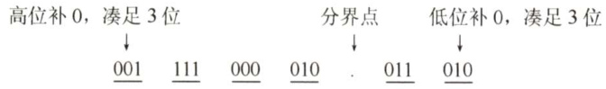
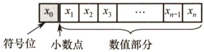
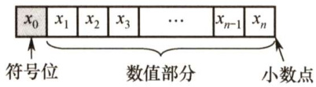

#### 2.1 数制与编码  

#### 2.1.1 进位计数制及其相互转换  

在计算机系统内部，所有的信息都是用二进制进行编码的，这样做的原因有以下几点。  

1）二进制只有两种状态，使用有两个稳定状态的物理器件就可以表示二进制数的每一位，制造成本比较低，例如用高低电平或电荷的正负极性都可以很方便地表示0和1。  
2）二进制位1和0正好与逻辑值"真"和"假"对应，为计算机实现逻辑运算和程序中的逻辑判断提供了便利条件。  

3）二进制的编码和运算规则都很简单，通过逻辑门电路能方便地实现算术运算。  

#### 1．进位计数法  

常用的进位计数法有十进制、二进制、八进制、十六进制等。十进制数是日常生活中最常使用的，而计算机中通常使用二进制数、八进制数和十六进制数。  

在进位计数法中，每个数位所用到的不同数码的个数称为基数。十进制的基数为10（ $0\sim$ 9)，每个数位计满10就向高位进位，即"逢十进一"。  

十进制数101，其个位的1显然与百位的1所表示的数值是不同的。每个数码所表示的数值等于该数码本身乘以一个与它所在数位有关的常数，这个常数称为位权。一个进位数的数值大小就是它的各位数码按权相加。  

一个 $\boldsymbol{r}$ 进制数（ $K_{n}K_{n-1}\cdots K_{0}K_{-1}\cdots K_{-m}$ ）的数值可表示为  

$$
K_{n}r^{n}+K_{n-1}r^{n-1}+\cdots+K_{0}r^{0}+K_{-1}r^{-1}+\cdots+K_{-m}r^{-m}=\sum_{i=n}^{-m}K_{i}r^{i}
$$  

式中， $\boldsymbol{r}$ 是基数； $r^{i}$ 是第 $i$ 位的位权（整数位最低位规定为第0位)； $K_{i}$ 的取值可以是 $0,1,\cdots,r{-}1$ 共 $\boldsymbol{r}$ 个数码中的任意一个。  

1）二进制。计算机中用得最多的是基数为2的计数制，即二进制。二进制只有0和1两种数字符号，计数"逢二进一"。它的任意数位的权为 $2^{i}$ ， $i$ 为所在位数。  
2）八进制。八进制作为二进制的一种书写形式，其基数为8，有 $0{\sim}7$ 共8个不同的数字符号，计数"逢八进一"。因为 $r=8=2^{3}$ ，所以只要把二进制中的3位数码编为一组就是一位八进制数码，两者之间的转换极为方便。  
3）十六进制。十六进制也是二进制的一种常用书写形式，其基数为16，"逢十六进一"。每个数位可取 $0{\sim}9$ 、A、B、C、D、E、F中的任意一个，其中A、B、C、D、E、F分别表示 $10{\sim}15$ 。因为 $r=16=2^{4}$ ，因此4位二进制数码与1位十六进制数码相对应。  

#### 2.不同进制数之间的相互转换  

（1）二进制数转换为八进制数和十六进制数  

对于一个二进制混合数（既包含整数部分，又包含小数部分)，在转换时应以小数点为界。其整数部分，从小数点开始往左数，将一串二进制数分为3位（八进制）一组或4位（十六进制）一组，在数的最左边可根据需要加"0"补齐；对于小数部分，从小数点开始往右数，也将一串二进制数分为3位一组或4位一组，在数的最右边也可根据需要加"0"补齐。最终使总的位数为3或4的整数倍，然后分别用对应的八进制数或十六进制数取代。  

【例2.1】将二进制数1111000010.01101分别转换为八进制数和十六进制数。解：  

  

所以，对应的八进制数为 $(1702.32)_{8}=(1111000010.01101)_{2}$ 。  

$$
\underbrace{0011}_{3} \underbrace{1100}_{\mathrm{C}} \underbrace{0010}_{2} . \underbrace{0110}_{6} \underbrace{1000}_{8}
$$

所以，对应的十六进制数为 $(3\mathrm{C}2.68)_{16}=(1111000010.01101)_{2}\diamond$  

同样，由八进制数或十六进制数转换成二进制数，只需将每位改为3位或4位二进制数即可（必要时去掉整数最高位或小数最低位的0)。八进制数和十六进制数之间的转换也能方便地  

实现，十六进数制转换为八进制数（或八进制数转换为十六进制数）时，先将十六进制（八进制）数转换为二进制数，然后由二进制数转换为八进制（十六进制）数较为方便。  

（2）任意进制数转换为十进制数  

将任意进制数的各位数码与它们的权值相乘，再把乘积相加，就得到了一个十进制数。这种方法称为按权展开相加法。  

（3）十进制数转换为任意进制数  

一个十进制数转换为任意进制数，常采用基数乘除法。这种转换方法对十进制数的整数部分和小数部分将分别进行处理，对整数部分用除基取余法，对小数部分用乘基取整法，最后将整数部分与小数部分的转换结果拼接起来。  

除基取余法（整数部分的转换)：整数部分除基取余，最先取得的余数为数的最低位，最后取得的余数为数的最高位（即除基取余，先余为低，后余为高)，商为0时结束。  

【例2.2】将十进制数123.6875转换成二进制数。  

解：  

整数部分：  

| 除数 | 被除数 | 商 | 余数 | 位 |
| :--- | :----- | :-- | :--- | :-- |
| 2 | 123 | 61 | 1 | LSB |
| 2 | 61 | 30 | 1 | |
| 2 | 30 | 15 | 0 | |
| 2 | 15 | 7 | 1 | |
| 2 | 7 | 3 | 1 | |
| 2 | 3 | 1 | 1 | |
| 2 | 1 | 0 | 1 | MSB |

因此整数部分 $123=(1111011)_{2}$ 8  

乘基取整法（小数部分的转换)：小数部分乘基取整，最先取得的整数为数的最高位，最后取得的整数为数的最低位（即乘基取整，先整为高，后整为低)，乘积为1.0（或满足精度要求）时结束。  

小数部分：  

| 小数部分 | × 2 | 结果   | 取整部分 | 位      |
| :------- | :-- | :----- | :------- | :------ |
| 0.6875   | × 2 | 1.3750 | 1        | 最高位 |
| 0.3750   | × 2 | 0.7500 | 0        |         |
| 0.7500   | × 2 | 1.5000 | 1        |         |
| 0.5000   | × 2 | 1.0000 | 1        | 最低位 |

因此小数部分 $0.6875=(0.1011)_{2}$ ，所以 $123.6875=(1111011.1011)_{2}$ 9  

注意：在计算机中，小数和整数不一样，整数可以连续表示，但小数是离散的，所以并不是每个十进制小数都可以准确地用二进制表示。例如0.3，无论经过多少次乘二取整转换都无法得到精确的结果。但任意一个二进制小数都可以用十进制小数表示，希望读者引起重视。  

注意：关于十进制数转换为任意进制数为何采用除基取余法和乘基取整法，以及所取之数放置位置的原理，请结合 $\boldsymbol{r}$ 进制数的数值表示公式思考，而不应死记硬背。  

#### 3.真值和机器数  

在日常生活中，通常用正号、负号来分别表示正数（正号可省略）和负数，如 $+15$ 、-8等。这种带" $^+$ "或"－"符号的数称为真值。真值是机器数所代表的实际值。  

在计算机中，通常将数的符号和数值部分一起编码，将数据的符号数字化，通常用"0"表示"正"，用"1"表示"负"。这种把符号"数字化"的数称为机器数。常用的有原码、补码和反码表示法。如0,101（这里的逗号"，"仅为区分符号位与数值位）表示 $+5$ 。  

#### 2.1.2 BCD码 

二进制编码的十进制数（Binary-CodedDecimal，BCD）通常采用4 位二进制数来表示一位十进制数中的 $0{\sim}9$ 这10个数码。这种编码方法使二进制数和十进制数之间的转换得以快速进行。但4位二进制数可以组合出16种代码，因此必有6种状态为冗余状态。  

下面列举几种常用的BCD码。  

1）8421码（常用)。它是一种有权码，设其各位的数值为 $b_{3}$ 。 $b_{2}$ $b_{1}$ 。 $b_{0}$ ，则权值从高到低依次为8,4,2,1，它表示的十进制数为 $D=8b_{3}+4b_{2}+2b_{1}+1b_{0}$ 。如 $8\to1000$ . $9\substack{\rightarrow}1001$ 。若两个8421码相加之和小于等于 $(1001)_{2}$ 即 $(9)_{10}$ ，则不需要修正；若相加之和大于等于 $(1010)_{2}$ 即 $(10)_{10}$ ，则要加6修正（从1010到1111这6个为无效码，当运算结果落于这个区间时，需要将运算结果加上6)，并向高位进位。  

2）余3码。这是一种无权码，是在8421码的基础上加 $(0011)_{2}$ 形成的，因每个数都多余"3"，因此称为余3码。如 $_{8\rightarrow1011}$ ， $9\mathrm{\rightarrow}1100$ 0  

3）2421码。这也是一种有权码，权值由高到低分别为2,4,2,1，特点是大于等于5的4位二进制数中最高位为1，小于5的最高位为0。如 $5\substack{\rightarrow}1011$ 而非0101。  

#### 2.1.3 定点数的编码表示  

根据小数点的位置是否固定，在计算机中有两种数据格式：定点表示和浮点表示。在现代计算机中，通常用定点补码整数表示整数，用定点原码小数表示浮点数的尾数部分，用移码表示浮点数的阶码部分，历年统考真题的考点分布也基本落在这个范围内。  

#### 1.机器数的定点表示  

定点表示法用来表示定点小数和定点整数。  

1）定点小数。定点小数是纯小数，约定小数点位置在符号位之后、有效数值部分最高位之前。若数据 $X$ 的形式为 $X=x_{0}.x_{1}x_{2}\cdots x_{n}$ （其中 $x_{0}$ 为符号位， $x_{1}\sim x_{n}$ 是数值的有效部分，也称尾数， $x_{1}$ 为最高有效位)，则在计算机中的表示形式如图2.1所示。  

2）定点整数。定点整数是纯整数，约定小数点位置在有效数值部分最低位之后。若数据 $X$ 的形式为 $X=x_{0}x_{1}x_{2}^{...}x_{n}$ （其中 $x_{0}$ 为符号位， $x_{1}\sim x_{n}$ 是尾数， $x_{n}$ 为最低有效位)，则在计算机中的表示形式如图2.2所示。  

  
图2.1定点小数表示  

  
图2.2定点整数表示  

定点数编码表示法主要有以下4种：原码、补码、反码和移码。  

#### 2.原码、补码、反码、移码  

（1）原码表示法  

用机器数的最高位表示数的符号，其余各位表示数的绝对值。原码的定义如下。  

纯小数的原码定义  

$$
[x]_{\mathbb{X}}={\left\{\begin{array}{l l}{x\qquad}&{1>x\geq0}\\ {1-x=1+|x|\qquad}&{0\geq x>-1}\end{array}\right.}
$$  

例如，若 $x_{1}=+0.1101$ ， $x_{2}=-0.1101$ ，字长为8位，则其原码表示为： $[x_1]_{\mathrm{原}} = \mathbf{0}.1101000$, $[x_2]_{\mathrm{原}} = 1 - (-0.1101) = \mathbf{1}.1101000$ ，其中最高位是符号位。  

若字长为 $n+1$ ，则原码小数的表示范围为- $(1-2^{-n})\leq x\leq1-2^{-n}$ （关于原点对称)。  

纯整数的原码定义（了解)  

$$
[x]_{\mathrm{原}} = \left\{ \begin{array}{ll}
0, x & 2^n > x \ge 0 \\
2^n + |x| & 0 \ge x > -2^n
\end{array} \right.
\quad (\text{x 为整数, n 为数值位数})
$$

例如，若 $x_{1}=+1110$ ， $x_{2}=-1110$ ，字长为8位，则其原码表示为 $[x_{1}]_{i i}=\mathbf{0}$ ，0001110， $[x_{2}]_{\mathbb{R}^{1}}=$ $2^{7}+1110=\mathbf{1}$ ，0001110，其中最高位是符号位。  

若字长为 $n+1$ ，则原码整数的表示范围为 $-(2^{n}-1)\leq x\leq2^{n}-1$ (关于原点对称)。  

注意：真值零的原码表示有正零和负零两种形式，即 $[+0]_{\mathcal{R}}=\mathbf{0}0000$ 和 $[-0]_{\mathcal{R}}=\mathbf{1}0000$  

原码表示的优点是与真值的对应关系简单、直观，与真值的转换简单，并且用原码实现乘除运算比较简便。缺点是，0的表示不唯一，更重要的是原码加减运算比较复杂。  

#### （2）补码表示法  

原码加减运算规则比较复杂，对于两个不同符号数的加法（或同符号数的减法)，先要比较两个数的绝对值大小，然后用绝对值大的数减去绝对值小的数，最后还要给结果选择合适的符号。而补码表示法中的加减运算则统一采用加法操作实现。  

纯小数的补码定义（了解）  

$$
[x]_{\mathrm{补}} = \left\{ \begin{array}{ll}
x & 1 > x \ge 0 \\
2 + x & 0 > x \ge -1
\end{array} \right.
\quad (\mathrm{mod}\ 2, \text{x 为纯小数})
$$

例如，若 $x_{1}=+0.1001$ ， $x_{2}=-0.0110$ ，字长为8位，则其补码表示为： $[x_1]_{\mathrm{补}} = \mathbf{0}.1001000$, $[x_2]_{\mathrm{补}} = 2 + (-0.0110) = \mathbf{1}.1010000$.  

若字长为 $n+1$ ，则补码的表示范围为 $-1\leq x\leq1-2^{-n}$ （比原码多表示 $^{-1}$ )。  

纯整数的补码定义  

$$
[x]_{\mathrm{补}} = \left\{ \begin{array}{ll}
0, x & 2^n > x \ge 0 \\
2^{n+1} + x & 0 > x \ge -2^n
\end{array} \right.
\quad (\mathrm{mod}\ 2^{n+1}, \text{x 为整数, n 为数值位数})
$$

例如，若 $x_{1}=+1010$ ， $x_{2}=-1101$ ，字长为8位，则其补码表示为： $[x_{1}]_{\ast\mathrm{~}}=\mathbf{0}$ ，0001010,$[x_{2}]_{*\mathrm{i}}=2^{8}-0$ 。 $0001101=\mathbf{1}$ ,1110011。  

若字长为 $n+1$ ，则补码的表示范围为 $-2^{n}\leq x\leq2^{n}-1$ （比原码多表示 $-2^{n}$ )。  

注意：零的补码表示是唯一的，即 $[+0]_{**}=[-0]_{**}=0.0000$ 。由定义 $[-1]_{**}=10.0000-1.0000=$  

1.0000，可见，小数补码比原码多表示一个"-1"；整数补码比原码多表示一个 $-2^{n\mathfrak{n}}$  

变形补码，又称模4补码，双符号位的补码小数，其定义为  

$$
[x]_{\mathrm{变形补}} = \left\{ \begin{array}{ll}
x & 1 > x \ge 0 \\
4 + x & 0 > x \ge -1
\end{array} \right.
\quad (\mathrm{mod}\ 4, \text{x 为纯小数})
$$

模4补码双符号位00表示正，11表示负，用在完成算术运算的ALU部件中。  
将[x]补的符号位与数值位一起右移并保持原符号位的值不变，可实现除法功能。  

补码与真值之间的转换  

对补码而言，正数和负数的转换不同。正数补码的转换方式与原码的相同。  

真值转换为补码：对于正数，与原码的方式一样。对于负数，符号位取1，其余各位由真值"各位取反，末位加1"得到。补码转换为真值：若符号位为0，则与原码的方式一样。若符号位为1，则真值的符号为负，其数值部分的各位由补码"各位取反，末位加1"得到。  

（3）反码表示法（了解）  

负数的补码可采用"各位取反，末位加1"的方法得到，如果仅各位求反而末尾不加1，那么就可得到负数的反码表示，因此负数反码的定义就是在相应的补码表示中再末位减1。正数反码的定义和相应的补码（或原码）表示相同。  

反码表示存在以下几个方面的不足：0的表示不唯一（即存在正负0)；表示范围比补码少一个最小负数。反码在计算机中很少使用，通常用作数码变换的中间表示形式。  

#### （4）移码表示法  

移码常用来表示浮点数的阶码。它只能表示整数。  

移码就是在真值 $X$ 上加上一个常数（偏置值)，通常这个常数取 $2^{n}$ ，相当于 $X$ 在数轴上向正方向偏移了若干单位，这就是"移码"一词的由来。移码定义为  

$[x]_{\ast}=2^{n}+x$ （ $2^{n}>x\geq-2^{n}$ ，其中机器字长为 $n+1$ )  

例如，若正数 $x_{1}=+10101$ ， $x_{2}=-10101$ ，字长为8位，则其移码表示为： $[x_{1}]_{\ast}=2^{7}+10101=$ 1,0010101； $[x_{2}]_{\ast}=2^{7}+(-10101)=0$ ,1101011。  

移码具有以下特点：  

$\textcircled{1}$ 移码中零的表示唯一， $[+0]_{\mathfrak{s}}=2^{n}+0=[-0]_{\mathfrak{s}}=2^{n}-0=\mathbf{1}00\cdots0$ （ $n$ 个"0"。  
$\textcircled{2}$ 一个真值的移码和补码仅差一个符号位， $[x]_{*}$ 的符号位取反即得 $[x]_{\ast}$ （"1"表示正，" $0$ "表示负，这与其他机器数的符号位取值正好相反)，反之亦然。  
$\textcircled{3}$ 移码全0时，对应真值的最小值 $-2^{n}$ ；移码全1时，对应真值的最大值 $2^{n}-1$ 0  
$\textcircled{4}$ 移码保持了数据原有的大小顺序，移码大真值就大，移码小真值就小。  
原码、补码、反码和移码这4种编码表示的总结如下：  
$\textcircled{1}$ 原码、补码、反码的符号位相同，正数的机器码相同。  
$\textcircled{2}$ 原码、反码的表示在数轴上对称，二者都存在 $^{+0}$ 和-0两个零。  
$\textcircled{3}$ 补码、移码的表示在数轴上不对称，零的表示唯一，它们比原码、反码多表示一个数。$\textcircled{4}$ 整数的补码、移码的符号位相反，数值位相同。  
$\textcircled{5}$ 负数的反码、补码末位相差1。  
$\textcircled{6}$ 原码很容易判断大小。而负数的反码、补码很难直接判断大小，可采用如下规则快速判断：对于负数，数值部分越大，绝对值越小，真值越大（更靠近0)。  

#### 2.1.4 整数的表示  

#### 1.无符号整数的表示  

当一个编码的全部二进制位均为数值位而没有符号位时，该编码表示就是无符号整数，也直接称为无符号数。此时，默认数的符号为正。由于无符号整数省略了一位符号位，所以在字长相同的情况下，它能表示的最大数比带符号整数能表示的大。例如，8位无符号整数，对应的表示范围为 $0{\sim}2^{8}-1$ ，即最大数为255，而8位带符号整数的最大数是127。  

一般在全部是正数运算且不出现负值结果的场合下，使用无符号整数表示。例如，可用无符号整数进行地址运算，或用它来表示指针。  

#### 2.带符号整数的表示  

将符号数值化，并将符号位放在有效数字的前面，就组成了带符号整数。虽然前面介绍的原码、补码、反码和移码都可以用来表示带符号整数，但补码表示有其明显的优势：  

$\textcircled{1}$ 与原码和反码相比，0的补码表示唯一。  
$\textcircled{2}$ 与原码和移码相比，补码运算规则比较简单，且符号位可以和数值位一起参加运算。  
$\textcircled{3}$ 与原码和反码相比，补码比原码和反码多表示一个最小负数。  
计算机中的带符号整数都用补码表示，故 $n$ 位带符号整数的表示范围是 $-2^{n-1}{\sim}2^{n-1}-1$ 。  

#### 2.1.5 本节习题精选  

#### 一、单项选择题  

01．下列各种数制的数中，最小的数是（）。  

A. $(101001)_{2}$ B. $(101001)_{\mathrm{BCD}}$ C. (52)8 D. (233)16  

02.两个数7E5H和4D3H相加，得（）。  

A.BD8H B. CD8H C. CB8H D. CC8H  

03.若十进制数为137.5，则其八进制数为（）。  

A.89.8 B.211.4 C.211.5 D. 1011111.101  

04.一个16位无符号二进制数的表示范围是（）。  

A. $0{\sim}65536$ B. $0{\sim}65535$ C.-32768\~32767 D. -32768\~32768  

05．下列说法有误的是（）。  

A.任何二进制整数都可以用十进制表示B.任何二进制小数都可以用十进制表示C.任何十进制整数都可以用二进制表示D.任何十进制小数都可以用二进制表示  

06.对真值0表示形式唯一的机器数是（）。  

A.原码 B.补码和移码 C.反码 D.以上都不对  

07.若 $[X]_{\mathrm{补}}=1.1101010$，则 $[X]_{\mathrm{原}} = $

A.1.0010101 B.1.0010110 C. 0.0010110 D.0.1101010  

08.若 $X$ 为负数，则由 $[X]_{*1}$ 求 $[-X]_{\ast\vert}$ 是将（）。  

A. $[X]_{\dot{*}\dot{*}}$ 各值保持不变B. $[X]_{*1}$ 符号位变反，其他各位不变C. $[X]_{\ast\vert}$ 除符号位外，各位变反，末位加1D. $[X]_{\dot{*}\dot{*}}$ 连同符号位一起变反，末位加1  

09.8位原码能表示的不同数据有（）个。  

A.15 B. 16 C.255 D. 256  

10.一个 $n+1$ 位整数 $x$ 原码的数值范围是（）。  

A. $-2^{n}+1<x<2^{n}-1$ B. $-2^{n}+1\leq x<2^{n}-1$   
C. $-2^{n}+1<x\leq2^{n}-1$ D. $-2^{n}+1\leq x\leq2^{n}-1$  

11. $n$ 位定点整数（有符号）表示的最大值是（）。  

A. $2^{n}$ B. $2^{n}-1$ C. $2^{n-1}$ D. $2^{n-1}-1$  

12．对于相同位数（设为 $N$ 位，不考虑符号位）的二进制补码小数和十进制小数，二进制小数能表示的数的个数/十进制小数所能表示数的个数为（）。  

A. $(0.2)^{N}$ B. $(0.2)^{N-1}$ C. (0.02)N D. $(0.02)^{N-1}$  

13．若定点整数为64位，含1位符号位，则采用补码表示的绝对值最大的负数为（）。  

A. -264 B. $-(2^{64}-1)$ C. -263 D. $-(2^{63}–1)$  

14.下列关于补码和移码关系的叙述中，（）是不正确的。  

A．相同位数的补码和移码表示具有相同的数据表示范围B.零的补码和移码表示相同C．同一个数的补码和移码表示，其数值部分相同，而符号相反D.一般用移码表示浮点数的阶，而补码表示定点整数  

15.若 $[x]_{*\mid}=1,x_{1}x_{2}x_{3}x_{4}x_{5}x_{6}$ ，其中 $x_{i}$ 取0或1，若要 $x>-32$ ，应当满足（）。  

A. $x_{1}$ 为 $\mathbf{\boldsymbol{0}}$ ，其他各位任意 B. $x_{1}$ 为1，其他各位任意C. $x_{1}$ 为1， $x_{2}\cdots x_{6}$ 中至少有一位为1 D. $x_{1}$ 为 $\mathbf{\mathrm{~0~}}$ ， $x_{2}\cdots x_{6}$ 中至少有一位为1  

16.设 $x$ 为整数， $[x]_{**}=1,x_{1}x_{2}x_{3}x_{4}x_{5}$ ，若要 $x<-16$ ， $x_{1}\sim x_{5}$ 应满足的条件是（）。  

A. $x_{1}\sim x_{5}$ 至少有一个为1 B. $x_{1}$ 必须为0， $x_{2}\sim x_{5}$ 至少有一个为1C. $x_{1}$ 必须为0， $x_{2}\sim x_{5}$ 任意 D. $x_{1}$ 必须为1， $x_{2}\sim x_{5}$ 任意  

17.设 $x$ 为真值， $x^{*}$ 为其绝对值，满足 $[-|x|]_{\mathrm{补}} = [-x]_{\mathrm{补}}$ ，当且仅当（）。  

A. $x$ 任意 B. $x$ 为正数 C. $x$ 为负数 D．以上说法都不对  

18．假定一个十进制数为 $^{-66}$ ，按补码形式存放在一个8位寄存器中，该寄存器的内容用十六进制表示为（）。  

A. C2H B.BEH C.BDH D. 42H  

19.设机器数采用补码表示（含1位符号位），若寄存器内容为9BH，则对应的十进制数为(）。  

A.-27 B.-97 C.-101 D. 155  

20．若寄存器内容为10000000，若它等于-0，则为（）。  

A.原码 B.补码 C.反码 D．移码  

21．若寄存器内容为11111111，若它等于 $+127$ ，则为（）。  

A.反码 B.补码 C.原码 D．移码  

22．若寄存器内容为11111111，若它等于-1，则为（）。  

A.原码 B.补码 C.反码 D.移码  

23．若寄存器内容为00000000，若它等于-128，则为（）。  

A.原码 B.补码 C.反码 D.移码  

1.若二进制定点小数真值是-0.1101，机器表示为1.0010，则为（）。  

A.原码 B.补码 C.反码 D.移码  

25.下列为8位移码机器数 $[x]_{*3}$ ，求 $[-x]_{*5}$ 时，（）将会发生溢出。  

A．11111111 B.00000000 C. 10000000 D. 01111111  

26.计算机内部的定点数大多用补码表示，以下是一些关于补码特点的叙述：  

I．零的表示是唯一的ⅡI．符号位可以和数值部分一起参加运算III．和其真值的对应关系简单、直观IV．减法可用加法来实现在以上叙述中，（）是补码表示的特点。  

A.I和Ⅱ B.I和III C.I和Ⅱ和II D.I和ⅡI和IV  

27．在计算机中，通常用来表示主存地址的是（）。  

A．移码 B.补码 C.原码 D．无符号数  

28.【2015统考真题】由3个"1"和5个"0"组成的8位二进制补码，能表示的最小整数是（）。  

A.-126 B.-125 C.-32 D.-3  

29.【2018统考真题】冯·诺依曼结构计算机中的数据采用二进制编码表示，其主要原因是()。  

I．二进制的运算规则简单II．制造两个稳态的物理器件较容易III.便于用逻辑门电路实现算术运算  

A.仅I、Ⅱ B.仅I、IⅢI C.仅Ⅱ、II D.I、Ⅱ和II  

30.【2021统考真题】已知带符号整数用补码表示，变量 $x,y,z$ 的机器数分别为FFFDH,FFDFH,7FFCH，下列结论中，正确的是（）。  

A.若 $x,y$ 和 $z$ 为无符号整数，则 $z<x<y$ B.若 $x,y$ 和 $z$ 为无符号整数，则 $x<y<z$ C.若 $x,y$ 和 $z$ 为带符号整数，则 $x<y<z$ D.若 $x,y$ 和 $z$ 为带符号整数，则 $y<x<z$  

#### 2.1.6 答案与解析  

#### 一、 单项选择题  

01.B  

A 为29H，B为29D，C写成二进制数为101010，即2AH，显然最小的为29D。注意，没有特殊说明时，可默认BCD码就是8421码。  

02.C  

在十六进制数的加减法中，逢十六进一，因此有7E5H+4D3 $\mathbf{H}=\mathbf{C}\mathbf{B}8\mathrm{~H~}$ o  

03.B  

十进制数转换成八进制数，整数部分采用除基取余法：将整数除以8，所得余数即为转换后的八进制数的个位数码，再将商除以8，余数为八进制数十位上的数码，如此反复进行，直到商是0为止。小数部分采用乘基取整法：将小数乘以8，所得积的整数部分即为八进制数十分位上的数码，再将此积的小数部分乘以8，得到百分位上的数码，如此反复直到积是1.0为止。经转换得到的八进制数为211.40。  

04.B一个16位无符号二进制数的表示范围是 $0\sim2^{16}-1$ ，即 $0{\sim}65535$ o  

05.D选项A、B、C明显正确，二进制整数和十进制整数可以相互转换，仅仅是每位的位权不同而已。而二进制的小数位只能表示 $1/2,1/4,1/8,\cdots,1/2^{n}$ ，因此无法表示所有的十进制小数，D错误。  

06.B  

假设位数为5位（含1位符号位)， $[+0]_{\scriptscriptstyle\|\mathscr{E}}=00000$ ， $[-0]_{\mathbb{R}}=10000$ ， $[+0]_{\mathcal{E}}=00000$ ， $[-0]_{\breve{\times}}=$ 11111， $[+0]_{**}=[-0]_{**}=00000$ ， $[+0]_{\scriptscriptstyle\mathscr{W}}=[-0]_{\scriptscriptstyle\mathscr{W}}=10000$ 。可知，0的补码和移码的表示是唯一的。  

07.B  

若 $X$ 为负数，则其补码转换成原码的规则是"符号位不变，数值位取反，末位加1"，即$[X]_{\scriptscriptstyle\mathbb{B}}=0010101+1=0010110$ 。  

08.D不论 $X$ 是正数还是负数，由 $[X]_{*}$ 求 $[-X]_{*}$ 的方法是连同符号位一起，每位取反，末位加1。  

09.C  

8个二进制位有 $2^{8}=256$ 种不同表示。原码中0有两种表示，因此原码能表示的不同数据为$2^{8}-1=255$ 个。由于0在反码中也有两种表示，因此若题目改为反码，答案也为C。0在补码与移码中只有一种表示，因此题目若改为补码或移码，答案为 $\mathrm{~D~}$ 。  

10.D$n+1$ 位整数原码的表示范围为 $-2^{n}+1\leq x\leq2^{n}-1$ 。  

11.D$n$ 位二进制有符号定点整数，数值位只有 $n{-}1$ 位最高位为符号位，所以最大值为 $2^{n-1}-1$ 。  

12.A  

$N$ 位的二进制小数可以表示的数的个数为 $1+2^{0}+2^{1}+\cdots+2^{N-1}=2^{N}$ ，而十进制小数能表示的数的个数为 $10^{N}$ ，二者的商为 $(0.2)^{N}$ 。这也是为何在计算机的运算中会出现误差情况的原因，它表明仅有 $(0.2)^{N}$ 概率的十进制数可以精确地用二进制表示。  

13.C

对于长度为 $n+1$ （含 1 位符号位）定点整数 $x$ ，用补码表示时，其最小值 $x_{\min} = -2^{n}$，这里 $n=63$。  

14.B  

以机器字长5位为例， $[0]_{*\mathrm{i}}=00000$ ， $[0]_{\mathcal{W}}=2^{4}+0=10000$ ， $[0]_{\ast\vert}\neq[0]_{\ast\vert}$ ，表示不相同，但在补码或移码中的表示形式是唯一的。  

15.C  

[x]补的符号位为1，所以 $x$ 一定是负数。绝对值越小，数值越大，所以要满足 $x>-32$ ，则 $x$ 的绝对值必须小于32。因此， $x_{1}$ 为1， $x_{2}\cdots x_{6}$ 中至少有一位为1；这样，各位取反末尾加1后，$x_{1}$ 一定为0， $x_{2}\cdots x_{6}$ 中至少有一位为1，使得 $x$ 的绝对值保证小于32。  

解题技巧：使用补码表示时，若符号位相同，则数值位越大码值越大。  

16.C  

对补码进行按位取反末尾加1得到原码， $-16$ 的原码为1，10000，则小于-16 的原码中 $x_{1}$ 为1、 $x_{2}\sim x_{5}$ 至少有一个为1，此时按位取反，末位加1，有 $x_{1}$ 必为0，而 $x_{2}\sim x_{5}$ 任意。  

17.D  

当 $x$ 为0或为正数时，满足 $[-|x|]_{\mathrm{补}} = [-x]_{\mathrm{补}}$ ，B为充分条件，因此B错误。而 $x$ 为负数时，$-x$ 为正数，而 $-|x|$ 为负数（等于x），补码的表示是唯一的，显然二者不等（除非x=0），因此C错误。  

18.B  

$x=-66$ 用二进制表示， $[x]_{\mathbb{B}}=11000010$ ，则有 $[x]_{**}=10111110=\mathrm{BEH}$ o  

19.C  

$9\mathrm{BH}=(1001~1011)_{2}$ ，最高位的1表示负数，因此其真值 $=(11100101)_{2}=-(64+32+4+1)=$ -101。  

20.A  

值等于-0说明只能是原码或反码（因为补码和移码表示零时是唯一的）， $[-0]_{\mathrm{~}^{\circ}}=$ 10000000， $[-0]_{\scriptscriptstyle\mathscr{E}}=111111111$ 。  

21.D  

这里寄存器长度为8， $[+127]_{\scriptscriptstyle{\mathscr{B}}}=[+127]_{\scriptscriptstyle{\mathscr{B}}}=[+127]_{\scriptscriptstyle{\mathscr{B}}}=01111111$ ，又知同一数值的移码和补码除最高位相反外，其他各位相同，则 $[+127]_{\ast}=11111111$ 或 $[+127]_{\mathfrak{W}}=2^{7}+011111111=11111111$ 。  

22.B  

这里寄存器长度为8， $[-1]_{**}=[10000001]_{**}=111111111$ 。  

23.D  

这里寄存器长度为8， $[-128]_{\mathfrak{W}}=2^{7}+(-10000000)=0000000$ 9  

24.C  

真值-0.1101，对应的原码表示为1.1101，补码表示为1.0011，反码表示为1.0010，移码通常用于表示阶码，不用来表示定点小数。  

25.B  

选项B对应8位最小的值-128，而 $-x=128$ 发生溢出，因此无法表示其移码。  

26.D  

$[+0]_{*1}$ 和 $[-0]_{*1}$ 是相同的，所以I正确。在进行补码定点数的加减运算时，符号作为数的一部分参加运算，所以Ⅱ正确， $[A]_{*}-[B]_{*}=[A]_{*}+[-B]_{*}$ ，即将减法采用加法实现，所以IV正确。实际上，补码和其真值的对应关系远不如原码和其真值的对应关系简单直观，所以I错误。  

27.D  

主存地址都是正数，因此不需要符号位，因此直接采用无符号数表示。  

28.B  

解析请扫右侧二维码查阅。  

29.D  

对于I，二进制由于只有0和1两种数值，运算规则较简单，都通过ALU 部件转换成加法运算。对于ⅡI，二进制只需要高电平和低电平两个状态就可表示，这样的物理器件很容易制造。对于II，二进制与逻辑量相吻合。二进制的〇和1正好与逻辑量的"真"和"假"相对应，因此用二进制数表示二值逻辑显得十分自然，采用逻辑门电路很容易实现运算。  

30.D  

若 $x,y$ 和 $z$ 均为无符号整数，则 $x>y>z$ ，A和B错误。若 $x,y$ 和 $z$ 均为带符号整数，补码的最高位是符号位，0表示正数，1表示负数，因此 $z$ 为正数，而 $x$ 和 $y$ 为负数。对于 $x$ 和 $y$ 的比较，数值位取反加1，可知 $x=-3\mathrm{H}$ ， $y=-21\mathrm{H}$ ，故 $x>y$ 。D正确。