#### 2.2 运算方法和运算电路  

#### 2.2.1 基本运算部件  

在计算机中，运算器由算术逻辑单元（ArithmeticLogicUnit，ALU）、移位器、状态寄存器和通用寄存器组等组成。运算器的基本功能包括加、减、乘、除四则运算，与、或、非、异或等逻辑运算，以及移位、求补等操作。ALU的核心部件是加法器。  

#### 1．一位全加器  

全加器（FA）是最基本的加法单元，有加数 $A_{i\setminus}$ 加数 $B_{i}$ 与低位传来的进位 $C_{i-1}$ 共三个输入，有本位和 $S_{i}$ 与向高位的进位 $C_{i}$ 共两个输出。全加器的逻辑表达式如下。  

和表达式： ${{S}_{i}}={{A}_{i}}\oplus{{B}_{i}}\oplus{{C}_{i-1}}$ （ $\cdot A_{i\setminus}$ $B_{i}$ ， $C_{i-1}$ 中有奇数个1时， $S_{i}=1$ ；否则 ${{S}_{i}}=0$ ）进位表达式： $C_{i}=A_{i}B_{i}+(A_{i}\oplus B_{i})C_{i-1}$ 一位全加器对应的逻辑结构如图2.3(a)所示，其逻辑符号如图2.3(b)所示。  

#### 2.串行进位加法器  

把 $n$ 个全加器相连可得到 $n$ 位加法器，称为串行进位加法器，如图2.4所示。串行进位又称行波进位，每级进位直接依赖于前一级的进位，即进位信号是逐级形成的。  

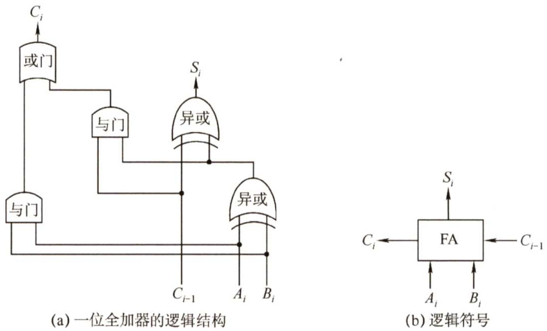  
图2.3一位全加器  

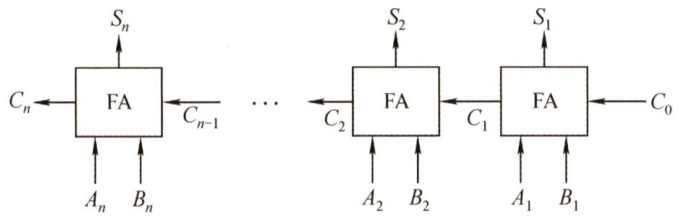  
图2.4 $n$ 位串行进位加法器  

图2.4中的加法器实现了两个 $n$ 位二进制数 $A=A_{n}A_{n-1}\cdots A_{1}$ 和 $B=B_{n}B_{n-1}\cdots B_{1}$ 逐位相加的功能，得到的二进制和为 $S=S_{n}S_{n-1}\cdots S_{1}$ ，进位输出为 $C_{n}$ 。例如，当 $A=11\cdots11$ ， $B=00^{\cdots01}$ 时，结果输出为 $S=00\cdots00$ 且 $C_{n}=1$ 。由于位数有限，高位自动丢失，所以实际是模 $2^{n}$ 的加法运算。  

在串行进位加法器中，低位运算产生进位所需的时间将影响高位运算的时间。因此，串行进位加法器的最长运算时间主要是由进位信号的传递时间决定的，位数越多延迟时间就越长，而全加器本身的求和延迟只为次要因素，所以加快进位产生和提高传递的速度是关键。  

#### 3.并行进位加法器  

令 $G_{i}=A_{i}B_{i}$ ， $P_{i}{=}A_{i}\oplus B_{i}$ ，全加器的进位表达式为  

式中，当 $A_{i}$ 与 $B_{i}$ 都为1时， $C_{i}=1$ ，即有进位信号产生，所以称 $A_{i}B_{i}$ 为进位产生函数（本地进位)，用 $G_{i}$ 表示。 $A_{i}\oplus B_{i}=1$ 且 $C_{i-1}=1$ 时， $C_{i}{=}1$ 。可视为 $A_{i}\oplus B_{i}=1$ ，第 $i-1$ 位的进位信号 $C_{i-1}$ 可以通过本位向高位传送。因此称 $A_{i}\oplus B_{i}$ 为进位传递函数（进位传递条件)，用 $P_{i}$ 表示。  

将 $G_{i}$ 和 $P_{i}$ 代入前面 $C_{1}{\sim}C_{4}$ 的公式，可得  

$$
C_{1}=G_{1}+P_{1}C_{0}
$$  

$$
C_{2}=G_{2}+P_{2}C_{1}=G_{2}+P_{2}G_{1}+P_{2}P_{1}C_{0}
$$  

$$
C_{3}=G_{3}+P_{3}C_{2}=G_{3}+P_{3}G_{2}+P_{3}P_{2}G_{1}+P_{3}P_{2}P_{1}C_{0}
$$  

$$
C_{4}=G_{4}+P_{4}C_{3}=G_{4}+P_{4}G_{3}+P_{4}P_{3}G_{2}+P_{4}P_{3}P_{2}G_{1}+P_{4}P_{3}P_{2}P_{1}C_{0}
$$  

从上述表达式可以看出， $C_{i}$ 仅与 $A_{i},\ B_{i}$ 及最低进位 $C_{0}$ 有关，相互间的进位没有依赖关系。只要$A_{1}{\sim}A_{4}$ 、 $B_{1}{\sim}B_{4}$ 和 $C_{0}$ 同时到达，就可几乎同时形成 $C_{1}{\sim}C_{4}$ ，并且同时生成各位的和。  

实现上述逻辑表达式的电路称为先行进位（也称超前进位）部件，简称CLA部件，如图2.5(a)所示。通过这种进位方式实现的加法器称为全先行进位加法器。因为各个进位是并行产生的，所以是一种并行加法器，如图2.5(b)所示。  

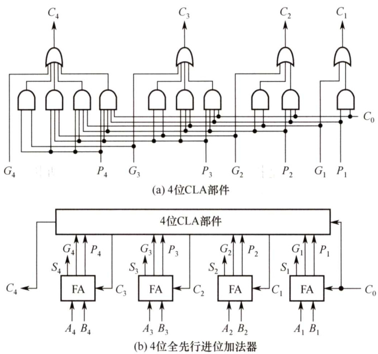  
图2.54位CLA部件和4位全先行进位加法器  

这种进位方式是快速的，与位数无关。但随着加法器位数的增加， $C_{i}$ 的逻辑表达式会变得越来越长，这会使电路结构变得很复杂。因此，当位数较多时采用全先行进位是不现实的。  

更多位数的加法器可通过将CLA 部件或全先行进位加法器串接起来实现。例如，对于16位加法器，可以分成4组，组内为4位先行进位，组间串行进位。为了进一步提高运算速度，也可以采用组内和组间都并行的进位方式。因为两级先行进位加法器组内和组间都采用先行进位方式，其延迟和加法器的位数没有关系。所以，通常采用两级或多级先行进位加法器。  

#### 4.带标志加法器  

无符号数加法器只能用于两个无符号数相加，不能进行带符号整数的加/减运算。为了能进行带符号整数的加/减运算，还需要在无符号数加法器的基础上增加相应的逻辑门电路，使得加法器不仅能计算和/差，还要能生成相应的标志信息。图2.6是带标志加法器的实现电路。  

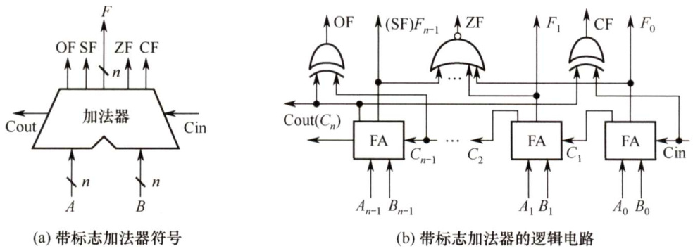  
图2.6用全加器实现 $n$ 位带标志加法器的电路  

在图 2.6 中，溢出标志的逻辑表达式为 $\mathrm{OF}=C_{n}\oplus C_{n-1}$ ；符号标志就是和的符号，即 $\mathrm{SF}= $ $F_{n-1}$ ；零标志 $Z\mathrm{F}=1$ 当且仅当 $F=0$ ；进位/借位标志 $\mathbf{CF}=C_{\mathrm{{out}}}\oplus C_{\mathrm{{in}}}$ ，即当 $C_{\mathrm{in}}=0$ 时，CF为进位$C_{\mathrm{out}}$ ，当 $C_{\mathrm{in}}=1$ 时，CF为进位 $C_{\mathrm{out}}$ 取反。  

值得注意的是，为了加快加法运算的速度，实际电路一定使用多级先行进位方式，图 2.6(b)是为了说明如何从加法运算结果中获得标志信息，因而使用全加器简化了加法器电路。  

#### 5.算术逻辑单元（ALU）  

ALU 是一种功能较强的组合逻辑电路，它能进行多种算术运算和逻辑运算。由于加、减、乘、除运算最终都能归结为加法运算，因此ALU的核心是带标志加法器，同时也能执行“与”“或”“非”等逻辑运算。ALU的基本结构如图2.7所示，其中 $A$ 和 $B$ 是两个 $n$ 位操作数输入端， $C_{\mathrm{in}}$ 是进位输入端，ALUop 是操作控制端，用来决定ALU 所执行的处理功能。例如，ALUop选择Add运算，ALU就执行加法运算，输出的结果就是 $A$ 加 $B$ 之和。ALUop的位数决定了操作的种类。例如，当位数为3时，ALU最多只有8种操作。  

图2.8给出了能够完成3种运算“与”“或”和“加法”的一位ALU结构图。其中，一位加法用一个全加器实现，在ALUop的控制下，由一个多路选择器（MUX）选择输出3种操作结果之一。这里有3种操作，所以ALUop至少要有两位。  

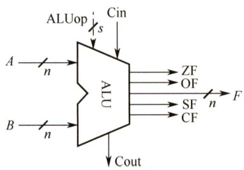  
图2.7ALU的基本结构  

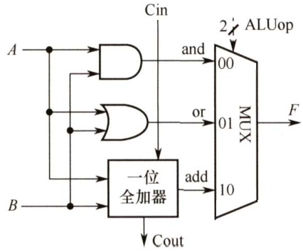  
图2.8一位ALU的结构  

同时，ALU也可以实现左移或右移的移位操作。  

注意：MUX是多路选择开关（多路选择器），它从多个输入信号中选择一个送到输出端。  

注意：如对电路基础知识不太熟悉，可参阅电路相关教材的基础部分。对此章电路内容亦不必过分深究，目前统考对电路的要求并不高，很少涉及。  

#### 2.2.2 定点数的移位运算  

#### 1．算术移位  

算术移位的对象是有符号数，在移位过程中符号位保持不变。  

对于正数，由于 $[x]_{\scriptscriptstyle|\mathscr{H}}=[x]_{\scriptscriptstyle|\mathscr{H}}=[x]_{\scriptscriptstyle|\mathscr{L}}=$ 真值，因此移位后出现的空位均以0添之。对于负数，由于原码、补码、反码的表示形式不同，因此当机器数移位时，对其空位的添补规则也不同。  

注意：不论是正数还是负数，移位后其符号位均不变，且移位后都相当于对真值补0。  

对于带符号数，左移一位若不产生溢出，相当于乘以2（与十进制的左移一位相当于乘以10类似)，右移一位，若不考虑因移出而舍去的末位尾数，相当于除以2。  

由表2.1可以得出如下结论。  

$\textcircled{1}$ 负数的原码数值部分与真值相同，因此在移位时只要使符号位不变，其空位均添0。  

表2.1不同机器数算术移位后的空位添补规则  

<html><body><table><tr><td></td><td>码制</td><td>添补代码</td></tr><tr><td>正数</td><td>原码、补码、反码</td><td>0</td></tr><tr><td rowspan="4">负数</td><td>原码</td><td>0</td></tr><tr><td rowspan="2">补码</td><td>左移添0</td></tr><tr><td>右移添1</td></tr><tr><td>反码</td><td>1</td></tr></table></body></html>  

$\textcircled{2}$ 负数的反码各位除符号位外与负数的原码正好相反，因此移位后所添的代码应与原码相反，即全部添1。  

$\textcircled{3}$ 分析由原码得到补码的过程发现，当对其由低位向高位找到第一个“1”时，在此“1”左边的各位均与对应的反码相同，而在此“1”右边的各位（包括此“1”在内）均与对应的原码相同。因此负数的补码左移时，因空位出现在低位，则添补的代码与原码相同，即添0；右移时因空位出现在高位，则添补的代码应与反码相同，即添1。  

#### 2.逻辑移位  

逻辑移位将操作数视为无符号数。  
移位规则：逻辑左移时，高位移丢，低位添0；逻辑右移时，低位移丢，高位添0。  

#### 3．循环移位  

循环移位分为带进位标志位CF 的循环移位（大循环）和不带进位标志位的循环移位（小循环)，过程如图2.9所示。  

循环移位的主要特点是，移出的数位又被移入数据中，而是否带进位则要看是否将进位标志位加入循环位移。例如，带进位位的循环左移，如图 2.9(d)所示，就是数据位连同进位标志位一起左移，数据的最高位移入进位标志位CF，而进位位则依次移入数据的最低位。  

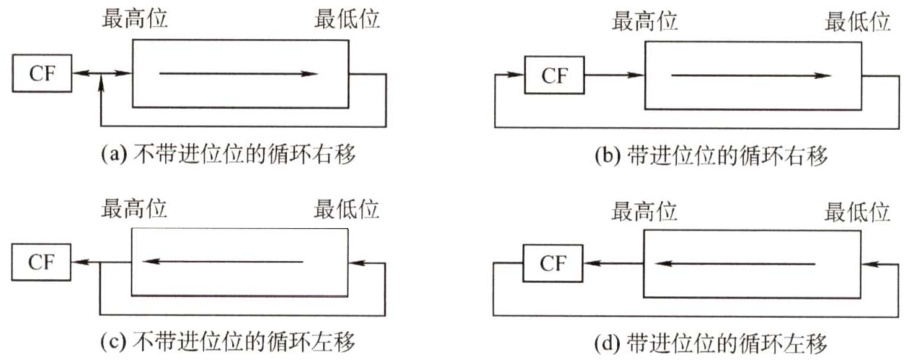  
图2.9 循环移位  

循环移位操作特别适合将数据的低字节数据和高字节数据互换。  

#### 2.2.3 定点数的加减运算  

事实上，在机器内部并没有小数点，只是人为约定了小数点的位置，小数点约定在最左边就是定点小数，小数点约定在最右边就是定点整数。因此，在运算过程中，可以不用考虑对应的定点数是小数还是整数，而只需关心它们的符号位和数值位即可。  

#### 1.补码的加减法运算  

补码加减运算规则简单，易于实现。补码加减运算的公式如下（设机器字长为 $n+1$ )。  

$$
\begin{array}{c}{{[A+B]_{*\}=[A]_{*\atop*}+[B]_{*\atop*}~(\mathrm{mod}~2^{n+1})}}\\ {{{}}}\\ {{{}[A-B]_{*\atop*}=[A]_{*\atop*}+[-B]_{*}~(\mathrm{mod}~2^{n+1})}}\end{array}
$$  

补码运算的特点如下。  

1）按二进制运算规则运算，逢二进一。  

2）若做加法，两数的补码直接相加；若做减法，则将被减数与减数的机器负数相加。  

3）符号位与数值位一起参与运算，加、减运算结果的符号位也在运算中直接得出。  
4）最终运算结果的高位丢弃，保留 $n{+}1$ 位，运算结果亦为补码。  

【例2.6】设机器字长为8位（含1位符号位）， $A=15$ ， $B=24$ ，求 $[A+B]_{*}$ 和 $[A-B]_{**}$ 。解：  
$A=+15=+0001111$ ， $B=+24=+0011000$ ；得 $[A]_{**}=00001111$ ， $[B]_{\ast\vert}=00011000$ 0求得 $[-B]_{*\mathrm{1}}=11101000$ 。所以  
$[A+B]_{\ast}=00001111+00011000=00100111,$ 符号位为0，对应真值为 $+39$ 。  
$[A-B]_{\ast}=[A]_{\ast}+[-B]_{\ast}=0001111+11101000=11110111$ ，符号位为1，对应真值为-9。  

#### 2.补码加减运算电路  

已知一个数的补码表示为Y，则这个数的负数的补码为 $\overline{{Y}}+1$ ，因此，只要在原加法器的Y输入端加 $n$ 个反向器以实现各位取反的功能，然后加一个2选1多路选择器，用一个控制端Sub来控制，以选择是将原码 $Y$ 输入加法器还是将 $\bar{Y}$ 输入加法器，并将控制端Sub同时作为低位进位送到加法器，如图2.10 所示。该电路可实现补码加减运算。当控制端Sub为1时，做减法，实现 $X+\overline{{{Y}}}+1=[x]_{*\}+[-y]_{*\}$ ；当控制端Sub为0时，做加法，实现 $X+Y=[x]_{\ast}+[y]_{\ast}$ 。  

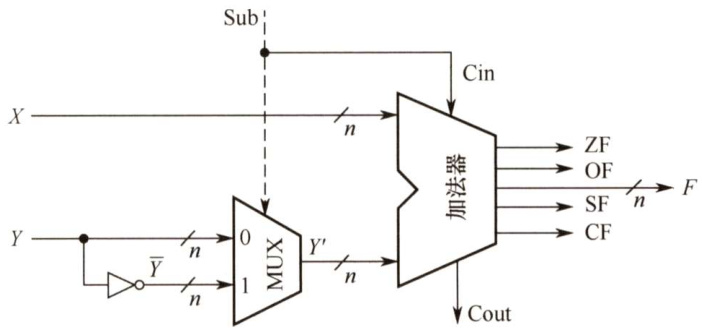  
图2.10补码加减运算部件  

图 2.10中的加法器是带标志加法器。无符号整数的二进制表示相当于正整数的补码表示，因此，该电路同时也能实现无符号整数的加/减运算。对于带符号整数 $x$ 和 $y$ ，图中 $X$ 和 $Y$ 分别是 $x$ 和 $y$ 的补码表示；对于无符号整数 $x$ 和 $y$ ，图中 $X$ 和 $Y$ 分别是 $x$ 和 $y$ 的二进制表示。  

可通过标志信息来区分带符号整数运算结果和无符号整数运算结果。  

零标志 $Z\mathrm{F}=1$ 表示结果F为0。不管对于无符号数还是带符号整数运算，ZF都有意义溢出标志 ${\mathrm{OF}}=1$ 表示带符号整数运算时发生溢出。对于无符号数运算，OF没有意义。  

符号标志SF表示结果的符号，即F的最高位。对于无符号数运算，SF没有意义。  

进/借位标志CF表示无符号整数运算时的进位/借位，判断是否发生溢出。加法时， $\mathrm{CF}=1$ 表示结果溢出，因此CF等于进位输出 $C_{\mathrm{out}}$ 。减法时， $\mathrm{CF}=1\$ 表示有借位，即不够减，故CF 等于进位输出 $C_{\mathrm{out}}$ 取反。综合可得 $\mathbf{CF}=\mathbf{Sub}\oplus C_{\mathrm{out}}$ 。对于带符号数运算，CF没有意义。  

#### 3.溢出判别方法  

仅当两个符号相同的数相加或两个符号相异的数相减才可能产生溢出，如两个正数相加，而结果的符号位却为1（结果为负)；一个负数减去一个正数，结果的符号位却为0（结果为正)。  

补码定点数加减运算溢出判断的方法有3种。  

（1）采用一位符号位由于减法运算在机器中是用加法器实现的，因此无论是加法还是减法，只要参加操作的两  

个数符号相同，结果又与原操作数符号不同，则表示结果溢出。  

设 $A$ 的符号为 $A_{\mathrm{s}}$ ， $B$ 的符号为 $B_{\mathrm{s}}$ ，运算结果的符号为 $S_{\mathrm{s}}$ ，则溢出逻辑表达式为  

$$
V=A_{\mathrm{s}}B_{\mathrm{s}}\overline{{S_{\mathrm{s}}}}+\overline{{A_{\mathrm{s}}}}\overline{{B_{\mathrm{s}}}}S_{\mathrm{s}}
$$  

若 $V=0$ ，表示无溢出；若 $V=1$ ，表示有溢出。  

（2）采用双符号位  

双符号位法也称模4补码。运算结果的两个符号位 $S_{\mathrm{sl}}S_{\mathrm{s2}}$ 相同，表示未溢出；运算结果的两个符号位 $S_{\mathrm{sl}}S_{\mathrm{s2}}$ 不同，表示溢出，此时最高位符号位代表真正的符号。  

符号位 $S_{\mathrm{sl}}S_{\mathrm{s2}}$ 的各种情况如下：  

$\textcircled{1}$ $S_{\mathrm{sl}}S_{\mathrm{s}2}=00$ ：表示结果为正数，无溢出。  

$\textcircled{2}$ $S_{\mathrm{sl}}S_{\mathrm{s}2}=01$ ：表示结果正溢出。  

$\textcircled{3}$ $S_{\mathrm{sl}}S_{\mathrm{s}2}=10$ ：表示结果负溢出。  

$\textcircled{4}$ $S_{\mathrm{sl}}S_{\mathrm{s}2}=11$ ：表示结果为负数，无溢出。  

溢出逻辑判断表达式为 $V{=}S_{\mathrm{sl}}\oplus S_{\mathrm{s}2}$ ，若 $V=0$ ，表示无溢出；若 $V=1$ ，表示有溢出。  

（3）采用一位符号位根据数据位的进位情况判断溢出  

若符号位的进位 $C_{\mathrm{s}}$ 与最高数位的进位 $C_{1}$ 相同，则说明没有溢出，否则表示发生溢出。溢出逻辑判断表达式为 $V=C_{s}\oplus C_{1}$ ，若 $V=0$ ，表示无溢出； $V=1$ ，表示有溢出。  

#### 4.原码的加减法运算（了解）  

设 $[X]_{\mathbb{H}}=x_{s}.x_{1}x_{2}\cdots x_{n}$ 和 $[Y]_{\scriptscriptstyle\mathscr{W}}=y_{\mathrm{s}}.y_{1}y_{2}\cdots y_{n}$ ，进行加减运算的规则如下。  

加法规则：先判符号位，若相同，则绝对值相加，结果符号位不变；若不同，则做减法，绝对值大的数减去绝对值小的数，结果符号位与绝对值大的数相同。  

减法规则：两个原码表示的数相减，首先将减数符号取反，然后将被减数与符号取反后的减数按原码加法进行运算。  

注意：运算时注意机器字长，当左边位出现溢出时，将溢出位丢掉。  

#### 2.2.4 定点数的乘除运算  

#### 1.定点数的乘法运算  

乘法运算由累加和右移操作实现，可分为原码一位乘法和补码一位乘法。  

（1）原码一位乘法  

原码一位乘法的特点是符号位与数值位是分开求的，乘积符号由两个数的符号位“异或”形成，而乘积的数值部分则是两个数的绝对值相乘之积。  

设 $[X]_{\mathcal{W}}=x_{s}.x_{1}x_{2}\cdots x_{n}$ ， $[Y]_{\scriptscriptstyle\mathscr{k}}=y_{\mathrm{s}}.y_{1}y_{2}\cdots y_{n}$ ，则运算规则如下：  

$\textcircled{1}$ 被乘数和乘数均取绝对值参加运算，看作无符号数，符号位为 $x_{\mathrm{s}}\oplus y_{\mathrm{s}}$ α$\textcircled{2}$ 部分积是乘法过程的中间结果。乘数的每一位 $y_{i}$ 乘以被乘数得 $X{\times}y_{i}$ 后，将该结果与前面所得的结果累加，就是部分积，初值为0。  

$\textcircled{3}$ 从乘数的最低位 $y_{n}$ 开始判断：若 $y_{n}=1$ ，则部分积加上被乘数 $|x|$ ，然后右移一位；若$y_{n}=0$ ，则部分积加上0，然后右移一位。  

$\textcircled{4}$ 重复步骤 $\textcircled{3}$ ，判断 $n$ 次。  

由于参与运算的是两个数的绝对值，因此运算过程中的右移操作均为逻辑右移。  

注意：考虑到运算过程中部分积和乘数做加法时，可能出现部分积大于1的情况（产生进位），但此刻并非溢出，所以部分积和被乘数取双符号位。  

【例2.7】设 $x=-0.1101$ ， $y=0.1011$ ，采用原码一位乘法求 $x\cdot y$ 6解： $|x|=00.1101$ ， $|y|=00.1011$ ，原码一位乘法的求解过程如下。  

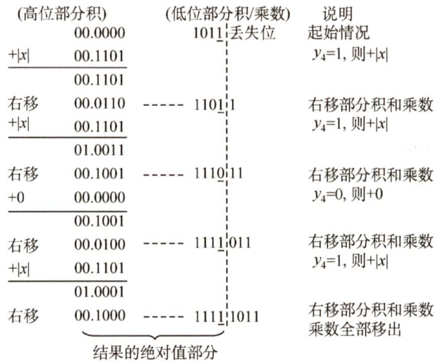  

符号位 $P_{\mathrm{s}}=x_{\mathrm{s}}\oplus y_{\mathrm{s}}=1\oplus0=1$ ，得 $x\bullet y=-0.10001111$ 。  

（2）无符号数乘法运算电路图2.11是实现两个32位无符号数乘法的逻辑结构图。  

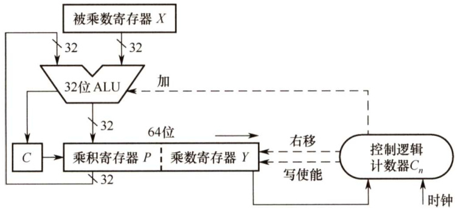  
图2.1132位无符号数乘法运算的逻辑结构图  

在图2.11中，部分积和被乘数 $X$ 做无符号数加法时，可能产生进位，因此需要一个专门的进位位 $c$ 。乘积寄存器 $P$ 初始时置0。计数器 $C_{n}$ 初值为32，每循环一次减1。ALU是乘法器核心部件，对乘积寄存器 $P$ 和被乘数寄存器 $X$ 的内容做“无符号加法”运算，运算结果送回寄存器 $P$ ，进位存放在 $c$ 中。每次循环都对进位位 $C$ 、乘积寄存器 $P$ 和乘数寄存器丫实现同步“逻辑右移”，此时，进位位 $c$ 移入寄存器 $P$ 的最高位，寄存器 $Y$ 的最低位移出。每次从寄存器Y移出的最低位都被送到控制逻辑，以决定被乘数是否“加”到部分积上。  

（3）补码一位乘法（Booth算法）  

这是一种有符号数的乘法，采用相加和相减操作计算补码数据的乘积。  

设 $[X]_{*}=x_{\mathrm{s}}.x_{1}x_{2}\cdots x_{n}$ ， $[Y]_{\ast\vert}=y_{\mathrm{s}}.y_{1}y_{2}\cdots y_{n}$ ，则运算规则如下：  

$\textcircled{1}$ 符号位参与运算，运算的数均以补码表示。  
$\textcircled{2}$ 被乘数一般取双符号位参与运算，部分积取双符号位，初值为0，乘数取单符号位。  
$\textcircled{3}$ 乘数末位增设附加位 $y_{n+1}$ ，初值为0。  
$\textcircled{4}$ 根据 $(\nu_{n},y_{n+1})$ 的取值来确定操作，见表2.2。  

表2.2Booth算法的移位规则  

<html><body><table><tr><td>yn（高位）</td><td>yn+1（低位）</td><td>操作</td></tr><tr><td>0</td><td>0</td><td>部分积右移一位</td></tr><tr><td>0</td><td>1</td><td>部分积加[X]补，右移一位</td></tr><tr><td>1</td><td>0</td><td>部分积加[-X]补，右移一位</td></tr><tr><td>1</td><td>1</td><td>部分积右移一位</td></tr></table></body></html>  

$\textcircled{5}$ 移位按补码右移规则进行。  

$\textcircled{6}$ 按照上述算法进行 $n+1$ 步操作，但第 $n+1$ 步不再移位（共进行 $n+1$ 次累加和 $n$ 次右移)，仅根据 $y_{n}$ 与 $y_{n+1}$ 的比较结果做相应的运算。  

【例2.8】设 $x=-0.1101$ ， $y=0.1011$ ，采用Booth 算法求 $x\cdot y$ 0解： $[x]_{**}=11.0011$ ， $[-x]_{*\mathrm{i}}=00.1101$ ， $[y]_{*\mathrm{l}}=0.1011$ 。Booth算法的求解过程如下。  

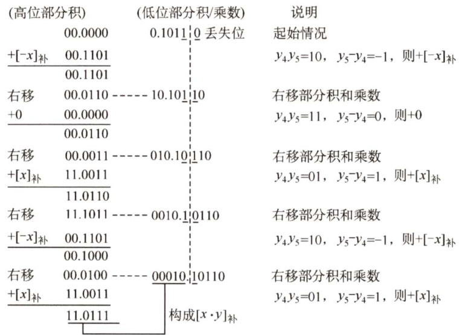  

所以 $[x\bullet y]_{*}=1.01110001$ ，得 $x\bullet y=-0.10001111$ o  

（4）补码乘法运算电路  

图 2.12是实现32位补码一位乘法的逻辑结构图，和图 2.11所示的逻辑结构很相似。因为是带符号数运算，不需要专门的进位位。每次循环，乘积寄存器 $P$ 和乘数寄存器丫实现同步“算术右移”，每次从寄存器Y移出的最低位和它的前一位来决定是- $[x]_{*}$ ， $+[\mathbf{x}]_{\ast\vert}$ 还是 $+0$ 。  

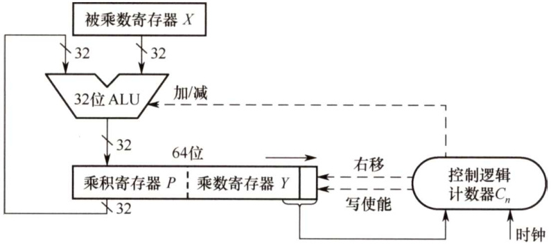  
图2.12补码一位乘法的逻辑结构图  

#### 2.定点数的除法运算  

除法运算可转换成“累加一左移”（逻辑左移)，分为原码除法和补码除法。  

（1）符号扩展  

在算术运算中，有时必须把带符号的定点数转换成具有不同位数的表示形式。例如，某个程序需要将一个8位整数与另外一个32位整数相加，要想得到正确的结果，在将8位整数与 32位整数相加之前，必须将8位整数转换成32位整数形式，这称为“符号扩展”。  

正数的符号扩展非常简单，即符号位不变，新表示形式的所有扩展位都用0进行填充。  

负数的符号扩展方法则根据机器数的不同而不同。原码表示负数的符号扩展方法与正数相同，只不过此时符号位为1。补码表示负数的符号扩展方法：原有形式的符号位移动到新形式的符号位上，新表示形式的所有附加位都用1（对于整数）或0（对于小数）进行填充。  

（1）原码除法运算（不恢复余数法）  

原码不恢复余数法也称原码加减交替除法。特点是商符和商值是分开进行的，减法操作用补码加法实现，商符由两个操作数的符号位“异或”形成。求商值的规则如下。  

设被除数 $[X]_{\scriptscriptstyle\vert\mathscr{G}}=x_{s}.x_{1}x_{2}\cdots x_{n}$ ，除数 $[Y]_{\mathbb{H}}=y_{\mathrm{s}}.y_{1}y_{2}\cdots y_{n}$ ，则  

$\textcircled{1}$ 商的符号： $Q_{\mathrm{s}}=x_{\mathrm{s}}\oplus y_{\mathrm{s}}$ o$\textcircled{2}$ 商的数值： $|Q|=|X|/|Y$ o求 $|{\cal Q}|$ 的不恢复余数法运算规则如下。  

$\textcircled{1}$ 先用被除数减去除数 $(|X|-|Y|=|X|+(-|Y|)=|X|+[-|Y|]_{*})$ ，当余数为正时，商上1，余数和商左移一位，再减去除数；当余数为负时，商上0，余数和商左移一位，再加上除数。$\textcircled{2}$ 当第 $n+1$ 步余数为负时，需加上Y得到第 $n+1$ 步正确的余数(余数与被除数同号)。  

【例2.9】设 $x=0.1011$ ， $y=0.1101$ ，采用原码加减交替除法求 $x/y$ 0  
解： $|x|=0.1011$ ， $\lvert\nu\rvert=0.1101$ ， $[\lvert\nu\rvert]_{*\mathrm{h}}=0.1101$ ， $[-|y|]_{*\mathrm{{i}}}=1.0011$ 8  

原码不恢复余数法的求解过程如下。  

<html><body><table><tr><td>被除数</td><td>商</td><td>说明</td></tr><tr><td>0.1011</td><td>0.0000</td><td>起始情况</td></tr><tr><td>+[-]补 1.0011</td><td></td><td>丨即+[-y]补</td></tr><tr><td>1.1110</td><td>0.0000</td><td>部分余数为负，商上0</td></tr><tr><td>左移 1.1100</td><td>0.00Q0</td><td>余数和商左移一位</td></tr><tr><td>+[ 0.1101</td><td></td><td>+</td></tr><tr><td>0.1001</td><td>0.0001</td><td>部分余数为正，商上1</td></tr><tr><td>左移 1.0010</td><td>0.0010</td><td>余数和商左移一位</td></tr><tr><td>+[-y]补 1.0011</td><td></td><td>即+[-y]补</td></tr><tr><td>0.0101</td><td>0.0011</td><td>部分余数为正，商上1</td></tr><tr><td>左移 0.1010</td><td>0.0110</td><td>余数和商左移一位</td></tr><tr><td>+[-y]补 1.0011</td><td></td><td>即+[-]补</td></tr><tr><td>1.1101</td><td>0.0110</td><td>部分余数为负，商上0</td></tr><tr><td>左移 1.1010</td><td>0.1100</td><td>余数和商左移一位</td></tr><tr><td>+[] 0.1101</td><td></td><td>+</td></tr><tr><td>0.0111</td><td>0.1101</td><td>部分余数为正，商上1</td></tr><tr><td>↑</td><td>←</td><td></td></tr><tr><td>余数</td><td>商</td><td></td></tr></table></body></html>  

因此 $Q_{\mathrm{s}}=x_{\mathrm{s}}\oplus y_{\mathrm{s}}=0\oplus0=0$ ，得 $x/y=+0.1101$ ，余 $0.0111\times2^{-4}$ （3）补码除法运算（加减交替法）  

补码一位除法的特点是，符号位与数值位一起参加运算，商符自然形成。除法第一步根据被除数和除数的符号决定是做加法还是减法；上商的原则根据余数和除数的符号位共同决定，同号上商“1”，异号上商 ${}^{\mathfrak{a}}0^{\mathfrak{n}}$ ；最后一步商恒置“1”。  

加减交替法的规则如下：  

$\textcircled{1}$ 符号位参加运算，除数与被除数均用补码表示，商和余数也用补码表示。$\textcircled{2}$ 若被除数与除数同号，则被除数减去除数；若被除数与除数异号，则被除数加上除数。$\textcircled{3}$ 若余数与除数同号，则商上1，余数左移一位减去除数；若余数与除数异号，则商上0，余数左移一位加上除数。  

$\textcircled{4}$ 重复执行第 $\textcircled{3}$ 步操作 $n$ 次。  

$\textcircled{5}$ 若对商的精度没有特殊要求，则一般采用“末位恒置1”法。  

【例2.10】设 $x=0.1000$ ， $y=-0.1011$ ，采用补码加减交替法求 $x/y$ 6  

解：采用两位符号表示， $[x]_{\scriptscriptstyle\textsl{\vert\vec{x}\vert}}=\ 00.1000$ ，则 $[x]_{*\mathrm{i}}=00.1000$ 。 $[y]_{\scriptscriptstyle\mathrm{\mathscr{E}}}=11.1011$ ，则[] $_{\ast\vert}=$ 11.0101， $[-y]_{*\mathrm{i}}=00.1011$ 。补码加减交替法的求解过程如下。  

<html><body><table><tr><td></td><td>被除数</td><td>商</td><td>说明</td></tr><tr><td></td><td>00.1000</td><td>0.0000</td><td>起始情况</td></tr><tr><td>+[补</td><td>11.0101</td><td></td><td>[x]补、[补异号，则+[补</td></tr><tr><td></td><td>11.1101</td><td>0.0001</td><td>部分余数与[补同号，则商上1</td></tr><tr><td>左移</td><td>11.1010</td><td>0.0010</td><td>左移一位</td></tr><tr><td>+[-y]补</td><td>00.1011</td><td></td><td>+[-y补</td></tr><tr><td></td><td>00.0101</td><td>0.0010</td><td>部分余数与[补异号，则商上0</td></tr><tr><td>左移</td><td>00.1010</td><td>0.0100</td><td>左移一位</td></tr><tr><td>+[补</td><td>11.0101</td><td></td><td>+[补</td></tr><tr><td></td><td>11.1111</td><td>0.0101</td><td>部分余数与[补同号，则商上1</td></tr><tr><td>左移</td><td>11.1110</td><td>0.1010</td><td>左移一位</td></tr><tr><td>+[-y补</td><td>00.1011</td><td></td><td>+[-y补</td></tr><tr><td></td><td>00.1001</td><td>0.1010</td><td>部分余数与[补异号，则商上0</td></tr><tr><td>左移</td><td>01.0010</td><td>1.0100</td><td>左移一位</td></tr><tr><td>+[补</td><td>11.0101</td><td></td><td>+[补</td></tr><tr><td></td><td>00.0111</td><td>1.0101</td><td>末位恒置1</td></tr><tr><td></td><td>↑</td><td></td><td></td></tr><tr><td></td><td>余数</td><td>商</td><td></td></tr></table></body></html>  

所以有 $[x/y]_{\ast\}=1.0101$ ，余 $0.0111\times2^{-4}$  

由例 2.9和例2.10可知， $n$ 位定点数的除法运算，实际上是用一个 $2n$ 位的数去除以一个 $n$ 位的数，得到一个 $n$ 位的商，因此需要对被除数进行扩展。对于 $n$ 位定点正小数，只需在被除数低位添 $n$ 个0即可。对于 $n$ 位无符号数或定点正整数，只需在被除数高位添 $n$ 个0即可。  

#### （4）除法运算电路  

图2.13是一个32位除法逻辑结构图，它和乘法逻辑结构也很相似。  

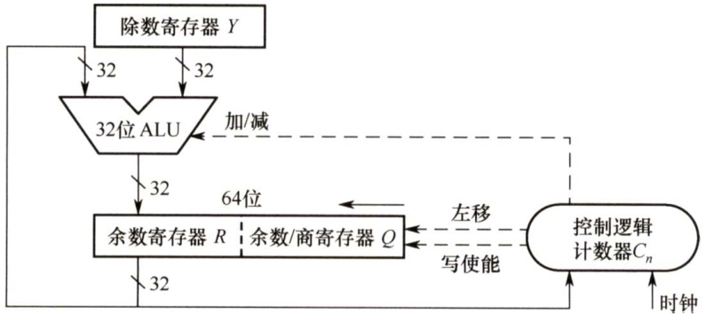  
图2.1332位除法运算的逻辑结构图  

初始时，寄存器 $R$ 存放扩展被除数的高位部分，寄存器 $\varrho$ 存放扩展被除数的低位部分。ALU是除法器核心部件，对余数寄存器 $R$ 和除数寄存器 $Y$ 的内容做加/减运算，运算结果送回寄存器 $R$ 。每次循环，寄存器 $R$ 和 $\varrho$ 实现同步左移，左移时， $\boldsymbol{\mathcal{Q}}$ 的最高位移入R 的最低位， $\varrho$ 中空出的最低位被上商。每次由控制逻辑根据ALU运算结果的符号来决定上商是0还是1。  

#### 2.2.5C语言中的整数类型及类型转换  

统考大纲要求考生具有对高级程序设计语言（如C 语言）中相关问题进行分析的能力，而  

C语言变量之间的类型转换是统考中经常出现的题目，需要读者深入掌握这一内容。  

#### 1．有符号数和无符号数的转换  

C 语言允许在不同的数据类型之间做强制类型转换，而从数学的角度来说，可以想到很多不同的转换规则。就用户使用而言，对于两者都能表示的数，当然希望转换过程中数值本身不发生任何变化，而那些转换过后无法表示的数呢？请先观察如下这段程序：  

int main（）{   
short $x=-4321$ ·   
unsigned short $y=$ (unsigned short)x; printf( $\because x=\frac{0}{0}d$ y=u\n",x,y);  

有符号数 $\textbf{x}$ 是一个负数，而无符号数y的表示范围显然不包括 $\textbf{x}$ 的值。读者可以自己猜想一下这段程序的运行结果，再比较下面给出的运行结果。  

在采用补码的机器上，上述代码会输出如下结果：  

$$
\mathbf{x}=-4321,\mathbf{y}=61215
$$  

最后的结果中，得到的y值似乎与原来的 $\textbf{x}$ 没有一点关系。不过将这两个数化为二进制表示时，我们就会发现其中的规律，如表2.3所示。  

表2.3y与 $\textbf{x}$ 的对比  

<html><body><table><tr><td>变量</td><td>值</td><td colspan="16">位</td></tr><tr><td></td><td></td><td>15</td><td>14</td><td>13</td><td>12</td><td>11 10</td><td>9</td><td>8</td><td>7</td><td>6</td><td>5</td><td>4</td><td>3</td><td>2</td><td>1</td><td>0</td></tr><tr><td>X</td><td>-4321</td><td>1</td><td>1</td><td>1</td><td>0</td><td>1</td><td>1</td><td>1 1</td><td>0</td><td>0</td><td>0</td><td>1</td><td>1</td><td>1</td><td></td><td>1</td></tr><tr><td>y</td><td>61215</td><td>1</td><td>1</td><td>1</td><td>0</td><td>1</td><td>1</td><td>1 1</td><td>0</td><td>0</td><td>0</td><td>1</td><td>1</td><td>1</td><td>1</td><td>1</td></tr></table></body></html>  

其中 $\textbf{x}$ 为补码表示，y为无符号的二进制真值。观察可知，将shortint强制转换为unsignedshort 只改变数值，而两个变量对应的每位都是一样的。通过这个例子就可以知道，强制类型转换的结果保持位值不变，仅改变了解释这些位的方式。  

下面再来看一个unsignedshort型转换到short型的例子。考虑如下代码：  

int main（）   
unsigned short $x=65535$ ：   
short $y=$ (short)x;   
printf( $\because x=\frac{0}{0}u$ ， $y=\frac{0}{0}$ d\n"，x,y）;  

同样在采用补码的机器上，上述代码会输出以下结果：  

$\mathbf{x}=65535,\mathbf{y}=-1$ 同样可以把这两个数用之前的方法写成二进制，然后证实我们之前得出的结论。  

#### 2.不同字长整数之间的转换  

另一种常见的运算是在不同字长的整数之间进行数值转换。先观察如下程序：  

int main（）   
int $x=165537$ ， $u=-34991$ · //int型占用4B short $y=$ (short)x, $\boldsymbol{\mathsf{v}}=$ (short)u; //short型占用2B printf( $\because x=\frac{0}{0}d$ ，y=d\n"，x,y）;   
printf( $\because a=\frac{0}{0}d$ ， $\boldsymbol{\mathsf{v}}=$ d\n"，u,v）;   
}  

这段程序可以得到如下结果：  

$\mathbf{x}=165537,\mathbf{y}=-31071$ $\mathrm{u}=-34991,\mathrm{v}=30545$  

其中x、y、u、V的十六进制表示分别为0x000286al、0x86al、0xff7751、0x7751，观察上述数字很容易得出结论，当大字长变量向小字长变量强制类型转换时，系统把多余的高位部分直接截断，低位直接赋值，因此也是一种保持位值的处理方法。  

最后来看小字长变量向大字长变量转换的情况。先观察下面这段程序：  

int main（）   
short $x=-4321$   
int $y=x$ ：   
unsigned short $u=$ (unsigned short)x; unsigned int $v=u$ .   
printf( $\because x=\frac{0}{0}d$ 、 $y=\frac{0}{0}d\ln^{n}$ ，x，y）;   
printf( $\because u=\frac{0}{0}u$ ， $v=\frac{0}{6}u\ln"$ ，u,v);   
}  

运行结果如下：  

$\mathbf{x}=-4321,\mathbf{y}=-4321$ $\mathbf{u}=61215,\mathbf{v}=61215$  

x、y、u、V 的十六进制表示分别是Oxeflf、0xffeflf、0xeflf、0x0000eflf。由本例可知，短字长整数到长字长整数的转换时，不仅要使相应的位值相等，还要对高位部分进行扩展。如果原数字是无符号整数，则进行零扩展，扩展后的高位部分用0填充。否则进行符号扩展，扩展后的高位部分用原数字符号位填充。其实两种方式扩展的高位部分都可理解为原数字的符号位。这与之前的三个举例都不一样，从位值与数值的角度说，前三个举例的转换规则都是保证相应的位值相等，而短字长到长字长的转换，符号位，可以理解为数值的相等。  

注意，char类型为8位无符号整数，其在转换为int时高位补0即可。  

#### 2.2.6 数据的存储和排列  

#### 1。数据的“大端方式”和“小端方式”存储  

在存储数据时，数据从低位到高位可以按从左到右排列，也可以按从右到左排列。因此，无法用最左或最右来表征数据的最高位或最低位，通常用最低有效字节（LSB）和最高有效字节（MSB）来分别表示数的低位和高位。例如，在32 位计算机中，一个int 型变量i的机器数为 $01234567\mathrm{H}$ ，其最高有效字节 $\mathbf{MSB}=01\mathbf{H}$ ，最低有效字节 $\mathrm{LSB}=67\mathrm{H}$ 。  

现代计算机基本上都采用字节编址，即每个地址编号中存放1字节。不同类型的数据占用的字节数不同，int和float型数据占4字节，double 型数据占8字节等，而程序中对每个数据只给定一个地址。假设变量i的地址为 $08\ 00\mathrm{H}$ ，字节01H、 $23\mathrm{H}$ 、45H、67H应该各有一个内存地址，那么地址 $0800\mathrm{H}$ 对应4字节中哪字节的地址呢？这就是字节排列顺序问题。  

多字节数据都存放在连续的字节序列中，根据数据中各字节在连续字节序列中的排列顺序不同，可以采用两种排列方式：大端方式（big endian）和小端方式（littleendian），如图2.14所示。  

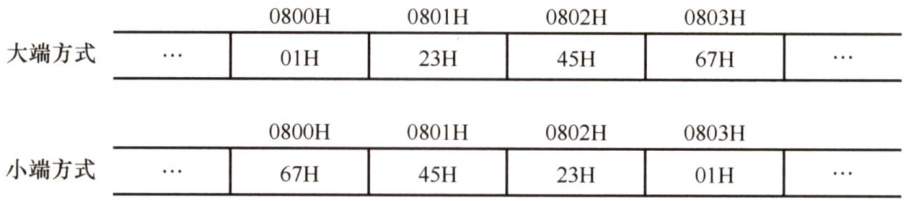  
图2.14采用大端方式和小端方式存储数据  

大端方式按从最高有效字节到最低有效字节的顺序存储数据，即最高有效字节存放在前面;小端方式按从最低有效字节到最高有效字节的顺序存储数据，即最低有效字节存放在前面。  

在检查底层机器级代码时，需要分清各类型数据字节序列的顺序，例如以下是由反汇编器（汇编的逆过程，即将机器代码转换为汇编代码）生成的一行机器级代码的文本表示：  

4004d3:01 05 64 94 0408 add%eax，0x8049464其中，“4004d3”是十六进制表示的地址，‘ $^{\cdot}01054306200^{\cdot\prime}$ 是指令的机器代码，“add%eax，0x8049464”是指令的汇编形式，该指令的第二个操作数是一个立即数0x8049464。执行指令时，从指令代码的后4字节中取出该立即数，立即数存放的字节序列为64H、94H、04H、08H，正好与操作数的字节顺序相反，即采用的是小端方式存储，得到08049464H，去掉开头的0，得到值0x8049464，在阅读小端方式存储的机器代码时，要注意字节是按相反顺序显示的。  

#### 2．数据按“边界对齐”方式存储  

假设存储字长为32位，可按字节、半字和字寻址。对于机器字长为32位的计算机，数据以边界对齐方式存放，半字地址一定是2的整数倍，字地址一定是4的整数倍，这样无论所取的数据是字节、半字还是字，均可一次访存取出。所存储的数据不满足上述要求时，通过填充空白字节使其符合要求。这样虽然浪费了一些存储空间，但可提高取指令和取数的速度。  

数据不按边界对齐方式存储时，可以充分利用存储空间，但半字长或字长的指令可能会存储在两个存储字中，此时需要两次访存，并且对高低字节的位置进行调整、连接之后才能得到所要的指令或数据，从而影响了指令的执行效率。  

例如，“字节1、字节2、字节3、半字1、半字2、半字3、字1”的数据按序存放在存储器中，按边界对齐方式和不对齐方式存放时，格式分别如图2.15和图2.16所示。  

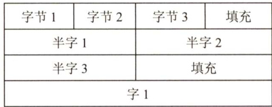  
图2.15边界对齐方式  

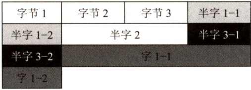  
图2.16边界不对齐方式  

边界对齐方式相对边界不对齐方式是一种空间换时间的思想。精简指令系统计算机RISC通常采用边界对齐方式，因为对齐方式取指令时间相同，因此能适应指令流水。  

#### 2.2.7 本节习题精选  

#### 一、单项选择题  

01．并行加法器中，每位全和的形成除与本位相加二数数值位有关外，还与（）有关。  

A．低位数值大小 B．低位数的全和C．高位数值大小 D.低位数送来的进位  

02.ALU作为运算器的核心部件，其属于（）。  

A．时序逻辑电路B．组合逻辑电路 C.控制器 D.寄存器  

03.在串行进位的并行加法器中，影响加法器运算速度的关键因素是（）。  

A.门电路的级延迟 B.元器件速度C.进位传递延迟 D.各位加法器速度的不同  

04.加法器中每位的进位生成信号 $g$ 为（）。  

A. $X_{i}\oplus Y_{i}$ B. $X_{i}Y_{i}$ C. $X_{i}Y_{i}C_{i}$ D. $X_{i}+Y_{i}+C_{i}$ 

05．组成一个运算器需要多个部件，但下面的（）不是组成运算器的部件。  

A．状态寄存器 B．数据总线 C. ALU D.地址寄存器  

06.算术逻辑单元（ALU）的功能一般包括（）。  

A．算术运算 B．逻辑运算 C．算术运算和逻辑运算 D．加法运算  

07.加法器采用并行进位的目的是（）。  

A.增强加法器功能 B.简化加法器设计C.提高加法器运算速度 D．保证加法器可靠性  

08.补码定点整数01010101左移两位后的值为（）。  

A．0100 0111 B.01010100 C.0100 0110 D. 0101 0101  

09．补码定点整数10010101右移一位后的值为（）。  

A.0100 1010 B.010010101 C. 1000 1010 D. 11001010  

10．一个8位寄存器内的数值为11001010，进位标志寄存器C为0，若将此8位寄存器循环左移（不带进位位）1位，则该8位寄存器和标志寄存器内的数值分别为（）。  

A．10010100 1 B．10010101 0 C． 10010101 1 D. 10010100 0  

11．设机器数字长8位（含1位符号位），若机器数BAH为原码，算术左移1位和算术右移1位分别得（）  

A.F4H,EDH B.B4H,6DH C.F4H,9DH D.B5H,EDH  

12．若机器数BAH为补码，其余条件同上题，则有（）  

A.F4H,DDH B.B4H,6DH C. F4H,9DH D.B5H,EDH  

13.16位补码0x8FA0扩展为32位应该是（）。  

A.0x00008FA0 B.0xFFFF 8FA0 C.OxFFFFFFAO D. 0x8000 8FA0  

14．在定点运算器中，无论是采用双符号位还是采用单符号位，必须有（）。  

A．译码电路，它一般用“与非”门来实现B．编码电路，它一般用“或非”门来实现C．溢出判断电路，它一般用“异或”门来实现D．移位电路，它一般用“与或非”门来实现  

15．关于模4补码，下列说法正确的是（）。  

A.模4补码和模2补码不同，它更容易检查乘除运算中的溢出问题  
B．每个模4补码存储时只需一个符号位  
C．存储每个模4补码需要两个符号位  
D．模4补码，在算术与逻辑部件中为一个符号位  

16．若采用双符号位，则两个正数相加产生溢出的特征时，双符号位为（）。  

A. 00 B.01 C.10 D.11  

17．判断加减法溢出时，可采用判断进位的方式，若符号位的进位为 $C_{0}$ ，最高位的进位为$C_{1}$ ，则产生溢出的条件是（）。  

I. $C_{0}$ 产生进位 II. $C_{1}$ 产生进位III. $C_{0}$ ， $C_{1}$ 都产生进位 IV. $C_{0}$ ， $C_{1}$ 都不产生进位V. $C_{0}$ 产生进位， $C_{1}$ 不产生进位VI. $C_{0}$ 不产生进位， $C_{1}$ 产生进位  

A.I和II B.II C. IV D.V和VI  

18．在补码的加减法中，用两位符号位判断溢出，两位符号位 $S_{\mathrm{sl}}S_{\mathrm{s}2}=10$ 时，表示（）。  

A．结果为正数，无溢出 B.结果正溢出C.结果负溢出 D.结果为负数，无溢出  

19.若 $[X]_{*\vdash}=X_{0}.X_{1}X_{2}\cdots X_{n}$ ，其中 $X_{0}$ 为符号位， $X_{1}$ 为最高数位。若（），则当补码左移时，将会发生溢出。  

A. $X_{0}=\mathbf{X}_{1}$ B. $X_{0}\neq X_{1}$ C. $X_{1}=0$ D.X=1  

20.原码乘法是（）。  

A.先取操作数绝对值相乘，符号位单独处理B．用原码表示操作数，然后直接相乘C.被乘数用原码表示，乘数去绝对值，然后相乘D.乘数用原码表示，被乘数去绝对值，然后相乘  

21.x、 $y$ 为定点整数，其格式为1位符号位、 $n$ 位数值位，若采用补码一位乘法实现乘法运算，则最多需要（）次加法运算。  

A.n-1 B.n C. $n+1$ D. $n+2$  

22．在原码一位乘法中，（）。  

A．符号位参加运算  
B．符号位不参加运算  
C．符号位参加运算，并根据运算结果改变结果中的符号位D.符号位不参加运算，并根据运算结果确定结果中的符号  

23．原码乘法时，符号位单独处理乘积的方式是（）。  

A．两个操作数符号相“与” B.两个操作数符号相“或”C．两个操作数符号相“异或” D.两个操作数中绝对值较大数的符号  

24.实现 $N$ 位（不包括符号位）补码一位乘时，乘积为（）位。  

A.N B. $N+1$ C.2N D. $2N+1$  

5．在原码不恢复余数法（又称原码加减交替法）的算法中，（）。  

A．每步操作后，若不够减，则需恢复余数B．若为负商，则恢复余数C．整个算法过程中，从不恢复余数D．仅当最后一步不够减时，才恢复一次余数  

26．下列关于补码除法的说法中，正确的是（）。  

A.补码不恢复除法中，够减商0，不够减商1  
B．补码不恢复余数除法中，异号相除时，够减商0，不够减商1  
C.补码不恢复除法中，够减商1，不够减商0  
D．以上都不对  

27．下列关于各种移位的说法正确的是（）。  

I．假设机器数采用反码表示，当机器数为负时，左移时最高数位丢0，结果出错；右移时最低数位丢0，影响精度II．在算术移位的情况下，补码左移的前提条件是其原最高有效位与原符号位要相同II．在算术移位的情况下，双符号位的移位操作只有低符号位需要参加移位操作  

A.I、III B.仅Ⅱ C.只有II D.I、Ⅱ、III  

28．在按字节编址的计算机中，若数据在存储器中以小端方案存放。假定int型变量i的址为08000000H，i的机器数为01234567H，地址08000000H单元的内容是（）  

A.01H B.23H C. 45H D. 67H  

29．某计算机字长为8位，CPU中有一个8位加法器。已知无符号数 $x=69$ ， $y=38$ ，如果在该加法器中计算 $x-y$ ，则加法器的两个输入端信息和输入的低位进位信息分别为（）。  

A.0100 0101、00100110、0 B.01000101、11011001、1  
C.0100 0101、11011010、0 D.0100 0101、11011010、1  

30．某计算机中有一个8位加法器，带符号整数 $x$ 和y的机器数用补码表示， $[x]_{\ast\mathrm{I}}=\mathrm{F}5\mathrm{H}$ $[y]_{\ast\mathrm{h}}=7\mathrm{EH}$ ，如果在该加法器中计算 $x-y$ ，则加法器的低位进位输入信息和运算后的溢出标志OF分别是（）。  

A.1、1 B.1、0 C.0、1 D.0、0  

31．某8位计算机中， $x$ 和 $y$ 是两个带符号整数，用补码表示， $[x]_{\ast\mathrm{h}}=44\mathrm{H}$ ， $[y]_{\ast\mathrm{k}}=\mathrm{DCH}$ 则 $x/2+2y$ 的机器数及相应的溢出标志OF分别是（）。  

A.CAH、0 B.CAH、1 C.DAH、0 D.DAH、1  

32.【2009统考真题】一个C语言程序在一台32位机器上运行。程序中定义了三个变量x、y、z，其中 $\mathbf{x}$ 和 $\textbf{z}$ 为int型，y为 short型。当 $\mathbf{x}=127$ ， $\mathbf{y}=-9$ 时，执行赋值语句z$\mathbf{\tau}=\mathbf{x}+\mathbf{y}$ 后，X、y、z的值分别是（）。  

A. $\mathbf{x}=00000007\mathrm{FH}$ $\mathbf{y}=\mathrm{FFF9H}$ ， $\mathbf{z}=00000076\mathrm{H}$ B. $\mathbf{x}=00000007\mathrm{FH}$ ， $\mathbf{y}=\mathrm{FFF9H}$ ， $\mathbf{z}=\mathrm{FFFF}0076\mathrm{H}$ C. $\mathbf{x}=00000007\mathrm{FH}$ ， $\mathbf{y}=\mathrm{FFF7H}$ ， $\mathbf{z}=\mathrm{FFFF}0076\mathrm{H}$ D. $\mathbf{x}=00000007\mathrm{FH}$ $\mathbf{y}=\mathrm{FFF7H}$ ， $\mathbf{z}=000000076\mathrm{H}$  

33.【2010统考真题】假定有4个整数用8位补码分别表示： $r_{1}=\mathrm{FEH}$ ， $r_{2}=\mathrm{F}2\mathrm{H}$ 、 $r_{3}=90\mathrm{H}$ $r_{4}=\mathrm{F}8\mathrm{H}$ ，若将运算结果存放在一个8位寄存器中，则下列运算会发生溢出的是（）。  

A. $r_{1}{\times}r_{2}$ B. $r_{2}{\times}r_{3}$ C. $r_{1}{\times}r_{4}$ D. $r_{2}{\times}r_{4}$  

34.【2012统考真题】某计算机存储器按字节编址，采用小端方式存放数据。假定编译器规定int和short型长度分别为32位和16位，并且数据按边界对齐存储。某C语言程序段如下：  

struct{ int a;   
char b;   
short c;   
}record;   
record. $a=273$ .  

若record变量的首地址为 $0\mathbf{x}C008$ ，地址 $0\mathbf{x}C008$ 中的内容及record.c的地址分别为（）。  

A.0x00、 $\boldsymbol{0}\mathrm{xC}00\mathrm{D}$ B.0x00、 $0\mathrm{xC00E}$ C.0x11、0xC00DD.0x11、0xC00E  

35.【2012统考真题】假定编译器规定int和short类型长度分别为32位和16位，执行下列C语言语句：  

unsigned short $\times=65530$ . unsigned int $y=x$  

得到y的机器数为（）。  

A.00007FFAH B.0000FFFAH C.FFFF 7FFAH D.FFFFFFFAH  

36.【2013统考真题】某字长为8位的计算机中，已知整型变量 $x$ $y$ 的机器数分别为 $[x]_{\ast\vdash}=$ 1 1110100， $[y]_{*\mathrm{i}}=1\ 0110000$ 。若整型变量 $z=2x+y/2$ ，则 $z$ 的机器数为（）。  

A.11000000 B.00100100 C.10101010 D.溢出  

37.【2014统考真题】若 $x=103$ ， $y=-25$ ，则下列表达式采用8位定点补码运算实现时，会发生溢出的是（）。  

A. $x+y$ B. $-x+y$ C.x-y D. -x-y  

38.【2016统考真题】有如下C语言程序段：  

short si $=-32767$ unsigned short usi $\L=$ si;  

执行上述两条语句后，usi的值为（）。  

A.-32767 B.32767 C.32768 D.32769  

39.【2016统考真题】某计算机字长为32位，按字节编址，采用小端方式存放数据。假定有一个double型变量，其机器数表示为1122334455667788H，存放在 $0000~8040\mathrm{H}$ 开始的连续存储单元中，则存储单元 $00008046\mathrm{H}$ 中存放的是（）。  

A.22H B.33H C.77H D. 66H  

40.【2018统考真题】假定有符号整数采用补码表示，若int型变量 $\textbf{x}$ 和y的机器数分别是FFFFFFDFH和 $000000041\mathrm{H}$ ，则 $\mathbf{x}$ 、y的值及 $\mathbf{x}-\mathbf{y}$ 的机器数分别是（）。  

A. $\mathbf{\Deltax}=-65$ ， $\mathbf{y}=41$ ,x-y的机器数溢出 B. $\mathbf{x}=-33$ $\mathbf{y}=65$ ,X-y的机器数为FFFFFF9DH C. $\mathbf{x}=-33$ $\mathbf{y}=65$ ,X-y的机器数为FFFFFF9EH D. $\mathbf{\Deltax}=-65$ $\mathbf{y}=41$ ,X-y的机器数为FFFFFF96H  

41.【2018统考真题】某32位计算机按字节编址，采用小端方式。若语句“int $\dot{\mathbf{i}}=0$ ；”对应指令的机器代码为 $^{\mathrm{{c}}}\mathrm{{C}}745\mathrm{{FC}}000000000^{\mathrm{{,}}}$ ，则语句‘ $\mathrm{\dot{\mt}}\mathrm{\dot{i}}=-64$ ；”对应指令的机器代码是（）。  

A.C745FCC0FFFFFF B.C745FC0CFFFFFF C.C745FCFFFFFFC0 D.C745FCFFFFFF0C  

42.【2018统考真题】整数x的机器数为11011000，分别对 $\textbf{x}$ 进行逻辑右移1位和算术右移1位操作，得到的机器数各是（）。  

A．11101100、1110 1100 B．0110 1100、11101100  
C.11101100、01101100 D.0110 1100、 01101100  

43.【2018统考真题】减法指令“subR1,R2,R3”的功能为“(R1）- $(\mathbf{R}2)\substack{\rightarrow\mathbf{R}3}^{\prime\prime}$ ，该指令执行后将生成进位/借位标志CF和溢出标志OF。若(R1) $\mathbf{\Sigma}=\mathbf{\Sigma}$ FFFF FFFFH，(R2 $)=\mathrm{Fl}$ FFFFFFOH，则该减法指令执行后，CF与OF分别为（）。  

A. $\mathrm{CF}=0,\mathrm{OF}=0$ B. ${\mathrm{CF}}=1,{\mathrm{OF}}=0$   
C. $\mathrm{CF}=0$ D ${\mathrm{OF}}=1$ D. $\mathrm{CF}=1,\mathrm{OF}=1$  

44.【2019统考真题】考虑以下C语言代码：unsigned short usi $\c=$ 65535;short si $\L=$ usi;  

执行上述程序段后，si的值是（）。  

A.-1 B.-32767 C. -32768 D.-65535  

45.【2020统考真题】在按字节编址，采用小端方式的32位计算机中，按边界对齐方式为以下C语言结构型变量a分配存储空间。  

struct record{ short x1; int x2;  

若a的首地址为2020FE00H，a的成员变量x2的机器数为12340000H，则其中34H所在存储单元的地址是（）。  

A.2020FE03H B.2020FE04H C.2020FE05H D. 2020FE06H  

#### 二、综合应用题  

01．已知32位寄存器R1中存放的变量 $x$ 的机器码为 $800000004\mathrm{H}$ ，请问：  

1）当 $x$ 是unsignedint类型时， $x$ 的真值是多少 $x/2$ 的真值是多少$x/2$ 存放在R1中的机器码是什么 $\ 2x$ 的真值是多少 $\\ 2x$ 存放在R1中的机器码是什么？  
2）当 $x$ 是int类型时，乘除法采用移位操作， $x$ 的真值是多少 $x/2$ 的真值是多少？ $x/2$ 存放在R1中的机器码是什么？ $2x$ 的真值是多少 $\\ 2x$ 存放在R1中的机器码是什么？  

02.【2011统考真题】假定在一个8位字长的计算机中运行如下C程序段：  

unsigned int $x=134$ .   
unsigned int $y=246$ ·   
int $\scriptstyle{\mathfrak{m}}=\mathbf{x}$ ：   
int $\scriptstyle\mathrm{n=y}$   
unsigned int $21=x-y$   
unsigned int $22=x$ $^+$ Y; int $k1=m-n$ .   
int $k2=m+n$ .  

若编译器编译时将8个8位寄存器R1～R8分别分配给变量x、y、m、n、zl、z2、kl和 $\mathbf{k}2$ 。请回答下列问题（提示：有符号整数用补码表示）。  

1）执行上述程序段后，寄存器R1、R5和R6的内容分别是什么（用十六进制表示）？  
2）执行上述程序段后，变量 $\mathbf{m}$ 和 $\mathbf{k}1$ 的值分别是多少（用十进制表示）？  
3）上述程序段涉及有符号整数加减、无符号整数加减运算，这四种运算能否利用同一个加法器辅助电路实现？简述理由。  
4）计算机内部如何判断有符号整数加减运算的结果是否发生溢出？上述程序段中，哪些有符号整数运算语句的执行结果会发生溢出？  

03.设 $[X]_{*\mathrm{l}}=0.1011$ ， $[Y]_{*\mathrm{*}}=1.1110$ ，求 $[X+Y]_{*}\not\in[X-Y]_{*+}$ 的值。  

04.证明：在定点小数表示中， $[X]_{**}+[Y]_{**}=2+(X+Y)=[X+Y]_{**}$  

05.已知 $A=-1001$ ， $B=-0101$ ，求 $[\boldsymbol{A}+\boldsymbol{B}]_{**}$ 。  

06.设 $x=+11/16$ $y=+3/16$ ，试用变形补码计算 $x+y$ 9  

07．假设有两个整数 $x=-68$ ， $y=-80$ ，采用补码形式（含1位符号位）表示， $x$ 和 $y$ 分别存放在寄存器A和 $\mathbf{B}$ 中。另外，还有两个寄存器C和 $\mathrm{~D~}$ 。A、B、C、D都是8位的寄存器。请回答下列问题（要求最终用十六进制表示二进制序列）：  

（1）寄存器A和B中的内容分别是什么？  
（2) $x$ 和 $y$ 相加后的结果存放在寄存器C中，则寄存器C中的内容是什么？此时，溢出标志OF、符号标志SF各是什么？  
（3) $x$ 和 $y$ 相减后的结果存放在寄存器D中，寄存器D中的内容是什么？此时，溢出标志OF、符号标志SF各是什么？  

08.【2020统考真题】有实现 $x{\times}y$ 的两个C语言函数如下：  

unsigned umul （unsigned x,unsigned y) (return x\*y;intimul（intx,inty){returnx\*y;）  

假定某计算机M中的ALU只能进行加减运算和逻辑运算。请回答下列问题。  

（1）若M的指令系统中没有乘法指令，但有加法、减法和位移等指令，则在M上也能实现上述两个函数中的乘法运算，为什么？  
（2）若M的指令系统中有乘法指令，则基于ALU、位移器、寄存器及相应控制逻辑实现乘法指令时，控制逻辑的作用是什么？  
（3）针对以下三种情况：a）没有乘法指令；b）有使用ALU和位移器实现的乘法指令；c）有使用阵列乘法器实现的乘法指令，函数umul()在哪种情况下执行的时间最长？在哪种情况下执行的时间最短？说明理由。  
（4) $n$ 位整数乘法指令可保存 $2n$ 位乘积，当仅取低 $n$ 位作为乘积时，其结果可能会发生溢出。当 $n=32$ ， $x=2^{31}-1$ ， $y=2$ 时，带符号整数乘法指令和无符号整数乘法指令得到的 $x{\times}y$ 的 $2n$ 位乘积分别是什么（用十六进制表示）？此时函数umul(）和imul(的返回结果是否溢出？对于无符号整数乘法运算，当仅取乘积的低 $n$ 位作为乘法结果时，如何用 $2n$ 位乘积进行溢出判断？  

#### 2.2.8 答案与解析  

#### 一、单项选择题  

01.D  

在二进制加法（任意进制都是类似的）中，本位运算的结果不仅与参与运算的两数数值位有关，还和低位送来的进位有关。  

#### 02.B  

ALU 是由组合逻辑电路构成的，最基本的部件是并行加法器。由于单纯的ALU不能够存储运算结果和中间变量，往往将ALU和寄存器或暂存器相连。  

#### 03.C  

提高加法器运算速度最直接的方法是多位并行加法。本题中的4个选项均会对加法器的速度产生影响，但只有进位传递延迟对并行加法器的影响最为关键。  

#### 04.B  

在设计多位加法器时，为了加快运算速度而采用了快速进位链，即对加法器的每位都生成两个信号：进位信号 $g$ 和进位传递信号 $p$ ，其中 $g=X_{i}Y_{i},\ p=X_{i}\oplus Y_{i\circ}$  

#### 05.D  

ALU为运算器核心，C正确；数据总线供ALU与外界交互数据使用，B正确；溢出标志即为一个状态寄存器，A正确。地址寄存器不属于运算器，而属于存储器，D错误。  

06.C  

ALU既能进行算术运算又能进行逻辑运算。  

07.C与串行进位相比，并行进位可以大大提高加法器的运算速度。  

08.B  

该数是一个正数（最高位为0)，按照算术补码移位规则，正数左右移位均添0，且符号位不变，所以01010101左移两位后的值为01010100。  

09.D  

该数是一个负数（最高位为1)，按照算术补码移位规则，负数右移添1，负数左移添0，所以10010101右移一位后的值为11001010。  

注意：算术移位过程中符号位不变，空位添补规则见表2.1。  

10. C  

不带进位位的循环左移将最高位进入最低位和标志寄存器C位。  

11.C  

原码左、右移均补0，且符号位不变（注意与补码移位的区别)。 $\mathrm{\bfBAH}=(10111010)_{2}$ ，算术左移1位得 $(11110100)_{2}=\mathrm{F}4\mathrm{H}$ ，算术右移1位得 $(10011101)_{2}=9\mathrm{DH}$ o  

#### 12.A  

补码负数移位时，左移补0，右移补1。即在负数情况下，左移和原码相同，右移和反码相 同。算术左移1位得 $(11110100)_{2}=\mathrm{F}4\mathrm{H}$ ，算术右移1位得 $(11011101)_{2}=\mathrm{DDH}$ 8  

#### 13.B  

16位扩展为32位，符号位不变，附加位是符号位的扩展。这个数是一个负数，需用1来填补附加位。A是一个正数，C 的数值位发生变化，D用0来填充附加位，均不正确。  

#### 14.C  

三种溢出判别方法，均须有溢出判别电路，可用“异或”门来实现。  

15.B  

模4补码具有模2补码的全部优点且更易检查加减运算中的溢出问题，A 错误。需要注意的是，存储模4补码仅需一个符号位，因为任何一个正确的数值，模4补码的两个符号位总是相同的，B正确。只在把两个模4补码的数送往ALU完成加减运算时，才把每个数的符号位的值同时送到ALU的双符号位中，即只在ALU中采用双符号位，C、D错误。  

#### 16.B  

采用双符号位时，第一符号位表示最终结果的符号，第二符号位表示运算结果是否溢出。若第二位和第一位符号相同，则未溢出；若不同，则溢出。若发生正溢出，则双符号位为 01，若发生负溢出，则双符号位为10。  

#### 17.D  

采用进位位来判断溢出时，当最高有效位进位和符号位进位的值不相同时才产生溢出。两正数相加，当最高有效位产生进位（ $C_{1}=1$ ）而符号位不产生进位（ $C_{0}=0$ ）时，发生正溢出；  

两负数相加，当最高有效位不产生进位（ $C_{1}=0$ ）而符号位产生进位（ $C_{0}=1$ ）时产生负溢出。因此溢出条件为 ${\overline{{C_{0}}}}C_{1}+C_{0}{\overline{{C_{1}}}}=C_{0}\oplus C_{1}$ o  

18.C  

用两位符号位判断溢出时，两个符号位不同时表示溢出，即01时表示正溢出；10时表示负溢出；两个符号位相同时（11或00）表示未溢出。  

#### 19.B  

溢出判别法有两种适用于此种情况：一是加一个符号位变为双符号位，然后左移，若两符号位不同则溢出，因此 $X_{0}{\neq}X_{1}$ 时溢出；二是数值位最高位进位和符号位进位不同则溢出，同样可知 $X_{0}{\neq}X_{1}$ 时溢出。  

#### 20.A  

原码一位乘法中，符号位与数值位是分开进行运算的。运算结果的数值部分是乘数与被乘数数值位的乘积，符号是乘数与被乘数符号位的异或。  

#### 21.C  

补码一位乘法中，最多需要 $n$ 次移位， $\textit{n}+\textit{1}$ 次加法运算。原码乘法移位和加法运算最多均为 $n$ 次。  

#### 22.B  

在原码一位乘法中，符号位不参加运算，符号位单独处理，同号为正，异号为负。  

23.C  

原码的符号位为1表示负数，为0表示正数。原码乘法时，符号位单独处理，乘积的符号是两个操作数符号相“异或”，同号为正，异号为负。  

注意：凡是原码运算，不论加减乘除，符号位都单独处理，其中乘除运算的结果符号由参加运算的两个操作数符号相“异或”得到。  

24.D  

补码一位乘法运算过程中一共向右移位 $N$ 次，加上原先的 $N$ 位，一共是2N位数值位，因乘积结果需加上符号位，因此共 $2N+1$ 位。  

25.D原码不恢复余数法即加减交替法，只在最终余数为负时，才需要恢复余数。  

26.B补码除法（不恢复余数法)，异号相除是看够不够减，然后上商，够减商0，不够减商1。  

27.D  

I．负数的反码除符号位外其他位与负数的原码相反，不难推出I正确。如5位反码10010表示-13，右移1位变成11001为-6，影响精度；左移1位变成10101为-10，数据丢失。
II．补码表示时，正数的符号位为0，左移最高位为0时，数据不会丢失；负数的符号位为1，左移最高位为1时，数据不会丢失。因此左移移走的最高位要与符号位相同。
III．双符号位的最高符号位代表真正的符号，而低位符号位用于参与移位操作以判断是否发生溢出，如01表示结果正溢出，10表示结果负溢出。I、、II都正确。  

28.D小端方案是将最低有效字节存储在最小位置。在数01234567H中，最低有效字节为 $67\mathrm{H}$ 0  

#### 29.B  

不管是补码减法，还是无符号数减法，都是用被减数加上减数的负数的补码来实现的。根据求补公式，减数 $y$ 的负数的补码为 $[-y]_{*\mathrm{i}}=\overline{{Y}}+1$ ，因此，在加法器的 $Y^{\prime}$ 输入端用一个反向器实现，并用控制端Sub控制多路选择器是否将 $y$ 的各位取反后，输入 $Y^{\prime}$ 端，同时将Sub作为低位进位送到加法器。当Sub为1时，做减法，当Sub为0时，做加法。69的二进制数为0100 0101；38的二进制数为00100110，各位取反得 $1101\ 1001$ 。做减法时，低位进位为Sub，即为1。  

#### 30.A  

对于补码减法运算，控制端Sub为1，故低位进位输入位 $\mathbf{\tau}=\mathbf{Sub}=1$ 。 $[x]_{**}=1111\ 0101$ ， $[\nu]_{*\mathrm{h}}=$ 01111110， $[-y]_{**}=10000001+1$ ， $[x]_{\ast}-[y]_{\ast}=[x]_{\ast}+[-y]_{\ast}=11110101+10000000=0111011$ ，进位丢掉，参与运算的两个数均为1，结果的符号位为0，故溢出标志OF为1。  

#### 31.C  

[x/2+2y]补=[x]补>>1+[]补<<1=01000100>>1+11011100<<1=0010 0010 1011 1000 =1101 $1010=\Gamma$ AH，从最后一步加法操作来看，是一个正数和一个负数相加，必定不会溢出。  

#### 32.D  

结合题干及选项可知，int为32位，short为16 位；又因C 语言的数据在内存中为补码形式，因此x、y的机器数写为0000007F、FFF7H。执行 ${\bf z}={\bf x}+{\bf y}$ 时，由于 $\textbf{x}$ 为int型，y为 short型，因此需将y的类型强制转换为int 型，在机器中通过符号位扩展实现，由于y的符号位为1，因此在y的前面添加16个1，即可将y强制转换为int型，其十六进制形式为FFFFFFF7H。然后执行加法，即 $0000007\mathrm{FH}+\mathrm{FFFFFF7H}=00000076\mathrm{H}$ ，其中最高位的进位1自然丢弃。  

注意：数据转换时应注意的问题如下：  

（1）有符号数和无符号数之间的转换。例如，由 signed型转换为等长unsigned 型数据时，符号位成为数据的一部分，即负数转换为无符号数时，数值将发生变化。同理，由unsigned转换为signed时最高位作为符号位，也可能发生数值变化。  
（2）数据的截取与保留。当一个浮点数转换为整数时，浮点数的小数部分全部舍去，并按整数形式存储。但浮点数的整数部分不能超过整型数允许的最大范围，否则溢出。  
（3）数据转换中的精度丢失。四舍五入会丢失一些精度，截去小数也会丢失一些精度。此外，数据由long 型转换为 float型或double 型时，有可能在存储时不能准确地表示该长整数的有效数字，精度也会受到影响。  

（4）数据转换结果的不确定性。当较长的整数转换为较短的整数时，要将高位截去。例如，long  

型转换为short型，只将低16位送过去，这样就会产生很大的误差。浮点数降格时，如double型转换为float型，当数值超过float型的表示范围时，所得到的结果将是不确定的。对于此问题在“常见问题与知识点”的第2问中有另一角度的解析。  

33.B  

本题的真正意图是考查补码的表示范围，采用补码乘法规则计算出4个选项是费力不讨好的做法，且极易出错。8位补码所能表示的整数范围为 $-128\sim+127$ 。将4个数全部转换为十进制数： $r_{1}=-2$ ， $r_{2}=-14$ ， $r_{3}=-112$ ， $r_{4}=-8$ ，得 $r_{2}{\times}r_{3}=1568$ ，远超出了表示范围，发生溢出。  

#### 34.D  

解析请扫右侧二维码查阅。  

#### 35.B  

将一个16位unsignedshort转换成32位unsignedint，因为都是无符号数，新表示形式的高位用0填充。16位无符号整数所能表示的最大值为65535，其十六进制表示为FFFFH，因此x的十六进制表示为FFFFH- $\cdot5\mathrm{H}=$ FFFAH，所以y的十六进制表示为0000FFFAH。  

排除法：先直接排除C、D，然后分析余下选项的特征。由于A、B的值相差几乎近1倍，可采用算出 $00010000\mathrm{{H}}$ （接近B且好算的数）的值，再推断出答案。  

#### 36.A  

$x^{*}2$ ，将 $x$ 算术左移一位为11101000； $y/2$ ，将 $y$ 算术右移一位为11011000，均无溢出或丢失精度。补码相加为 $1\ 1101000+1\ 1011000=1\ 1000000$ ，亦无溢出。  

#### 37.C  

8位定点补码表示的数据范围为 $-128\sim127$ ，若运算结果超出这个范围则会溢出，A选项 $x+$ $y=103-25=78$ ，符合范围，A排除；B选项 $-x+y=-103-25=-128$ ，符合范围，B排除；D选项 $-x-y=-103+25=-78$ ，符合范围，D排除；C选项 $x-y=103+25=128$ ，超过127，选C。  

38.D  

因C 语言中的数据在内存中为补码表示形式，si对应的补码二进制表示为10000000 00000001B，最前面的一位“1”为符号位，表示负数，即-32767。由signed型转化为等长的unsigned型数据时，符号位成为数据的一部分，即负数转化为无符号数（即正数）时，其数值将发生变化。usi对应的补码二进制表示与si的表示相同，但表示正数，为32769。  

#### 39.A  

大端方式：一个字中的高位字节存放在内存中这个字区域的低地址处。小端方式：一个字中的低位字节存放在内存中这个字区域的低地址处。各字节的存储分配如下表所示。  

<html><body><table><tr><td>地址</td><td>00008040H</td><td>00008041H</td><td>00008042H</td><td>00008043H</td></tr><tr><td>内容</td><td>88H</td><td>77H</td><td>66H</td><td>55H</td></tr><tr><td>地址</td><td>00008044H</td><td>00008045H</td><td>00008046H</td><td>00008047H</td></tr><tr><td>内容</td><td>44H</td><td>33H</td><td>22H</td><td>11H</td></tr></table></body></html>  

从而存储单元 $00008046\mathrm{H}$ 中存放的是 $22\mathrm{H}$ 。  

40.C  

利用补码转换成原码的规则：负数符号位不变数值位取反加一；正数补码等于原码。两个机器数对应的原码是 $[x]_{\mathbb{S}}=8000021\mathrm{H}$ ，对应的数值是-33， $[y]_{\scriptscriptstyle\mathrm{\mathscr{k}}}=[y]_{\scriptscriptstyle\mathscr{k}}=0000041\mathrm{H}=65$ 。排除A、D。 $x-y$ 直接利用补码减法准则， $[x]_{\ast}-[y]_{\ast}=[x]_{\ast}+[-y]_{\ast}$ ， $-y$ 的补码是连同符号位取反加一，最终减法变成加法，得出结果为FFFFFF9EH。  

#### 41.A  

按字节编址，采用小端方式，低位的数据存储在低地址位、高位的数据存储在高地址位，并且按照一字节相对不变的顺序存储。由题意，存储0的位数是后 32 位，则我们只需要把-64的补码按字节存储在其中即可，而-64表示成32位的十六进制是FFFFFF C0，根据小端方式特点，低字节存储在低地址，就是COFFFFFF，答案选A。  

#### 42.A  

$[x]_{\ast}-[y]_{\ast}=[x]_{\ast}+[-y]_{\ast},[-\mathrm{{R2}}]_{\ast}=00000010\mathrm{{H}}$ ，很明显 $[\mathsf{R}1]_{\ast}+\mathsf{\Pi}[-\mathsf{R}2]_{\ast}$ 的最高位进位和符号位进位都是1（当最高位进位和符号位进位的值不相同时才产生溢出)，可以判断溢出标志OF为0。同时，减法操作只需判断借位标志，R1大于R2，所以借位标志为0，综上答案选A。  

43.B  

逻辑移位：左移和右移空位都补0，且所有数字参与移动；补码算术移位：符号位不参与移动，右移空位补符号位，左移空位补0。根据该规则，轻松选出B。  

#### 44.A  

unsigned short类型为无符号短整型，长度为2字节，因此unsigned shortusi转换为二进制代码即1111111111111111。short类型为短整型，长度为2字节，在采用补码的机器上，short si的二进制代码为1111111111111111，因此 si的值为-1，所以选A。  

#### 45.D  

在32位计算机中，按字节编址，根据小端方式和按边界对齐的定义，变量a的存放方式：  

<html><body><table><tr><td rowspan="2">地址</td><td>2020FE00H</td><td>2020FE01H</td><td>2020FE02H</td><td>2020FE03H</td></tr><tr><td>未知</td><td>未知</td><td></td><td></td></tr><tr><td>说明</td><td>x1 (LSB) x1 (MSB)</td><td colspan="3"></td></tr><tr><td rowspan="2">地址</td><td>2020FE04H</td><td>2020FE05H</td><td>2020FE06H</td><td>2020FE07H</td></tr><tr><td>00H</td><td>00H</td><td>34H</td><td></td></tr><tr><td>说明</td><td colspan="3">x2(ISB)</td><td>12H</td></tr></table></body></html>

说明 x2(LSB) x2(MSB)  

于是，34H所在存储单元的地址为 $2020\mathrm{FE06H}$ o  

#### 二、综合应用题  

01.【解答】  

（1）对于无符号整数，所有二进制位均为数值位。 $x$ 的真值为 $2^{31}+2^{2}$ 。乘2和除2，相当于无符号数的左移和右移运算。 $x/2$ 的真值为 $2^{30}\div2$ ，存放在R1中的机器码是 $4000~0002\mathrm{H}$ 。$2x$ 的真值为 $2^{32}+2^{3}$ ，发生溢出，存放在R1中的机器码是 $000000008\mathrm{H}$ 。  

（2）对于有符号数（补码)，最高位为符号位。 $8000~0004\mathrm{H}$ 对应二进制数的最高位为1，为负数，真值为-01111111111111111111111111111100，即十进制的- $\cdot(2^{31}-2^{2})$ 。乘2和除2，相当于补码的左移和右移运算。 $x/2$ 的真值为- $(2^{30}–2)$ ，存放在R1 中的机器码是$\mathrm{C}000000002\mathrm{H}$ 。 $2x$ 的真值为- $(2^{32}-2^{3})$ ，发生溢出，存放在R1中的机器码是 $000000008\mathrm{H}$ 。  

02.【解答】  

（1） $134=128+6=10000110\mathbf{B}$ ，所以 $x$ 的机器数为10000110B，因此R1的内容为 $86\mathrm{H}$ 。$246=255-9=11110110\mathrm{B}$ ，所以 $y$ 的机器数为 $11110110\mathrm{B}$ ， $x-y=1000\ 0110+0000$ $1010=(0)10010000$ ，括号中为加法器的进位，因此R5的内容为 $90\mathrm{H}$ 。 $x+y=1000$ $0110+11110110=(1)0111111100$ ，括号中为加法器的进位，因此R6的内容为7CH。  

（2） $m$ 的机器数与 $x$ 的机器数相同，皆为 $86\mathrm{H}=1000\ 0110\mathrm{B}$ ，解释为有符号整数 $m$ （用补码表示）时，其值为-111 $1010\mathbf{B}=-122$ 。 $m-n$ 的机器数与 $x-y$ 的机器数相同，皆为 $90\mathrm{H}=$ $10010000\mathrm{B}$ ，解释为有符号整数 $\mathbf{k}1$ （用补码表示）时，其值为 $-1110000\mathbf{B}=-112{\it$  

（3）能。 $n$ 位加法器实现的是模 $2^{n}$ 无符号整数加法运算。对于无符号整数 $a$ 和 $b$ ， $a+b$ 可以直接用加法器实现，而 $a-b$ 可用 $a$ 加 $b$ 的补数实现，即 $a-b=a+[-b]_{*}$ （ $\mod2^{n}.$ ，所以 $n$ 位无符号整数加减运算都可在 $n$ 位加法器中实现。由于有符号整数用补码表示，补码加减运算公式为 $[a+b]_{*}=[a]_{*}+[b]_{*}$ (mod $2^{n}$ ， $[a-b]_{**}=$ $[a]_{*}+[-b]_{*}$ (mod $2^{n}$ )，所以 $n$ 位有符号整数加减运算都可在 $n$ 位加法器中实现。  

（4）有符号整数加减运算的溢出判断规则为：若加法器的两个输入端（加法）的符号相同，且不同于输出端（和）的符号，则结果溢出，或加法器完成加法操作时，若次高位（最高数位）的进位和最高位（符号位）的进位不同，则结果溢出。最后一条语句执行时会发生溢出。因为 $10000110+11110110=(1)0111111100$ ，括号中为加法器的进位，根据上述溢出判断规则可知结果溢出。或者，因为2个带符号整数均为负数，它们相加之后，结果小于8位二进制所能表示的最小负数。  

03.【解答】  

$$
[X+Y]_{\ast}=0.1011+1.1110=0.1001,[X-Y]_{\ast}=0.1011+0.0010=0.1101.
$$  

04.【解答】  

提示：采用定点小数表示，条件为 $|X|<1$ ， $|Y|<1$ ， $\left|X+Y\right|<1$ ，所以分4种情况证明。  

（1) $X{>}0$ ， $Y>0$ ， $X+Y>0$ 0因为 $X,$ $Y$ 都是正数，而正数的补码和原码是一样的，所以得  

$$
[X]_{\ast}+[Y]_{\ast}=X+Y=[X+Y]_{\ast}(\mathrm{mod}2)
$$  

（2) $X{>}0$ ， $Y<0$ ，则 $X+Y>0$ 或 $X+Y<0$ o  

一正数和一负数相加，结果有正、负两种可能。根据补码定义得  

$$
[X]_{*}=X,[Y]_{*}=2+Y
$$  

即  

$$
[X]_{\ast}+[Y]_{\ast}=X+2+Y=2+(X+Y)
$$  

当 $X+Y>0$ ， $2+(X+Y)>2$ ，进位2必丢失。又因 $(X+Y)>0$ ，因此  

$$
[X]_{\ast}+[Y]_{\ast}=X+Y=[X+Y]_{\ast}(\mathrm{mod}2)
$$  

当 $X+Y<0$ ， $2+(X+Y)<2$ ，又因 $X+Y<0$ ，因此  

$$
[X]_{*}+[Y]_{*}=2+(X+Y)=[X+Y]_{*}{\mathrm{~(mod~}}2)
$$  

（3） $X{<}0$ ， $Y>0$ ，则 $X+Y>0$ 或 $X+Y<0$ o同2)，把 $X$ 和 $Y$ 的位置对调即可。  

（4) $X<0$ ， $Y<0$ ，则 $X+Y<0$ o两负数相加，其和也一定是负数。  

因为 $[X]_{**}=2+X$ ， $[Y_{**}=2+Y,$ ，即 $[X]_{\ast}+[Y]_{\ast}=2+X+2+Y=2+(2+X+Y).$  

又 $\left|X+Y\right|<1$ ， $1<(2+X+Y)<2$ ， $2+(2+X+Y)$ 进位2必丢失，而 $X+Y<0$ ，因此$[X]_{\ast}+[Y]_{\ast}=2+(X+Y)=[X+Y]_{\ast}{\mathrm{~(mod~}}2)$  

结论：在模2意义下，任意两数的补码之和等于两数之和的补码。该结论也适用于定点整数。  

05.【解答】  

因为 $A=-1001$ ， $B=-0101$ ，所以 $[A]_{**}=1$ ,0111， $[B]_{\ast\mathrm{h}}=1$ ,1011；则 $[A]_{\ast\ast}+[B]_{\ast\ast}=1$ ,0010。$^{+1,1011}$ 1,0010=[A+B]补丢掉  

按模 $2^{4+1}$ 的意义，最左边的1丢掉。  

06.【解答】  

因为 $x=+11/16=0.1011$ ， $y=+3/16=0.0011$ ，所以 $[\boldsymbol{x}]_{\ast\vert^{\prime}}=00.1011$ ， $[y]_{\ast\ast^{\prime}}=00.0011$ 。$[x]_{**^{\prime}}+[y]_{**^{\prime}}=00.1011$ ·  

$$
\frac{+00.0011}{00.1110}
$$  

得 $[x+y]_{**^{\prime}}=00.1110$ ，由于正数的原码、补码相同，因此 $x+y=0.1110$ o  

07.【解答】  

（1）因为 $x=-68=-(1000100)_{2}$ ，则 $[-68]_{*\mathrm{i}}=1011\ 1100=\mathrm{BCH}$ ；因 $y=-80=-(101\ 0000)_{2}$ 则 $[-80]_{*\cdot}=10110000=\mathrm{B0H}$ ，所以寄存器A和B中的内容分别是BCH、 $\boldsymbol{\mathrm{B0H}}$ 。  

（2) $[x+y]_{\ast}=[x]_{\ast}+[y]_{\ast}=10111100+10110000=(1)101101100=6\mathrm{CH}$ ，所以寄存器C中的内容是6CH，其真值为108。此时，溢出标志OF 为1，表示溢出，即说明寄存器C中的内容不是正确的结果；符号标志SF为0，表示结果为正数（溢出标志为1，说明符号标志也是错的)。  

（3) $[x-y]_{\nparallel}=[x]_{\ast}+[-y]_{\ast}=10111100+01010000=(1)00001100=0{\mathrm{CH}}$ ，最高位前面的一位被丢弃（取模运算)，结果为12，所以寄存器D中的内容是0CH，其真值为12。此时，溢出标志OF为0，表示不溢出，即：寄存器D中的内容是正确的结果；符号标志SF 为0，表示结果为正数。  

08.【解答】  

（1）乘法运算可以通过加法和移位来实现。编译器可以将乘法运算转换为一个循环代码段，在循环代码段中通过比较、加法和移位等指令实现乘法运算。  

（2）控制逻辑的作用是控制循环次数，控制加法和移位操作。  

（3）a）最长，c）最短。对于a)，需要用循环代码段（即软件）实现乘法操作，因而需要反复执行很多条指令，而每条指令都需要取指令、译码、取数、执行并保存结果，所以执行时间很长；对于b）和c)，都只需用一条乘法指令实现乘法操作，不过b）中的乘法指令需要多个时钟周期才能完成，而c）中的乘法指令可在一个时钟周期内完成，所以c）的执行时间最短。  

（4）当 $n=32$ 。 $x=2^{31}-1.$ $y=2$ 时，带符号整数和无符号整数乘法指令得到的64位乘积都是 $0000\ 0000$ FFFFFFFEH。int型的表示范围为 $[-2^{31}$ ， $2^{31}-1]$ ，故函数imul(的结果溢出；unsignedint型的表示范围为 $[0,2^{32}-1]$ ，故函数umul(的结果不溢出。对于无符号整数乘法，若乘积高 $n$ 位全为0，即使低 $n$ 位全为1也正好是 $2^{32}-1$ ，不溢出，否则溢出。