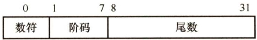
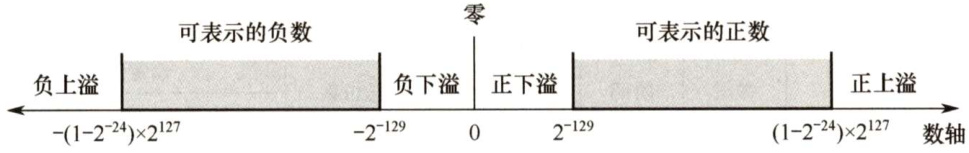
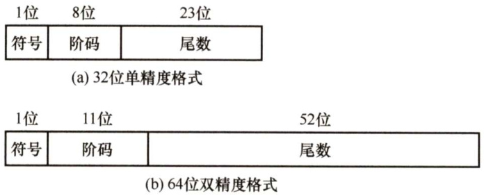

### 2.3 浮点数的表示与运算  

#### 2.3.1 浮点数的表示  

浮点数表示法是指以适当的形式将比例因子表示在数据中，让小数点的位置根据需要而浮动。这样，在位数有限的情况下，既扩大了数的表示范围，又保持了数的有效精度。例如，用定点数表示电子的质量 $(9\times10^{-28}\mathrm{g}$ ）或太阳的质量（ $2\times10^{33}\mathrm{g}$ ）是非常不方便的。  

#### 1.浮点数的表示格式  

通常，浮点数表示为  

$$
\begin{array}{r}{N{=}(-1)^{S}\times M\times R^{E}}\end{array}
$$  

式中， $s$ 取值0或1，用来决定浮点数的符号； $M$ 是一个二进制定点小数，称为尾数，一般用定点原码小数表示； $E$ 是一个二进制定点整数，称为阶码或指数，用移码表示。 $R$ 是基数（隐含)，可以约定为2、4、16等。可见浮点数由数符、尾数和阶码三部分组成。  

图2.17是一个32位短浮点数格式的举例。  

  
图2.17浮点数格式的举例  

其中，第0位为数符S；第 $1{\sim}7$ 位为移码表示的阶码 $E$ （偏置值为64)；第 $8{\sim}31$ 位为24位二进制原码小数表示的尾数 $M$ ：基数 $R$ 为2。阶码的值反映浮点数的小数点的实际位置；阶码的位数反映浮点数的表示范围；尾数的位数反映浮点数的精度。  

#### 2.浮点数的表示范围  

原码是关于原点对称的，故浮点数的范围也是关于原点对称的，如图2.18所示。  

  
图2.18浮点数的表示范围  

运算结果大于最大正数时称为正上溢，小于绝对值最大负数时称为负上溢，正上溢和负上溢统称上溢。数据一旦产生上溢，计算机必须中断运算操作，进行溢出处理。当运算结果在0至最小正数之间时称为正下溢，在0至绝对值最小负数之间时称为负下溢，正下溢和负下溢统  

称下溢。数据下溢时，浮点数值趋于零，计算机仅将其当作机器零处理。  

#### 3.浮点数的规格化  

尾数的位数决定浮点数的有效数位，有效数位越多，数据的精度越高。为了在浮点数运算过程中尽可能多地保留有效数字的位数，使有效数字尽量占满尾数数位，必须在运算过程中对浮点数进行规格化操作。所谓规格化操作，是指通过调整一个非规格化浮点数的尾数和阶码的大小，使非零的浮点数在尾数的最高数位上保证是一个有效值。  

左规：当运算结果的尾数的最高数位不是有效位，即出现 $\pm0.0\cdots0\times\cdots\times$ 的形式时，需要进行左规。左规时，尾数每左移一位、阶码减1（基数为2时)，直至尾数变成规格化形式为止。左规可能要进行多次。  

右规：当运算结果的尾数的有效位进到小数点前面时，需要进行右规。将尾数右移一位、阶码加1（基数为2时)。需要右归时，只需进行一次。  

原码表示的规格化尾数 $M$ 的绝对值应满足 $1/R\leq|M|\leq1$ 。若 $R=2$ ，则有 $1/2\leq|M|\leq1$ 。  

1）正数为 $0.1\times\times\cdots\times$ 的形式，其最大值表示为 $0.11\cdots1$ ，最小值表示为 $0.100\cdots0$ 。尾数的表示范围为 $1/2\leq M\leq(1-2^{-n})$ 0  
2）负数为 $1.1\times\times\cdots\times$ 的形式，其最大值表示为 $1.10^{\cdots}0$ ，最小值表示为 $1.11\cdots1$ 。尾数的表示范围为- $\cdot(1-2^{-n})\leq M\leq-1/2$ 。  

基数不同，浮点数的规格化形式也不同。当浮点数尾数的基数为2时，原码规格化数的尾数最高位一定是1。当基数为4时，原码规格化形式的尾数最高两位不全为0。  

#### 4.IEEE754标准  

按照IEEE754标准，常用的浮点数的格式如图2.19所示。  

  
图2.19IEEE754标准浮点数的格式  

IEEE 754标准规定常用的浮点数格式有短浮点数（单精度、float型）、长浮点数（双精度、double 型）、临时浮点数，其基数隐含为2，见表2.4。IEEE754标准的浮点数（除临时浮点数外)，是尾数用采取隐藏位策略的原码表示，且阶码用移码表示的浮点数。  

表2.4 IEEE754浮点数的格式  

<html><body><table><tr><td rowspan="2">类型</td><td rowspan="2">数符</td><td rowspan="2">阶码</td><td rowspan="2">尾数数值</td><td rowspan="2">总位数</td><td colspan="2">偏置值</td></tr><tr><td>十六进制</td><td>十进制</td></tr><tr><td>短浮点数</td><td>1</td><td>8</td><td>23</td><td>32</td><td>7FH</td><td>127</td></tr><tr><td>长浮点数</td><td>1</td><td>11</td><td>52</td><td>64</td><td>3FFH</td><td>1023</td></tr><tr><td>临时浮点数</td><td>1</td><td>15</td><td>64</td><td>80</td><td>3FFFH</td><td>16383</td></tr></table></body></html>  

以短浮点数为例，最高位为数符位；其后是8位阶码，用移码表示，阶码的偏置值为 $2^{8-1}-$ $1=127$ ；基数为2；其后23位是原码表示的尾数数值位。在浮点格式中表示的23位尾数是纯小  

数。对于规格化的二进制浮点数，数值的最高位总是“1”，为了能使尾数多表示一位有效位，将这个“1”隐藏，称为隐藏位，因此23位尾数实际上表示了24 位有效数字。例如， $(12)_{10}=$ $(1100)_{2}$ ，将它规格化后结果为 $1.1\times2^{3}$ ，其中整数部分的“1”将不存储在23位尾数内。  

注意：短浮点数与长浮点数都采用隐藏尾数最高数位的方法，因此可多表示一位尾数。  

对于短浮点数，偏置值为127；对于长浮点数，偏置值为1023。存储浮点数阶码之前，偏置值要先加到阶码真值上。上例中，阶码值为3，因此在短浮点数中，移码表示的阶码为 $127+3=$ 130（82H)；在长浮点数中，阶码为 $1023+3=1026$ （402H)。  

IEEE754标准中，规格化的短浮点数的真值为  

$$
(-1)^{S}\times1.M\times2^{E-127}
$$  

规格化长浮点数的真值为  

$$
(-1)^{S}\times1.M\times2^{E-1023}
$$  

式中，短浮点数 $E$ 的取值为 $1{\sim}254$ （8位表示）， $M$ 为23位，共32位；长浮点数 $E$ 的取值为$1{\sim}2046$ （11位表示）， $M$ 为52位，共64位。IEEE754标准浮点数的范围见表2.5。  

表2.5IEEE754浮点数的范围  

<html><body><table><tr><td>格式</td><td>最小值</td><td>最大值</td></tr><tr><td>单精度</td><td>E=1，M=0 1.0×21-127=2-126</td><td>E=254，M=.111，1.111×254-127=2127×(2-2-23)</td></tr><tr><td>双精度</td><td>E=1，M=0 1.0×21-1023=2-1022</td><td>E=2046，M=.1111，1.111×22046-1023=21023×(2-2-52)</td></tr></table></body></html>  

对于IEEE754格式的浮点数，阶码全0或全1时，有其特别的解释，如表2.6所示。  

表2.6阶码全0或全1时IEEE754浮点数的解释  

<html><body><table><tr><td rowspan="2">值的类型</td><td colspan="4">单精度(32位）</td><td colspan="4">双精度(64位）</td></tr><tr><td>符号</td><td>阶码</td><td>尾数</td><td>值</td><td>符号</td><td>阶码</td><td>尾数</td><td>值</td></tr><tr><td>正零</td><td>0</td><td>0</td><td>0</td><td>0</td><td>0</td><td>0</td><td>0</td><td>0</td></tr><tr><td>负零</td><td>1</td><td>0</td><td>0</td><td>-0</td><td>1</td><td>0</td><td>0</td><td>-0</td></tr><tr><td>正无穷大</td><td>0</td><td>255(全1)</td><td>0</td><td>8</td><td>0</td><td>2047(全1)</td><td>0</td><td>8</td></tr><tr><td>负无穷大</td><td>1</td><td>255（全1）</td><td>0</td><td>-8</td><td>1</td><td>2047(全1)</td><td>0</td><td>-8</td></tr></table></body></html>  

1）全0阶码全0尾数： $+0/{-0}$ 。零的符号取决于数符 $s$ ，一般情况下 $+0$ 和-0是等效的。  

2）全1阶码全0尾数： $+\infty/-\infty$ 。 $+\infty$ 在数值上大于所有有限数， $-\infty$ 则小于所有有限数。引入无穷大数的目的是，在计算过程出现异常的情况下使得程序能继续进行下去。  

#### 5。定点、浮点表示的区别  

（1）数值的表示范围若定点数和浮点数的字长相同，则浮点表示法所能表示的数值范围远大于定点表示法。（2）精度对于字长相同的定点数和浮点数来说，浮点数虽然扩大了数的表示范围，但精度降低了。（3）数的运算浮点数包括阶码和尾数两部分，运算时不仅要做尾数的运算，还要做阶码的运算，而且运算结果要求规格化，所以浮点运算比定点运算复杂。（4）溢出问题  

在定点运算中，当运算结果超出数的表示范围时，发生溢出；浮点运算中，运算结果超出  

尾数表示范围却不一定溢出，只有规格化后阶码超出所能表示的范围时，才发生溢出。  

#### 2.3.2 浮点数的加减运算  

浮点数运算的特点是阶码运算和尾数运算分开进行，浮点数加减运算分为以下几步。  

#### 1．对阶  

对阶的目的是使两个操作数的小数点位置对齐，即使得两个数的阶码相等。为此，先求阶差，然后以小阶向大阶看齐的原则，将阶码小的尾数右移一位（基数为2)，阶加1，直到两个数的阶码相等为止。尾数右移时，舍弃掉有效位会产生误差，影响精度。  

#### 2．尾数求和  

将对阶后的尾数按定点数加（减）运算规则运算。运算后的尾数不一定是规格化的，因此，浮点数的加减运算需要进一步进行规格化处理。  

#### 3．规格化  

IEEE754规格化尾数的形式为 $\pm1.\times\cdots\times$ 。尾数相加减后会得到各种可能结果，例如：  

$$
1.{\times}\cdots{\times}+1.{\times}\cdots{\times}=\pm1{\times}.{\times}\cdots{\times}
$$  

$$
1.{\times}\cdots{\times}-1.{\times}\cdots{\times}=\pm0.0\cdots01{\times}\cdots{\times}
$$  

1）右规：当结果为 $\lvert\pm1\times.\times\cdots\times$ 时，需要进行右规。尾数右移一位，阶码加1。尾数右移时，最高位1被移到小数点前一位作为隐藏位，最后一位移出时，要考虑舍入。  

2）左规：当结果为 $\pm0.0\cdots01\times\cdots\times$ 时，需要进行左规。尾数每左移一位，阶码减1。可能需要左规多次，直到将第一位1移到小数点左边。  

注意： $\textcircled{1}$ 左规一次相当于乘2，右规一次相当于除2； $\textcircled{2}$ 需要右归时，只需进行一次。  

#### 4.舍入  

在对阶和尾数右规时，可能会对尾数进行右移，为保证运算精度，一般将低位移出的两位保留下来，参加中间过程的运算，最后将运算结果进行舍入，还原表示成IEEE754格式。  

常见的舍入方法有：0舍1入法、恒置1法和截断法(恒舍法)。  

0舍1入法：类似于十进制的“四舍五入”法。运算结果保留位的最高数位为0，则舍去；最高数位为1，则在尾数的末位加1。这样可能会使尾数溢出，此时需再做一次右规。  

恒置1法：只要因移位而丢失的位中有1，就把尾数末位置1，而不管原来是0还是1。  

截断法：直接截取所需位数，丢弃后面的所有位，这种舍入处理最简单。  

#### 5.溢出判断  

在尾数规格化和尾数舍入时，可能会对阶码执行加/减运算。因此，必须考虑指数溢出的问题。若一个正指数超过了最大允许值（127或1023)，则发生指数上溢，产生异常。若一个负指数超过了最小允许值（-149或-1074)，则发生指数下溢，通常把结果按机器零处理。  

1）右规和尾数舍入。数值很大的尾数舍入时，可能因为末位加1而发生尾数溢出，此时需要通过右规来调整尾数和阶。右规时阶加1，导致阶增大，因此需要判断是否发生了指数上溢。当调整前的阶码为11111110时，加1后，会变成11111111而发生指数上溢。  

2）左规。左规时阶减1，导致阶减小，因此需要判断是否发生了指数下溢。其判断规则与指数上溢类似，左规一次，阶码减1，然后判断阶码是否为全0来确定是否指数下溢。  

由此可见，浮点数的溢出并不是以尾数溢出来判断的，尾数溢出可以通过右规操作得到纠正。运算结果是否溢出主要看结果的指数是否发生了上溢，因此是由指数上溢来判断的。  

注意：某些题目可能会指定尾数或阶码采用补码表示。通常采用双符号位，当尾数求和结果溢出（如尾数为 $10.{\times}{\times}\cdots{\times}$ 或 $01.\times\times\cdots\times$ ）时，需右规一次；当结果出现 $00.0\times\times\cdots\times$ 或$11.1\times\times\cdots\times$ 时，需要左规，直到尾数变为 $00.1\times\times\cdots\times$ 或 $11.0{\times}{\times}\cdots{\times}$ 。  

#### 6.C语言中的浮点数类型  

C 语言中的 float 和 double 类型分别对应于IEEE 754单精度浮点数和双精度浮点数。longdouble 类型对应于扩展双精度浮点数，但longdouble的长度和格式随编译器和处理器类型的不同而有所不同。在C 程序中等式的赋值和判断中会出现强制类型转换，以chai $\scriptstyle\to\operatorname{int}\to\log\to$ double和float $\rightrightarrows$ double最为常见，从前到后范围和精度都从小到大，转换过程没有损失。  

1）int转换为float时，虽然不会发生溢出，但float尾数连隐藏位共24位，当int型数的第$24{\sim}31$ 位非0时，无法精确转换成24位浮点数的尾数，需进行舍入处理，影响精度。  
2）int或float转换为double时，因double的有效位数更多，因此能保留精确值。  
3）double 转换为float时，因float表示范围更小，因此大数转换时可能会发生溢出。此外，由于尾数有效位数变少，因此高精度数转换时会发生舍入。  
4）float或double转换为int时，因int没有小数部分，因此数据会向0方向截断（仅保留整数部分)，发生舍入。另外，因int表示范围更小，因此大数转换时可能会溢出。  
在不同数据类型之间转换时，往往隐藏着一些不容易察觉的错误，编程时要非常小心。  

#### 2.3.3 本节习题精选  

#### 一、单项选择题  

01．在C语言的不同类型的数据混合运算中，要先转换成同一类型后进行运算。设一表达式中包含有int、long、char和double类型的变量与数据，则表达式最后的运算结果是（），这4种类型数据的转换规律是（）。  

A.long，int→char $\rightarrow$ double $\rightarrow$ long B.long，char $\rightarrow$ int $\rightarrow$ long $\rightrightarrows$ double C. double，char $\rightarrow$ int→long→double D. double，char→int→double→long  

02．长度相同但格式不同的两种浮点数，假设前者阶码长、尾数短，后者阶码短、尾数长，其他规定均相同，则它们可表示的数的范围和精度为（）。  

A.两者可表示的数的范围和精度相同B．前者可表示的数的范围大但精度低C．后者可表示的数的范围大且精度高 D．前者可表示的数的范围大且精度高  

03．长度相同、格式相同的两种浮点数，假设前者基数大，后者基数小，其他规定均相同，则它们可表示的数的范围和精度为（）。  

A.两者可表示的数的范围和精度相同 B．前者可表示的数的范围大但精度低C．后者可表示的数的范围大且精度高 D．前者可表示的数的范围大且精度高  

04.下列说法中正确的是（）。  

A.采用变形补码进行加减法运算可以避免溢出  
B.只有定点数运算才可能溢出，浮点数运算不会产生溢出  
C.定点数和浮点数运算都可能产生溢出  
D.两个正数相加时一定产生溢出  

05．在规格化浮点运算中，若某浮点数为 $2^{5}{\times}1.10101$ ，其中尾数为补码表示，则该数(）。  

A．不需规格化 B．需右移规格化  

C.需将尾数左移一位规格化 D.需将尾数左移两位规格化  

06．某浮点机，采用规格化浮点数表示，阶码用移码表示（最高位代表符号位），尾数用原码表示。下列（）的表示不是规格化浮点数。  

A.11111111, $1.1000\cdots00$ B. 0011111,1.0111·01   
C. 1000001,0.1111··01 D. 0111111,0.1000-·10  

07．下列关于对阶操作说法正确的是（）。  

A．在浮点加减运算的对阶操作中，若阶码减小，则尾数左移   
B．在浮点加减运算的对阶操作中，若阶码增大，则尾数右移；若阶码减小，则尾数左移   
C．在浮点加减运算的对阶操作中，若阶码增大，则尾数右移   
D.以上都不对  

08.浮点数的IEEE754标准对尾数编码采用的是（）。  

A.原码 B.反码 C.补码 D.移码  

09．在IEEE754标准规定的64位浮点数格式中，符号位为1位，阶码为11位，尾数为52位，则它所能表示的最小规格化负数为（）。  

A. -(2 - 252)×2-1023 B. $-(2-2^{-52}){\times}2^{+1023}$ C. -1×2-1024 D. -(1- 2-52)×2+2047  

10.按照IEEE754标准规定的32位单精度浮点数 $41\mathrm{A}4\mathrm{C}000\mathrm{H}$ 对应的十进制数是（）  

A.4.59375 B.-20.59375 C. -4.59375 D.20.59375  

1.在浮点数编码表示中，（）在机器数中不出现，是隐含的。  

A.阶码 B．符号 C.尾数 D.基数  

12．如果某单精度浮点数、某原码、某补码、某移码的32位机器数均为 $0\mathrm{{xF00000000}}$ 。这些数从大到小的顺序是（）。  

A.浮原补移 B.浮移补原 C.移原补浮 D．移补原浮  

13．采用规格化的浮点数最主要是为了（）。  

A.增加数据的表示范围 B.方便浮点运算C.防止运算时数据溢出 D．增加数据的表示精度  

14.下列说法中，正确的是（）。  

I．在计算机中，表示的数有时会发生溢出，根本原因是计算机的字长有限II.8421码就是二进制数III．一个正数的补码和这个数的原码表示一样，而正数的反码是原码各位取反IV．设有两个正的规格化浮点数 $N_{1}=2^{m}{\times}M_{1}$ 和 $N_{2}=2^{n}{\times}M_{2}$ ，若 $m>n$ ，则有 $N_{1}>N_{2}$  

A.I、Ⅱ B.Ⅲ、III C.I、II、IV D.I、IV  

15．在浮点运算中，下溢指的是（）。  

A．运算结果的绝对值小于机器所能表示的最小绝对值B．运算的结果小于机器所能表示的最小负数C．运算的结果小于机器所能表示的最小正数D．运算结果的最低有效位产生的错误  

16.假定采用IEEE754标准中的单精度浮点数格式表示一个数为 $45100000\mathrm{{0H}}$ ，则该数的值是（）。  

A. $(+1.125)_{10}{\times}2^{10}$ B. $(+1.125)_{10}\times2^{11}$ C. $(+0.125)_{10}\times2^{11}$ D. $(+0.125)_{10}{\times}2^{10}$  

17．设浮点数共12位。其中阶码含1位阶符共4位，以2为底，补码表示；尾数含1位数符共8位，补码表示，规格化。则该浮点数所能表示的最大正数是（）。  

A. $2^{7}$ B. $2^{8}$ C. $2^{8}-1$ D. $2^{7}-1$  

18.计算机在进行浮点数的加减运算之前先进行对阶操作，若 $x$ 的阶码大于 $y$ 的阶码，则应将（）。  

A. $x$ 的阶码缩小至与 $y$ 的阶码相同，且使 $x$ 的尾数部分进行算术左移B. $x$ 的阶码缩小至与 $y$ 的阶码相同，且使 $x$ 的尾数部分进行算术右移C. $y$ 的阶码扩大至与 $x$ 的阶码相同，且使 $y$ 的尾数部分进行算术左移D. $y$ 的阶码扩大至与 $x$ 的阶码相同，且使 $y$ 的尾数部分进行算术右移  

19.若浮点数的尾数用补码表示，则下列（）中的尾数是规格化数形式。  

A.1.11000 B.0.01110 C.0.01010 D. 1.0001(设浮点数的基数为4，尾数用原码表示，则以下（）是规格化的数。  

A.1.001101 B.0.001101 C. 1.011011 D.0.000010  

21.下列关于舍入的说法，正确的是（）。  

I．不仅仅只有浮点数需要舍入，定点数在运算时也可能要舍入ⅡI．在浮点数舍入中，只有左规格化时可能要舍入III．在浮点数舍入中，只有右规格化时可能要舍入IV．在浮点数舍入中，左、右规格化均可能要舍入  

V.舍入不一定产生误差  

A.I、III、V B.I、ⅡI、V C.V D.I、IV  

22.【2009统考真题】浮点数加、减运算过程一般包括对阶、尾数运算、规格化、舍入和判断溢出等步骤。设浮点数的阶码和尾数均采用补码表示，且位数分别为5和7（均含2位符号位）。若有两个数 $X=2^{7}\times29/32$ 和 $Y=2^{5}{\times}5/8$ ，则用浮点加法计算 $X+Y$ 的最终结果是（）。  

A．00111 1100010 B.001110100010 C.010000010001D．发生溢出  

23.【2010统考真题】假定变量i、f和d的数据类型分别为int、float和double（int用补码表示，float和double分别用IEEE754单精度和双精度浮点数格式表示），已知 $\mathbf{i}=\mathbf{\partial}$ 785、 $\mathrm{f}=1.5678\mathrm{E}3$ 、 $\mathrm{~d~}=\ 1.5\mathrm{E}100$ ，若在32位机器中执行下列关系表达式，则结果为“真”的是（）。  

I. $\mathrm{i}=\mathrm{(int)}(\mathrm{float)i}$ ⅡI. $\mathbf{f}=\mathbf{\partial}$ (float)(int)fIII. $\mathbf{f}=\mathbf{\partial}$ (float)(double)f IV. $({\mathrm{d}}{+}{\mathrm{f}}){-}{\mathrm{d}}={\mathrm{f}}$ A.仅I和Ⅱ B.仅I和IⅢ C.仅Ⅱ和Ⅲ D.仅ⅢI和IV  

24.【2011统考真题】float型数据通常用IEEE754单精度格式表示。若编译器将float型变量 $\textbf{x}$ 分配在一个32位浮点寄存器FR1中，且 $\mathbf{x}=-8.25$ ，则FR1的内容是（）。  

A.C104 0000H B.C242 0000H C.C1840000H D. C1C20000H  

25.【2012统考真题】float类型（即IEEE754单精度浮点数格式）能表示的最大正整数是()。  

A. 2126-2103 B. $2^{127}-2^{104}$ C. 2127-2103 D. 2128-2104  

26.【2013统考真题】某数采用IEEE754单精度浮点数格式表示为 $\mathbf{C640~0000H}$ ，则该数的值是（）。  

A. $-1.5{\times}2^{13}$ B.-1.5×212 C. -0.5x213 D. -0.5×212  

27.【2014统考真题】float型数据常用IEEE754单精度浮点格式表示。假设两个float型变量 $\textbf{x}$ 和y分别存放在32位寄存器fl和f2中， $\sharp(\mathrm{f1})=\mathrm{CC}90\ 0000\mathrm{H}$ ， $(\mathrm{f}2)\mathrm{~=~}\mathrm{B0}\mathrm{C}0$  

$0000\mathrm{H}$ ，则 $\textbf{x}$ 和y之间的关系为（）。  

A. $\mathbf{x}<\mathbf{y}$ 且符号相同 B. $\mathbf{x}<\mathbf{y}$ 且符号不同C. $\mathbf{x}>\mathbf{y}$ 且符号相同 D. $\mathbf{x}>\mathbf{y}$ 且符号不同  

28.【2015统考真题】下列有关浮点数加减运算的叙述中，正确的是（）  

I.对阶操作不会引起阶码上溢或下溢 II．右规和尾数舍入都可能引起阶码上溢 III．左规时可能引起阶码下溢 IV．尾数溢出时结果不一定溢出  

A.仅、IⅢI B.仅I、Ⅱ、IV C.仅I、IⅢ、IV D.I、Ⅱ、Ⅲ、IV  

29.【2018统考真题】IEEE754单精度浮点格式表示的数中，最小的规格化正数是（）。  

A.1.0x2126 B.1.0×2-127 C. 1.0x2-128 D.1.0×2-149  

30.【2020统考真题】已知带符号整数用补码表示，float型数据用IEEE754标准表示，假定变量 $x$ 的类型只可能是int或float，当 $x$ 的机器数为 $\mathrm{C800~00000}$ 时， $x$ 的值可能是()。  

A. $-7{\times}2^{27}$ B. $-2^{16}$ C. $2^{17}$ D. $25\times2^{27}$  

31.【2021统考真题】下列数值中，不能用IEEE754浮点格式精确表示的是（）。  

A.1.2 B. 1.25 C. 2.0 D.2.5  

#### 二、综合应用题  

01.什么是浮点数的溢出？什么情况下发生上溢出？什么情况下发生下溢出？  

02．现有一计算机字长32位（ $\mathrm{D}_{31}\sim\mathrm{D}_{0}$ )，数符位是第31位。对于二进制 $1000\ 1111\ 1110\ 1111\ 1110000000000000000000$ 1）表示一个补码整数，其十进制值是多少？2）表示一个无符号整数，其十进制值是多少？3）表示一个IEEE754标准的单精度浮点数，其值是多少？  

03．假定变量i是一个32位的int型整数，f和d分别为float型（32位）和double 型（64位）实数。X、y、z是float型（32位）或double型（32位）实数。分析下列各布尔表达式，说明结果是否在任何情况下都是“true”。  

1) $\dot{\bf1}==$ (int) ((double) i)   
2) $\scriptstyle\mathbf{f}==$ (float) (int)f)   
3) $\scriptstyle\mathbf{f}==$ (float) (double) f)   
4) $\mathbf{d}==$ (double) ((float) d)  

04.已知两个实数 $\mathbf{x}=-68$ ， $\mathbf{y}=-8.25$ ，它们在C语言中定义为float型变量，分别存放在寄存器A和B中。另外，还有两个寄存器C和D。A、B、C、D都是32位的寄存器。请问（要求用十六进制表示二进制序列）：1）寄存器A和B中的内容分别是什么？2) $\textbf{x}$ 和y相加后的结果存放在C寄存器中，寄存器C中的内容是什么？3) $\textbf{x}$ 和y相减后的结果存放在D寄存器中，寄存器D中的内容是什么？  

05.设浮点数的格式如下（阶码和尾数均用补码表示，基为2）：  

<html><body><table><tr><td>Es</td><td>E~E</td><td>Ms</td><td>M~M</td></tr></table></body></html>  

1）将27/64转换为浮点数。  

2）将-27/64转换为浮点数。  

06．两个规格化浮点数进行加减法运算，最后对结果规格化时，能否确定需要右规的次数？能否确定需要左规的次数？  

07．对下列每个IEEE754单精度数值，解释它们所表示的是哪种数字类型（规格化数、非规格化数、无穷大、0)。当它们表示某个具体数值时，请给出该数值。  

1）0b0000 0000 0000 0000 0000 0000 0000 0000   
2）0b0100 0010 0100 0000 0000 0000 0000 0000   
3）0b1000 0000 0100 0000 0000 0000 0000 0000   
4）0b1111 1111 1000 0000 0000 0000 0000 0000  

08.【2017统考真题】已知 $f(n)=\sum_{i=0}^{n}2^{i}=2^{n+1}-1={\overset{n+1(i i)}{11\cdots18}}$ ，计算 ${\mathcal{A}}(n)$ 的C语言函数fl如下：  

int fl（unsigned n）{   
int sum $:=1$ power $=1$ ：   
for(unsignedi $=0$ . $i<=n-1$ . $i++$ ）{ power $x=2$ .   
sum $+=$ power;   
，   
return sum;   
卜  

将f1中的int都改为 float，可得到计算f(n)的另一个函数f2。假设unsigned和int型数据都占32位，float采用IEEE754单精度标准。请回答下列问题：  

1）当 $\mathbf{n}=0$ 时，fl会出现死循环，为什么？若将fl中的变量i和n都定义为int型，则f1是否还会出现死循环？为什么？  
2）f1(23)和f2(23)的返回值是否相等？机器数各是什么（用十六进制表示）？  
3）fl(24)和f2(24)的返回值分别为33554431和33554432.0，为什么不相等？  
4) $\mathrm{f}(31)=2^{32}-1$ ，而fl(31)的返回值却为-1，为什么？若使 fl(n)的返回值与 f(n)相等，则最大的n是多少？  
5）f2(127)的机器数为7F800000H，对应的值是什么？若使f2(n)的结果不溢出，则最大的n是多少？若使f2(n)的结果精确（无舍入），则最大的n是多少？  

#### 2.3.4 答案与解析  

#### 一、单项选择题  

01.C  

不同类型的数据混合运算时，遵循的原则是“类型提升”，即较低类型转换为较高类型，最终结果为double类型。4种类型数据的转换规律为char $\leftrightarrow$ int→long $\rightrightarrows$ double。  

例如，long型数据与int型数据一起运算时，需先将int型转换为long型，然后两者再进行运算，结果为long型。float型数据和double型数据一起运算时，虽然它们同为实型，但两者精度不同，仍要先将float型转换成double型再进行运算，结果亦为double型。所有这些转换都是由系统自动进行的，这种转换通常称为隐式转换。  

注意在强制类型转换中，从int转换为float时，虽然不会发生溢出，但由于尾数位数的关系，可能有数据舍入，而转换为double 则能保留精度。double 转换为float亦是如此。从float 或double 转换为int时，小数部分被截断，且由于int的表示范围更小，还可能发生溢出。  

#### 02.B  

在浮点数总位数不变的情况下，阶码位数越多，尾数位数越少；即表示的数的范围越大，精度越差(数变稀疏)。  

#### 03.B  

基数越大，范围越大，但精度变低（数变稀疏)。  

注意： $\textcircled{1}$ 基数越大，在运算中尾数右移的可能性越小，运算的精度损失越小。 $\textcircled{2}$ 由于基数大时发生因对阶或尾数溢出需右移及规格化需左移的次数显著减少，因此运算速度可以提高。 $\textcircled{3}$ 基数越大，可表示的数的范围越大。  

#### 04.C  

变形补码，即用两个二进制位来表示数字的符号位，其余与补码相同，所以并不能避免溢出，A 错误。定点数和浮点数运算都可能产生溢出，但是溢出判断有区别，因此B 错误、C 正确。在定点运算中，当运算结果超出数的表示范围时，就发生溢出；在浮点运算中，运算结果超出尾数表示范围却不一定溢出，只有规格化后阶码超出所能表示的范围时，才发生溢出，D错误。  

#### 05.C  

考查浮点数的规格化。当尾数为补码表示，且为 $1.0x\times x\times$ 形式时为规格化数，因此该尾数需左移一位，阶码同时应减1，才为规格化数。  

#### 06.B  

原码表示时，正数的规格化形式为 $0.1\times\cdots\times$ ，负数的规格化形式为 $1.1\times\cdots\times$ ，因此B错误。  

07.C  

对阶操作，是将较小的阶码调整到与较大的阶码一致，因此不存在阶码减小、尾数左移的情况，因而A、B项错。  

#### 08.A  

IEEE754标准中尾数采用原码表示，阶码部分用移码表示。  

09.B  

长浮点数，其阶码11位，尾数52位，采取隐藏位策略，因此其最小规格化负数为阶码取最大值 $2^{+1023}$ （ $1023=2^{11-1}-1)$ ，尾数取最大值 $2-2^{-52}$ （注意其有隐藏位要加1)，符号位为负。  

10.D  

在 IEEE754单精度浮点数中，最高位为数符位；其后是8位阶码，以2为底，用移码表示，阶码的偏置值为127；其后23位是尾数数值位。对于规格化的二进制浮点数，数值的最高位总是“1”，为了能使尾数多表示一位有效值，将这个“1”隐藏，因此尾数数值实际上是24位。隐藏的“1”是一位整数。在浮点格式中表示出来的23位尾数是纯小数，用原码表示。  

41A4C000H写成二进制为01000001101001001100000000000000，第一位为符号位0，表示是正数。之后的8位10000011表示阶码，真值为 $(100)_{\mathrm{B}}$ ，即4。剩下的是隐藏了最高1的尾数，故而为 $1.010010011000000000000000$ ，数值左移四位后整数部分10100表示为20。  

#### 11.D  

浮点数表示中基数的值是约定好的，因此将其隐含。  

12.D  

这个机器数的最高位为1，对于原码、补码、单精度浮点数而言为负数，对于移码而言为正数，所以移码最大，而补码为 $-2^{28}$ ，原码为- $(2^{30}+2^{29}+2^{28})$ ，单精度浮点数为一 $\cdot1.0{\times}2^{97}$ ，大小依次递减。  

#### 13.D  

与非规格化浮点数相比，采用规格化浮点数的目的主要是为了增加数据的表示精度。  

14.D  

I正确；8421码是十进制数的编码，Ⅱ 错误；正数的原码、反码和补码都相同，III 错误;因为是规格化正浮点数，所以 $M_{1}$ ， $M_{2}$ 均为 $0.1x x$ 形式，有 $N_{1}$ 阶码至少比 $N_{2}$ 大1，所以 $N_{1}>$ $N_{2}$ ，IV正确。  

#### 15.A  

运算结果在0至规格化最小正数之间时称为正下溢，运算结果在0至规格化最大负数之间时称为负下溢，正下溢和负下溢统称下溢。  

#### 16.B  

写成二进制表示为 $0100\ 0101\ 0001\ 0000\ 000\ 0000\ 0000\ 000000$ ，第一位为符号位，0表示正数，随后8位（float型）10001010是用移码表示的阶码，因此减去01111111后得十进制数11，而IEEE754标准中单精度浮点数在阶码不为0时隐藏1，因此尾数为 $(1.0010)_{\mathrm{B}}=(1.125)_{\mathrm{D}}$ 因此该数值为 $(+1.125)_{10}\times2^{11}$ o  

17.D  

为使浮点数取正数最大，可使尾数取正数最大，阶码取正数最大。尾数为8位补码（含符号位)，正值最大为0.1111111，即 $1\mathrm{~-~}2^{-7}$ ，阶码为4位补码（含符号位)，正值最大为0111，即7，则最大正数为 $(1-2^{-7})\times2^{7}=2^{7}-1$ 。  

#### 18.D  

浮点数加减运算时，首先要进行对阶，根据对阶的规则，阶码和尾数将进行相应的操作。  

对阶的规则是，小阶向大阶看齐。即阶码小的数的尾数算术右移，每右移一位，阶码加1，直到两数的阶码相等为止。  

#### 19.D  

补码的规格化表示是小数点后一位与符号位不同，因此选择D。  

20.C原码表示的规格化小数是小数点后2位（基数为4，用2位表示）不全为0的小数。  

21.C  

舍入是浮点数的概念，定点数没有舍入的概念，因此I错误。浮点数舍入的情况有两种：对阶、右规格化，因此ⅡI、III、IV 错误。舍入不一定产生误差，如向下舍入11.00到11.0 时是没有误差的，因此V正确。  

#### 22.D  

$X$ 的浮点数格式为00，111；00，11101（分号前为阶码，分号后为尾数）， $Y$ 的浮点数格式为00,101;00，10100。然后根据浮点数的加法步骤进行运算。  

$\textcircled{1}$ 对阶。 $X,$ $Y$ 阶码相减，即 $00,111-00,101=00,11+11,0111=00,010$ ，可知 $X$ 的阶码比 $Y$ 的价码大2（这一步可直接目测)。根据小阶向大阶看齐的原则，将 $Y$ 的阶码加2，尾数右移2位，将Y变为00,111;00,00101。$\textcircled{2}$ 尾数相加。即 00, $11101+00$ ， $00101=01$ ，00010，尾数相加结果符号位为01，因此需要右规。$\textcircled{3}$ 规格化。将尾数右移1位，阶码加1，得 $X+Y$ 为 01,000;00,10001。$\textcircled{4}$ 判断溢出。阶码符号位为01，说明发生溢出。本题容易误选B、C，因为B、C 本身并无计算错误，只是它们不是最终结果，选项B少了第3步和第4步，选项C少了第4步。  

#### 23.B  

题中三种数据类型强制类型转换的顺序为int $\rightarrow$ float $\rightleftharpoons$ double，int表示的类型为整数，若将float 转换为int，小数位部分会被舍去，而int是精确到32位的整数，float只保存到 $1+23$ 位，因此一个长为32位的int整数在转换为float时也会有损失，但 $\dot{1}<1024$ （10位)，因此I正确。double 的精度和范围都比float大，float 转换为double不会有损失，III正确。对于IV，初看似乎没有问题，但浮点运算d $^+$ f时需要对阶，对阶后 $f$ 的尾数有效位被舍去而变为0，因此d+f仍然为d，再减去d后结果为0，因此IV结果不为真。  

注意：从 int转换为 float 时，虽然不会发生溢出，但由于尾数位数的关系，可能有数据舍入，而转换为double则能保留精度。  

24.A  

本题的目的在于考查IEEE754单精度浮点数的表示。先将 $\textbf{x}$ 转换成二进制为 $-1000.01\ =$ $-1.00001\times2^{3}$ ，其次计算阶码 $E$ ，根据IEEE754单精度浮点数格式，有 $E-127=3$ ，因此 $E=$ 130，转换成二进制为10000010。最后，根据IEEE754标准，最高位的“1”是被隐藏的。  

IEEE754单精度浮点数格式：数符（1位） $^+$ 阶码（8位） $^+$ 尾数（23位）。  

因此FR1的内容为 $1;100000010;00001000000000000000000000$ 。即 $11000001\ 0000\ 0100\ 0000\ 0000\ 0000\ 00000={\mathrm{C1}}04\ 0000{\mathrm{H}}{\mathrm{s}}$ 本题易误选D，未考虑IEEE754标准隐藏最高位1的情况，把偏置值认为是128。  

25.DIEEE 754单精度浮点数是尾数用采取隐藏位策略的原码表示，且阶码用移码（偏置值为  

127）表示的浮点数。规格化短浮点数的真值为 $(-1)^{S}\times1.m\times2^{E-127}$ ，其中S为符号位，阶码 $E$ 的取值为 $1{\sim}254$ （8位表示)，尾数 $m$ 为23位，共32位；因此float类型能表示的最大整数是$1.111\cdots1\times2^{254-127}=2^{127}\times(2-2^{-23})=2^{128}-2^{104}$ ，因此选D。  

【另解】IEEE754单精度浮点数的格式如下图所示。  

<html><body><table><tr><td>数符(1)</td><td>阶码（8）</td><td>尾数（23）</td></tr></table></body></html>  

表示最大正整数时：数符取0；阶码取最大值为127；尾数部分隐藏了整数部分的“1”，23位尾数全取1时尾数最大，为 $2-2^{-23}$ ，此时浮点数的大小为 $(2-2^{-23}){\times}2^{127}=2^{128}-2^{104}$  

#### 26.A  

IEEE754单精度浮点数格式为 $\mathbf{C64000000H}$ ，二进制格式为11000110010000000000000000000000，转换为标准的格式为：  

<html><body><table><tr><td>S</td><td>阶码</td><td>尾数</td></tr><tr><td>1</td><td>10001100</td><td>100 0000 0000 0000 0000 0000</td></tr></table></body></html>  

数符 $^{\circ}=1$ 表示负数；阶码值为 $1000\ 1100-0111\ 11111=0000\ 1101=13$ ；尾数值为1.5（注意其有隐藏位，要加1)。因此，浮点数的值为- $\cdot1.5{\times}2^{13}$ 。  

27.A  

(f1)和(f2)对应的二进制分别是(110011001001...)和(101100001100...)2，根据IEEE754 浮点数标准，可知(f1)的数符为1，阶码为10011001，尾数为1.001，而(f2)的数符为1，阶码为01100001，尾数为1.1，可知两数均为负数，符号相同，B、D排除；(f1)的绝对值为 $1.001\times2^{26}$ ，(f2)的绝对值为 $1.1\times2^{-30}$ ，(f1)的绝对值比(f2)的绝对值大，而符号为负，真值大小相反，即(f1)的真值比(f2)的真值小，即 $\mathbf{x}<\mathbf{y}$ ，选A。  

28.D  

解析请扫右侧二维码查阅。  

29.A  

IEEE754单精度浮点数的符号位、阶码位、尾数位（省去正数位1）所占的位数分别是1、8、23。最小正数，数符位取0，移码的取值范围是1－254，取1，得阶码值 $1~-~127=-126$ （127为我们规定的偏置值)，尾数取全0，最终推出最小规格化正数为A选项。  

#### 30.A  

$\mathrm{C800~00000H}=1100\ 1000\ 0000\ 0000\ 000000\ 00000\ 00000\ 000000\ 000000000000$ 将其转换为对应的float型或int型。  

1）若为float型，则尾数隐藏最高位1，数符为1表示负数，阶码 $1001\ 0000=2^{7}+2^{4}=128$ +16，再减去偏置值127得到17，算出 $x$ 值为 $-2^{17}$ 。  

2）若为int型，则带符号补码，为负数，数值部分取反加1，得0111000000000000000$0000000000000$ ，算出 $x$ 值为 $-7\times2^{27}$ 。  

31.A  

使用排除法。选项B： $1.25=1.01\mathrm{B}\times2^{0}$ ；选项C： $2.0=1.0\mathrm{B}\times2^{1}$ ；选项D： $2.5=1.01\mathrm{B}\times2^{1}$ o因此，B、C和D均可以用IEEE 754浮点格式精确表示。选项A的十进制小数1.2 转换成二进制的结果是无限循环小数 $1.001100110011\cdots$ ，无法用精度有限的IEEE754格式精确表示。  

#### 二、综合应用题  

01.【解答】  

浮点数的运算结果可能出现以下几种情况：  

$\textcircled{1}$ 阶码上溢出。一个正指数超过了最大允许值时，浮点数发生上溢出（即向 $\infty$ 方向溢出)。若结果是正数，则发生正上溢出（有的机器把值置为 $+\infty$ )；若结果是负数，则发生负上溢出（有的机器把值置为-)。这种情况为软件故障，通常要引入溢出故障处理程序来处理。  
$\textcircled{2}$ 阶码下溢出。一个负指数比最小允许值还小时，浮点数发生下溢出。一般机器把下溢出时的值置为0（ $+0$ 或-0)。不发生溢出故障。  
$\textcircled{3}$ 尾数溢出。当尾数最高有效位有进位时，发生尾数溢出。此时，进行“右规”操作：尾数右移一位，阶码加1，直到尾数不溢出为止。此时，只要阶码不发生上溢出，浮点数就不会溢出。  
$\textcircled{4}$ 非规格化尾数。当数值部分高位不是一个有效值时（如原码时为0或补码时与符号位相同)，尾数为非规格化形式。此时，进行“左规”操作：尾数左移一位，阶码减1，直到尾数为规格化形式为止。  

02.【解答】  

1）最高位为符号位，符号位为1，表示是一个负数，对应真值的二进制为$\left.-111\ 0000\ 00001\ 0000\ 0100\ 0000\ 00000000000000000000000000000000000000000000000000000000000000000000000000000000000000000000000000000000000000000000000000000000000000000000000000000000000000000000000000000000000000000000000000000000000000000000000000000000000000000000000000000000000000000000000000000000000000000000000000000000000000000000000000000000000000000000000000000000000000000000000000000000000000000000000000000000000000000000000000000000000000000000000000000000000000000000000000000000000000000000000000000000000000000000000000000000000000000000000000000000000000000000000000000000000000000000000000000000000000000000000000000000000000000000000000000000000000000000000000000000000000000000000000000000000000000000000000000000000000000000000000000000000000 $ (数值位取反，末位加1)对应的十进制值为- $-(2^{30}+2^{29}+2^{28}+2^{20}+2^{14})$ o  

2）全部32位均为数值位，按权相加可知其十进制值为 $2^{31}+2^{27}+2^{26}+2^{25}+2^{24}+2^{23}+2^{22}+2^{21}+2^{19}+2^{18}+2^{17}+2^{16}+2^{15}+2^{14}$  

3）表示一个IEEE754标准的单精度浮点数：  

因为阶码为00011111，对应的十进制数为31。IEEE 754标准中的阶码用移码表示，其偏置值为127，所以阶码的十进制真值为 $31-127=-96$ 0  

因为尾数为1.11011111100000000000000。IEEE754标准中的尾数用原码表示，且采用隐藏尾数最高数位“1”的方法，隐藏的“1”是一位整数。所以尾数真值为  

$$
1+2^{-1}+2^{-2}+2^{-4}+2^{-5}+2^{-6}+2^{-7}+2^{-8}+2^{-9}
$$  

因为数符为1，表示这个浮点数是个负数。所以单精度浮点数的真值为  

$$
-(1+2^{-1}+2^{-2}+2^{-4}+2^{-5}+2^{-6}+2^{-7}+2^{-8}+2^{-9}){\times}2^{-96}
$$  

03.【解答】  

强制类型转换，转换过程有两个，一是unsigned $\mathrm{int}\to\mathrm{int}\to\mathrm{long}\to$ double，二是 float→ double，从后向前转换会使得数据丢失，进而使等号不成立。  

1）是。因为double型比int型精度高，所以int型变量转换为double 型变量时不会有精度损失。  
2）不是。因为float型有小数部分，而 int型没有小数部分，所以把float型变量转换为 int型变量时，可能会丢失小数部分。  
3）是。因为double型比float型精度高，所以float型变量转换为double型变量时不会有精度损失。  
4）不是。因为float型比double型的有效位数少，所以double型变量转换为float型变量时会有精度损失。  

04.【解答】  

1）float型变量在计算机中都被表示成IEEE754单精度格式。 $X=-68=-(1000100)_{2}=$ $-1.0001\times2^{6}$ ，符号位为1，阶码为 $127+6=128+5=(10000101)_{2}$ ，尾数为1.0001，所以小数部分为 $000100000000000000000000$ ，合起来整个浮点数表示为 $110000101000$ $1000000000000000000000$ ，写成十六进制为 $\mathbf{C28800000H}$ o$Y=-8.25=-(1000.01)_{2}=-1.00001\times2^{3}$ ，符号位为1，阶码为 $127+3=128+2=(1000$ $0010)_{2}$ ，尾数为1.00001，所以小数部分为 $000\ 0100\ 0000\ 0000\ 0000\ 0000$ ，合起来整个浮点数表示为 $\begin{array}{c c}{{1}}&{{1}}\\ {{}}&{{1}}\end{array}1100000001000000100000000000000000000000000000000000000000000000000000000000000000000000000000000000000000000000000000000000000000000000000000000000000000000000000000000000000000000000000000000000000000000000000000000000000000000000000000000000000000000000000000000000000000000000000000000000000000000000000000000000000000000000000000000000000000000000000000000000000000000000000000000000000000000000000000000000000000000000000000000000000000000000000000000000000000000000000000000000000000000000000000000000000000000000000000000000000000000000000000000000000000000000000000000000000000000000000000000000000000000000000000000000000000000000000000000000000000000000000000000000000000000000000000000000000000000000000000000000000000000000 $ ，写成十六进制为 $\mathbf{C1040000H}$ 0因此，寄存器A和B的内容分别为C2880000H、C1040000H。  

2）两个浮点数相加的步骤如下。  

$\textcircled{1}$ 对阶： $E_{x}=10000101$ ， $E_{y}=10000010$ ，则$[E_{x}-E_{y}]_{\ast}=[E_{x}]_{\ast}+[-E_{y}]_{\ast}=10000101+011111110=00000011$  

Ex大于E，所以对y进行对阶。对阶后，y=-0.00100001×2%$\textcircled{2}$ 尾数相加： $x$ 的尾数为 $-1.000100000000000000000000$ ， $y$ 的尾数为-0.0010000 1000$0000\ 0000\ 0000$ ，用原码加法运算实现，两数符号相同，做加法，结果为-1.0011000$1000000000000000$ 。即 $x$ 加 $y$ 的结果为 $-1.00110001{\times}2^{6}$ ，所以符号位为1，尾数为00110001000000000000000，阶码为 $127+6=128+5$ ，即 $1000\ 0101$ 。合起来为11000010100110001000$0000000000000$ ，转换为十六进制形式为 $\mathbf{C2988000H}$ o$\mathbf{C2988000H}$  

所以C寄存器中的内容是 0  

3）两个浮点数相减的步骤同加法，对阶的结果也一样，只是尾数相减。  

尾数相减： $x$ 的尾数为-1.00010000000000000000000， $y$ 的尾数为-0.0010000100000000000 0000。  

用原码减法运算实现，两数符号相同，做减法；符号位：取大数的符号，负数，为1；数值部分：大数加小数负数的补码：  

<html><body><table><tr><td>1. 000 1000 0000 0000 0000 0000</td></tr><tr><td>+ 1. 110 1111 1000 0000 0000 0000 0. 111 0111 1000 0000 0000 0000</td></tr></table></body></html>  

$x$ 减 $y$ 的结果为 $-0.11101111\times2^{6}=-1.1101111\times2^{5}$ ，所以符号位为1，尾数为110 1111 000($0000000000000$ ，阶码为 $127+5=128+4$ ，即10000100。  

合起来为 $\mathrm{~1~1000~0100~110~111~0000~0000~0000~0000}$ ，转换为十六进制形式为 $\mathrm{C}26\mathrm{F0000H}$ o  

所以寄存器D中的内容是 $_{\mathrm{C26F0000H}}$ o  

提示：如果是选择题，那么第2问可不采用这么严格的计算，先将十进制的 $x+y,x-y$ 计算之后的结果再转成IEEE754。对于大题，也可以采用这种方法验证结果的正确性。  

05.【解答】  

1) $27/64=11011\times2^{-6}=0.011011=0.110110000\times2^{-1}$ 阶码补码为1111，尾数补码为0110110000，机器数为（1111,0110110000）。  
2) $-27/64=-11011\times2^{-6}=-0.011011=-0.11011\times2^{-1}$ 阶码补码为1111，尾数补码为1001010000，机器数为（1111,1001010000）。  

06.【解答】  

两个 $n$ 位数的加减运算，其和/差最多为 $n+1$ 位，因此有可能需要右规，但右规最多一次。由于异号数相加或同号数相减，其和/差的最少位数无法确定，因此左规的次数也无法确定，但最多不会超过尾数的字长 $n$ 位次。  

07.【解答】  

1）由于该数的阶码字段内容为0，符号位为0，尾数字段内容也为0，所以它表示IEEE 浮点格式的 $+0$ o  
2）该数的阶码字段内容为132，尾数字段内容为 $100~0000~0000~0000~0000~0000$ ，由于阶码字段的内容既不全部为0，也不全部为1，所以它表示一个规格化数，其实际值为$(1.1)_{2}{\times}2^{5}=48$ 。  
3）由于该数的阶码字段内容全部为0，且尾数字段内容不全部为0，所以它表示一个非规格化数，其实际值为 $(-0.1)_{2}{\times}2^{-126}=-2^{-127}=-5.877{\times}10^{-39}$ （表示成4位有效数字形式)。  
4）由于该数的阶码字段内容全部为1，且尾数字段内容为0，符号位为1，所以它表示负无穷大。  

08.【解答】  

1）由于i和 $\mathfrak{n}$ 是unsigned型，因此 ${^{\ast}\mathrm{{i}}}<=\mathrm{{n-l}}^{\ast}$ 是无符号数比较， $\ \mathbf{n}=0$ 时， $\mathbf{n}-1$ 的机器数为全1，值是 $2^{32}-1$ ，为unsigned型可表示的最大数，条件“i $<=\mathtt{n-1}$ ”永真，因此出现死循环。若i和 $\mathfrak{n}$ 改为int类型，则不会出现死循环。因为“ $\dot{\mathbf{i}}<=\mathbf{n}\mathrm{-}1$ ”是有符号整数比较， $\ \mathbf{n}=0$ 时， $\mathbf{n}-1$ 的值是-1，当 $\dot{\mathbf{i}}=0$ 时条件“i $<=$ $\mathfrak{n}{-}1$ ”不成立，此时退出for循环。  
2）f1(23)与 f2(23)的返回值相等。 $\operatorname{f}(23)=2^{23+1}-1=2^{24}-1$ ，其二进制形式是24个1。int 占32位，没有溢出。float有1个符号位，8个指数位，23个底数位，23个底数位可以表示24位的底数，所以两者返回值相等。f1(23)的机器数是00FFFFFFH，f2(23)的机器数是4B7FFFFFH。显而易见，前者是24个1，即 0000 000011111111111111111111 $1111_{(2)}$ ，后者的符号位是0，指数位为 $23+127_{(10)}=10010110_{(2)}$ ，底数位是11111111111 1111 1111 111(2)。${\mathfrak{n}}=24$ $\mathrm{f}(24)=1$  

3）当 时， 111111111111111111111111B，而float型数只有24位有效位，舍入后数值增大，所以f2(24)比f1(24)大1。  

4）显然f(31)已超出了int型数据的表示范围，用f1(31)实现时得到的机器数为32个1，作为int型数解释时其值为-1，即f1(31)的返回值为-1。因为int型最大可表示的数是0后面加31个1，因此使fl(n)的返回值与f(n)相等的最大n值是30。  
5）IEEE754标准用“阶码全1、尾数全 $0^{\dprime}$ 表示无穷大。f2的返回值为float型，机器数$7\mathrm{F}8000000\mathrm{H}$ 对应的值是 $+\infty$ 。当 ${\mathrm{n}}=126$ 时， $\mathrm{f}(126)=2^{127}-1=1.1^{\cdots1\times2^{126}}$ ，对应阶码为$127+126=253$ ，尾数部分舍入后阶码加1，最终阶码为254，是IEEE754单精度格式表示的最大阶码。因此使f2结果不溢出的最大 $\mathfrak{n}$ 值为126。当 ${\mathfrak{n}}=23$ 时，f(23)为24位1，float型数有24位有效位，所以不需要舍入，结果精确。因此使f2获得精确结果的最大 $\mathfrak{n}$ 值为23。