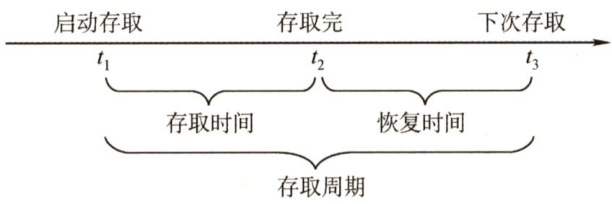
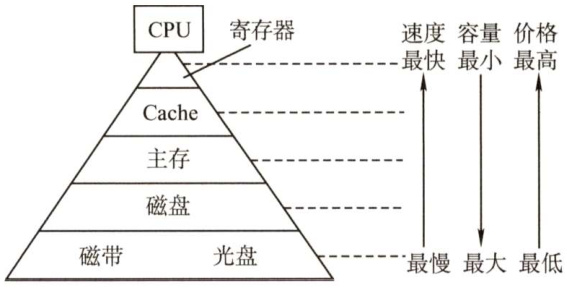
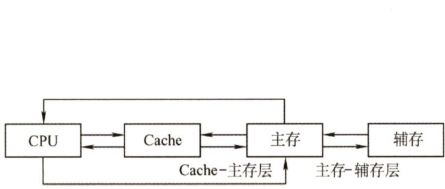

#### 3.1 存储器概述  

#### 3.1.1 存储器的分类  

存储器种类繁多，可从不同角度对存储器进行分类。  

#### 1．按在计算机中的作用（层次）分类  

1）主存储器。简称主存，又称内存储器（内存)，用来存放计算机运行期间所需的程序和数据，CPU可以直接随机地对其进行访问，也可以和高速缓冲存储器（Cache）及辅助存储器交换数据。其特点是容量较小、存取速度较快、每位的价格较高。  
2）辅助存储器。简称辅存，又称外存储器（外存)，用来存放当前暂时不用的程序和数据，以及一些需要永久性保存的信息。辅存的内容需要调入主存后才能被CPU 访问。其特点是容量大、存取速度较慢、单位成本低。  
3）高速缓冲存储器。简称Cache，位于主存和CPU之间，用来存放当前CPU 经常使用的指令和数据，以便CPU 能高速地访问它们。Cache 的存取速度可与CPU 的速度相匹配，但存储容量小、价格高。现代计算机通常将它们制作在CPU中。  

#### 2.按存储介质分类  

按存储介质，存储器可分为磁表面存储器（磁盘、磁带）、磁芯存储器、半导体存储器(MOS型存储器、双极型存储器）和光存储器（光盘)。  

#### 3．按存取方式分类  

1）随机存储器（RAM)。存储器的任何一个存储单元都可以随机存取，而且存取时间与存储单元的物理位置无关。其优点是读写方便、使用灵活，主要用作主存或高速缓冲存储器。RAM又分为静态RAM和动态RAM（第3节会详细介绍）。  

2）只读存储器（ROM)。存储器的内容只能随机读出而不能写入。信息一旦写入存储器就固定不变，即使断电，内容也不会丢失。因此，通常用它存放固定不变的程序、常数和汉字字库等。它与随机存储器可共同作为主存的一部分，统一构成主存的地址域。由ROM派生出的存储器也包含可反复重写的类型，ROM和RAM的存取方式均为随机存取。广义上的只读存储器已可通过电擦除等方式进行写入，其“只读”的概念没有保留，但仍保留了断电内容保留、随机读取特性，但其写入速度比读取速度慢得多。  

3）串行访问存储器。对存储单元进行读/写操作时，需按其物理位置的先后顺序寻址，包括顺序存取存储器（如磁带）与直接存取存储器（如磁盘、光盘)。  

顺序存取存储器的内容只能按某种顺序存取，存取时间的长短与信息在存储体上的物理位置有关，其特点是存取速度慢。直接存取存储器既不像RAM那样随机地访问任何一个存储单元，又不像顺序存取存储器那样完全按顺序存取，而是介于两者之间。存取信息时通常先寻找整个存储器中的某个小区域（如磁盘上的磁道)，再在小区域内顺序查找。  

#### 4.按信息的可保存性分类  

断电后，存储信息即消失的存储器，称为易失性存储器，如RAM。断电后信息仍然保持的存储器，称为非易失性存储器，如ROM、磁表面存储器和光存储器。若某个存储单元所存储的信息被读出时，原存储信息被破坏，则称为破坏性读出；若读出时，被读单元原存储信息不被破坏，则称为非破坏性读出。具有破坏性读出性能的存储器，每次读出操作后，必须紧接一个再生的操作，以便恢复被破坏的信息。  

#### 3.1.2 存储器的性能指标  

存储器有3个主要性能指标，即存储容量、单位成本和存储速度。这3个指标相互制约，设计存储器系统所追求的目标就是大容量、低成本和高速度。  

1）存储容量 $\mathbf{\Sigma}=\mathbf{\Sigma}$ 存储字数 $\times$ 字长（如 $1\ensuremath{\mathrm{M}}\times8$ 位）。单位换算：1B（Byte，字节） $=86$ （bit,位)。存储字数表示存储器的地址空间大小，字长表示一次存取操作的数据量。  

2）单位成本：每位价格 $\mathbf{\Sigma}=\mathbf{\Sigma}$ 总成本/总容量。  

3）存储速度：数据传输率 $\mathbf{\Sigma}=\mathbf{\Sigma}$ 数据的宽度/存储周期。  

$\textcircled{1}$ 存取时间（ $\cdot T_{\mathrm{a}}^{\cdot}$ ：存取时间是指从启动一次存储器操作到完成该操作所经历的时间，分为读出时间和写入时间。  
$\textcircled{2}$ 存取周期（ $T_{\mathrm{m}}$ )：存取周期又称读写周期或访问周期。它是指存储器进行一次完整的读写操作所需的全部时间，即连续两次独立访问存储器操作（读或写操作）之间所需的最小时间间隔。  
$\textcircled{3}$ 主存带宽（ $\cdot B_{\mathrm{m}}$ )：主存带宽又称数据传输率，表示每秒从主存进出信息的最大数量，单位为字/秒、字节/秒（ $|\mathbf{B}/\mathbf{s}\mathbf{\xi}|$ ）或位/秒（b/s）。  

存取时间不等于存储周期，通常存储周期大于存取时间。这是因为对任何一种存储器，在读写操作之后，总要有一段恢复内部状态的复原时间。对于破坏性读出的存储器，存取周期往往比存取时间大得多，甚至可达 $T_{\mathrm{m}}=2T_{\mathrm{a}}$ ，因为存储器中的信息读出后需要马上进行再生。  

存取时间与存取周期的关系如图3.1所示。  

  
图3.1存取时间与存取周期的关系  

#### 3.1.3 多级层次的存储系统  

为了解决存储系统大容量、高速度和低成本3个相互制约的矛盾，在计算机系统中，通常采用多级存储器结构，如图3.2所示。在图中由上至下，位价越来越低，速度越来越慢，容量越来越大，CPU访问的频度也越来越低。  

实际上，存储系统层次结构主要体现在Cache-主存层和主存-辅存层。前者主要解决CPU和主存速度不匹配的问题，后者主要解决存储系统的容量问题。在存储体系中，Cache、主存能与 CPU 直接交换信息，辅存则要通过主存与CPU交换信息；主存与CPU、Cache、辅存都能交换信息，如图3.3所示。  

  
图3.2多级存储器结构  

  
图3.3三级存储系统的层次结构及其构成  

存储器层次结构的主要思想是上一层的存储器作为低一层存储器的高速缓存。从CPU的角度看，Cache-主存层速度接近于Cache，容量和位价却接近于主存。从主存-辅存层分析，其速  

度接近于主存，容量和位价却接近于辅存。这就解决了速度、容量、成本这三者之间的矛盾，现代计算机系统几乎都采用这种三级存储系统。需要注意的是，主存和Cache 之间的数据调动是由硬件自动完成的，对所有程序员均是透明的；而主存和辅存之间的数据调动则是由硬件和操作系统共同完成的，对应用程序员是透明的。  

在主存-辅存层的不断发展中，逐渐形成了虚拟存储系统，在这个系统中程序员编程的地址范围与虚拟存储器的地址空间相对应。对具有虚拟存储器的计算机系统而言，编程时可用的地址空间远大于主存空间。  

注意：在Cache-主存层和主存-辅存层中，上一层中的内容都只是下一层中的内容的副本，也即Cache（或主存）中的内容只是主存（或辅存）中的内容的一部分。  

#### 3.1.4 本节习题精选  

#### 一、单项选择题  

01．磁盘属于（）类型的存储器。  

A.随机存取存储器（RAM） B.只读存储器（ROM）C.顺序存取存储器（SAM） D.直接存取存储器（DAM）  

02．存储器的存取周期是指（）。  

A.存储器的读出时间  
B．存储器的写入时间  
C.存储器进行连续读或写操作所允许的最短时间间隔  
D.存储器进行一次读或写操作所需的平均时间  

03．设机器字长为32位，一个容量为16MB的存储器，CPU按半字寻址，其可寻址的单元数是（）。  

A. $2^{24}$ B.223 C. $2^{22}$ D.221  

04．相联存储器是按（）进行寻址的存储器。  

A．地址指定方式  
B．堆栈存储方式  
C.内容指定方式和堆栈存储方式相结合
D．内容指定方式和地址指定方式相结合  

05．在下列几种存储器中，CPU不能直接访问的是（）。  

A.硬盘 B.内存 C. Cache D．寄存器  

06．若某存储器存储周期为 $250\mathrm{ns}$ ，每次读出16位，该存储器的数据传输率是（）。  

A. $4{\times}10^{6}\mathrm{B/s}$ B.4MB/s C. $8{\times}10^{6}\mathrm{B/s}$ D. ${8\times2^{20}}\mathrm{{B/s}}$  

07．设机器字长为64位，存储容量为128MB，若按字编址，它可寻址的单元个数是（  

A.16MB B.16M C.32M D.32MB  

08.计算机的存储器采用分级方式是为了（）。  

A．方便编程 B．解决容量、速度、价格三者之间的矛盾C.保存大量数据方便 D．操作方便  

09.计算机的存储系统是指（）。  

A.RAM B.ROMC.主存储器 D.Cache、主存储器和外存储器  

10.在多级存储体系中，“Cache-主存”结构的作用是解决（）的问题。  

A．主存容量不足 B.主存与辅存速度不匹配C.辅存与CPU速度不匹配 D.主存与CPU速度不匹配  

11．存储器分层体系结构中，存储器从速度最快到最慢的排列顺序是（）。  

A.寄存器－主存-Cache－辅存 B.寄存器－主存－辅存-Cache C.寄存器－Cache－辅存－主存 D.寄存器-Cache－主存－辅存  

12.在Cache和主存构成的两级存储体系中，主存与Cache同时访问，Cache的存取时间是$100\mathrm{{ns}}$ ，主存的存取时间是 $1000\mathrm{ns}$ ，设Cache和主存同时访问，若希望有效（平均）存取时间不超过Cache存取时间的 $115\%$ ，则Cache的命中率至少应为（）。  

A. $90\%$ B. $98\%$ C. $95\%$ D. $99\%$  

13．下列关于多级存储系统的说法中，正确的有（）。  

I．多级存储系统是为了降低存储成本II．虚拟存储器中主存和辅存之间的数据调动对任何程序员是透明的IIICPU只能与Cache直接交换信息，CPU与主存交换信息也需要经过Cache  

A.仅I B.仅I和ⅡI C.I、Ⅱ和IⅢ D.仅Ⅱ  

14.【2011统考真题】下列各类存储器中，不采用随机存取方式的是（）。  

A.EPROM B.CD-ROM C.DRAM D. SRAM  

#### 二、综合应用题  

01．某个两级存储器系统的平均访问时间为12ns，该存储器系统中顶层存储器的命中率为$90\%$ ，访问时间是5ns，该存储器系统中底层存储器的访问时间是多少（假设采用同时访问两级存储器的方式）？  

02.CPU执行一段程序时，Cache完成存取的次数为1900，主存完成存取的次数为100，已知Cache存取周期为50ns，主存存取周期为 $250\mathrm{ns}$ 。设主存与Cache同时访问。1）Cache/主存系统的效率是多少；2）平均访问时间是多少。  

#### 3.1.5 答案与解析  

#### 一、单项选择题  

01.D  

磁盘属于直接存取存储器，其速度介于随机存取存储器和顺序存取存储器之间。  

02.C  

存取时间 $T_{\mathrm{a}}$ 是指从存储器读出或写入一次信息所需要的平均时间；存取周期 $T_{\mathrm{c}}$ 是指连续两次访问存储器之间所必需的最短时间间隔。对 $T_{\mathrm{c}}$ 一般有 $T_{\mathrm{c}}=T_{\mathrm{a}}+T_{\mathrm{r}}$ ，其中 $T_{\mathrm{r}}$ 为复原时间；对SRAM指存取信息的稳定时间，对DRAM指刷新的又一次存取时间。 $\mathrm{~D~}$ 指的是存取时间。  

03.B  

$16\mathrm{MB}=2^{24}\mathrm{B}$ ，由于字长为32位，现按半字（2B）寻址，可寻址单元数为 $2^{24}\mathrm{B}/2\mathrm{B}=2^{23}$  

04.D  

相联存储器的基本原理是把存储单元所存内容的某一部分作为检索项（即关键字项）去检  

索该存储器，并将存储器中与该检索项符合的存储单元内容进行读出或写入。所以它是按内容或地址进行寻址的，价格较为昂贵。一般用来制作TLB、相联Cache 等。  

05.A  

CPU不能直接访问硬盘，需先将硬盘中的数据调入内存才能被CPU访问。  

06.C  

计算的是存储器的带宽，每个存储周期读出16bit $=\ 2\mathrm{B}$ ，因此数据传输率是$2\mathrm{B}/(250{\times}10^{-9}\mathrm{s})$ ，即 ${\bf8}{\times}10^{6}{\bf B}/{\bf s}$ 。本题中8MB/s 是 $\mathbf{8\times1024\times1024B/s}$ 。  

注意：通常，数据传输率中的M指的是 $10^{6}$ 而非 $2^{20}$ （后面I/O章节中的2009年真题便是如此)，一般二进制表示的K、M仅用于存储容量相关计算。  

07.B

机器字长位64位，即8B，按字编址，因此可寻址的单元个数是 $128\mathbf{MB}/8\mathbf{B}=16\mathbf{M}$ 0  

08.B  

存储器有3个主要特性：速度、容量和价格/位（简称位价)。存储器采用分级方式是为了解决这三者之间的矛盾。  

09.D  

计算机的存储系统包括CPU内部寄存器、Cache、主存和外存。  

10.D  

Cache 中的内容只是主存内容的部分副本（拷贝)，因而“Cache-主存”结构并未增加主存容量，目的是解决主存与CPU速度不匹配的问题。  

11.D  

在存储器分层结构中，寄存器在CPU 中，因此速度最快，Cache 次之，主存再次之，最慢的是辅存（如磁盘、光盘等)。  

12.D  

假设命中率为 $x$ ，可得 $100x\:+\:1000(1\:-\:x)\le100\times(1\:+\:15\%)$ ，简单计算后可得结果为 $x\geq$ $98.33\%$ ，因此命中率至少为 $99\%$ 。  

注意：本题采用同时访问Cache和主存的方式，此时不命中的访问时间为 $1000\mathrm{ns}$ ，但若题设中没有说明（通常会说明），则默认Cache不命中的时间为访问Cache和主存的时间之和。  

13.A  

主存和辅存之间的数据调动是由硬件和操作系统共同完成的，仅对应用级程序员透明。CPU与主存可直接交换信息。  

14.B  

随机存取是指CPU可对存储器的任一存储单元中的内容随机存取，而且存取时间与存储单元的物理位置无关。A、C和D均采用随机存取方式，CD-ROM即光盘，采用串行存取方式。注意，CD-ROM是只读型光盘存储器，其访问方式是顺序访问，不属于只读存储器ROM。  

#### 二、综合应用题  

01.【解答】  

设底层存储器访问时间为 $T$ ，则有 $12\mathrm{ns}=(0.90{\times}5\mathrm{ns})+(0.10{\times}T)$ ，求得 $T=75\mathrm{ns}$ o  

02.【解答】
  （1）命中率 $H={N_{\mathrm{c}}}/({N_{\mathrm{c}}}+{N_{\mathrm{m}}})=1900/(1900+100)=0.95$ 。主存访问时间与Cache 访问时间的倍率 $r=T_{\mathrm{m}}/T_{\mathrm{c}}=250\mathrm{ns}/50\mathrm{ns}=5$ ；Cache主存系统的效率 $e=$ 访问Cache的时间/平均访存时间。 访问效率 $e=1/[H+(1-H)r]=1/[0.95+(1-0.95)^{\times}5]=83.3\%$  
  
  （2）平均访问时间 $T_{\mathrm{a}}=T_{\mathrm{c}}/e=50\mathrm{ns}/0.833=60\mathrm{ns}$ 。