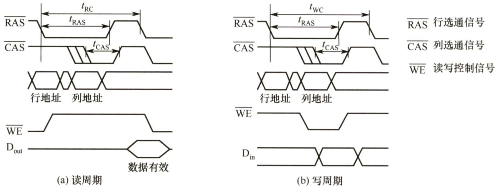
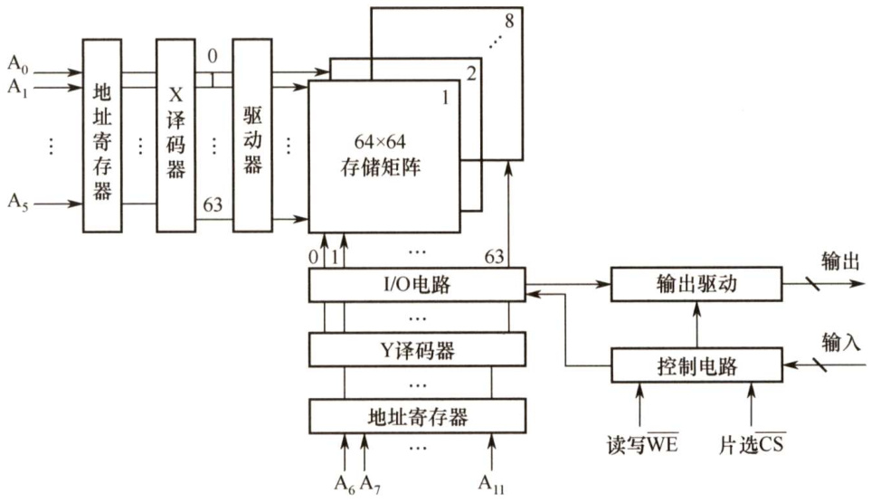
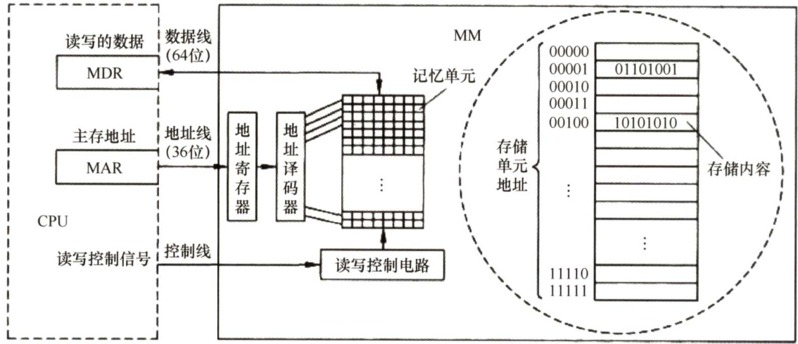
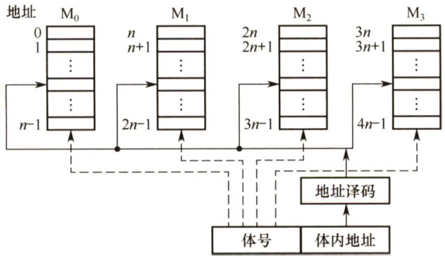
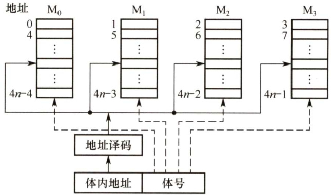
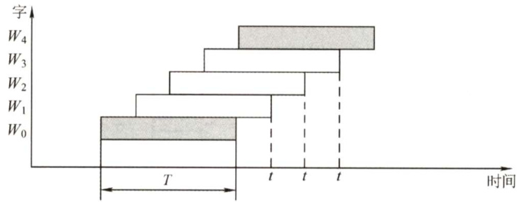
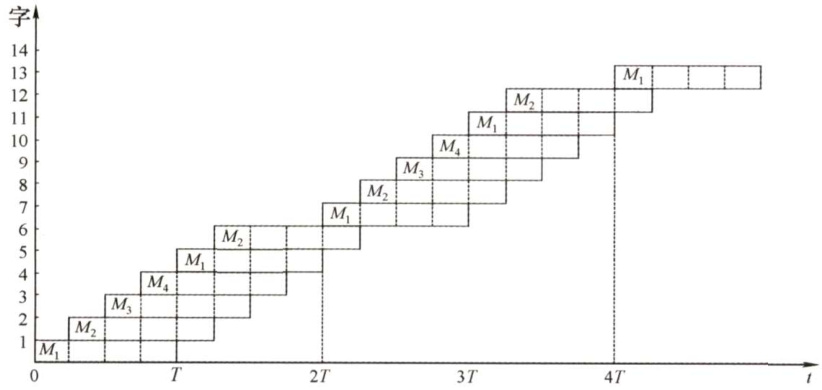

#### 3.2 主存储器  

主存储器由DRAM实现，靠处理器的那一层（Cache）则由SRAM实现，它们都属于易失性存储器，只要电源被切断，原来保存的信息便会丢失。DRAM的每位价格低于SRAM，速度也慢于SRAM，价格差异主要是因为制造SRAM需要更多的硅。ROM属于非易失性存储器。  

#### 3.2.1 SRAM芯片和DRAM芯片  

#### 1.SRAM的工作原理  

通常把存放一个二进制位的物理器件称为存储元，它是存储器的最基本的构件。地址码相同的多个存储元构成一个存储单元。若干存储单元的集合构成存储体。  

静态随机存储器（SRAM）的存储元是用双稳态触发器（六晶体管MOS）来记忆信息的，因此即使信息被读出后，它仍保持其原状态而不需要再生（非破坏性读出)。  

SRAM的存取速度快，但集成度低，功耗较大，价格昂贵，一般用于高速缓冲存储器。  

#### 2.DRAM的工作原理  

与 SRAM的存储原理不同，动态随机存储器（DRAM）是利用存储元电路中栅极电容上的电荷来存储信息的，DRAM的基本存储元通常只使用一个晶体管，所以它比SRAM的密度要高很多。相对于SRAM来说，DRAM具有容易集成、位价低、容量大和功耗低等优点，但DRAM的存取速度比SRAM的慢，一般用于大容量的主存系统。  

DRAM电容上的电荷一般只能维持 $1\sim2\mathrm{ms}$ ，因此即使电源不断电，信息也会自动消失。为此，每隔一定时间必须刷新，通常取 $2\mathrm{ms}$ ，称为刷新周期。常用的刷新方式有3种：  

1）集中刷新：指在一个刷新周期内，利用一段固定的时间，依次对存储器的所有行进行逐一再生，在此期间停止对存储器的读写操作，称为“死时间”，又称访存“死区”。优点是读写操作时不受刷新工作的影响；缺点是在集中刷新期间（死区）不能访问存储器。  

2）分散刷新：把对每行的刷新分散到各个工作周期中。这样，一个存储器的系统工作周期  

分为两部分：前半部分用于正常读、写或保持；后半部分用于刷新。这种刷新方式增加了系统的存取周期，如存储芯片的存取周期为 $0.5\upmu\mathrm{s}$ ，则系统的存取周期为 $1\upmu\mathrm{s}$ 。优点是没有死区；缺点是加长了系统的存取周期，降低了整机的速度。  

3）异步刷新：异步刷新是前两种方法的结合，它既可缩短“死时间”，又能充分利用最大刷新间隔为2ms 的特点。具体做法是将刷新周期除以行数，得到两次刷新操作之间的时间间隔t，利用逻辑电路每隔时间 $t$ 产生一次刷新请求。这样可以避免使CPU连续等待过长的时间，而且减少了刷新次数，从根本上提高了整机的工作效率。  

DRAM的刷新需注意以下问题： $\textcircled{1}$ 刷新对CPU是透明的，即刷新不依赖于外部的访问;$\textcircled{2}$ 动态RAM 的刷新单位是行，由芯片内部自行生成行地址； $\textcircled{3}$ 刷新操作类似于读操作，但又有所不同。另外，刷新时不需要选片，即整个存储器中的所有芯片同时被刷新。  

#### 3.DRAM芯片的读写周期  

在读周期中，为使芯片能正确接收行、列地址，在RAS有效前将行地址送到芯片的地址引脚，CAS 滞后RAS一段时间，在CAS 有效前再将列地址送到芯片的地址引脚，RAS、CAS 应至少保持 $t_{\mathrm{RAS}}$ 和 $t_{\mathrm{CAS}}$ 的时间。在读周期中WE 为高电平，并在CAS有效前建立。  

在写周期中，行列选通的时序关系和读周期相同。在写周期中WE 为低电平，同样在CAS有效前建立。为了保证数据可靠地写入，写数据必须在CAS有效前在数据总线上保持稳定。  

读（写）周期时间 $t_{\mathrm{RC}}$ （ $t_{\mathrm{WC}}$ ）表示DRAM芯片进行两次连续读（写）操作时所必须间隔的时间。DRAM芯片读写周期的时序图如图3.4所示。  

  
图3.4DRAM芯片读周期时序图  

#### 4.SRAM和DRAM的比较  

表3.1详细列出了SRAM和DRAM各自的特点。  

表3.1SRAM和DRAM各自的特点  

<html><body><table><tr><td>类型</td><td rowspan="2">SRAM</td><td rowspan="2">DRAM</td></tr><tr><td>特点</td></tr><tr><td>存储信息</td><td>触发器</td><td>电容</td></tr><tr><td>破坏性读出</td><td>非</td><td>是</td></tr><tr><td>需要刷新</td><td>不要</td><td>需要</td></tr><tr><td>送行列地址</td><td>同时送</td><td>分两次送</td></tr><tr><td>运行速度</td><td>快</td><td>慢</td></tr><tr><td>集成度</td><td>低</td><td>高</td></tr><tr><td>存储成本</td><td>高</td><td>低</td></tr><tr><td>主要用途</td><td>高速缓存</td><td>主机内存</td></tr></table></body></html>  

#### 5.存储器芯片的内部结构  

如图3.5所示，存储器芯片由存储体、I/O读写电路、地址译码和控制电路等部分组成。  

  
图3.5存储器芯片结构图  

1）存储体（存储矩阵)。存储体是存储单元的集合，它由行选择线（X）和列选择线（Y)来选择所访问单元，存储体的相同行、列上的位同时被读出或写入。  

2）地址译码器。用来将地址转换为译码输出线上的高电平，以便驱动相应的读写电路。  

3）I/O控制电路。用以控制被选中的单元的读出或写入，具有放大信息的作用。  

4）片选控制信号。单个芯片容量太小，往往满足不了计算机对存储器容量的要求，因此需用一定数量的芯片进行存储器的扩展。在访问某个字时，必须“选中”该存储字所在的芯片，而其他芯片不被“选中”，因此需要有片选控制信号。  

5）读/写控制信号。根据CPU给出的读命令或写命令，控制被选中单元进行读或写。  

#### 3.2.2 只读存储器  

#### 1.只读存储器（ROM）的特点  

ROM和RAM都是支持随机存取的存储器，其中SRAM和DRAM均为易失性半导体存储器。而ROM中一旦有了信息，就不能轻易改变，即使掉电也不会丢失，它在计算机系统中是只供读出的存储器。ROM器件有两个显著的优点：  

1）结构简单，所以位密度比可读写存储器的高。  
2）具有非易失性，所以可靠性高。  

#### 2.ROM的类型  

根据制造工艺的不同，ROM可分为掩模式只读存储器（MROM）、一次可编程只读存储器(PROM）、可擦除可编程只读存储器（EPROM)、Flash存储器和固态硬盘（SSD）。  

#### （1）掩模式只读存储器  

MROM的内容由半导体制造厂按用户提出的要求在芯片的生产过程中直接写入，写入以后任何人都无法改变其内容。优点是可靠性高，集成度高，价格便宜；缺点是灵活性差。  

#### （2）一次可编程只读存储器  

PROM是可以实现一次性编程的只读存储器。允许用户利用专门的设备（编程器）写入自  

己的程序，一旦写入，内容就无法改变。  

（3）可擦除可编程只读存储器  

EPROM不仅可以由用户利用编程器写入信息，而且可以对其内容进行多次改写。EPROM虽然既可读又可写，但它不能取代RAM，因为EPROM的编程次数有限，且写入时间过长。  

#### （4）Flash存储器  

Flash 存储器是在EPROM与 $\operatorname{E}^{2}\mathrm{PROM}$ 的基础上发展起来的，其主要特点是既可在不加电的情况下长期保存信息，又能在线进行快速擦除与重写。Flash 存储器既有EPROM 的价格便宜、集成度高的优点，又有EPROM电可擦除重写的特点，且擦除重写的速度快。  

（5）固态硬盘（SolidStateDrives，SSD）  

基于闪存的固态硬盘是用固态电子存储芯片阵列制成的硬盘，由控制单元和存储单元（Flash 芯片）组成。保留了Flash 存储器长期保存信息、快速擦除与重写的特性。对比传统硬盘也具有读写速度快、低功耗的特性，缺点是价格较高。  

#### 3.2.3 主存储器的基本组成  

图3.6是主存储器（MainMemory，MM）的基本组成框图，其中由一个个存储0或1的记忆单元（也称存储元件）构成的存储矩阵（也称存储体）是存储器的核心部分。记忆单元是具有两种稳态的能表示二进制0和1的物理器件。为了存取存储体中的信息，必须对存储单元编号（也称编址)。编址单位是指具有相同地址的那些存储元件构成的一个单位，可以按字节编址，也可以按字编址。现代计算机通常采用字节编址方式，此时存储体内的一个地址中有1字节。  

  
图3.6主存储器的基本组成框图  

指令执行过程中需要访问主存时，CPU 首先把被访问单元的地址送到MAR 中，然后通过地址线将主存地址送到主存中的地址寄存器，以便地址译码器进行译码选中相应单元，同时CPU 将读写信号通过控制线送到主存的读写控制电路。如果是写操作，那么CPU同时将要写的信息送到MDR 中，在读写控制电路的控制下，经数据线将信号写入选中的单元；如果是读操作，那么主存读出选中单元的内容送到数据线，然后送到MDR中。数据线的宽度与MDR 的宽度相同，地址线的宽度与MAR 的宽度相同。图3.6 采用64 位数据线，所以在按字节编址方式下，每次最多可以存取8个单元的内容。地址线的位数决定了主存地址空间的最大可寻址范围。例如，36位地址的最大寻址范围为 $0{\sim}2^{36}-1$ ，即地址从0开始编号。  

DRAM芯片容量较大，地址位数较多，为了减少芯片的地址引脚数，通常采用地址引脚复用技术，行地址和列地址通过相同的引脚分先后两次输入，这样地址引脚数可减少一半。  

数据线数和地址线数共同反映存储体容量的大小，图3.6中芯片的容量 $=2^{36}{\times}64$ 位。  

#### 3.2.4 多模块存储器  

多模块存储器是一种空间并行技术，利用多个结构完全相同的存储模块的并行工作来提高存储器的吞吐率。常用的有单体多字存储器和多体低位交叉存储器。  

注意：CPU的速度比存储器的快，若同时从存储器中取出 $n$ 条指令，就可充分利用CPU资源，提高运行速度。多体交叉存储器就是基于这种思想提出的。  

#### 1．单体多字存储器  

单体多字系统的特点是存储器中只有一个存储体，每个存储单元存储 $m$ 个字，总线宽度也为 $m$ 个字。一次并行读出 $m$ 个字，地址必须顺序排列并处于同一存储单元。  

单体多字系统在一个存取周期内，从同一地址取出 $m$ 条指令，然后将指令逐条送至CPU执行，即每隔 $1/m$ 存取周期，CPU向主存取一条指令。这显然提高了单体存储器的工作速度。  

缺点：指令和数据在主存内必须是连续存放的，一旦遇到转移指令，或操作数不能连续存放，这种方法的效果就不明显。  

#### 2.多体并行存储器  

多体并行存储器由多体模块组成。每个模块都有相同的容量和存取速度，各模块都有独立的读写控制电路、地址寄存器和数据寄存器。它们既能并行工作，又能交叉工作。  

多体并行存储器分为高位交叉编址和低位交叉编址两种。  

（1）高位交叉编址（顺序方式）  

高位地址表示体号，低位地址为体内地址。如图3.7所示，存储器共有4个模块 ${\bf M}_{0}{\sim}{\bf M}_{3}$ ，每个模块有 $n$ 个单元，各模块的地址范围如图中所示。  

  
图3.7高位交叉编址的多体存储器  

高位交叉方式下，总是把低位的体内地址送到由高位体号确定的模块内进行译码。访问一个连续主存块时，总是先在一个模块内访问，等到该模块访问完才转到下一个模块访问，CPU总是按顺序访问存储模块，各模块不能被并行访问，因而不能提高存储器的吞吐率。  

注意：模块内的地址是连续的，存取方式仍是串行存取，因此这种存储器仍是顺序存储器。  

（2）低位交叉编址（交叉方式）  

低位地址为体号，高位地址为体内地址。如图3.8所示，每个模块按“模 $m$ ”交叉编址，模块号 $\mathbf{\Sigma}=\mathbf{\Sigma}$ 单元地址 $\%\ m$ ，假定有 $m$ 个模块，每个模块有 $k$ 个单元，则0, $m,\cdots$ ， $(k\ -1)m$ 单元位于$\mathbf{M}_{0}$ ；第 $1,m+1,\cdots,(k-1)m+1$ 单元位于 $\mathbf{M}_{1}$ ；以此类推。  

  
图3.8低位交叉编址的多体存储器  

低位交叉方式下，总是把高位的体内地址送到由低位体号确定的模块内进行译码。程序连续存放在相邻模块中，因此称采用此编址方式的存储器为交叉存储器。采用低位交叉编址后，可在不改变每个模块存取周期的前提下，采用流水线的方式并行存取，提高存储器的带宽。  

设模块字长等于数据总线宽度，模块存取一个字的存取周期为T，总线传送周期为 $\boldsymbol{r}$ ，为实现流水线方式存取，存储器交叉模块数应大于等于  

$$
m=T/r
$$  

式中， $m$ 称为交叉存取度。每经过 $\boldsymbol{r}$ 时间延迟后启动下一个模块，交叉存储器要求其模块数必须大于等于 $m$ ，以保证启动某模块后经过 $m{\times}r$ 的时间后再次启动该模块时，其上次的存取操作已经完成（即流水线不间断)。这样，连续存取 $m$ 个字所需的时间为  

$$
t_{1}=T+(m-1)r
$$  

而顺序方式连续读取 $m$ 个字所需的时间为 $t_{2}~=~m T$ 。可见低位交叉存储器的带宽大大提高。模块数为4的流水线方式存取示意图如图3.9所示。  

  
图3.9低位交叉编址流水线方式存取示意图  

【例3.1】设存储器容量为32个字，字长为64位，模块数 $m=4$ ，分别采用顺序方式和交叉方式进行组织。存储周期 $T=200\mathrm{ns}$ ，数据总线宽度为64位，总线传输周期 $r=50\mathrm{ns}$ 。在连续读出4个字的情况下，求顺序存储器和交叉存储器各自的带宽。  

解：顺序存储器和交叉存储器连续读出 $m=4$ 个字的信息总量均是  

顺序存储器和交叉存储器连续读出4个字所需的时间分别是  

$$
t_{1}=m T=4{\times}200\mathrm{ns}=800\mathrm{ns}=8{\times}10^{-7}\mathrm{s}
$$  

$$
t_{2}=T+(m{-}1)r=200\mathrm{ns}+3{\times}50\mathrm{ns}=350\mathrm{ns}=35{\times}10^{-8}\mathrm{s}
$$  

顺序存储器和交叉存储器的带宽分别是  

$$
\begin{array}{c}{W_{1}=q/t_{1}=256/(8\times10^{-7})=32\times10^{7}\mathrm{b/s}}\\ {W_{2}=q/t_{2}=256/(35\times10^{-8})=73\times10^{7}\mathrm{b/s}}\end{array}
$$  

#### 3.2.5 本节习题精选  

#### 一、单项选择题  

01．某一SRAM芯片，其容量为 $1024\times8$ 位，除电源和接地端外，该芯片的引脚的最小数目为（）。  

A.21 B.22 C.23 D.24  

02.某存储器容量为 $32\mathrm{K}\times16$ 位，则（）。  

A．地址线为16根，数据线为32根 B．地址线为32根，数据线为16根C．地址线为15根，数据线为16根 D．地址线为15根，数据线为32根  

03.若RAM中每个存储单元为16位，则下面所述正确的是（）。  

A．地址线是16位 B.数据线是16位C．指令长度是16位 D.以上说法都不正确  

04.DRAM的刷新是以（）为单位的。  

A．存储单元 B.行 C.列 D．存储字  

05.动态RAM采用下列哪种刷新方式时，不存在死时间（）。  

A．集中刷新 B．分散刷新 C．异步刷新 D.都不对  

06.下面是有关DRAM和SRAM存储器芯片的叙述：  

I.DRAM芯片的集成度比SRAM芯片的高  
II.DRAM芯片的成本比SRAM芯片的高  
III.DRAM芯片的速度比SRAM芯片的快  
IV.DRAM芯片工作时需要刷新，SRAM芯片工作时不需要刷新  

通常情况下，错误的是（）。  

A.I和Ⅱ B.Ⅱ和II C.IⅢ和IV D.I和IV  

07．下列说法中，正确的是（）。  

A.半导体RAM信息可读可写，且断电后仍能保持记忆B.DRAM是易失性RAM，而SRAM中的存储信息是不易失的C.半导体RAM是易失性RAM，但只要电源不断电，所存信息是不丢失的D.半导体RAM是非易失性RAM  

08.关于SRAM和DRAM，下列叙述中正确的是（）。  

A．通常SRAM依靠电容暂存电荷来存储信息，电容上有电荷为1，无电荷为0B.DRAM依靠双稳态电路的两个稳定状态来分别存储0和1C.SRAM速度较慢，但集成度稍高；DRAM速度稍快，但集成度低D.SRAM速度较快，但集成度稍低；DRAM速度稍慢，但集成度高  

09．某一DRAM芯片，采用地址复用技术，其容量为 $1024\times8$ 位，除电源和接地端外，该芯片的引脚数最少是（）(读写控制线为两根)。  

A.16 B.17 C. 19 D.21  

10．下列几种存储器中，（）是易失性存储器。  

A. Cache B.EPROM C.Flash存储器 D.CD-ROM  

11.U盘属于（）类型的存储器。  

A．高速缓存 B.主存 C.只读存储器 D.随机存取存储器  

12．某计算机系统，其操作系统保存于硬盘上，其内存储器应该采用（）。  

A.RAM B.ROM C.RAM和ROMD．均不完善  

13．下列说法正确的是（）。  

A.EPROM是可改写的，因此可以作为随机存储器B.EPROM是可改写的，但不能作为随机存储器C.EPROM是不可改写的，因此不能作为随机存储器D.EPROM只能改写一次，因此不能作为随机存储器  

14．下列（）是动态半导体存储器的特点。  

I.在工作中存储器内容会产生变化II．每隔一定时间，需要根据原存内容重新写入一遍III．一次完整的刷新过程需要占用两个存储周期IV．一次完整的刷新过程只需要占用一个存储周期  

A.I、IⅢI B.I、II C.II、IV D.只有II  

15.已知单个存储体的存储周期为110ns，总线传输周期为10ns，采用低位交叉编址的多模块存储器时，存储体数应（）。  

A.小于11 B．等于11 C．大于11 D．大于等于11  

16．一个四体并行低位交叉存储器，每个模块的容量是 $64\mathrm{K}\times32$ 位，存取周期为 $200\mathrm{ns}$ ，总线周期为50ns，在下述说法中，（）是正确的。  

A.在 $200\mathrm{ns}$ 内，存储器能向CPU提供256位二进制信息B.在 $200\mathrm{{ns}}$ 内，存储器能向CPU提供128位二进制信息C.在50ns内，每个模块能向CPU提供32位二进制信息D.以上都不对  

17．某机器采用四体低位交叉存储器，现分别执行下述操作： $\textcircled{1}$ 读取6个连续地址单元中存放的存储字，重复80次； $\textcircled{2}$ 读取8个连续地址单元中存放的存储字，重复60次。则 $\textcircled{1}$ ， $\textcircled{2}$ 所花费的时间之比为（）  

A.1:1 B.2:1 C.4:3 D.3:4  

18．下列说法中，正确的是（）。  

I．高位多体交叉存储器能很好地满足程序的局部性原理II．高位四体交叉存储器可能在一个存储周期内连续访问4个模块III．双端口存储器可以同时访问同一区间、同一单元IV．双端口存储器当两个端口的地址码相同时，必然会发生冲突  

A.I、III B.Ⅱ、III C.Ⅱ、Ⅲ和IV D.II、IV  

19．假定用若干 $16\mathsf{K}\times8$ 位的存储芯片组成一个 $64\mathrm{K}\times8$ 位的存储器，芯片各单元采用交叉编址方式，则地址BFFFH所在的芯片的最小地址为（）。  

A.0000H B.0001H C. 0002H D. 0003H  

20.【2010统考真题】下列有关RAM和ROM的叙述中，正确的是（）。  

I.RAM是易失性存储器，ROM是非易失性存储器II.RAM和ROM都采用随机存取方式进行信息访问III.RAM和ROM都可用作Cache  
IV.RAM和ROM都需要进行刷新  

A.仅I和ⅡI B.仅Ⅱ和IⅢ C.仅I、Ⅱ和IⅢ D.仅Ⅱ、I和IV  

21.【2012统考真题】下列关于闪存的叙述中，错误的是（）。  

A.信息可读可写，并且读、写速度一样快B.存储元由MOS管组成，是一种半导体存储器C.掉电后信息不丢失，是一种非易失性存储器D.采用随机访问方式，可替代计算机外部存储器  

22.【2014统考真题】某容量为256MB的存储器由若干 $4\mathbf{M}\times8$ 位的DRAM芯片构成，该DRAM芯片的地址引脚和数据引脚总数是（）。  

A.19 B.22 C.30 D.36  

23.【2015统考真题】下列存储器中，在工作期间需要周期性刷新的是（）。  

A. SRAM B.SDRAM C.ROM D.Flash  

24.【2015统考真题】某计算机使用四体交叉编址存储器，假定在存储器总线上出现的主存地址（十进制）序列为8005,8006,8007,8008,8001,8002,8003,8004,8000，则可能发生访存冲突的地址对是（）。  

A.8004和8008 B.8002和8007 C.8001和8008 D.8000和8004  

25.【2017统考真题】某计算机主存按字节编址，由4个 $64\mathbf{M}\times8$ 位的DRAM芯片采用交叉编址方式构成，并与宽度为32位的存储器总线相连，主存每次最多读写32位数据。若double型变量x的主存地址为804001AH，则读取 $\textbf{x}$ 需要的存储周期数是（）。  

A.1 B.2 C.3 D.4  

#### 二、综合应用题  

01．在显示适配器中，用于存放显示信息的存储器称为刷新存储器，它的重要性能指标是带宽。具体工作中，显示适配器的多个功能部分要争用刷新存储器的带宽。设总带宽$50\%$ 用于刷新屏幕，保留 $50\%$ 的带宽用于其他非刷新功能，且采用分辨率为 $1024\times768$ 像素、颜色深度为3B、刷新频率为 $72\mathrm{{Hz}}$ 的工作方式。  

1）试计算刷新存储器的总带宽。  
2）为达到这样高的刷新存储器带宽，应采取何种技术措施？  

02．一个四体并行交叉存储器，每个模块容量是 $64\mathrm{K}\times32$ 位，存取周期为 $200\mathrm{ns}$ ，问：  

1）在一个存取周期中，存储器能向CPU提供多少位二进制信息？2）若存取周期为 $400\mathrm{ns}$ ，则在 $0.1\upmu\mathrm{s}$ 内每个体可向CPU提供32位二进制信息，该说法正确否？为什么？  

03.某计算机字长32位，存储体的存储周期为 $200\mathrm{ns}$ Q  

1）采用四体交叉工作，用低2位的地址作为体地址，存储数据按地址顺序存放。主机最快多长时间可以读出一个数据字？存储器的带宽是多少？  
2）若4个体分别保存主存中前1/4、次1/4、再下个1/4、最后1/4这四段的数据，即选用高2位的地址作为体地址，可以提高存储器顺序读出数据的速度吗？为什么？  
3）若把存储器改成单体4字宽度，会带来什么好处和问题？  
4）比较采用四体低位地址交叉的存储器和四端口读出的存储器这两种方案的优缺点。  

04.假定一个存储器系统支持四体交叉存取，某程序执行过程中访问地址序列为3，9,17,2，51,37,13,4，8,41，67，10，哪些地址访问会发生体冲突？  

#### 3.2.6 答案与解析  

#### 一、单项选择题  

01.A  

芯片容量为 $1024\times8$ 位，说明芯片容量为1024B，且以字节为单位存取，即地址线数要10根（ $1024\mathrm{B}=2^{10}\mathrm{B}$ )。8位说明数据线要8根，加上片选线和读/写控制线（读控制为RD、写控制为WE)，因此引脚数最小为 $10+8+1+2=21$ 根。  

注意：读写控制线也可共用一根，但题中无20选项，做题时应随机应变。  

02.C该芯片16位，所以数据线为16根，寻址空间 $32\mathrm{K}=2^{15}$ ，所以地址线为15 根。  

03.B 地址线只与RAM的存储单元个数有关，而与存储单元的字长无关。  

04.BDRAM的刷新按行进行。  

05.B  

集中刷新必然存在死时间。采用分散刷新时，机器的存取周期中的一段用来读/写，另一段用来刷新，因此不存在死时间，但存取周期变长。异步刷新虽然缩短了死时间，但死时间依然存在。  

#### 06.B  

DRAM芯片的集成度高于SRAM，I正确；SRAM芯片的速度高于DRAM，III错误；可以推出DRAM芯片的成本低于SRAM，ⅡI错误；SRAM芯片工作时不需要刷新，DRAM芯片工作时需要刷新，IV正确。  

07.C  

RAM属于易失性半导体，因此A、B、D错误，SRAM和DRAM的区别在于是否需要动态刷新。  

08.D  

SRAM 依靠双稳态电路的两个稳定状态来分别存储〇和1，A 错误。DRAM 依靠电容暂存电荷来存储信息，电容上有电荷为1，无电荷为0，B 错误。SRAM速度较快，不需要动态刷新，但集成度稍低，功耗大，单位价格高；DRAM集成度高，功耗小，单位价格较低，需定时刷新，速度慢，因此C错误、D正确。  

#### 09.B  

$1024\times8$ 位，因此可寻址范围是 $1024\mathrm{B}=2^{10}\mathrm{B}$ ，按字节寻址。采用地址复用技术时，通过行通选和列通选分行、列两次传送地址信号，因此地址线减半为5根，数据线仍为8根；加上行  

通选和列通选及读/写控制线（片选线用行通选代替）4根，总共是17根。  

注意SRAM和DRAM的区别，DRAM采用地址复用技术，而SRAM不采用。  

10.A  

Cache由SRAM组成，掉电后信息即消失，属于易失性存储器。  

11.C  

U盘采用Flash存储器技术，它是在 $\operatorname{E}^{2}\mathrm{PROM}$ 的基础上发展起来的，属于ROM的一种。由于擦写速度和性价比均很可观，因此其常用作辅存。  

注意：随机存取与随机存取存储器（RAM）不同，只读存储器（ROM）也是随机存取的。因此，支持随机存取的存储器并不一定是RAM。  

#### 12.C  

因计算机的操作系统保存于硬盘上，所以需要BIOS的引导程序将操作系统引导到主存（RAM）中，而引导程序则固化于ROM中。  

#### 13.B  

EPROM可多次改写，但改写较为烦琐，写入时间过长，且改写的次数有限，速度较慢，因此不能作为需要频繁读写的RAM使用。  

#### 14.C  

动态半导体存储器利用电容存储电荷的特性记录信息，由于电容会放电，必须在电荷流失前对电容充电，即刷新。方法是每隔一定的时间，根据原存内容重新写入一遍，因此I错误。这里的读并不是把信息读入CPU，也不是从CPU向主存存入信息，它只是把信息读出，通过一个刷新放大器后又重新存回存储单元，而刷新放大器是集成在RAM上的。因此，这里只进行了一次访存，也就是占用一个存取周期，ⅡI、IV正确，III错误。  

#### 15.D  

为保证第二次启动某个体时，其上次存取操作已完成，存储体的数量应大于等于11（ $110\mathrm{ns}/10\mathrm{ns}=11\$ 。  

16.B  

低位交叉存储器采用流水线技术，它可在一个存取周期内连续访问4个模块，32 位 $\times4=$ 128位。本题答案为B。  

注：本题若作为计算题来考虑，从第一个字的读写请求发出，到第4个字读写结束，共需要 $350\mathrm{ns}$ ，但这里考查的是整体工作性能，可从以下角度理解：  

1）连续取 $m$ 个字耗时 $t_{1}=T+(m\textrm{--}1)r$ ，平均每个字的存取时间是 $t_{1}/m$ ，实际工作时 $m$ 非常大，因此 $t_{1}/m$ 也就非常接近 $\boldsymbol{r}$ ，可认为存储器在每个总线周期 $\boldsymbol{r}$ 都能给CPU提供一个字。  
2）流水线充分流动起来后，每个总线周期后都能完成一个字的读写，所以本题中每4个总线周期（ $200\mathrm{ns}$ ）都能完成4个字的读写。  

17.C  

1）在每轮读取存储器的前6个 $T/4$ 时间（共3T/2）内，依次进入各体。下一轮欲读取存储器时，最近访问的 $\mathbf{M}_{1}$ 还在占用中（才过 $T/2$ 的时间)，因此必须再等待 $T/2$ 的时间才能开始新的读取（ $\mathbf{M}_{1}$ 连续完成两次读取，也即总共 $2T$ 的时间即可进入下一轮)。注意：进入下一轮不需要第6个字读取结束，第5个字读取结束， $\mathbf{M}_{1}$ 就已空出，即可马上进入下一轮。最后一轮读取结束的时间是本轮第6个字读取结束，共 $(6-1){\times}(T/4)+T=2.25T\mathrm{\Omega}$ 情况1）的总时间为 $(80-1){\times}2T+2.25T=160.25T_{\circ}$   
2）每轮读取8个存储字刚好经过 $2T$ 的时间，每轮结束后，最近访问的 $\mathbf{M}_{1}$ 刚好经过了时间T，此时可以立即开始下一轮的读取，见下图。最后一轮读取结束的时间是本轮第8个字读取结束，共 $(8-1){\times}(T/4)+T{=}2.75T_{\circ}$ 情况1）的总时间为 $(60-1){\times}2T+2.75T=120.75T_{\circ}$ 因此情况1）和2）所花费的总时间比为4:3。  

  

18.B  

高位交叉存储器在单个存储器中的字是连续存放的，不满足程序的局部性原理；而低位交叉存储器是交叉存放，很好地满足了程序的局部性原理，I错误。高位四体交叉存储器虽然不能满足程序的连续读取，但仍可能一次连续读出彼此地址相差一个存储体容量的4 个字，只是这么读的概率较小，ⅡI正确。双端口存储器具有两套独立读/写口，具有各自的地址寄存器和译码电路，所以可以同时访问同一区间、同一单元，ⅡII正确。当两个端口同时对相同的单元进行读操作时，则不会发生冲突，IV错误。  

19.D  

$64\mathrm{K}\times8$ 位 $16\mathbf{K}{\times}8$ 位 $=4$ ，可知芯片数为4。芯片各单元采用交叉编址，所以每个芯片的片选信号由最低两位地址确定，高14 位为片内地址。4个芯片内各存储单元的最低两位地址分别为00、01、10、11，即最小地址分别为 $0000\mathrm{H}$ 、0001H、0002H、 $0003\mathrm{H}$ 。地址BFFFH最低两位为11，因此该存储单元所在芯片的最小地址为 $0003\mathrm{H}$ o  

20.A  

一般Cache采用高速的SRAM制作，比ROM的速度快很多，因此II错误。动态RAM 需要刷新，而ROM不需要刷新，因此IV错误。  

21.A  

闪存是EPROM的进一步发展，可读可写，用MOS 管的浮栅上有无电荷来存储信息。闪存依然是ROM的一种，写入时必须先擦除原有数据，因此写速度比读速度要慢不少（硬件常识)。闪存是一种非易失性存储器，它采用随机访问方式。现在常见的 SSD 固态硬盘，它由Flash芯片组成。  

22.A  

$4\mathbf{M}\times8$ 位的芯片数据线应为8根，地址线应为 $\mathrm{log}_{2}4\mathrm{M}=22$ 根，而DRAM采用地址复用技术，地址线是原来的 $1/2$ ，且地址信号分行、列两次传送。地址线数为 $22/2=11$ 根，所以地址引脚与数据引脚的总数为 $11+8=19$ 根，选A。此题需要注意DRAM采用的是传两次地址的策略，所以地址线为正常的一半，这是很多考生容易忽略的地方。  

#### 23.B  

DRAM使用电容存储，所以必须隔一段时间刷新一次，若存储单元未被刷新，则存储的信息就会丢失。SDRAM表示同步动态随机存储器。  

#### 24.D  

每个访存地址对应的存储模块序号（0，1，2.3）如下所示：  

<html><body><table><tr><td>访存地址</td><td>8005</td><td>8006</td><td>8007</td><td>8008</td><td>8001</td><td>8002</td><td>8003</td><td>8004</td><td>8000</td></tr><tr><td>模块序号</td><td>1</td><td>2</td><td>3</td><td>0</td><td>1</td><td>2</td><td>3</td><td>0</td><td>0</td></tr></table></body></html>  

其中，模块序号 $\mathbf{\Sigma}=\mathbf{\Sigma}$ 访存地址 $.\%$ 存储器交叉模块数。  

判断可能发生访存冲突的规则如下：给定的访存地址在相邻的四次访问中出现在同一个存储模块内。据此，根据上表可知8004和8000对应的模块号都为0，即表明这两次的访问出现在同一模块内且在相邻的访问请求中，满足发生冲突的条件。  

#### 25.C  

解析请扫右侧二维码查阅。  

#### 二、综合应用题  

01.【解答】  

1）因为刷新带宽 $\boldsymbol{W}_{1}=$ 分辨率 $\times$ 像素点颜色深度 $\times$ 刷新速率 ${\begin{array}{r l}{\mathbf{\Delta}}&{=1024\times768\times3\mathbf{B}\times72/\mathbf{s}}\\ {\mathbf{\Delta}}&{=169869\mathbf{K}\mathbf{B}/\mathbf{s}}\end{array}}$  

所以刷新总带宽 $W_{0}=W_{1}(W_{0}/W_{1})$ $=169869\mathrm{KB/s}\times100/50=339738\mathrm{KB/s}$ $=339.738\mathrm{MB/s}$ （其中 $1\mathrm{K}=1000$ ）  

2）要提高刷新存储器带宽，可采用以下技术： $\textcircled{1}$ 采用高速DRAM芯片； $\textcircled{2}$ 采用多体交叉存储结构； $\textcircled{3}$ 刷新存储器至显示控制器的内部总线宽度加倍； $\textcircled{4}$ 采用双端口存储器将刷新端口和更新端口分开。  

02.【解答】  

1）一个存取周期，四体并行交叉存储器可取32位 $\times4\:=\:128$ 位，其中32位为总线宽度，4为交叉存储器内的存储体个数。  
2）该说法不正确。因为在 $0.1\upmu\mathrm{s}$ 内整个存储器可向CPU提供32位二进制信息，但每个存储体必须经过 $400\mathrm{ns}$ 才能向CPU提供32位二进制信息。  

03.【解答】  

关于交叉存储器的题目在2013年、2015年出现过两次，希望能引起读者的足够重视，本题应是这一类题中较难的。  

1）因为每个体的存取周期是 $200\mathrm{ns}$ 。四体交叉轮流工作，每两个体间读出操作的延时为1/4个存储周期，理想情况是每个存取周期平均可读出4个数据字，读出一个数据字的时间平均为 $200\mathrm{{ns}}/4~=~50\mathrm{{ns}}$ 。数据字长为32位，数据传输率为32位 $/50\mathrm{ns}\ =\ 640\mathrm{Mb/s}\ =$ 80MB/s。  

2）若对多体结构的存储器选用高位地址交叉，通常起不到提高存储器读写速度的作用，因为它不符合程序运行的局部性原理，一次连续读出彼此地址相差一个存储体容量的4个字的机会太少。因此，通常只有一个存储模块在不停地忙碌，其他存储模块是空闲的。  

3）若把存储器的字长扩大为原来的4倍，实现的则是一个单体4字结构的存储器，每次读可以同时读出4个字的内容，有利于提高存储器每个字的平均读写速度，但其灵活性不如多体单字结构的存储器，还会多用到几个缓冲寄存器。  

4）多端口存储器是对同一个存储体使用多套读写电路实现的，扩大存储容量的难度显然比多体结构的存储器要大，而且不能对多端口存储器的同一个存储单元同时执行多个写入操作，而多体结构的存储器则允许在同一个存储周期对几个存储体执行写入操作。  

04.【解答】  

对于四体交叉访问的存储系统，每个存储模块的地址分布如下：Bank0:0,4,8,12,16,.·Bank1:1,5,9,13,17,,37,·,41,.·Bank2:2,6,10,14,18,.Bank3:3,7,11,15,19,,51,,67  

若给定的访存地址在相邻的4 次访问中出现在同一个Bank 内，就会发生访存冲突。所以17和9、37和17、13和37、8和4发生冲突。