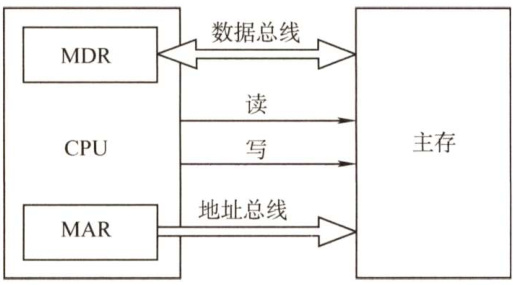
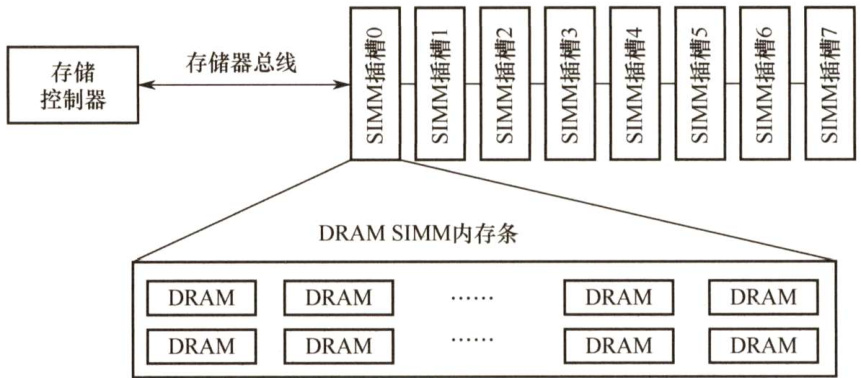
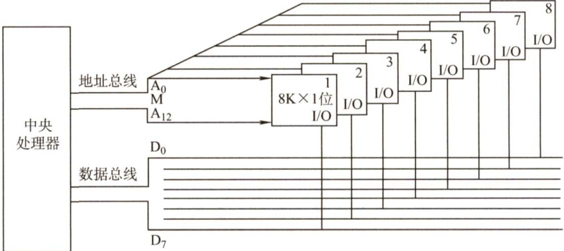
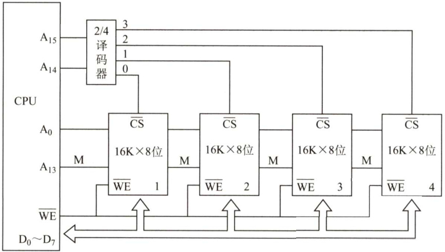
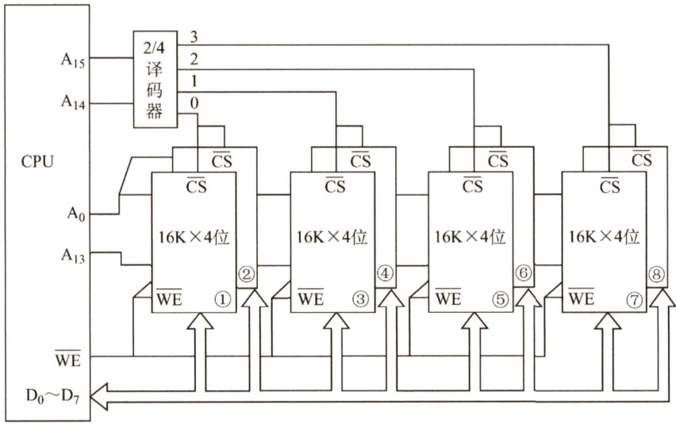
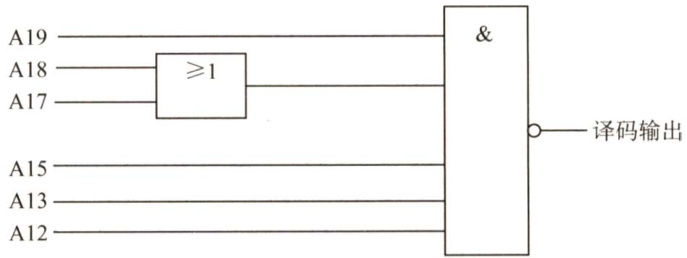
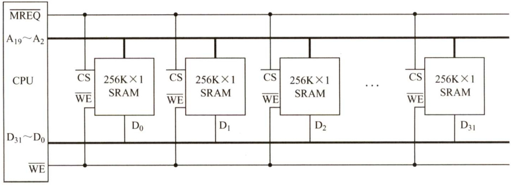
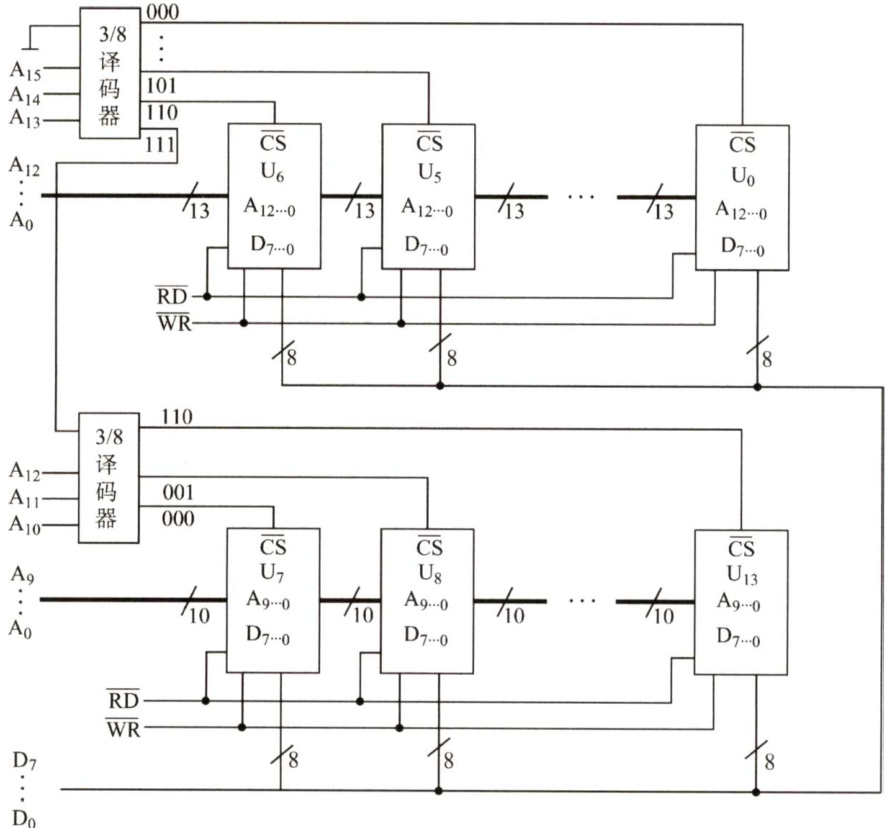

#### 3.3 主存储器与CPU的连接  

#### 3.3.1 连接原理  

1）主存储器通过数据总线、地址总线和控制总线与CPU连接。  
2）数据总线的位数与工作频率的乘积正比于数据传输率。  
3）地址总线的位数决定了可寻址的最大内存空间。  
4）控制总线（读/写）指出总线周期的类型和本次输入/输出操作完成的时刻。  

主存储器与CPU的连接如图3.10所示。  

单个芯片的容量不可能很大，往往通过存储器芯片扩展技术，将多个芯片集成在一个内存条上，然后由多个内存条及主板上的ROM芯片组成计算机所需的主存空间，再通过总线与CPU相连。图3.11是存储控制器、存储器总线和内存条的连接关系示意图。  

在图3.11中，内存条插槽就是存储器总线，内存条中的信息通过内存条的引脚，再通过插槽内的引线连接到主板上，通过主板上的导线连接到CPU芯片。  

  
图3.10主存储器与CPU的连接  

  
图3.11存储控制器、存储器总线和内存条之间的连接关系示意图  

#### 3.3.2 主存容量的扩展  

由于单个存储芯片的容量是有限的，它在字数或字长方面与实际存储器的要求都有差距，因此需要在字和位两方面进行扩充才能满足实际存储器的容量要求。通常采用位扩展法、字扩展法和字位同时扩展法来扩展主存容量。  

#### 1．位扩展法  

CPU的数据线数与存储芯片的数据位数不一定相等，此时必须对存储芯片扩位（即进行位扩展，用多个存储器件对字长进行扩充，增加存储字长)，使其数据位数与CPU的数据线数相等。  

位扩展的连接方式是将多个存储芯片的地址端、片选端和读写控制端相应并联，数据端分别引出。  

如图3.12所示，用8片 $8\mathsf{K}\times1$ 位的RAM芯片组成 $8\mathsf{K}\times8$ 位的存储器。8片RAM芯片的地址线 ${\bf A}_{12}{\sim}{\bf A}_{0}$ 、CS、WE都分别连在一起，每片的数据线依次作为CPU数据线的一位。  

  
图3.12 位扩展连接示意图  

注意：仅采用位扩展时，各芯片连接地址线的方式相同，但连接数据线的方式不同，在某一时刻选中所有的芯片，所以片选信号CS要连接到所有芯片。  

#### 2.字扩展法  

字扩展是指增加存储器中字的数量，而位数不变。字扩展将芯片的地址线、数据线、读写控制线相应并联，而由片选信号来区分各芯片的地址范围。  

如图3.13所示，用4片 $16\mathsf{K}\times8$ 位的RAM芯片组成 $64\mathrm{K}\times8$ 位的存储器。4片RAM芯片的数据线 $\mathrm{D}_{0}{\sim}\mathrm{D}_{7}$ 和WE 都分别连在一起。将 $\mathbf{A}_{15}\mathbf{A}_{14}$ 用作片选信号， ${\bf A}_{15}{\bf A}_{14}=00$ 时，译码器输出端0有效，选中最左边的1号芯片； ${\bf A}_{15}{\bf A}_{14}=01$ 时，译码器输出端1有效，选中2号芯片，以此类推（在同一时间内只能有一个芯片被选中)。各芯片的地址分配如下：  

  
图3.13字扩展连接示意图  

第1片，最低地址：0000000000000000；最高地址：0011111111111111（16位）第2片，最低地址：0100000000000000；最高地址：0111111111111111第3片，最低地址：1000000000000000；最高地址：1011111111111111第4片，最低地址：1100000000000000；最高地址：11111111111 1111  

注意：仅采用字扩展时，各芯片连接地址线的方式相同，连接数据线的方式也相同，但在某一时刻只需选中部分芯片，所以通过片选信号CS或采用译码器设计连接到相应的芯片。  

#### 3.字位同时扩展法  

实际上，存储器往往需要同时扩充字和位。字位同时扩展是指既增加存储字的数量，又增加存储字长。  

如图3.14所示，用8片 $16\mathsf{K}\times4$ 位的RAM芯片组成 $64\mathrm{K}\times8$ 位的存储器。每两片构成一组$16\mathsf{K}\times8$ 位的存储器（位扩展)，4组便构成 $64\mathrm{K}\times8$ 位的存储器(字扩展)。地址线 $\mathbf{A}_{15}\mathbf{A}_{14}$ 经译码器得到4个片选信号， ${\bf A}_{15}{\bf A}_{14}=00$ 时，输出端0有效，选中第一组的芯片（ $\textcircled{1}$ 和 $\textcircled{2}$ )； ${\bf A}_{15}{\bf A}_{14}=$ 01时，输出端1有效，选中第二组的芯片（ $\textcircled{3}$ 和 $\textcircled{4}$ )，以此类推。  

注意：采用字位同时扩展时，各芯片连接地址线的方式相同，但连接数据线的方式不同，而且需要通过片选信号CS或采用译码器设计连接到相应的芯片。  

  
图3.14字位同时扩展及CPU的连接图  

#### 3.3.3 存储芯片的地址分配和片选  

CPU要实现对存储单元的访问，首先要选择存储芯片，即进行片选；然后为选中的芯片依地址码选择相应的存储单元，以进行数据的存取，即进行字选。片内的字选通常是由CPU 送出的 $N$ 条低位地址线完成的，地址线直接接到所有存储芯片的地址输入端（ $N$ 由片内存储容量 $2^{N}$ 决定)。片选信号的产生分为线选法和译码片选法。  

#### 1．线选法  

线选法用除片内寻址外的高位地址线直接（或经反相器）分别接至各个存储芯片的片选端，当某地址线信息为“0”时，就选中与之对应的存储芯片。这些片选地址线每次寻址时只能有一位有效，不允许同时有多位有效，这样才能保证每次只选中一个芯片（或芯片组)。假设4片 $2K\times8$ 位存储芯片用线选法构成 $81\times8$ 位存储器，各芯片的片选信号见表3.2，其中低位地址线 ${\bf A}_{10}{\sim}{\bf A}_{0}$ 作为字选线，用于片内寻址。  

表3.2线选法的地址分配  

<html><body><table><tr><td>芯片</td><td>A14~A1</td></tr><tr><td>0#</td><td>1110</td></tr><tr><td>1#</td><td>1101</td></tr><tr><td>2#</td><td>1011</td></tr><tr><td>3#</td><td>0111</td></tr></table></body></html>  

优点：不需要地址译码器，线路简单。缺点：地址空间不连续，选片的地址线必须分时为低电平（否则不能工作)，不能充分利用系统的存储器空间，造成地址资源的浪费。  

#### 2.译码片选法  

译码片选法用除片内寻址外的高位地址线通过地址译码器芯片产生片选信号。如用8片$8{\sf K}\times8$ 位的存储芯片组成 $64\mathrm{K}\times8$ 位存储器（地址线为16位，数据线为8位)，需要8个片选信号；若采用线选法，除去片内寻址的13位地址线，仅余高3位，不足以产生8个片选信号。因此，采用译码片选法，即用一片74LS138作为地址译码器，则 $\mathbf{A}_{15}\mathbf{A}_{14}\mathbf{A}_{13}=000$ 时选中第一片，$\mathbf{A}_{15}\mathbf{A}_{14}\mathbf{A}_{13}=001$ 时选中第二片，以此类推（即3位二进制编码)。  

#### 3.3.4 存储器与CPU的连接  

#### 1.合理选择存储芯片  

要组成一个主存系统，选择存储芯片是第一步，主要指存储芯片的类型（RAM或ROM)和数量的选择。通常选用ROM存放系统程序、标准子程序和各类常数，RAM则是为用户编程而设置的。此外，在考虑芯片数量时，要尽量使连线简单、方便。  

#### 2。地址线的连接  

存储芯片的容量不同，其地址线数也不同，而CPU 的地址线数往往比存储芯片的地址线数要多。通常将CPU地址线的低位与存储芯片的地址线相连，以选择芯片中的某一单元（字选），这部分的译码是由芯片的片内逻辑完成的。而CPU地址线的高位则在扩充存储芯片时使用，用来选择存储芯片（片选)，这部分译码由外接译码器逻辑完成。  

例如，设CPU地址线为16位，即 ${\bf A}_{15}\sim{\bf A}_{0}$ ， $1\mathsf{K}\times4$ 位的存储芯片仅有10 根地址线，此时可将CPU的低位地址 ${\bf A}_{9}\sim{\bf A}_{0}$ 与存储芯片的地址线 ${\bf A}_{9}\sim{\bf A}_{0}$ 相连。  

#### 3.数据线的连接  

CPU 的数据线数与存储芯片的数据线数不一定相等，在相等时可直接相连；在不等时必须对存储芯片扩位，使其数据位数与CPU的数据线数相等。  

#### 4.读/写命令线的连接  

CPU 读/写命令线一般可直接与存储芯片的读/写控制端相连，通常高电平为读，低电平为写。有些CPU 的读/写命令线是分开的（读为RD，写为WE，均为低电平有效)，此时CPU 的读命令线应与存储芯片的允许读控制端相连，而CPU 的写命令线则应与存储芯片的允许写控制端相连。  

#### 5．片选线的连接  

片选线的连接是CPU与存储芯片连接的关键。存储器由许多存储芯片叠加而成，哪一片被选中完全取决于该存储芯片的片选控制端CS是否能接收到来自CPU的片选有效信号。  

片选有效信号与CPU的访存控制信号MREQ（低电平有效）有关，因为只有当CPU要求访存时，才要求选中存储芯片。若CPU访问I/O，则MREQ为高，表示不要求存储器工作。  

#### 3.3.5 本节习题精选  

#### 一、单项选择题  

01．用存储容量为 $16\mathsf{K}\times1$ 位的存储器芯片来组成一个 $64\mathrm{K}\times8$ 位的存储器，则在字方向和位方向分别扩展了（）倍。  

A.4,2 B.8,4 C.2,4 D.4,8  

02．80386DX是32位系统，以4B为编址单位，当在该系统中用8KB（ $81\times8$ 位）的存储芯片构造32KB的存储体时，应完成存储器的（）设计。  

A．位扩展 B．字扩展 C．字位扩展 D．字位均不扩展  

3．某计算机字长为16位，存储器容量为256KB，CPU按字寻址，其寻址范围是（）  

A. $0\sim2^{19}-1$ B. $0\sim2^{20}-1$ C. $0\sim2^{18}-1$ D. $0\sim2^{17}-1$  

04.4个 $16\mathsf{K}\times8$ 位的存储芯片，可设计为（）容量的存储器。  

A. $32\mathrm{K}\times16$ 位 B. $16\mathsf{K}\times16$ 位 C. $32\mathbf{K}\times8$ 位 D. $8\mathrm{K}\times16$ 位  

5.16片 $21(\times4$ 位的存储器可以设计为（）存储容量的16位存储器。  

A. 16K B.32K C.8K D.2K  

06.设CPU地址总线有24根，数据总线有32根，用 $512\mathrm{K}\times8$ 位的RAM芯片构成该机的主存储器，则该机主存最多需要（）片这样的存储芯片。  

A.256 B. 512 C. 64 D. 128  

07．地址总线 ${\bf A}_{0}$ （高位） $\sim\mathbf{A}_{15}$ （低位），用 $4K\times4$ 位的存储芯片组成16KB 存储器，则产  

生片选信号的译码器的输入地址线应该是（）。  

A. $\mathbf{A}_{2}\mathbf{A}_{3}$ B. $\mathbf{A}_{0}\mathbf{A}_{1}$ C. $\mathbf{A}_{12}\mathbf{A}_{13}$ D. $\mathbf{A}_{14}\mathbf{A}_{15}$  

08．若内存地址区间为 $4000\mathrm{H}\sim43\mathrm{FFH}$ ，每个存储单元可存储16位二进制数，该内存区域用4片存储器芯片构成，构成该内存所用的存储器芯片的容量是（）。  

A. $512\times16\mathrm{bit}$ B. $256\times86\mathrm{{it}}$ C. $256\times160\mathrm{{it}}$ D. $1024\times86\mathrm{{it}}$  

09．内存按字节编址，地址从90000H到CFFFFH，若用存储容量为 $16\mathrm{K}\times8$ 位芯片构成该内存，至少需要的芯片数是（）。  

A.2 B.4 C.8 D.16  

10．若片选地址为111时，选定某一 $32\mathrm{K}\times16$ 位的存储芯片工作，则该芯片在存储器中的首地址和末地址分别为（）。  

A.00000H,01000H B.38000H,3FFFFHC. 3800H,3FFFH D. 0000H,0100H  

11．如下图所示，若低位地址（ $\mathbf{A}_{0}\sim\mathbf{A}_{11}$ ）接在内存芯片地址引脚上，高位地址（ ${\bf A}_{12}\sim$ $\mathbf{A}_{19}$ ）进行片选译码（其中 $\mathbf{A}_{14}$ 和 $\mathbf{A}_{16}$ 未参加译码)，且片选信号低电平有效，则对图中所示的译码电路，不属于此译码空间的地址是（）。  

  

A.AB000H～ABFFFH B. BB000H\~ BBFFFH C.EF000H\~EFFFFH D.FE000H\~FEFFFH  

12.【2009统考真题】某计算机主存容量为64KB，其中ROM区为4KB，其余为RAM区，按字节编址。现要用 $2K\times8$ 位的ROM芯片和 $4\mathrm{K}\times4$ 位的RAM芯片来设计该存储器，需要上述规格的ROM芯片数和RAM芯片数分别是（）。  

A.1,15 B.2,15 C.1,30 D.2,30  

13.【2010统考真题】假定用若干 $21\times4$ 位的芯片组成一个 $8\mathsf{K}\times8$ 位的存储器，则地址OB1FH所在芯片的最小地址是（）。  

A.0000H B. 0600H C. 0700H D.0800H  

14.【2011统考真题】某计算机存储器按字节编址，主存地址空间大小为64MB，现用$4\mathbf{M}\times8$ 位的RAM芯片组成32MB的主存储器，则存储器地址寄存器MAR的位数至少是（）。  

A.22位 B.23 C.25位 D.26  

15.【2016统考真题】某存储器容量为64KB，按字节编址，地址4000H～5FFFH为ROM区，其余为RAM区。若采用 $81\times4$ 位的SRAM芯片进行设计，则需要该芯片的数量是（）。  

A.7 B.8 C.14 D.16  

16.【2018统考真题】假定DRAM芯片中存储阵列的行数为 $\boldsymbol{r}$ 、列数为 $\mid c\mid$ ，对于一个 $2\mathsf{K}\times1$ 位的DRAM芯片，为保证其地址引脚数最少，并尽量减少刷新开销，则 $\boldsymbol{r}$ ， $\mid c\mid$ 的取值分别是（）。  

A.2048,1 B.64,32 C.32,64 D. 1,2048  

17.【2021统考真题】某计算机的存储器总线中有24位地址线和32位数据线，按字编址，字长为32位。如果 $00~0000\mathrm{H}\sim3\mathrm{F}$ FFFFH为RAM区，那么需要 $512\mathrm{K}\times8$ 位的RAM芯片数为（）。  

A.8 B.16 C.32 D.64  

#### 二、综合应用题  

01．主存储器的地址寄存器和数据寄存器各自的作用是什么？设一个1MB容量的存储器，字长为32位，问：  

1）按字节编址，地址寄存器和数据寄存器各几位？编址范围为多大？  
2）按字编址，地址寄存器和数据寄存器各几位？编址范围为多大？  

02.用一个 $5125\times8$ 位的Flash 存储芯片组成一个 $4\mathbf{M}\times32$ 位的半导体只读存储器，存储器按字编址，试回答以下问题：  

1）该存储器的数据线数和地址线数分别为多少？  
2）共需要几片这样的存储芯片？  
3）说明每根地址线的作用。  

03.有一组 $16\mathsf{K}\times16$ 位的存储器，由 $1\mathsf{K}\times4$ 位的DRAM芯片构成（芯片是 $64\times64$ 结构)。问：1）共需要多少RAM芯片？2）采用异步刷新方式，如单元刷新间隔不超过 $2\mathrm{ms}$ ，则刷新信号周期是多少？  

04.设有32片 $256\mathrm{K}\times1$ 位的SRAM芯片。回答以下问题：  

1）采用位扩展方法可以构成多大容量的存储器？  
2）采用32位的字编址方式，该存储器需要多少地址线？  
3）画出该存储器与CPU连接的结构图，设CPU的接口信号有地址信号、数据信号和控制信号MREQ、WE。  

05．某机的主存空间为64KB，IO 空间与主存单元统一编址，I/O 空间占用1KB，范围为FC00H～FFFFH。可选用 $81\times8$ 位和 $1\mathsf{K}\times8$ 位两种SRAM芯片构成主存储器，RD和WR分别为系统提供的读写信号线。画出该存储器的逻辑图，并标明每块芯片的地址范围。  

#### 3.3.6 答案与解析  

#### 一、单项选择题  

01.D字方向扩展了 $64\mathrm{K}/16\mathrm{K}=4$ 倍，位方向扩展了8bit/lbit $=8$ 倍。  

02.A因为以4B为编址单位，要扩展到32KB，即扩展到8K×32bit，所以只用进行位扩展。  

03.D  

$256\mathrm{KB}=2^{18}\mathrm{B}$ ，按字寻址，且字长为16bit=2B，可寻址的单元数 $=2^{18}\mathrm{B}/2\mathrm{B}=2^{17}$ ，其寻址范围是 $0{\sim}2^{17}{-}1$ 。  

04.A  

4个 $16\mathsf{K}\times8$ 位的存储芯片构成的存储器容量 $=4\times16\mathrm{K}\times8$ 位 $=512\mathrm{K}$ 位或64KB，只有选项A 的容量为64KB。注意，若有某项为 $128\mathrm{K}\times4$ 位，则此选项不能选，因为芯片为8位，不可能将字长“扩展”成4位。  

#### 05.C  

设存储容量为 $M$ ，则有 $(M\times16$ 位） $(21x\times4$ 位) $=16$ ，因此 $\begin{array}{r}{\boldsymbol{M}=8\boldsymbol{\mathrm{K}}}\end{array}$ 。  

06.D  

地址线为24根，寻址范围是 $2^{24}$ ；数据线为32根，字长为32位。主存的总容量 $=2^{24}\times32$ 位，因此所需存储芯片数 $=(2^{24}\times32$ 位) $(512\mathrm{K}\times8$ 位) $=128$ 。  

#### 07.A  

由于 $\mathbf{A}_{15}$ 为地址线的低位，接入各芯片地址端的是地址线的低12位，即 ${\bf A}_{4}{\sim}{\bf A}_{15}$ ，共有8个芯片（ $16\mathrm{KB}/4\mathrm{K}\ =\ 4\mathrm{B}$ ，且位扩展时每组两片分为4组）组成16KB的存储器，则由高两位地址线 ${\bf A}_{2}{\bf A}_{3}$ 作为译码器的输入。  

08.C  

$43\mathrm{FF}-4000+1=400\mathrm{H}$ ，即内存区域为1K个单元，总容量为 $1\mathsf{K}\times16$ 位。现由4片存储芯片构成，则构成该内存的芯片容量为 $1\mathsf{K}\times16$ 位 $14=256\times16$ 位。  

09.D  

CFFFF- $\mathbf{\nabla}\cdot90000+1=40000\mathbf{H}$ ，即内存区域有256K个单元。若用存储容量为 $16\mathsf{K}\times8$ 位的芯片，则需要的芯片数 $=(256\mathbf{K}\times8)/(16\mathbf{K}\times8)=16$ 片。  

#### 10.B  

$32\mathrm{K}\times16$ 的存储芯片有地址线15根（片内地址)，片选地址为3位，因此地址总位数为18位，现高3位为111，则首地址为 $11100000000000000000=38000\mathrm{H}$ ，末地址为111111111111111111 $\mathbf{\Sigma}=\mathbf{\Sigma}$ 3FFFFH。  

11.D  

这是一个部分译码的片选信号，高8位地址中有2位（ ${\bf A}_{14}$ 和 $\mathbf{A}_{16}$ ）未参与译码，根据译码器电路，译码输出的逻辑表达式应为  

$$
\overline{{\mathrm{CS}}}=\overline{{\mathbf{A}_{19}(\mathbf{A}_{18}+\mathbf{A}_{17})\mathbf{A}_{15}\mathbf{A}_{13}\mathbf{A}_{12}}}
$$  

因此不属于此译码空间的是这几位不合该逻辑表达式的，A选项为AB，即10101011，去掉14位和16位为101111；B选项为101111；C选项为111111；D选项为 $111110$ 。由逻辑表达式可知A17与A18至少有一个为1， $\mathbf{A}_{19}\mathbf{A}_{15}\mathbf{A}_{13}\mathbf{A}_{12}$ 应全为1，仅D无法满足。  

#### 12.D  

首先确定ROM的个数，ROM区为4KB，选用 $2K\times8$ 位的ROM芯片，需要 $(4\mathbf{K}\times8)/(2\mathbf{K}\times8)=$  

2片，采用字扩展方式；60KB的RAM区，选用 $4\mathrm{K}\times4$ 位的RAM芯片，需要 $(60\mathrm{K}{\times}8)/(4\mathrm{K}{\times}4)=$   
30片，采用字和位同时扩展的方式。  

13.D  

用 $21x\times4$ 位的芯片组成一个 $8\mathsf{K}\times8$ 位存储器，每行中所需芯片数为2，每列中所需芯片数为  

4，各行芯片的地址分配如下：  

第一行（2个芯片并联)： $0000\mathrm{H}{\sim}07\mathrm{FFH}$   
第二行(2个芯片并联)： $0800\mathrm{H}\mathrm{\sim}$ OFFFH  
第三行（2个芯片并联)： $1000\mathrm{H}{\sim}17\mathrm{FFH}$   
第四行（2个芯片并联)： $1800\mathrm{H}\sim$ 1FFFH  
可知，地址0B1FH在第二行，且所在芯片的最小地址为 $0800\mathrm{H}$ 。  

14.D  

主存按字节编址，地址空间大小为64MB，MAR 的寻址范围为 $64\mathrm{M}=2^{26}$ ，因此是26位。“实际的主存容量32MB不能代表MAR 的位数，考虑到存储器扩展的需要，MAR 应保证能访问到整个主存地址空间，反过来，MAR的位数决定了主存地址空间的大小。  

#### 15.C  

5FFF- $4000+1=2000\mathrm{H}$ ，即 ROM区容量为 $2^{13}\mathrm{B}=8\mathrm{KB}$ $2000\mathrm{H}=2{\times}16^{3}=2^{13},$ ，RAM区容量为56KB（64KB- $8\mathrm{KB}=56\mathrm{KB}$ )。需要 $81\times4$ 位的 SRAM芯片的数量为14（ $56\mathrm{KB}/8\mathrm{K}\times4$ 位 $=14$  

#### 16. C  

解析请扫右侧二维码查阅。  

17.C  

000000～3FFFF，共有 $3\mathrm{FFFFH-000000H+1H=400000H=2^{22}}$ 个地址，按字编址，字长为32位（4B)，因此RAM区大小为 $2^{22}{\times}4\mathrm{B}\ =\ 2^{22}{\times}32\mathrm{bi}$ 。每个RAM 芯片的容量为$512\mathrm{K}\times8\mathrm{bit}=2^{19}\times8\mathrm{bit}$ ，所以需要RAM芯片的数量为 $(2^{22}\times32\mathrm{bit})/(2^{19}\times8\mathrm{bit})=32$ 。  

#### 二、综合应用题  

01.【解答】  

在主存储器中，地址寄存器MAR用来存放当前CPU访问的内存单元地址，或存放CPU 写入内存的内存单元地址。数据寄存器MDR用来存放由内存中读出的信息或写入内存的信息。  

1）按字节编址， $1\mathbf{M}\mathbf{B}\ =\ 2^{20}{\times}8$ 位，地址寄存器为 20 位，数据寄存器为8位，编址范围为$00000\mathrm{0H}\mathrm{\sim}$ FFFFFH $(\mathrm{FFFFH}-00000\mathrm{H}+1=100000\mathrm{H}=2^{20})$ 。  
2）按字编址， $1\mathrm{MB}=2^{18}{\times}32$ 位，地址寄存器为18 位，数据寄存器为 32位，编址范围为00000H $\sim$ 3FFFFH（3FFFF $\mathrm{H}-00000\mathrm{H}+1=40000\mathrm{H}=2^{18})$ 。  

02.【解答】  

1）由于所需的组成存储器的最终容量为 $4\mathbf{M}\times32$ 位，所以需要32根数据线。而存储器又是按字编址的，所以此时不需要将存储器的容量先转换成 $16\mathbf{M}\times8$ 位，直接是 $4\mathbf{M}\times32$ 位中的4M，所以只需要22根地址线（ $2^{22}=4\mathbf{M}$ 。  

2）采用 $512\mathrm{K}\times8$ 位的Flash存储芯片组成 $4\mathbf{M}\times32$ 位的存储器时，需要同时进行位扩展和字扩展。位扩展：4片 $512\mathrm{K}\times8$ 位的Flash存储芯片位扩展可组成 $512\mathrm{K}\times32$ 位的Flash存储芯片。字扩展：8片 $512\mathrm{K}\times32$ 位的Flash存储芯片字扩展可组成 $4\mathrm{M}\times32$ 位的存储器。综上可知，一共需要 $4\times8=32$ 片 $512\mathrm{K}\times8$ 位的存储芯片。  

3）在CPU的22根地址线中 $(\mathbf{A}_{0}{\sim}\mathbf{A}_{21}$ )，地址线的作用分配如下：首先，此时不需要指定$\mathbf{A}_{0}$ $\mathbf{A}_{1}$ 来标识每组中的4片存储器，因为此时是按字寻址的，所以4片每次都是一起取的，而不是按字节编址时需要取4片中的某一片。${\bf A}_{0}{\sim}{\bf A}_{18}$ ：每片都是512K，所以需要19位 $(2^{19}=512\mathrm{K}$ ）来表示。$\mathbf{A}_{19}$ ， $\mathbf{A}_{20}$ ， $\mathbf{A}_{21}$ ：因为在扩展中4片一组，一共有8组 $(=2^{3}$ )，所以需要用3位地址线来决定取哪一组（通过3/8译码器形成片选信号)。  

03.【解答】  

1）存储器总容量为 $16\mathrm{K}\times16$ 位，RAM芯片为 $1\mathsf{K}\times4$ 位，因此所需芯片总数为( $16\mathrm{K}\times16$ 位) $1\mathsf{K}\times4$ 位) $=64$ 片。  

2）采用异步刷新方式，在2ms 时间内分散地把芯片64 行刷新一遍，因此刷新信号的时间间隔为 $2\mathrm{ms}/64=31.25\upmu\mathrm{s}$ ，即可取刷新信号周期为 $31\upmu\mathrm{s}$ o  

注意：刷新周期也可取 $30\upmu\mathrm{s}$ ，只要小于 $31.25\upmu\mathrm{s}$ 即可，但通常取刷新间隔的整数部分。  

04.【解答】  

1）采用位扩展法，32片 $256\mathrm{K}\times1$ 位的SRAM芯片可构成 $256\mathrm{K}\times32$ 位的存储器。  

2）若采用32位的字编址方式，则需要18条地址线，因为 $2^{18}=256\mathrm{K}$ 。  

3）用MREQ作为芯片选择信号，WE作为读写控制信号，该存储器与CPU连接的结构图如下图所示，因为存储容量为 $256\mathrm{K}\times32$ 位 $=1024\mathrm{KB}=2^{20}\mathrm{B}$ ，所以CPU 访存地址为${\bf A}_{19}{\sim}{\bf A}_{2}$ ，最高地址位为 $\mathbf{A}_{19}$ （ $\mathbf{A}_{0}$ 、 $\mathbf{A}_{1}$ 保留作为字节编址，本题中未画出)。  

  

05.【解答】  

由于64KB存储空间中，I/O占用了最高的1KB空间（FC00H～FFFFH)，RAM芯片应当分配在余下的低63KB空间中。选用7片 $8\mathsf{K}\times8$ 位芯片和7片 $1\times\times8$ 位芯片，共计63KB。  

${8\mathrm{K}\times8\mathrm{RAM}}$ 芯片共有8K个8位的存储单元，片内地址应有 $\log_{2}(8\mathbf{K})=13$ 根，分别连接地址线 ${\bf A}_{12}{\sim}{\bf A}_{0}$ ，每片的地址范围为 $0000\mathrm{H}\mathrm{\sim}$ 1FFFH。  

64KB的存储器应有64K个存储单元，地址线应有 $\mathrm{log}_{2}(64\mathrm{K})=16$ 根。地址范围为 $0000\mathrm{H}\mathrm{\sim}$ FFFFH。  

地址线 ${\bf A}_{12}{\sim}{\bf A}_{0}$ 并行连接到7片 $81\times8$ 位RAM芯片的13个地址端，用3根高地址线 $\mathbf{A}_{15}$ 、${\bf A}_{14}$ ， $\mathbf{A}_{13}$ 经3/8译码器译码，译码器的7个输出端（ ${\mathrm{000}}{\sim}110\$ ）分别接到7片 $8{\sf K}\times8$ 位芯片的片选端，用以选择7片 $81\times8$ 位芯片中的1片。剩下1个输出端111用以控制另一个3/8译码器。  

$1\mathsf{K}\times8$ 的存储器共有1K 个存储单元，地址线应有 $\log_{2}(1\mathrm{K})=10$ 根。地址范围为 $000\mathrm{H}\mathrm{\sim}$ 3FFH。地址线 ${\bf A}_{9}{\sim}{\bf A}_{0}$ ，共10根，并行连接到7片 $1\mathsf{K}\times8$ 位 RAM芯片的10 个地址端。3 根地址线 ${\bf A}_{12}$ ， $\mathbf{A}_{11}$ 、 ${\bf A}_{10}$ 经 3/8 译码器译码，译码器的7个输出端（ ${000}{\sim}110$ ）分别接到7片 $1\times\times8$ 位芯片的片选端，用以选择7片 $1\mathsf{K}\times8$ 位芯片中的1片。  

组成主存储器的逻辑图如下图所示。  

  

其中 $\mathrm{U}_{0}{\sim}\mathrm{U}_{6}$ 为7片 $8{\sf K}\times8$ 位芯片，片内地址范围为 $0000\mathrm{H}\mathrm{\sim}$ 1FFFH。 $\mathbf{U}_{0}$ 的片选端接 000，即$\mathbf{A}_{15}\mathbf{A}_{14}\mathbf{A}_{13}=000$ ，因此 $\mathrm{U}_{0}$ 的地址范围为 $0000\mathrm{H}\mathrm{\sim}$ 1FFFH；同理 $\mathrm{U}_{1}{\sim}\mathrm{U}_{6}$ 芯片的地址范围如下：  

$\mathbf{U}_{1}$ ： $2000\mathrm{H}\mathrm{\sim}$ 3FFFH $\mathbf{U}_{2}$ . $4000\mathrm{H}\mathrm{\sim}$ 5FFFH$\mathbf{U}_{3}$ ： $6000\mathrm{H}\sim$ 7FFFH $\mathrm{{U}}_{4}$ ： $8000\mathrm{H}\sim$ 9FFFH$\mathrm{{U}}_{5}$ ： $\mathrm{A000H\sim}$ BFFFH $\mathrm{U}_{6}$ ： C000H～DFFFH  

$\mathrm{U}_{7}{\sim}\mathrm{U}_{13}$ 为7片 $1\mathsf{K}\times8$ 位芯片，片内地址范围为 $000\mathrm{H}{\sim}3\mathrm{FFH}$ 。由于第一级3/8译码器的输出端111控制第二级3/8译码器，即 $\mathbf{A}_{15}\mathbf{A}_{14}\mathbf{A}_{13}=111$ ， $\mathbf{U}_{7}$ 的片选端接000，即 $\mathbf{A}_{12}\mathbf{A}_{11}\mathbf{A}_{10}=000$ ，因此 $\mathbf{U}_{7}$ 的地址范围为 $\mathrm{E000H\sim}$ E3FFH；同理 ${\mathrm{U}}_{8}{\sim}{\mathrm{U}}_{13}$ 芯片地址范围如下：  

$\mathrm{U}_{8}$ ：E400H～E7FFH $\mathrm{U}_{9}$ ：E800H～EBFFH$\mathrm{U}_{10}$ ：EC00H～EFFFH $\mathbf{U}_{11}$ ：F000H～F3FFH$\mathbf{U}_{12}$ ：F400H～F7FFH $\mathrm{U}_{13}$ ：F800H～FBFFH余下的FC00H～FFFFH为I/O空间。