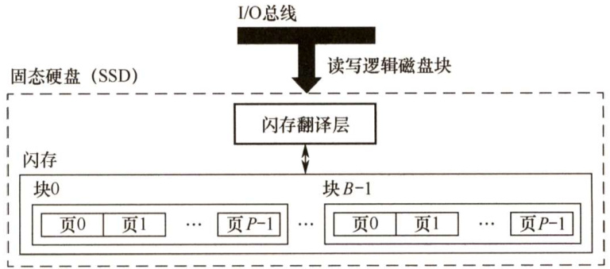

#### 3.4 外部存储器  

#### 3.4.1 磁盘存储器  

磁盘存储器的优点： $\textcircled{1}$ 存储容量大，位价格低； $\textcircled{2}$ 记录介质可重复使用； $\textcircled{3}$ 记录信息可长期保存而不丢失，甚至可脱机存档； $\textcircled{4}$ 非破坏性读出，读出时不需要再生。缺点：存取速度慢，机械结构复杂，对工作环境要求较高。  

#### 1.磁盘存储器  

（1）磁盘设备的组成  

$\textcircled{1}$ 硬盘存储器的组成。硬盘存储器由磁盘驱动器、磁盘控制器和盘片组成。  

·磁盘驱动器。核心部件是磁头组件和盘片组件，温彻斯特盘是一种可移动磁头固定盘片的硬盘存储器。·磁盘控制器。硬盘存储器和主机的接口，主流的标准有IDE、SCSI、SATA等。  

$\textcircled{2}$ 存储区域。一块硬盘含有若干记录面，每个记录面划分为若干磁道，而每条磁道又划分为若干扇区，扇区（也称块）是磁盘读写的最小单位，即磁盘按块存取。  

·磁头数（Heads)：即记录面数，表示硬盘共有多少个磁头，磁头用于读取/写入盘片上记录面的信息，一个记录面对应一个磁头。柱面数（Cylinders)：表示硬盘每面盘片上有多少条磁道。在一个盘组中，不同记录面的相同编号（位置）的诸磁道构成一个圆柱面。  
·扇区数（Sectors）：表示每条磁道上有多少个扇区。  

（2）磁记录原理  

原理：磁头和磁性记录介质相对运动时，通过电磁转换完成读/写操作。  

编码方法：按某种方案（规律)，把一连串的二进制信息变换成存储介质磁层中一个磁化翻专状态的序列，并使读/写控制电路容易、可靠地实现转换。  

磁记录方式：通常采用调频制（FM）和改进型调频制（MFM）的记录方式。  

（3）磁盘的性能指标  

$\textcircled{1}$ 记录密度。记录密度是指盘片单位面积上记录的二进制信息量，通常以道密度、位密度和面密度表示。道密度是沿磁盘半径方向单位长度上的磁道数，位密度是磁道单位长度上能记录的二进制代码位数，面密度是位密度和道密度的乘积。  

$\textcircled{2}$ 磁盘的容量。磁盘容量有非格式化容量和格式化容量之分。非格式化容量是指磁记录表面可利用的磁化单元总数，它由道密度和位密度计算而来；格式化容量是指按照某种特定的记录格式所能存储信息的总量。格式化后的容量比非格式化容量要小。  

$\textcircled{3}$ 平均存取时间。平均存取时间由寻道时间（磁头移动到目的磁道的时间）、旋转延迟时间（磁头定位到要读写扇区的时间）和传输时间（传输数据所花费的时间）三部分构成。由于寻道和找扇区的距离远近不一，故寻道时间和旋转延迟时间通常取平均值。  

$\textcircled{4}$ 数据传输率。磁盘存储器在单位时间内向主机传送数据的字节数，称为数据传输率。假设磁盘转数为 $\boldsymbol{r}$ 转/秒，每条磁道容量为 $N$ 字节，则数据传输率为  

$$
D_{\mathrm{r}}=r N
$$  

（4）磁盘地址  

主机向磁盘控制器发送寻址信息，磁盘的地址一般如下图所示。  

<html><body><table><tr><td>驱动器号</td><td>柱面（磁道）号</td><td>盘面号</td><td>扇区号</td></tr></table></body></html>  

若系统中有4个驱动器，每个驱动器带一个磁盘，每个磁盘256个磁道、16个盘面，每个盘面划分为16个扇区，则每个扇区地址要18位二进制代码，其格式如夏图所示。  

<html><body><table><tr><td>驱动器号（2位）</td><td>柱面(磁道）号（8位)</td><td>盘面号（4位）</td><td>扇区号（4位）</td></tr></table></body></html>  

（5）硬盘的工作过程  

硬盘的主要操作是寻址、读盘、写盘。每个操作都对应一个控制字，硬盘工作时，第一步是取控制字，第二步是执行控制字。  

硬盘属于机械式部件，其读写操作是串行的，不可能在同一时刻既读又写，也不可能在同一时刻读两组数据或写两组数据。  

#### 2.磁盘阵列  

RAID（独立冗余磁盘阵列）是指将多个独立的物理磁盘组成一个独立的逻辑盘，数据在多个物理盘上分割交叉存储、并行访问，具有更好的存储性能、可靠性和安全性。  

RAID的分级如下所示。在RAID1 $\sim$ RAID5几种方案中，无论何时有磁盘损坏，都可随时拔出受损的磁盘再插入好的磁盘，而数据不会损坏，提升了系统的可靠性。  

·RAID0：无冗余和无校验的磁盘阵列。  
·RAID1：镜像磁盘阵列。  
·RAID2：采用纠错的海明码的磁盘阵列。  
·RAID3：位交叉奇偶校验的磁盘阵列。  
·RAID4：块交叉奇偶校验的磁盘阵列。  
·RAID5：无独立校验的奇偶校验磁盘阵列。  

RAIDO把连续多个数据块交替地存放在不同物理磁盘的扇区中，几个磁盘交叉并行读写，不仅扩大了存储容量，而且提高了磁盘数据存取速度，但RAID0没有容错能力。  

为了提高可靠性，RAID1使两个磁盘同时进行读写，互为备份，若一个磁盘出现故障，可从另一磁盘中读出数据。两个磁盘当一个磁盘使用，意味着容量减少一半。  

总之，RAID 通过同时使用多个磁盘，提高了传输率；通过在多个磁盘上并行存取来大幅提高存储系统的数据吞吐量；通过镜像功能，提高安全可靠性；通过数据校验，提供容错能力。  

#### 3.4.2 固态硬盘  

固态硬盘（SSD）是一种基于闪存技术的存储器。它与U 盘并没有本质上的差别，只是容量更大，存取性能更好。一个 SSD 由一个或多个闪存芯片和闪存翻译层组成，闪存芯片替代传统旋转磁盘中的机械驱动器，而闪存翻译层将来自CPU 的逻辑块读写请求翻译成对底层物理设备的读写控制信号，因此，这个闪存翻译层相当于扮演了磁盘控制器的角色。  

如图3.15所示，一个闪存由 $B$ 块组成，每块由 $P$ 页组成。通常，页的大小是 $512\mathrm{B}\mathrm{\sim}4\mathrm{KB}$ 每块由 $32\sim128$ 页组成，块的大小为 $16\mathrm{KB}\sim512\mathrm{KB}$ 。数据是以页为单位读写的。只有在一页所属的块整个被擦除后，才能写这一页。不过，一旦一个块被擦除，块中的每个页都可以直接再写一次。某个块进行了约10万次重复写之后，就会磨损坏，不能再使用。  

随机写很慢，有两个原因。首先，擦除块比较慢，1ms 级，比访问页高一个数量级。其次，如果写操作试图修改一个包含已有数据的页 $P_{i}$ ，那么这个块中所有含有用数据的页都必须被复制到一个新（擦除过的）块中，才能进行对页 $P_{i}$ 的写。  

比起传统磁盘，SSD 有很多优点，它由半导体存储器构成，没有移动的部件，因而随机访问时间比机械磁盘要快很多，也没有任何机械噪声和震动，能耗更低，抗震性好，安全性高等。不过，SSD也有缺点，因为反复写之后，闪存块会磨损，所以SSD也容易磨损。闪存翻译层中有一个平均磨损逻辑试图通过将擦除平均分布在所有的块上来最大化每个块的寿命。实际上，平均磨损逻辑处理得非常好，要很多年SSD才会磨损坏。  

  
图3.15固态硬盘（SSD）  

随着技术的不断发展，价格也不断下降，SSD有望逐步取代传统机械硬盘。  

#### 3.4.3 本节习题精选  

#### 一、单项选择题  

01．一个磁盘的转速为7200转/分，每个磁道有160个扇区，每个扇区有512字节，则在理想情况下，其数据传输率为（）。  

A. $7200{\times}160\mathrm{KB/s}$ B. $7200\mathrm{KB/s}$ C.9600KB/s D.19200KB/s  

02.下列关于磁盘的说法中，错误的是（）。  

A．本质上，U盘（闪存）是一种只读存储器  
B.RAID技术可以提高磁盘的磁记录密度和磁盘利用率  
C.未格式化的硬盘容量要大于格式化后的实际容量  
D.计算磁盘的存取时间时，“寻道时间”和“旋转等待时间”常取其平均值  

03.下列关于固态硬盘（SSD）的说法中，错误的是（）。  

A．基于闪存的存储技术 B.随机读写性能明显高于磁盘C.随机写比较慢 D．不易磨损  

04.【2013统考真题】某磁盘的转速为10000转/分，平均寻道时间是6ms，磁盘传输速率是$20\mathrm{MB/s}$ ，磁盘控制器延迟为 $0.2\mathrm{ms}$ ，读取一个4KB的扇区所需的平均时间约为（）。  

A.9ms B. $9.4\mathrm{{ms}}$ C. 12ms D. $12.4\mathrm{ms}$  

05.【2013统考真题】下列选项中，用于提高RAID可靠性的措施有（）。  

I．磁盘镜像ⅡI．条带化 III．奇偶校验 IV．增加Cache机制  

A.仅I、Ⅱ B.仅I、III C.仅I、ⅢI和IVD.仅Ⅱ、IⅢI和IV  

06.【2015统考真题】若磁盘转速为7200转/分，平均寻道时间为8ms，每个磁道包含1000个扇区，则访问一个扇区的平均存取时间大约是（）。  

A.8.1ms B.12.2ms C. 16.3ms D. 20.5ms  

07.【2019统考真题】下列关于磁盘存储器的叙述中，错误的是（）。  

A.磁盘的格式化容量比非格式化容量小B．扇区中包含数据、地址和校验等信息C．磁盘存储器的最小读写单位为1字节D.磁盘存储器由磁盘控制器、磁盘驱动器和盘片组成  

#### 二、综合应用题  

01．某个硬磁盘共有4个记录面，存储区域内半径为 $10\mathrm{{cm}}$ ，外半径为 $15.5\mathrm{cm}$ ，道密度为60道/cm，外层位密度为 $600\mathrm{bit/cm}$ ，转速为6000转/分。  

1）硬磁盘的磁道总数是多少？  
2）硬磁盘的容量是多少？  
3）将长度超过一个磁道容量的文件记录在同一个柱面上是否合理？  
4）采用定长数据块记录格式，直接寻址的最小单位是什么？寻址命令中磁盘地址如何表示？  
5）假定每个扇区的容量为512B，每个磁道有12个扇区，寻道的平均等待时间为$10.5\mathrm{ms}$ ，试计算磁盘平均存取时间。  

#### 3.4.4 答案与解析  

#### 一、单项选择题  

01.C  

磁盘的转速为7200转/分 $\mathit{\Theta}=\ 120$ 转/秒，转一圈经过160个扇区，每个扇区为512B，所以数据传输率为 $120{\times}160{\times}512/1024=9600\mathrm{KB/s},$  

#### 02.B  

闪存是在 EPROM 的基础上发展起来的，本质上是只读存储器。RAID 将多个物理盘组成像单个逻辑盘，不会影响磁记录密度，也不可能提高磁盘利用率。  

#### 03.D  

固态硬盘基于闪存技术，没有机械部件，随机读写不需要机械操作，因此速度明显高于磁盘，A和B正确。选项C已在考点讲解中解释过。SSD的缺点是容易磨损，D错误。  

#### 04.B  

磁盘转速是10000 转/分，转一圈的时间为 6ms，因此平均查询扇区的时间为 $3\mathrm{ms}$ ，平均寻道时间为6ms，读取4KB扇区信息的时间为 $4\mathrm{KB}/(20\mathrm{MB}/\mathrm{s})=0.2\mathrm{ms}$ ，信息延迟的时间为 $0.2\mathrm{ms}$ ，总时间为 $3+6+0.2+0.2=9.4\mathrm{ms}$ 。  

#### 05.B  

RAID0方案是无冗余和无校验的磁盘阵列，而RAID1 $\sim$ RAID5方案均是加入了冗余（镜像）或校验的磁盘阵列。因此，能够提高RAID 可靠性的措施主要是对磁盘进行镜像处理和奇偶校验，其余选项不符合条件。  

#### 06.B  

存取时间 $\mathbf{\Sigma}=\mathbf{\Sigma}$ 寻道时间 $^+$ 延迟时间 $^+$ 传输时间。存取一个扇区的平均延迟时间为旋转半周的时间，即 $(60/7200)/2=4.17\mathrm{ms}$ ，传输时间为 $(60/7200)/1000=0.01\mathrm{ms}$ ，因此访问一个扇区的平均存取时间为 $4.17+0.01+8=12.18\mathrm{ms}$ ，保留一位小数则为 $12.2\mathrm{ms}$ 。  

07.C  

磁盘存储器的最小读写单位为一个扇区，即磁盘按块存取，C 错误。磁盘存储数据之前需要进行格式化，将磁盘分成扇区，并写入信息，因此磁盘的格式化容量比非格式化容量小，A正确。磁盘扇区中包含数据、地址和校验等信息，B正确。磁盘存储器由磁盘控制器、磁盘驱动器和盘片组成，D正确。  

#### 二、综合应用题  

01.【解答】  

1）有效存储区域 $=15.5-10=5.5\mathrm{cm}$ ，道密度 $=60$ 道 $/\mathrm{cm}$ ，因此每个面为 $60\times5.5\ =\ 330$ 道，即有330个柱面，因此磁道总数 $=4{\times}330=1320$ 个磁道。  

2）外层磁道的长度为 $2\pi R=2{\times}3.14{\times}15.5=97.34\mathrm{cm}$ 。每道信息量 $\mathbf{\tau}=600\mathbf{bit}/\mathbf{cm}{\times}97.34\mathbf{cm}=58404\mathbf{bit}=7300\mathbf{B}$ 。利用1）的结果，可得磁盘总容量 $\mathbf{\tau}=7300\mathbf{B}{\times}1320=9636000\mathbf{B}$ （非格式化容量)。  

3）若长度超过一个磁道容量的文件，将它记录在同一个柱面上是比较合理的，因为不需要重新寻找磁道，这样数据读/写速度快。  

4）采用定长数据块格式，直接寻址的最小单位是一个扇区，每个扇区记录固定字节数目的信息，在定长记录的数据块中，活动头磁盘组的编址方式可用如下格式：  

<html><body><table><tr><td>15~14(2位）</td><td>13~4(10位）</td><td>3~0（4位）</td></tr><tr><td>硬盘号</td><td>柱面号</td><td>扇区号</td></tr></table></body></html>  

此地址格式表示最多可以接4个硬盘，每个最多有8个记录面，每面最多可有128个磁道，每道最多可有16个扇区。  

5）读一个扇区中数据所用的时间 $\mathbf{\Sigma}=\mathbf{\Sigma}$ 找磁道的时间 $^+$ 找扇区的时间 $^+$ 磁头扫过一个扇区的时间。找磁道的时间是指磁头从当前所处磁道运动到目标磁道的时间，一般选用磁头在磁盘径向方向上移动1/2个半径长度所用的时间为平均值来估算，题中给出的是 $10.5\mathrm{ms}$ o找扇区的时间是指磁头从当前所处扇区运动到目标扇区的时间，一般选用磁盘旋转半周所用的时间作为平均值来估算，题中给出磁盘转速为6000转/分，即100转/秒，所以磁盘转一周用时 $10\mathrm{ms}$ ，转半周用时 $5\mathrm{ms}$ o题中给出每个磁道有12个扇区，磁头扫过一个扇区用时为 $10/12=0.83\mathrm{ms}$ ，因此磁盘平均存取时间为 $10.5+5+0.83=16.33\mathrm{ms}$ 。