#### 3.5 高速缓冲存储器  

由于程序的转移概率不会很低，数据分布的离散性较大，所以单纯依靠并行主存系统提高主存系统的频宽是有限的。这就必须从系统结构上进行改进，即采用存储体系。通常将存储系统分为“Cache-主存”层次和“主存-辅存”层次。  

#### 3.5.1 程序访问的局部性原理  

程序访问的局部性原理包括时间局部性和空间局部性。时间局部性是指在最近的未来要用到的信息，很可能是现在正在使用的信息，因为程序中存在循环。空间局部性是指在最近的未来要用到的信息，很可能与现在正在使用的信息在存储空间上是邻近的，因为指令通常是顺序存放、顺序执行的，数据一般也是以向量、数组等形式簇聚地存储在一起的。  

高速缓冲技术就是利用局部性原理，把程序中正在使用的部分数据存放在一个高速的、容量较小的Cache中，使CPU 的访存操作大多数针对Cache进行，从而提高程序的执行速度。  

【例3.2】假定数组元素按行优先方式存储，对于下面的两个函数：  

1）对于数组a的访问，哪个空间局部性更好？哪个时间局部性更好？  

2）对于指令访问来说，for循环体的空间局部性和时间局部性如何？  

程序A：  
程序B：  

<html><body><table><tr><td>1</td><td colspan="2">int sumarraycols(int a[M][N])</td></tr><tr><td>2</td><td>{</td><td></td></tr><tr><td>3</td><td></td><td>int i,j，sum = 0;</td></tr><tr><td>4</td><td></td><td>for (j=0;j<N;j++)</td></tr><tr><td>5</td><td></td><td>for (i=0;i<M;i++)</td></tr><tr><td>6</td><td></td><td>sum += a[i][j]；</td></tr><tr><td>7</td><td>return</td><td>sum;</td></tr><tr><td>8</td><td></td><td></td></tr></table></body></html>  

1 int sumarrayrows(int a[M][N])   
2 {   
3 int i，j，sum $\mathit{\Theta}=\mathit{\Theta}0$ ·   
4 for 0 $\mathrm{~\\\~i~}=\mathrm{~0~}$ . $\mathrm{~i~}<\mathtt{M}$ 、 $\mathrm{i}++1$   
5 for $1\dot{2}=0$ ； $\j<\mathtt{N}$ . $j++1$   
6 sum $+=$ a[i][j]；   
7 return sum;   
8 }  

解：假定M、N都为2048，按字节编址，每个数组元素占4字节，则指令和数据在主存的存放情况如图3.16所示。  

1）对于数组a，程序A和程序B的空间局部性相差较大。  

程序A 对数组 a 的访问顺序为 a[0][0]，a[0][1],…,a[0][2047];a[1][0],a[1][1]，，a[1][2047];。由此可见，访问顺序与存放顺序是一致的，因此空间局部性好。  

程序 B 对数组 a 的访问顺序为 a[0][0]，a[1][0],…a[2047][0];a[0][1]，a[1][1]，，a[2047][1]；。由此可见，访问顺序与存放顺序不一致，每次访问都要跳过2048个数组元素，即8192字节，若主存与Cache的交换单位小于8KB，则每访一个数组元素都需要装入一个主存块到Cache中，因而没有空间局部性。  

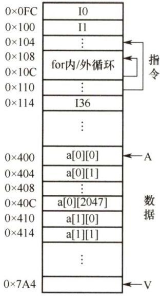  
图3.16指令和数据在主存的存放  

两个程序的时间局部性都差，因为每个数组元素都只被访问一次。  

2）对于for循环体，程序A和程序B中的访问局部性是一样的。因为循环体内指令按序连续存放，所以空间局部性好；内循环体被连续重复执行 $2048\times2048$ 次，因此时间局部性也好。  

由上述分析可知，虽然程序A 和程序B的功能相同，但因内、外两重循环的顺序不同而导致两者对数组a访问的空间局部性相差较大，从而带来执行时间的不同。有人在2GHzPentium 4机器上执行上述两个程序，实际执行所需的时钟周期相差21.5倍！  

#### 3.5.2 Cache的基本工作原理  

Cache位于存储器层次结构的顶层，通常由SRAM构成，其基本结构如图3.17所示。  

为便于Cache 和主存间交换信息，Cache 和主存都被划分为相等的块，Cache块又称 Cache行，每块由若干字节组成，块的长度称为块长（Cache 行长)。由于Cache 的容量远小于主存的容量，所以Cache 中的块数要远少于主存中的块数，它仅保存主存中最活跃的若干块的副本。因此Cache 按照某种策略，预测CPU 在未来一段时间内欲访存的数据，将其装入Cache。  

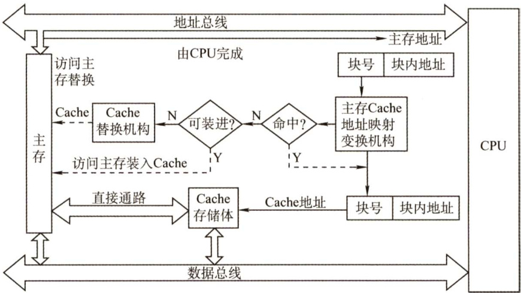  
图3.17高速缓冲存储器的工作原理  

当CPU发出读请求时，若访存地址在Cache 中命中，就将此地址转换成Cache 地址，直接对 Cache 进行读操作，与主存无关；若Cache 不命中，则仍需访问主存，并把此字所在的块一次性地从主存调入Cache。若此时Cache已满，则需根据某种替换算法，用这个块替换Cache 中原来的某块信息。整个过程全部由硬件实现。值得注意的是，CPU与Cache之间的数据交换以字为单位，而Cache与主存之间的数据交换则以Cache块为单位。  

注意：某些计算机中也采用同时访问Cache和主存的方式，若Cache命中，则主存访问终止；否则访问主存并替换Cache。  

当 CPU 发出写请求时，若Cache 命中，有可能会遇到Cache 与主存中的内容不一致的问题。例如，由于CPU写Cache，把Cache某单元中的内容从 $X$ 修改成了 $X$ ，而主存对应单元中的内容仍然是 $X$ ，没有改变。所以若Cache命中，需要按照一定的写策略处理，常见的处理方法有全写法和回写法，详见本节的Cache写策略部分。  

CPU欲访问的信息已在Cache中的比率称为Cache的命中率。设一个程序执行期间，Cache的总命中次数为 $\ensuremath{N_{\mathrm{c}}}$ ，访问主存的总次数为 $N_{\mathrm{m}}$ ，则命中率 $H$ 为  

$$
H=N_{\mathrm{c}}/(N_{\mathrm{c}}+N_{\mathrm{m}})
$$  

可见为提高访问效率，命中率 $H$ 越接近1越好。设 $t_{\mathrm{c}}$ 为命中时的Cache访问时间， $t_{\mathrm{m}}$ 为未命中时的访问时间， $1-H$ 表示未命中率，则Cache-主存系统的平均访问时间 $T_{\mathrm{a}}$ 为  

$$
T_{\mathrm{a}}=H t_{\mathrm{c}}+\left(1-H\right)t_{\mathrm{m}}
$$  

【例3.3】假设Cache的速度是主存的5倍，且Cache的命中率为 $95\%$ ，则采用Cache后，存储器性能提高多少（设Cache和主存同时被访问，若Cache命中则中断访问主存）？  

解：设Cache的存取周期为 $t$ ，主存的存取周期为5t，由 $H=95\%$ 得系统的平均访问时间为  

$$
T_{\mathrm{a}}=0.95{\times}t+0.05{\times}5t=1.2t
$$  

可知性能为原来的 $5t/1.2t\approx4.17$ 倍，即提高了3.17倍。  

思考：若采用先访问Cache再访问主存的方式，则提高的性能又是多少？根据Cache的读、写流程，实现Cache时需解决以下关键问题：  

1）数据查找。如何快速判断数据是否在Cache中。  
2）地址映射。主存块如何存放在Cache中，如何将主存地址转换为Cache 地址。  
3）替换策略。Cache满后，使用何种策略对Cache块进行替换或淘汰。  
4）写入策略。如何既保证主存块和Cache块的数据一致性，又尽量提升效率。  

#### 3.5.3 Cache和主存的映射方式  

Cache 行中的信息是主存中某个块的副本，地址映射是指把主存地址空间映射到Cache 地址空间，即把存放在主存中的信息按照某种规则装入Cache。  

由于Cache 行数比主存块数少得多，因此主存中只有一部分块的信息可放在Cache 中，因此在Cache 中要为每块加一个标记，指明它是主存中哪一块的副本。该标记的内容相当于主存中块的编号。为了说明Cache行中的信息是否有效，每个Cache 行需要一个有效位。  

地址映射的方法有以下3种。  

#### 1．直接映射  

主存中的每一块只能装入Cache中的唯一位置。若这个位置已有内容，则产生块冲突，原来的块将无条件地被替换出去（无须使用替换算法)。直接映射实现简单，但不够灵活，即使Cache 的其他许多地址空着也不能占用，这使得直接映射的块冲突概率最高，空间利用率最低。  

直接映射的关系可定义为  

假设Cache共有 $2^{c}$ 行，主存有 $2^{m}$ 块，在直接映射方式中，主存的第0块、第 $2^{c}$ 块、第 $2^{c+1}$ 块…只能映射到Cache 的第0行；而主存的第1块、第 $2^{c}+1$ 块、第 $2^{c+1}+1$ 块…·只能映射到Cache 的第1行，以此类推。由映射函数可看出，主存块号的低 $\mathbf{\Psi}_{c}$ 位正好是它要装入的Cache行号。给每个Cache 行设置一个长为 $t=m\mathrm{~-~}c$ 的标记（tag)，当主存某块调入Cache 后，就将其块号的高 $t$ 位设置在对应Cache行的标记中，如图3.18(a)所示。  

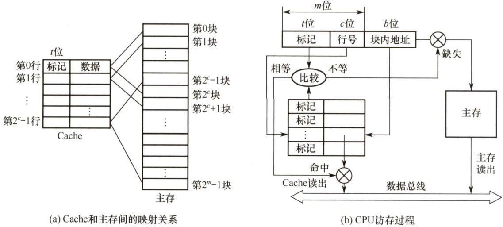  
图3.18Cache 和主存之间的直接映射方式  

直接映射的地址结构为  

<html><body><table><tr><td>标记</td><td>Cache行号</td><td>块内地址</td></tr></table></body></html>  

CPU 访存过程如图 3.18(b)所示。首先根据访存地址中间的c位，找到对应的Cache 行，将对应Cache 行中的标记和主存地址的高 $t$ 位标记进行比较，若相等且有效位为1，则访问Cache“命中”，此时根据主存地址中低位的块内地址，在对应的Cache 行中存取信息；若不相等或有效位为0，则“不命中”，此时CPU从主存中读出该地址所在的一块信息送到对应的Cache 行中，将有效位置1，并将标记设置为地址中的高 $t$ 位，同时将该地址中的内容送CPU。  

#### 2．全相联映射  

主存中的每一块可以装入Cache 中的任何位置，每行的标记用于指出该行取自主存的哪一块，所以CPU 访存时需要与所有Cache 行的标记进行比较。全相联映射方式的优点是比较灵活，Cache 块的冲突概率低，空间利用率高，命中率也高；缺点是标记的比较速度较慢，实现成本较高，通常需采用昂贵的按内容寻址的相联存储器进行地址映射，如图3.19所示。  

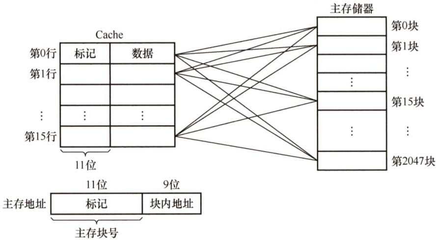  
图3.19Cache和主存之间的全相联映射方式  

全相联映射的地址结构为  

<html><body><table><tr><td>标记</td><td>块内地址</td></tr></table></body></html>  

#### 3。组相联映射  

将Cache分成 $\varrho$ 个大小相等的组，每个主存块可以装入固定组中的任意一行，即组间采用直接映射、而组内采用全相联映射的方式，如图3.20所示。它是对直接映射和全相联映射的一种折中，当 $\scriptstyle Q\ =\ 1$ 时变为全相联映射，当 $\varrho=$ Cache 行数时变为直接映射。假设每组有 $\boldsymbol{r}$ 个Cache行，则称之为 $\boldsymbol{r}$ 路组相联，图3.20中每组有2个Cache行，因此称为二路组相联。  

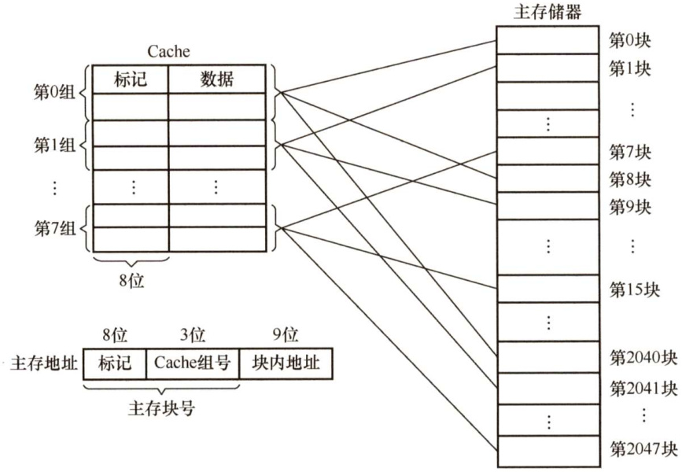  
图3.20Cache和主存之间的二路组相联映射方式  

组相联映射的关系可以定义为  

Cache组号 $\mathbf{\Sigma}=\mathbf{\Sigma}$ 主存块号modCache组数（ $\varrho$ ）  

路数越大，即每组Cache行的数量越大，发生块冲突的概率越低，但相联比较电路也越复杂。选定适当的数量，可使组相联映射的成本接近直接映射，而性能上仍接近全相联映射。  

组相联映射的地址结构为  

<html><body><table><tr><td>标记</td><td>组号</td><td>块内地址</td></tr></table></body></html>  

CPU 访存过程如下：首先根据访存地址中间的组号找到对应的Cache 组；将对应Cache 组中每个行的标记与主存地址的高位标记进行比较；若有一个相等且有效位为1，则访问Cache 命中，此时根据主存地址中的块内地址，在对应Cache 行中存取信息；若都不相等或虽相等但有效位为0，则不命中，此时CPU 从主存中读出该地址所在的一块信息送到对应Cache 组的任意一个空闲行中，将有效位置1，并设置标记，同时将该地址中的内容送CPU。  

【例3.4】假设某个计算机的主存地址空间大小为256MB，按字节编址，其数据Cache 有8个Cache行，行长为64B。  

1）若不考虑用于Cache 的一致维护性和替换算法控制位，并且采用直接映射方式，则该数据Cache的总容量为多少？  
2）若该Cache采用直接映射方式，则主存地址为3200（十进制）的主存块对应的Cache行号是多少？采用二路组相联映射时又是多少？  
3）以百接肿射方式为例，简述访存过程（设访存的地址为0123456H）  

解：  

1）数据Cache 的总容量为4256 位。因为Cache 包括了可以对Cache中所包含的存储器地址进行跟踪的硬件，即Cache 的总容量包括：存储容量、标记阵列容量（有效位、标记位）（标记阵列中的一致性维护位和Cache 数据一致性维护方式相关，替换算法控制位和替换算法相关，这里不计算)。  

注意：每个Cache行对应一个标记项（包括有效位、标记位Tag、一致性维护位、替换算法控制位），而在组相联中，将每组的标记项排成一行，将各组从上到下排列，成为一个二维的标记阵列（直接映射一行就是一组)。查找Cache 时就是查找标记阵列的标记项是否符合要求。二路组相联的标记阵列示意图如图3.21所示。  

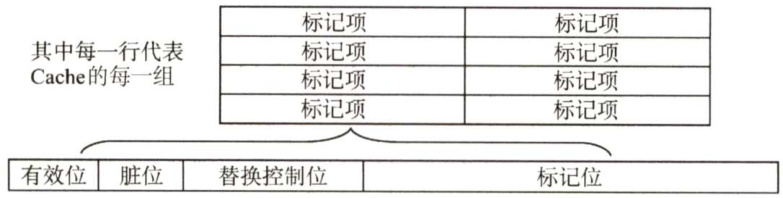  
图3.21二路组相联的标记阵列示意图  

因此本题中每行相关的存储器容量如图3.22所示。  

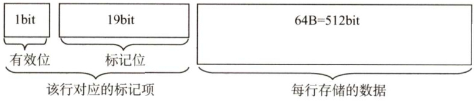  
图3.22Cache行的存储容量示意图  

标记字段长度的计算：主存地址有28位（ $(256\mathbf{MB}=2^{28}\mathbf{B})$ ，其中6位为块内地址（ $2^{6}\mathrm{B}\ =$ 64B)，3位为行号（ $2^{3}=8$ ，剩余 $28-6-3=19$ 位为标记字段，总容量为 $8\times(1+19+$ $512)=4256$ 位。  

2）直接映射方式中，主存按照块的大小划分，主存地址3200对应的字块号为 $3200\mathrm{B}/64\mathrm{B}=$ 50。而Cache只有8行，则 $50\mathrm{mod}8=2$ ，因此对应的Cache行号为2。二路组相联映射方式，实质上就是将两个Cache行合并，内部采用全相联方式，外部采用直接映射方式， $50\ {\bmod{4}}=2$ ，对应的组号为2，即对应的Cache行号为4或5。  
3）直接映射方式中，28位主存地址可分为19位的主存标记位，3位的块号，6位的块内地址，即 $000000010010011010$ 为主存标记位，001为块号，010110为块内地址。首先根据块号，查Cache（即001号Cache行）中对应的主存标记位，看是否相同。若相同，再看Cache行中的装入有效位是否为1，若是，则表示有效，称此访问命中，按块内地址010110读出Cache行所对应的单元并送入CPU中，完成访存。若出现标记位不相等或有效位为0的情况，则不命中，访问主存将数据取出并送往CPU和Cache的对应块中，把主存的最高19位存入001行的Tag中，并将有效位置1。  

思考：1）若第1问中采用二路组相联，则Cache总容量是多少？2）仔细分析主存划分和Cache划分的关系，自行推导二路组相联映射方式的主存地址划分和访存过程。  

三种映射方式中，直接映射的每个主存块只能映射到Cache 中的某一固定行；全相联映射可以映射到所有Cache行； $N$ 路组相联映射可以映射到 $N$ 行。当Cache大小、主存块大小一定时，  

1）直接映射的命中率最低，全相联映射的命中率最高。  
2）直接映射的判断开销最小、所需时间最短，全相联映射的判断开销最大、所需时间最长。  
3）直接映射标记所占的额外空间开销最少，全相联映射标记所占的额外空间开销最大。  

#### 3.5.4Cache中主存块的替换算法  

在采用全相联映射或组相联映射方式时，从主存向Cache传送一个新块，当Cache或Cache组中的空间已被占满时，就需要使用替换算法置换Cache 行。而采用直接映射时，一个给定的主存块只能放到唯一的固定Cache 行中，所以在对应Cache 行已有一个主存块的情况下，新的主存块毫无选择地把原先已有的那个主存块替换掉，因而无须考虑替换算法。  

常用的替换算法有随机（RAND）算法、先进先出（FIFO）算法、近期最少使用（LRU）算法和最不经常使用（LFU）算法。其中最常考查的是LRU算法。  

1）随机算法：随机地确定替换的Cache块。它的实现比较简单，但未依据程序访问的局部性原理，因此可能命中率较低。  
2）先进先出算法：选择最早调入的行进行替换。它比较容易实现，但也未依据程序访问的局部性原理，因为最早进入的主存块也可能是目前经常要用的。  
3）近期最少使用算法（LRU）：依据程序访问的局部性原理，选择近期内长久未访问过的Cache 行作为替换的行，平均命中率要比FIFO的高，是堆栈类算法。  

LRU 算法对每个Cache 行设置一个计数器，用计数值来记录主存块的使用情况，并根据计数值选择淘汰某个块，计数值的位数与Cache组大小有关，2路时有一位LRU位，4路时有两位LRU位。假定采用四路组相联，有5个主存块{1,2,3,4,5}映射到Cache的同一组，对于主存访问序列{1,2,3,4,1,2,5,1,2,3,4,5}，采用LRU算法的替换过程如图3.23所示。图中左边阴影的数字是对应Cache行的计数值，右边的数字是存放在该行中的主存块号。  

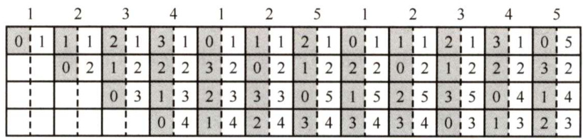  
图3.23LRU算法的替换过程示意图  

计数器的变化规则： $\textcircled{1}$ 命中时，所命中的行的计数器清零，比其低的计数器加1，其余不变； $\textcircled{2}$ 未命中且还有空闲行时，新装入的行的计数器置0，其余全加1； $\textcircled{3}$ 未命中且无空闲行时，计数值为3的行的信息块被淘汰，新装行的块的计数器置0，其余全加1。  

当集中访问的存储区超过Cache 组的大小时，命中率可能变得很低，如上例的访问序列变为 $1,2,3,4,5,1,2,3,4,5,\cdots$ ，而Cache每组只有4行，那么命中率为0，这种现象称为抖动。  

4）最不经常使用算法：将一段时间内被访问次数最少的存储行换出。每行也设置一个计数器，新行建立后从0开始计数，每访问一次，被访问的行计数器加1，需要替换时比较各特定行的计数值，将计数值最小的行换出。这种算法与LRU类似，但不完全相同。  

#### 3.5.5 Cache写策略  

因为Cache 中的内容是主存块副本，当对Cache 中的内容进行更新时，就需选用写操作策略使Cache 内容和主存内容保持一致。此时分两种情况。  

对于Cache写命中（writehit），有两种处理方法。  

1）全写法（写直通法、write-through）。当CPU对Cache 写命中时，必须把数据同时写入Cache 和主存。当某一块需要替换时，不必把这一块写回主存，用新调入的块直接覆盖即可。这种方法实现简单，能随时保持主存数据的正确性。缺点是增加了访存次数，降低了Cache 的效率。写缓冲：为减少全写法直接写入主存的时间损耗，在Cache 和主存之间加一个写缓冲（Write Buffer)，如下图所示。CPU同时写数据到Cache 和写缓冲中，写缓冲再控制将内容写入主存。写缓冲是一个FIFO 队列，写缓冲可以解决速度不匹配的问题。但若出现频繁写时，会使写缓冲饱和溢出。  

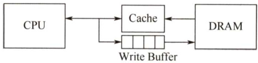  

2）回写法（write-back）。当CPU对Cache 写命中时，只把数据写入Cache，而不立即写入主存，只有当此块被换出时才写回主存。这种方法减少了访存次数，但存在不一致的隐患。为了减少写回主存的开销，每个Cache 行设置一个修改位（脏位)。若修改位为1，则说明对应Cache行中的块被修改过，替换时需要写回主存；若修改位为0，则说明对应Cache行中的块未被修改过，替换时无须写回主存。  

全写法和回写法都对应于Cache写命中（要被修改的单元在Cache中）时的情况。  
对于Cache写不命中，也有两种处理方法。  

1）写分配法（write-allocate）。加载主存中的块到Cache 中，然后更新这个Cache 块。它试图利用程序的空间局部性，但缺点是每次不命中都需要从主存中读取一块。  

2）非写分配法（not-write-allocate）法。只写入主存，不进行调块。  

非写分配法通常与全写法合用，写分配法通常和回写法合用。  

随着新技术的发展（如指令预取)，需要将指令Cache和数据Cache分开设计，这就有了分离的Cache 结构。统一Cache 的优点是设计和实现相对简单，但由于执行部件存取数据时，指令预取部件要从同一Cache 读指令，会引发冲突。采用分离Cache 结构可以解决这个问题，而且分离的指令和数据Cache还可以充分利用指令和数据的不同局部性来优化性能。  

现代计算机的Cache通常设立多级Cache，假定设3级Cache，按离CPU的远近可各自命名为L1Cache、L2Cache、L3Cache，离CPU越远，访问速度越慢，容量越大。指令Cache 与数据Cache 分离一般在L1级，此时通常为写分配法与回写法合用。下图是一个含有两级Cache 的系统，L1 Cache对L2Cache使用全写法，L2 Cache对主存使用回写法，由于L2 Cache的存在，其访问速度大于主存，因此避免了因频繁写时造成的写缓冲饱和溢出。  

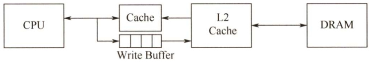  

#### 3.5.6 本节习题精选  

#### 一、单项选择题  

01．在高速缓存系统中，主存容量为12MB，Cache容量为400KB，则该存储系统的容量为（）。  

A. $12\mathrm{MB}+400\mathrm{KB}$ B.12MBC. $12\mathrm{MB}-\ 12\mathrm{MB}+400\mathrm{KB}$ D. 12MB－ 400KB  

02．访问Cache系统失效时，通常不仅主存向CPU传送信息，同时还需要将信息写入Cache，在此过程中传送和写入信息的数据宽度各为（）。  

A.块、页 B.字、字 C.字、块 D.块、块  

03．关于Cache的更新策略，下列说法中正确的是（）。  

A．读操作时，全写法和回写法在命中时应用B．写操作时，回写法和写分配法在命中时应用C.读操作时，全写法和写分配法在失效时应用D．写操作时，写分配法、非写分配法在失效时应用  

04.某虚拟存储器系统采用页式内存管理，使用LRU页面替换算法，考虑下面的页面访问地址流（每次访问在一个时间单位中完成）：  

1 8 1 7 8 2 7 2 1 8 3 8 2 1 3 1 7 1 3 7假定内存容量为4个页面，开始时是空的，则页面失效率是（）。  

A. $30\%$ B. $5\%$ C. $1.5\%$ D. $15\%$  

05．某32位计算机的Cache容量为16KB，Cache行的大小为16B，若主存与Cache地址映像采用直接映像方式，则主存地址为0x1234E8F8的单元装 $\wedge$ Cache的地址是（）。  

A.00010001001101 B.01000100011010   
C. 10100011111000 D. 11010011101000  

06．在Cache中，常用的替换策略有随机法（RAND）、先进先出法（FIFO）、近期最少使用法（LRU)，其中与局部性原理有关的是（）。  

A.随机法（RAND） B.先进先出法（FIFO）C.近期最少使用法（LRU） D．都不是  

07．某存储系统中，主存容量是Cache容量的4096倍，Cache被分为64个块，当主存地址和Cache地址采用直接映像方式时，地址映射表的大小应为（）。（假设不考虑一致维护和替换算法位。）  

A. $6{\times}4097{\mathrm{bit}}$ B. $64\times12\mathrm{bit}$ C. $6{\times}4096{\mathrm{bit}}$ D. $64\times136\mathrm{it}$  

08．有效容量为128KB的Cache，每块16B，采用8路组相联。字节地址为1234567H的单元调入该Cache，则其Tag应为（）。  

A.1234H B.2468H C. 048DH D.12345H  

09．有一主存-Cache层次的存储器，其主存容量为1MB，Cache容量为16KB，每块有8个字，每字32位，采用直接地址映像方式，Cache起始字块为第0块，若主存地址为35301H，且CPU访问Cache命中，则在Cache的第（）（十进制表示）字块中。  

A.152 B. 153 C. 154 D. 151  

10．对于由高速缓存、主存、硬盘构成的三级存储体系，CPU访问该存储系统时发送的地址为（）。  

A．高速缓存地址B．虚拟地址 C.主存物理地址 D．磁盘地址  

11．设有8页的逻辑空间，每页有1024B，它们被映射到32块的物理存储区中，则按字节编址逻辑地址的有效位是（），物理地址至少是（）位。  

A.10，12 B.10，15 C.13，15 D.13，12  

12．假设主存地址位数为32位，按字节编址，主存和Cache之间采用全相联映射方式，主存块大小为1个字，每字32位，采用回写（writeback）方式和随机替换策略，则能存放32K字数据的Cache的总容量至少应有（）位。  

A.1536K B.1568K C. 2016K D.2048K  

13．假设主存按字节编址，Cache 共有64行，采用四路组相联映射方式，主存块大小为32字节，所有编号都从0开始。则第2593号存储单元所在主存块的Cache组号是（）。  

A.1 B.17 C.34 D.81  

14.假定CPU通过存储器总线读取数据的过程为：发送地址和读命令需1个时钟周期，存储器准备一个数据需8个时钟周期，总线上每传送1个数据需1个时钟周期。若主存和Cache之间交换的主存块大小为64B，存取宽度和总线宽度都为8B，则Cache 的一次缺失损失至少为（）个时钟周期。  

A.64 B.72 C. 80 D. 160  

15.假定采用多模块交叉存储器组织方式，存储器芯片和总线支持突发传送，CPU通过存储器总线读取数据的过程为：发送首地址和读命令需1个时钟周期，存储器准备第一个数据需8个时钟周期，随后每个时钟周期总线上传送1个数据，可连续传送8个数据（即突发长度为8）。若主存和Cache之间交换的主存块大小为64B，存取宽度和总线宽度都为8B，则Cache的一次缺失损失至少为（）个时钟周期。  

A.17 B.20 C.33 D. 80  

16.【2009统考真题】假设某计算机的存储系统由Cache和主存组成，某程序执行过程中访存1000次，其中访问Cache缺失（未命中）50次，则Cache的命中率是（）。  

A. $5\%$ B. $9.5\%$ C. $50\%$ D. $95\%$  

17.【2009统考真题】某计算机的Cache共有16块，采用二路组相联映射方式（即每组2块）。每个主存块大小为32B，按字节编址，主存129号单元所在主存块应装入的Cache组号是（）。  

A.0 B.2 C.4 D.6  

18.【2012统考真题】假设某计算机按字编址，Cache有4行，Cache和主存之间交换的块大小为1个字。若Cache的内容初始为空，采用二路组相联映射方式和LRU替换策略，则访问的主存地址依次为 $0,4,8,2,0,6,8,6,4,8$ 时，命中Cache的次数是（）。  

A.1 B.2 C.3 D.4.【2014统考真题】采用指令Cache与数据Cache分离的主要目的是（）  

A.降低Cache的缺失损失 B.提高Cache的命中率C.降低CPU平均访存时间 D.减少指令流水线资源冲突  

20.【2016统考真题】有如下C语言程序段：  

for $k=0$ ； $k<1000$ ； $k++$ ）$a[\mathbf{k}]=a[\mathbf{k}]+32$  

若数组a和变量 $\mathbf{k}$ 均为int型，int型数据占4B，数据Cache采用直接映射方式，数据区大小为1KB、块大小为16B，该程序段执行前Cache为空，则该程序段执行过程中访问数组a的Cache缺失率约为（）。  

A. $1.25\%$ B. $2.5\%$ C. $12.5\%$ D.25%  

21.【2017统考真题】某C语言程序段如下：  

for $\scriptstyle\left({\dot{1}}=0\ ;{\dot{1}}<=9;{\dot{1}}+++\right)$ I   
temp $^{\circ=1}$ .   
for $j=0$ $j<=i$ . $j++$ )temp $\star=a$ [j]； sum $+=$ temp;   
1  

下列关于数组a的访问局部性的描述中，正确的是（）。  

A.时间局部性和空间局部性皆有 B．无时间局部性，有空间局部性 C.有时间局部性，无空间局部性 D.时间局部性和空间局部性皆无  

22.【2021统考真题】若计算机主存地址为32位，按字节编址，Cache数据区大小为32KB，主存块大小为32B，采用直接映射方式和回写（WriteBack）策略，则Cache行的位数至少是（）。  

A.275 B.274 C.258 D.257  

#### 二、综合应用题  

01．假定某处理器可通过软件对高速缓存设置不同的写策略，则在下列两种情况下，应分别设置成什么写策略？为什么？  

1）处理器主要运行包含大量存储器写操作的数据访问密集型应用。2）处理器运行程序的性质与1）相同，但安全性要求高得多，不允许有任何数据不一致的情况发生。  

02.某计算机的主存地址位数为32位，按字节编址。假定数据Cache中最多存放128个主存块，采用四路组相联方式，块大小为64B，每块设置了1位有效位。采用一次性回写策略，为此每块设置了1位“脏”位。要求：  

1）分别指出主存地址中标记（Tag）、组号（Index）和块内地址（Offset）三部分的位置与位数。  
2）计算该数据Cache的总位数。  

03.【2010统考真题】某计算机的主存地址空间大小为256MB，按字节编址。指令Cache和数据Cache分离，均有8个Cache行，每个Cache行大小为64B，数据Cache采用  

直接映射方式。现有两个功能相同的程序A和B，其伪代码如下所示：  

程序A： 程序B：  
inta[256][256]； inta[256][256]；  
. ·  
int sum_arrayl（) int sum_array2()  
{ {int i,j,sum $_{1}=0$ ： int i,j,sum $_{1=0}$ .for( $=0;\mathrm{i}<256;\mathrm{i}++)$ for $(j=0;j<256;j++)$ for $(j=0;j<256;j++)$ for $(\ i=0;\ i<256;\ i++)$ sum $+=$ a[i][j]； sum $+=$ a[i][j]；return sum; return sum;  
}  

假定int类型数据用32位补码表示，程序编译时，i、j和sum均分配在寄存器中，数组 a按行优先方式存放，其首地址为320（十进制数）。请回答下列问题，要求说明理由或给出计算过程。  

1）不考虑用于Cache一致性维护和替换算法的控制位，数据Cache的总容量为多少？2）数组元素 a[0][31]和 a[1][1]各自所在的主存块对应的Cache 行号是多少（Cache 行号从0开始）？3）程序A和B的数据访问命中率各是多少？哪个程序的执行时间更短？  

04.有一Cache系统，字长为16位，主存容量为16字 $\times256$ 块，Cache的容量为16字 $\times8$ 块，采用全相联映射。1）主存和Cache的容量各为多少字节？主存和Cache的字地址各为多少位？2）若原先已经依次装入了5块信息，问字地址338H所在的主存块将装入Cache块的块号及在Cache中的字地址是多少？3）若快表中地址为1的行中标记着36H的主存块号标志，Cache块号标志为5H，则在CPU送来主存的字地址为368H时是否命中？若命中，此时Cache的字地址为多少？  

05．某个Cache的容量大小为64KB，行长为128B，且是四路组相联Cache，主存使用32位地址，按字节编址。1）该Cache共有多少行？多少组？2）该Cache的标记阵列中需要有多少标记项？每个标记项中标记位长度是多少？3）该Cache 采用LRU替换算法，若当该Cache 为写直达式Cache时，标记阵列总共需要多大的存储容量？回写式又该如何？（提示：四路组相联Cache使用LRU算法的替换控制位为2位。）  

06.【2013统考真题】某32位计算机，CPU主频为 ${800}\mathrm{MHz}$ ，Cache命中时的CPI为4，Cache块大小为32B；主存采用8体交叉存储方式，每个体的存储字长为32位、存储周期为40ns；存储器总线宽度为32位，总线时钟频率为 $200\mathrm{MHz}$ ，支持突发传送总线事务。每次读突发传送总线事务的过程包括：送首地址和命令、存储器准备数据、传送数据。每次突发传送32B，传送地址或32位数据均需要一个总线时钟周期。请回答下列问题，要求给出理由或计算过程。  

1）CPU和总线的时钟周期各为多少？总线的带宽（即最大数据传输率）为多少？  
2）Cache缺失时，需要用几个读突发传送总线事务来完成一个主存块的读取？  
3）存储器总线完成一次读突发传送总线事务所需的时间是多少？  
4）若程序BP执行过程中共执行了100条指令，平均每条指令需进行1.2次访存，  

Cache缺失率为 $5\%$ ，不考虑替换等开销，则BP的CPU执行时间是多少？  

07.【2016统考真题】某计算机采用页式虚拟存储管理方式，按字节编址，虚拟地址为32位，物理地址为 24位，页大小为8KB；TLB采用全相联映射；Cache数据区大小为64KB，按二路组相联方式组织，主存块大小为64B。存储访问过程的示意图如下。  

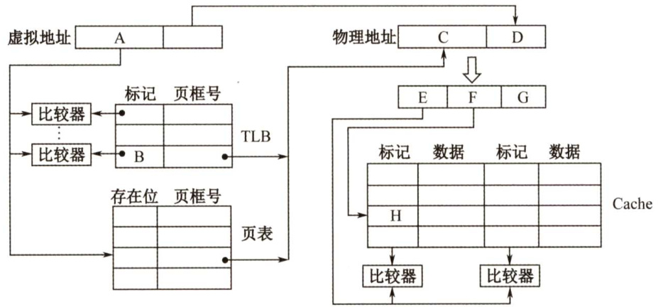  

回答下列问题：  

1）图中字段A～G的位数各是多少？TLB标记字段B中存放的是什么信息？  
2）将块号为4099的主存块装入Cache时，所映射的Cache组号是多少？对应的H字  
段内容是什么？  
3）是Cache缺失处理的时间开销大还是缺页处理的时间开销大？为什么？  
4）为什么Cache可以采用直写策略，而修改页面内容时总是采用回写策略？  

08．有一全相联Cache系统，Cache由8个块构成，CPU送出的主存地址流序列分别为01110,10010,01110,10010,01000,00100,01000和01010，即十进制为14,18,14,18,8,4,8,10。1）求每次访问后，Cache的地址分配情况。2）当Cache的容量换成4个块，地址流为6,15,6,13,11，10,8和7时，求采用先进先出替换算法的相应地址分配和操作。  

09.【2020统考真题】假定主存地址为32位，按字节编址，指令Cache和数据Cache与主存之间均采用8路组相联映射方式，直写（WriteThrough）写策略和LRU替换算法，主存块大小为64B，数据区容量各为32KB。开始时Cache均为空。请回答下列问题。  

1）Cache每一行中标记（Tag）、LRU位各占几位？是否有修改位？  

2）有如下C语言程序段：  

for $k=0$ ， $k<1024$ ； $k++$ $s[\mathbf{k}]=2\star s[\mathbf{k}]$ 若数组s及其变量 $\mathbf{k}$ 均为int型，int型数据占4B，变量k分配在寄存器中，数组s在主存中的起始地址为 $0080~00\mathrm{C}0\mathrm{H}$ ，则在该程序段执行过程中，访问数组s的数据Cache缺失次数为多少？3）若CPU最先开始的访问操作是读取主存单元00010003H中的指令，简要说明从Cache中访问该指令的过程，包括Cache缺失处理过程。  

#### 3.5.7 答案与解析  

#### 一、单项选择题  

01.B  

A 为干扰项。各层次的存储系统不是孤立工作的，三级结构的存储系统是围绕主存储器来组织、管理和调度的存储器系统，它们既是一个整体，又要遵循系统运行的原理，其中包括包含性原则。由于Cache 中存放的是主存中某一部分信息的副本，所以不能认为总容量为两个层次容量的简单相加。  

02.C  

一个块通常由若干字组成，CPU 与Cache（或主存）间信息交互的单位是字，而Cache 与主存间信息交互的单位是块。当CPU访问的某个字不在Cache 中时，将该字所在的主存块调入Cache，这样CPU下次欲访问的字才有可能在Cache中。  

#### 03.D  

在写不命中时，加载相应的低一层中的块到高速缓存（Cache）中，然后更新这个高速缓存块，称为写分配法；而避开Cache，直接把这个字写到主存中，则称为非写分配法。这两种方法都是在不命中Cache 的情况下使用的，而回写法和全写法是在命中Cache 的情况下使用的。在写Cache时，写分配法和回写法搭配使用，非写分配法和全写法搭配使用。  

#### 04.A  

LRU表如下：  

<html><body><table><tr><td>单元1</td><td></td><td></td><td></td><td></td><td></td><td>2</td><td>7</td><td>2</td><td>1</td><td>8</td><td>3</td><td>8</td><td>2</td><td>１</td><td>3</td><td>1</td><td>7</td><td>1</td><td>3</td><td>7</td></tr><tr><td>单元2</td><td></td><td></td><td></td><td>7</td><td>8</td><td>8</td><td>2</td><td>7</td><td>2</td><td>一</td><td>8</td><td>3</td><td>8</td><td>2</td><td>1</td><td>3</td><td></td><td>７</td><td>1</td><td>3</td></tr><tr><td>单元3</td><td></td><td>8</td><td>1</td><td>一</td><td>7</td><td>7</td><td>8</td><td>8</td><td>7</td><td>2</td><td></td><td>1</td><td>3</td><td>8</td><td>2</td><td>2</td><td>3</td><td>3</td><td>7</td><td>1</td></tr><tr><td>单元4</td><td>1</td><td>1</td><td>8</td><td>8</td><td>1</td><td>1</td><td>1</td><td>1</td><td>8</td><td>7</td><td>2</td><td>2</td><td>1</td><td>3</td><td>8</td><td>8</td><td>2</td><td>2</td><td>2</td><td>2</td></tr><tr><td>命中否</td><td>否</td><td>否</td><td></td><td>否</td><td></td><td>否</td><td></td><td></td><td></td><td></td><td>否</td><td></td><td></td><td></td><td></td><td></td><td>否</td><td></td><td></td><td></td></tr></table></body></html>  

可见页面失效率是 $6/20=30\%$ o  

05.C  

因为Cache容量为 $16\mathbf{KB}=2^{14}\mathbf{B}$ ，所以Cache地址长14位（选项都为14位，即隐含了按字节编址)。主存与Cache地址映像采用直接映像方式，将32 位的主存地址0x1234E8F8 写成二进制，根据直接映射的地址结构可知，取低14位就是Cache地址。  

#### 06.C  

LRU算法根据程序访问局部性原理选择近期使用得最少的存储块作为替换的块。  

07.D  

地址映射表即标记阵列，由于Cache 被分为64个块，则Cache有64 行，采用直接映射，一行相当于一组。因此标记阵列每行存储1个标记项，其中主存标记项为12位 $(2^{12}=4096$ ，是  

Cache 容量的4096倍，即地址长度比Cache长12位)，加上1位有效位，因此为 $64\times13$ 位。  

#### 08.C  

块大小为16B，所以块内地址字段为4位；Cache容量为128KB，采用8路组相联，共有$128\mathrm{KB}/(16\mathrm{B}{\times}8)=1024\$ 组，组号字段为10位；剩下的为标记字段。1234567H转换为二进制数$0001\ 0010\ 0011\ 0100\ 0101\ 0110\ 0111$ ，标记字段对应高14位，即048DH。  

#### 09.A  

先写出主存地址的二进制形式，然后分析Cache块内地址、Cache 字块地址和主存字块标记。主存地址的二进制数 $0011\ 0101\ 0011\ 0000\ 0001$ ，根据直接映射的地址结构，字块内地址为低5位（每字块含32B， $2^{5}=32$ ，因此为5位)，主存字块标记为高6位（ $1\mathrm{MB}/16\mathrm{KB}=64\$ ， $2^{6}=$ 64，因此为6位)，其余 $010011000$ 即为Cache字块地址，转换为十进制数152。  

#### 10.C  

当CPU访存时，先要到Cache中查看该主存地址是否在Cache中，所以发送的是主存物理地址。只有在虚拟存储器中，CPU发出的才是虚拟地址，这里并未指出是虚拟存储系统。磁盘地址是外存地址，外存中的程序由操作系统调入主存中，然后在主存中执行，因此CPU不可能直接访问磁盘。  

#### 11.C  

对于逻辑地址，因为 $8=2^{3}$ 页，所以表示页号的地址有3位，又因为每页有 $1024\:=\:2^{10}\mathrm{B}$ ，所以页内地址有10位，因此逻辑地址共13位。  

对于物理地址，块内地址和页内地址一样有10位，内存至少有 $32=2^{5}$ 个物理块，所以表示块号的地址至少有5位，因此物理地址至少有15位。  

#### 12.D  

主存块大小为1个字，即32位，按字节编址，故块内地址占2位。在全相联映射方式下，主存地址只有两个字段，故标志占 $32-2=30$ 位。因采用回写法，故需1位修改位；因为采用随机替换策略，故无须替换控制位。每个Cahce行的总位数为32bit（数据位） $^+$ 30bit（tag位） $^+$ 1bit（修改位） $^+$ lbit（有效位） $\O=$ 64bit。综上，Cache总容量至少应有 $32\mathrm{K}{\times}64\mathrm{bit}=2048\mathrm{K}$ bit。  

#### 13.A  

主存块大小为32字节，按字节编址，故块内地址占5位。采用四路组相联映射方式，共64行，分 $64/4=16$ 组，故组号占4位。因为 $2593=0{\cdots}0101\ 0001\ 00001$ ，根据主存地址划分的结果，可以看出第2593号存储单元所在主存块的Cache组号为0001。  

#### 14.C  

一次缺失损失需要从主存读出一个主存块（64B)，每个总线事务读取8B，因此需要8个总线事务。每个总线事务所用的时间为 $1+8+1=10$ 个时钟周期，共需要80个时钟周期。  

#### 15.A  

一次缺失损失需要从主存读出一个主存块（64B)，每个突发传送总线事务可读取 $8{\bf K}{\times}{8}=$  

64B，因此，只需要一个突发传送总线事务。每个突发传送总线事务所用的时间为 $1+8+8=17$ 个时钟周期，因此共需要17个时钟周期。  

#### 16.D  

命中率 $\mathbf{\Sigma}=\mathbf{\Sigma}$ Cache 命中次数/总访问次数。注意看清题目，题中说明的是缺失50次，而不是命中50次，仔细审题是做对题的第一步。  

#### 17.C  

由于Cache共有16块，采用二路组相联，因此共分为8组，组号为 $0,1,2,\cdots,7$ 。主存的某一字块按模8映射到Cache 某组的任一字块中，即主存的第0,8，16,…字块可以映射到Cache 第0组的任一字块中。每个主存块大小为32B，因此129号单元位于第4块主存块中（注意是从0开始的)，因此将映射到Cache第4组的任一字块中。  

注意：由于在计算机系统结构和计算机组成原理的某些教材中介绍的组相联与此处的组相联不太相同，导致部分读者对题目理解错误。读者应以真题为准，以后再出现类似的题目，应以此种解答方式为标准。而且组号通常是从0而不是从1开始的（从选项也可看出）。  

#### 18.C  

地址映射采用二路组相联，主存地址为 $0{\sim}1$ ， $4{\sim}5$ 、 $8{\sim}9$ 可映射到第O组Cache 中，主存地址为 $2\sim3$ ， $6{\sim}7$ 可映射到第1组Cache中。Cache 置换过程如下表所示。  

<html><body><table><tr><td colspan="2">走向</td><td>0</td><td>4</td><td>8</td><td>2</td><td>0</td><td>6</td><td>8</td><td>6</td><td>4</td><td>8</td></tr><tr><td rowspan="2">第0组</td><td>块0</td><td></td><td>0</td><td>4</td><td>4</td><td>8</td><td>8</td><td>0</td><td>0</td><td>8</td><td>4</td></tr><tr><td>块1</td><td></td><td>4</td><td>8</td><td>8</td><td>0</td><td>0</td><td>8*</td><td>8</td><td>4</td><td>8*</td></tr><tr><td rowspan="2">第1组</td><td>块2</td><td></td><td></td><td></td><td></td><td></td><td>2</td><td>2</td><td>2</td><td>2</td><td>2</td></tr><tr><td>块3</td><td></td><td></td><td></td><td>2</td><td>2</td><td>61</td><td>6</td><td>6*</td><td>6</td><td>6</td></tr></table></body></html>

注：“_”表示当前访问块，“\*”表示本次访问命中。  

注意：在不同的计算机组成原理教材中，关于组相联映射的介绍并不相同。通常采用上题中的方式，这也是唐朔飞所编教材中的方式，但本题中采用的是蒋本珊所编教材中的方式。可以推断两次命题的老师应该不是同一老师，因此给考生答题带来了困扰。  

#### 19.D  

把指令Cache 与数据Cache 分离后，取指和取数分别到不同的Cache 中寻找，则指令流水线中取指部分和取数部分就可以很好地避免冲突，即减少了指令流水线的冲突。  

#### 20.C  

解析请扫右侧二维码查阅。  

21.A  

时间局部性是，一旦一条指令执行，它就可能在不久的将来再被执行。空间局部性是，一旦一个存储单元被访问，它附近的存储单元也很快被访问。显然，这里的循环指令本身具有时间局部性，它对数组a的访问具有空间局部性，选A。  

22.A  

Cache 数据区大小为32KB，主存块的大小为32B，那么Cache中共有1K个Cache 行，物理地址中偏移量部分的长度为 5bit。因为采用直接映射方式，所以1K个Cache 行映射到1K个分组，物理地址中组号部分的长度为10bit。32bit的主存地址除去 5bit 的偏移量和10bit 的组号后，还剩17bit的tag部分。又因为Cache采用回写法，所以Cahce行的总位数应为32B（数据位）+17bit（tag位） $^+$ 1bit（脏位） $^+$ lbit（有效位） $=2756\mathrm{it}$ o  

#### 二、综合应用题  

01.【解答】  

回写法（WriteBack）减少了访存次数，但存在不一致的隐患。因此若题目中出现了“较高的安全要求”，则尽量要使用写直通法（WriteThrough)。  

1）采用WriteBack策略较好，可减少访存次数。  
2）采用WriteThrough策略较好，能保证数据的一致性。  

02.【解答】  

因为块大小为64B，所以块内地址字段为6位；因为Cache中有128个主存块，采用四路组相联，Cache分为32组（ $128/4=32\$ )，所以组号字段为5位；标记字段为剩余的 $32-5-6=$ 21位。  

数据Cache 的总位数应包括标记项的总位数和数据块的位数。每个Cache块对应一个标记项，标记项中应包括标记字段、有效位和“脏”位（仅适用于回写法)。  

1）主存地址中Tag为21位，位于主存地址前部；组号Index为5位，位于主存地址中部；块内地址Offset为6位，位于主存地址后部。  
2）标记项的总位数 $=128{\times}(21+1+1)=128{\times}23=2944$ 位，数据块位数 $=128\times64\times8=65536$ 位，所以数据Cache的总位数 $=2944+65536=68480$ 位。  

03.【解答】  

1）每个Cache行对应一个标记项，如下图所示。  

<html><body><table><tr><td>有效位</td><td>脏位</td><td>替换控制位</td><td>标记位</td></tr></table></body></html>  

不考虑用于Cache一致性维护和替换算法的控制位。地址总长度为28位！ $(2^{28}=256\mathbf{M})$ ，块内地址6位（ $(2^{6}=64)$ ，Cache块号3位（ $2^{3}=8$ )，因此Tag的位数为 $28-6-3=19$ 位，还需使用一个有效位，因此题中数据Cache行的结构如下图所示。  

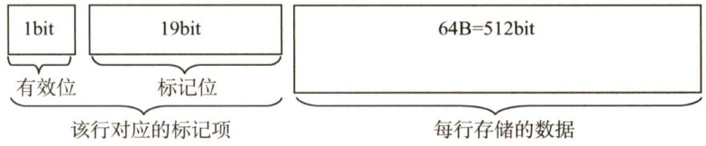  

数据Cache共有8行，因此数据Cache的总容量为 $\mathbf{8}{\times}(64+20/8)\mathbf{B}=532\mathbf{B}$ 0  

2）数组a在主存的存放位置及其与Cache之间的映射关系如下图所示。  

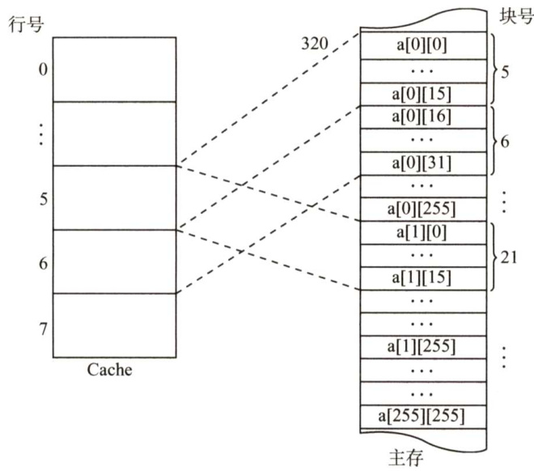  

数组按行优先方式存放，首地址为320，数组元素占 4B。a[0][31]所在的主存块对应的Cache行号为 $[(320+(0{\times}256+31){\times}4)\mathrm{div}2^{6}]\ \mathrm{mod}2^{3}=6;$ ：a[1][1]所在的主存块对应的Cache行号为[ $(320+(1\times256+1)\times4)\mathrm{div}2^{6}]\mathrm{mod}2^{3}=5\:_{}$  

【另解】由1）可知主存和Cache的地址格式如下图所示。  

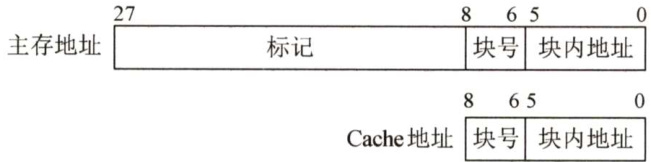  

数组按行优先方式存放，首地址为320，数组元素占4B。a[0][31]的地址为 $320+31\times4=$ $110111100_{\mathrm{B}}$ ，因此其对应的Cache行号为 $110_{\mathrm{B}}=6$ ；a[1][1]的地址为 $320+256{\times}4+1{\times}4=$ $1348=10101000100_{\mathrm{B}}$ ，因此其对应的Cache行号为 $101_{\mathrm{B}}=5$ o  

3）数组a的大小为 $256\times256\times4\mathrm{B}=2^{18}\mathrm{B}$ ，占用 $2^{18}/64=2^{12}$ 个主存块，按行优先存放，程序A 逐行访问数组a，共需访问的次数为 $2^{16}$ 次，未命中次数为 $2^{12}$ 次（即每个字块的第一个数未命中)，因此程序A的命中率为 $(2^{16}-2^{12})/2^{16}\times100\%=93.75\%$ 。  

【另解】数组a按行存放，程序A按行存取。每个字块中存放16个int型数据，除访问的第一个不命中外，随后的15个全都命中，访问全部字块都符合这一规律，且数组大小为字块大小的整数倍，因此程序A的命中率为 $15/16=93.75\%$ 。程序B逐列访问数组a，Cache总数据容量为 $64\mathrm{B}\times8=512\mathrm{B}$ ，数组a一行的大小为1KB，正好是Cache 容量的2倍，可知不同行的同一列数组元素使用的是同一个Cache单元，因此逐列访问每个数据时，都会将之前的字块置换出，即每次访问都不会命中，命中率为0。由于从Cache读数据比从主存读数据快很多，所以程序A的执行比程序B快得多。  

注意：本题考查Cache容量计算、直接映射方式的地址计算及命中率计算（行优先遍历与列优先遍历命中率差别很大)。  

04.【解答】  

1）因为字长为16位，即2B，主存容量 $=16{\times}256{\times}2\mathbf{B}=8192\mathbf{B}$ ，Cache容量 $\mathbf{\tau}=16{\times}8{\times}2\mathbf{B}=$ 256B，主存字地址 $=8+4=12$ 位，Cache 字地址 $=3+4=7$ 位，如下图所示。  

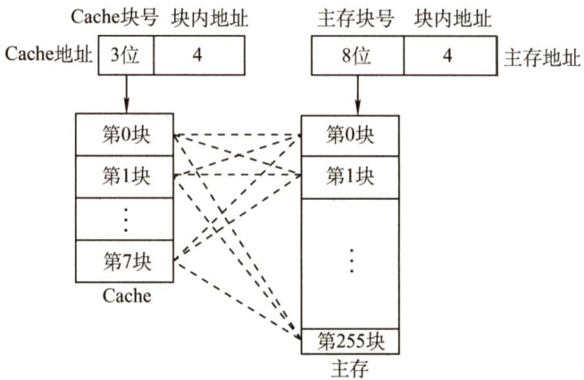  

2）如下图所示，由于每块16字，所以该主存字所在的主存块号为 $33\mathrm{H}$ 。由于是全相联映射，原先已装入Cache的5个块依次在 $0{\sim}4$ 号块，因此主存的第33H块将装入Cache的5号块。对应Cache的字地址为 $1011000_{\mathrm{B}}$ ，其中101为块号，1000为块内地址。  

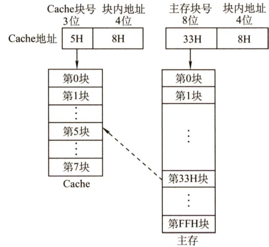  

3）如下图所示，由于表中地址为1的行中标记着36H的主存块号标志，则当CPU送来主存的字地址为368H时，其主存块号为 $36\mathrm{H}$ ，所以命中。此时的Cache字地址为 $58\mathrm{H}$ o  

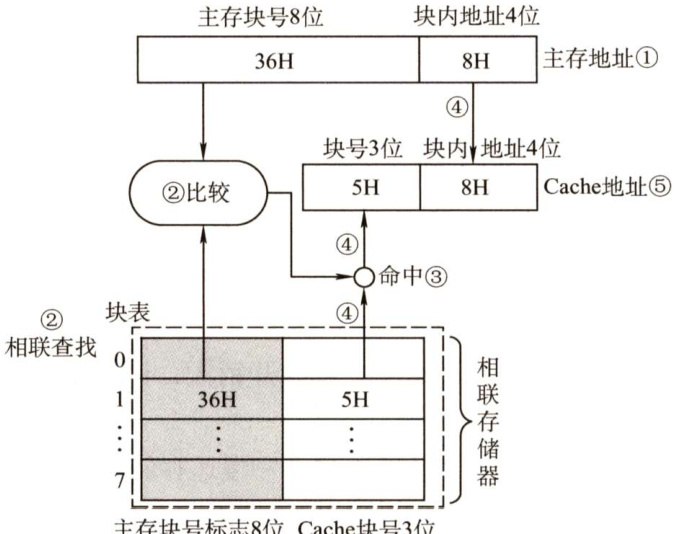  

05.【解答】  

1）由于 $64\mathrm{KB}/128\mathrm{B}=512$ ，因此有512行。而该Cache是四路组相联，所以 $512/4=128$ 组。  

2）每行有一个标记项，因此有512个标记项。主存字块标记长度就是标记位的长度，由于该Cache有128组 $(=2^{7}$ )，所以7位为组地址。而行长128B $(=2^{7}$ ，7位为字块内地址，因此该标记项中的标记位长度为 $32-7-7=18$ 位。  

3）LRU替换策略要记录每个Cache 行的生存时间，因此每个标记项有两位替换控制位。而全写法没有“脏”位（一致性控制位)，再加一个有效位即可。因此每个标记项位数是$18+2+1=21$ 位，因此总大小为 $512\times21=10752$ 位。  

回写式则是每个标记项加一个一致性控制位，因此为 $512\times22=11264$ 位。  

06.【解答】  

1）CPU的时钟周期是主频的倒数，即 $1/800\mathrm{MHz}=1.25\mathrm{ns}$ 。总线的时钟周期是总线频率的倒数，即 $1/200\mathrm{MHz}=5\mathrm{ns}$ 。总线宽度为32位，因此总线带宽为 $4\mathrm{B}{\times}200\mathrm{MHz}=800\mathrm{MB}/\mathrm{s}$ 或 $4\mathrm{B}/5\mathrm{ns}=800\mathrm{MB}/\mathrm{s}.$  

2）Cache块大小是32B，因此Cache缺失时需要一个读突发传送总线事务读取一个主存块。  

3）一次读突发传送总线事务包括一次地址传送和32B数据传送：用1个总线时钟周期传输地址；每隔 $40\mathrm{{ns}}/8~=~5\mathrm{{ns}}$ 启动一个体工作（各进行1次存取)，第一个体读数据花费$40\mathrm{{ns}}$ ，之后数据存取与数据传输重叠；用8个总线时钟周期传输数据。读突发传送总线事务时间为 $5\mathrm{ns+40\mathrm{ns+8}{\times}5\mathrm{ns=8}5\mathrm{ns}}$ 。  

4）一条指令的平均CPU 执行时间包括Cache命中时的指令执行时间和Cache 缺失时带来的额外开销。Cache 命中时的一条指令执行时间 $\mathbf{\Sigma}=\mathbf{\Sigma}$ Cache 命中时的 $\mathbf{CPI\times}$ 时钟周期 $\mathbf{\Sigma}=\mathbf{\Sigma}$ $4{\times}1.25\mathrm{{ns}=5\mathrm{{ns}}}$ 。一条指令执行过程中因Cache缺失而导致的平均额外开销 $\mathbf{\Sigma}=\mathbf{\Sigma}$ 平均访存次数 $\times$ Cache缺失率 $\times$ 一次读突发传送总线事务时间 $=1.2{\times}5\%{\times}85\mathrm{ns}=5.1\mathrm{ns}.$ 。一条指令的平均CPU执行时间 $=5\mathrm{{ns}+5.1\mathrm{{ns}=10.1\mathrm{{ns}}}}$ 。BP 的CPU 执行时间 $\mathbf{\Sigma}=\mathbf{\Sigma}$ 一条指令的平均CPU执行时间 $\times$ 指令条数 $=10.1\mathrm{ns}\times100=1010\mathrm{ns}$ 。  

07.【解答】  

1）页大小为8KB，页内偏移地址为13位，因此 $\mathbf{A}=\mathbf{B}=32\mathit{\Theta}-\ 13=19$ ， ${\bf D}=13$ . $\mathrm{~C~}=24\mathrm{~-~}$ $13\:=\:11$ ；主存块大小为64B，因此 $\mathrm{~G~}=\mathrm{~6~}$ 。二路组相联，每组数据区容量有 $64\mathrm{B}\times2=$ 128B，共有 $64\mathrm{KB}/128\mathrm{B}=512$ 组，因此 $\operatorname{F}=9$ ， $\mathrm{E}=24-\mathbf{G}-\mathbf{F}=24-6-9=9$ 。因而 $\mathbf{A}=19$ ， $\mathbf{B}=19$ ， ${\bf C}=11$ ， ${\bf D}=13$ ， $\operatorname{E}=9$ ， $\operatorname{F}=9$ ， $\mathrm{G}=6$ 。TLB中标记字段B的内容是虚页号，表示该TLB项对应哪个虚页的页表项。  

2）块号 $4099=00~0001~0000~0000~0011\mathbf{B}$ ，因此所映射的Cache组号为 $0\ 0000\ 0011\mathbf{B}=3$ 对应的H字段内容为 $000001000\mathrm{B}$ o  

3）Cache 缺失带来的开销小，而处理缺页的开销大。因为缺页处理需要访问磁盘，而Cache缺失只要访问主存。  

4）因为采用直写策略时需要同时写快速存储器和慢速存储器，而写磁盘比写主存慢很多，所以在Cache-主存层次，Cache可以采用直写策略，而在主存-外存（磁盘）层次，修改页面内容时总是采用回写策略。  

08.【解答】  

1）依据Cache的块容量和访问的块地址流序列，Cache的地址分配如下图所示。  

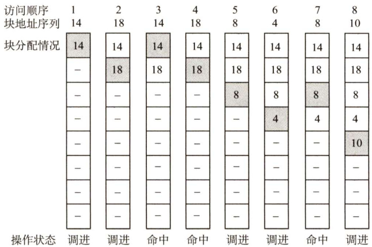  

2）采用先进先出替换算法的相应地址分配如下图所示。  

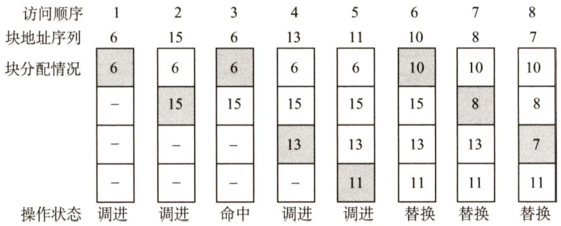  

由于是全相联映射，且访问从第6个地址开始时，Cache已装不下，因此按照先进先出的原则依次替换出第0块、第1块和第2块。  

09.【解答】  

1）主存块大小为 $64\mathrm{B}=2^{6}$ 字节，故主存地址低6位为块内地址，Cache组数为 $32\mathrm{KB}/(64\mathrm{B}\times$ $8)=64=2^{6}$ ，故主存地址中间6位为Cache组号，主存地址中高 $32\mathrm{~-~}6\mathrm{~-~}6=20$ 位为标记，采用8路组相联映射，故每行中的LRU位占3位，采用直写方式，故没有修改位。  

2) $0080~00{\bf C}0{\bf H}=0000~0000~1000~0000~0000~0000~1100~0000{\bf B}$ ，主存地址的低6位为块内地址，为全0，故s位于一个主存块的开始处，占 $1024\times4\mathrm{B}/64\mathrm{B}=64$ 个主存块；在执行程序段的过程中，每个主存块中的 $64\mathrm{B}/4\mathrm{B}=16\$ 个数组元素依次读、写1次，因而对每个主存块，总是第一次访问缺失，此时会将整个主存块调入Cache，之后每次都命中。综上，数组s的数据Cache访问缺失次数为64次。  

3) $0001\ 0003\mathrm{H}=0000\ 0000\ 00000\ 0001\ 0000\ 00000\ 000011\mathrm{B}$ ，根据主存地址划分可知，组索引为0，故该地址所在主存块被映射到指令Cache的第0组；因为Cache初始为空，所有Cache行的有效位均为0，所以Cache访问缺失。此时，将该主存块取出后存入指令Cache的第0组的任意一行，并将主存地址高20位（00010H）填入该行标记字段，设置有效位，修改LRU位，最后根据块内地址000011B从该行中取出相应的内容。