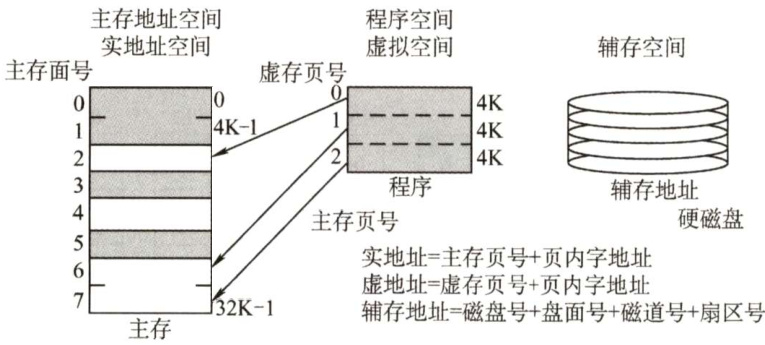
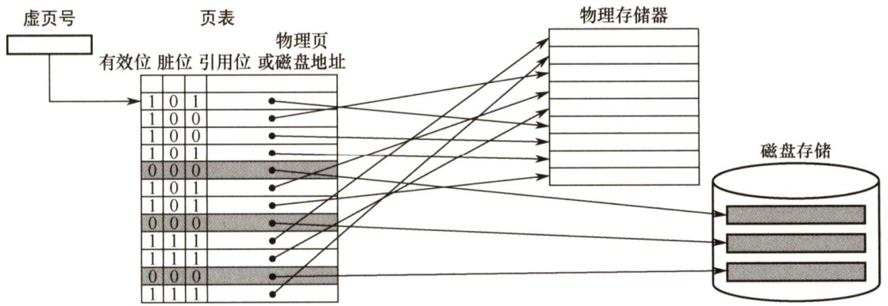
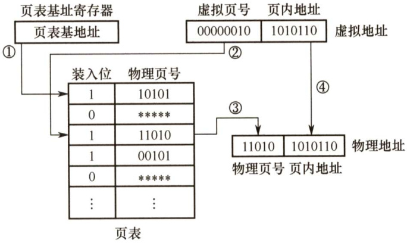
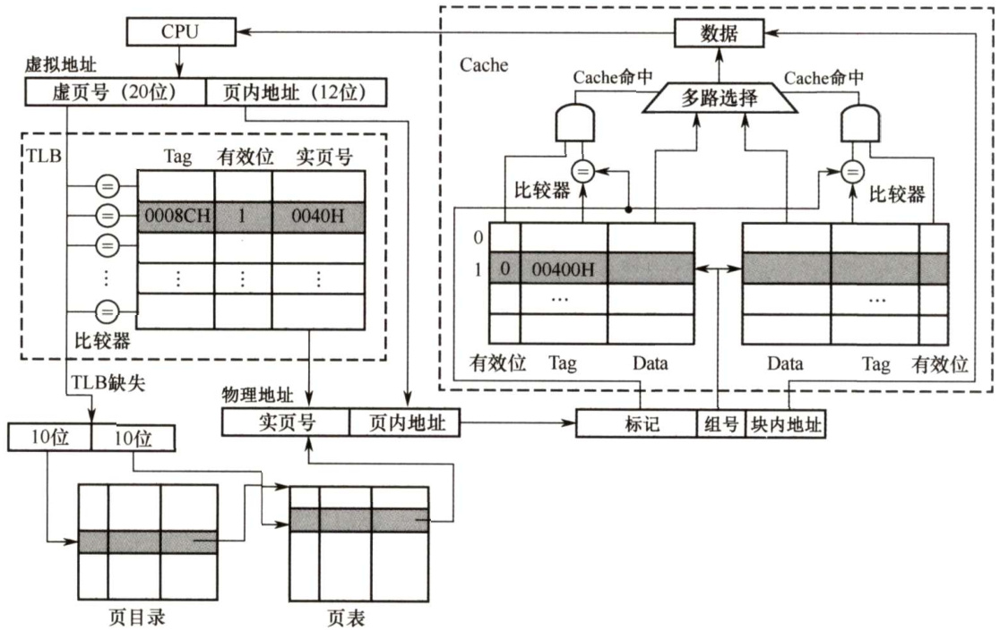
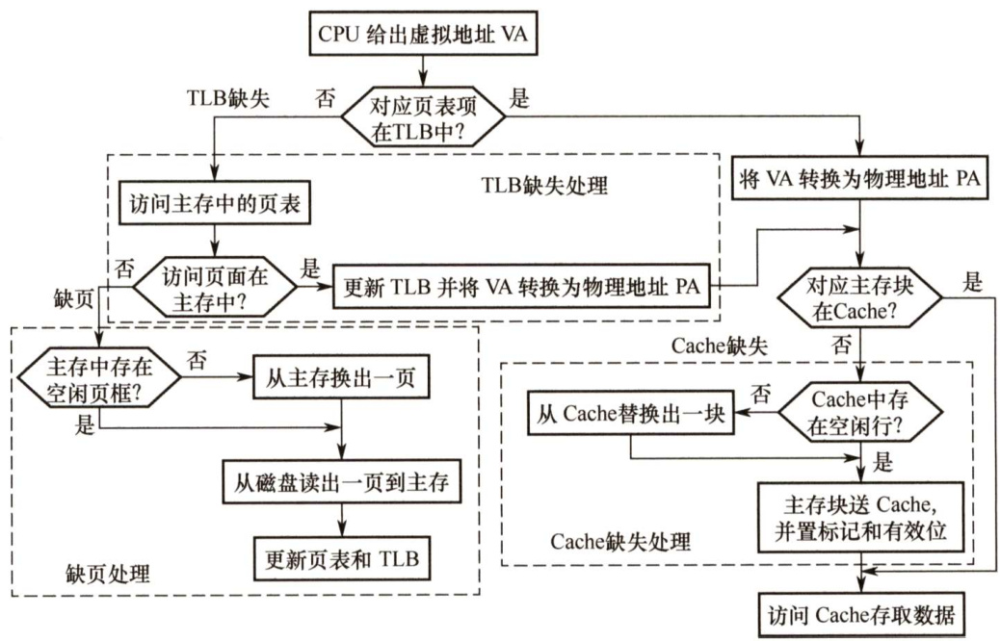
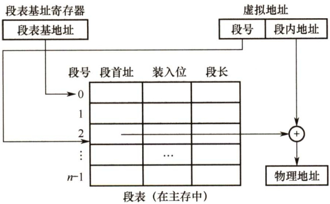
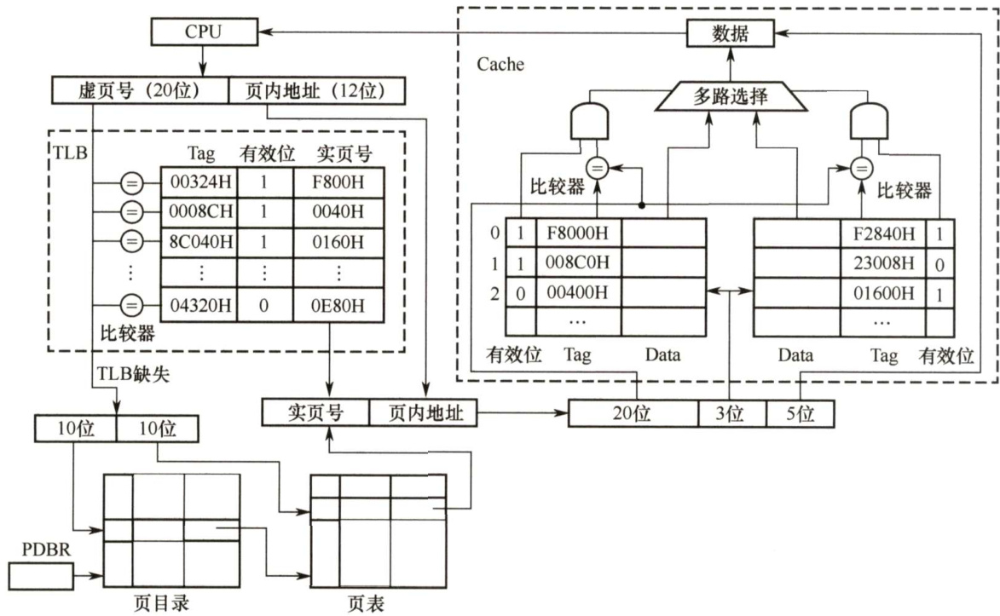

#### 3.6 虚拟存储器  

主存和辅存共同构成了虚拟存储器，二者在硬件和系统软件的共同管理下工作。对于应用程序员而言，虚拟存储器是透明的。虚拟存储器具有主存的速度和辅存的容量。  

#### 3.6.1 虚拟存储器的基本概念  

虚拟存储器将主存或辅存的地址空间统一编址，形成一个庞大的地址空间，在这个空间内，用户可以自由编程，而不必在乎实际的主存容量和程序在主存中实际的存放位置。  

用户编程允许涉及的地址称为虚地址或逻辑地址，虚地址对应的存储空间称为虚拟空间或程序空间。实际的主存单元地址称为实地址或物理地址，实地址对应的是主存地址空间，也称实地址空间。虚地址比实地址要大很多。虚拟存储器的地址空间如图3.24所示。  

  
图3.24虚拟存储器的3个地址空间  

CPU 使用虚地址时，由辅助硬件找出虚地址和实地址之间的对应关系，并判断这个虚地址对应的存储单元内容是否已装入主存。若已在主存中，则通过地址变换，CPU 可直接访问主存指示的实际单元；若不在主存中，则把包含这个字的一页或一段调入主存后再由CPU 访问。若主存已满，则采用替换算法置换主存中的交换块（即页面)。  

虚拟存储器也采用和Cache 类似的技术，将辅存中经常访问的数据副本存放到主存中。但是缺页（或段）而访问辅存的代价很大，提高命中率是关键，因此虚拟存储机制采用全相联映射，每个虚页面可以存放到对应主存区域的任何一个空闲页位置。此外，当进行写操作时，不能每次写操作都同时写回磁盘，因而，在处理一致性问题时，采用回写法。  

#### 3.6.2 页式虚拟存储器?  

页式虚拟存储器以页为基本单位。虚拟空间与主存空间都被划分成同样大小的页，主存的页称为实页、页框，虚存的页称为虚页。把虚拟地址分为两个字段：虚页号和页内地址。虚拟地址到物理地址的转换是由页表实现的。页表是一张存放在主存中的虚页号和实页号的对照表，它记录程序的虚页调入主存时被安排在主存中的位置。页表一般长久地保存在内存中。  

#### 1．页表  

图 3.25是一个页表示例。有效位也称装入位，用来表示对应页面是否在主存，若为1，则表示该虚拟页已从外存调入主存，此时页表项存放该页的物理页号；若为0，则表示没有调入主存，此时页表项可以存放该页的磁盘地址。脏位也称修改位，用来表示页面是否被修改过，虚存机制中采用回写策略，利用脏位可判断替换时是否需要写回磁盘。引用位也称使用位，用来配合替换策略进行设置，例如是否实现最先调入（FIFO位）或最近最少用（LRU位）策略等。  

  
图3.25主存中的页表示例  

CPU 执行指令时，需要先将虚拟地址转换为主存物理地址。页表基址寄存器存放进程的页表首地址，然后根据虚拟地址高位部分的虚拟页号找到对应的页表项，若装入位为1，则取出物理页号，和虚拟地址低位部分的页内地址拼接，形成实际物理地址；若装入位为0，则说明缺页，需要操作系统进行缺页处理。地址变换的过程如图3.26所示。  

  
图3.26页式虚拟存储器的地址变换过程  

页式虚拟存储器的优点是，页面的长度固定，页表简单，调入方便。缺点是，由于程序不可能正好是页面的整数倍，最后一页的零头将无法利用而造成浪费，并且页不是逻辑上独立的实体，所以处理、保护和共享都不及段式虚拟存储器方便。  

#### 2.快表（TLB）  

由地址转换过程可知，访存时先访问一次主存去查页表，再访问主存才能取得数据。如果缺页，那么还要进行页面替换、页面修改等，因此采用虚拟存储机制后，访问主存的次数更多了。  

依据程序执行的局部性原理，在一段时间内总是经常访问某些页时，若把这些页对应的页表项存放在高速缓冲器组成的快表（TLB）中，则可以明显提高效率。相应地把放在主存中的页表称为慢表（Page)。在地址转换时，首先查找快表，若命中，则无须访问主存中的页表。  

快表通常采用全相联或组相联方式。每个TLB项由页表表项内容加上一个TLB标记字段组成，TLB标记用来表示该表项取自页表中哪个虚页号对应的页表项，因此，TLB标记的内容在全相联方式下就是该页表项对应的虚页号；组相联方式下则是对应虚页号的高位部分，而虚页号的  

低位部分用于选择TLB组的组索引（详细介绍见《操作系统考研复习指导》一书的3.2.7节)。  

#### 3.具有TLB和Cache的多级存储系统  

图3.27是一个具有TLB和Cache的多级存储系统，其中Cache采用二路组相联方式。CPU给出一个32位的虚拟地址，TLB采用全相联方式，每一项都有一个比较器，查找时将虚页号与每个TLB标记字段同时进行比较，若有某一项相等且对应有效位为1，则TLB命中，此时可直接通过TLB进行地址转换；若未命中，则TLB缺失，需要访问主存去查页表。图中所示的是两级页表方式，虚页号被分成页目录索引和页表索引两部分，由这两部分得到对应的页表项，从而进行地址转换，并将相应表项调入TLB，若 TLB已满，则还需要采用替换策略。完成由虚拟地址到物理地址的转换后，Cache 机构根据映射方式将物理地址划分成多个字段，然后根据映射规则找到对应的Cache 行或组，将对应Cache 行中的标记与物理地址中的高位部分进行比较，若相等且对应有效位为1，则Cache命中，此时根据块内地址取出对应的字送CPU。  

  
图3.27TLB和Cache的访问过程  

查找时，快表和慢表也可以同步进行，若快表中有此虚页号，则能很快地找到对应的实页号，并使慢表的查找作废，从而就能做到虽采用虚拟存储器但访问主存速度几乎没有下降。  

在一个具有Cache 和 TLB 的虚拟存储系统中，CPU一次访存操作可能涉及 TLB、页表、Cache、主存和磁盘的访问，访问过程如图3.28所示。可见，CPU 访存过程中存在三种缺失情况： $\textcircled{1}$ TLB 缺失：要访问的页面的页表项不在TLB中： $\textcircled{2}$ Cache缺失：要访问的主存块不在Cache中： $\textcircled{3}$ Page 缺失：要访问的页面不在主存中。这三种缺失的可能组合情况如表3.3所示。  

最好的情况是第1种组合，此时无须访问主存；第2 种和第3种组合都需要访问一次主存；第4种组合需要访问两次主存；第5种组合发生“缺页异常”，需要访问磁盘，并且至少访问两次主存。Cache 缺失处理由硬件完成；缺页处理由软件完成，操作系统通过“缺页异常处理程序”来实现；而TLB缺失既可以用硬件又可以用软件来处理。  

  
图3.28带TLB虚拟存储器的CPU访存过程  

表3.3TLB、Page、Cache三种缺失的可能组合情况  

<html><body><table><tr><td>序号</td><td>TLB</td><td>Page</td><td>Cache</td><td>说明</td></tr><tr><td>1</td><td>命中</td><td>命中</td><td>命中</td><td>TLB命中则Page一定命中，信息在主存，就可能在Cache中</td></tr><tr><td>2</td><td>命中</td><td>命中</td><td>缺失</td><td>TLB命中则Page一定命中，信息在主存，也可能不在Cache中</td></tr><tr><td>3</td><td>缺失</td><td>命中</td><td>命中</td><td>TLB缺失但Page可能命中，信息在主存，就可能在Cache中</td></tr><tr><td>4</td><td>缺失</td><td>命中</td><td>缺失</td><td>TLB缺失但Page可能命中，信息在主存，也可能不在Cache中</td></tr><tr><td>5</td><td>缺失</td><td>缺失</td><td>缺失</td><td>TLB缺失则Page也可能缺失，信息不在主存，也一定不在Cache</td></tr></table></body></html>  

#### 3.6.3 段式虚拟存储器  

段式虚拟存储器中的段是按程序的逻辑结构划分的，各个段的长度因程序而异。把虚拟地址分为两部分：段号和段内地址。虚拟地址到实地址之间的变换是由段表来实现的。段表是程序的逻辑段和在主存中存放位置的对照表。段表的每行记录与某个段对应的段号、装入位、段起点和段长等信息。由于段的长度可变，所以段表中要给出各段的起始地址与段的长度。  

CPU根据虚拟地址访存时，首先根据段号与段表基地址拼接成对应的段表行，然后根据该  

段表行的装入位判断该段是否已调入主存（装入位为“1”，表示该段已调入主存；装入位为“0”，表示该段不在主存中)。已调入主存时，从段表读出该段在主存中的起始地址，与段内地址（偏移量）相加，得到对应的主存实地址。段式虚拟存储器的地址变换过程如图3.29所示。  

段式虚拟存储器的优点是，段的分界与程序的自然分界相对应，因而具有逻辑独立性，使得它易于编译、管理、修改和保护，也便于多道程序的共享；缺点是因为段长度可变，分配空间不便，容易在段间留下碎片，不好利用，造成浪费。  

  
图3.29段式虚拟存储器的地址变换过程  

#### 3.6.4 段页式虚拟存储器  

把程序按逻辑结构分段，每段再划分为固定大小的页，主存空间也划分为大小相等的页，程序对主存的调入、调出仍以页为基本传送单位，这样的虚拟存储器称为段页式虚拟存储器。在段页式虚拟存储器中，每个程序对应一个段表，每段对应一个页表，段的长度必须是页长的整数倍，段的起点必须是某一页的起点。  

虚地址分为段号、段内页号、页内地址三部分。CPU 根据虚地址访存时，首先根据段号得到段表地址；然后从段表中取出该段的页表起始地址，与虚地址段内页号合成，得到页表地址；最后从页表中取出实页号，与页内地址拼接形成主存实地址。  

段页式虚拟存储器的优点是，兼具页式和段式虚拟存储器的优点，可以按段实现共享和保护。缺点是在地址变换过程中需要两次查表，系统开销较大。  

#### 3.6.5 虚拟存储器与Cache的比较  

虚拟存储器与Cache既有很多相同之处，又有很多不同之处。  

#### 1.相同之处  

1）最终目标都是为了提高系统性能，两者都有容量、速度、价格的梯度。  
2）都把数据划分为小信息块，并作为基本的传递单位，虚存系统的信息块更大。  
3）都有地址的映射、替换算法、更新策略等问题。  
4）依据程序的局部性原理应用“快速缓存的思想”，将活跃的数据放在相对高速的部件中。  

#### 2.不同之处  

1）Cache主要解决系统速度，而虚拟存储器却是为了解决主存容量。  
2）Cache 全由硬件实现，是硬件存储器，对所有程序员透明；而虚拟存储器由OS 和硬件共同实现，是逻辑上的存储器，对系统程序员不透明，但对应用程序员透明。  
3）对于不命中性能影响，因为CPU 的速度约为Cache 的10 倍，主存的速度为硬盘的100倍以上，因此虚拟存储器系统不命中时对系统性能影响更大。  
4）CPU与Cache 和主存都建立了直接访问的通路，而辅存与CPU 没有直接通路。也就是说在Cache不命中时主存能和CPU直接通信，同时将数据调入Cache；而虚拟存储器系统不命中时，只能先由硬盘调入主存，而不能直接和CPU通信。  

#### 3.6.6 本节习题精选  

#### 一、单项选择题  

01．为使虚拟存储系统有效地发挥其预期的作用，所运行程序应具有的特性是（）。  

A.不应含有过多的I/O操作 B．大小不应小于实际的内存容量C．应具有较好的局部性 D．顺序执行的指令不应过多  

02．虚拟存储管理系统的基础是程序访问的局部性原理，此理论的基本含义是（）  

A.在程序的执行过程中，程序对主存的访问是不均匀的  
B．空间局部性  
C．时间局部性  
D.代码的顺序执行  

03.虚拟存储器的常用管理方式有段式、页式、段页式，对于它们在与主存交换信息时的单位，以下表述正确的是（）。  

A．段式采用“页” B.页式采用“块”C.段页式采用“段”和“页” D．页式和段页式均仅采用“页”  

04.下列关于虚存的叙述中，正确的是（）。  

A.对应用程序员透明，对系统程序员不透明B.对应用程序员不透明，对系统程序员透明C．对应用程序员、系统程序员都不透明D.对应用程序员、系统程序员都透明  

05．在虚拟存储器中，当程序正在执行时，由（）完成地址映射。  

A．程序员 B.编译器 C．装入程序 D.操作系统  

06．采用虚拟存储器的主要目的是（）。  

A.提高主存储器的存取速度 B.扩大主存储器的存储空间C.提高外存储器的存取速度 D.扩大外存储器的存储空间  

07．关于虚拟存储器，下列说法中正确的是（）。  

I．虚拟存储器利用了局部性原理  
II．页式虚拟存储器的页面若很小，主存中存放的页面数较多，导致缺页频率较低，换页次数减少，最终可以提升操作速度  
．页式虚拟存储器的页面若很大，主存中存放的页面数较少，导致页面调度频率较高，换页次数增加，降低操作速度  
IV．段式虚拟存储器中，段具有逻辑独立性，易于实现程序的编译、管理和保护，也便于多道程序共享  

A.I、III、IV B.I、Ⅱ、II C.I、I、IV D.Ⅱ、Ⅲ、IV  

8.虚拟存储器中的页表有快表和慢表之分，下面关于页表的叙述中正确的是（）  

A.快表与慢表都存储在主存中，但快表比慢表容量小  
B.快表采用了优化的搜索算法，因此查找速度快  
C.快表比慢表的命中率高，因此快表可以得到更多的搜索结果  
D.快表采用相联存储器件组成，按照查找内容访问，因此比慢表查找速度快  

09.【2010统考真题】下列命令组合的一次访存过程中，不可能发生的是（）。  

A.TLB未命中，Cache未命中，Page未命中B.TLB未命中，Cache命中，Page命中C.TLB命中，Cache未命中，Page命中D.TLB命中，Cache命中，Page未命中  

10.【2013统考真题】某计算机主存地址空间大小为 $256~\mathrm{MB}$ ，按字节编址。虚拟地址空间大小为4GB，采用页式存储管理，页面大小为4KB，TLB（快表）采用全相联映射，有4个页表项，内容如下表所示。  

<html><body><table><tr><td>有效位</td><td>标记</td><td>页框号</td><td></td></tr><tr><td>0</td><td>FF180H</td><td>0002H</td><td></td></tr><tr><td>1</td><td>3FFF1H</td><td>0035H</td><td>…</td></tr><tr><td>0</td><td>02FF3H</td><td>0351H</td><td></td></tr><tr><td>1</td><td>03FFFH</td><td>0153H</td><td></td></tr></table></body></html>  

则对虚拟地址03FFF180H进行虚实地址变换的结果是（）。  

A.0153180H B.0035180H C.TLB缺失 D.缺页  

11.【2015统考真题】假定编译器将赋值语句 $\mathbf{\omega}^{\omega}\mathbf{X}\mathbf{=}\mathbf{\vec{X}}+3$ ；”转换为指令“addxaddr, $3^{\mathfrak{n}}$ ，其中xaddr是x对应的存储单元地址。若执行该指令的计算机采用页式虚拟存储管理方式，并配有相应的 TLB，且Cache 使用直写方式，则完成该指令功能需要访问主存的次数至少是（）。  

A.0 B.1 C.2 D.3  

12.【2015统考真题】假定主存地址为32位，按字节编址，主存和Cache之间采用直接映射方式，主存块大小为4个字，每字32位，采用回写方式，则能存放4K字数据的Cache的总容量的位数至少是（）。  

A.146K B.147K C.148K D. 158K  

3.【2019统考真题】下列关于缺页处理的叙述中，错误的是（）。  

A．缺页是在地址转换时CPU检测到的一种异常B．缺页处理由操作系统提供的缺页处理程序来完成C．缺页处理程序根据页故障地址从外存读入所缺失的页D缺页处理完成后回到发生缺页的指令的下一条指令执行  

14.【2020统考真题】下列关于TLB和Cache的叙述中，错误的是（）。  

A.命中率都与程序局部性有关 B．缺失后都需要去访问主存C.缺失处理都可以由硬件实现 D.都由DRAM存储器组成  

#### 二、综合应用题  

01.【2011统考真题】某计算机存储器按字节编址，虚拟（逻辑）地址空间大小为16MB，主存（物理）地址空间大小为1MB，页面大小为4KB；Cache采用直接映射方式，共8行；主存与Cache之间交换的块大小为32B。系统运行到某一时刻时，页表的部分内容和 Cache 的部分内容分别如下的左图和右图所示，图中页框号及标记字段的内容为十六进制形式。  

<html><body><table><tr><td>虚页号</td><td>有效位</td><td>页框号</td><td></td></tr><tr><td>0</td><td>1</td><td>06</td><td></td></tr><tr><td rowspan="2">1 2</td><td>1</td><td>04</td><td>…</td></tr><tr><td>1</td><td>15</td><td></td></tr><tr><td>3</td><td>1</td><td>02</td><td>·.</td></tr><tr><td>4</td><td>0</td><td>一</td><td>·</td></tr><tr><td>5</td><td>1</td><td>2B</td><td>…</td></tr><tr><td>6</td><td>0</td><td>一</td><td>·.</td></tr><tr><td>7</td><td>1</td><td>32</td><td>·</td></tr></table></body></html>  

<html><body><table><tr><td>行号</td><td>有效位</td><td>标记</td><td>·.</td></tr><tr><td>0</td><td>1</td><td>020</td><td></td></tr><tr><td>一</td><td>0</td><td>一</td><td></td></tr><tr><td>2</td><td>1</td><td>01D</td><td>·.</td></tr><tr><td>3</td><td>1</td><td>105</td><td></td></tr><tr><td>4</td><td>1</td><td>064</td><td></td></tr><tr><td>5</td><td>1</td><td>14D</td><td></td></tr><tr><td>6</td><td>0</td><td>一</td><td></td></tr><tr><td>7</td><td>1</td><td>27A</td><td></td></tr></table></body></html>  

回答下列问题：  

1）虚拟地址共有几位，哪几位表示虚页号？物理地址共有几位，哪几位表示页框号（物理页号）？  

2）使用物理地址访问Cache时，物理地址应划分成哪几个字段？要求说明每个字段的位数及在物理地址中的位置。  

3）虚拟地址001C60H所在的页面是否在主存中？若在主存中，则该虚拟地址对应的物理地址是什么？访问该地址时是否Cache命中？要求说明理由。  

4）假定为该机配置一个四路组相联的TLB，共可存放8个页表项，若其当前内容（十六进制）如下图所示，则此时虚拟地址024BACH所在的页面是否存在主存中？要求说明理由。  

<html><body><table><tr><td>组号</td><td>有效位</td><td>标记</td><td>页框号</td><td>有效位</td><td>标记</td><td>页框号</td><td></td><td>有效位</td><td>标记</td><td>页框号</td><td>有效位</td><td>标记</td><td>页框号</td></tr><tr><td rowspan="2">0</td><td>0</td><td>一</td><td>一</td><td></td><td>1</td><td>001</td><td>15</td><td>0</td><td>一</td><td>一</td><td>1</td><td>012</td><td>1F</td></tr><tr><td>1</td><td>013</td><td>2D</td><td></td><td>0</td><td>一</td><td>一</td><td>1</td><td>008</td><td>7E</td><td>0</td><td>一</td><td></td></tr></table></body></html>  

02．某个计算机系统采用虚拟页式存储管理方式，当前在处理机上执行的某个进程的页表见下表，所有的数字均为十进制，每项的起始编号是0，并且所有的地址均按字节编址，每页大小为1024B。  

<html><body><table><tr><td>逻辑页号</td><td>存在位</td><td>引用位</td><td>修改位</td><td>页框号</td></tr><tr><td>0</td><td>1</td><td>1</td><td>0</td><td>4</td></tr><tr><td>1</td><td></td><td>1</td><td>1</td><td>3</td></tr><tr><td>2</td><td>0</td><td>0</td><td>0</td><td>一</td></tr><tr><td>3</td><td>1</td><td>0</td><td>0</td><td>1</td></tr><tr><td>4</td><td>0</td><td>0</td><td>0</td><td>一</td></tr><tr><td>5</td><td>1</td><td>0</td><td>1</td><td>5</td></tr></table></body></html>  

1）将下列逻辑地址转换为物理地址，写出计算过程，对不能计算的说明为什么：0793，1197，2099，3320，4188，5332。  

2）假设程序要访问第2页，页面置换算法为改进的Clock算法（详见教材《操作系统》)，请问该淘汰哪页？页表如何修改？上述地址的转化结果是否改变？变成多少？  

03．下图表示使用快表（页表）的虚实地址转换条件，快表存放在相联存储器中，其容量为8个存储单元。  

<html><body><table><tr><td>页号</td><td>该页在主存中的起始位置</td></tr><tr><td>32</td><td>42000</td></tr><tr><td>25</td><td>38000</td></tr><tr><td>7</td><td>96000</td></tr><tr><td>6</td><td>60000</td></tr><tr><td>4</td><td>40000</td></tr><tr><td>15</td><td>80000</td></tr><tr><td>5</td><td>50000</td></tr><tr><td>34</td><td>70000</td></tr></table></body></html>  

<html><body><table><tr><td>虚拟地址</td><td>页号</td><td>页内地址</td></tr><tr><td>1</td><td>15</td><td>0324</td></tr><tr><td>2</td><td>7</td><td>0128</td></tr><tr><td>3</td><td>48</td><td>0516</td></tr></table></body></html>  

1）当CPU按虚拟地址1去访问主存时，主存的实地址码是多少？  
2）当CPU按虚拟地址2去访问主存时，主存的实地址码是多少？  
3）当CPU按虚拟地址3去访问主存时，主存的实地址码是多少？  

04.一个两级存储器系统有8个磁盘上的虚拟页面需要映像到主存中的4个页中。某程序生成以下访存页面序列：1,0,2,2,1,7,6,7,0,1,2,0,3,0,4,5,1,5,2,4,5,6,7,6,7,2,4,2,7,3。采用LRU替换策略，设初始时主存为空。  

1）画出每个页号访问请求之后存放在主存中的位置。  
2）计算主存的命中率。  

05.【2018统考真题】某计算机采用页式虚拟存储管理方式，按字节编址。CPU进行存储访问的过程如下图所示。根据该图回答下列问题。  

1）主存物理地址占多少位？  
2）TLB采用什么映射方式？TLB是用SRAM还是用DRAM实现？  
3）Cache采用什么映射方式？若Cache采用LRU替换算法和回写策略，则Cache 每行中除数据（Data）、Tag和有效位外，还应有哪些附加位？Cache总容量是多少？Cache中有效位的作用是什么？  
4）若CPU给出的虚拟地址为0008C040H，则对应的物理地址是多少？是否在Cache中命中？说明理由。若CPU给出的虚拟地址为 0007C260H，则该地址所在主存块映射到的Cache组号是多少？  

  

06.【2021统考真题】假设计算机M的主存地址为24位，按字节编址；采用分页存储管理方式，虚拟地址为30位，页大小为4KB；TLB采用二路组相联方式和LRU替换策略，共8组。请回答下列问题。  

1）虚拟地址中哪几位表示虚页号？哪几位表示页内地址？  
2）已知访问TLB时虚页号高位部分用作TLB标记，低位部分用作TLB组号，M的虚拟地址中哪几位是TLB标记？哪几位是TLB组号？  
3）假设TLB初始时为空，访问的虚页号依次为10,12,16,7,26,4,12和20，在此过程中，哪一个虚页号对应的TLB表项被替换？说明理由。  
4）若将M中的虚拟地址位数增加到32位，则TIR表项的位数增加几位？  

#### 3.6.7 答案与解析  

#### 一、单项选择题  

01.C  

虚拟存储系统利用的是局部性原理，程序应当具有较好的局部性，因此选项C 正确。而含有输入、输出操作产生中断，与虚存无关，因此选项A 错误；大小较小但可以多个程序并发执行，也可以发挥虚存的作用，因此选项B错误；顺序执行的指令应当占较大比重为宜，这样可增强程序的局部性，因此选项D错误。  

#### 02.A  

局部性原理的含义是在一个程序的执行过程中，其大部分情况下是顺序执行的，某条指令或数据使用后，在最近一段时间内有较大的可能再次被访问（时间局部性)；某条指令或数据使用后，其邻近的指令或数据可能在近期被使用（空间局部性)。在虚拟存储管理系统中，程序只能访问主存获得指令和数据，所以选项A正确，选项B、C、D均是局部性原理的一个方面而已。  

#### 03.D  

页式虚拟存储方式对程序分页，采用页进行交互；段页式则先按照逻辑分段，然后分页，以页为单位和主存交互，因此选项D正确。  

#### 04.A  

虚存需要通过对操作系统实现地址映射，因此对操作系统的设计者即系统程序员是不透明的。而应用程序员写的程序所使用的是逻辑地址（虚地址)，因此对其是透明的。  

05.D  

虚拟存储器中，地址映射由操作系统来完成，但需要一部分硬件基础的支持，如快表、地址映射系统等。  

#### 06.B  

引入虚拟存储器的目的是为了解决内存容量不够大的问题。  

07.A  

CPU 访问存储器时，无论是存取指令还是存取数据，所访问的存储单元都趋于聚集在一个较小的连续区域中，虚拟存储器正是依据这一原理来设计的，因此I正确。  

页式虚拟存储器中，页面若很小，虚拟存储器中包含的页面数就会过多，使得页表的体积过大，导致页表本身占据的存储空间过大，使操作速度变慢，因此ⅡI错误。  

当页面很大时，虚拟存储器中的页面数会变少，由于主存的容量比虚拟存储器的容量小，主存中的页面数会更少，每次页面装入的时间会变长，每当需要装入新的页面时，速度会变慢，因此IⅢ正确。  

段式虚拟存储器是按照程序的逻辑性来设计的，具有易于实现程序的编译、管理和保护，也便于多道程序共享的优点，因此IV正确。  

08.D  

快表采用高速相联存储器，它的速度快来源于硬件本身，而不是依赖搜索算法来查找的；慢表存储在内存中，通常是依赖于查找算法，故A和B错误。快表与慢表的命中率没有必然联系，快表仅是慢表的一个部分拷贝，不能够得到比慢表更多的结果，因此C错误。  

#### 09.D  

解析请扫右侧二维码查阅。  

10.A  

按字节编址，页面大小为4KB，页内地址共12位。地址空间大小为4GB，虚拟地址共32位，前20位为页号。虚拟地址为03FFF180H，因此页号为03FFFH，页内地址为 $180\mathrm{H}$ 。查找页标记03FFFH所对应的页表项，页框号为 $0153\mathrm{H}$ ，页框号与页内地址拼接即为物理地址 $0153180\mathrm{H}$ Q  

#### 11.B  

上述指令的执行过程可划分为取数、运算和写回过程，取数时读取xaddr可能不需要访问主存而直接访问Cache，而写直通方式需要把数据同时写入Cache和主存，因此至少访问1次。  

#### 12.C  

直接映射的地址结构为  

<html><body><table><tr><td>主存字块标记</td><td>Cache字块标记</td><td>字块内地址</td></tr></table></body></html>  

按字节编址，块大小为 $4\times32$ 位 $=16\mathrm{{B}}=2^{4}\mathrm{{B}}$ ，则“字块内地址”占4位；“能存放4K字数据的Cache”即Cache 的存储容量为 4K字（注意单位)，则Cache共有 $1\mathsf{K}=2^{10}$ 个Cache 行，Cache字块标记占10位；主存字块标记占 $32-10-4=18$ 位。  

Cache 的总容量包括：存储容量和标记阵列容量（有效位、标记位、一致性维护位和替换算法控制位)。标记阵列中的有效位和标记位一定存在，而一致性维护位（脏位）和替换算法控制位的取舍标准是看词眼，题目中明确说明了采用回写法，则一定包含一致性维护位，而关于替换算法的词眼题目中未提及，所以不予考虑。因此，每个Cache行标记项包含 $18~+~1~+~1~=~20$ 位，标记阵列容量为 $2^{10}\times20$ 位 $=20\mathrm{K}$ 位，存储容量为 $4K\times32$ 位 $=128\mathrm{K}$ 位，总容量为 $128\mathrm{K}~+~$ $20\mathrm{K}=148\mathrm{K}$ 位。  

13.D  

在请求分页系统中，每当要访问的页面不在内存中时，CPU 检测到异常，便会产生缺页中断，请求操作系统将所缺的页调入内存。缺页处理由缺页中断处理程序完成，根据发生缺页故障的地址从外存读入所缺失的页，缺页处理完成后回到发生缺页的指令继续执行。选项D中描述回到发生缺页的指令的下一条指令执行，明显错误，所以选D。  

14.D  

Cache由SRAM组成；TLB通常由相联存储器组成，也可由SRAM组成。DRAM需要不断刷新，性能偏低，不适合组成TLB和Cache。选项A、B和C 都是TLB和Cache的特点。  

#### 二、综合应用题  

01.【解答】  

这里要明确虚地址和实地址、虚页号和页框号、标记位的作用等概念。  

1）存储器按字节编址，虚拟地址空间大小为 $16\mathbf{MB}=2^{24}\mathbf{B}$ ，因此虚拟地址为24位；页面大小为 $4\mathrm{KB}=2^{12}\mathrm{B}$ ，因此高12位为虚页号。主存地址空间大小为 $1\mathbf{MB}=2^{20}\mathbf{B}$ ，因此物理地址为20位；由于页内地址为12位，因此高8位为页框号。  

2）由于Cache采用直接映射方式，所以物理地址各字段的划分如下：  

<html><body><table><tr><td>主存字块标记</td><td>Cache字块标记</td><td>字块内地址</td></tr></table></body></html>  

由于块大小为32B，因此字块内地址占5位；Cache共8行，因此Cache字块标记占3位；主存字块标记占 $20-5-3=12$ 位。  

3）虚拟地址001C60H的前12位为虚页号，即 $001\mathrm{H}$ ，查看 $001\mathrm{H}$ 处的页表项，其对应的有效位为1，因此虚拟地址001C60H所在的页面在主存中。页表 $001\mathrm{H}$ 处的页框号为04H，与页内偏移（虚拟地址后12位）拼接成物理地址 $04\mathrm{C}60\mathrm{H}$ 。物理地址 $04\mathrm{C}60\mathrm{H}=$ 00000100110001100000B，主存块只能映射到Cache的第3行（即第011B行），由于该行的有效位 $\mathbf{\Psi}=\mathbf{\Psi}1$ ，标记（值为105H） $\neq04\mathrm{CH}$ （物理地址高12位），因此未命中。  

4）由于TLB 采用四路组相联，因此TLB被分为 $8/4=2\$ 个组，因此虚页号中高11位为TLB 标记、最低1位为TLB 组号。虚拟地址 $024\mathrm{BACH}=000000010010010111010$ 1100B，虚页号为 $0000000100100\mathrm{B}$ ，TLB标记为 $000000010010\mathbf{B}$ （即012H)，TLB组号为OB，因此该虚拟地址所对应的物理页面只能映射到TLB的第0组。组0中存在有效位 $\mathbf{\Psi}=\mathbf{\Psi}1$ 、标记 $\begin{array}{r l}{\mathrm{~\boldmath~\omega~}}&{{}=012\mathrm{H}}\end{array}$ 的项，因此访问TLB命中，即虚拟地址024BACH所在的页面在主存中。  

总结： $\textcircled{1}$ 在页式虚拟存储系统中，虚拟地址分为虚页号和页内地址两部分，物理地址分为页框号和页内地址两部分。 $\textcircled{2}$ 分清主存-Cache和虚拟存储系统。  

02.【解答】  

根据题意，每页为1024B，地址又是按字节编址的，因此所有地址均可转换为页号和页内偏移量。  

地址转换过程一般先将逻辑页号取出，然后查找页表，得到页框号，再将页框号与页内偏移量相加，即可获得物理地址。若取不到页框号，则该页不在内存中，于是产生缺页中断，开始请求调页。若内存有足够的物理页面，则可再分配一个新的页面；若没有页面了，就须在现有页面中找到一个页，将新的页与之置换。这个页可以是系统中的任意一页，也可以是本进程中的一页。若是系统中的一页，则这种置换方式称为全局置换；若是本进程中的页，则称为局部置换。  

置换时为尽可能减少缺页中断次数，可以应用多种算法，本题使用的是改进的Clock 算法。这种算法必须使用页表中的引用位和修改位，由这两位组成4种级别，未被引用和未修改的页面最先淘汰，未引用但修改了的页面其次，再者淘汰已引用但未修改的页面，最后淘汰既已引用又已修改的页面。当页面的引用位和修改位相同时，随机淘汰一页。  

1）根据题意，计算逻辑地址的页号和页内偏移量，合成物理地址如下表所示。  

<html><body><table><tr><td>逻辑地址</td><td>逻辑页号</td><td>页内偏移量</td><td>页框号</td><td>物理地址</td></tr><tr><td>0793</td><td>0</td><td>793</td><td>4</td><td>4889</td></tr><tr><td>1197</td><td>1</td><td>173</td><td>3</td><td>3245</td></tr><tr><td>2099</td><td>2</td><td>51</td><td>一</td><td>缺页中断</td></tr><tr><td>3320</td><td>3</td><td>248</td><td>1</td><td>1272</td></tr><tr><td>4188</td><td>4</td><td>92</td><td>一</td><td>缺页中断</td></tr><tr><td>5332</td><td>5</td><td>212</td><td>5</td><td>5332</td></tr></table></body></html>

注：在本题中，物理地址 $\mathbf{\Sigma}=\mathbf{\Sigma}$ 页框号 $\times1024\mathrm{B}+$ 页内偏移量，页内偏移量 $\mathbf{\Sigma}=\mathbf{\Sigma}$ 逻辑地址-逻辑页号 $\mathbf{\times}1024\mathbf{B}$ 费逻辑页号 $\mathbf{\Sigma}=\mathbf{\Sigma}$ 逻辑地址/1024B（结果向下取整）。  

口口口  

<html><body><table><tr><td>逻辑页号</td><td>存在位</td><td>引用位</td><td>修改位</td><td>页框号</td><td>备注</td></tr><tr><td>0</td><td>1</td><td>1</td><td>0</td><td>4</td><td></td></tr><tr><td>1</td><td>1</td><td>1</td><td>1</td><td>3</td><td></td></tr><tr><td>2</td><td>0→1</td><td>0→1</td><td>0</td><td>-→1</td><td>调入</td></tr><tr><td>3</td><td>1→0</td><td>0</td><td>0</td><td>1→-</td><td>淘汰</td></tr><tr><td>4</td><td>0</td><td>0</td><td>0</td><td>一</td><td></td></tr><tr><td>5</td><td>1</td><td>0</td><td>1</td><td>5</td><td></td></tr></table></body></html>  

2）第2页不在内存，产生缺页中断，根据改进的Clock算法，第3页为未被引用和未修改的页面，因此淘汰。新页面进入，页表修改如下。  

因为页面2调入是为了使用，所以页面2的引用位必须改为1，地址转换变为下表。  

<html><body><table><tr><td>逻辑地址</td><td>逻辑页号</td><td>页内偏移量</td><td>页框号</td><td>物理地址</td></tr><tr><td>0793</td><td>0</td><td>793</td><td>4</td><td>4889</td></tr><tr><td>1197</td><td>1</td><td>173</td><td>3</td><td>3245</td></tr><tr><td>2099</td><td>2</td><td>51</td><td>1</td><td>1075</td></tr><tr><td>3320</td><td>3</td><td>248</td><td>一</td><td>缺页中断</td></tr><tr><td>4188</td><td>4</td><td>92</td><td>一</td><td>缺页中断</td></tr><tr><td>5332</td><td>5</td><td>212</td><td>5</td><td>5332</td></tr></table></body></html>  

03.【解答】  

1）虚拟地址1的页号为15，页内地址为0324，在左表中页号15 对应的主存起始位置为8000，则主存的实地址码为 $0324+80000=80324$ 。  

2）按1）中的方法易知，主存的实地址码为 $0128+96000=96128$ 0  

3）虚拟地址3的页号为48，在左表中无对应项，因此该页面在快表（页表）中无记录。  

04.【解答】  

1）LRU替换策略是换出最近最久未使用的页面，因此每个页号访问请求之后存放在主存中的位置如下图所示。  

<html><body><table><tr><td rowspan="2">页框号</td><td colspan="13">虚拟页号</td></tr><tr><td></td><td></td><td>7</td><td>7</td><td>７</td><td>7</td><td>７</td><td>7</td><td></td><td></td><td></td><td>3</td><td></td><td></td><td></td><td></td><td></td><td></td><td>６</td><td></td><td>6</td><td></td><td>6</td><td></td><td>6</td><td></td><td>6</td><td></td></tr><tr><td>4 3</td><td></td><td></td><td>2</td><td>2</td><td>2</td><td>2</td><td>2</td><td>2</td><td>0</td><td>0</td><td>0</td><td>7 0</td><td>3 0</td><td>3 0</td><td>0</td><td>3 0</td><td>1 0</td><td>１ 0</td><td>2</td><td>1 2</td><td>１ 2</td><td>2</td><td>6 7</td><td>7</td><td>6 7</td><td>7</td><td>6 7</td><td>7</td><td>7</td><td></td><td>3 7</td></tr><tr><td>2</td><td></td><td>0</td><td></td><td>0</td><td></td><td>0</td><td>6</td><td>6</td><td>6</td><td>6</td><td>2</td><td>2</td><td>2</td><td>2</td><td>2</td><td>5</td><td>5</td><td>5</td><td>5</td><td>5</td><td>5</td><td>5</td><td>5</td><td>5</td><td>5</td><td>5</td><td></td><td></td><td>4</td><td>4</td><td>4</td></tr><tr><td>1</td><td></td><td>1</td><td>0</td><td>１</td><td>0</td><td>1</td><td>1</td><td>1</td><td>1</td><td>1</td><td>一</td><td>1</td><td>1</td><td>1</td><td>4</td><td></td><td>4</td><td></td><td>4</td><td>4</td><td></td><td></td><td></td><td></td><td></td><td></td><td>4</td><td></td><td></td><td></td><td></td></tr><tr><td></td><td></td><td></td><td>一</td><td></td><td>1</td><td></td><td></td><td>*</td><td></td><td>*</td><td></td><td>*</td><td></td><td>*</td><td></td><td>4</td><td></td><td>4 *</td><td></td><td>*</td><td>4</td><td>4</td><td>4</td><td>4</td><td>4</td><td>2</td><td>2</td><td>2</td><td>2</td><td></td><td>2</td></tr><tr><td>命中</td><td></td><td></td><td></td><td></td><td>*</td><td></td><td></td><td></td><td></td><td></td><td></td><td></td><td></td><td></td><td></td><td></td><td></td><td></td><td></td><td></td><td></td><td></td><td></td><td></td><td>*</td><td></td><td></td><td>*</td><td>*</td><td></td><td></td></tr></table></body></html>  

2）共30次访存，有13次命中，因此主存的命中率为 $13/30=43\%$ o  

05.【解答】  

1）物理地址由实页号和页内地址拼接，因此其位数为 $16+12=28$ ；或直接得 $20+3+5=28$ 。  

2）TLB采用全相联映射，可把页表内容调入任一块空TLB项中，TLB中的每项都有一个比较器，没有映射规则，只要空闲就行。TLB采用静态存储器（SRAM)，读写速度快，但成本高，多用于容量较小的高速缓冲存储器。  

3）图中可看到，Cache 中每组有两行，因此采用二路组相联映射方式。因为是二路组相联并采用LRU替换算法，所以每行需要1位LRU位；因为采用回写策略，所以每行有1位修改位（脏位)，根据脏位判断数据是否被更新，若脏位为1则需要写回内存。28 位物理地址中Tag 字段占20 位，组索引字段占3位，块内偏移地址占5位，因此Cache共有 $2^{3}=8$ 组，每组2行，每行有 $2^{5}=32\mathrm{B}$ ；Cache的总容量为 ${8\times2\times(20+1+1+1+}$ $32\times8)=4464\mathrm{b}=558\mathrm{B}$ 。  

Cache中有效位用来指出所在Cache行中的信息是否有效。  

4）虚拟地址分为两部分：虚页号、页内地址；物理地址分为两部分：实页号、页内地址。利用虚拟地址的虚页号部分去查找TLB表（缺失时从页表调入)，将实页号取出后和虚拟地址的页内地址拼接，形成物理地址。虚页号008CH恰好在TLB表中对应实页号0040H（有效位为1，说明存在)，虚拟地址的后3位为页内地址 $040\mathrm{H}$ ，对应的物理地址是 $0040040\mathrm{{H}}$ 。  

物理地址为0040040H，其中高20位00400H为标志字段，低5位00000B为块内偏移量，中间3位010B为组号2，因此将00400H与Cache中的第2组两行中的标志字段同时比较，可以看出，虽然有一个Cache行中的标志字段与00400H相等，但对应的有效位为0，而另一Cache行的标志字段与00400H不相等，因此访问Cache不命中。  

因为物理地址的低12位与虚拟地址的低12位相同，即为001001100000B。根据物理地址的结构，物理地址的后八位01100000B的前三位011B是组号，因此该地址所在的主存映射到Cache组号为3。  

06.【解答】  

注意：对于本题的TLB，需要采用处理Cache的方式求解。  

1）按字节编址，页面大小为 $4~\mathrm{KB}=2^{12}\mathrm{B}$ ，页内地址为12位。虚拟地址中高 $30-12=18$ 位表示虚页号，虚拟地址中低12位表示页内地址。  

2）TLB采用二路组相联方式，共 $8=2^{3}$ 组，用3位来标记组号。虚拟地址（或虚页号）中高 $18-3=15$ 位为TLB标记，虚拟地址中随后3位（或虚页号中低3位）为TLB组号。  

3）虚页号4对应的TLB表项被替换。因为虚页号与TLB组号的映射关系为TLB组号 $\mathbf{\Sigma}=\mathbf{\Sigma}$ 虚页号modTLB组数 $\mathbf{\Sigma}=\mathbf{\Sigma}$ 虚页号mod8，因此，虚页号10,12，16,7,26,4，12,20映射到的TLB组号依次为 $2,4,0,7,2,4,4,4$ 。TLB采用二路组相联方式，从上述映射到的TLB组号序列可以看出，只有映射到4号组的虚页号数量大于2，相应虚页号依次是12，4，12和20。根据LRU替换策略，当访问第20页时，虚页号4对应的TLB表项被替换出来。  

4）虚拟地址位数增加到32位时，虚页号增加了 $32-30=2$ 位，使得每个TLB表项中的标记字段增加2位，因此，每个TLB表项的位数增加2位。