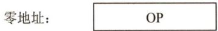
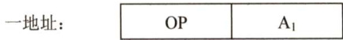
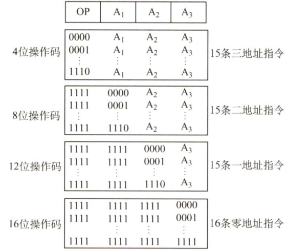
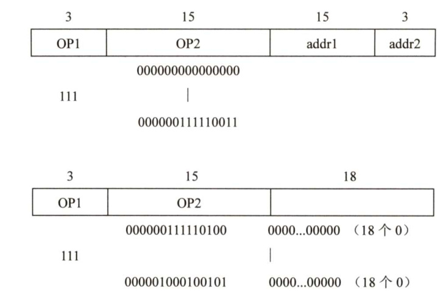

#### 4.1 指令格式  

指令（机器指令）是指示计算机执行某种操作的命令。一台计算机的所有指令的集合构成该机的指令系统，也称指令集。指令系统是计算机的主要属性，位于硬件和软件的交界面上。  

#### 4.1.1 指令的基本格式  

一条指令就是机器语言的一个语句，它是一组有意义的二进制代码。一条指令通常包括操作码字段和地址码字段两部分：  

<html><body><table><tr><td>操作码字段</td><td>地址码字段</td></tr></table></body></html>  

其中，操作码指出指令中该指令应该执行什么性质的操作以及具有何种功能。操作码是识别指令、了解指令功能及区分操作数地址内容的组成和使用方法等的关键信息。例如，指出是算术加运算还是算术减运算，是程序转移还是返回操作。  

地址码给出被操作的信息（指令或数据）的地址，包括参加运算的一个或多个操作数所在的地址、运算结果的保存地址、程序的转移地址、被调用的子程序的入口地址等。  

指令的长度是指一条指令中所包含的二进制代码的位数。指令字长取决于操作码的长度、操作数地址码的长度和操作数地址的个数。指令长度与机器字长没有固定的关系，它可以等于机器字长，也可以大于或小于机器字长。通常，把指令长度等于机器字长的指令称为单字长指令，指令长度等于半个机器字长的指令称为半字长指令，指令长度等于两个机器字长的指令称为双字长指令。  

在一个指令系统中，若所有指令的长度都是相等的，则称为定长指令字结构。定字长指令的执行速度快，控制简单。若各种指令的长度随指令功能而异，则称为变长指令字结构。然而，因为主存一般是按字节编址的，所以指令字长多为字节的整数倍。  

根据指令中操作数地址码的数目的不同，可将指令分成以下几种格式。  

#### 1．零地址指令  

  

只给出操作码OP，没有显式地址。这种指令有两种可能：  

1）不需要操作数的指令，如空操作指令、停机指令、关中断指令等。2）零地址的运算类指令仅用在堆栈计算机中。通常参与运算的两个操作数隐含地从栈顶和次栈顶弹出，送到运算器进行运算，运算结果再隐含地压入堆栈。  

#### 2.一地址指令  

  

这种指令也有两种常见的形态，要根据操作码的含义确定究竟是哪一种。  

1）只有目的操作数的单操作数指令，按 $\mathbf{A}_{1}$ 地址读取操作数，进行OP操作后，结果存回原地址。指令含义： $\mathrm{OP}(\mathrm{A}_{1}){\rightarrow}\mathrm{A}_{1}$ 如操作码含义是加1、减1、求反、求补等。  
2）隐含约定目的地址的双操作数指令，按指令地址 $\mathbf{A}_{1}$ 可读取源操作数，指令可隐含约定另一个操作数由ACC（累加器）提供，运算结果也将存放在ACC中。指令含义： $(\mathrm{ACC})\mathrm{OP}(\mathrm{A}_{1}){\to}\mathrm{ACC}$ 若指令字长为32位，操作码占8位，1个地址码字段占24位，则指令操作数的直接寻址范围为 $2^{24}=16\mathrm{M}$ 。  

#### 3.二地址指令  

<html><body><table><tr><td>地址：</td><td>OP</td><td>A</td><td>A2</td></tr></table></body></html>  

指令含义： $(\mathbf{A}_{1})\mathbf{OP}(\mathbf{A}_{2}){\rightarrow}\mathbf{A}_{1}$  

对于常用的算术和逻辑运算指令，往往要求使用两个操作数，需分别给出目的操作数和源操作数的地址，其中目的操作数地址还用于保存本次的运算结果。  

若指令字长为32位，操作码占8位，两个地址码字段各占12位，则指令操作数的直接寻址范围为 $2^{12}=4\mathsf{K}$ 。  

#### 4.三地址指令  

指令含义： $(\mathbf{A}_{1})\mathbf{OP}(\mathbf{A}_{2}){\rightarrow}\mathbf{A}_{3}$  

若指令字长为32位，操作码占8位，3个地址码字段各占8位，则指令操作数的直接寻址范围为 $2^{8}=256$ 。若地址字段均为主存地址，则完成一条三地址需要4次访问存储器（取指令1次，取两个操作数2次，存放结果1次)。  

#### 5．四地址指令  

四地址：  

<html><body><table><tr><td>OP</td><td>A</td><td>A2</td><td>A (结果）</td><td>A4(下址）</td></tr></table></body></html>  

指令含义： $(\mathbf{A}_{1})\mathbf{OP}(\mathbf{A}_{2}){\rightarrow}\mathbf{A}_{3}$ ， ${\bf A}_{4}=$ 下一条将要执行指令的地址。  

若指令字长为32位，操作码占8位，4个地址码字段各占6位，则指令操作数的直接寻址范围为 $2^{6}=64$ 。  

#### 4.1.2 定长操作码指令格式  

操作码的位数随地址数的减少而增加  

<html><body><table><tr><td>三地址：</td><td>OP</td><td>A</td><td>A</td><td>A(结果）</td></tr></table></body></html>  

定长操作码指令在指令字的最高位部分分配固定的若干位（定长）表示操作码。一般 $n$ 位操作码字段的指令系统最大能够表示 $2^{n}$ 条指令。定长操作码对于简化计算机硬件设计，提高指令译码和识别速度很有利。当计算机字长为32位或更长时，这是常规用法。  

#### 4.1.3 扩展操作码指令格式  

为了在指令字长有限的前提下仍保持比较丰富的指令种类，可采取可变长度操作码，即全部指令的操作码字段的位数不固定，且分散地放在指令字的不同位置上。显然，这将增加指令译码和分析的难度，使控制器的设计复杂化。  

最常见的变长操作码方法是扩展操作码，它使操作码的长度随地址码的减少而增加，不同地址数的指令可具有不同长度的操作码，从而在满足需要的前提下，有效地缩短指令字长。图4.1所示即为一种扩展操作码的安排方式。  

  
图4.1扩展操作码技术  

在图4.1中，指令字长为16位，其中4位为基本操作码字段OP，另有3个4位长的地址字段 $\mathbf{A}_{1}$ 、 $\mathbf{A}_{2}$ 和 $\mathbf{A}_{3}$ 。4位基本操作码若全部用于三地址指令，则有16条。图4.1中所示的三地址指令为15条，1111留作扩展操作码之用；二地址指令为15条，1111111留作扩展操作码之用；一地址指令为15条，111111111111留作扩展操作码之用；零地址指令为16条。  

除这种安排外，还有其他多种扩展方法，如形成15条三地址指令、12条二地址指令、63条一地址指令和16条零地址指令，共106条指令，请读者自行分析。  

在设计扩展操作码指令格式时，必须注意以下两点：  

1）不允许短码是长码的前缀，即短操作码不能与长操作码的前面部分的代码相同。  

2）各指令的操作码一定不能重复。  

通常情况下，对使用频率较高的指令分配较短的操作码，对使用频率较低的指令分配较长的操作码，从而尽可能减少指令译码和分析的时间。  

#### 4.1.4 指令的操作类型  

设计指令系统时必须考虑应提供哪些操作类型，指令操作类型按功能可分为以下几种。  

#### 1．数据传送  

传送指令通常有寄存器之间的传送（MOV）、从内存单元读取数据到CPU寄存器（LOAD）、从CPU寄存器写数据到内存单元（STORE）等。  

#### 2.算术和逻辑运算  

这类指令主要有加（ADD）、减（SUB）、比较（CMP）、乘（MUL）、除（DIV）、加1（INC)、减1（DEC）、与（AND）、或（OR）、取反（NOT）、异或（XOR）等。  

#### 3．移位操作  

移位指令主要有算法移位、逻辑移位、循环移位等。  

#### 4.转移操作  

转移指令主要有无条件转移（JMP）、条件转移（BRANCH）、调用（CALL）、返回（RET）、陷阱（TRAP）等。无条件转移指令在任何情况下都执行转移操作，而条件转移指令仅在特定条件满足时才执行转移操作，转移条件一般是某个标志位的值，或几个标志位的组合。  

调用指令和转移指令的区别：执行调用指令时必须保存下一条指令的地址（返回地址)，当子程序执行结束时，根据返回地址返回到主程序继续执行；而转移指令则不返回执行。  

#### 5.输入输出操作  

这类指令用于完成CPU与外部设备交换数据或传送控制命令及状态信息。  

#### 4.1.5 本节习题精选  

#### 一、单项选择题  

01.以下有关指令系统的说法中，错误的是（）。  

A.指令系统是一台机器硬件能执行的指令全体B.任何程序运行前都要先转换为机器语言程序C．指令系统是计算机软/硬件的界面D.指令系统和机器语言是无关的  

02.在CPU执行指令的过程中，指令的地址由（）给出。  

A.程序计数器（PC） B.指令的地址码字段C.操作系统 D．程序员  

03.运算型指令的寻址与转移型指令的寻址的不同点在于（）。  

A．前者取操作数，后者决定程序转移地址B．后者取操作数，前者决定程序转移地址C．前者是短指令，后者是长指令D．前者是长指令，后者是短指令  

04.程序控制类指令的功能是（）。  

A.进行算术运算和逻辑运算  
B.进行主存与CPU之间的数据传送  
C．进行CPU和I/O设备之间的数据传送  
D.改变程序执行的顺序  

05．下列指令中不属于程序控制指令的是（）。  

A．无条件转移指令 B．条件转移指令C．中断隐指令 D．循环指令  

06.下列指令中应用程序不准使用的指令是（）。  

A．循环指令 B.转换指令 C．特权指令 D.条件转移指令  

07．堆栈计算机中，有些堆栈零地址的运算类指令在指令格式中不给出操作数的地址，参加的两个操作数来自（）。  

A．累加器和寄存器 B.累加器和暂存器C.堆栈的栈顶和次栈顶单元 D.堆栈的栈顶单元和暂存器  

08.以下叙述错误的是（）。  

A.为了便于取指，指令的长度通常为存储字长的整数倍B．单地址指令是固定长度的指令  
C．单字长指令可加快取指令的速度  
D．单地址指令可能有一个操作数，也可能有两个操作数  

09．能够完成两个数的算术运算的单地址指令，地址码指明一个操作数，另一个操作数来自（）方式。  

A．立即寻址 B．隐含寻址 C．间接寻址 D．基址寻址  

10.设机器字长为32位，一个容量为16MB的存储器，CPU按半字寻址，其寻址单元数是(）。  

A. $2^{24}$ B.223 C. $2^{22}$ D. $2^{21}$  

1.某指令系统有200条指令，对操作码采用固定长度二进制编码，最少需要用（）位  

A.4 B.8 C.16 D.32  

12．在指令格式中，采用扩展操作码设计方案的目的是（）。  

A.减少指令字长度  
B．增加指令字长度  
C．保持指令字长度不变而增加指令的数量  
D.保持指令字长度不变而增加寻址空间  

13．一个计算机系统采用32位单字长指令，地址码为12位，若定义了250条二地址指令，则还可以有（）条单地址指令。  

A.4K B. 8K C. 16K D.24K  

14.【2017统考真题】某计算机按字节编址，指令字长固定且只有两种指令格式，其中三地址指令29条、二地址指令107条，每个地址字段为6位，则指令字长至少应该是（）。  

A.24位 B.26位 C.28位 D.32位  

#### 二、综合应用题  

01．一个处理器中共有32个寄存器，使用16位立即数，其指令系统结构中共有142条指令。在某个给定的程序中， $20\%$ 的指令带有一个输入寄存器和一个输出寄存器； $30\%$ 的指令带有两个输入寄存器和一个输出寄存器； $25\%$ 的指令带有一个输入寄存器、一个输出寄存器、一个立即数寄存器；其余 $25\%$ 的指令带有一个立即数输入寄存器和一个输出寄存器。  

1）对于以上4种指令类型中的任意一种指令类型来说，共需要多少位？假定指令系统结构要求所有指令长度必须是8的整数倍。  
2）与使用定长指令集编码相比，当采用变长指令集编码时，该程序能够少占用多少存储器空间？  

02．假设指令字长为16位，操作数的地址码为6位，指令有零地址、一地址、二地址3种格式。  

1）设操作码固定，若零地址指令有 $M$ 种，一地址指令有 $N$ 种，则二地址指令最多有几种？  
2）采用扩展操作码技术，二地址指令最多有几种？  
3）采用扩展操作码技术，若二地址指令有 $P$ 条，零地址指令有 $\varrho$ 条，则一地址指令最多有几种？  

03.在一个36位长的指令系统中，设计一个扩展操作码，使之能表示下列指令：  

1）7条具有两个15位地址和一个3位地址的指令。  
2）500条具有一个15位地址和一个3位地址的指令。  
3）50条无地址指令。  

04.某模型机共有64种操作码，位数固定，且具有以下特点：  

1）采用一地址或二地址格式。  
2）有寄存器寻址、直接寻址和相对寻址（位移量为 $^{-128\sim+127}$ ）3种寻址方式。  
3）有16个通用寄存器，算术运算和逻辑运算的操作数均在寄存器中，结果也在寄存器中。  
4）取数/存数指令在通用寄存器和存储器之间传送数据。  
5）存储器容量为1MB，按字节编址。  
要求设计算术逻辑指令、取数/存数指令和相对转移指令的格式，并简述理由。  

#### 4.1.6 答案与解析  

#### 一、单项选择题  

01.D指令系统是计算机硬件的语言系统，这显然和机器语言有关。  

02.APC存放当前欲执行指令的地址，而指令的地址码字段则保存操作数地址。  

03.A运算型指令寻址的是操作数，而转移型指令寻址的是下次欲执行的指令的地址。  

04.D程序控制类指令用于改变程序执行的顺序，并使程序具有测试、分析、判断和循环执行的能力。  

05.C  

程序控制类指令主要包括无条件转移、有条件转移、子程序调用和返回指令、循环指令等。中断隐指令是由硬件实现的，并不是指令系统中存在的指令，更不可能属于程序控制类指令。  

06.C  

特权指令是指仅用于操作系统或其他系统软件的指令。为确保系统与数据安全起见，这类指令不提供给用户使用。  

#### 07.C  

零地址的运算类指令又称堆栈运算指令，参与的两个操作数来自栈顶和次栈顶单元。  

注意：堆栈指令的访存次数，取决于采用的是软堆栈还是硬堆栈。若是软堆栈（堆栈区由内存实现），则对于双目运算需要访问4次内存：取指、取源数1、取源数2、存结果。若是硬堆栈（堆栈区由寄存器实现)，则只需在取指令时访问一次内存。  

#### 08.B  

指令的地址个数与指令的长度是否固定没有必然联系，即使是单地址指令也可能由于单地址的寻址方式不同而导致指令长度不同。  

#### 09.B  

单地址指令中只有一个地址码，在完成两个操作数的算术运算时，一个操作数由地址码指出，另一个操作数通常存放在累加寄存器（ACC）中，属于隐含寻址。  

#### 10.B  

$16\mathrm{M}=2^{24}$ ，由于字长为32位，现在按半字（16位）寻址，相当于有8M（ $(=2^{23}$ ）个存储单元，每个存储单元中存放16位。  

#### 11.B  

因 $128=2^{7}<200<2^{8}=256$ ，因此采用定长操作码时，至少需要8位。  

12.C扩展操作码并未改变指令的长度，而是使操作码长度随地址码的减少而增加。  

13.D  

地址码为12位，二地址指令的操作码长度为 $32-12-12=8$ 位，已定义了250条二地址指令， $2^{8}-250=6$ ，即可以设计出单地址指令 $6{\times}2^{12}=24\mathrm{K}$ 条。  

14.A  

三地址指令有29条，所以其操作码至少为5位。以5位进行计算，它剩余 $32-29=3$ 种操作码给二地址。而二地址另外多了6位给操作码，因此其数量最大达 $3\times64=192$ 。所以指令字长最少为23位，因为计算机按字节编址，需要是8的倍数，所以指令字长至少应该是24位，选A。  

#### 二、综合应用题  

01.【解答】  

1）由于有142条指令，因此至少需要8位才能确定各条指令的操作码（ $2^{8}=256$ 。由于该处理器有32个寄存器，也就是说要用5位对寄存器ID编码，而每个立即数需要16位。因此有：$20\%$ 的一个输入寄存器和一个输出寄存器指令需要 $8+5+5=18$ 位，长度对齐到8的倍数，便是24位。$30\%$ 的两个输入寄存器和一个输出寄存器指令需要 $8+5+5+5=23$ 位，对齐到24位。$25\%$ 的一个输入寄存器、一个输出寄存器、一个立即数寄存器指令需要 $8+5+5+16=$ 34位，对齐到40位。$25\%$ 的一个立即数输入寄存器和一个输出寄存器指令需要 $8+16+5=29$ 位，对齐到32位。  

2）由于变长指令最长的长度为40位，所以定长指令编码每条指令的长度均为40位。而采用变长编码，将各个指令长度和其概率相乘，得出平均长度为30位。所以该程序中，变长编码能比定长编码少占用 $25\%$ 的存储空间。  

02.【解答】  

1）根据操作数地址码为6位，得到二地址指令中操作码的位数为 $16-6-6=4$ ，这4位操作码可有16种操作。由于操作码固定，因此除了零地址指令有 $M$ 种，一地址指令有 $N$ 种，剩下的二地址指令最多有 $16-M-N$ 种。  
2）采用扩展操作码技术，操作码位数可随地址数的减少而增加。对于二地址指令，指令字长16 位，减去两个地址码共12位，剩下4 位操作码，共16 种编码，去掉一种编码（如1111）用于一地址指令扩展，二地址指令最多可有15种操作。  
3）采用扩展操作码技术，操作码位数可变，二地址、一地址和零地址的操作码长度分别为  
4 位、10位和16位。这样，二地址指令操作码每减少一个，就可以多构成 $2^{6}$ 条一地址指令操作码；一地址指令操作码每减少一个，就可以多构成 $2^{6}$ 条零地址指令操作码。设一地址指令有 $R$ 条，则一地址指令最多有 $(2^{4}-P){\times}2^{6}$ 条，零地址指令最多有 $[(2^{4}-P){\times}2^{6}-$ $R]\times2^{6}$ 条。根据题中给出零地址指令为 $\varrho$ 条，即 $Q=[(2^{4}-P){\times}2^{6}-R]{\times}2^{6}$ ，得 $R=(2^{4}-P){\times}2^{6}-$ $\left\lceil Q\times2^{-6}\right\rceil$ 。  

03.【解答】  

1)  

<html><body><table><tr><td>3</td><td>15</td><td>15</td><td>3</td></tr><tr><td>OP</td><td>addr1</td><td>addr2</td><td>addr3</td></tr><tr><td>000</td><td></td></tr><tr><td></td><td></td></tr><tr><td></td><td></td></tr><tr><td>一 110</td><td></td></tr></table></body></html>  

2)  

3)  

  

04.【解答】  

1）算术逻辑指令格式为“寄存器-寄存器”型，取单字长为16位，格式如下：  

<html><body><table><tr><td>6</td><td>2</td><td>4</td><td>4</td></tr><tr><td>OP</td><td>M</td><td>Ri</td><td>R</td></tr></table></body></html>  

其中，OP 为操作码，6位，可实现64 种操作；M为寻址特征，2位，可反映寄存器寻址、直接寻址、相对寻址； $\mathrm{{R}}_{i}$ 和 ${\bf R}_{j}$ 各取4位，指出源操作数和目的操作数的寄存器编号。  

2）取数/存数指令格式为“寄存器-存储器”型，取双字长为32位，格式如下：  

<html><body><table><tr><td>6</td><td>2</td><td>4</td><td>4</td></tr><tr><td>OP</td><td>M</td><td>Ri</td><td>A</td></tr><tr><td colspan="4">A2</td></tr></table></body></html>  

其中，OP为操作码，6位不变；M为寻址特征，2位不变； $\mathbf{R}_{i}$ 为4位，为源操作数地址（存数指令）或目的操作数地址（取数指令)； $\mathbf{A}_{1}$ 和 $\mathbf{A}_{2}$ 共20位，为存储器地址，可直接访问按字节编址的1MB存储器。  

3）相对转移指令为一地址格式，取单字长为16位，格式如下：  

<html><body><table><tr><td>6</td><td>2</td><td>8</td></tr><tr><td>OP</td><td>M</td><td>A</td></tr></table></body></html>  

其中，OP为操作码，6位不变；M为寻址特征，2位不变；A为位移量，8位，采用补码表示，对应偏移量为 $-128\sim+127$ 。