#### 4.2 指令的寻址方式  

寻址方式是指寻找指令或操作数有效地址的方式，即确定本条指令的数据地址及下一条待执行指令的地址的方法。寻址方式分为指令寻址和数据寻址两大类。  

指令中的地址码字段并不代表操作数的真实地址，这种地址称为形式地址（A)。形式地址  

结合寻址方式，可以计算出操作数在存储器中的真实地址，这种地址称为有效地址（EA)。  

注意，(A)表示地址为A 的数值，A既可以是寄存器编号，也可以是内存地址。对应的(A)就是寄存器中的数值，或相应内存单元的数值。例如，EA $\c=$ (A)意思是有效地址是地址A中的数值。  

#### 4.2.1 指令寻址和数据寻址  

寻址方式分为指令寻址和数据寻址两大类。寻找下一条将要执行的指令地址称为指令寻址；寻找本条指令的数据地址称为数据寻址。  

#### 1．指令寻址  

指令寻址方式有两种：一种是顺序寻址方式，另一种是跳跃寻址方式。  

（1）顺序寻址  

通过程序计数器PC加1（1个指令字长)，自动形成下一条指令的地址。  

（2）跳跃寻址  

通过转移类指令实现。所谓跳跃，是指下条指令的地址不由程序计数器PC 自动给出，而由本条指令给出下条指令地址的计算方式。而是否跳跃可能受到状态寄存器和操作数的控制，跳跃的地址分为绝对地址（由标记符直接得到）和相对地址（相对于当前指令地址的偏移量)，跳跃的结果是当前指令修改PC值，所以下一条指令仍然通过PC给出。  

#### 2．数据寻址  

数据寻址是指如何在指令中表示一个操作数的地址，如何用这种表示得到操作数或怎样计算出操作数的地址。  

数据寻址的方式较多，为区别各种方式，通常在指令字中设一个字段，用来指明属于哪种寻址方式，由此可得指令的格式如下所示：  

<html><body><table><tr><td>操作码</td><td>寻址特征</td><td>形式地址A</td></tr></table></body></html>  

#### 4.2.2 常见的数据寻址方式  

#### 1．隐含寻址  

这种类型的指令不明显地给出操作数的地址，而在指令中隐含操作数的地址。例如，单地址的指令格式就不明显地在地址字段中指出第二操作数的地址，而规定累加器（ACC）作为第二操作数地址，指令格式明显指出的仅是第一操作数的地址。因此，累加器（ACC）对单地址指令格式来说是隐含寻址，如图4.2所示。  

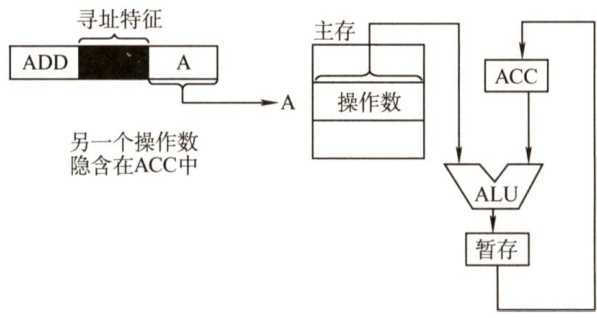  
图4.2隐含寻址  

隐含寻址的优点是有利于缩短指令字长；缺点是需增加存储操作数或隐含地址的硬件。  

#### 2.立即（数）寻址  

这种类型的指令的地址字段指出的不是操作数的地址，而是操作数本身，又称立即数，采用补码表示。图4.3所示为立即寻址示意图，图中#表示立即寻址特征，A就是操作数。  

立即寻址的优点是指令在执行阶段不访问主存，指令执行时间最短；缺点是A的位数限制了立即数的范围。  

#### 3.直接寻址  

指令字中的形式地址A是操作数的真实地址EA，即 $\mathrm{EA}=\mathrm{A}$ ，如图4.4所示。  

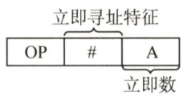  
图4.3立即寻址  

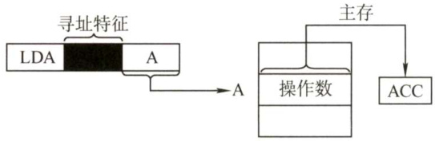  
图4.4直接寻址  

直接寻址的优点是简单，指令在执行阶段仅访问一次主存，不需要专门计算操作数的地址；缺点是A的位数决定了该指令操作数的寻址范围，操作数的地址不易修改。  

#### 4.间接寻址  

间接寻址是相对于直接寻址而言的，指令的地址字段给出的形式地址不是操作数的真正地址，而是操作数有效地址所在的存储单元的地址，也就是操作数地址的地址，即 $\mathrm{EA}=(\mathrm{A})$ ，如图4.5所示。间接寻址可以是一次间接寻址，还可以是多次间接寻址。  

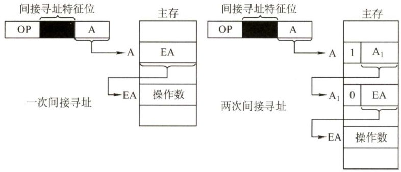  
图4.5间接寻址  

在图4.5中，主存字第一位为1时，表示取出的仍不是操作数的地址，即多次间址；主存字第一位为0时，表示取得的是操作数的地址。  

间接寻址的优点是可扩大寻址范围（有效地址EA的位数大于形式地址A 的位数)，便于编制程序（用间接寻址可方便地完成子程序返回)；缺点是指令在执行阶段要多次访存（一次间接寻址需两次访存，多次间接寻址需根据存储字的最高位确定访存次数)。由于访问速度过慢，这种寻址方式并不常用。一般问到扩大寻址范围时，通常指的是寄存器间接寻址。  

#### 5.寄存器寻址  

寄存器寻址是指在指令字中直接给出操作数所在的寄存器编号，即 $\mathrm{EA}=\mathrm{R}_{i}$ ，其操作数在由$\mathrm{\bfR}_{i}$ 所指的寄存器内，如图4.6所示。  

寄存器寻址的优点是指令在执行阶段不访问主存，只访问寄存器，因寄存器数量较少，对应地址码长度较小，使得指令字短且因不用访存，所以执行速度快，支持向量/矩阵运算；缺点  

是寄存器价格昂贵，计算机中的寄存器个数有限。  

#### 6.寄存器间接寻址  

寄存器间接寻址是指在寄存器 $\mathbf{R}_{i}$ 中给出的不是一个操作数，而是操作数所在主存单元的地址，即 $\mathrm{EA}=(\mathbf{R}_{i})$ ，如图4.7所示。  

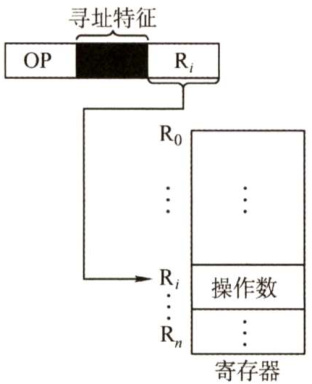  
图4.6寄存器寻址  

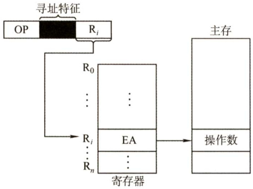  
图4.7寄存器间接寻址  

寄存器间接寻址的特点是，与一般间接寻址相比速度更快，但指令的执行阶段需要访问主存（因为操作数在主存中）。  

#### 7．相对寻址  

相对寻址是把PC的内容加上指令格式中的形式地址A而形成操作数的有效地址，即 $\mathrm{EA}=$ $(\mathrm{PC})+\mathbf{A}$ ，其中A是相对于当前指令地址的位移量，可正可负，补码表示，如图4.8所示。  

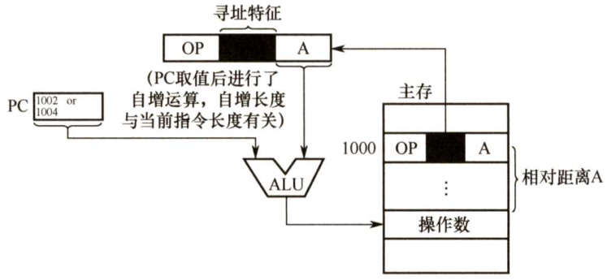  
图4.8相对寻址  

在图4.8中，A的位数决定操作数的寻址范围。  

相对寻址的优点是操作数的地址不是固定的，它随PC 值的变化而变化，且与指令地址之间总是相差一个固定值，因此便于程序浮动。相对寻址广泛应用于转移指令。  

注意，对于转移指令JMPA，当CPU从存储器中取出一字节时，会自动执行(PC) $^+1\rightarrow$ PC。若转移指令的地址为X，且占2B，在取出该指令后，PC的值会增2，即 $(\mathrm{PC})=\mathbf{X}+\mathbf{\alpha}2$ ，这样在执行完该指令后，会自动跳转到 $\mathbf{X}+2+\mathbf{A}$ 的地址继续执行。  

#### 8．基址寻址  

基址寻址是指将CPU中基址寄存器（BR）的内容加上指令格式中的形式地址A而形成操作数的有效地址，即 $\mathbf{\mathrm{EA}}=(\mathbf{\mathrm{BR}})+\mathbf{A}$ 。其中基址寄存器既可采用专用寄存器，又可采用通用寄存器，如图4.9所示。  

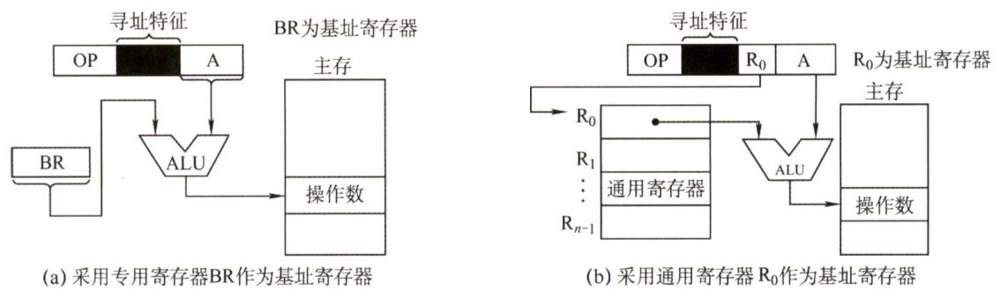  
图4.9 基址寻址  

基址寄存器是面向操作系统的，其内容由操作系统或管理程序确定，主要用于解决程序逻辑空间与存储器物理空间的无关性。在程序执行过程中，基址寄存器的内容不变（作为基地址)，形式地址可变（作为偏移量)。采用通用寄存器作为基址寄存器时，可由用户决定哪个寄存器作为基址寄存器，但其内容仍由操作系统确定。  

基址寻址的优点是可扩大寻址范围（基址寄存器的位数大于形式地址A的位数)；用户不必考虑自己的程序存于主存的哪个空间区域，因此有利于多道程序设计，并可用于编制浮动程序，但偏移量（形式地址A）的位数较短。  

#### 9.变址寻址  

变址寻址是指有效地址 EA 等于指令字中的形式地址 A 与变址寄存器IX 的内容之和，即$\mathrm{EA}=\left(\mathrm{IX}\right)+\mathbf{A}$ ，其中IX为变址寄存器（专用)，也可用通用寄存器作为变址寄存器。图4.10所示为采用专用寄存器IX的变址寻址示意图。  

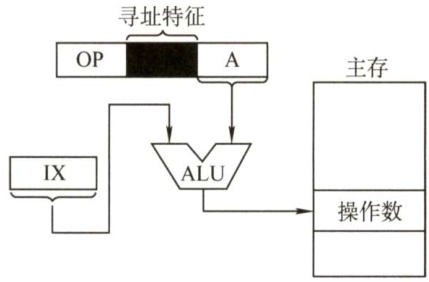  
图4.10 变址寻址  

变址寄存器是面向用户的，在程序执行过程中，变址寄存器的内容可由用户改变（作为偏移量)，形式地址A不变（作为基地址)。  

变址寻址的优点是可扩大寻址范围（变址寄存器的位数大于形式地址A的位数)；在数组处理过程中，可设定A为数组的首地址，不断改变变址寄存器IX的内容，便可很容易形成数组中任一数据的地址，特别适合编制循环程序。偏移量（变址寄存器IX）的位数足以表示整个存储空间。  

显然，变址寻址与基址寻址的有效地址形成过程极为相似。但从本质上讲，两者有较大区别。基址寻址面向系统，主要用于为多道程序或数据分配存储空间，因此基址寄存器的内容通常由操作系统或管理程序确定，在程序的执行过程中其值不可变，而指令字中的A是可变的；变址寻址立足于用户，主要用于处理数组问题，在变址寻址中，变址寄存器的内容由用户设定，在程序执行过程中其值可变，而指令字中的A是不可变的。  

#### 10．堆栈寻址  

堆栈是存储器（或专用寄存器组）中一块特定的、按后进先出（LIFO）原则管理的存储区，该存储区中读/写单元的地址是用一个特定的寄存器给出的，该寄存器称为堆栈指针（SP)。堆栈可分为硬堆栈与软堆栈两种。  

寄存器堆栈又称硬堆栈。寄存器堆栈的成本较高，不适合做大容量的堆栈；而从主存中划出一段区域来做堆栈是最合算且最常用的方法，这种堆栈称为软堆栈。  

在采用堆栈结构的计算机系统中，大部分指令表面上都表现为无操作数指令的形式，因为  

操作数地址都隐含使用了SP。通常情况下，在读/写堆栈中的一个单元的前后都伴有自动完成对SP内容的增量或减量操作。  

下面简单总结寻址方式、有效地址及访存次数（不含取本条指令的访存)，见表4.1。  

表4.1寻址方式、有效地址及访存次数  

<html><body><table><tr><td>寻址方式</td><td>有效地址</td><td>访存次数</td></tr><tr><td>隐含寻址</td><td>程序指定</td><td>0</td></tr><tr><td>立即寻址</td><td>A即是操作数</td><td>0</td></tr><tr><td>直接寻址</td><td>EA=A</td><td>1</td></tr><tr><td>一次间接寻址</td><td>EA=(A)</td><td>2</td></tr><tr><td>寄存器寻址</td><td>EA=R</td><td>0</td></tr><tr><td>寄存器间接一次寻址</td><td>EA=(R)</td><td>1</td></tr><tr><td>相对寻址</td><td>EA=(PC)+A</td><td>1</td></tr><tr><td>基址寻址</td><td>EA=(BR)+A</td><td>1</td></tr><tr><td>变址寻址</td><td>EA=(IX)+A</td><td>1</td></tr></table></body></html>  

#### 4.2.3 本节习题精选  

#### 一、单项选择题  

01.指令系统中采用不同寻址方式的目的是（）。  

A.提供扩展操作码的可能并降低指令译码难度  
B．可缩短指令字长，扩大寻址空间，提高编程的灵活性  
C．实现程序控制  
D．三者都正确  

02．直接寻址的无条件转移指令的功能是将指令中的地址码送入（）。  

A．程序计数器（PC） B.累加器（ACC）C.指令寄存器（IR） D.地址寄存器（MAR）  

03．为了缩短指令中某个地址段的位数，有效的方法是采取（）。  

A．立即寻址 B．变址寻址 C．基址寻址 D．寄存器寻  

04.简化地址结构的基本方法是尽量采用（）。  

A．寄存器寻址 B．隐地址 C．直接寻址 D．间接寻址  

5.在指令寻址的各种方式中，获取操作数最快的方式是（）。  

A．直接寻址 B．立即寻址 C．寄存器寻址 D．间接寻址  

16．假定指令中地址码所给出的是操作数的有效地址，则该指令采用（）。  

A．直接寻址 B．立即寻址 C．寄存器寻址 D.间接寻址  

07．设指令中的地址码为A，变址寄存器为X，程序计数器为PC，则变址间址寻址方式的操作数的有效地址EA是（）。  

A. $((\mathrm{PC})+\mathbf{A})$ B. $((\mathbf{X})+\mathbf{A})$ C. (X)+(A) D. $(\mathrm{X})+\mathbf{A}$  

08.（）便于处理数组问题。  

A．间接寻址 B．变址寻址 C．相对寻址 D．基址寻址  

09．堆栈寻址方式中，设A为累加器，SP为堆栈指示器， $\mathbf{M}_{\mathrm{sp}}$ 为 SP指示的栈顶单元。若进栈操作的动作是 $(\mathrm{A}){\rightarrow}\mathrm{M}_{\mathrm{sp}},$ (SP)- $\cdot1\mathrm{\rightarrow}\mathrm{SP}$ ，则出栈操作的动作应为（）。  

A. $(\mathrm{M}_{\mathrm{sp}})\ {\rightarrow}\mathrm{A},(\mathrm{SP})+1{\rightarrow}\mathrm{SP}$ B. $(\mathrm{SP})+1\mathrm{\rightarrowSP}$ $(\mathrm{M}_{\mathrm{SP}})\ \to\mathrm{A}$  

C. (SP)- $\cdot1{\rightarrow}\mathrm{SP}$ 。 $(\mathbf{M}_{\mathrm{SP}})\ \to\mathbf{A}$ D. $(\mathrm{M}_{\mathrm{SP}}){\rightarrow}\mathrm{A}$ ,(SP)- $\cdot1\mathrm{\rightarrow}\mathrm{SP}$  

10．相对寻址方式中，指令所提供的相对地址实质上是一种（）。  

A.立即数  
B．内存地址  
C．以本条指令在内存中首地址为基准位置的偏移量D.以下条指令在内存中首地址为基准位置的偏移量  

11.在多道程序设计中，最重要的寻址方式是（）。  

A．相对寻址 B.间接寻址 C．立即寻址 D.按内容寻址.指令寻址方式有顺序和跳跃两种，采用跳跃寻址方式可以实现（）。  

A．程序浮动 B.程序的无条件浮动和条件浮动C.程序的无条件转移和条件转移 D．程序的调用  

13．某机器指令字长为16位，主存按字节编址，取指令时，每取一字节，PC 自动加1。当前指令地址为 $2000\mathrm{H}$ ，指令内容为相对寻址的无条件转移指令，指令中的形式地址为$40\mathrm{H}$ 。则取指令后及指令执行后PC的内容为（）。  

A.2000H，2042H B.2002H，2040HC.2002H，2042H D. 2000H，2040H  

14.对按字寻址的机器，程序计数器和指令寄存器的位数各取决于（）。  

A．机器字长，存储器的字数 B．存储器的字数，指令字长C．指令字长，机器字长 D．地址总线宽度，存储器的字数  

15.假设寄存器R中的数值为200，主存地址为200和300的地址单元中存放的内容分别是300和400，则（）方式下访问到的操作数为200。  

A．直接寻址200 B．寄存器间接寻址（R） C.存储器间接寻址（200） D．寄存器寻址R  

16．假设某条指令的第一个操作数采用寄存器间接寻址方式，指令中给出的寄存器编号为8，8号寄存器的内容为 $1200\mathrm{H}$ ，地址为1200H的单元中的内容为12FCH，地址为12FCH的单元中的内容为38D8H，而地址为38D8H的单元中的内容为88F9H，则该操作数的有效地址为（）。  

A.1200H B.12FCH C. 38D8H D. 88F9H  

17．设相对寻址的转移指令占3B，第一字节为操作码，第二、三字节为相对位移量（补码表示），而且数据在存储器中采用以低字节为字地址的存放方式。每当CPU从存储器取出一字节时，即自动完成 $(\mathrm{PC})+1{\rightarrow}\mathrm{PC}$ 。若PC的当前值为240（十进制），要求转移到 290（十进制），则转移指令的第二、三字节的机器代码是（）；若PC的当前值为240（十进制），要求转移到200（十进制），则转移指令的第二、三字节的机器代码是()。  

A.2FH、FFH B.D5H、00H C.D5H、FFH D.2FH、00H  

18．关于指令的功能及分类，下列叙述中正确的是（）。  

A．算术与逻辑运算指令，通常完成算术运算或逻辑运算，都需要两个数据B．移位操作指令，通常用于把指定的两个操作数左移或右移一位C．转移指令、子程序调用与返回指令，用于解决数据调用次序的需求D.特权指令，通常仅用于实现系统软件，这类指令一般不提供给用户  

19.【2009统考真题】某机器字长为16位，主存按字节编址，转移指令采用相对寻址，由  

2字节组成，第一字节为操作码字段，第二字节为相对位移量字段。假定取指令时，每取一字节PC 自动加1。若某转移指令所在主存地址为 $2000\mathrm{H}$ ，相对位移量字段的内容为06H，则该转移指令成功转移后的目标地址是（）。  

A.2006H B.2007H C. 2008H D.2009H  

20.【2011统考真题】偏移寻址通过将某个寄存器的内容与一个形式地址相加来生成有效地址。下列寻址方式中，不属于偏移寻址方式的是（）。  

A．间接寻址 B．基址寻址 C．相对寻址 D.变址寻址  

21.【2011统考真题】某机器有一个标志寄存器，其中有进位/借位标志CF、零标志ZF、符号标志SF和溢出标志OF，条件转移指令bgt（无符号整数比较大于时转移）的转移条件是（）。  

$$
\begin{array}{r}{\mathrm{CF+OF=1}\qquad\mathrm{B.}\quad\overline{{\mathrm{SF}}}+\mathrm{ZF=1}\qquad\mathrm{C.}\quad\overline{{\mathrm{CF}+\mathrm{ZF}}}=1\qquad\mathrm{D.}\quad\overline{{\mathrm{CF}+\mathrm{SF}}}=1}\end{array}
$$  

22.【2013统考真题】假设变址寄存器R的内容为 $1000\mathrm{H}$ ，指令中的形式地址为 $2000\mathrm{H}$ 地址 $1000\mathrm{H}$ 中的内容为 $2000\mathrm{H}$ ，地址 $2000\mathrm{H}$ 中的内容为 $3000\mathrm{H}$ ，地址 $3000\mathrm{H}$ 中的内容为 $4000\mathrm{H}$ ，则变址寻址方式下访问到的操作数是（）。  

A.1000H B.2000H C. 3000H D. 4000H  

23.【2014统考真题】某计算机有16个通用寄存器，采用32位定长指令字，操作码字段（含寻址方式位）为8位，Store指令的源操作数和目的操作数分别采用寄存器直接寻址和基址寻址方式。若基址寄存器可使用任一通用寄存器，且偏移量用补码表示，则Store指令中偏移量的取值范围是（）。  

A. $-32768\sim+32767$ B. $-32767\sim+32768$   
C. $-65536\sim+65535$ D. $-65535{\sim}+65536$  

24.【2016统考真题】某指令格式如下所示。  

<html><body><table><tr><td>OP</td><td>M</td><td>I</td><td>D</td></tr></table></body></html>  

其中M为寻址方式，I为变址寄存器编号，D为形式地址。若采用先变址后间址的寻址方式，则操作数的有效地址是（）。  

A. $\mathrm{I}+\mathrm{D}$ B. $(\mathrm{I})+\mathrm{D}$ C. $((\boldsymbol{\mathrm{I}})+\boldsymbol{\mathrm{D}})$ D. $((\mathrm{I}))+\mathrm{D}$  

25.【2017统考真题】下列寻址方式中，最适合按下标顺序访问一维数组元素的是（）  

A．相对寻址 B．寄存器寻址 C．直接寻址 D．变址寻址  

26.【2018统考真题】按字节编址的计算机中，某double型数组A的首地址为 $2000\mathrm{H}$ ，使用变址寻址和循环结构访问数组A，保存数组下标的变址寄存器的初值为0，每次循环取一个数组元素，其偏移地址为变址值乘以sizeof(double)，取完后变址寄存器的内容自动加1。若某次循环所取元素的地址为2100H，则进入该次循环时变址寄存器的内容是（）。  

A.25 B.32 C. 64 D. 100  

27.【2019统考真题】某计算机采用大端方式，按字节编址。某指令中操作数的机器数为1234FF00H，该操作数采用基址寻址方式，形式地址（用补码表示）为FF12H，基址寄存器的内容为 $\mathrm{F0000000000H}$ ，则该操作数的LSB（最低有效字节）所在的地址是（）。  

A.F000FF12H B.F000FF15H C.EFFFFF12H D.EFFFFF15H  

28.【2020统考真题】某计算机采用16位定长指令字格式，操作码位数和寻址方式位数固定，指令系统有48条指令，支持直接、间接、立即、相对4种寻址方式。在单地址指令中，直接寻址方式的可寻址范围是（）。  

A.0\~255 B.0\~1023 C.-128\~127 D. -512\~511  

#### 二、综合应用题  

01.某计算机指令系统采用定长操作码和变长指令码格式。回答以下问题：  

1）采用什么寻址方式时指令码长度最短？采用什么寻址方式时指令码长度最长？  
2）采用什么寻址方式时执行速度最快？采用什么寻址方式时执行速度最慢？  
3）若指令系统采用定长指令码格式，则采用什么寻址方式时执行速度最快？  

02．某机字长为16位，存储器按字编址，访问内存指令格式如下：  

<html><body><table><tr><td></td><td>11 10</td><td>7</td></tr><tr><td>OP</td><td>M</td><td>A</td></tr></table></body></html>  

其中，OP为操作码，M为寻址特征，A为形式地址。设PC和Rx分别为程序计数器和变址寄存器，字长为16位，问：  

1）该指令能定义多少种指令？  
2）下表中各种寻址方式的寻址范围为多少？  
3）写出下表中各种寻址方式的有效地址EA的计算公式。  

<html><body><table><tr><td>寻址方式</td><td>有效地址EA的计算公式</td><td>寻址范围</td></tr><tr><td>直接寻址</td><td></td><td></td></tr><tr><td>间接寻址</td><td></td><td></td></tr><tr><td>变址寻址</td><td></td><td></td></tr><tr><td>相对寻址</td><td></td><td></td></tr></table></body></html>  

地址 主存  

03．一条双字长的Load指令存储在地址为200和201的存储位置，该指令将指定的内容装入累加器（ACC）中。指令的第一个字指定操作码和寻址方式，第二个字是地址部分。主存内容示意图如右图所示。PC值为200，R1值为400，XR值为100。  

指令的寻址方式字段可指定任何一种寻址方式。请在下列寻址方式中，装入ACC的值。  

<html><body><table><tr><td>200</td><td colspan="2">LOAD MOD</td></tr><tr><td>201</td><td colspan="2">500</td></tr><tr><td>202</td><td colspan="2"></td></tr><tr><td rowspan="2">300</td><td colspan="2"></td></tr><tr><td colspan="2">450</td></tr><tr><td rowspan="2">400</td><td colspan="2"></td></tr><tr><td colspan="2">700</td></tr><tr><td rowspan="2">500</td><td colspan="2"></td></tr><tr><td colspan="2">800</td></tr><tr><td rowspan="2">600</td><td colspan="2"></td></tr><tr><td colspan="2">900</td></tr><tr><td rowspan="2">702</td><td colspan="2"></td></tr><tr><td colspan="2">325</td></tr><tr><td rowspan="2">800</td><td colspan="2"></td></tr><tr><td colspan="2">300</td></tr></table></body></html>  

1）直接寻址。  
2）立即寻址。  
3）间接寻址。  
4）相对寻址。  
5）变址寻址。  
6）寄存器R1寻址。  
7）寄存器R1间接寻址。  

04．某机的机器字长为16位，主存按字编址，指令格式如下：  

<html><body><table><tr><td colspan="2">10</td><td colspan="2">8 7 0</td></tr><tr><td>操作码</td><td>X</td><td></td><td>D</td></tr></table></body></html>  

其中，D为位移量；X为寻址特征位。  
$\mathbf{X}=00$ ：直接寻址。$\mathbf{X}=01$ ：用变址寄存器X1进行变址。  
$X=10$ ：用变址寄存器X2进行变址。  
$\mathbf{X}=11$ ：相对寻址。  
设 $(\mathrm{PC})=1234\mathrm{H},(\mathrm{X}1)=0037\mathrm{H},(\mathrm{X}2)=1122\mathrm{H}$ （H代表十六位进制数)，请确定下列指令的有效地址：  
$\textcircled{1}$ 4420H $\textcircled{2}$ 2244H $\textcircled{3}$ 1322H $\textcircled{4}$ 3521H $\textcircled{5}$ 6723H  

05．某计算机字长16位，标志寄存器FLAGS中的ZF、SF和OF分别是零标志、符号标志和溢出标志，采用双字节字长指令字。假定bgt（大于零转移）指令的第一个字节指明操作码和寻址方式，第二个字节为偏移地址 $\mathrm{Imm}8$ ，用补码表示。指令功能是：若（ $\mathrm{ZF}+(\mathrm{SF}\oplus\mathrm{OF})=0$ )，则 $\scriptstyle\mathrm{PC=PC}+2+\mathrm{Imm}8\times2$ ：否则， $\mathrm{PC}{=}\mathrm{PC}{+}2$ 。  

请回答下列问题：  

1）该计算机的编址单位是多少？  
2）bgt指令执行的是带符号整数比较，还是无符号整数比较？  
3）偏移地址 $\mathrm{Imm}8$ 的含义是什么？转移目标地址的范围是什么？  

06.【2010统考真题】某计算机字长为16位，主存地址空间大小为128KB，按字编址，采用单字长指令格式，指令各字段定义如下：  

<html><body><table><tr><td colspan="2">15 12 11</td><td colspan="3">5 6</td></tr><tr><td>OP</td><td>Ms</td><td>Rs</td><td>Md</td><td>Rd</td></tr><tr><td></td><td>源操作数</td><td></td><td>目的操作数</td><td></td></tr></table></body></html>  

转移指令采用相对寻址方式，相对偏移量用补码表示，寻址方式定义见下表。  

<html><body><table><tr><td>Ms/Md</td><td>寻址方式</td><td>助记符</td><td>含义</td></tr><tr><td>000B</td><td>寄存器直接</td><td>Rn</td><td>操作数=(Rn)</td></tr><tr><td>001B</td><td>寄存器间接</td><td>(Rn)</td><td>操作数=((Rn))</td></tr><tr><td>010B</td><td>寄存器间接、自增</td><td>(Rn)+</td><td>操作数=((Rn))，(Rn)+1→Rn</td></tr><tr><td>011B</td><td>相对</td><td>D(Rn)</td><td>转移目标地址=(PC)+(Rn)</td></tr></table></body></html>

注：(X)表示存储器地址X或寄存器X的内容。  

#### 回答下列问题：  

1）该指令系统最多可有多少条指令？该计算机最多有多少个通用寄存器？存储器地址寄存器（MAR）和存储器数据寄存器（MDR）至少各需要多少位？  

2）转移指令的目标地址范围是多少？  

3）若操作码0010B表示加法操作（助记符为add），寄存器R4和R5的编号分别为100B和101B，R4的内容为1234H，R5的内容为 $5678\mathrm{H}$ ，地址1234H中的内容为5678H，5678H中的内容为1234H，则汇编语句“add(R4)， $(\mathsf{R}5)+\mathsf{\Omega}^{\mathsf{m}}$ （逗号前为源操作数，逗号后为目的操作数）对应的机器码是什么（用十六进制表示）？该指令执行后，哪些寄存器和存储单元的内容会改变？改变后的内容是什么？  

07．一条双字长的取数指令（LDA）存于存储器的200和201单元，其中第一个字为操作码OP和寻址特征M，第二个字为形式地址A。假设PC的当前值为200，变址寄存器IX的内容为100，基址寄存器的内容为200，存储器相关单元的内容如下表所示：  

<html><body><table><tr><td>地址</td><td>201</td><td>300</td><td>400</td><td>401</td><td>500</td><td>501</td><td>502</td><td>700</td></tr><tr><td>内容</td><td>300</td><td>400</td><td>700</td><td>501</td><td>600</td><td>700</td><td>900</td><td>401</td></tr></table></body></html>  

下表的各列分别为寻址方式、该寻址方式下的有效地址及取数指令执行结束后累加器（AC）的内容，试补全下表：  

<html><body><table><tr><td>寻址方式</td><td>有效地址（EA）</td><td>累加器（AC）的内容</td></tr><tr><td>立即寻址</td><td></td><td></td></tr><tr><td>直接寻址</td><td></td><td></td></tr><tr><td>间接寻址</td><td></td><td></td></tr><tr><td>相对寻址</td><td></td><td></td></tr><tr><td>变址寻址</td><td></td><td></td></tr><tr><td>基址寻址</td><td></td><td></td></tr><tr><td>先变址后间址</td><td></td><td></td></tr><tr><td>先间址后变址</td><td></td><td></td></tr></table></body></html>  

08.【2013统考真题】某计算机采用16位定长指令字格式，其CPU中有一个标志寄存器，其中包含进位/借位标志CF、零标志ZF和符号标志NF。假定为该机设计了条件转移指令，其格式如下：  

$$
{\begin{array}{r l}{{1}5}&{{\mathrm{11~10~9~8~7~}}0}\\ {\left[\begin{array}{l}{\mathrm{~0~0~0~0~0~0~}\left|\mathbf{C}\left|Z\left|N\right|\right.\begin{array}{l}{\mathrm{~0~FFSET}}\end{array}\right.}\end{array}\right]}\end{array}}
$$  

其中，00000为操作码OP；C、Z和 $\mathbf{N}$ 分别为CF、ZF和NF 的对应检测位，某检测位为1时表示需检测对应标志，需检测的标志位中只要有一个为1就转移，否则不转移。例如，若 ${\bf C}=1,~{\bf Z}=0,~{\bf N}=1$ ，则需检测CF和NF的值，当 ${\mathrm{CF}}=1$ 或 ${\mathrm{NF}}=1$ 时发生转移；OFFSET是相对偏移量，用补码表示。转移执行时，转移目标地址为(PC）+$2+2{\times}\mathrm{OFFSET}$ ；顺序执行时，下一条指令地址为 $(\mathrm{PC})+2$ 。请回答下列问题：  

1）该计算机存储器是按字节编址还是按字编址？该条件转移指令向后（反向）最多可跳转多少条指令？  
2）某条件转移指令的地址为 $200\mathrm{CH}$ ，指令内容如下图所示，若该指令执行时 $\mathrm{CF}=0$ ，$\boldsymbol{Z}\boldsymbol{\mathrm{F}}=\boldsymbol{0}$ ， ${\mathrm{NF}}=1$ ，则该指令执行后PC的值是多少？若该指令执行时 $\mathrm{CF}=1$ ， $\boldsymbol{Z}\boldsymbol{\mathrm{F}}=$ 0， ${\mathrm{NF}}=0$ ，则该指令执行后PC的值又是多少？请给出计算过程。  

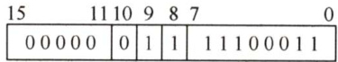  

3）实现“无符号数比较小于等于时转移”功能的指令中，C、乙和 $\mathbf{N}$ 应各是什么？  
4）以下是该指令对应的数据通路示意图，要求给出图中部件 $\textcircled{1}$ 1 $\textcircled{3}$ 的名称或功能说明。  

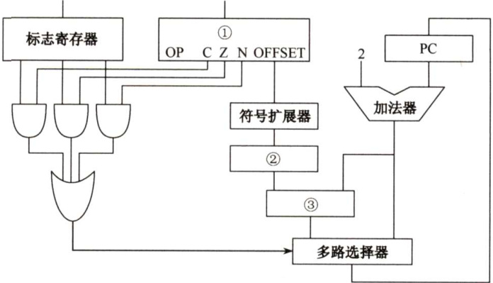  

09.【2015统考真题】题（2015年真题第43题，5.3节综合题9）中描述的计算机，某部分指令执行过程的控制信号如下所示。  

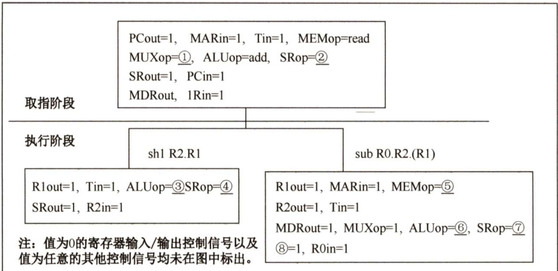  

该机指令格式如下图所示，支持寄存器直接和寄存器间接两种寻址方式，寻址方式位分别为0和1，通用寄存器R0～R3的编号分别为0,1，2和3。  

<html><body><table><tr><td>指令操作码</td><td colspan="2">目的操作数</td><td colspan="2">源操作数1</td><td colspan="2">源操作数2</td></tr><tr><td>OP</td><td>Md</td><td>Rd</td><td>Ms1</td><td>Rs1</td><td>Ms2</td><td>Rs2</td></tr><tr><td colspan="7">其中：Md、Msl、Ms2为寻址方式位，Rd、Rsl、Rs2为寄存器编号。 三地址指令： 源操作数1 OP源操作数2→目的操作数地址</td></tr><tr><td colspan="7">二地址指令（末3位均为0）：</td></tr><tr><td colspan="3">单地址指令（末6位均为0）：</td><td colspan="4">OP 源操作数1→目的操作数地址</td></tr><tr><td colspan="3"></td><td colspan="4">OP目的操作数→目的操作数地址</td></tr></table></body></html>  

回答下列问题：  

1）该机的指令系统最多可定义多少条指令？  

2）假定inc、shl和sub指令的操作码分别为 $01\mathrm{H}$ 、02H和 $03\mathrm{H}$ ，则以下指令对应的机器代码各是什么？  

$\textcircled{1}$ inc R1 $(\mathbb{R}1)+1{\stackrel{\rightharpoonup}{\to}}\mathbb{R}1$ $\textcircled{2}$ shl R2,R1 。 $(\mathbb{R}1)<<1{\rightarrow}\mathbb{R}2$ $\textcircled{3}$ sub R3, (R1), R2 ； $((\mathbf{R}1))-(\mathbf{R}2)\rightarrow\mathbf{R}3$  

3）假设寄存器X的输入和输出控制信号分别为Xin和Xout，其值为1表示有效，为0表示无效（如 $\mathrm{PCout}=1$ 表示PC内容送总线）；存储器控制信号为MEMop，用于控制存储器的读（read）和写（write）操作。写出本题第一幅图中标号 $\textcircled{1}\sim\textcircled{8}$ 处的控制信号或控制信号的取值。  

4）指令“subR1,R3,(R2)”和“incR1”的执行阶段至少各需要多少个时钟周期？  

10.【2021统考真题】假定计算机M字长为16位，按字节编址，连接CPU和主存的系统总线中地址线为20位、数据线为8位，采用16位定长指令字，指令格式及说明如下：  

<html><body><table><tr><td>格式</td><td>6位</td><td>2位</td><td>2位</td><td>2位</td><td>4位</td><td>指令功能或指令类型说明</td></tr><tr><td>R型</td><td>000000</td><td>rs</td><td>rt</td><td>rd</td><td>op1</td><td>R[rd] ←R[rs] op1 R[rt] 含ALU运算、条件转移和访存</td></tr><tr><td>I型</td><td>op2</td><td>rs</td><td>rt</td><td>imm</td><td></td><td>操作3类指令</td></tr><tr><td>J型</td><td>op3</td><td></td><td>target</td><td></td><td></td><td>PC的低10位←target</td></tr></table></body></html>  

其中，opl～op3为操作码，rs,rt和rd 为通用寄存器编号，R[r]表示寄存器r的内容，imm为立即数，target为转移目标的形式地址。请回答下列问题。  

1）ALU的宽度是多少位？可寻址主存空间大小为多少字节？指令寄存器、主存地址寄存器（MAR）和主存数据寄存器（MDR）分别应有多少位？  
2）R型格式最多可定义多少种操作？I型和』型格式总共最多可定义多少种操作？通用寄存器最多有多少个？  
3）假定opl为0010和0011时，分别表示带符号整数减法和带符号整数乘法指令，则指令01B2H的功能是什么（参考上述指令功能说明的格式进行描述）？若1,2,3号通用寄存器当前内容分别为B052H，0008H，0020H，则分别执行指令01B2H和01B3H后，3号通用寄存器内容各是什么？各自结果是否溢出？  
4）若采用I型格式的访存指令中imm（偏移量）为带符号整数，则地址计算时应对imm进行零扩展还是符号扩展？  
5）无条件转移指令可以采用上述哪种指令格式？  

#### 4.2.4 答案与解析  

#### 一、单项选择题  

01.B  

采用不同寻址方式的目的是为了缩短指令字长，扩大寻址空间，提高编程的灵活性，但这也提高了指令译码的复杂度。程序控制是靠转移指令而非寻址方式实现的。  

#### 02.A  

无条件转移指令是指程序转移到新的地址后继续执行，因此必须给出下一条指令的执行地址，并送入程序计数器（PC)。  

#### 03.D  

CPU 中寄存器的数量都不会太多，用很短的编码就可以指定寄存器，寄存器寻址需要的地址段位数为 $\log_{2}$ （通用寄存器个数)，因此能有效地缩短地址段的位数。立即寻址，操作数直接保存在指令中，若地址段位数太小，则操作数表示的范围会很小；变址寻址，EA $\mathbf{\Sigma}=\mathbf{\Sigma}$ 变址寄存器IX的内容 $^+$ 形式地址A，A与主存寻址空间有关；间接寻址中存放的仍然是主存地址。  

#### 04.B  

隐地址不给出明显的操作数地址，而在指令中隐含操作数的地址，因此可以简化地址结构，如零地址指令。  

#### 05.B  

立即寻址最快，指令直接给出操作数；寄存器寻址次之，只需访问一次寄存器；直接寻址再次之，访问一次内存；间接寻址最慢，要访问内存两次或以上。  

注意：寄存器间接寻址取操作数的速度接近直接寻址。  

#### 06.A  

指令字中的形式地址为操作数的有效地址，这种方式为直接寻址。  

07.B  

变址寻址的有效地址是(X）+A，再进行间址，即把(X) $^+$ A 中取出的内容作为真实地址EA，即 $\mathrm{EA}=((\mathrm{X})+\mathrm{A})$ 8  

寄存器中的内容和指令地址码相加得到的是操作数的地址码。  

#### 08.B  

变址寻址便于处理数组问题。基址寻址与变址寻址的区别见下表。  

<html><body><table><tr><td></td><td>基址寻址</td><td>变址寻址</td></tr><tr><td>有效地址</td><td>EA=(BR)+A</td><td>EA=(IX)+A</td></tr><tr><td>访存次数</td><td>1</td><td>1</td></tr><tr><td>寄存器内容</td><td>由操作系统或管理程序确定</td><td>由用户设定</td></tr><tr><td>程序执行过程中值可变否</td><td>不可变</td><td>可变</td></tr><tr><td>特点</td><td>有利于多道程序设计和编制浮动程序</td><td>有利于处理数组问题和编制循环程序</td></tr></table></body></html>  

09.B  

进、出堆栈时对栈顶指针的操作顺序是不同的，进栈时是先压入数据 $(\mathbf{A}){\to}\mathbf{M}_{\mathrm{SP}}$ ，后修改指针 $(\mathrm{SP})-1{\rightarrow}\mathrm{SP}$ ，说明栈指针是指向栈顶的空单元的，所以出栈时要先修改指针 $(\mathrm{SP})+1\mathrm{\rightarrowSP}$ ，然后才能弹出数据 $(\mathrm{M}_{\mathrm{SP}}){\rightarrow}\mathrm{A}$ o  

10.D  

相对寻址中，有效地址 $\mathrm{EA}=\left(\mathrm{PC}\right)+\textbf{A}$ （A为形式地址)，执行本条指令时，PC已完成加1操作，PC中保存的是下一条指令的地址，因此以下一条指令的地址为基准位置的偏移量。  

#### 11.A  

在多道程序设计中，各个程序段可能要在内存中浮动，而相对寻址特别有利于程序浮动，因此选A。  

12.C跳跃寻址通过转移类指令（如相对寻址）来实现，可用来实现程序的条件或无条件转移。  

13.C  

指令字长为16位，2字节，因此取指令后PC的内容为 $(\mathrm{PC})+2=2002\mathrm{H}$ ；无条件转移指令将下一条指令的地址送至PC，形式地址为 $40\mathrm{H}$ ，指令执行后 $\mathrm{PC}=2002\mathrm{H}+0040\mathrm{H}=2042\mathrm{H}$ 。  

#### 14.B  

机器按字寻址，程序计数器（PC）给出下一条指令字的访存地址（指令在内存中的地址)，因此取决于存储器的字数；指令寄存器（IR）用于接收取得的指令，因此取决于指令字长。  

15.D直接寻址200访问的操作数是300，I错误。寄存器间接寻址（R）的访问结果与I一样，ⅡI  

错误。存储器间接寻址（200）表示主存地址 200 中的内容为有效地址，有效地址为300，访问的操作数是400，III错误。寄存器寻址R表示寄存器R的内容为操作数，只有IV正确。  

#### 16.A  

寄存器间接寻址中操作数的有效地址 $\mathrm{EA}=(\mathbf{R}_{i})$ ，8号寄存器内容为1200H，因此EA $\mathbf{\Sigma}=\mathbf{\Sigma}$ 1200H。  

17.D、C  

首先需要讲解一下补码扩充的问题。补码的扩充只需使用符号位补足即可，也就是说正数补码的扩充只要补0，负数补码的扩充只需补1（这是由补码的性质决定的)。理解了该性质，这道题就变成了十进制转换为十六进制的简单问题。  

1）PC 的当前值为240，该指令取出后PC的值为243，要求转移到290，即相对位移量为$290\mathrm{~-~}243\mathrm{~=~}47\$ ，转换成补码为 2FH。由于数据在存储器中采用以低字节地址为字地址的存放方式，因此该转移指令的第二字节为 2FH，由于 47是正数，因此只需在高位补0，所以第三字节为 $00\mathrm{H}$ o  

2）PC 的当前值为240，该指令取出后PC的值为243，要求转移到200，即相对位移量为$200-243=-43$ ，转换成补码为 $\mathrm{D}5\mathrm{H}$ 。由于数据在存储器中采用以低字节地址为字地址的存放方式，因此该转移指令的第二字节为D5H，由于-43是负数，因此只需在高位补1，所以第三字节为FFH。  

18.D  

算术与逻辑运算指令用于完成对一个（如自增、取反等）或两个数据的算术运算或逻辑运算，因此 A 错误。移位操作用于把一个操作数左移或右移一位或多位，因此B 错误。转移指令、子程序调用与返回指令用于解决变动程序中指令执行次序的需求，而不是数据调用次序的需求，因此C错误。  

#### 19.C  

相对寻址 $\mathrm{EA}=(\mathrm{PC})+\mathbf{A}$ ，先计算取指后的PC 值。转移指令由2字节组成，每取一字节PC加1，在取指后PC 值为2002H，因此 $\mathrm{EA}=(\mathrm{PC})+\mathrm{A}=2002\mathrm{H}+06\mathrm{H}=2008\mathrm{H}$ 。本题易误选A或B，选项A未考虑PC 值的自动更新，选项B虽然考虑了PC 值的自动更新，但未注意到该转移指令是一条2字节指令，PC值应是“ $+2$ ”而不是“ $+1$ ”  

#### 20.A  

间接寻址不需要寄存器，EA=(A)。基址寻址：EA=A+(BR)；相对寻址：EA=A+(PC);变址寻址： $\mathrm{EA}{=}\mathbf{A}+(\mathrm{IX})$ （BR 表示基址寄存器，PC 表示程序计数器，IX表示变址寄存器)。  

#### 21.C  

假设两个无符号整数 $A$ 和 $B$ ，bgt指令会将 $A$ 和 $B$ 进行比较，也就是将 $A$ 和 $B$ 相减。若 $A>$ $B$ ，则 $A\:-\:B$ 肯定无进位/借位，也不为0（为0时表示两数相等)，因此CF 和 ZF 均为0，选C。其余选项中用到了符号标志SF 和溢出标志OF，显然应当排除。  

22.D  

根据变址寻址的方法，变址寄存器的内容（1000H）与形式地址的内容（2000H）相加，得到操作数的实际地址（3000H)，根据实际地址访问内存，获取操作数 $4000\mathrm{H}$ ，如下图所示。  

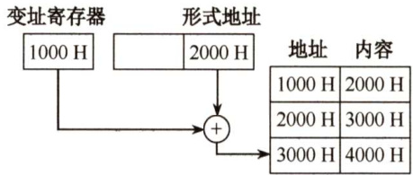  

23.A  

采用32位定长指令字，其中操作码为8位，两个地址码共占用 $32\textrm{--}8=24$ 位，而Store 指令的源操作数和目的操作数分别采用寄存器直接寻址和基址寻址，机器中共有16个通用寄存器，因此寻址一个寄存器需要 $\log_{2}16=4$ 位，源操作数中的寄存器直接寻址用掉4位，而目的操作数采用基址寻址也要指定一个寄存器，同样用掉4位，则留给偏移量的位数为24-$4-4=16$ 位，而偏移量用补码表示，因此16位补码的表示范围为 $-32768\sim+32767$ o  

#### 24.C  

变址寻址中，有效地址（EA）等于指令字中的形式地址D与变址寄存器I的内容之和，即$\mathrm{EA}=(\mathrm{I})+\mathrm{D}$ 。间接寻址是相对于直接寻址而言的，指令的地址字段给出的形式地址不是操作数的真正地址，而是操作数地址的地址，即 $\mathbf{EA}=(\mathbf{D})$ 。从而该操作数的有效地址是 $((\mathrm{I})+\mathrm{D})$ 。  

#### 25.D  

在变址操作时，将计算机指令中的地址与变址寄存器中的地址相加，得到有效地址，指令提供数组首地址，由变址寄存器来定位数据中的各元素。所以它最适合按下标顺序访问一维数组元素，选D。相对寻址以PC 为基地址，以指令中的地址为偏移量确定有效地址。寄存器寻址则在指令中指出需要使用的寄存器。直接寻址在指令的地址字段直接指出操作数的有效地址。  

#### 26.B  

根据变址寻址的公式 $\mathrm{EA}=\left(\mathrm{IX}\right)+\mathbf{A}$ ，有 $(\mathrm{IX})=2100\mathrm{H}-\ 2000\mathrm{H}=100\mathrm{H}=256$ ，sizeof(double) $=8$ （双精度浮点数用8位字节表示)，因此数组的下标为 $256/8=32$ ，答案选B。  

#### 27.D  

解析请扫右侧二维码查阅。  

28.A  

48条指令需要6位操作码字段 $(2^{5}<48<2^{6}$ )，4种寻址方式需要2位寻址特征位（ $4=2^{2}$ )，还剩 $16-6-2=8$ 位作为地址码，故直接寻址范围为 $0{\sim}255$ 。注意，主存地址不能为负。  

#### 二、综合应用题  

01.【解答】  

1）由于通用寄存器的数量有限，可以用较少的二进制位来编码，所以采用寄存器寻址方式和寄存器间接寻址方式的指令码长度最短。因为需要在指令中表示数据和地址，所以立即寻址方式、直接寻址方式和间接寻址方式的指令码长度最长。若指令码长度太短，则无法表示范围较大的立即数和寻址到较大的内存地址空间。  

2）由于通用寄存器位于CPU内部，无须到内存读取操作数，所以寄存器寻址方式执行速度最快。而间接寻址方式需要读内存两次，第一次由操作数的间接地址读到操作数的地址，第二次再由操作数的地址读到操作数，所以间接寻址方式的执行速度最慢。  

3）若指令系统采用定长指令码格式，所有指令（包括采用立即寻址方式的指令）所包含的二进制位数均相同，则立即寻址方式执行速度最快，因为读到指令的同时，便立即取得操作数。若采用变长指令码格式，由于要表示一定范围内的立即数，包含立即数的指令通常需要较多的二进制位，取指令时，可能需要不止一次地读内存来完成取指令。因此，采用变长指令码格式时，寄存器寻址方式执行速度最快。  

02.【解答】  

1）因为OP字段长为5位，所以指令能定义 $2^{5}=32$ 种指令。  

2）、3）各种寻址方式的有效地址EA的计算公式、寻址范围见下表  

<html><body><table><tr><td>寻址方式</td><td>有效地址EA的计算公式</td><td>寻址范围</td></tr><tr><td>直接寻址</td><td>EA=A</td><td>28=256</td></tr><tr><td>间接寻址</td><td>EA=(A)</td><td>216=64K</td></tr><tr><td>变址寻址</td><td>EA=(Rx)+A</td><td>216=64K</td></tr><tr><td>相对寻址</td><td>EA=(PC)+A</td><td>28=256（PC附近256)</td></tr></table></body></html>  

03.【解答】  

1）直接寻址时，有效地址是指令中的地址码部分500，装入ACC的是800。  
2）立即寻址时，指令的地址码部分是操作数而不是地址，所以将500装入ACC。  
3）间接寻址时，操作数的有效地址存储在地址为 500 的单元中，由此得到有效地址为800，操作数是300。  
4）相对寻址时，有效地址 $\operatorname{EA}=(\operatorname{PC})+\mathrm{A}=202+500=702$ ，所以装入ACC 的操作数是325。这是因为指令是双字长，在该指令的执行阶段，PC 的内容已经加2，更新为下一条指令的地址202。  
5）变址寻址时，有效地址 $\operatorname{EA}=(\operatorname{XR})+\mathbf{A}=100+500=600$ ，所以装入ACC 的操作数是900。  
6）寄存器寻址时，R1的内容400装入ACC。  
7）寄存器间接寻址时，有效地址是R1的内容400，装入ACC 的操作数是700。  

04.【解答】  

取指后， $\mathrm{PC}=1235\mathrm{H}$ （注意，不是1236H，因主存按字编址）。  

$\textcircled{1}$ $\mathbf{X}=00$ ， $\mathrm{D}=20\mathrm{H}$ ，有效地址 $\mathrm{EA}=20\mathrm{H}$ 。  
$\textcircled{2}$ $X=10$ ， $\mathrm{D}=44\mathrm{H}$ ，有效地址 $\mathrm{EA}=1122\mathrm{H}+44\mathrm{H}=1166\mathrm{H}$ 0$\textcircled{3}$ $\mathbf{X}=11$ ， $\mathbf{D}=22\mathrm{H}$ ，有效地址 $\mathrm{EA}=1235\mathrm{H}+22\mathrm{H}=1257\mathrm{H}$ 。  
$\textcircled{4}$ $\mathbf{X}=01$ ， ${\bf D}=21{\bf H}$ ，有效地址 $\mathrm{EA}=0037\mathrm{H}+21\mathrm{H}=0058\mathrm{H}$ 。  
$\textcircled{5}$ $\mathbf{X}=11$ ， $\mathrm{D}=23\mathrm{H}$ ，有效地址 $\mathrm{EA}=1235\mathrm{H}+23\mathrm{H}=1258\mathrm{H}$ 。  

05.【解答】  

1）四里，且余令口丨于，以毕位子。  

2）根据“大于”条件判断表达式，可以看出该bgt指令实现的是带符号整数比较。因为无符号数比较时，其判断表达式中没有溢出标志OF。  
3）偏移地址 $\mathrm{Imm}8$ 为补码表示，说明转移目标地址可能在bgt指令之后。计算转移目标地址时，偏移量为 $\mathrm{Im}\mathrm{m}8\times2$ ，说明 $\mathrm{Imm}8$ 不是相对地址，而是相对指令数。 $\mathrm{Imm}8$ 的范围为 $-128\sim127$ ，故转移目地址的范围是 $\mathrm{PC}+2+(-128{\times}2){\sim}\mathrm{PC}+2+127{\times}2$ ，也即转移目标地址的范围是相对于bgt指令的前127条指令到后128条指令之间。  

06.【解答】  

1）操作码占4位，则该指令系统最多可有 $2^{4}=16$ 条指令。操作数占6位，其中寻址方式占3位、寄存器编号占3位，因此该机最多有 $2^{3}=8$ 个通用寄存器。主存地址空间大小为128KB，按字编址，字长为16位，共有 $128\mathrm{KB}/2\mathrm{B}=2^{16}$ 个存储单元，因此MAR至少为16位；因为字长为16位，因此MDR至少为16位。  

2）寄存器字长为16位，PC 可表示的地址范围为 $0{\sim}2^{16}-1$ ，Rn 可表示的相对偏移量为 $-2^{15}\sim$ $2^{15}-1$ ，而主存地址空间为 $2^{16}$ ，因此转移指令的目标地址范围为 $0000\mathrm{H}$ \~FFFFH $(0{\sim}2^{16}–1)$ 。  

3）汇编语句“add(R4), $(\mathsf{R}5)+^{,}$ 对应的机器码为将对应的机器码写成十六进制形式为 $0010001100010101\mathrm{B}=2315\mathrm{H}.$  

<html><body><table><tr><td>字段</td><td>OP</td><td>Ms</td><td>Rs</td><td>Md</td><td>Rd</td></tr><tr><td>内容</td><td>0010</td><td>001</td><td>100</td><td>010</td><td>101</td></tr><tr><td>说明</td><td>add</td><td>寄存器间接</td><td>R4</td><td>寄存器间接、自增</td><td>R5</td></tr></table></body></html>  

该指令的功能是将R4 的内容所指的存储单元的数据与R5 的内容所指的存储单元的数据相加，并将结果送入R5 的内容所指的存储单元中。 $(\mathrm{R}4)~=~1234\mathrm{H}$ ， $(1234\mathrm{H})\:=\:5678\mathrm{H}$ ；(R5) $\mathbf{\Sigma}=\mathbf{\Sigma}$ 5678H， $(5678\mathrm{H})=1234\mathrm{H}$ ；执行加法操作 $5678\mathrm{H}+1234\mathrm{H}=68\mathrm{ACH}$ 。之后R5自增。  

该指令执行后，R5和存储单元5678H的内容会改变，R5的内容从5678H变为5679H，存储单元5678H中的内容变为该指令的计算结果68ACH。  

07.【解答】  

直接寻址：寄存器的内容是有效地址EA，所以直接寻址的有效地址为300，根据题给出的表格可知，地址300对应的内容为400。  

间接寻址：根据寄存器的内容寻找到的内容才是真正的有效地址，所以根据寄存器内容300找到的400才是间接寻址的有效地址，因此有效地址为400，地址400对应的内容为700。  

相对寻址：寄存器的内容加上PC 的内容为有效地址，PC 的当前值为200，所以当取出一条指令后，变为202，因此有效地址为 $202+300=502$ ，地址502对应的内容为900。  

变址寻址：变址寻址的有效地址为变址寄存器的内容加上累加器的内容，所以有效地址为$100+300=400$ ，地址400对应的内容为700。  

基址寻址：基址寻址的有效地址为基址寄存器的内容加上累加器的内容，所以有效地址为$200+300=500$ ，地址500对应的内容为600。  

先变址后间址：先变址，即先让变址寄存器的内容加上累加器的内容，即 400；再间址，意思就是根据地址400找到的内容才是有效地址，所以先变址后间址的有效地址为700。地址700对应的内容为401。  

先间址后变址：先间址，即先根据累加器的内容300找到间址的有效地址400；再变址，即400再加上变址寄存器的内容，也就是 $400+100=500$ ，地址500对应的内容为600。  

综上，得到下表：  

<html><body><table><tr><td>寻址方式</td><td>有效地址（EA)</td><td>累加器（AC）的内容</td></tr><tr><td>立即寻址</td><td>一</td><td>300</td></tr><tr><td>直接寻址</td><td>300</td><td>400</td></tr><tr><td>间接寻址</td><td>400</td><td>700</td></tr><tr><td>相对寻址</td><td>502</td><td>900</td></tr><tr><td>变址寻址</td><td>400</td><td>700</td></tr><tr><td>基址寻址</td><td>500</td><td>600</td></tr><tr><td>先变址后间址</td><td>700</td><td>401</td></tr><tr><td>先间址后变址</td><td>500</td><td>600</td></tr></table></body></html>  

08.【解答】  

1）因为指令长度为16位，且下一条指令地址为 $(\mathrm{PC})+2$ ，因此编址单位是字节。偏移量OFFSET为8位补码，范围为 $-128\sim127$ ，因此相对于当前条件转移指令，向后最多可跳转127条指令。  

）指令中 $\mathbf{C}=0$ ， $Z=1$ ， ${\bf N}=1$ ，因此应根据ZF和NF的值来判断是否转移。 ${\mathrm{CF}}=0$ ， $Z\mathrm{F}= $ 0， ${\mathrm{NF}}=1$ 时，需转移。已知指令中的偏移量为 $1110~0011\mathrm{B}=\mathrm{E}3\mathrm{H}$ ，符号扩展后为FFE3H，左移一位（乘2）后为FFC6H，因此PC的值（即转移目标地址）为 $200\mathrm{CH}+2+$ $\mathrm{FFC6H}=\mathrm{1FD4H}$ 。 $\mathrm{CF}=1$ ， $\boldsymbol{Z}\boldsymbol{\mathrm{F}}=\boldsymbol{0}$ ， ${\mathrm{NF}}=0$ 时不转移。PC的值为 $200\mathrm{CH}+2=200\mathrm{EH}$ 0  

3）指令中的C、Z和 $\mathbf{N}$ 应分别设置为 $\mathbf{C}=\mathbf{Z}=1$ ， $\mathbf{N}=0$ o  

4）部件 $\textcircled{1}$ 用于存放当前指令，不难得出为指令寄存器；多路选择器根据符号标志C/Z/N来决定下一条指令的地址是 $\mathrm{PC}+2$ 还是 $\mathrm{PC}+2+2\times1$ OFFSET，因此多路选择器左边线上的结果应是 $\mathrm{PC}+2+2\times1$ OFFSET。根据运算的先后顺序及与 $\mathrm{PC}+2$ 的连接，部件 $\textcircled{2}$ 用于左移一位实现乘2，为移位寄存器。部件 $\textcircled{3}$ 用于 $\ensuremath{\mathbf{P}}\ensuremath{\mathbf{C}}+2$ 和 $2\times$ OFFSET相加，为加法器。部件 $\textcircled{2}$ ：移位寄存器（用于左移一位)；部件 $\textcircled{3}$ ：加法器（地址相加）。  

09.【解答】  

1）指令操作码有7位，因此最多可定义 $2^{7}=128$ 条指令。  

2）各条指令的机器代码如下：  

$\textcircled{1}$ “incR1”的机器码为 $0000001001000000$ ，即 $0240\mathrm{H}$ o$\textcircled{2}$ “shlR2,R1”的机器码为 $0000010010001000$ ，即 $0488\mathrm{H}$ 0$\textcircled{3}$ “subR3,(R1),R2”的机器码为 $0000011011101010$ ，即06EAH。  

3）各标号处的控制信号或控制信号取值如下：$\textcircled{1}0$ ， $\textcircled{2}\textcircled{\scriptsize{\mathrm{mov}}}$ ； $\textcircled{3}$ mova; $\textcircled{4}$ left； $\textcircled{5}$ read; $\textcircled{6}$ sub； $\textcircled{7}$ mov； $\textcircled{8}$ SRout。  

4）指令“subR1，R3，(R2)”的执行阶段至少包含4个时钟周期；指令“incR1”的执行阶段至少包含2个时钟周期。  

10.【解答】  

1）ALU的宽度为16位，ALU的宽度即ALU运算对象的宽度，通常与字长相同。地址线为 20位，按字节编址，可寻址主存空间大小为 $2^{20}$ 字节（或1MB)。指令寄存器有16  

位，和单条指令长度相同。MAR有20位，和地址线位数相同。MDR有8位，和数据线宽度相同。2）R 型格式的操作码有4位，最多有 $2^{4}$ （或16）种操作。I型和」型格式的操作码有6位，因为它们的操作码部分重叠，所以共享这6位的操作码空间，且前6位全0的编码已被R型格式占用，因此I和J型格式最多有 $2^{6}-1\ =\ 63$ 种操作。从R型和I型格式的寄存器编号部分可知，只用2位对寄存器编码，因此通用寄存器最多有4个。3）指令 $01\mathrm{B2H}=00000001\ 10\ 11\ 0010\mathrm{B}$ 为一条R型指令，操作码0010表示带符号整数减法指令，其功能为 $\mathsf{R}[3]{\leftarrow}\mathsf{R}[1]{-}\mathsf{R}[2]$ 。执行指令01B2H后， ${\mathrm{R}}[3]={\mathrm{B}}052{\mathrm{H}}-0008{\mathrm{H}}={\mathrm{B}}04{\mathrm{AH}},$ 结果未溢出。指令 $01\mathrm{B3H}=0000000110110011\mathrm{B}$ ，操作码0011表示带符号整数乘法指令，执行指令01B3H后， $\mathrm{R}[3]=\mathrm{R}[1]{\times}\mathrm{R}[2]=\mathrm{B}052\mathrm{H}{\times}0008\mathrm{H}=8290\mathrm{H}$ ，结果溢出。4）在进行指令的跳转时，可能向前跳转，也可能向后跳转，偏移量是一个带符号整数，因此在地址计算时，应对imm进行符号扩展。5）无条件转移指令可以采用J型格式，将target部分写入PC的低10位，完成跳转。