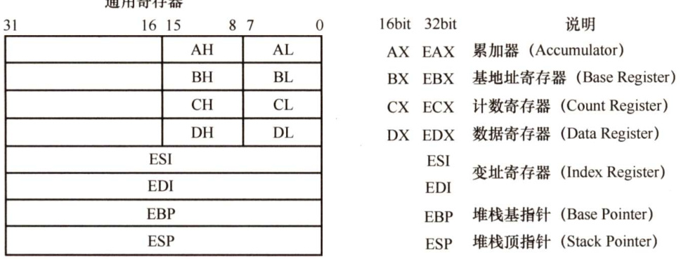
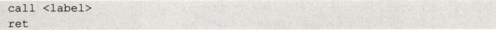
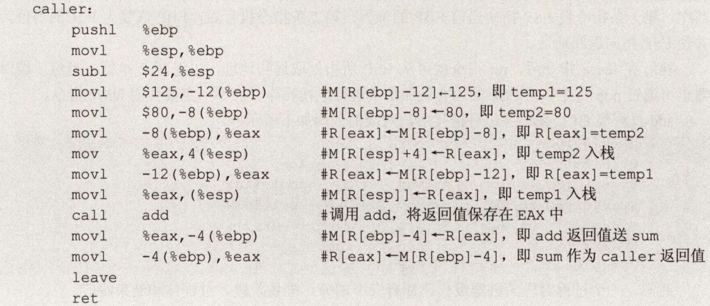
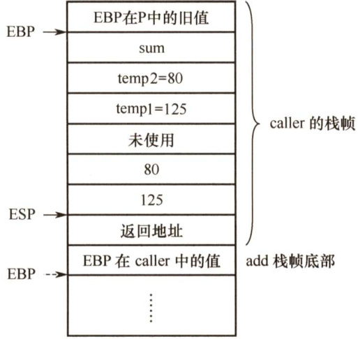
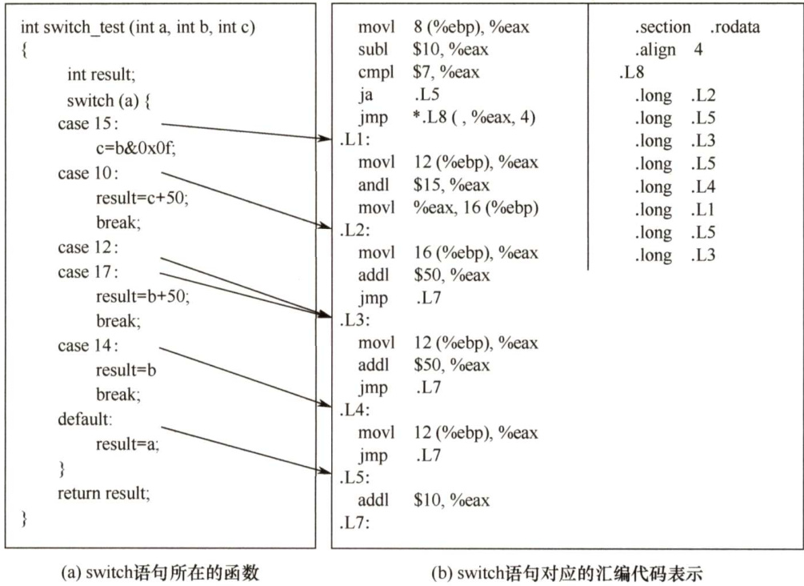
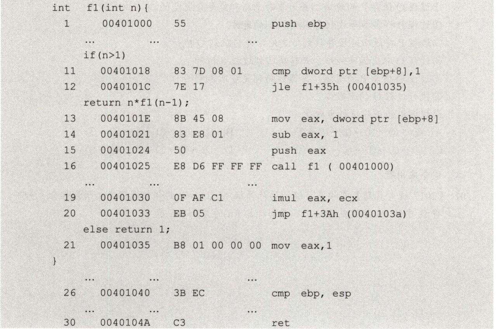

#### 4.3 程序的机器级代码表示  

本节的内容是2022年大纲新增考点，其实在2017年和2019 年就以综合题的形式考查过，在当时看来属于超纲范畴，很多跨考生当时对此几乎无从下手，相信通过本节的学习后，应能从容应对。  

#### 4.3.1 常用汇编指令介绍  

#### 1．相关寄存器  

$\mathbf{x}86$ 处理器中有8个32位的通用寄存器，各寄存器及说明如图4.11所示。为了向后兼容，EAX、EBX、ECX和EDX 的高两位字节和低两位字节可以独立使用，E 为Extended，表示32位的寄存器。例如，EAX的低两位字节称为AX，而AX的高低字节又可分别作为两个8位寄存器，分别称为AH和AL。寄存器的名称与大小写无关，既可以用EAX，又可以用eax。  

  
图4.11 $\mathbf{x}86$ 处理器中的主要寄存器及说明  

除EBP和ESP外，其他几个寄存器的用途是比较任意的。  

#### 2.汇编指令格式  

使用不同的编程工具开发程序时，用到的汇编程序也不同，一般有两种不同的汇编格式：AT&T格式和Intel格式。它们的区别主要体现如下：  

$\textcircled{1}$ AT&T格式的指令只能用小写字母，而Intel格式的指令对大小写不敏感。  
$\textcircled{2}$ 在 AT&T格式中，第一个为源操作数，第二个为目的操作数，方向从左到右，合乎自然；在Intel格式中，第一个为目的操作数，第二个为源操作数，方向从右向左。  
$\textcircled{3}$ 在AT&T格式中，寄存器需要加前缀“ $\%$ ”，立即数需要加前缀“\$”；在Intel格式中，寄存器和立即数都不需要加前缀。  
$\textcircled{4}$ 在内存寻址方面，AT&T格式使用“（”和“)”，而Intel格式使用“[”和“]”。  
$\textcircled{5}$ 在处理复杂寻址方式时，例如AT&T格式的内存操作数“disp(base，index，scale)”分别表示偏移量、基址寄存器、变址寄存器和比例因子，如“8(%edx，%eax，2)”表示操作数为 $\mathbf{M}[\mathrm{R}[\mathrm{ed}\mathbf{x}]+\mathrm{R}[\mathrm{eax}]^{*}2+8]$ ，其对应的Intel格式的操作数为“[edx+eax\*2+8]”。  
$\textcircled{6}$ 在指定数据长度方面，AT&T格式指令操作码的后面紧跟一个字符，表明操作数大小，“b”表示byte（字节）、“w”表示word（字）或“l”表示long（双字）。Intel格式也有类似的语法，它在操作码后面显式地注明byteptr、wordptr或dword ptr。  

注意：由于32或64位体系结构都是由16位扩展而来的，因此用word（字）表示16位。表4.2展示了两种格式的几条不同指令。其中，moV 指令用于在内存和寄存器之间或者寄存器之间移动数据；lea指令用于将一个内存地址（而不是其所指的内容）加载到目的寄存器。  

表4.2AT&T格式指令和Intel格式指令的对比  

<html><body><table><tr><td>AT&T格式</td><td>Intel格式</td><td>含义</td></tr><tr><td>mov $100, eax</td><td>mov eax, 100</td><td>100→R[eax]</td></tr><tr><td></td><td>mov ebx, eax</td><td>R[eax]→R[ebx]</td></tr><tr><td>mov %eax, (%ebx)</td><td>mov [ebx], eax</td><td>R[eax]→M[R[ebx]]</td></tr><tr><td>mov eax,-8（%ebp)</td><td>mov [ebp-8],eax</td><td>R[eax]→M[R[ebp]-8]]</td></tr><tr><td>lea 8(%edx,%eax,2)，eax</td><td>lea eax,[edx+eax*2+8]</td><td>R[edx]+R[eax]*2+8→R[eax]</td></tr><tr><td>movl eax, ebx</td><td>mov dword ptr ebx, eax</td><td>长度为4字节的R[eax]→R[ebx]</td></tr></table></body></html>

注：R[r]表示寄存器r的内容，M[addr]表示主存单元addr的内容，→表示信息传送方向。  

两种汇编指令的相互转换并不复杂。考虑到本书参考教材之一［袁春风所著《计算机系统基础（第二版)》」使用的是AT&T格式，但2017年和2019年统考综合题使用的是Intel格式，因此本书将混用两种格式，两种格式的汇编指令都需要理解。在本节介绍常用指令时，使用Intel格式；在后面介绍具体结构的机器级表示时，使用AT&T格式。读者在学习时可以尝试转换。  

#### 3.常用指令  

汇编指令通常可以分为数据传送指令、逻辑计算指令和控制流指令，下面以Intel格式为例，介绍一些重要的指令。以下用于操作数的标记分别表示寄存器、内存和常数。  

·<reg>：表示任意寄存器，若其后带有数字，则指定其位数，如<reg32>表示32位寄存器（eax、ebx、ecx、edx、esi、edi、esp或ebp）；<regl6>表示16位寄存器（ax、bx、cx或dx）；<reg8>表示8位寄存器（ah、al、bh、bl、ch、cl、dh、dl）。<mem>：表示内存地址（如[eax]、[var+4]或dword ptr[eax+ebx]）。  
·<con>：表示8位、16位或32位常数。<con8>表示8位常数；<conl6 $>$ 表示16位常  

数； $<\mathrm{con}32>.$ 表示32位常数。  

$\mathbf{x}86$ 中的指令机器码长度为1字节，对同一指令的不同用途有多种编码方式，比如mov 指令就有28种机内编码，用于不同操作数类型或用于特定寄存器，例如，  

mov<con16>,ax #机器码为B8H mov<con $8>$ al #机器码为BOH mov<reg16>，<reg16>/<mem16> #机器码为89H mov<reg8>/<mem8>，<reg8> #机器码为8AH mov<reg16>/<meml6>，<reg16> #机器码为8BH  

（1）数据传送指令  

1）mov 指令。将第二个操作数（寄存器的内容、内存中的内容或常数值）复制到第一个操作数(寄存器或内存)。但不能用于直接从内存复制到内存。  

其语法如下：  

mov<reg>,<reg> mov<reg>,<mem> mov<mem>,<reg> mov<reg>,<con> mov<mem>,<con>  

举例：  

moveax,ebx #将ebx值复制到eaxmovbyte ptr [var]，5 #将5保存到var值指示的内存地址的一字节中  

2）push 指令。将操作数压入内存的栈，常用于函数调用。ESP是栈顶，压栈前先将 ESP值减4（栈增长方向与内存地址增长方向相反)，然后将操作数压入ESP指示的地址。其语法如下：  

<html><body><table><tr><td>push<reg32> push<mem></td><td></td></tr></table></body></html>  

举例（注意，栈中元素固定为32位）：  

<html><body><table><tr><td>pusheax #将eax值压栈 push[var] #将var值指示的内存地址的4字节值压栈</td></tr></table></body></html>  

3）pop指令。与push 指令相反，pop指令执行的是出栈工作，出栈前先将ESP指示的地址中的内容出栈，然后将ESP值加4。  

其语法如下：  

<html><body><table><tr><td>popedi #弹出栈顶元素送到edi pop[ebx] #弹出栈顶元素送到ebx值指示的内存地址的4字节中</td></tr></table></body></html>  

（2）算术和逻辑运算指令  

1）add/sub指令。add指令将两个操作数相加，相加的结果保存到第一个操作数中。sub 指令用于两个操作数相减，相减的结果保存到第一个操作数中。  

它们的语法如下：  

add<reg>,<reg>/sub<reg>,<reg> add<reg>,<mem>/sub<reg>,<mem> add <mem>,<reg> /sub<mem>,<reg> add<reg>,<con>/sub<reg>,<con> add<mem>,<con>/sub<mem>,<con>  

举例：  

<html><body><table><tr><td>sub eax,10</td><td>#eaxeax-10</td></tr></table></body></html>  

add byte ptr[var]，10 $\#10$ 与var值指示的内存地址的一字节值相加，并将结果保存在var值指示的内存地址的字节中  

2）inc/dec指令。inc、dec指令分别表示将操作数自加1、自减1。  

它们的语法如下：  

<html><body><table><tr><td>inc<reg>/dec<reg> inc<mem>/dec<mem></td></tr></table></body></html>  

举例：  

<html><body><table><tr><td>deceax #eax值自减1 #var值指示的内存地址的4字节值自加1</td></tr></table></body></html>  

3）imul指令。带符号整数乘法指令，有两种格式： $\textcircled{1}$ 两个操作数，将两个操作数相乘，将结果保存在第一个操作数中，第一个操作数必须为寄存器； $\textcircled{2}$ 三个操作数，将第二个和第三个操作数相乘，将结果保存在第一个操作数中，第一个操作数必须为寄存器。  

其语法如下：  

imul<reg32>,<reg32> imul<reg $32>$ <mem> imul<reg32>,<reg $32>$ ,<con> imul<reg $32>$ <mem>,<con>  

举例：  

<html><body><table><tr><td></td><td></td><td>imuleax,[var]</td><td></td><td>#eax←eax*[var]</td><td></td></tr><tr><td></td><td></td><td>imul esi,edi,25</td><td>#esi←edi*25</td></tr></table></body></html>  

乘法操作结果可能溢出，则编译器置溢出标志 ${\mathrm{OF}}=1$ ，以使CPU调出溢出异常处理程序。  

4）idiv 指令。带符号整数除法指令，它只有一个操作数，即除数，而被除数则为 edx:eax中的内容（64位整数)，操作结果有两部分：商和余数，商送到eax，余数则送到edx。其语法如下：  

<html><body><table><tr><td>idiv<reg32> idiv<mem></td></tr></table></body></html>  

举例：  

<html><body><table><tr><td>idivebx idiv dword ptr [var]</td></tr></table></body></html>  

5）and/or/xor指令。and、or、xor 指令分别是逻辑与、逻辑或、逻辑异或操作指令，用于操作数的位操作，操作结果放在第一个操作数中。  

它们的语法如下：  

and<reg>,<reg> or<reg>,<reg> xor<reg>,<reg> and<reg>,<mem> or<reg>,<mem> xor<reg>,<mem> and<mem>,<reg> or<mem>,<reg> xor<mem>,<reg> and<reg>,<con> or <reg>,<con> xor<reg>,<con> and<mem>,<con> or<mem>,<con>/xor<mem>,<con>  

举例：  

and eax,OfH #将eax中的前28位全部置为0，最后4位保持不变xor edx,edx #置edx中的内容为0  

6）not指令。位翻转指令，将操作数中的每一位翻转，即 $0{\rightarrow}1$ 、 $1{\rightarrow}0$ 。  

其语法如下：  

  

举例：  

not byte ptr [var] #将var值指示的内存地址的一字节的所有位翻转  

7）neg指令。取负指令。  

其语法如下：  

neg <reg> neg<mem>  

举例：  

  

8）shl/shr指令。逻辑移位指令，shl为逻辑左移，shr 为逻辑右移，第一个操作数表示被操作数，第二个操作数指示移位的位数。  

它们的语法如下：  

shl<reg>,<con8>/shr<reg>,<con8> shl <mem>,<con8>/shr<mem>,<con8> shl<reg>,<cl>/shr<reg>,<cl> shl<mem>,<cl>/shr<mem>,<cl>  

举例：  

shl eax,1 #将eax值左移1位，相当于乘以2shr ebx,cl #将ebx值右移 $n$ 位（ $n$ 为c1中的值），相当于除以 $2^{n}$  

（3）控制流指令  

$\mathbf{x}86$ 处理器维持着一个指示当前执行指令的指令指针（IP)，当一条指令执行后，此指针自动指向下一条指令。IP寄存器不能直接操作，但可以用控制流指令更新。通常用标签（label)指示程序中的指令地址，在 $\mathbf{x}86$ 汇编代码中，可在任何指令前加入标签。例如，  

mov esi,[ebp $+8$ 1begin: xor ecx,ecxmoveax,[esi]这样就用begin指示了第二条指令，控制流指令通过标签就可以实现程序指令的跳转。  

1）jmp指令。jmp指令控制IP转移到label所指示的地址（从label中取出指令执行)。其语法如下：  

jmp<label>  

举例：  

jmp begin #转跳到begin标记的指令执行  

2）jcondition指令。条件转移指令，依据CPU状态字中的一系列条件状态转移。CPU 状态字中包括指示最后一个算术运算结果是否为0，运算结果是否为负数等。  

其语法如下：  

je<label>（jump when equal）   
jne <label> （jump when not equal）   
jz<label>（jump when last result was zero）   
jg<label>（jump when greater than）   
jge <label> （jump when greater than or equal to）   
jl <label> (jump when less than）   
jle<label>（jump when less than or equal to）  

举例：  

cmp eax,ebx  
jle done #如果eax的值小于等于ebx值，跳转到done指示的指令执行，否则执行下条指令。  

3）cmp/test指令。cmp指令用于比较两个操作数的值，test指令对两个操作数进行逐位与运算，这两类指令都不保存操作结果，仅根据运算结果设置CPU状态字中的条件码。其语法如下：  

cmp<reg>,<reg>/test<reg>,<reg>  

cmp<reg>,<mem>/test<reg>,<mem>cmp<mem>,<reg>/test<mem>,<reg>cmp<reg>,<con>/test<reg>,<con>cmp和test指令通常和jcondition指令搭配使用，举例：  

cmp dword ptr [var]，10 #将var指示的主存地址的4字节内容，与10比较jne loop #如果相等则继续顺序执行；否则跳转到1oop处执行test eax, eax #测试eax是否为零jz xxxx #为零则置标志ZF为1，转跳到xxxx处执行  

4）call/ret指令。分别用于实现子程序（过程、函数等）的调用及返回。  

其语法如下：  

  

call 指令首先将当前执行指令地址入栈，然后无条件转移到由标签指示的指令。与其他简单的跳转指令不同，call指令保存调用之前的地址信息（当call指令结束后，返回调用之前的地址)。ret指令实现子程序的返回机制，ret指令弹出栈中保存的指令地址，然后无条件转移到保存的指令地址执行。call和ret是程序（函数）调用中最关键的两条指令。  

理解上述指令的语法和用途，可以更好地帮助读者解答相关题型。读者在上机调试C 程序代码时，也可以尝试用编译器调试，以便更好地帮助理解机器指令的执行。  

#### 4.3.2 过程调用的机器级表示  

上面提到的call/ret指令主要用于过程调用，它们都属于一种无条件转移指令。假定过程P（调用者）调用过程Q（被调用者)，过程调用的执行步骤如下：  

1）P将入口参数（实参）放在Q能访问到的地方。  
2）P将返回地址存到特定的地方，然后将控制转移到Q。  
3）Q保存P的现场（通用寄存器的内容)，并为自己的非静态局部变量分配空间。  
4）执行过程Q。  
5）Q恢复P的现场，将返回结果放到P能访问到的地方，并释放局部变量所占空间。  
6）Q取出返回地址，将控制转移到P。  

步骤2）是由call指令实现的，步骤6）通过ret指令返回到过程P。在上述步骤中，需要为入口参数、返回地址、过程P的现场、过程Q的局部变量、返回结果找到存放空间。但用户可见寄存器数量有限，为此需要设置一个专门的存储区域来保存这些数据，这个存储区域就是栈。寄存器EAX、ECX和EDX是调用者保存寄存器，其保存和恢复的任务由过程P负责，当P 调用Q时，Q 就可以直接使用这三个寄存器。寄存器EBX、ESI、EDI是被调用者保存寄存器，Q必须先将它们的值保存在栈中才能使用它们，并在返回P之前先恢复它们的值。  

每个过程都有自己的栈区，称为栈帧，因此，一个栈由若干栈帧组成。帧指针寄存器 EBP指示栈帧的起始位置（栈底)，栈指针寄存器ESP指示栈顶，栈从高地址向低地址增长，因此，当前栈帧的范围在帧指针EBP和ESP指向的区域之间。  

下面用一个简单的C语言程序来说明过程调用的机器级实现。  

int add（int x,inty){ return $x+y$   
)   
int caller（）{ int templ $=125$ . int temp $2=80$ . int sum $\mathfrak{e}$ add(templ,temp2);   
return sum;  

经GCC编译后，caller过程对应的代码如下（#后面的文字是注释）：  

  

图4.12给出了caller 栈帧的状态，假定caller被过程P调用。执行了第4行指令后ESP 所指的位置如图中所示，可以看出GCC为caller的参数分配了24字节的空间。从汇编代码中可以看出，caller 中只使用了调用者保存寄存器EAX，没有使用任何被调用者保存寄存器，因而在caller 栈帧中无须保存除 EBP 外的任何寄存器的值；caller 有三个局部变量templ、temp2 和sum，皆被分配在栈帧中；在用call指令调用add 函数之前，caller 先将入口参数从右向左依次将 temp2和templ的值（即80 和125）保存到栈中。在执行call指令时再把返回地址压入栈中。此外，在最初进入caller 时，还将EBP 的值压入了栈，因此caller 的栈帧中用到的空间占 $^\textrm{\scriptsize4+}$ $12+8+4=28$ 字节。但是，caller的栈帧共有 $4+24+4=32$ 字节，其中浪费了4字节的空间（未使用)。这是因为GCC 为保证数据的严格对齐而规定每个函数的栈帧大小必须是16 字节的倍数。  

  
图4.12caller和add的栈帧  

call 指令执行后，add 函数的返回参数存放到EAX中，因而在 call指令后面的两条指令中，指令“movl %eax，-4(%ebp)”将 add 的结果存入 sum 变量的存储空间，该变量的地址为R[ebp]-4；指令“movl-4(%ebp)， $\%$ eax”将sum变量的值作为返回值送到寄存器EAX中。  

在执行ret指令之前，应将当前栈帧释放，并恢复旧EBP的值，上述第14行leave指令实现了这个功能，leave指令功能相当于以下两条指令的功能：  

<html><body><table><tr><td>movl %ebp，%esp popl ebp</td></tr></table></body></html>  

其中，第一条指令使ESP指向当前EBP的位置，第二条指令执行后，EBP恢复为P中的旧值，并使ESP指向返回地址。  

执行完leave指令后，ret指令就可从ESP所指处取返回地址，以返回P执行。当然，编译器也可通过pop指令和对ESP 的内容做加法来进行退栈操作，而不一定要使用leave 指令。  

add过程经GCC编译并进行链接后，对应的代码如下所示：  

<html><body><table><tr><td>8048469:55 804846a:89e5</td><td rowspan="3">push mov mov</td><td>%ebp %esp,%ebp</td></tr><tr><td>804846c:8b450c</td><td>0xc（%ebp),%eax</td></tr><tr><td>804846f:8b5508</td><td>0x8（%ebp）,%edx</td></tr><tr><td>8048472:8d0402</td><td rowspan="2">mov lea pop</td><td>（%edx,%eax,1）,%eax</td></tr><tr><td>8048475:5d</td><td>%ebp</td></tr><tr><td>8048476:c3</td><td colspan="2">ret</td></tr></table></body></html>  

通常，一个过程对应的机器级代码都有三个部分：准备阶段、过程体和结束阶段。  

上述第1、2行指令构成准备阶段的代码段，这是最简单的准备阶段代码段，它通过将当前栈指针ESP传送到EBP来完成将EBP指向当前栈帧底部的任务，如图4.12所示，EBP指向 add栈帧底部，从而可以方便地通过EBP获取入口参数。这里add的入口参数 $\textbf{x}$ 和y对应的值（125和80）分别在地址为 $\mathrm{R}[\mathrm{ebp}]+8$ ， $\mathbb{R}[\mathrm{ebp}]+12$ 的存储单元中。  

上述第3、4、5行指令序列是过程体的代码段，过程体结束时将返回值放到EAX中。这里好像没有加法指令，实际上第5行lea指令执行的是加法运算 $\mathrm{R}[\mathrm{edx}]+\mathrm{R}[\mathrm{eax}]^{*}]=\mathbf{x}+\mathbf{y},$ 。  

上述第6、7行指令序列是结束阶段的代码段，通过将 EBP 弹出栈帧来恢复 EBP 在 caller过程中的值，并在栈中退出 add 过程的栈帧，使得执行到ret指令时栈顶中已经是返回地址。这里的返回地址应该是caller代码中第12 行指令“movl%eax,-4(%ebp)”的地址。  

add 过程中没有用到任何被调用者保存寄存器，没有局部变量，此外，add 是一个被调用过程，并且不再调用其他过程，因而也没有入口参数和返回地址要保存，因此，在add的栈帧中除了需要保存EBP，无须保留其他任何信息。  

#### 4.3.3 选择语句的机器级表示  

常见的选择结构语句有 if-then、if-then-else、case（或switch）等。编译器通过条件码（标志位）设置指令和各类转移指令来实现程序中的选择结构语句。  

（1）条件码（标志位）  

除了整数寄存器，CPU还维护一组条件码（标志位）寄存器，它们描述了最近的算术或逻辑运算操作的属性。可以检测这些寄存器来执行条件分支指令，最常用的条件码如下：·CF：进（借）位标志。最近无符号整数加（减）运算后的进（借）位情况。有进（借）位时， $\mathrm{CF}=1$ ；否则 ${\mathrm{CF}}=0$ o·ZF：零标志。最近的操作的运算结果是否为0。若结果为0， $Z\mathrm{F}=1$ ；否则 $Z\mathrm{F}=0$ 0·SF：符号标志。最近的带符号数运算结果的符号。若为负， $\mathrm{SF}=1$ ；否则 $\mathrm{SF}=0$ 。·OF：溢出标志。最近的带符号数运算结果是否溢出。若溢出， ${\mathrm{OF}}=1$ ；否则 ${\mathrm{OF}}=0$ 。可见，OF和SF对无符号数运算来说没有意义，而CF对带符号数运算来说没有意义。常见的算术逻辑运算指令（add、sub、imul、or、and、shl、inc、dec、not、sal 等）会设置条件码。但有两类指令只设置条件码而不改变任何其他寄存器：cmp 指令和 sub 指令的行为一样，test指令与and指令的行为一样，但是它们只设置条件码，而不更新目的寄存器。  

之前介绍的jcondition条件转跳指令，就是根据条件码ZF和SF来实现转跳的。  

（2）if语句  

if-else语句的通用形式如下：  

if(test_expr) then statement   
else else statement  

这里的 test_expr 是一个整数表达式，它的取值为0（假)，或为非0（真)。两个分支语句（then_statement或else_statement）中只会执行一个。  

这种通用形式可以被翻译成如下所示的goto语句形式：  

t $\c=$ test_expr; if(!t) goto false; then statement goto done; false: else statement done:  

对于下面的C语言函数：int get_cont（int \*pl,int $\star_{\mathbb{P}^{2}}$ {if $\mathtt{p1}>\mathtt{p2}$ )return $\star_{\mathbb{P}^{2}}$ .elsereturn $\star_{\mathbb{P}^{1}}$ ：  

已知 pl和 p2 对应的实参已被压入调用函数的栈帧，它们对应的存储地址分别为R[ebp] $^+$ 8、R[ebp]+12（EBP指向当前栈帧底部)，返回结果存放在EAX中。对应的汇编代码为  

movl 8（%ebp)，%eax #R[eax] $\mathrel{-}\mathbb{M}$ [R[ebp] $+8]$ ，即R[eax] $=_{\mathtt{p}1}$ movl 12（%ebp),%edx #R[edx]-M[R[ebp] $+12]$ ，即R[edx] $=_{\mathtt{p}2}$ cmpl edx,%eax #比较p1和p2，即根据p1-p2的结果置标志jbe.L1 #若 $\mathtt{p1}<=\mathtt{p2}$ ，则转标记L1处执行  
movl （%edx)，%eax #R[eax]M[R[edx]]，即R[eax] $\mathtt{\Gamma=M}$ [p2]jmp .L2 #无条件跳转到标记L2执行  
.L1:  
movl （%eax)，eax #R[eax]M[R[eax]]，即R[eax] $\c=1$ M[pl].L2:  

pl和p2是指针型参数，故在32位机中的长度后缀是1，比较指令cmpl的两个操作数都应来自寄存器，故应先将 pl和p2 对应的实参从栈中取到通用寄存器，比较指令执行后得到各个条件标志位，然后根据各条件标志值的组合选择执行不同的指令，因此需要用到条件转移指令。  

（3）switch语句  

通常用switch语句来实现多路选择功能，它可以直接跳到某个条件处的语句执行，而无须一一测试条件。图4.13(a)是一个switch语句的过程，图4.13(b)是其对应的汇编代码和转跳表。switch 语句共有6个case分支，在汇编代码中分别用标号.L1、.L2、.L3、.L3、L4、.L5标识，分别对应条件 $\mathbf{a}=15$ ， $\mathtt{a}=10$ ， $\mathbf{a}=12$ ， $\mathbf{a}=17$ ， $\mathtt{a}=14$ 和其他情况，其中 $\mathbf{a}=15$ 时执行的语句  

（.L1分支）包含了 $\mathtt{a}=10$ 时的语句（.L2分支)； $\mathbf{a}=12$ 和 $\mathbf{a}=17$ 时执行的语句相同（.L3分支)；default（.L5分支）时包含了 $\mathtt{a}<10$ 或 $\mathbf{a}=11$ ， $\mathbf{a}=13$ ， $\mathtt{a}=16$ 或 $\mathsf{a}>17$ 的几种情况。  

  
图4.13switch语句与对应的汇编表示  

因此，可以用图 4.13(b)中右边的跳转表来实现a 的取值与跳转标号之间的对应关系。跳转表属于只读数据，即数据段属性为“.rodata"，并且跳转表中的每个跳转地址都必须在4 字节边界上，即“align4”方式，每个表项的偏移量分别为0、4、8、12、16、20、24和28，即偏移量等于“索引值\*4"。这个偏移量与跳转表的首地址（.L8 指定）相加就是转移目标地址。将 a的值减去10之后，再与7比较，若比7大就转跳到L5；若为负数，由于是无符号的转跳，a-10的结果会非常大（1开头)。因此，可以将a-10 得到的值存放到寄存器 EAX中，作为跳转表的索引。用图4.13(b)中第5行指令“jmp\*.L8（，%eax，4)”来实现直接跳转。从上述示例可以看出，对switch语句进行编译转换的关键是构造跳转表，并正确设置索引值。  

然而，当case 的条件值相差较大时，如case 10、case 100、case 1000等，构建这样的转跳表很不划算，此时编译器会生成if-else-if分段转跳代码，而不再采用构造转跳表的方式。  

#### 4.3.4 循环语句的机器级表示  

常见的循环结构语句有while、for和do-while。汇编中没有相应的指令存在，可以用条件测试和转跳组合起来实现循环的效果，大多数编译器将这三种循环结构都转换为do-while形式来产生机器代码。在循环结构中，通常使用条件转移指令来判断循环条件的结束。  

#### （1）do-while循环  

do-while语句的通用形式如下：  

do body_statement while(test_expr);  

这种通用形式可以被翻译成如下所示的条件和goto语句：  

loop:  

<html><body><table><tr><td>body_statement t=test_expr; if(t)</td><td></td></tr></table></body></html>  

也就是说，每次循环，程序会执行循环体内的语句，body_statement至少会执行一次，然后执行测试表达式。如果测试为真，就继续执行循环。  

（2）while循环  

while语句的通用形式如下：while(test_expr)body_statement  

与 do-while 的不同之处在于，第一次执行body_statement之前，就会测试test_expr 的值，循环有可能中止。GCC通常会将其翻译成条件分支加do-while循环的方式。  

用如下模板来表达这种方法，将通用的while循环格式翻译成do-while循环：  

t $\c=$ test_expr;   
if(!t) goto done;   
do body_statement while(test_expr);  

done:   
相应地，进一步将它翻译成goto语句： t=test_expr; if(!t) goto done;   
loop: body_statement t=test_expr; if(t) goto loop;   
done:  

（3）for循环for循环的通用形式如下：  

for（init_expr;test_expr;update_expr) body_statement  

这个for循环的行为与下面这段while循环代码的行为一样：  

init_expr;   
while(test_expr){ body_statement update_expr;   
进一步把它翻译成goto语句： init_expr; t=test_expr; if(!t) goto done;   
loop: body_statement update_expr;  

<html><body><table><tr><td>t=test_expr; if(t) goto loop; done:</td></tr><tr><td>下面是一个用for循环写的自然数求和的函数： int nsum_for（int n）{</td></tr></table></body></html>  

这段代码中的for循环的不同组成部分如下：  

init_expr $\scriptstyle\dot{\mathtt{1}}=1$ test_expr $\scriptstyle{\dot{1}}<={\mathsf{n}}$ update_expr ${\dot{\bf{\varphi}}}_{{\dot{\bf{1}}}++}$ body_statement result $+{=}\mathrm{i}$  

通过替换前面给出的模板中的相应位置，很容易将for循环转换为while或do-while循环。将这个阶乘函数翻译为goto语句代码后，不难得出其过程体的汇编代码：  

movl 8（%ebp),%ecx #R[ecx]M[R[ebp] $+8]$ ，即 $\mathtt{R}[\mathtt{e c x}]=\mathtt{n}$   
movl $\$0$ ,%eax #R[eax]0，即result $=0$   
movl $\$1$ ,%edx #R[edx] $^{-1}$ ，即 $\dot{\bf\updownarrow}=\Im$   
cmp %ecx,%edx #CompareR[ecx]:R[edx]，即比较i:n  
jg.L2 #Ifgreater，转跳到L2执行  
.L1: #loop:  
addl edx,%eax #R[eax]R[eax] $+\tt R$ [edx]，即result $+=\dot{2}$   
addl $\$1$ %edx #R[edx]÷R[edx] $+1$ ，即 $\dot{2}++$   
cmpl ecx,%edx #比较%ecx和%edx，即比较i：n  
jle.L1 #Iflessorequal，转跳到Ll执行  
.L2:  

已知n对应的实参已被压入调用函数的栈帧，其对应的存储地址为 $\mathrm{R}[\mathrm{ebp}]+8$ ，过程nsum_for 中的局部变量i和result被分别分配到寄存器EDX和EAX中，返回参数在EAX中。  

#### 4.3.5 本节习题精选  

#### 一、单项选择题  

01．假设 $\mathrm{R}[\mathrm{ax}]=\mathrm{FFE8H}$ ， $\mathrm{R}[\mathrm{b}\mathbf{x}]=7\mathrm{FE}6\mathrm{H}$ ，执行指令“addw%bx，%ax”后，寄存器的内容和各标志的变化为（）。  

$$
\begin{array}{r l}&{{\mathrm{R}}[{\mathrm{ax}}]=7{\mathrm{FCEH}},\mathrm{OF}=1,\mathrm{SF}=0,\mathrm{CF}=0,\mathrm{ZF}=0}\\ &{{\mathrm{R}}[{\mathrm{bx}}]=7{\mathrm{FCEH}},\mathrm{OF}=1,\mathrm{SF}=0,\mathrm{CF}=0,\mathrm{ZF}=0}\\ &{{\mathrm{R}}[{\mathrm{ax}}]=7{\mathrm{FCEH}},\mathrm{OF}=0,\mathrm{SF}=0,\mathrm{CF}=1,\mathrm{ZF}=0}\\ &{{\mathrm{R}}[{\mathrm{bx}}]=7{\mathrm{FCEH}},\mathrm{OF}=0,\mathrm{SF}=0,\mathrm{CF}=1,\mathrm{ZF}=0}\end{array}
$$  

02.假设 $\mathrm{R}[\mathrm{ax}]=7\mathrm{FE}6\mathrm{H}$ ， $\mathrm{R}[\mathrm{bx}]=\mathrm{FFE8H}$ ，执行指令“subbx，ax”后，寄存器的内存和各标志的变化为（）。  

$$
\begin{array}{r}{\mathrm{R}[\mathrm{ax}]=8002\mathrm{H},\mathrm{OF}=0,\mathrm{SF}=1,\mathrm{CF}=0,\mathrm{ZF}=0}\\ {\mathrm{R}[\mathrm{bx}]=8002\mathrm{H},\mathrm{OF}=0,\mathrm{SF}=1,\mathrm{CF}=0,\mathrm{ZF}=0}\end{array}
$$  

C. $\mathrm{R}[\mathrm{ax}]=8002\mathrm{H},~\mathrm{OF}=1,~\mathrm{SF}=1,~\mathrm{CF}=0,~\mathrm{ZF}=0$   
D. $\mathrm{R}[\mathrm{bx}]=8002\mathrm{H},~\mathrm{OF}=1,~\mathrm{SF}=1,~\mathrm{CF}=0,~\mathrm{ZF}=0$  

03．假设P为调用过程，Q为被调用过程，程序在32位 $\mathbf{x}86$ 处理器上执行，以下是C语言程序中过程调用所涉及的操作：  

$\textcircled{1}$ 过程Q保存P的现场，并为非静态局部变量分配空间$\textcircled{2}$ 过程P将实参存放到Q能访问到的地方$\textcircled{3}$ 过程P将返回地址存放到特定处，并转跳到Q执行$\textcircled{4}$ 过程Q取出返回地址，并转跳回到过程P执行$\textcircled{5}$ 过程Q恢复P的现场，并释放局部变量所占空间$\textcircled{6}$ 执行过程Q的函数体  

过程调用的正确执行步骤是（）。  

$$
\begin{array}{r}{\begin{array}{c c}{\textcircled{2}\rightarrow\textcircled{3}\rightarrow\textcircled{4}\rightarrow\textcircled{5}\rightarrow\textcircled{6}}&{\mathrm{B.}\textcircled{2}\rightarrow\textcircled{3}\rightarrow\textcircled{1}\rightarrow\textcircled{4}\rightarrow\textcircled{5}\rightarrow\textcircled{5}}\\ {\textcircled{2}\rightarrow\textcircled{3}\rightarrow\textcircled{1}\rightarrow\textcircled{5}\rightarrow\textcircled{4}}&{\mathrm{D.}\textcircled{2}\rightarrow\textcircled{3}\rightarrow\textcircled{5}\rightarrow\textcircled{6}\rightarrow\textcircled{4}}\end{array}}\end{array}
$$  

#### 二、综合应用题  

01.【2017统考真题】在按字节编址的计算机M上，fl的部分源程序（阴影部分）如下。将f1中的int都改成float，可得到计算f(n)的另一个函数 f2。  

int fl（unsigned n）   
int sum $\scriptstyle1=1$ power $=1$ ：   
for(unsignedi $\scriptstyle\cdot=0$ . $i<=n-1$ . $\dot{2}++$ ）{ power $\star=2$ .   
sum $+=$ power;   
}   
return sum;   
}  

对应的机器级代码（包括指令的虚拟地址）如下：  

其中，机器级代码行包括行号、虚拟地址、机器指令和汇编指令。  

1）计算机M是RISC还是CISC？为什么？  
2）f1的机器指令代码共占多少字节？要求给出计算过程。  
3）第20条指令cmp通过i减 $\mathbf{n}{-}1$ 实现对i和 $\mathbf{n}{-}1$ 的比较。执行fl(0)的过程中，当 $\mathbf{i}=\mathbf{\partial}$ 0时，cmp指令执行后，进位/借位标志CF的内容是什么？要求给出计算过程。  

4）第23条指令shl通过左移操作实现了power $^{*}2$ 运算，在f2中能否用shl指令实现power $^{*}2?$ 为什么？  

02.【2019统考真题】已知 $f(n)=n!=n\times(n-1)\times(n-2)\times\cdots\times2\times1$ ，计算 ${f(n)}$ 的C语言函数fl的源程序（阴影部分）及其在32位计算机 $\mathbf{M}$ 上的部分机器级代码如下：  

  

其中，机器级代码行包括行号、虚拟地址、机器指令和汇编指令，计算机M按字节编址，int型数据占32位。请回答下列问题：  

1）计算(10)需要调用函数f1多少次？执行哪条指令会递归调用fl?  
2）上述代码中，哪条指令是条件转移指令？哪几条指令一定会使程序跳转执行？  
3）根据第16行的call指令，第17行指令的虚拟地址应是多少？已知第16行的call指令采用相对寻址方式，该指令中的偏移量应是多少（给出计算过程）？已知第16行的call指令的后4字节为偏移量，M是采用大端方式还是采用小端方式？  
4) $f(13)=6227020800$ ，但fl(13)的返回值为1932053504，为什么两者不相等？要使f1(13)能返回正确的结果，应如何修改f1的源程序？  
5）第19行的imul指令（带符号整数乘）的功能是 $\mathrm{R}[\mathrm{eax}]{\leftarrow}\mathrm{R}[\mathrm{eax}]{\times}\mathrm{R}[\mathrm{ecx}]$ ，当乘法器输出的高、低32位乘积之间满足什么条件时，溢出标志 $\mathrm{OF}=1\?$ 要使CPU在发生溢出时转异常处理，编译器应在imul指令后加一条什么指令？  

03.【2019统考真题】对于题10，若计算机M的主存地址为32位，采用分页存储管理方式，页大小为4KB，则第1行的push指令和第30行的ret指令是否在同一页中（说明理由）？若指令Cache有64行，采用4路组相联映射方式，主存块大小为64B，则32位主存地址中，哪几位表示块内地址？哪几位表示Cache组号？哪几位表示标记（tag）信息？读取第16行的call指令时，只可能在指令Cache的哪一组中命中（说明理由）？  

#### 4.3.6 答案与解析  

#### 一、单项选择题  

01.C  

由指令格式可知该指令是AT&T格式，add指令的目的寄存器为ax。add指令的补码加法过程为 $111111111111101000+01111111111100110=\mathrm{~(1)~}011111111001110$ （7FCEH)，参与加法运算的两个数的符号不同，因此必定不会溢出， ${\mathrm{OF}}=0$ ；结果的符号位为0， $\mathrm{SF}=0$ ；有进位，$\mathrm{CF}=1\oplus0=1$ ；非0， $\boldsymbol{Z}\boldsymbol{\mathrm{F}}=\boldsymbol{0}$ o  

02.B  

解析请扫右侧二维码查阅。  

03.C过程调用的具体过程已在4.3.2节中介绍。  

#### 二、综合应用题  

01.【解答】  

1）M为CISC。M的指令长短不一，不符合RISC指令系统的特点。  

2）f1的机器代码占 $96\mathrm{B}$ 。因为f1的第一条指令“pushebp”所在的虚拟地址为00401020H，最后一条指令“ret”所在的虚拟地址为0040107FH，所以f1的机器指令代码长度为$0040107\mathrm{FH}-\ 00401020\mathrm{H}+1=60\mathrm{H}=96\mathrm{B}$ 。  
3) $\mathrm{CF}=1$ 。cmp指令实现i与 $\mathfrak{n}{-}1$ 的比较功能，进行的是减法运算。在执行fl(0)的过程中，$\mathbf{n}=0$ ，当 $\dot{\mathbf{i}}=0$ 时， $\mathrm{i}=0000\ 00000\mathrm{H}$ ，并且 $\mathbf{n}{-}1=$ FFFFFFFFH。因此，执行第20条指令时，在补码加/减运算器中执行 $^{*}0$ 减FFFFFFFFH”操作，即 $0000\ 0000\mathrm{H}+000000000\mathrm{H}+$ $1=00000001\mathrm{H}$ ，此时进位输出 $\mathbf{C}=0$ ，减法运算时的借位标志 ${\bf C}{\bf F}={\bf C}\oplus1=1$ 。  
4）f2中不能用shl指令实现power $^{*}2$ 。因为shl指令把一个整数的所有有效数位整体左移，而f2中的变量power 是float 型，其机器数中不包含最高有效数位，但包含了阶码部分，将其作为一个整体左移时并不能实现“乘2”的功能，因而f2中不能用shl指令实现power $^{*}2$ 。浮点数运算比整型运算要复杂，耗时也较长。  

02.【解答】  

1）计算f(10)需要调用函数f1共10次，执行第16行的call指令会递归调用fl。  

2）第12行的jle指令是条件转移指令，其含义为小于等于时转移，本行代码的意义为：当$n\leq1$ 时，跳转至地址 $0040~1035\mathrm{H}$ 。第16行的call指令为函数调用指令，第20行的jmp指令为无条件转移指令，第30行的ret指令为子程序的返回指令，这三条指令一定会使程序跳转执行。  
3）在计算机M上按字节编址，第16行的call指令的虚拟地址为00401025H，长度为5字节，因此第17行的指令的虚拟地址为 $0040\ 1025\mathrm{H}+5=0040\ 102\mathrm{AH}$ 。第16行的call指令采用相对寻址方式，即目标地址 $=(\mathrm{PC})+$ 偏移量，call指令的目标地址为0040$1000\mathrm{H}$ ，所以偏移量 $\mathbf{\Sigma}=\mathbf{\Sigma}$ 目标地址－ $\mathrm{(PC)}=0040\ 1000\mathrm{H}-\ 0040\ 102\mathrm{AH}=$ FFFFFFD6H。根据第16行的call指令的偏移量字段为D6FFFFFF，可以确定M采用小端方式。  

4）因为 $f(13)=6227020800$ ，其结果超出了32位int型数据可表示的最大范围，因此f(13)  

的返回值是一个发生了溢出的错误结果。为使f1(13)能返回正确结果，可将函数f1的返回值类型改为double（或longlong，或longdouble，或float）类型。  

5）若乘积的高33位为非全0或非全1，则 ${\mathrm{OF}}=1$ 。编译器应在imul指令后加一条“溢出自陷指令”，使得CPU自动查询溢出标志OF，当 ${\mathrm{OF}}=1$ 时调出“溢出异常处理程序”。  

#### 03.【解答】  

因为页大小为4KB，所以虚拟地址的高20位为虚拟页号。第1行的push指令和第30行的ret指令的虚拟地址的高20位都是 $00401\mathrm{H}$ ，因此两条指令在同一页中。  

指令Cache有64块，采用4路组相联映射方式，因此指令Cache共有 $64/4\ =16$ 组，Cache组号共4位。主存块大小为64B，因此块内地址为低6位。综上所述，在32位主存地址中，低6位为块内地址，中间4位为组号，高22位为标记。  

因为页大小为4KB，所以虚拟地址和物理地址的最低12位完全相同，因而call指令虚拟地址 $0040~1025\mathrm{H}$ 中的 $025\mathrm{H}=000000100101\mathrm{B}$ 为物理地址的低12位，对应的 ${7}\mathrm{\sim}10$ 位为组号，因此对应的Cache组号为0。