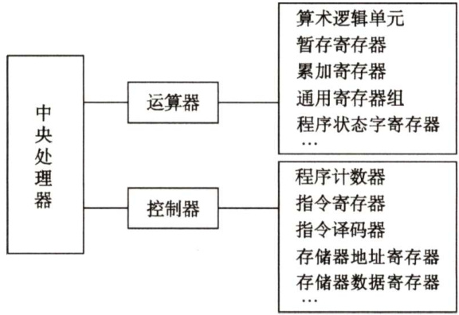

#### 5.1 CPU的功能和基本结构  

#### 5.1.1 CPU的功能  

中央处理器（CPU）由运算器和控制器组成。其中，控制器的功能是负责协调并控制计算机各部件执行程序的指令序列，包括取指令、分析指令和执行指令；运算器的功能是对数据进行加工。CPU的具体功能包括：  

1）指令控制。完成取指令、分析指令和执行指令的操作，即程序的顺序控制。  
2）操作控制。一条指令的功能往往由若干操作信号的组合来实现。CPU 管理并产生由内存取出的每条指令的操作信号，把各种操作信号送往相应的部件，从而控制这些部件按指令的要求进行动作。  
3）时间控制。对各种操作加以时间上的控制。时间控制要为每条指令按时间顺序提供应有的控制信号。  
4）数据加工。对数据进行算术和逻辑运算。  
5）中断处理。对计算机运行过程中出现的异常情况和特殊请求进行处理。  

#### 5.1.2 CPU的基本结构  

在计算机系统中，中央处理器主要由运算器和控制器两大部分组成，如图5.1所示。  

  
图5.1中央处理器的组成  

#### 1.运算器  

运算器接收从控制器送来的命令并执行相应的动作，对数据进行加工和处理。运算器是计算机对数据进行加工处理的中心，它主要由算术逻辑单元（ALU）、暂存寄存器、累加寄存器（ACC）、通用寄存器组、程序状态字寄存器（PSW）、移位器、计数器（CT）等组成。  

1）算术逻辑单元。主要功能是进行算术/逻辑运算。  
2）暂存寄存器。用于暂存从主存读来的数据，该数据不能存放在通用寄存器中，否则会破坏其原有内容。暂存寄存器对应用程序员是透明的。  
3）累加寄存器。它是一个通用寄存器，用于暂时存放ALU运算的结果信息，可以作为加法运算的一个输入端。  
4）通用寄存器组。如AX、BX、CX、DX、SP等，用于存放操作数（包括源操作数、目的操作数及中间结果）和各种地址信息等。SP是堆栈指针，用于指示栈顶的地址。  
5）程序状态字寄存器。保留由算术逻辑运算指令或测试指令的结果而建立的各种状态信息，如溢出标志（OF）、符号标志（SF）、零标志（ZF）、进位标志（CF）等。PSW中的这些位参与并决定微操作的形成。  
6）移位器。对操作数或运算结果进行移位运算。  
7）计数器。控制乘除运算的操作步数。  

#### 2.控制器  

控制器是整个系统的指挥中枢，在控制器的控制下，运算器、存储器和输入/输出设备等功能部件构成一个有机的整体，根据指令的要求指挥全机协调工作。控制器的基本功能是执行指  

令，每条指令的执行是由控制器发出的一组微操作实现的。  

控制器有硬布线控制器和微程序控制器两种类型（见5.4节）。  

控制器由程序计数器（PC）、指令寄存器（IR）、指令译码器、存储器地址寄存器(MAR)、存储器数据寄存器（MDR）、时序系统和微操作信号发生器等组成。  

1）程序计数器。用于指出下一条指令在主存中的存放地址。CPU 根据PC 的内容去主存中取指令。因程序中指令（通常）是顺序执行的，所以PC有自增功能。  

2）指令寄存器。用于保存当前正在执行的那条指令。  

3）指令译码器。仅对操作码字段进行译码，向控制器提供特定的操作信号。  

4）存储器地址寄存器。用于存放要访问的主存单元的地址。  

5）存储器数据寄存器。用于存放向主存写入的信息或从主存读出的信息。  

6）时序系统。用于产生各种时序信号，它们都由统一时钟（CLOCK）分频得到。  

7）微操作信号发生器。根据IR的内容（指令）、PSW的内容（状态信息）及时序信号，产生控制整个计算机系统所需的各种控制信号，其结构有组合逻辑型和存储逻辑型两种。  

控制器的工作原理是，根据指令操作码、指令的执行步骤（微命令序列）和条件信号来形成当前计算机各部件要用到的控制信号。计算机整机各硬件系统在这些控制信号的控制下协同运行，产生预期的执行结果。  

注意：CPU内部寄存器大致可分为两类：一类是用户可见的寄存器，可对这类寄存器编程，如通用寄存器组、程序状态字寄存器；另一类是用户不可见的寄存器，对用户是透明的，不可对这类寄存器编程，如存储器地址寄存器、存储器数据寄存器、指令寄存器。  

#### 5.1.3 本节习题精选  

#### 一、单项选择题  

01．下列部件不属于控制器的是（）。  

A．指令寄存器 B．程序计数器 C.程序状态字寄存器 D．时序电路  

02.通用寄存器是（）。  

A．可存放指令的寄存器  
B．可存放程序状态字的寄存器  
C．本身具有计数逻辑与移位逻辑的寄存器  
D.可编程指定多种功能的寄存器  

03.CPU中保存当前正在执行指令的寄存器是（）。  

A．指令寄存器 B.指令译码器 C．数据寄存器 D．地址寄存器  

04.在CPU中，跟踪后继指令地址的寄存器是（）。  

A．指令寄存器 B．程序计数器 C．地址寄存器 D.状态寄存器  

05．条件转移指令执行时所依据的条件来自（）。  

A.指令寄存器 B．标志寄存器 C．程序计数器 D.地址寄存器  

06．在所谓的 $n$ 位CPU中， $n$ 是指（）。  

A．地址总线线数B．数据总线线数 C．控制总线线数D.I/O线数  

07．在CPU的寄存器中，（）对用户是透明的。  

A．程序计数器 B．状态寄存器 C．指令寄存器 D.通用寄存器  

08.程序计数器（PC）属于（）。  

A．运算器 B．控制器 C.存储器 D.ALU  

09．下面有关程序计数器（PC）的叙述中，错误的是（）。  

A.PC中总是存放指令地址B.PC的值由CPU在执行指令过程中进行修改C.转移指令时，PC的值总是修改为转移指令的目标地址D.PC的位数一般和存储器地址寄存器（MAR）的位数一样  

10．在一条无条件跳转指令的指令周期内，PC的值被修改（）次。  

A.1 B.2 C.3 D．无法确定  

11．程序计数器的位数取决于（）。  

A．存储器的容量B．机器字长 C．指令字长 D.都不对  

12．指令寄存器的位数取决于（）。  

A．存储器的容量B．机器字长 C.指令字长 D.存储字长  

13.CPU中通用寄存器的位数取决于（）。  

A．存储器的容量B．指令的长度 C．机器字长 D.都不对  

14.CPU中的通用寄存器，（）。  

A．只能存放数据，不能存放地址  
B．可以存放数据和地址  
C．既不能存放数据，又不能存放地址  
D．可以存放数据和地址，还可以替代指令寄存器  

15．在计算机系统中表征程序和机器运行状态的部件是（）。  

A．程序计数器 B．累加寄存器 C．中断寄存器D．程序状态字寄存器  

16．状态寄存器用来存放（）。  

A．算术运算结果 B.逻辑运算结果 C.运算类型 D．算术、逻辑运算及测试指令的结果状态  

17．控制器的全部功能是（）。  

A．产生时序信号   
B.从主存中取出指令并完成指令操作码译码   
C．从主存中取出指令、分析指令并产生有关的操作控制信号   
D．都不对  

18．指令译码是指对（）进行译码。  

A．整条指令 B．指令的操作码字段C.指令的地址码字段 D．指令的地址  

19.CPU中不包括（）。  

A.存储器地址寄存器 B．指令寄存器C．地址译码器 D．程序计数器  

20．以下关于计算机系统的概念中，正确的是（）。  

I．CPU不包括地址译码器II. CPU的程序计数器中存放的是操作数地址III.CPU中决定指令执行顺序的是程序计数器IV.CPU的状态寄存器对用户是完全透明的  

A.I、IⅢI B.III、IV C.Ⅲ、IⅢ、IV D.I、II、IV  

21.间址周期结束时，CPU内寄存器MDR中的内容为（）。  

A.指令 B．操作数地址 C.操作数 D．无法确定  

22.【2010统考真题】下列寄存器中，汇编语言程序员可见的是（）。  

A.存储器地址寄存器（MAR） B．程序计数器（PC）C.存储器数据寄存器（MDR） D.指令寄存器（IR）  

23.【2016统考真题】某计算机的主存空间为4GB，字长为32位，按字节编址，采用32位字长指令字格式。若指令按字边界对齐存放，则程序计数器（PC）和指令寄存器（IR）的位数至少分别是（）。  

A.30、30 B.30、32 C.32、30 D.32、32  

#### 二、综合应用题  

01.CPU中有哪些专用寄存器？  

#### 5.1.4 答案与解析  

#### 一、单项选择题  

01.C  

控制器由程序计数器PC、指令寄存器IR、存储器地址寄存器MAR、存储器数据寄存器MDR、指令译码器、时序电路和微操作信号发生器组成。程序状态字（PSW）寄存器属于运算器的组成部分，PSW包括两个部分：一是状态标志，如进位标志C、结果为零标志Z等，大多数指令的执行将会影响到这些标志位；二是控制标志，如中断标志、陷阱标志等。  

02.D  

存放指令的寄存器是指令寄存器，因此选项A错。存放程序状态字的寄存器是程序状态字寄存器，因此选项B错。通用寄存器本身并不一定具有计数和移位逻辑功能，因此选项C错。  

#### 03.A  

指令寄存器用于存放当前正在执行的指令。  

04.B  

程序计数器用于存放下一条指令在主存中的地址，具有自增功能。  

05.B  

指令寄存器用于存放当前正在执行的指令；程序计数器用于存放下一条指令的地址；地址寄存器用于暂存指令或数据的地址；程序状态字寄存器用于保存系统的运行状态。条件转移指令执行时，需对标志寄存器的内容进行测试，判断是否满足转移条件。  

06.B  

数据总线的位数与处理器的位数相同，它表示CPU一次能处理的数据的位数，即CPU 的位数。  

07.C  

指令寄存器中存放当前执行的指令，不需要用户的任何干预，所以对用户是透明的。其他三种寄存器的内容可由程序员指定。  

08.B  

控制器是计算机中处理指令的部件，包含程序计数器。  

09.C  

PC中存放下一条要执行的指令的地址，因此选项A正确。PC的值会根据CPU在执行指令的过程中修改（确切地说是取指周期末)，或自增，或转移到程序的某处，因此选项B正确。转移指令时，需要判别转移是否成功，若成功则PC 修改为转移指令的目标地址，否则下一条指令的地址仍然为PC 自增后的地址，因此选项C错误。PC与MAR的位数一样，因此选项D正确。  

#### 10.B  

取指周期结束后，PC值自动加1；执行周期中，PC值修改为要跳转到的地址，因此在这个指令周期内，PC值被修改两次。  

#### 11.A  

程序计数器的内容为指令在主存中的地址，所以程序计数器的位数与存储器地址的位数相等，而存储器地址取决于存储器的容量，可知选项A正确。  

12.C指令寄存器中保存当前正在执行的指令，所以其位数取决于指令字长。  

13.C  

通用寄存器用于存放操作数和各种地址信息等，其位数与机器字长相等，因此便于操作控制。  

14.B  

通用寄存器供用户自由编程，可以存放数据和地址。而指令寄存器是专门用于存放指令的专用寄存器，不能由通用寄存器代替。  

#### 15.D  

程序状态字寄存器用于存放程序状态字，而程序状态字的各位表征程序和机器的运行状态，如含有进位标志C、结果为零标志Z等。  

16.D程序状态字寄存器用于保留算术、逻辑运算及测试指令的结果状态。  

17.C控制器的功能是取指令、分析指令和执行指令，并产生有关操作控制信号。  

18.B  

指令包括操作码字段和地址码字段，但指令译码器仅对操作码字段进行译码，借以确定指令的操作功能。  

19.C  

地址译码器是主存等存储器的组成部分，其作用是根据输入的地址码唯一选定一个存储单元，它不是CPU的组成部分。而MAR、IR、PC 都是CPU的组成部分。  

20.A  

地址译码器位于存储器，I正确；程序计数器中存放的是欲执行指令的地址，ⅡI 错误；程序计数器决定程序的执行顺序，III正确；程序状态字寄存器对用户不透明，IV错误。  

#### 21.B  

间址周期的作用是取操作数的有效地址，因此间址周期结束后，MDR中的内容为操作数地址。  

#### 22.B  

汇编语言程序员可见的是程序计数器（PC)，即汇编语言程序员通过汇编程序可以对某个寄存器进行访问。汇编程序员可以通过指定待执行指令的地址来设置PC 的值，如转移指令、子程序调用指令等。而IR、MAR、MDR是CPU的内部工作寄存器，对程序员不可见。  

#### 23.B  

解析请扫右侧二维码查阅。  

#### 二、综合应用题  

01．【解答】  

CPU中的专用寄存器有程序计数器（PC）、指令寄存器（IR）、存储器数据寄存器（MDR）、存储器地址寄存器（MAR）和程序状态字寄存器（PSW）。