#### 5.3 数据通路的功能和基本结构  

#### 5.3.1 数据通路的功能  

数据在功能部件之间传送的路径称为数据通路，包括数据通路上流经的部件，如ALU、通用寄存器、状态寄存器、异常和中断处理逻辑等。数据通路描述了信息从什么地方开始，中间经过哪个寄存器或多路开关，最后传送到哪个寄存器，这些都需要加以控制。  

数据通路由控制部件控制，控制部件根据每条指令功能的不同生成对数据通路的控制信号。数据通路的功能是实现CPU内部的运算器与寄存器及寄存器之间的数据交换。  

#### 5.3.2 数据通路的基本结构  

数据通路的基本结构主要有以下几种：  

1）CPU内部单总线方式。将所有寄存器的输入端和输出端都连接到一条公共通路上，这种结构比较简单，但数据传输存在较多的冲突现象，性能较低。连接各部件的总线只有一条时，称为单总线结构；CPU中有两条或更多的总线时，构成双总线结构或多总线结构。图5.7所示为CPU内部总线的数据通路和控制信号。  

2）CPU内部三总线方式。将所有寄存器的输入端和输出端都连接到多条公共通路上，相比之下单总线中一个时钟内只允许传一个数据，因而指令执行效率很低，因此采用多总线方式，同时在多个总线上传送不同的数据，提高效率。  

3）专用数据通路方式。根据指令执行过程中的数据和地址的流动方向安排连接线路，避免使用共享的总线，性能较高，但硬件量大。  

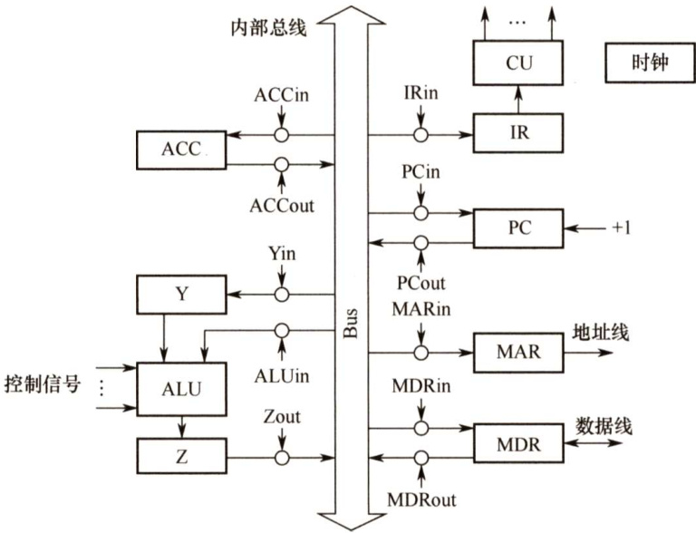  
图5.7CPU内部总线的数据通路和控制信号  

在图5.7中，规定各部件用大写字母表示，字母加“in”表示该部件的允许输入控制信号；字母加“out”表示该部件的允许输出控制信号。  

注意：内部总线是指同一部件，如CPU内部连接各寄存器及运算部件之间的总线；系统总线是指同一台计算机系统的各部件，如CPU、内存、通道和各类I/O接口间互相连接的总线。  

#### 1.寄存器之间的数据传送  

寄存器之间的数据传送可通过CPU 内部总线完成。在图5.7中，某寄存器AX 的输出和输入分别由AXout和AXin控制。这里以PC寄存器为例，把PC内容送至MAR，实现传送操作的流程及控制信号为  

PC→Bus PCout有效，PC内容送总线Bus→MAR MARin有效，总线内容送MAR  

#### 2.主存与CPU之间的数据传送  

主存与CPU之间的数据传送也要借助CPU内部总线完成。现以CPU从主存读取指令为例说明数据在数据通路中的传送过程。实现传送操作的流程及控制信号为  

PC→Bus→MAR PCout和MARin有效，现行指令地址→MAR  
$1\to\mathbb{R}$ CU发读命令  
MEM(MAR)→MDR MDRin有效  
MDR→Bus→IR MDRout和IRin有效，现行指令→IR  

#### 3.执行算术或逻辑运算  

执行算术或逻辑操作时，由于ALU本身是没有内部存储功能的组合电路，因此如要执行加法运算，相加的两个数必须在ALU 的两个输入端同时有效。图5.7中的暂存器丫即用于该目的。先将一个操作数经CPU内部总线送入暂存器Y保存，Y的内容在ALU的左输入端始终有效，再将另一个操作数经总线直接送到ALU的右输入端。这样两个操作数都送入了ALU，运算结果暂存在暂存器Z中。  

Ad(IR) $\rightarrow$ Bus→MAR MDRout和MARin有效  
$1{\rightarrow}\mathsf{R}$ CU发读命令  
MEM $\rightarrow$ 数据线 $\rightarrow$ MDR 操作数从存储器 $\rightarrow$ 数据线 $\rightarrow$ MDR  
MDR $\rightarrow$ Bus→Y MDRout和Yin有效，操作数 $\mathrm{\Gamma\toY}$   
$(\mathbf{ACC})+(\mathbf{Y}){\rightarrow}Z$ ACCout和ALUin有效，CU向ALU发加命令，结果→Z  
$Z{\rightarrow}\mathrm{ACC}$ Zout和ACCin有效，结果 $\rightarrow$ ACC  

数据通路结构直接影响CPU内各种信息的传送路径，数据通路不同，指令执行过程的微操作序列的安排也不同，它关系着微操作信号形成部件的设计。  

#### 5.3.3 本节习题精选  

#### 一、单项选择题  

01.下列不属于CPU数据通路结构的是（）。  

A.单总线结构 B.多总线结构 C．部件内总线结构 D.专用数据通路结构  

02.在单总线的CPU中，（）。  

A.ALU的两个输入端及输出端都可与总线相连B.ALU的两个输入端可与总线相连，但输出端需通过暂存器与总线相连C.ALU的一个输入端可与总线相连，其输出端也可与总线相连D.ALU只能有一个输入端可与总线相连，另一输入端需通过暂存器与总线相连  

03．采用CPU内部总线的数据通路与不采用CPU内部总线的数据通路相比，（）。  

A．前者性能较高 B.后者的数据冲突问题较严重C．前者的硬件量大，实现难度高 D．以上说法都不对  

04.CPU的读/写控制信号的作用是（）。  

A.决定数据总线上的数据流方向 B.控制存储器操作的读/写类型C.控制流入、流出存储器信息的方向 D.以上都是  

05.【2016统考真题】单周期处理器中所有指令的指令周期为一个时钟周期。下列关于单周期处理器的叙述中，错误的是（）。  

A.可以采用单总线结构数据通路  
B．处理器时钟频率较低  
C．在指令执行过程中控制信号不变  
D.每条指令的CPI为1  

06.【2021统考真题】下列关于数据通路的叙述中，错误的是（）。  

A．数据通路包含ALU等组合逻辑（操作）元件B．数据通路包含寄存器等时序逻辑（状态）元件C．数据通路不包含用于异常事件检测及响应的电路D．数据通路中的数据流动路径由控制信号进行控制  

#### 二、综合应用题  

01.【2009统考真题】某计算机字长16位，采用16位定长指令字结构，部分数据通路结构如下图所示。图中所有控制信号为1时表示有效，为0时表示无效。例如，控制信号MDRinE为1表示允许数据从DB打入MDR，MDRin为1表示允许数据从总线打入MDR。假设MAR的输出一直处于使能状态。加法指令“ADD(R1), $\mathbf{R}0^{\dag}$ 的功能为 $(\mathbb{R}0^{\mathrm{~\#~}_{+}}$ ((R1)) $\mid\rightarrow$ (R1)，即将R0中的数据与R1的内容所指主存单元的数据相加，并将结果送入R1的内容所指主存单元中保存。  

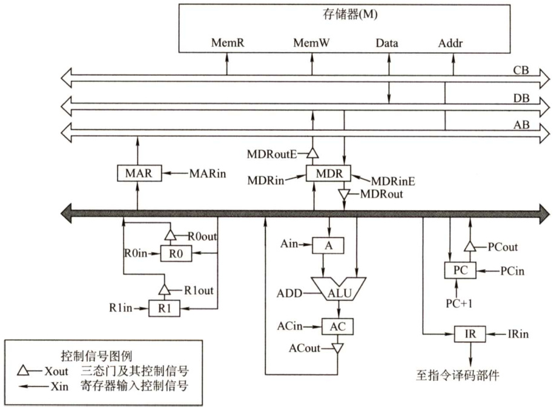  

下表给出了上述指令取指和译码阶段每个节拍（时钟周期）的功能和有效控制信号，请按表中描述方式用表格列出指令执行阶段每个节拍的功能和有效控制信号。  

<html><body><table><tr><td>时钟</td><td>功能</td><td>有效控制信号</td></tr><tr><td>C1</td><td>MAR←(PC)</td><td>PCout, MARin</td></tr><tr><td>C2</td><td>MDR+M(MAR) PC←(PC)+1</td><td>MemR,MDRinE,PC+1</td></tr><tr><td>C3</td><td>IR←(MDR)</td><td>MDRout,IRin</td></tr><tr><td>C4</td><td>指令译码</td><td>无</td></tr></table></body></html>  

02．某计算机的数据通路结构如下图所示，写出实现ADDR1，(R2)的微操作序列（）取指令及确定后继指令地址)。  

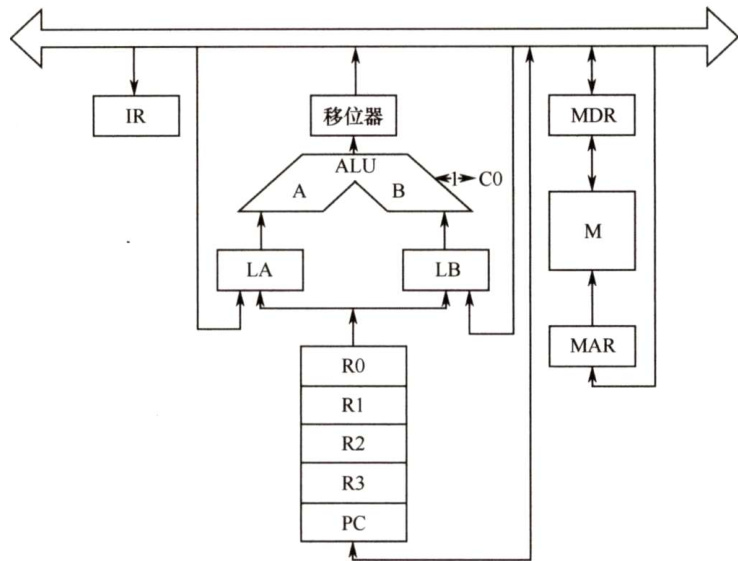  

03．设CPU内部结构如下图所示，此外还设有B、C、D、E、H、L六个寄存器（图中未画出），它们各自的输入端和输出端都与内部总线相通，并分别受控制信号控制（如Bin受寄存器B的输入控制；Bout受寄存器B的输出控制），假设ALU的结果直接送入Z寄存器。要求从取指令开始，写出完成下列指令的微操作序列及所需的控制信号。  

ADD B,C $\mathbf{\Delta}(\mathbf{B})+\mathbf{\Delta}(\mathbf{C}){\rightarrow}\mathbf{B}$ SUB ACC,H (ACC)-(H)→ACC  

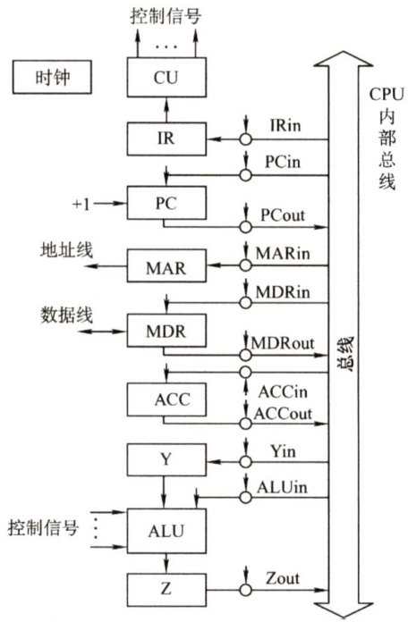  

04.设有如下图所示的单总线结构，分析指令ADD(R0),R1的指令流程和控制信号。  

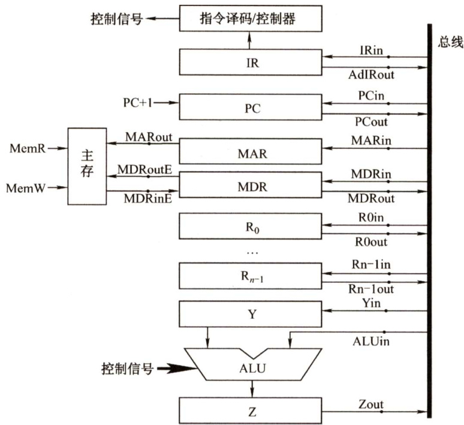  

05.下图是一个简化的CPU与主存连接结构示意图（图中省略了所有的多路选择器）。其中有一个累加寄存器（ACC）、一个状态数据寄存器和其他4个寄存器：主存地址寄存器（MAR）主存数据寄存器（MDR）、程序寄存器（PC）和指令寄存器（IR），各部件及其之间的连线表示数据通路，箭头表示信息传递方向。  

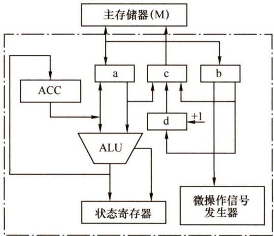  

要求：  

1）请写出图中a、b、c、d四个寄存器的名称。  
2）简述图中取指令的数据通路。  
3）简述数据在运算器和主存之间进行存/取访问的数据通路（假设地址已在MAR中）。  
4）简述完成指令LDAX的数据通路（X为主存地址，LDA的功能为 $(\mathrm{X}){\rightarrow}\mathrm{ACC}$ )。  
5）简述完成指令ADDY的数据通路（Y为主存地址，ADD的功能为 $(\mathrm{ACC})+(\mathrm{Y})\rightarrow$ ）  
CC)。  
6）简述完成指令STAZ的数据通路（Z为主存地址，STA的功能为 $(\mathbf{ACC}){\rightarrow}Z$ ）  

06．某机主要功能部件如下图所示，其中M为主存，MDR为主存数据寄存器，MAR 为主存地址寄存器，IR为指令寄存器，PC为程序计数器（并假设当前指令地址在PC中），R0～R3为通用寄存器，C、D为暂存器。  

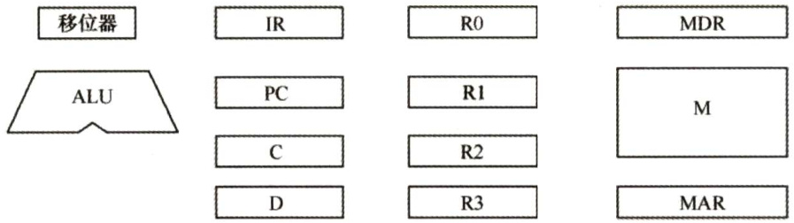  

1）请补充各部件之间的主要连接线（总线自己画），并注明数据流动方向。  
2）画出“ADD(R1),(R2) $+^{,,,}$ 指令周期流程图“该指令的含义是进行求和运算，源操作数地址在R1中，目标操作数寻址方式为自增型寄存器间接寻址方式（先取地址后加1)，并将相加结果写回R2寄存器。  

07．已知单总线计算机结构如下图所示，其中M为主存，XR为变址寄存器，EAR为有效地址寄存器，LATCH为暂存器。假设指令地址已存在于PC中，请给出ADDX,D指令周期信息流程和相应的控制信号。说明：  

1）ADDX，D指令字中，X为变址寄存器XR，D为形式地址。  
2）寄存器的输入/输出均采用控制信号控制，如 $\mathrm{PC_{i}}$ 表示PC 的输入控制信号， $\mathbf{MDR}_{\circ}$ 表示MDR的输出控制信号。  
3）凡需要经过总线的传送，都需要注明，如(PC)→MAR，相应的控制信号为 $\mathrm{PC}_{\mathrm{o}}$ 和MARi。  

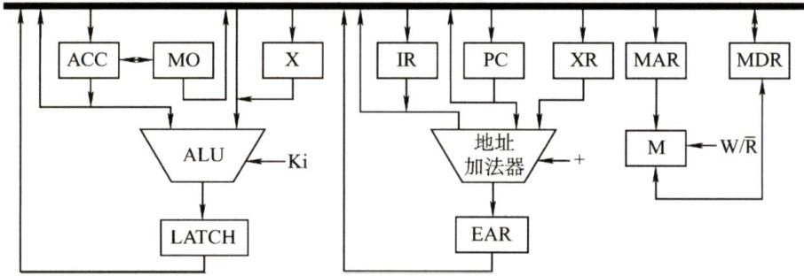  

08.【2015统考真题】某16位计算机的主存按字节编码，存取单位为16位；采用16位定长指令字格式；CPU采用单总线结构，主要部分如下图所示。图中R0～R3为通用寄存器；T为暂存器；SR为移位寄存器，可实现直送（mov）、左移一位（left）和右移一位（right）三种操作，控制信号为SRop，SR的输出由信号SRout控制；ALU可实现直送A（mova）、A加B（add）、A减B（sub）、A与B（and）、A或B（or）、非A（not）、A加1（inc）七种操作，控制信号为ALUop。  

回答下列问题：  

1）图中哪些寄存器是程序员可见的？为何要设置暂存器T？  
2）控制信号ALUop和SRop的位数至少各是多少？  
3）控制信号SRout所控制部件的名称或作用是什么？  
4）端点 $\textcircled{1}\sim\textcircled{9}$ 中，哪些端点须连接到控制部件的输出端？  
5）为完善单总线数据通路，需要在端点 $\textcircled{1}\sim\textcircled{9}$ 中相应的端点之间添加必要的连线。写  
出连线的起点和终点，以正确表示数据的流动方向。  
6）为什么二路选择器MUX的一个输入端是2?  

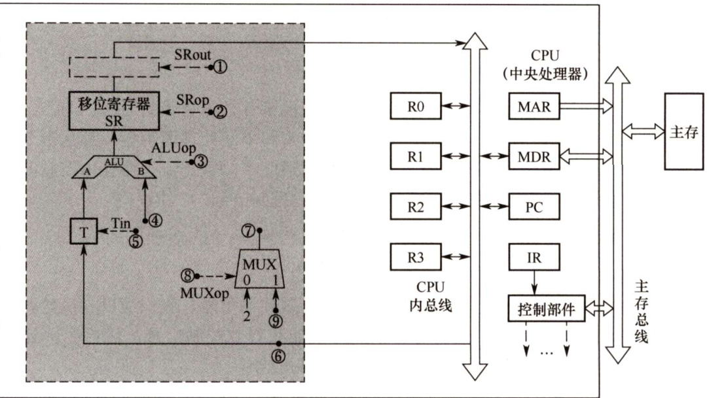  

#### 5.3.4 答案与解析  

#### 一、单项选择题  

01.C  

对 CPU而言，数据通路的基本结构分为总线结构和专用数据通路结构，其中总线结构又分为单总线结构、双总线结构、多总线结构。  

#### 02.D  

由于ALU是一个组合逻辑电路，因此其运算过程中必须保持两个输入端的内容不变。又由于 CPU内部采用单总线结构，因此为了得到两个不同的操作数，ALU的一个输入端与总线相连，另一个输入端需通过一个寄存器与总线相连。此外，ALU的输出端也不能直接与内部总线相连，否则其输出又会通过总线反馈到输入端，影响运算结果，因此输出端需通过一个暂存器（用来暂存结果的寄存器）与总线相连。  

03.D  

采用CPU内部总线方式的数据通路的特点：结构简单，实现容易，性能较低，存在较多的冲突现象；不采用CPU内部总线方式的数据通路的特点：结构复杂，硬件量大，不易实现，性能高，基本不存在数据冲突现象。  

#### 04.D  

读/写控制信号线决定了是从存储器读还是向存储器写，显然A、B、C选项都正确。  

05.A  

单周期处理器是指所有指令的指令周期为一个时钟周期的处理器，D正确。因为每条指令的 CPI为1，要考虑比较慢的指令，所以处理器的时钟频率较低，B正确。单总线数据通路将所有寄存器的输入输出端都连接在一条公共通路上，一个时钟内只允许一次操作，无法完成指令的所有操作，A错误。控制信号是CU根据指令操作码发出的信号，对于单周期处理器来说，每条指令的执行只有一个时钟周期，而在一个时钟周期内控制信号并不会变化；若是多周期处理  

器，则指令的执行需要多个时钟周期，在每个时钟周期控制器会发出不同信号，C正确。  

06.C  

指令执行过程中数据所经过的路径，包括路径上的部件，称为数据通路。ALU、通用寄存器、状态寄存器、Cache、MMU、浮点运算逻辑、异常和中断处理逻辑等，都是指令执行过程中数据流经的部件，都属于数据通路的一部分。数据通路中的数据流动路径由控制部件控制，控制部件根据每条指令功能的不同，生成对数据通路的控制信号。C错误。  

#### 二、综合应用题  

01.【解答】  

题干已给出取值和译码阶段每个节拍的功能和有效控制信号，我们应以弄清楚取指阶段中数据通路的信息流动为突破口，读懂每个节拍的功能和有效控制信号，然后应用到解题思路中，包括划分执行步骤、确定完成的功能、需要的控制信号。  

先分析题干中提供的示例（本部分解题时不做要求）：  

取指令的功能是根据PC 的内容所指的主存地址，取出指令代码，经过MDR，最终送至IR。这部分和后面的指令执行阶段的取操作数、存运算结果的方法是相通的。  

C1:(PC) $\rightarrow$ MAR  
在读写存储器前，必须先将地址（这里为(PC)）送至MAR。C2: $\mathbf{M}(\mathbf{MAR}){\rightarrow}\mathbf{MDR},(\mathbf{PC})+1{\rightarrow}\mathbf{PC}$   
读写的数据必须经过MDR，指令取出后PC自增1。  
C3： $(\mathbf{MDR}){\rightarrow}\mathbf{IR}$   
然后将读到的MDR中的指令代码送至IR进行后续操作。  

指令“ADD(R1)， ${\bf R}0^{\prime\prime}$ 的操作数一个在“存中，一个在寄存器中，运算结果在主存中。根据指令功能，要读出 R1 的内容所指的主存单元，必须先将 R1 的内容送至 MAR，即 $(\mathbb{R}1)\to$ MAR。而读出的数据必须经过MDR，即 $\mathbf{M}(\mathbf{MAR}){\rightarrow}\mathbf{MDR}.$ 。  

因此，将R1的内容所指的主存单元的数据读出到MDR的节拍安排如下：  

C5:(R1) $\mid\rightarrow$ MAR  
C6: $\mathbf{M}(\mathbf{MAR}){\rightarrow}\mathbf{MDR}$   
ALU一端是寄存器A，MDR或R0中必须有一个先写入A中，如MDR。  
C7： $(\mathrm{MDR}){\rightarrow}\mathbf{A}$   
然后执行加法操作，并将结果送入寄存器AC。  
C8： $(\mathbf{A})+(\mathbf{R}0){\rightarrow}\mathbf{A}\mathbf{C}$   
之后将加法结果写回到R1的内容所指的主存单元，注意MAR中的内容没有改变。C9： $(\mathbf{AC}){\rightarrow}\mathbf{MDR}$   
C10: $(\mathbf{MDR}){\rightarrow}\mathbf{M}(\mathbf{MAR})$  

有效控制信号的安排并不难，只需看数据是流入还是流出，如流入寄存器X就是Xin，流出寄存器X就是Xout。还需注意其他特殊控制信号，如 $\mathrm{PC}+1$ 、Add等。  

于是得到参考答案如下表所示。  

<html><body><table><tr><td>时钟</td><td>功能</td><td>有效控制信号</td></tr><tr><td>C5</td><td>MAR←(R1)</td><td>Rlout,MARin</td></tr><tr><td>C6</td><td>MDR-M(MAR)</td><td>MemR,MDRinE</td></tr></table></body></html>  

（续表）  

<html><body><table><tr><td>时 钟</td><td>功能</td><td>有效控制信号</td></tr><tr><td>C7</td><td>A(MDR)</td><td>MDRout, Ain</td></tr><tr><td>C8</td><td>AC←(A)+(R0)</td><td>ROout, Add, ACin</td></tr><tr><td>C9</td><td>MDR(AC)</td><td>ACout,MDRin</td></tr><tr><td>C10</td><td>M(MAR)(MDR)</td><td>MDRoutE,MemW</td></tr></table></body></html>  

本题答案不唯一，若在C6执行 $\mathbf{M}(\mathbf{MAR}){\rightarrow}\mathbf{MDR}$ 的同时，完成 $(\mathbf{R}0){\rightarrow}\mathbf{A}$ (即选择将(RO)写入A)，并不会发生总线冲突，这种方案可节省1个节拍，见下表。  

<html><body><table><tr><td>时钟</td><td>功 能</td><td>有效控制信号</td></tr><tr><td>C5</td><td>MAR+(R1)</td><td>Rlout, MARin</td></tr><tr><td>C6</td><td>MDR+M(MAR)，A(R0)</td><td>MemR,MDRinE,ROout,Ain</td></tr><tr><td>C7</td><td>AC←(MDR)+(A)</td><td>MDRout, Add,ACin</td></tr><tr><td>C8</td><td>MDR-(AC)</td><td>ACout,MDRin</td></tr><tr><td>C9</td><td>M(MAR)→(MDR)</td><td>MDRoutE,MemW</td></tr></table></body></html>  

02.【解答】  

实现ADDR1,(R2)的微操作序列如下：  

微操作 控制信号  
$({\mathrm{PC}}){\rightarrow}{\mathrm{MAR}}$ $\mathrm{PC}\to$ BUS,BUS $\rightarrow$ MAR  
$\mathbf{M}{\rightarrow}\mathbf{MDR}$ READ  
C $\mathrm{PC})+1\mathrm{\rightarrowPC}$ $+1$   
MDR→IR MDR $\rightleftharpoons$ BUS,BUS $\rightarrow$ IR  
$\mathrm{\bfR}1{\rightarrow}\mathrm{\bfLA}$ $\scriptstyle{\mathrm{\mathrm{R1}}}\to$ LA  
$(\mathbf{R}2){\rightarrow}\mathbf{M}\mathbf{A}\mathbf{R}$ $^{\mathbf{R}2\rightarrow}$ BUS,BUS $\rightarrow$ MAR  
$\mathbf{M}{\rightarrow}\mathbf{MDR}$ READ  
MDR→LB MDR $\rightrightarrows$ BUS,BUS $\rightarrow$ LB  
$(\mathrm{LA})+(\mathrm{LB}){\rightarrow}\mathrm{R}1$ $^+$ ，移位器 $\rightarrow$ BUS，BUS $\rightarrow$ R1  

03.【解答】  

两条指令的微操作序列如下。  

（1）ADDB,C指令。  
微操作 控制信号  
$({\mathrm{PC}}){\rightarrow}{\mathrm{MAR}}$ PCout, MARin$(\mathrm{PC})+1{\rightarrow}\mathrm{PC}$ $+1$   
$\mathbf{M}(\mathbf{MAR}){\rightarrow}\mathbf{MDR}{\rightarrow}\mathbf{IR}$ MDRout, IRin$\mathbf{B}{\rightarrow}\mathbf{Y}$ Bout, Yin  
$(\Upsilon)+(\mathbf{C}){\rightarrow}Z$ Cout, ALUin,“ $^+$ ；$(Z)\to\mathbf{B}$ Zout, Bin  
（2）SUBACC,H指令。  
微操作 控制信号  

(PC)→MAR PCout, MARin (PC)+1→PC +1 M(MAR)→MDR→IR MDRout, IRin $\scriptstyle\mathbf{ACC}\to\mathbf{Y}$ ACCout, Yin $(\mathrm{Y})\mathrm{-}\left(\mathrm{H}\right){\rightarrow}\mathrm{Z}$ Hout, ALUin，“_” $(Z){\rightarrow}\mathbf{ACC}$ Zout, ACCin  

注：Y是与ALU的一个输入端相连接的暂存器。  

04.【解答】  

指令ADD(R0),R1的功能是把R0的内容作为地址送到主存中取得一个操作数，再与R1中的内容相加，最后将结果送回主存，即实现 $((\mathbf{R}0))+(\mathbf{R}1){\rightarrow}(\mathbf{R}0)$ 。其流程和控制信号如下。  

1）取指周期：公共操作。  

<html><body><table><tr><td>时 序</td><td>微操作</td><td>有效控制信号</td><td>具体功能</td></tr><tr><td>1</td><td>(PC)→MAR,Read</td><td>PCout, MARin</td><td>将PC经内部总线送至MAR</td></tr><tr><td>2</td><td>M(MAR)→MDR</td><td>MemR,MARout,MDRinE</td><td>主存通过数据总线将MAR所指的单元的内容送至MDR</td></tr><tr><td>3</td><td>(MDR)→IR</td><td>MDRout, IRin</td><td>将MDR的内容送至IR</td></tr><tr><td>4</td><td>指令译码</td><td>一</td><td>操作字开始控制CU</td></tr><tr><td>5</td><td>(PC)+1→PC</td><td>一</td><td>当PC+1有效时，使PC内容加1</td></tr></table></body></html>  

2）间址周期：完成取数操作，被加数在主存中，加数已经放在寄存器R1中。  

<html><body><table><tr><td>时 序</td><td>微操作</td><td>有效控制信号</td><td>具体功能</td></tr><tr><td>1</td><td>(RO)→MAR</td><td>ROout, MARin</td><td>将R0中的地址（形式地址）送至存储器地址寄存器</td></tr><tr><td>2</td><td>M(MAR)→MDR</td><td>MemR,MARout,MDRinE</td><td>主存通过数据总线将MAR所指单元的内容（有效地址） 送至MDR中</td></tr><tr><td>3</td><td>(MDR)→Y</td><td>MDRout, Yin</td><td>将MDR中数据通过数据总线送至Y</td></tr></table></body></html>  

3）执行周期：完成加法运算，并将结果返回主存。  

<html><body><table><tr><td>时 序</td><td>微操作</td><td>有效控制信号</td><td>具体功能</td></tr><tr><td>1</td><td>(R1)+(Y)→Z</td><td>Rlout,ALUin，CU向ALU 发ADD控制信号</td><td>R1的内容和Y的内容相加，结果送至寄存器Z</td></tr><tr><td>2</td><td>(Z)→MDR</td><td>Zout, MDRin</td><td>将运算结果送至MDR</td></tr><tr><td>3</td><td>(MDR)→M(MAR)</td><td>MemW,MDRoutE, MARout</td><td>向主存写入数据</td></tr></table></body></html>  

05.【解答】  

1）b单向连接微控制器，由微控制器的作用可以推出b是IR；a和c直接连接主存，只可能是MDR和MAR，c到主存是单向连接，a和主存双向连接，根据指令执行的特点，MAR只单向给主存传送地址，而MDR既存放从主存中取出的数据，又存放将要写入主存的数据，因此c为 MAR，a 为 MDR。d 具有自动加1 的功能，且单向连接MAR，为PC。因此，a为MDR，b为IR，c为MAR，d为PC。  

2）将指令地址从PC 送入MAR，在相关的控制下从主存中取出指令送至 MDR，然后将MDR中的指令送至IR，最后流向微控制器。取指令的数据通路为  

3）根据MAR中的地址去主存取数据，将取出的数据送至MDR，然后将MDR中的数据送至ALU进行运算，运算的结果送至ACC。存储器读的数据通路为  

将 ACC 中的结果送至MDR，再将MDR中的数据写入主存。存储器写的数据通路为  

4）指令LDAX的数据通路为  

5）指令ADDY的数据通路为  

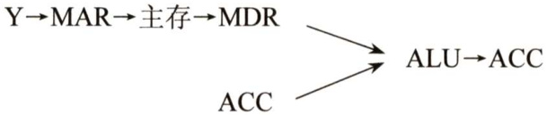  

6）指令STAZ的数据通路为（ACC中的数据需放在主存中）  

06.【解答】  

1）各功能部件的连接关系，以及数据通路如下图所示。  

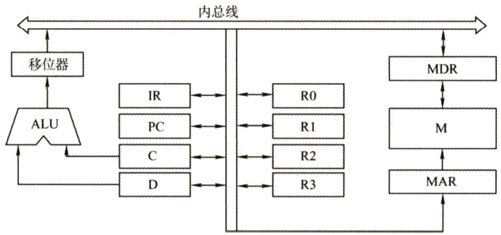  

2）分析过程如下：  

·取指令地址送到IR并译码。  
·取源操作数和目的操作数。  
·将源操作数和目的操作数相加送到MAR，随之送到以前目的操作数所在内存的地址。  
·将寄存器R2的内容加1。  

取指周期流程如下图所示。  

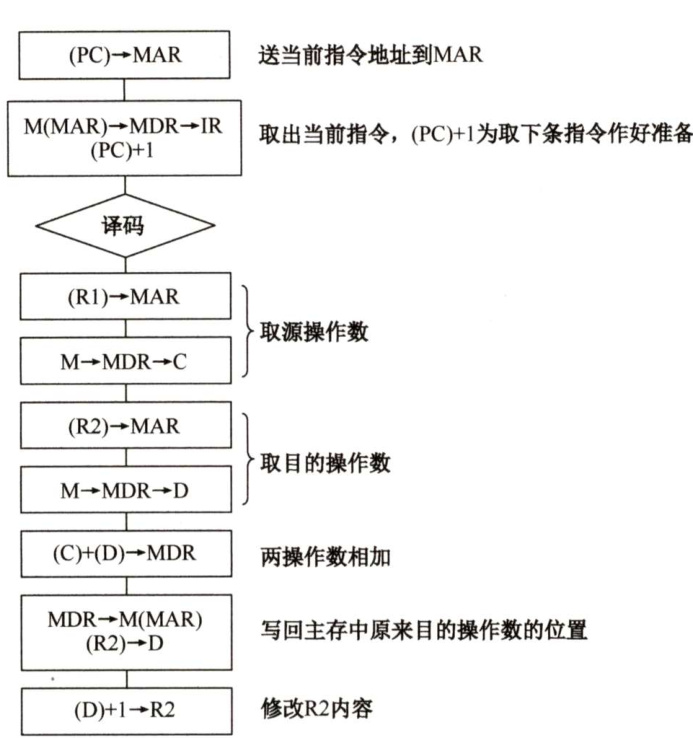  

07.【解答】  

ADDX，D指令周期信息流程和相应的控制信号见下表。  

<html><body><table><tr><td>周期</td><td>微操作</td><td>有效控制信号</td></tr><tr><td rowspan="3">取指周期</td><td>(PC)→MAR</td><td>PCo,MAR;</td></tr><tr><td>M(MAR)→MDR (PC)+1→PC</td><td>MAR,R/W,MDR +1</td></tr><tr><td>(MDR)→IR</td><td>MDRo,IR</td></tr><tr><td rowspan="6">执行周期</td><td>(XR)+Ad(IR)→EAR</td><td>XR,IR,+,EAR</td></tr><tr><td>(EAR)→MAR</td><td>EAR,MAR;</td></tr><tr><td>M(MAR)→MDR</td><td>MAR,R/W,MDR</td></tr><tr><td>(MDR)→X</td><td>MDR,X</td></tr><tr><td>(ACC)+(X)→LATCH</td><td>ACCo,X,K=+,LATCH</td></tr><tr><td>(LATCH)→ACC</td><td>LATCH, ACC;</td></tr></table></body></html>

注：题目中的D即为 $\operatorname{Ad}(\operatorname{IR})$ 。  

08.【解答】  

1）程序员可见寄存器为通用寄存器（ ${\bf R}0\sim{\bf R}3$ ）和PC。因为采用了单总线结构，因此若无暂存器T，则ALU的A、B端口会同时获得两个相同的数据，使数据通路不能正常工作。  

2）ALU共有7种操作，其操作控制信号ALUop至少需要3位；移位寄存器有3种操作，其操作控制信号SRop至少需要2位。  

3）信号SRout所控制的部件是一个三态门，用于控制移位器与总线之间数据通路的连接与断开。  

4）端口 $\textcircled{1}$ ， $\textcircled{2}$ ， $\textcircled{3}$ ， $\textcircled{5}$ ， $\textcircled{8}$ 须连接到控制部件输出端。  
5）连线1， $\textcircled{6}\rightarrow\textcircled{9}$ ；连线2， $\textcircled{7}\rightarrow\textcircled{4}$ 0  
6）因为每条指令的长度为16 位，按字节编址，所以每条指令占用2个内存单元，顺序执行时，下条指令地址为 $(\mathrm{PC})+2$ 。MUX的一个输入端为2，可便于执行 $(\mathrm{PC})+2$ 操作。