#### 5.6 指令流水线  

前面介绍的指令都是在单周期处理机中采用串行方法执行的，同一时刻CPU中只有一条指令在执行，因此各功能部件的使用率不高。现代计算机普遍采用指令流水线技术，同一时刻有多条指令在CPU的不同功能部件中并发执行，大大提高了功能部件的并行性和程序的执行效率。  

#### 5.6.1 指令流水线的基本概念  

可从两方面提高处理机的并行性： $\textcircled{1}$ 时间上的并行技术，将一个任务分解为几个不同的子阶段，每个阶段在不同的功能部件上并行执行，以便在同一时刻能够同时执行多个任务，进而  

提升系统性能，这种方法被称为流水线技术。 $\textcircled{2}$ 空间上的并行技术，在一个处理机内设置多个执行相同任务的功能部件，并让这些功能部件并行工作，这样的处理机被称为超标量处理机。  

#### 1．指令流水的定义  

一条指令的执行过程可分解为若干阶段，每个阶段由相应的功能部件完成。如果将各阶段视为相应的流水段，则指令的执行过程就构成了一条指令流水线。  

假设一条指令的执行过程分为如下5个阶段（也称功能段或流水段）：  

）取指（IF）：从指令存储器或Cache中取指令。译码/读寄存器（ID)：操作控制器对指令进行译码，同时从寄存器堆中取操作数。执行/计算地址（EX)：执行运算操作或计算地址。访存（MEM)：对存储器进行读写操作。  
·写回（WB)：将指令执行结果写回寄存器堆。  

把 $k+1$ 条指令的取指阶段提前到第 $k$ 条指令的译码阶段，从而将第 $k+1$ 条指令的译码阶段与第 $k$ 条指令的执行阶段同时进行，如图5.16所示。  

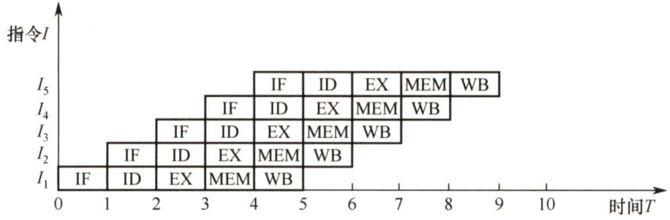  
图5.16一个5段指令流水线  

从图 5.16 看出，理想情况下，每个时钟周期都有一条指令进入流水线，每个时钟周期都有一条指令完成，每条指令的时钟周期数（即CPI）都为1。  

流水线设计的原则是，指令流水段个数以最复杂指令所用的功能段个数为准；流水段的长度以最复杂的操作所花的时间为准。假设某条指令的5个阶段所花的时间分别如下。 $\textcircled{1}$ 取指：$200\mathrm{ps}$ ； $\textcircled{2}$ 译码： $100\mathrm{ps}$ .， $\textcircled{3}$ 执行： $150\mathrm{ps}$ .， $\textcircled{4}$ 访存： $200\mathrm{ps}$ ； $\textcircled{5}$ 写回： $100\mathrm{ps}$ ，该指令的总执行时间为 $750\mathrm{ps}$ 。按照流水线设计原则，每个流水段的长度为 $200\mathrm{ps}$ ，所以每条指令的执行时间为lns，反而比串行执行时增加了 $250\mathrm{ps}$ 。假设某程序中有 $N$ 条指令，单周期处理机所用的时间为$N\times750\mathrm{ns}$ ，而流水线处理机所用的时间为 $(N+4){\times}200\mathrm{ns}$ 。由此可见，流水线方式并不能缩短单条指令的执行时间，但对于整个程序来说，执行效率得到了大幅增高。  

为了利于实现指令流水线，指令集应具有如下特征：  

1）指令长度应尽量一致，有利于简化取指令和指令译码操作。否则，取指令所花时间长短不一，使取指部件极其复杂，且也不利于指令译码。  
2）指令格式应尽量规整，尽量保证源寄存器的位置相同，有利于在指令未知时就可取寄存器操作数，否则须译码后才能确定指令中各寄存器编号的位置。  
3）采用Load/Store指令，其他指令都不能访问存储器，这样可把Load/Store指令的地址计算和运算指令的执行步骤规整在同一个周期中，有利于减少操作步骤。  
4）数据和指令在存储器中“对齐”存放。这样，有利于减少访存次数，使所需数据在一个流水段内就能从存储器中得到。  

#### 2.流水线的表示方法  

通常用时空图来直观地描述流水线的执行情况，如图5.17所示。  

在时空图中，横坐标表示时间，它被分割成长度相等的时间段 $T$ ；纵坐标为空间，表示当前指令所处的功能部件。在图5.17中，第一条指令 $\mathrm{I}_{1}$ 在时刻0进入流水线，在时刻5T流出流水线。第二条指令 $\mathrm{I}_{2}$ 在时刻 $T$ 进入流水线，在时刻 $6T$ 流出流水线。以此类推，每隔一个时间 $T$ 就有一条指令进入流水线，从时刻5T开始每隔一个时间 $T$ 就有一条指令流出流水线。  

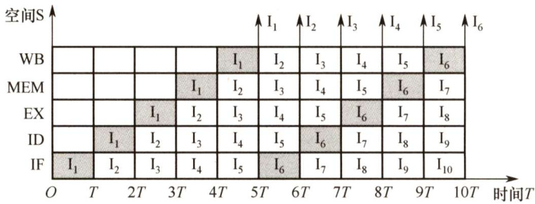  
图5.17一个5段指令流水线时空图  

从图中可看出，在时刻 $10T$ 时，流水线上便有6条指令流出。若采用串行方式执行，在时刻 $10T$ 时，只能执行2条指令，可见使用流水线方式成倍地提高了计算机的速度。  

只有大量连续任务不断输入流水线，才能充分发挥流水线的性能，而指令的执行正好是连续不断的，非常适合采用流水线技术。对于其他部件级流水线，如浮点运算流水线，同样也仅适合于提升浮点运算密集型应用的性能，对于单个运算是无法提升性能的。  

#### 5.6.2 流水线的基本实现  

在单周期实现中，这5个功能段是串连在一起的，如图5.18所示。将程序计数器（PC）的值送入IF 段取指令，然后依次进入ID、EX、MEM、WB段。虽然不是所有指令都必须经历完整的5个阶段，但只能以执行速度最慢的指令作为设计其时钟周期的依据，单周期CPU的时钟频率取决于数据通路中的关键路径（最长路径)，因此单周期CPU指令执行效率不佳。  

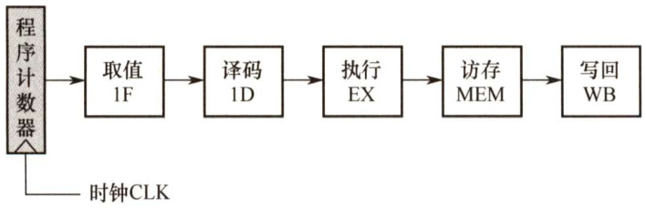  
图5.18单周期处理机的逻辑构架图  

#### 1.流水线的数据通路  

一个5段流水线数据通路如图5.19所示。其中，IF 段包括程序计数器（PC）、指令存储器、下条指令地址的计算逻辑；ID段包括操作控制器、取操作数逻辑、立即数符号扩展模块;EX 段主要包括算术逻辑单元（ALU）、分支地址计算模块；MEM段主要包括数据存储器读写模块；WB段主要包括寄存器写入控制模块。每个流水段后面都需要增加一个流水寄存器，用于锁存本段处理完成的数据和控制信号，以保证本段的执行结果能在下个时钟周期给下一流水段使用，图中增加了4个流水寄存器，并根据其所连接的功能段来命名。各种寄存器和数据存储器均采用统一时钟CLK进行同步，每来一个时钟，就会有一条新的指令进入流水线IF段；同时流水寄存器会锁存前段加工处理完成的数据和控制信号，为下一段的功能部件提供数据输入。  

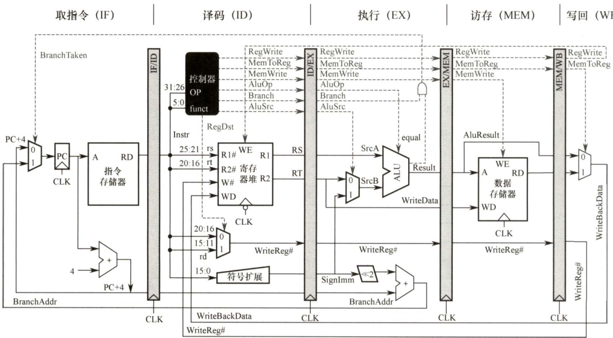  
图5.19一个5段流水线数据通路（及控制信号）  

不同流水寄存器锁存的数据不相同，如图5.19中的实线表示。IF/ID流水寄存器需要锁存从指令存储器取出的指令字，以及 $\mathrm{PC}+4$ 的值；ID/EX流水寄存器需要锁存从寄存器堆中取出的两个操作数RS 和RT（指令中两个操作数字段对应的寄存器值）与写寄存器编号WriteReg#，以及立即数符号扩展的值、 $\mathrm{PC}+4$ 等后段可能用到的操作数；EX/MEM流水寄存器需要锁存ALU运算结果、数据存储器待写入数据WriteData、写寄存器编号WriteReg#等数据；MEM/WB 流水寄存器需要锁存ALU运算结果、数据存储器读出数据、写寄存器编号WriteReg#等数据。  

#### 2.流水线的控制信号  

上节描述了数据通过流水寄存器进行传递的情况。但是在某一时刻，每个流水段执行不同指令的某个阶段，每个流水段还需要正在执行指令的对应功能段的控制信号。  

图5.19中的控制信号（虚线表示）如表5.3所示。控制信号的来源并不一致，如IF段的分支转跳信号BranchTaken 来源于EX段，ID段的RegWrite信号来源于WB段。其他控制信号通过控制器产生，由ID段负责译码生成控制信号，并分别在随后的各个时钟周期内使用。  

表5.3图5.19中的控制信号分类  

<html><body><table><tr><td>控制信号</td><td>位置</td><td>来源</td><td>功能说明</td></tr><tr><td>BranchTaken</td><td>IF</td><td>EX</td><td>分支跳转信号，为1表示跳转，由EX段的Branch 信号与equal标志进行逻辑与生成</td></tr><tr><td>RegDst</td><td>ID</td><td>ID</td><td>写入目的寄存器选择，为1时目的寄存器为rd 寄存器，为0时为rt寄存器</td></tr><tr><td>RegWrite</td><td>ID</td><td>WB</td><td>控制寄存器堆写操作，为1时数据需要写回寄存器堆中的指定寄存器</td></tr><tr><td>AluSre</td><td>EX</td><td>EX</td><td>ALU的第二输入选择控制，为0时输入寄存器rt，为1时输入扩展后的立即数</td></tr><tr><td>AluOp</td><td>EX</td><td>EX</td><td>控制ALU进行不同运算，具体取值和位宽与ALU的设计有关</td></tr><tr><td>MemWrite</td><td>MEM</td><td>MEM</td><td>控制数据存储器写操作，为0时进行读操作，为1时进行写操作</td></tr><tr><td>MemToReg</td><td>WB</td><td>WB</td><td>为1时将数据存储器读出数据写回寄存器堆，否则将ALU运算结果写回</td></tr></table></body></html>  

控制器的输入主要是IF/ID流水寄存器锁存的指令字中的OP字段，输出为7个控制信号，其中 RegDst信号在ID 段使用，其他6个后段使用的控制信号输出到ID/EX流水寄存器中并依  

次向后传递，以供后续各流水段使用。RegWrite信号必须传递至WB段后才能反馈到ID段的寄存器堆的写入控制段WE；条件分支译码信号Branch也需要传递到EX段，与ALU运算的标志equal信号进行逻辑与操作后，反馈到IF段控制多路选择器进行分支处理。  

综上所述，每个流水寄存器中保存的信息包括： $\textcircled{1}$ 后面流水段需要用到的所有数据信息，包括PC $+\ 4$ 、指令、立即数、目的寄存器、ALU运算结果、标志信息等，它们是前面阶段在数据通路中执行的结果； $\textcircled{2}$ 前面传递过来的后面各流水段要用到的所有控制信号。  

#### 3.流水线的执行过程  

由于流水线的特殊结构，所有指令都需要完整经过流水线的各功能段，只不过某些指令在某些功能段内没有任何实质性的操作，只是等待一个时钟周期，这也就意味着单条指令的执行时间还是5个功能段时间延迟的总和。下面简单描述图5.19中各流水段的执行过程。  

（1）取指（IF）  

将PC值作为地址从指令寄存器中取出第一条指令字；并计算 $\mathrm{PC}+4$ ，送入PC输入端，以便在下一个时钟周期取下条指令，这些功能由取指部件完成。取出的指令字通过RD 输出端送入IF/ID 流水寄存器，PC+4也要送入IF/ID流水寄存器，以备后续可能使用（如相对转移指令)。只要是后续功能段有可能要用到的数据和控制信号，都要向后传递。时钟到来时将更新后的PC值和指令字锁存到IF/ID流水寄存器中；本条指令 $\mathrm{I}_{1}$ 进入ID段，IF段取出下条指令 $\mathrm{I}_{2}$ 0  

(2）译码/读寄存器（ID)  

由控制器根据IF/ID流水寄存器中的指令字生成后续各段需要的控制信号。对于Iw 访存指令，根据指令字中的rs、rt取出寄存器堆中的值RS 和RT；符号扩展单元会将指令字中的16位立即数符号扩展为32 位；多路选择器根据指令字生成指令可能的写寄存器编号WriteReg#。时钟到来时，这些数据和控制信号，连同顺序指令地址 $\mathrm{PC}+4$ ，都会锁存到ID/EX流水寄存器中；指令 $\mathrm{I}_{1}$ 进入EX段，同时下条指令 $\mathrm{I}_{2}$ 进入ID段，下下条指令 $\mathrm{I}_{3}$ 进入IF段。  

（3）执行/计算地址（EX)  

EX段功能由具体指令确定，不同指令经ID段译码后得到不同的控制信号。对于Iw 指令，EX 主要用来计算访存地址，将ID/EX流水寄存器中的RS 值与符号扩展后的立即数相加得到的访存地址送入EX/MEM流水寄存器。EX段可能还要计算分支地址，生成分支转跳信号BranchTaken。RT的值可能会在MEM段作为写入数据使用，所以RT会作为写入数据WriteData送入EX/MEM流水寄存器；ID/EX流水寄存器中的写寄存器编号WriteReg#也将直接传送给EX/MEM流水寄存器。时钟到来后，这些数据和后段需要的控制信号都会锁存到EX/MEM流水寄存器中；指令 $\mathrm{I}_{1}$ 进入MEM段，后续指令 $\mathrm{I}_{2}$ ， $\mathrm{I}_{3}$ ， $\mathrm{I}_{4}$ 分别进入EX、ID、IF段。  

（4）访存（MEM）  

MEM段的功能也由具体指令确定。对于Iw指令，主要是根据EX/MEM流水寄存器中锁存的访存地址，写入数据和内存读写控制信号MemWrite对存储器进行读或写操作。EX/MEM流水寄存器中的访存地址、WriteReg#、数据存储器读出的数据都会送入MEM/WB流水寄存器，以备后续可能使用。时钟到来后，这些数据和后段需要的控制信号都会锁存到MEM/WB流水寄存器中；指令 $\mathrm{I}_{1}$ 进入WB段，后续指令 $\mathrm{I}_{2}$ ， $\mathrm{I}_{3}$ ， $\mathrm{I}_{4}$ ， $\mathrm{I}_{5}$ 分别进入MEM、EX、ID、IF段。  

（5）写回（WB）  

WB段的功能也由具体指令确定。将MEM/WB流水寄存器中数据存储器读出的数据写回指定寄存器WriteReg#。时钟到来时会完成数据写入寄存器，指令 $\mathrm{I}_{1}$ 离开流水线。此时，指令 $\mathrm{I}_{2}$ 进入最后的WB段，指令 $\mathrm{I}_{3}$ ， $\mathrm{I}_{4}$ ， $\mathrm{I}_{5}$ 分别进入MEM、EX、ID段，指令 $\mathrm{I}_{6}$ 进入IF段。  

#### 5.6.3 流水线的冒险与处理  

在指令流水线中，可能会遇到一些情况使得流水线无法正确执行后续指令而引起流水线阻塞或停顿，这种现象称为流水线冒险。根据导致冒险的原因不同主要有3种：结构冒险（资源冲突)、数据冒险（数据冲突）和控制冒险（控制冲突)。  

#### 1．结构冒险  

由于多条指令在同一时刻争用同一资源而形成的冲突，也称为资源冲突，即由硬件资源竞争造成的冲突，有以下两种解决办法：  

1）前一指令访存时，使后一条相关指令（以及其后续指令）暂停一个时钟周期。  
2）单独设置数据存储器和指令存储器，使取数和取指令操作各自在不同的存储器中进行。事实上，现代计算机都引入了Cache机制，而L1Cache通常采用数据Cache和指令Cache分离的方式，因而也就避免了资源冲突的发生。  

#### 2.数据冒险  

在一个程序中，下一条指令会用到当前指令计算出的结果，此时这两条指令发生数据冲突。当多条指令重叠处理时就会发生冲突，数据冒险可分为三类（结合综合题3理解)：  

1）写后读（ReadAfterWrite，RAW）相关：表示当前指令将数据写入寄存器后，下一条指令才能从该寄存器读取数据。否则，先读后写，读到的就是错误（旧）数据。  
2）读后写（WriteAfterRead，WAR）相关：表示当前指令读出数据后，下一条指令才能写该寄存器。否则，先写后读，读到的就是错误（新）数据。  
3）写后写（WriteAfterWrite，WAW）相关：表示当前指令写入寄存器后，下一条指令才能写该寄存器。否则，下一条指令在当前指令之前写，将使寄存器的值不是最新值。解决的办法有以下几种：  
1）把遇到数据相关的指令及其后续指令都暂停一至几个时钟周期，直到数据相关问题消失后再继续执行，可分为硬件阻塞（stall）和软件插入“NOP”指令两种方法。  
2）设置相关专用通路，即不等前一条指令把计算结果写回寄存器组，下一条指令也不再读寄存器组，而直接把前一条指令的ALU的计算结果作为自己的输入数据开始计算过程，使本来需要暂停的操作变得可以继续执行，这称为数据旁路技术。  
3）通过编译器对数据相关的指令编译优化的方法，调整指令顺序来解决数据相关。  

#### 3.控制冒险  

指令通常是顺序执行的，但是在遇到改变指令执行顺序的情况，例如执行转移、调用或返回等指令时，会改变PC值，会造成断流，从而引起控制冒险。解决的办法有以下几种：  

1）对转移指令进行分支预测，尽早生成转移目标地址。分支预测分为简单（静态）预测和动态预测。静态预测总是预测条件不满足，即继续执行分支指令的后续指令。动态预测根据程序执行的历史情况，进行动态预测调整，有较高的预测准确率。  
2）预取转移成功和不成功两个控制流方向上的目标指令。  
3）加快和提前形成条件码。  
4）提高转移方向的猜准率。  

注意：Cache缺失的处理过程也会引起流水线阻塞。在不过多增加硬件成本的情况下，如何尽可能地提高指令流水线的运行效率是选用指令流水线技术必须解决的关键问题。  

#### 5.6.4 流水线的性能指标  

#### 1.流水线的吞吐率  

流水线的吞吐率是指在单位时间内流水线所完成的任务数量，或输出结果的数量。流水线吞吐率（TP）的最基本公式为  

$$
\mathrm{TP}=\frac{n}{T_{k}}
$$  

式中， $n$ 是任务数， $T_{k}$ 是处理完 $n$ 个任务所用的总时间。设 $k$ 为流水段的段数， $\Delta t$ 为时钟周期。在输入流水线中的任务连续的理想情况下，一条 $k$ 段流水线能在 $k+n-1$ 个时钟周期内完成$n$ 个任务。得出流水线的吞吐率为  

$$
\mathrm{TP}=\frac{n}{(k+n-1)\Delta t}
$$  

连续输入的任务数 $n{\rightarrow}\infty$ 时，得最大吞吐率为 $\mathrm{TP}_{\operatorname*{max}}=1/\Delta t$ 。  

#### 2.流水线的加速比  

完成同样一批任务，不使用流水线与使用流水线所用的时间之比。流水线加速比（S）的基本公式为  

$$
S=\frac{T_{0}}{T_{k}}
$$  

式中， $T_{0}$ 表示不使用流水线的总时间； $T_{k}$ 表示使用流水线的总时间。一条 $k$ 段流水线完成 $n$ 个任务所需的时间为 $T_{k}=(k+n-1)\Delta t$ 。顺序执行 $n$ 个任务时，所需的总时间为 $T_{0}=k n\Delta t$ 。将 $T_{0}$ 和 $T_{k}$ 值代入上式，得出流水线的加速比为  

$$
S=\frac{k n\Delta t}{(k+n-1)\Delta t}=\frac{k n}{k+n-1}
$$  

连续输入的任务数 $n{\rightarrow}\infty$ 时，得最大加速比为 $S_{\mathrm{max}}=k$ o  

#### 5.6.5 高级流水线技术  

有两种增加指令级并行的策略：一种是多发射技术，它通过采用多个内部功能部件，使流水线功能段能同时处理多条指令，处理机一次可以发射多条指令进入流水线执行；另一种是超流水线技术，它通过增加流水线级数来使更多的指令同时在流水线中重叠执行。  

#### 1.超标量流水线技术  

超标量流水线技术也称动态多发射技术，每个时钟周期内可并发多条独立指令，以并行操作方式将两条或多条指令编译并执行，为此需配置多个功能部件。超标量技术不能调整指令的执行顺序，因此通过编译优化技术，把可并行执行的指令搭配起来，挖掘更多的指令并行性，如图5.20所示。  

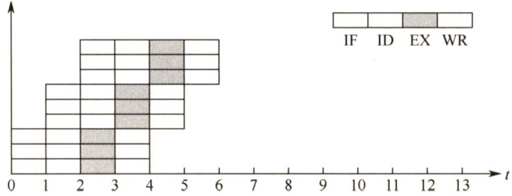  
图5.20 超标量流水线技术  

#### 2.超长指令字技术  

超长指令字技术也称静态多发射技术，由编译程序挖掘出指令间潜在的并行性，将多条能并行操作的指令组合成一条具有多个操作码字段的超长指令字（可达几百位)，为此需要采用多个处理部件。  

#### 3.超流水线技术  

如图5.21所示，流水线功能段划分得越多，时钟周期就越短，指令吞吐率也就越高，因此超流水线技术是通过提高流水线主频的方式来提升流水线性能的。但是，流水线级数越多，用于流水寄存器的开销就越大，因而流水线级数是有限制的，并不是越多越好。  

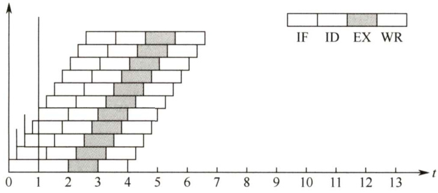  
图5.21 超流水线技术  

超流水线CPU在流水线充满后，每个时钟周期还是执行一条指令， $\mathbf{CPI}=1$ ，但其主频更高；多发射流水线CPU每个时钟周期可以处理多条指令， $\mathrm{CPI}<1$ ，相对而言，多发射流水线成本更高，控制更复杂。  

#### 5.6.6 本节习题精选  

#### 一、单项选择题  

01．下列关于流水CPU基本概念的描述中，正确的是（）。  

A．流水CPU是以空间并行性为原理构造的处理器  
B．流水CPU一定是RISC机器  
C．流水CPU一定是多媒体CPU  
D.流水CPU是一种非常经济而实用的时间并行技术  

02.下列关于超标量流水线的描述中，不正确的是（）。  

A.在一个时钟周期内一条流水线可执行一条以上的指令  
B.一条指令分为多段指令由不同电路单元完成  
C．超标量通过内置多条流水线来同时执行多个处理器，其实质是以空间换取时间  
D.超标量流水线是指运算操作并行  

03．下列关于动态流水线的描述中，正确的是（）。  

A．动态流水线是指在同一时间内，当某些段正在实现某种运算时，另一些段却正在进行另一种运算，这样对提高流水线的效率很有好处，但会使流水线控制变得很复杂  
B.动态流水线是指运算操作并行  
C.动态流水线是指指令步骤并行  
D.动态流水线是指程序步骤并行  

04.流水CPU是由一系列称为“段”的处理线路组成的。一个 $m$ 段流水线稳定时的CPU的吞吐能力，与 $m$ 个并行部件的CPU的吞吐能力相比，（）。  

A．具有同等水平的吞吐能力B．不具备同等水平的吞吐能力C．吞吐能力大于前者的吞吐能力D．吞吐能力小于前者的吞吐能力  

05．设指令由取指、分析、执行3个子部件完成，并且每个子部件的时间均为 $\Delta t$ ，若采用常规标量单流水线处理机（即处理机的度为1)，连续执行12条指令，共需（）。  

A. $12\Delta t$ B. $14\Delta t$ C. $16\Delta t$ D. $18\Delta t$  

6．若采用度为4的超标量流水线处理机，连续执行上述20条指令，只需（）  

A. $3\Delta t$ B. $5\Delta t$ C. $7\Delta t$ D. $9\Delta t$  

07．设指令流水线把一条指令分为取指、分析、执行3部分，且3部分的时间分别是 $t_{_{\perp\times\uparrow\parallel}}=$ 2ns， $t_{_{\mathrm{3piff}}}=2\mathrm{ns},t_{\mathrm{n4iff}}=1\mathrm{ns}$ ，则100条指令全部执行完毕需（）。  

A.163ns B.183ns C.193ns D. 203ns  

08.设指令由取指、分析、执行3个子部件完成，并且每个子部件的时间均为t，若采用常规标量单流水线处理机，连续执行8条指令，则该流水线的加速比为（）。  

A.3 B.2 C.3.4 D.2.4  

09.指令流水线中出现数据相关时流水线将受阻，（）可解决数据相关问题。  

A.增加硬件资源 B．采用旁路技术C．采用分支预测技术 D.以上都可以  

10．下面有关控制相关的描述中，错误的是（）。  

A.条件转移指令可能引起控制相关B．在分支指令加入若干空操作可以避免控制冒险C.采用转发（旁路）技术，可以解决部分控制相关D.通过编译器调整指令执行顺序可解决部分控制冒险  

11．关于流水线技术的说法中，错误的是（）。  

A.超标量技术需要配置多个功能部件和指令译码电路等  
B.与超标量技术和超流水线技术相比，超长指令字技术对优化编译器要求更高，而无其他硬件要求  
C．流水线按序流动时，在RAW、WAR和WAW中，只可能出现RAW相关  
D.超流水线技术相当于将流水线再分段，从而提高每个周期内功能部件的使用次数  

12.【2009统考真题】某计算机的指令流水线由4个功能段组成，指令流经各功能段的时间（忽略各功能段之间的缓存时间）分别为90ns、80ns、70ns和60ns，则该计算机的CPU周期至少是（）。  

A.90ns B. 80ns C. 70ns D. 60ns  

13.【2010统考真题】下列不会引起指令流水线阻塞的是（）。  

A．数据旁路 B．数据相关 C．条件转移 D.资源冲突  

14.【2013统考真题】某CPU主频为 $1.03\mathrm{GHz}$ ，采用4级指令流水线，每个流水段的执行需要1个时钟周期。假定CPU执行了100条指令，在其执行过程中，没有发生任何流水线阻塞，此时流水线的吞吐率为（）。  

A. $0.25\times10^{9}$ 条指令/秒 B. $0.97\times10^{9}$ 条指令/秒  

C. $1.0{\times}10^{9}$ 条指令/秒 D. $1.03\times10^{9}$ 条指令/秒  

15.【2016统考真题】在无转发机制的五段基本流水线（取指、译码/读寄存器、运算、访写回寄存器）中，下列指令序列存在数据冒险的指令对是（）。  

I1: add R1,R2,R3； $({\bf R}2)+({\bf R}3){\rightarrow}{\bf R}1$   
12: add R5, R2,R4; $(\mathrm{R}2)+(\mathrm{R}4){\rightarrow}\mathrm{R}5$   
13: add R4,R5,R3； $(\mathbf{R}5)+(\mathbf{R}3){\rightarrow}\mathbf{R}4$   
I4: add R5, R2, R6; $(\mathtt{R2})+(\mathtt{R6}){\rightarrow}\mathtt{R5}$  

A.I1和I2 B.I2和I3 C.I2和I4 D.I3和I4  

16.【2017统考真题】下列关于超标量流水线特性的叙述中，正确的是（）。  

I．能缩短流水线功能段的处理时间ⅡI．能在一个时钟周期内同时发射多条指令IⅢI能结合动态调度技术提高指令执行并行性  

A.仅ⅡI B.仅I、IⅢI C.仅、IⅢI D.I、和II【2017统考真题】下列关于指令流水线数据通路的叙述中，错误的是（）。  

A．包含生成控制信号的控制部件B．包含算术逻辑运算部件（ALU）C.包含通用寄存器组和取指部件D．由组合逻辑电路和时序逻辑电路组合而成  

18.【2018统考真题】若某计算机最复杂指令的执行需要完成5个子功能，分别由功能部件A～E 实现，各功能部件所需时间分别为80ps、50ps、50ps、70ps和50ps，采用流水线方式执行指令，流水段寄存器延时为 $20\mathrm{ps}$ ，则CPU时钟周期至少为（）。  

A.60ps B.70ps C. 80ps D. 100ps  

19.【2019统考真题】在采用“取指、译码/取数、执行、访存、写回”5段流水线的处理器中，执行如下指令序列，其中s0、sl、s2、s3和t2表示寄存器编号。  

Il:add s2,sl,s0 $1/\mathrm{R}[\mathsf{s}2]\gets\mathrm{R}[\mathsf{s}1]+\mathrm{R}[\mathsf{s}0]$ I2:loads3,0（t2) $//\mathbb{R}[\mathbb{s}3]\gets\mathbb{M}[\mathbb{R}[\pm2]+0]$ I3:adds2,s2,s3 $1/\mathrm{R}[\mathsf{s}2]\gets\mathrm{R}[\mathsf{s}2]+\mathrm{R}[\mathsf{s}3]$ I4:store s2,0（t2) $//\mathrm{M}[\mathbb{R}[\ t{2}]+0]\gets\mathbb{R}[\ s\-2]$ 下列指令对中，不存在数据冒险的是（）。  

A.I1和I3 B.I2和I3 C.I2和I4 D.I3和I4  

0.【2020统考真题】下列给出的处理器类型中，理想情况下，CPI为1的是（）。  

I．单周期CPUI．多周期CPUII．基本流水线CPUIV．超标量流水线CPUA.仅I、ⅡI B.仅I、III C.仅Ⅱ、IV D.仅III、IV  

#### 二、综合应用题  

01．现有四级流水线，分别完成取指令、指令译码并取数、运算、回写四步操作，假设完成各部操作的时间依次为 $100\mathrm{ns}$ 、 $100\mathrm{ns}$ 、80ns和 $50\mathrm{{ns}}$ 。试问：  

1）流水线的操作周期应设计为多少？  
2）若相邻两条指令如下，发生数据相关（假设在硬件上不采取措施），试分析第二条指令要推迟多少时间进行才不会出错。  

ADDR1,R2,R3 #R2+R3->R1   
SUBR4,R1,R5 #R1-R5->R4  

3）若在硬件设计上加以改进，至少需要推迟多少时间？  

02．假设指令流水线分为取指（IF）译码（ID）、执行（EX）、回写（WB）4个过程，共有10条指令连续输入此流水线。1）画出指令周期流程图。2）画出非流水线时空图。3）画出流水线时空图。4）假设时钟周期为 $100\mathrm{ns}$ ，求流水线的实际吞吐量（单位时间执行完毕的指令数）。  

03．流水线中有3类数据相关冲突：写后读（RAW）相关；读后写（WAR）相关；写后写（WAW）相关。判断以下3组指令各存在哪种类型的数据相关。  

第一组I1 ADD R1，R2，R3 $(\mathsf{R2}+\mathsf{R3}){\rightarrow}\mathsf{R1}$ I2 SUB R4， R1，R5 $(\mathsf{R1-R5}){\bmod{}} $   
第二组I3 STA M(x), R3 $(\mathbf{R}3){\rightarrow}\mathbf{M}(\mathbf{x})$ ， $\mathbf{M}(\mathbf{x})$ 是存储器单元I4 ADD R3，R4，R5 $(\mathsf{R4}+\mathsf{R5}){\rightarrow}\mathsf{R3}$   
第三组I5 MUL R3，R1， R2 $(\mathsf{R}1){\times}(\mathsf{R}2){\to}\mathsf{R}3$ I6 ADD R3， R4， R5 $(\mathsf{R4}+\mathsf{R5}){\rightarrow}\mathsf{R3}$  

04.某台单流水线多操作部件处理机，包含有取指、译码、执行3个功能段，在该机上执行以下程序。取指和译码功能段各需要1个时钟周期，MOV操作需要2个时钟周期，ADD操作需要3个时钟周期，MUL操作需要4个时钟周期，每个操作都在第一个时钟周期接收数据，在最后一个时钟周期把结果写入通用寄存器。  

$K$ MOVR1，RO $({\bf R}0)\rightarrow{\bf R}1$ $K+1$ . MULRO, R1，R2 (R1) $|\times\rrangle$ (R2)→RO $K+2$ . ADDRO, R2，R3 $(\mathbf{R}2)+(\mathbf{R}3)\mathbf{\Sigma}\rightarrow\mathbf{R}0$  

1）画出流水线功能段结构图。  
2）画出指令执行过程流水线的时空图。  

05.【2012统考真题】某16位计算机中，有符号整数用补码表示，数据Cache和指令Cache 分离。下表给出了指令系统中的部分指令格式，其中Rs和Rd表示寄存器，mem表示存储单元地址，(x)表示寄存器x或存储单元 $\textbf{x}$ 的内容。  

表指令系统中部分指令格式  

<html><body><table><tr><td>名称</td><td>指令的汇编格式</td><td>指令功能</td></tr><tr><td>加法指令</td><td>ADD Rs,Rd</td><td>(Rs)+(Rd)→Rd</td></tr><tr><td>算术/逻辑左移</td><td>SHL Rd</td><td>2*(Rd)→Rd</td></tr><tr><td>算术右移</td><td>SHR Rd</td><td>(Rd)/2→Rd</td></tr><tr><td>取数指令</td><td>LOAD Rd, mem</td><td>(mem)→Rd</td></tr><tr><td>存数指令</td><td>STORE Rs,mem</td><td>Rs→(mem)</td></tr></table></body></html>  

该计算机采用5段流水方式执行指令，各流水段分别是取指（IF）、译码/读寄存器（ID）、执行/计算有效地址（EX）、访问存储器（M）和结果写回寄存器（WB），流水线采用“按序发射，按序完成”方式，未采用转发技术处理数据相关，且同一寄存器的读和写操作不能在同一个时钟周期内进行。请回答下列问题：  

1）若int型变量x的值为-513，存放在寄存器R1中，则执行“SHRR1”后，R1中的  

内容是多少（用十六进制表示）？  

2）若在某个时间段中，有连续的4条指令进入流水线，在其执行过程中未发生任何阻塞，则执行这4条指令所需的时钟周期数为多少？  

3）若高级语言程序中某赋值语句为 $\textbf{x}=\textbf{a}+\textbf{b}$ ， $\mathbf{x}$ 、a和b均为int型变量，它们的存储单元地址分别表示为[x]、[a]和[b]。该语句对应的指令序列及其在指令流中的执行过程如下所示。  

I1 LOAD R1, [a]I2 LOAD R2,[b]I3 ADD R1,R2I4 STORE R2,[x]  

<html><body><table><tr><td></td><td>时钟</td><td rowspan="2">1</td><td rowspan="2">2</td><td rowspan="2">3</td><td rowspan="2">4</td><td rowspan="2">5</td><td rowspan="2">6</td><td rowspan="2">7</td><td rowspan="2">8</td><td rowspan="2">9</td><td rowspan="2">10</td><td rowspan="2">11</td><td rowspan="2">12</td><td rowspan="2">13</td><td rowspan="2">14</td></tr><tr><td>指令</td><td></td></tr><tr><td colspan="2">I</td><td>IF</td><td>ID</td><td>EX</td><td>M</td><td>WB</td><td></td><td></td><td></td><td></td><td></td><td></td><td></td><td></td><td></td></tr><tr><td colspan="2">I</td><td></td><td>IF</td><td>ID</td><td>EX</td><td>M</td><td>WB</td><td></td><td></td><td></td><td></td><td></td><td></td><td></td><td></td></tr><tr><td colspan="2">I</td><td></td><td></td><td>IF</td><td></td><td></td><td></td><td>ID</td><td>EX</td><td>M</td><td>WB</td><td></td><td></td><td></td><td></td></tr><tr><td colspan="2">I4</td><td></td><td></td><td></td><td></td><td></td><td></td><td>IF</td><td></td><td></td><td></td><td>ID</td><td>EX</td><td>M</td><td>WB</td></tr></table></body></html>  

则这4条指令执行过程中I3的ID段和I4的IF段被阻塞的原因各是什么？  

4）若高级语言程序中某赋值语句为 $\mathbf{x}=\mathbf{x}^{*}2+\mathbf{a}$ ， $\mathbf{x}$ 和a均为unsignedint类型的变量，它们的存储单元地址分别表示为[x]、[a]，则执行这条语句至少需要多少个时钟周期？要求模仿上图画出这条语句对应的指令序列及其在流水线中的执行过程示意图。  

06.【2014统考真题】某程序中有循环代码段P：“for(int $\dot{\mathbf{i}}=0$ . $\mathrm{i}<\mathrm{N}$ .。 $\mathrm{i}{+}{+}$ ） $\mathrm{sum^{+}}=$ A[i];”。假设编译时变量sum和i分别分配在寄存器R1和R2中。常量 $\mathrm{~N~}$ 在寄存器R6中，数组A的首地址在寄存器R3中。程序段P的起始地址为 $0804~8100\mathrm{H}$ ，对应的汇编代码和机器代码如下表所示。  

<html><body><table><tr><td>编号</td><td>地址</td><td>机器代码</td><td>汇编代码</td><td>注释</td></tr><tr><td>1</td><td>08048100H</td><td>00022080H</td><td>loop: sll R4, R2, 2</td><td>(R2)<<2→R4</td></tr><tr><td>2</td><td>08048104H</td><td>00083020H</td><td>addR4,R4,R3</td><td>(R4)+(R3)→R4</td></tr><tr><td>3</td><td>08048108H</td><td>8C850000H</td><td>load R5, 0(R4)</td><td>((R4)+0)→R5</td></tr><tr><td>4</td><td>0804810CH</td><td>00250820H</td><td>add R1,R1,R5</td><td>(R1)+(R5)→R1</td></tr><tr><td>5</td><td>08048110H</td><td>20420001H</td><td>add R2,R2,1</td><td>(R2)+1→R2</td></tr><tr><td>6</td><td>08048114H</td><td>1446FFFAH</td><td>bne R2, R6, loop</td><td>if(R2)!= (R6) goto loop</td></tr></table></body></html>  

执行上述代码的计算机M采用32位定长指令字，其中分支指令bne采用如下格式：  

<html><body><table><tr><td>OP</td><td>Rs</td><td>Rd</td><td>16 15</td></tr><tr><td></td><td></td><td></td><td>OFFSET</td></tr></table></body></html>  

OP为操作码；Rs和Rd为寄存器编号；OFFSET为偏移量，用补码表示。  
请回答下列问题，并说明理由。  

1）M的存储器编址单位是什么？  
2）已知sll指令实现左移功能，数组A中每个元素占多少位？  
3）表中bne指令的OFFSET字段的值是多少？已知bne指令采用相对寻址方式，当前  

PC 内容为bne指令地址，通过分析表中指令地址和bne指令内容，推断bne指令的转移目标地址计算公式。  

4）若M采用如下“按序发射、按序完成”的5级指令流水线：IF（取值）ID（译码及取数）、EXE（执行）MEM（访存）、WB（写回寄存器），且硬件不采取任何转发措施，分支指令的执行均引起3个时钟周期的阻塞，则 $\mathrm{~\bf~P~}$ 中哪些指令的执行会由于数据相关而发生流水线阻塞？哪条指令的执行会发生控制冒险？为什么指令1的执行不会因为与指令5的数据相关而发生阻塞？  

07.【2014统考真题】假设对于上题中的计算机M和程序 $\mathrm{~\bf~P~}$ 的机器代码，M采用页式虚拟存储管理；P开始执行时， $({\bf R}1)=({\bf R}2)=0$ ， $(\mathrm{R6})=1000$ ，其机器代码已调入主存但不在 Cache中；数组A未调入主存，且所有数组元素在同一页，并存储在磁盘的同一个扇区。请回答下列问题并说明理由。  

1）P执行结束时，R2的内容是多少？  

2）M的指令Cache和数据Cache分离。若指令Cache共有16行，Cache和主存交换的块大小为32B，则其数据区的容量是多少？若仅考虑程序段P的执行，则指令Cache的命中率为多少？  
3）P在执行过程中，哪条指令的执行可能发生溢出异常？哪条指令的执行可能产生缺页异常？对于数组A的访问，需要读磁盘和TLB至少各多少次？  

#### 5.6.7 答案与解析  

#### 一、单项选择题  

01.D  

空间并行即资源重复，主要指多个功能部件共同执行同一任务的不同部分，典型的如多处理机系统。时间并行即时间重叠，让多个功能部件在时间上相互错开，轮流重叠执行不同任务的相同部分，因此流水CPU 利用的是时间并行性，因此A 错误。RISC 都采用流水线技术，以提高资源利用率。但反过来并不成立，因为大部分CISC 同样采用了流水线技术，因此B错误。流水CPU和多媒体CPU无必然联系，因此C错误。  

#### 02.D  

超标量流水线是指在一个时钟周期内一条流水线可执行一条以上的指令，因此A正确。一条指令分为多段指令，由不同电路单元完成，因此B正确。超标量通过内置多条流水线来同时执行多个处理器，其实质是以空间换取时间，因此C正确。  

#### 03.A  

动态流水线是相对于静态流水线而言的，静态流水线上下段连接方式固定，而动态流水线的连接方式是可变的。  

#### 04.A  

吞吐能力是指单位时间内完成的指令数。 $m$ 段流水线在第 $m$ 个时钟周期后，每个时钟周期都可以完成一条指令；而 $m$ 个并行部件在 $m$ 个时钟周期后能完成全部的 $m$ 条指令，等价于平均每个时钟周期完成一条指令。因此两者的吞吐能力等同。  

05.B单流水线处理机执行12条指令的时间为 $(3+(12-1))\Delta t=14\Delta t$ 。  

06.C这个超标量流水线处理机可以发送4条指令，所以执行指令的时间为 $(3+(20-4)/4)\Delta t=7\Delta t$ 。  

07.D  

每个功能段的时间设定为取指、分析和执行部分的最长时间2ns，第一条指令在第5ns 时执行完毕，其余的99 条指令每隔 2ns 执行完一条，所以100条指令全部执行完毕所需的时间为$(5+99\times2)\mathrm{ns}=203\mathrm{ns}$ o  

08.D  

采用流水线时，第一条指令完成的时间是3t，以后每经过 $t$ 都有一条指令完成，因此共需要的时间为 $3t+(8-1)t=10t$ ；而不采用流水线时，完成12条指令总共需要的时间为 $8\times3t=24t$ 所以流水线的加速比 $=24t/10t=2.4$ o  

#### 09.B  

处理数据相关问题有两种方法：一种是暂停相关指令的执行，即暂停流水线，直到能够正确读出寄存器操作数为止；另一种是采用专门的数据通路，直接把结果送到ALU的输入端，这种方法称为旁路技术。  

#### 10.C  

采用转发（旁路）技术，可以解决的是数据相关，C错误。  

11.B  

要实现超标量技术，要求处理机中配置多个功能部件和指令译码电路，以及多个寄存器端口和总线，以便能实现同时执行多个操作，因此A正确；超长指令字技术对Cache 的容量要求更大，因为需要执行的指令长度也许会很长，因此B错误；流水线按序流动，肯定不会出现先读后写（WAR）和写后写（WAW）相关（根据定义可知)。只可能出现没有等到上一条指令写入，当前指令就去读寄存器的错误（此时可采用旁路相关来解决)，因此C 正确。由超流水线技术的定义易知D正确。  

#### 12.A  

时钟周期应以各功能段的最长执行时间为准，否则用时较长的流水段的功能将不能正确完成，因此应选 $90\mathrm{{ns}}$ o  

#### 13.A  

采用流水线方式，相邻或相近的两条指令可能会因为存在某种关联，后一条指令不能按照原指定的时钟周期运行，从而使流水线断流。有三种相关可能引起指令流水线阻塞： $\textcircled{1}$ 结构相关，又称资源相关； $\textcircled{2}$ 数据相关； $\textcircled{3}$ 控制相关，主要由转移指令引起。  

数据旁路技术的主要思想是，直接将执行结果送到其他指令所需要的地方，使流水线不发  

生停顿，因此不会引起流水线阻塞。  

14.C  

采用4级流水执行100 条指令，在执行过程中共用 $4+(100-1)=103$ 个时钟周期，如下图所示。CPU的主频是 $1.03\mathrm{GHz}$ ，即每秒有1.03G个时钟周期。流水线的吞吐率为 $1.03\mathrm{G}{\times}100/103=$ $1.0\times10^{9}$ 条指令/秒。  

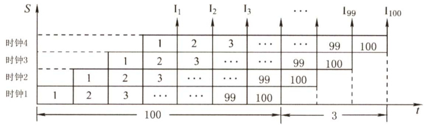  

15.B  

数据冒险即数据相关，指在一个程序中存在必须等前一条指令执行完才能执行后一条指令的情况，此时这两条指令即为数据相关。当多条指令重叠处理时就会发生冲突。首先这两条指令发生写后读相关，且两条指令在流水线中的执行情况（发生数据冒险）如下表所示。  

<html><body><table><tr><td>时钟</td><td rowspan="2">1</td><td rowspan="2">2</td><td rowspan="2">3</td><td rowspan="2">4</td><td rowspan="2">5</td><td rowspan="2">6</td><td rowspan="2">7</td></tr><tr><td>指令</td><td></td></tr><tr><td>I2</td><td>取指</td><td>译码/读寄存器</td><td>运算</td><td>访存</td><td>写回</td><td></td><td></td></tr><tr><td>I3</td><td></td><td>取指</td><td>译码/读寄存器</td><td>运算</td><td>访存</td><td>写回</td><td></td></tr></table></body></html>  

指令I2在时钟5时将结果写入寄存器（R5)，但指令I3 在时钟3时读寄存器（R5)。本来指令I2应先写入R5，指令I3后读R5，结果变成指令I3先读R5，指令I2 后写入R5，因而发生数据冲突。  

#### 16.C  

超标量是指在CPU中有一条以上的流水线，并且每个时钟周期内可以完成一条以上的指令，其实质是以空间换时间。I错误，它不影响流水线功能段的处理时间；ⅡI、III正确。选C。  

#### 17.A  

数据在功能部件之间传送的路径被称为数据通路，包括数据通路上流经的部件，如程序计数器、ALU、通用寄存器、状态寄存器、异常和中断处理逻辑等。数据通路由控制部件控制，控制部件根据每条指令功能的不同生成对数据通路的控制信号。因此，不包括控制部件。  

#### 18.D  

指令流水线的每个流水段时间单位为时钟周期，题中指令流水线的指令需要用到 $\mathbf{A}{\sim}\mathrm{E}$ 五个部件，所以每个流水段时间应取最大部件时间 $80\mathrm{ps}$ ，此外还有寄存器延时 $20\mathrm{ps}$ ，则CPU时钟周期至少是 $100\mathrm{ps}$ 。答案选D。  

#### 19. C  

画出这四条指令在流水线中执行的过程如下图所示。  

<html><body><table><tr><td>指令</td><td>1</td><td>2</td><td>3</td><td>4</td><td>5</td><td>6</td><td>7</td><td>8</td><td>9</td><td>10</td><td>11</td><td>12</td><td>13</td><td>14</td></tr><tr><td>add s2, s1, s0</td><td>取指</td><td>译码/取数</td><td>执行</td><td>访存</td><td>写回</td><td></td><td></td><td></td><td></td><td></td><td></td><td></td><td></td><td></td></tr><tr><td>load s3,0(t2)</td><td></td><td>取指</td><td>译码/取数</td><td>执行</td><td>访存</td><td>写回</td><td></td><td></td><td></td><td></td><td></td><td></td><td></td><td></td></tr><tr><td>add s2,s2,s3</td><td></td><td></td><td>取指</td><td></td><td></td><td></td><td>译码/取数</td><td>执行</td><td>访存</td><td>写回</td><td></td><td></td><td></td><td></td></tr><tr><td>store s2,0(t2)</td><td></td><td></td><td></td><td></td><td></td><td></td><td>取指</td><td></td><td></td><td></td><td>译码/取数</td><td>执行</td><td>访存</td><td>写回</td></tr></table></body></html>  

数据冒险即数据相关，指在程序中存在必须等前一条指令执行完才能执行后一条指令的情况，此时这两条指令即为数据相关。其中I1和 I3、I2 和I3、I3 和I4 均发生了写后读相关，因此必须等相关的前一条指令执行完才能执行后一条指令。只有I2和I4不存在数据冒险，选C。  

20.B  

解析请扫右侧二维码查阅。  

#### 二、综合应用题  

01.【解答】  

1）流水线操作的时钟周期 $T$ 应按四步操作中的最长时间来考虑，所以 $T=100\mathrm{ns}$ o  

2）分析如下：  

首先该两条指令发生写后读相关，且两条指令在流水线中的执行情况如下表所示。  

<html><body><table><tr><td>时钟</td><td rowspan="2">1</td><td rowspan="2">2</td><td rowspan="2">3</td><td rowspan="2">4</td><td rowspan="2">5</td><td rowspan="2">6</td><td rowspan="2">7</td></tr><tr><td>指令</td><td></td></tr><tr><td>ADD</td><td>取指</td><td>指令译码并取数</td><td>运算</td><td>写回</td><td></td><td></td><td></td></tr><tr><td>SUB</td><td></td><td>取指</td><td>指令译码并取数</td><td>运算</td><td>写回</td><td></td><td></td></tr></table></body></html>  

ADD指令在时钟4时将结果写入寄存器堆（R1)，但SUB指令在时钟3时读寄存器堆(R1)。本来ADD指令应先写入R1，SUB指令后读R1，结果变成SUB指令先读R1，ADD指令后写入R1，因而发生数据冲突。若硬件上不采取措施，第二条指令SUB至少应推迟两个时钟周期（ $2\times100\mathrm{ns}$ )，即SUB指令中的指令译码并取数周期应在ADD指令的写回周期之后才能保证不会出错，如下表所示。  

<html><body><table><tr><td>时钟</td><td rowspan="2">1</td><td rowspan="2">2</td><td rowspan="2">3</td><td rowspan="2">4</td><td rowspan="2">5</td><td rowspan="2">6</td><td rowspan="2">7</td></tr><tr><td>指令</td><td></td></tr><tr><td>ADD</td><td>取指</td><td>指令译码并取数</td><td>运算</td><td>写回</td><td></td><td></td><td></td></tr><tr><td>SUB</td><td></td><td>取指</td><td></td><td></td><td>指令译码并取数</td><td>运算</td><td>写回</td></tr></table></body></html>  

3）若在硬件上加以改进，可以只延迟一个时钟周期（ $100\mathrm{ns}\mathrm{.}$ )。因为在ADD指令中，运算周期已得到结果。可以通过数据旁路技术在运算结果一得到时，就将结果快速地送入寄存器R1，而不需要等到写回周期完成。流水线中的执行情况如下表所示。  

<html><body><table><tr><td>时钟 指令</td><td rowspan="2">1</td><td rowspan="2">2</td><td rowspan="2">3</td><td rowspan="2">4</td><td rowspan="2">5</td><td rowspan="2">6</td><td rowspan="2">7</td></tr><tr><td></td><td>指令译码并</td></tr><tr><td>ADD</td><td>取指</td><td>取数</td><td>运算（并采用数据旁路技 术写入寄存器R1)</td><td>写回</td><td></td><td></td><td>取指</td></tr><tr><td>SUB</td><td></td><td>取指</td><td></td><td>指令译码并取数</td><td>运算</td><td>写回</td><td></td></tr></table></body></html>  

02.【解答】  

1）因为指令周期包括IF、ID、EX、WB四个子过程，因此其指令周期流程图如下图所示。  

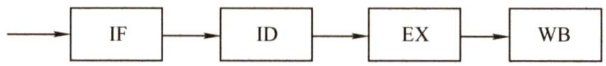  

2）假设一个时间单位为一个时钟周期，则每隔4个周期才有一个输出结果。非流水线的时空图如下图所示。  

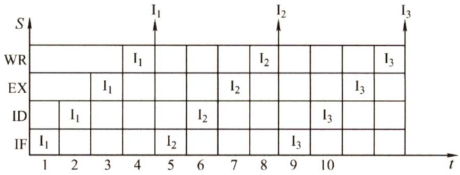  

3）第一条指令出结果需要4条指令周期。流水线满载时，以后每个时钟周期都可输出一个结果，即执行完一条指令，如下图所示。  

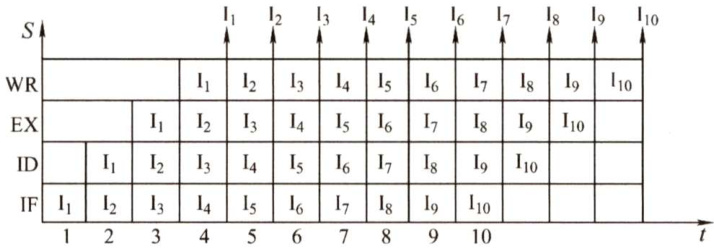  

4）由上图可知，在13个时钟周期结束时，CPU执行完10条指令，因此实际吞吐率（T）为  

$$
T={\frac{10}{100{\mathrm{ns}}\times13}}\approx7700000\cdots
$$  

03.【解答】  

第一组指令中，I1指令运算结果应先写入R1，然后在I2指令中读出R1的内容。由于I2指令进入流水线，变成I2指令在I1指令写入R1前就读出R1的内容，发生RAW相关。  

第二组指令中，I3 指令应先读出R3的内容并存入存储单元M(x)，然后在I4指令中将运算结果写入R3。但由于I4指令进入流水线，变成I4指令在I3指令读出R3 的内容前就写入R3，发生WAR相关。  

第三组指令中，若I6指令的加法运算完成时间早于I5指令的乘法运算时间，变成指令I6在指令I5写入R3前就写入R3，导致R3的内容错误，发生WAW相关。  

04.【解答】  

1）流水线功能段结构图如下图所示。  

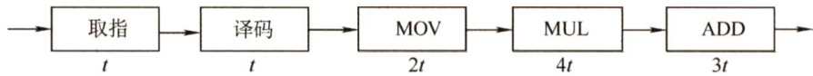  

2）三条指令存在数据相关，采用后推法得到指令执行过程流水线的时空图如下图所示（IF取指、ID译码、EX执行）。  

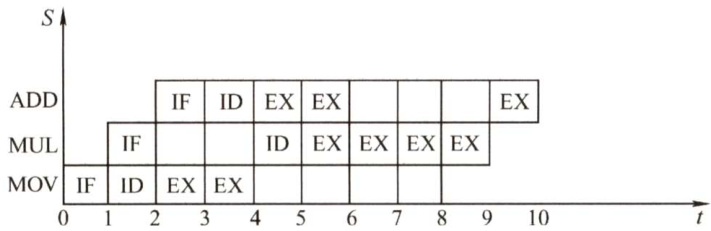  

注： $\textcircled{1}$ 图中MUL的ID阶段推迟，因为ID阶段要将R1取至MDR，且MUL与前面的MOV存在数据相关。$\textcircled{2}$ 第 $5{\sim}6$ 段时间中ADD的EX与MUL的EX不会冲突，因其不在同一个执行部件，而ADD的最后一个EX需要等MUL执行完后才能执行。  

05.【解答】  

1) $\textbf{x}$ 的机器码为 $[\mathbf{x}]_{*\mathrm{i}}=1111$ 110111111111B，即指令执行前(R1) $\mathbf{\Sigma}=\mathbf{\Sigma}$ FDFFH，右移1位后为1111111011111111B，即指令执行后 $\mathbf{\left(R1\right)}=$ FEFFH。  

2）每个时钟周期只能有一条指令进入流水线，从第5个时钟周期开始，每个时钟周期都会有一条指令执行完毕，因此至少需要 $4+(5-1)=8$ 个时钟周期。  
3） $\mathrm{I}_{3}$ 的ID段被阻塞的原因：因为 $\mathrm{I}_{3}$ 与 $\mathrm{I}_{1}$ 和 $\mathrm{I}_{2}$ 都存在数据相关，需等到 $\mathrm{I}_{1}$ 和 $\mathrm{I}_{2}$ 将结果写回寄存器后， $\mathrm{I}_{3}$ 才能读寄存器内容，所以 $\mathrm{I}_{3}$ 的ID段被阻塞。 $\mathrm{I}_{4}$ 的IF段被阻塞的原因：因为 $\mathrm{I}_{4}$ 的前一条指令 $\mathrm{I}_{3}$ 在ID段被阻塞，所以 $\mathrm{I}_{4}$ 的IF段被阻塞。注意：要求“按序发射，按序完成”，因此第2小问中下一条指令的IF必须和上一条指令的ID并行，以免因上一条指令发生冲突而导致下一条指令先执行完。  

4）因 $2^{*}\mathbf{x}$ 操作有左移和加法两种实现方法，因此 $\mathbf{x}=\mathbf{x}^{*}2+\mathbf{a}$ 对应的指令序列为  

I1 LOAD R1,[x]   
12 LOAD R2, [a]   
I3 SHL R1 //或者 ADD R1,R1   
[4 ADD R1,R2   
I5 STORE R2, [x]  

这5条指令在流水线中执行过程如下图所示。  

<html><body><table><tr><td></td><td colspan="16">时间单元</td></tr><tr><td>指令</td><td>1</td><td>2</td><td>3</td><td>4</td><td>5</td><td>6</td><td>7 8</td><td>9</td><td>10</td><td>11</td><td>12</td><td>13</td><td>14</td><td>15</td><td>16</td><td>17</td></tr><tr><td>11</td><td>IF</td><td>ID</td><td>EX</td><td>M</td><td>WB</td><td></td><td></td><td></td><td></td><td></td><td></td><td></td><td></td><td></td><td></td><td></td></tr><tr><td>12</td><td></td><td>IF</td><td>ID</td><td>EX</td><td>M</td><td>WB</td><td></td><td></td><td></td><td></td><td></td><td></td><td></td><td></td><td></td><td></td></tr><tr><td>13</td><td></td><td></td><td>IF</td><td></td><td>ID</td><td>EX</td><td>M</td><td>WB</td><td></td><td></td><td></td><td></td><td></td><td></td><td></td><td></td></tr><tr><td>14</td><td></td><td></td><td></td><td></td><td>IF</td><td></td><td></td><td></td><td>ID</td><td>EX</td><td>M</td><td>WB</td><td></td><td></td><td></td><td></td></tr><tr><td>15</td><td></td><td></td><td></td><td></td><td></td><td></td><td></td><td></td><td>IF</td><td></td><td></td><td></td><td>ID</td><td>EX</td><td>M</td><td>WB</td></tr></table></body></html>  

因此执行 $\mathbf{x}=\mathbf{x}^{*}2+\mathbf{a}$ 语句最少需要17个时钟周期。  

06.【解答】  

该题为计算机组成原理的综合题型，难度较大。该题涉及指令系统、存储管理和CPU三部分内容，特别是五流水段流水线考生应高度重视这部分知识。  

整个指令执行过程中各流水段的时间是相同的，受统一的时钟控制。各流水段在5.6.1节中介绍过，这里讨论流水段发生阻塞的情况：  

$\textcircled{1}$ 若上一条指令的WB写回的寄存器与本指令对应的寄存器相同，会发生资源冲突。这时有3个时钟周期的阻塞，使本指令ID应在上一条WB后，如下图所示。  

<html><body><table><tr><td></td><td colspan="13">时间单元</td></tr><tr><td>指令</td><td>1</td><td>2</td><td>3</td><td>4</td><td>5</td><td>6</td><td>7</td><td>8</td><td>9</td><td>10</td><td>11</td><td>12</td><td>13</td><td>14</td></tr><tr><td>I</td><td>IF</td><td>ID</td><td>EX</td><td>M</td><td>WB</td><td></td><td></td><td></td><td></td><td></td><td></td><td></td><td></td><td></td></tr><tr><td>I</td><td></td><td>IF</td><td>ID</td><td>EX</td><td>M</td><td>WB</td><td></td><td></td><td></td><td></td><td></td><td></td><td></td><td></td></tr><tr><td>I</td><td></td><td></td><td>IF</td><td></td><td></td><td></td><td>ID</td><td>EX</td><td>M</td><td>WB</td><td></td><td></td><td></td><td></td></tr><tr><td>I4</td><td></td><td></td><td></td><td></td><td></td><td></td><td>IF</td><td></td><td></td><td></td><td>ID</td><td>EX</td><td>M</td><td>WB</td></tr></table></body></html>  

第三条指令阻塞了3个时钟周期。  

$\textcircled{2}$ 跳转指令（JMP）（bra)：由于流水线默认直接提取下一条指令，若指令为JMP或JC（根据情况预判跳转结果)，在没有分支预测的情况下，默认有3个时钟周期的阻塞使本指令ID应在上一条WB后。bne表示条件跳转（branchnotequal）指令。  
在了解上面的基础知识后，我们再看这道大题。  

1）已知计算机M采用32位定长指令字，即一条指令占4B，观察表中各指令的地址可知，每条指令的地址差为4个地址单位，即4个地址单位代表 4B，一个地址单位就代表了1B，所以该计算机是按字节编址的。  

2）在二进制中某数左移两位相当于乘以4，由该条件可知，数组间的数据间隔为4个地址单位，而计算机按字节编址，所以数组A中的每个元素占4B。  

3）由表可知，bne指令的机器代码为1446FFFAH，根据题目给出的指令格式，后2B的内容为OFFSET字段，所以该指令的OFFSET字段为FFFAH，用补码表示，值为-6。系统执行到bne指令时，PC自动加4，PC的内容为08048118H，而跳转的目标是08048100H，两者相差了 $18\mathrm{H}$ ，即24个单位的地址间隔，所以偏移地址的一位即是真实跳转地址的 $-24/-6~=~4$ 位。可知bne指令的转移目标地址计算公式为(PC）+4 +OFFSET $\times4$ 。  

4）由于数据相关而发生阻塞的指令为第2、3、4、6条，因为第2、3、4、6条指令都与各自前一条指令发生数据相关。第6条指令会发生控制冒险。当前循环的第5条指令与下次循环的第1条指令虽然有数据相关，但由于第6条指令后有3个时钟周期的阻塞，因而消除了该数据相关。  

07.【解答】  

该题继承了上题中的相关信息，统考中首次引入此种设置，具体考查程序的运行结果、Cache 的大小和命中率的计算，以及磁盘和TLB 的相关计算，是一道比较综合的题型。2015 年同样出现了23分大题的设定，希望读者对其足够重视。  

1）R2中装的是i的值，循环条件是 $\mathrm{\Large~i~}<\mathrm{N}(1000)$ ，即当i自增到不满足这个条件时跳出循环，程序结束，所以此时i的值为1000。  
2）Cache共有16行，每块32字节，所以Cache数据区的容量为 $16\times32\mathrm{B}=512\mathrm{B}$ 。P共有6条指令，占24B，小于主存块大小32B，其起始地址为 $0804~8100\mathrm{H}$ ，对应一块的开始位置，由此可知所有指令都在一个主存块内。读取第一条指令时会发生Cache 缺  

失，因此将P所在的主存块调入Cache 的某一行，以后每次读取指令时，都能在指令Cache 中命中。因此在1000次循环中，只会发生1次指令访问缺失，所以指令Cache 的命中率为 $(1000{\times}6-1)/(1000{\times}6)=99.98\%$ 0  

3）指令4为加法指令，即对应 $\mathbf{sum}+\mathbf{\bar{\rho}}=\mathbf{A}[\mathrm{i}]$ ，当数组A中元素的值过大时，会导致这条加法指令发生溢出异常；而指令2、5虽然都是加法指令，但它们分别为数组地址的计算指令和存储变量i的寄存器进行自增的指令，而i最大到达1000，所以它们都不会产生溢出异常。  

只有访存指令可能产生缺页异常，即指令3可能产生缺页异常。因为数组A在磁盘的一页上，而一开始数组并不在主存中，第一次访问数组时会导致访盘，把A调入内存，而以后数组A的元素都在内存中，不会导致访盘，所以该程序共访盘一次。  

每访问一次内存数据就会查一次TLB，共访问数组1000次，所以此时又访问1000 次TLB，还要考虑到第一次访问数组A，即访问A[0]时，会多访问一次TLB（第一次访问A[0]时会先查一次TLB，然后产生缺页，处理完缺页中断后，会重新访问A[0]，此时又查TLB)，所以访问TLB的次数一共是1001次。