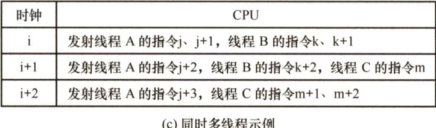
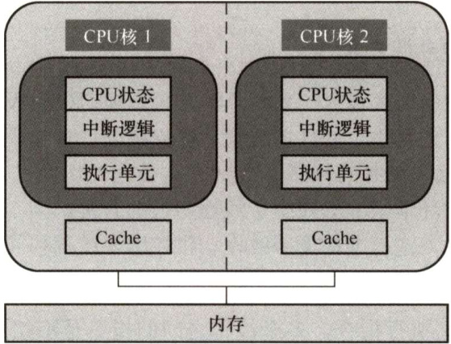

#### 5.7 多处理器的基本概念  

#### 5.7.1 SISD、SIMD、MIMD的基本概念  

基于指令流的数量和数据流的数量，将计算机体系结构分为SISD、SIMD、MISD和MIMI四类。常规的单处理器属于SISD，而常规的多处理器属于MIMD。  

#### 1.单指令流单数据流（SISD）结构  

SISD 是传统的串行计算机结构，这种计算机通常仅包含一个处理器和一个存储器，处理器在一段时间内仅执行一条指令，按指令流规定的顺序串行执行指令流中的若干条指令。为了提高速度，有些 SISD 计算机采用流水线的方式，因此，SISD 处理器有时会设置多个功能部件，并且采用多模块交叉方式组织存储器。本书前面介绍的内容多属于SISD结构。  

#### 2.单指令流多数据流（SIMD）结构  

SIMD 是指一个指令流同时对多个数据流进行处理，一般称为数据级并行技术。这种结构的计算机通常由一个指令控制部件、多个处理单元组成。每个处理单元虽然执行的都是同一条指令，但是每个单元都有自己的地址寄存器，这样每个单元就都有不同的数据地址，因此，不同处理单元执行的同一条指令所处理的数据是不同的。一个顺序应用程序被编译后，可能按 SISD组织并运行于串行硬件上，也可能按SIMD组织并运行于并行硬件上。  

SIMD 在使用for 循环处理数组时最有效，比如，一条分别对16 对数据进行运算的 SIMD指令如果在16 个ALU中同时运算，则只需要一次运算时间就能完成运算。SIMD 在使用 case或switch语句时效率最低，此时每个执行单元必须根据不同的数据执行不同的操作。  

#### 3.多指令流单数据流（MISD）结构  

MISD是指同时执行多条指令，处理同一个数据，实际上不存在这样的计算机。  

#### 4.多指令流多数据流（MIMD）结构  

MIMD是指同时执行多条指令分别处理多个不同的数据，MIMD分为多计算机系统和多处理器系统。多计算机系统中的每个计算机节点都具有各自的私有存储器，并且具有独立的主存地址空间，不能通过存取指令来访问不同节点的私有存储器，而要通过消息传递进行数据传送，也称消息传递MIMD。多处理器系统是共享存储多处理器（SMP）系统的简称，它具有共享的单一地址空间，通过存取指令来访问系统中的所有存储器，也称共享存储MIMD。  

向量处理器是SIMD的变体，是一种实现了直接操作一维数组（向量）指令集的CPU，而串行处理器只能处理单一数据集。其基本理念是将从存储器中收集的一组数据按顺序放到一组向量寄存器中，然后以流水化的方式对它们依次操作，最后将结果写回寄存器。向量处理器在特定工作环境中极大地提升了性能，尤其是在数值模拟或者相似的领域中。  

SIMD 和MIMD 是两种并行计算模式，其中SIMD是一种数据级并行模式，而MIMD 是一种并行程度更高的线程级并行或线程级以上并行计算模式。  

#### 5.7.2 硬件多线程的基本概念  

在传统CPU中，线程的切换包含一系列开销，频繁地切换会极大影响系统的性能，为了减少线程切换过程中的开销，便诞生了硬件多线程。在支持硬件多线程的CPU 中，必须为每个线程提供单独的通用寄存器组、单独的程序计数器等，线程的切换只需激活选中的寄存器，从而省略了与存储器数据交换的环节，大大减少了线程切换的开销。  

硬件多线程有3种实现方式：细粒度多线程、粗粒度多线程和同时多线程（SMT)。  

#### 1．细粒度多线程  

多个线程之间轮流交叉执行指令，多个线程之间的指令是不相关的，可以乱序并行执行。在这种方式下，处理器能在每个时钟周期切换线程。例如，在时钟周期i，将线程A中的多条指令发射执行；在时钟周期i+1，将线程B中的多条指令发射执行。  

#### 2.粗粒度多线程  

仅在一个线程出现了较大开销的阻塞时，才切换线程，如Cache 缺失。在这种方式下，当发生流水线阻塞时，必须清除被阻塞的流水线，新线程的指令开始执行前需要重载流水线，因此，线程切换的开销比细粒度多线程更大。  

#### 3.同时多线程  

同时多线程（SMT）是上述两种多线程技术的变体。它在实现指令级并行的同时，实现线程级并行，也就是说，它在同一个时钟周期中，发射多个不同线程中的多条指令执行。  

<html><body><table><tr><td>时钟</td><td>CPU</td></tr><tr><td>i</td><td>发射线程A的指令j、j+1</td></tr><tr><td>i+1</td><td>发射线程B的指令k、k+1</td></tr><tr><td>i+2</td><td>发射线程A的指令j+2、j+3</td></tr><tr><td>i+3</td><td>发射线程B的指令k+2、k+3</td></tr></table></body></html>  

(b)粗粒度多线程示例   

<html><body><table><tr><td>时钟</td><td>CPU</td></tr><tr><td>i</td><td>发射线程A的指令j、j+1</td></tr><tr><td>i+1</td><td>发射线程A的指令j+2、j+3，发现Cachemiss</td></tr><tr><td>i+2</td><td>线程调度，从A切换到B</td></tr><tr><td>i+3</td><td>发射线程B的指令k、k+1</td></tr><tr><td>i+4</td><td>发射线程B的指令k+2、k+3</td></tr></table></body></html>  

(a)细粒度多线程示例  

  
图5.22分别是三种硬件多线程实现方式的调度示例。  
  
图5.22三种硬件多线程方式的调度示例  

Intel 处理器中的超线程（Hyper-threading）就是同时多线程SMT，即在一个单处理器或单个核中设置了两套线程状态部件，共享高速缓存和功能部件。  

#### 5.7.3 多核处理器的基本概念  

多核处理器是指将多个处理单元集成到单个CPU中，每个处理单元称为一个核（core)。每个核可以有自己的Cache，也可以共享同一个Cache。所有核一般都是对称的，并且共享主存储器，因此多核属于共享存储的对称多处理器。图5.23是一个不共享Cache的双核CPU结构。  

  
图5.23不共享Cache的双核CPU结构  

在多核计算机系统中，如要充分发挥硬件的性能，必须采用多线程（或多进程）执行，使得每个核在同一时刻都有线程在执行。与单核上的多线程不同，多核上的多个线程是在物理上并行执行的，是真正意义上的并行执行，在同一时刻有多个线程在并行执行。而单核上的多线程是一种多线程交错执行，实际上在同一时刻只有一个线程在执行。  

下面通过一个例子来理解相关的概念。假设要将四颗圆石头滚到马路对面，滚动每颗石头平均需花费1分钟。串行处理器会逐一滚动每颗石头，花费4分钟。拥有两个核的多核处理器让两个人去滚石头，即每人滚两颗，花费2分钟。向量处理器找到一根长木板，放在四颗石头后面，推动木板即可同时滚动四块石头，理论上只要力量够大，就只需要1分钟。多核处理器相当于拥有多名工人，而向量处理器拥有一种方法，可以同时对多件事进行相同的操作。  

#### 5.7.4共享内存多处理器的基本概念  

具有共享的单一物理地址空间的多处理器被称为共享内存多处理器（SMP)。处理器通过存储器中的共享变量互相通信，所有处理器都能通过存取指令访问任何存储器的位置。注意，即使这些系统共享同一个物理地址空间，它们仍然可在自己的虚拟地址空间中单独地运行程序。  

单一地址空间的多处理器有两种类型。第一类，每个处理器对所有存储单元的访问时间是大致相同的，即访问时间与哪个处理器提出访存请求及访问哪个字无关，这类机器被称为统一存储访问（UMA）多处理器。第二类，某些访存请求要比其他的快，具体取决于哪个处理器提出了访问请求以及访问哪个字，这是由于主存被分割并分配给了同一机器上的不同处理器或内存控制器，这类机器被称为非统一存储访问（NUMA）多处理器。  

·统一存储访问（UMA）多处理器：根据处理器与共享存储器之间的连接方式，分为基于总线、基于交叉开关网络和基于多级交换网络连接等几种处理器。  
·非统一存储访问（NUMA）多处理器：处理器中不带高速缓存时，被称为NC-NUMA;处理器中带有一致性高速缓存时，被称为CC-NUMA。  

早期的计算机，内存控制器没有整合进CPU，访存操作需要经过北桥芯片（集成了内存控制器，并与内存相连)，CPU 通过前端总线和北桥芯片相连，这就是统一存储访问（UMA）构架。随着CPU 性能提升由提高主频转到增加CPU 数量（多核、多CPU)，越来越多的CPU 对前端总线的争用使得前端总线成为瓶颈。为了消除UMA 架构的瓶颈，非统一存储访问（NUMA）构架诞生，内存控制器被集成到CPU内部，每个CPU都有独立的内存控制器。每个CPU 都独立连接到一部分内存，CPU直连的这部分内存被称为本地内存。CPU之间通过QPI总线相连。CPU可以通过QPI总线访问其他CPU的远程内存。与UMA 架构不同的是，在NUMA架构下，内存的访问出现了本地和远程的区别，访问本地内存明显要快于访问远程内存。  

由于可能会出现多个处理器同时访问同一共享变量的情况，在操作共享变量时需要进行同步，否则，一个处理器可能会在其他处理器尚未完成对共享变量的修改时，就开始使用该变量。常用方法是通过对共享变量加锁的方式来控制对共享变量互斥访问。在一个时刻只能有一个处理器获得锁，其他要操作该共享变量的处理器必须等待，直到该处理器解锁该变量为止。  

#### 5.7.5 本节习题精选  

#### 单项选择题  

01．按照Flynn提出的计算机系统分类方法，多处理机属于（）。  

A. SISD B. SIMD C. MISD D. MIMI具有一个控制部件和多个处理单元的计算机系统属于（）结构。  

A. SISD B. SIMD C. MISD D. MIMD  

3.下列关于超线程（HT）技术的描述中，正确的是（）。  

A.超线程技术可以令四核的IntelCorei7处理器变成八核B.超线程是一项硬件技术，能使系统性能大幅提升，与操作系统和应用软件无关C.含有超线程技术的CPU需要芯片组的支持才能发挥技术优势D．超线程模拟出的每个CPU核都具有独立的资源，各自工作互不干扰  

04.双核CPU和超线程CPU的共同点是（）。  

A．都有两个内核 B.都能同时执行两个运算C.都包含两个CPU D.都不会出现争抢资源的现象  

05.下列关于双核技术的叙述中，正确的是（）。  

A．双核是指主板上有两个CPUB．双核是利用超线程技术实现的C．双核是指在CPU上集成两个运算核心D．双核CPU是时间并行的并行计算  

06.下列有关多核CPU和单核CPU的描述中，错误的是（）。  

A.双核的频率为2.4GHZ，那么其中每个核心的频率也是2.4GHZ  
B．采用双核CPU可以降低计算机系统的功耗和体积  
C．多核CPU共用一组内存，数据共享  
D.所有程序在多核CPU上运行速度都快  

07．下列关于多核CPU的描述中，正确的是（）。  

A.各核心完全对称，拥有各自的Cache  
B.任何程序都可以同时在多个核心上运行  
C.一颗CPU中集成了多个完整的执行内核，可同时进行多个运算  

D.只有使用了多核CPU的计算机，才支持多任务操作系统  

08．下列关于多处理器的说法中，正确的是（）。  

I．一般采用偶数路CPU，如2路、4路、6路等II.NUMA构架比UMA构架的运算扩展性要强III.UMA构架需要解决的重要问题是Cache一致性  

A.I B.I和Ⅱ C.I和IⅢI D.I、Ⅱ和Ⅲ  

#### 5.7.6 答案与解析  

#### 单项选择题  

01.D  

Flynn 分类法将计算机体系结构分为SISD、SIMD、MISD和MIMD四类。常规的单处理器属于SISD，常规的多处理机属于MIMD。  

#### 02.B  

单指令流多数据流（SIMD）结构的计算机通常由一个指令控制部件、多个处理单元组成，不同处理单元执行的同一条指令所处理的数据可以不同。  

#### 03.C  

超线程技术是在一个CPU中，提供两套线程处理单元，让单个处理器实现线程级并行。虽然采用超线程技术能够同时执行两个线程，但是当两个线程同时需要某个资源时，其中一个线程必须暂时挂起，直到这些资源空闲后才能继续运行。因此，超线程的性能并不等于两个CPU的性能。而且，超线程技术的CPU 需要芯片组、操作系统（如Windows 98 不支持超线程技术）和应用软件的支持，才能发挥该项技术的优势。双核技术是指将两个一样的CPU 集成到一个封装内（或者直接将两个CPU 做成一个芯片)，而超线程技术在CPU 内部仅复制必要的线程资源来让两个线程同时运行，能并行执行两个线程，模拟实体双核心。仅C正确。  

#### 04.B  

超线程技术在CPU内部仅复制必要的线程资源，共享CPU 的高速缓存和功能部件，让两个线程可以并行执行，模拟双核心CPU，A、C 错误。当两个线程同时需要某个共享资源时，其中一个线程必须暂时挂起，直到这些资源空闲后才能继续运行，D错误。B正确。  

#### 05.C  

双核是指将两个CPU 核心集成到一个封装中，核心又称内核，是CPU 最重要的组成部分，C 正确。主板上有两个CPU 属于多处理器，A 错误。超线程技术是模拟实体双核，并不能算作真正意义上的双核，B错误。时间并行是指流水线技术，空间并行则是指硬件资源的重复，空间并行导致了两类并行机的产生，按Flynn分类法分为SIMD和MIMD，D错误。  

06.D  

多核CPU的核心通常都是对称的，因此2.4GHz双核CPU中两个核的主频也是 $2.4\mathrm{GHz}$ ，A正确。早期CPU 性能提升主要靠提高主频，导致功耗增大，发热量大，而且当主频提高到一定程度后，CPU 性能的提升不再明显，后来转到增加CPU 核心的方向，将2个核心集成到一个芯片内，提供等同双 CPU 的性能，这显然也降低了CPU 的体积，B 正确。C 显然正确。在多核CPU上运行一个不支持多线程的程序，显然不能发挥多核CPU的优势，D错误。  

07.C  

多核 CPU 的各核心可以有独自的Cache，也可以共享同一个Cache，A 错误。只有支持多线程的并行处理程序才能同时在多个核心上运行，发挥多核的优势，B 错误。C 正确。多任务系统又称多道程序系统，可以运行在单核CPU上，宏观上并行，微观上串行，D错误。  

08.D  

解析请扫右侧二维码查阅。