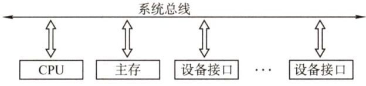
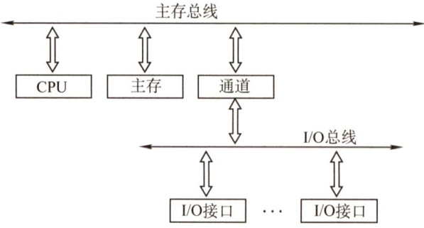
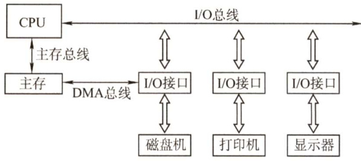

#### 6.1 总线概述  

随着IO设备的种类和数量越来越多，为了更好地解决IO设备和主机之间连接的灵活性，计算机的结构从分散连接发展为总线连接。为了进一步简化设计，又提出了各类总线标准。  

#### 6.1.1 总线基本概念  

#### 1.总线的定义  

总线是一组能为多个部件分时共享的公共信息传送线路。分时和共享是总线的两个特点。分时是指同一时刻只允许有一个部件向总线发送信息，若系统中有多个部件，则它们只能分时地向总线发送信息。共享是指总线上可以挂接多个部件，各个部件之间互相交换的信息都可通过这组线路分时共享，多个部件可同时从总线上接收相同的信息。  

#### 2.总线设备  

总线上所连接的设备，按其对总线有无控制功能可分为主设备和从设备两种。  

主设备：指获得总线控制权的设备。  
从设备：指被主设备访问的设备，它只能响应从主设备发来的各种总线命令。  

#### 3.总线特性  

总线特性是指机械特性（尺寸、形状）、电气特性（传输方向和有效的电平范围）、功能特性（每根传输线的功能）和时间特性（信号和时序的关系)。  

#### 6.1.2 总线的分类  

计算机系统中的总线，按功能划分为以下3类。  

#### 1．片内总线  

片内总线是芯片内部的总线，它是CPU芯片内部寄存器与寄存器之间、寄存器与ALU 之间的公共连接线。  

#### 2.系统总线  

系统总线是计算机系统内各功能部件（CPU、主存、I/O 接口）之间相互连接的总线。按系统总线传输信息内容的不同，又可分为3类：数据总线、地址总线和控制总线。  

1）数据总线用来传输各功能部件之间的数据信息，它是双向传输总线，其位数与机器字长、存储字长有关。  
2）地址总线用来指出数据总线上的源数据或目的数据所在的主存单元或IO端口的地址，它是单向传输总线，地址总线的位数与主存地址空间的大小有关。  
3）控制总线传输的是控制信息，包括CPU送出的控制命令和主存（或外设）返回CPU的反馈信号。  

注意区分数据通路和数据总线：各个功能部件通过数据总线连接形成的数据传输路径称为数据通路。数据通路表示的是数据流经的路径，而数据总线是承载的媒介。  

#### 3.IO总线  

IO总线主要用于连接中低速的I/O设备，通过I/O接口与系统总线相连接，目的是将低速设备与高速总线分离，以提升总线的系统性能，常见的有USB、PCI总线。  

#### 4.通信总线  

通信总线是在计算机系统之间或计算机系统与其他系统（如远程通信设备、测试设备）之间传送信息的总线，通信总线也称外部总线。  

此外，按时序控制方式可将总线划分为同步总线和异步总线，还可按数据传输格式将总线划分为并行总线和串行总线。  

#### 6.1.3 系统总线的结构  

#### 1.单总线结构  

单总线结构将CPU、主存、I/O设备（通过I/O接口）都挂在一组总线上，允许I/O设备之间、IO设备与主存之间直接交换信息，如图6.1所示。CPU与主存、CPU与外设之间可直接进行信息交换，而无须经过中间设备的干预。  

  
图6.1单总线结构  

注意，单总线并不是指只有一根信号线，系统总线按传送信息的不同可细分为地址总线、数据总线和控制总线。  

优点：结构简单，成本低，易于接入新的设备。  

缺点：带宽低、负载重，多个部件只能争用唯一的总线，且不支持并发传送操作。  

#### 2.双总线结构  

双总线结构有两条总线：一条是主存总线，用于在CPU、主存和通道之间传送数据；另一条是I/O总线，用于在多个外部设备与通道之间传送数据，如图6.2所示。  

优点：将低速I/O设备从单总线上分离出来，实现了存储器总线和I/O总线分离。  
缺点：需要增加通道等硬件设备。  

#### 3.三总线结构  

三总线结构是在计算机系统各部件之间采用3条各自独立的总线来构成信息通路，这3条总线分别为主存总线、I/O总线和直接内存访问（DMA）总线，如图6.3所示。  

  
图6.2双总线结构  

  
图6.3三总线结构  

主存总线用于在CPU和内存之间传送地址、数据和控制信息。I/O总线用于在CPU和各类外设之间通信。DMA总线用于在内存和高速外设之间直接传送数据。  

优点：提高了I/O设备的性能，使其更快地响应命令，提高系统吞吐量。  

缺点：系统工作效率较低。  

#### 6.1.4 常见的总线标准  

总线标准是国际上公布的互连各个模块的标准，是把各种不同的模块组成计算机系统时必须遵守的规范。典型的总线标准有ISA、EISA、VESA、PCI、AGP、PCI-ExpresS、USB 等。它们的主要区别是总线宽度、带宽、时钟频率、寻址能力、是否支持突发传送等。  

1）ISA，Industry Standard Architecture，工业标准体系结构。是最早出现的微型计算机的系统总线，应用在IBM的AT机上。  
2）EISA，Extended Industry Standard Architecture，扩展的ISA。是为配合 32 位CPU 而设计的扩展总线，EISA对ISA完全兼容。  
3）VESA，Video Electronics Standards Association，视频电子标准协会。是一个32 位的局部总线，是针对多媒体PC要求高速传送活动图像的大量数据而推出的。  
4）PCI，PeripheralComponent Interconnect，外部设备互连。是高性能的 32 位或 64 位总线，是专为高度集成的外围部件、扩充插板和处理器/存储器系统设计的互连机制。目前常用的PCI适配器有显卡、声卡、网卡等。PCI总线支持即插即用。PCI总线是一个与处理器时钟频率无关的高速外围总线，属于局部总线。  
5）AGP，Accelerated GraphicsPort，加速图形接口。是一种视频接口标准，专用于连接主存和图形存储器，用于传输视频和三维图形数据，属于局部总线。  
6）PCI-E，PCI-Express。是最新的总线接口标准，它将全面取代现行的PCI和AGP。  
7）RS-232C。是由美国电子工业协会（EIA）推荐的一种串行通信总线，是应用于串行二进制交换的数据终端设备（DTE）和数据通信设备（DCE）之间的标准接口。  
8）USB，UniversalSerialBus，通用串行总线。是一种连接外部设备的I/O总线，属于设备总线。具有即插即用、热插拔等优点，有很强的连接能力。  
9）PCMCIA，Personal Computer Memory Card International Association。广泛应用于笔记本电脑的一种接口标准，是一个用于扩展功能的小型插槽。具有即插即用功能。  
10）IDE，Integrated Drive Electronics，集成设备电路。更准确地称为 ATA，是一种IDE 接口磁盘驱动器接口类型，硬盘和光驱通过IDE接口与主板连接。  
11）SCSI，SmallComputer SystemInterface，小型计算机系统接口。是一种用于计算机和智能设备之间（硬盘、软驱）系统级接口的独立处理器标准。  
12）SATA，Serial Advanced Technology Attachment，串行高级技术附件。是一种基于行业标准的串行硬件驱动器接口，是由Intel、IBM、Dell等公司共同提出的硬盘接口规范。  

#### 6.1.5 总线的性能指标  

1）总线传输周期。指一次总线操作所需的时间，包括申请阶段、寻址阶段、传输阶段和结束阶段。总线传输周期通常由若干总线时钟周期构成。  
2）总线时钟周期。即机器的时钟周期。计算机有一个统一的时钟，以控制整个计算机的各个部件，总线也要受此时钟的控制。  
3）总线工作频率。总线上各种操作的频率，为总线周期的倒数。实际上指1秒内传送几次数据。若总线周期 $\mathbf{\Psi}=N$ 个时钟周期，则总线的工作频率 $\mathbf{\Sigma}=\mathbf{\Sigma}$ 时钟频率/N。  
4）总线时钟频率。即机器的时钟频率，它为时钟周期的倒数。  
5）总线宽度。又称总线位宽，它是总线上同时能够传输的数据位数，通常指数据总线的根数，如32根称为32位总线。  
6）总线带宽。可理解为总线的最大数据传输率，即单位时间内总线上最多可传输数据的位数，通常用每秒传送信息的字节数来衡量，单位可用字节/秒（B/s）表示。总线带宽 $\mathbf{\Sigma}=\mathbf{\Sigma}$ 总线工作频率 $.{}\times.{}$ （总线宽度/8）。注意：总线带宽和总线宽度应加以区别。  
7）总线复用。总线复用是指一种信号线在不同的时间传输不同的信息，因此可以使用较少的线传输更多的信息，从而节省空间和成本。  
8）信号线数。地址总线、数据总线和控制总线3种总线数的总和称为信号线数。其中，总线的最主要性能指标为总线宽度、总线（工作）频率、总线带宽，总线带宽是指总线本身所能达到的最高传输速率，它是衡量总线性能的重要指标。三者关系：总线带宽 $\mathbf{\Sigma}=\mathbf{\Sigma}$ 总线宽度 $\times$ 总线频率。例如，总线工作频率为 $22\mathrm{MHz}$ ，总线宽度为16位，则总线带宽 $=22\times(16/8)=44\mathrm{MB/s}$ 。  

#### 6.1.6 本节习题精选  

#### 一、单项选择题  

01．挂接在总线上的多个部件（）。  

A．只能分时向总线发送数据，并只能分时从总线接收数据B.只能分时向总线发送数据，但可同时从总线接收数据C. 可同时向总线发送数据，并同时从总线接收数据D. 可同时向总线发送数据，但只能分时从总线接收数据  

02.在总线上，同一时刻（）。  

A．只能有一个主设备控制总线传输操作B．只能有一个从设备控制总线传输操作C．只能有一个主设备和一个从设备控制总线传输操作D．可以有多个主设备控制总线传输操作  

03．在计算机系统中，多个系统部件之间信息传送的公共通路称为总线，就其所传送的信息的性质而言，下列（）不是在公共通路上传送的信息。  

A．数据信息 B．地址信息 C.系统信息 D.控制信息  

04.系统总线用来连接（）。  

A.寄存器和运算器部件 B.运算器和控制器部件 C.CPU、主存和外设部件 D．接口和外部设备  

05.计算机使用总线结构便于增减外设，同时（）。  

A.减少信息传输量 B.提高信息的传输速度C.减少信息传输线的条数 D.提高信息传输的并行性  

06.间址寻址第一次访问内存所得到的信息经系统总线的（）传送到CPU。  

A．数据总线 B．地址总线 C.控制总线 D.总线控制器  

07．系统总线中地址线的功能是（）。  

A.选择主存单元地址 B.选择进行信息传输的设备C．选择外存地址 D.指定主存和IO设备接口电路的地址  

08.在单机系统中，三总线结构计算机的总线系统组成是（）。  

A.片内总线、系统总线和通信总线 B.数据总线、地址总线和控制总线C.DMA总线、主存总线和I/O总线 D.ISA总线、VESA总线和PCI总线  

09.不同信号在同一条信号线上分时传输的方式称为（）。  

A.总线复用方式 B．并串行传输方式C．并行传输方式 D．串行传输方式  

10．主存通过（）来识别信息是地址还是数据。  

A.总线的类型 B．存储器数据寄存器（MDR）C.存储器地址寄存器（MAR） D.控制单元（CU）  

11.在32位总线系统中，若时钟频率为 ${500}\mathrm{MHz}$ ，传送一个32位字需要5个时钟周期，则该总线的数据传输率是（）。  

A. $200\mathrm{MB/s}$ B. $400\mathrm{MB/s}$ C. 600MB/s D. 800MB/s  

12.传输一幅分辨率为 $640\times480$ 像素、颜色数量为65536的照片（采用无压缩方式），设有效数据传输率为 $56\mathrm{kb/s}$ ，大约需要的时间是（）。  

A.34.82s B.43.86s C. 85.71s D.87.77s  

13．某总线有104根信号线，其中数据线（DB）为32根，若总线工作频率为 $33\mathrm{{MHz}}$ ，则其理论最大传输率为（）。  

A.33MB/s B.64MB/s C. 132MB/s D. 164MB/s  

14．在一个16位的总线系统中，若时钟频率为 ${100}\mathrm{MHz}$ ，总线周期为5个时钟周期传输一个字，则总线带宽是（）。  

A.4MB/s B. 40MB/s C. 16MB/s D.64MB/s  

15.微机中控制总线上完整传输的信号有（）。  

I．存储器和I/O设备的地址码ⅡI．所有存储器和IO设备的时序信号与控制信号III．来自I/O设备和存储器的响应信号  

A.仅I B.Ⅱ和III C.仅Ⅱ D.I、Ⅱ、IⅢI  

16．下列总线标准中属于串行总线的是（）。  

A. PCI B.USB C. EISA D. ISA  

17.在现代微机主板上，采用局部总线技术的作用是（）。  

A.节省系统的总带宽 B．提高抗干扰能力C.抑制总线终端反射 D.构成紧耦合系统  

18．下列不属于计算机局部总线的是（）。  

A.VESA B.PCI C.AGP D.ISA  

19.【2009统考真题】假设某系统总线在一个总线周期中并行传输4字节信息，一个总线周期占用2个时钟周期，总线时钟频率为 ${\boldsymbol{10}}\mathbf{MHz}$ ，则总线带宽是（）。  

A.10MB/s B.20MB/s C. 40MB/s D. 80MB/s  

20.【2010统考真题】下列选项中的英文缩写均为总线标准的是（）。  

A.PCI、CRT、USB、EISA B.ISA、CPI、VESA、EISAC.ISA、SCSI、RAM、MIPS D.ISA、EISA、PCI、PCI-Express  

21.【2011统考真题】在系统总线的数据线上，不可能传输的是（）。  

A.指令 B.操作数 C.握手（应答）信号 D．中断类型号  

22.【2012统考真题】某同步总线的时钟频率为 ${100}\mathrm{MHz}$ ，宽度为32位，地址/数据线复用，每传输一个地址或数据占用一个时钟周期。若该总线支持突发（猝发）传输方式，则一次“主存写”总线事务传输128位数据所需要的时间至少是（）。  

A.20ns B. 40ns C. 50ns D. 80ns  

23.【2012统考真题】下列关于USB总线特性的描述中，错误的是（）。  

A.可实现外设的即插即用和热拔插 B.可通过级联方式连接多台外设C.是一种通信总线，连接不同外设 D.同时可传输2位数据，数据传输率高  

24.【2013统考真题】下列选项中，用于设备和设备控制器（I/O接口）之间互连的接口标准是（）。  

A.PCI B.USB C.AGP D. PCI-Express  

25.【2014统考真题】某同步总线采用数据线和地址线复用方式，其中地址/数据线有32根，总线时钟频率为66MHz，每个时钟周期传送两次数据（上升沿和下降沿各传送一次数据），该总线的最大数据传输率（总线带宽）是（）。  

A.132MB/s B.264MB/s C. 528MB/s D. 1056MB/s  

26.【2014统考真题】一次总线事务中，主设备只需给出一个首地址，从设备就能从首地址开始的若干连续单元读出或写入多个数据。这种总线事务方式称为（）。  

A．并行传输 B．串行传输 C．突发传输 D.同步传输  

27.【2015统考真题】下列有关总线定时的叙述中，错误的是（）。  

A．异步通信方式中，全互锁协议最慢B．异步通信方式中，非互锁协议的可靠性最差C．同步通信方式中，同步时钟信号可由各设备提供D.半同步通信方式中，握手信号的采样由同步时钟控制  

28.【2016统考真题】下列关于总线设计的叙述中，错误的是（）。  

A.并行总线传输比串行总线传输速度快B．采用信号线复用技术可减少信号线数量C．采用突发传输方式可提高总线数据传输率D．采用分离事务通信方式可提高总线利用率  

29.【2017统考真题】下列关于多总线结构的叙述中，错误的是（）。  

A.靠近CPU的总线速度较快 B.存储器总线可支持突发传送方式C.总线之间须通过桥接器相连 D.PCI-Express $\times16$ 采用并行传输方式  

30.【2018统考真题】下列选项中，可提高同步总线数据传输率的是（）。  

I．增加总线宽度 ⅡI提高总线工作频率III．支持突发传输 IV．采用地址/数据线复用A.仅I、Ⅱ B.仅I、Ⅱ、IⅢ C.仅III、IV D.I、Ⅱ、IⅢ和IV  

31.【2019统考真题】假定一台计算机采用3通道存储器总线，配套的内存条型号为DDR3-1333，即内存条所接插的存储器总线的工作频率为 $1333\mathrm{MHz}$ ，总线宽度为64位，则存储器总线的总带宽大约是（）。  

A.10.66GB/s B.32GB/s C. 64GB/s D. 96GB/s  

32.【2020统考真题】QPI总线是一种点对点全工同步串行总线，总线上的设备可同时接收和发送信息，每个方向可同时传输20位信息（16位数据+4位校验位），每个QPI数据包有80位信息，分2个时钟周期传送，每个时钟周期传递2次。因此，QPI总线带宽为：每秒传送次数 $\times2\mathbf{B}\times2$ 。若QPI时钟频率为 $2.4\mathrm{GHz}$ ，则总线带宽为（）。  

A.4.8GB/s B.9.6GB/s C.19.2GB/s D.38.4GB/s  

#### 二、综合应用题  

01．某总线的时钟频率为66MHz，在一个64位总线中，总线数据传输的周期是7个时钟周期传输6个字的数据块。  

1）总线的数据传输率是多少？  
2）若不改变数据块的大小，而将时钟频率减半，这时总线的数据传输率是多少？  

02．某总线支持二级Cache块传输方式，若每块6个字，每个字长4字节，时钟频率为$100\mathrm{MHz_{\circ}}$ 1）读操作时，第一个时钟周期接收地址，第二、三个为延时周期，另用4个周期传送一个块。读操作的总线传输速率为多少？2）写操作时，第一个时钟周期接收地址，第二个为延时周期，另用4个周期传送一个块，写操作的总线传输速率是多少？3）设在全部的传输中， $70\%$ 用于读， $30\%$ 用于写，该总线在本次传输中的平均传输速率是多少？  

#### 6.1.7 答案与解析  

#### 一、单项选择题  

01.B  

为了使总线上的数据不发生“冲突”，挂在总线上的多个设备只能分时地向总线发送数据，即某个时刻只能有一个设备向总线传送数据，而从总线接收数据的设备可以有多个，因为接收数据的设备不会对总线产生“干扰”。  

02.A  

只有主设备才能获得总线控制权，总线上的信息传输由主设备启动，一条总线上可以有多个设备作为主设备，但在同一时刻只能有一个主设备控制总线的传输操作。  

03.C总线包括数据线、地址线和控制线，传送的信息分别为数据信息、地址信息和控制信息。  

#### 04.C  

系统总线用于连接计算机中的各个功能部件（如CPU、主存和I/O设备）。  

05.C  

计算机使用总线结构便于增减外设，同时减少信息传输线的条数。但相对于专线结构，其实际上也降低了信息传输的并行性及信息的传输速度。  

#### 06.A  

间址寻址首次访问内存所得到的信息是操作数的有效地址，该地址作为数据通过数据总线传送至CPU，地址总线是用于CPU选择主存单元地址和I/O端口地址的单向总线，不能回传。  

地址总线由单向的多根信号线组成，可用于CPU向主存、外设传送地址信息；数据总线由双向的多根信号线组成，CPU可以沿着这些线从主存或外设读入数据，也可以发送数据；控制总线上传输控制信息，包括控制命令和反馈信号等。  

#### 07.D  

地址总线上的代码用来指明CPU欲访问的存储单元或I/O端口的地址。  

08.C  

总线按功能层次分为片内总线、系统总线和通信总线，数据总线、地址总线和控制总线都属于系统总线。D则是三种不同的总线标准。  

#### 09.A  

串行传输是指数据的传输在一条线路上按位进行，并行传输是指每个数据位有一条单独的传输线，所有的数据位同时进行。不同信号在同一条信号线上分时传输的方式，称为总线复用方式。  

10.A  

地址和数据在不同的总线上传输，根据总线传输信息的内容进行区分，地址在地址总线上传输，数据在数据总线上传输。  

#### 11.B  

总线带宽 $\mathbf{\Sigma}=\mathbf{\Sigma}$ 总线宽度 $\times$ 总线频率，本题中的总线宽度为32位，即4B，总线频率为$500\mathrm{MHz}/5=100\mathrm{MHz}$ ，因此总线的数据传输率为 $4\mathrm{B}{\times}(500\mathrm{MHz}/5)=400\mathrm{MB}/\mathrm{s},$ 。  

12.D  

65536=216色，因此颜色深度为16位，占据的存储空间为640×480×16=4915200位。有效传输时间 $=4915200/(56\times10^{3})\mathrm{s}\approx87.77\mathrm{s}$ 8  

13.C  

数据总线32根，因此每次传输32位，即4B数据，总线工作频率为 $33\mathrm{{MHz}}$ ，因此理论最大传输速率为 $33{\times}4=132\mathrm{MB}/\mathrm{s}$ 。  

#### 14.B  

时钟频率为 ${100}\mathrm{MHz}$ ，因此时钟周期 $\mathit{\Theta}=1/100\mathrm{MHz}=0.01\upmu\mathrm{s}$ ，总线周期 $=5$ 个时钟周期 $\mathbf{\Sigma}=\mathbf{\Sigma}$ $5{\times}0.01\upmu\mathrm{s}=0.05\upmu\mathrm{s}$ ，总线工作频率 $\mathit{\Omega}=1/0.05=20\mathrm{MHz}$ ，因总线是16位的，即2B，因此总线带宽 $\mathbf{\Sigma}=\mathbf{\Sigma}$ $20{\times}(16/8)=40\mathrm{MB/s}$ 。  

15.BCPU的控制总线提供的控制信号包括时序信号、I/O设备和存储器的响应信号等。  

16.B PCI、EISA、ISA均是并行总线，USB是通用串行总线。  

17.A高速设备采用局部总线连接，可以节省系统的总带宽。  

18.D  

ISA是系统总线而非局部总线。  

19.B  

总线带宽是指单位时间内总线上传输数据的位数，通常用每秒传送信息的字节数来衡量，单位为 $\mathrm{\DeltaB/s}$ 。由题意可知，在1个总线周期（ $\mathbf{\Phi}:=2$ 个时钟周期）内传输了4字节信息，时钟周期 $\mathbf{\Sigma}=\mathbf{\Sigma}$ $1/10\mathrm{MHz}=0.1\upmu\mathrm{s}$ ，因此总线带宽为 $4\mathrm{B}/(2{\times}0.1\upmu\mathrm{s})=4\mathrm{B}/(0.2{\times}10^{-6}\mathrm{s})=20\mathrm{MB}/\mathrm{s},$  

20.D  

典型的总线标准有ISA、EISA、VESA、PCI、PCI-ExpresS、AGP、USB、RS-232C等。A中的CRT 是纯平显示器；B中的CPI是每条指令的时钟周期数；C 中的 RAM是半导体随机存储器、MIPS是每秒执行多少百万条指令数。  

#### 21.C  

取指令时，指令便是在数据线上传输的。操作数显然在数据线上传输。中断类型号用以指出中断向量的地址，CPU响应中断请求后，将中断应答信号（INTR）发回数据总线，CPU从数据总线上读取中断类型号后，查找中断向量表，找到相应的中断处理程序入口。而握手（应答）信号属于通信联络控制信号，应在控制总线上传输。  

#### 22.C  

由于总线频率为 ${100}\mathrm{MHz}$ ，因此时钟周期为10ns。总线位宽与存储字长都是32位，因此每个时钟周期可传送一个32位存储字。猝发式发送可以连续传送地址连续的数据，因此总传送时间为：传送地址 $10\mathrm{{ns}}$ ，传送128位数据 $40\mathrm{{ns}}$ ，共需 $50\mathrm{{ns}}$ o  

#### 23.D  

USB（通用串行总线）的特点有： $\textcircled{1}$ 即插即用； $\textcircled{2}$ 热插拔； $\textcircled{3}$ 有很强的连接能力，采用菊花链形式将众多外设连接起来； $\textcircled{4}$ 有很好的可扩充性，一个USB控制器可扩充高达127个外部USB设备； $\textcircled{5}$ 高速传输，速率可达 $480\mathrm{Mb/s}$ 。所以A、B、C都符合USB总线的特点。对于D，USB是串行总线，不能同时传输2位数据。  

#### 24.B  

USB是一种连接外部设备的I/O总线标准，属于设备总线，是设备和设备控制器之间的接口。而 PCI、AGP、PCI-E作为计算机系统的局部总线标准，通常用来连接主存、网卡、视频卡等。  

#### 25.C  

数据线有32根，也就是一次可以传送 $32\mathrm{B}/8\ =\ 4\mathrm{B}$ 的数据， $66\mathrm{MHz}$ 意味着有66M个时钟周期，而每个时钟周期传送两次数据，可知总线每秒传送的最大数据量为 $66\mathbf{M}{\times}2{\times}4\mathbf{B}\ =\ 528\mathbf{M}\mathbf{B}$ ，所以总线的最大数据传输率为 $S28\mathrm{MB/s}$ 0  

#### 26.C  

猝发（突发）传输是在一个总线周期中，可以传输多个存储地址连续的数据，即一次传输一个地址和一批地址连续的数据，并行传输是在传输中有多个数据位同时在设备之间进行的传输，串行传输是指数据的二进制代码在一条物理信道上以位为单位按时间顺序逐位传输的方式，同步传输是指传输过程由统一的时钟控制。  

#### 27.C  

在同步通信方式中，系统采用一个统一的时钟信号，而不由各设备提供，否则无法实现统一的时钟。  

#### 28.A  

初看可能会觉得A正确，并行总线传输通常比串行总线传输速率快，但这不是绝对的。在实际时钟频率较低的情况下，并行总线因为可以同时传输若干比特，速率确实比串行总线快。但是，随着技术的发展，时钟频率越来越高，并行总线之间的相互干扰越来越严重，当时钟频率提高到一定程度时，传输的数据已无法恢复。而串行总线因为导线少，线间干扰容易控制，反而可通过不断提高时钟频率来提高传输速率，A错误。总线复用是指一种信号线在不同的时间传输不同的信息，它可使用较少的线路传输更多的信息，从而节省空间和成本，因此 B 正确。突发（猝发）传输是指在一个总线周期中，可以传输多个存储地址连续的数据，即一次传输一个地址和一批地址连续的数据，C正确。分离事务通信是总线复用的一种，相比单一的传输线路可以提高总线的利用率，D正确。  

29.D  

多总线结构用速率高的总线连接高速设备，用速率低的总线连接低速设备。一般来说，CPU 是计算机的核心，是计算机中速度最快的设备之一，所以A正确。突发传送方式把多个数据单元作为一个独立传输处理，从而最大化设备的吞吐量。现实中一般用支持突发传送方式的总线来提高存储器的读写效率，B正确。各总线通过桥接器相连，后者起流量交换作用。PCI-Express总线都采用串行数据包传输数据，所以选D。  

30.B  

总线数据传输率 $\mathbf{\Sigma}=\mathbf{\Sigma}$ 总线工作频率 $.\times$ （总线宽度/8)，所以I和ⅡI会影响总线数据传输率。采用突发（猝发）传输方式，可在一个总线周期内传输存储地址连续的多个数据字，因此能提高传输效率。采用地址/数据线复用只是减少了线的数量，节省了成本，并不能提高传输率。  

31.B  

解析请扫右侧二维码查阅。  

32.C  

每个时钟周期传送2次，故每秒传送的次数 $\mathbf{\Sigma}=\mathbf{\Sigma}$ 时钟频率 $\times2=2.4\mathrm{G}{\times}2/\mathrm{s}$ 总线带宽 $\mathbf{\Sigma}=\mathbf{\Sigma}$ 每秒传送次数 $\times2\mathrm{B}{\times}2=2.4\mathrm{G}{\times}2{\times}2\mathrm{B}{\times}2/\mathrm{s}=19.2\mathrm{GB}/\mathrm{s},$ 0  

题中已给出总线带宽公式，降低了难度。公式中的“ $\times2\mathrm{B}$ ”是因为每次传输16位数据，“ $\times2$ ”是因为采用点对点全双工总线，两个方向可同时传输信息。  

#### 二、综合应用题  

01.【解答】  

1）总线周期为7个时钟周期，总线频率为 $66/7\mathrm{MHz}$ 8总线在一个完整的操作周期中传输了一个数据块，总线在一个周期内传输的数据量为$646\mathrm{it}/8\times6=48\mathrm{B}$ ，所以总线的宽度为48B，传输率为 $48\mathrm{B}{\times}66/7\mathrm{MHz}=452.6\mathrm{MB/s},$  

2）时钟频率减半时的总线频率为 $(66/7)/2\mathrm{MHz}$ ，因数据块大小不变，因此总线宽度仍为48B，传输率为 $48\mathrm{B}{\times}33/7\mathrm{MHz}=226.3\mathrm{MB/s},$ 。注意总线周期和时钟周期的联系与区别，总线周期通常由多个时钟周期组成。  

02.【解答】  

1）读操作的时钟周期数： $1+2+4=7$ 对应的频率： $100\mathrm{MHz}/7$ 总线宽度： $6\times4\mathrm{B}=24\mathrm{B}$ 所以数据传输率 $\mathbf{\Sigma}=\mathbf{\Sigma}$ 总线宽度/读取时间 $\mathrm{\hbar=24\times(100MHz/7)=343MB/s}$ 。  
2）写操作的时钟周期数： $1+1+4=6$ 对应的频率： $100\mathbf{MHz}/6$ 总线宽度： $6\times4\mathrm{B}=24\mathrm{B}$ 所以数据传输率 $\mathbf{\Sigma}=\mathbf{\Sigma}$ 总线宽度/写操作时间 $=24{\times}(100\mathrm{MHz}/6)=400\mathrm{MB/s}$ 。  
3）平均传输速率 $\mathrm{\Omega=1/(0.7/343+0.3/400)=358MB/s}$ 0