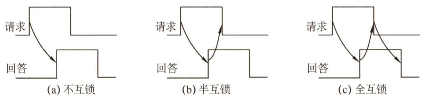

#### 6.2 总线事务和定时  

总线定时是指总线在双方交换数据的过程中需要时间上配合关系的控制，这种控制称为总线定时，其实质是一种协议或规则，主要有同步和异步两种基本定时方式。  

#### 6.2.1 总线事务  

从请求总线到完成总线使用的操作序列称为总线事务，它是在一个总线周期中发生的一系列活动。典型的总线事务包括请求操作、仲裁操作、地址传输、数据传输和总线释放。  

1）请求阶段。主设备（CPU或DMA）发出总线传输请求，并且获得总线控制权。  
1）仲裁阶段。总线仲裁机构决定将下一个传输周期的总线使用权授予某个申请者。  
3）寻址阶段。主设备通过总线给出要访问的从设备地址及有关命令，启动从模块。  
4）传输阶段。主模块和从模块进行数据交换，可单向或双向进行数据传送。  
5）释放阶段。主模块的有关信息均从系统总线上撤除，让出总线使用权。  
在总线事务的传输阶段，主、从设备之间一般只能传输一个字长的数据。  

突发（猝发）传送方式能够进行连续成组数据的传送，其寻址阶段发送的是连续数据单元的首地址，在传输阶段传送多个连续单元的数据，每个时钟周期可以传送一个字长的信息，但是不释放总线，直到一组数据全部传送完毕后，再释放总线。  

#### 6.2.2 同步定时方式  

所谓同步定时方式，是指系统采用一个统一的时钟信号来协调发送和接收双方的传送定时关系。时钟产生相等的时间间隔，每个间隔构成一个总线周期。在一个总线周期中，发送方和接收方可以进行一次数据传送。因为采用统一的时钟，每个部件或设备发送或接收信息都在固定的总线传送周期中，一个总线的传送周期结束，下一个总线的传送周期开始。  

优点：传送速度快，具有较高的传输速率；总线控制逻辑简单。  
缺点：主从设备属于强制性同步；不能及时进行数据通信的有效性检验，可靠性较差。  
同步通信适用于总线长度较短及总线所接部件的存取时间比较接近的系统。  

#### 6.2.3 异步定时方式  

在异步定时方式中，没有统一的时钟，也没有固定的时间间隔，完全依靠传送双方相互制约的“握手”信号来实现定时控制。通常，把交换信息的两个部件或设备分为主设备和从设备，主设备提出交换信息的“请求”信号，经接口传送到从设备；从设备接到主设备的请求后，通过接口向主设备发出“回答”信号。  

优点：总线周期长度可变，能保证两个工作速度相差很大的部件或设备之间可靠地进行信息交换，自动适应时间的配合。  

缺点：比同步控制方式稍复杂一些，速度比同步定时方式慢。  

根据“请求”和“回答”信号的撤销是否互锁，异步定时方式又分为以下3种类型。  

1）不互锁方式。主设备发出“请求”信号后，不必等到接到从设备的“回答”信号，而是经过一段时间便撤销“请求”信号。而从设备在接到“请求”信号后，发出“回答”信号，并经过一段时间后自动撤销“回答”信号。双方不存在互锁关系，如图6.4(a)所示。  

2）半互锁方式。主设备发出“请求”信号后，必须在接到从设备的“回答”信号后，才撤销“请求”信号，有互锁的关系。而从设备在接到“请求”信号后，发出“回答”信号，但不必等待获知主设备的“请求”信号已经撤销，而是隔一段时间后自动撤销“回答”信号，不存在互锁关系。半互锁方式如图6.4(b)所示。  

3）全互锁方式。主设备发出“请求”信号后，必须在从设备“回答”后才撤销“请求”信号；从设备发出“回答”信号后，必须在获知主设备“请求”信号已撤销后，再撤销其“回答”信号。双方存在互锁关系，如图6.4(c)所示。  

  
图6.4请求和回答信号的互锁  

#### 6.2.4 本节习题精选  

#### 一、单项选择题  

01.在不同速度的设备之间传送数据，（）。  

A．必须采用同步控制方式  
B.必须采用异步控制方式  
C. 可以选用同步控制方式，也可选用异步控制方式  
D.必须采用应答方式  

02．某机器I/O设备采用异步串行传送方式传送字符信息，字符信息格式为1位起始位、7位数据位、1位校验位和1位停止位。若要求每秒传送480个字符，则该设备的数据传输率为（）。  

A. $380\mathrm{b/s}$ B. $4800\mathrm{B/s}$ C. 480B/s D. 4800b/s  

03．同步控制方式是（）。  

A.只适用于CPU控制的方式 B.只适用于外部设备控制的方式C.由统一的时序信号控制的方式 D．所有指令执行时间都相同的方式  

04.同步通信之所以比异步通信具有较高的传输速率，是因为（）。  

A.同步通信不需要应答信号且总线长度较短B．同步通信用一个公共的时钟信号进行同步C．同步通信中，各部件的存取时间较接近D.以上各项因素的综合结果  

05.以下各项中，（）是同步传输的特点。  

A．需要应答信号 B.各部件的存取时间比较接近C.总线长度较长 D.总线周期长度可变  

06．在异步总线中，传送操作（）。  

A.由设备控制器控制 B.由CPU控制C．由统一时序信号控制 D.按需分配时间  

07．总线的异步通信方式是（）。  

A．既不采用时钟信号，又不采用“握手”信号B．只采用时钟信号，不采用“握手”信号C．不采用时钟信号，只采用“握手”信号D．既采用时钟信号，又采用“握手”信号  

08.在各种异步通信方式中，（）的速度最快。  

A．全互锁 B.半互锁 C.不互锁 D．速度均相等  

09．在手术过程中，医生将手伸出，等护士将手术刀递上，待医生握紧后，护士才松手。若把医生和护士视为两个通信模块，上述动作相当于（）。  

A.同步通信 B．异步通信的全互锁方式C.异步通信的半互锁方式 D.异步通信的不互锁方式  

10.【2021统考真题】下列关于总线的叙述中，错误的是（）。  

A.总线是在两个或多个部件之间进行数据交换的传输介质B．同步总线由时钟信号定时，时钟频率不一定等于工作频率C.异步总线由握手信号定时，一次握手过程完成一位数据交换D.突发（Burst）传送总线事务可以在总线上连续传送多个数据  

#### 二、综合应用题  

01.在异步串行传输方式下，起始位为1位，数据位为7位，偶校验位为1位，停止位为 $^1$ 位，假设每秒传输1200比特，试问有效数据传输率为多少？  

#### 6.2.5 答案与解析  

#### 一、单项选择题  

01.C  

在不同速度的设备之间传送数据时，可采用同步方式，也可采用异步方式。异步方式主要用于在不同的设备间进行通信，两种速度不同的设备使用同一时钟进行控制时，采用同步控制方式同样可以进行数据的传送，但不能发挥快速设备的高速性能。  

#### 02.D  

一个字符占用 $1+7\dag1+1=10$ 位，因此数据传输率为 $10\times480=4800$ 位/秒。  

03.C  

同步控制是指由统一时序控制的通信方式，同步通信采用公共时钟，有统一的时钟周期。同步控制既可用于CPU控制，又可用于高速的外部设备控制。  

04.D  

同步通信采用统一的时钟，每个部件发送或接收信息都在固定的总线传送周期中，一个总线传送周期结束，开始下一个总线传送周期。它适用于总线长度较短且各部件的存取时间较接近的情况，因此具有较高的传输速率。选项A、B、C都是正确原因，因此选D。  

#### 05.B  

各部件的存取时间比较接近时，最适合采用同步传输，以发挥其优势。  

06.D  

异步总线即采用异步通信方式的总线。在异步方式下，没有公用的时钟，完全依靠传送双方相互制约的“握手”信号来实现定时控制。传送操作是由双方按需求分配时间的。  

#### 07.C  

异步通信方式也称应答方式，没有公用的时钟信号，也没有固定的时间间隔，完全依靠传送双方相互制约的“握手”信号来实现定时控制。  

#### 08.C  

在全互锁、半互锁和不互锁3种“握手”方式中，只有不互锁方式的请求信号和回答信号没有相互的制约关系，主设备发出请求信号后，不必等待回答信号的到来，便自已撤销了请求信号，所以速度最快。  

#### 09.B  

由题意可知，医生是主模块，护士是从模块。医生伸出手后（即主模块发出请求信号)，等待护士将手术刀递上（主模块等待从模块的回答信号)，护士也必须等待医生握紧后才松开手（从模块等待主模块的回答信号)，以上整个流程就是异步通信的全互锁方式。  

#### 10.C  

总线是在两个或多个设备之间进行通信的传输介质，A正确。同步总线是指总线通信的双方采用同一个时钟信号，但是一次总线事务不一定在一个时钟周期内完成，即时钟频率不一定等于工作频率，B正确。异步总线采用握手的方式进行通信，每次握手的过程完成一次通信，但是一次通信往往会交换多位而非一位数据，C错误。突发传送总线事务是指发送方在传输完地址后，连续进行若干次数据的发送，D正确。  

#### 二、综合应用题  

01.【解答】  

在这样的一个数据帧中，有效数据位是7位，传输过程中发送的代码位共有 $1+7+1+1=10$ 位，所以有效数据传输率为 $1200{\times}7/(1+7+1+1)=8400/\mathrm{s}$ 。