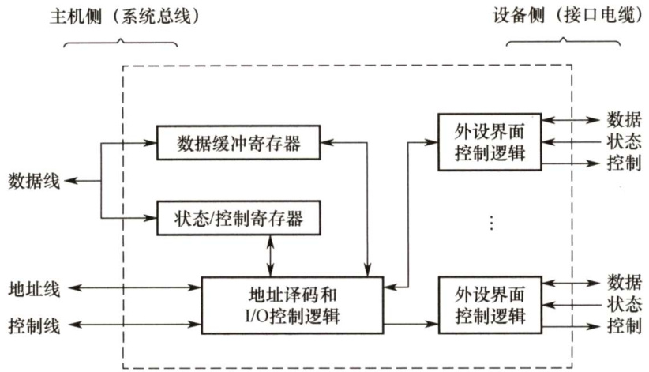

#### 7.2 I/O接口  

I/O 接口（I/O控制器）是主机和外设之间的交接界面，通过接口可以实现主机和外设之间的信息交换。主机和外设具有各自的工作特点，它们在信息形式和工作速度上具有很大的差异，接口正是为了解决这些差异而设置的。  

#### 7.2.1 I/O接口的功能  

I/O接口的主要功能如下：  

1）进行地址译码和设备选择。CPU送来选择外设的地址码后，接口必须对地址进行译码以产生设备选择信息，使主机能和指定外设交换信息。  
2）实现主机和外设的通信联络控制。解决主机与外设时序配合问题，协调不同工作速度的外设和主机之间交换信息，以保证整个计算机系统能统一、协调地工作。  
3）实现数据缓冲。CPU与外设之间的速度往往不匹配，为消除速度差异，接口必须设置数据缓冲寄存器，用于数据的暂存，以避免因速度不一致而丢失数据。  
4）信号格式的转换。外设与主机两者的电平、数据格式都可能存在差异，接口应提供计算机与外设的信号格式的转换功能，如电平转换、并/串或串/并转换、模/数或数/模转换等。  
5）传送控制命令和状态信息。CPU要启动某一外设时，通过接口中的命令寄存器向外设发出启动命令；外设准备就绪时，则将“准备好”状态信息送回接口中的状态寄存器，并反馈给CPU。外设向CPU提出中断请求时，CPU也应有相应的响应信号反馈给外设。  

#### 7.2.2 I/O接口的基本结构  

如图7.1所示，I/O接口在主机侧通过IO总线与内存、CPU相连。通过数据总线，在数据缓冲寄存器与内存或CPU的寄存器之间进行数据传送。同时接口和设备的状态信息被记录在状  

态寄存器中，通过数据线将状态信息送到CPU。CPU对外设的控制命令也通过数据线传送，一般将其送到IO接口的控制寄存器。状态寄存器和控制寄存器在传送方向上是相反的。  

  
图7.1I/O接口的基本结构  

接口中的地址线用于给出要访问的I/O接口中的寄存器的地址，它和读/写控制信号一起被送到I/O接口的控制逻辑部件，通过控制线传送来的读/写信号确认是读寄存器还是写寄存器，此外控制线还会传送一些仲裁信号和握手信号。  

接口中的I/O控制逻辑还要能对控制寄存器中的命令字进行译码，并将译码得到的控制信号通过外设界面控制逻辑送到外设，同时将数据缓冲寄存器的数据发送到外设或从外设接收数据到数据缓冲寄存器。另外，它还要具有收集外设状态到状态寄存器的功能。  

对数据缓冲寄存器、状态/控制寄存器的访问操作是通过相应的指令来完成的，通常称这类指令为I/O指令，I/O指令只能在操作系统内核的底层I/O软件中使用，它们是一种特权指令。  

注意：接口和端口是两个不同的概念。端口是指接口电路中可以进行读/写的寄存器，若干端口加上相应的控制逻辑才可以组成接口。  

#### 7.2.3 I/O接口的类型  

从不同的角度看，IO接口可以分为不同的类型。  

1）按数据传送方式可分为并行接口（一字节或一个字的所有位同时传送）和串行接口（一位一位地传送)，接口要完成数据格式的转换。注意：这里所说的数据传送方式指的是外设和接口一侧的传送方式。  
2）按主机访问I/O设备的控制方式可分为程序查询接口、中断接口和DMA接口等。  
3）按功能选择的灵活性可分为可编程接口和不可编程接口。  

#### 7.2.4 I/O端口及其编址  

IO 端口是指接口电路中可被CPU直接访问的寄存器，主要有数据端口、状态端口和控制端口，若干端口加上相应的控制逻辑电路组成接口。通常，CPU能对数据端口执行读写操作，但对状态端口只能执行读操作，对控制端口只能执行写操作。  

I/O 端口要想能够被CPU访问，就必须要对各个端口进行编号，每个端口对应一个端口地址。而对I/O端口的编址方式有与存储器统一编址和独立编址两种。  

1）统一编址，又称存储器映射方式，是指把I/O端口当作存储器的单元进行地址分配，这种方式CPU不需要设置专门的IO指令，用统一的访存指令就可以访问I/O端口。  

优点：不需要专门的输入/输出指令，可使CPU访问I/O的操作更灵活、更方便，还可使端口有较大的编址空间。缺点：端口占用存储器地址，使内存容量变小，而且利用存储器编址的I/O设备进行数据输入/输出操作，执行速度较慢。  

2）独立编址，又称I/O映射方式，I/O端口的地址空间与主存地址空间是两个独立的地址空间，因而无法从地址码的形式上区分，需要设置专门的I/O指令来访问I/O端口。优点：输入/输出指令与存储器指令有明显区别，程序编制清晰，便于理解。缺点：输入/输出指令少，一般只能对端口进行传送操作，尤其需要CPU提供存储器读/写、I/O设备读/写两组控制信号，增加了控制的复杂性。  

#### 7.2.5 本节习题精选  

#### 单项选择题  

01．在统一编址的方式下，区分存储单元和I/O设备是靠（）。  

A.不同的地址码 B．不同的地址线C.不同的控制线 D．不同的数据线  

02．下列功能中，属于I/O接口的功能的是（）。  

I．数据格式的转换 II.I/O过程中错误与状态检测III.I/O操作的控制与定时 IV．与主机和外设通信  

A.I、IV B.I、IⅢ、IV C.I、Ⅱ、IV D.I、、Ⅲ、IV  

03．下列关于IO端口和接口的说法中，正确的是（）。  

A．按照不同的数据传送格式，可将接口分为同步传送接口和异步传送接口B.在统一编址方式下，存储单元和IO设备是靠不同的地址线来区分的C.在独立编址方式下，存储单元和IO设备是靠不同的地址线来区分的D.在独立编址方式下，CPU需要设置专门的输入/输出指令访问端口  

04.I/O的编址方式采用统一编址方式时，进行输入/输出的操作的指令是（）  

A．控制指令 B．访存指令 C.输入/输出指令D．都不对  

05．下列叙述中，正确的是（）。  

A.只有I/O指令可以访问I/O设备  
B.在统一编址下，不能直接访问IO设备  
C.访问存储器的指令一定不能访问I/O设备  
D．只有在具有专门IO指令的计算机中，IO设备才可以单独编址  

06.在统一编址情况下，就I/O设备而言，其对应的IO地址说法错误的是（）。  

A.要求固定在地址高端 B.要求固定在地址低端C．要求相对固定在地址的某部分 D．可以随意在地址的任何地方  

07.磁盘驱动器向盘片磁道记录数据时采用（）方式写入。  

A．并行 B．串行 C．并行-串行 D．串行-并行  

08.程序员进行系统调用访问设备使用的是（）。  

A．逻辑地址 B．物理地址 C．主设备地址 D．从设备地址  

9.【2012统考真题】下列选项中，在I/O总线的数据线上传输的信息包括（）。  

I．IO接口中的命令字ⅡI．IO接口中的状态字III．中断类型号  

A.仅I、Ⅱ B.仅I、IⅢI C.仅、II D.I、、III  

10.【2014统考真题】下列有关I/O接口的叙述中，错误的是（）。  

A.状态端口和控制端口可以合用同一个寄存器B.IO接口中CPU可访问的寄存器称为I/O端口C．采用独立编址方式时，IO端口地址和主存地址可能相同D.采用统一编址方式时，CPU不能用访存指令访问I/O端口  

11.【2017统考真题】I/O指令实现的数据传送通常发生在（）。  

A.I/O设备和I/O端口之间 B.通用寄存器和I/O设备之间 C.I/O端口和I/O端口之间 D.通用寄存器和I/O端口之间  

12.【2021统考真题】下列选项中，不属于I/O接口的是（）。  

A.磁盘驱动器 B.打印机适配器 C.网络控制器 D.可编程中断控制器  

#### 7.2.6 答案与解析  

#### 单项选择题  

01.A  

在统一编址的情况下，没有专门的I/O指令，因此用访存指令来实现I/O操作，区分存储单元和I/O设备是靠它们各自不同的地址码。  

02.D  

I/O 接口的功能有： $\textcircled{1}$ 选址功能、 $\textcircled{2}$ 传送命令功能、 $\textcircled{3}$ 传送数据功能、 $\textcircled{4}$ 反映I/O设备工作状态的功能。选项I可参考唐朔飞的《计算机组成原理》教材，为设置接口的原因之一，也是接口应具有的功能；选项ⅡI属于 $\textcircled{4}$ ；选项IⅢI属于 $\textcircled{2}$ ；选项IV属于 $\textcircled{3}$ o  

03.D  

选项D 显然正确。按照不同的数据传送格式，可将接口分为并行接口和串行接口，因此 A错；在统一编址方式下，存储单元和I/O 设备是靠不同的地址码而非地址线来区分的，因此 B错；在独立编址方式下，存储单元和IO设备是靠不同的指令来区分的，因此C错。  

#### 04.B  

统一编址时，直接使用指令系统中的访存指令来完成输入/输出操作；独立编址时，则需要使用专门的输入/输出指令来完成输入/输出操作。  

05.D  

在统一编址的情况下，访存指令也可访问I/O 设备，因此选项A、B、C 错误。在独立编址的方式下，访问I/O地址空间必须通过专门的I/O指令，因此D正确。  

06.D  

在统一编址方式下，指令靠地址码区分内存和I/O设备，若随意在地址的任何地方编址，将给编程造成极大的混乱，因此D错误。选项A、B、C的做法都是可取的。  

#### 07.B  

磁盘驱动器向盘片磁道记录数据时采用串行方式写入。  

08.A  

物理地址是外部连接使用的，且是唯一的，它与“地址总线相对应”；而逻辑地址是内部和编程使用的，并不唯一。在内存中的实际地址就是所谓的“物理地址”，而逻辑地址就是用于逻辑段管理内存的，因此程序员使用逻辑地址访问设备。  

#### 09.D  

I/O 总线分为三类：数据线、控制线和地址线。数据缓冲寄存器和命令/状态寄存器的内容都是通过数据线来传送的；地址线用以传送与CPU 交换数据的端口地址；而控制线用以给I/O端口发送读/写信号，只是用来对端口进行读/写控制的。因此I、ⅡI和III均正确。  

10.D  

采用统一编址时，CPU访存和访问I/O端口用的是一样的指令，所以访存指令可访问I/O端口，D选项错误。其他三个选项均为正确陈述。  

#### 11.D  

解析请扫右侧二维码查阅。  

12.A  

IO接口即I/O控制器，其功能是接收主机发送的I/O控制信号，并实现主机和外部设备之间的信息交换。磁盘驱动器是由磁头、磁盘和读写电路等组成的，也就是我们平常所说的磁盘本身，A错误。B、C和D均为IO控制器。