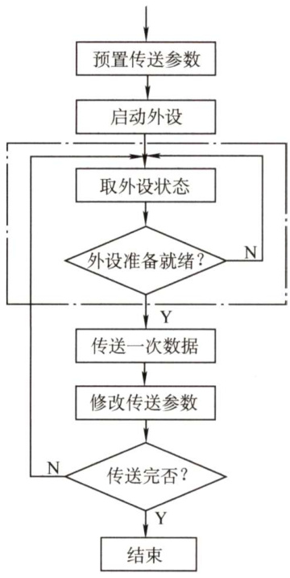
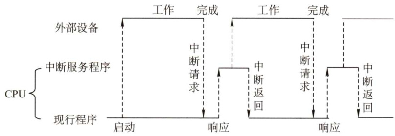
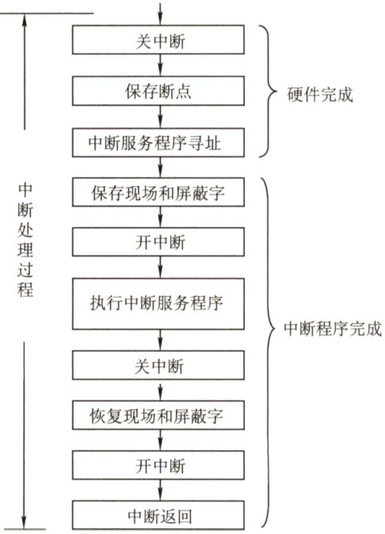
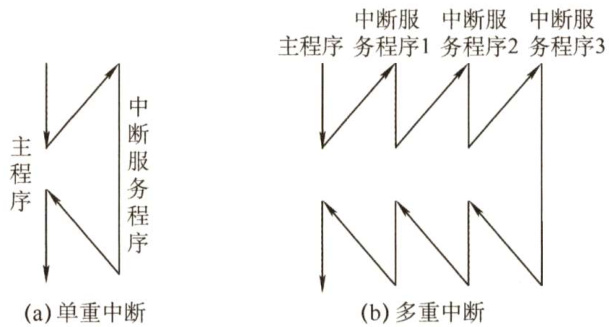
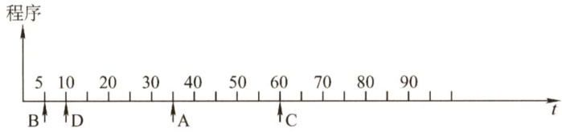
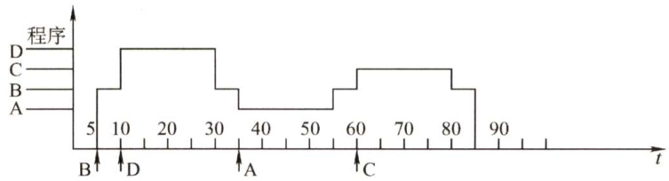
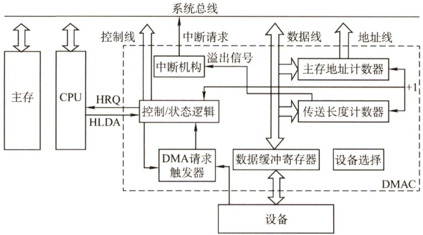
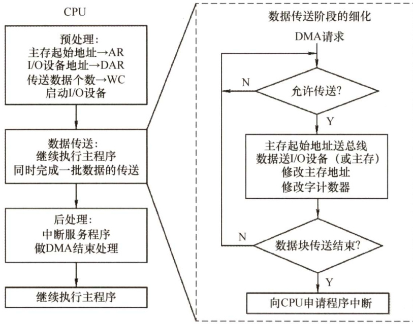
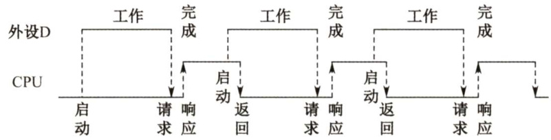
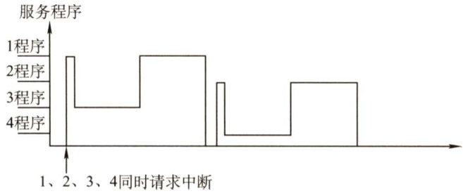

#### 7.3 I/0方式  

输入/输出系统实现主机与I/O设备之间的数据传送，可以采用不同的控制方式，各种方式在代价、性能、解决问题的着重点等方面各不相同，常用的I/O方式有程序查询、程序中断、DMA和通道等，其中前两种方式更依赖于CPU中程序指令的执行。  

#### 7.3.1 程序查询方式  

信息交换的控制完全由CPU 执行程序实现，程序查询方式接口中设置一个数据缓冲寄存器（数据端口）和一个设备状态寄存器（状态端口)。主机进行I/O操作时，先发出询问信号，读取设备的状态并根据设备状态决定下一步操作究竟是进行数据传送还是等待。  

程序查询方式的工作流程如下（见图7.2）：  

$\textcircled{1}$ CPU执行初始化程序，并预置传送参数。  
$\textcircled{2}$ 向I/O接口发出命令字，启动I/O设备。  
$\textcircled{3}$ 从外设接口读取其状态信息。  
$\textcircled{4}$ CPU不断查询I/O设备状态，直到外设准备就绪。  
$\textcircled{5}$ 传送一次数据。  
$\textcircled{6}$ 修改地址和计数器参数。  

$\textcircled{7}$ 判断传送是否结束，若未结束转第 $\textcircled{3}$ 步，直到计数器为0。  

在这种控制方式下，CPU一旦启动I/O，就必须停止现行程序的运行，并在现行程序中插入一段程序。程序查询方式的主要特点是CPU有“踏步”等待现象，CPU与I/O串行工作。这种方式的接口设计简单、设备量少，但CPU在信息传送过程中要花费很多时间来查询和等待，而且在一段时间内只能和一台外设交换信息，效率大大降低。  

#### 7.3.2 程序中断方式  

#### 1．程序中断的基本概念  

程序中断是指在计算机执行现行程序的过程中，出现某些急需处理的异常情况或特殊请求，CPU暂时中止现行程序，而转去对这些异常情况或特殊请求进行处理，处理完毕后再返回到现行程序的断点处，继续执行原程序。早期的中断技术是为了处理数据传送。  

随着计算机的发展，中断技术不断被赋予新的功能，主要功能有：  

  
图7.2程序查询方式流程图  

$\textcircled{1}$ 实现CPU与I/O设备的并行工作。  
$\textcircled{2}$ 处理硬件故障和软件错误。  
$\textcircled{3}$ 实现人机交互，用户干预机器需要用到中断系统。  
$\textcircled{4}$ 实现多道程序、分时操作，多道程序的切换需借助于中断系统。  
$\textcircled{5}$ 实时处理需要借助中断系统来实现快速响应。  
$\textcircled{6}$ 实现应用程序和操作系统（管态程序）的切换，称为“软中断”。  
$\textcircled{7}$ 多处理器系统中各处理器之间的信息交流和任务切换。  

程序中断方式的思想：CPU在程序中安排好在某个时机启动某台外设，然后CPU继续执行当前的程序，不需要像查询方式那样一直等待外设准备就绪。一旦外设完成数据传送的准备工作，就主动向CPU 发出中断请求，请求CPU 为自已服务。在可以响应中断的条件下，CPU 暂时中止正在执行的程序，转去执行中断服务程序为外设服务，在中断服务程序中完成一次主机与外设之间的数据传送，传送完成后，CPU返回原来的程序，如图7.3所示。  

  
图7.3程序中断方式示意图  

#### 2.程序中断的工作流程  

（1）中断请求  

中断源是请求CPU中断的设备或事件，一台计算机允许有多个中断源。每个中断源向CPU  

发出中断请求的时间是随机的。为记录中断事件并区分不同的中断源，中断系统需对每个中断源设置中断请求标记触发器，当其状态为“1”时，表示中断源有请求。这些触发器可组成中断请求标记寄存器，该寄存器可集中在CPU中，也可分散在各个中断源中。  

通过INTR 线发出的是可屏蔽中断，通过NMI线发出的是不可屏蔽中断。可屏蔽中断的优先级最低，在关中断模式下不会被响应。不可屏蔽中断用于处理紧急和重要的事件，如时钟中断、电源掉电等，其优先级最高，其次是内部异常，即使在关中断模式下也会被响应。  

#### （2）中断响应判优  

中断响应优先级是指CPU 响应中断请求的先后顺序。由于许多中断源提出中断请求的时间都是随机的，因此当多个中断源同时提出请求时，需通过中断判优逻辑来确定响应哪个中断源的请求，中断响应的判优通常是通过硬件排队器实现的。  

一般来说， $\textcircled{1}$ 不可屏蔽中断 $>$ 内部异常 $>$ 可屏蔽中断； $\textcircled{2}$ 内部异常中，硬件故障 $>$ 软件中断； $\textcircled{3}$ DMA中断请求优先于I/O设备传送的中断请求； $\textcircled{4}$ 在I/O传送类中断请求中，高速设备优先于低速设备，输入设备优先于输出设备，实时设备优先于普通设备。  

注意：中断优先级包括响应优先级和处理优先级，响应优先级在硬件线路上是固定的，不便改动。处理优先级可利用中断屏蔽技术动态调整，以实现多重中断，具体在后文中介绍。  

（3）CPU响应中断的条件  

CPU 在满足一定的条件下响应中断源发出的中断请求，并经过一些特定的操作，转去执行中断服务程序。CPU响应中断必须满足以下3个条件：  

$\textcircled{1}$ 中断源有中断请求。  

$\textcircled{2}$ CPU允许中断及开中断（异常和不可屏蔽中断不受此限制)。  

$\textcircled{3}$ 一条指令执行完毕（异常不受此限制)，且没有更紧迫的任务。  

注意：I/O 设备的就绪时间是随机的，而CPU 在统一的时刻即每条指令执行阶段结束前向接口发出中断查询信号，以获取I/O的中断请求，也就是说，CPU响应中断的时间是在每条指令执行阶段的结束时刻。这里说的中断仅指I/O中断，内部异常不属于此类情况。  

（4）中断响应过程  

CPU 响应中断后，经过某些操作，转去执行中断服务程序。这些操作是由硬件直接实现的，我们将它称为中断隐指令。中断隐指令并不是指令系统中的一条真正的指令，只是一种虚拟的说法，本质上是硬件的一系列自动操作。它所完成的操作如下：  

$\textcircled{1}$ 关中断。CPU响应中断后，首先要保护程序的断点和现场信息，在保护断点和现场的过程中，CPU不能响应更高级中断源的中断请求。否则，若断点或现场保存不完整，在中断服务程序结束后，就不能正确地恢复并继续执行现行程序。  
$\textcircled{2}$ 保存断点。为保证在中断服务程序执行完后能正确地返回到原来的程序，必须将原程序的断点（指令无法直接读取的PC和PSW的内容）保存在栈或特定寄存器中。注意异常和中断的差异：异常指令通常并没有执行成功，异常处理后要重新执行，所以其断点是当前指令的地址。中断的断点则是下一条指令的地址。  
$\textcircled{3}$ 引出中断服务程序。识别中断源，将对应的服务程序入口地址送入程序计数器PC。有两种方法识别中断源：硬件向量法和软件查询法。本节主要讨论比较常用的向量中断。  

（5）中断向量中断识别分为向量中断和非向量中断两种。非向量中断即软件查询法，第5章已介绍。  

每个中断都有一个唯一的类型号，每个中断类型号都对应一个中断服务程序，每个中断服务程序都有一个入口地址，CPU必须找到入口地址，即中断向量。把系统中的全部中断向量集中存放到存储器的某个区域内，这个存放中断向量的存储区就称为中断向量表。  

CPU 响应中断后，通过识别中断源获得中断类型号，然后据此计算出对应中断向量的地址；再根据该地址从中断向量表中取出中断服务程序的入口地址，并送入程序计数器PC，以转而执行中断服务程序，这种方法被称为中断向量法，采用中断向量法的中断被称为向量中断。  

（6）中断处理过程  

不同计算机的中断处理过程各具特色，就其多数而论，中断处理流程如图7.4所示。  

中断处理流程如下：  

$\textcircled{1}$ 关中断。  
$\textcircled{2}$ 保存断点。  
$\textcircled{3}$ 中断服务程序寻址。  
$\textcircled{4}$ 保存现场和屏蔽字。进入中断服务程序后首先要保存现场和中断屏蔽字，现场信息是指用户可见的工作寄存器的内容，它存放着程序执行到断点处的现行值。  

注意：现场和断点，这两类信息都不能被中断服务程序破坏。现场信息因为用指令可直接访问，所以通常在中断服务程序中通过指令把它们保存到栈中，即由软件实现；而断点信息由CPU在中断响应时自动保存到栈或指定的寄存器中，即由硬件实现。  

$\textcircled{5}$ 开中断。允许更高级中断请求得到响应，实现中断嵌套。$\textcircled{6}$ 执行中断服务程序。这是中断请求的目的。$\textcircled{7}$ 关中断。保证在恢复现场和屏蔽字时不被中断。  

  
图7.4可嵌套中断的处理流程  

$\textcircled{8}$ 恢复现场和屏蔽字。将现场和屏蔽字恢复到原来的状态。  

$\textcircled{9}$ 开中断、中断返回。中断服务程序的最后一条指令通常是一条中断返回指令，使其返回到原程序的断点处，以便继续执行原程序。  

其中， $\textcircled{1}\sim\textcircled{3}$ 由中断隐指令（硬件自动）完成； $\textcircled{4}\sim\textcircled{9}$ 由中断服务程序完成。  

注意：恢复现场是指在中断返回前，必须将寄存器的内容恢复到中断处理前的状态，这部分工作由中断服务程序完成。中断返回由中断服务程序的最后一条中断返回指令完成。  

#### 3.多重中断和中断屏蔽技术  

若 CPU 在执行中断服务程序的过程中，又出现了新的更高优先级的中断请求，而CPU 对新的中断请求不予响应，则这种中断称为单重中断，如图 7.5(a)所示。若CPU 暂停现行的中断服务程序，转去处理新的中断请求，则这种中断称为多重中断，又称中断嵌套，如图7.5(b)所示。  

CPU要具备多重中断的功能，必须满足下列条件：  

$\textcircled{1}$ 在中断服务程序中提前设置开中断指令。  

$\textcircled{2}$ 优先级别高的中断源有权中断优先级别低的中断源。  

中断处理优先级是指多重中断的实际优先级处理次序，可以利用中断屏蔽技术动态调整，从而可以灵活地调整中断服务程序的优先级，使中断处理更加灵活。如果不使用中断屏蔽技术，则处理优先级和响应优先级相同。现代计算机一般使用中断屏蔽技术，每个中断源都有一个屏蔽触发器，1表示屏蔽该中断源的请求，0表示可以正常申请，所有屏蔽触发器组合在一起便构成一个屏蔽字寄存器，屏蔽字寄存器的内容称为屏蔽字。  

  
图7.5单重中断和多重中断示意图  

关于中断屏蔽字的设置及多重中断程序执行的轨迹，下面通过实例说明。  

【例7.1】设某机有4个中断源A、B、C、D，其硬件排队优先次序为 $\mathbf{A}>\mathbf{B}>\mathbf{C}>\mathbf{D}$ ，现要求将中断处理次序改为 $\mathbf{D}>\mathbf{A}>\mathbf{C}>\mathbf{B}$ 。  

1）写出每个中断源对应的屏蔽字。  
2）按图7.6所示的时间轴给出的4个中断源的请求时刻，画出CPU执行程序的轨迹。设每个中断源的中断服务程序时间均为 $20\upmu\mathrm{s}$ o  

  
图7.6中断源的请求时刻  

解：  

1）在中断处理次序改为 $\mathbf{D}>\mathbf{A}>\mathbf{C}>\mathbf{B}$ 后，D具有最高优先级，可以屏蔽其他所有中断，且不能中断自身，因此D对应的屏蔽字为1111；A具有次高优先级，只能被D中断，因此A对应的屏蔽字为1110，以此类推，得到4个中断源的屏蔽字，见表7.1。  

表7.1中断源对应的中断屏蔽字  

<html><body><table><tr><td rowspan="2">中断源</td><td colspan="4">屏蔽字</td></tr><tr><td>A</td><td>B</td><td>C</td><td>D</td></tr><tr><td>A</td><td>1</td><td>1</td><td>1</td><td>0</td></tr><tr><td>B</td><td>0</td><td>1</td><td>0</td><td>0</td></tr><tr><td>C</td><td>0</td><td>1</td><td>1</td><td>0</td></tr><tr><td>D</td><td>1</td><td>1</td><td>1</td><td>1</td></tr></table></body></html>  

2）根据处理次序，在时刻5，B发中断请求，获得CPU；在时刻10，D发中断请求，此时B虽还未执行完毕，但D的优先级高于B，于是D中断B而获得CPU；在时刻30，D执行完毕，B继续获得CPU；在时刻35，A发中断请求，此时B虽还未执行完毕，但A的优先级高于B，于是A中断B而获得CPU，如此继续下去，执行轨迹如图7.7所示。  

  
图7.7CPU执行程序的轨迹  

#### 7.3.3 DMA方式  

DMA 方式是一种完全由硬件进行成组信息传送的控制方式，它具有程序中断方式的优点，即在数据准备阶段，CPU与外设并行工作。DMA方式在外设与内存之间开辟一条“直接数据通道”，信息传送不再经过CPU，降低了CPU 在传送数据时的开销，因此称为直接存储器存取方式。由于数据传送不经过CPU，也就不需要保护、恢复CPU现场等烦琐操作。  

这种方式适用于磁盘、显卡、声卡、网卡等高速设备大批量数据的传送，它的硬件开销比较大。在DMA方式中，中断的作用仅限于故障和正常传送结束时的处理。  

#### 1.DMA方式的特点  

主存和DMA 接口之间有一条直接数据通路。由于 DMA 方式传送数据不需要经过 CPU，因此不必中断现行程序，IO与主机并行工作，程序和传送并行工作。  

DMA方式具有下列特点：  

$\textcircled{1}$ 它使主存与CPU的固定联系脱钩，主存既可被CPU访问，又可被外设访问。  
$\textcircled{2}$ 在数据块传送时，主存地址的确定、传送数据的计数等都由硬件电路直接实现。  
$\textcircled{3}$ 主存中要开辟专用缓冲区，及时供给和接收外设的数据。  
$\textcircled{4}$ DMA传送速度快，CPU和外设并行工作，提高了系统效率。  
$\textcircled{5}$ DMA在传送开始前要通过程序进行预处理，结束后要通过中断方式进行后处理。  

#### 2.DMA控制器的组成  

在 DMA方式中，对数据传送过程进行控制的硬件称为DMA 控制器（DMA 接口)。当I/O设备需要进行数据传送时，通过DMA 控制器向CPU 提出DMA 传送请求，CPU 响应之后将让出系统总线，由DMA控制器接管总线进行数据传送。其主要功能如下：  

1）接受外设发出的DMA请求，并向CPU发出总线请求。  
2）CPU响应此总线请求，发出总线响应信号，接管总线控制权，进入DMA操作周期。  
3）确定传送数据的主存单元地址及长度，并自动修改主存地址计数和传送长度计数。  
4）规定数据在主存和外设间的传送方向，发出读写等控制信号，执行数据传送操作。  

5）向CPU报告DMA操作结束。  

图7.8给出了一个简单的DMA控制器。  

·主存地址计数器：存放要交换数据的主存地址。  
·传送长度计数器：记录传送数据的长度，计数溢出时，数据即传送完毕，自动发中断请求信号。  
·数据缓冲寄存器：暂存每次传送的数据。  
·DMA请求触发器：每当I/O 设备准备好数据后，给出一个控制信号，使DMA请求触发器置位。  
·“控制/状态”逻辑：由控制和时序电路及状态标志组成，用于指定传送方向，修改传送  

参数，并对DMA请求信号、CPU响应信号进行协调和同步。  

·中断机构：当一个数据块传送完毕后触发中断机构，向CPU提出中断请求。  

  
图7.8简单的DMA控制器  

在 DMA 传送过程中，DMA 控制器将接管CPU 的地址总线、数据总线和控制总线，CPU的主存控制信号被禁止使用。而当DMA传送结束后，将恢复CPU的一切权利并开始执行其操作。由此可见，DMA控制器必须具有控制系统总线的能力。  

#### 3.DMA的传送方式  

主存和I/O设备之间交换信息时，不通过CPU。但当IO设备和CPU同时访问主存时，可能发生冲突，为了有效地使用主存，DMA控制器与CPU通常采用以下3种方式使用主存：  

1）停止CPU访存。当I/O设备有DMA请求时，由DMA控制器向CPU发送一个停止信号，使CPU脱离总线，停止访问主存，直到DMA传送一块数据结束。数据传送结束后，DMA控制器通知CPU可以使用主存，并把总线控制权交还给CPU。  

2）周期挪用（或周期窃取)。当IO设备有DMA请求时，会遇到3种情况： $\textcircled{1}$ 是此时CPU不在访存（如CPU正在执行乘法指令)，因此I/O的访存请求与CPU未发生冲突； $\textcircled{2}$ 是 CPU正在访存，此时必须待存取周期结束后，CPU再将总线占有权让出； $\textcircled{3}$ 是IO和CPU同时请求访存，出现访存冲突，此时CPU要暂时放弃总线占有权。I/O访存优先级高于CPU访存，因为I/O不立即访存就可能丢失数据，此时由I/O设备挪用一个或几个存取周期，传送完一个数据后立即释放总线，是一种单字传送方式。  

3）DMA与CPU交替访存。这种方式适用于CPU的工作周期比主存存取周期长的情况。例如，若CPU的工作周期是 $1.2\upmu\mathrm{s}$ ，主存的存取周期小于 $0.6\upmu\up s$ ，则可将一个CPU周期分为 $\mathbf{C}_{1}$ 和 $\mathbf{C}_{2}$ 两个周期，其中 $\mathbf{C}_{1}$ 专供DMA访存， $\mathbf{C}_{2}$ 专供CPU访存。这种方式不需要总线使用权的申请、建立和归还过程，总线使用权是通过 $\mathbf{C}_{1}$ 和 $\mathbf{C}_{2}$ 分时控制的。  

#### 4.DMA的传送过程  

DMA的数据传送过程分为预处理、数据传送和后处理3个阶段：  

1）预处理。由CPU完成一些必要的准备工作。首先，CPU执行几条IO指令，用以测试I/O设备状态，向DMA控制器的有关寄存器置初值、设置传送方向、启动该设备等。然后，CPU继续执行原来的程序，直到IO设备准备好发送的数据（输入情况）或接收的数据（输出情况）时，I/O设备向DMA控制器发送DMA请求，再由DMA控制器向CPU发送总线请求（有时将这两个过程统称为DMA请求)，用以传输数据。  

2）数据传送。DMA的数据传输可以以单字节（或字）为基本单位，也可以以数据块为基本单位。对于以数据块为单位的传送（如硬盘)，DMA占用总线后的数据输入和输出操作都是通过循环来实现的。需要指出的是，这一循环也是由DMA控制器（而非通过CPU执行程序）实现的，即数据传送阶段完全由DMA（硬件）控制。  

3）后处理。DMA控制器向CPU发送中断请求，CPU执行中断服务程序做DMA结束处理，包括校验送入主存的数据是否正确、测试传送过程中是否出错（错误则转诊断程序）及决定是否继续使用DMA传送其他数据等。DMA的传送流程如图7.9所示。  

  
图7.9DMA的传送流程  

#### 5.DMA方式和中断方式的区别  

DMA方式和中断方式的重要区别如下：  

$\textcircled{1}$ 中断方式是程序的切换，需要保护和恢复现场；而DMA 方式除了预处理和后处理，其他时候不占用CPU的任何资源。  
$\textcircled{2}$ 对中断请求的响应只能发生在每条指令执行完毕时（即指令的执行周期后)；而对DMA请求的响应可以发生在每个机器周期结束时（在取指周期、间址周期、执行周期后均可)，只要CPU不占用总线就可被响应。  
$\textcircled{3}$ 中断传送过程需要CPU的干预；而DMA传送过程不需要CPU 的干预，因此数据传输率非常高，适合于高速外设的成组数据传送。  
$\textcircled{4}$ DMA请求的优先级高于中断请求。  
$\textcircled{5}$ 中断方式具有对异常事件的处理能力，而DMA方式仅局限于传送数据块的IO操作。  
$\textcircled{6}$ 从数据传送来看，中断方式靠程序传送，DMA方式靠硬件传送。  

#### 7.3.4 本节习题精选  

#### 一、单项选择题  

01.设置中断排队判优逻辑的目的是（）。  

A．产生中断源编码  

B.使同时提出的请求中的优先级别最高者得到及时响应  
C.使CPU能方便地转入中断服务子程序  
D.提高中断响应速度  

02．中断判优逻辑和总线仲裁方式相类似，下列说法中正确的是（）。  

I．在总线仲裁方式中，独立请求方式响应时间最快，是以增加控制线数为代价的  
II．在总线仲裁方式中，计数器定时查询方式有一根总线请求（BR）和一根设备地址线，若每次计数都从0开始，则设备号小的优先级高  
III．总线仲裁方式一般是指I/O设备争用总线的判优方式，而中断判优方式一般是指I/O设备争用CPU的判优方式  
IV．中断判优逻辑既可以通过硬件实现，又可以通过软件实现  

A.I、III B.I、II、IV C.I、I、IV D.I、IV  

03．以下说法中，错误的是（）。  

A．中断服务程序一般是操作系统模块B．中断向量方法可提高中断源的识别速度C．中断向量地址是中断服务程序的入口地址D．重叠处理中断的现象称为中断嵌套  

04．当有中断源发出请求时，CPU可执行相应的中断服务程序，可以提出中断的有（）  

I．外部事件 II. Cache III．虚拟存储器失效 IV．浮点数运算下溢 V.浮点数运算上溢  

A.I、II和IV B.I和V C.I、Ⅱ和V D.I、Ⅲ和V  

05．关于程序中断方式和DMA方式的叙述，错误的是（）。  

I．DMA的优先级比程序中断的优先级要高  
ⅡI．程序中断方式需要保护现场，DMA方式不需要保护现场  
III．程序中断方式的中断请求是为了报告CPU数据的传输结束，而DMA方式的中断请求完全是为了传送数据  

A.仅Ⅱ B.Ⅱ、IⅢI C.仅III D.I、III  

06．下列说法中，错误的是（）。  

I．程序中断过程是由硬件和中断服务程序共同完成的ⅡI．在每条指令的执行过程中，每个总线周期要检查一次有无中断请求III．检测有无DMA请求，一般安排在一条指令执行过程的末尾IV．中断服务程序的最后指令是无条件转移指令  

A.III、IV B.Ⅱ、Ⅲ、IV C.Ⅱ、IV D.I、、ⅢII、IV  

07.能产生DMA请求的总线部件是（）。  

I．高速外设ⅡI．需要与主机批量交换数据的外设III．具有DMA接口的设备  

A.仅I B.仅IⅢI C.I、II D.、IⅢI  

08．中断响应由高到低的优先次序宜用（）。  

A.访管 $\rightarrow$ 程序性 $\rightarrow$ 机器故障 B.访管 $\rightarrow$ 程序性 $\rightarrow$ 重新启动C.外部→访管→程序性 D.程序性→I/O→访管  

09．在具有中断向量表的计算机中，中断向量地址是（）。  

A．子程序入口地址 B.中断服务程序的入口地址  

C．中断服务程序入口地址的地址 D.中断程序断点  

10．中断响应是在（）。  

A．一条指令执行开始 B．一条指令执行中间C．一条指令执行之末 D.一条指令执行的任何时刻  

11.在下列情况下，可能不发生中断请求的是（）。  

A.DMA操作结束 B.一条指令执行完毕C．机器出现故障 D.执行“软中断”指令  

12.在配有通道的计算机系统中，用户程序需要输入/输出时，引起的中断是（）。  

A．访管中断 B.I/O中断 C.程序性中断 D.外中断  

13．某计算机有4级中断，优先级从高到低为 $1\to2\to3\to4$ 。若将优先级顺序修改，改后1级中断的屏蔽字为1101，2级中断的屏蔽字为0100，3级中断的屏蔽字为1111，4级中断的屏蔽字为0101，则修改后的优先顺序从高到低为（）。  

A. $1{\rightarrow}2{\rightarrow}3{\rightarrow}4$ B. $3\to1\to4\to2$ C. $1\to3\to4\to2$ D. $2\substack{\rightarrow}1\rightarrow3\substack{\rightarrow}4$  

14.下列不属于程序控制指令的是（）。  

A.无条件转移指令 B．有条件转移指令 C．中断隐指令 D．循环指令  

15.在中断响应周期中，CPU主要完成的工作是（）。  

A．关中断，保护断点，发中断响应信号并形成向量地址B．开中断，保护断点，发中断响应信号并形成向量地址C．关中断，执行中断服务程序  
D．开中断，执行中断服务程序  

16.在中断响应周期中，由（）将允许中断触发器置0。  

A．关中断指令 B.中断隐指令 C.开中断指令 D．中断服务程序  

17.CPU响应中断时最先完成的步骤是（）。  

A.开中断 B．保存断点 C．关中断 D.转入中断服务程序  

18.设置中断屏蔽标志可以改变（）。  

A.多个中断源的中断请求优先级 B.CPU对多个中断请求响应的优先次序C.多个中断服务程序开始执行的顺序 D．多个中断服务程序执行完的次序  

19．在CPU响应中断时，保护两个关键的硬件状态是（）。  

A.PC和IR B.PC和PSW C.AR和IR D.AR和PSW  

20.在各种I/O方式中，中断方式的特点是（），DMA方式的特点是（）。  

A.CPU与外设串行工作，传送与主程序串行工作B.CPU与外设并行工作，传送与主程序串行工作C.CPU与外设串行工作，传送与主程序并行工作D.CPU与外设并行工作，传送与主程序并行工作  

21．在DMA传送方式中，由（）发出DMA请求，在传送期间总线控制权由（）掌握。  

A．外部设备、CPU B.DMA控制器、DMA控制器C.外部设备、DMA控制器 D.DMA控制器、内存  

22.下列叙述中，（）是正确的。  

A.程序中断方式和DMA方式中实现数据传送都需要中断请求B.程序中断方式中有中断请求，DMA方式中没有中断请求  

C.程序中断方式和DMA方式中都有中断请求，但目的不同D.DMA要等指令周期结束时才可以进行周期窃取  

23．以下关于DMA方式进行I/O的描述中，正确的是（）。  

A．一个完整的DMA过程，部分由DMA控制器控制，部分由CPU控制B．一个完整的DMA过程，完全由CPU控制C．一个完整的DMA过程，完全由DMA控制器控制，CPU不介入任何控制D.一个完整的DMA过程，完全由CPU采用周期挪用法控制  

24.CPU响应DMA请求的条件是当前（）执行完。  

A.机器周期 B．总线周期C.机器周期和总线周期 D.指令周期  

25．关于外中断（故障除外）和DMA，下列说法中正确的是（）。  

A.DMA请求和中断请求同时发生时，响应DMA请求  
B.DMA请求、非屏蔽中断、可屏蔽中断都要在当前指令结束之后才能被响应  
C．非屏蔽中断请求优先级最高，可屏蔽中断请求优先级最低  
D．若不开中断，所有中断请求就不能响应  

26.以下有关DMA方式的叙述中，错误的是（）。  

A.在DMA方式下，DMA控制器向CPU请求的是总线使用权  
B.DMA方式可用于键盘和鼠标的数据输入  
C.在数据传输阶段，不需要CPU介入，完全由DMA控制器控制  
D.DMA方式要用到中断处理  

27.在主机和外设的信息传送中，（）不是一种程序控制方式。  

A．直接程序传送 B．程序中断C.直接存储器存取（DMA） D.通道控制  

28．中断发生时，程序计数器内容的保护和更新是由（）完成的。  

A.硬件自动 B.进栈指令和转移指令C．访存指令 D．中断服务程序  

29．在DMA方式传送数据的过程中，由于没有破坏（）的内容，所以CPU可以正常工作（访存除外）。  

A．程序计数器 B．程序计数器和寄存器C.指令寄存器 D．堆栈寄存器  

30．在DMA方式下，数据从内存传送到外设经过的路径是（）。  

A.内存 $\rightarrow$ 数据总线 $\rightarrow$ 数据通路 $\rightrightarrows$ 外设B．内存 $\rightarrow$ 数据总线 $\rightarrow$ DMAC $\rightarrow$ 外设C.内存 $\rightarrow$ 数据通路 $\rightarrow$ 数据总线 $\rightarrow$ 外设 D.内存 $\rightarrow$ CPU→外设  

31.【2009统考真题】下列选项中，能引起外部中断的事件是（）。  

A．键盘输入 B．除数为0 C.浮点运算下溢 D．访存缺页  

2.【2010统考真题】单级中断系统中，中断服务程序内的执行顺序是（）。  

I．保护现场ⅡI．开中断III．关中断IV．保存断点V．中断事件处理VI．恢复现场VII．中断返回  

A. $\mathrm{I{\rightarrow}V{\rightarrow}V I{\rightarrow}I I{\rightarrow}V I I}$ B. $\mathrm{III{\to}I{\to}V{\to}V I I}$   
C. $\mathrm{III{\to}I V{\to}V{\to}V I{\to}V I I}$ D. $\scriptstyle\mathrm{IV\toI\toV\toVI\toVII}$  

33.【2011统考真题】某计算机有五级中断 $\mathrm{L}_{4}\sim\mathrm{L}_{0}$ ，中断屏蔽字为 $\mathbf{M}_{4}\mathbf{M}_{3}\mathbf{M}_{2}\mathbf{M}_{1}\mathbf{M}_{0}$ ， $\mathbf{M}_{i}=1$ （ $0\leq i\leq4$ ）表示对 $\mathrm{L}_{i}$ 级中断进行屏蔽。若中断响应优先级从高到低的顺序是 $\mathrm{L}_{4}{\rightarrow}\mathrm{L}_{0}{\rightarrow}$ $\mathrm{L}_{2}{\rightarrow}\mathrm{L}_{1}{\rightarrow}\mathrm{L}_{3}$ ，则 $\mathrm{L}_{1}$ 的中断处理程序中设置的中断屏蔽字是（）。  

A.11110 B.01101 C. 00011 D. 01010  

34.【2011统考真题】某计算机处理器主频为 ${50}\mathrm{{MHz}}$ ，采用定时查询方式控制设备A的I/O，查询程序运行一次所用的时钟周期数至少为500。在设备A工作期间，为保证数据不丢失，每秒需对其查询至少200次，则CPU用于设备A的I/O的时间占整个CPU时间的百分比至少是（）。  

A. $0.02\%$ B. $0.05\%$ C. $0.20\%$ D. $0.50\%$  

35.【2012统考真题】响应外部中断的过程中，中断隐指令完成的操作，除保护断点外，还包括（）。  

I．关中断  
II．保存通用寄存器的内容  
IⅢI．形成中断服务程序入口地址并送PC  

A.仅I、Ⅱ B.仅I、III C.仅Ⅱ、II D.I、Ⅱ、III  

36.【2013统考真题】下列关于中断I/O方式和DMA方式比较的叙述中，错误的是（）。  

A．中断I/O方式请求的是CPU处理时间，DMA方式请求的是总线使用权B.中断响应发生在一条指令执行结束后，DMA响应发生在一个总线事务完成后C.中断I/O方式下数据传送通过软件完成，DMA方式下数据传送由硬件完成D.中断IO方式适用于所有外部设备，DMA方式仅适用于快速外部设备  

37.【2014统考真题】若某设备中断请求的响应和处理时间为 $100\mathrm{{ns}}$ ，每 $400\mathrm{ns}$ 发出一次中断请求，中断响应所允许的最长延迟时间为50ns，则在该设备持续工作过程中，CPU用于该设备的I/O时间占整个CPU时间的百分比至少是（）。  

A. $12.5\%$ B. $25\%$ C. $37.5\%$ D. $50\%$  

38.【2015统考真题】在采用中断I/O方式控制打印输出的情况下，CPU和打印控制接口中的IO端口之间交换的信息不可能是（）。  

A．打印字符 B．主存地址 C.设备状态 D.控制命令，【2017统考真题】下列关于多重中断系统的叙述中，错误的是（）。  

A.在一条指令执行结束时响应中断B．中断处理期间CPU处于关中断状态C．中断请求的产生与当前指令的执行无关D.CPU通过采样中断请求信号检测中断请求  

40.【2018统考真题】下列关于外部I/O中断的叙述中，正确的是（）。  

A．中断控制器按所接收中断请求的先后次序进行中断优先级排队B.CPU响应中断时，通过执行中断隐指令完成通用寄存器的保护C.CPU只有在处于中断允许状态时，才能响应外部设备的中断请求D.有中断请求时，CPU立即暂停当前指令执行，转去执行中断服务程序  

41.【2019统考真题】某设备以中断方式与CPU进行数据交换，CPU主频为1GHz，设备接口中的数据缓冲寄存器为32位，设备的数据传输率为 $50\mathrm{kB/s}$ 。若每次中断开销（包括中断响应和中断处理）为1000个时钟周期，则CPU用于该设备输入/输出的时间占整个CPU时间的百分比最多是（）。  

A. $1.25\%$ B. $2.5\%$ C. $5\%$ D. $12.5\%$  

42.【2019统考真题】下列关于DMA方式的叙述中，正确的是（）。  

I.DMA传送前由设备驱动程序设置传送参数ⅡI．数据传送前由DMA控制器请求总线使用权III.数据传送由DMA控制器直接控制总线完成IV.DMA传送结束后的处理由中断服务程序完成  

A.仅I、Ⅱ B.仅I、IⅢ、IV C.仅Ⅱ、IⅢ、IV D.I、Ⅱ、I、IV  

43.【2020统考真题】下列事件中，属于外部中断事件的是（）。  

I．访存时缺页 II．定时器到时 III.网络数据包到达A.仅I、Ⅱ B.仅I、II C.仅Ⅱ、IⅢI D.I、Ⅱ和II  

44.【2020统考真题】外部中断包括不可屏蔽中断（NMI）和可屏蔽中断，下列关于外部中断的叙述中，错误的是（）。  

A.CPU处于关中断状态时，也能响应NMI请求B．一旦可屏蔽中断请求信号有效，CPU将立即响应C．不可屏蔽中断的优先级比可屏蔽中断的优先级高D.可通过中断屏蔽字改变可屏蔽中断的处理优先级  

45.【2020统考真题】若设备采用周期挪用DMA方式进行输入和输出，每次DMA传送的数据块大小为512字节，相应的I/O接口中有一个32位数据缓冲寄存器。对于数据输入过程，下列叙述中，错误的是（）。  

A.每准备好32位数据，DMA控制器就发出一次总线请求B.相对于CPU，DMA控制器的总线使用权的优先级更高C.在整个数据块的传送过程中，CPU不可以访问主存储器D.数据块传送结束时，会产生“DMA传送结束”中断请求  

46.【2021统考真题】下列是关于多重中断系统中CPU响应中断的叙述，错误的是（）  

A.仅在用户态（执行用户程序）下，CPU才能检测和响应中断B．CPU只有在检测到中断请求信号后，才会进入中断响应周期C．进入中断响应周期时，CPU一定处于中断允许（开中断）状态D.若CPU检测到中断请求信号，则一定存在未被屏蔽的中断源请求信号  

#### 二、综合应用题  

01.在DMA方式下，主存和I/O设备之间有一条物理通路相连吗？  

02.回答下列问题：  

1）一个完整的指令周期包括哪些CPU工作周期？  
2）中断周期前和中断周期后各是CPU的什么工作周期？  
3）DMA周期前和DMA周期后各是CPU的什么工作周期？  

03．假定某I/O设备向CPU传送信息的最高频率为4万次/秒，而相应中断处理程序的执行时间为 $40\upmu\mathrm{s}$ ，则该IO设备是否可采用中断方式工作？为什么？  

04.在程序查询方式的输入/输出系统中，假设不考虑处理时间，每个查询操作需要100个时钟周期，CPU的时钟频率为 ${50}\mathrm{MHz}_{\mathrm{\ell}}$ ，现有鼠标和硬盘两个设备，而且CPU必须每秒对鼠标进行30次查询，硬盘以32位字长为单位传输数据，即每32位被CPU查询一次，传输率为 $2{\times}2^{20}\mathrm{B/s}$ 。求CPU对这两个设备查询所花费的时间比率，由此可得出什么结论？  

05.【2009统考真题】某计算机的CPU主频为 ${500}\mathrm{MHz}$ ，CPI为5（即执行每条指令平均需  
5个时钟周期)。假定某外设的数据传输率为 $0.5\mathrm{MB/s}$ ，采用中断方式与主机进行数据  

传送，以32位为传输单位，对应的中断服务程序包含18条指令，中断服务的其他开销相当于2条指令的执行时间。回答下列问题，要求给出计算过程。  

1）在中断方式下，CPU用于该外设I/O的时间占整个CPU时间的百分比是多少？  
2）当该外设的数据传输率达到5MB/s时，改用DMA方式传送数据。假定每次DMA传送块大小为5000B，且DMA预处理和后处理的总开销为500个时钟周期，则CPU用于该外设I/O的时间占整个CPU时间的百分比是多少（假设DMA与CPU之间没有访存冲突）？  

06.【2012统考真题】假定某计算机的CPU主频为 $80\mathrm{MHz}$ ，CPI为4，平均每条指令访存1.5次，主存与Cache之间交换的块大小为16B，Cache的命中率为 $99\%$ ，存储器总线宽带为32位。回答下列问题。  

1）该计算机的MIPS数是多少？平均每秒Cache缺失的次数是多少？在不考虑DMA传送的情况下，主存带宽至少达到多少才能满足CPU的访存要求？  
2）假定在Cache缺失的情况下访问主存时，存在 $0.0005\%$ 的缺页率，则CPU平均每秒产生多少次缺页异常？若页面大小为4KB，每次缺页都需要访问磁盘，访问磁盘时DMA传送采用周期挪用方式，磁盘I/O接口的数据缓冲寄存器为32位，则磁盘I/O接口平均每秒发出的DMA请求次数至少是多少？  
3）CPU和DMA控制器同时要求使用存储器总线时，哪个优先级更高？为什么？  
4）为了提高性能，主存采用4体低位交叉存储模式，工作时每1/4个存储周期启动一个体。若每个体的存储周期为 $50\mathrm{{ns}}$ ，则该主存能提供的最大带宽是多少？  

07.【2016统考真题】假定CPU主频为 ${50}\mathrm{{MHz}}$ ，CPI为4。设备D采用异步串行通信方式向主机传送7位ASCII码字符，通信规程中有1位奇校验位和1位停止位，从D接收启动命令到字符送入I/O端口需要 $0.5\mathrm{ms}$ 。回答下列问题，要求说明理由。  

1）每传送一个字符，在异步串行通信线上共需传输多少位？在设备D持续工作过程中，每秒最多可向I/O端口送入多少个字符？  

2）设备D采用中断方式进行输入/输出，示意图如下所示：  

  

I/O端口每收到一个字符申请一次中断，中断响应需10个时钟周期，中断服务程序共有20条指令，其中第15条指令启动D工作。若CPU需从D读取1000个字符，则完成这一任务所需时间大约是多少个时钟周期？CPU用于完成这一任务的时间大约是多少个时钟周期？在中断响应阶段CPU进行了哪些操作？  

08．设某计算机有4个中断源1、2、3、4，其硬件排队优先次序按 $1\to2\to3\to4$ 降序排列，各中断源的服务程序中所对应的屏蔽字如下表所示。  

<html><body><table><tr><td rowspan="2">中断源</td><td colspan="4">屏蔽字</td></tr><tr><td>1</td><td>2</td><td>3</td><td>4</td></tr><tr><td>1</td><td>1</td><td>1</td><td>0</td><td>1</td></tr><tr><td>2</td><td>0</td><td>1</td><td>0</td><td>0</td></tr><tr><td>3</td><td>1</td><td>1</td><td>1</td><td>一</td></tr><tr><td>4</td><td>0</td><td>1</td><td>0</td><td>1</td></tr></table></body></html>  

1）给出上述4个中断源的中断处理次序。  
2）若4个中断源同时有中断请求，画出CPU执行程序的轨迹。  

09.假设磁盘采用DMA方式与主机交换信息，其传输速率为 $2\mathrm{MB/s}$ ，而且DMA的预处理需要1000个时钟周期，DMA完成传输后处理中断需要500个时钟周期。若平均传输的数据长度为4KB，试问在硬盘工作时，50MHz的处理器需用多大的时间比率进行DMA辅助操作（预处理和后处理）？  

10．一个DMA接口可采用周期窃取方式把字符传送到存储器，它支持的最大批量为400B。若存取周期为 $0.2\upmu\up s$ ，每处理一次中断需 $5\upmu\mathrm{s}$ ，现有的字符设备的传输率为 $9600\mathrm{b/s}$ 。假设字符之间的传输是无间隙的，试问DMA方式每秒因数据传输占用处理器多少时间？若完全采用中断方式，又需占处理器多少时间（忽略预处理所需时间）？  

11．假设磁盘传输数据以32 位的字为单位，传输速率为1MB/s，CPU的时钟频率为${50}\mathrm{MHz}.\$ 。回答以下问题：  

1）采取程序查询方式，假设查询操作需要100个时钟周期，求CPU为I/O查询所花费的时间比率（假设进行足够的查询以避免数据丢失）。  
2）采用中断方式进行控制，每次传输的开销（包括中断处理）为80个时钟周期。求CPU为传输硬盘所花费的时间比率。  
3）采用DMA的方式，假定DMA的启动需要1000个时钟周期，DMA完成时后处理需要500个时钟周期。若平均传输的数据长度为4KB（此处 $K=1000$ )，试问硬盘工作时CPU将用多少时间比率进行输入/输出操作？忽略DMA申请总线的影响。  

12.【2018统考真题】假定计算机的主频为 ${500}\mathrm{MHz}$ ，CPI为4。现有设备A和B，其数据传输率分别为2MB/s和40MB/s，对应I/O接口中各有一个32位数据缓冲寄存器。回答下列问题，要求给出计算过程。  

1）若设备A采用定时查询I/O方式，每次输入/输出都至少执行10条指令。设备A最多间隔多长时间查询一次才能不丢失数据？CPU用于设备A输入/输出的时间占CPU总时间的百分比至少是多少？  
2）在中断I/O方式下，若每次中断响应和中断处理的总时钟周期数至少为400，则设备B能否采用中断IO方式？为什么？  
3）若设备B采用DMA方式，每次DMA传送的数据块大小为1000B，CPU用于DMA预处理和后处理的总时钟周期数为500，则CPU用于设备B输入/输出的时间占CPU总时间的百分比最多是多少？  

#### 7.3.5 答案与解析  

#### 一、单项选择题  

01.B  

当有多个中断请求同时出现时，中断服务系统必须能从中选出当前最需要给予响应的且最重要的中断请求，这就需要预先对所有的中断进行优先级排队，这个工作可由中断判优逻辑来完成，排队的规则可由软件通过对中断屏蔽寄存器进行设置来确定。  

02.B  

独立请求方式的每个I/O接口都有各自的总线请求和总线同意线，共 $2n$ 根控制线以获得高响应速度，因此I正确。在计数器定时方式下， $n$ 个I/O接口需要 $\mathbf{\bar{log}}_{2}n\mathbf{\bar{\Lambda}}$ 根设备地址线，因此ⅡI  

错误。总线仲裁方式是总线被争用的判优方式，从设备一般是I/O设备，但也可以是硬盘（外存)，因此III正确。中断判优逻辑可通过硬件实现，也可通过软件实现，因此IV正确。  

#### 03.C  

中断服务程序是处理器处理的紧急事件，可理解为一种服务，是通过执行事先编好的某个特定的程序来完成的，一般属于操作系统的模块，以供调用执行，因此A正确。中断向量由向量地址形成部件，即由硬件产生，并且不同的中断源对应不同的中断服务程序，因此通过该方法，可以较快速地识别中断源，因此B正确。中断向量是中断服务程序的入口地址，中断向量地址是内存中存放中断向量的地址，即中断服务程序入口地址的地址，因此C 错误。重叠处理中断的现象称为中断嵌套，因此D正确。  

#### 04.D  

外部事件如按Esc 键以退出运行的程序等，属于外中断，I正确。Cache完全是由硬件实现的，不会涉及中断层面，ⅡI错误。虚拟存储器失效如缺页等，会发出缺页中断，属于内中断，II正确。浮点数运算下溢，直接当作机器零处理，而不会引发中断，IV 错误。浮点数上溢，表示超过了浮点数的表示范围，属于内中断，V正确。因此选D。  

#### 05.C  

DMA方式不需要CPU干预传送操作，仅在开始和结尾借用CPU一点时间，其余不占用CPU 任何资源；中断方式是程序切换，每次操作需要保护和恢复现场，所以DMA优先级高于中断请求，从而可以加快处理效率，因此I正确。从I的分析可知，程序中断需要中断现行程序，因此需保护现场，以便中断执行完后还能回到原来的点去继续没有完成的工作；DMA方式不需要中断现行程序，无须保护现场，因此ⅡI正确。III的说法正好相反。  

#### 06.B  

程序中断过程是由硬件执行的中断隐指令和中断服务程序共同完成的，因此I正确。每条指令周期结束后，CPU 会统一扫描各个中断源，然后进行判优来决定响应哪个中断源，而不是在每条指令的执行过程中这样做，因此ⅡI错误。CPU 会在每个存储周期结束后检查是否有DMA请求，而不是在指令执行过程的末尾这样做，因此II错误。中断服务程序的最后指令通常是中断返回指令，与无条件转移指令不同的是，它不仅要修改PC 值，而且要将CPU中的所有寄存器都恢复到中断前的状态，因此IV错误。  

#### 07.B  

只有具有DMA接口的设备才能产生DMA请求，即使当前设备是高速设备或需要与主机批量交换数据，若没有DMA接口的话，也不能产生DMA请求。  

#### 08.B  

中断优先级由高至低为访管 $\rightarrow$ 程序性 $\rightarrow$ 重新启动。重新启动应当等待其他任务完成后再进行，优先级最低，访管指令最紧迫，优先级最高。硬件故障优先级最高，访管指令优先级要高于外部中断。  

09.C  

中断向量地址是中断向量表的地址，由于中断向量表保存着中断服务程序的入口地址，所以中断向量地址是中断服务程序入口地址的地址。  

#### 10.C  

CPU响应中断必须满足下列3个条件： $\textcircled{1}$ CPU 接收到中断请求信号。首先中断源要发出中断请求，同时CPU还要收到这个中断请求信号。 $\textcircled{2}$ CPU允许中断，即开中断。 $\textcircled{3}$ 一条指令执行完毕。因此中断响应是在指令执行末尾，C正确。  

#### 11.B  

DMA 操作结束、机器出现故障、执行“软中断”指令时都会产生中断请求。一条指令执行完毕可能响应中断请求，但它本身不会引起中断请求。  

#### 12.A  

用户程序需要输入/输出时，需要调用操作系统提供的接口（请求操作系统服务)，此时会引起访管中断，系统由用户态转为核心态。  

#### 13.B  

屏蔽字“1”表示不可被中断，“0”表示可被中断。由3级中断的屏蔽字可知，它屏蔽所有中断，优先级最高；再由1级中断的屏蔽字可知，它屏蔽除3外的所有中断，优先级次之；以此类推，可知选B。  

【另解】“1”越多表示优先级越高，因此屏蔽其他中断源就越多。  

#### 14.C  

中断隐指令并不是一条由程序员安排的真正的指令，因此不可能把它预先编入程序中，只能在响应中断时由硬件直接控制执行。中断隐指令不在指令系统中，因此不属于程序控制指令。  

#### 15.A  

在中断响应周期，CPU主要完成关中断、保护断点、发中断响应信号并形成中断向量地址的工作，即执行中断隐指令。  

#### 16.B  

允许中断触发器置0表示关中断，由中断隐指令完成，即由硬件自动完成。  

17.C  

只有先关中断，才可以保护断点。若先不保护断点，则可能会丢失当前程序的断点。同理，在恢复现场前也要关中断。这个过程和操作系统中的信号量PV 操作类似，都是将内部过程变为不可打断的原子操作。  

#### 18.D  

中断屏蔽标志的一种作用是实现中断升级，即改变中断处理的次序（注意分清中断响应次  

序和中断处理次序，中断响应次序由硬件排队电路决定)，因此其可以改变多个中断服务程序执行完的次序。  

#### 19.B  

PC 的内容是被中断程序尚未执行的第一条指令地址，PSW 寄存器保存各种状态信息。CPU响应中断后，需要保护中断的CPU现场，将PC和PSW压入堆栈，这样等到中断结束后，就可以将压入堆栈的原PC和PSW的内容恢复到相应的寄存器，原程序从断点开始继续执行。  

20.B、D  

在程序查询方式中，CPU与外设串行工作，传送与主程序串行工作。在中断方式中，CPU与外设并行工作，当数据准备好时仍需中断主程序以执行数据传送，因此传送与主程序仍是串行的。在DMA方式中，CPU与外设、传送与主程序都是并行的。  

#### 21.C  

在DMA传送方式中，由外部设备向DMA控制器发出DMA请求信号，然后由DMA 控制器向 CPU发出总线请求信号。在 DMA 方式中，DMA 控制器在传送期间有总线控制权，这时CPU不能响应I/O中断。  

#### 22.C  

程序中断方式在数据传输时，首先要发出中断请求，此时CPU 中断正在进行的操作，转而进行数据传输，直到数据传送结束，CPU才返回中断前执行的操作。DMA方式只是在DMA 的前处理和后处理过程中需要用中断的方式请求CPU操作，但在数据传送过程中，并不需要中断请求，因此A错误。DMA方式和程序中断方式都有中断请求，但目的不同，程序中断方式的中断请求是为了进行数据传送，而DMA方式中的中断请求只是为了获得总线控制权或交回总线控制权，因此B 错误、C 正确。CPU对DMA 的响应可在指令执行过程中的任何两个存取周期之间，因此D错误。  

#### 23.A  

一个完整的DMA 过程主要由DMA 控制器控制，但也需要CPU 参与控制，只是CPU干预比较少，只需在数据传输开始和结束时干预，从而提高了CPU的效率。  

#### 24.A  

每个机器周期结束后，CPU 就可以响应DMA 请求。注意区别：DMA 在与主存交互数据时通过周期窃取方式，窃取的是存取周期。  

#### 25.A  

DMA 连接的是高速设备，其优先级高于中断请求，以防止高速设备数据丢失，A正确。DMA 请求的响应时间可以发生在每个机器周期结束时，只要CPU不占用总线；中断请求的响应时间只能发生在每条指令执行完毕，B错误。DMA的优先级要比外中断（非屏蔽中断、可屏蔽中断）高，C错误。如果不开中断，内中断和非屏蔽中断仍可响应，D错误。  

26.B  

DMA 方式只能用于数据传输，它不具有对异常事件的处理能力，不能中断现行程序，而键盘和鼠标均要求CPU立即响应，因此无法采用DMA方式。  

27.C  

只有DMA方式是靠硬件电路实现的，三种基本的程序控制方式即直接程序传送、程序中断、通道控制都需要程序的干预。  

#### 28.A  

中断发生时，程序计数器内容的保护和更新是由硬件自动完成的，即由中断隐指令完成。  

29.B  

DMA方式传送数据时，挪用周期不会改变CPU现场，因此无须占用CPU的程序计数器和寄存器。  

30.B  

DMA 方式的数据传送不经过CPU，但需要经过DMA 控制器中的数据缓冲寄存器。输入时，数据由外设（如磁盘）先送往DMA的数据缓冲寄存器，再通过数据总线送到主存。反之，输出时，数据由主存通过数据总线送到DMA的数据缓冲寄存器，然后送到外设。  

#### 31.A  

外部中断是指CPU执行指令以外的事件产生的中断，通常指来自CPU与内存以外的中断。A中键盘输入属于外部事件，每次键盘输入CPU 都需要执行中断以读入输入数据，所以能引起外部中断。B中除数为O属于异常，也就是内中断，发生在CPU内部。C中浮点运算下溢将按机器零处理，不会产生中断。而D访存缺页属于CPU执行指令时产生的中断，也不属于外部中断。所以能产生外部中断的只能是输入设备键盘。  

#### 32.A  

在单级（或单重）中断系统中，不允许中断嵌套。中断处理过程为： $\textcircled{1}$ 关中断； $\textcircled{2}$ 保存断点； $\textcircled{3}$ 识别中断源； $\textcircled{4}$ 保存现场； $\textcircled{5}$ 中断事件处理； $\textcircled{6}$ 恢复现场； $\textcircled{7}$ 开中断； $\textcircled{8}$ 中断返回。其中 $\textcircled{1}$ \~ $\textcircled{3}$ 由硬件完成， $\textcircled{4}\sim\textcircled{8}$ 由中断服务程序完成，因此选A。  

33.D  

高优先级置0表示可被中断，比该中断优先级低（相等）的置1表示不可被中断。从中断响应优先级看， $\mathrm{L}_{1}$ 只能屏蔽 $\mathrm{L}_{3}$ 和其自身，中断屏蔽字 $\mathbf{M}_{4}\mathbf{M}_{3}\mathbf{M}_{2}\mathbf{M}_{1}=01010$ ，因此选D。  

34.C  

每秒进行200次查询，每次500个时钟周期，则每秒最少占用 $200{\times}500\ =\ 100000$ 个时钟周期，因此占CPU时间的百分比为 $100000/50\mathbf{M}=0.20\%$ o  

#### 35.B  

在响应外部中断的过程中，中断隐指令完成的操作包括： $\textcircled{1}$ 关中断； $\textcircled{2}$ 保护断点； $\textcircled{3}$ 引  

出中断服务程序（形成中断服务程序入口地址并送PC)，所以只有I、III正确。ⅡI中保存通用寄存器的内容是在进入中断服务程序后首先进行的操作。  

36.D  

中断处理方式：在I/O设备输入每个数据的过程中，由于无须CPU干预，因而可使CPU与IO 设备并行工作。仅当输完一个数据时，才需CPU 花费极短的时间去做一些中断处理。因此中断申请使用的是CPU处理时间，发生的时间是在一条指令执行结束之后，数据在软件的控制下完成传送。而DMA方式与之不同。DMA方式：数据传输的基本单位是数据块，即在CPU 与I/O 设备之间，每次传送至少一个数据块；DMA方式每次申请的是总线的使用权，所传送的数据是从设备直接送入内存的，或者相反；仅在传送一个或多个数据块的开始和结束时，才需要CPU干预，整块数据的传送是在控制器的控制下完成的。  

#### 37.B  

解析请扫右侧二维码查阅。  

38.B  

在程序中断I/O方式中，CPU和打印机直接交换，打印字符直接传输到打印机的I/O 端口，不会涉及主存地址。而CPU 和打印机通过I/O 端口中的状态口和控制口来实现交互。  

39.B  

多重中断在保护被中断进程现场时关中断，执行中断处理程序时开中断，B 错误。CPU一般在一条指令执行结束的阶段检测中断请求信号，查看是否存在中断请求，然后决定是否响应中断，A、D正确。中断是指来自CPU执行指令以外的事件，C 正确。  

#### 40.C  

中断优先级由屏蔽字而非请求的先后次序决定，A 错误。中断隐指令完成的工作有： $\textcircled{1}$ 关中断； $\textcircled{2}$ 保存断点； $\textcircled{3}$ 引出中断服务程序，通用寄存器的保护由中断服务程序完成，B错误。中断允许状态即开中断后，才能响应中断请求，C正确。有中断请求时，如果是关中断的状态，或新中断请求的优先级较低，则不能响应新的中断请求，D错误。  

#### 41.A  

解析请扫右侧二维码查阅。  

42.D  

每类设备都配置一个设备驱动程序，设备驱动程序向上层用户程序提供一组标准接口，负责实现对设备发出各种具体操作指令，用户程序不能直接和DMA 打交道。DMA 的数据传送过程分为预处理、数据传送和后处理3个阶段。预处理阶段由CPU 完成必要的准备工作，数据传送前由DMA 控制器请求总线使用权；数据传送由DMA 控制器直接控制总线完成；传送结束后，DMA控制器向CPU发送中断请求，CPU执行中断服务程序做DMA结束处理。  

43.C  

访存时缺页属于内部异常，I错误；定时器到时描述的是时钟中断，属于外部中断，Ⅱ正确；网络数据包到达描述的是CPU执行指令以外的事件，属于外部中断，III正确。  

44.B  

由 CPU内部产生的异常称为内中断，内中断是不可屏蔽中断。通过中断请求线INTR 和NMI，从CPU 外部发出的中断请求称为外中断，通过INTR信号线发出的外中断是可屏蔽中断，而通过NMI信号线发出的是不可屏蔽中断。不可屏蔽中断即使在关中断（ $\mathrm{.}\mathrm{IF}=0$ ）情况下也会被响应，A正确。不可屏蔽中断的优先级最高，任何时候只要发生不可屏蔽中断，都要中止现行程序的执行，转到不可屏蔽中断处理程序执行，C正确。CPU响应中断需要满足3个条件： $\textcircled{1}$ 中断源有中断请求； $\textcircled{2}$ CPU允许中断及开中断； $\textcircled{3}$ 一条指令执行完毕，且没有更紧迫的任务。故B错误。  

#### 45.C  

周期挪用法由DMA控制器挪用一个或几个主存周期来访问主存，传送完一个数据字后立即释放总线，是一种单字传送方式，每个字传送完后CPU可以访问主存，选项C错误。停止CPU访存法则是指在整个数据块的传送过程中，使CPU脱离总线，停止访问主存。  

#### 46.A  

中断服务程序在内核态下执行，若只能在用户态下检测和响应中断，则显然无法实现多重中断（中断嵌套)，A错误。在多重中断中，CPU只有在检测到中断请求信号后（中断处理优先级更低的中断请求信号是检测不到的)，才会进入中断响应周期。进入中断响应周期时，说明此时 CPU一定处于中断允许状态，否则无法响应该中断。如果所有中断源都被屏蔽（说明该中断的处理优先级最高)，则CPU不会检测到任何中断请求信号。  

#### 二、综合应用题  

01.【解答】  

没有。通常所说的DMA方式在主存和I/O设备之间建立一条“直接的数据通路”，使得数据在主存和I/O设备之间直接进行传送，其含义并不是在主存和IO之间建立一条物理直接通路，而是主存和I/O设备通过I/O设备接口、系统总线及总线桥接部件等相连，建立一个信息可以相互通达的通路，这在逻辑上可视为直接相连的。其“直接”是相对于要通过CPU才能和主存相连这种方式而言的。  

#### 02.【解答】  

1）一个完整的指令周期包括取指周期、间址周期、执行周期和中断周期。其中取指周期和执行周期是每条指令均有的。  
2）中断周期前是执行周期，中断周期后是下一条指令的取指周期。  
3）DMA周期前可以是取指周期、间址周期、执行周期或中断周期，DMA周期后也可以是取指周期、间址周期、执行周期或中断周期。总之，DMA周期前后都是机器周期。  

03.【解答】  

I/O设备传送一个数据的时间为 $1/(4{\times}10^{4})\mathrm{s}=25\upmu\mathrm{s}$ ，所以请求中断的周期为 $25\upmu\mathrm{s}$ ，而相应中  

断处理程序的执行时间为 $40\upmu\mathrm{s}$ ，大于请求中断的周期，会丢失数据（单位时间内I/O请求数量比中断处理的多，自然会丢失数据)，所以不能采用中断方式。  

1）CPU每秒对鼠标进行30次查询，所需的时钟周期数为 $100\times30~=~3000$ 。CPU的时钟频率为 ${50}\mathrm{{MHz}}$ ，即每秒 $50\times10^{6}$ 个时钟周期，因此对鼠标的查询占用CPU的时间比率为$[3000/(50\times10^{6})]\times100\%=0.006\%$ 可见，对鼠标的查询基本不影响CPU的性能。  

2）对于硬盘，每32位（4B）被CPU查询一次，因此每秒查询次数为 $2{\times}2^{20}\mathrm{B}/4\mathrm{B}=512\mathrm{K}$ 则每秒查询的时钟周期数为  

$$
100{\times}512{\times}1024=52.4{\times}10^{6}
$$  

因此对硬盘的查询占用CPU的时间比率为  

$$
[52.4{\times}10^{6}/(50{\times}10^{6})]\times100\%=105\%
$$  

可见，即使CPU将全部时间都用于对硬盘的查询，也不能满足磁盘传输的要求，因此CPU一般不采用程序查询方式与磁盘交换信息。  

05.【解答】  

1）按题意，外设每秒传送 $0.5\mathrm{MB}$ ，中断时每次传送 $32\mathrm{bit}=4\mathrm{B}$ 。由于CPI为5，在中断方式下，CPU每次用于数据传送的时钟周期为 $5{\times}18+5{\times}2=100$ （中断服务程序 $^+$ 其他开销)。为达到外设 $0.5\mathrm{MB/s}$ 的数据传输率，外设每秒申请的中断次数为 $0.5\mathrm{MB}/4\mathrm{B}=125000$ 01秒内用于中断的开销为 $100{\times}125000=12500000=12.5\mathbf{M}$ 个时钟周期。CPU用于外设I/O的时间占整个CPU时间的百分比为 $12.5\mathrm{M}/500\mathrm{M}=2.5\%$ .  
2）当外设数据传输率提高到5MB/s时改用DMA方式传送，每次DMA传送一个数据块，大小为5000B，则1秒内需产生的DMA次数为 $5\mathrm{MB}/5000\mathrm{B}=1000$ 。CPU用于DMA处理的总开销为 $1000{\times}500=500000=0.5\mathbf{M}$ 个时钟周期。CPU用于外设I/O的时间占整个CPU时间的百分比为 $0.5\mathrm{M}/500\mathrm{M}=0.1\%$ 8  

06.【解答】  

本题涉及多个考点：计算机的性能指标、存储器的性能指标、DMA的性能分析、DMA方式的特点及多体交叉存储器的性能分析。  

1）平均每秒CPU执行的指令数为 $80\mathbf{M}/4\ =\ 20\mathbf{M}$ ，因此MIPS数为20。平均每条指令访存1.5次，因此平均每秒Cache缺失的次数 $=20\mathrm{M}{\times}1.5{\times}(1-99\%)=300\mathrm{K}$ 。当Cache缺失时，CPU访问主存，主存与Cache之间以块为传送单位，此时主存带宽为 $16\mathrm{B}{\times}300\mathrm{k}/\mathrm{s}=$ $4.8\mathrm{MB/s}$ 。在不考虑DMA传送的情况下，主存带宽至少达到 $4.8\mathrm{MB/s}$ 才能满足CPU的访存要求。  

2）题中假定在Cache 缺失的情况下访问主存，平均每秒产生缺页中断 $30000\times0.0005\%=$ 1.5次。因为存储器总线宽度为32位，所以每传送32位数据，磁盘控制器发出一次DMA请求，因此平均每秒磁盘DMA请求的次数至少为 $1.5{\times}4\mathrm{KB}/4\mathrm{B}=1.5\mathrm{K}=1536$ 。  

3）CPU和DMA 控制器同时要求使用存储器总线时，DMA请求的优先级更高。因为DMA请求得不到及时响应，I/O传输数据可能会丢失。  

4）4体交叉存储模式能提供的最大带宽为 $4{\times}4\mathrm{B}/50\mathrm{ns}=320\mathrm{MB}/\mathrm{s}.$  

#### 07.【解答】  

1）每传送一个ASCⅡ码字符，需要传输的位数有1位起始位、7位数据位（ASCII码字符占7位）、1位奇校验位和1位停止位，因此总位数为 $1+7+1+1=10$ 。I/O端口每秒最多可接收 $1000/0.5=2000$ 个字符。  

2）一个字符传送时间包括：设备D将字符送I/O端口的时间、中断响应时间和中断服务程序前15条指令的执行时间。时钟周期为 $1/(50\mathrm{MHz})=20\mathrm{ns}$ ，设备D将字符送I/O端口的时间为 $0.5\mathrm{ms}/20\mathrm{ns}=2.5{\times}10^{4}$ 个时钟周期。一个字符的传送时间约为 $2.5{\times}10^{4}+10+15{\times}4=$ 25070个时钟周期。完成1000个字符传送所需的时间约为 $1000{\times}25070=25070000$ 个时钟周期。  

CPU用于该任务的时间约为 $1000\times(10+20{\times}4)=9{\times}10^{4}$ 个时钟周期。  
在中断响应阶段，CPU主要进行以下操作：关中断、保护断点和程序状态、识别中断源。  

08.【解答】  

1）中断屏蔽字“1”表示不可被中断，“ $0^{\dprime}$ 表示可被中断。根据表中“1”的个数的降序排列可知，4个中断源的处理次序是 $3\substack{\rightarrow}1\substack{\rightarrow}4\substack{\rightarrow}2$ 。  

2）当4个中断源同时有中断请求时，由于硬件排队的优先次序是 $1{\rightarrow}2{\rightarrow}3{\rightarrow}4$ ，因此CPU先响应1的请求，执行1的服务程序。该程序中设置了屏蔽字1101，因此开中断指令后转去执行3服务程序，且3服务程序执行结束后又回到了1服务程序。1服务程序结束后，CPU还有2、4两个中断源请求未响应。由于2的响应优先级高于4，因此CPU先响应2的请求，执行2服务程序。在2服务程序中由于设置了屏蔽字0100，意味着1、3、4可中断2服务程序。而1、3的请求已经结束，因此在开中断指令后转去执行4服务程序，4服务程序执行结束后又回到2服务程序的断点处，继续执行2服务程序，直至该程序执行结束。CPU执行程序的轨迹如下图所示。  

  

09.【解答】  

DMA传送过程包括预处理、数据传送和后处理三个阶段。传送4KB的数据长度需时$(4\mathrm{KB})/(2\mathrm{MB}/\mathrm{s})=0.002\mathrm{s}$   
若磁盘不断进行传输，每秒所需DMA辅助操作的时钟周期数为$(1000+500)/0.002\mathrm{s}=750000$   
因此DMA辅助操作占用CPU的时间比率为  

$$
[750000/(50\times10^{6})]\times100\%=1.5\%
$$  

10.【解答】  

根据字符设备的传输率为 $9600\mathrm{b/s}$ ，得每秒能传输$9600/8=1200\mathrm{B}$ ，即1200个字符（本题中字符、字节不加以区分）  

1）若采用DMA方式，传输1200个字符共需1200个存取周期，考虑到每传400个字符需中断处理一次，因此DMA方式每秒因数据传输占用处理器的时间是  

$$
0.2\upmu\mathrm{s}\times1200+5\upmu\mathrm{s}\times(1200/400)=255\upmu\mathrm{s}
$$  

2）若采用中断方式，每秒因数据传输占用处理器的时间是  

$$
5\upmu\mathrm{s}\times1200=6000\upmu\mathrm{s}
$$  

11.【解答】  

1）采用程序查询方式，硬盘传输速率为 $\mathrm{1MB/s}$ ，一个字为 $32\mathrm{bit}\:=\:4\mathrm{B}$ ，每秒查询的次数为$1\mathbf{MB}/4\mathbf{B}=2.5{\times}10^{5}$ ，每秒查询所需的总时钟周期数为 $2.5{\times}10^{5}{\times}100=2.5{\times}10^{7}$ 。CPU的时钟频率为 ${50}\mathrm{{MHz}}$ 。因此，I/O 查询所花费的时间比率为 $2.5\times10^{7}/50\mathrm{M}=2.5\times10^{7}/(5\times10^{7})=50\%$   
2）采用中断方式时，每传输一个字便进行一次中断处理。每传输一个字的时间为 $32\mathrm{bit}/(1\mathrm{MB/s})=4\upmu\mathrm{s}$ CPU 的时钟周期为 $1\mathrm{s}/(50\mathrm{MHz})=0.02\mathrm{s}/(1\mathrm{M})=0.02\upmu\mathrm{s}$ 。因此花费的时间比率为 $(80{\times}0.02\upmu\mathrm{s})/4\upmu\mathrm{s}=40\%$ 。  
3）采用DMA方式时，输入/输出不需要CPU干预，CPU所花时间仅为启动时间和后处理时间，即传输一次数据CPU所花的时间为 $1000+500$ 个时钟周期，等于 $30\upmu\mathrm{s}$ 。DMA的平均传送长度为4KB，传输一次平均所花时间为 $4\mathrm{KB}/(1\mathrm{MB}/\mathrm{s})=4\mathrm{ms}=4000\upmu\mathrm{s}$ 。总耗时为：启动时间 $^+$ 传输时间 $^+$ 后处理时间 $=4000\upmu\mathrm{s}+30\upmu\mathrm{s}=4030\upmu\mathrm{s}$ O因此，CPU为DMA传送数据所花费时间的比率为 $30\upmu\mathrm{s}/4030\upmu\mathrm{s}=0.74\%$ 0  

12.【解答】  

1）程序定时向缓存端口查询数据，由于缓存端口大小有限，必须在传输完端口大小的数据时访问端口，以防止部分数据未被及时读取而丢失。设备A准备32位数据所用的时间为 $4\mathrm{B}/2\mathrm{MB}=2\upmu\mathrm{s}$ ，所以最多每隔 $2\upmu\mathrm{s}$ 必须查询一次，每秒的查询次数至少是 $1\mathrm{s}/2\upmu\mathrm{s}=$ $5\times10^{5}$ ，每秒CPU用于设备A输入/输出的时间至少为 $5\times10^{5}\times10\times4=2\times10^{7}$ 个时钟周期，占整个CPU时间的百分比至少是 $2{\times}10^{7}/500\mathrm{M}=4\%$ 。  
2）中断响应和中断处理的时间为 $400{\times}(1/500\mathrm{M})=0.8\upmu\mathrm{s}$ ，这时只需判断设备B准备32位数据要多久，若准备数据的时间小于中断响应和中断处理的时间，则数据会被刷新，造成丢失。经过计算，设备B准备32位数据所用的时间为 $4\mathrm{B}/40\mathrm{MB}=0.1\upmu\mathrm{s}$ ，因此设备B不适合采用中断I/O方式。  
3）在DMA方式中，只有预处理和后处理需要CPU处理，数据的传送过程由DMA 控制。设备B每秒的DMA次数最多为 $40\mathbf{M}\mathbf{B}/1000\mathbf{B}=40000$ ，CPU用于设备B输入/输出的时间最多为 $40000{\times}500=2{\times}10^{7}$ 个时钟周期，占CPU总时间的百分比最多为$2\times10^{7}/500\mathrm{M}=4\%$ 。