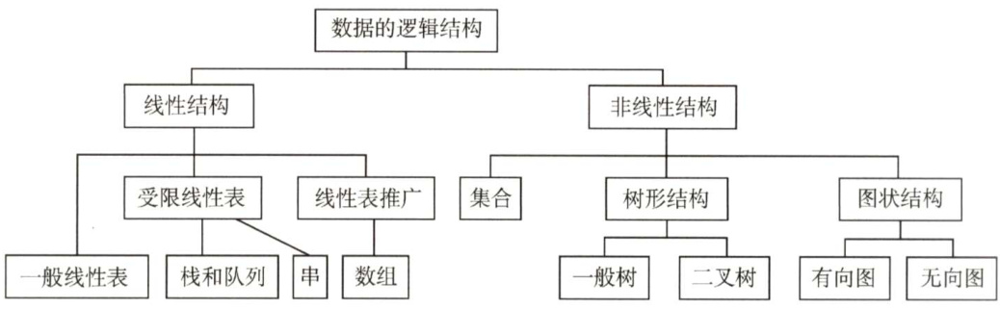
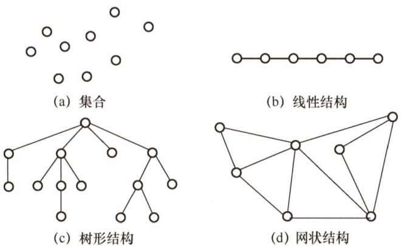

### 1.1 数据结构的基本概念  

#### 1.1.1 基本概念和术语  

#### 1．数据  

数据是信息的载体，是描述客观事物属性的数、字符及所有能输入到计算机中并被计算机程序识别和处理的符号的集合。数据是计算机程序加工的原料。  

#### 2.数据元素  

数据元素是数据的基本单位，通常作为一个整体进行考虑和处理。一个数据元素可由若干数据项组成，数据项是构成数据元素的不可分割的最小单位。例如，学生记录就是一个数据元素，它由学号、姓名、性别等数据项组成。  

#### 3．数据对象  

数据对象是具有相同性质的数据元素的集合，是数据的一个子集。例如，整数数据对象是集合 $N=\{0,\pm1,\pm2,\cdots\}$ 。  

#### 4.数据类型  

数据类型是一个值的集合和定义在此集合上的一组操作的总称。  

1）原子类型。其值不可再分的数据类型。  
2）结构类型。其值可以再分解为若干成分（分量）的数据类型。  
3）抽象数据类型。抽象数据组织及与之相关的操作。  

#### 5.数据结构  

数据结构是相互之间存在一种或多种特定关系的数据元素的集合。在任何问题中，数据元素都不是孤立存在的，它们之间存在某种关系，这种数据元素相互之间的关系称为结构（Structure)。数据结构包括三方面的内容：逻辑结构、存储结构和数据的运算。  

数据的逻辑结构和存储结构是密不可分的两个方面，一个算法的设计取决于所选定的逻辑结构，而算法的实现依赖于所采用的存储结构。  

#### 1.1.2 数据结构三要素  

#### 1．数据的逻辑结构  

逻辑结构是指数据元素之间的逻辑关系，即从逻辑关系上描述数据。它与数据的存储无关，是独立于计算机的。数据的逻辑结构分为线性结构和非线性结构，线性表是典型的线性结构；集合、树和图是典型的非线性结构。数据的逻辑结构分类如图1.1所示。  

  
图1.1数据的逻辑结构分类图  

集合。结构中的数据元素之间除“同属一个集合”外，别无其他关系，如图1.2(a)所示。  
线性结构。结构中的数据元素之间只存在一对一的关系，如图1.2(b)所示。  
树形结构。结构中的数据元素之间存在一对多的关系，如图1.2(c)所示。  
图状结构或网状结构。结构中的数据元素之间存在多对多的关系，如图1.2(d)所示。  

#### 2.数据的存储结构  

存储结构是指数据结构在计算机中的表示（又称映像)，也称物理结构。它包括数据元素的表示和关系的表示。数据的存储结构是用计算机语言实现的逻辑结构，它依赖于计算机语言。数据的存储结构主要有顺序存储、链式存储、索引存储和散列存储。  

1）顺序存储。把逻辑上相邻的元素存储在物理位置上也相邻的存储单元中，元素之间的关系由存储单元的邻接关系来体现。其优点是可以实现随机存取，每个元素占用最少的存储空间；缺点是只能使用相邻的一整块存储单元，因此可能产生较多的外部碎片。  

2）链式存储。不要求逻辑上相邻的元素在物理位置上也相邻，借助指示元素存储地址的指针来表示元素之间的  

  
图1.24类基本结构关系示例图  

逻辑关系。其优点是不会出现碎片现象，能充分利用所有存储单元；缺点是每个元素因存储指针而占用额外的存储空间，且只能实现顺序存取。  

3）索引存储。在存储元素信息的同时，还建立附加的索引表。索引表中的每项称为索引项，索引项的一般形式是（关键字，地址)。其优点是检索速度快；缺点是附加的索引表额外占用存储空间。另外，增加和删除数据时也要修改索引表，因而会花费较多的时间。  

4）散列存储。根据元素的关键字直接计算出该元素的存储地址，又称哈希（Hash）存储。其优点是检索、增加和删除结点的操作都很快；缺点是若散列函数不好，则可能出现元素存储单元的冲突，而解决冲突会增加时间和空间开销。  

#### 3．数据的运算  

施加在数据上的运算包括运算的定义和实现。运算的定义是针对逻辑结构的，指出运算的功能；运算的实现是针对存储结构的，指出运算的具体操作步骤。  

#### 1.1.3 本节试题精选  

#### 一、单项选择题  

01. 可以用（）定义一个完整的数据结构。  

A．数据元素 B．数据对象 C.数据关系 D.抽象数据类型  

02. 以下数据结构中，（）是非线性数据结构。  

A.树 B．字符串 C.队列 D.栈  

03．以下属于逻辑结构的是（）。  

A．顺序表 B.哈希表 C．有序表 D.单链表  

04.以下与数据的存储结构无关的术语是（）。  

A．循环队列 B.链表 C．哈希表 D.栈  

05．以下关于数据结构的说法中，正确的是（）。  

A．数据的逻辑结构独立于其存储结构 B．数据的存储结构独立于其逻辑结构 C.数据的逻辑结构唯一决定其存储结构 D．数据结构仅由其逻辑结构和存储结构决定  

06．在存储数据时，通常不仅要存储各数据元素的值，而且要存储（）。  

A．数据的操作方法 B．数据元素的类型C.数据元素之间的关系 D.数据的存取方法  

07．链式存储设计时，结点内的存储单元地址（）。  

A.一定连续 B.一定不连续C.不一定连续 D.部分连续，部分不连续  

#### 二、综合应用题  

01.对于两种不同的数据结构，逻辑结构或物理结构一定不相同吗？  

02.试举一例，说明对相同的逻辑结构，同一种运算在不同的存储方式下实现时，其运算效率不同。  

#### 1.1.4 答案与解析  

#### 一、单项选择题  

01.D  

抽象数据类型（ADT）描述了数据的逻辑结构和抽象运算，通常用（数据对象，数据关系，基本操作集）这样的三元组来表示，从而构成一个完整的数据结构定义。  

02.A  

树和图是典型的非线性数据结构，其他选项都属于线性数据结构。  

03.C  

顺序表、哈希表和单链表是三种不同的数据结构，既描述逻辑结构，又描述存储结构和数据运算。而有序表是指关键字有序的线性表，仅描述元素之间的逻辑关系，它既可以链式存储，又可以顺序存储，故属于逻辑结构。  

04.D  

数据的存储结构有顺序存储、链式存储、索引存储和散列存储。循环队列（易错点）是用顺序表表示的队列，是一种数据结构。栈是一种抽象数据类型，可采用顺序存储或链式存储，只表示逻辑结构。  

05.A  

数据的逻辑结构是从面向实际问题的角度出发的，只采用抽象表达方式，独立于存储结构，数据的存储方式有多种不同的选择；而数据的存储结构是逻辑结构在计算机上的映射，它不能独立于逻辑结构而存在。数据结构包括三个要素，缺一不可。  

06.C  

在存储数据时，不仅要存储数据元素的值，而且要存储数据元素之间的关系。  

07.A  

链式存储设计时，各个不同结点的存储空间可以不连续，但结点内的存储单元地址必须连续。  

#### 二、综合应用题  

01.【解答】  

应该注意到，数据的运算也是数据结构的一个重要方面。  

对于两种不同的数据结构，它们的逻辑结构和物理结构完全有可能相同。比如二叉树和二叉排序树，二叉排序树可以采用二叉树的逻辑表示和存储方式，前者通常用于表示层次关系，而后者通常用于排序和查找。虽然它们的运算都有建立树、插入结点、删除结点和查找结点等功能，但对于二叉树和二叉排序树，这些运算的定义是不同的，以查找结点为例，二叉树的时间复杂度为 $O(n)$ ，而二叉排序树的时间复杂度为 $O(\log_{2}n)$ 。  

02.【解答】  

线性表既可以用顺序存储方式实现，又可以用链式存储方式实现。在顺序存储方式下，在线性表中插入和删除元素，平均要移动近一半的元素，时间复杂度为 $O(n)$ ；而在链式存储方式下，插入和删除的时间复杂度都是 $O(1)$ o