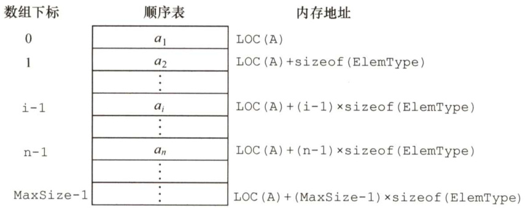
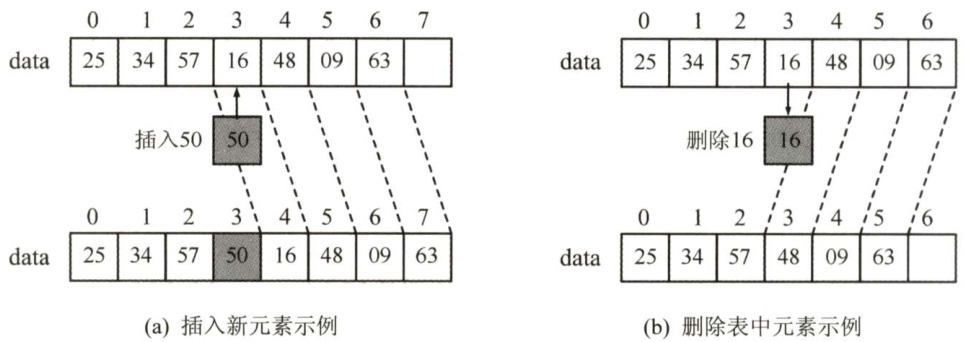
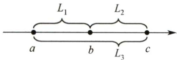

### 2.2 线性表的顺序表示  

#### 2.2.1 顺序表的定义  

线性表的顺序存储又称顺序表。它是用一组地址连续的存储单元依次存储线性表中的数据元素，从而使得逻辑上相邻的两个元素在物理位置上也相邻。第1个元素存储在线性表的起始位置，第 $i$ 个元素的存储位置后面紧接着存储的是第 $i+1$ 个元素，称 $i$ 为元素 $a_{i}$ 在线性表中的位序。因此，顺序表的特点是表中元素的逻辑顺序与其物理顺序相同。  

假设线性表 $L$ 存储的起始位置为 LOC(A)，sizeof(ElemType)是每个数据元素所占用存储空间的大小，则表 $L$ 所对应的顺序存储如图2.1所示。  

  
图2.1线性表的顺序存储结构  

每个数据元素的存储位置都和线性表的起始位置相差一个和该数据元素的位序成正比的常数，因此，线性表中的任一数据元素都可以随机存取，所以线性表的顺序存储结构是一种随机存取的存储结构。通常用高级程序设计语言中的数组来描述线性表的顺序存储结构。  

注意：线性表中元素的位序是从1开始的，而数组中元素的下标是从0开始的。  

假定线性表的元素类型为ElemType，则线性表的顺序存储类型描述为  

#define Maxsize 50 //定义线性表的最大长度  
typedef struct{ElemType data[MaxSize]; //顺序表的元素int length; //顺序表的当前长度  
)SqList; //顺序表的类型定义  

一维数组可以是静态分配的，也可以是动态分配的。在静态分配时，由于数组的大小和空间事先已经固定，一旦空间占满，再加入新的数据就会产生溢出，进而导致程序崩溃。  

而在动态分配时，存储数组的空间是在程序执行过程中通过动态存储分配语句分配的，一旦数据空间占满，就另外开辟一块更大的存储空间，用以替换原来的存储空间，从而达到扩充存储数组空间的目的，而不需要为线性表一次性地划分所有空间。  

#define Initsize 100 //表长度的初始定义  

typedef struct{ElemType\*data; //指示动态分配数组的指针int MaxSize,length; //数组的最大容量和当前个数}SeqList; //动态分配数组顺序表的类型定义C 的初始动态分配语句为L.data $\c=$ (ElemType\*)malloc(sizeof(ElemType)\*InitSize);$\mathrm{C}{+}{+}$ 的初始动态分配语句为L.data $\O=$ new ElemType[InitSize];  

注意：动态分配并不是链式存储，它同样属于顺序存储结构，物理结构没有变化，依然是随机存取方式，只是分配的空间大小可以在运行时动态决定。  

顺序表最主要的特点是随机访问，即通过首地址和元素序号可在时间 $O(1)$ 内找到指定的元素。  

顺序表的存储密度高，每个结点只存储数据元素。  

顺序表逻辑上相邻的元素物理上也相邻，所以插入和删除操作需要移动大量元素。  

#### 2.2.2 顺序表上基本操作的实现  

这里仅讨论顺序表的插入、删除和按值查找的算法，其他基本操作的算法都比较简单。  

（1）插入操作  

在顺序表 $L$ 的第i（ $1<=\mathrm{i}<=\mathrm{I}$ .length $+1$ ）个位置插入新元素e。若i的输入不合法，则返回false，表示插入失败；否则，将第i个元素及其后的所有元素依次往后移动一个位置，腾出一个空位置插入新元素e，顺序表长度增加1，插入成功，返回true。  

bool ListInsert（SqList &L,int i,ElemType e){if（ $\mathrm{i}<1$ 1 $\mathrm{i}>\mathrm{I}$ .length $^{+1}$ ） //判断i的范围是否有效return false;if（L.length>=MaxSize) //当前存储空间已满，不能插入return false;for(int $j=I$ .length; $j>=i$ ;j--） //将第i个元素及之后的元素后移L.data[j] $\scriptstyle=\mathtt{I}$ .data[j-1];L.data $[\mathrm{i}-1]=e$ //在位置i处放入eL.length $^{++}$ .： //线性表长度加1return true;  
广  

注意：区别顺序表的位序和数组下标。为何判断插入位置是否合法时if语句中用length $+1$ ，而移动元素的for语句中只用length？  

最好情况：在表尾插入（即 $i=n+1\rangle$ ，元素后移语句将不执行，时间复杂度为 $O(1)$  

最坏情况：在表头插入（即 $i=1$ )，元素后移语句将执行 $n$ 次，时间复杂度为 $O(n)$ 。  

平均情况：假设 $p_{i}$ $(p_{i}=1/(n+1)$ ）是在第 $i$ 个位置上插入一个结点的概率，则在长度为 $n$ 的线性表中插入一个结点时，所需移动结点的平均次数为  

$$
\sum_{i=1}^{n+1}p_{i}(n-i+1)=\sum_{i=1}^{n+1}{\frac{1}{n+1}}(n-i+1)={\frac{1}{n+1}}\sum_{i=1}^{n+1}(n-i+1)={\frac{1}{n+1}}{\frac{n(n+1)}{2}}={\frac{n}{2}}
$$  

因此，线性表插入算法的平均时间复杂度为 $O(n)$ o  

（2）删除操作  

删除顺序表 $L$ 中第i（ $1<=\mathrm{i}<=\mathrm{I}$ .length）个位置的元素，用引用变量 $\boldsymbol{\mathbf{\rho}}_{\mathrm{~e~}}$ 返回。若i的输入不合法，则返回false；否则，将被删元素赋给引用变量e，并将第i+1个元素及其后的所有元素依次往前移动一个位置，返回true。  

bool ListDelete（SqList &L,int i,Elemtype &e）{if( $\mathrm{i}<1$ 11 $\dot{2}>I$ .length) //判断i的范围是否有效return false;$e{=}\ I$ .data[i-1]; //将被删除的元素赋值给efor(int $j=i$ . $j<I$ .length; $j++$ ） //将第i个位置后的元素前移L.data $[j-1]=I$ .data[j];L.length--; //线性表长度减1return true;  

最好情况：删除表尾元素（即 $i=n$ )，无须移动元素，时间复杂度为 $O(1)$ 0  

最坏情况：删除表头元素（即 $i=1$ )，需移动除表头元素外的所有元素，时间复杂度为 $O(n)$ 。平均情况：假设 $p_{i}$ $(p_{i}=1/n$ ）是删除第 $i$ 个位置上结点的概率，则在长度为 $n$ 的线性表中删除一个结点时，所需移动结点的平均次数为  

$$
\sum_{i=1}^{n}p_{i}(n-i)=\sum_{i=1}^{n}{\frac{1}{n}}(n-i)={\frac{1}{n}}\sum_{i=1}^{n}(n-i)={\frac{1}{n}}{\frac{n(n-1)}{2}}={\frac{n-1}{2}}
$$  

因此，线性表删除算法的平均时间复杂度为 $O(n)$ o  

可见，顺序表中插入和删除操作的时间主要耗费在移动元素上，而移动元素的个数取决于插入和删除元素的位置。图2.2所示为一个顺序表在进行插入和删除操作前、后的状态，以及其数据元素在存储空间中的位置变化和表长的变化。在图2.2(a)中，将第4个至第7个元素从后往前依次后移一个位置，在图2.2(b)中，将第5个至第7个元素从前往后依次前移一个位置。  

  
图2.2 顺序表的插入和删除  

（3）按值查找（顺序查找）  

在顺序表 $L$ 中查找第一个元素值等于e的元素，并返回其位序。  

int LocateElem（SqList L,ElemType e){ int i; for( $i=0$ . $\dot{2}<I$ .length; $\dot{2}++$ ） if(L.data[i] $===0$ return $i+I$ //下标为i的元素值等于e，返回其位序i+1 return 0; //退出循环，说明查找失败  

最好情况：查找的元素就在表头，仅需比较一次，时间复杂度为 $O(1)$ 0  
最坏情况：查找的元素在表尾（或不存在）时，需要比较 $n$ 次，时间复杂度为 $O(n)$ 0  

平均情况：假设 $p_{i}$ （ ${\bf\dot{\rho}}_{p_{i}}=1/n$ ）是查找的元素在第 $\mathrm{~i~}$ （ $1<=\mathrm{i}<=\mathrm{I}$ .length）个位置上的概率，则在长度为 $n$ 的线性表中查找值为e的元素所需比较的平均次数为  

$$
\sum_{i=1}^{n}p_{i}\times i=\sum_{i=1}^{n}{\frac{1}{n}}\times i={\frac{1}{n}}{\frac{n(n+1)}{2}}={\frac{n+1}{2}}
$$  

因此，线性表按值查找算法的平均时间复杂度为 $O(n)$ 。  

#### 2.2.3 本节试题精选  

#### 一、单项选择题  

01.下述（）是顺序存储结构的优点。  

A．存储密度大 B．插入运算方便C.删除运算方便 D.方便地运用于各种逻辑结构的存储表示  

02.线性表的顺序存储结构是一种（）。  

A.随机存取的存储结构 B．顺序存取的存储结构C．索引存取的存储结构 D．散列存取的存储结构  

03．一个顺序表所占用的存储空间大小与（）无关。  

A．表的长度 B.元素的存放顺序C．元素的类型 D．元素中各字段的类型  

04.若线性表最常用的操作是存取第 $i$ 个元素及其前驱和后继元素的值，为了提高效率，应采用（）的存储方式。  

A.单链表 B．双向链表 C.单循环链表 D.顺序表  

05.一个线性表最常用的操作是存取任一指定序号的元素并在最后进行插入、删除操作，则利用（）存储方式可以节省时间。  

A．顺序表 B．双链表C．带头结点的双循环链表 D．单循环链表  

06.在 $n$ 个元素的线性表的数组表示中，时间复杂度为 $O(1)$ 的操作是（）。  

I．访问第 $i$ （ $1\leq i\leq n$ ）个结点和求第 $i$ （ $2\leq i\leq n$ ）个结点的直接前驱  
ⅡI．在最后一个结点后插入一个新的结点  
III．删除第1个结点  
IV．在第 $i$ （ $1\leq i\leq n$ ）个结点后插入一个结点  

A.I B.Ⅲ、II C.I、Ⅱ D.I、Ⅱ、III  

07.设线性表有 $n$ 个元素，严格说来，以下操作中，（）在顺序表上实现要比在链表上实现的效率高。  

I．输出第 $i$ （ $1{\le}i{\le}n$ ）个元素值ⅡI．交换第3个元素与第4个元素的值IⅢI.顺序输出这 $n$ 个元素的值  

A.I B.I、III C.I、Ⅱ D.Ⅱ、IⅢI  

08．在一个长度为 $n$ 的顺序表中删除第 $i$ （ $1\leq i\leq n$ ）个元素时，需向前移动（）个元素  

A. $n$ B.i-1 C. $n-i$ D. $\begin{array}{r}{n-i+1}\end{array}$  

09.对于顺序表，访问第 $i$ 个位置的元素和在第 $i$ 个位置插入一个元素的时间复杂度为（）。  

A. $O(n)$ ， $O(n)$ B. $O(n)$ ， $O(1)$ C. 0(1), $O(n)$ D. O(1)， $O(1)$  

10．若长度为 $n$ 的非空线性表采用顺序存储结构，在表的第 $i$ 个位置插入一个数据元素，则$i$ 的合法值应该是（）。  

A. $1\leq i\leq n$ B. $\begin{array}{r}{1\leq i\leq n+1\qquad\mathrm{~C.~}0\leq i\leq n-1\qquad\mathrm{~D.~}0\leq i\leq n}\end{array}$  

11．顺序表的插入算法中，当 $n$ 个空间已满时，可再申请增加分配 $\mid m$ 个空间，若申请失败，则说明系统没有（）可分配的存储空间。  

A. $m$ 个 B. $m$ 个连续 C. $n+m$ 个 D. $n+m$ 个连续  

#### 二、综合应用题  

01．从顺序表中删除具有最小值的元素（假设唯一）并由函数返回被删元素的值。空出的位置由最后一个元素填补，若顺序表为空，则显示出错信息并退出运行。  
02．设计一个高效算法，将顺序表 $L$ 的所有元素逆置，要求算法的空间复杂度为 $O(1)$   
03．对长度为 $n$ 的顺序表 $L$ ，编写一个时间复杂度为 $O(n)$ 、空间复杂度为 $O(1)$ 的算法，该算法删除线性表中所有值为 $x$ 的数据元素。  
04.从有序顺序表中删除其值在给定值 $s$ 与 $t$ 之间（要求 $s<t$ ）的所有元素，若 $s$ 或 $t$ 不合理或顺序表为空，则显示出错信息并退出运行。  
05．从顺序表中删除其值在给定值 $s$ 与 $t$ 之间（包含 $s$ 和 $t$ ，要求 $s<t$ ）的所有元素，若 $s$ 或$t$ 不合理或顺序表为空，则显示出错信息并退出运行。  
06．从有序顺序表中删除所有其值重复的元素，使表中所有元素的值均不同。  
07．将两个有序顺序表合并为一个新的有序顺序表，并由函数返回结果顺序表。  
08．已知在一维数组 $A[m+n]$ 中依次存放两个线性表 $(a_{1},a_{2},a_{3},\ldots,a_{m})\#\#(b_{1},b_{2},b_{3},\ldots,b_{n})_{\#}$ ，编写一个函数，将数组中两个顺序表的位置互换，即将 $(b_{1},b_{2},b_{3},\cdots,b_{n})$ 放在 $(a_{1},a_{2},a_{3},\cdots,a_{m})$ 的前面。  
09.线性表 $(a_{1},a_{2},a_{3},\cdots,a_{n})$ 中的元素递增有序且按顺序存储于计算机内。要求设计一个算法，完成用最少时间在表中查找数值为 $x$ 的元素，若找到，则将其与后继元素位置相交换，若找不到，则将其插入表中并使表中元素仍递增有序。  
10.【2010统考真题】设将 $n$ （ $n>1$ ）个整数存放到一维数组 $R$ 中。设计一个在时间和空间两方面都尽可能高效的算法。将 $R$ 中保存的序列循环左移 $p$ （ $0<p<n$ )个位置，即将 $R$ 中的数据由 $(X_{0},X_{1},\cdots,X_{n-1})$ 变换为 $(X_{p},X_{p+1},\cdots,X_{n-1}$ ， $X_{0},X_{1},\cdots,X_{p-1}).$ 。要求：1）给出算法的基本设计思想。2）根据设计思想，采用C或 $\mathrm{C}{+}{+}$ 或Java语言描述算法，关键之处给出注释。3）说明你所设计算法的时间复杂度和空间复杂度。  
11.【2011统考真题】一个长度为 $L$ （ $L\geq1$ ）的升序序列 $s$ ，处在第 $\lceil L/2$ 个位置的数称为 $s$  

的中位数。例如，若序列 $S_{1}=(11,13,15,17,19$ ，则 $S_{1}$ 的中位数是15，两个序列的中位数是含它们所有元素的升序序列的中位数。例如，若 $S_{2}=(2,4,6,8,20)$ ，则 $S_{1}$ 和 $S_{2}$ 的中位数是11。现在有两个等长升序序列 $A$ 和 $B$ ，试设计一个在时间和空间两方面都尽可能高效的算法，找出两个序列 $A$ 和 $B$ 的中位数。要求：  

1）给出算法的基本设计思想。  
2）根据设计思想，采用C或 $\mathrm{C}{+}{+}$ 或Java语言描述算法，关键之处给出注释。  
3）说明你所设计算法的时间复杂度和空间复杂度。  

12.【2013统考真题】已知一个整数序列 $A=(a_{0},a_{1},\cdots,a_{n-1})$ ，其中 $0\leq a_{i}<n$ （ $0\leq i<n$ )。若存在 $a_{p1}=a_{p2}=\ \dots\ =a_{p m}=x$ 且 $m>n/2$ （ $0\leq p_{k}<n$ $1\leq k\leq m$ )，则称 $x$ 为 $A$ 的主元素。例如 $A=(0,5,5,3,5,7,5,5)$ ，则5为主元素；又如 $A=(0,5,5,3,5,1,5,7)$ ，则 $A$ 中没有主元素。假设 $A$ 中的 $n$ 个元素保存在一个一维数组中，请设计一个尽可能高效的算法，找出 $A$ 的主元素。若存在主元素，则输出该元素；否则输出-1。要求：  

1）给出算法的基本设计思想。  
2）根据设计思想，采用C或 $\mathrm{C}{+}{+}.$ 或Java语言描述算法，关键之处给出注释。  
3）说明你所设计算法的时间复杂度和空间复杂度。  

13.【2018统考真题】给定一个含 $n$ （ $n\geq1$ ）个整数的数组，请设计一个在时间上尽可能高效的算法，找出数组中未出现的最小正整数。例如，数组{-5,3,2,3}中未出现的最小正整数是1；数组{1,2,3}中未出现的最小正整数是4。要求：1）给出算法的基本设计思想。2）根据设计思想，采用C或 $\mathbf{C}{+}{+}$ 语言描述算法，关键之处给出注释。3）说明你所设计算法的时间复杂度和空间复杂度。  

14.【2020统考真题】定义三元组 $(a,b,c)$ (a、 $b$ 、 $\mathbf{\Psi}_{c}$ 均为正数）的距离 $D=|a-b|+|b-c|+$ $|c-a|$ 。给定3个非空整数集合 $S_{1}$ ， $S_{2}$ 和 $S_{3}$ ，按升序分别存储在3个数组中。请设计一个尽可能高效的算法，计算并输出所有可能的三元组 $a,b,c)\ (a{\in}S_{1},\ b{\in}S_{2},\ c{\in}S_{3})$ ）中的最小距离。例如 $S_{1}=\{-1,0,9\}$ ， $S_{2}=\{-25,-10,10,11\}$ ， $S_{3}=\{2,9,17,30,41\}$ ，则最小距离为2，相应的三元组为(9,10,9)。要求：  

1）给出算法的基本设计思想。  
2）根据设计思想，采用C语言或 $\mathrm{C}{+}{+}$ 语言描述算法，关键之处给出注释。  
3）说明你所设计算法的时间复杂度和空间复杂度。  

#### 2.2.4 答案与解析  

#### 一、单项选择题  

01.A  

顺序表不像链表那样要在结点中存放指针域，因此存储密度较大，A正确。B和C是链表的优点。D是错误的，比如对于树形结构，顺序表显然不如链表表示起来方便。  

02.A  

本题易误选B。注意，存取方式是指读写方式。顺序表是一种支持随机存取的存储结构，根据起始地址加上元素的序号，可以很方便地访问任意一个元素，这就是随机存取的概念。  

03.B  

顺序表所占的存储空间 $\mathbf{\Sigma}=\mathbf{\Sigma}$ 表长 $\times$ sizeof（元素的类型），元素的类型显然会影响存储空间的大小。对于同一元素类型的顺序表，表越长，所占存储空间就越大。  

04.D  

题干实际要求能最快存取第i-1、 $i$ 和 $i+1$ 个元素值。A、B、C都只能从头结点依次顺序查找，时间复杂度为 $O(n)$ ；只有顺序表可以按序号随机存取，时间复杂度为 $O(1)$ 。  

05.A  

只有顺序表可以按序号随机存取，且在最后进行插入和删除操作时不需要移动任何元素。  

06.C  

I解析略；Ⅱ中，在最后位置插入新结点不需要移动元素，时间复杂度为 $O(1)$ ；IⅢ中，被删结点后的结点需依次前移，时间复杂度为 $O(n)$ ；IV中，需要后移 $n-i$ 个结点，时间复杂度为 $O(n)$ 。  

07.C  

对于II，顺序表仅需3次交换操作；链表则需要分别找到两个结点前驱，第4个结点断链后再插入到第2个结点后，效率较低。对于II，需依次顺序访问每个元素，时间复杂度相同。  

08.C需要将 $a_{i+1}{\sim}a_{n}$ 元素前移一位，共移动 $n-(i+1)+1=n-i$ 个元素。  

09.C在第 $i$ 个位置插入一个元素，需要移动 $n-i+1$ 个元素，时间复杂度为 $O(n)$ a  

10.B线性表元素的序号是从1开始，而在第 $n+1$ 个位置插入相当于在表尾追加。  

11.D  

顺序存储需要连续的存储空间，在申请时需申请 $n+m$ 个连续的存储空间，然后将线性表原来的 $n$ 个元素复制到新申请的 $n+m$ 个连续的存储空间的前 $n$ 个单元。  

#### 二、综合应用题  

01.【解答】  

算法思想：搜索整个顺序表，查找最小值元素并记住其位置，搜索结束后用最后一个元素填补空出的原最小值元素的位置。  

本题代码如下：  

bool Del_Min（sqList &L,ElemType &value）{  
//删除顺序表L中最小值元素结点，并通过引用型参数value返回其值  
//若删除成功，则返回true；否则返回falseif(L.length $==0$ ）return false; //表空，中止操作返回value $=I$ .data[0];int pos $=0$ . //假定0号元素的值最小for(int $\dot{\mathsf{1}}=1$ ;i<L.length; $\dot{2}++$ ） //循环，寻找具有最小值的元素if（L.data[i]<value){ //让value记忆当前具有最小值的元素value $=\mathtt{L}$ .data[i];pos $=\dot{2}$ .L.data[pos] $\scriptstyle=\mathtt{L}$ .data[L.length-1]; //空出的位置由最后一个元素填补L.length--;return true; //此时，value即为最小值  

注意：本题也可用函数返回值返回，两者的区别是：函数返回值只能返回一个值，而参数返回（引用传参）可以返回多个值。  

02.【解答】  

算法思想：扫描顺序表 $L$ 的前半部分元素，对于元素L.data［i]（ $0<=\mathrm{i}<\mathrm{I}$ .length/2),将其与后半部分的对应元素L.data[L.length-i-1]进行交换。  

本题代码如下：  

void Reverse（Sqlist &L） Elemtype temp; //辅助变量 for( $i=0$ . $\scriptstyle{\dot{\mathtt{1}}}<{\bar{\mathtt{L}}}$ .length/2; $\dot{2}++$ ）{ temp $\scriptstyle=\mathtt{L}$ .data[i]; //交换L.data[i]与L.data[L.length-i-1] L.data $[\dot{\bf\~i}]=[\dot{\bf~\bar{~}}$ .data[L.length-i-1]; L.data[L.length-i-1] $\c=$ temp;  

03.【解答】  

解法一：用 $k$ 记录顺序表 $L$ 中不等于 $x$ 的元素个数（即需要保存的元素个数)，扫描时将不等于 $x$ 的元素移动到下标 $k$ 的位置，并更新 $k$ 值。扫描结束后修改 $L$ 的长度。  

本题代码如下：  

void del_x_1（Sqlist &L,Elemtypex）{  
//本算法实现删除顺序表L中所有值为 $x$ 的数据元素int $k=0$ ,i; //记录值不等于 $x$ 的元素个数for( $\dot{2}=0$ $\dot{2}<I$ .length; $\dot{2}++$ )if(L.data[i] $:-x$ ）{L.data[k] $\scriptstyle=\mathtt{L}$ .data[i];$k++$ ： //不等于 $x$ 的元素增11L.length $=k$ ： //顺序表L的长度等于 $k$  

解法二：用 $k$ 记录顺序表 $L$ 中等于 $x$ 的元素个数，边扫描 $L$ 边统计k，并将不等于 $x$ 的元素前移 $k$ 个位置。扫描结束后修改 $L$ 的长度。  

本题代码如下：  

void del_x_2（Sqlist &L,Elemtypex）{int $k=0$ $i=0$ ： //k记录值等于 $x$ 的元素个数while( $\scriptstyle{\dot{\mathtt{1}}}<{\mathtt{L}}$ .length){if(L.data[i] $==\times$ ）$k++$ .elseL.data $[\dot{\ I}-k]=I$ .data[i]；//当前元素前移 $k$ 个位置i++;)L.length $\scriptstyle=\ I$ .length-k; //顺序表L的长度递减  

此外，本题还可以考虑设头、尾两个指针（ $i=1,j=n$ )，从两端向中间移动，在遇到最左端值 $x$ 的元素时，直接将最右端值非 $x$ 的元素左移至值为 $x$ 的数据元素位置，直到两指针相遇。但这种方法会改变原表中元素的相对位置。  

04.【解答】  

注意：本题与上一题存在区别。因为是有序表，所以删除的元素必然是相连的整体。  

算法思想：先寻找值大于等于 $s$ 的第一个元素（第一个删除的元素)，然后寻找值大于 $t$ 的第一个元素（最后一个删除的元素的下一个元素)，要将这段元素删除，只需直接将后面的元素前移。  

本题代码如下：  

bool Del_s_t2(SqList &L,ElemType s,ElemType t）{  
//删除有序顺序表L中值在给定值s与t之间的所有元素int i,j;if $s>=t$ l|L.length $==0$ ）return false;for( $\dot{\mathsf{1}}=0$ $\scriptstyle{\mathrm{i}}<{\mathrm{I}}$ .length&&L.data[i]<s; $i++$ ；//寻找值大于等于s的第一个元素if( $i>=I$ .length)return false; //所有元素值均小于s，返回for $j=i$ . $j<I$ .length&&L.data[j] $<=t$ $j++$ ；//寻找值大于t的第一个元素for(; $\scriptstyle{\dot{\mathcal{I}}}<{\mathbb{I}}$ .length; $\dot{2}++$ $j++$ )L.data $[\dot{\bf\~i}]=[\dot{\bf~\bar{~}}$ .data[j]; //前移，填补被删元素位置L.length ${\bf\Pi}=\dot{\bf\Pi}$ ·return true;  

05.【解答】  

算法思想：从前向后扫描顺序表 $L$ ，用 $k$ 记录下元素值在 $s$ 到 $t$ 之间元素的个数（初始时 $k=$ 0)。对于当前扫描的元素，若其值不在 $s$ 到 $t$ 之间，则前移 $k$ 个位置；否则执行 $k++$ 。由于这样每个不在 $s$ 到 $t$ 之间的元素仅移动一次，因此算法效率高。  

本题代码如下：  

bool Del_s_t（SqList &L,ElemType s,ElemType t){  
//删除顺序表L中值在给定值s与t（要求 $c<t$ ）之间的所有元素int i, $k=0$ ·if（L.length $\scriptstyle==0$ 11 $s>=t$ ）return false; //线性表为空或s、t不合法，返回for( $\dot{\mathsf{1}}=0$ $\scriptstyle{\dot{\mathtt{1}}}<{\bar{\mathtt{L}}}$ .length; $\dot{2}++$ ）{if(L.data[i] $>=\mathbf{s}\&\mathbb{I}$ .data[i] $<=t$ ）$k++$ ：elseL.data $[i-k]=I$ .data[i]；//当前元素前移 $k$ 个位置//forL.length- $-\mathbf{k}$ ： //长度减小return true;  

注意：本题也可从后向前扫描顺序表，每遇到一个值在 $s$ 到 $t$ 之间的元素，则删除该元素，其后的所有元素全部前移。但移动次数远大于前者，效率不够高。  

06.【解答】  

算法思想：注意是有序顺序表，值相同的元素一定在连续的位置上，用类似于直接插入排序的思想，初始时将第一个元素视为非重复的有序表。之后依次判断后面的元素是否与前面非重复有序表的最后一个元素相同，若相同，则继续向后判断，若不同，则插入前面的非重复有序表的最后，直至判断到表尾为止。  

本题代码如下：  

bool Delete_Same(SeqList& L）{if(L.length $\scriptstyle==0$ ）return false;inti,j; //i存储第一个不相同的元素，为工作指针for( $\dot{\mathsf{1}}=0$ $j=1$ 行 $<I$ .length; $j++$ ）if(L.data[i] $!=I$ .data[j]) //查找下一个与上个元素值不同的元素L.data $[++\pm]=[$ .data[j]; //找到后，将元素前移L.length $=\dot{2}+1$ .return true;  

对于本题的算法，请读者用序列 $1,2,2,2,2,3,3,3,4,4,5$ 来手动模拟算法的执行过程，在模拟过程中要标注 $i$ 和 $j$ 所指示的元素。  

思考：如果将本题的有序表改为无序表，你能想到时间复杂度为 $O(n)$ 的方法吗？  

（提示：使用散列表。）  

07.【解答】  

算法思想：首先，按顺序不断取下两个顺序表表头较小的结点存入新的顺序表中。然后，看哪个表还有剩余，将剩下的部分加到新的顺序表后面。  

本题代码如下：  

bool Merge（SeqList A,SeqList B,SeqList &C）{//将有序顺序表A与B合并为一个新的有序顺序表Cif（A.length $+\tt B$ .length>C.maxSize) //大于顺序表的最大长度return false;int $\dot{1}=0$ $\dot{\boldsymbol{\mathrm{\mathcal{I}}}}=0$ $k=0$ while( $\dot{2}<A$ .length&&j $<B$ .length){ //循环，两两比较，小者存入结果表if(A.data[i] $<=B$ .data[j])C.data $[k++1=\tt{A}$ .data $[i++]$ ·elseC.data $[k++]=\mathtt{B}$ .data $[j++]$ .while( $\dot{1}<A$ .length) //还剩一个没有比较完的顺序表C.data $[k++1=\tt A$ .data $[i++]$ .while $j<B$ .length)C.data $[k++]=B$ .data $[j++]$ .C.length $=k$ return true;  

注意：本算法的方法非常典型，需牢固掌握。  

08.【解答】  

算法思想：先将数组 $A[m+n]$ 中的全部元素 $(a_{1},a_{2},a_{3},\cdots,a_{m},b_{1},b_{2},b_{3},\cdots,b_{n})$ 原地逆置为 $(b_{n},b_{n-1})$ $b_{n-2},\cdots,b_{1},a_{m},a_{m-1},a_{m-2},\cdots,a_{1})$ ，再对前 $n$ 个元素和后 $m$ 个元素分别使用逆置算法，即可得到 $(b_{1},b_{2}$ $b_{3},\cdots,b_{n},a_{1},a_{2},a_{3},\cdots,a_{m})$ ，从而实现顺序表的位置互换。  

本题代码如下：  

typedef int DataType;  
void Reverse（DataType A[],int left,int right,int arraySize){  
//逆转（aleft,aleft $+1$ ,aleft $+2\cdots$ ,aright)为（aright,aright-1,.,aleft)if(left> $\cdot=$ right//right> $\c=$ arraySize)return;int mid $\c=$ (left+right)/2;for(int $i=0$ . $\dot{2}<=$ mid-left; $\dot{2}++$ DataType temp $\scriptstyle={\tt A}$ [left+i];A[left+i] $\mathtt{\Gamma}=\mathtt{A}$ [right-i];A[right-i] $\c=$ temp;  
void Exchange（DataType A[],int m,int n,int arraySize){  
/\*数组 $\mathbb{A}[\mathfrak{m}+\mathfrak{n}]$ 中，从0到 $\mathtt{m}-1$ 存放顺序表（al，a2，a3，.,am），从m到 $m+n-1$ 存放顺序表  
（bl,b2，b3，..,bn），算法将这两个表的位置互换\*/Reverse(A,0, $m+n-1$ arraySize);Reverse $(\mathtt{A},0,\mathtt{n-1}$ ,arraySize);Reverse(A,n, $m+n-1$ ,arraySize);  

09.【解答】  

算法思想：顺序存储的线性表递增有序，可以顺序查找，也可以折半查找。题目要求“用最少的时间在表中查找数值为 $x$ 的元素”，这里应使用折半查找法。  

本题代码如下：  

void SearchExchangeInsert（ElemType A[],ElemType x){int low $=0$ ,high $=n-1$ ,mid; //low和high指向顺序表下界和上界的下标while(low $<=$ high)(mid $\c=$ （low+high)/2; //找中间位置if（A[mid] $\scriptstyle==\mathbf{x}$ ）break; //找到 $x$ ，退出while循环else if(A[mid] $<x$ ）low $\c=$ mid $+1$ ；//到中点mid的右半部去查else high $\c=$ mid-1; //到中点mid的左半部去查8 //下面两个if语句只会执行一个if(A[mid] $\scriptstyle==$ x&&mid! $=n-1$ ）1 //若最后一个元素与 $x$ 相等，则不存在与其后继交换的操作$t=\tt{A}$ [mid];A[mid] $\mathtt{=A}$ [mid+1];A[mid $+1]=t$ .if（low>high）{ //查找失败，插入数据元素 $x$ for $i=n-1$ $i>$ high; $\mathrm{i\mathrm{~--~}}$ ) $A[\dot{1}+1]=A[$ i]; //后移元素$A[i+1]=x$ //插入 $x$ } //结束插入  

本题的算法也可写成三个函数：查找函数、交换后继函数与插入函数。写成三个函数的优点是逻辑清晰、易读。  

10.【解答】  

1）算法的基本设计思想：  

可将这个问题视为把数组 $a b$ 转换成数组 $b a$ （ $\scriptstyle{a}$ 代表数组的前 $p$ 个元素， $b$ 代表数组中余下的 $n^{-}$ $p$ 个元素)，先将 $a$ 逆置得到 $a^{-1}b$ ，再将 $b$ 逆置得到 $a^{-1}b^{-1}$ ，最后将整个 $a^{-1}b^{-1}$ 逆置得到 $|(a^{-1}b^{-1})^{-1}=b a$ 0设 Reverse函数执行将数组元素逆置的操作，对abcdefgh向左循环移动3（ $\cdot p=3$ ）个位置的过程如下：  

Reverse $(0,\mathtt{p}-1)$ 得到cbadefgh；  
Reverse(p,n-1)得到cbahgfed;  
Reverse $(0,\mathrm{n-1})$ 得到defghabc;  
注：Reverse中，两个参数分别表示数组中待转换元素的始末位置。  

2）使用C语言描述算法如下：  

void Reverse（int R[],int from,int to）{int i,temp;for( $\dot{\mathsf{1}}=0$ $i<$ (to-from $+1$ )/2; $i++$ {temp $-\tt R$ [from $1+\mathrm{i}$ ];R[from $+;$ 订 $\scriptstyle=\mathrm{\mathrm{R}}$ [to-i];R[to-i] $\c=$ temp;}  
}//Reverse  
void Converse（int R[],int n,int p）{Reverse（R,0,p-1);Reverse（R,p,n-l);Reverse $(\mathtt{R},0,\mathtt{n-1})$ ；  

3）上述算法中三个Reverse 函数的时间复杂度分别为 $O(p/2)$ 、 $O((n-p)/2)$ 和 $O(n/2)$ ，故所设计的算法的时间复杂度为 $O(n)$ ，空间复杂度为 $O(1)$ 。  

另解，借助辅助数组来实现。算法思想：创建大小为 $p$ 的辅助数组 $s$ ，将 $R$ 中前 $p$ 个整数依次暂存在 $s$ 中，同时将 $R$ 中后 $n{-}p$ 个整数左移，然后将 $s$ 中暂存的 $p$ 个数依次放回到 $R$ 中的后续单元。时间复杂度为 $O(n)$ ，空间复杂度为 $O(p)$ o  

11.【解答】  

1）算法的基本设计思想如下。  

分别求两个升序序列 $A$ 、 $B$ 的中位数，设为 $\boldsymbol{a}$ 和 $b$ ，求序列 $A$ 、 $B$ 的中位数过程如下：  

$\textcircled{1}$ 若 $a=b$ ，则 $a$ 或 $b$ 即为所求中位数，算法结束。$\textcircled{2}$ 若 $a<b$ ，则舍弃序列 $A$ 中较小的一半，同时舍弃序列 $B$ 中较大的一半，要求两次舍弃的长度相等。$\textcircled{3}$ 若 $a>b$ ，则舍弃序列 $A$ 中较大的一半，同时舍弃序列 $B$ 中较小的一半，要求两次舍弃的长度相等。在保留的两个升序序列中，重复过程 $\textcircled{1}$ 、 $\textcircled{2}$ 、 $\textcircled{3}$ ，直到两个序列中均只含一个元素时为止，较小者即为所求的中位数。  

2）本题代码如下：  

intM Search（int A[],intB[]，intn）{int $\mathbf{\sigma}_{S1}=0$ $\mathrm{d}1=\mathrm{n}-1$ 水 $m I$ $\mathbf{s}2=0$ $\mathtt{d}2=\mathtt{n}-1$ ,m2;//分别表示序列A和B的首位数、末位数和中位数while( $\mathbf{s}\bot:=\mathbf{d}\bot$ 1 $\mathbf{s}2!=\mathrm{d}2$ ）{$m1=(s1+d1)/$ 2;$m2=({\mathsf{s}}2+\mathrm{d}2)/2$ if $\left(\mathbb{A}\left[\mathrm{m}\right]\right]==\mathbf{B}$ [m2]）return A[ml]; //满足条件 $\textcircled{1}$  

if（A[ml] $<B$ [m2]）{ //满足条件 $\textcircled{2}$ if（ $\mathbf{s}\beth+\mathrm{d}\beth$ ） $\frac{0}{0}2==0$ ） //若元素个数为奇数$\mathbf{\sigma}_{s1}=\mathbf{\sigma}_{\mathrm{m1}}$ . //舍弃A中间点以前的部分且保留中间点$\scriptstyle\mathrm{d}2={\mathfrak{m}}2$ . //舍弃B中间点以后的部分且保留中间点卜else{ //元素个数为偶数$\mathbf{s}1=\mathbf{m}1+1$ //舍弃A中间点及中间点以前部分$\scriptstyle\mathrm{d}2={\mathfrak{m}}2$ . //舍弃B中间点以后部分且保留中间点}else{ //满足条件 $\textcircled{3}$ if( $\cdot\mathbf{s}2+\mathrm{d}2$ ） $\frac{0}{0}2==0$ ） //若元素个数为奇数$\scriptstyle\mathrm{d}1=\mathrm{m}1$ . //舍弃A中间点以后的部分且保留中间点$\therefore\angle=\angle$ · //舍弃B中间点以前的部分且保留中间点+else{ //元素个数为偶数$\mathrm{d}1=\mathrm{m}1$ . //舍弃A中间点以后部分且保留中间点$s2=m2+1$ ， //舍弃B中间点及中间点以前部分return A[sl] $<B$ [s2]？A[sl]：B[s2]；  

3）算法的时间复杂度为 $O(\log_{2}n)$ ，空间复杂度为 $O(1)$ 。  

12.【解答】  

1）算法的基本设计思想：算法的策略是从前向后扫描数组元素，标记出一个可能成为主元素的元素Num。然后重新计数，确认Num是否是主元素。  

算法可分为以下两步：  

$\textcircled{1}$ 选取候选的主元素。依次扫描所给数组中的每个整数，将第一个遇到的整数Num 保存到c 中，记录 Num 的出现次数为1；若遇到的下一个整数仍等于Num，则计数加1，否则计数减1；当计数减到0时，将遇到的下一个整数保存到中，计数重新记为1，开始新一轮计数，即从当前位置开始重复上述过程，直到扫描完全部数组元素。  
$\textcircled{2}$ 判断c中元素是否是真正的主元素。再次扫描该数组，统计c中元素出现的次数，若大于 $n/2$ ，则为主元素；否则，序列中不存在主元素。  

2）算法实现如下：  

int Majority（int A[],int n）{int i,c,count $=1$ ： //c用来保存候选主元素，count用来计数$c=\tt{A}[0]$ . //设置A[0]为候选主元素for $\dot{2}=2$ . $\frac{1}{2}<n$ . $\dot{2}++$ ） //查找候选主元素if $(A[i]==c$ 0count $^{++}$ ： //对A中的候选主元素计数elseif(count $>0$ ） //处理不是候选主元素的情况count--;else{ //更换候选主元素，重新计数$c=\tt{A}[i]$ .  

count $^{=1}$ . } if(count $>0$ ） for( $\dot{\bf{\varphi}}_{\dot{\bf{\varphi}}}(\dot{\bf{\varphi}}_{\dot{\bf{\varphi}}})=\dot{\bf{\varphi}}$ count $=0$ $\mathrm{i}<\mathrm{n}$ . $\dot{2}++$ ）//统计候选主元素的实际出现次数 if $\frac{1}{2}[i]==c$ count $^{++}$ ： if（count>n/2)return c; //确认候选主元素 else return-1; //不存在主元素  

3）实现的程序的时间复杂度为 $O(n)$ ，空间复杂度为 $O(1)$ o  

说明：本题如果采用先排好序再统计的方法［时间复杂度可为 $O(n\log_{2}n).$ ，只要解答正确，最高可拿11分。即便是写出 $O(n^{2})$ 的算法，最高也能拿10分，因此对于统考算法题，花费大量时间去思考最优解法是得不偿失的。  

13.【解答】  

1）算法的基本设计思想：  

要求在时间上尽可能高效，因此采用空间换时间的办法。分配一个用于标记的数组B[n]，用来记录A中是否出现了 $1{\sim}\mathrm{n}$ 中的正整数，B[0]对应正整数1，B[n-1]对应正整数 $\mathbf{\bar{n}}$ ，初始化B中全部为0。由于A中含有 $\mathfrak{n}$ 个整数，因此可能返回的值是 $1{\sim}\mathrm{n}+1$ ，当A中 $\mathbf{\bar{n}}$ 个数恰好为 $1{\sim}\mathrm{n}$ 时返回 $\mathrm{n}{+}1$ 。当数组A中出现了小于等于0或大于 $\mathfrak{n}$ 的值时，会导致 $1{\sim}\mathrm{n}$ 中出现空余位置，返回结果必然在 $1{\sim}\mathrm{n}$ 中，因此对于A中出现了小于等于0或大于 $\mathfrak{n}$ 的值，可以不采取任何操作。  

经过以上分析可以得出算法流程：从A[0]开始遍历A,若 $0<\mathtt{A}[\mathrm{~i~}]<=\mathtt{n}$ ，则令 $\mathrm{~B~}[\mathrm{~A~}[\mathrm{~i~}]-1]=1$ .否则不做操作。对A遍历结束后，开始遍历数组B，若能查找到第一个满足 $\mathtt{B}[\mathrm{\i\}]==0$ 的下标 $\mathrm{~i~}$ 返回 $\mathrm{i}+1$ 即为结果，此时说明A中未出现的最小正整数在 $1{\sim}\mathrm{n}$ 之间。若B[i]全部不为0，返回 $\mathrm{i}+1$ （跳出循环时 $\mathrm{i}=\mathrm{n}$ ， $\mathrm{i}+1$ 等于 $\mathtt{n}+1$ )，此时说明A中未出现的最小正整数是 $\mathrm{n}{+}1$ 。  

2）算法实现：  

int findMissMin（int A[],int n）  
(int i, $\star\mathtt{B}$ //标记数组$\mathtt{B}=$ (int $\star$ )malloc(sizeof（int) $^{\star}\mathrm{n}$ ）；//分配空间memset（B,0,sizeof（int) $\star_{\Pi}$ ； //赋初值为0for $\dot{2}=0$ . $\mathrm{i}<\mathrm{n}$ ： $\dot{2}++$ )if $(\mathbb{A}[\mathrm{i}]>0\&\mathbb{A}[\mathrm{i}]<=\mathtt{n})$ //若A[i]的值介于 $1\sim\mathrm{n}$ ，则标记数组B1 $3[\mathbb{A}[\mathrm{\i}]-1]=1$ for $\scriptstyle{\dot{1}}=0$ . $\mathrm{i}<\mathrm{n}$ . $\dot{2}++$ ） //扫描数组B，找到目标值if $\mathbf B[\mathrm{\i\}]==0:$ break;return $\dot{2}+1$ · //返回结果  
+  

3）时间复杂度：遍历A一次，遍历B一次，两次循环内操作步骤为 $O(1)$ 量级，因此时间复杂度为 $O(n)$ 。空间复杂度：额外分配了B[n]，空间复杂度为 $O(n)$ o  

14.【解答】  

分析。由 $D=|a-b|+|b-c|+|c-a|\geq0$ 有如下结论。  

$\textcircled{1}$ 当 $a=b=c$ 时，距离最小。$\textcircled{2}$ 其余情况。不失一般性，假设 $a\leq b\leq c$ ，观察下面的数轴：  

  

L=丨a-b|   
$L_{2}=\left|b-c\right|$   
$L_{3}=\left|c-a\right|$   
$D=|a-b|+|b-c|+|c-a|=L_{1}+L_{2}+L_{3}=2L_{3}$  

由 $D$ 的表达式可知，事实上决定 $D$ 大小的关键是 $a$ 和 $\mathbf{\Psi}_{c}$ 之间的距离，于是问题就可以简化为每次固定 $\scriptstyle{c}$ 找一个 $a$ ，使得 $L_{3}=\left|c-a\right|$ 最小。  

1）算法的基本设计思想  

$\textcircled{1}$ 使用 $D_{\mathrm{min}}$ 记录所有已处理的三元组的最小距离，初值为一个足够大的整数。  

$\textcircled{2}$ 集合 $S_{1}$ ： $S_{2}$ 和 $S_{3}$ 分别保存在数组A、B、C中。数组的下标变量 $\scriptstyle i=j=k=0$ ，当 $i<\left|S_{1}\right|,$ $j<|S_{2}|$ 且 $k<|S_{3}|$ 时（ $|S|$ 表示集合 $s$ 中的元素个数)，循环执行下面的a) ${\sim}\tt c$ )。  

a）计算(A[i],B[], $\mathbf{C}[k]$ 的距离 $D$ ， （计算 $D$ )  
b）若 $D<D_{\operatorname*{min}}$ ，则 $D_{\mathrm{min}}=D$ ；（更新 $D$ ）  
c）将 $\mathbf{A}[i]$ 、B[]、 $\mathbf{C}[k]$ 中的最小值的下标 $+1$ （对照分析：最小值为 $a$ ，最大值为 $\mathbf{\Psi}_{c}$ ，这里$\boldsymbol{c}$ 不变而更新 $a$ ，试图寻找更小的距离 $D$ ）  
$\textcircled{3}$ 输出 $D_{\mathrm{min}}$ ，结束。  

2）算法实现：  

#define INT MAx Ox7fffffff  
intabs_（inta）{//计算绝对值if $a<0$ return -a;else return a;  
boolxls_min（inta,intb,intc）{//a是否是三个数中的最小值if $a<=b\&\&a<=c$ return true;return false;  
int findMinofTrip（int A[],int n,int B[],int m,int C[],int p）{//D_min用于记录三元组的最小距离，初值赋为INT_MAXint $\dot{\bf\updownarrow}=0$ $j=0$ $k=0$ D_min $\c=$ INT_MAX,D;while（i<n&&j<m&&k<p&&D_min $>0$ ）$D=$ abs_(A[i]-B[j]） $^+$ abs_（B[j]-C[k]）+abs_（C[k]-A[i]）;//计算Dif（D<D_min)D_min $=0$ //更新Dif（xls_min（A[i],B[j],C[k])）i++; //更新aelse if（xls_min（B[j],C[k],A[i]))j++;else $k++$ .+return D_min;  

3）设 $n=(\left\lvert S_{1}\right\rvert+\left\lvert S_{2}\right\rvert+\left\lvert S_{3}\right\rvert)$ ，时间复杂度为 $O(n)$ ，空间复杂度为 $O(1)$ 。