### 2.3 线性表的链式表示  

顺序表可以随时存取表中的任意一个元素，它的存储位置可以用一个简单直观的公式表示，但插入和删除操作需要移动大量元素。链式存储线性表时，不需要使用地址连续的存储单元，即不要求逻辑上相邻的元素在物理位置上也相邻，它通过“链”建立起数据元素之间的逻辑关系，因此插入和删除操作不需要移动元素，而只需修改指针，但也会失去顺序表可随机存取的优点。  

#### 2.3.1 单链表的定义  

线性表的链式存储又称单链表，它是指通过一组任意的存储单元来存储线性表中的数据元素。为了建立数据元素之间的线性关系，对每个链表结点，除存放元素自身的信息外，还需要存放一个指向其后继的指针。单链表结点结构如图2.3所示，其中data为数据域，存放数据元素；next为指针域，存放其后继结点的地址。  

<html><body><table><tr><td>data</td><td>next</td></tr></table></body></html>  

单链表中结点类型的描述如下：  

<html><body><table><tr><td>typedef struct LNode{ ElemType data;</td><td>//定义单链表结点类型</td></tr><tr><td>struct LNode *next; }LNode,*LinkList;</td><td>//数据域 //指针域</td></tr></table></body></html>  

利用单链表可以解决顺序表需要大量连续存储单元的缺点，但单链表附加指针域，也存在浪费存储空间的缺点。由于单链表的元素离散地分布在存储空间中，所以单链表是非随机存取的存储结构，即不能直接找到表中某个特定的结点。查找某个特定的结点时，需要从表头开始遍历，依次查找。  

通常用头指针来标识一个单链表，如单链表 $L$ ，头指针为NULL时表示一个空表。此外，为了操作上的方便，在单链表第一个结点之前附加一个结点，称为头结点。头结点的数据域可以不设任何信息，也可以记录表长等信息。头结点的指针域指向线性表的第一个元素结点，如图2.4所示。  

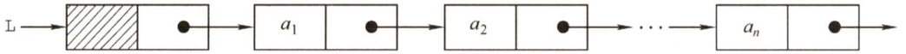  
图2.3单链表结点结构  
图2.4带头结点的单链表  

头结点和头指针的区分：不管带不带头结点，头指针都始终指向链表的第一个结点，而头结点是带头结点的链表中的第一个结点，结点内通常不存储信息。  

引入头结点后，可以带来两个优点：  

$\textcircled{1}$ 由于第一个数据结点的位置被存放在头结点的指针域中，因此在链表的第一个位置上的操作和在表的其他位置上的操作一致，无须进行特殊处理。  
$\textcircled{2}$ 无论链表是否为空，其头指针都指向头结点的非空指针（空表中头结点的指针域为空)，因此空表和非空表的处理也就得到了统一。  

#### 2.3.2 单链表上基本操作的实现  

#### 1．采用头插法建立单链表  

该方法从一个空表开始，生成新结点，并将读取到的数据存放到新结点的数据域中，然后将新结点插入到当前链表的表头，即头结点之后，如图2.5所示。  

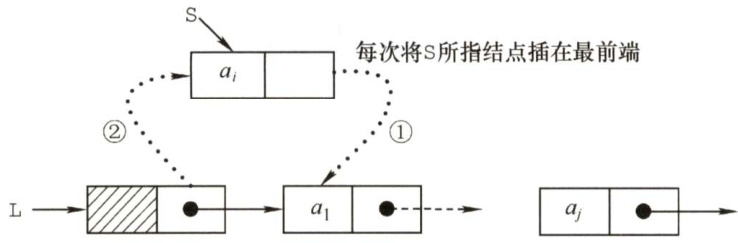  
图2.5头插法建立单链表  

头插法建立单链表的算法如下：  

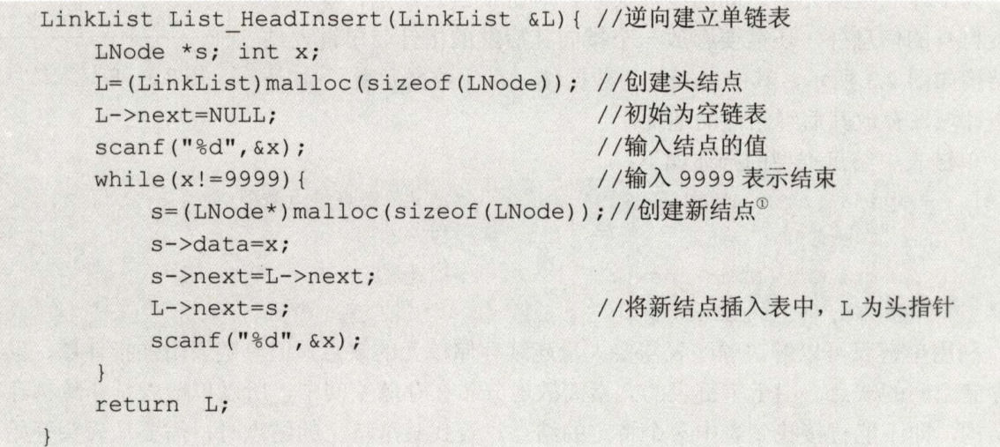  

采用头插法建立单链表时，读入数据的顺序与生成的链表中的元素的顺序是相反的。每个结点插入的时间为 $O(1)$ ，设单链表长为 $n$ ，则总时间复杂度为 $O(n)$ 。  

思考一下：若没有设立头结点，则上述代码需要在哪些地方修改？ 2  

#### 2.采用尾插法建立单链表  

头插法建立单链表的算法虽然简单，但生成的链表中结点的次序和输入数据的顺序不一致。若希望两者次序一致，则可采用尾插法。该方法将新结点插入到当前链表的表尾，为此必须增加一个尾指针 $\mathrm{~\boldmath~{~\underline{~}{~r~}~}~}$ ，使其始终指向当前链表的尾结点，如图2.6所示。  

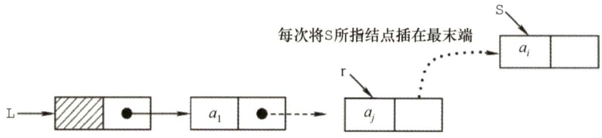  
图2.6尾插法建立单链表  

尾插法建立单链表的算法如下：  

LinkListListTailInsert（LinkList&L）{//正向建立单链表 intx; //设元素类型为整型 $L=$ (LinkList)malloc(sizeof（LNode)); LNode $\star_{S}$ $\star\underline{{\boldsymbol{\mathbf{\mathit{r}}}}}=\mathbb{I}$ ： //r为表尾指针 scanf（"%d", $\&x$ ）； //输入结点的值  

while $\times:=9999$ ）{ //输入9999表示结束$s=$ (LNode $\star$ )malloc(sizeof(LNode));s->data $=-\frac{1}{2}$ .r->next $=_{\mathrm{s}}$ ：$\scriptstyle{\underline{{r}}}=s$ ： //r指向新的表尾结点scanf（"%d",&x）;  
F  
r->next $\c=$ NULL; //尾结点指针置空  
return L;  

因为附设了一个指向表尾结点的指针，故时间复杂度和头插法的相同。  

#### 3．按序号查找结点值  

在单链表中从第一个结点出发，顺指针next域逐个往下搜索，直到找到第i个结点为止，否则返回最后一个结点指针域NULL。  

按序号查找结点值的算法如下：  

LNode \*GetElem（LinkList L,int i）{int $\dot{\mathsf{J}}=1$ ： //计数，初始为1LNode $\star_{\mathrm{p=I}}$ ->next; //第1个结点指针赋给pif( $i==0$ ）return L; //若i等于0，则返回头结点if( $\dot{2}<2$ ）return NULL; //若i无效，则返回NULLwhile（p&&j<i）{ //从第1个结点开始找，查找第i个结点p=p->next;$j++$ .子return p; //返回第i个结点的指针，若i大于表长，则返回NULL  

按序号查找操作的时间复杂度为 $O(n)$ o  

#### 4.按值查找表结点  

从单链表的第一个结点开始，由前往后依次比较表中各结点数据域的值，若某结点数据域的值等于给定值e，则返回该结点的指针；若整个单链表中没有这样的结点，则返回NULL。  

按值查找表结点的算法如下：  

LNode \*LocateElem（LinkList L,ElemType e){LNode $t_{p=I}->$ next;while $p!=$ NULL&&p->data $!=\in$ ）//从第1个结点开始查找data域为e的结点$p=p\rightarrow$ next;return pi //找到后返回该结点指针，否则返回NULL  

按值查找操作的时间复杂度为 $O(n)$ o  

#### 5.插入结点操作  

插入结点操作将值为 $\mathbf{x}$ 的新结点插入到单链表的第i个位置上。先检查插入位置的合法性，然后找到待插入位置的前驱结点，即第i-1个结点，再在其后插入新结点。  

算法首先调用按序号查找算法GetElem(L,i-1)，查找第i-1个结点。假设返回的第i-1个结点为 $^{\star}\mathrm{p}$ ，然后令新结点\*s的指针域指向 $\star_{\mathrm{p}}$ 的后继结点，再令结点\*p的指针域指向新插入  

的结点\*s。其操作过程如图2.7所示。  

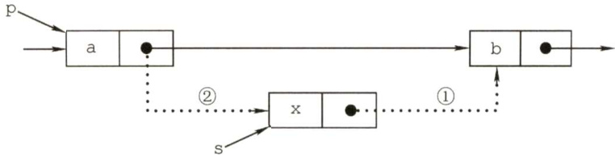  
图2.7单链表的插入操作  

实现插入结点的代码片段如下：  

①p=GetElem（L,i-1); //查找插入位置的前驱结点$\textcircled{2}$ s->next $\L=$ p->next; //图2.7中操作步骤1③p->next ${}={}s$ · //图2.7中操作步骤2  

算法中，语句 $\textcircled{2}$ 和 $\textcircled{3}$ 的顺序不能颠倒，否则，当先执行 $_{\mathtt{p}\to}$ next $=s$ 后，指向其原后继的指针就不存在，再执行s->next=p->next时，相当于执行了 $\scriptstyle{\mathrm{s-}}>{\mathrm{next}}=s$ ，显然是错误的。本算法主要的时间开销在于查找第i-1个元素，时间复杂度为 $O(n)$ 。若在给定的结点后面插入新结点，则时间复杂度仅为 $O(1)$ 0  

扩展：对某一结点进行前插操作。  

前插操作是指在某结点的前面插入一个新结点，后插操作的定义刚好与之相反。在单链表插入算法中，通常都采用后插操作。  

以上面的算法为例，首先调用函数GetElem()找到第i-1个结点，即插入结点的前驱结点后，再对其执行后插操作。由此可知，对结点的前插操作均可转化为后插操作，前提是从单链表的头结点开始顺序查找到其前驱结点，时间复杂度为 $O(n)$ o  

此外，可采用另一种方式将其转化为后插操作来实现，设待插入结点为 $\star_{S}$ ，将\*s插入到 $^{\star}\mathrm{p}$ 的前面。我们仍然将 $\star_{S}$ 插入到 $\star_{\mathrm{{p}}}$ 的后面，然后将 $\mathtt{p}\to$ data与 $s\mathrm{-}>$ data交换，这样既满足了逻辑关系，又能使得时间复杂度为 $O(1)$ 。算法的代码片段如下：  

//将\*s结点插入到 $\star_{\mathrm{{p}}}$ 之前的主要代码片段  
s->next=p->next; //修改指针域，不能颠倒p->next $\scriptstyle=_{\mathrm{{S}}}$   
temp=p->data; //交换数据域部分  
p->data $=s\mathrm{-}>$ data;  
s->data $\c=$ temp;  

#### 6．删除结点操作  

删除结点操作是将单链表的第 $i$ 个结点删除。先检查删除位置的合法性，后查找表中第 $i-1$ 个结点，即被删结点的前驱结点，再将其删除。其操作过程如图2.8所示。  

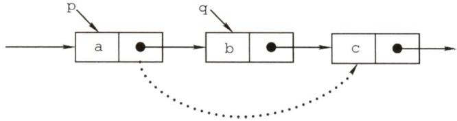  
图2.8单链表结点的删除  

假设结点 $\star_{\mathrm{{p}}}$ 为找到的被删结点的前驱结点，为实现这一操作后的逻辑关系的变化，仅需修改 $\star_{\mathrm{{p}}}$ 的指针域，即将 $\star_{\mathrm{p}}$ 的指针域next指向 $\star_{\mathsf{q}}$ 的下一结点。  

实现删除结点的代码片段如下：  

p=GetElem（L,i-1）; //查找删除位置的前驱结点q=p->next; //令q指向被删除结点p->next $\c=$ q->next //将 $\star_{\mathsf{q}}$ 结点从链中“断开”free(q); //释放结点的存储空间  

和插入算法一样，该算法的主要时间也耗费在查找操作上，时间复杂度为 $O(n)$ 。  

扩展：删除结点 $^{\star}\mathrm{p}$ 。  

要删除某个给定结点 $^{\star}\mathrm{p}$ ，通常的做法是先从链表的头结点开始顺序找到其前驱结点，然后执行删除操作，算法的时间复杂度为 $O(n)$ 。  

其实，删除结点 $\star_{\mathrm{{p}}}$ 的操作可用删除 $\star_{\mathrm{p}}$ 的后继结点操作来实现，实质就是将其后继结点的值赋予其自身，然后删除后继结点，也能使得时间复杂度为 $O(1)$ 。  

实现上述操作的代码片段如下：  

q=p->next; //令q指向 $\star_{\mathrm{{p}}}$ 的后继结点p->data=p->next->data; //和后继结点交换数据域p->next $\c=$ q->next; //将 $\star_{\mathsf{q}}$ 结点从链中“断开”free（q); //释放后继结点的存储空间  

#### 7．求表长操作  

求表长操作就是计算单链表中数据结点（不含头结点）的个数，需要从第一个结点开始顺序依次访问表中的每个结点，为此需要设置一个计数器变量，每访问一个结点，计数器加1，直到访问到空结点为止。算法的时间复杂度为 $O(n)$ 。  

需要注意的是，因为单链表的长度是不包括头结点的，因此不带头结点和带头结点的单链表在求表长操作上会略有不同。对不带头结点的单链表，当表为空时，要单独处理。  

单链表是整个链表的基础，读者一定要熟练掌握单链表的基本操作算法。在设计算法时，建议先通过图示的方法理清算法的思路，然后进行算法的编写。  

#### 2.3.3 双链表  

单链表结点中只有一个指向其后继的指针，使得单链表只能从头结点依次顺序地向后遍历。要访问某个结点的前驱结点（插入、删除操作时)，只能从头开始遍历，访问后继结点的时间复杂度为 $O(1)$ ，访问前驱结点的时间复杂度为 $O(n)$ 。  

为了克服单链表的上述缺点，引入了双链表，双链表结点中有两个指针prior和next，分别指向其前驱结点和后继结点，如图2.9所示。  

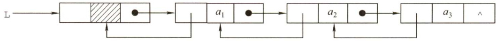  
图2.9 双链表示意图  

双链表中结点类型的描述如下：  

typedef struct DNode{ //定义双链表结点类型ElemType data; //数据域struct DNode \*prior,\*next; //前驱和后继指针  
}DNode,\*DLinklist;  

双链表在单链表的结点中增加了一个指向其前驱的prior指针，因此双链表中的按值查找和按位查找的操作与单链表的相同。但双链表在插入和删除操作的实现上，与单链表有着较大的不同。  

这是因为“链”变化时也需要对prior指针做出修改，其关键是保证在修改的过程中不断链。此外，双链表可以很方便地找到其前驱结点，因此，插入、删除操作的时间复杂度仅为 $O(1)$ 0  

#### 1.双链表的插入操作  

在双链表中p所指的结点之后插入结点 $^{\star}s$ ，其指针的变化过程如图2.10所示。  

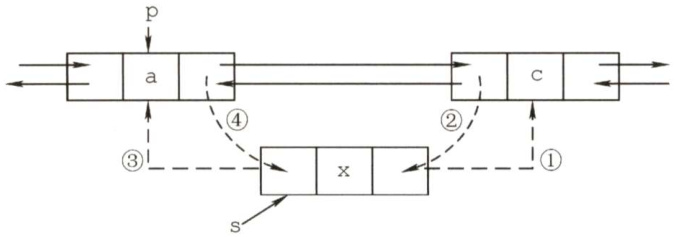  
图2.10双链表插入结点过程  

插入操作的代码片段如下：  

$\textcircled{1}$ s->next=p->next; ②p->next->prior ${\bf\sigma}={\bf s} $ .. $\textcircled{3}$ s->prior $\scriptstyle=_{\mathrm{p}}$ ④p->next $=_{s}$ .  

上述代码的语句顺序不是唯一的，但也不是任意的， $\textcircled{1}$ 和 $\textcircled{2}$ 两步必须在 $\textcircled{4}$ 步之前，否则\*p的后继结点的指针就会丢掉，导致插入失败。为了加深理解，读者可以在纸上画出示意图。若问题改成要求在结点 $\star_{\mathrm{{p}}}$ 之前插入结点 $\star_{S}$ ，请读者思考具体的操作步骤。  

#### 2.双链表的删除操作  

删除双链表中结点 $\star_{\mathrm{{p}}}$ 的后继结点 $\star_{\mathrm{q}}$ ，其指针的变化过程如图2.11所示。  

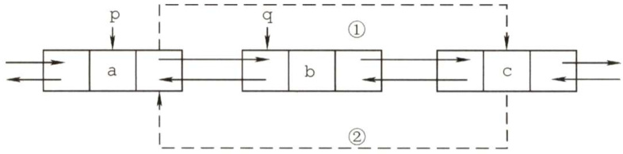  
图2.11双链表删除结点过程  

删除操作的代码片段如下：  

<html><body><table><tr><td>p->next=q->next;</td><td>//图2.11中步骤①</td></tr><tr><td>q->next->prior=p;</td><td>//图2.11中步骤②</td></tr><tr><td>free(q);</td><td>//释放结点空间</td></tr></table></body></html>  

若问题改成要求删除结点 $\star_{\mathsf{q}}$ 的前驱结点 $\star_{\mathrm{{p}}}$ ，请读者思考具体的操作步骤  

在建立双链表的操作中，也可采用如同单链表的头插法和尾插法，但在操作上需要注意指针的变化和单链表有所不同。  

#### 2.3.4 循环链表  

#### 1．循环单链表  

循环单链表和单链表的区别在于，表中最后一个结点的指针不是NULL，而改为指向头结点，从而整个链表形成一个环，如图2.12所示。  

在循环单链表中，表尾结点 $\star_{\Sigma}$ 的next域指向L，故表中没有指针域为NULL的结点，因此，循环单链表的判空条件不是头结点的指针是否为空，而是它是否等于头指针。  

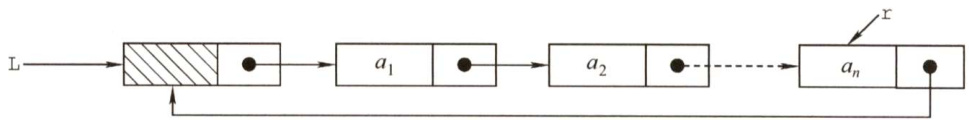  
图2.12 循环单链表  

循环单链表的插入、删除算法与单链表的几乎一样，所不同的是若操作是在表尾进行，则执行的操作不同，以让单链表继续保持循环的性质。当然，正是因为循环单链表是一个“环”，因此在任何一个位置上的插入和删除操作都是等价的，无须判断是否是表尾。  

在单链表中只能从表头结点开始往后顺序遍历整个链表，而循环单链表可以从表中的任意一个结点开始遍历整个链表。有时对单链表常做的操作是在表头和表尾进行的，此时对循环单链表不设头指针而仅设尾指针，从而使得操作效率更高。其原因是，若设的是头指针，对表尾进行操作需要 $O(n)$ 的时间复杂度，而若设的是尾指针r，r->next即为头指针，对表头与表尾进行操作都只需要 $O(1)$ 的时间复杂度。  

#### 2.循环双链表  

由循环单链表的定义不难推出循环双链表。不同的是在循环双链表中，头结点的prior 指针还要指向表尾结点，如图2.13所示。  

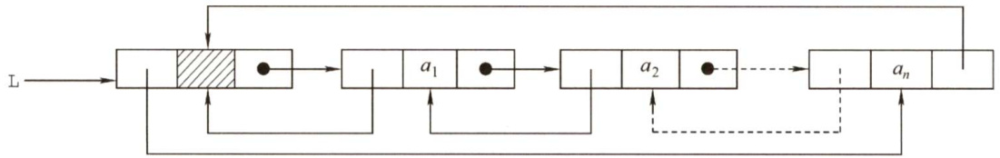  
图2.13 循环双链表  

在循环双链表L中，某结点 $\star_{\mathrm{{p}}}$ 为尾结点时， $\mathrm{p-}>$ next $\scriptstyle==\pm{\mathrm{I}}$ ；当循环双链表为空表时，其头结点的prior域和next域都等于L。  

#### 2.3.5 静态链表  

静态链表借助数组来描述线性表的链式存储结构，结点也有数据域data 和指针域 next，与前面所讲的链表中的指针不同的是，这里的指针是结点的相对地址（数组下标)，又称游标。和顺序表一样，静态链表也要预先分配一块连续的内存空间。  

静态链表和单链表的对应关系如图2.14所示。  

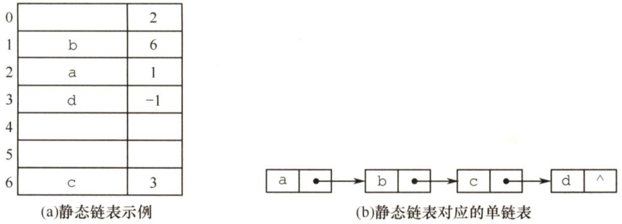  
图2.14静态链表存储示意图  

静态链表结构类型的描述如下：  

<html><body><table><tr><td>#define Maxsize 50</td><td>//静态链表的最大长度</td></tr><tr><td>typedef struct{</td><td>//静态链表结构类型的定义</td></tr><tr><td>ElemType data;</td><td>//存储数据元素</td></tr></table></body></html>  

<html><body><table><tr><td colspan="2">intnext; //下一个元素的数组下标</td></tr><tr><td colspan="2">}SLinkList[MaxSize];</td></tr></table></body></html>  

静态链表以next $\scriptstyle==-1$ 作为其结束的标志。静态链表的插入、删除操作与动态链表的相同，只需要修改指针，而不需要移动元素。总体来说，静态链表没有单链表使用起来方便，但在一些不支持指针的高级语言（如Basic）中，这是一种非常巧妙的设计方法。  

#### 2.3.6 顺序表和链表的比较  

#### 1．存取（读写）方式  

顺序表可以顺序存取，也可以随机存取，链表只能从表头顺序存取元素。例如在第 $i$ 个位置上执行存或取的操作，顺序表仅需一次访问，而链表则需从表头开始依次访问 $i$ 次。  

#### 2.逻辑结构与物理结构  

采用顺序存储时，逻辑上相邻的元素，对应的物理存储位置也相邻。而采用链式存储时，逻辑上相邻的元素，物理存储位置不一定相邻，对应的逻辑关系是通过指针链接来表示的。  

#### 3.查找、插入和删除操作  

对于按值查找，顺序表无序时，两者的时间复杂度均为 $O(n)$ ；顺序表有序时，可采用折半查找，此时的时间复杂度为 $O(\log_{2}n)$ 。  

对于按序号查找，顺序表支持随机访问，时间复杂度仅为 $O(1)$ ，而链表的平均时间复杂度为$O(n)$ 。顺序表的插入、删除操作，平均需要移动半个表长的元素。链表的插入、删除操作，只需修改相关结点的指针域即可。由于链表的每个结点都带有指针域，故而存储密度不够大。  

#### 4.空间分配  

顺序存储在静态存储分配情形下，一旦存储空间装满就不能扩充，若再加入新元素，则会出现内存溢出，因此需要预先分配足够大的存储空间。预先分配过大，可能会导致顺序表后部大量闲置；预先分配过小，又会造成溢出。动态存储分配虽然存储空间可以扩充，但需要移动大量元素，导致操作效率降低，而且若内存中没有更大块的连续存储空间，则会导致分配失败。链式存储的结点空间只在需要时申请分配，只要内存有空间就可以分配，操作灵活、高效。  

在实际中应该怎样选取存储结构呢？  

#### 1．基于存储的考虑  

难以估计线性表的长度或存储规模时，不宜采用顺序表；链表不用事先估计存储规模，但链表的存储密度较低，显然链式存储结构的存储密度是小于1的。  

#### 2．基于运算的考虑  

在顺序表中按序号访问 $a_{i}$ 的时间复杂度为 $O(1)$ ，而链表中按序号访问的时间复杂度为 $O(n)$ 因此若经常做的运算是按序号访问数据元素，则显然顺序表优于链表。  

在顺序表中进行插入、删除操作时，平均移动表中一半的元素，当数据元素的信息量较大且表较长时，这一点是不应忽视的；在链表中进行插入、删除操作时，虽然也要找插入位置，但操作主要是比较操作，从这个角度考虑显然后者优于前者。  

#### 3．基于环境的考虑  

顺序表容易实现，任何高级语言中都有数组类型；链表的操作是基于指针的，相对来讲，前者实现较为简单，这也是用户考虑的一个因素。  

总之，两种存储结构各有长短，选择哪一种由实际问题的主要因素决定。通常较稳定的线性  

选择顺序存储，而频繁进行插入、删除操作的线性表（即动态性较强）宜选择链式存储。  

注意：只有熟练掌握顺序存储和链式存储，才能深刻理解它们各自的优缺点。  

#### 2.3.7 本节试题精选  

#### 一、单项选择题  

01．关于线性表的顺序存储结构和链式存储结构的描述中，正确的是（）。  

I.线性表的顺序存储结构优于其链式存储结构  
II.链式存储结构比顺序存储结构能更方便地表示各种逻辑结构  
III若频繁使用插入和删除结点操作，则顺序存储结构更优于链式存储结构  
IV.顺序存储结构和链式存储结构都可以进行顺序存取  

A.I、、IⅢ B.ⅡI、IV C.I、IⅢI D.IⅢI、IV  

02.对于一个线性表，既要求能够进行较快速地插入和删除，又要求存储结构能反映数据之间的逻辑关系，则应该用（）。  

A．顺序存储方式B．链式存储方式C．散列存储方式D．以上均可以  

03．对于顺序存储的线性表，其算法时间复杂度为 $O(1)$ 的运算应该是（）。  

A.将 $n$ 个元素从小到大排序  
B．删除第 $i$ （ $1\leq i\leq n$ ）个元素  
C.改变第 $i$ （ $1\leq i\leq n\$ ）个元素的值  
D.在第 $i$ （ $1\leq i\leq n$ ）个元素后插入一个新元素  

04.下列关于线性表说法中，正确的是（）。  

I．顺序存储方式只能用于存储线性结构  
II.取线性表的第 $i$ 个元素的时间与 $i$ 的大小有关  
III.静态链表需要分配较大的连续空间，插入和删除不需要移动元素  
IV.在一个长度为 $n$ 的有序单链表中插入一个新结点并仍保持有序的时间复杂度为 $O(n)$  

V.若用单链表来表示队列，则应该选用带尾指针的循环链表  

A.I、Ⅱ B.I、III、IV、V C.IV、V D.、IV、V  

05．设线性表中有 $2n$ 个元素，（）在单链表上实现要比在顺序表上实现效率更高。  

A．删除所有值为 $x$ 的元素  
B．在最后一个元素的后面插入一个新元素  
C.顺序输出前 $k$ 个元素  
D．交换第 $i$ 个元素和第 $2n-i-1$ 个元素的值（ $i=0,\cdots,n-1$ ）  

06.在一个单链表中，已知q所指结点是所指结点的前驱结点，若在q和p之间插入结点S，则执行（）。  

A.s->next=p->next; $_{\mathrm{p\mathrm{-}}\mathrm{>}}$ next $=_{S}$ ；B. $_{\mathrm{{p}\rightarrow}}$ next $\c=$ s->next;s->next $\mathrm{=p}$ C.q->next $\scriptstyle=_{S}$ ; s->next $\mathsf{\Gamma}=\mathsf{p}$ · D.p->next $=_{S}$ ;s->next $\mathtt{\Gamma}=\mathtt{q}$ ：  

07.给定有 $n$ 个元素的一维数组，建立一个有序单链表的最低时间复杂度是（）。  

A. 0(1) B. O(n) C. $O(n^{2})$ D. O(nlogn)  

08．将长度为 $n$ 的单链表链接在长度为 $m$ 的单链表后面，其算法的时间复杂度采用大 $o$ 形式表示应该是（）。  

A. $O(1)$ B. $O(n)$ C. $O(m)$ D. O(n+ m)  

09．单链表中，增加一个头结点的目的是（）。  

A.使单链表至少有一个结点 B.标识表结点中首结点的位置C.方便运算的实现 D.说明单链表是线性表的链式存储  

10.在一个长度为 $n$ 的带头结点的单链表h上，设有尾指针r，则执行（）操作与链表的表长有关。  

A．删除单链表中的第一个元素B．删除单链表中的最后一个元素C．在单链表第一个元素前插入一个新元素D．在单链表最后一个元素后插入一个新元素  

11．对于一个头指针为head的带头结点的单链表，判定该表为空表的条件是（）；对于不带头结点的单链表，判定空表的条件为（）。  

A.head $\scriptstyle.==$ NULL B.head- $>$ next $\scriptstyle==$ NULL C. head->next $\scriptstyle==$ head D. head! $\c=$ NULL  

12．下面关于线性表的一些说法中，正确的是（）。  

A．对一个设有头指针和尾指针的单链表执行删除最后一个元素的操作与链表长度无关  
B．线性表中每个元素都有一个直接前驱和一个直接后继  
C．为了方便插入和删除数据，可以使用双链表存放数据  
D.取线性表第i个元素的时间与 $i$ 的大小有关  

13.在双链表中向p所指的结点之前插入一个结点q的操作为（）。  

A.p->prior $\mathbf{\bar{\rho}}=\mathbf{\rho}$ qiq->next $\mathsf{\Gamma}=\mathsf{p}$ :p->prior->next $\mathtt{\Gamma=}\mathtt{q}$ iq->prior $\O=$ p->prior; B.q->prior=p->prior;p->prior->next $\c=$ qiq->next $\mathsf{\Lambda}=\mathsf{p}$ :p->prior $\mathbf{\bar{\rho}}=\mathbf{\bar{\rho}}$ q->next; C.q->next $\scriptstyle=_{\mathrm{p}}$ ;p->next $\O=$ qiq->prior->next $\O=$ qiq->next $\boldsymbol{\mathbf{\rho}}=\mathbf{p}$ 、 D. p->prior->next $\mathtt{\Gamma=_{q}}$ :q->next $\mathsf{\Gamma}=\mathsf{p}$ ;q->prior $\mathbf{\bar{\rho}}=\mathbf{\bar{\rho}}$ p->prior;p->prior $\cdot{\sf=}{\sf q}$ ·  

14.在双向链表存储结构中，删除P所指的结点时必须修改指针（）。  

A.p->llink->rlink=p->rlink;p->rlink->llink=p->llink;   
B.p->llink=p->llink->llink;p->llink- $>$ rlink=p;   
C.p->rlink->llink $\mathsf{\Pi}_{:=\mathtt{p}}$ ;p->rlink=p->rlink->rlink;   
D.p->rlink $\cdot=$ p->llink->llink;p->llink=p->rlink->rlink;  

15．在长度为 $n$ 的有序单链表中插入一个新结点，并仍然保持有序的时间复杂度是（）。  

A.0(1) B. O(n) C. $O(n^{2})$ D. $O(n\mathrm{log}_{2}n)$  

16．与单链表相比，双链表的优点之一是（）。  

A．插入、删除操作更方便 B．可以进行随机访问C．可以省略表头指针或表尾指针 D.访问前后相邻结点更灵活  

17．带头结点的双循环链表L为空的条件是（）。  

A.L->prior $\scriptstyle\mathbf{\bar{\rho}}=$ L&&L->next $\scriptstyle==$ NULL B. L->prior $\scriptstyle\mathbf{\bar{\rho}}==$ NULL&&L->next $\scriptstyle==$ NULL C. L->prior $\scriptstyle\mathbf{\bar{\rho}}=$ NULL&&L->next $\scriptstyle==\mathtt{L}$ D. L->prior $\scriptstyle\mathbf{\bar{\rho}}==$ L&&L->next $\scriptstyle==\mathtt{I}$  

18.一个链表最常用的操作是在末尾插入结点和删除结点，则选用（）最节省时间。  

A.带头结点的双循环链表 B．单循环链表C．带尾指针的单循环链表 D．单链表  

19.设对 $n$ （ $n>1$ ）个元素的线性表的运算只有4种：删除第一个元素；删除最后一个元素；在第一个元素之前插入新元素；在最后一个元素之后插入新元素，则最好使用（）。  

A.只有尾结点指针没有头结点指针的循环单链表B.只有尾结点指针没有头结点指针的非循环双链表C．只有头结点指针没有尾结点指针的循环双链表D.既有头结点指针又有尾结点指针的循环单链表  

20．一个链表最常用的操作是在最后一个元素后插入一个元素和删除第一个元素，则选用（最节省时间。  

A．不带头结点的单循环链表  
B．双链表  
C．不带头结点且有尾指针的单循环链表  
D．单链表  

21．静态链表中指针表示的是（）。  

A．下一元素的地址 B.内存储器地址C.下一个元素在数组中的位置 D.左链或右链指向的元素的地址  

22．需要分配较大空间，插入和删除不需要移动元素的线性表，其存储结构为（）  

A．单链表 B．静态链表 C．顺序表 D.双链表  

23．某线性表用带头结点的循环单链表存储，头指针为 head，当head->next->next $\c=$ head成立时，线性表长度可能是（）。  

A.0 B.1 C.2 D.可能为0或1  

24.【2016统考真题】已知一个带有表头结点的双向循环链表L，结点结构为prevdatanext其中prev和next分别是指向其直接前驱和直接后继结点的指针。现要删除指针p所指的结点，正确的语句序列是（）。  

A.p->next->prev $\mathbf{\bar{\rho}}=\mathbf{\bar{\rho}}$ p->prev; p->prev->next $\c=$ p->prev; free(p);   
B.p->next->prev $\mathbf{\bar{\rho}}=\mathbf{\rho}$ p->next;p->prev->next $\c=$ p->next;free(p);   
C. p->next->prev $\mathbf{\bar{\rho}}=$ p->next; p->prev->next $\c=$ p->prev; free(p);   
D. p->next->prev $\mathbf{\bar{\rho}}=\mathbf{\rho}$ p->prev; p->prev->next $\c=$ p->next; free(p);  

25.【2016统考真题】已知表头元素为C的单链表在内存中的存储状态如下表所示。  

<html><body><table><tr><td>地址</td><td>元素</td><td>链接地址</td></tr><tr><td>1000H</td><td>a</td><td>1010H</td></tr><tr><td>1004H</td><td>b</td><td>100CH</td></tr><tr><td>1008H</td><td>C</td><td>1000H</td></tr><tr><td>100CH</td><td>d</td><td>NULL</td></tr><tr><td rowspan="2">1010H</td><td>e</td><td>1004H</td></tr><tr><td></td><td></td></tr></table></body></html>  

现将f存放于10l4H处并插入单链表，若f在逻辑上位于a和e之间，则a,e,f的“链接地址”依次是（）。  

A.1010H,1014H,1004H B.1010H,1004H,1014H C.1014H,1010H,1004H D.1014H,1004H,1010H  

26.【2021统考真题】已知头指针h指向一个带头结点的非空单循环链表，结点结构为datanext，其中next是指向直接后继结点的指针，p是尾指针，q是临时指针。现要删除该链表的第一个元素，正确的语句序列是（）。  

A. $\mathrm{h}\rightarrow\mathrm{next}=\mathrm{h}\rightarrow$ $\mathrm{\Deltat=h\tonext\to\mathrm{\Delta}}$ next; $\mathtt{q}=\mathtt{h}\to$ next; free(q);  
B. $\mathtt{q}=\mathtt{h}\to$ next; h $\Rightarrow$ next ${\tt=h\cdot>}$ next $\Rightarrow$ next; free(q);  
C. $\mathtt{q}=\mathtt{h}\to$ next; $\mathrm{h}\rightarrow\mathrm{next}=\mathrm{q}\rightarrow$ next; if(p $\!=\mathtt{q}$ D ${\mathfrak{p}}={\mathfrak{h}}$ free(q);  
D. $\mathtt{q}=\mathtt{h}\mathtt{\Gamma}\to$ next; $\mathrm{h}\rightarrow\mathrm{next}=\mathrm{q}\rightarrow$ next; $\scriptstyle{\mathrm{if}}({\mathfrak{p}}=={\mathfrak{q}}){\mathfrak{p}}={\mathfrak{h}}$ free(q);  
二、综合应用题  
01．设计一个递归算法，删除不带头结点的单链表L中所有值为×的结点。  
02.在带头结点的单链表L中，删除所有值为 $\mathbf{x}$ 的结点，并释放其空间，假设值为 $\mathbf{x}$ 的结点不唯一，试编写算法以实现上述操作。  
03．设L为带头结点的单链表，编写算法实现从尾到头反向输出每个结点的值。  
04.试编写在带头结点的单链表L中删除一个最小值结点的高效算法（假设最小值结点是唯一的）。  
05．试编写算法将带头结点的单链表就地逆置，所谓“就地”是指辅助空间复杂度为 $O(1)_{\circ}$   
06．有一个带头结点的单链表L，设计一个算法使其元素递增有序。  
07．设在一个带表头结点的单链表中所有元素结点的数据值无序，试编写一个函数，删除表中所有介于给定的两个值（作为函数参数给出）之间的元素的元素（若存在）。  
08.给定两个单链表，编写算法找出两个链表的公共结点。  
09.给定一个带表头结点的单链表，设head为头指针，结点结构为(data,next)，data为整型元素，next为指针，试写出算法：按递增次序输出单链表中各结点的数据元素，并释放结点所占的存储空间（要求：不允许使用数组作为辅助空间）。  
10.将一个带头结点的单链表 $A$ 分解为两个带头结点的单链表 $A$ 和 $B$ ，使得 $A$ 表中含有原表中序号为奇数的元素，而 $B$ 表中含有原表中序号为偶数的元素，且保持其相对顺序不变。  
11.设 $C=\{a_{1},b_{1},a_{2},b_{2},\cdots,a_{n},b_{n}\}$ 为线性表，采用带头结点的hc单链表存放，设计一个就地算法，将其拆分为两个线性表，使得 $A=\{a_{1},a_{2},\cdots,a_{n}\}$ ， $B=\{b_{n},\cdots,b_{2},b_{1}\}$   
12．在一个递增有序的线性表中，有数值相同的元素存在。若存储方式为单链表，设计算法去掉数值相同的元素，使表中不再有重复的元素，例如(7,10,10,21,30,42,42,42,51,70)将变为(7,10,21,30,42,51,70)。  
13.假设有两个按元素值递增次序排列的线性表，均以单链表形式存储。请编写算法将这两个单链表归并为一个按元素值递减次序排列的单链表，并要求利用原来两个单链表的结点存放归并后的单链表。  
14.设 $A$ 和 $B$ 是两个单链表（带头结点），其中元素递增有序。设计一个算法从 $A$ 和 $B$ 中的公共元素产生单链表 $C$ ，要求不破坏 $A$ ， $B$ 的结点。  
15.已知两个链表 $A$ 和 $B$ 分别表示两个集合，其元素递增排列。编制函数，求 $A$ 与 $B$ 的交集，并存放于 $A$ 链表中。  
16．两个整数序列 $A=a_{1}$ $a_{2}$ ,a,... $a_{m}$ 和 $B=b_{1},b_{2},b_{3},\cdots,b_{n}$ 已经存入两个单链表中，设计一个算法，判断序列 $B$ 是否是序列 $A$ 的连续子序列。  
17．设计一个算法用于判断带头结点的循环双链表是否对称。  
18.有两个循环单链表，链表头指针分别为hl和h2，编写一个函数将链表h2链接到链表hl之后，要求链接后的链表仍保持循环链表形式。  

19.设有一个带头结点的循环单链表，其结点值均为正整数。设计一个算法，反复找出单链表中结点值最小的结点并输出，然后将该结点从中删除，直到单链表空为止，再删除表头结点。  

20.设头指针为L的带有表头结点的非循环双向链表，其每个结点中除有pred（前驱指针）data（数据）和next（后继指针）域外，还有一个访问频度域freq。在链表被启用前，其值均初始化为零。每当在链表中进行一次Locate(L,x)运算时，令元素值为x的结点中freq域的值增1，并使此链表中结点保持按访问频度非增（递减）的顺序排列，同时最近访问的结点排在频度相同的结点前面，以便使频繁访问的结点总是靠近表头。试编写符合上述要求的LoCate(L,x)运算的算法，该运算为函数过程，返回找到结点的地址，类型为指针型。  

21.单链表有环，是指单链表的最后一个结点的指针指向了链表中的某个结点（通常单链表的最后一个结点的指针域是空的)。试编写算法判断单链表是否存在环。  

1）给出算法的基本设计思想。  
2）根据设计思想，采用C或 $\mathrm{C}{+}{+}$ 语言描述算法，关键之处给出注释。  
3）说明你所设计算法的时间复杂度和空间复杂度。  

22.【2009统考真题】已知一个带有表头结点的单链表，结点结构为假设该链表只给出了头指针list。在不改变链表的前提下，请设计一个尽可能高效的算法，查找链表中倒数第 $k$ 个位置上的结点（ $k$ 为正整数)。若查找成功，算法输出该结点的data域的值，并返回1；否则，只返回0。要求：  

<html><body><table><tr><td>data</td><td>link</td></tr></table></body></html>  

1）描述算法的基本设计思想。  
2）描述算法的详细实现步骤。  
3）根据设计思想和实现步骤，采用程序设计语言描述算法（使用C、 $C{+}{+}.$ 或Java语言实现)，关键之处请给出简要注释。  

23.【2012统考真题】假定采用带头结点的单链表保存单词，当两个单词有相同的后缀时，可共享相同的后缀存储空间，例如，“loading”和“being”的存储映像如下图所示。  

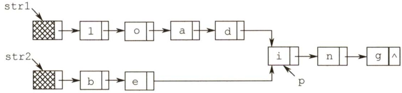  

设strl和str2分别指向两个单词所在单链表的头结点，链表结点结构为datanext，请设计一个时间上尽可能高效的算法，找出由strl和str2所指向两个链表共同后缀的起始位置（如图中字符i所在结点的位置p）。要求：  

1）给出算法的基本设计思想。  
2）根据设计思想，采用C或 $\mathrm{C}{+}{+}$ 或Java语言描述算法，关键之处给出注释。  
3）说明你所设计算法的时间复杂度。  

24.【2015统考真题】用单链表保存 $m$ 个整数，结点的结构为[data][link]，且|data|≤$n$ （ $n$ 为正整数）。现要求设计一个时间复杂度尽可能高效的算法，对于链表中data 的绝对值相等的结点，仅保留第一次出现的结点而删除其余绝对值相等的结点。例如，若给定的单链表head如下：  

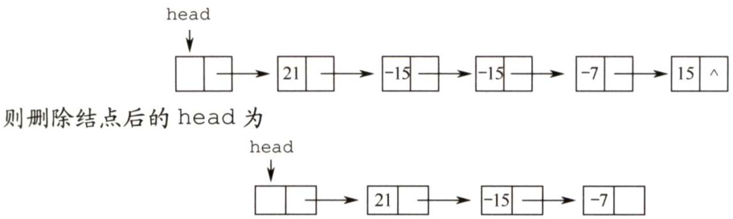  

要求：  

1）给出算法的基本设计思想。  
2）使用C或 $\mathbf{C}{+}{+}$ 语言，给出单链表结点的数据类型定义。  
3）根据设计思想，采用C或 $\scriptstyle\mathbf{C}++$ 语言描述算法，关键之处给出注释。  
4）说明你所设计算法的时间复杂度和空间复杂度。  

25.【2019统考真题】设线性表 $L=(a_{1},a_{2},a_{3},\cdots,a_{n-2},a_{n-1},a_{n})$ 采用带头结点的单链表保存，链表中的结点定义如下：  

typedef struct node   
， int data; structnode\*next;   
NODE;  

请设计一个空间复杂度为 $O(1)$ 且时间上尽可能高效的算法，重新排列 $L$ 中的各结点，得到线性表 $L^{\prime}=(a_{1},a_{n},a_{2},a_{n-1},a_{3},a_{n-2},\cdots)$ 。要求：  

1）给出算法的基本设计思想。  
2）根据设计思想，采用C或 $\mathbf{C}{+}{+}$ 语言描述算法，关键之处给出注释。  
3）说明你所设计的算法的时间复杂度。  

#### 2.3.8 答案与解析  

#### 一、单项选择题  

01.B  

两种存储结构有不同的适用场合，不能简单地说谁好谁坏，I错误。链式存储用指针表示逻辑结构，而指针的设置是任意的，故可以很方便地表示各种逻辑结构；顺序存储只能用物理上的邻接关系来表示逻辑结构，ⅡI正确。在顺序存储中，插入和删除结点需要移动大量元素，效率较低，II的描述刚好相反。顺序存储结构既能随机存取又能顺序存取，而链式结构只能进行顺序存取，IV正确。  

02.B  

首先直接排除A和D。散列存储通过散列函数映射到物理空间，不能反映数据之间的逻辑关系，排除C。链式存储能方便地表示各种逻辑关系，且插入和删除操作的时间复杂度为 $O(1)$ 。  

03.C  

对 $n$ 个元素进行排序的时间复杂度最小也要 $O(n)$ (初始有序时)，通常为 $O(n\mathrm{log}_{2}n)$ 或 $O(n^{2})$ 通过第7章学习后会更理解。B和D显然错误。顺序表支持按序号的随机存取（读写）方式。  

04.D  

顺序存储方式同样适合图和树，I错误。线性表采用顺序存储时Ⅱ错误。II是静态链表的特  

点。有序单链表只能依次查找插入位置，时间复杂度为 $O(n)$ ，IV正确。队列需要在表头删除元素，表尾插入元素，采用带尾指针的循环链表较为方便，插入和删除的时间复杂度都为 $O(1)$ ，V正确。  

05.A  

对于A，在单链表和顺序表上实现的时间复杂度都为 $O(n)$ ，但后者要移动很多元素，因此在单链表上实现效率更高。对于B和D，顺序表的效率更高。C无区别。  

06.C  

s 插入后，q成为s的前驱，而p成为s的后继，选项C符合。  

07.D  

若先建立链表，然后依次插入建立有序表，则每插入一个元素就需遍历链表寻找插入位置，即直接插入排序，时间复杂度为 $O(n^{2})$ 。若先将数组排好序，然后建立链表，建立链表的时间复杂度为 $O(n)$ ，数组排序的最好时间复杂度为 $O(n\mathrm{log}_{2}n)$ ，总时间复杂度为 $O(n\mathrm{log}_{2}n)$ 。故选 $\mathrm{~D~}$ 0  

08.C  

先遍历长度为 $m$ 的单链表，找到该单链表的尾结点，然后将其next域指向另一个单链表的首结点，其时间复杂度为 $O(m)$ 。  

09.C  

单链表设置头结点的目的是方便运算的实现，主要好处体现在：第一，有头结点后，插入和删除数据元素的算法就统一了，不再需要判断是否在第一个元素之前插入或删除第一个元素；第二，不论链表是否为空，其头指针是指向头结点的非空指针，链表的头指针不变，因此空表和非空表的处理也就统一了。  

10.B  

删除单链表的最后一个结点需置其前驱结点的指针域为NULL，需要从头开始依次遍历找到该前驱结点，需要 $O(n)$ 的时间，与表长有关。其他操作均与表长无关，读者可自行模拟。  

11.B，A  

在带头结点的单链表中，头指针head指向头结点，头结点的next域指向第一个元素结点，head->next $\scriptstyle==$ NULL表示该单链表为空。在不带头结点的单链表中，head直接指向第一个元素结点，head $\scriptstyle==$ NULL表示该单链表为空。  

12.C  

双链表能很方便地访问前驱和后继，故删除和插入数据较为方便。A显然错误。B表中第一个元素和最后一个元素不满足题设要求。D未考虑顺序存储的情况。  

13.D  

为了在p之前插入结点q，可以将p的前一个结点的next域指向q，将q的next域指向p，将q的prior域指向p的前一个结点，将p的prior域指向q。仅D满足条件。  

14.A  

与上一题的分析基本类似，只不过这里是删除一个结点，注意将p的前、后两结点链接起来。关键是要保证在结点指针的修改过程中不断链！  

注意，请读者仔细对比上述两题，弄清双链表的插入和删除方法。  

15.B  

设单链表递增有序，首先要在单链表中找到第一个大于 $\mathbf{x}$ 的结点的直接前驱 $\mathtt{p}$ ，在p之后插入该结点。查找的时间复杂度为 $O(n)$ ，插入的时间复杂度为 $O(1)$ ，总时间复杂度为 $O(n)$ 0  

16.D  

在插入和删除操作上，单链表和双链表都不用移动元素，都很方便，但双链表修改指针的操作更为复杂，A错误。双链表中可以快速访问任何一个结点的前驱和后继结点，D正确。  

17.D  

循环双链表L判空的条件是头结点（头指针）的prior和next域都指向它自身。  

18.A  

在链表的末尾插入和删除一个结点时，需要修改其相邻结点的指针域。而寻找尾结点及尾结点的前驱结点时，只有带头结点的双循环链表所需要的时间最少。  

19.C  

对于A，删除尾结点 $\star_{\mathrm{p}}$ 时，需要找到 $\star_{\mathrm{{P}}}$ 的前一个结点，时间复杂度为 $O(n)$ 。对于B，删除首结点 $\star_{\mathrm{{p}}}$ 时，需要找到 $\star_{\mathrm{{p}}}$ 结点，这里没有直接给出头结点指针，而通过尾结点的prior指针找到 $\star_{\mathrm{{p}}}$ 结点的时间复杂度为 $O(n)$ 。对于D，删除尾结点 $\star_{\mathrm{{p}}}$ 时，需要找到 $\star_{\mathrm{{p}}}$ 的前一个结点，时间复杂度为 $O(n)$ 。对于C，执行这4种算法的时间复杂度均为 $O(1)$ 。  

20.C  

对于A，在最后一个元素之后插入元素的情况与普通单链表相同，时间复杂度为O(n);而删除表中第一个元素时，为保持单循环链表的性质（尾结点的指针指向第一个结点)，需要先遍历整个链表找到尾结点，再做删除操作，时间复杂度为 $O(n)$ 。对于B，双链表的情况与单链表的相同，一个是 $O(n)$ ，一个是 $O(1)$ 。对于C，与A的分析对比，有尾结点的指针，省去了遍历链表的过程，因此时间复杂度均为 $O(1)$ 。对于D，要在最后一个元素之后插入一个元素，需要遍历整个链表才能找到插入位置，时间复杂度为 $O(n)$ ；删除第一个元素的时间复杂度为 $O(1)$ o  

21.C  

静态链表中的指针又称游标，指示下一个元素在数组中的下标。  

22.B  

静态链表用数组表示，因此需要预先分配较大的连续空间，静态链表同时还具有一般链表的特点，即插入和删除不需要移动元素。  

23.D  

对一个空循环单链表，有head->next $\scriptstyle==$ head，推理head->next->next $\scriptstyle==$ head->next $\scriptstyle==$ head。对含有1个元素的循环单链表，头结点（头指针head指示）的next域指向该唯一元素结点，该元素结点的next域指向头结点，因此也有head->next->next $\c=$ head。故选D。  

24.D  

解析请扫右侧二维码查阅。  

25.D  

根据存储状态，单链表的结构如下图所示。  

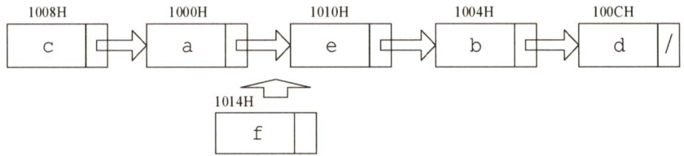  

其中“链接地址”是指结点next所指的内存地址。当结点插入后，a指向f，f指向e，e指向b。显然a、e 和 的“链接地址"分别是、b和e的内存地址，即1014H、1004H和1010H。  

26.D  

如图1所示，要删除带头结点的非空单循环链表中的第一个元素，就要先用临时指针q指向待删结点， $\mathtt{q}=\mathtt{h}\to$ next；然后将q从链表中断开， $\mathrm{h}\rightarrow\mathrm{next}=\mathrm{q}\rightarrow$ next（这一步也可写成 $\mathrm{h}\rightarrow\mathrm{next}=$ $\mathrm{h}\rightarrow\mathrm{next}\rightarrow\mathrm{next}$ ；此时要考虑一种特殊情况，若待删结点是链表的尾结点，即循环单链表中只有一个元素(p和q指向同一个结点)，如图2所示，则在删除后要将尾指针指向头结点，即 $\mathrm{if}(\mathfrak{p}{=}\mathfrak{q})$ $\scriptstyle\mathtt{p}=\mathtt{h}$ ；最后释放q结点即可，答案选D。  

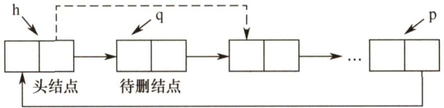  
图1  

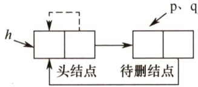  
图2  

#### 二、综合应用题  

01.【解答】  

设 $\pounds\left(\mathbb{L},\mathbf{x}\right)$ 的功能是删除以L为首结点指针的单链表中所有值等于 $\mathbf{x}$ 的结点，显然有f（ $\ I\mathrm{-}>$ next，x)的功能是删除以 $_\mathrm{I}->$ next为首结点指针的单链表中所有值等于 $\mathbf{x}$ 的结点。由此，可以推出递归模型如下。  

终止条件： $\pounds\left(\mathbb{L},\times\right)\equiv$ 不做任何事情； 若为空表递归主体： $\pounds\left(\mathbb{L},\times\right)\equiv$ 删除 $\star_{\mathrm{{L}}}$ 结点;f(L->next,x); 若L->data $\scriptstyle==\mathbf{x}$ $\mathtt{f}\left(\mathtt{L},\mathtt{x}\right)\equiv\mathtt{f}\left(\mathtt{L}\mathrm{-}>\mathtt{n e x t},\mathtt{x}\right).$ 其他情况  

本题代码如下：  

void DelX3（Linklist &L,ElemTypex）{//递归实现在单链表 $I$ 中删除值为 $x$ 的结点  

<html><body><table><tr><td>LNode *p; if（L==NULL) return; if（L->data==x）{ p=L; L=L->next; free(p); Del_X_3（L,x);</td><td>//p指向待删除结点 //递归出口 //若L所指结点的值为x //删除*L，并让L指向下一结点</td></tr></table></body></html>  

算法需要借助一个递归工作栈，深度为 $O(n)$ ，时间复杂度为 $O(n)$ 。有读者认为直接去掉 p结点会造成断链，实际上因为L为引用，是直接对原链表进行操作的，因此不会断链。  

02.【解答】  

解法一：用p从头至尾扫描单链表，pre 指向 $\star_{\mathrm{p}}$ 结点的前驱。若p所指结点的值为 $\mathbf{\boldsymbol{x}}$ ，则删除，并让p移向下一个结点，否则让pre、p指针同步后移一个结点。  

本题代码如下：  

void Del_X_1（Linklist &L,ElemType x){  
//L为带头结点的单链表，本算法删除L中所有值为 $x$ 的结点LNode $\star_{\mathrm{p=L}}$ ->next,\*pre $\scriptstyle=\mathtt{I}$ $\star_{\mathsf{q}}$ ；//置p和pre的初始值while $p!=$ NULL){if $_{\mathrm{{p}\rightarrow}}$ data $\scriptstyle==\displaystyle\mathbf{x}$ ）{$\mathtt{q}=\mathtt{p}$ ： //q指向该结点p=p->next;pre->next=p; //删除\*q结点free(q); //释放 $\star_{\mathsf{q}}$ 结点的空间else{ //否则，pre和p同步后移pre $\tt{\tt=p}$ ：$p=p$ ->next;///else}//while  

本算法是在无序单链表中删除满足某种条件的所有结点，这里的条件是结点的值为x。实际上，这个条件是可以任意指定的，只要修改if 条件即可。比如，我们要求删除值介于mink 和maxk之间的所有结点，则只需将if语句修改为if( $_{\mathtt{p}\to}$ data>mink &&p->data<maxk)。  

解法二：采用尾插法建立单链表。用p指针扫描L的所有结点，当其值不为 $\mathbf{x}$ 时，将其链接到L之后，否则将其释放。  

本题代码如下：  

void Del_X_2（Linklist &L,ElemTypex）{  
//L为带头结点的单链表，本算法删除L中所有值为 $x$ 的结点LNode $\star_{\mathrm{p=I}}$ ->next, $\star\underline{{\mathbf{\delta}}}_{}=\underline{{\mathbf{\delta}}}$ $\star_{\mathsf{q}}$ ；//r指向尾结点，其初值为头结点while(p! $\circleddash$ NULL)if $p\rightarrow$ data! $=-\frac{1}{2}$ $11\star_{\mathrm{p}}$ 结点值不为 $x$ 时将其链接到L尾部r->next $=_{\mathsf{P}}$ ：$\tt{r}=\tt{p}$ .p=p->next; //继续扫描)else{ $11\star_{\mathbb{P}}$ 结点值为 $x$ 时将其释放$\mathtt{q}=\mathtt{p}$ ：$\scriptstyle\mathtt{p}=\mathtt{p}$ ->next; //继续扫描free(q); //释放空间}  
}//while  
r->next $\c=$ NULL; //插入结束后置尾结点指针为NULL  

上述两个算法扫描一遍链表，时间复杂度为 $O(n)$ ，空间复杂度为 $O(1)$ o  

03.【解答】  

考虑到从头到尾输出比较简单。求解本题时，我们会很自然地想到借助上题中的链表逆置法，改变链表的方向，然后就可从头到尾实现反向输出。  

此外，本题还可借助一个栈来实现，每经过一个结点时，将该结点放入栈中。遍历完整个链  

表后，再从栈顶开始输出结点值即可。这种实现方法请读者在学习完第3章后自行思考（实现时可直接使用栈的基本操作函数)。  

既然能用栈的思想解决，我们也就很自然地联想到了用递归来实现。每当访问一个结点时，先递归输出它后面的结点，再输出该结点自身，这样链表就反向输出了，如右图所示。  

本题代码如下：  

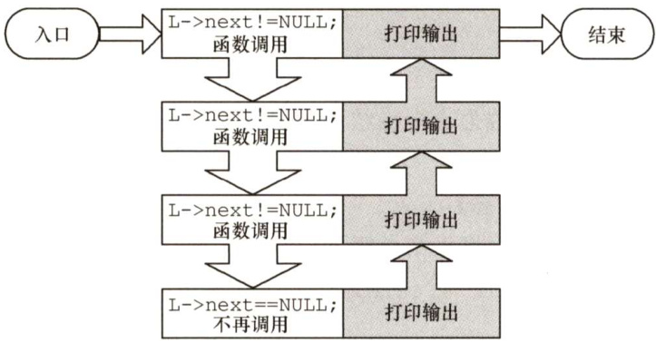  

void R Print（LinkListL){ //从尾到头输出单链表L中每个结点的值 if(L->next! $\L=$ NULL){ R_Print(L->next); //递归 }//if if（L $\c=$ NULL)print( $I->$ data); //输出函数 1 void R_Ignore_Head(LinkList L){ if(L->next！ $\c=$ NULL)R_Print(L->next);  

04.【解答】  

算法思想：用 $\mathrm{~\tt~{~p~}~}$ 从头至尾扫描单链表，pre 指向 $\star_{\mathrm{{p}}}$ 结点的前驱，用minp 保存值最小的结点指针（初值为 $\mathsf{p}$ )，minpre 指向\*minp 结点的前驱（初值为pre)。一边扫描，一边比较，若$_{\mathrm{{p}\mathrm{{-}}}}\mathrm{{>}}$ data 小于minp->data，则将p、pre 分别赋值给minp、minpre，如下图所示。当p扫描完毕时，minp 指向最小值结点，minpre指向最小值结点的前驱结点，再将minp 所指结点删除即可。  

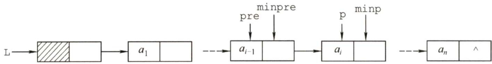  

本题代码如下：  

LinkList Delete_Min（LinkList &L){  
//L是带头结点的单链表，本算法删除其最小值结点LNode \*pre $=I$ $\star_{\mathrm{{p}}}=$ pre->next；//p为工作指针，pre指向其前驱LNode \*minpre $\L=$ pre,\*minp $\scriptstyle=\mathtt{p}$ ；//保存最小值结点及其前驱while(p! $\c=$ NULL){if(p->data<minp->data){minp $\scriptstyle=\mathbf{p}$ ： //找到比之前找到的最小值结点更小的结点minpre $\c=$ pre;)pre $=_{\mathrm{p}}$ ， //继续扫描下一个结点$\scriptstyle\mathtt{p}=\mathtt{p}$ ->next;1minpre->next $\c=$ minp->next; //删除最小值结点free(minp);return L;  

算法需要从头至尾扫描链表，时间复杂度为 $O(n)$ ，空间复杂度为 $O(1)$ 0若本题改为不带头结点的单链表，则实现上会有所不同，请读者自行思考。  

05.【解答】  

解法一：将头结点摘下，然后从第一结点开始，依次插入到头结点的后面（头插法建立单链表)，直到最后一个结点为止，这样就实现了链表的逆置，如下图所示。  

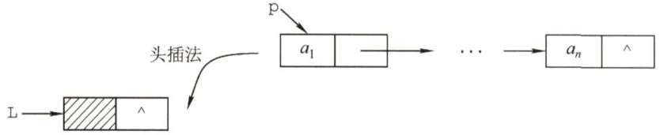  

本题代码如下：  

LinkList Reverse 1（LinkList L){ //L是带头结点的单链表，本算法将L就地逆置  

LNode $^{\star}\mathrm{p}$ ,\*r; //p为工作指针，r为p的后继，以防断链  
$\scriptstyle\mathrm{p=I}$ ->next; //从第一个元素结点开始  
L->next $\c=$ NULL; //先将头结点L的next域置为NULL  
while(p! $\L=$ NULL) //依次将元素结点摘下r=p->next; //暂存p的后继p->next $\c=$ L->next; //将p结点插入到头结点之后L->next $\tt{\Gamma}=\tt{p}$ ：$\scriptstyle\mathbf{p}=\mathbf{r}$ ：  
7  
return L;  

解法二：大部分辅导书都只介绍解法一，这对读者的理解和思维是不利的。为了将调整指针这个复杂的过程分析清楚，我们借助图形来进行直观的分析。  

假设pre、p和 $\mathrm{~\boldmath~{~\underline{~}{~r~}~}~}$ 指向3个相邻的结点，如下图所示。假设经过若干操作后，\*pre之前的结点的指针都已调整完毕，它们的next 都指向其原前驱结点。现在令 $\star_{\mathrm{p}}$ 结点的 next 域指向\*pre 结点，注意到一旦调整指针的指向， $\star_{\mathrm{p}}$ 的后继结点的链就会断开，为此需要用 $\mathrm{~\boldmath~{~\underline{~}{~r~}~}~}$ 来指向原$\star_{\mathrm{{p}}}$ 的后继结点。处理时需要注意两点：一是在处理第一个结点时，应将其next域置为NULL，而不是指向头结点（因为它将作为新表的尾结点)；二是在处理完最后一个结点后，需要将头结点的指针指向它。  

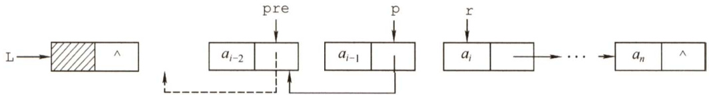  

本题代码如下：  

LinkList Reverse 2（LinkList L)  
//依次遍历线性表L，并将结点指针反转LNode \*pre, $\star_{\mathrm{p}=\mathrm{I}}$ ->next, $\cdot\cdot-\cdot$ ->next;p->next $\c=$ NULL; //处理第一个结点while $\underline{{\boldsymbol{\Upsilon}}}:=$ NULL){ //r为空，则说明p为最后一个结点pre $\tt{\tau}=\tt{p}$ ： //依次继续遍历$\mathtt{p}=\mathtt{r}$ .$\scriptstyle{\boldsymbol{\mathbf{\mathit{r}}}}={\boldsymbol{\mathbf{\mathit{r}}}}$ ->next;p->next=pre; //指针反转)L->next=p; //处理最后一个结点return L;  
}  

上述两个算法的时间复杂度为 $O(n)$ ，空间复杂度为 $O(1)$ o  

06.【解答】  

算法思想：采用直接插入排序算法的思想，先构成只含一个数据结点的有序单链表，然后依次扫描单链表中剩下的结点 $^{\star}\mathrm{p}$ （直至 $_{\mathrm{p=-NULL}}$ 为止)，在有序表中通过比较查找插入 $\star_{\mathrm{{p}}}$ 的前驱结点\*pre，然后将 $\star_{\mathrm{p}}$ 插入到\*pre之后，如下图所示。  

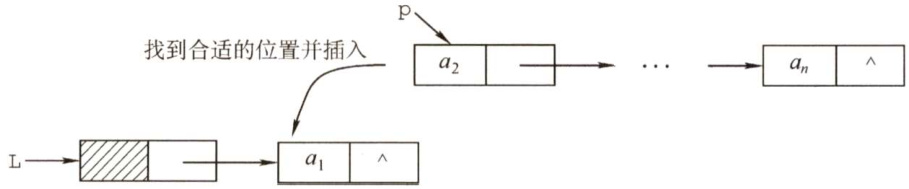  

本题代码如下：  

void Sort（LinkList &L）  
//本算法实现将单链表 $I$ 的结点重排，使其递增有序LNode $\star_{\mathrm{p=L}}$ ->next,\*pre;LNode $\cdot\tt{r}=\tt{p}$ ->next; //r保持 $\star_{\mathrm{{P}}}$ 后继结点指针，以保证不断链$^{p\rightarrow}$ next $\c=$ NULL; //构造只含一个数据结点的有序表$\scriptstyle{\mathsf{p}}={\mathsf{r}}$ .while(p $!=$ NULL){$\mathbf{r}=$ p->next; //保存 $\star_{\mathrm{{p}}}$ 的后继结点指针$\mathtt{p r e=I}$ .while(pre->next) $\c=$ NULL&&pre->next->data<p->data)  

<html><body><table><tr><td rowspan="6"></td><td>pre=pre->next;</td><td>//在有序表中查找插入*p的前驱结点*pre</td></tr><tr><td>p->next=pre->next; pre->next=p;</td><td>//将*p插入到*pre之后</td></tr><tr><td>p=r;</td><td>//扫描原单链表中剩下的结点</td></tr></table></body></html>  

细心的读者会发现该算法的时间复杂度为 $O(n^{2})$ ，为达到最佳的时间性能，可先将链表的数据复制到数组中，再采用时间复杂度为 $O(n\mathrm{log}_{2}n)$ 的排序算法进行排序，然后将数组元素依次插入到链表中，此时的时间复杂度为 $O(n\mathrm{log}_{2}n)$ ，显然这是以空间换时间的策略。  

07.【解答】  

因为链表是无序的，所以只能逐个结点进行检查，执行删除。  

本题代码如下：  

void RangeDelete（LinkList &L,int min,int max）{LNode $\star_{\mathrm{pr}=\mathrm{I}}$ $\star_{\mathrm{p=L}}$ ->link; //p是检测指针，pr是其前驱while $\mathbf{p}!=$ NULL)if $_{\mathrm{{p}}\rightarrow}$ data>min&&p->data<max）{//寻找到被删结点，删除pr->link=p->link;free(p);p=pr- $>$ link;elsef //否则继续寻找被删结点$\mathsf{p}\mathtt{r}=\mathtt{p}$ 、p=p->link;  

08.【解答】  

两个单链表有公共结点，即两个链表从某一结点开始，它们的next 都指向同一个结点。由于每个单链表结点只有一个next域，因此从第一个公共结点开始，之后它们所有的结点都是重合的，不可能再出现分叉。所以两个有公共结点而部分重合的单链表，拓扑形状看起来像Y，而不可能像X。  

本题极容易联想到“蛮”方法：在第一个链表上顺序遍历每个结点，每遍历一个结点，在第二个链表上顺序遍历所有结点，若找到两个相同的结点，则找到了它们的公共结点。显然，该算法的时间复杂度为 $O(\mathrm{len}1\times\mathrm{len}2)$ 。  

接下来我们试着去寻找一个线性时间复杂度的算法。先把问题简化：如何判断两个单向链表有没有公共结点？应注意到这样一个事实：若两个链表有一个公共结点，则该公共结点之后的所有结点都是重合的，即它们的最后一个结点必然是重合的。因此，我们判断两个链表是不是有重合的部分时，只需要分别遍历两个链表到最后一个结点。若两个尾结点是一样的，则说明它们有公共结点，否则两个链表没有公共结点。  

然而，在上面的思路中，顺序遍历两个链表到尾结点时，并不能保证在两个链表上同时到达尾结点。这是因为两个链表长度不一定一样。但假设一个链表比另一个长 $k$ 个结点，我们先在长的链表上遍历 $k$ 个结点，之后再同步遍历，此时我们就能保证同时到达最后一个结点。由于两个链表从第一个公共结点开始到链表的尾结点，这一部分是重合的，因此它们肯定也是同时到达第一公共结点的。于是在遍历中，第一个相同的结点就是第一个公共的结点。  

根据这一思路中，我们先要分别遍历两个链表得到它们的长度，并求出两个长度之差。在长的链表上先遍历长度之差个结点之后，再同步遍历两个链表，直到找到相同的结点，或者一直到链表结束。此时，该方法的时间复杂度为 $O(\mathrm{len}1+\mathrm{len}2)$ 。  

本题代码如下：  

LinkList Search_lst_Common(LinkList Ll,LinkList L2){  
//本算法实现在线性的时间内找到两个单链表的第一个公共结点intlenl $\c=$ Length（Ll),len2 $\c=$ Length（L2); //计算两个链表的表长LinkList longList,shortList; //分别指向表长较长和较短的链表if（lenl>len2){ //L1表长较长longList $\c=$ Ll->next;shortList $\c=$ L2->next;dist $=$ lenl-len2; //表长之差}else{ //L2表长较长longList $\O=$ L2->next;shortList $\c=$ Ll->next;dist=len2-lenl; //表长之差1while(dist--) //表长的链表先遍历到第dist个结点，然后同步longList $\O=$ longList->next;while(longList! $\L=$ NULL){ //同步寻找共同结点if(longList $\scriptstyle==$ shortList) //找到第一个公共结点return longList;else{ //继续同步寻找longList $\c=$ longList->next;shortList $\c=$ shortList->next;1}//whilereturn NULL;  

09.【解答】  

算法思想：对链表进行遍历，在每次遍历中找出整个链表的最小值元素，输出并释放结点所占空间；再查找次小值元素，输出并释放空间，如此下去，直至链表为空，最后释放头结点所占存储空间。该算法的时间复杂度为 $O(n^{2})$ o  

本题代码如下：  

void Min Delete（LinkList &head）{  
//head是带头结点的单链表的头指针，本算法按递增顺序输出单链表中的数据元素while(head->next） $\L=$ NULL){ //循环到仅剩头结点LNode \*pre $\c=$ head; //pre为元素最小值结点的前驱结点的指针LNode $\star_{\mathrm{{p}}}=$ pre->next; //p为工作指针while(p->next! $\c=$ NULL){if(p->next->data<pre->next->data)pre $=_{\mathsf{P}}$ //记住当前最小值结点的前驱p=p->next;)print(pre->next->data); //输出元素最小值结点的数据u=pre->next; //删除元素值最小的结点，释放结点空间pre->next $\c=$ u->next;  

  

若题设不限制数组辅助空间的使用，则可先将链表的数据复制在数组中，再采用时间复杂度为 $O(n\mathrm{log}_{2}n)$ 的排序算法进行排序，然后将数组元素输出，时间复杂度为 $O(n\mathrm{log}_{2}n)$ 。  

10.【解答】  

算法思想：设置一个访问序号变量（初值为0)，每访问一个结点序号自动加1，然后根据序号的奇偶性将结点插入到A表或B表中。重复以上操作直到表尾。  

本题代码如下：  

LinkList DisCreat_1（LinkList &A){  
//将表A中结点按序号的奇偶性分解到表A或表B中int $\scriptstyle{\dot{1}}=0$ . //i记录表A中结点的序号LinkList $\mathtt{B}=$ (LinkList)malloc(sizeof(LNode)); //创建B表表头B->next $\circleddash$ NULL; //B表的初始化LNode $\star\tt{r a}=\tt{A}$ $\star\tt{r b}=\tt{B}$ $\star_{\mathrm{{p}}}$ . //ra和rb将分别指向将创建的A表和B表的尾结点$e=A->$ next; //p为链表工作指针，指向待分解的结点A->next $\c=$ NULL; //置空新的A表while(p! $\c=$ NULL)$i++$ ， //序号加1if $\div\frac{0}{0}2==0$ ）{ //处理序号为偶数的链表结点rb->next=p; //在B表尾插入新结点$X0=0$ . //rb指向新的尾结点else{ //处理原序号为奇数的结点ra->next=p; //在A表尾插入新结点$\mathtt{r a}=\mathtt{p}$ ，p=p->next; //将p恢复为指向新的待处理结点//while结束ra->next $\c=$ NULL;rb->next $\c=$ NULL;return B;  

为了保持原来结点中的顺序，本题采用尾插法建立单链表。此外，本算法完全可以不用设置序号变量。while 循环中的代码改为将结点插入到表A 中并将下一结点插入到表B中，这样while中第一处理的结点就是奇数号结点，第二处理的结点就是偶数号结点。  

11.【解答】  

算法思想：采用上题的思路，不设序号变量。二者的差别仅在于对B表的建立不采用尾插法，而是采用头插法。  

本题代码如下：  

LinkList DisCreat 2（LinkList &A）{LinkList $\mathtt{B}=$ （LinkList）malloc（sizeof（LNode））;//创建B表表头B->next $\c=$ NULL; //B表的初始化  

LNode $t_{p}=A->$ next,\*q; //p为工作指针  
LNode $\star\tt{r a}{=}\tt{A}$ //ra始终指向A的尾结点  
while(p! $=$ NULL){ra->next $\tt=p$ ， $\mathtt{r a}=\mathtt{p}$ ： //将 $\star_{\mathrm{{p}}}$ 链到A的表尾p=p->next;if(p $\L=$ null){q=p->next; //头插后， $\star_{\mathrm{p}}$ 将断链，因此用q记忆 $\star_{\mathrm{{p}}}$ 的后继p->next $\c=$ B->next; //将 $\star_{\mathrm{{p}}}$ 插入到B的前端B->next $=_{\mathrm{p}}$ ：$\scriptstyle{\mathtt{p}}={\mathfrak{q}}$ 人  
子  
ra->next $\c=$ NULL; //A尾结点的next域置空  
return B;  

该算法特别需要注意的是，采用头插法插入结点后， $\star_{\mathrm{{p}}}$ 的指针域已改变，若不设变量保存其后继结点，则会引起断链，从而导致算法出错。  

12.【解答】  

算法思想：由于是有序表，所有相同值域的结点都是相邻的。用p扫描递增单链表，若\*p结点的值域等于其后继结点的值域，则删除后者，否则p移向下一个结点。  

本题代码如下：  

void Del_Same（LinkList &L）{  
//L是递增有序的单链表，本算法删除表中数值相同的元素LNode $\star_{\mathrm{p=I}}$ ->next, $\star_{\mathrm{q}}$ //p为扫描工作指针if $\scriptstyle\mathrm{p==}$ NULL)return;while(p->next! $\c=$ NULL)q=p->next; //g指向 $\star_{\mathrm{{p}}}$ 的后继结点if(p->data $==g->$ data){ //找到重复值的结点p->next $\c=$ q->next; //释放\*q结点free(q); //释放相同元素值的结点}elsep=p->next;  

本算法的时间复杂度为 $O(n)$ ，空间复杂度为 $O(1)$ 。  

本题也可采用尾插法，将头结点摘下，然后从第一结点开始，依次与已经插入结点的链表的最后一个结点比较，若不等则直接插入，否则将当前遍历的结点删除并处理下一个结点，直到最后一个结点为止。  

13.【解答】  

算法思想：两个链表已经按元素值递增次序排序，将其合并时，均从第一个结点起进行比较，将小的结点链入链表中，同时后移工作指针。该问题要求结果链表按元素值递减次序排列，故新链表的建立应该采用头插法。比较结束后，可能会有一个链表非空，此时用头插法将剩下的结点  

依次插入新链表中即可。  

本题代码如下：  

void MergeList（LinkList &La,LinkList &Lb）{  
//合并两个递增有序链表（带头结点），并使合并后的链表递减排列LNode $\star_{\Sigma}$ ,\*pa $\c=$ La->next,\*pb $\vDash$ Lb->next；//分别是表La和Lb的工作指针La->next $\c=$ NULL; //La作为结果链表的头指针，先将结果链表初始化为空while(pa&&pb) //当两链表均不为空时，循环if(pa->data $<=$ pb->data){$\scriptstyle{\mathtt{r}}=$ pa->next; //r暂存pa的后继结点指针pa->next $\c=$ La->next;La->next $\c=$ pa; //将pa结点链于结果表中，同时逆置（头插法）pa $\scriptstyle={\boldsymbol{\mathrm{r}}}$ · //恢复pa为当前待比较结点1else{r=pb->next; //r暂存pb的后继结点指针pb->next $\c=$ La->next;La->next $=$ pb; //将pb结点链于结果表中，同时逆置（头插法）pb $\scriptstyle\mathbf{\alpha=r}$ //恢复pb为当前待比较结点1if(pa)pb=pa; //通常情况下会剩一个链表非空，处理剩下的部分while（pb）{ //处理剩下的一个非空链表$\scriptstyle{\underline{{\mathbf{r}}}}=$ pb->next; //依次插入到La中（头插法）pb->next $\c=$ La->next;La->next $\c=$ pb;$p b=r$ .free(Lb);  

14.【解答】  

算法思想：表A、 $B$ 都有序，可从第一个元素起依次比较A、 $B$ 两表的元素，若元素值不等，则值小的指针往后移，若元素值相等，则创建一个值等于两结点的元素值的新结点，使用尾插法插入到新的链表中，并将两个原表指针后移一位，直到其中一个链表遍历到表尾。  

本题代码如下：  

void Get_Common（LinkList A,LinkList B){  
//本算法产生单链表A和B的公共元素的单链表CLNode $\star_{\mathrm{p}=\mathrm{A}\rightarrow}$ next, $\star_{\mathrm{q}}=\mathtt{B}\ \to$ next,\*r,\*s;LinkList ${\sf C}=$ （LinkList）malloc（sizeof（LNode））;//建立表C$\scriptstyle{\underline{{\boldsymbol{r}}}}={\mathsf{C}}$ ： //r始终指向C的尾结点while(p! $\c=$ NULL&&q! $\c=$ NULL){ //循环跳出条件if(p->data<q->data)$\scriptstyle\mathtt{p}=\mathtt{p}$ ->next; //若A的当前元素较小，后移指针elseif(p->data>q->data)q=q->next; //若B的当前元素较小，后移指针else{ //找到公共元素结点  

$s=$ (LNode\*)malloc（sizeof（LNode)）; s->data $\c=$ p->data; //复制产生结点\*s r->next $=_{\mathrm{{S}}}$ . //将\*s链接到C上（尾插法） $\scriptstyle{\underline{{r}}}=s$ . p=p->next; //表A和B继续向后扫描 q=q->next; 广 r->next $\c=$ NULL; //置C尾结点指针为空  

15.【解答】  

算法思想：采用归并的思想，设置两个工作指针pa 和pb，对两个链表进行归并扫描，只有同时出现在两集合中的元素才链接到结果表中且仅保留一个，其他的结点全部释放。当一个链表遍历完毕后，释放另一个表中剩下的全部结点。  

本题代码如下：  

inkList Union（LinkList &la,LinkList &lb）{ pa=la->next; //设工作指针分别为pa和pb pb $\O=$ lb->next; $D C=1a$ ： //结果表中当前合并结点的前驱指针 while（pa&&pb）{ if(pa->data $\scriptstyle==$ pb->data){ //交集并入结果表中 pc->next $\c=$ pa; //A中结点链接到结果表 po $\L=$ pa; pa $\c=$ pa->next; u=pb; //B中结点释放 pb $\vDash$ pb->next; free(u); ) elseif（pa->data<pb->data）{//若A中当前结点值小于B中当前结点值 u=pa; pa $\L=$ pa->next; //后移指针 free(u); //释放A中当前结点 } else{ //若B中当前结点值小于A中当前结点值 u=pb; pb $\O=$ pb->next; //后移指针 free(u); //释放B中当前结点 1 }//while结束 while(pa){ //B已遍历完，A未完 $u=$ pa; pa $\c=$ pa->next; free(u); //释放A中剩余结点 ) while(pb){ //A已遍历完，B未完 $u=$ pb; pb $\vDash$ pb->next; free(u); //释放B中剩余结点  

<html><body><table><tr><td>pc->next=NULL; free(lb); return la;</td><td>//置结果链表尾指针为NULL //释放B表的头结点</td></tr></table></body></html>  

链表归并类型的试题在各学校历年真题中出现的频率很高，故应扎实掌握解决此类问题的思想。该算法的时间复杂度为 $O(\mathrm{len}1+\mathrm{len}2)$ ，空间复杂度为 $O(1)$ 。  

16.【解答】  

算法思想：因为两个整数序列已存入两个链表中，操作从两个链表的第一个结点开始，若对应数据相等，则后移指针；若对应数据不等，则A链表从上次开始比较结点的后继开始，B链表仍从第一个结点开始比较，直到B链表到尾表示匹配成功。A链表到尾而B链表未到尾表示失败。操作中应记住A链表每次的开始结点，以便下次匹配时好从其后继开始。  

本题代码如下：  

int Pattern（LinkList A,LinkListB）{  
//A和B分别是数据域为整数的单链表，本算法判断B是否是A的子序列LNode $\star_{\mathrm{p}=\mathrm{A}}$ . //p为A链表的工作指针，本题假定A和B均无头结点LNode $\star_{\mathsf{P}^{\mathsf{T}}}\mathsf{e}=\mathsf{p}$ ， //pre记住每趟比较中A链表的开始结点LNode $\star\mathsf{q}=\mathsf{B}$ . //q是B链表的工作指针while(p&&q)if $p\rightarrow$ data $\scriptstyle==$ q->data）{//结点值相同$\mathtt{p}=\mathtt{p}$ ->next;q=q->next;1else{pre=pre->next;$\scriptstyle{\mathrm{p}}=$ pre; //A链表新的开始比较结点$\mathtt{q}=\mathtt{B}$ · //g从B链表第一个结点开始1if $\scriptstyle{\mathrm{q}}==$ NULL) //B已经比较结束return 1; //说明B是A的子序列elsereturn 0; //B不是A的子序列  

注意：该题其实是字符串模式匹配的链式表示形式，读者应该结合字符串模式匹配的内容重新考虑能否优化该算法。  

17.【解答】  

算法思想：让p从左向右扫描，q从右向左扫描，直到它们指向同一结点（ $\scriptstyle\mathtt{p}==\mathtt{q}$ ，当循环双链表中结点个数为奇数时）或相邻（p->next $\mathtt{\Gamma=q}$ 或q->prior $\scriptstyle\mathbf{\bar{\rho}}=\mathbf{p}$ ，当循环双链表中结点个数为偶数时）为止，若它们所指结点值相同，则继续进行下去，否则返回0。若比较全部相等，则返回1。  

本题代码如下：  

int Symmetry（DLinkList L){  
//本算法从两头扫描循环双链表，以判断链表是否对称DNode $\star_{\mathrm{p=L}}$ ->next, $\star\mathrm{q}=\mathrm{I}$ ->prior; //两头工作指针while(p!=q&&p->next $!=9$ //循环跳出条件if $_{p\rightarrow}$ data $\scriptstyle==$ q->data){ //所指结点值相同则继续比较  

p=p->next;q=q->prior;★else //否则，返回0return 0;return 1; //比较结束后返回1注意：while循环第二个判断条件易误写成p->next $\mathsf{\Pi}_{:=\mathsf{q}}$ ，分析这样会产生什么问题。  

18.【解答】  

算法思想：先找到两个链表的尾指针，将第一个链表的尾指针与第二个链表的头结点链接起来，再使之成为循环的。  

本题代码如下：  

LinkList Link（LinkList &hl,LinkList &h2）{  
//将循环链表h2链接到循环链表h1之后，使之仍保持循环链表的形式LNode $\star_{\mathrm{P}},\star_{\mathrm{q}}$ //分别指向两个链表的尾结点$\scriptstyle\mathtt{p}=\mathtt{h}1$ .while(p->next $\scriptstyle1=\ln1$ ) //寻找h1的尾结点p=p->next;$a=h2$ .while(q->next $:=\ln2$ 一 //寻找h2的尾结点q=q->next;p->next $=\ln2$ . //将h2链接到h1之后q->next=h1; //令h2的尾结点指向hlreturn hl;  

19.【解答】  

对于循环单链表L，在不空时循环：每循环一次查找一个最小结点（由minp指向最小值结点，minpre指向其前驱结点）并删除它。最后释放头结点。  

本题代码如下：  

void Del All（LinkList &L）{  
//本算法实现每次删除循环单链表中的最小元素，直到链表空为止LNode \*p,\*pre,\*minp,\*minpre;while(L->next $!=\mathtt{I}$ ）{ //表不空，循环$_{\mathrm{p}=I-}>$ next;pre $=\mathtt{L}$ ， //p为工作指针，pre指向其前驱minp $\scriptstyle\mathbf{\alpha}=\mathbf{p}$ ;minpre $\c=$ pre; //minp指向最小值结点while(p $!=I$ { //循环一趟，查找最小值结点if $p\rightarrow$ data<minp->data){minp $\scriptstyle=_{\mathrm{p}}$ ： //找到值更小的结点minpre $\c=$ pre;}pre $\scriptstyle=_{\mathrm{p}}$ ： //查找下一个结点$\scriptstyle\mathtt{p}=\mathtt{p}$ ->next;}printf（"%d",minp->data); //输出最小值结点元素minpre->next $\c=$ minp->next; //最小值结点从表中“断”开free(minp); //释放空间F  

20.【解答】  

此题主要考查双链表的查找、删除和插入算法。  

算法思想：首先在双向链表中查找数据值为 $\mathbf{x}$ 的结点，查到后，将结点从链表上摘下，然后顺着结点的前驱链查找该结点的插入位置（频度递减，且排在同频度的第一个，即向前找到第一个比它的频度大的结点，插入位置为该结点之后)，并插入到该位置。  

本题代码如下：  

DLinkList Locate（DLinkList &L,ElemType x){DNode $t_{p}=I-2$ next, $\star_{\mathsf{q}}$ //p为工作指针，q为p的前驱，用于查找插入位置while(p&&p->data $!=x$ ）p=p->next; //查找值为 $x$ 的结点if(!p)exit（0); //不存在值为x的结点else{p->freq++; //令元素值为 $x$ 的结点的freq域加1if(p->pre $\scriptstyle==$ L|lp->pre->freq>p->freq)return pi //p是链表首结点，或freq值小于前驱if(p->next! $\c=$ NULL)p->next->pred=p->pred;p->pred->next=p->next;//将p结点从链表上摘下q=p->pred; //以下查找p结点的插入位置while(q! $\c=$ L&&q->freq<=p->freq)$\mathsf{q}=$ q->pred;p->next $\c=$ q->next;if(q->next! $\c=$ NULL）q->next->pred=p;//将p结点排在同频率的第一个p->pred=q;q->next $=_{\mathrm{p}}$ ，Freturn p; //返回值为 $x$ 的结点的指针  

21.【解答】  

1）算法的基本设计思想  

设置快慢两个指针分别为fast和slow，初始时都指向链表头head。slow 每次走一步，即slow $\mathbf{\bar{\rho}}=\mathbf{\bar{\rho}}$ slow->next；fast每次走两步,即fast $\c=$ fast->next->next。由于 fast 比 slow走得快，如果有环，那么fast一定会先进入环，而 slow 后进入环。当两个指针都进入环后，经过若干操作后两个指针定能在环上相遇。这样就可以判断一个链表是否有环。  

如下图所示，当 slow刚进入环时，fast早已进入环。因为 fast每次比 slow 多走一步且fast与 slow 的距离小于环的长度，所以fast与 slow 相遇时，slow所走的距离不超过环的长度。  

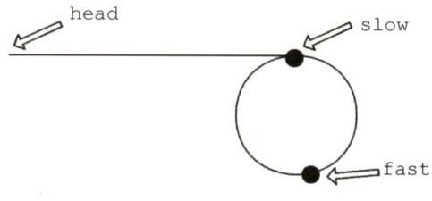  

如下图所示，设头结点到环的入口点的距离为a，环的入口点沿着环的方向到相遇点的距离为 $\mathbf{x}$ ，环长为 $\mathrm{~\boldmath~{~\underline{~}{~r~}~}~}$ ，相遇时fast绕过了n圈。  

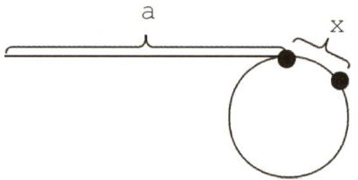  

则有 $2(a+x)=a+n^{\star}x+x$ ，即 $\mathsf{a}{=}\mathsf{n}^{\star}\mathtt{r}{-}\mathtt{x}$ 。显然从头结点到环的入口点的距离等于n倍的环长减去环的入口点到相遇点的距离。因此可设置两个指针，一个指向 head，一个指向相遇点，两个指针同步移动(均为一次走一步)，相遇点即为环的入口点。  

2）本题代码如下：  

LNode\* FindLoopStart(LNode \*head){LNode \*fast $\c=$ head,\*slow $\L=$ head; //设置快慢两个指针while(fast! $\c=$ NULL&&fast->next! $\c=$ NULL)slow $\c=$ slow->next; //每次走一步fast $\c=$ fast->next->next; //每次走两步if（slow $\scriptstyle==$ fast)break; //相遇}if(slow $\scriptstyle==$ NULL||fast->next $\scriptstyle==$ NULL)return NULL; //没有环，返回NULLLNode $\star_{\mathsf{P}}\mathsf{1}=$ head, $\star_{\mathrm{{p}}2}=$ slow; //分别指向开始点、相遇点while $p1:1=p2$ ）{$_{\mathtt{p l}=\mathtt{p l}->}$ next;$\scriptstyle\mathrm{p}2=\mathrm{p}2\rightarrow$ next;广return pl; //返回入口点  

3）当fast与slow相遇时，slow 肯定没有遍历完链表，故算法的时间复杂度为 $O(n)$ ，空间复杂度为 $O(1)$ 。  

22.【解答】  

1）算法的基本设计思想如下：  

问题的关键是设计一个尽可能高效的算法，通过链表的一次遍历，找到倒数第k个结点的位置。算法的基本设计思想是：定义两个指针变量p和q，初始时均指向头结点的下一个结点（链表的第一个结点)，p指针沿链表移动；当p指针移动到第 $\mathbf{k}$ 个结点时，q指针开始与p指针同步移动；当p指针移动到最后一个结点时，q指针所指示结点为倒数第 $\mathbf{k}$ 个结点。以上过程对链表仅进行一遍扫描。  

2）算法的详细实现步骤如下：  

$\textcircled{1}$ count $=0$ ，p和q指向链表表头结点的下一个结点。  

$\textcircled{2}$ 若p为空，转 $\textcircled{5}$ o  

$\textcircled{3}$ 若count 等于 $\mathbf{k}$ ，则q指向下一个结点；否则，count $\c=$ count+l。  

$\textcircled{4}$ p指向下一个结点，转 $\textcircled{2}$ o  

$\textcircled{5}$ 若count 等于 $\mathrm{~k~}$ ，则查找成功，输出该结点的data域的值，返回1；否则，说明k值 超过了线性表的长度，查找失败，返回0。  

$\textcircled{6}$ 算法结束。  

3）算法实现如下：  

typedef int ElemType; //链表数据的类型定义 typedef struct LNode{ //链表结点的结构定义 ElemTypedata; //结点数据 struct LNode \*link; //结点链接指针 LNode,\*LinkList; int Search k（LinkList list,intk）{ //查找链表list倒数第 $k$ 个结点，并输出该结点data域的值 LNode $\star_{\mathrm{p=1}}$ ist->link，\*q=list->link;//指针p、q指示第-个结点 int count $=0$ . while(p! $\c=$ NULL){ //遍历链表直到最后一个结点 if（count $<k$ ）count $^{++}$ · //计数，若count<k只移动p else q=q->link; p=p->link; //之后让p、q同步移动 }//while if(count $<k$ ） return 0; //查找失败返回0 else{ //否则打印并返回1 printf（"%d",q->data); return 1; ) //Search_k  

评分说明：若所给出的算法采用一遍扫描方式就能得到正确结果，可给满分15分；若采用两遍或多遍扫描才能得到正确结果，最高分为10分。若采用递归算法得到正确结果，最高给10分;若实现算法的空间复杂度过高（使用了大小与 $\mathrm{~k~}$ 有关的辅助数组)，但结果正确，最高给10分。  

23.【解答】  

本题的结构体是单链表，采用双指针法。用指针p、q分别扫描strl和 str2，当p、q指向同一个地址时，即找到共同后缀的起始位置。  

1）算法的基本设计思想如下：  

$\textcircled{1}$ 分别求出 strl和str2 所指的两个链表的长度 $m$ 和 $n$ 。  
$\textcircled{2}$ 将两个链表以表尾对齐：令指针p、q分别指向 strl和str2的头结点，若 $m\geq n$ ，则指针p先走，使p指向链表中的第 $m-n+1$ 个结点；若 $m<n$ ，则使q指向链表中的第$n-m+1$ 个结点，即使指针p和 $\mathbf{q}$ 所指的结点到表尾的长度相等。  
$\textcircled{3}$ 反复将指针 $\mathrm{~\tt~{~p~}~}$ 和 $\mathtt{q}$ 同步向后移动，当p、 $\mathtt{q}$ 指向同一位置时停止，即为共同后缀的起始位置，算法结束。  

2）本题代码如下：  

typedef struct Node{char data;struct Node \*next;  
SNode;  
/\*求链表长度的函数\*/  
int listlen(SNode \*head){intlen $=0$ .while(head->next! $\c=$ NULL){len++;head=head->next;身return len;  
/\*找出共同后缀的起始地址\*/  
SNode\* find_addr（sNode \*strl,sNode \*str2){int m,n;SNode \*p,\*q;${\mathfrak{m}}=$ listlen(strl); //求strl的长度$\mathrm{\Delta}\mathrm{n}{=}$ listlen(str2); //求str2的长度for $\scriptstyle{\mathrm{p}}=$ strl;m>n;m--) //若m>n，使p指向链表中的第 $\mathtt{m-n+1}$ 个结点$\scriptstyle\mathtt{p}=\mathtt{p}$ ->next;for $\mathtt{q}=$ str2;m<n;n--) //若 $\scriptstyle{\mathrm{m}}<{\mathrm{n}}$ ，使q指向链表中的第 $\mathrm{n-m}+1$ 个结点q=q->next;while(p->next! $\c=$ NULL&&p->next! $\O=$ q->next）{//将指针p和q同步向后移动p=p->next;q=q->next;}//whilereturn p->next; //返回共同后缀的起始地址  

3）时间复杂度为 $O(\mathrm{len}1\mathrm{~+~}\mathrm{len}2$ 或O(max(lenl，len2))，其中lenl、len2分别为两个链表的长度。  

24.【解答】  

1）算法的基本设计思想：  

·算法的核心思想是用空间换时间。使用辅助数组记录链表中已出现的数值，从而只需对链表进行一趟扫描。  
·因为|data $|\leq n$ ，故辅助数组q的大小为 $n+1$ ，各元素的初值均为0。依次扫描链表中的各结点，同时检查q[ldata｜]的值，若为0则保留该结点，并令q[ldata $\mid\mathbf{\boldsymbol{\mathbf{\mathit{\sigma}}}}\right\vert\mathbf{\boldsymbol{\mathbf{\mathit{\varepsilon}}}}\left.\mid\mathbf{\boldsymbol{\mathbf{\mathit{\varepsilon}}}}\right\vert=1$ ；否则将该结点从链表中删除。  

2）使用C语言描述的单链表结点的数据类型定义：  

typedef struct node { int data; struct node \*link;   
}NODE;   
Typedef NODE \*PNODE;  

3）算法实现如下：  

void func (PNODE h,int n）{PNODE $p{=}h$ ,r;int $\star_{\sf q,\sf m}$ $\mathtt{q}=$ (int $\star$ )malloc(sizeof（int) $^{\star}\left(\mathrm{n}{+}1\right)$ ）；//申请 $n+1$ 个位置的辅助空间for(int $\dot{\mathsf{1}}=0$ · $\mathrm{i}<n+1$ 、 $\dot{2}++$ ） //数组元素初值置0$\star(a+i)=0$ .while $\Theta^{->1}$ ink! $\c=$ NULL){m=p->link->data>0?p->link->data:-p->link->data;if $\star(\mathsf{q}+\mathsf{m})==0$ ）{ //判断该结点的data是否已出现过$+(9+m)=1$ . //首次出现$p=p->1$ ink; //保留  

<html><body><table><tr><td>else{ r=p->link; p->link=r->link; free(r); free(q);</td><td>//重复出现 //删除</td></tr></table></body></html>  

4）参考答案所给算法的时间复杂度为 $O(m)$ ，空间复杂度为 $O(n)$ 0  

25.【解答】  

1）算法的基本设计思想  

先观察 $L=(a_{1},a_{2},a_{3},\cdots,a_{n-2},a_{n-1},a_{n})$ 和 $L^{\prime}=(a_{1},a_{n},a_{2},a_{n-1},a_{3},a_{n-2},\cdots)$ ，发现 $L^{\prime}$ 是由 $L$ 摘取第一个元素，再摘取倒数第一个元素…·依次合并而成的。为了方便链表后半段取元素，需要先将$L$ 后半段原地逆置［题目要求空间复杂度为 $O(1)$ ，不能借助栈]，否则每取最后一个结点都需要遍历一次链表。 $\textcircled{1}$ 先找出链表 $L$ 的中间结点，为此设置两个指针p和 $\mathtt{q}$ ，指针 $\mathrm{~\tt~p~}{}$ 每次走一步，指针q每次走两步，当指针 $\mathtt{q}$ 到达链尾时，指针p正好在链表的中间结点； $\textcircled{2}$ 然后将 $L$ 的后半段结点原地逆置。 $\textcircled{3}$ 从单链表前后两段中依次各取一个结点，按要求重排。  

2）算法实现  

void change_list(NODE $^{\star}\mathrm{h}$ ）NODE $\star_{\mathbb{P}},\star_{\mathbb{q}},\star_{\mathbb{r}},\star_{\mathbb{s}};$ $P=q=h$ .while(q->next! $\c=$ NULL){ //寻找中间结点$\scriptstyle\mathtt{p}=\mathtt{p}\to $ next; //p走一步q=q->next;if(q->next! $\c=$ NULL) $\scriptstyle\mathbf{q}=$ q->next; //g走两步1q=p->next; //p所指结点为中间结点，q为后半段链表的首结点p->next $\c=$ NULL;while(q! $\c=$ NULL){ //将链表后半段逆置$\scriptstyle{\underline{{\mathbf{r}}}}=$ q->next;q->next=p->next;p->next $=\mathtt{q}$ ：$\mathtt{q}=\mathtt{r}$ }s=h->next; //s指向前半段的第一个数据结点，即插入点q=p->next; //q指向后半段的第一个数据结点p->next $\c=$ NULL;while(q! $\c=$ NULL) //将链表后半段的结点插入到指定位置$\scriptstyle{\underline{{r}}}=$ q->next; //r指向后半段的下一个结点q->next $\c=$ s->next；//将q所指结点插入到s所指结点之后s->next $=\mathtt{q}$ $\mathbf{\sigma}_{S}=\mathbf{\sigma}_{}$ q->next; //s指向前半段的下一个插入点$\scriptstyle{\mathfrak{q}}={\mathfrak{r}}$ ，  

3）第1步找中间结点的时间复杂度为 $O(n)$ ，第2步逆置的时间复杂度为 $O(n)$ ，第3步合并链表的时间复杂度为 $O(n)$ ，所以该算法的时间复杂度为 $O(n)$ 。  

